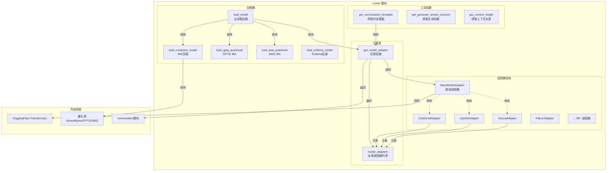
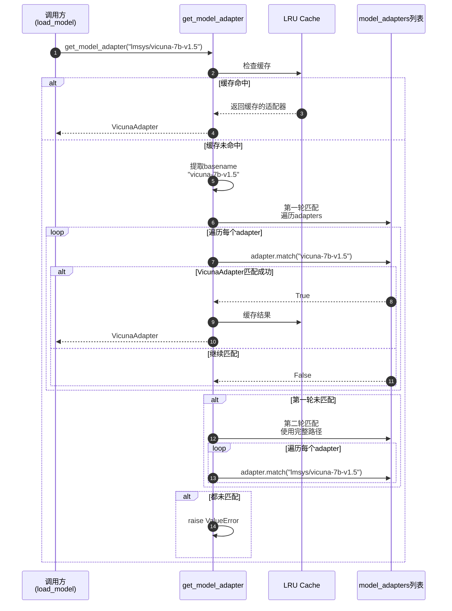

# FastChat-05-model模块-详细分析

## 1. model 模块职责

model 模块是 FastChat 的模型加载与适配层，负责：

- **模型适配器注册**：统一不同模型的加载接口（Vicuna、Llama、ChatGLM 等）
- **模型加载**：支持多种加载方式（FP16、8bit、GPTQ、AWQ）
- **设备适配**：支持多种硬件（CUDA、CPU、MPS、XPU、NPU）
- **量化支持**：集成 bitsandbytes、GPTQ、AWQ 等量化库
- **Conversation 模板匹配**：为不同模型选择合适的对话模板
- **推理函数选择**：根据模型类型选择专用推理函数

---

## 2. 模块架构图



### 图解与要点

**设计模式**：
- **策略模式**：BaseModelAdapter 定义接口，各子类实现特定模型的加载策略
- **注册表模式**：全局 `model_adapters` 列表，运行时动态匹配
- **工厂模式**：`load_model()` 根据参数选择不同的加载方式

**匹配优先级**：
1. 注册顺序决定匹配优先级（先注册的优先）
2. 先匹配 basename（如 "vicuna-7b-v1.5"）
3. 再匹配完整路径（如 "/path/to/vicuna-7b-v1.5"）
4. 最后使用 BaseModelAdapter（兜底）

**扩展性**：
- 新增模型仅需实现 `BaseModelAdapter` 并注册
- 支持运行时动态注册（无需修改核心代码）

---

## 3. 核心数据结构

### 3.1 BaseModelAdapter 基类

```python
class BaseModelAdapter:
    """所有模型适配器的基类"""
    
    use_fast_tokenizer = True  # 是否使用fast tokenizer
    
    def match(self, model_path: str) -> bool:
        """
        判断是否匹配该适配器
        
        Args:
            model_path: 模型路径或HF模型ID
            
        Returns:
            True表示匹配，False表示不匹配
        """
        return True  # 基类匹配所有（兜底）
    
    def load_model(self, model_path: str, from_pretrained_kwargs: dict):
        """
        加载模型和tokenizer
        
        Args:
            model_path: 模型路径
            from_pretrained_kwargs: 传递给from_pretrained的参数
            
        Returns:
            (model, tokenizer) 元组
        """
        revision = from_pretrained_kwargs.get("revision", "main")
        
        # 加载tokenizer
        try:
            tokenizer = AutoTokenizer.from_pretrained(
                model_path,
                use_fast=self.use_fast_tokenizer,
                revision=revision,
                trust_remote_code=True,
            )
        except TypeError:
            tokenizer = AutoTokenizer.from_pretrained(
                model_path, use_fast=False, revision=revision, trust_remote_code=True
            )
        
        # 加载模型
        try:
            model = AutoModelForCausalLM.from_pretrained(
                model_path,
                low_cpu_mem_usage=True,
                trust_remote_code=True,
                **from_pretrained_kwargs,
            )
        except NameError:
            model = AutoModel.from_pretrained(
                model_path,
                low_cpu_mem_usage=True,
                trust_remote_code=True,
                **from_pretrained_kwargs,
            )
        
        return model, tokenizer
    
    def load_compress_model(self, model_path, device, torch_dtype, revision="main"):
        """
        加载8bit压缩模型
        
        使用bitsandbytes库进行8bit量化，显存减半
        """
        return load_compress_model(
            model_path,
            device,
            torch_dtype,
            use_fast=self.use_fast_tokenizer,
            revision=revision,
        )
    
    def get_default_conv_template(self, model_path: str) -> Conversation:
        """
        获取默认对话模板
        
        Returns:
            Conversation对象，定义对话格式
        """
        return get_conv_template("one_shot")
```

**字段说明**：

| 字段 | 类型 | 说明 |
|---|---|---|
| use_fast_tokenizer | bool | 是否使用 Rust 实现的 fast tokenizer（速度更快） |

**方法说明**：

| 方法 | 职责 | 关键点 |
|---|---|---|
| match() | 判断是否匹配 | 通过模型路径特征（如包含 "vicuna"）判断 |
| load_model() | 加载模型 | 调用 HuggingFace Transformers 加载 |
| load_compress_model() | 加载8bit模型 | 使用 bitsandbytes 量化 |
| get_default_conv_template() | 获取对话模板 | 返回适合该模型的 Conversation 模板 |

---

### 3.2 具体适配器示例

#### VicunaAdapter

```python
class VicunaAdapter(BaseModelAdapter):
    """Vicuna 模型适配器"""
    
    def match(self, model_path: str):
        # 匹配包含 "vicuna" 的路径（不区分大小写）
        return "vicuna" in model_path.lower()
    
    def load_model(self, model_path: str, from_pretrained_kwargs: dict):
        # 特殊处理：Vicuna 13B/33B 需要更多显存
        revision = from_pretrained_kwargs.get("revision", "main")
        tokenizer = AutoTokenizer.from_pretrained(
            model_path,
            use_fast=self.use_fast_tokenizer,
            revision=revision,
            trust_remote_code=True,
        )
        model = AutoModelForCausalLM.from_pretrained(
            model_path,
            low_cpu_mem_usage=True,
            **from_pretrained_kwargs,
        )
        return model, tokenizer
    
    def get_default_conv_template(self, model_path: str) -> Conversation:
        # 根据版本选择不同模板
        if "v0" in model_path.lower():
            return get_conv_template("one_shot")
        return get_conv_template("vicuna_v1.1")
```

#### Llama2Adapter

```python
class Llama2Adapter(BaseModelAdapter):
    """Llama 2 模型适配器"""
    
    def match(self, model_path: str):
        # 匹配 Llama 2 但排除 Llama 1
        return "llama-2" in model_path.lower()
    
    def get_default_conv_template(self, model_path: str) -> Conversation:
        # Llama 2 使用专用模板（带 [INST] 标签）
        return get_conv_template("llama-2")
```

#### ChatGLMAdapter

```python
class ChatGLMAdapter(BaseModelAdapter):
    """ChatGLM 模型适配器"""
    
    use_fast_tokenizer = False  # ChatGLM 不支持 fast tokenizer
    
    def match(self, model_path: str):
        return "chatglm" in model_path.lower()
    
    def load_model(self, model_path: str, from_pretrained_kwargs: dict):
        # ChatGLM 需要特殊加载方式
        tokenizer = AutoTokenizer.from_pretrained(
            model_path,
            trust_remote_code=True,
        )
        model = AutoModel.from_pretrained(
            model_path,
            trust_remote_code=True,
            **from_pretrained_kwargs,
        ).half()  # ChatGLM 默认使用 FP16
        return model, tokenizer
    
    def get_default_conv_template(self, model_path: str) -> Conversation:
        return get_conv_template("chatglm")
```

---

## 4. 核心 API 详解

### 4.1 `load_model()` - 主加载函数

#### 函数签名

```python
def load_model(
    model_path: str,              # 模型路径或HF ID
    device: str = "cuda",         # 设备类型
    num_gpus: int = 1,            # GPU数量（模型并行）
    max_gpu_memory: Optional[str] = None,  # 每张GPU最大显存
    dtype: Optional[torch.dtype] = None,   # 数据类型
    load_8bit: bool = False,      # 8bit量化
    cpu_offloading: bool = False, # CPU卸载
    gptq_config: Optional[GptqConfig] = None,  # GPTQ配置
    awq_config: Optional[AWQConfig] = None,    # AWQ配置
    exllama_config: Optional[ExllamaConfig] = None,  # Exllama配置
    xft_config: Optional[XftConfig] = None,    # xFasterTransformer配置
    revision: str = "main",       # HF模型版本
    debug: bool = False,          # 调试模式
) -> Tuple[torch.nn.Module, PreTrainedTokenizer]:
    """加载模型并返回模型和tokenizer"""
```

#### 加载流程图

```mermaid
flowchart TD
    Start[开始] --> GetAdapter[1. 获取适配器]
    GetAdapter --> CheckDevice[2. 检查设备类型]
    
    CheckDevice --> DeviceCUDA{设备==cuda?}
    DeviceCUDA -->|是| SetupCUDA[设置CUDA参数<br/>torch.float16]
    DeviceCUDA -->|否| CheckCPU{设备==cpu?}
    
    CheckCPU -->|是| SetupCPU[设置CPU参数<br/>torch.float32]
    CheckCPU -->|否| CheckMPS{设备==mps?}
    
    CheckMPS -->|是| SetupMPS[设置MPS参数<br/>torch.float16]
    CheckMPS -->|否| CheckXPU{设备==xpu?}
    
    CheckXPU -->|是| SetupXPU[设置XPU参数<br/>torch.bfloat16]
    CheckXPU -->|否| SetupNPU[设置NPU参数<br/>torch.float16]
    
    SetupCUDA --> CheckQuant{检查量化方式}
    SetupCPU --> CheckQuant
    SetupMPS --> CheckQuant
    SetupXPU --> CheckQuant
    SetupNPU --> CheckQuant
    
    CheckQuant --> Is8bit{load_8bit?}
    Is8bit -->|是| Load8bit[调用load_compress_model]
    Is8bit -->|否| IsGPTQ{gptq_config?}
    
    IsGPTQ -->|是| LoadGPTQ[调用load_gptq_quantized]
    IsGPTQ -->|否| IsAWQ{awq_config?}
    
    IsAWQ -->|是| LoadAWQ[调用load_awq_quantized]
    IsAWQ -->|否| IsExllama{exllama_config?}
    
    IsExllama -->|是| LoadExllama[调用load_exllama_model]
    IsExllama -->|否| LoadStandard[标准加载<br/>adapter.load_model]
    
    Load8bit --> PostProcess[3. 后处理]
    LoadGPTQ --> PostProcess
    LoadAWQ --> PostProcess
    LoadExllama --> PostProcess
    LoadStandard --> PostProcess
    
    PostProcess --> DeviceMap{num_gpus>1?}
    DeviceMap -->|是| MultiGPU[模型并行<br/>device_map='auto']
    DeviceMap -->|否| SingleGPU[单GPU<br/>model.to(device)]
    
    MultiGPU --> Return[返回model,tokenizer]
    SingleGPU --> Return
```

#### 核心代码分析

**步骤 1：获取适配器**

```python
# 匹配适配器
adapter = get_model_adapter(model_path)
# get_model_adapter内部逻辑：
# 1. 提取basename（如"vicuna-7b-v1.5"）
# 2. 遍历model_adapters，调用adapter.match(basename)
# 3. 匹配则返回adapter，否则继续匹配完整路径
# 4. 都不匹配则抛出ValueError
```

**步骤 2：设备适配**

```python
if device == "cuda":
    kwargs = {"torch_dtype": torch.float16}
    
    # 多GPU模型并行
    if num_gpus != 1:
        kwargs["device_map"] = "auto"
        
        # 自动计算显存分配
        if max_gpu_memory is None:
            available_gpu_memory = get_gpu_memory(num_gpus)
            kwargs["max_memory"] = {
                i: str(int(available_gpu_memory[i] * 0.85)) + "GiB"
                for i in range(num_gpus)
            }
        else:
            kwargs["max_memory"] = {i: max_gpu_memory for i in range(num_gpus)}

elif device == "cpu":
    kwargs = {"torch_dtype": torch.float32}
    # Intel CPU加速（可选）
    if CPU_ISA in ["avx512_bf16", "amx"]:
        try:
            import intel_extension_for_pytorch as ipex
            kwargs = {"torch_dtype": torch.bfloat16}
        except ImportError:
            pass

elif device == "mps":  # Apple Silicon
    kwargs = {"torch_dtype": torch.float16}
    # 避免MPS backend的in-place操作bug
    replace_llama_attn_with_non_inplace_operations()
```

**步骤 3：量化加载**

```python
# 8bit量化（bitsandbytes）
if load_8bit:
    if num_gpus != 1:
        warnings.warn("8-bit quantization is not supported for multi-gpu inference.")
    else:
        model, tokenizer = adapter.load_compress_model(
            model_path=model_path,
            device=device,
            torch_dtype=kwargs["torch_dtype"],
            revision=revision,
        )
        return model, tokenizer

# 4bit AWQ量化
elif awq_config and awq_config.wbits < 16:
    model, tokenizer = load_awq_quantized(model_path, awq_config, device)
    # 多GPU分发
    if num_gpus != 1:
        device_map = accelerate.infer_auto_device_map(
            model,
            max_memory=kwargs["max_memory"],
            no_split_module_classes=["LlamaDecoderLayer"],
        )
        model = accelerate.dispatch_model(model, device_map=device_map)
    else:
        model.to(device)
    return model, tokenizer

# 4bit GPTQ量化
elif gptq_config and gptq_config.wbits < 16:
    model, tokenizer = load_gptq_quantized(model_path, gptq_config)
    # 类似AWQ的多GPU处理
    ...
    return model, tokenizer
```

**步骤 4：标准加载**

```python
# 调用适配器的load_model方法
model, tokenizer = adapter.load_model(model_path, kwargs)

# 单GPU移动到目标设备
if (device == "cuda" and num_gpus == 1) or device in ("mps", "xpu", "npu"):
    model.to(device)

# Intel XPU优化
if device == "xpu":
    model = torch.xpu.optimize(model, dtype=kwargs["torch_dtype"], inplace=True)

return model, tokenizer
```

#### 参数详解

| 参数 | 默认值 | 说明 | 示例 |
|---|---|---|---|
| model_path | 必填 | 模型路径或HF ID | `"lmsys/vicuna-7b-v1.5"` |
| device | cuda | 设备类型 | `"cuda"`, `"cpu"`, `"mps"`, `"xpu"`, `"npu"` |
| num_gpus | 1 | GPU数量 | `2`（跨2张GPU模型并行） |
| max_gpu_memory | None | 每张GPU最大显存 | `"20GiB"`（每张GPU最多20GB） |
| dtype | None | 数据类型 | `torch.float16`, `torch.bfloat16` |
| load_8bit | False | 8bit量化 | `True`（显存减半） |
| cpu_offloading | False | CPU卸载 | `True`（需配合load_8bit） |
| gptq_config | None | GPTQ配置 | `GptqConfig(wbits=4, groupsize=128)` |
| awq_config | None | AWQ配置 | `AWQConfig(wbits=4)` |
| revision | "main" | HF模型版本 | `"v1.5"`（分支或标签） |

#### 边界与异常

| 异常 | 触发条件 | 处理方式 |
|---|---|---|
| ValueError | 无匹配适配器 | 抛出异常，提示不支持该模型 |
| CUDA OOM | 显存不足 | 建议启用量化或减少num_gpus |
| ImportError | 缺少依赖库 | 提示安装相应库（如bitsandbytes） |
| 权限错误 | HF模型未授权 | 提示登录HuggingFace Hub |

---

### 4.2 `get_model_adapter()` - 适配器匹配

#### 函数实现

```python
@cache  # 缓存结果，避免重复匹配
def get_model_adapter(model_path: str) -> BaseModelAdapter:
    """
    根据model_path匹配适配器
    
    匹配规则：
    1. 提取basename（如"/path/to/vicuna-7b" -> "vicuna-7b"）
    2. 遍历model_adapters，优先匹配basename
    3. 如果basename未匹配，再尝试匹配完整路径
    4. 都不匹配则抛出ValueError
    """
    model_path_basename = os.path.basename(os.path.normpath(model_path))
    
    # 第一轮：匹配basename（排除BaseModelAdapter）
    for adapter in model_adapters:
        if adapter.match(model_path_basename) and type(adapter) != BaseModelAdapter:
            return adapter
    
    # 第二轮：匹配完整路径
    for adapter in model_adapters:
        if adapter.match(model_path):
            return adapter
    
    raise ValueError(f"No valid model adapter for {model_path}")
```

#### 匹配时序图



#### 匹配优先级

由于注册顺序决定优先级，FastChat 的注册顺序为：

```python
# fastchat/model/model_adapter.py (末尾)
register_model_adapter(PeftModelAdapter)      # 最高优先级（LoRA模型）
register_model_adapter(StableVicunaAdapter)
register_model_adapter(VicunaAdapter)
register_model_adapter(LongChatAdapter)
...
register_model_adapter(Llama2Adapter)
...
register_model_adapter(BaseModelAdapter)      # 最低优先级（兜底）
```

**示例**：
- `"vicuna-7b-v1.5"` → 匹配 `VicunaAdapter`（包含 "vicuna"）
- `"llama-2-7b"` → 匹配 `Llama2Adapter`（包含 "llama-2"）
- `"my-custom-model"` → 匹配 `BaseModelAdapter`（兜底）

---

### 4.3 `get_conversation_template()` - 获取对话模板

#### 函数实现

```python
def get_conversation_template(model_path: str) -> Conversation:
    """
    根据模型路径获取对话模板
    
    Args:
        model_path: 模型路径或HF ID
        
    Returns:
        Conversation对象，封装对话格式
    """
    adapter = get_model_adapter(model_path)
    return adapter.get_default_conv_template(model_path)
```

#### 对话模板示例

**Vicuna 模板**（vicuna_v1.1）：
```
A chat between a curious user and an artificial intelligence assistant. The assistant gives helpful, detailed, and polite answers to the user's questions.

USER: Hello!
ASSISTANT: Hi there! How can I help you today?
USER: What's the weather?
ASSISTANT:
```

**Llama 2 模板**（llama-2）：
```
<s>[INST] <<SYS>>
You are a helpful, respectful and honest assistant.
<</SYS>>

Hello! [/INST] Hi there! How can I help you today? </s><s>[INST] What's the weather? [/INST]
```

---

### 4.4 `get_generate_stream_function()` - 获取推理函数

#### 函数实现

```python
def get_generate_stream_function(model: torch.nn.Module, model_path: str):
    """
    根据模型类型选择专用推理函数
    
    不同模型可能需要不同的生成逻辑（如ChatGLM、Falcon）
    """
    model_type = str(type(model)).lower()
    
    # 检查模型类型
    is_chatglm = "chatglm" in model_type
    is_falcon = "rwforcausallm" in model_type
    is_codet5p = "codet5p" in model_type
    is_exllama = "exllama" in model_type
    is_xft = "xft" in model_type
    is_yuan = "yuan" in model_type
    is_cllm = "consistency-llm" in model_path.lower()
    
    # 返回专用生成函数
    if is_chatglm:
        return generate_stream_chatglm
    elif is_falcon:
        return generate_stream_falcon
    elif is_codet5p:
        return generate_stream_codet5p
    elif is_exllama:
        return generate_stream_exllama
    elif is_xft:
        return generate_stream_xft
    elif is_yuan:
        return generate_stream_yuan2
    elif is_cllm:
        return generate_stream_cllm
    else:
        # 默认生成函数（适用于大多数模型）
        return generate_stream
```

**专用生成函数列表**：

| 模型 | 生成函数 | 特殊之处 |
|---|---|---|
| ChatGLM | generate_stream_chatglm | 使用模型自带的stream_chat方法 |
| Falcon | generate_stream_falcon | 特殊的attention mask处理 |
| CodeT5+ | generate_stream_codet5p | Seq2Seq模型，需encoder-decoder |
| Exllama | generate_stream_exllama | 使用Exllama库加速 |
| xFasterTransformer | generate_stream_xft | 使用xFT库加速 |
| Yuan2 | generate_stream_yuan2 | 浪潮Yuan2模型专用 |
| CLLM | generate_stream_cllm | 一致性大模型专用 |
| 其他 | generate_stream | 通用Transformers生成 |

---

## 5. 量化支持详解

### 5.1 8bit 量化（bitsandbytes）

**原理**：使用 bitsandbytes 库进行动态8bit量化，权重存储为8bit，计算时动态反量化为FP16。

**优势**：
- 显存减半
- 精度损失 < 1%
- 支持 CPU offloading

**使用方式**：

```python
model, tokenizer = load_model(
    "lmsys/vicuna-13b-v1.5",
    load_8bit=True,
    device="cuda",
)
```

**实现细节**：

```python
def load_compress_model(model_path, device, torch_dtype, use_fast, revision):
    """加载8bit压缩模型"""
    # 使用bitsandbytes的LLM.int8()
    from transformers import BitsAndBytesConfig
    
    quantization_config = BitsAndBytesConfig(
        load_in_8bit=True,
        llm_int8_threshold=6.0,  # 异常值阈值
    )
    
    model = AutoModelForCausalLM.from_pretrained(
        model_path,
        quantization_config=quantization_config,
        device_map="auto" if device == "cuda" else None,
        torch_dtype=torch_dtype,
    )
    
    tokenizer = AutoTokenizer.from_pretrained(
        model_path,
        use_fast=use_fast,
        revision=revision,
    )
    
    return model, tokenizer
```

---

### 5.2 4bit GPTQ 量化

**原理**：预量化模型权重为4bit，推理时直接使用量化权重，显存降至1/4。

**优势**：
- 显存降至 25%
- 精度损失 2-3%
- 推理速度略快（GPU利用率更高）

**前提**：需要预量化的 GPTQ 模型（如 TheBloke 发布的模型）

**使用方式**：

```python
from fastchat.modules.gptq import GptqConfig

model, tokenizer = load_model(
    "TheBloke/vicuna-13B-v1.5-GPTQ",
    gptq_config=GptqConfig(
        wbits=4,         # 4bit量化
        groupsize=128,   # 分组大小
        act_order=True,  # 激活重排序
    ),
)
```

---

### 5.3 4bit AWQ 量化

**原理**：Activation-aware Weight Quantization，考虑激活分布的4bit量化，精度优于GPTQ。

**优势**：
- 显存降至 25%
- 精度损失 1-2%（优于GPTQ）
- 支持更大的batch size

**使用方式**：

```python
from fastchat.modules.awq import AWQConfig

model, tokenizer = load_model(
    "TheBloke/vicuna-13B-v1.5-AWQ",
    awq_config=AWQConfig(wbits=4),
)
```

---

## 6. 扩展新模型

### 6.1 实现自定义适配器

```python
from fastchat.model.model_adapter import BaseModelAdapter, register_model_adapter
from fastchat.conversation import get_conv_template

class MyCustomAdapter(BaseModelAdapter):
    """自定义模型适配器"""
    
    def match(self, model_path: str):
        """
        匹配逻辑：检查路径中是否包含 "my-custom-model"
        """
        return "my-custom-model" in model_path.lower()
    
    def load_model(self, model_path: str, from_pretrained_kwargs: dict):
        """
        自定义加载逻辑
        
        如果模型需要特殊配置，可以在此处理
        """
        # 例如：自定义配置
        from transformers import AutoConfig
        
        config = AutoConfig.from_pretrained(model_path)
        config.my_custom_param = "value"  # 自定义参数
        
        from_pretrained_kwargs["config"] = config
        
        # 调用基类方法
        return super().load_model(model_path, from_pretrained_kwargs)
    
    def get_default_conv_template(self, model_path: str):
        """
        自定义对话模板
        
        可以复用现有模板或定义新模板
        """
        return get_conv_template("vicuna_v1.1")  # 复用Vicuna模板

# 注册适配器（在文件末尾或单独的配置文件中）
register_model_adapter(MyCustomAdapter)
```

### 6.2 使用自定义模型

```python
# Worker启动时自动加载自定义适配器
python3 -m fastchat.serve.model_worker \
    --model-path /path/to/my-custom-model \
    --controller http://localhost:21001

# 或在代码中使用
from fastchat.model.model_adapter import load_model

model, tokenizer = load_model("/path/to/my-custom-model")
```

---

## 7. 性能优化技巧

### 7.1 选择合适的量化方式

| 场景 | 推荐方式 | 理由 |
|---|---|---|
| 显存充足 | FP16 | 最佳精度和速度 |
| 显存略紧张 | 8bit | 精度损失小，兼容性好 |
| 显存极度紧张 | AWQ/GPTQ 4bit | 显存最省，AWQ精度更好 |
| 超大模型 | 8bit + CPU offloading | 牺牲速度换显存 |

### 7.2 多GPU模型并行

```python
# 13B模型跨2张GPU
model, tokenizer = load_model(
    "lmsys/vicuna-13b-v1.5",
    num_gpus=2,
    max_gpu_memory="20GiB",  # 每张GPU最多20GB
)

# 自动显存分配
# GPU 0: ~10GB (embedding + 前半部分层)
# GPU 1: ~10GB (后半部分层 + lm_head)
```

### 7.3 设备选择优化

```python
# 优先级：CUDA > XPU > MPS > CPU
if torch.cuda.is_available():
    device = "cuda"
elif hasattr(torch, 'xpu') and torch.xpu.is_available():
    device = "xpu"
elif torch.backends.mps.is_available():
    device = "mps"
else:
    device = "cpu"

model, tokenizer = load_model(model_path, device=device)
```

---

## 8. 故障排查

### 8.1 模型加载失败

**症状**：`ValueError: No valid model adapter for xxx`

**原因**：无匹配的适配器

**解决方案**：
1. 检查model_path拼写
2. 使用BaseModelAdapter兜底（通常会自动兜底）
3. 实现自定义适配器

---

### 8.2 显存不足

**症状**：`RuntimeError: CUDA out of memory`

**解决方案**：
```python
# 方案1：8bit量化
load_model(model_path, load_8bit=True)

# 方案2：4bit量化（需预量化模型）
load_model(model_path, gptq_config=GptqConfig(wbits=4))

# 方案3：模型并行
load_model(model_path, num_gpus=2)

# 方案4：CPU卸载（最慢）
load_model(model_path, load_8bit=True, cpu_offloading=True)
```

---

## 9. 扩展阅读

- **FastChat-03-serve模块-ModelWorker详细分析.md**：Worker如何调用model模块
- **FastChat-08-conversation模块.md**：对话模板详解
- **FastChat-04-使用示例与最佳实践.md**：量化实战

---

## 附录：支持的模型列表（部分）

| 模型系列 | 适配器 | 对话模板 |
|---|---|---|
| Vicuna | VicunaAdapter | vicuna_v1.1 |
| Llama 2 | Llama2Adapter | llama-2 |
| Llama 3 | Llama3Adapter | llama-3 |
| ChatGLM | ChatGLMAdapter | chatglm |
| Falcon | FalconAdapter | falcon |
| Baichuan | BaichuanAdapter | baichuan-chat |
| Qwen | QwenChatAdapter | qwen-7b-chat |
| Mistral | MistralAdapter | mistral |
| Yi | YiAdapter | Yi-34b-chat |
| DeepSeek | DeepseekChatAdapter | deepseek-chat |
| ... | ... | ... |

完整列表见：`fastchat/model/model_adapter.py`（2500+ 行代码，80+ 适配器）

