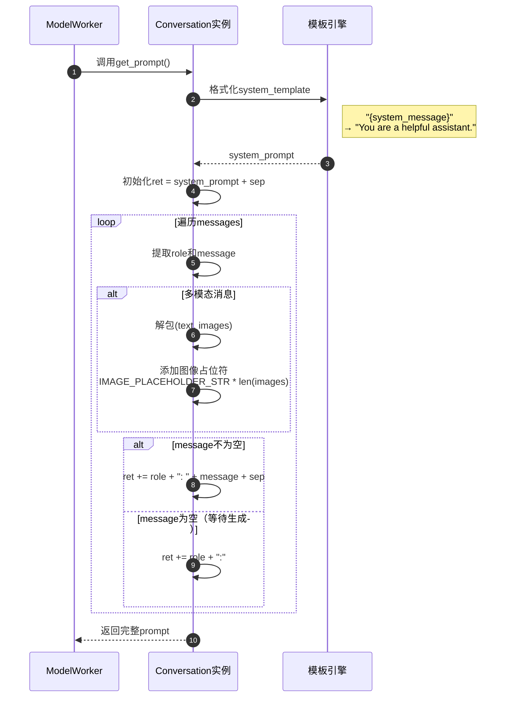

# FastChat-06-conversation模块-详细分析

## 1. conversation 模块职责

conversation 模块负责管理对话历史与提示词模板，核心功能包括：

- **对话模板定义**：为不同模型定义专用的 prompt 格式
- **对话历史管理**：维护多轮对话的上下文
- **Prompt 构建**：根据模板和历史生成完整 prompt
- **特殊标记处理**：处理系统消息、角色标签、分隔符
- **多模态支持**：支持文本 + 图像的对话

---

## 2. 核心数据结构

### 2.1 Conversation 类

```python
@dataclasses.dataclass
class Conversation:
    """对话对象，封装对话历史与提示词模板"""
    
    # 模板名称（如 "vicuna_v1.1"）
    name: str
    
    # 系统提示词模板（可包含占位符）
    system_template: str = "{system_message}"
    
    # 系统消息内容
    system_message: str = ""
    
    # 视觉模型的系统消息（可选）
    system_message_vision: str = ""
    
    # 角色名称（用户、助手）
    roles: Tuple[str] = ("USER", "ASSISTANT")
    
    # 对话历史：List[[role, message]]
    # message 可以是 str 或 (str, List[image_url])
    messages: List[List[str]] = ()
    
    # Few-shot 示例数量（跳过前N条消息）
    offset: int = 0
    
    # 分隔符样式
    sep_style: SeparatorStyle = SeparatorStyle.ADD_COLON_SINGLE
    
    # 主分隔符
    sep: str = "\n"
    
    # 次分隔符（某些样式需要）
    sep2: str = None
    
    # 停止词（生成遇到时终止）
    stop_str: Union[str, List[str]] = None
    
    # 停止token ID列表
    stop_token_ids: List[int] = None
    
    # 最大图像大小（MB）
    max_image_size_mb: int = None
```

**字段说明**：

| 字段 | 类型 | 说明 | 示例 |
|---|---|---|---|
| name | str | 模板唯一标识 | `"vicuna_v1.1"` |
| system_template | str | 系统提示词模板 | `"{system_message}"` |
| system_message | str | 系统消息内容 | `"You are a helpful assistant."` |
| roles | Tuple[str] | 角色名称 | `("USER", "ASSISTANT")` |
| messages | List[List] | 对话历史 | `[["USER", "Hello"], ["ASSISTANT", "Hi!"]]` |
| offset | int | Few-shot 偏移 | `0`（无示例），`2`（跳过前2条） |
| sep_style | SeparatorStyle | 分隔符风格 | `ADD_COLON_SINGLE` |
| sep | str | 主分隔符 | `"\n"`, `"</s>"` |
| sep2 | str | 次分隔符 | `"</s>"`（Llama 2） |
| stop_str | str/List[str] | 停止词 | `"</s>"`, `["###", "---"]` |
| stop_token_ids | List[int] | 停止token ID | `[2, 32000]` |

---

### 2.2 SeparatorStyle 枚举

```python
class SeparatorStyle(IntEnum):
    """分隔符样式枚举"""
    
    ADD_COLON_SINGLE = auto()      # "USER: xxx\nASSISTANT: yyy\n"
    ADD_COLON_TWO = auto()         # "USER: xxx</s>ASSISTANT: yyy</s>"
    ADD_COLON_SPACE_SINGLE = auto()  # "USER : xxx\nASSISTANT :"
    NO_COLON_SINGLE = auto()       # "USER\nxxx\nASSISTANT\nyyy\n"
    NO_COLON_TWO = auto()          # "USER\nxxx</s>ASSISTANT\nyyy</s>"
    ADD_NEW_LINE_SINGLE = auto()   # "USER\n: xxx\n\nASSISTANT\n: yyy\n\n"
    LLAMA2 = auto()                # "<s>[INST] xxx [/INST] yyy </s>"
    LLAMA3 = auto()                # "<|begin_of_text|>..."
    CHATGLM = auto()               # "[Round 1]\n\n问：xxx\n\n答：yyy\n\n"
    CHATML = auto()                # "<|im_start|>user\nxxx<|im_end|>"
    CHATINTERN = auto()            # "<|User|>:xxx<eoh>\n<|Bot|>:yyy<eoa>\n"
    DOLLY = auto()                 # "### Instruction:\nxxx\n\n### Response:\nyyy\n\n"
    RWKV = auto()                  # "User: xxx\n\nAssistant: yyy\n\n"
    FALCON_CHAT = auto()           # "User: xxx\nAssistant: yyy\n"
    CHATGLM3 = auto()              # "<|user|>\nxxx<|assistant|>\nyyy"
    DEEPSEEK_CHAT = auto()         # "User: xxx\n\nAssistant: yyy<｜end▁of▁sentence｜>"
    GEMMA = auto()                 # "<start_of_turn>user\nxxx<end_of_turn>"
    # ... 更多样式
```

**常用样式详解**：

#### ADD_COLON_SINGLE（Vicuna v0）

```
A chat between a curious user and an artificial intelligence assistant.

USER: Hello, how are you?
ASSISTANT: I'm doing well, thank you!
USER: What's the weather?
ASSISTANT:
```

#### LLAMA2（Llama 2 Chat）

```
<s>[INST] <<SYS>>
You are a helpful, respectful and honest assistant.
<</SYS>>

Hello, how are you? [/INST] I'm doing well, thank you! </s><s>[INST] What's the weather? [/INST]
```

#### CHATML（OpenAI、Qwen）

```
<|im_start|>system
You are a helpful assistant.<|im_end|>
<|im_start|>user
Hello, how are you?<|im_end|>
<|im_start|>assistant
I'm doing well, thank you!<|im_end|>
<|im_start|>user
What's the weather?<|im_end|>
<|im_start|>assistant
```

---

## 3. 核心 API 详解

### 3.1 `get_prompt()` - 构建完整 Prompt

#### 方法签名

```python
def get_prompt(self) -> str:
    """
    根据对话历史和模板生成完整prompt
    
    Returns:
        完整的prompt字符串，可直接送入tokenizer
    """
```

#### 实现逻辑（ADD_COLON_SINGLE）

```python
def get_prompt(self) -> str:
    # 1. 构建系统提示词
    system_prompt = self.system_template.format(system_message=self.system_message)
    
    if self.sep_style == SeparatorStyle.ADD_COLON_SINGLE:
        ret = system_prompt + self.sep
        
        # 2. 遍历对话历史
        for role, message in self.messages:
            if message:
                # 处理多模态消息
                if type(message) is tuple:
                    message, images = message
                    message = IMAGE_PLACEHOLDER_STR * len(images) + message
                
                # 添加角色和消息
                ret += role + ": " + message + self.sep
            else:
                # 空消息（等待生成）
                ret += role + ":"
        
        return ret
```

#### 时序图



#### 示例

**输入**：
```python
conv = Conversation(
    name="vicuna_v1.1",
    system_message="A chat between a curious user and an AI assistant.",
    roles=("USER", "ASSISTANT"),
    messages=[
        ["USER", "Hello!"],
        ["ASSISTANT", "Hi there!"],
        ["USER", "How are you?"],
        ["ASSISTANT", None],  # 待生成
    ],
    sep_style=SeparatorStyle.ADD_COLON_SINGLE,
    sep="\n",
)

prompt = conv.get_prompt()
```

**输出**：
```
A chat between a curious user and an AI assistant.
USER: Hello!
ASSISTANT: Hi there!
USER: How are you?
ASSISTANT:
```

---

### 3.2 `append_message()` - 添加消息

#### 方法签名

```python
def append_message(self, role: str, message: str):
    """
    添加一条消息到对话历史
    
    Args:
        role: 角色名称（如 "USER" 或 "ASSISTANT"）
        message: 消息内容（可为 None 表示待生成）
    """
    self.messages.append([role, message])
```

#### 使用示例

```python
conv = get_conv_template("vicuna_v1.1")

# 用户消息
conv.append_message(conv.roles[0], "Hello!")

# 助手占位符（待生成）
conv.append_message(conv.roles[1], None)

# 生成 prompt
prompt = conv.get_prompt()

# 模型生成后更新
conv.update_last_message("Hi there! How can I help you?")
```

---

### 3.3 `copy()` - 深拷贝对话

#### 方法签名

```python
def copy(self) -> "Conversation":
    """
    创建对话的深拷贝
    
    Returns:
        新的Conversation对象，修改不影响原对象
    """
    return Conversation(
        name=self.name,
        system_template=self.system_template,
        system_message=self.system_message,
        system_message_vision=self.system_message_vision,
        roles=self.roles,
        messages=[[x, y] for x, y in self.messages],  # 深拷贝
        offset=self.offset,
        sep_style=self.sep_style,
        sep=self.sep,
        sep2=self.sep2,
        stop_str=self.stop_str,
        stop_token_ids=self.stop_token_ids,
        max_image_size_mb=self.max_image_size_mb,
    )
```

**重要性**：
- Worker 中每次请求都需要 `copy()`，避免状态污染
- 多线程环境下必须使用独立副本

```python
# ✅ 正确用法
conv = self.conv.copy()  # 每次请求都深拷贝
conv.append_message(conv.roles[0], user_input)
prompt = conv.get_prompt()

# ❌ 错误用法
self.conv.append_message(self.conv.roles[0], user_input)  # 污染全局状态
```

---

### 3.4 `to_openai_api_messages()` - 转换为 OpenAI 格式

#### 方法签名

```python
def to_openai_api_messages(self) -> List[Dict[str, str]]:
    """
    转换为OpenAI API格式的消息列表
    
    Returns:
        [
            {"role": "system", "content": "..."},
            {"role": "user", "content": "..."},
            {"role": "assistant", "content": "..."},
        ]
    """
```

#### 实现

```python
def to_openai_api_messages(self):
    ret = []
    
    # 添加系统消息
    if self.system_message:
        ret.append({"role": "system", "content": self.system_message})
    
    # 转换对话历史
    for role, message in self.messages[self.offset :]:
        if message is not None:
            # 处理多模态消息
            if type(message) is tuple:
                message, images = message
                # OpenAI vision API 格式
                content = [{"type": "text", "text": message}]
                for image_url in images:
                    content.append({
                        "type": "image_url",
                        "image_url": {"url": image_url}
                    })
            else:
                content = message
            
            # 角色映射
            if role == self.roles[0]:
                openai_role = "user"
            elif role == self.roles[1]:
                openai_role = "assistant"
            else:
                openai_role = "system"
            
            ret.append({"role": openai_role, "content": content})
    
    return ret
```

---

## 4. 预定义对话模板

FastChat 内置 80+ 对话模板，常用模板如下：

### 4.1 Vicuna v1.1

```python
conv_vicuna_v1_1 = Conversation(
    name="vicuna_v1.1",
    system_message="A chat between a curious user and an artificial intelligence assistant. "
    "The assistant gives helpful, detailed, and polite answers to the user's questions.",
    roles=("USER", "ASSISTANT"),
    sep_style=SeparatorStyle.ADD_COLON_TWO,
    sep=" ",
    sep2="</s>",
)
```

**示例输出**：
```
A chat between a curious user and an artificial intelligence assistant. The assistant gives helpful, detailed, and polite answers to the user's questions. USER: Hello! ASSISTANT: Hi there!</s>USER: How are you? ASSISTANT:
```

---

### 4.2 Llama 2 Chat

```python
conv_llama_2 = Conversation(
    name="llama-2",
    system_template="[INST] <<SYS>>\n{system_message}\n<</SYS>>\n\n",
    roles=("[INST]", "[/INST]"),
    sep_style=SeparatorStyle.LLAMA2,
    sep=" ",
    sep2=" </s><s>",
)
```

**示例输出**：
```
<s>[INST] <<SYS>>
You are a helpful, respectful and honest assistant.
<</SYS>>

Hello! [/INST] Hi there! </s><s>[INST] How are you? [/INST]
```

---

### 4.3 ChatGLM

```python
conv_chatglm = Conversation(
    name="chatglm",
    roles=("问", "答"),
    sep_style=SeparatorStyle.CHATGLM,
    sep="\n",
)
```

**示例输出**：
```
[Round 1]

问：你好

答：你好！有什么我可以帮助你的吗？

[Round 2]

问：今天天气怎么样？

答：
```

---

### 4.4 ChatML（OpenAI/Qwen）

```python
conv_chatml = Conversation(
    name="chatml",
    system_message="You are a helpful assistant.",
    roles=("user", "assistant"),
    sep_style=SeparatorStyle.CHATML,
    sep="<|im_end|>",
    stop_token_ids=[
        151643,  # <|endoftext|>
        151644,  # <|im_start|>
        151645,  # <|im_end|>
    ],
)
```

**示例输出**：
```
<|im_start|>system
You are a helpful assistant.<|im_end|>
<|im_start|>user
Hello!<|im_end|>
<|im_start|>assistant
Hi there!<|im_end|>
<|im_start|>user
How are you?<|im_end|>
<|im_start|>assistant
```

---

## 5. 多模态支持

### 5.1 图像输入格式

```python
# 添加包含图像的消息
conv.append_message(conv.roles[0], (
    "Describe this image.",
    ["http://example.com/image1.jpg", "http://example.com/image2.jpg"]
))

# get_prompt() 会自动处理
prompt = conv.get_prompt()
# 输出: "USER: $$<image>$$$$<image>$$Describe this image.\nASSISTANT:"
```

### 5.2 图像占位符

```python
IMAGE_PLACEHOLDER_STR = "$$<image>$$"

# 在prompt中，每个图像用占位符表示
# 模型推理时会替换为实际的图像特征
```

---

## 6. 模板注册与查询

### 6.1 注册模板

```python
# 全局模板注册表
conv_templates: Dict[str, Conversation] = {}

def register_conv_template(template: Conversation, override: bool = False):
    """注册对话模板"""
    if not override:
        assert template.name not in conv_templates, f"{template.name} already exists"
    conv_templates[template.name] = template

# 注册示例
register_conv_template(conv_vicuna_v1_1)
register_conv_template(conv_llama_2)
```

### 6.2 查询模板

```python
def get_conv_template(name: str) -> Conversation:
    """
    根据名称获取对话模板（返回副本）
    
    Args:
        name: 模板名称
        
    Returns:
        Conversation对象的副本
    """
    return conv_templates[name].copy()

# 使用示例
conv = get_conv_template("vicuna_v1.1")
conv.append_message(conv.roles[0], "Hello!")
```

---

## 7. 最佳实践

### 7.1 正确使用 copy()

```python
# ✅ 正确：每次请求都创建独立副本
def generate_response(user_input):
    conv = get_conv_template("vicuna_v1.1")  # 返回副本
    conv.append_message(conv.roles[0], user_input)
    conv.append_message(conv.roles[1], None)
    prompt = conv.get_prompt()
    return model.generate(prompt)

# ❌ 错误：复用同一个对象
global_conv = get_conv_template("vicuna_v1.1")

def generate_response_wrong(user_input):
    global_conv.append_message(global_conv.roles[0], user_input)  # 污染
    ...
```

### 7.2 多轮对话管理

```python
# 维护对话历史
conv = get_conv_template("vicuna_v1.1")

for turn in range(10):
    user_input = input("User: ")
    
    # 添加用户消息
    conv.append_message(conv.roles[0], user_input)
    conv.append_message(conv.roles[1], None)
    
    # 生成响应
    prompt = conv.get_prompt()
    response = model.generate(prompt)
    
    # 更新助手消息
    conv.update_last_message(response)
    print(f"Assistant: {response}")
```

### 7.3 自定义模板

```python
# 创建自定义模板
my_template = Conversation(
    name="my-custom-template",
    system_message="You are a specialized assistant for...",
    roles=("Human", "AI"),
    sep_style=SeparatorStyle.ADD_COLON_SINGLE,
    sep="\n\n",
    stop_str="###",
)

# 注册
register_conv_template(my_template)

# 使用
conv = get_conv_template("my-custom-template")
```

---

## 8. 与 model 模块的集成

```python
# model_adapter.py
def get_conversation_template(model_path: str) -> Conversation:
    """根据模型路径获取对话模板"""
    adapter = get_model_adapter(model_path)
    return adapter.get_default_conv_template(model_path)

# 具体适配器实现
class VicunaAdapter(BaseModelAdapter):
    def get_default_conv_template(self, model_path: str) -> Conversation:
        if "v0" in model_path:
            return get_conv_template("one_shot")
        return get_conv_template("vicuna_v1.1")
```

---

## 9. 常见问题

### Q1：如何判断使用哪个模板？

A：通过 model_adapter 自动匹配：

```python
from fastchat.model.model_adapter import get_conversation_template

conv = get_conversation_template("lmsys/vicuna-7b-v1.5")
# 自动返回 "vicuna_v1.1" 模板
```

### Q2：如何调试 prompt 格式？

A：打印 `get_prompt()` 输出：

```python
conv = get_conv_template("vicuna_v1.1")
conv.append_message(conv.roles[0], "Hello!")
conv.append_message(conv.roles[1], None)

print("=" * 50)
print(conv.get_prompt())
print("=" * 50)
```

### Q3：为什么模型输出乱码？

A：可能是模板不匹配，尝试：
1. 检查模型对应的正确模板
2. 查看模型训练时使用的格式
3. 尝试不同的 sep_style

---

## 10. 扩展阅读

- **FastChat-05-model模块-详细分析.md**：模型适配器如何选择对话模板
- **FastChat-03-serve模块-ModelWorker详细分析.md**：Worker 如何使用 Conversation
- **FastChat-00-总览.md**：对话模板在整体架构中的位置

---

## 附录：完整模板列表

| 模板名 | 模型 | 分隔符风格 |
|---|---|---|
| vicuna_v1.1 | Vicuna v1.1+ | ADD_COLON_TWO |
| llama-2 | Llama 2 Chat | LLAMA2 |
| llama-3 | Llama 3 Instruct | LLAMA3 |
| chatglm | ChatGLM | CHATGLM |
| chatglm3 | ChatGLM3 | CHATGLM3 |
| chatml | OpenAI/Qwen | CHATML |
| mistral | Mistral Instruct | LLAMA2 |
| zephyr | Zephyr | CHATML |
| gemma | Gemma | GEMMA |
| deepseek-chat | DeepSeek Chat | DEEPSEEK_CHAT |
| qwen-7b-chat | Qwen Chat | CHATML |
| baichuan-chat | Baichuan2 Chat | ADD_COLON_SINGLE |
| yi-34b-chat | Yi Chat | CHATML |
| ... | ... | ... |

完整列表见：`fastchat/conversation.py`（2300+ 行代码，80+ 模板）

