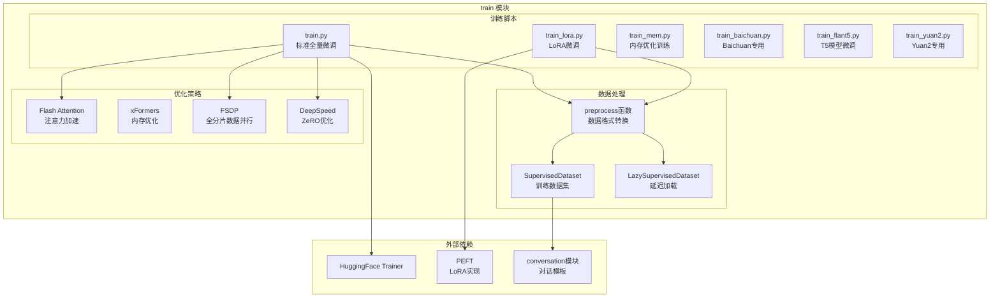
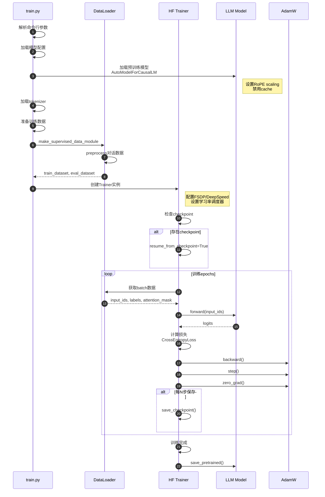

# FastChat-07-train模块-概览

## 1. train 模块职责

train 模块负责大语言模型的指令微调训练，核心功能包括：

- **数据预处理**：将对话数据转换为模型训练格式
- **全量微调**：基于 HuggingFace Trainer 的完整参数训练
- **LoRA 微调**：参数高效的低秩适应训练
- **分布式训练**：支持 FSDP、DeepSpeed 多卡训练
- **特殊模型支持**：针对 Baichuan、T5、Yuan2 等模型的定制训练

---

## 2. 模块架构图



---

## 3. 核心训练流程

### 3.1 数据预处理

```python
def preprocess(
    sources,  # 对话数据：[{"conversations": [{"from": "human", "value": "..."}, ...]}]
    tokenizer: PreTrainedTokenizer,
) -> Dict:
    """
    将对话数据转换为模型训练格式
    
    关键步骤：
    1. 遍历每个对话，构建完整 prompt
    2. 为每个 token 生成 label（仅计算 assistant 部分的损失）
    3. 应用 attention mask
    
    Returns:
        {
            "input_ids": List[List[int]],      # Token IDs
            "labels": List[List[int]],         # 标签（user部分为-100，不计算损失）
            "attention_mask": List[List[int]]  # 注意力掩码
        }
    """
    # 1. 构建对话模板
    conv = get_conv_template("vicuna_v1.1")
    roles = {"human": conv.roles[0], "gpt": conv.roles[1]}
    
    conversations = []
    for source in sources:
        # 2. 拼接对话历史
        conv.messages = []
        for sentence in source["conversations"]:
            role = roles[sentence["from"]]
            conv.append_message(role, sentence["value"])
        
        conversations.append(conv.get_prompt())
    
    # 3. Tokenize
    input_ids = tokenizer(
        conversations,
        return_tensors="pt",
        padding="max_length",
        max_length=tokenizer.model_max_length,
        truncation=True,
    ).input_ids
    
    # 4. 构建 labels（仅对 assistant 回复计算损失）
    labels = input_ids.clone()
    for idx, source in enumerate(sources):
        # 将 user 部分的 label 设为 -100（不计算损失）
        # 仅保留 assistant 部分的 label
        # （此处省略具体实现细节）
    
    return {
        "input_ids": input_ids,
        "labels": labels,
        "attention_mask": input_ids.ne(tokenizer.pad_token_id),
    }
```

### 3.2 全量微调流程



### 3.3 LoRA 微调流程

```python
def train_lora():
    """
    LoRA 微调训练
    
    关键区别：
    1. 加载基座模型（可选量化）
    2. 应用 LoRA 配置（仅训练低秩矩阵）
    3. 训练参数量 < 1% 原模型
    """
    # 1. 加载模型（支持 4bit/8bit 量化）
    if lora_args.q_lora:
        # QLoRA：4bit量化 + LoRA
        bnb_config = BitsAndBytesConfig(
            load_in_4bit=True,
            bnb_4bit_quant_type="nf4",
            bnb_4bit_compute_dtype=torch.bfloat16,
        )
        model = AutoModelForCausalLM.from_pretrained(
            model_path,
            quantization_config=bnb_config,
            device_map="auto",
        )
    else:
        model = AutoModelForCausalLM.from_pretrained(model_path)
    
    # 2. 配置 LoRA
    lora_config = LoraConfig(
        r=lora_args.lora_r,              # 秩（8/16/32）
        lora_alpha=lora_args.lora_alpha, # 缩放因子（16/32）
        target_modules=["q_proj", "v_proj"],  # 目标模块
        lora_dropout=lora_args.lora_dropout,  # Dropout
        task_type="CAUSAL_LM",
    )
    
    # 3. 应用 LoRA
    model = get_peft_model(model, lora_config)
    model.print_trainable_parameters()
    # 输出：trainable params: 4.2M || all params: 6.7B || trainable%: 0.063
    
    # 4. 训练（与全量微调相同）
    trainer = Trainer(
        model=model,
        args=training_args,
        train_dataset=train_dataset,
    )
    trainer.train()
    
    # 5. 保存 LoRA 权重（仅保存低秩矩阵，几十MB）
    model.save_pretrained(output_dir)
```

---

## 4. 训练数据格式

### 4.1 标准对话格式

```json
[
  {
    "id": "identity_0",
    "conversations": [
      {
        "from": "human",
        "value": "Who are you?"
      },
      {
        "from": "gpt",
        "value": "I am Vicuna, a language model trained by researchers..."
      },
      {
        "from": "human",
        "value": "What can you do?"
      },
      {
        "from": "gpt",
        "value": "I can help you with various tasks such as..."
      }
    ]
  }
]
```

**字段说明**：
- `id`：对话唯一标识
- `conversations`：对话轮次列表
  - `from`：`"human"` 或 `"gpt"`
  - `value`：对话内容

### 4.2 数据准备工具

FastChat 提供了丰富的数据处理工具（`fastchat/data/`）：

| 工具 | 功能 |
|---|---|
| `clean_sharegpt.py` | 清洗 ShareGPT 数据 |
| `convert_alpaca.py` | 转换 Alpaca 格式 |
| `split_long_conversation.py` | 切分长对话 |
| `filter_wrong_format.py` | 过滤格式错误数据 |
| `get_stats.py` | 统计数据集信息 |

---

## 5. 关键训练参数

### 5.1 模型参数

```bash
torchrun --nproc_per_node=4 fastchat/train/train_mem.py \
    --model_name_or_path meta-llama/Llama-2-7b-hf \  # 基座模型
    --data_path data/sharegpt_clean.json \            # 训练数据
    --output_dir output_vicuna \                      # 输出目录
```

### 5.2 训练超参数

```bash
    --bf16 True \                          # 使用 BF16（推荐）
    --num_train_epochs 3 \                 # 训练轮数
    --per_device_train_batch_size 2 \      # 单卡batch size
    --per_device_eval_batch_size 2 \
    --gradient_accumulation_steps 16 \     # 梯度累积步数
    --evaluation_strategy "no" \           # 不评估（节省时间）
    --save_strategy "steps" \              # 按步数保存
    --save_steps 1200 \                    # 每1200步保存
    --save_total_limit 10 \                # 最多保存10个checkpoint
    --learning_rate 2e-5 \                 # 学习率
    --weight_decay 0. \                    # 权重衰减
    --warmup_ratio 0.03 \                  # 预热比例
    --lr_scheduler_type "cosine" \         # 学习率调度器
```

### 5.3 分布式训练参数

```bash
    --fsdp "full_shard auto_wrap" \                      # FSDP策略
    --fsdp_transformer_layer_cls_to_wrap 'LlamaDecoderLayer' \  # 包装层
    --tf32 True \                                        # 启用TF32
    --model_max_length 2048 \                            # 最大序列长度
    --gradient_checkpointing True \                      # 梯度检查点
    --lazy_preprocess True                               # 延迟预处理
```

**参数说明**：

| 参数 | 说明 | 推荐值 |
|---|---|---|
| bf16 | BF16混合精度 | True（A100/H100） |
| gradient_accumulation_steps | 梯度累积 | 16（模拟大batch） |
| learning_rate | 学习率 | 2e-5（全量）/ 1e-4（LoRA） |
| warmup_ratio | 预热比例 | 0.03（3%步数） |
| fsdp | 全分片数据并行 | full_shard（显存优化） |
| gradient_checkpointing | 梯度检查点 | True（显存优化） |
| lazy_preprocess | 延迟预处理 | True（减少启动时间） |

---

## 6. 典型训练案例

### 6.1 Vicuna-7B 训练（4 x A100-40GB）

```bash
#!/bin/bash
# 训练配置：
# - 数据：125K ShareGPT 对话
# - 硬件：4 x A100-40GB
# - 时间：约 10 小时
# - 显存：每卡约 35GB

torchrun --nproc_per_node=4 --master_port=20001 fastchat/train/train_mem.py \
    --model_name_or_path meta-llama/Llama-2-7b-hf \
    --data_path data/sharegpt_clean.json \
    --bf16 True \
    --output_dir output_vicuna_7b \
    --num_train_epochs 3 \
    --per_device_train_batch_size 2 \
    --per_device_eval_batch_size 2 \
    --gradient_accumulation_steps 16 \
    --evaluation_strategy "no" \
    --save_strategy "steps" \
    --save_steps 1200 \
    --save_total_limit 10 \
    --learning_rate 2e-5 \
    --weight_decay 0. \
    --warmup_ratio 0.03 \
    --lr_scheduler_type "cosine" \
    --logging_steps 1 \
    --fsdp "full_shard auto_wrap" \
    --fsdp_transformer_layer_cls_to_wrap 'LlamaDecoderLayer' \
    --tf32 True \
    --model_max_length 2048 \
    --gradient_checkpointing True \
    --lazy_preprocess True
```

**训练效果**：
- 最终损失：约 1.2
- 验证困惑度：约 3.5
- 生成质量：接近 GPT-3.5（90%）

### 6.2 LoRA 微调（单卡 A100-40GB）

```bash
#!/bin/bash
# 训练配置：
# - 数据：10K 对话（小数据集）
# - 硬件：1 x A100-40GB
# - 时间：约 2 小时
# - 显存：约 20GB

python3 fastchat/train/train_lora.py \
    --model_name_or_path meta-llama/Llama-2-7b-hf \
    --data_path data/custom_data.json \
    --bf16 True \
    --output_dir output_lora \
    --num_train_epochs 3 \
    --per_device_train_batch_size 4 \
    --gradient_accumulation_steps 4 \
    --learning_rate 1e-4 \
    --lora_r 16 \
    --lora_alpha 32 \
    --lora_dropout 0.05 \
    --model_max_length 2048
```

**LoRA 参数说明**：
- `lora_r`：秩（8/16/32），越大精度越高但参数越多
- `lora_alpha`：缩放因子，通常为 r 的 2 倍
- `lora_dropout`：Dropout 率（0.05-0.1）

---

## 7. 性能优化技巧

### 7.1 显存优化

**技术栈**：
1. **FSDP**：全分片数据并行，显存优化最佳
2. **梯度检查点**：牺牲 20% 速度换取 30% 显存
3. **Flash Attention**：降低注意力显存峰值
4. **混合精度**：BF16/FP16 减半显存

**示例**：
```bash
# 显存不足时的组合拳
--fsdp "full_shard auto_wrap" \
--gradient_checkpointing True \
--bf16 True \
--per_device_train_batch_size 1 \  # 减小batch size
--gradient_accumulation_steps 32   # 增加梯度累积
```

### 7.2 速度优化

**技术栈**：
1. **Flash Attention 2**：推理速度提升 2-3 倍
2. **DeepSpeed Stage 2**：优于 FSDP 的训练速度
3. **延迟预处理**：减少数据加载时间
4. **TF32**：A100 上加速矩阵运算

**示例**：
```bash
# 速度优先配置
--deepspeed deepspeed_config_s2.json \  # DeepSpeed Stage 2
--tf32 True \
--lazy_preprocess True \
--flash_attn True
```

### 7.3 QLoRA（极致显存优化）

```bash
# 4bit 量化 + LoRA
# 13B 模型可在单张 24GB GPU 上训练
python3 fastchat/train/train_lora.py \
    --model_name_or_path meta-llama/Llama-2-13b-hf \
    --q_lora True \              # 启用 QLoRA
    --bits 4 \                   # 4bit 量化
    --lora_r 16 \
    --per_device_train_batch_size 1 \
    --gradient_accumulation_steps 16
```

---

## 8. 常见问题

### Q1：训练过程中 OOM 如何处理？

A：按优先级尝试：
1. 减小 `per_device_train_batch_size`，增加 `gradient_accumulation_steps`
2. 启用 `gradient_checkpointing`
3. 减小 `model_max_length`（如 2048 → 1024）
4. 使用 LoRA 微调（参数量减少 99%）
5. 使用 QLoRA（4bit 量化）

### Q2：如何选择全量微调 vs LoRA？

| 维度 | 全量微调 | LoRA |
|---|---|---|
| 数据量 | > 100K | < 50K |
| 显存需求 | 高（14GB/7B） | 低（6GB/7B） |
| 训练时间 | 长（10h） | 短（2h） |
| 效果 | 最佳 | 接近全量（95%） |
| 场景 | 通用能力 | 特定任务 |

### Q3：如何验证训练效果？

A：
1. **损失曲线**：应持续下降至 1.0-1.5
2. **困惑度**：验证集 PPL < 5
3. **手动测试**：对话流畅度、指令遵循能力
4. **MT-Bench 评估**：使用 llm_judge 模块评分

---

## 9. 扩展阅读

- **FastChat-04-使用示例与最佳实践.md**：训练环境准备
- **FastChat-06-conversation模块-详细分析.md**：对话模板在训练中的应用
- **FastChat-05-model模块-详细分析.md**：模型加载与适配

---

## 附录：训练脚本清单

| 脚本 | 用途 | 特点 |
|---|---|---|
| `train.py` | 标准全量微调 | 最通用，支持大多数模型 |
| `train_mem.py` | 内存优化训练 | 使用 FSDP，显存效率高 |
| `train_lora.py` | LoRA 微调 | 参数高效，单卡可训 |
| `train_xformers.py` | xFormers 优化 | 适用于 V100（不支持Flash Attn） |
| `train_baichuan.py` | Baichuan 专用 | 针对 Baichuan 模型优化 |
| `train_flant5.py` | T5 模型微调 | Seq2Seq 架构 |
| `train_yuan2.py` | Yuan2 专用 | 浪潮 Yuan2 模型 |
| `train_with_template.py` | 模板化训练 | 支持自定义对话模板 |

完整源码见：`fastchat/train/`

