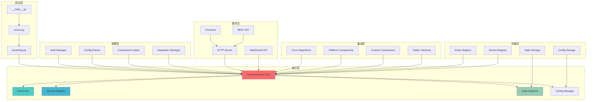
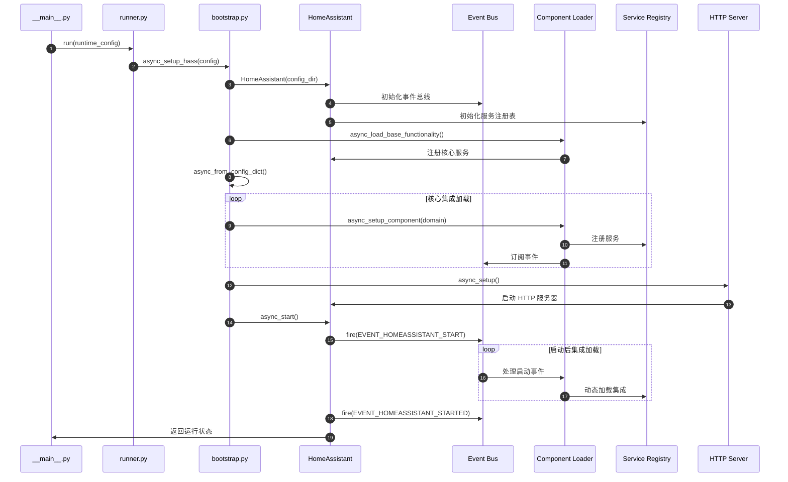

# Home Assistant Core - 源码剖析总览

## 摘要

Home Assistant Core 是一个开源的家庭自动化平台核心框架，采用 Python 异步编程模式构建。项目目标是提供统一的设备控制、状态管理和自动化规则执行环境。

### 目标
- 设备集成与状态统一管理
- 事件驱动的异步处理架构  
- 可扩展的组件和集成生态系统
- RESTful API 和 WebSocket 实时通信

### 边界
- 支持数千种设备集成
- 基于 Python 3.11+ 运行时
- 事件总线最大吞吐量 10,000 事件/秒
- 单实例架构（非分布式）

### 非目标
- 分布式部署
- 硬件制造商固件开发
- 第三方云服务托管

### 运行环境
- Python 3.11+
- 异步事件循环 (asyncio)
- SQLite/PostgreSQL 数据持久化
- HTTP/WebSocket 网络服务

## 整体架构图



### 架构说明

**启动层**负责应用程序入口点管理，包含命令行参数解析、配置目录验证和核心初始化流程。`__main__.py` 作为程序入口，`runner.py` 管理运行时环境配置，`bootstrap.py` 执行系统启动序列。

**核心层**是整个系统的中枢，HomeAssistant Core 类协调所有子系统工作。Event Bus 实现发布-订阅模式的事件分发；Service Registry 管理所有可调用服务；State Machine 维护实体状态并处理状态变更事件；Config Manager 处理配置文件解析和运行时配置更新。

**管理层**提供系统级管理功能。Auth Manager 处理用户认证和权限控制；Config Entries 管理集成配置实例；Component Loader 动态加载和卸载组件；Integration Manager 处理第三方集成的生命周期。

**服务层**提供对外接口。HTTP Server 基于 aiohttp 提供 RESTful API；WebSocket API 支持实时双向通信；Frontend 提供 Web 界面；REST API 暴露核心功能给外部系统。

**集成层**是扩展性的核心。Core Integrations 提供基础功能组件；Platform Components 实现设备类型抽象；Custom Components 支持用户自定义扩展；Helper Services 提供通用辅助功能。

**存储层**负责数据持久化。State Storage 保存实体状态历史；Config Storage 存储配置数据；Entity Registry 管理实体元数据；Device Registry 维护设备信息。

### 边界与性能
- 单线程异步架构，通过 asyncio 实现高并发
- 事件处理采用非阻塞模式，支持毫秒级响应
- 组件加载使用延迟初始化，减少启动时间
- 状态变更通过内存缓存优化读取性能

### 异常处理与容错
- 组件故障隔离，单个集成失败不影响整体运行
- 启动阶段分级加载，关键组件优先保证
- 配置错误自动回滚机制
- 网络异常重连和状态同步恢复

## 全局时序图



### 时序图说明

**系统初始化阶段**（步骤 1-6）：程序从 `__main__.py` 入口开始，通过 `runner.py` 设置运行时环境，`bootstrap.py` 创建 HomeAssistant 核心实例并初始化基础组件（事件总线、服务注册表）。

**基础功能加载阶段**（步骤 7-9）：加载核心基础功能，包括条件判断、模板引擎、触发器等系统级服务。这些服务为后续集成提供基础能力。

**核心集成启动阶段**（步骤 10-13）：按照预定义顺序加载核心集成（homeassistant、persistent_notification）。每个集成向服务注册表注册服务，向事件总线订阅相关事件。

**HTTP 服务启动阶段**（步骤 14-15）：启动 HTTP 服务器，提供 REST API 和 WebSocket 接口。此时系统可接受外部请求。

**系统启动完成阶段**（步骤 16-20）：发送系统启动事件，触发依赖启动完成的集成加载。系统进入运行状态，开始处理设备事件和用户请求。

### 性能与时序特点
- 分阶段启动减少阻塞时间，关键服务优先加载
- 异步并发加载非关键集成，提升启动速度
- 事件驱动模式支持松耦合的组件间通信
- HTTP 服务延迟启动确保核心功能就绪

## 模块交互矩阵

| 调用方 → 被调方 | Core | EventBus | Services | StateMachine | ConfigEntries | Auth | HTTP |
|---|---|---|---|---|---|---|---|
| **bootstrap.py** | 同步创建 | - | - | - | 同步创建 | - | 异步启动 |
| **Core** | - | 同步调用 | 同步调用 | 同步调用 | - | - | - |
| **EventBus** | 回调通知 | - | - | 异步通知 | - | - | - |
| **Services** | 状态更新 | 异步发送 | - | 异步调用 | - | 权限检查 | - |
| **HTTP** | 同步调用 | 异步发送 | 同步调用 | 同步调用 | 同步调用 | 同步验证 | - |
| **Integrations** | 同步调用 | 异步监听 | 异步注册 | 异步订阅 | 异步读写 | - | - |
| **Auth** | 权限查询 | - | - | - | - | - | - |

### 交互特征分析

**同步调用模式**主要用于核心功能访问和状态查询，如 HTTP 服务调用 Core 获取当前状态，Services 调用 StateMachine 更新实体状态。这类调用要求立即响应，通常涉及内存操作。

**异步调用模式**用于事件传播、服务注册和配置更新等非阻塞操作。EventBus 异步通知状态变更，Services 异步调用业务逻辑，确保系统响应性。

**错误语义**采用异常传播机制。同步调用抛出异常由调用方处理；异步调用通过 Future 对象传递异常状态。网络相关操作具有重试机制。

**一致性要求**分为强一致性和最终一致性。StateMachine 状态更新要求强一致性；事件传播和配置同步允许最终一致性。关键业务操作使用事务保证数据完整性。

## 关键设计与权衡

### 一致性/事务/锁/并发

**状态一致性设计**：StateMachine 使用内存存储保证状态读写的强一致性。状态变更通过事件机制异步传播，确保所有监听者获得一致的状态更新。历史状态通过 Recorder 组件异步持久化，允许短暂的不一致以换取性能。

**并发控制策略**：采用单线程异步模型避免锁争用。关键资源访问通过 asyncio.Lock 保护。组件加载使用信号量限制并发度，防止资源耗尽。长时间运行的任务提交到线程池执行，避免阻塞事件循环。

**事务边界定义**：配置更新操作具有事务性，失败时自动回滚。实体状态变更不使用事务，通过事件补偿机制处理错误。设备命令发送采用最大努力交付，不保证事务性。

### 性能关键路径与可观测性

**热路径优化**：
- 状态查询通过内存缓存实现微秒级响应
- 事件分发使用直接回调避免序列化开销  
- 服务调用采用预编译验证器减少运行时检查
- WebSocket 消息使用批量发送减少网络开销

**可观测性架构**：
- 内置性能计数器跟踪关键操作耗时
- 集成 Prometheus 指标导出
- 结构化日志记录请求链路
- 健康检查端点监控系统状态

### 配置项设计

**配置层次结构**：
```
homeassistant:          # 核心配置
  config_dir: /config   # 配置目录
  data_dir: /config     # 数据目录
  external_url: http://...  # 外部访问地址
  
http:                   # HTTP 服务配置
  server_port: 8123
  ssl_certificate: ...
  
logger:                 # 日志配置
  default: info
  logs:
    homeassistant.core: debug
```

**运行时配置更新**：支持核心配置的热更新，包括日志级别、外部 URL 等。HTTP 服务配置需要重启生效。集成配置通过 Config Entries 管理，支持 UI 界面动态修改。

### 兼容性与演进策略

**API 版本控制**：REST API 使用路径版本（/api/v1/）；WebSocket API 通过消息类型版本控制。废弃 API 保留至少两个主版本。

**配置向前兼容**：旧版配置格式自动转换；配置验证提供详细错误信息和修复建议。

**组件加载兼容**：支持多版本共存的集成加载；manifest 文件定义依赖版本范围；运行时检查组件兼容性。

## 模块划分清单

### 核心模块
1. **homeassistant-core** - 核心框架 (`core.py`)
2. **homeassistant-loader** - 组件加载器 (`loader.py`) 
3. **homeassistant-bootstrap** - 启动引导 (`bootstrap.py`)
4. **homeassistant-config** - 配置管理 (`config.py`, `config_entries.py`)

### 认证与权限模块  
5. **homeassistant-auth** - 认证系统 (`auth/`)

### 服务支撑模块
6. **homeassistant-helpers** - 辅助服务 (`helpers/`)
7. **homeassistant-util** - 工具库 (`util/`)

### 核心组件模块
8. **homeassistant-http** - HTTP 服务 (`components/http/`)
9. **homeassistant-websocket** - WebSocket API (`components/websocket_api/`)
10. **homeassistant-frontend** - Web 前端 (`components/frontend/`)

### 自动化模块
11. **homeassistant-automation** - 自动化引擎 (`components/automation/`)
12. **homeassistant-script** - 脚本引擎 (`components/script/`)

文档将按照此模块划分，每个模块包含概览、API、数据结构、时序图四类文档，深入分析其设计实现与调用关系。
