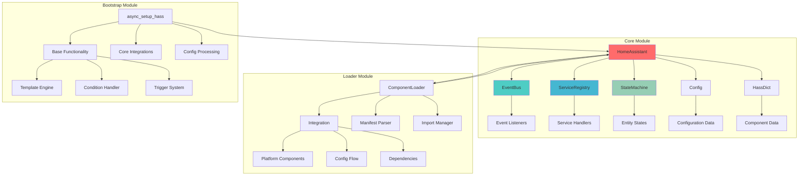
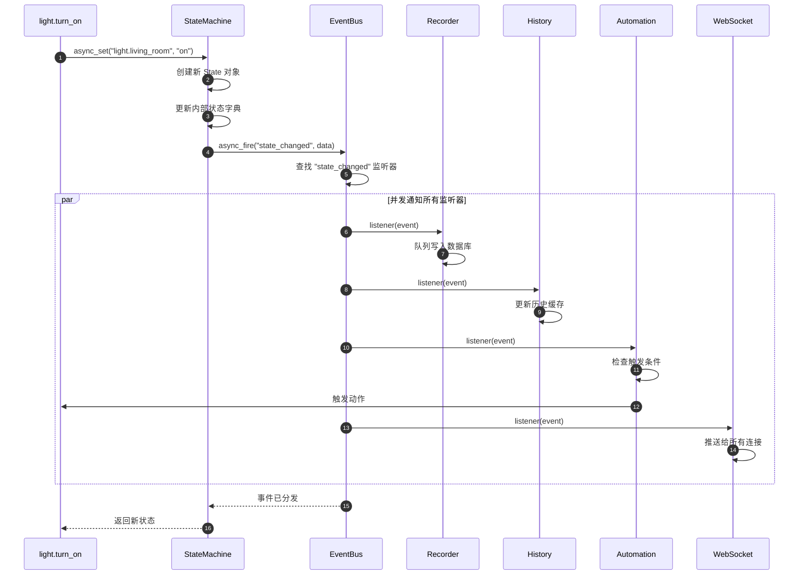
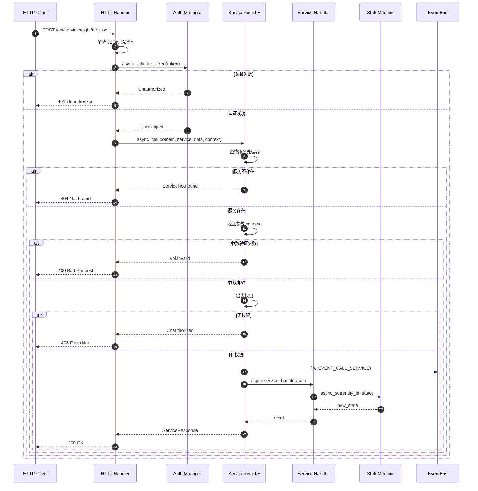
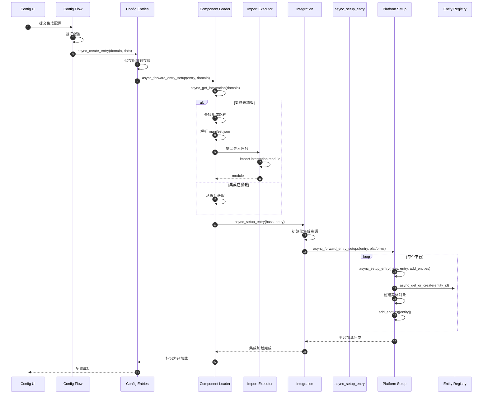
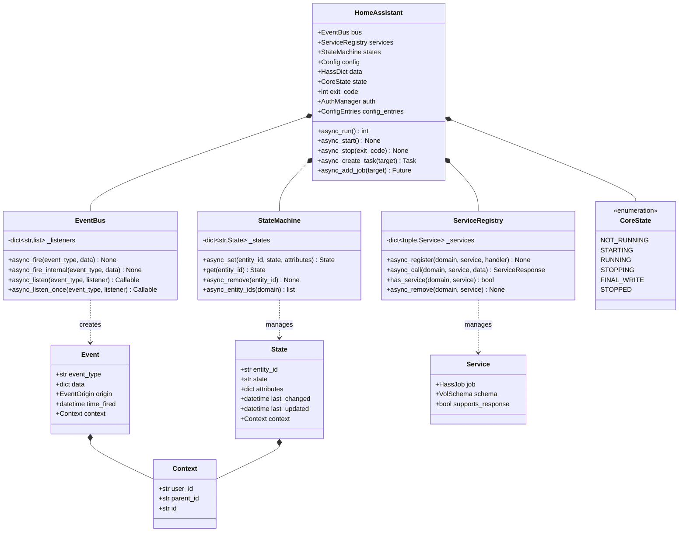
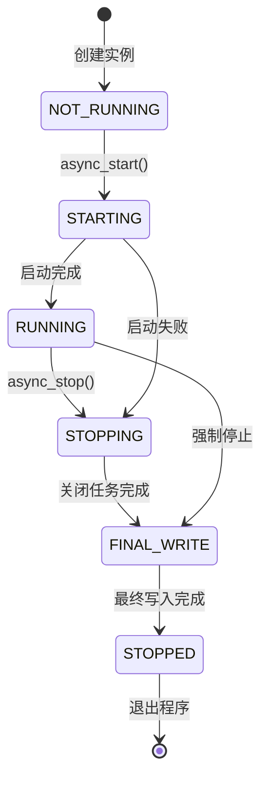
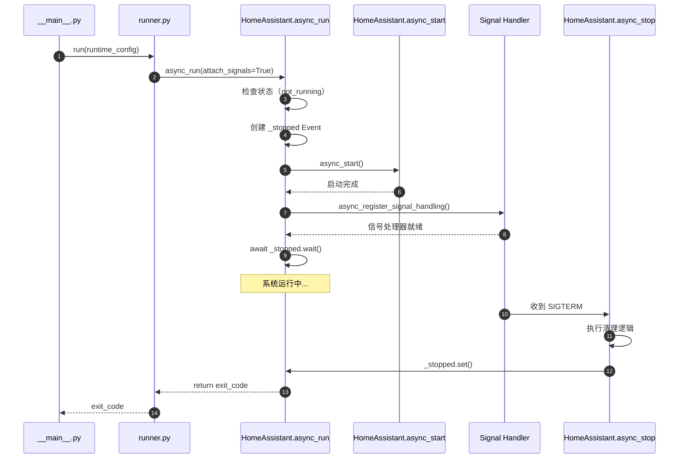
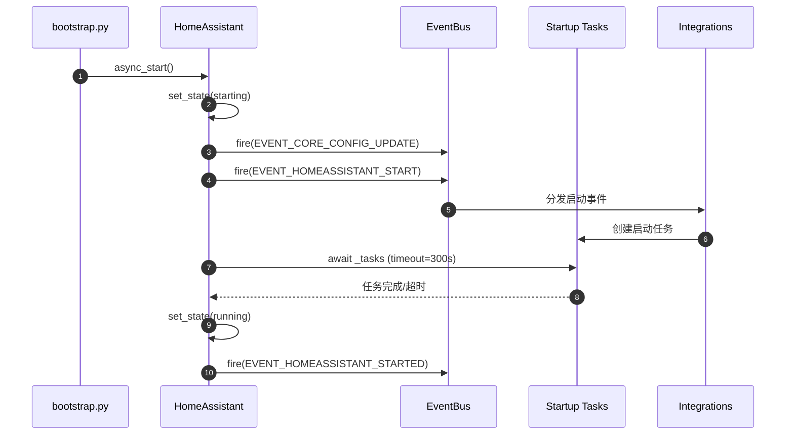
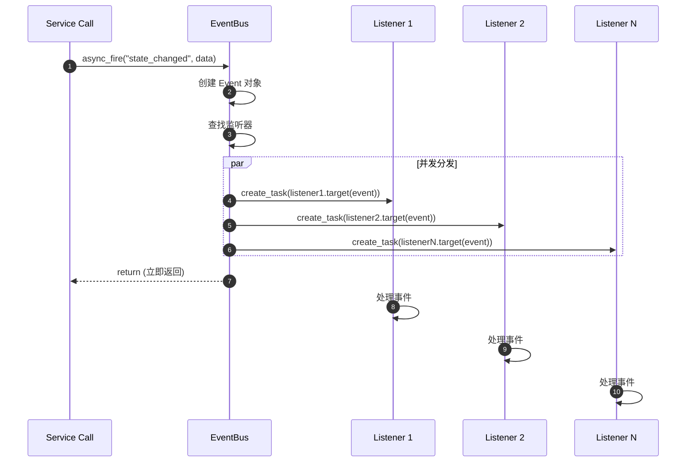

## 职责与边界

核心模块是 Home Assistant 系统的中枢控制层，负责系统生命周期管理、事件调度、服务协调和状态维护。核心模块包含 `core.py`、`loader.py`、`bootstrap.py` 三个主要文件，构成系统的基础运行框架。

### 主要职责
- **系统生命周期管理**：控制启动、运行、停止的完整生命周期
- **事件总线调度**：实现发布-订阅模式的事件分发机制
- **服务注册与调用**：管理所有系统服务的注册、发现和调用
- **状态机维护**：管理实体状态的存储、变更和通知
- **组件动态加载**：支持集成组件的动态加载和卸载

### 输入与输出
**输入**：
- 配置文件 (`configuration.yaml`)
- 组件 manifest 文件
- 外部事件和服务调用请求
- 用户界面操作指令

**输出**：
- 系统状态变更事件
- 设备控制指令
- API 响应数据
- 日志和监控信息

### 上下游依赖
**上游依赖**：
- Python 异步运行时 (asyncio)
- 配置解析器 (voluptuous)
- 时间工具 (dt_util)

**下游服务**：
- HTTP 服务层
- WebSocket API
- 认证管理器
- 数据库记录器
- 所有集成组件

### 生命周期阶段
1. **初始化阶段** (`__init__`)：创建核心对象，初始化基础设施
2. **启动阶段** (`async_start`)：加载组件，注册服务，启动事件循环
3. **运行阶段** (`running`)：处理事件，执行服务，维护状态
4. **停止阶段** (`async_stop`)：清理资源，保存状态，优雅关闭

## 核心架构图



### 架构图说明

**HomeAssistant 核心类**作为系统的根对象，协调所有子系统的工作。该类包含事件总线、服务注册表、状态机、配置管理器等核心组件。核心类负责系统生命周期管理，维护系统运行状态，协调各子系统间的交互。

**EventBus 事件总线**实现发布-订阅模式的事件分发机制。支持同步和异步事件处理，提供事件过滤和路由功能。事件监听器可以订阅特定类型的事件，实现松耦合的组件间通信。事件总线支持内部事件和外部事件的统一处理。

**ServiceRegistry 服务注册表**管理系统中所有可调用的服务。支持服务的动态注册、发现和调用。提供服务权限验证、参数校验和调用日志功能。服务处理器负责具体的业务逻辑执行，支持同步和异步服务调用。

**StateMachine 状态机**维护所有实体的当前状态。提供状态查询、更新和历史记录功能。状态变更会触发相应的事件通知，支持状态监听和自动化触发。实体状态包括基本属性、扩展属性和上下文信息。

**ComponentLoader 组件加载器**负责集成组件的动态加载和管理。解析组件 manifest 文件，处理依赖关系，管理组件生命周期。支持核心组件、平台组件和自定义组件的加载。提供组件热更新和错误恢复机制。

**Bootstrap 启动引导**控制系统的启动序列。按照预定义的阶段顺序加载基础功能、核心集成和用户配置。处理启动异常和恢复模式。提供启动进度监控和诊断信息。

### 边界与异常处理
- **组件隔离**：单个组件故障不影响核心系统运行
- **状态一致性**：状态变更具有原子性，支持回滚机制
- **事件可靠性**：关键事件支持持久化和重试机制
- **资源保护**：限制组件资源使用，防止系统资源耗尽

### 性能特征
- **异步处理**：核心操作均采用异步模式，支持高并发
- **内存优化**：状态数据使用压缩存储，减少内存占用
- **延迟加载**：组件按需加载，减少启动时间
- **缓存策略**：频繁访问的数据使用内存缓存

### 兼容性考虑
- **版本演进**：核心 API 保持向后兼容，废弃功能渐进式移除
- **组件兼容**：支持多版本组件共存，提供兼容性检查
- **配置迁移**：自动处理配置格式升级和数据迁移

## 核心算法与流程

### 启动流程算法

**目的**：按照预定义的阶段顺序初始化系统，确保关键组件优先加载，处理依赖关系。

**输入**：
- 运行时配置 (`RuntimeConfig`)
- 配置目录路径
- 启动参数

**输出**：
- 完全初始化的 `HomeAssistant` 实例
- 启动状态码（成功/失败）

**复杂度**：O(n) 其中 n 为需要加载的组件数量

**核心代码**：

```python
async def async_setup_hass(runtime_config: RuntimeConfig) -> HomeAssistant | None:
    # 1. 创建 HomeAssistant 核心实例
    hass = HomeAssistant(runtime_config.config_dir)
    
    # 2. 加载配置文件
    config = await conf_util.async_hass_config_yaml(hass)
    
    # 3. 预加载存储数据
    await get_internal_store_manager(hass).async_initialize()
    for storage_key in PRELOAD_STORAGE:
        # 异步预加载频繁访问的存储数据
        hass.async_create_task(store.async_load())
    
    # 4. 从配置字典初始化系统
    hass = await async_from_config_dict(config, hass)
    
    # 5. 分阶段加载集成
    # Stage 0: 日志、HTTP 依赖、前端、记录器
    for substage_name, integrations, timeout in STAGE_0_INTEGRATIONS:
        await _async_set_up_integrations(hass, integrations, timeout)
    
    # Stage 1: 发现集成（蓝牙、DHCP、SSDP、USB）
    await _async_set_up_integrations(hass, STAGE_1_INTEGRATIONS)
    
    # Stage 2: 其他所有集成
    await _async_set_up_integrations(hass, config)
    
    return hass
```

**逐段解释**：
1. **创建核心实例**：初始化 HomeAssistant 对象，设置配置目录，创建事件循环
2. **加载配置**：解析 YAML 配置文件，验证配置格式，处理包含和秘密引用
3. **预加载存储**：并发加载常用存储数据，减少后续访问延迟
4. **系统初始化**：创建配置条目管理器，加载基础功能（模板、条件、触发器）
5. **分阶段加载**：按依赖顺序加载集成，关键组件优先，非关键组件并发加载

### 事件分发算法

**目的**：将事件高效分发给所有订阅的监听器，支持同步和异步处理。

**输入**：
- 事件类型 (`event_type`)
- 事件数据 (`event_data`)
- 事件上下文 (`context`)

**输出**：无（异步通知所有监听器）

**复杂度**：O(m) 其中 m 为该事件类型的监听器数量

**核心代码**：

```python
@callback
def async_fire_internal(
    self,
    event_type: str,
    event_data: dict[str, Any] | None = None,
    context: Context | None = None
) -> None:
    # 1. 创建事件对象
    event = Event(event_type, event_data, context=context)
    
    # 2. 获取该事件类型的所有监听器
    listeners = self._listeners.get(event_type, [])
    
    # 3. 分发给匹配的监听器
    for listener in listeners:
        # 检查事件过滤条件
        if listener.event_filter and not listener.event_filter(event):
            continue
        
        # 创建监听器任务
        self.hass.async_create_task(
            listener.job.target(event),
            eager_start=True
        )
```

**逐段解释**：
1. **创建事件**：封装事件类型、数据和上下文到 Event 对象
2. **查找监听器**：从监听器字典中获取订阅该事件类型的所有监听器
3. **异步分发**：为每个监听器创建独立的异步任务，支持并发处理

### 服务调用算法

**目的**：验证服务参数，执行服务逻辑，返回执行结果。

**输入**：
- 域名 (`domain`)
- 服务名 (`service`)
- 服务数据 (`service_data`)
- 目标实体 (`target`)

**输出**：服务执行结果（成功/失败）

**复杂度**：O(1) 服务查找 + O(k) 参数验证，其中 k 为参数数量

**核心代码**：

```python
async def async_call(
    self,
    domain: str,
    service: str,
    service_data: dict | None = None,
    target: dict | None = None,
    context: Context | None = None
) -> ServiceResponse:
    # 1. 查找服务处理器
    service_key = (domain, service)
    handler = self._services.get(service_key)
    if not handler:
        raise ServiceNotFound(domain, service)
    
    # 2. 验证服务参数
    if handler.schema:
        validated_data = handler.schema(service_data or {})
    
    # 3. 权限检查
    if context and context.user_id:
        # （省略权限验证逻辑）
        pass
    
    # 4. 执行服务处理器
    return await handler.job.target(
        ServiceCall(domain, service, validated_data, context, target)
    )
```

**逐段解释**：
1. **查找服务**：通过域名和服务名快速定位服务处理器
2. **参数验证**：使用预定义的 schema 验证参数格式和取值范围
3. **权限检查**：验证调用用户是否具有执行该服务的权限
4. **执行服务**：调用服务处理器，传递封装的 ServiceCall 对象

---

## 系统启动时序

### 完整启动流程

```mermaid
sequenceDiagram
    autonumber
    participant Main as __main__.main()
    participant Runner as runner.run()
    participant Loop as Event Loop
    participant Bootstrap as bootstrap
    participant Core as HomeAssistant
    participant Config as Config Loader
    participant Bus as EventBus
    participant Loader as Component Loader
    participant HTTP as HTTP Server
    
    Main->>Runner: run(runtime_config)
    Runner->>Loop: 创建新事件循环
    Runner->>Bootstrap: async_setup_hass(config)
    
    Bootstrap->>Core: HomeAssistant(config_dir)
    Core->>Bus: 创建 EventBus
    Core->>Core: 创建 ServiceRegistry
    Core->>Core: 创建 StateMachine
    Core-->>Bootstrap: hass 实例
    
    Bootstrap->>Config: async_hass_config_yaml()
    Config->>Config: 解析 YAML 文件
    Config->>Config: 处理 !include 和 !secret
    Config-->>Bootstrap: config dict
    
    Bootstrap->>Bootstrap: async_from_config_dict()
    Bootstrap->>Loader: async_load_base_functionality()
    Loader->>Core: 注册 template 引擎
    Loader->>Core: 注册 condition 处理器
    Loader->>Core: 注册 trigger 系统
    
    loop Stage 0 子阶段
        Bootstrap->>Loader: async_setup_component(domain)
        Loader->>Loader: 加载组件模块
        Loader->>Core: 调用 async_setup()
        Core->>Bus: 注册服务和监听器
    end
    
    Bootstrap->>HTTP: async_setup()
    HTTP->>HTTP: 创建 aiohttp 应用
    HTTP->>HTTP: 启动 HTTP 服务器
    
    Bootstrap->>Core: async_start()
    Core->>Bus: fire(EVENT_HOMEASSISTANT_START)
    Core->>Core: 等待启动任务完成
    Core->>Core: set_state(RUNNING)
    Core->>Bus: fire(EVENT_HOMEASSISTANT_STARTED)
    
    Core-->>Runner: 启动完成
    Runner->>Runner: 运行事件循环
```

### 时序图详细说明

**阶段 1-3：事件循环初始化**
- `runner.run()` 创建新的 asyncio 事件循环
- 设置事件循环策略和异常处理器
- 调用 `async_setup_hass()` 在事件循环中初始化系统

**阶段 4-8：核心对象创建**
- 创建 `HomeAssistant` 核心实例
- 初始化事件总线、服务注册表、状态机
- 这些对象在构造函数中同步创建，耗时极短（< 10ms）

**阶段 9-12：配置加载**
- 异步读取 `configuration.yaml` 文件
- 解析 YAML 语法，处理包含指令和秘密引用
- 验证配置格式，处理配置错误
- 配置加载耗时取决于文件大小和复杂度（通常 100-500ms）

**阶段 13-17：基础功能加载**
- 加载模板引擎，支持 Jinja2 模板
- 加载条件处理器，支持自动化条件判断
- 加载触发器系统，支持事件触发
- 这些是所有集成依赖的基础功能

**阶段 18-23：分阶段集成加载**
- Stage 0：日志系统、HTTP 依赖、前端、记录器
- 每个阶段的集成并发加载，但阶段间串行
- 每个集成调用 `async_setup()` 进行初始化
- 集成向系统注册服务、监听事件
- 此阶段耗时最长（10-60 秒），取决于集成数量

**阶段 24-26：HTTP 服务启动**
- 创建 aiohttp web 应用
- 注册 REST API 路由和 WebSocket 处理器
- 启动 HTTP 服务器监听端口（默认 8123）

**阶段 27-32：系统启动完成**
- 调用 `async_start()` 完成最后的启动步骤
- 发送 `EVENT_HOMEASSISTANT_START` 事件
- 等待所有启动任务完成（超时 300 秒）
- 切换状态到 `RUNNING`
- 发送 `EVENT_HOMEASSISTANT_STARTED` 事件
- 进入主事件循环，开始处理请求

**性能特征**：
- 总启动时间：10-60 秒（取决于集成数量）
- 核心初始化：< 1 秒
- 配置加载：< 1 秒
- 集成加载：5-50 秒（并发加载）
- HTTP 启动：< 1 秒

**异常处理**：
- 配置错误：进入安全模式，仅加载核心功能
- 集成失败：隔离该集成，不影响其他集成
- 启动超时：记录警告，继续启动

## 事件处理时序

### 状态变更事件流



### 时序图详细说明

**阶段 1-3：状态更新**
- 服务调用 `StateMachine.async_set()` 更新状态
- 创建不可变的 `State` 对象，包含新状态值和属性
- 更新内部字典 `_states[entity_id] = new_state`
- 状态更新是同步的，确保强一致性

**阶段 4-5：事件创建与分发**
- 创建 `state_changed` 事件对象
- 事件数据包含 entity_id、old_state、new_state
- 从监听器字典中查找所有订阅该事件的监听器
- 查找操作 O(1) 时间复杂度

**阶段 6-17：并发通知监听器**
- 为每个监听器创建独立的异步任务
- 监听器并发执行，互不阻塞
- Recorder 监听器将状态变更加入队列，异步写入数据库
- History 监听器更新内存中的历史状态缓存
- Automation 监听器检查触发条件，满足条件时执行动作
- WebSocket 监听器将状态变更推送给所有连接的客户端

**阶段 18-19：返回结果**
- 事件分发立即返回，不等待监听器执行完成
- 服务调用者收到新的状态对象

**性能特征**：
- 状态更新延迟：< 1ms（内存操作）
- 事件分发延迟：< 5ms（创建任务）
- 监听器执行：异步，不阻塞主流程
- 数据库写入：批量异步，延迟 1-5 秒

**并发特征**：
- 监听器并发数：取决于该事件类型的监听器数量
- 典型监听器数：5-20 个
- 异常隔离：单个监听器异常不影响其他监听器

## 服务调用时序

### HTTP API 调用服务



### 时序图详细说明

**阶段 1-2：HTTP 请求接收**
- 客户端发送 POST 请求到 `/api/services/light/turn_on`
- 请求体包含 entity_id、参数等
- HTTP 处理器解析 JSON 请求体

**阶段 3-7：认证与授权**
- 从请求头提取 Bearer token
- 调用 Auth Manager 验证 token
- 验证失败返回 401 Unauthorized
- 验证成功获取 User 对象，包含用户权限

**阶段 8-11：服务查找**
- 使用 (domain, service) 元组查找服务处理器
- 查找操作 O(1) 时间复杂度
- 服务不存在返回 404 Not Found

**阶段 12-15：参数验证**
- 使用预定义的 voluptuous schema 验证参数
- 检查参数类型、取值范围、必填项
- 验证失败返回 400 Bad Request，包含详细错误信息

**阶段 16-19：权限检查**
- 检查用户是否有权限调用该服务
- 权限基于用户角色和服务策略
- 无权限返回 403 Forbidden

**阶段 20-25：服务执行**
- 发送 `call_service` 事件，用于审计和监控
- 调用服务处理器，传递 ServiceCall 对象
- 服务处理器执行业务逻辑（如控制设备）
- 更新实体状态
- 返回服务执行结果

**阶段 26-27：HTTP 响应**
- 包装服务结果为 JSON 响应
- 返回 200 OK 和响应数据

**性能特征**：
- 总响应时间：10-100ms（取决于设备响应）
- 认证验证：< 5ms（内存查找）
- 参数验证：< 1ms（预编译 schema）
- 权限检查：< 1ms（内存查找）
- 服务执行：5-50ms（设备通信）

**错误处理**：
- HTTP 层捕获所有异常，返回合适的状态码
- 服务异常不会导致系统崩溃
- 详细错误信息记录到日志

## 组件加载时序

### 动态加载集成组件



### 时序图详细说明

**阶段 1-4：配置创建**
- 用户在 UI 界面提交集成配置
- Config Flow 执行配置验证流程
- 验证通过后创建 Config Entry
- 配置数据持久化到存储（JSON 文件）

**阶段 5-6：触发加载**
- Config Entries 触发集成加载流程
- 调用 Component Loader 加载指定的集成

**阶段 7-13：集成加载**
- 检查集成是否已加载（缓存查找）
- 未加载则查找集成路径（核心集成或自定义集成）
- 解析 `manifest.json` 获取集成元数据
- 提交导入任务到线程池（避免阻塞事件循环）
- 导入集成模块，执行模块级初始化代码
- 已加载则直接从缓存获取

**阶段 14-16：集成初始化**
- 调用集成的 `async_setup_entry()` 方法
- 初始化集成所需的资源（连接、客户端等）
- 转发到平台设置（如 light、sensor 平台）

**阶段 17-23：平台加载**
- 为每个平台并发执行设置流程
- 平台创建实体对象
- 实体注册到 Entity Registry（持久化元数据）
- 调用 `add_entities()` 将实体添加到系统
- 实体开始接收状态更新

**阶段 24-27：完成加载**
- 所有平台加载完成
- 标记 Config Entry 为已加载状态
- 返回成功响应给用户

**性能特征**：
- 总加载时间：1-10 秒（取决于集成复杂度）
- 配置验证：< 1 秒
- 模块导入：0.1-2 秒（首次导入）
- 集成初始化：0.5-5 秒（设备发现、连接）
- 平台加载：0.1-1 秒（每个平台）

**并发特征**：
- 不同集成可以并发加载
- 同一集成的多个平台并发加载
- 模块导入使用线程池，不阻塞事件循环

**异常处理**：
- 导入失败：记录错误，标记集成不可用
- 初始化失败：回滚配置，删除 Config Entry
- 平台加载失败：隔离该平台，不影响其他平台

## 系统停止时序

### 优雅关闭流程

```mermaid
sequenceDiagram
    autonumber
    participant Signal as Signal Handler
    participant Core as HomeAssistant
    participant Bus as EventBus
    participant Components as Components
    participant Recorder as Recorder
    participant HTTP as HTTP Server
    participant Tasks as Async Tasks
    participant Loop as Event Loop
    
    Signal->>Core: async_stop(exit_code=0)
    Core->>Core: set_state(STOPPING)
    Core->>Bus: fire(EVENT_HOMEASSISTANT_STOP)
    
    Bus->>Components: 分发停止事件
    Components->>Components: 清理资源
    
    Core->>Core: 执行 shutdown_jobs
    
    par 并发执行关闭任务
        Core->>Recorder: async_shutdown()
        Recorder->>Recorder: 写入未保存的数据
        Recorder->>Recorder: 关闭数据库连接
        
        Core->>HTTP: async_stop()
        HTTP->>HTTP: 停止接受新连接
        HTTP->>HTTP: 等待现有请求完成
        HTTP->>HTTP: 关闭 HTTP 服务器
        
        Core->>Components: async_unload()
        Components->>Components: 取消监听器
        Components->>Components: 关闭连接
    end
    
    Core->>Core: await shutdown_jobs (timeout=30s)
    
    Core->>Core: set_state(FINAL_WRITE)
    Core->>Bus: fire(EVENT_HOMEASSISTANT_FINAL_WRITE)
    Core->>Core: sleep(0.1s) 让最终写入完成
    
    Core->>Core: set_state(STOPPED)
    Core->>Bus: fire(EVENT_HOMEASSISTANT_CLOSE)
    
    Core->>Tasks: 取消所有待处理任务
    Core->>Loop: shutdown_asyncgens()
    Core->>Loop: shutdown_default_executor()
    
    Core->>Core: _stopped.set()
    Core-->>Signal: exit_code
```

### 时序图详细说明

**阶段 1-3：触发停止**
- Signal Handler 接收到 SIGTERM 或 SIGINT 信号
- 调用 `async_stop()` 开始停止流程
- 切换状态到 `STOPPING`
- 发送 `EVENT_HOMEASSISTANT_STOP` 事件

**阶段 4-5：通知组件**
- 事件总线分发停止事件给所有监听器
- 组件收到事件后开始清理资源

**阶段 6-16：执行关闭任务**
- 并发执行所有注册的 shutdown_jobs
- Recorder 组件写入未保存的状态到数据库
- Recorder 关闭数据库连接
- HTTP Server 停止接受新连接
- HTTP Server 等待现有请求完成（带超时）
- HTTP Server 关闭服务器
- Components 取消事件监听器
- Components 关闭设备连接

**阶段 17：等待完成**
- 等待所有关闭任务完成，超时 30 秒
- 超时后强制继续，避免无限等待

**阶段 18-20：最终写入**
- 切换状态到 `FINAL_WRITE`
- 发送最终写入事件
- Sleep 0.1 秒让最终写入操作完成

**阶段 21-22：标记停止**
- 切换状态到 `STOPPED`
- 发送关闭事件

**阶段 23-25：清理事件循环**
- 取消所有待处理的异步任务
- 关闭异步生成器
- 关闭默认执行器

**阶段 26-27：完成停止**
- 设置停止事件，唤醒 `async_run()`
- 返回退出码

**性能特征**：
- 总关闭时间：5-30 秒（正常情况）
- 关闭任务超时：30 秒
- 最终写入时间：< 0.1 秒
- 强制关闭：立即生效

**异常处理**：
- 关闭任务异常不阻止其他任务
- 超时后强制继续，避免挂起
- 异常记录到日志，便于诊断

---

## 核心实体类图



### 类图说明

**HomeAssistant 核心类**是系统的根对象，聚合了事件总线、服务注册表、状态机等核心组件。该类负责系统生命周期管理，维护全局状态，协调各子系统工作。核心类通过组合模式将职责分散到各个子系统。

**EventBus 事件总线**管理事件监听器，实现事件的发布和订阅。内部使用字典存储事件类型到监听器列表的映射。事件总线支持同步和异步事件处理，提供事件过滤功能。

**ServiceRegistry 服务注册表**管理系统中所有可调用的服务。使用元组（domain, service）作为服务的唯一标识。提供服务注册、调用、移除等操作，支持参数验证和权限检查。

**StateMachine 状态机**维护所有实体的当前状态。使用字典存储 entity_id 到 State 对象的映射。状态变更会触发 `state_changed` 事件，实现状态变更的通知机制。

**Event 事件对象**封装事件的所有信息，包括事件类型、数据、来源、触发时间和上下文。事件对象不可变，确保事件传递过程中数据不被篡改。

**State 状态对象**表示实体的当前状态，包含实体 ID、状态值、属性、时间戳和上下文。状态对象支持序列化和反序列化，用于持久化和网络传输。

**Context 上下文对象**记录操作的上下文信息，包括用户 ID、父操作 ID。用于追踪操作链路，实现权限控制和审计日志。

**Service 服务对象**封装服务的处理逻辑和元数据。包含服务处理器（HassJob）、参数验证 schema、是否支持响应等信息。

**CoreState 状态枚举**定义系统的生命周期状态。状态转换遵循严格的顺序：NOT_RUNNING → STARTING → RUNNING → STOPPING → FINAL_WRITE → STOPPED。

## 关键数据结构详解

### HomeAssistant 核心类

```python
class HomeAssistant:
    """Home Assistant 根对象"""
    
    # 核心组件
    auth: AuthManager                    # 认证管理器
    http: HomeAssistantHTTP              # HTTP 服务器
    config_entries: ConfigEntries        # 配置条目管理器
    
    # 内部组件
    bus: EventBus                        # 事件总线
    services: ServiceRegistry            # 服务注册表
    states: StateMachine                 # 状态机
    config: Config                       # 配置管理器
    data: HassDict                       # 组件数据字典
    
    # 状态管理
    state: CoreState                     # 当前状态
    exit_code: int                       # 退出码
    loop: asyncio.AbstractEventLoop      # 事件循环
    
    # 任务管理
    _tasks: set[asyncio.Future]          # 启动任务集
    _background_tasks: set[asyncio.Future]  # 后台任务集
    _stopped: asyncio.Event              # 停止事件
    _shutdown_jobs: list[HassJobWithArgs]  # 关闭任务列表
    
    # 线程池
    import_executor: ThreadPoolExecutor  # 导入执行器
    loop_thread_id: int                  # 事件循环线程 ID
```

**字段说明**：

| 字段 | 类型 | 说明 | 生命周期 |
|---|---|---|---|
| bus | EventBus | 事件总线，处理所有事件的发布订阅 | 初始化时创建，全生命周期 |
| services | ServiceRegistry | 服务注册表，管理所有服务 | 初始化时创建，全生命周期 |
| states | StateMachine | 状态机，维护实体状态 | 初始化时创建，全生命周期 |
| config | Config | 配置管理器，处理配置数据 | 初始化时创建，全生命周期 |
| data | HassDict | 组件数据存储，键值对存储 | 初始化时创建，组件可写入 |
| state | CoreState | 系统状态枚举 | 初始化为 NOT_RUNNING |
| auth | AuthManager | 认证管理器 | Bootstrap 阶段创建 |
| config_entries | ConfigEntries | 配置条目管理器 | Bootstrap 阶段创建 |
| http | HomeAssistantHTTP | HTTP 服务器实例 | HTTP 组件加载时创建 |

**映射规则**：
- `data` 字典使用 `HassKey` 类型安全访问，避免键冲突
- `config` 对象将 YAML 配置映射到结构化数据
- `states` 字典将 entity_id 映射到 State 对象

**版本演进**：
- v2024.1: 引入 HassKey 类型安全机制
- v2024.3: import_executor 改用可中断线程池
- v2024.5: 添加 _background_tasks 支持长时间后台任务

### Event 事件对象

```python
@dataclass(frozen=True, kw_only=True)
class Event:
    """事件对象，不可变"""
    
    event_type: str                      # 事件类型
    data: Mapping[str, Any]              # 事件数据
    origin: EventOrigin                  # 事件来源（local/remote）
    time_fired: datetime                 # 触发时间（UTC）
    context: Context                     # 事件上下文
```

**字段说明**：

| 字段 | 类型 | 约束 | 说明 |
|---|---|---|---|
| event_type | str | max_length=64 | 事件类型标识，如 "state_changed" |
| data | Mapping | immutable | 事件携带的数据，只读映射 |
| origin | EventOrigin | enum | 事件来源，LOCAL 或 REMOTE |
| time_fired | datetime | UTC | 事件触发的 UTC 时间 |
| context | Context | required | 事件上下文信息 |

**常用事件类型**：
- `state_changed`: 实体状态变更
- `service_registered`: 服务注册
- `service_removed`: 服务移除
- `call_service`: 服务调用
- `homeassistant_start`: 系统启动
- `homeassistant_started`: 系统启动完成
- `homeassistant_stop`: 系统停止

**数据格式示例**：
```python
# state_changed 事件
{
    "entity_id": "light.living_room",
    "old_state": State(...),
    "new_state": State(...)
}

# call_service 事件
{
    "domain": "light",
    "service": "turn_on",
    "service_data": {"brightness": 255}
}
```

### State 状态对象

```python
@dataclass(frozen=True, kw_only=True)
class State:
    """实体状态对象，不可变"""
    
    entity_id: str                       # 实体 ID
    state: str                           # 状态值
    attributes: Mapping[str, Any]        # 属性字典
    last_changed: datetime               # 最后变更时间
    last_updated: datetime               # 最后更新时间
    context: Context                     # 状态上下文
    
    @property
    def domain(self) -> str:
        """从 entity_id 提取域名"""
        return self.entity_id.split(".")[0]
    
    @property
    def object_id(self) -> str:
        """从 entity_id 提取对象 ID"""
        return self.entity_id.split(".")[1]
```

**字段说明**：

| 字段 | 类型 | 约束 | 说明 |
|---|---|---|---|
| entity_id | str | format=domain.object_id | 实体唯一标识 |
| state | str | max_length=255 | 状态值字符串 |
| attributes | Mapping | immutable | 实体属性，只读 |
| last_changed | datetime | UTC | 状态值最后变更时间 |
| last_updated | datetime | UTC | 状态或属性最后更新时间 |
| context | Context | required | 状态变更的上下文 |

**状态值约定**：
- 布尔类型：`on` / `off`
- 未知状态：`unknown`
- 不可用：`unavailable`
- 数值类型：字符串表示的数字

**属性字段约定**：
```python
{
    "friendly_name": "客厅灯",          # 友好名称
    "unit_of_measurement": "°C",      # 测量单位
    "device_class": "temperature",    # 设备类型
    "icon": "mdi:thermometer",        # 图标
    "supported_features": 15,         # 支持的功能位掩码
}
```

**压缩存储格式**：
```python
# 内存优化的压缩格式
CompressedState = tuple[str, str, dict, datetime, datetime, dict]
# (entity_id, state, attributes, last_changed, last_updated, context)
```

### Context 上下文对象

```python
@dataclass(frozen=True, kw_only=True)
class Context:
    """操作上下文，用于追踪和权限控制"""
    
    user_id: str | None = None           # 用户 ID
    parent_id: str | None = None         # 父操作 ID
    id: str = field(default_factory=uuid4)  # 上下文唯一 ID
```

**字段说明**：

| 字段 | 类型 | 说明 | 用途 |
|---|---|---|---|
| id | str | UUID 格式的唯一标识 | 追踪单个操作 |
| user_id | str \| None | 触发操作的用户 ID | 权限控制、审计 |
| parent_id | str \| None | 父操作的 context.id | 追踪操作链路 |

**使用场景**：
1. **权限控制**：检查 user_id 是否有权执行操作
2. **审计日志**：记录谁在什么时间执行了什么操作
3. **操作追踪**：通过 parent_id 构建操作调用链
4. **自动化触发**：自动化触发的操作 user_id 为 None

**上下文链示例**：
```
用户调用服务 (context_1, user_id=user123)
  ↓
触发自动化 (context_2, parent_id=context_1, user_id=None)
  ↓
调用另一个服务 (context_3, parent_id=context_2, user_id=None)
  ↓
状态变更 (context_4, parent_id=context_3, user_id=None)
```

### Service 服务对象

```python
@dataclass(frozen=True, kw_only=True)
class Service:
    """服务定义"""
    
    job: HassJob                         # 服务处理器
    schema: VolSchema | None             # 参数验证 schema
    domain: str                          # 服务所属域
    service: str                         # 服务名称
    supports_response: bool = False      # 是否支持响应数据
```

**字段说明**：

| 字段 | 类型 | 说明 | 默认值 |
|---|---|---|---|
| job | HassJob | 封装的服务处理函数 | 必填 |
| schema | VolSchema | voluptuous 验证器 | None（不验证） |
| domain | str | 域名，如 "light" | 必填 |
| service | str | 服务名，如 "turn_on" | 必填 |
| supports_response | bool | 是否返回响应数据 | False |

**Schema 示例**：
```python
# light.turn_on 服务的 schema
LIGHT_TURN_ON_SCHEMA = vol.Schema({
    vol.Optional("entity_id"): cv.entity_ids,
    vol.Optional("brightness"): vol.All(
        vol.Coerce(int), 
        vol.Range(min=0, max=255)
    ),
    vol.Optional("color_temp"): cv.positive_int,
    vol.Optional("transition"): cv.positive_float,
})
```

**服务响应数据**：
```python
# 支持响应的服务返回数据
ServiceResponse = dict[str, Any]

# 示例：获取实体状态
{
    "entity_id": "light.living_room",
    "state": "on",
    "brightness": 180
}
```

### CoreState 状态枚举

```python
class CoreState(enum.Enum):
    """系统状态枚举"""
    
    not_running = "NOT_RUNNING"          # 未运行
    starting = "STARTING"                # 启动中
    running = "RUNNING"                  # 运行中
    stopping = "STOPPING"                # 停止中
    final_write = "FINAL_WRITE"          # 最终写入
    stopped = "STOPPED"                  # 已停止
```

**状态转换图**：



**状态说明**：

| 状态 | 说明 | 持续时间 | 可执行操作 |
|---|---|---|---|
| NOT_RUNNING | 系统未启动 | 实例创建到 async_run 调用 | 配置加载 |
| STARTING | 系统启动中 | 通常 10-60 秒 | 加载组件、注册服务 |
| RUNNING | 系统正常运行 | 持续运行 | 所有操作 |
| STOPPING | 系统停止中 | 通常 5-30 秒 | 执行关闭任务 |
| FINAL_WRITE | 最终数据写入 | 通常 < 1 秒 | 保存状态、写入日志 |
| STOPPED | 系统已停止 | 直到程序退出 | 无操作 |

## 数据存储与持久化

### HassDict 组件数据字典

```python
class HassDict(dict):
    """类型安全的组件数据字典"""
    
    def __setitem__(self, key: HassKey[Any] | str, value: Any) -> None:
        """设置键值，支持类型安全的 HassKey"""
        
    def __getitem__(self, key: HassKey[Any] | str) -> Any:
        """获取值，支持类型安全的 HassKey"""
```

**HassKey 类型安全访问**：
```python
from homeassistant.util.hass_dict import HassKey

# 定义类型安全的键
MY_DATA: HassKey[MyDataType] = HassKey("my_component")

# 类型安全的存储和访问
hass.data[MY_DATA] = MyDataType()
data: MyDataType = hass.data[MY_DATA]  # 类型推断正确
```

**数据生命周期**：
- 组件加载时写入 `hass.data`
- 组件卸载时清理数据
- 系统停止时自动清空

### 状态持久化

状态持久化通过 Recorder 组件实现，核心模块提供持久化接口：

```python
# 状态序列化
def state_as_compressed_state(state: State) -> CompressedState:
    """压缩状态对象为元组格式"""
    return (
        state.entity_id,
        state.state,
        state.attributes,
        state.last_changed,
        state.last_updated,
        state.context
    )

# 状态反序列化  
def compressed_state_to_state(compressed: CompressedState) -> State:
    """从压缩格式恢复状态对象"""
    return State(
        entity_id=compressed[0],
        state=compressed[1],
        attributes=compressed[2],
        last_changed=compressed[3],
        last_updated=compressed[4],
        context=Context(**compressed[5])
    )
```

**存储策略**：
- 内存存储：所有当前状态保存在 StateMachine
- 数据库存储：历史状态由 Recorder 异步写入
- 快照存储：系统启动时加载最后一次状态
- 增量更新：仅存储变更的状态

---

## HomeAssistant 核心类 API

### async_run - 主运行循环

#### 基本信息
- **名称**: `async_run`
- **协议/方法**: Python 异步方法
- **幂等性**: 否（多次调用会抛出异常）

#### 请求结构体

```python
async def async_run(
    self, 
    *, 
    attach_signals: bool = True
) -> int:
    """Home Assistant 主入口点，启动系统并阻塞直到停止"""
```

| 字段 | 类型 | 必填 | 默认 | 约束 | 说明 |
|---|---|---:|---|---|---|
| attach_signals | bool | 否 | True | - | 是否注册信号处理器（SIGTERM、SIGINT） |

#### 响应结构体

| 字段 | 类型 | 必填 | 默认 | 约束 | 说明 |
|---|---|---:|---|---|---|
| exit_code | int | 是 | - | 0-255 | 退出码，0 表示正常退出 |

#### 入口函数与关键代码

```python
async def async_run(self, *, attach_signals: bool = True) -> int:
    # 1. 状态检查
    if self.state is not CoreState.not_running:
        raise RuntimeError("Home Assistant is already running")
    
    # 2. 创建停止事件
    self._stopped = asyncio.Event()
    
    # 3. 启动系统
    await self.async_start()
    
    # 4. 注册信号处理
    if attach_signals:
        from .helpers.signal import async_register_signal_handling
        async_register_signal_handling(self)
    
    # 5. 等待停止信号
    await self._stopped.wait()
    
    return self.exit_code
```

#### 上层适配/调用链核心代码

```python
# runner.py - 运行时入口
async def setup_and_run_hass(runtime_config: RuntimeConfig) -> int:
    # 初始化系统
    hass = await bootstrap.async_setup_hass(runtime_config)
    if hass is None:
        return 1
    
    # 调用主运行循环
    return await hass.async_run()

# __main__.py - 程序入口
def main() -> int:
    runtime_conf = runner.RuntimeConfig(
        config_dir=config_dir,
        verbose=args.verbose,
        # ... 其他配置
    )
    exit_code = runner.run(runtime_conf)
    return exit_code
```

#### 时序图（请求→响应）



#### 异常/回退与性能要点

**异常处理**：
- 重复调用抛出 `RuntimeError`
- 启动失败时返回非零退出码
- 信号处理器捕获 SIGTERM/SIGINT 触发优雅关闭

**性能要点**：
- 使用 asyncio.Event 实现阻塞等待，无 CPU 开销
- 信号处理异步化，不阻塞主循环
- 支持快速关闭（30 秒超时）和强制关闭

---

### async_start - 系统启动

#### 基本信息
- **名称**: `async_start`
- **协议/方法**: Python 异步方法
- **幂等性**: 否（多次调用会导致状态不一致）

#### 请求结构体

```python
async def async_start(self) -> None:
    """完成系统启动，从事件循环内部调用"""
```

无参数。

#### 响应结构体

无返回值（`None`）。

#### 入口函数与关键代码

```python
async def async_start(self) -> None:
    # 1. 设置启动状态
    self.set_state(CoreState.starting)
    
    # 2. 发送启动事件
    self.bus.async_fire_internal(EVENT_CORE_CONFIG_UPDATE)
    self.bus.async_fire_internal(EVENT_HOMEASSISTANT_START)
    
    # 3. 等待启动任务完成
    if self._tasks:
        _done, pending = await asyncio.wait(
            self._tasks, 
            timeout=TIMEOUT_EVENT_START
        )
        
        # 处理超时任务
        if pending:
            # （记录警告，继续启动）
            pass
    
    # 4. 切换到运行状态
    await asyncio.sleep(0)  # 让自动化设置触发器
    self.set_state(CoreState.running)
    
    # 5. 发送启动完成事件
    self.bus.async_fire_internal(EVENT_HOMEASSISTANT_STARTED)
```

#### 时序图



#### 异常/回退与性能要点

**异常处理**：
- 启动任务超时不阻止系统启动，记录警告
- 状态变更在启动过程中被打断时记录警告

**性能要点**：
- 启动任务并发执行，总超时 300 秒
- 关键事件使用内部事件（internal event）优化性能
- `await asyncio.sleep(0)` 让出控制权，允许自动化触发器设置

---

### async_stop - 系统停止

#### 基本信息
- **名称**: `async_stop`
- **协议/方法**: Python 异步方法
- **幂等性**: 是（多次调用安全）

#### 请求结构体

```python
async def async_stop(
    self,
    exit_code: int = 0,
    *,
    force: bool = False
) -> None:
    """停止 Home Assistant 并清理资源"""
```

| 字段 | 类型 | 必填 | 默认 | 约束 | 说明 |
|---|---|---:|---|---|---|
| exit_code | int | 否 | 0 | 0-255 | 退出码 |
| force | bool | 否 | False | - | 是否强制立即停止 |

#### 响应结构体

无返回值（`None`）。

#### 入口函数与关键代码

```python
async def async_stop(self, exit_code: int = 0, *, force: bool = False) -> None:
    # 1. 设置退出码
    self.exit_code = exit_code
    
    # 2. 状态检查与切换
    if self.state == CoreState.not_running:
        return
    
    self.set_state(CoreState.stopping)
    self.bus.async_fire_internal(EVENT_HOMEASSISTANT_STOP)
    
    # 3. 执行关闭任务
    if not force:
        # 等待关闭任务完成（带超时）
        await asyncio.gather(*[
            job.target() for job in self._shutdown_jobs
        ], return_exceptions=True)
    
    # 4. 最终写入状态
    self.set_state(CoreState.final_write)
    self.bus.async_fire_internal(EVENT_HOMEASSISTANT_FINAL_WRITE)
    await asyncio.sleep(0.1)  # 让最终写入完成
    
    # 5. 清理资源
    self.set_state(CoreState.stopped)
    self.bus.async_fire_internal(EVENT_HOMEASSISTANT_CLOSE)
    
    # 关闭线程池
    self.import_executor.shutdown(wait=True)
    
    # 6. 触发停止信号
    if self._stopped:
        self._stopped.set()
```

#### 时序图

```mermaid
sequenceDiagram
    autonumber
    participant Signal as Signal Handler
    participant Core as HomeAssistant
    participant Bus as EventBus
    participant Shutdown as Shutdown Jobs
    participant Recorder as Recorder
    participant Loop as Event Loop
    
    Signal->>Core: async_stop(exit_code=0)
    Core->>Core: set_state(stopping)
    Core->>Bus: fire(EVENT_HOMEASSISTANT_STOP)
    
    Bus->>Shutdown: 分发停止事件
    Core->>Shutdown: 执行关闭任务
    Shutdown->>Recorder: 保存未写入数据
    Recorder-->>Shutdown: 完成
    Shutdown-->>Core: 所有任务完成
    
    Core->>Core: set_state(final_write)
    Core->>Bus: fire(EVENT_HOMEASSISTANT_FINAL_WRITE)
    Core->>Core: sleep(0.1s)
    
    Core->>Core: set_state(stopped)
    Core->>Bus: fire(EVENT_HOMEASSISTANT_CLOSE)
    Core->>Loop: 清理资源
    Core->>Core: _stopped.set()
```

#### 异常/回退与性能要点

**异常处理**：
- 关闭任务异常不影响其他任务执行
- 强制停止模式跳过关闭任务
- 最终写入阶段允许 0.1 秒完成

**性能要点**：
- 正常关闭超时 30 秒
- 强制关闭立即生效
- 关闭任务并发执行，使用 gather 等待

---

## EventBus 事件总线 API

### async_fire - 发送事件

#### 基本信息
- **名称**: `async_fire`
- **协议/方法**: Python 异步方法
- **幂等性**: 否（每次调用创建新事件）

#### 请求结构体

```python
@callback
def async_fire(
    self,
    event_type: str,
    event_data: dict[str, Any] | None = None,
    *,
    origin: EventOrigin = EventOrigin.local,
    context: Context | None = None
) -> None:
    """发送事件到事件总线"""
```

| 字段 | 类型 | 必填 | 默认 | 约束 | 说明 |
|---|---|---:|---|---|---|
| event_type | str | 是 | - | max_length=64 | 事件类型标识 |
| event_data | dict | 否 | None | - | 事件携带的数据 |
| origin | EventOrigin | 否 | local | local/remote | 事件来源 |
| context | Context | 否 | None | - | 事件上下文（用户、父事件） |

#### 响应结构体

无返回值（`None`），事件异步分发。

#### 入口函数与关键代码

```python
@callback
def async_fire(
    self,
    event_type: str,
    event_data: dict[str, Any] | None = None,
    *,
    origin: EventOrigin = EventOrigin.local,
    context: Context | None = None
) -> None:
    # 1. 创建事件对象
    event = Event(
        event_type,
        event_data,
        origin,
        time_fired=dt_util.utcnow(),
        context=context or Context()
    )
    
    # 2. 记录事件（可选）
    # （省略日志记录）
    
    # 3. 分发给监听器
    self._async_fire_event(event)

@callback
def _async_fire_event(self, event: Event) -> None:
    # 获取监听器列表
    listeners = self._listeners.get(event.event_type, [])
    listeners_all = self._listeners.get(MATCH_ALL, [])
    
    # 合并监听器
    for listener in listeners + listeners_all:
        # 检查过滤器
        if listener.event_filter and not listener.event_filter(event):
            continue
        
        # 创建处理任务
        self.hass.async_create_task(
            listener.job.target(event),
            f"Event {event.event_type} listener",
            eager_start=True
        )
```

#### 时序图



#### 异常/回退与性能要点

**异常处理**：
- 监听器异常不影响事件分发
- 事件类型长度超限抛出 `MaxLengthExceeded`
- 监听器任务独立运行，互不影响

**性能要点**：
- 使用 `@callback` 装饰器标记为回调函数，无需创建任务
- 监听器并发执行，总耗时取决于最慢的监听器
- 事件过滤器在分发前执行，减少不必要的任务创建
- 内部事件（`async_fire_internal`）跳过序列化，性能更高

---

### async_listen - 注册事件监听器

#### 基本信息
- **名称**: `async_listen`
- **协议/方法**: Python 方法
- **幂等性**: 否（每次调用创建新监听器）

#### 请求结构体

```python
@callback
def async_listen(
    self,
    event_type: str,
    listener: Callable[[Event], Coroutine[Any, Any, None] | None],
    *,
    event_filter: Callable[[Event], bool] | None = None,
    run_immediately: bool = False
) -> Callable[[], None]:
    """注册事件监听器，返回取消函数"""
```

| 字段 | 类型 | 必填 | 默认 | 约束 | 说明 |
|---|---|---:|---|---|---|
| event_type | str | 是 | - | - | 要监听的事件类型 |
| listener | Callable | 是 | - | - | 事件处理函数 |
| event_filter | Callable | 否 | None | - | 事件过滤器函数 |
| run_immediately | bool | 否 | False | - | 是否立即运行（对历史事件） |

#### 响应结构体

```python
# 返回取消监听函数
def remove_listener() -> None:
    """移除监听器"""
```

#### 入口函数与关键代码

```python
@callback
def async_listen(
    self,
    event_type: str,
    listener: Callable[[Event], Coroutine[Any, Any, None] | None],
    *,
    event_filter: Callable[[Event], bool] | None = None,
    run_immediately: bool = False
) -> Callable[[], None]:
    # 1. 创建监听器对象
    listener_obj = _Listener(
        job=HassJob(listener),
        event_filter=event_filter,
        run_immediately=run_immediately
    )
    
    # 2. 添加到监听器列表
    if event_type not in self._listeners:
        self._listeners[event_type] = []
    self._listeners[event_type].append(listener_obj)
    
    # 3. 创建取消函数
    @callback
    def remove_listener() -> None:
        self._listeners[event_type].remove(listener_obj)
        if not self._listeners[event_type]:
            del self._listeners[event_type]
    
    return remove_listener
```

#### 使用示例

```python
# 监听状态变更事件
def handle_state_change(event: Event) -> None:
    entity_id = event.data.get("entity_id")
    new_state = event.data.get("new_state")
    # 处理状态变更

# 注册监听器
remove = hass.bus.async_listen("state_changed", handle_state_change)

# 稍后取消监听
remove()
```

#### 异常/回退与性能要点

**异常处理**：
- 监听器函数异常不影响其他监听器
- 重复取消监听安全（幂等）

**性能要点**：
- 使用列表存储监听器，查找 O(1)
- 事件过滤器减少不必要的函数调用
- 取消监听立即生效，不会收到后续事件