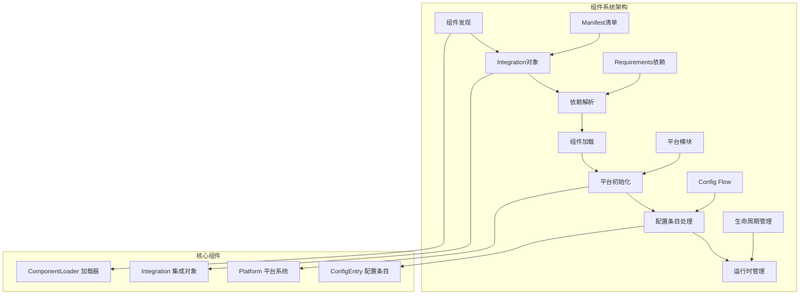
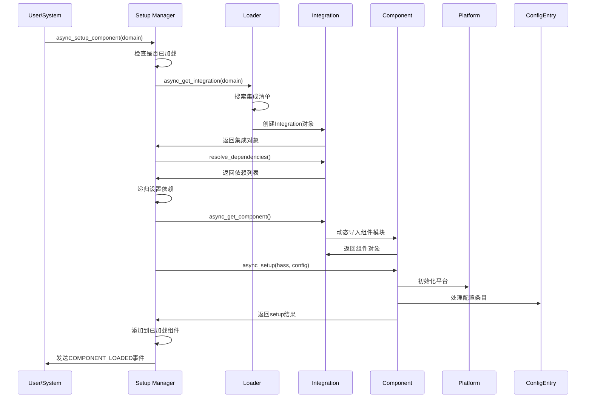
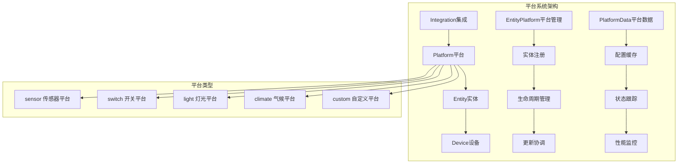
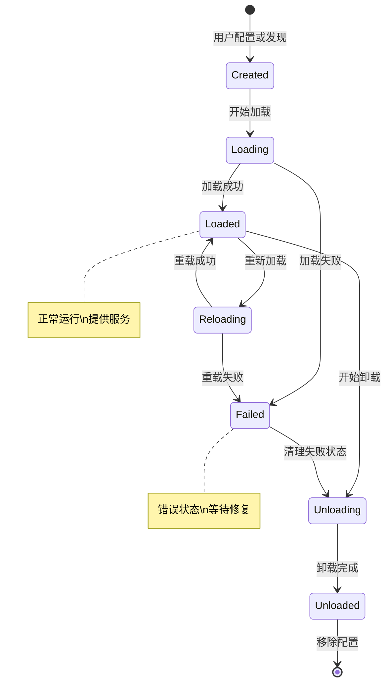
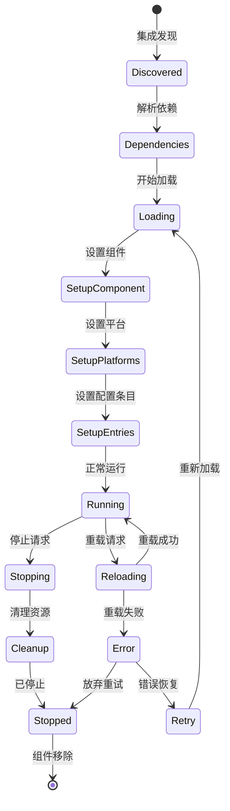

## 概述

Home Assistant的组件系统是整个平台的核心架构，负责动态加载、管理和协调数千个设备集成和功能模块。本文档深入分析组件系统的设计理念、实现机制和最佳实践。

## 1. 组件系统架构概览

### 1.1 整体架构设计



### 1.2 组件类型分类

```mermaid
classDiagram
    class Integration {
        <<Abstract>>
        +str domain
        +dict manifest  
        +str pkg_path
        +set dependencies
        +set platforms
        +bool is_built_in
        +async_get_component() ComponentProtocol
    }
    
    class BuiltinIntegration {
        +bool is_built_in = true
        +str pkg_path = "homeassistant.components.{domain}"
        +validate() bool
    }
    
    class CustomIntegration {
        +bool is_built_in = false
        +str version
        +validate_version() bool
        +check_dependencies() bool
    }
    
    class VirtualIntegration {
        +str integration_type = "virtual"
        +bool has_platforms = false
        +setup_virtual() bool
    }
    
    Integration <|-- BuiltinIntegration
    Integration <|-- CustomIntegration
    Integration <|-- VirtualIntegration
```

## 2. Integration集成类详解

### 2.1 核心数据结构

```python
@final
class Integration:
    """Home Assistant集成对象 - 组件系统的核心抽象
    
    职责:

        1. 封装集成的元数据和配置信息
        2. 管理组件的动态加载和缓存
        3. 处理平台发现和依赖关系
        4. 提供统一的组件访问接口
        
    关键属性:
        - domain: 集成域名，全局唯一标识符
        - manifest: 集成清单，包含所有元数据
        - pkg_path: Python包路径，用于动态导入
        - file_path: 文件系统路径，指向集成目录
        - dependencies: 依赖的其他集成列表
        - platforms: 支持的平台列表
    """
    
    def __init__(
        self,
        hass: HomeAssistant,
        pkg_path: str,
        file_path: pathlib.Path,
        manifest: Manifest,
        all_files: set[str] | None,
    ) -> None:
        """初始化集成对象
        
        参数:
            hass: Home Assistant核心实例
            pkg_path: Python包导入路径
            file_path: 集成文件系统路径
            manifest: 解析后的manifest.json内容
            all_files: 集成目录中的所有文件列表
            
        初始化过程:
            1. 解析和验证manifest.json
            2. 设置导入执行器和缓存
            3. 发现可用平台
            4. 预处理依赖关系
        """
        self.hass = hass
        self.pkg_path = pkg_path
        self.file_path = file_path
        self.manifest = manifest
        self.all_files = all_files
        
        # 核心属性提取
        self.domain = manifest["domain"]
        self.dependencies = set(manifest.get("dependencies", []))
        self.after_dependencies = set(manifest.get("after_dependencies", []))
        
        # 导入管理
        self.import_executor = hass.import_executor
        self._cache: dict[str, ModuleType] = {}
        
        # 平台发现
        if all_files is not None:
            self._platforms_to_preload = BASE_PRELOAD_PLATFORMS.copy()
            self._available_platforms = {
                platform for platform in all_files
                if platform.endswith('.py') and platform != '__init__.py'
            }
        else:
            self._platforms_to_preload = set()
            self._available_platforms = set()
    
    @cached_property
    def name(self) -> str:
        """集成显示名称 - 支持国际化
        
        返回值:
            集成的用户友好名称，优先使用翻译版本
            
        查找顺序:
            1. 当前语言的翻译名称
            2. manifest中的name字段
            3. domain作为后备名称
        """
        return self.manifest.get("name", self.domain)
    
    @cached_property
    def disabled(self) -> str | None:
        """集成禁用原因
        
        返回值:
            禁用原因字符串，未禁用时返回None
            
        禁用场景:
            - 不支持的硬件平台
            - 缺少必要的系统依赖
            - 安全或兼容性问题
        """
        return self.manifest.get("disabled")
    
    @cached_property
    def config_flow(self) -> bool:
        """是否支持配置流
        
        配置流用途:
            - 用户界面配置向导
            - 设备自动发现
            - 动态配置管理
        """
        return "config_flow" in self.manifest
    
    @cached_property
    def documentation(self) -> str | None:
        """文档链接地址"""
        return self.manifest.get("documentation")
    
    @cached_property
    def requirements(self) -> list[str]:
        """Python依赖包列表
        
        返回值:
            pip install格式的依赖包列表
            
        示例:
            ["requests>=2.25.0", "pyyaml", "aiohttp>=3.8.0"]
        """
        return self.manifest.get("requirements", [])
    
    @cached_property
    def version(self) -> AwesomeVersion | None:
        """集成版本号
        
        版本格式支持:
            - Semantic Versioning (1.2.3)
            - Calendar Versioning (2023.12.1)
            - Simple Versioning (1.0)
        """
        if version_str := self.manifest.get("version"):
            try:
                return AwesomeVersion(version_str)
            except AwesomeVersionException:
                return None
        return None
    
    def platforms_exists(self, platforms: Iterable[str]) -> list[str]:
        """检查平台模块是否存在
        
        参数:
            platforms: 要检查的平台名称列表
            
        返回值:
            实际存在的平台名称列表
            
        用途:
            - 动态平台发现
            - 条件平台加载
            - 功能可用性检查
        """
        if self.all_files is None:
            # Virtual integration，通过实际导入检查
            existing = []
            for platform in platforms:
                try:
                    with contextlib.suppress(ImportError):
                        importlib.import_module(f"{self.pkg_path}.{platform}")
                        existing.append(platform)
                except Exception:
                    continue
            return existing
        
        # 文件系统检查
        return [
            platform for platform in platforms
            if f"{platform}.py" in self.all_files
        ]
    
    async def async_get_component(self) -> ComponentProtocol:
        """异步获取组件模块 - 线程安全的组件加载
        
        返回值:
            组件模块对象，实现ComponentProtocol接口
            
        加载流程:
            1. 检查缓存，避免重复加载
            2. 在导入执行器中执行I/O密集的导入操作  
            3. 预加载相关平台模块
            4. 缓存结果供后续使用
            
        异常处理:
            - ImportError: 模块导入失败
            - RuntimeError: 运行时导入错误（如死锁）
            - 其他异常: 转换为ImportError统一处理
        """
        domain = self.domain
        
        # 检查缓存
        if domain in (cache := self._cache):
            return cache[domain]
        
        # 在导入执行器中加载组件
        if self.import_executor:
            # 避免在事件循环中执行可能阻塞的导入操作
            comp = await self.hass.async_add_executor_job(
                self._get_component, True  # preload_platforms=True
            )
        else:
            # 开发模式或特殊情况下的同步加载
            comp = self._get_component(preload_platforms=True)
        
        return comp
    
    def _get_component(self, preload_platforms: bool = False) -> ComponentProtocol:
        """同步组件加载实现 - 实际的模块导入逻辑
        
        参数:
            preload_platforms: 是否预加载平台模块
            
        返回值:
            加载的组件模块
            
        预加载策略:
            预加载常用平台可以减少后续加载延迟，
            但会增加内存使用和启动时间。
        """
        cache = self._cache
        domain = self.domain
        
        try:
            # 动态导入组件主模块
            cache[domain] = cast(
                ComponentProtocol, importlib.import_module(self.pkg_path)
            )
        except ImportError:
            # 导入错误直接向上传播
            raise
        except RuntimeError as err:
            # 处理死锁等运行时错误
            raise ImportError(f"RuntimeError importing {self.pkg_path}: {err}") from err
        except Exception as err:
            # 其他异常统一处理
            _LOGGER.exception("Unexpected exception importing component %s", self.pkg_path)
            raise ImportError(f"Exception importing {self.pkg_path}") from err
        
        # 预加载平台模块
        if preload_platforms:
            for platform_name in self.platforms_exists(self._platforms_to_preload):
                with contextlib.suppress(ImportError):
                    self.get_platform(platform_name)
        
        return cache[domain]
    
    async def async_get_platform(self, platform_name: str) -> ModuleType:
        """异步获取平台模块
        
        参数:
            platform_name: 平台名称，如'sensor'、'switch'等
            
        返回值:
            平台模块对象
            
        平台加载逻辑:
            1. 构建平台模块路径
            2. 在导入执行器中异步加载
            3. 缓存平台模块避免重复加载
            4. 处理加载异常和错误恢复
        """
        if self.import_executor:
            return await self.hass.async_add_executor_job(
                self.get_platform, platform_name
            )
        return self.get_platform(platform_name)
    
    def get_platform(self, platform_name: str) -> ModuleType:
        """同步获取平台模块 - 平台模块的实际加载
        
        参数:
            platform_name: 平台名称
            
        返回值:
            平台模块对象
            
        模块路径构建:
            集成平台模块路径格式为：{pkg_path}.{platform_name}
            例如：homeassistant.components.light.hue
        """
        cache = self._cache
        platform_path = f"{self.pkg_path}.{platform_name}"
        
        # 检查缓存
        if platform_path in cache:
            return cache[platform_path]
        
        # 动态导入平台模块
        cache[platform_path] = importlib.import_module(platform_path)
        return cache[platform_path]

```

### 2.2 Manifest清单系统

```python
class Manifest(TypedDict, total=False):
    """集成清单文件结构定义 - manifest.json的类型化表示
    
    manifest.json是每个集成的元数据文件，包含：

        - 基本信息：名称、版本、描述
        - 依赖关系：Python包依赖、集成依赖
        - 功能特性：支持的平台、配置方式
        - 集成分类：设备类型、服务类型等
    """
    
    # 必需字段
    domain: str                          # 集成域名，全局唯一
    name: str                           # 显示名称
    
    # 可选基本信息  
    version: str                        # 版本号
    documentation: str                  # 文档链接
    issue_tracker: str                  # 问题跟踪链接
    quality_scale: str                  # 质量评级
    
    # 依赖管理
    dependencies: list[str]             # 必需的集成依赖
    after_dependencies: list[str]       # 可选的加载顺序依赖
    requirements: list[str]             # Python包依赖
    
    # 功能特性
    config_flow: bool                   # 是否支持配置流
    dhcp: list[dict[str, Any]]         # DHCP发现配置
    homekit: dict[str, Any]            # HomeKit集成配置
    mqtt: list[dict[str, Any]]         # MQTT发现配置
    ssdp: list[dict[str, Any]]         # SSDP发现配置  
    usb: list[dict[str, Any]]          # USB设备发现
    zeroconf: list[dict[str, Any]]     # Zeroconf/mDNS发现
    
    # 集成分类
    integration_type: str               # 集成类型：device/service/system/virtual
    iot_class: str                     # IoT分类：cloud_polling/cloud_push/local_polling等
    
    # 平台支持
    platforms: list[str]               # 静态平台列表（可选）
    
    # 禁用和兼容性
    disabled: str                      # 禁用原因
    supported_by: str                  # 支持方式：core/community/partner

# 实际使用示例
EXAMPLE_MANIFEST = {
    "domain": "example",
    "name": "Example Integration",
    "version": "1.2.3",
    "documentation": "https://example.com/docs",
    "dependencies": ["http"],
    "after_dependencies": ["cloud"],
    "requirements": ["requests>=2.25.0"],
    "config_flow": True,
    "zeroconf": [
        {
            "type": "_example._tcp.local.",
            "name": "example-*"
        }
    ],
    "integration_type": "device",
    "iot_class": "local_polling",
    "platforms": ["sensor", "switch", "light"]
}
```

## 3. 组件加载流程深度解析

### 3.1 组件加载时序图



### 3.2 组件加载核心实现

```python
async def async_setup_component(
    hass: HomeAssistant, domain: str, config: ConfigType
) -> bool:
    """异步设置组件 - 组件加载的主要入口点
    
    参数:
        hass: Home Assistant核心实例
        domain: 要加载的组件域名
        config: 组件配置字典
        
    返回值:
        组件设置是否成功
        
    功能流程:

        1. 检查组件是否已经加载
        2. 管理并发加载请求
        3. 调用内部设置逻辑
        4. 处理加载异常和清理
        
    并发控制:
        使用Future对象确保同一组件只加载一次，
        多个并发请求会等待同一个Future完成。
    """
    # 快速检查：组件已加载
    if domain in hass.config.components:
        return True
    
    # 获取或创建设置Future字典
    setup_futures = hass.data.setdefault(_DATA_SETUP, {})
    setup_done_futures = hass.data.setdefault(_DATA_SETUP_DONE, {})
    
    # 检查是否有正在进行的设置任务
    if existing_setup_future := setup_futures.get(domain):
        _LOGGER.debug("Component %s setup is already in progress", domain)
        return await existing_setup_future
    
    # 创建新的设置Future
    setup_future = hass.loop.create_future()
    setup_futures[domain] = setup_future
    
    try:
        # 执行实际的组件设置逻辑
        result = await _async_setup_component(hass, domain, config)
        
        # 设置Future结果
        setup_future.set_result(result)
        
        # 通知等待完成的任务
        if setup_done_future := setup_done_futures.pop(domain, None):
            setup_done_future.set_result(result)
            
        return result
        
    except BaseException as err:
        # 异常处理：设置所有相关Future的异常状态
        futures_to_fail = [setup_future]
        if setup_done_future := setup_done_futures.pop(domain, None):
            futures_to_fail.append(setup_done_future)
        
        for future in futures_to_fail:
            if not future.done():
                future.set_exception(err)
                # 清理未被等待的Future
                with contextlib.suppress(BaseException):
                    await future
        raise
    
    finally:
        # 清理设置状态
        setup_futures.pop(domain, None)

async def _async_setup_component(
    hass: HomeAssistant, domain: str, config: ConfigType
) -> bool:
    """组件设置的核心实现 - 处理完整的组件加载生命周期
    
    参数:
        hass: Home Assistant核心实例
        domain: 组件域名
        config: 系统配置
        
    返回值:
        设置成功返回True，失败返回False
        
    详细流程:

        1. 获取集成对象和验证
        2. 处理依赖关系和requirements
        3. 加载和执行组件setup函数
        4. 处理配置条目和平台设置
        5. 完成组件注册和事件通知
    """
    
    # 第一步：获取集成对象
    try:
        integration = await loader.async_get_integration(hass, domain)
    except loader.IntegrationNotFound:
        _log_error_setup_error(hass, domain, None, "Integration not found.")
        return False
    
    log_error = partial(_log_error_setup_error, hass, domain, integration)
    
    # 第二步：验证集成状态
    if integration.disabled:
        log_error(f"Integration is disabled - {integration.disabled}")
        return False
    
    # 第三步：依赖关系处理
    integration_set = {domain}
    
    # 加载翻译文件（如果需要）
    load_translations_task: asyncio.Task[None] | None = None
    if integration.has_translations and not translation.async_translations_loaded(
        hass, integration_set
    ):
        load_translations_task = create_eager_task(
            translation.async_load_integrations(hass, integration_set),
            loop=hass.loop
        )
    
    # 解析和验证依赖关系
    if await integration.resolve_dependencies() is None:
        log_error("Failed to resolve dependencies")
        return False
    
    # 第四步：处理Python包依赖
    if integration.requirements:
        await _async_process_requirements(hass, integration)
    
    # 第五步：处理集成依赖
    if integration.dependencies or integration.after_dependencies:
        dep_success = await _async_process_dependencies(hass, config, integration)
        if not dep_success:
            log_error("Failed to setup dependencies")  
            return False
    
    # 第六步：加载和执行组件
    try:
        component = await integration.async_get_component()
    except ImportError as err:
        log_error(f"Unable to import component: {err}")
        return False
    
    # 执行组件setup函数
    if hasattr(component, "async_setup"):
        # 异步setup方法
        try:
            # 设置超时警告
            warn_task = hass.loop.call_later(
                SLOW_SETUP_WARNING,
                _LOGGER.warning,
                "Setup of %s is taking over %s seconds.",
                domain,
                SLOW_SETUP_WARNING,
            )
            
            # 获取组件特定配置
            component_config = config.get(domain, {})
            
            # 调用组件setup方法
            result = await component.async_setup(hass, component_config)
            
        except Exception as err:
            log_error(f"Error during setup of component: {err}")
            return False
        finally:
            if warn_task:
                warn_task.cancel()
                
        # 验证setup返回值
        if result is False:
            log_error("Component setup returned False")
            return False
        if result is not True:
            log_error(f"Component setup returned {result}, expected boolean")
            return False
    
    elif hasattr(component, "setup"):
        # 同步setup方法（已弃用）
        try:
            component_config = config.get(domain, {})
            result = await hass.async_add_executor_job(
                component.setup, hass, component_config
            )
            if not result:
                log_error("Component setup returned False")
                return False
        except Exception as err:
            log_error(f"Error during setup of component: {err}")
            return False
    
    # 第七步：等待翻译加载完成
    if load_translations_task:
        await load_translations_task
    
    # 第八步：处理配置流（如果支持）
    if integration.platforms_exists(("config_flow",)):
        await hass.config_entries.flow.async_wait_import_flow_initialized(domain)
    
    # 第九步：将组件添加到已加载列表
    hass.config.components.add(domain)
    
    # 第十步：设置现有配置条目
    entries = hass.config_entries.async_entries(
        domain, include_ignore=False, include_disabled=False
    )
    if entries:
        # 并发设置所有配置条目
        await asyncio.gather(
            *(
                create_eager_task(
                    entry.async_setup_locked(hass, integration=integration),
                    name=f"config entry setup {entry.title} {entry.domain} {entry.entry_id}",
                    loop=hass.loop,
                )
                for entry in entries
            )
        )
    
    # 第十一步：清理和通知
    hass.data[_DATA_SETUP].pop(domain, None)
    
    # 发送组件加载完成事件
    hass.bus.async_fire_internal(
        EVENT_COMPONENT_LOADED,
        EventComponentLoaded(component=domain)
    )
    
    _LOGGER.info("Component %s setup completed successfully", domain)
    return True

```

### 3.3 依赖关系管理

```python
async def _async_process_dependencies(
    hass: HomeAssistant, config: ConfigType, integration: Integration
) -> list[str]:
    """处理集成依赖关系 - 确保所有依赖集成都正确加载
    
    参数:
        hass: Home Assistant核心实例
        config: 系统配置
        integration: 当前集成对象
        
    返回值:
        成功处理的依赖集成列表
        
    依赖类型:

        1. dependencies: 硬依赖，必须成功加载
        2. after_dependencies: 软依赖，影响加载顺序但不强制成功
        
    加载策略:
        - 并发加载提升性能
        - 失败的硬依赖导致当前集成失败
        - 失败的软依赖仅记录警告
    """
    success = True
    dependencies_to_setup = set(integration.dependencies)
    after_dependencies_to_setup = set(integration.after_dependencies)
    
    # 移除已经加载的依赖
    dependencies_to_setup -= hass.config.components
    after_dependencies_to_setup -= hass.config.components
    
    if dependencies_to_setup or after_dependencies_to_setup:
        _LOGGER.debug(
            "Setting up dependencies for %s: %s, after dependencies: %s",
            integration.domain,
            dependencies_to_setup,
            after_dependencies_to_setup,
        )
        
        # 创建依赖加载任务
        dependency_tasks = []
        
        # 硬依赖任务
        for dependency in dependencies_to_setup:
            task = create_eager_task(
                async_setup_component(hass, dependency, config),
                name=f"setup dependency {dependency}",
                loop=hass.loop,
            )
            dependency_tasks.append((dependency, task, True))  # True表示必需依赖
        
        # 软依赖任务  
        for after_dependency in after_dependencies_to_setup:
            task = create_eager_task(
                async_setup_component(hass, after_dependency, config),
                name=f"setup after dependency {after_dependency}",
                loop=hass.loop,
            )
            dependency_tasks.append((after_dependency, task, False))  # False表示可选依赖
        
        # 等待所有依赖加载完成
        for dependency, task, required in dependency_tasks:
            try:
                result = await task
                if required and not result:
                    _LOGGER.error(
                        "Unable to set up dependency %s for %s",
                        dependency,
                        integration.domain,
                    )
                    success = False
                elif not result:
                    _LOGGER.warning(
                        "Unable to set up after dependency %s for %s",
                        dependency,
                        integration.domain,
                    )
            except Exception as err:
                if required:
                    _LOGGER.error(
                        "Error setting up dependency %s for %s: %s",
                        dependency,
                        integration.domain,
                        err,
                    )
                    success = False
                else:
                    _LOGGER.warning(
                        "Error setting up after dependency %s for %s: %s",
                        dependency,
                        integration.domain,
                        err,
                    )
    
    return success

async def _async_process_requirements(
    hass: HomeAssistant, integration: Integration
) -> None:
    """处理Python包依赖 - 安装集成所需的Python包
    
    参数:
        hass: Home Assistant核心实例
        integration: 集成对象
        
    功能:

        1. 解析requirements列表
        2. 检查包是否已安装
        3. 使用pip安装缺失的包
        4. 处理安装错误和版本冲突
        
    安全考虑:
        - 仅安装来自可信源的包
        - 验证包签名和完整性
        - 限制安装权限和沙箱化
    """
    if not integration.requirements:
        return
    
    _LOGGER.debug(
        "Processing requirements for %s: %s",
        integration.domain,
        integration.requirements,
    )
    
    # 检查是否已处理过这些依赖
    deps_reqs = hass.data.setdefault(_DATA_DEPS_REQS, set())
    requirements_set = set(integration.requirements)
    
    if requirements_set.issubset(deps_reqs):
        _LOGGER.debug("Requirements for %s already processed", integration.domain)
        return
    
    try:
        # 安装Python包依赖
        await requirements.async_process_requirements(
            hass, integration.domain, integration.requirements
        )
        
        # 标记为已处理
        deps_reqs.update(requirements_set)
        
        _LOGGER.debug(
            "Requirements for %s installed successfully",
            integration.domain
        )
        
    except requirements.RequirementsNotFound as err:
        _LOGGER.error(
            "Requirements for %s not found: %s",
            integration.domain,
            err,
        )
        raise
    except Exception as err:
        _LOGGER.error(
            "Error installing requirements for %s: %s",
            integration.domain,
            err,
        )
        raise

```

## 4. 平台系统架构

### 4.1 平台系统概览



### 4.2 平台加载和管理

```python
async def async_prepare_setup_platform(
    hass: HomeAssistant, hass_config: ConfigType, domain: str, platform_name: str
) -> ModuleType | None:
    """准备平台设置 - 平台加载的预处理阶段
    
    参数:
        hass: Home Assistant核心实例
        hass_config: 全局配置
        domain: 平台域名，如'sensor'、'switch'等
        platform_name: 集成名称，如'hue'、'mqtt'等
        
    返回值:
        平台模块对象，失败时返回None
        
    功能:

        1. 验证平台配置格式
        2. 加载集成和平台模块
        3. 检查平台兼容性
        4. 准备平台初始化数据
        
    平台路径解析:
        平台模块路径: {integration_pkg}.{domain}
        例如: homeassistant.components.hue.light
    """
    try:
        # 获取集成对象
        integration = await loader.async_get_integration(hass, platform_name)
        
        # 检查平台是否存在
        if not integration.platforms_exists([domain]):
            _LOGGER.warning(
                "Platform %s does not exist for integration %s",
                domain,
                platform_name,
            )
            return None
        
        # 异步加载平台模块
        platform = await integration.async_get_platform(domain)
        
        # 验证平台接口
        if not hasattr(platform, "async_setup_platform") and not hasattr(platform, "setup_platform"):
            _LOGGER.error(
                "Platform %s.%s does not implement setup method",
                platform_name,
                domain,
            )
            return None
        
        _LOGGER.debug(
            "Platform %s.%s loaded successfully",
            platform_name,
            domain
        )
        
        return platform
        
    except Exception as err:
        _LOGGER.error(
            "Error loading platform %s.%s: %s",
            platform_name,
            domain,
            err,
        )
        return None

# 平台设置的完整实现
async def async_setup_platform(
    hass: HomeAssistant,
    domain: str,
    platform_config: ConfigType,
    async_add_entities: Callable,
    discovery_info: dict | None = None,
) -> bool:
    """设置平台实例 - 平台设置的完整流程
    
    参数:
        hass: Home Assistant核心实例
        domain: 平台域名
        platform_config: 平台特定配置
        async_add_entities: 实体添加回调函数
        discovery_info: 发现的设备信息
        
    返回值:
        平台设置是否成功
        
    设置流程:

        1. 解析平台配置
        2. 调用平台setup方法
        3. 注册创建的实体
        4. 设置平台生命周期管理
    """
    platform_name = platform_config.get("platform")
    if not platform_name:
        _LOGGER.error("No platform specified for %s", domain)
        return False
    
    try:
        # 准备平台模块
        platform = await async_prepare_setup_platform(
            hass, {}, domain, platform_name
        )
        if not platform:
            return False
        
        # 调用平台setup方法
        if hasattr(platform, "async_setup_platform"):
            # 异步setup方法（推荐）
            result = await platform.async_setup_platform(
                hass, platform_config, async_add_entities, discovery_info
            )
        elif hasattr(platform, "setup_platform"):  
            # 同步setup方法（已弃用）
            result = await hass.async_add_executor_job(
                platform.setup_platform,
                hass, platform_config, async_add_entities, discovery_info
            )
        else:
            _LOGGER.error(
                "Platform %s.%s has no setup method",
                platform_name, domain
            )
            return False
        
        # 验证setup结果
        if result is False:
            _LOGGER.error(
                "Platform %s.%s setup failed",
                platform_name, domain
            )
            return False
            
        _LOGGER.info(
            "Platform %s.%s setup completed successfully",
            platform_name, domain  
        )
        return True
        
    except Exception as err:
        _LOGGER.exception(
            "Error setting up platform %s.%s: %s",
            platform_name, domain, err
        )
        return False

```

## 5. 配置条目系统

### 5.1 配置条目生命周期



### 5.2 配置条目管理

```python
class ConfigEntry:
    """配置条目类 - 管理集成的动态配置实例
    
    职责:

        1. 存储集成配置数据
        2. 管理配置生命周期
        3. 处理配置更新和重载
        4. 维护配置状态和错误信息
        
    核心概念:
        - 一个集成可以有多个配置条目
        - 每个配置条目对应一个设备或服务实例
        - 配置条目支持运行时添加、删除、修改
    """
    
    def __init__(
        self,
        *,
        version: int = 1,
        domain: str,
        title: str,
        data: dict[str, Any],
        options: dict[str, Any] | None = None,
        system_options: dict[str, Any] | None = None,
        source: str = SOURCE_USER,
        connection_class: str = CONN_CLASS_UNKNOWN,
        unique_id: str | None = None,
        entry_id: str | None = None,
    ) -> None:
        """初始化配置条目
        
        参数:
            version: 配置条目版本号
            domain: 所属集成域名
            title: 用户友好的标题
            data: 配置数据字典
            options: 可选配置项
            system_options: 系统级配置选项
            source: 配置来源（用户配置/自动发现等）
            connection_class: 连接类型分类
            unique_id: 全局唯一标识符
            entry_id: 配置条目ID
        """
        self.version = version
        self.domain = domain
        self.title = title
        self.data = data
        self.options = options or {}
        self.system_options = system_options or {}
        self.source = source
        self.connection_class = connection_class
        self.unique_id = unique_id
        self.entry_id = entry_id or ulid_now()
        
        # 运行时状态
        self.state = ConfigEntryState.NOT_LOADED
        self.disabled_by: str | None = None
        self.reason: str | None = None
        
        # 内部管理
        self._async_cancel_retry_setup: Callable[[], None] | None = None
        self._reauth_lock = asyncio.Lock()
    
    async def async_setup(
        self,
        hass: HomeAssistant,
        *,
        integration: Integration | None = None,
    ) -> bool:
        """异步设置配置条目 - 配置条目的核心加载逻辑
        
        参数:
            hass: Home Assistant核心实例
            integration: 可选的集成对象（性能优化）
            
        返回值:
            设置是否成功
            
        设置流程:
            1. 更新条目状态为LOADING
            2. 获取集成对象和组件
            3. 调用组件的async_setup_entry方法
            4. 处理设置结果和异常
            5. 更新条目状态
        """
        # 状态检查
        if self.state != ConfigEntryState.NOT_LOADED:
            _LOGGER.warning(
                "Config entry %s (%s) is already loaded",
                self.title, self.entry_id
            )
            return self.state == ConfigEntryState.LOADED
        
        # 更新状态为加载中
        self.state = ConfigEntryState.LOADING
        
        try:
            # 获取集成对象
            if integration is None:
                integration = await loader.async_get_integration(hass, self.domain)
            
            # 获取组件模块
            component = await integration.async_get_component()
            
            # 检查组件是否支持配置条目
            if not hasattr(component, "async_setup_entry"):
                _LOGGER.error(
                    "Integration %s does not support config entries",
                    self.domain
                )
                self.state = ConfigEntryState.SETUP_ERROR
                return False
            
            # 调用组件的配置条目设置方法
            _LOGGER.info("Setting up config entry %s for %s", self.title, self.domain)
            
            result = await component.async_setup_entry(hass, self)
            
            if result:
                self.state = ConfigEntryState.LOADED
                _LOGGER.info(
                    "Config entry %s for %s setup successfully",
                    self.title, self.domain
                )
                
                # 发送设置完成事件
                hass.bus.async_fire(
                    EVENT_CONFIG_ENTRY_LOADED,
                    {"domain": self.domain, "entry_id": self.entry_id}
                )
                
                return True
            else:
                self.state = ConfigEntryState.SETUP_ERROR
                self.reason = "Setup returned False"
                _LOGGER.error(
                    "Config entry %s for %s setup failed",
                    self.title, self.domain
                )
                return False
                
        except Exception as err:
            self.state = ConfigEntryState.SETUP_ERROR
            self.reason = str(err)
            _LOGGER.exception(
                "Error setting up config entry %s for %s",
                self.title, self.domain
            )
            return False
    
    async def async_unload(self, hass: HomeAssistant) -> bool:
        """异步卸载配置条目 - 清理配置条目的所有资源
        
        参数:
            hass: Home Assistant核心实例
            
        返回值:
            卸载是否成功
            
        卸载流程:
            1. 检查当前状态
            2. 调用组件的async_unload_entry方法
            3. 清理相关资源和平台
            4. 更新条目状态
        """
        if self.state not in (ConfigEntryState.LOADED, ConfigEntryState.SETUP_ERROR):
            _LOGGER.warning(
                "Config entry %s (%s) is not loaded, cannot unload",
                self.title, self.entry_id
            )
            return True
        
        self.state = ConfigEntryState.NOT_LOADED
        
        try:
            # 获取集成和组件
            integration = await loader.async_get_integration(hass, self.domain)
            component = await integration.async_get_component()
            
            # 调用组件的卸载方法
            if hasattr(component, "async_unload_entry"):
                _LOGGER.info("Unloading config entry %s for %s", self.title, self.domain)
                
                result = await component.async_unload_entry(hass, self)
                
                if result:
                    _LOGGER.info(
                        "Config entry %s for %s unloaded successfully",
                        self.title, self.domain
                    )
                    
                    # 发送卸载完成事件
                    hass.bus.async_fire(
                        EVENT_CONFIG_ENTRY_UNLOADED,
                        {"domain": self.domain, "entry_id": self.entry_id}
                    )
                    
                    return True
                else:
                    _LOGGER.error(
                        "Config entry %s for %s unload failed",
                        self.title, self.domain
                    )
                    return False
            else:
                # 组件不支持卸载，假定成功
                _LOGGER.debug(
                    "Integration %s does not support config entry unloading",
                    self.domain
                )
                return True
                
        except Exception as err:
            _LOGGER.exception(
                "Error unloading config entry %s for %s: %s",
                self.title, self.domain, err
            )
            return False
    
    async def async_reload(self, hass: HomeAssistant) -> bool:
        """异步重载配置条目 - 重新加载配置条目
        
        返回值:
            重载是否成功
            
        重载策略:
            1. 先尝试卸载现有配置
            2. 然后重新加载配置
            3. 保持配置数据不变
        """
        _LOGGER.info("Reloading config entry %s for %s", self.title, self.domain)
        
        # 卸载现有配置
        unload_success = await self.async_unload(hass)
        if not unload_success:
            _LOGGER.error("Failed to unload config entry for reload")
            return False
        
        # 重新加载配置
        setup_success = await self.async_setup(hass)
        if not setup_success:
            _LOGGER.error("Failed to setup config entry after reload")
            return False
        
        _LOGGER.info(
            "Config entry %s for %s reloaded successfully",
            self.title, self.domain
        )
        return True

```

## 6. 组件生命周期管理

### 6.1 组件状态管理



### 6.2 组件监控和调试

```python
class ComponentMonitor:
    """组件监控器 - 监控组件加载性能和健康状态
    
    功能:

        1. 记录组件加载时间
        2. 跟踪组件依赖关系
        3. 监控组件错误状态
        4. 提供调试和诊断信息
    """
    
    def __init__(self, hass: HomeAssistant) -> None:
        self.hass = hass
        self._setup_times: dict[str, float] = {}
        self._setup_phases: defaultdict[str, dict[str, float]] = defaultdict(dict)
        self._failed_setups: dict[str, str] = {}
        
        # 监听组件加载事件
        hass.bus.async_listen(EVENT_COMPONENT_LOADED, self._component_loaded)
    
    @callback
    def _component_loaded(self, event: Event) -> None:
        """处理组件加载完成事件"""
        domain = event.data["component"]
        
        # 记录加载完成时间
        if domain in self._setup_times:
            load_time = time.time() - self._setup_times[domain]
            _LOGGER.info(
                "Component %s loaded in %.2f seconds",
                domain, load_time
            )
            
            # 记录慢加载组件
            if load_time > SLOW_SETUP_WARNING:
                _LOGGER.warning(
                    "Component %s took %.2f seconds to load (slow)",
                    domain, load_time
                )
    
    def start_setup_timer(self, domain: str) -> None:
        """开始组件设置计时"""
        self._setup_times[domain] = time.time()
    
    def record_setup_phase(self, domain: str, phase: str, duration: float) -> None:
        """记录组件设置阶段耗时"""
        self._setup_phases[domain][phase] = duration
    
    def record_setup_failure(self, domain: str, error: str) -> None:
        """记录组件设置失败"""
        self._failed_setups[domain] = error
    
    def get_setup_report(self) -> dict[str, Any]:
        """获取组件设置报告"""
        return {
            "loaded_components": list(self.hass.config.components),
            "setup_times": self._setup_times,
            "setup_phases": dict(self._setup_phases),
            "failed_setups": self._failed_setups,
            "total_components": len(self.hass.config.components),
        }

# 组件诊断工具
async def async_diagnose_component(
    hass: HomeAssistant, domain: str
) -> dict[str, Any]:
    """诊断组件状态 - 提供组件的详细诊断信息
    
    参数:
        hass: Home Assistant核心实例
        domain: 要诊断的组件域名
        
    返回值:
        包含诊断信息的字典
    """
    diagnostic_info = {
        "domain": domain,
        "is_loaded": domain in hass.config.components,
        "timestamp": dt_util.utcnow().isoformat(),
    }
    
    try:
        # 获取集成信息
        integration = await loader.async_get_integration(hass, domain)
        diagnostic_info.update({
            "integration_info": {
                "name": integration.name,
                "version": str(integration.version) if integration.version else None,
                "documentation": integration.documentation,
                "dependencies": list(integration.dependencies),
                "after_dependencies": list(integration.after_dependencies),
                "requirements": integration.requirements,
                "platforms": list(integration._available_platforms or []),
                "config_flow": integration.config_flow,
                "is_built_in": integration.is_built_in,
            }
        })
        
        # 配置条目信息
        entries = hass.config_entries.async_entries(domain)
        diagnostic_info["config_entries"] = [
            {
                "entry_id": entry.entry_id,
                "title": entry.title,
                "state": entry.state,
                "source": entry.source,
                "unique_id": entry.unique_id,
            }
            for entry in entries
        ]
        
        # 实体统计
        entity_count = len([
            state.entity_id for state in hass.states.async_all()
            if state.entity_id.startswith(f"{domain}.")
        ])
        diagnostic_info["entity_count"] = entity_count
        
        # 服务信息
        services = hass.services.async_services_for_domain(domain)
        diagnostic_info["services"] = list(services.keys())
        
    except Exception as err:
        diagnostic_info["error"] = str(err)
        diagnostic_info["error_type"] = type(err).__name__
    
    return diagnostic_info
```

## 7. 最佳实践和性能优化

### 7.1 组件开发最佳实践

```python
"""组件开发最佳实践示例"""

# 1. 标准组件结构
DOMAIN = "example"
PLATFORMS = ["sensor", "switch", "light"]

async def async_setup(hass: HomeAssistant, config: ConfigType) -> bool:
    """组件设置入口点 - 推荐的组件初始化模式
    
    最佳实践:

        1. 验证配置参数
        2. 初始化共享资源
        3. 设置数据存储
        4. 注册服务
        5. 设置平台
    """
    # 验证配置
    if DOMAIN not in config:
        _LOGGER.info("No configuration found for %s", DOMAIN)
        return True
    
    component_config = config[DOMAIN]
    
    # 初始化组件数据存储
    hass.data.setdefault(DOMAIN, {})
    hass.data[DOMAIN]["config"] = component_config
    
    # 初始化共享API客户端
    api_client = APIClient(component_config["host"], component_config["api_key"])
    hass.data[DOMAIN]["api"] = api_client
    
    # 注册组件服务
    async def async_reload_service(call: ServiceCall) -> None:
        """重载组件服务"""
        await async_reload_component(hass, DOMAIN)
    
    hass.services.async_register(
        DOMAIN, "reload", async_reload_service
    )
    
    # 设置平台
    for platform in PLATFORMS:
        if platform in component_config:
            hass.async_create_task(
                hass.helpers.discovery.async_load_platform(
                    platform, DOMAIN, component_config[platform], config
                )
            )
    
    return True

async def async_setup_entry(hass: HomeAssistant, entry: ConfigEntry) -> bool:
    """配置条目设置 - 现代集成的标准入口点
    
    最佳实践:

        1. 验证配置条目数据
        2. 建立外部连接
        3. 初始化更新协调器
        4. 设置平台转发
        5. 注册重载监听器
    """
    # 提取配置数据
    host = entry.data["host"]
    api_key = entry.data["api_key"]
    
    # 建立API连接
    api_client = APIClient(host, api_key)
    
    # 测试连接
    try:
        await api_client.async_test_connection()
    except ConnectionError as err:
        _LOGGER.error("Failed to connect to %s: %s", host, err)
        raise ConfigEntryNotReady(f"Connection failed: {err}") from err
    
    # 初始化数据更新协调器
    coordinator = DataUpdateCoordinator(
        hass,
        _LOGGER,
        name=f"{DOMAIN}_{entry.entry_id}",
        update_method=api_client.async_get_data,
        update_interval=timedelta(seconds=30),
    )
    
    # 首次数据获取
    await coordinator.async_config_entry_first_refresh()
    
    # 存储配置条目数据
    hass.data.setdefault(DOMAIN, {})
    hass.data[DOMAIN][entry.entry_id] = {
        "api": api_client,
        "coordinator": coordinator,
    }
    
    # 设置平台转发
    await hass.config_entries.async_forward_entry_setups(entry, PLATFORMS)
    
    # 注册重载监听器
    entry.async_on_unload(
        hass.bus.async_listen_once(
            EVENT_HOMEASSISTANT_STOP, coordinator.async_shutdown
        )
    )
    
    return True

async def async_unload_entry(hass: HomeAssistant, entry: ConfigEntry) -> bool:
    """配置条目卸载 - 资源清理的标准实现
    
    最佳实践:

        1. 卸载所有平台
        2. 停止更新协调器
        3. 关闭外部连接
        4. 清理存储数据
        5. 取消注册服务
    """
    # 卸载平台
    unload_ok = await hass.config_entries.async_unload_platforms(
        entry, PLATFORMS
    )
    
    if unload_ok:
        # 清理存储的数据
        data = hass.data[DOMAIN].pop(entry.entry_id)
        
        # 停止协调器
        await data["coordinator"].async_shutdown()
        
        # 关闭API连接
        await data["api"].async_close()
    
    return unload_ok

# 2. 错误处理和重试机制
class ResilientAPIClient:
    """弹性API客户端实现"""
    
    def __init__(self, host: str, api_key: str):
        self.host = host
        self.api_key = api_key
        self._session = None
        self._retry_count = 0
        self._max_retries = 3
    
    async def async_get_data(self) -> dict[str, Any]:
        """获取数据，带重试机制"""
        for attempt in range(self._max_retries):
            try:
                return await self._async_fetch_data()
            except aiohttp.ClientError as err:
                if attempt == self._max_retries - 1:
                    raise UpdateFailed(f"Failed after {self._max_retries} attempts") from err
                
                # 指数退避重试
                wait_time = 2 ** attempt
                _LOGGER.warning(
                    "API request failed, retrying in %d seconds (attempt %d/%d)",
                    wait_time, attempt + 1, self._max_retries
                )
                await asyncio.sleep(wait_time)
        
        raise UpdateFailed("Maximum retries exceeded")
```

### 7.2 性能优化建议

```python
"""组件性能优化技巧"""

# 1. 使用连接池优化HTTP请求
class OptimizedAPIClient:
    """优化的API客户端"""
    
    def __init__(self):
        # 配置连接池
        connector = aiohttp.TCPConnector(
            limit=10,                    # 总连接数
            limit_per_host=5,           # 每主机连接数
            keepalive_timeout=60,       # 保活超时
            use_dns_cache=True,         # DNS缓存
            ttl_dns_cache=300,          # DNS缓存TTL
        )
        
        # 创建优化的会话
        self._session = aiohttp.ClientSession(
            connector=connector,
            timeout=aiohttp.ClientTimeout(total=30),
            headers={"User-Agent": "HomeAssistant/1.0"}
        )
    
    async def async_close(self):
        """关闭会话和连接池"""
        await self._session.close()

# 2. 批量操作优化
async def async_batch_entity_update(
    hass: HomeAssistant,
    updates: list[tuple[str, str, dict]]
) -> None:
    """批量更新实体状态"""
    
    # 创建批量更新任务
    tasks = []
    for entity_id, state, attributes in updates:
        task = hass.async_create_task(
            hass.states.async_set(entity_id, state, attributes)
        )
        tasks.append(task)
    
    # 并发执行所有更新
    await asyncio.gather(*tasks, return_exceptions=True)

# 3. 缓存机制优化
from functools import lru_cache
from typing import Any

class CachedDataProvider:
    """带缓存的数据提供者"""
    
    def __init__(self):
        self._cache_ttl = 300  # 5分钟缓存
        self._last_update = 0
        self._cached_data = None
    
    @lru_cache(maxsize=128)
    def get_processed_data(self, raw_data_hash: int) -> dict[str, Any]:
        """缓存处理后的数据"""
        # 这里放置耗时的数据处理逻辑
        return self._process_data(raw_data_hash)
    
    async def async_get_data(self) -> dict[str, Any]:
        """获取数据，使用时间缓存"""
        now = time.time()
        if now - self._last_update > self._cache_ttl:
            self._cached_data = await self._fetch_fresh_data()
            self._last_update = now
        
        return self._cached_data
```

## 8. 总结

Home Assistant的组件系统是一个高度模块化、可扩展的架构，通过以下关键特性实现了强大的功能：

### 8.1 核心优势
1. **动态加载**：支持运行时组件加载和卸载
2. **依赖管理**：智能的依赖解析和加载顺序控制
3. **平台抽象**：统一的平台接口支持多种设备类型
4. **配置灵活**：支持多种配置方式和动态配置更新
5. **错误恢复**：完善的错误处理和重试机制

### 8.2 扩展能力
- 支持数千种设备和服务集成
- 热插拔式的组件管理
- 多种发现机制（DHCP、mDNS、SSDP等）
- 灵活的配置流和用户界面

### 8.3 性能特性
- 异步并发加载
- 智能缓存和预加载
- 资源池化和重用
- 内存优化设计

这个组件系统为Home Assistant提供了强大的扩展能力和稳定的运行基础，使其能够支持复杂的智能家居环境和快速增长的生态系统。

## 下一步分析

接下来将继续深入分析其他核心模块：

- [实体和平台系统详解](/posts/04-实体平台分析/)
- [配置和数据存储系统](/posts/06-数据存储分析/)
