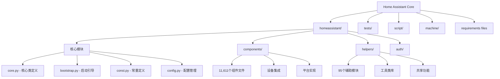
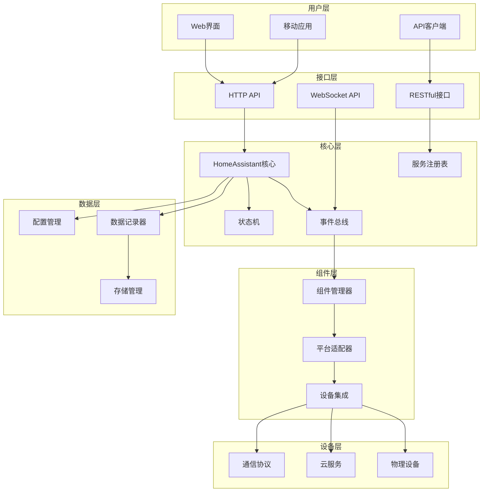
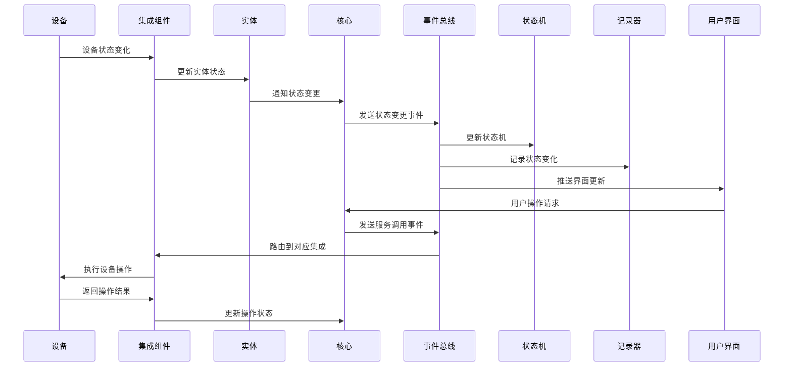
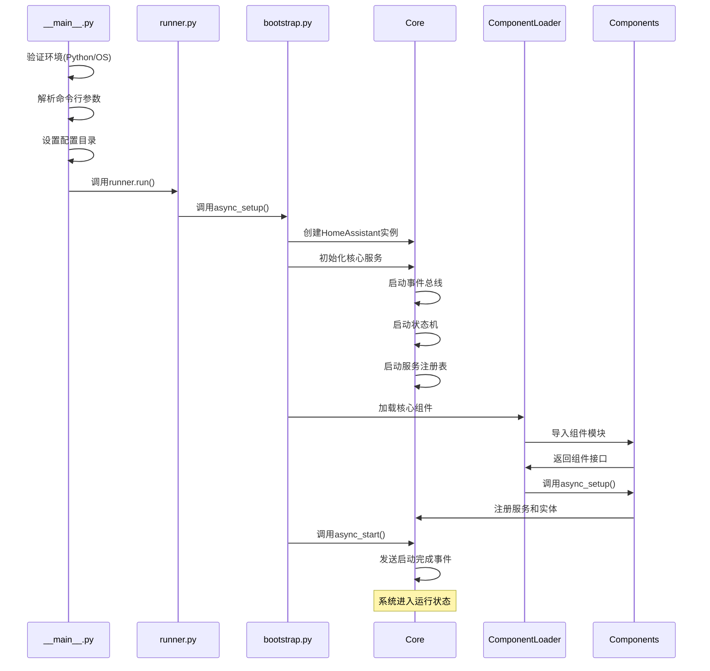

## 项目概述

Home Assistant Core 是一个用Python编写的开源智能家居自动化平台，为用户提供统一的设备控制、自动化规则和数据监控能力。该项目采用事件驱动的异步架构，支持数千种设备和服务的集成。

## 目录结构分析



### 核心目录详解

#### 1. `homeassistant/` - 核心代码目录
这是整个项目的核心，包含以下关键组件：

**核心模块文件：**

- `__init__.py` - 包初始化（简单的版本标识）
- `__main__.py` - 程序入口点，处理命令行参数和启动流程
- `core.py` - 定义核心类 `HomeAssistant`、`Entity`、事件系统等
- `bootstrap.py` - 系统启动和初始化逻辑
- `const.py` - 全局常量定义，包含版本号、配置项、事件类型等
- `config.py` - 配置文件解析和验证
- `runner.py` - 运行时管理器

**重要子目录：**

- `auth/` - 认证和权限管理系统
- `components/` - 设备和服务集成（超过11,000个文件）
- `helpers/` - 辅助工具和共享功能模块
- `util/` - 底层工具函数库

#### 2. `tests/` - 测试代码
包含完整的测试套件，测试覆盖了：

- 核心功能测试
- 组件集成测试  
- 辅助功能测试
- 回归测试

#### 3. `script/` - 构建和维护脚本
- 代码生成脚本
- 构建工具
- 开发辅助脚本

#### 4. `machine/` - 硬件平台配置
支持各种硬件平台的配置文件，包括：

- 树莓派系列
- x86架构
- 各种开发板

## 核心架构设计

### 1. 系统整体架构



### 2. 核心设计理念

#### 事件驱动架构
Home Assistant 采用事件驱动的架构模式：

```python
# 事件类型定义 (从 const.py)
EVENT_HOMEASSISTANT_START = "homeassistant_start"       # 系统启动事件
EVENT_HOMEASSISTANT_STARTED = "homeassistant_started"   # 系统启动完成事件
EVENT_HOMEASSISTANT_STOP = "homeassistant_stop"         # 系统停止事件
EVENT_STATE_CHANGED = "state_changed"                   # 状态变更事件
EVENT_SERVICE_REGISTERED = "service_registered"         # 服务注册事件
EVENT_CALL_SERVICE = "call_service"                     # 服务调用事件
```

#### 异步编程模型
整个系统基于Python的asyncio构建，支持高并发处理：

```python
# 异步任务调度示例 (从 core.py 简化)
async def async_start(self) -> None:
    """异步启动Home Assistant"""
    # 触发启动事件
    self.bus.async_fire(EVENT_HOMEASSISTANT_START)
    
    # 并发启动各个组件
    tasks = []
    for component in self.components:
        tasks.append(component.async_setup())
    
    await asyncio.gather(*tasks)
    
    # 触发启动完成事件
    self.bus.async_fire(EVENT_HOMEASSISTANT_STARTED)
```

#### 组件化架构
系统采用高度模块化的组件架构：

```python
# 组件接口定义
class Component:
    """组件基类"""
    
    async def async_setup(self, hass: HomeAssistant, config: ConfigType) -> bool:
        """异步设置组件"""
        pass
    
    async def async_unload(self, hass: HomeAssistant) -> bool:
        """异步卸载组件"""
        pass
```

### 3. 数据流架构



## 核心组件分析

### 1. HomeAssistant 核心类

```python
# homeassistant/core.py 核心类定义（简化版）
class HomeAssistant:
    """Home Assistant核心类，管理整个系统的运行"""
    
    def __init__(self, config_dir: str | None = None) -> None:
        """初始化Home Assistant实例
        
        参数:
            config_dir: 配置目录路径，默认为None时使用系统默认路径
        """
        # 核心组件初始化
        self.bus = EventBus()                    # 事件总线
        self.services = ServiceRegistry()        # 服务注册表  
        self.states = StateMachine()            # 状态机
        self.config = Config()                  # 配置管理器
        
        # 运行状态控制
        self.state = CoreState.not_running      # 核心状态
        self.exit_code: int = 0                # 退出代码
        
        # 异步任务管理
        self.loop: asyncio.AbstractEventLoop   # 事件循环
        self.pool: Executor                     # 线程池执行器
        
    async def async_start(self) -> None:
        """异步启动系统"""
        # 状态转换：not_running -> starting
        self.state = CoreState.starting
        
        # 启动核心服务
        await self._async_setup_core_services()
        
        # 加载和启动组件
        await self._async_setup_components()
        
        # 状态转换：starting -> running
        self.state = CoreState.running
        
        # 发送启动完成事件
        self.bus.async_fire(EVENT_HOMEASSISTANT_STARTED)
```

**核心类功能详解：**

1. **事件总线 (EventBus)**
   - 实现发布-订阅模式
   - 支持事件过滤和路由
   - 提供异步事件处理

2. **服务注册表 (ServiceRegistry)**
   - 管理系统中的所有服务
   - 支持服务发现和调用
   - 提供服务权限控制

3. **状态机 (StateMachine)**
   - 管理所有实体的状态
   - 支持状态历史记录
   - 提供状态变更通知

### 2. 实体系统 (Entity System)

```python
# homeassistant/helpers/entity.py 实体基类（简化版）
class Entity(metaclass=ABCCachedProperties):
    """Home Assistant实体基类
    
    实体是Home Assistant中所有设备和服务的抽象表示，
    每个实体都有唯一的ID、状态和属性集合。
    """
    
    # 实体标识
    entity_id: str = None                   # 实体ID，格式：domain.object_id
    unique_id: str | None = None           # 全局唯一ID
    
    # 实体基本属性
    _attr_name: str | None = None          # 实体名称
    _attr_icon: str | None = None          # 实体图标
    _attr_state: StateType = STATE_UNKNOWN # 实体状态
    
    # 实体状态控制
    _attr_available: bool = True           # 实体是否可用
    _attr_should_poll: bool = True         # 是否需要轮询更新
    _attr_force_update: bool = False       # 是否强制更新
    
    # 设备信息
    _attr_device_info: DeviceInfo | None = None    # 设备信息
    _attr_device_class: str | None = None          # 设备类别
    
    @property
    def state(self) -> StateType:
        """返回实体当前状态
        
        返回值:
            实体的当前状态，可以是字符串、数字或None
        """
        return self._attr_state
    
    @property
    def extra_state_attributes(self) -> dict[str, Any] | None:
        """返回实体的额外状态属性
        
        返回值:
            包含额外属性的字典，用于在前端显示更多信息
        """
        return self._attr_extra_state_attributes
    
    async def async_update(self) -> None:
        """异步更新实体状态
        
        此方法被调度器定期调用以更新实体状态。
        子类应该重写此方法来实现具体的状态更新逻辑。
        """
        pass
    
    async def async_added_to_hass(self) -> None:
        """实体被添加到Home Assistant时调用
        
        子类可以重写此方法来执行初始化操作，
        如订阅事件、建立连接等。
        """
        pass
    
    async def async_will_remove_from_hass(self) -> None:
        """实体即将从Home Assistant移除时调用
        
        子类可以重写此方法来执行清理操作，
        如取消订阅、关闭连接等。
        """
        pass
```

**实体系统特点：**

1. **统一抽象**：所有设备都通过Entity类进行抽象
2. **状态管理**：自动处理状态变更和通知
3. **生命周期管理**：完整的实体生命周期控制
4. **属性扩展**：支持自定义属性扩展

### 3. 组件加载器 (Component Loader)

```python
# homeassistant/loader.py 组件加载器（简化版）
class ComponentLoader:
    """组件加载器，负责动态加载和管理组件"""
    
    def __init__(self, hass: HomeAssistant):
        """初始化组件加载器
        
        参数:
            hass: Home Assistant核心实例
        """
        self.hass = hass
        self._component_cache: dict[str, ModuleType] = {}
        
    async def async_load_component(self, domain: str) -> bool:
        """异步加载组件
        
        参数:
            domain: 组件域名，如'light'、'switch'等
            
        返回值:
            加载成功返回True，失败返回False
        """
        # 检查组件是否已加载
        if domain in self._component_cache:
            return True
            
        try:
            # 动态导入组件模块
            component = await self._async_import_component(domain)
            
            # 验证组件接口
            if not hasattr(component, 'async_setup'):
                _LOGGER.error(f"组件 {domain} 缺少 async_setup 方法")
                return False
            
            # 缓存组件
            self._component_cache[domain] = component
            
            # 调用组件设置方法
            config = self.hass.config.get(domain, {})
            return await component.async_setup(self.hass, config)
            
        except ImportError as err:
            _LOGGER.error(f"无法加载组件 {domain}: {err}")
            return False
        except Exception as err:
            _LOGGER.error(f"组件 {domain} 设置失败: {err}")
            return False
```

## 启动流程分析

### 1. 程序入口点

```python
# homeassistant/__main__.py 程序入口（简化版）
def main() -> int:
    """Home Assistant主函数，程序执行入口点"""
    
    # 1. 验证Python版本
    validate_python()
    
    # 2. 解析命令行参数
    args = get_arguments()
    
    # 3. 验证操作系统支持
    if not args.ignore_os_check:
        validate_os()
    
    # 4. 处理脚本调用模式
    if args.script is not None:
        from . import scripts
        return scripts.run(args.script)
    
    # 5. 设置配置目录
    config_dir = os.path.abspath(os.path.join(os.getcwd(), args.config))
    ensure_config_path(config_dir)
    
    # 6. 确保单实例运行
    with runner.ensure_single_execution(config_dir) as lock:
        if lock.exit_code is not None:
            return lock.exit_code
        
        # 7. 创建运行时配置
        runtime_conf = runner.RuntimeConfig(
            config_dir=config_dir,
            verbose=args.verbose,
            debug=args.debug,
            recovery_mode=args.recovery_mode,
            # ... 其他配置参数
        )
        
        # 8. 启动Home Assistant
        return runner.run(runtime_conf)
```

### 2. 启动时序图



## 技术特点总结

### 1. 架构优势
- **高度模块化**：组件化设计，易于扩展和维护
- **事件驱动**：松耦合的事件架构，支持复杂的自动化逻辑
- **异步高性能**：基于asyncio的异步架构，支持高并发
- **插件生态**：丰富的组件生态系统，支持数千种设备

### 2. 设计模式应用
- **发布-订阅模式**：事件总线实现
- **工厂模式**：组件和实体创建
- **策略模式**：不同设备类型的处理策略
- **观察者模式**：状态变更监听
- **单例模式**：核心服务管理

### 3. 可扩展性设计
- **标准化接口**：统一的组件和实体接口
- **配置驱动**：通过配置文件控制行为
- **热插拔**：运行时动态加载和卸载组件
- **多协议支持**：支持各种通信协议和设备类型

这个整体架构为Home Assistant提供了强大的扩展能力和稳定的运行基础，使其能够管理复杂的智能家居环境。

## 下一步分析

接下来的文档将深入分析各个核心模块：

1. [核心模块详解](/posts/02-核心模块分析/) - 深入分析core.py中的关键类和方法
2. [组件系统架构](/posts/03-组件系统分析/) - 分析组件加载、管理和通信机制
3. [实体和平台系统](/posts/04-实体平台分析/) - 详解实体生命周期和平台架构
4. [API接口分析](/posts/05-API接口分析/) - 分析对外提供的各种API接口
5. [数据存储系统](/posts/06-数据存储分析/) - 分析配置管理和数据持久化
