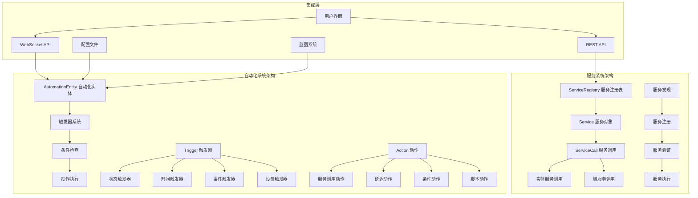
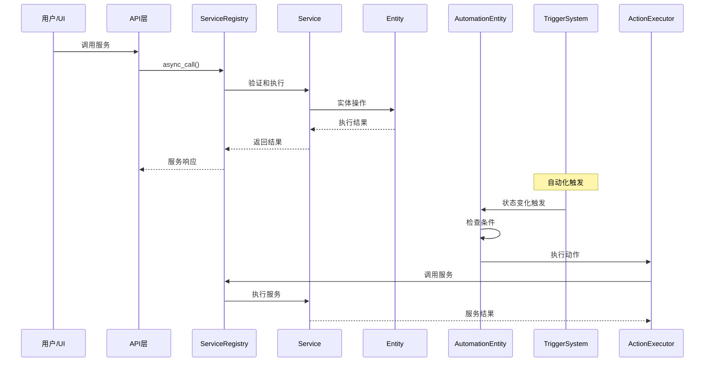
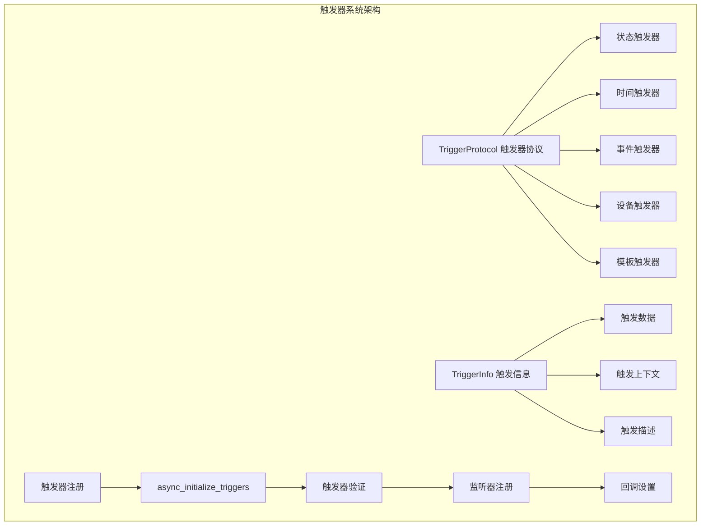

## 概述

服务与自动化系统是Home Assistant的行为执行引擎，负责处理用户指令、设备控制、自动化规则等核心功能。本文档深入分析服务调用机制、自动化引擎、触发器系统和动作执行的完整实现。

## 1. 系统整体架构

### 1.1 服务与自动化架构概览



### 1.2 调用流程时序图



## 2. 服务系统深度解析

### 2.1 服务注册与管理

```python
"""服务系统的核心实现分析"""

# 在homeassistant/core.py中的ServiceRegistry类
class ServiceRegistry:
    """服务注册表 - Home Assistant服务系统的核心管理器
    
    核心职责:

        1. 服务的注册和注销管理
        2. 服务调用的路由和分发
        3. 服务权限和安全控制
        4. 服务响应数据处理
        5. 服务调用的并发管理
        
    服务类型:
        - 域服务：针对特定域的全局服务（如automation.reload）
        - 实体服务：针对特定实体的服务（如light.turn_on）
        - 系统服务：Home Assistant核心服务
        - 平台服务：集成特定的服务
    """
    
    def __init__(self, hass: HomeAssistant) -> None:
        """初始化服务注册表
        
        参数:
            hass: Home Assistant核心实例
            
        初始化内容:
            1. 创建服务存储字典
            2. 设置Home Assistant引用
            3. 初始化并发控制机制
        """
        # 服务存储：{domain: {service_name: Service}}
        self._services: dict[str, dict[str, Service]] = {}
        self._hass = hass
        
        # 服务调用统计
        self._call_count = 0
        self._last_call_time = 0.0
    
    @callback
    def async_register(
        self,
        domain: str,
        service: str,
        service_func: Callable[
            [ServiceCall],
            Coroutine[Any, Any, ServiceResponse | EntityServiceResponse]
            | ServiceResponse
            | EntityServiceResponse
            | None,
        ],
        schema: VolSchemaType | None = None,
        supports_response: SupportsResponse = SupportsResponse.NONE,
        job_type: HassJobType | None = None,
    ) -> None:
        """注册服务 - 服务注册的核心方法
        
        参数:
            domain: 服务域名（如'light'、'automation'）
            service: 服务名称（如'turn_on'、'reload'）
            service_func: 服务处理函数
            schema: 数据验证模式
            supports_response: 是否支持返回响应数据
            job_type: 任务类型（用于性能优化）
            
        注册流程:
            1. 验证服务名称和域名格式
            2. 检查服务是否已存在
            3. 创建Service对象
            4. 注册到服务字典
            5. 发送服务注册事件
        """
        # 验证输入参数
        self._hass.verify_event_loop_thread("hass.services.async_register")
        
        domain = domain.lower()
        service = service.lower()
        
        # 验证域名和服务名格式
        if not cv.domain_key(domain) or not cv.service_name(service):
            raise ValueError(f"Invalid domain '{domain}' or service '{service}'")
        
        # 检查服务是否已存在
        if domain in self._services and service in self._services[domain]:
            _LOGGER.warning(
                "Service %s.%s is already registered, overriding",
                domain, service
            )
        
        # 创建Service对象
        service_obj = Service(
            service_func,
            schema,
            domain,
            service,
            supports_response=supports_response,
            job_type=job_type,
        )
        
        # 注册服务
        self._services.setdefault(domain, {})[service] = service_obj
        
        # 发送服务注册事件
        self._hass.bus.async_fire(
            EVENT_SERVICE_REGISTERED,
            {"domain": domain, "service": service}
        )
        
        _LOGGER.debug("Service %s.%s registered", domain, service)
    
    async def async_call(
        self,
        domain: str,
        service: str,
        service_data: dict[str, Any] | None = None,
        blocking: bool = False,
        context: Context | None = None,
        limit: float | None = DEFAULT_SERVICE_TIMEOUT,
        target: dict[str, Any] | None = None,
        return_response: bool = False,
    ) -> ServiceResponse | EntityServiceResponse | None:
        """异步调用服务 - 服务调用的核心入口点
        
        参数:
            domain: 服务域名
            service: 服务名称
            service_data: 服务数据参数
            blocking: 是否阻塞等待完成
            context: 调用上下文
            limit: 超时限制
            target: 目标选择器
            return_response: 是否返回响应数据
            
        返回值:
            服务响应数据（如果请求返回响应）
            
        调用流程:
            1. 参数验证和标准化
            2. 权限检查
            3. 创建ServiceCall对象
            4. 查找并执行服务
            5. 处理响应数据
            6. 错误处理和日志记录
        """
        # 参数标准化
        domain = cv.domain_key(domain)
        service = cv.service_name(service)
        service_data = service_data or {}
        
        # 合并target到service_data
        if target:
            service_data.update(target)
        
        # 创建调用上下文
        if context is None:
            context = Context()
        
        # 权限检查
        if context.user_id:
            user = await self._hass.auth.async_get_user(context.user_id)
            if user and not user.is_admin:
                # 检查用户权限
                if not user.permissions.check_service(domain, service):
                    raise Unauthorized(
                        f"User {user.name} not authorized to call service {domain}.{service}"
                    )
        
        # 查找服务
        service_handler = self._services.get(domain, {}).get(service)
        if not service_handler:
            raise ServiceNotFound(domain, service)
        
        # 验证响应支持
        if return_response and service_handler.supports_response is SupportsResponse.NONE:
            raise HomeAssistantError(
                f"Service {domain}.{service} does not support returning response data"
            )
        elif not return_response and service_handler.supports_response is SupportsResponse.ONLY:
            raise HomeAssistantError(
                f"Service {domain}.{service} requires return_response=True"
            )
        
        # 创建ServiceCall对象
        service_call = ServiceCall(
            domain=domain,
            service=service,
            data=service_data,
            context=context,
            return_response=return_response,
        )
        
        # 更新调用统计
        self._call_count += 1
        self._last_call_time = time.time()
        
        try:
            # 执行服务调用
            _LOGGER.debug(
                "Calling service %s.%s with data %s",
                domain, service, service_data
            )
            
            if blocking:
                # 阻塞调用：等待完成
                response = await service_handler.async_call(service_call, limit)
            else:
                # 非阻塞调用：创建后台任务
                task = self._hass.async_create_task(
                    service_handler.async_call(service_call, limit),
                    f"service call {domain}.{service}"
                )
                
                if return_response:
                    response = await task
                else:
                    response = None
            
            # 发送服务调用事件
            self._hass.bus.async_fire(
                EVENT_SERVICE_CALLED,
                {
                    "domain": domain,
                    "service": service,
                    "service_data": service_data,
                    "context": context,
                }
            )
            
            return response
            
        except Exception as err:
            _LOGGER.error(
                "Error calling service %s.%s: %s",
                domain, service, err
            )
            
            # 发送服务错误事件
            self._hass.bus.async_fire(
                EVENT_SERVICE_ERROR,
                {
                    "domain": domain,
                    "service": service,
                    "error": str(err),
                    "context": context,
                }
            )
            
            raise
    
    def has_service(self, domain: str, service: str) -> bool:
        """检查服务是否存在 - 线程安全的服务查找
        
        参数:
            domain: 服务域名
            service: 服务名称
            
        返回值:
            服务是否存在
        """
        return service.lower() in self._services.get(domain.lower(), {})
    
    @callback
    def async_services(self) -> dict[str, dict[str, Service]]:
        """获取所有注册的服务 - 返回服务注册表的副本
        
        返回值:
            服务注册表的深度复制
            
        注意:
            此方法创建完整的副本，开销较大，
            应谨慎使用，优先使用has_service进行检查
        """
        return {
            domain: services.copy()
            for domain, services in self._services.items()
        }
    
    @callback
    def async_remove(self, domain: str, service: str) -> bool:
        """移除已注册的服务
        
        参数:
            domain: 服务域名
            service: 服务名称
            
        返回值:
            是否成功移除服务
            
        用途:
            - 集成卸载时清理服务
            - 动态服务管理
            - 服务更新时的重新注册
        """
        domain = domain.lower()
        service = service.lower()
        
        if domain not in self._services:
            return False
        
        domain_services = self._services[domain]
        if service not in domain_services:
            return False
        
        # 移除服务
        del domain_services[service]
        
        # 如果域下没有服务了，移除域
        if not domain_services:
            del self._services[domain]
        
        # 发送服务移除事件
        self._hass.bus.async_fire(
            EVENT_SERVICE_REMOVED,
            {"domain": domain, "service": service}
        )
        
        _LOGGER.debug("Service %s.%s removed", domain, service)
        return True

```

### 2.2 Service服务对象

```python
class Service:
    """服务对象 - 封装单个服务的完整信息和执行逻辑
    
    核心属性:

        - func: 服务处理函数
        - schema: 数据验证模式
        - supports_response: 响应支持类型
        - job: HassJob执行对象
        
    服务生命周期:
        1. 创建：通过async_register注册
        2. 验证：检查参数和权限
        3. 执行：调用处理函数
        4. 响应：返回执行结果
        5. 清理：服务完成后的资源清理
    """
    
    def __init__(
        self,
        func: Callable[
            [ServiceCall],
            Coroutine[Any, Any, ServiceResponse | EntityServiceResponse]
            | ServiceResponse
            | EntityServiceResponse  
            | None,
        ],
        schema: vol.Schema | None = None,
        domain: str | None = None,
        service: str | None = None,
        supports_response: SupportsResponse = SupportsResponse.NONE,
        job_type: HassJobType | None = None,
    ) -> None:
        """初始化服务对象
        
        参数:
            func: 服务处理函数
            schema: 数据验证模式
            domain: 服务域名
            service: 服务名称
            supports_response: 响应支持级别
            job_type: 任务执行类型
        """
        self.func = func
        self.schema = schema
        self.domain = domain
        self.service = service
        self.supports_response = supports_response
        
        # 创建HassJob用于优化执行
        self.job = HassJob(func, job_type=job_type)
        
        # 统计信息
        self.call_count = 0
        self.total_execution_time = 0.0
        self.last_called = None
        
        # 错误跟踪
        self.error_count = 0
        self.last_error = None
    
    async def async_call(
        self, call: ServiceCall, limit: float | None = None
    ) -> ServiceResponse | EntityServiceResponse | None:
        """异步执行服务调用 - 服务执行的核心逻辑
        
        参数:
            call: 服务调用对象
            limit: 执行时间限制
            
        返回值:
            服务响应数据
            
        执行流程:
            1. 数据验证
            2. 执行服务函数
            3. 处理超时控制
            4. 异常处理和日志
            5. 统计信息更新
        """
        start_time = time.time()
        
        try:
            # 数据验证
            if self.schema:
                try:
                    call.data = self.schema(call.data)
                except vol.Invalid as err:
                    _LOGGER.error(
                        "Invalid service data for %s.%s: %s",
                        self.domain, self.service, err
                    )
                    raise ValueError(f"Invalid service data: {err}") from err
            
            # 执行服务函数
            _LOGGER.debug(
                "Executing service %s.%s",
                self.domain, self.service
            )
            
            if limit:
                # 带超时限制的执行
                response = await asyncio.wait_for(
                    call.context.async_run_job(self.job, call),
                    timeout=limit
                )
            else:
                # 无超时限制执行
                response = await call.context.async_run_job(self.job, call)
            
            # 更新统计信息
            execution_time = time.time() - start_time
            self.call_count += 1
            self.total_execution_time += execution_time
            self.last_called = dt_util.utcnow()
            
            # 检查慢服务调用
            if execution_time > 1.0:  # 超过1秒的调用
                _LOGGER.warning(
                    "Service %s.%s took %.2f seconds to complete",
                    self.domain, self.service, execution_time
                )
            
            _LOGGER.debug(
                "Service %s.%s completed in %.3f seconds",
                self.domain, self.service, execution_time
            )
            
            return response
            
        except asyncio.TimeoutError:
            execution_time = time.time() - start_time
            self.error_count += 1
            self.last_error = dt_util.utcnow()
            
            _LOGGER.error(
                "Service %s.%s timed out after %.2f seconds",
                self.domain, self.service, execution_time
            )
            raise HomeAssistantError(
                f"Service {self.domain}.{self.service} timed out"
            )
            
        except Exception as err:
            execution_time = time.time() - start_time
            self.error_count += 1
            self.last_error = dt_util.utcnow()
            
            _LOGGER.error(
                "Error executing service %s.%s after %.3f seconds: %s",
                self.domain, self.service, execution_time, err
            )
            raise
    
    def get_statistics(self) -> dict[str, Any]:
        """获取服务统计信息
        
        返回值:
            包含服务性能和使用情况的统计字典
        """
        avg_execution_time = (
            self.total_execution_time / self.call_count
            if self.call_count > 0 else 0
        )
        
        return {
            "domain": self.domain,
            "service": self.service,
            "call_count": self.call_count,
            "error_count": self.error_count,
            "total_execution_time": round(self.total_execution_time, 3),
            "average_execution_time": round(avg_execution_time, 3),
            "last_called": self.last_called.isoformat() if self.last_called else None,
            "last_error": self.last_error.isoformat() if self.last_error else None,
            "supports_response": self.supports_response.value,
            "error_rate": (
                self.error_count / self.call_count
                if self.call_count > 0 else 0
            ),
        }

```

### 2.3 实体服务调用系统

```python
"""实体服务调用系统 - 处理针对实体的服务调用"""

async def entity_service_call(
    hass: HomeAssistant,
    registered_entities: dict[str, Entity] | Callable[[], dict[str, Entity]],
    func: str | HassJob,
    call: ServiceCall,
    required_features: Iterable[int] | None = None,
) -> EntityServiceResponse | None:
    """处理实体服务调用 - 实体服务调用的核心调度器
    
    参数:
        hass: Home Assistant核心实例
        registered_entities: 已注册的实体字典或获取函数
        func: 要调用的实体方法名或HassJob对象
        call: 服务调用对象
        required_features: 必需的实体功能特性
        
    返回值:
        实体服务响应数据集合
        
    处理流程:

        1. 权限验证和用户身份检查
        2. 目标实体选择和过滤
        3. 功能特性验证
        4. 并发执行实体操作
        5. 响应数据聚合和返回
        
    并发策略:
        - 对所有目标实体并发执行操作
        - 单个实体操作失败不影响其他实体
        - 支持部分成功的结果处理
    """
    # 权限和用户验证
    entity_perms: Callable[[str, str], bool] | None = None
    return_response = call.return_response
    
    if call.context.user_id:
        user = await hass.auth.async_get_user(call.context.user_id)
        if user is None:
            raise UnknownUser(context=call.context)
        
        if not user.is_admin:
            # 非管理员用户需要检查实体权限
            entity_perms = user.permissions.check_entity
    
    # 处理目标实体选择
    target_all_entities = call.data.get(ATTR_ENTITY_ID) == ENTITY_MATCH_ALL
    
    if target_all_entities:
        referenced: target_helpers.SelectedEntities | None = None
        all_referenced: set[str] | None = None
    else:
        # 解析目标选择器中的实体引用
        selector_data = target_helpers.TargetSelectorData(call.data)
        referenced = target_helpers.async_extract_referenced_entity_ids(
            hass, selector_data, True
        )
        all_referenced = referenced.referenced | referenced.indirectly_referenced
    
    # 准备服务调用数据
    if isinstance(func, str):
        # 字符串函数名：传递处理后的数据
        data: dict | ServiceCall = remove_entity_service_fields(call)
    else:
        # HassJob对象：传递完整的ServiceCall
        data = call
    
    # 获取实体字典
    if callable(registered_entities):
        _registered_entities = registered_entities()
    else:
        _registered_entities = registered_entities
    
    # 获取有权限的候选实体
    entity_candidates = _get_permissible_entity_candidates(
        call,
        _registered_entities,
        entity_perms,
        target_all_entities,
        all_referenced,
    )
    
    # 验证和过滤实体
    if not target_all_entities:
        assert referenced is not None
        
        # 检查缺失的实体引用
        missing_referenced = referenced.referenced - set(_registered_entities.keys())
        if missing_referenced:
            _LOGGER.warning(
                "Service %s.%s called with missing entities: %s",
                call.domain, call.service,
                ", ".join(sorted(missing_referenced))
            )
    
    # 特性验证：过滤不支持必需特性的实体
    if required_features:
        def feature_filter(entity: Entity) -> bool:
            """检查实体是否支持必需的特性"""
            if not hasattr(entity, 'supported_features'):
                return False
            
            entity_features = entity.supported_features or 0
            return all(
                entity_features & feature for feature in required_features
            )
        
        # 分离支持和不支持的实体
        supported_entities = []
        unsupported_entities = []
        
        for entity in entity_candidates:
            if feature_filter(entity):
                supported_entities.append(entity)
            else:
                unsupported_entities.append(entity)
        
        # 记录不支持的实体
        if unsupported_entities:
            _LOGGER.warning(
                "Service %s.%s called on entities that don't support required features %s: %s",
                call.domain, call.service,
                required_features,
                ", ".join(entity.entity_id for entity in unsupported_entities)
            )
        
        entity_candidates = supported_entities
    
    if not entity_candidates:
        # 没有有效的目标实体
        _LOGGER.warning(
            "Service %s.%s called with no valid target entities",
            call.domain, call.service
        )
        return None
    
    # 并发执行实体操作
    _LOGGER.debug(
        "Executing service %s.%s on %d entities",
        call.domain, call.service, len(entity_candidates)
    )
    
    # 创建实体调用任务
    tasks = [
        hass.async_create_task(
            _handle_entity_call(hass, entity, func, data, call.context),
            f"service call {call.domain}.{call.service} on {entity.entity_id}"
        )
        for entity in entity_candidates
    ]
    
    # 等待所有任务完成
    results = await asyncio.gather(*tasks, return_exceptions=True)
    
    # 处理结果和错误
    response_data: list[dict[str, Any]] = []
    error_count = 0
    
    for entity, result in zip(entity_candidates, results):
        if isinstance(result, Exception):
            error_count += 1
            _LOGGER.error(
                "Error executing service %s.%s on %s: %s",
                call.domain, call.service, entity.entity_id, result
            )
        elif return_response and result is not None:
            # 收集响应数据
            response_data.append({
                "entity_id": entity.entity_id,
                "response": result,
            })
    
    # 记录执行统计
    success_count = len(entity_candidates) - error_count
    _LOGGER.debug(
        "Service %s.%s completed on %d/%d entities successfully",
        call.domain, call.service, success_count, len(entity_candidates)
    )
    
    # 返回响应数据
    return response_data if return_response and response_data else None

async def _handle_entity_call(
    hass: HomeAssistant,
    entity: Entity,
    func: str | HassJob,
    data: dict | ServiceCall,
    context: Context,
) -> ServiceResponse:
    """处理单个实体的服务调用 - 实体服务执行的原子操作
    
    参数:
        hass: Home Assistant核心实例
        entity: 目标实体对象
        func: 要调用的方法名或HassJob
        data: 服务调用数据
        context: 调用上下文
        
    返回值:
        单个实体的服务响应
        
    执行流程:

        1. 设置实体上下文
        2. 创建或使用现有的HassJob
        3. 执行实体方法
        4. 处理协程结果
        5. 错误处理和日志
    """
    # 设置实体调用上下文
    entity.async_set_context(context)
    
    # 执行实体方法
    task: asyncio.Future[ServiceResponse] | None
    
    if isinstance(func, str):
        # 字符串方法名：动态调用实体方法
        entity_method = getattr(entity, func)
        
        # 创建优化的HassJob
        job = HassJob(
            partial(entity_method, **data),
            job_type=entity.get_hassjob_type(func),
        )
        
        task = hass.async_run_hass_job(job)
    else:
        # HassJob对象：直接执行
        task = hass.async_run_hass_job(func, entity, data)
    
    # 处理任务结果
    result: ServiceResponse = None
    if task is not None:
        result = await task
    
    # 检查错误的协程返回
    if asyncio.iscoroutine(result):
        _LOGGER.error(
            "Service %s for %s incorrectly returns a coroutine object. "
            "Await result instead in service handler. "
            "Report bug to integration author",
            func, entity.entity_id,
        )
        # 尝试等待协程结果
        result = await result
    
    return result

def _get_permissible_entity_candidates(
    call: ServiceCall,
    entities: dict[str, Entity],
    entity_perms: Callable[[str, str], bool] | None,
    target_all_entities: bool,
    all_referenced: set[str] | None,
) -> list[Entity]:
    """获取有权限访问的候选实体 - 实体权限过滤器
    
    参数:
        call: 服务调用对象
        entities: 所有可用实体
        entity_perms: 实体权限检查函数
        target_all_entities: 是否目标所有实体
        all_referenced: 引用的实体ID集合
        
    返回值:
        经过权限过滤的实体列表
        
    权限检查:

        1. 管理员用户：访问所有实体
        2. 普通用户：检查每个实体的控制权限
        3. 系统调用：跳过权限检查
    """
    if target_all_entities:
        # 目标所有实体的情况
        if entity_perms is None:
            # 管理员用户或系统调用
            return list(entities.values())
        else:
            # 普通用户：过滤有权限的实体
            return [
                entity for entity in entities.values()
                if entity_perms(entity.entity_id, POLICY_CONTROL)
            ]
    
    if all_referenced is None:
        # 没有指定目标实体
        return []
    
    # 获取引用的实体中存在且有权限的实体
    permissible_entities = []
    
    for entity_id in all_referenced:
        if entity_id not in entities:
            # 实体不存在，记录警告
            _LOGGER.warning(
                "Service %s.%s called with unknown entity %s",
                call.domain, call.service, entity_id
            )
            continue
        
        entity = entities[entity_id]
        
        # 权限检查
        if entity_perms and not entity_perms(entity_id, POLICY_CONTROL):
            _LOGGER.warning(
                "User not authorized to control entity %s in service %s.%s",
                entity_id, call.domain, call.service
            )
            continue
        
        permissible_entities.append(entity)
    
    return permissible_entities

```

## 3. 自动化系统深度解析

### 3.1 自动化实体核心架构

```python
"""自动化系统的核心实现"""

class BaseAutomationEntity(ToggleEntity):
    """自动化实体基类 - 自动化系统的核心抽象
    
    核心职责:

        1. 管理自动化的生命周期
        2. 处理触发器的注册和监听
        3. 执行条件检查和动作序列
        4. 提供自动化状态和控制接口
        5. 支持调试和追踪功能
        
    自动化组件:
        - 触发器(Triggers)：定义何时执行自动化
        - 条件(Conditions)：决定是否继续执行
        - 动作(Actions)：实际执行的操作序列
        - 变量(Variables)：动态数据处理
    """
    
    _attr_should_poll = False
    
    def __init__(
        self,
        automation_id: str,
        name: str,
        triggers: list[ConfigType],
        cond_func: Callable[[dict[str, Any]], bool] | None,
        action_script: Script,
        initial_state: bool | None,
        variables: ScriptVariables | None,
        trigger_variables: ScriptVariables | None,
        raw_config: ConfigType | None,
        blueprint_inputs: ConfigType | None,
        trace_config: ConfigType,
    ) -> None:
        """初始化自动化实体
        
        参数:
            automation_id: 自动化唯一标识
            name: 自动化名称
            triggers: 触发器配置列表
            cond_func: 条件检查函数
            action_script: 动作脚本对象
            initial_state: 初始启用状态
            variables: 全局变量
            trigger_variables: 触发器变量
            raw_config: 原始配置
            blueprint_inputs: 蓝图输入参数
            trace_config: 追踪配置
        """
        self._automation_id = automation_id
        self._triggers = triggers
        self._cond_func = cond_func
        self._action_script = action_script
        self._initial_state = initial_state
        self._variables = variables
        self._trigger_variables = trigger_variables
        self.raw_config = raw_config
        self._blueprint_inputs = blueprint_inputs
        self._trace_config = trace_config
        
        # 状态管理
        self._is_enabled = initial_state
        self._last_triggered: datetime | None = None
        self._trigger_count = 0
        
        # 内部状态
        self._unsub_triggers: list[CALLBACK_TYPE] = []
        self._logger = LOGGER.getChild(automation_id)
        
        # 设置实体属性
        self._attr_name = name
        self._attr_unique_id = automation_id
        self._attr_icon = "mdi:robot"
    
    @cached_property
    def extra_state_attributes(self) -> dict[str, Any]:
        """返回自动化的额外状态属性
        
        返回值:
            包含自动化详细信息的属性字典
        """
        attrs = {
            ATTR_ID: self._automation_id,
            ATTR_LAST_TRIGGERED: self._last_triggered,
            "trigger_count": self._trigger_count,
            "mode": self._action_script.script_mode,
        }
        
        if self._action_script.supports_max:
            attrs[ATTR_MAX] = self._action_script.max_runs
            attrs[ATTR_CUR] = self._action_script.runs
        
        return attrs
    
    @property
    def is_on(self) -> bool:
        """返回自动化是否启用"""
        return self._is_enabled
    
    async def async_added_to_hass(self) -> None:
        """自动化添加到Home Assistant时的初始化
        
        初始化流程:
            1. 恢复上次运行状态
            2. 注册触发器监听
            3. 设置初始状态
            4. 启动追踪系统
        """
        await super().async_added_to_hass()
        
        # 恢复上次触发时间
        if (last_state := await self.async_get_last_state()) is not None:
            if last_triggered_str := last_state.attributes.get(ATTR_LAST_TRIGGERED):
                try:
                    self._last_triggered = parse_datetime(last_triggered_str)
                except (ValueError, TypeError):
                    self._logger.warning("Invalid last_triggered value in state")
            
            # 恢复触发计数
            self._trigger_count = last_state.attributes.get("trigger_count", 0)
        
        # 注册触发器
        if self._is_enabled:
            await self._async_setup_triggers()
        
        # 监听Home Assistant启动完成事件
        @callback
        def async_on_hass_started(_: Event) -> None:
            """Home Assistant启动完成后的处理"""
            if self._is_enabled and self.hass.state is CoreState.running:
                self.hass.async_create_task(
                    self._async_setup_triggers(),
                    f"automation {self._automation_id} setup triggers"
                )
        
        if self.hass.state is CoreState.starting:
            self.hass.bus.async_listen_once(
                EVENT_HOMEASSISTANT_STARTED, async_on_hass_started
            )
        elif self.hass.state is CoreState.running and self._is_enabled:
            await self._async_setup_triggers()
    
    async def _async_setup_triggers(self) -> None:
        """设置触发器监听 - 自动化触发系统的核心
        
        设置流程:
            1. 清理现有触发器监听
            2. 初始化所有触发器
            3. 注册触发回调函数
            4. 处理触发器设置错误
            
        触发器类型:
            - 状态触发器：实体状态变化
            - 时间触发器：定时和时间模式
            - 事件触发器：系统和自定义事件
            - 设备触发器：设备操作和状态
        """
        # 清理现有触发器
        await self._async_cleanup_triggers()
        
        if not self._triggers:
            self._logger.warning("No triggers defined")
            return
        
        try:
            # 初始化触发器系统
            self._unsub_triggers = await async_initialize_triggers(
                self.hass,
                self._triggers,
                self._async_automation_triggered,
                DOMAIN,
                self._automation_id,
                self._logger,
                start_automation=True,  # 立即启动触发器
            )
            
            self._logger.debug(
                "Initialized %d triggers for automation %s",
                len(self._unsub_triggers), self._automation_id
            )
            
        except Exception as err:
            self._logger.error("Error setting up triggers: %s", err)
            # 如果触发器设置失败，禁用自动化
            self._is_enabled = False
            self.async_write_ha_state()
            raise
    
    async def _async_cleanup_triggers(self) -> None:
        """清理触发器监听"""
        if self._unsub_triggers:
            self._logger.debug(
                "Cleaning up %d triggers for automation %s",
                len(self._unsub_triggers), self._automation_id
            )
            
            # 并发清理所有触发器
            cleanup_tasks = []
            for unsub in self._unsub_triggers:
                if asyncio.iscoroutinefunction(unsub):
                    cleanup_tasks.append(self.hass.async_create_task(unsub()))
                else:
                    unsub()
            
            if cleanup_tasks:
                await asyncio.gather(*cleanup_tasks, return_exceptions=True)
            
            self._unsub_triggers.clear()
    
    async def _async_automation_triggered(
        self,
        trigger_data: dict[str, Any],
        context: Context | None = None,
    ) -> None:
        """自动化触发回调 - 处理触发器事件的核心方法
        
        参数:
            trigger_data: 触发器数据
            context: 触发上下文
            
        触发流程:
            1. 检查自动化启用状态
            2. 处理触发器变量
            3. 执行自动化逻辑
            4. 更新状态和统计
            5. 错误处理和日志
        """
        if not self._is_enabled:
            self._logger.debug("Automation is disabled, ignoring trigger")
            return
        
        # 更新触发统计
        self._trigger_count += 1
        self._last_triggered = dt_util.utcnow()
        
        self._logger.info(
            "Automation %s triggered by %s",
            self._automation_id,
            trigger_data.get("description", "unknown trigger")
        )
        
        try:
            # 准备触发器变量
            trigger_variables = {"trigger": trigger_data}
            
            if self._trigger_variables:
                try:
                    additional_vars = self._trigger_variables.async_render(
                        self.hass, trigger_variables
                    )
                    trigger_variables.update(additional_vars)
                except TemplateError as err:
                    self._logger.error("Error rendering trigger variables: %s", err)
                    return
            
            # 执行自动化
            await self.async_trigger(
                trigger_variables,
                context=context,
                skip_condition=False,
            )
            
        except Exception as err:
            self._logger.error("Error in automation %s: %s", self._automation_id, err)
        finally:
            # 更新状态
            self.async_write_ha_state()
    
    async def async_trigger(
        self,
        run_variables: dict[str, Any],
        context: Context | None = None,
        skip_condition: bool = False,
    ) -> ScriptRunResult | None:
        """手动触发自动化执行 - 自动化执行的核心引擎
        
        参数:
            run_variables: 执行变量
            context: 执行上下文
            skip_condition: 是否跳过条件检查
            
        返回值:
            脚本执行结果
            
        执行流程:
            1. 创建执行上下文
            2. 渲染全局变量
            3. 执行条件检查
            4. 运行动作脚本
            5. 处理执行追踪
        """
        if not self._is_enabled:
            self._logger.warning("Cannot trigger disabled automation %s", self._automation_id)
            return None
        
        # 创建触发上下文
        if context is None:
            context = Context()
        
        trigger_context = Context(parent_id=context.id if context else None)
        
        # 开始执行追踪
        with trace_automation(
            self.hass,
            self._automation_id,
            self.raw_config,
            self._blueprint_inputs,
            trigger_context,
            self._trace_config,
        ) as automation_trace:
            
            # 准备执行变量
            this = None
            if state := self.hass.states.get(self.entity_id):
                this = state.as_dict()
            
            variables: dict[str, Any] = {
                "this": this,
                **(run_variables or {})
            }
            
            # 渲染全局变量
            if self._variables:
                try:
                    variables = self._variables.async_render(self.hass, variables)
                except TemplateError as err:
                    self._logger.error("Error rendering variables: %s", err)
                    automation_trace.set_error(err)
                    return None
            
            # 设置追踪信息
            automation_trace.set_trace(trace_get())
            
            # 设置触发描述
            trigger_description = variables.get("trigger", {}).get("description")
            automation_trace.set_trigger_description(trigger_description)
            
            # 添加触发步骤到追踪
            if "trigger" in variables and "idx" in variables["trigger"]:
                trigger_path = f"trigger/{variables['trigger']['idx']}"
            else:
                trigger_path = "trigger"
                
            trace_element = TraceElement(variables, trigger_path)
            trace_append_element(trace_element)
            
            # 条件检查
            if (
                not skip_condition
                and self._cond_func is not None
                and not self._cond_func(variables)
            ):
                self._logger.debug(
                    "Conditions not met, aborting automation. Condition summary: %s",
                    trace_get(clear=False),
                )
                script_execution_set("failed_conditions")
                return None
            
            # 设置执行上下文
            self.async_set_context(trigger_context)
            
            # 发送自动化触发事件
            event_data = {
                ATTR_NAME: self.name,
                ATTR_ENTITY_ID: self.entity_id,
                ATTR_SOURCE: variables.get("trigger", {}).get("description"),
                ATTR_VARIABLES: variables,
            }
            
            self.hass.bus.async_fire(
                EVENT_AUTOMATION_TRIGGERED,
                event_data,
                context=trigger_context
            )
            
            # 执行动作脚本
            self._logger.debug("Executing automation %s actions", self._automation_id)
            
            try:
                script_result = await self._action_script.async_run(
                    variables, trigger_context
                )
                
                self._logger.debug(
                    "Automation %s actions completed with result: %s",
                    self._automation_id, script_result.result
                )
                
                return script_result
                
            except Exception as err:
                self._logger.error("Error executing automation %s actions: %s", self._automation_id, err)
                automation_trace.set_error(err)
                return None
    
    async def async_turn_on(self, **kwargs: Any) -> None:
        """启用自动化"""
        if self._is_enabled:
            return
        
        self._logger.info("Enabling automation %s", self._automation_id)
        self._is_enabled = True
        
        # 设置触发器
        await self._async_setup_triggers()
        
        self.async_write_ha_state()
    
    async def async_turn_off(self, **kwargs: Any) -> None:
        """禁用自动化"""
        if not self._is_enabled:
            return
        
        stop_actions = kwargs.get(CONF_STOP_ACTIONS, DEFAULT_STOP_ACTIONS)
        
        self._logger.info("Disabling automation %s", self._automation_id)
        self._is_enabled = False
        
        # 清理触发器
        await self._async_cleanup_triggers()
        
        # 停止正在运行的动作（如果需要）
        if stop_actions:
            await self._action_script.async_stop()
        
        self.async_write_ha_state()
    
    async def async_will_remove_from_hass(self) -> None:
        """自动化从Home Assistant移除时的清理"""
        await self._async_cleanup_triggers()
        await self._action_script.async_stop()
        await super().async_will_remove_from_hass()

```

### 3.2 触发器系统架构



### 3.3 触发器实现示例

```python
"""触发器系统实现示例"""

# 状态触发器实现
async def async_state_trigger_setup(
    hass: HomeAssistant,
    config: ConfigType,
    action: TriggerActionType,
    trigger_info: TriggerInfo,
) -> CALLBACK_TYPE:
    """状态触发器设置 - 监听实体状态变化
    
    参数:
        hass: Home Assistant实例
        config: 触发器配置
        action: 触发动作函数
        trigger_info: 触发器信息
        
    返回值:
        取消监听的回调函数
        
    配置示例:
        trigger:

          - platform: state
            entity_id: sensor.temperature
            from: "20"
            to: "25"
            for:
              minutes: 5
    """
    entity_ids = config.get(CONF_ENTITY_ID, [])
    from_state = config.get(CONF_FROM)
    to_state = config.get(CONF_TO)
    time_delta = config.get(CONF_FOR)
    attribute = config.get(CONF_ATTRIBUTE)
    
    # 状态变化跟踪
    state_trackers: dict[str, dict] = {}
    
    @callback
    def state_listener(event: Event[EventStateChangedData]) -> None:
        """状态变化监听器"""
        entity_id = event.data["entity_id"]
        old_state = event.data["old_state"]
        new_state = event.data["new_state"]
        
        # 检查状态变化是否匹配条件
        if not _state_change_matches(
            old_state, new_state, from_state, to_state, attribute
        ):
            # 清理跟踪器（如果存在）
            state_trackers.pop(entity_id, None)
            return
        
        # 处理延迟触发
        if time_delta:
            _handle_delayed_trigger(
                hass, entity_id, new_state, time_delta,
                action, trigger_info, state_trackers
            )
        else:
            # 立即触发
            _execute_state_trigger(
                entity_id, old_state, new_state, action, trigger_info
            )
    
    # 注册状态变化监听器
    unsub = hass.bus.async_listen(EVENT_STATE_CHANGED, state_listener)
    
    return unsub

def _state_change_matches(
    old_state: State | None,
    new_state: State | None,
    from_state: str | None,
    to_state: str | None,
    attribute: str | None,
) -> bool:
    """检查状态变化是否匹配触发条件
    
    匹配逻辑:

        1. 检查from状态条件
        2. 检查to状态条件  
        3. 处理属性变化（如果指定）
        4. 处理未知状态和不可用状态
    """
    # 获取比较值
    if attribute:
        old_value = old_state.attributes.get(attribute) if old_state else None
        new_value = new_state.attributes.get(attribute) if new_state else None
    else:
        old_value = old_state.state if old_state else None
        new_value = new_state.state if new_state else None
    
    # 检查from条件
    if from_state is not None:
        if old_value != from_state:
            return False
    
    # 检查to条件
    if to_state is not None:
        if new_value != to_state:
            return False
    
    # 确保状态确实发生了变化
    return old_value != new_value

def _handle_delayed_trigger(
    hass: HomeAssistant,
    entity_id: str,
    new_state: State,
    time_delta: timedelta,
    action: TriggerActionType,
    trigger_info: TriggerInfo,
    state_trackers: dict[str, dict],
) -> None:
    """处理延迟触发逻辑"""
    
    @callback
    def delayed_trigger_callback() -> None:
        """延迟触发回调"""
        # 验证状态是否仍然满足条件
        current_state = hass.states.get(entity_id)
        if current_state and current_state.state == new_state.state:
            _execute_state_trigger(
                entity_id, None, current_state, action, trigger_info
            )
        
        # 清理跟踪器
        state_trackers.pop(entity_id, None)
    
    # 取消现有的延迟触发
    if entity_id in state_trackers:
        state_trackers[entity_id]["cancel"]()
    
    # 设置新的延迟触发
    cancel_handle = hass.loop.call_later(
        time_delta.total_seconds(),
        delayed_trigger_callback
    )
    
    state_trackers[entity_id] = {
        "cancel": cancel_handle.cancel,
        "trigger_time": dt_util.utcnow() + time_delta,
    }

def _execute_state_trigger(
    entity_id: str,
    old_state: State | None,
    new_state: State | None,
    action: TriggerActionType,
    trigger_info: TriggerInfo,
) -> None:
    """执行状态触发动作"""
    
    # 构建触发数据
    trigger_data = {
        "platform": "state",
        "entity_id": entity_id,
        "from_state": old_state,
        "to_state": new_state,
        "for": trigger_info.get("for"),
        "description": f"state of {entity_id}",
    }
    
    if old_state:
        trigger_data["from"] = old_state.state
    if new_state:
        trigger_data["to"] = new_state.state
    
    # 执行触发动作
    hass.async_create_task(
        action(trigger_data),
        f"state trigger for {entity_id}"
    )

# 时间触发器实现
async def async_time_trigger_setup(
    hass: HomeAssistant,
    config: ConfigType,
    action: TriggerActionType,
    trigger_info: TriggerInfo,
) -> CALLBACK_TYPE:
    """时间触发器设置 - 基于时间的自动化触发
    
    支持的时间触发类型:

        1. 固定时间：每天的特定时间
        2. 时间模式：使用cron表达式
        3. 间隔触发：固定时间间隔
        4. 相对时间：相对于日出日落等
    """
    trigger_type = config.get(CONF_PLATFORM)
    
    if CONF_AT in config:
        # 固定时间触发
        return await _setup_time_at_trigger(hass, config, action, trigger_info)
    elif CONF_HOURS in config or CONF_MINUTES in config or CONF_SECONDS in config:
        # 间隔触发
        return await _setup_interval_trigger(hass, config, action, trigger_info)
    else:
        raise ValueError(f"Invalid time trigger configuration: {config}")

async def _setup_time_at_trigger(
    hass: HomeAssistant,
    config: ConfigType,
    action: TriggerActionType,
    trigger_info: TriggerInfo,
) -> CALLBACK_TYPE:
    """设置固定时间触发器"""
    at_time = config[CONF_AT]
    
    @callback
    def time_trigger_callback(now: datetime) -> None:
        """时间触发回调"""
        trigger_data = {
            "platform": "time",
            "now": now,
            "description": f"time trigger at {at_time}",
        }
        
        hass.async_create_task(
            action(trigger_data),
            f"time trigger at {at_time}"
        )
    
    # 注册时间监听器
    unsub = async_track_time_change(
        hass,
        time_trigger_callback,
        hour=at_time.hour,
        minute=at_time.minute,
        second=at_time.second,
    )
    
    return unsub
```

## 4. 动作执行系统

### 4.1 Script脚本引擎

```python
"""Script脚本执行引擎 - 自动化动作序列的执行器"""

class Script:
    """脚本执行器 - 管理复杂动作序列的执行
    
    核心功能:

        1. 顺序执行动作列表
        2. 支持条件分支和循环
        3. 处理并发执行和排队
        4. 提供执行追踪和调试
        5. 实现错误处理和恢复
        
    执行模式:
        - single: 单实例执行（默认）
        - restart: 重启模式，取消正在运行的实例
        - queued: 排队模式，按顺序执行
        - parallel: 并行模式，同时执行多个实例
    """
    
    def __init__(
        self,
        hass: HomeAssistant,
        sequence: list[ConfigType],
        name: str | None = None,
        domain: str | None = None,
        *,
        script_mode: str = DEFAULT_SCRIPT_MODE,
        max_runs: int = DEFAULT_MAX_RUNS,
        max_exceeded: str = DEFAULT_MAX_EXCEEDED,
        logger: Logger | None = None,
        top_level: bool = True,
        variables: dict[str, Any] | None = None,
    ) -> None:
        """初始化脚本执行器
        
        参数:
            hass: Home Assistant实例
            sequence: 动作序列配置
            name: 脚本名称
            domain: 脚本域
            script_mode: 执行模式
            max_runs: 最大并发运行数
            max_exceeded: 超出限制时的处理方式
            logger: 日志记录器
            top_level: 是否为顶级脚本
            variables: 默认变量
        """
        self.hass = hass
        self.sequence = sequence
        self.name = name or "Script"
        self.domain = domain
        self.script_mode = script_mode
        self.max_runs = max_runs
        self.max_exceeded = max_exceeded
        self.top_level = top_level
        self.variables = variables or {}
        
        # 日志配置
        self.logger = logger or _LOGGER.getChild(name or "script")
        
        # 执行状态
        self._runs: list[ScriptRun] = []
        self._is_stopping = False
        
        # 性能统计
        self.total_runs = 0
        self.successful_runs = 0
        self.failed_runs = 0
        self.total_execution_time = 0.0
    
    @property
    def is_running(self) -> bool:
        """脚本是否正在运行"""
        return bool(self._runs)
    
    @property
    def runs(self) -> int:
        """当前运行的实例数"""
        return len(self._runs)
    
    @property
    def supports_max(self) -> bool:
        """是否支持最大运行数限制"""
        return self.script_mode in (SCRIPT_MODE_QUEUED, SCRIPT_MODE_PARALLEL)
    
    async def async_run(
        self,
        variables: dict[str, Any] | None = None,
        context: Context | None = None,
    ) -> ScriptRunResult:
        """异步运行脚本 - 脚本执行的主要入口点
        
        参数:
            variables: 执行变量
            context: 执行上下文
            
        返回值:
            脚本执行结果对象
            
        执行流程:
            1. 检查执行模式和限制
            2. 创建脚本运行实例
            3. 处理并发控制
            4. 执行动作序列
            5. 处理结果和清理
        """
        if self._is_stopping:
            self.logger.debug("Script %s is stopping, cannot start new run", self.name)
            return ScriptRunResult(success=False, result="stopping")
        
        # 合并变量
        run_variables = {**self.variables}
        if variables:
            run_variables.update(variables)
        
        # 创建执行上下文
        if context is None:
            context = Context()
        
        # 处理执行模式
        if self.script_mode == SCRIPT_MODE_SINGLE:
            # 单实例模式：停止现有实例
            if self._runs:
                self.logger.debug(
                    "Script %s is already running in single mode, stopping previous run",
                    self.name
                )
                await self.async_stop()
                
        elif self.script_mode == SCRIPT_MODE_RESTART:
            # 重启模式：取消所有现有实例
            if self._runs:
                self.logger.debug(
                    "Script %s restarting, cancelling %d existing runs",
                    self.name, len(self._runs)
                )
                for run in self._runs:
                    run.async_cancel()
                self._runs.clear()
                
        elif self.script_mode in (SCRIPT_MODE_QUEUED, SCRIPT_MODE_PARALLEL):
            # 队列/并行模式：检查运行数限制
            if len(self._runs) >= self.max_runs:
                if self.max_exceeded == MAX_EXCEEDED_SILENT:
                    self.logger.debug(
                        "Script %s max runs (%d) reached, silently ignoring",
                        self.name, self.max_runs
                    )
                    return ScriptRunResult(success=False, result="max_runs_reached")
                elif self.max_exceeded == MAX_EXCEEDED_WARNING:
                    self.logger.warning(
                        "Script %s max runs (%d) reached, ignoring new request",
                        self.name, self.max_runs
                    )
                    return ScriptRunResult(success=False, result="max_runs_reached")
                else:  # MAX_EXCEEDED_ERROR
                    raise HomeAssistantError(
                        f"Script {self.name} maximum runs ({self.max_runs}) reached"
                    )
        
        # 创建脚本运行实例
        script_run = ScriptRun(
            self,
            run_variables,
            context,
            self.logger,
        )
        
        # 添加到运行列表
        self._runs.append(script_run)
        self.total_runs += 1
        
        try:
            # 执行脚本
            self.logger.debug("Starting script %s run", self.name)
            start_time = time.time()
            
            result = await script_run.async_run()
            
            # 更新统计
            execution_time = time.time() - start_time
            self.total_execution_time += execution_time
            
            if result.success:
                self.successful_runs += 1
                self.logger.debug(
                    "Script %s completed successfully in %.3f seconds",
                    self.name, execution_time
                )
            else:
                self.failed_runs += 1
                self.logger.debug(
                    "Script %s failed after %.3f seconds: %s",
                    self.name, execution_time, result.result
                )
            
            return result
            
        except Exception as err:
            # 执行异常处理
            self.failed_runs += 1
            self.logger.error("Error running script %s: %s", self.name, err)
            return ScriptRunResult(success=False, result=f"exception: {err}")
            
        finally:
            # 清理运行实例
            if script_run in self._runs:
                self._runs.remove(script_run)
    
    async def async_stop(self) -> None:
        """停止所有正在运行的脚本实例
        
        停止流程:
            1. 设置停止标志
            2. 取消所有运行实例
            3. 等待实例完成清理
            4. 重置内部状态
        """
        if not self._runs:
            return
        
        self.logger.debug("Stopping script %s with %d running instances", self.name, len(self._runs))
        
        self._is_stopping = True
        
        try:
            # 取消所有运行实例
            cancel_tasks = []
            for run in self._runs:
                if run.is_running:
                    cancel_tasks.append(
                        self.hass.async_create_task(
                            run.async_stop(),
                            f"stop script run {run.run_id}"
                        )
                    )
            
            # 等待所有实例停止
            if cancel_tasks:
                await asyncio.gather(*cancel_tasks, return_exceptions=True)
            
            # 清理运行列表
            self._runs.clear()
            
            self.logger.debug("Script %s stopped successfully", self.name)
            
        finally:
            self._is_stopping = False

class ScriptRun:
    """脚本运行实例 - 管理单次脚本执行的完整生命周期
    
    核心职责:

        1. 执行动作序列中的每个步骤
        2. 处理变量渲染和上下文管理
        3. 实现错误处理和异常恢复
        4. 提供执行追踪和调试信息
        5. 管理子脚本和嵌套调用
    """
    
    def __init__(
        self,
        script: Script,
        variables: dict[str, Any],
        context: Context,
        logger: Logger,
    ) -> None:
        """初始化脚本运行实例"""
        self.script = script
        self.variables = variables
        self.context = context
        self.logger = logger
        
        # 运行状态
        self.run_id = str(uuid.uuid4())[:8]
        self.is_running = False
        self.is_cancelled = False
        
        # 执行控制
        self._current_action: asyncio.Task | None = None
        self._stop_requested = False
    
    async def async_run(self) -> ScriptRunResult:
        """执行脚本动作序列
        
        返回值:
            脚本执行结果
            
        执行逻辑:
            按顺序执行每个动作，处理条件判断、
            循环控制、延迟等特殊动作类型
        """
        self.is_running = True
        current_variables = self.variables.copy()
        
        try:
            for idx, action_config in enumerate(self.script.sequence):
                if self._stop_requested or self.is_cancelled:
                    return ScriptRunResult(success=False, result="cancelled")
                
                self.logger.debug(
                    "Executing script %s action %d: %s",
                    self.script.name, idx, action_config.get("alias", "unnamed action")
                )
                
                # 执行单个动作
                result = await self._async_execute_action(
                    action_config, current_variables, idx
                )
                
                if not result.success:
                    self.logger.error(
                        "Script %s action %d failed: %s",
                        self.script.name, idx, result.result
                    )
                    return result
                
                # 更新变量（如果动作返回了新变量）
                if result.variables:
                    current_variables.update(result.variables)
            
            return ScriptRunResult(success=True, variables=current_variables)
            
        except Exception as err:
            self.logger.error("Script %s run %s failed: %s", self.script.name, self.run_id, err)
            return ScriptRunResult(success=False, result=f"exception: {err}")
            
        finally:
            self.is_running = False
    
    async def _async_execute_action(
        self,
        action_config: ConfigType,
        variables: dict[str, Any],
        action_idx: int,
    ) -> ScriptRunResult:
        """执行单个动作配置
        
        支持的动作类型:
            - service: 服务调用
            - delay: 延迟等待
            - wait_template: 模板等待
            - condition: 条件检查
            - repeat: 重复执行
            - choose: 条件分支
            - parallel: 并行执行
        """
        action_type = _determine_action_type(action_config)
        
        try:
            if action_type == "service":
                return await self._async_service_action(action_config, variables)
            elif action_type == "delay":
                return await self._async_delay_action(action_config, variables)
            elif action_type == "condition":
                return await self._async_condition_action(action_config, variables)
            elif action_type == "repeat":
                return await self._async_repeat_action(action_config, variables)
            elif action_type == "choose":
                return await self._async_choose_action(action_config, variables)
            elif action_type == "parallel":
                return await self._async_parallel_action(action_config, variables)
            else:
                raise ValueError(f"Unknown action type: {action_type}")
                
        except Exception as err:
            return ScriptRunResult(success=False, result=f"action_error: {err}")
    
    async def _async_service_action(
        self, action_config: ConfigType, variables: dict[str, Any]
    ) -> ScriptRunResult:
        """执行服务调用动作"""
        service = action_config.get("service")
        service_data = action_config.get("data", {})
        target = action_config.get("target", {})
        
        if not service:
            return ScriptRunResult(success=False, result="missing_service")
        
        # 渲染模板
        try:
            rendered_service = template.render_complex(service, variables)
            rendered_data = template.render_complex(service_data, variables)
            rendered_target = template.render_complex(target, variables)
        except TemplateError as err:
            return ScriptRunResult(success=False, result=f"template_error: {err}")
        
        # 调用服务
        try:
            domain, service_name = rendered_service.split(".", 1)
            
            await self.script.hass.services.async_call(
                domain,
                service_name,
                rendered_data,
                blocking=True,
                context=self.context,
                target=rendered_target,
            )
            
            return ScriptRunResult(success=True)
            
        except Exception as err:
            return ScriptRunResult(success=False, result=f"service_error: {err}")
    
    async def async_stop(self) -> None:
        """停止脚本运行"""
        self._stop_requested = True
        
        if self._current_action:
            self._current_action.cancel()
    
    def async_cancel(self) -> None:
        """取消脚本运行"""
        self.is_cancelled = True
        self.async_stop()

@dataclass
class ScriptRunResult:
    """脚本运行结果"""
    success: bool
    result: str | None = None
    variables: dict[str, Any] | None = None
```

## 5. 最佳实践和使用模式

### 5.1 服务开发最佳实践

```python
"""服务开发最佳实践指南"""

# 1. 服务注册的最佳实践
async def async_setup_services(hass: HomeAssistant) -> None:
    """服务设置的最佳实践"""
    
    # 使用适当的数据验证模式
    SERVICE_SCHEMA = vol.Schema({
        vol.Required("entity_id"): cv.entity_ids,
        vol.Optional("brightness", default=255): vol.All(
            vol.Coerce(int), vol.Range(min=1, max=255)
        ),
        vol.Optional("color_name"): cv.string,
    })
    
    async def async_service_handler(call: ServiceCall) -> ServiceResponse:
        """服务处理函数的最佳实践"""
        try:
            # 1. 记录服务调用
            _LOGGER.debug(
                "Service %s.%s called with data: %s",
                call.domain, call.service, call.data
            )
            
            # 2. 验证实体存在性
            entity_ids = call.data["entity_id"]
            existing_entities = []
            
            for entity_id in entity_ids:
                if hass.states.get(entity_id):
                    existing_entities.append(entity_id)
                else:
                    _LOGGER.warning("Entity %s not found", entity_id)
            
            if not existing_entities:
                raise HomeAssistantError("No valid entities found")
            
            # 3. 执行服务逻辑
            results = []
            for entity_id in existing_entities:
                result = await _process_entity(hass, entity_id, call.data)
                results.append(result)
            
            # 4. 返回响应（如果需要）
            if call.return_response:
                return {"results": results}
            
            return None
            
        except Exception as err:
            _LOGGER.error("Service error: %s", err)
            raise
    
    # 注册服务
    hass.services.async_register(
        "my_domain",
        "my_service",
        async_service_handler,
        schema=SERVICE_SCHEMA,
        supports_response=SupportsResponse.OPTIONAL,
    )

# 2. 实体服务的最佳实践
class MyEntityPlatform:
    """实体服务注册的最佳实践"""
    
    def __init__(self, hass: HomeAssistant):
        self.hass = hass
        self.entities: dict[str, MyEntity] = {}
    
    async def async_setup_entity_services(self) -> None:
        """设置实体服务"""
        
        # 定义服务模式
        SET_VALUE_SCHEMA = vol.Schema({
            vol.Required("value"): vol.All(
                vol.Coerce(float),
                vol.Range(min=0, max=100)
            ),
            vol.Optional("transition", default=0): cv.positive_int,
        })
        
        # 注册实体服务
        async_register_entity_service(
            self.hass,
            "my_domain",
            "set_value",
            entities=self.entities,
            func="async_set_value",
            schema=SET_VALUE_SCHEMA,
            supports_response=SupportsResponse.NONE,
        )
    
    async def async_custom_entity_service(
        self, entity: MyEntity, call: ServiceCall
    ) -> None:
        """自定义实体服务处理"""
        value = call.data["value"]
        transition = call.data["transition"]
        
        await entity.async_set_value(value, transition)

# 3. 服务性能优化
class PerformantServiceHandler:
    """高性能服务处理器"""
    
    def __init__(self, hass: HomeAssistant):
        self.hass = hass
        self._batch_operations: dict[str, list] = defaultdict(list)
        self._batch_timer: asyncio.Handle | None = None
    
    async def async_handle_service(self, call: ServiceCall) -> None:
        """带批处理优化的服务处理"""
        operation_type = call.data.get("operation_type")
        
        if operation_type == "batch_update":
            # 批量操作：收集请求后批量处理
            self._batch_operations[operation_type].append(call.data)
            self._schedule_batch_processing()
        else:
            # 单个操作：立即处理
            await self._process_single_operation(call)
    
    def _schedule_batch_processing(self) -> None:
        """调度批量处理"""
        if self._batch_timer:
            self._batch_timer.cancel()
        
        self._batch_timer = self.hass.loop.call_later(
            0.1,  # 100ms批处理延迟
            lambda: self.hass.async_create_task(
                self._process_batch_operations()
            )
        )
    
    async def _process_batch_operations(self) -> None:
        """处理批量操作"""
        for operation_type, operations in self._batch_operations.items():
            if operations:
                await self._execute_batch_operation(operation_type, operations)
        
        self._batch_operations.clear()
        self._batch_timer = None
```

### 5.2 自动化开发最佳实践

```python
"""自动化开发最佳实践"""

# 1. 高效的触发器设计
EFFICIENT_AUTOMATION_CONFIG = {
    "alias": "Efficient Motion Detection",
    "trigger": [
        {
            "platform": "state",
            "entity_id": "binary_sensor.motion",
            "to": "on",
            "for": {"seconds": 2},  # 防抖动
        }
    ],
    "condition": [
        {
            "condition": "time",
            "after": "sunset",
            "before": "sunrise",
        },
        {
            "condition": "state",
            "entity_id": "input_boolean.automation_enabled",
            "state": "on",
        }
    ],
    "action": [
        {
            "service": "light.turn_on",
            "target": {"area_id": "living_room"},
            "data": {
                "brightness_pct": "{{ states('input_number.brightness') | int }}",
                "transition": 2,
            }
        }
    ],
    "mode": "single",  # 防止重复触发
}

# 2. 复杂自动化的模块化设计
class ModularAutomationManager:
    """模块化自动化管理器"""
    
    def __init__(self, hass: HomeAssistant):
        self.hass = hass
        self.automation_modules: dict[str, dict] = {}
    
    def register_automation_module(
        self,
        module_name: str,
        triggers: list[dict],
        conditions: list[dict],
        actions: list[dict],
        variables: dict | None = None,
    ) -> None:
        """注册自动化模块"""
        self.automation_modules[module_name] = {
            "triggers": triggers,
            "conditions": conditions,
            "actions": actions,
            "variables": variables or {},
        }
    
    async def async_create_composite_automation(
        self,
        name: str,
        module_sequence: list[str],
        global_conditions: list[dict] | None = None,
    ) -> dict:
        """创建复合自动化"""
        composite_config = {
            "alias": name,
            "trigger": [],
            "condition": global_conditions or [],
            "action": [],
            "variables": {},
        }
        
        # 合并模块配置
        for module_name in module_sequence:
            if module_name not in self.automation_modules:
                raise ValueError(f"Unknown module: {module_name}")
            
            module = self.automation_modules[module_name]
            
            composite_config["trigger"].extend(module["triggers"])
            composite_config["condition"].extend(module["conditions"])
            composite_config["action"].extend(module["actions"])
            composite_config["variables"].update(module["variables"])
        
        return composite_config

# 3. 自动化性能监控
class AutomationPerformanceMonitor:
    """自动化性能监控器"""
    
    def __init__(self, hass: HomeAssistant):
        self.hass = hass
        self.execution_stats: dict[str, dict] = defaultdict(
            lambda: {
                "total_runs": 0,
                "successful_runs": 0,
                "failed_runs": 0,
                "total_execution_time": 0.0,
                "average_execution_time": 0.0,
                "last_run": None,
                "slowest_run": 0.0,
            }
        )
        
        # 监听自动化事件
        hass.bus.async_listen(
            EVENT_AUTOMATION_TRIGGERED,
            self._automation_triggered
        )
    
    @callback
    def _automation_triggered(self, event: Event) -> None:
        """处理自动化触发事件"""
        entity_id = event.data[ATTR_ENTITY_ID]
        
        # 记录开始时间
        start_time = time.time()
        stats = self.execution_stats[entity_id]
        stats["total_runs"] += 1
        stats["last_run"] = dt_util.utcnow()
        
        # 注册完成监听
        def track_completion():
            execution_time = time.time() - start_time
            stats["total_execution_time"] += execution_time
            stats["average_execution_time"] = (
                stats["total_execution_time"] / stats["total_runs"]
            )
            
            if execution_time > stats["slowest_run"]:
                stats["slowest_run"] = execution_time
            
            # 检查慢自动化
            if execution_time > 5.0:  # 超过5秒
                _LOGGER.warning(
                    "Slow automation detected: %s took %.2f seconds",
                    entity_id, execution_time
                )
    
    def get_performance_report(self) -> dict[str, dict]:
        """获取性能报告"""
        return dict(self.execution_stats)
```

## 6. 总结

Home Assistant的服务与自动化系统提供了强大而灵活的行为执行引擎，通过以下核心特性实现了复杂的智能家居自动化：

### 6.1 核心优势
1. **统一服务模型**：所有功能通过服务调用统一访问
2. **灵活的触发机制**：支持多种触发器类型和组合
3. **强大的脚本引擎**：复杂动作序列的可靠执行
4. **完善的权限控制**：细粒度的安全访问管理
5. **高性能并发**：优化的异步执行和资源管理

### 6.2 系统特色
- **声明式配置**：通过YAML配置实现复杂逻辑
- **模板系统集成**：动态数据处理和条件判断
- **追踪和调试**：完整的执行追踪和调试支持
- **蓝图系统**：自动化的模板化和复用

### 6.3 实践价值
- 为复杂的智能家居场景提供了完整的自动化解决方案
- 展示了如何设计可扩展的事件驱动系统
- 提供了优秀的异步编程和并发控制范例
- 演示了声明式配置与命令式执行的有效结合

这个服务与自动化系统是Home Assistant智能化能力的核心，使用户能够创建复杂而可靠的家居自动化体验。

## 下一步分析

至此，我们已经完成了Home Assistant Core项目的核心模块深入分析。整个文档体系包括：

1. [整体架构分析](/posts/01-整体架构分析/) - 项目结构和设计理念
2. [核心模块分析](/posts/02-核心模块分析/) - HomeAssistant、EventBus、StateMachine等
3. [组件系统分析](/posts/03-组件系统分析/) - 动态加载和管理机制
4. [实体平台分析](/posts/04-实体平台分析/) - 设备抽象和生命周期
5. [API接口分析](/posts/05-API接口分析/) - REST和WebSocket API
6. [数据存储分析](/posts/06-数据存储分析/) - 持久化和配置管理  
7. [关键数据结构UML](/posts/07-关键数据结构UML/) - 核心数据模型
8. [实战经验与最佳实践](/posts/08-实战经验与最佳实践/) - 开发指南
9. [服务自动化分析](/posts/09-服务自动化分析/) - 行为执行引擎

这套完整的技术文档为深入理解和掌握Home Assistant Core提供了全面的指导。
