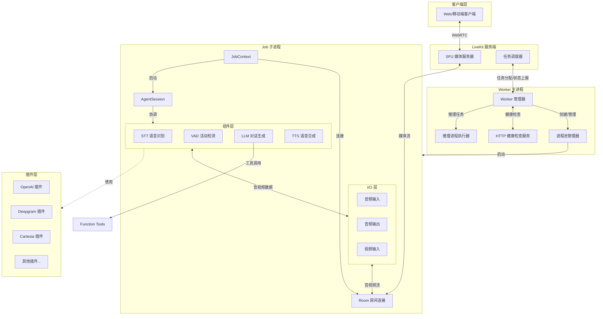
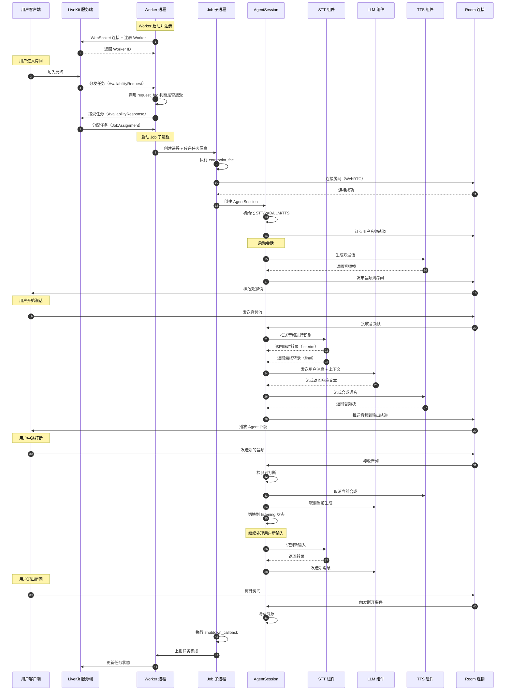

# LiveKit Agents 框架 - 总览

## 0. 摘要

### 项目目标

LiveKit Agents 是一个生产级的实时多模态和语音 AI Agent 框架，用于构建能够进行自然语音交互的智能代理系统。该框架封装了语音识别(STT)、大语言模型(LLM)、语音合成(TTS)、语音活动检测(VAD)等核心能力，提供开箱即用的实时语音对话解决方案。

### 核心能力边界

**核心能力**：
- 实时语音输入处理与识别
- 大语言模型对话生成
- 实时语音合成与输出
- 语音活动检测与打断处理
- 函数工具调用与编排
- 多模态输入支持（音频、视频、文本）
- 分布式任务调度与执行

**非目标**：
- 音视频编解码底层实现（依赖 LiveKit SDK）
- 特定 AI 模型训练与部署
- 业务领域逻辑实现

### 运行环境

- **语言**：Python 3.9+
- **运行时**：asyncio 异步事件循环
- **核心依赖**：
  - livekit-rtc：实时通信 SDK
  - livekit-api：LiveKit 服务端 API
  - aiohttp：异步 HTTP 客户端
  - pydantic：数据验证
  - numpy：音频数据处理

### 部署形态

- **Worker 进程模式**：作为独立 Worker 进程连接到 LiveKit 服务端，接收任务分配
- **多进程架构**：主进程管理 + 多个子进程执行任务
- **插件式扩展**：通过插件机制支持不同的 STT、TTS、LLM 提供商

## 1. 整体架构图



### 图解与要点

#### 组件职责

1. **Worker 主进程**
   - 与 LiveKit 服务端维持 WebSocket 长连接
   - 接收任务分配请求并上报 Worker 状态
   - 管理进程池，预热和回收子进程
   - 提供 HTTP 健康检查接口
   - 负载计算与动态进程数调整

2. **Job 子进程**
   - 独立执行单个 Agent 任务
   - 连接到 LiveKit 房间，处理实时媒体流
   - 协调 STT、LLM、TTS、VAD 组件完成对话循环
   - 隔离故障，单个任务崩溃不影响其他任务

3. **AgentSession 运行时**
   - 核心编排引擎，粘合音视频流与 AI 组件
   - 管理对话轮次、打断检测、端点检测
   - 处理用户输入 → LLM 推理 → 语音输出的完整链路
   - 事件驱动架构，暴露生命周期钩子

4. **组件层**
   - **STT**：将音频流转为文本，支持流式和批量识别
   - **VAD**：检测语音活动，用于端点检测和打断判断
   - **LLM**：文本对话生成，支持函数调用和流式输出
   - **TTS**：文本转语音合成，支持流式和批量合成

#### 耦合关系

- **同步调用**：JobContext → Room、AgentSession → Components
- **异步消息**：Worker ↔ Dispatcher（WebSocket 消息）
- **事件驱动**：所有组件通过 EventEmitter 发布事件
- **进程隔离**：主进程与子进程通过 IPC 通道通信

#### 数据流与控制流

- **音频输入流**：Room → AudioInput → STT → 文本 → LLM
- **音频输出流**：LLM → 文本 → TTS → AudioOutput → Room
- **控制流**：用户语音活动 → VAD 检测 → 打断/端点 → 状态机切换

#### 高可用与扩展性

- **水平扩展**：部署多个 Worker 实例分担负载
- **进程隔离**：单任务崩溃不影响 Worker 整体
- **优雅降级**：组件支持 Fallback 适配器实现降级
- **负载均衡**：基于 CPU 负载动态调整空闲进程数

#### 状态管理

- **无状态设计**：Worker 主进程本身无业务状态
- **任务状态**：由 Job 子进程独立管理
- **会话状态**：AgentSession 维护对话历史（ChatContext）
- **配置热更新**：支持运行时调整部分参数

## 2. 全局时序图（主要业务闭环）



### 图解与要点

#### 入口与初始化

- **Worker 注册**（步骤 1-2）：Worker 启动时通过 WebSocket 连接到 LiveKit 服务端，携带 JWT Token 完成注册，获取唯一 Worker ID
- **任务分配**（步骤 4-7）：服务端根据房间事件触发任务分发，Worker 可通过 `request_fnc` 决策是否接受任务
- **Job 启动**（步骤 8-11）：Worker 从进程池获取或创建新进程，传递任务参数，执行用户定义的 `entrypoint_fnc`
- **房间连接**（步骤 10）：Job 子进程内通过 Room API 建立 WebRTC 连接，获取媒体流读写能力

#### 鉴权与权限

- **Worker Token**：使用 API Key/Secret 生成 JWT，带 `agent=True` 声明
- **Room Token**：任务分配时由服务端下发，包含房间名、身份、权限等信息
- **权限控制**：支持限制发布/订阅/数据通道等权限，通过 `WorkerPermissions` 配置

#### 幂等性

- **任务分配幂等**：同一任务 ID 多次分配视为同一任务，Worker 内部去重
- **消息发送幂等**：WebSocket 消息带 request_id，支持重试不重复执行
- **状态上报幂等**：Worker 状态周期性全量上报，非增量更新

#### 回退策略

- **连接失败重试**：Worker WebSocket 断开后指数退避重试，最多 `max_retry` 次
- **组件降级**：STT/TTS/LLM 支持 FallbackAdapter，主服务不可用时切换备选
- **任务失败处理**：Job 进程崩溃后上报失败状态，不影响 Worker 继续服务

#### 重试点

- **WebSocket 连接**：网络故障时自动重连
- **API 调用**：STT/TTS/LLM 请求失败时根据 `conn_options.max_retry` 重试
- **进程启动**：进程创建失败时重试或报警

#### 超时设定

- **任务分配超时**：7.5 秒内未收到 Assignment 则放弃（`ASSIGNMENT_TIMEOUT`）
- **API 请求超时**：默认 60 秒，可通过 `APIConnectOptions.timeout` 配置
- **进程初始化超时**：10 秒内未完成预热则终止（`initialize_process_timeout`）
- **进程关闭超时**：60 秒内未优雅退出则强制杀死（`shutdown_process_timeout`）

#### 资源上界

- **进程池大小**：根据 CPU 核心数动态调整，默认最多 4 个空闲进程
- **内存限制**：超过 `job_memory_limit_mb` 则杀死进程（默认不限制）
- **并发任务数**：取决于负载阈值 `load_threshold`（默认 0.7）和当前 CPU 占用

## 3. 模块边界与交互图

### 模块清单

| 模块名称 | 职责 | 对外 API | 依赖 |
|---------|------|---------|------|
| **voice** | 语音 Agent 运行时核心 | Agent、AgentSession、io | stt、tts、llm、vad |
| **worker** | Worker 进程管理 | Worker、WorkerOptions | ipc、job |
| **job** | 任务上下文与生命周期 | JobContext、JobProcess、JobRequest | worker、ipc |
| **llm** | 大语言模型抽象 | LLM、ChatContext、RealtimeModel | - |
| **stt** | 语音识别抽象 | STT、RecognizeStream | utils |
| **tts** | 语音合成抽象 | TTS、SynthesizeStream | utils |
| **vad** | 语音活动检测 | VAD | - |
| **ipc** | 进程间通信 | ProcPool、InferenceExecutor | - |
| **cli** | 命令行工具 | run_app、CLI | worker |
| **utils** | 工具集合 | aio、audio、codecs | - |
| **tokenize** | 文本分词 | SentenceTokenizer | - |
| **metrics** | 指标收集 | UsageCollector | - |
| **telemetry** | 遥测追踪 | tracer、metrics | - |

### 模块交互矩阵

| 调用方 → 被调方 | 交互方式 | 错误语义 | 一致性要求 |
|----------------|----------|---------|-----------|
| Worker → Dispatcher | 异步 WebSocket | 重连重试 | 最终一致 |
| Worker → ProcPool | 同步方法调用 | 抛出异常 | 强一致 |
| ProcPool → JobProcess | IPC 通道 | 进程崩溃 | 独立隔离 |
| JobContext → Room | 异步 API | 重试或失败 | 最终一致 |
| AgentSession → STT/LLM/TTS | 同步/异步迭代器 | 事件通知 | 流式处理 |
| AgentSession → Room I/O | 事件订阅 | 事件丢失 | 尽力而为 |
| LLM → FunctionTools | 同步调用 | 工具异常 | 强一致 |

## 4. 关键设计与权衡

### 数据一致性

- **对话历史一致性**：AgentSession 内部维护 ChatContext，单线程顺序更新，保证强一致性
- **任务状态最终一致**：Worker 定期上报状态到服务端，允许短暂不一致
- **媒体流不保证顺序**：音视频帧通过 WebRTC 传输，网络抖动时可能乱序或丢失

### 事务边界

- **无分布式事务**：各模块独立事务，不支持跨进程原子操作
- **补偿机制**：任务失败后通过状态上报触发重试或清理

### 锁与并发策略

- **多进程隔离**：每个 Job 独立进程，避免 GIL 竞争
- **协程并发**：进程内使用 asyncio，单线程事件循环
- **资源锁**：进程池使用 asyncio.Lock 保护内部状态

### 性能关键路径

- **音频输入延迟**：Room → STT 识别 → LLM 生成 → TTS 合成 → Room 输出
  - P50: ~1.5s（取决于模型）
  - P95: ~3s
- **内存峰值**：单 Job 进程约 200-500MB，主要为模型加载与音频缓冲
- **I/O 热点**：WebSocket 长连接、HTTP API 调用、音频流处理

### 可观测性指标

- **Worker 指标**：负载率、活跃任务数、进程池状态
- **任务指标**：执行时长、成功/失败率、状态转换
- **组件指标**：STT/TTS/LLM 调用次数、延迟、Token 使用量
- **追踪**：OpenTelemetry 支持分布式追踪

### 配置项

| 配置项 | 默认值 | 说明 |
|-------|--------|------|
| `ws_url` | `LIVEKIT_URL` 环境变量 | LiveKit 服务端地址 |
| `load_threshold` | 0.7（生产）/ ∞（开发） | 负载阈值，超过则标记为 FULL |
| `num_idle_processes` | CPU 核心数（最多 4） | 预热的空闲进程数 |
| `job_memory_limit_mb` | 0（不限制） | 单任务内存上限 |
| `drain_timeout` | 1800 秒 | 优雅关闭等待时长 |
| `max_retry` | 16 | WebSocket 连接最大重试次数 |

## 5. 典型使用示例与最佳实践

### 示例 1：最小可运行 Agent

```python
from livekit import agents
from livekit.plugins import openai, deepgram

async def entrypoint(ctx: agents.JobContext):
    # 连接到房间
    await ctx.connect()
    
    # 创建 Agent 会话
    session = agents.AgentSession(
        llm=openai.realtime.RealtimeModel(voice="coral"),
    )
    
    # 启动会话，传入 Agent 定义
    await session.start(
        room=ctx.room,
        agent=agents.Agent(
            instructions="You are a helpful voice AI assistant."
        )
    )
    
    # 主动生成欢迎语
    await session.generate_reply(
        instructions="Greet the user and offer your assistance."
    )

# 运行 Worker
if __name__ == "__main__":
    agents.cli.run_app(
        agents.WorkerOptions(entrypoint_fnc=entrypoint)
    )
```

**要点说明**：
- `JobContext.connect()` 必须在访问 room 属性前调用
- `AgentSession` 自动管理 STT/VAD/TTS 的生命周期
- `generate_reply()` 可在任何时刻主动触发 Agent 发言

### 示例 2：自定义组件与工具调用

```python
from livekit import agents
from livekit.agents import llm
from livekit.plugins import openai, deepgram, cartesia, silero

# 定义工具函数
@agents.function_tool
async def get_weather(location: str):
    """获取指定地点的天气"""
    # 实际业务逻辑
    return f"{location} is sunny, 25°C"

# 预热函数（在进程启动时执行一次）
def prewarm(proc: agents.JobProcess):
    # 加载 VAD 模型到进程缓存
    proc.userdata["vad"] = silero.VAD.load()

async def entrypoint(ctx: agents.JobContext):
    await ctx.connect()
    
    session = agents.AgentSession(
        # 使用预热的 VAD
        vad=ctx.proc.userdata["vad"],
        # 组合不同提供商的组件
        stt=deepgram.STT(model="nova-3", language="multi"),
        llm=openai.LLM(model="gpt-4o-mini"),
        tts=cartesia.TTS(voice="male-conversational"),
        # 启用预生成优化
        preemptive_generation=True,
        # 打断配置
        min_interruption_duration=0.2,
        false_interruption_timeout=1.0,
    )
    
    # 定义自定义 Agent
    class WeatherAgent(agents.Agent):
        def __init__(self):
            super().__init__(
                instructions="You are a weather assistant.",
                # 注册工具
                tools=[get_weather],
            )
    
    await session.start(
        room=ctx.room,
        agent=WeatherAgent(),
    )

if __name__ == "__main__":
    agents.cli.run_app(
        agents.WorkerOptions(
            entrypoint_fnc=entrypoint,
            prewarm_fnc=prewarm,
        )
    )
```

**要点说明**：
- `prewarm_fnc` 用于预加载模型，减少首次请求延迟
- `proc.userdata` 可在同一进程的多次任务间共享数据
- `preemptive_generation=True` 在用户说话时即开始生成，降低响应延迟
- 工具函数通过装饰器自动转为 FunctionTool，LLM 可调用

### 示例 3：多 Agent 协作（转接场景）

```python
from livekit import agents

class ReceptionAgent(agents.Agent):
    def __init__(self):
        super().__init__(
            instructions="You are a receptionist. Ask for user needs.",
        )
        
    @agents.function_tool
    async def transfer_to_sales(self):
        """转接到销售部门"""
        # 获取当前运行上下文
        ctx = agents.get_current_job_context()
        session = self._activity._session
        
        # 停止当前 Agent
        await session.stop()
        
        # 启动新 Agent
        await session.start(
            room=ctx.room,
            agent=SalesAgent(),
        )
        
        return "Transferring to sales..."

class SalesAgent(agents.Agent):
    def __init__(self):
        super().__init__(
            instructions="You are a sales agent. Provide product info.",
        )

async def entrypoint(ctx: agents.JobContext):
    await ctx.connect()
    
    session = agents.AgentSession(
        llm="gpt-4o",
        tts="openai-tts",
    )
    
    await session.start(
        room=ctx.room,
        agent=ReceptionAgent(),
    )

if __name__ == "__main__":
    agents.cli.run_app(
        agents.WorkerOptions(entrypoint_fnc=entrypoint)
    )
```

**要点说明**：
- Agent 可以通过工具函数实现转接逻辑
- `session.stop()` + `session.start()` 实现 Agent 切换
- 对话历史会自动延续，新 Agent 可访问之前的上下文

### 最佳实践

#### 资源管理

1. **预热模型**：将重量级模型加载放在 `prewarm_fnc`，避免每次任务重复加载
2. **共享资源**：通过 `proc.userdata` 在同进程多任务间共享资源
3. **及时清理**：使用 `ctx.add_shutdown_callback` 注册清理逻辑

#### 错误处理

1. **组件降级**：使用 FallbackAdapter 包装 STT/TTS/LLM，主服务故障时自动切换
2. **工具异常**：工具函数内部捕获异常，返回友好错误信息给 LLM
3. **任务隔离**：避免在 entrypoint 外部修改全局状态，防止任务间相互影响

#### 性能优化

1. **启用预生成**：`preemptive_generation=True` 可降低 30-50% 响应延迟
2. **调整端点检测**：根据场景调整 `min_endpointing_delay` 和 `max_endpointing_delay`
3. **音频降采样**：不需要高保真时，使用较低采样率（16kHz）节省带宽
4. **批量操作**：TTS 支持流式合成，减少首字节延迟

#### 监控与调试

1. **结构化日志**：通过 `ctx.log_context_fields` 注入上下文信息
2. **指标收集**：监听 `metrics_collected` 事件记录使用量
3. **开发模式**：使用 `agents.cli` 的开发模式进行本地调试
4. **追踪分析**：启用 OpenTelemetry 追踪请求链路

#### 扩展与部署

1. **水平扩展**：部署多个 Worker 实例，由 LiveKit 服务端自动负载均衡
2. **区域部署**：在不同地域部署 Worker，降低延迟
3. **配置管理**：通过环境变量管理配置，避免硬编码
4. **健康检查**：利用 Worker 的 HTTP 接口实现健康探测

---

**本文档版本**：基于 LiveKit Agents SDK 主分支（2025-01-04）生成  
**下一步**：查看各模块详细文档以深入理解内部实现

