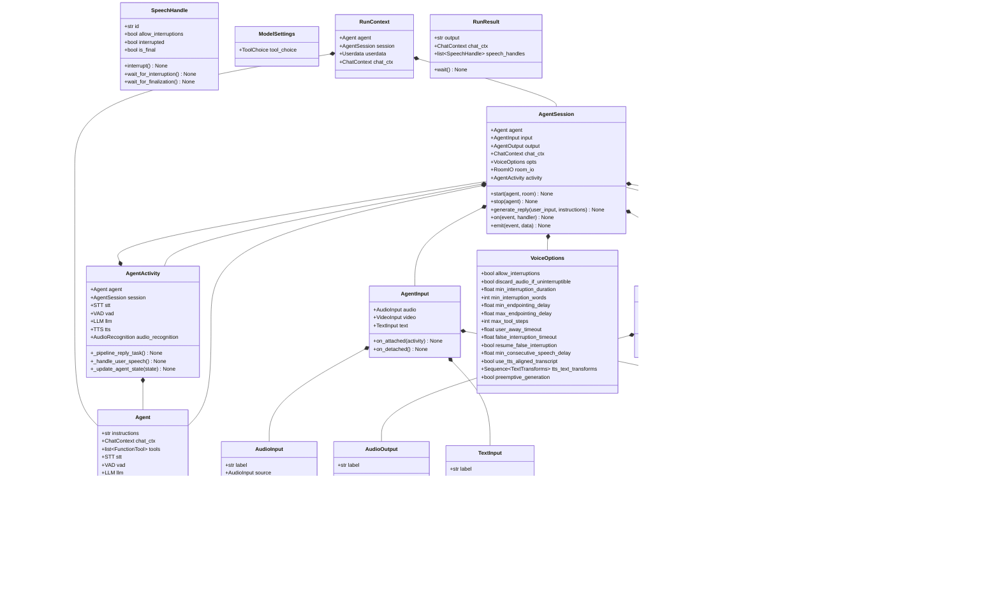

## 模块职责

Voice 模块是 LiveKit Agents 框架的核心运行时，负责实现实时语音 AI Agent 的完整生命周期管理。该模块将音视频流、语音识别(STT)、大语言模型(LLM)、语音合成(TTS)等组件粘合在一起，提供统一的编排和状态管理。

**核心职责**：
- 管理 Agent 的生命周期（启动、运行、停止）
- 协调音视频输入输出流
- 驱动 STT → LLM → TTS 的对话循环
- 处理打断检测与端点检测
- 管理对话历史上下文
- 事件驱动的状态机管理
- 工具函数调用编排

## 输入/输出

### 输入
- **音频流**：来自 LiveKit Room 的实时音频帧（AudioFrame）
- **视频流**：可选的视频帧，用于多模态输入（VideoFrame）
- **文本输入**：通过文本通道发送的用户消息
- **配置参数**：AgentSession 和 Agent 的各类配置选项
- **Agent 定义**：包含指令(instructions)、工具(tools)、模型配置等

### 输出
- **音频流**：合成的语音音频帧
- **文本转录**：Agent 回复的文本转录
- **事件通知**：状态变更、指标收集等事件
- **日志与追踪**：结构化日志和 OpenTelemetry 追踪

## 上下游依赖

### 上游（调用方）
- **JobContext**：任务执行上下文，传递 Room 连接等资源
- **用户代码**：通过 `entrypoint_fnc` 创建和启动 AgentSession

### 下游（被调用方）
- **livekit.rtc.Room**：LiveKit 实时通信连接
- **stt.STT**：语音识别组件
- **llm.LLM / llm.RealtimeModel**：大语言模型
- **tts.TTS**：语音合成组件
- **vad.VAD**：语音活动检测
- **llm.mcp.MCPServer**：Model Context Protocol 服务器（外部工具）

## 生命周期

```
初始化 → 启动 → 监听 → 用户说话 → 识别 → LLM推理 → 合成 → 播放 → 监听 → ... → 停止 → 清理
   ↓                                                                              ↑
   └──────────────────────────────────────────────────────────────────────────────┘
                                (循环往复，直到会话结束)
```

### 生命周期阶段

1. **初始化 (Initializing)**
   - 创建 `AgentSession` 实例
   - 配置各组件（STT、LLM、TTS、VAD）
   - 初始化 I/O 管道（AudioInput、AudioOutput 等）

2. **启动 (Starting)**
   - 调用 `AgentSession.start(agent, room=...)`
   - 创建 `AgentActivity` 内部运行时
   - 连接到 LiveKit Room（如果使用 RoomIO）
   - 订阅用户音视频轨道

3. **监听 (Listening)**
   - Agent 等待用户输入
   - 持续接收音频流并缓冲
   - VAD 检测语音活动

4. **用户说话 (User Speaking)**
   - 检测到语音活动（VAD start_of_speech）
   - 将音频流送入 STT 进行实时识别
   - 接收临时转录(interim)和最终转录(final)
   - 打断检测：如果 Agent 正在说话，判断是否需要打断

5. **端点检测 (Endpointing)**
   - 检测用户语音结束（VAD end_of_speech 或 STT EOU）
   - 等待最小/最大端点延迟
   - 确认用户轮次结束

6. **LLM 推理 (LLM Inference)**
   - 将用户消息加入对话上下文
   - 调用 LLM 生成回复
   - 处理流式响应（ChatChunk）
   - 执行工具调用（如果 LLM 请求）

7. **语音合成 (Speech Synthesis)**
   - 将 LLM 文本响应送入 TTS
   - 流式合成音频帧
   - 应用文本转换（过滤 Markdown、Emoji 等）

8. **播放 (Playing)**
   - 将音频帧推送到输出流
   - 发布到 LiveKit Room
   - 监控播放进度与打断事件

9. **停止 (Stopping)**
   - 调用 `AgentSession.stop()` 或自动触发
   - 取消正在进行的任务
   - 清理资源

10. **清理 (Cleanup)**
    - 断开 Room 连接
    - 释放组件资源
    - 触发 shutdown_callback

## 模块级架构图

```mermaid
flowchart TB
    subgraph Voice["Voice 模块"]
        direction TB
        
        subgraph Core["核心层"]
            AgentSession[AgentSession<br/>会话管理器]
            Agent[Agent<br/>Agent 定义]
            AgentActivity[AgentActivity<br/>活动编排器]
        end
        
        subgraph IO["I/O 抽象层"]
            direction LR
            AudioInput[AudioInput<br/>音频输入抽象]
            VideoInput[VideoInput<br/>视频输入抽象]
            AudioOutput[AudioOutput<br/>音频输出抽象]
            TextOutput[TextOutput<br/>文本输出抽象]
            AgentIOInput[AgentInput<br/>输入管理器]
            AgentIOOutput[AgentOutput<br/>输出管理器]
        end
        
        subgraph RoomIO["RoomIO 实现层"]
            direction LR
            RoomIO[RoomIO<br/>房间I/O协调器]
            ParticipantAudioIn[_ParticipantAudioInputStream<br/>参与者音频输入]
            ParticipantVideoIn[_ParticipantVideoInputStream<br/>参与者视频输入]
            ParticipantAudioOut[_ParticipantAudioOutput<br/>参与者音频输出]
            ParticipantTrOut[_ParticipantTranscriptionOutput<br/>参与者转录输出]
        end
        
        subgraph Recognition["识别与检测"]
            TurnDetector[_TurnDetector<br/>轮次检测器]
            AudioRecognition[AudioRecognition<br/>音频识别协调]
        end
        
        subgraph Support["辅助模块"]
            SpeechHandle[SpeechHandle<br/>语音句柄]
            Events[Events<br/>事件定义]
            RunResult[RunResult<br/>运行结果]
            Transcription[Transcription<br/>转录过滤/同步]
        end
        
        AgentSession -->|管理| Agent
        AgentSession -->|创建/驱动| AgentActivity
        AgentSession -->|配置| AgentIOInput
        AgentSession -->|配置| AgentIOOutput
        
        AgentIOInput -->|持有| AudioInput
        AgentIOInput -->|持有| VideoInput
        AgentIOOutput -->|持有| AudioOutput
        AgentIOOutput -->|持有| TextOutput
        
        RoomIO -->|连接| AgentSession
        RoomIO -->|实现| ParticipantAudioIn
        RoomIO -->|实现| ParticipantVideoIn
        RoomIO -->|实现| ParticipantAudioOut
        RoomIO -->|实现| ParticipantTrOut
        
        ParticipantAudioIn -.->|作为| AudioInput
        ParticipantAudioOut -.->|作为| AudioOutput
        
        AgentActivity -->|使用| TurnDetector
        AgentActivity -->|使用| AudioRecognition
        AgentActivity -->|创建| SpeechHandle
        
        AgentSession -->|发布| Events
        AgentActivity -->|发布| Events
        
        AgentSession -->|协调| Transcription
    end
    
    subgraph External["外部依赖"]
        Room[livekit.rtc.Room<br/>房间连接]
        STT[stt.STT<br/>语音识别]
        LLM[llm.LLM<br/>大语言模型]
        TTS[tts.TTS<br/>语音合成]
        VAD[vad.VAD<br/>活动检测]
    end
    
    RoomIO <-->|订阅/发布| Room
    AgentActivity -->|调用| STT
    AgentActivity -->|调用| LLM
    AgentActivity -->|调用| TTS
    AgentActivity -->|调用| VAD
    
    AudioInput -.->|流式数据| STT
    TTS -.->|流式数据| AudioOutput
```

### 图解与说明

#### 模块分层

**核心层**：
- `AgentSession`：对外主入口，管理会话生命周期，暴露配置和事件接口
- `Agent`：用户定义的 Agent 配置，包含指令、工具、模型设置
- `AgentActivity`：内部运行时，实际驱动对话循环的状态机

**I/O 抽象层**：
- 定义通用的音视频文本输入输出接口
- 支持链式组合（decorator 模式）
- 与具体传输层解耦，支持多种实现（RoomIO、CLI、自定义）

**RoomIO 实现层**：
- 实现基于 LiveKit Room 的音视频传输
- 自动管理轨道订阅、发布、重连
- 处理参与者的音视频流

**识别与检测**：
- 轮次检测（基于 VAD、STT 或 RealtimeModel）
- 端点检测逻辑
- 打断检测逻辑

**辅助模块**：
- 事件定义与类型
- 语音句柄（控制播放、打断）
- 转录过滤与同步

#### 关键边界

**状态边界**：
- User State: `listening` | `speaking` | `away`
- Agent State: `initializing` | `listening` | `thinking` | `speaking`

**线程边界**：
- 所有操作在单一 asyncio 事件循环中执行
- 音视频帧通过异步迭代器传递

**扩展点**：
- 自定义 AudioInput/VideoInput/AudioOutput 实现
- 自定义 TurnDetector 实现
- 自定义 VideoSampler 实现
- 工具函数扩展

#### 状态持有位置

- **对话历史**：`AgentSession._chat_ctx` (ChatContext 对象)
- **会话状态**：`AgentSession._agent_state` 和 `_user_state`
- **当前 Agent**：`AgentSession._agent` (Agent 对象)
- **当前活动**：`AgentSession._activity` (AgentActivity 对象)
- **当前语音**：`AgentActivity._current_speech` (SpeechHandle 对象)

#### 资源占用要点

**内存**：
- 音频缓冲：每个流约 1-2 秒音频缓冲（~200KB）
- ChatContext：对话历史文本（随对话增长）
- 模型缓存：如果使用 prewarm，模型常驻内存

**CPU**：
- 音频处理（重采样、混音）：低
- 组件调用开销：低（主要为 I/O 等待）

**网络**：
- WebRTC 音频流：~50Kbps（双向）
- API 调用：STT/LLM/TTS 请求（流式）

## 与其他模块关系

### 与 Job 模块
- JobContext 提供 Room 连接和任务上下文
- AgentSession 在 Job 子进程中运行
- 通过 `get_job_context()` 获取任务信息

### 与 LLM 模块
- AgentSession 管理 ChatContext 对话历史
- AgentActivity 调用 LLM.chat() 生成回复
- 支持 Realtime API（llm.RealtimeModel）

### 与 STT 模块
- AgentActivity 创建 STT.stream() 进行流式识别
- 监听 SpeechEvent 事件（interim/final）
- 用于端点检测和打断判断

### 与 TTS 模块
- AgentActivity 调用 TTS.synthesize() 或 TTS.stream()
- 将合成音频推送到 AudioOutput
- 支持流式合成降低首字节延迟

### 与 VAD 模块
- 用于语音活动检测
- 配合端点检测和打断检测
- 可作为 TurnDetector 的实现

### 与 Utils 模块
- 使用 aio.Chan 进行异步通道通信
- 使用 AudioBuffer 和 AudioByteStream 处理音频
- 使用 EventEmitter 实现事件机制

## 主要配置选项

| 配置项 | 类型 | 默认值 | 说明 |
|-------|------|--------|------|
| `turn_detection` | TurnDetectionMode | NOT_GIVEN | 轮次检测模式：stt / vad / realtime_llm / manual |
| `allow_interruptions` | bool | True | 是否允许用户打断 Agent |
| `min_interruption_duration` | float | 0.5 | 最小打断时长（秒） |
| `min_endpointing_delay` | float | 0.5 | 最小端点延迟（秒） |
| `max_endpointing_delay` | float | 6.0 | 最大端点延迟（秒） |
| `max_tool_steps` | int | 3 | 最大工具调用步数 |
| `preemptive_generation` | bool | False | 预生成优化（在端点检测前开始推理） |
| `user_away_timeout` | float \| None | 15.0 | 用户离开超时（秒），None 禁用 |
| `false_interruption_timeout` | float \| None | 2.0 | 误打断超时（秒），None 禁用 |
| `resume_false_interruption` | bool | True | 是否恢复误打断的语音 |

## 核心算法/流程

### 打断检测算法

**目的**：判断用户是否在 Agent 说话时进行了有效打断，避免误判（如背景噪音）。

**输入**：
- 用户音频流
- Agent 当前状态（speaking / not speaking）
- 配置参数（min_interruption_duration、min_interruption_words）

**输出**：
- 打断事件（触发取消 TTS 播放）
- 误打断事件（恢复播放）

**复杂度**：O(1) 实时判断

**核心代码**（位于 AgentActivity）：

```python
async def _handle_speech_start(
    self,
    speech_event: stt.SpeechEvent,
) -> None:
    # 1. 检查是否允许打断
    if not self._opts.allow_interruptions:
        return
    
    # 2. 检查 Agent 是否正在说话
    current_speech = self._current_speech
    if not current_speech or current_speech.is_final:
        return
    
    # 3. 检查打断时长是否足够
    if (
        speech_event.duration < self._opts.min_interruption_duration
    ):
        return
    
    # 4. 如果启用了 STT，检查词数
    if (
        self._opts.min_interruption_words > 0
        and len(speech_event.text.split()) < self._opts.min_interruption_words
    ):
        return
    
    # 5. 触发打断
    await self._interrupt_current_speech(
        user_text=speech_event.text,
        duration=speech_event.duration,
    )
```

**逐段解释**：
1. 首先检查配置是否允许打断，如果不允许则直接返回
2. 获取当前正在进行的语音（_current_speech），如果没有或已结束，无需打断
3. 检查用户说话时长是否达到最小打断阈值，避免瞬间噪音误触发
4. 如果启用了 STT 且配置了最小词数，则检查转录文本的词数
5. 满足所有条件后，调用内部方法取消当前语音播放

### 端点检测算法

**目的**：判断用户何时结束说话，触发 LLM 推理。

**输入**：
- VAD 事件（end_of_speech）或 STT 事件（EOU）
- 配置参数（min_endpointing_delay、max_endpointing_delay）
- 用户说话时长

**输出**：
- 端点确认事件（触发 LLM 推理）

**核心代码**（位于 AudioRecognition）：

```python
async def _endpointing_task(self) -> None:
    min_delay = self._opts.min_endpointing_delay
    max_delay = self._opts.max_endpointing_delay
    
    async for user_speech in self._user_speech_ch:
        # 1. 等待 VAD 或 STT 的端点信号
        await user_speech.wait_for_tentative_end()
        
        # 2. 开始延迟计时
        start_time = time.time()
        
        # 3. 在最小延迟和最大延迟之间等待
        while True:
            elapsed = time.time() - start_time
            
            # 达到最大延迟，强制结束
            if elapsed >= max_delay:
                break
            
            # 达到最小延迟，检查是否稳定
            if elapsed >= min_delay:
                if user_speech.is_stable():
                    break
            
            # 如果用户继续说话，重置计时
            if user_speech.continued():
                start_time = time.time()
            
            await asyncio.sleep(0.1)
        
        # 4. 触发端点确认
        await self._emit_end_of_turn(user_speech)
```

**逐段解释**：
1. 从用户语音通道接收语音事件
2. 等待 VAD 或 STT 发出的暂定端点信号（用户可能暂停）
3. 开始计时，在最小和最大延迟之间动态判断
4. 如果达到最大延迟，强制结束（避免无限等待）
5. 如果达到最小延迟且语音稳定（无继续说话迹象），确认端点
6. 如果在等待期间用户继续说话，重置计时器
7. 最终触发轮次结束事件，驱动 LLM 推理

### 预生成优化算法

**目的**：在端点检测期间即开始 LLM 推理，降低响应延迟。

**权衡**：
- 优势：响应更快（重叠计算）
- 劣势：如果用户继续说话，需要取消并重新推理（浪费算力）

**核心代码**：

```python
async def _recognition_task(self) -> None:
    async for interim_event in stt_stream:
        # 1. 更新临时转录
        current_transcript = interim_event.text
        
        # 2. 如果启用预生成且转录非空
        if (
            self._opts.preemptive_generation
            and current_transcript
            and not self._preemptive_task
        ):
            # 3. 启动预生成任务（不等待端点）
            self._preemptive_task = asyncio.create_task(
                self._llm_inference(current_transcript)
            )
        
        # 4. 等待端点确认
        if interim_event.is_final and end_of_turn:
            # 5. 如果有预生成任务，复用结果；否则启动新任务
            if self._preemptive_task and not self._preemptive_task.done():
                await self._preemptive_task
            else:
                await self._llm_inference(current_transcript)
```

**逐段解释**：
1. 接收 STT 的临时转录结果
2. 检查是否启用预生成且已有转录文本
3. 如果满足条件，立即启动 LLM 推理任务（在后台运行）
4. 继续等待端点检测确认
5. 端点确认后，如果预生成任务已完成，直接使用结果；否则等待或重新推理

---

**本文档版本**：基于 LiveKit Agents SDK 主分支（2025-01-04）生成  
**下一步**：查看 Voice 模块 API 文档了解详细接口定义

---

## 目录

1. [会话启动时序图](#1-会话启动时序图)
2. [用户输入识别时序图](#2-用户输入识别时序图)
3. [LLM 推理与语音合成时序图](#3-llm-推理与语音合成时序图)
4. [用户打断处理时序图](#4-用户打断处理时序图)
5. [工具调用时序图](#5-工具调用时序图)
6. [多 Agent 切换时序图](#6-多-agent-切换时序图)

---

## 1. 会话启动时序图

### 场景描述

用户调用 `AgentSession.start()` 启动 Agent 会话，系统初始化 I/O、连接 Room、创建运行时并开始监听用户输入。

### 时序图


### 关键步骤说明

#### 1-2. 启动请求与状态检查
- 用户调用 `start()` 方法
- 检查是否已启动，避免重复启动

#### 3-5. Agent 初始化
- 保存 Agent 引用
- 将状态设置为 "initializing"
- 准备开始创建运行时组件

#### 6-8. RoomIO 创建
- 创建 RoomIO 实例
- 订阅参与者的音视频轨道
- 建立音视频流通道

#### 9-10. AgentActivity 创建
- 创建核心运行时
- 初始化 STT、TTS、LLM 等组件
- 设置事件监听

#### 11-14. 音频转发循环
- 启动后台任务持续接收音频
- 将音频帧推送到 AgentActivity
- 供 STT 识别使用

#### 15-17. 状态更新
- 标记为已启动
- 更新 Agent 状态为 "listening"
- 返回给用户

### 边界条件

- **重复启动**: 如果 `_started = True`，直接返回不执行
- **Room 未连接**: 如果 Room 未连接，RoomIO 创建会失败
- **组件缺失**: 如果未提供必要组件（如 LLM），会抛出错误

### 异常处理

- **RoomIO 创建失败**: 捕获异常，清理已创建的资源
- **组件初始化失败**: 停止启动流程，抛出异常

---

## 2. 用户输入识别时序图

### 场景描述

用户开始说话，系统通过 VAD 检测语音活动，使用 STT 进行实时识别，并在端点检测后准备 LLM 推理。

### 时序图


### 关键步骤说明

#### 1-3. 音频流入
- 用户说话产生音频
- 通过 Room 传输到 Session
- Session 转发给 AgentActivity

#### 4-7. 语音活动检测
- VAD 分析音频判断是否有语音
- 检测到语音开始
- 更新用户状态为 "speaking"
- 发布状态变更事件

#### 8-13. 实时识别
- 将音频推送给 STT 进行识别
- STT 返回临时转录结果
- 持续累积转录文本
- 如果启用预生成，开始后台 LLM 推理

#### 14-15. 语音结束检测
- VAD 检测到语音活动停止
- 触发端点检测流程

#### 16-23. 端点检测
- 开始延迟等待
- 在 min_delay 和 max_delay 之间动态判断
- 如果用户继续说话，重置计时器
- 达到 max_delay 强制结束
- 达到 min_delay 且稳定，确认端点

#### 24-25. 最终转录
- STT 返回最终确定的转录
- 更新用户状态为 "listening"

#### 26-27. 触发推理
- 发布用户输入事件
- 启动 LLM 推理任务

### 边界条件

- **VAD 误检测**: 如果检测到噪音误判为语音，会启动 STT 但可能无转录
- **端点检测超时**: 达到 max_delay 强制结束，避免无限等待
- **STT 失败**: 如果 STT 识别失败，会重试或跳过该段语音

### 性能要点

- **实时性**: 从语音开始到 STT 返回临时结果通常 < 300ms
- **端点延迟**: 默认 0.5-6s 之间，可配置
- **预生成**: 可降低响应延迟 30-50%

---

## 3. LLM 推理与语音合成时序图

### 场景描述

用户输入完成后，系统调用 LLM 生成回复，并使用 TTS 合成语音实时播放给用户。

### 时序图


### 关键步骤说明

#### 1-3. LLM 准备
- 将用户消息加入对话上下文
- 更新 Agent 状态为 "thinking"
- 准备调用 LLM

#### 4-6. LLM 流式生成
- 调用 LLM 的 chat 方法
- 创建流式生成器
- 开始产出文本块

#### 7-17. 流式合成与播放
- 接收 LLM 文本块
- 累积文本到一定长度
- 启动 TTS 合成
- 更新状态为 "speaking"
- TTS 流式产出音频帧
- 将音频推送到输出
- 发布到 Room
- 用户听到音频

#### 18-20. LLM 完成
- LLM 生成结束
- 将 Agent 回复加入上下文
- 为下一轮对话做准备

#### 21-24. TTS 完成
- Flush TTS 缓冲
- 标记最后一帧
- Flush 音频输出
- 确保所有音频发送

#### 25-28. 播放完成
- 等待音频播放完成
- 接收播放完成事件
- 更新状态为 "listening"
- 发布语音创建事件

### 边界条件

- **空回复**: 如果 LLM 返回空文本，跳过 TTS 合成
- **工具调用**: 如果 LLM 请求工具调用，暂停 TTS，执行工具后继续
- **打断**: 如果用户在播放期间打断，取消 TTS 和播放

### 性能要点

- **首字节延迟**: 从 LLM 开始到第一帧音频 < 1s
- **流式重叠**: LLM 生成与 TTS 合成并行，降低总延迟
- **缓冲策略**: 累积足够文本再合成，避免频繁请求

---

## 4. 用户打断处理时序图

### 场景描述

Agent 正在说话时，用户开始说话打断，系统检测打断并取消当前播放，切换到监听状态。

### 时序图


### 关键步骤说明

#### 1-6. Agent 说话中
- Agent 状态为 "speaking"
- 音频正在播放
- 发布到 Room
- 用户听到音频

#### 7-9. 用户开始说话
- 用户音频流入
- 推送到 Activity
- 检测语音活动

#### 10-13. 打断检测初始化
- VAD 检测到语音开始
- 开始检查打断条件

#### 14-18. 打断权限检查
- 检查是否允许打断
- 如果不允许且设置丢弃音频，丢弃
- 如果允许，继续检查条件

#### 19-24. 时长检查
- 检查说话时长是否达到阈值
- 如果不足，继续播放
- 如果足够，继续检查词数

#### 25-35. 词数检查与确认打断
- 获取 STT 转录
- 检查词数是否达到阈值
- 如果满足所有条件：
  - 标记 SpeechHandle 为打断
  - 取消 TTS 合成
  - 清空音频缓冲
  - 停止音频发布
  - 更新状态为 "listening"
  - 发布打断事件

#### 36-46. 误打断检测
- 启动误打断定时器
- 如果超时内无转录文本：
  - 判定为误打断（如背景噪音）
  - 发布误打断事件
  - 如果配置恢复，恢复播放
- 如果超时内有转录：
  - 取消定时器
  - 继续处理用户输入

### 边界条件

- **不允许打断**: `allow_interruptions=False` 时，所有打断尝试被忽略
- **时长不足**: 瞬间噪音不会触发打断
- **词数不足**: 简短的语气词不会打断
- **误打断**: 背景噪音触发打断但无转录，可自动恢复

### 性能要点

- **打断响应**: 检测到打断到停止播放 < 100ms
- **误打断恢复**: 默认 2s 超时检测误打断

---

## 5. 工具调用时序图

### 场景描述

LLM 在生成过程中请求调用工具函数，系统执行工具并将结果返回给 LLM，继续生成最终回复。

### 时序图

```mermaid
sequenceDiagram
    autonumber
    participant Activity as AgentActivity
    participant LLM as LLM 组件
    participant ToolCtx as ToolContext
    participant Tool as 工具函数
    participant ChatCtx as ChatContext
    
    Note over Activity: 开始 LLM 推理
    Activity->>LLM: chat(chat_ctx, tools)
    
    loop LLM 生成
        LLM-->>Activity: ChatChunk
        
        opt 包含工具调用
            Note over Activity: 检测到工具调用请求
            Activity->>Activity: 解析 tool_calls
            
            loop 每个工具调用
                Note over Activity: 获取工具定义
                Activity->>ToolCtx: get_tool(name)
                ToolCtx-->>Activity: FunctionTool
                
                Note over Activity: 解析参数
                Activity->>Activity: parse_arguments(json_args)
                
                Note over Activity: 执行工具
                Activity->>Tool: await tool.callable(**args)
                Tool->>Tool: 执行业务逻辑
                Tool-->>Activity: result
                
                Note over Activity: 记录工具调用
                Activity->>ChatCtx: append(FunctionCall)
                Activity->>ChatCtx: append(FunctionCallOutput)
            end
            
            Note over Activity: 检查工具步数
            Activity->>Activity: tool_step_count++
            
            alt tool_step_count < max_tool_steps
                Note over Activity: 继续 LLM 推理
                Activity->>LLM: chat(updated_chat_ctx, tools)
            else tool_step_count >= max_tool_steps
                Note over Activity: 达到最大步数
                Activity->>Activity: 停止工具调用
                Activity->>Activity: 使用当前结果生成回复
            end
        else 文本响应
            Note over Activity: 正常文本，继续累积
            Activity->>Activity: accumulate_text()
        end
    end
    
    Note over Activity: LLM 生成完成
    LLM-->>Activity: StopIteration
    
    Note over Activity: 发布事件
    Activity->>Activity: emit("function_tools_executed")
```

### 关键步骤说明

#### 1-2. 开始推理
- Activity 调用 LLM
- 传入对话上下文和工具列表

#### 3-7. 检测工具调用
- 接收 LLM 的 ChatChunk
- 检测是否包含工具调用请求
- 解析工具调用信息

#### 8-17. 执行工具
- 从 ToolContext 获取工具定义
- 解析 JSON 参数
- 调用工具函数
- 工具执行业务逻辑
- 返回结果
- 记录工具调用到上下文

#### 18-25. 检查工具步数
- 增加工具调用计数
- 如果未达到最大步数：
  - 更新对话上下文
  - 再次调用 LLM 获取最终回复
- 如果达到最大步数：
  - 停止工具调用链
  - 使用当前结果

#### 26-30. 完成
- LLM 生成结束
- 发布工具执行完成事件

### 边界条件

- **工具不存在**: 如果 LLM 请求的工具不存在，记录错误并继续
- **工具执行失败**: 捕获异常，将错误信息返回给 LLM
- **最大步数限制**: 防止无限循环调用
- **参数验证**: Pydantic 自动验证参数类型

### 性能要点

- **并行工具调用**: 如果 LLM 请求多个工具，可并行执行
- **工具超时**: 建议为工具设置超时，避免阻塞

---

## 6. 多 Agent 切换时序图

### 场景描述

通过工具函数实现 Agent 切换，例如从前台 Agent 转接到销售 Agent。

### 时序图


### 关键步骤说明

#### 1-7. 用户请求转接
- 用户表达转接意图
- 当前 Agent 处理输入
- LLM 识别需要调用转接工具

#### 8-11. 执行转接工具
- Activity 执行工具函数
- 工具调用 Session.stop()
- 停止当前 AgentActivity

#### 12-15. 清理当前 Agent
- 取消所有后台任务
- 停止 STT/TTS 流
- 清理资源

#### 16-22. 启动新 Agent
- 工具调用 Session.start()
- 创建新 Agent 实例
- 创建新 AgentActivity
- 初始化组件

#### 23-27. 切换完成
- 更新 Session 引用
- 切换到新 Activity
- 更新状态为 "listening"
- 返回工具执行结果

#### 28-32. 新 Agent 工作
- LLM 生成转接确认消息
- 新 Agent 开始工作
- 生成欢迎语
- 播放给用户

### 边界条件

- **对话历史**: 默认延续，可选择清空
- **组件复用**: 如果新 Agent 未指定组件，复用 Session 配置
- **并发切换**: 不支持，切换时会阻塞

### 性能要点

- **切换延迟**: 通常 < 500ms
- **资源清理**: 确保旧 Agent 资源释放，避免内存泄漏

---

**本文档版本**：基于 LiveKit Agents SDK 主分支（2025-01-04）生成  
**下一步**：查看数据结构文档了解详细的类型定义

---

## 目录

1. [核心类关系图](#1-核心类关系图)
2. [AgentSession 数据结构](#2-agentsession-数据结构)
3. [Agent 数据结构](#3-agent-数据结构)
4. [I/O 数据结构](#4-io-数据结构)
5. [事件数据结构](#5-事件数据结构)
6. [运行结果数据结构](#6-运行结果数据结构)
7. [配置数据结构](#7-配置数据结构)

---

## 1. 核心类关系图

### Voice 模块完整 UML 类图



### 图解说明

#### 核心组件关系

**AgentSession（会话管理）**：
- 核心运行时，管理整个 Agent 的生命周期
- 持有 Agent 定义、I/O 接口、配置选项
- 通过 AgentActivity 协调各组件工作
- 发布事件供用户监听

**Agent（Agent 定义）**：
- 定义 Agent 的行为（instructions）
- 配置使用的组件（STT、LLM、TTS等）
- 提供工具函数列表
- 可动态切换

**AgentActivity（运行时协调器）**：
- 协调 STT、VAD、LLM、TTS 组件
- 处理用户输入识别
- 触发 LLM 推理和语音合成
- 管理打断和端点检测

**I/O 层**：
- AgentInput: 音频、视频、文本输入抽象
- AgentOutput: 音频、视频、文本输出抽象
- 支持自定义实现和链式组合

**RoomIO（Room 集成）**：
- 连接 LiveKit Room 和 AgentSession
- 管理参与者的音视频流
- 处理轨道订阅和发布

---

## 2. AgentSession 数据结构

### 类定义

```python
class AgentSession(rtc.EventEmitter[EventTypes], Generic[Userdata_T]):
    """Agent 会话运行时"""
```

### 核心字段

| 字段 | 类型 | 可见性 | 说明 |
|-----|------|--------|------|
| `agent` | `Agent` | 只读属性 | 当前运行的 Agent |
| `input` | `AgentInput` | 只读属性 | 输入流集合 |
| `output` | `AgentOutput` | 只读属性 | 输出流集合 |
| `chat_ctx` | `ChatContext` | 只读属性 | 对话上下文 |
| `userdata` | `Userdata_T` | 只读属性 | 用户自定义数据 |
| `agent_state` | `str` | 只读属性 | Agent 状态（"initializing"/"listening"/"thinking"/"speaking"） |
| `user_state` | `str` | 只读属性 | 用户状态（"listening"/"speaking"/"away"） |
| `_opts` | `VoiceOptions` | 私有 | 配置选项 |
| `_room_io` | `RoomIO \| None` | 私有 | Room 集成 |
| `_activity` | `AgentActivity \| None` | 私有 | 运行时协调器 |
| `_started` | `bool` | 私有 | 是否已启动 |

### 字段详解

#### agent（当前 Agent）

**类型**: `Agent`  
**访问**: `session.agent`

**说明**：
- 当前正在运行的 Agent 定义
- 包含 instructions、tools、组件配置
- 可通过 `stop(agent=new_agent)` 切换

**示例**：
```python
print(f"Current agent: {session.agent.label}")
print(f"Instructions: {session.agent.instructions}")
```

#### input（输入流）

**类型**: `AgentInput`  
**访问**: `session.input`

**说明**：
- 封装所有输入流（音频、视频、文本）
- 自动连接到 RoomIO 或自定义源
- 支持动态切换输入源

**示例**：
```python
# 访问音频输入
audio_input = session.input.audio

# 自定义音频输入
session.input.audio = MyCustomAudioInput()
```

#### output（输出流）

**类型**: `AgentOutput`  
**访问**: `session.output`

**说明**：
- 封装所有输出流（音频、视频、文本）
- 自动发布到 RoomIO 或自定义目标
- 支持多路输出

**示例**：
```python
# 访问音频输出
audio_output = session.output.audio

# 自定义音频输出
session.output.audio = MyCustomAudioOutput()
```

#### chat_ctx（对话上下文）

**类型**: `ChatContext`  
**访问**: `session.chat_ctx`

**说明**：
- 完整的对话历史
- 包含用户消息、Agent 回复、工具调用
- 自动累积，可手动清空或修改

**示例**：
```python
# 查看对话历史
for message in session.chat_ctx.messages:
    print(f"{message.role}: {message.content}")

# 清空对话
session.chat_ctx.clear()
```

#### agent_state / user_state（状态）

**类型**: `str`  
**访问**: `session.agent_state` / `session.user_state`

**Agent 状态枚举**：
- `"initializing"`: 初始化中
- `"listening"`: 监听用户输入
- `"thinking"`: LLM 推理中
- `"speaking"`: 播放语音中

**用户状态枚举**：
- `"listening"`: 沉默/监听中
- `"speaking"`: 说话中
- `"away"`: 离开（超时未活动）

**示例**：
```python
@session.on("agent_state_changed")
def on_state_changed(event):
    print(f"Agent state: {event.state}")

@session.on("user_state_changed")
def on_user_state_changed(event):
    print(f"User state: {event.state}")
```

---

## 3. Agent 数据结构

### 类定义

```python
class Agent:
    """Agent 定义"""
```

### 核心字段

| 字段 | 类型 | 可见性 | 说明 |
|-----|------|--------|------|
| `instructions` | `str` | 只读属性 | Agent 指令（系统提示词） |
| `chat_ctx` | `ChatContext` | 只读属性 | 初始对话上下文 |
| `tools` | `list[FunctionTool]` | 只读属性 | 工具函数列表 |
| `stt` | `STT \| None` | 只读属性 | 语音识别组件（覆盖 Session） |
| `vad` | `VAD \| None` | 只读属性 | 语音活动检测组件 |
| `llm` | `LLM \| RealtimeModel \| None` | 只读属性 | 大语言模型 |
| `tts` | `TTS \| None` | 只读属性 | 语音合成组件 |
| `mcp_servers` | `list[MCPServer] \| None` | 只读属性 | MCP 服务器列表 |
| `allow_interruptions` | `bool \| None` | 只读属性 | 是否允许打断 |
| `_activity` | `AgentActivity \| None` | 私有 | 关联的 Activity |

### 字段详解

#### instructions（指令）

**类型**: `str`  
**访问**: `agent.instructions`

**说明**：
- Agent 的核心行为指令
- 类似 LLM 的系统提示词
- 定义 Agent 的角色和能力

**示例**：
```python
agent = Agent(
    instructions="""
    You are a helpful customer service agent.
    Be polite, professional, and concise.
    Always confirm user requests before taking action.
    """
)
```

#### tools（工具函数）

**类型**: `list[FunctionTool]`  
**访问**: `agent.tools`

**说明**：
- Agent 可调用的工具函数列表
- 自动包含 Agent 类方法上的 `@function_tool` 装饰器
- 传递给 LLM 进行工具调用

**示例**：
```python
@agents.function_tool
async def get_weather(location: str) -> str:
    """获取天气信息"""
    return f"{location}: Sunny"

agent = Agent(
    instructions="You are a weather assistant.",
    tools=[get_weather],
)

print(agent.tools)  # 包含 get_weather
```

#### 组件字段（stt / vad / llm / tts）

**说明**：
- 如果提供，覆盖 AgentSession 的默认组件
- 允许每个 Agent 使用不同的组件配置
- `None` 表示使用 Session 配置

**示例**：
```python
# Agent A: 使用高质量 STT
agent_a = Agent(
    instructions="Handle complex queries",
    stt=deepgram.STT(model="nova-3"),
)

# Agent B: 使用快速 STT
agent_b = Agent(
    instructions="Handle simple queries",
    stt=deepgram.STT(model="base"),
)
```

---

## 4. I/O 数据结构

### AgentInput / AgentOutput 类图


### AudioInput（音频输入）

**抽象方法**：

| 方法 | 签名 | 说明 |
|-----|------|------|
| `capture_frame` | `() -> AudioFrame` | 捕获音频帧（异步迭代器） |
| `aclose` | `() -> None` | 关闭输入流 |

**钩子方法**：

| 方法 | 签名 | 说明 |
|-----|------|------|
| `on_attached` | `(activity: AgentActivity) -> None` | 附加到 Activity 时调用 |
| `on_detached` | `() -> None` | 从 Activity 分离时调用 |

**字段**：

| 字段 | 类型 | 说明 |
|-----|------|------|
| `label` | `str` | 输入源标识 |
| `source` | `AudioInput \| None` | 上游输入源（链式） |

### AudioOutput（音频输出）

**抽象方法**：

| 方法 | 签名 | 说明 |
|-----|------|------|
| `capture_frame` | `(frame: AudioFrame) -> None` | 接收音频帧 |
| `flush` | `() -> None` | 刷新缓冲 |
| `clear_buffer` | `() -> None` | 清空缓冲 |

**钩子方法**：

| 方法 | 签名 | 说明 |
|-----|------|------|
| `on_attached` | `(activity: AgentActivity) -> None` | 附加到 Activity 时调用 |
| `on_detached` | `() -> None` | 从 Activity 分离时调用 |

**字段**：

| 字段 | 类型 | 说明 |
|-----|------|------|
| `label` | `str` | 输出目标标识 |

### TimedString（带时间戳的文本）

**定义**：
```python
class TimedString(str):
    start_time: NotGivenOr[float]
    end_time: NotGivenOr[float]
```

**字段说明**：

| 字段 | 类型 | 说明 |
|-----|------|------|
| 继承 `str` | - | 文本内容 |
| `start_time` | `float` | 文本开始时间（秒） |
| `end_time` | `float` | 文本结束时间（秒） |

**用途**：
- 表示带时间信息的文本输入
- 用于时间戳对齐

**示例**：
```python
timed_text = TimedString("Hello", start_time=1.0, end_time=2.5)
print(timed_text)  # "Hello"
print(timed_text.start_time)  # 1.0
print(timed_text.end_time)  # 2.5
```

---

## 5. 事件数据结构

### 事件类图


### 事件字段详解

#### AgentStateChangedEvent

**字段**：

| 字段 | 类型 | 说明 |
|-----|------|------|
| `state` | `str` | 新状态（"initializing"/"listening"/"thinking"/"speaking"） |

**触发时机**：Agent 状态变化时

**示例**：
```python
@session.on("agent_state_changed")
def on_state_changed(event: AgentStateChangedEvent):
    print(f"Agent state: {event.state}")
```

#### UserStateChangedEvent

**字段**：

| 字段 | 类型 | 说明 |
|-----|------|------|
| `state` | `str` | 新状态（"listening"/"speaking"/"away"） |

**触发时机**：用户状态变化时

#### SpeechCreatedEvent

**字段**：

| 字段 | 类型 | 说明 |
|-----|------|------|
| `speech_handle` | `SpeechHandle` | 语音句柄，用于控制播放 |

**触发时机**：Agent 开始说话时

**示例**：
```python
@session.on("speech_created")
def on_speech_created(event: SpeechCreatedEvent):
    speech = event.speech_handle
    print(f"Speech ID: {speech.id}")
    
    # 5 秒后打断
    async def auto_interrupt():
        await asyncio.sleep(5)
        await speech.interrupt()
    
    asyncio.create_task(auto_interrupt())
```

#### UserInputTranscribedEvent

**字段**：

| 字段 | 类型 | 说明 |
|-----|------|------|
| `transcript` | `str` | 转录文本 |
| `stt_event` | `SpeechEvent` | STT 原始事件 |

**触发时机**：用户输入转录完成时

**示例**：
```python
@session.on("user_input_transcribed")
def on_user_input(event: UserInputTranscribedEvent):
    print(f"User said: {event.transcript}")
    confidence = event.stt_event.alternatives[0].confidence
    print(f"Confidence: {confidence}")
```

#### FunctionToolsExecutedEvent

**字段**：

| 字段 | 类型 | 说明 |
|-----|------|------|
| `function_calls` | `list[FunctionCall]` | 工具调用列表 |
| `results` | `list[FunctionCallOutput]` | 工具执行结果 |

**触发时机**：工具函数执行完成时

**示例**：
```python
@session.on("function_tools_executed")
def on_tools_executed(event: FunctionToolsExecutedEvent):
    for call, result in zip(event.function_calls, event.results):
        print(f"Tool: {call.name}")
        print(f"Args: {call.arguments}")
        print(f"Result: {result.content}")
```

#### MetricsCollectedEvent

**字段**：

| 字段 | 类型 | 说明 |
|-----|------|------|
| `metrics` | `dict` | 指标数据 |

**触发时机**：定期收集指标时

**指标内容**：
- STT 指标：音频时长、请求 ID
- LLM 指标：tokens、延迟
- TTS 指标：字符数、延迟

---

## 6. 运行结果数据结构

### RunResult

**定义**：
```python
@dataclass
class RunResult:
    """Agent 运行结果"""
```

**字段**：

| 字段 | 类型 | 说明 |
|-----|------|------|
| `output` | `str` | 最终输出文本 |
| `chat_ctx` | `ChatContext` | 对话上下文 |
| `speech_handles` | `list[SpeechHandle]` | 语音句柄列表 |

**方法**：

| 方法 | 签名 | 说明 |
|-----|------|------|
| `wait` | `() -> None` | 等待运行完成 |

**使用示例**：
```python
run_result = await session.start(
    agent=my_agent,
    room=ctx.room,
    capture_run=True,
)

# 等待完成
await run_result.wait()

# 获取结果
print(f"Output: {run_result.output}")
print(f"Chat history: {run_result.chat_ctx.messages}")
```

### RunContext

**定义**：
```python
@dataclass
class RunContext(Generic[Userdata_T]):
    """运行上下文"""
```

**字段**：

| 字段 | 类型 | 说明 |
|-----|------|------|
| `agent` | `Agent` | 当前 Agent |
| `session` | `AgentSession` | 会话实例 |
| `userdata` | `Userdata_T` | 用户数据 |
| `chat_ctx` | `ChatContext` | 对话上下文（只读） |

**用途**：
- 在 Agent 方法中访问运行时信息
- 作为工具函数的上下文参数

---

## 7. 配置数据结构

### VoiceOptions

**定义**：
```python
@dataclass
class VoiceOptions:
    """Voice 模块配置选项"""
```

**字段详表**：

| 字段 | 类型 | 默认值 | 说明 |
|-----|------|--------|------|
| `allow_interruptions` | `bool` | `True` | 是否允许用户打断 Agent |
| `discard_audio_if_uninterruptible` | `bool` | `True` | Agent 不可打断时是否丢弃音频 |
| `min_interruption_duration` | `float` | `0.5` | 最小打断时长（秒） |
| `min_interruption_words` | `int` | `0` | 最小打断词数 |
| `min_endpointing_delay` | `float` | `0.5` | 最小端点延迟（秒） |
| `max_endpointing_delay` | `float` | `6.0` | 最大端点延迟（秒） |
| `max_tool_steps` | `int` | `3` | 最大连续工具调用次数 |
| `user_away_timeout` | `float \| None` | `15.0` | 用户离开超时（秒），None 禁用 |
| `false_interruption_timeout` | `float \| None` | `2.0` | 误打断超时（秒），None 禁用 |
| `resume_false_interruption` | `bool` | `True` | 是否恢复误打断的语音 |
| `min_consecutive_speech_delay` | `float` | `0.0` | 连续语音最小间隔（秒） |
| `use_tts_aligned_transcript` | `bool` | `False` | 是否使用 TTS 对齐转录 |
| `tts_text_transforms` | `Sequence[TextTransforms]` | `["filter_markdown", "filter_emoji"]` | TTS 文本转换列表 |
| `preemptive_generation` | `bool` | `False` | 是否启用预生成优化 |

### RoomInputOptions

**定义**：
```python
@dataclass
class RoomInputOptions:
    """Room 输入配置"""
```

**字段详表**：

| 字段 | 类型 | 默认值 | 说明 |
|-----|------|--------|------|
| `audio_enabled` | `bool` | `NOT_GIVEN` | 是否启用音频输入 |
| `video_enabled` | `bool` | `False` | 是否启用视频输入 |
| `text_enabled` | `bool` | `NOT_GIVEN` | 是否启用文本输入 |
| `participant_identity` | `str` | `NOT_GIVEN` | 指定参与者身份 |
| `audio_sample_rate` | `int` | `48000` | 音频采样率 |
| `audio_num_channels` | `int` | `1` | 音频通道数 |
| `noise_cancellation` | `BVC \| None` | `NOT_GIVEN` | Krisp 噪声消除 |
| `pre_connect_audio_enabled` | `bool` | `False` | 预连接音频缓存 |
| `pre_connect_audio_timeout` | `float` | `10.0` | 预连接超时（秒） |

### RoomOutputOptions

**定义**：
```python
@dataclass
class RoomOutputOptions:
    """Room 输出配置"""
```

**字段详表**：

| 字段 | 类型 | 默认值 | 说明 |
|-----|------|--------|------|
| `audio_enabled` | `bool` | `NOT_GIVEN` | 是否启用音频输出 |
| `transcription_enabled` | `bool` | `False` | 是否启用转录输出 |
| `sync_transcription` | `bool` | `True` | 转录是否与音频同步 |
| `transcription_speed` | `float` | `1.0` | 转录同步速度倍率 |

### SessionConnectOptions

**定义**：
```python
@dataclass
class SessionConnectOptions:
    """会话连接配置"""
```

**字段详表**：

| 字段 | 类型 | 默认值 | 说明 |
|-----|------|--------|------|
| `stt` | `APIConnectOptions` | 默认值 | STT 连接选项 |
| `llm` | `APIConnectOptions` | 默认值 | LLM 连接选项 |
| `tts` | `APIConnectOptions` | 默认值 | TTS 连接选项 |

**APIConnectOptions 字段**：

| 字段 | 类型 | 默认值 | 说明 |
|-----|------|--------|------|
| `max_retry` | `int` | `3` | 最大重试次数 |
| `retry_interval` | `float` | `1.0` | 重试间隔（秒） |
| `timeout` | `float` | `30.0` | 请求超时（秒） |

---

## 8. 数据流向图

### Agent 完整数据流


### 图解说明

**数据流路径**：

1. **用户输入**：用户 → RoomIO → AudioInput → AgentActivity
2. **语音检测**：AgentActivity → VAD → AgentActivity
3. **语音识别**：AgentActivity → STT → AgentActivity
4. **对话管理**：转录文本 → ChatContext → LLM
5. **工具调用**：LLM → FunctionTool → LLM
6. **语音合成**：LLM 生成文本 → TTS → AgentActivity
7. **音频输出**：AgentActivity → AudioOutput → RoomIO → 用户
8. **事件流**：AgentActivity → AgentSession → 用户代码

**数据转换**：
- 原始音频 → AudioFrame（RoomIO）
- AudioFrame → SpeechEvent（STT）
- SpeechEvent → 文本（ChatContext）
- 文本 → ChatChunk（LLM）
- 文本 → SynthesizedAudio（TTS）
- SynthesizedAudio → AudioFrame（输出）

---

**本文档版本**：基于 LiveKit Agents SDK 主分支（2025-01-04）生成  
**相关文档**：
- [Voice 模块概览](./LiveKit-01-Voice模块-概览.md)
- [Voice 模块 API 详解](./LiveKit-01-Voice模块-API详解.md)
- [Voice 模块时序图](./LiveKit-01-Voice模块-时序图.md)

---

## 目录

1. [AgentSession.start() 调用链](#1-agentsessionstart-调用链)
2. [用户输入识别调用链](#2-用户输入识别调用链)
3. [LLM 推理调用链](#3-llm-推理调用链)
4. [打断检测调用链](#4-打断检测调用链)
5. [工具调用链](#5-工具调用链)

---

## 1. AgentSession.start() 调用链

### 调用层级图


### 第 1 层：用户代码

**位置**: 用户 entrypoint 函数  
**功能**: 启动 Agent 会话

**代码示例**：
```python
async def entrypoint(ctx: agents.JobContext):
    await ctx.connect()
    
    session = agents.AgentSession(
        llm="gpt-4o",
        stt="deepgram",
        tts="cartesia",
    )
    
    # 调用 start()
    await session.start(
        agent=my_agent,
        room=ctx.room,
    )
```

**输入**：
- `agent`: Agent 定义
- `room`: LiveKit Room 连接
- `room_input_options`: 输入配置（可选）
- `room_output_options`: 输出配置（可选）

**输出**: `None` 或 `RunResult`（如果 `capture_run=True`）

---

### 第 2 层：AgentSession.start()

**位置**: `livekit/agents/voice/agent_session.py:447`  
**功能**: 初始化 Agent 会话并启动运行时

**核心代码**：
```python
async def start(
    self,
    agent: Agent,
    *,
    capture_run: bool = False,
    room: NotGivenOr[rtc.Room] = NOT_GIVEN,
    room_input_options: NotGivenOr[room_io.RoomInputOptions] = NOT_GIVEN,
    room_output_options: NotGivenOr[room_io.RoomOutputOptions] = NOT_GIVEN,
) -> RunResult | None:
    async with self._lock:
        # 1. 检查是否已启动
        if self._started:
            return None
        
        # 2. 初始化状态
        self._closing = False
        self._agent = agent
        self._update_agent_state("initializing")
        
        # 3. 创建 RoomIO（如果提供了 room）
        if is_given(room) and not self._room_io:
            self._room_io = room_io.RoomIO(
                room=room,
                agent_session=self,
                input_options=room_input_options,
                output_options=room_output_options,
            )
            # 启动 RoomIO
            await self._room_io.start()
        
        # 4. 创建 AgentActivity
        await self._update_activity(self._agent, wait_on_enter=False)
        
        # 5. 启动音频转发任务
        if self.input.audio:
            self._forward_audio_atask = asyncio.create_task(
                self._forward_audio_task(),
                name="_forward_audio"
            )
        
        # 6. 启动视频转发任务
        if self.input.video:
            self._forward_video_atask = asyncio.create_task(
                self._forward_video_task(),
                name="_forward_video"
            )
        
        # 7. 更新状态
        self._started = True
        self._update_agent_state("listening")
        
        # 8. 返回 RunResult（如果需要）
        if capture_run:
            run_result = RunResult(...)
            return run_result
        
        return None
```

**关键步骤说明**：

**步骤 1-2：状态检查与初始化**
- 使用锁防止并发启动
- 检查 `_started` 标志避免重复启动
- 保存 Agent 引用
- 设置状态为 "initializing"

**步骤 3：创建 RoomIO**
- 如果提供 `room` 参数，创建 RoomIO 实例
- RoomIO 负责与 LiveKit Room 的交互
- 调用 `RoomIO.start()` 启动 I/O

**步骤 4：创建 AgentActivity**
- 调用 `_update_activity()` 创建运行时
- AgentActivity 协调 STT、VAD、LLM、TTS
- 初始化音频识别组件

**步骤 5-6：启动音频/视频转发**
- 创建后台任务持续转发帧
- 从 input 读取，推送到 AgentActivity
- 支持音频和视频

**步骤 7-8：完成启动**
- 标记为已启动
- 更新状态为 "listening"
- 返回 RunResult（可选）

---

### 第 3 层（分支 A）：RoomIO 初始化与启动

#### RoomIO.__init__()

**位置**: `livekit/agents/voice/room_io/room_io.py`  
**功能**: 初始化 Room I/O 管理器

**核心代码**：
```python
def __init__(
    self,
    *,
    room: rtc.Room,
    agent_session: AgentSession,
    input_options: RoomInputOptions,
    output_options: RoomOutputOptions,
):
    # 1. 保存引用
    self._room = room
    self._session = agent_session
    self._input_opts = input_options
    self._output_opts = output_options
    
    # 2. 初始化状态
    self._started = False
    self._input_streams: dict[str, _ParticipantInputStream] = {}
    
    # 3. 注册 Room 事件监听
    room.on("participant_connected", self._on_participant_connected)
    room.on("track_subscribed", self._on_track_subscribed)
```

#### RoomIO.start()

**位置**: `livekit/agents/voice/room_io/room_io.py`  
**功能**: 启动 I/O，处理预连接音频和现有参与者

**核心代码**：
```python
async def start(self):
    # 1. 处理预连接音频缓存
    if self._input_opts.pre_connect_audio_enabled:
        # 获取预连接的音频数据
        pre_connect_audio = await self._get_pre_connect_audio()
        if pre_connect_audio:
            # 推送到 AgentSession
            for frame in pre_connect_audio:
                await self._session._push_audio_frame(frame)
    
    # 2. 处理已连接的参与者
    for participant in self._room.remote_participants.values():
        await self._on_participant_connected(participant)
    
    # 3. 创建音频输出
    if self._output_opts.audio_enabled:
        audio_output = _ParticipantAudioOutput(
            room=self._room,
            participant=None,  # 发布到所有人
        )
        self._session.output.audio = audio_output
    
    # 4. 创建转录输出
    if self._output_opts.transcription_enabled:
        transcription_output = _ParticipantTranscriptionOutput(
            room=self._room,
            sync=self._output_opts.sync_transcription,
        )
        self._session.output.transcription = transcription_output
    
    self._started = True
```

#### _on_participant_connected()

**位置**: `livekit/agents/voice/room_io/room_io.py`  
**功能**: 处理参与者连接，创建输入流

**核心代码**：
```python
def _on_participant_connected(self, participant: rtc.RemoteParticipant):
    # 1. 检查是否为目标参与者
    if self._input_opts.participant_identity:
        if participant.identity != self._input_opts.participant_identity:
            return  # 跳过非目标参与者
    
    # 2. 创建音频输入流
    if self._input_opts.audio_enabled:
        audio_input = _ParticipantAudioInputStream(
            participant=participant,
            sample_rate=self._input_opts.audio_sample_rate,
            num_channels=self._input_opts.audio_num_channels,
        )
        
        # 设置为 AgentSession 的输入
        if not self._session.input.audio:
            self._session.input.audio = audio_input
        
        self._input_streams[participant.identity] = audio_input
    
    # 3. 创建视频输入流
    if self._input_opts.video_enabled:
        video_input = _ParticipantVideoInputStream(
            participant=participant,
        )
        
        if not self._session.input.video:
            self._session.input.video = video_input
```

---

### 第 3 层（分支 B）：AgentActivity 初始化

#### _update_activity()

**位置**: `livekit/agents/voice/agent_session.py`  
**功能**: 创建或更新 AgentActivity

**核心代码**：
```python
async def _update_activity(
    self,
    agent: Agent,
    *,
    wait_on_enter: bool = True,
):
    # 1. 停止旧的 Activity
    if self._activity:
        await self._activity._detach()
    
    # 2. 创建新的 AgentActivity
    self._activity = AgentActivity(agent, self)
    
    # 3. 启动 Activity
    await self._activity._start(wait_on_enter=wait_on_enter)
    
    # 4. 通知 Agent
    await agent._on_attached(self._activity)
```

#### AgentActivity.__init__()

**位置**: `livekit/agents/voice/agent_activity.py:89`  
**功能**: 初始化运行时协调器

**核心代码**：
```python
def __init__(self, agent: Agent, sess: AgentSession):
    # 1. 保存引用
    self._agent = agent
    self._session = sess
    
    # 2. 初始化状态
    self._started = False
    self._closed = False
    self._scheduling_paused = True
    
    # 3. 初始化语音队列
    self._current_speech: SpeechHandle | None = None
    self._speech_q: list[tuple[int, float, SpeechHandle]] = []
    
    # 4. 初始化任务
    self._scheduling_atask: asyncio.Task | None = None
    self._user_turn_completed_atask: asyncio.Task | None = None
    
    # 5. 检测轮次检测模式
    self._turn_detection_mode = self._detect_turn_detection_mode()
    
    # 6. Realtime LLM 初始化
    if isinstance(self.llm, llm.RealtimeModel):
        self._rt_session = self.llm.session(
            chat_ctx=self._agent._chat_ctx,
            tools=self._agent._tools,
        )
```

#### AgentActivity._start()

**位置**: `livekit/agents/voice/agent_activity.py`  
**功能**: 启动 Activity 运行时

**核心代码**：
```python
async def _start(self, *, wait_on_enter: bool = True):
    # 1. 创建音频识别组件
    if not isinstance(self.llm, llm.RealtimeModel):
        self._audio_recognition = AudioRecognition(
            stt=self.stt,
            vad=self.vad,
            hooks=self,  # 回调到 AgentActivity
            turn_detection=self._turn_detection_mode,
        )
        
        # 启动音频识别任务
        self._audio_recognition_atask = asyncio.create_task(
            self._audio_recognition_task(),
            name="_audio_recognition"
        )
    
    # 2. 启动语音调度任务
    self._scheduling_atask = asyncio.create_task(
        self._speech_scheduling_task(),
        name="_speech_scheduling"
    )
    
    # 3. 如果是 Realtime LLM，启动 Realtime 会话
    if self._rt_session:
        await self._rt_session.start()
        self._rt_atask = asyncio.create_task(
            self._realtime_task(),
            name="_realtime"
        )
    
    self._started = True
```

---

### 第 3 层（分支 C）：音频转发任务

#### _forward_audio_task()

**位置**: `livekit/agents/voice/agent_session.py`  
**功能**: 持续转发音频帧到 AgentActivity

**核心代码**：
```python
async def _forward_audio_task(self):
    """持续接收音频并推送到 Activity"""
    
    audio_input = self.input.audio
    if not audio_input:
        return
    
    # 循环接收音频帧
    try:
        async for frame in audio_input.capture_frame():
            # 检查是否关闭
            if self._closing:
                break
            
            # 推送到 Activity
            if self._activity:
                await self._activity._push_frame(frame)
    
    except Exception as e:
        logger.error(f"Audio forwarding error: {e}")
        self.emit("error", ErrorEvent(error=e))
```

#### AgentActivity._push_frame()

**位置**: `livekit/agents/voice/agent_activity.py`  
**功能**: 接收音频帧并推送到音频识别

**核心代码**：
```python
async def _push_frame(self, frame: rtc.AudioFrame):
    # 1. 更新活动时间
    self._update_activity()
    
    # 2. Realtime LLM 模式
    if self._rt_session:
        # 直接推送到 Realtime 会话
        await self._rt_session.push_audio(frame)
        return
    
    # 3. 标准模式：推送到音频识别
    if self._audio_recognition:
        await self._audio_recognition.push_frame(frame)
```

---

### 调用链总结

```
用户代码
  └─> AgentSession.start(agent, room)
       ├─> RoomIO.__init__(room, options)
       │    └─> RoomIO.start()
       │         ├─> _get_pre_connect_audio()  # 预连接音频
       │         ├─> _on_participant_connected()  # 处理参与者
       │         │    ├─> _create_audio_input()
       │         │    └─> _create_video_input()
       │         ├─> _create_audio_output()
       │         └─> _create_transcription_output()
       │
       ├─> _update_activity(agent)
       │    └─> AgentActivity.__init__(agent, session)
       │         └─> AgentActivity._start()
       │              ├─> AudioRecognition.__init__()
       │              ├─> _audio_recognition_task()  # 后台任务
       │              └─> _speech_scheduling_task()  # 后台任务
       │
       └─> _forward_audio_task()  # 后台任务
            └─> 循环: audio_input.capture_frame()
                 └─> AgentActivity._push_frame(frame)
                      └─> AudioRecognition.push_frame(frame)
```

**关键数据流**：
1. **Room → RoomIO**: 参与者音视频轨道
2. **RoomIO → AudioInput**: AudioFrame 流
3. **AudioInput → AgentActivity**: 音频帧转发
4. **AgentActivity → AudioRecognition**: 音频识别处理

---

## 2. 用户输入识别调用链

### 调用层级图


### 第 1 层：AudioRecognition.push_frame()

**位置**: `livekit/agents/voice/audio_recognition.py`  
**功能**: 接收音频帧并分发到 VAD 和 STT

**核心代码**：
```python
async def push_frame(self, frame: rtc.AudioFrame):
    # 1. 检查用户状态
    if self._user_speaking:
        # 用户正在说话，累积音频
        self._audio_buffer.append(frame)
    
    # 2. 推送到 VAD（如果启用）
    if self._vad:
        await self._vad_stream.push_frame(frame)
    
    # 3. 推送到 STT（如果启用）
    if self._stt and self._stt_stream:
        await self._stt_stream.push_frame(frame)
```

---

### 第 2 层（分支 A）：VAD 处理

#### VAD 语音开始检测

**位置**: `livekit/agents/voice/audio_recognition.py`  
**功能**: 检测语音活动并触发回调

**核心代码**：
```python
async def _vad_event_handler(self, event: vad.VADEvent):
    # 1. START_OF_SPEECH 事件
    if event.type == vad.VADEventType.START_OF_SPEECH:
        # 标记用户正在说话
        self._user_speaking = True
        
        # 回调到 AgentActivity
        await self._hooks.on_speech_start()
        
        # 启动 STT 流（如果配置）
        if self._stt and not self._stt_stream:
            self._stt_stream = self._stt.stream()
            self._stt_task = asyncio.create_task(
                self._stt_event_handler()
            )
    
    # 2. END_OF_SPEECH 事件
    elif event.type == vad.VADEventType.END_OF_SPEECH:
        # 标记语音结束
        self._user_speaking = False
        
        # 触发端点检测
        await self._trigger_endpointing()
```

#### AgentActivity._on_speech_start()

**位置**: `livekit/agents/voice/agent_activity.py`  
**功能**: 处理语音开始事件

**核心代码**：
```python
async def _on_speech_start(self):
    # 1. 更新用户状态
    self._session._update_user_state("speaking")
    
    # 2. 检查打断
    if self._current_speech and self._session._opts.allow_interruptions:
        # 检查打断条件
        await self._check_interruption()
    
    # 3. 预生成优化
    if self._session._opts.preemptive_generation:
        # 启动预生成任务
        self._preemptive_generation_task = asyncio.create_task(
            self._preemptive_generation()
        )
```

---

### 第 2 层（分支 B）：STT 处理

#### STT 临时转录

**位置**: `livekit/agents/voice/audio_recognition.py`  
**功能**: 接收 STT 事件并处理

**核心代码**：
```python
async def _stt_event_handler(self):
    """处理 STT 流事件"""
    
    async for event in self._stt_stream:
        # 1. INTERIM_TRANSCRIPT（临时转录）
        if event.type == stt.SpeechEventType.INTERIM_TRANSCRIPT:
            # 累积临时转录
            self._interim_text = event.alternatives[0].text
            
            # 回调到 AgentActivity
            await self._hooks.on_interim_transcript(event)
            
            # 检查打断词数
            if self._session._opts.min_interruption_words > 0:
                word_count = len(split_words(self._interim_text))
                if word_count >= self._session._opts.min_interruption_words:
                    await self._hooks.on_interruption_words_met()
        
        # 2. FINAL_TRANSCRIPT（最终转录）
        elif event.type == stt.SpeechEventType.FINAL_TRANSCRIPT:
            # 保存最终转录
            self._final_text = event.alternatives[0].text
            
            # 回调到 AgentActivity
            await self._hooks.on_final_transcript(event)
        
        # 3. END_OF_SPEECH（语音结束）
        elif event.type == stt.SpeechEventType.END_OF_SPEECH:
            # 触发端点检测
            await self._trigger_endpointing()
```

#### AgentActivity._on_final_transcript()

**位置**: `livekit/agents/voice/agent_activity.py`  
**功能**: 处理最终转录并触发 LLM 推理

**核心代码**：
```python
async def _on_final_transcript(
    self,
    transcript: str,
    stt_event: stt.SpeechEvent,
):
    # 1. 更新用户状态
    self._session._update_user_state("listening")
    
    # 2. 发布事件
    self._session.emit(
        "user_input_transcribed",
        UserInputTranscribedEvent(
            transcript=transcript,
            stt_event=stt_event,
        )
    )
    
    # 3. 添加到对话上下文
    user_message = llm.ChatMessage(
        role="user",
        content=transcript,
    )
    self._session._chat_ctx.append(user_message)
    
    # 4. 触发 LLM 推理
    await self._pipeline_reply_task(
        chat_ctx=self._session._chat_ctx,
        tools=self._agent._tools,
        new_message=user_message,
    )
```

---

### 第 3 层：端点检测

#### _trigger_endpointing()

**位置**: `livekit/agents/voice/audio_recognition.py`  
**功能**: 触发端点检测逻辑

**核心代码**：
```python
async def _trigger_endpointing(self):
    # 1. 启动端点检测计时器
    self._endpointing_start_time = time.time()
    
    # 2. 最小延迟
    min_delay = self._session._opts.min_endpointing_delay
    await asyncio.sleep(min_delay)
    
    # 3. 检查是否仍然沉默
    if self._user_speaking:
        # 用户继续说话，重置计时器
        return
    
    # 4. 检查最大延迟
    max_delay = self._session._opts.max_endpointing_delay
    elapsed = time.time() - self._endpointing_start_time
    
    if elapsed >= max_delay:
        # 达到最大延迟，强制结束
        await self._finalize_turn()
        return
    
    # 5. 动态等待
    remaining = max_delay - elapsed
    await asyncio.sleep(remaining)
    
    # 6. 最终检查
    if not self._user_speaking:
        await self._finalize_turn()
```

#### _finalize_turn()

**位置**: `livekit/agents/voice/audio_recognition.py`  
**功能**: 完成用户轮次

**核心代码**：
```python
async def _finalize_turn(self):
    # 1. 获取最终转录
    final_text = self._final_text or self._interim_text
    
    # 2. 停止 STT 流
    if self._stt_stream:
        await self._stt_stream.flush()
        await self._stt_stream.aclose()
        self._stt_stream = None
    
    # 3. 回调到 AgentActivity
    await self._hooks.on_final_transcript(
        transcript=final_text,
        stt_event=self._last_stt_event,
    )
    
    # 4. 清理状态
    self._user_speaking = False
    self._interim_text = ""
    self._final_text = ""
```

---

### 调用链总结

```
音频帧 (AudioFrame)
  └─> AudioRecognition.push_frame(frame)
       ├─> VAD.push_frame(frame)
       │    └─> VAD 分析
       │         ├─> START_OF_SPEECH
       │         │    └─> AgentActivity._on_speech_start()
       │         │         ├─> _update_user_state("speaking")
       │         │         ├─> _check_interruption()
       │         │         └─> _preemptive_generation()（可选）
       │         │
       │         └─> END_OF_SPEECH
       │              └─> _trigger_endpointing()
       │                   ├─> 等待 min_endpointing_delay
       │                   ├─> 检查是否继续说话
       │                   ├─> 等待 max_endpointing_delay
       │                   └─> _finalize_turn()
       │
       └─> STT.push_frame(frame)
            └─> STT 识别
                 ├─> INTERIM_TRANSCRIPT
                 │    └─> AgentActivity._on_interim_transcript()
                 │         └─> 检查打断词数
                 │
                 └─> FINAL_TRANSCRIPT
                      └─> AgentActivity._on_final_transcript()
                           ├─> _update_user_state("listening")
                           ├─> emit("user_input_transcribed")
                           ├─> chat_ctx.append(user_message)
                           └─> _pipeline_reply_task()
```

**关键数据流**：
1. **AudioFrame → VAD**: 语音活动检测
2. **AudioFrame → STT**: 语音识别
3. **STT → AgentActivity**: 转录文本
4. **AgentActivity → LLM Pipeline**: 触发推理

---

## 3. LLM 推理调用链

### 调用层级图


### 第 1 层：_pipeline_reply_task()

**位置**: `livekit/agents/voice/agent_activity.py`  
**功能**: 协调 LLM 推理管道

**核心代码**：
```python
async def _pipeline_reply_task(
    self,
    *,
    chat_ctx: llm.ChatContext,
    tools: list[llm.FunctionTool],
    speech_handle: SpeechHandle,
    new_message: llm.ChatMessage | None = None,
    instructions: str | None = None,
):
    # 1. 更新 Agent 状态
    self._session._update_agent_state("thinking")
    
    # 2. 准备 LLM 调用
    if instructions:
        # 临时指令
        chat_ctx = update_instructions(chat_ctx, instructions)
    
    # 3. 执行 LLM 推理
    llm_stream = await perform_llm_inference(
        llm=self.llm,
        chat_ctx=chat_ctx,
        tools=tools,
        max_tool_steps=self._session._opts.max_tool_steps,
    )
    
    # 4. 处理 LLM 输出
    async for chunk in llm_stream:
        # 4a. 文本块
        if isinstance(chunk, llm.ChatChunk):
            # 累积文本
            accumulated_text += chunk.delta
            
            # 当累积足够文本时，启动 TTS
            if len(accumulated_text) > MIN_TEXT_FOR_TTS:
                await self._start_tts_generation(accumulated_text)
        
        # 4b. 工具调用
        elif isinstance(chunk, llm.FunctionCall):
            # 执行工具
            tool_result = await perform_tool_executions(
                tools=tools,
                function_calls=[chunk],
            )
            
            # 添加到上下文
            chat_ctx.append(tool_result)
            
            # 继续 LLM 推理
            continue
    
    # 5. TTS 完成
    await self._flush_tts()
    
    # 6. 更新状态
    self._session._update_agent_state("listening")
```

---

### 第 2 层（分支 A）：LLM 推理

#### perform_llm_inference()

**位置**: `livekit/agents/voice/generation.py`  
**功能**: 执行 LLM 推理并处理工具调用

**核心代码**：
```python
async def perform_llm_inference(
    *,
    llm: llm.LLM,
    chat_ctx: llm.ChatContext,
    tools: list[llm.FunctionTool],
    max_tool_steps: int = 3,
) -> AsyncIterator[llm.ChatChunk | llm.FunctionCall]:
    """
    执行 LLM 推理，支持多轮工具调用
    """
    
    tool_step = 0
    
    while tool_step < max_tool_steps:
        # 1. 调用 LLM
        llm_stream = llm.chat(
            chat_ctx=chat_ctx,
            tools=tools if tool_step < max_tool_steps else [],
        )
        
        # 2. 处理流式输出
        accumulated_text = ""
        function_calls: list[llm.FunctionCall] = []
        
        async for chunk in llm_stream:
            # 2a. 文本块
            if isinstance(chunk, llm.ChatChunk):
                accumulated_text += chunk.delta
                yield chunk
            
            # 2b. 工具调用
            elif isinstance(chunk, llm.FunctionCall):
                function_calls.append(chunk)
        
        # 3. 如果没有工具调用，结束
        if not function_calls:
            break
        
        # 4. 执行工具调用
        tool_outputs = await perform_tool_executions(
            tools=tools,
            function_calls=function_calls,
        )
        
        # 5. 添加到上下文
        for call, output in zip(function_calls, tool_outputs):
            chat_ctx.append(
                llm.ChatMessage.create_function_call(call)
            )
            chat_ctx.append(
                llm.ChatMessage.create_function_output(output)
            )
            
            # 发布工具调用事件
            yield llm.FunctionCall(call)
        
        # 6. 增加工具步数
        tool_step += 1
    
    # 7. 达到最大步数
    if tool_step >= max_tool_steps:
        logger.warning(f"Reached max tool steps: {max_tool_steps}")
```

#### LLM.chat()

**位置**: 具体 LLM 插件实现（如 `livekit-plugins-openai`）  
**功能**: 调用 LLM API 进行推理

**核心代码示例**（OpenAI）：
```python
async def chat(
    self,
    chat_ctx: llm.ChatContext,
    *,
    tools: list[llm.FunctionTool] = [],
) -> AsyncIterator[llm.ChatChunk]:
    # 1. 准备请求
    messages = self._format_messages(chat_ctx)
    tools_schema = self._format_tools(tools) if tools else None
    
    # 2. 调用 OpenAI API
    response = await self._client.chat.completions.create(
        model=self._model,
        messages=messages,
        tools=tools_schema,
        stream=True,
    )
    
    # 3. 流式返回
    async for chunk in response:
        # 解析 chunk
        if chunk.choices[0].delta.content:
            yield llm.ChatChunk(
                delta=chunk.choices[0].delta.content,
            )
        
        # 工具调用
        if chunk.choices[0].delta.tool_calls:
            for tool_call in chunk.choices[0].delta.tool_calls:
                yield llm.FunctionCall(
                    name=tool_call.function.name,
                    arguments=tool_call.function.arguments,
                )
```

---

### 第 2 层（分支 B）：文本转发与 TTS

#### perform_text_forwarding()

**位置**: `livekit/agents/voice/generation.py`  
**功能**: 转发文本到 TTS

**核心代码**：
```python
async def perform_text_forwarding(
    *,
    llm_stream: AsyncIterator[llm.ChatChunk],
    tts_stream: tts.SynthesizeStream,
    text_transforms: Sequence[Callable[[str], str]],
) -> AsyncIterator[_TextOutput]:
    """
    接收 LLM 文本并转发到 TTS
    """
    
    async for chunk in llm_stream:
        # 1. 应用文本转换
        text = chunk.delta
        for transform in text_transforms:
            text = transform(text)
        
        # 2. 推送到 TTS
        tts_stream.push_text(text)
        
        # 3. 产出文本
        yield _TextOutput(text=text)
```

#### perform_tts_inference()

**位置**: `livekit/agents/voice/generation.py`  
**功能**: 执行 TTS 推理

**核心代码**：
```python
async def perform_tts_inference(
    *,
    tts: tts.TTS,
    text_stream: AsyncIterator[str],
) -> AsyncIterator[_AudioOutput]:
    """
    接收文本流并生成音频
    """
    
    # 1. 创建 TTS 流
    tts_stream = tts.stream()
    
    # 2. 并发：推送文本 & 接收音频
    async def push_text():
        async for text in text_stream:
            tts_stream.push_text(text)
        await tts_stream.flush()
    
    async def receive_audio():
        async for audio in tts_stream:
            yield _AudioOutput(
                frame=audio.frame,
                is_final=audio.is_final,
                segment_id=audio.segment_id,
            )
    
    # 3. 并发执行
    async with asyncio.TaskGroup() as tg:
        tg.create_task(push_text())
        
        async for audio in receive_audio():
            yield audio
```

#### TTS.stream()

**位置**: 具体 TTS 插件实现（如 `livekit-plugins-cartesia`）  
**功能**: 创建流式 TTS 生成器

**核心代码示例**（Cartesia）：
```python
def stream(self) -> tts.SynthesizeStream:
    return CartesiaSynthesizeStream(
        tts=self,
        voice_id=self._voice_id,
        model_id=self._model_id,
    )

class CartesiaSynthesizeStream(tts.SynthesizeStream):
    async def _run(self, output_emitter: tts.AudioEmitter):
        # 1. 建立 WebSocket 连接
        async with websockets.connect(self._ws_url) as ws:
            
            # 2. 接收文本并发送
            async for text in self._input_ch:
                # 发送到 Cartesia API
                await ws.send(json.dumps({
                    "text": text,
                    "voice": self._voice_id,
                    "model": self._model_id,
                }))
            
            # 3. 接收音频数据
            async for message in ws:
                audio_data = base64.b64decode(message)
                
                # 转换为 AudioFrame
                frame = rtc.AudioFrame(
                    data=audio_data,
                    sample_rate=self._sample_rate,
                    num_channels=1,
                )
                
                # 产出音频
                await output_emitter.push_frame(frame)
```

---

### 第 2 层（分支 C）：工具调用

#### perform_tool_executions()

**位置**: `livekit/agents/voice/generation.py`  
**功能**: 执行工具函数

**核心代码**：
```python
async def perform_tool_executions(
    *,
    tools: list[llm.FunctionTool],
    function_calls: list[llm.FunctionCall],
) -> list[ToolExecutionOutput]:
    """
    并发执行工具函数
    """
    
    # 1. 创建执行任务
    tasks = []
    for call in function_calls:
        # 查找工具定义
        tool = next((t for t in tools if t.name == call.name), None)
        if not tool:
            logger.error(f"Tool not found: {call.name}")
            continue
        
        # 创建执行任务
        task = asyncio.create_task(
            _execute_tool(tool, call)
        )
        tasks.append(task)
    
    # 2. 并发执行
    results = await asyncio.gather(*tasks)
    
    return results

async def _execute_tool(
    tool: llm.FunctionTool,
    call: llm.FunctionCall,
) -> ToolExecutionOutput:
    """
    执行单个工具
    """
    
    # 1. 解析参数
    try:
        args = json.loads(call.arguments)
    except Exception as e:
        return ToolExecutionOutput(
            content=f"Error parsing arguments: {e}",
            error=True,
        )
    
    # 2. 调用工具函数
    try:
        result = await tool.callable(**args)
        
        return ToolExecutionOutput(
            content=str(result),
            error=False,
        )
    
    except Exception as e:
        logger.error(f"Tool execution error: {e}")
        return ToolExecutionOutput(
            content=f"Tool execution failed: {e}",
            error=True,
        )
```

---

### 第 3 层：音频转发

#### perform_audio_forwarding()

**位置**: `livekit/agents/voice/generation.py`  
**功能**: 转发音频到输出

**核心代码**：
```python
async def perform_audio_forwarding(
    *,
    audio_stream: AsyncIterator[_AudioOutput],
    audio_output: AudioOutput,
) -> None:
    """
    接收音频流并输出
    """
    
    async for audio in audio_stream:
        # 1. 推送音频帧
        audio_output.capture_frame(audio.frame)
        
        # 2. 如果是最后一帧，刷新缓冲
        if audio.is_final:
            await audio_output.flush()
```

#### AudioOutput.capture_frame()

**位置**: `livekit/agents/voice/room_io/_output.py`  
**功能**: 发布音频帧到 Room

**核心代码**：
```python
def capture_frame(self, frame: rtc.AudioFrame):
    # 1. 添加到缓冲
    self._buffer.append(frame)
    
    # 2. 检查缓冲大小
    if len(self._buffer) >= self._buffer_threshold:
        self._flush_buffer()

def _flush_buffer(self):
    # 1. 合并音频帧
    combined_frame = self._combine_frames(self._buffer)
    
    # 2. 发布到 Room
    self._audio_source.capture_frame(combined_frame)
    
    # 3. 清空缓冲
    self._buffer.clear()
```

---

### 调用链总结

```
用户转录完成
  └─> AgentActivity._pipeline_reply_task()
       ├─> update_agent_state("thinking")
       │
       ├─> perform_llm_inference()
       │    └─> LLM.chat(chat_ctx, tools)
       │         ├─> OpenAI API 调用
       │         └─> 流式返回 ChatChunk / FunctionCall
       │
       ├─> 处理 LLM 输出
       │    ├─> ChatChunk（文本）
       │    │    └─> perform_text_forwarding()
       │    │         └─> perform_tts_inference()
       │    │              └─> TTS.stream()
       │    │                   ├─> WebSocket 连接
       │    │                   ├─> 发送文本
       │    │                   └─> 接收音频
       │    │                        └─> perform_audio_forwarding()
       │    │                             └─> AudioOutput.capture_frame()
       │    │                                  └─> Room 音频发布
       │    │
       │    └─> FunctionCall（工具调用）
       │         └─> perform_tool_executions()
       │              ├─> 解析参数
       │              ├─> 并发执行工具
       │              ├─> 返回结果
       │              └─> 继续 LLM 推理
       │
       └─> update_agent_state("listening")
```

**关键数据流**：
1. **用户消息 → LLM**: 对话上下文
2. **LLM → 文本**: ChatChunk 流
3. **文本 → TTS**: 流式合成
4. **TTS → 音频**: AudioFrame 流
5. **音频 → Room**: 音频发布

---

## 4. 打断检测调用链

### 调用层级图


### 第 1 层：打断检测入口

**位置**: `livekit/agents/voice/agent_activity.py`  
**功能**: 检测用户是否尝试打断

**核心代码**：
```python
async def _check_interruption(self):
    """
    检查是否应该打断当前语音
    """
    
    # 1. 检查是否允许打断
    if not self._current_speech:
        return
    
    if not self._current_speech.allow_interruptions:
        # 不允许打断
        if self._session._opts.discard_audio_if_uninterruptible:
            # 丢弃音频
            self._discard_audio = True
        return
    
    # 2. 检查打断时长
    speech_duration = time.time() - self._speech_start_time
    if speech_duration < self._session._opts.min_interruption_duration:
        # 时长不足
        return
    
    # 3. 检查打断词数（如果启用 STT）
    if self._session._opts.min_interruption_words > 0:
        # 等待 STT 转录
        if not self._interim_transcript:
            return
        
        word_count = len(split_words(self._interim_transcript))
        if word_count < self._session._opts.min_interruption_words:
            # 词数不足
            return
    
    # 4. 执行打断
    await self._perform_interruption()
```

---

### 第 2 层：执行打断

**位置**: `livekit/agents/voice/agent_activity.py`  
**功能**: 实际执行打断操作

**核心代码**：
```python
async def _perform_interruption(self):
    """
    执行打断操作
    """
    
    speech = self._current_speech
    if not speech:
        return
    
    # 1. 标记打断
    speech._interrupted = True
    
    # 2. 取消 TTS 任务
    if self._tts_task:
        self._tts_task.cancel()
        try:
            await self._tts_task
        except asyncio.CancelledError:
            pass
    
    # 3. 清空音频输出缓冲
    if self._session.output.audio:
        self._session.output.audio.clear_buffer()
    
    # 4. 停止音频播放
    if self._audio_output_task:
        self._audio_output_task.cancel()
    
    # 5. 更新状态
    self._session._update_agent_state("listening")
    self._current_speech = None
    
    # 6. 发布打断事件
    self._session.emit("interrupted", ...)
    
    # 7. 启动误打断检测
    if self._session._opts.false_interruption_timeout:
        await self._start_false_interruption_detection(speech)
```

---

### 第 3 层：SpeechHandle 打断

**位置**: `livekit/agents/voice/speech_handle.py`  
**功能**: SpeechHandle 的打断方法

**核心代码**：
```python
class SpeechHandle:
    async def interrupt(self):
        """
        打断当前语音播放
        """
        
        # 1. 检查状态
        if self._is_final:
            # 已完成，无需打断
            return
        
        if self._interrupted:
            # 已经被打断
            return
        
        # 2. 标记打断
        self._interrupted = True
        self._interruption_event.set()
        
        # 3. 通知等待者
        for future in self._interrupt_waiters:
            if not future.done():
                future.set_result(None)
    
    @property
    def interrupted(self) -> bool:
        """是否被打断"""
        return self._interrupted
    
    async def wait_for_interruption(self):
        """等待打断发生"""
        await self._interruption_event.wait()
    
    async def wait_for_finalization(self):
        """等待播放完成或被打断"""
        await self._finalization_event.wait()
```

---

### 第 4 层：误打断检测

**位置**: `livekit/agents/voice/agent_activity.py`  
**功能**: 检测并处理误打断（噪音导致的假打断）

**核心代码**：
```python
async def _start_false_interruption_detection(
    self,
    interrupted_speech: SpeechHandle,
):
    """
    启动误打断检测
    
    如果在超时时间内没有收到用户转录，
    判定为误打断并恢复播放
    """
    
    # 1. 保存被打断的语音
    self._paused_speech = interrupted_speech
    
    # 2. 启动定时器
    timeout = self._session._opts.false_interruption_timeout
    
    async def check_false_interruption():
        # 等待超时
        await asyncio.sleep(timeout)
        
        # 检查是否有转录
        if not self._user_transcript_received:
            # 没有转录，判定为误打断
            await self._handle_false_interruption()
    
    self._false_interruption_task = asyncio.create_task(
        check_false_interruption()
    )

async def _handle_false_interruption(self):
    """
    处理误打断
    """
    
    # 1. 发布误打断事件
    self._session.emit(
        "agent_false_interruption",
        AgentFalseInterruptionEvent(
            interrupted_speech=self._paused_speech,
        )
    )
    
    # 2. 检查是否恢复播放
    if self._session._opts.resume_false_interruption:
        # 恢复被打断的语音
        await self._resume_paused_speech()
    else:
        # 放弃被打断的语音
        self._paused_speech = None

async def _resume_paused_speech(self):
    """
    恢复被打断的语音播放
    """
    
    if not self._paused_speech:
        return
    
    # 1. 获取剩余音频
    remaining_audio = self._paused_speech._remaining_audio
    
    # 2. 重新播放
    for frame in remaining_audio:
        if self._user_speaking:
            # 用户又开始说话，停止恢复
            break
        
        # 播放音频帧
        self._session.output.audio.capture_frame(frame)
    
    # 3. 清理
    self._paused_speech = None
```

---

### 调用链总结

```
Agent 正在说话
  └─> 用户音频流入
       └─> VAD.push_frame()
            └─> VAD 检测 START_OF_SPEECH
                 └─> AgentActivity._on_speech_start()
                      └─> _check_interruption()
                           ├─> 检查 allow_interruptions
                           ├─> 检查 min_interruption_duration
                           ├─> 检查 min_interruption_words
                           │
                           └─> _perform_interruption()
                                ├─> speech._interrupted = True
                                ├─> 取消 TTS 任务
                                ├─> 清空音频缓冲
                                ├─> 更新状态 → "listening"
                                ├─> emit("interrupted")
                                │
                                └─> _start_false_interruption_detection()
                                     ├─> 启动定时器
                                     │
                                     └─> 超时后检查
                                          ├─> 无转录 → _handle_false_interruption()
                                          │    ├─> emit("agent_false_interruption")
                                          │    │
                                          │    └─> resume_false_interruption?
                                          │         ├─> 是 → _resume_paused_speech()
                                          │         └─> 否 → 放弃语音
                                          │
                                          └─> 有转录 → 正常打断流程
```

**关键条件判断**：
1. **allow_interruptions**: 是否允许打断
2. **min_interruption_duration**: 最小打断时长（秒）
3. **min_interruption_words**: 最小打断词数
4. **false_interruption_timeout**: 误打断超时（秒）
5. **resume_false_interruption**: 是否恢复误打断的语音

---

## 5. 工具调用链

### 调用层级图


### 完整调用链

**位置**: `livekit/agents/voice/generation.py`  
**功能**: 工具调用的完整流程

**核心代码**：
```python
async def perform_tool_executions(
    *,
    tools: list[llm.FunctionTool],
    function_calls: list[llm.FunctionCall],
) -> list[ToolExecutionOutput]:
    """
    并发执行工具函数
    """
    
    results = []
    
    # 1. 为每个工具调用创建任务
    tasks = []
    for call in function_calls:
        # 1a. 查找工具定义
        tool = next((t for t in tools if t.name == call.name), None)
        
        if not tool:
            # 工具不存在
            results.append(ToolExecutionOutput(
                content=f"Tool '{call.name}' not found",
                error=True,
            ))
            continue
        
        # 1b. 创建执行任务
        task = asyncio.create_task(
            _execute_single_tool(tool, call)
        )
        tasks.append((call, task))
    
    # 2. 等待所有任务完成
    for call, task in tasks:
        try:
            result = await task
            results.append(result)
        except Exception as e:
            logger.error(f"Tool execution failed: {call.name}", exc_info=e)
            results.append(ToolExecutionOutput(
                content=f"Tool execution error: {str(e)}",
                error=True,
            ))
    
    return results

async def _execute_single_tool(
    tool: llm.FunctionTool,
    call: llm.FunctionCall,
) -> ToolExecutionOutput:
    """
    执行单个工具函数
    """
    
    # 1. 解析参数
    try:
        args = json.loads(call.arguments)
    except json.JSONDecodeError as e:
        return ToolExecutionOutput(
            content=f"Invalid JSON arguments: {e}",
            error=True,
        )
    
    # 2. 验证参数（Pydantic）
    if tool.parameters:
        try:
            validated_args = tool.parameters.model_validate(args)
            args = validated_args.model_dump()
        except Exception as e:
            return ToolExecutionOutput(
                content=f"Parameter validation failed: {e}",
                error=True,
            )
    
    # 3. 执行工具函数
    try:
        # 设置超时
        result = await asyncio.wait_for(
            tool.callable(**args),
            timeout=tool.timeout or 30.0,
        )
        
        # 4. 处理返回值
        if isinstance(result, StopResponse):
            # 特殊返回：停止推理
            return ToolExecutionOutput(
                content=result.content,
                stop=True,
            )
        
        # 正常返回
        return ToolExecutionOutput(
            content=str(result),
            error=False,
        )
    
    except asyncio.TimeoutError:
        return ToolExecutionOutput(
            content=f"Tool execution timeout",
            error=True,
        )
    
    except Exception as e:
        logger.error(f"Tool '{tool.name}' raised exception", exc_info=e)
        return ToolExecutionOutput(
            content=f"Tool error: {str(e)}",
            error=True,
        )
```

---

**本文档版本**：基于 LiveKit Agents SDK 主分支（2025-01-04）生成  
**相关文档**：
- [Voice 模块概览](./LiveKit-01-Voice模块-概览.md)
- [Voice 模块 API 详解](./LiveKit-01-Voice模块-API详解.md)
- [Voice 模块时序图](./LiveKit-01-Voice模块-时序图.md)
- [Voice 模块数据结构](./LiveKit-01-Voice模块-数据结构.md)