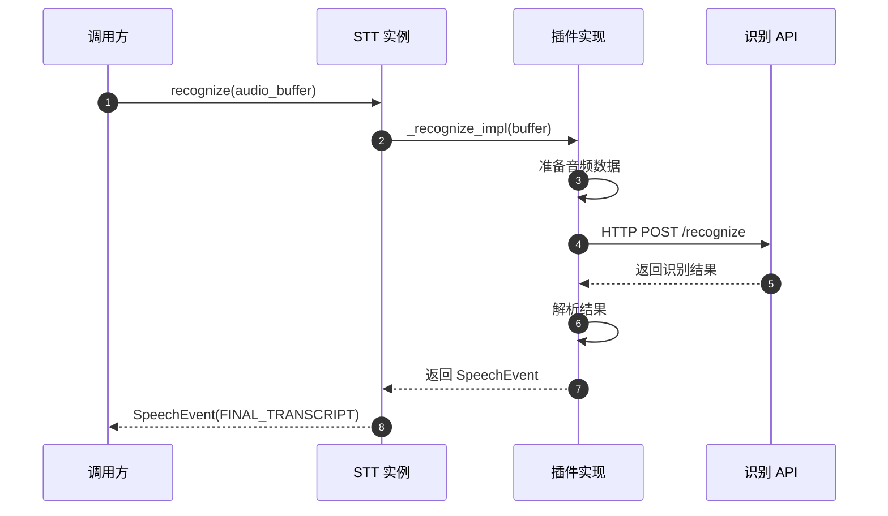
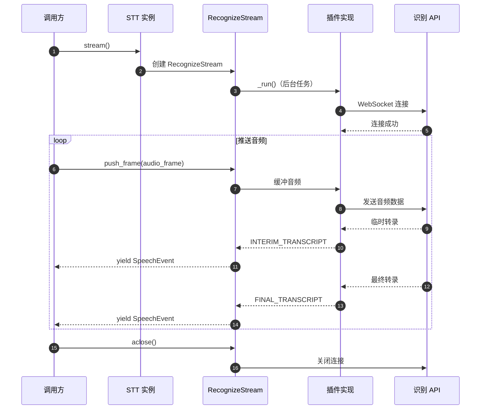

# LiveKit Agents 框架 - STT 模块概览

## 模块职责

STT（Speech-to-Text）模块提供语音识别的统一抽象接口，支持多种语音识别服务提供商（Deepgram、AssemblyAI、OpenAI Whisper 等）的集成。该模块定义了批量识别和流式识别两种模式，支持实时转录、多说话人分离、端点检测等功能。

**核心职责**：
- 定义 STT 统一抽象接口
- 支持批量音频识别
- 支持流式实时识别
- 语音事件管理（开始、临时、最终、结束）
- 多说话人适配器
- 服务降级与容错

## 输入/输出

### 输入
- **音频数据** (`AudioBuffer` 或 `AudioFrame`): 待识别的音频
- **语言配置** (`language`): 可选的目标语言
- **连接选项** (`APIConnectOptions`): 超时、重试等配置
- **采样率** (`sample_rate`): 音频采样率（可选重采样）

### 输出
- **语音事件** (`SpeechEvent`): 包含转录文本和元数据
- **事件类型**：
  - `START_OF_SPEECH`: 语音开始
  - `INTERIM_TRANSCRIPT`: 临时转录（实时）
  - `FINAL_TRANSCRIPT`: 最终转录（确定）
  - `END_OF_SPEECH`: 语音结束
  - `RECOGNITION_USAGE`: 使用量统计

## 上下游依赖

### 上游（调用方）
- **AgentActivity**: Voice 模块中的音频识别协调器
- **用户代码**: 直接调用 STT 进行识别

### 下游（被调用方）
- **具体 STT 插件**: Deepgram、AssemblyAI、OpenAI 等实现
- **AudioBuffer**: 音频缓冲与处理工具

## 模块级架构图

```mermaid
flowchart TB
    subgraph STT["STT 模块"]
        direction TB
        
        subgraph Core["核心接口"]
            STTBase[STT<br/>基类]
            RecognizeStream[RecognizeStream<br/>流式识别抽象]
            SpeechStream[SpeechStream<br/>具体流实现]
        end
        
        subgraph Events["事件定义"]
            SpeechEvent[SpeechEvent<br/>语音事件]
            SpeechEventType[SpeechEventType<br/>事件类型枚举]
            SpeechData[SpeechData<br/>识别数据]
            RecognitionUsage[RecognitionUsage<br/>使用量]
        end
        
        subgraph Capabilities["能力定义"]
            STTCapabilities[STTCapabilities<br/>STT 能力]
        end
        
        subgraph Adapters["适配器"]
            StreamAdapter[StreamAdapter<br/>流式适配器]
            MultiSpeakerAdapter[MultiSpeakerAdapter<br/>多说话人适配器]
            FallbackAdapter[FallbackAdapter<br/>降级适配器]
        end
        
        STTBase -->|创建| RecognizeStream
        RecognizeStream -->|产出| SpeechEvent
        SpeechStream -.继承.- RecognizeStream
        
        SpeechEvent -->|包含| SpeechData
        SpeechEvent -->|包含| RecognitionUsage
        SpeechEvent -->|关联| SpeechEventType
        
        STTBase -->|声明| STTCapabilities
        
        StreamAdapter -->|包装| STTBase
        MultiSpeakerAdapter -->|包装| STTBase
        FallbackAdapter -->|包装| STTBase
    end
    
    subgraph External["外部"]
        Plugins[STT 插件<br/>Deepgram/AssemblyAI/...]
        VAD[VAD<br/>语音活动检测]
        AudioBuffer[AudioBuffer<br/>音频缓冲]
    end
    
    STTBase <-.实现.-|Plugins
    StreamAdapter -->|使用| VAD
    RecognizeStream -->|消费| AudioBuffer
```

### 图解与说明

#### 核心接口层

**STT 基类**：
- 定义 `recognize()` 方法进行批量识别
- 定义 `stream()` 方法创建流式识别器
- 抽象方法由各插件实现
- 支持预热 `prewarm()` 减少冷启动

**RecognizeStream**：
- 流式识别的抽象基类
- 异步迭代器，产出 SpeechEvent
- 自动处理重试、错误恢复
- 收集指标并发布事件

**SpeechStream**：
- 具体的流式识别实现
- 由插件提供具体逻辑

#### 事件系统

**SpeechEvent**：
- 封装识别结果
- 包含文本、置信度、时间戳等
- 支持多种事件类型

**事件类型**：
- `START_OF_SPEECH`: 检测到语音开始
- `INTERIM_TRANSCRIPT`: 临时结果（持续更新）
- `FINAL_TRANSCRIPT`: 最终确定结果
- `END_OF_SPEECH`: 语音结束（EOU）
- `RECOGNITION_USAGE`: 统计信息

#### 能力声明

**STTCapabilities**：
- `streaming`: 是否支持流式识别
- `interim_results`: 是否支持临时结果
- `diarization`: 是否支持说话人分离

#### 适配器层

**StreamAdapter**：
- 将批量识别 STT 转为流式
- 配合 VAD 实现流式效果
- 适用于不支持流式的 STT

**MultiSpeakerAdapter**：
- 提供多说话人分离功能
- 自动标注说话人 ID
- 适用于会议、客服等场景

**FallbackAdapter**：
- 主 STT 服务故障时自动切换
- 提高系统可用性
- 发布可用性变更事件

## 关键数据结构

### STTCapabilities

**职责**：声明 STT 的能力特性

**核心字段**：

| 字段 | 类型 | 默认值 | 说明 |
|-----|------|--------|------|
| `streaming` | `bool` | - | 是否支持流式识别 |
| `interim_results` | `bool` | `False` | 是否支持临时转录 |
| `diarization` | `bool` | `False` | 是否支持说话人分离 |

**使用示例**：

```python
class MySTT(stt.STT):
    def __init__(self):
        super().__init__(
            capabilities=stt.STTCapabilities(
                streaming=True,
                interim_results=True,
                diarization=False,
            )
        )
```

### SpeechEvent

**职责**：封装识别事件和结果

**核心字段**：

| 字段 | 类型 | 说明 |
|-----|------|------|
| `type` | `SpeechEventType` | 事件类型 |
| `alternatives` | `list[SpeechData]` | 识别候选结果（按置信度排序） |
| `usage` | `RecognitionUsage \| None` | 使用量统计 |

**SpeechData 字段**：

| 字段 | 类型 | 说明 |
|-----|------|------|
| `language` | `str` | 识别的语言 |
| `text` | `str` | 转录文本 |
| `confidence` | `float` | 置信度 (0-1) |
| `start_time` | `float` | 开始时间（秒） |
| `end_time` | `float` | 结束时间（秒） |

**使用示例**：

```python
async for event in stt_stream:
    if event.type == stt.SpeechEventType.FINAL_TRANSCRIPT:
        text = event.alternatives[0].text
        confidence = event.alternatives[0].confidence
        print(f"Final: {text} (confidence: {confidence})")
```

### RecognitionUsage

**职责**：统计识别使用量

**核心字段**：

| 字段 | 类型 | 说明 |
|-----|------|------|
| `audio_duration` | `float` | 识别的音频时长（秒） |
| `request_id` | `str` | 请求 ID |

## 核心流程

### 批量识别流程



**代码示例**：

```python
from livekit import agents
from livekit.plugins import deepgram

async def batch_recognize_example():
    # 1. 创建 STT 实例
    stt_instance = deepgram.STT(model="nova-3")
    
    # 2. 准备音频数据
    audio_buffer = agents.utils.AudioBuffer(
        sample_rate=16000,
        num_channels=1,
    )
    # 添加音频帧...
    
    # 3. 批量识别
    event = await stt_instance.recognize(audio_buffer)
    
    # 4. 获取结果
    if event.alternatives:
        text = event.alternatives[0].text
        print(f"Recognized: {text}")
```

### 流式识别流程



**代码示例**：

```python
from livekit import agents
from livekit.plugins import deepgram

async def stream_recognize_example():
    # 1. 创建 STT 实例
    stt_instance = deepgram.STT(
        model="nova-3",
        language="en",
    )
    
    # 2. 创建流式识别器
    stream = stt_instance.stream()
    
    # 3. 推送音频帧
    async def push_audio():
        async for frame in audio_source:
            stream.push_frame(frame)
        await stream.flush()
    
    # 4. 接收识别结果
    async def receive_results():
        async for event in stream:
            if event.type == agents.stt.SpeechEventType.INTERIM_TRANSCRIPT:
                print(f"Interim: {event.alternatives[0].text}")
            elif event.type == agents.stt.SpeechEventType.FINAL_TRANSCRIPT:
                print(f"Final: {event.alternatives[0].text}")
    
    # 5. 并发执行
    await asyncio.gather(push_audio(), receive_results())
    
    # 6. 关闭流
    await stream.aclose()
```

## 适配器详解

### StreamAdapter（流式适配器）

**目的**：将批量识别的 STT 转换为流式识别

**原理**：
1. 使用 VAD 检测语音活动
2. 语音段结束时调用批量识别
3. 将结果封装为流式事件

**使用场景**：
- STT 不支持原生流式（如 OpenAI Whisper）
- 需要统一流式接口

**代码示例**：

```python
from livekit import agents
from livekit.agents import stt, vad
from livekit.plugins import openai, silero

# OpenAI Whisper 不支持流式，使用 StreamAdapter
base_stt = openai.STT()
vad_instance = silero.VAD()

# 创建流式适配器
stream_stt = stt.StreamAdapter(
    stt=base_stt,
    vad=vad_instance,
)

# 现在可以使用 stream()
stream = stream_stt.stream()
async for event in stream:
    print(event.alternatives[0].text)
```

### MultiSpeakerAdapter（多说话人适配器）

**目的**：为不支持说话人分离的 STT 添加该功能

**原理**：
1. 使用说话人嵌入模型识别说话人
2. 为每个语音段分配说话人 ID
3. 在转录结果中标注说话人

**使用场景**：
- 会议转录
- 客服对话
- 多人访谈

**代码示例**：

```python
from livekit import agents
from livekit.agents import stt
from livekit.plugins import deepgram

# 基础 STT
base_stt = deepgram.STT()

# 添加多说话人功能
multi_speaker_stt = stt.MultiSpeakerAdapter(
    stt=base_stt,
    min_speakers=2,
    max_speakers=4,
)

# 识别时会自动标注说话人
stream = multi_speaker_stt.stream()
async for event in stream:
    if event.type == stt.SpeechEventType.FINAL_TRANSCRIPT:
        speaker_id = event.alternatives[0].speaker_id
        text = event.alternatives[0].text
        print(f"Speaker {speaker_id}: {text}")
```

### FallbackAdapter（降级适配器）

**目的**：主 STT 服务故障时自动切换到备用服务

**原理**：
1. 按优先级尝试 STT 服务
2. 检测错误类型（可恢复/不可恢复）
3. 切换到下一个可用服务
4. 发布可用性变更事件

**使用场景**：
- 提高系统可用性
- 成本优化（主服务 + 备用服务）

**代码示例**：

```python
from livekit import agents
from livekit.agents import stt
from livekit.plugins import deepgram, assemblyai, openai

# 创建降级适配器
fallback_stt = stt.FallbackAdapter(
    stt=[
        deepgram.STT(),      # 主服务（高质量、低延迟）
        assemblyai.STT(),    # 备用1
        openai.STT(),        # 备用2
    ]
)

# 监听可用性变更
@fallback_stt.on("stt_availability_changed")
def on_availability_changed(event: stt.AvailabilityChangedEvent):
    if event.available:
        print(f"STT service restored")
    else:
        print(f"STT service unavailable, switching...")

# 使用时无需关心底层切换
stream = fallback_stt.stream()
async for event in stream:
    print(event.alternatives[0].text)
```

## STT 能力对比

### 常见 STT 提供商对比

| 提供商 | 流式支持 | 临时结果 | 说话人分离 | 多语言 | 延迟 | 准确率 |
|--------|---------|---------|-----------|-------|------|-------|
| **Deepgram** | ✅ | ✅ | ✅ | ✅ | 超低 | 高 |
| **AssemblyAI** | ✅ | ✅ | ✅ | ✅ | 低 | 高 |
| **OpenAI Whisper** | ❌ | ❌ | ❌ | ✅ | 高 | 极高 |
| **Google STT** | ✅ | ✅ | ✅ | ✅ | 低 | 高 |
| **Azure STT** | ✅ | ✅ | ✅ | ✅ | 低 | 高 |

### 选择建议

**实时对话场景**：
```python
# 推荐：Deepgram（低延迟 + 临时结果）
stt=deepgram.STT(
    model="nova-3",
    interim_results=True,
)
```

**离线转录场景**：
```python
# 推荐：OpenAI Whisper（准确率最高）
stt=openai.STT(model="whisper-1")
```

**多语言场景**：
```python
# 推荐：Deepgram 或 Google（多语言支持好）
stt=deepgram.STT(
    model="nova-3",
    language="multi",  # 自动检测
)
```

**成本敏感场景**：
```python
# 使用降级组合
stt=stt.FallbackAdapter(
    stt=[
        deepgram.STT(),  # 主服务
        openai.STT(),    # 备用（成本更低）
    ]
)
```

## 配置与优化

### 连接选项

```python
from livekit.agents import APIConnectOptions, stt

conn_options = APIConnectOptions(
    max_retry=3,        # 最大重试次数
    retry_interval=1.0, # 重试间隔（秒）
    timeout=30.0,       # 请求超时（秒）
)

# 批量识别
event = await stt_instance.recognize(
    buffer=audio_buffer,
    conn_options=conn_options,
)

# 流式识别
stream = stt_instance.stream(conn_options=conn_options)
```

### 重采样

```python
# 指定采样率，自动重采样
stream = stt_instance.stream(sample_rate=16000)

# 推送任意采样率的音频，会自动转换
for frame in audio_frames:  # 可能是 48kHz
    stream.push_frame(frame)  # 自动重采样到 16kHz
```

### 错误处理

```python
@stt_instance.on("error")
def on_stt_error(error: stt.STTError):
    if error.recoverable:
        logger.warning("STT error, will retry")
    else:
        logger.error("STT unrecoverable error")
        # 处理不可恢复错误
```

### 性能优化

**预热连接**：
```python
stt_instance = deepgram.STT()
stt_instance.prewarm()  # 建立连接池
```

**缓冲优化**：
```python
# 较大的缓冲可以减少网络开销
stream = stt_instance.stream(
    buffer_size_ms=200,  # 200ms 缓冲
)
```

**并发识别**：
```python
# 对于批量任务，可以并发处理
async def batch_recognize(audio_list):
    tasks = [
        stt_instance.recognize(audio)
        for audio in audio_list
    ]
    results = await asyncio.gather(*tasks)
    return results
```

## 插件开发指南

### 实现自定义 STT

```python
from livekit.agents import stt
from livekit import rtc

class MyCustomSTT(stt.STT):
    def __init__(self):
        super().__init__(
            capabilities=stt.STTCapabilities(
                streaming=True,
                interim_results=True,
            )
        )
    
    async def _recognize_impl(
        self,
        buffer: stt.AudioBuffer,
        *,
        language: str | None = None,
        conn_options: stt.APIConnectOptions,
    ) -> stt.SpeechEvent:
        # 1. 实现批量识别逻辑
        audio_data = buffer.data  # numpy array
        
        # 2. 调用识别 API
        result = await self._call_api(audio_data)
        
        # 3. 返回 SpeechEvent
        return stt.SpeechEvent(
            type=stt.SpeechEventType.FINAL_TRANSCRIPT,
            alternatives=[
                stt.SpeechData(
                    language=language or "en",
                    text=result["text"],
                    confidence=result["confidence"],
                )
            ],
        )
    
    def stream(
        self,
        *,
        language: str | None = None,
        conn_options: stt.APIConnectOptions = stt.DEFAULT_API_CONNECT_OPTIONS,
    ) -> stt.SpeechStream:
        return MyCustomSpeechStream(
            stt=self,
            language=language,
            conn_options=conn_options,
        )

class MyCustomSpeechStream(stt.SpeechStream):
    async def _run(self) -> None:
        # 实现流式识别逻辑
        async for frame in self._input_ch:
            # 处理音频帧
            # 产出 SpeechEvent
            await self._event_ch.send(event)
```

---

**本文档版本**：基于 LiveKit Agents SDK 主分支（2025-01-04）生成  
**下一步**：查看 TTS 模块文档了解语音合成实现

