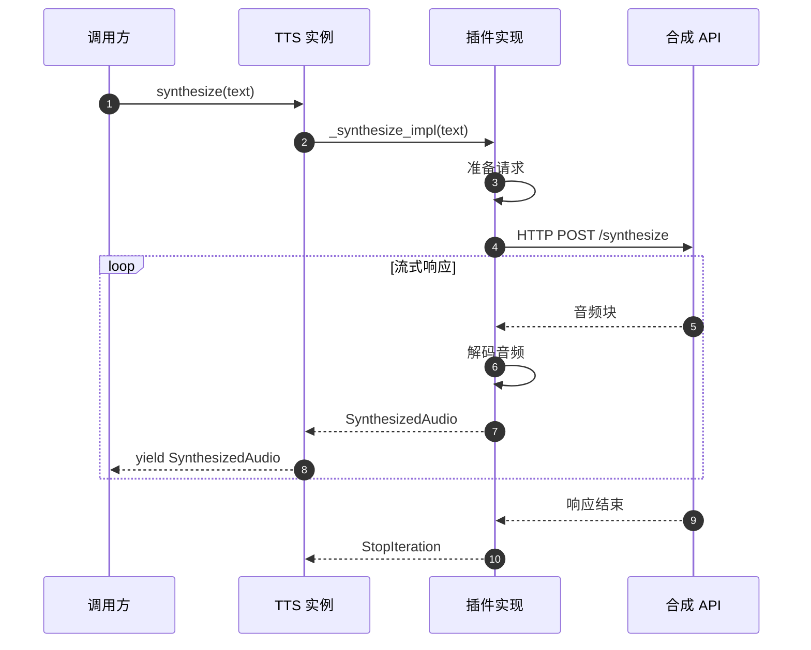
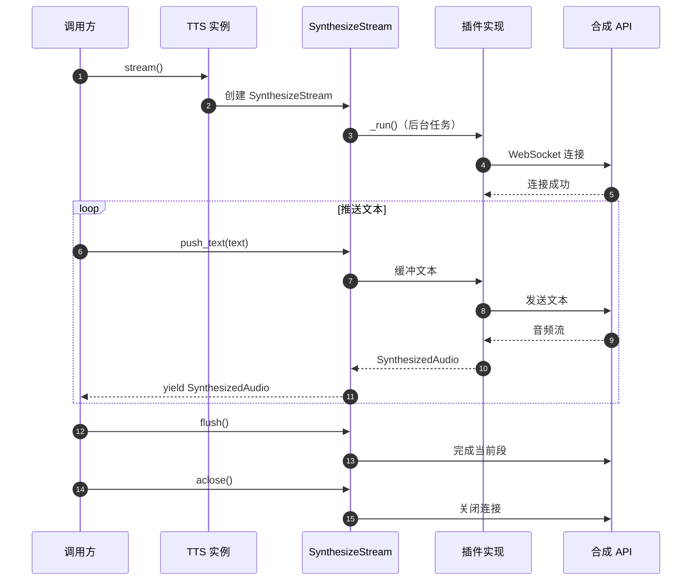

# LiveKit Agents 框架 - TTS 模块概览

## 模块职责

TTS（Text-to-Speech）模块提供语音合成的统一抽象接口，支持多种语音合成服务提供商（ElevenLabs、Cartesia、OpenAI、PlayAI 等）的集成。该模块定义了批量合成和流式合成两种模式，支持实时音频生成、对齐转录、音频流控制等功能。

**核心职责**：
- 定义 TTS 统一抽象接口
- 支持批量文本合成
- 支持流式实时合成
- 音频帧生成与管理
- 对齐转录支持（word-level timestamps）
- 服务降级与容错

## 输入/输出

### 输入
- **文本数据** (`str`): 待合成的文本
- **连接选项** (`APIConnectOptions`): 超时、重试等配置
- **流式文本** (`AsyncIterable[str]`): 流式合成的文本流

### 输出
- **音频帧** (`SynthesizedAudio`): 包含音频数据和元数据
- **音频参数**：
  - 采样率（如 24kHz、16kHz）
  - 通道数（通常为单声道）
- **对齐转录**（可选）：word-level 时间戳

## 上下游依赖

### 上游（调用方）
- **AgentActivity**: Voice 模块中的语音生成协调器
- **用户代码**: 直接调用 TTS 进行合成

### 下游（被调用方）
- **具体 TTS 插件**: ElevenLabs、Cartesia、OpenAI 等实现
- **AudioByteStream**: 音频数据流处理

## 模块级架构图

```mermaid
flowchart TB
    subgraph TTS["TTS 模块"]
        direction TB
        
        subgraph Core["核心接口"]
            TTSBase[TTS<br/>基类]
            ChunkedStream[ChunkedStream<br/>批量合成流]
            SynthesizeStream[SynthesizeStream<br/>流式合成器]
        end
        
        subgraph Data["数据定义"]
            SynthesizedAudio[SynthesizedAudio<br/>合成音频]
            TTSCapabilities[TTSCapabilities<br/>TTS 能力]
        end
        
        subgraph Adapters["适配器"]
            StreamAdapter[StreamAdapter<br/>流式适配器]
            FallbackAdapter[FallbackAdapter<br/>降级适配器]
            StreamPacer[SentenceStreamPacer<br/>语句流控]
        end
        
        subgraph Support["辅助模块"]
            AudioEmitter[AudioEmitter<br/>音频发射器]
        end
        
        TTSBase -->|synthesize()| ChunkedStream
        TTSBase -->|stream()| SynthesizeStream
        ChunkedStream -->|产出| SynthesizedAudio
        SynthesizeStream -->|产出| SynthesizedAudio
        
        TTSBase -->|声明| TTSCapabilities
        
        StreamAdapter -->|包装| TTSBase
        FallbackAdapter -->|包装| TTSBase
        StreamPacer -->|控制| SynthesizeStream
        
        SynthesizeStream -->|使用| AudioEmitter
    end
    
    subgraph External["外部"]
        Plugins[TTS 插件<br/>ElevenLabs/Cartesia/...]
        Tokenizer[Tokenizer<br/>文本分词]
        AudioOutput[AudioOutput<br/>音频输出]
    end
    
    TTSBase <-.实现.-|Plugins
    StreamAdapter -->|使用| Tokenizer
    SynthesizedAudio -.->|推送到| AudioOutput
```

### 图解与说明

#### 核心接口层

**TTS 基类**：
- 定义 `synthesize()` 方法进行批量合成
- 定义 `stream()` 方法创建流式合成器
- 抽象方法由各插件实现
- 支持预热 `prewarm()` 减少冷启动

**ChunkedStream**：
- 批量合成的结果流
- 异步迭代器，产出 SynthesizedAudio
- 自动处理重试、错误恢复
- 收集指标并发布事件

**SynthesizeStream**：
- 流式合成的控制器
- 支持动态推送文本
- 支持 flush 和 clear_buffer 操作
- 实时产出音频帧

#### 数据定义

**SynthesizedAudio**：
- 封装合成的音频帧
- 包含请求 ID、段 ID
- 标识是否为最终帧
- 包含对应的文本片段

**TTSCapabilities**：
- `streaming`: 是否支持流式合成
- `aligned_transcript`: 是否支持对齐转录

#### 适配器层

**StreamAdapter**：
- 将批量合成 TTS 转为流式
- 自动分句处理
- 适用于不支持流式的 TTS

**FallbackAdapter**：
- 主 TTS 服务故障时自动切换
- 提高系统可用性
- 发布可用性变更事件

**SentenceStreamPacer**：
- 控制流式合成的节奏
- 按句子边界分段
- 优化用户体验

## 关键数据结构

### TTSCapabilities

**职责**：声明 TTS 的能力特性

**核心字段**：

| 字段 | 类型 | 默认值 | 说明 |
|-----|------|--------|------|
| `streaming` | `bool` | - | 是否支持流式合成 |
| `aligned_transcript` | `bool` | `False` | 是否支持对齐转录（word-level 时间戳） |

**使用示例**：

```python
class MyTTS(tts.TTS):
    def __init__(self):
        super().__init__(
            capabilities=tts.TTSCapabilities(
                streaming=True,
                aligned_transcript=True,
            ),
            sample_rate=24000,
            num_channels=1,
        )
```

### SynthesizedAudio

**职责**：封装合成的音频数据

**核心字段**：

| 字段 | 类型 | 说明 |
|-----|------|------|
| `frame` | `rtc.AudioFrame` | 音频帧数据 |
| `request_id` | `str` | 请求 ID |
| `is_final` | `bool` | 是否为该段的最后一帧 |
| `segment_id` | `str` | 段 ID（流式合成） |
| `delta_text` | `str` | 对应的文本片段（流式） |

**使用示例**：

```python
async for audio in tts_stream:
    # 获取音频帧
    frame = audio.frame
    
    # 获取对应文本
    text = audio.delta_text
    
    # 检查是否为最后一帧
    if audio.is_final:
        print(f"Segment {audio.segment_id} complete")
```

## 核心流程

### 批量合成流程



**代码示例**：

```python
from livekit import agents
from livekit.plugins import cartesia

async def batch_synthesis_example():
    # 1. 创建 TTS 实例
    tts_instance = cartesia.TTS(
        voice="male-conversational",
        model="sonic-english",
    )
    
    # 2. 批量合成
    text = "Hello, this is a test of text-to-speech synthesis."
    stream = tts_instance.synthesize(text)
    
    # 3. 获取音频帧
    async for audio in stream:
        # 处理音频帧
        frame = audio.frame
        print(f"Got audio: {frame.samples_per_channel} samples")
        
        if audio.is_final:
            print("Synthesis complete")
```

### 流式合成流程



**代码示例**：

```python
from livekit import agents
from livekit.plugins import cartesia

async def stream_synthesis_example():
    # 1. 创建 TTS 实例
    tts_instance = cartesia.TTS(
        voice="male-conversational",
    )
    
    # 2. 创建流式合成器
    stream = tts_instance.stream()
    
    # 3. 推送文本
    async def push_text():
        texts = [
            "Hello, ",
            "this is ",
            "streaming ",
            "text-to-speech."
        ]
        for text in texts:
            stream.push_text(text)
            await asyncio.sleep(0.1)
        
        await stream.flush()  # 完成当前段
        await stream.aclose()
    
    # 4. 接收音频
    async def receive_audio():
        async for audio in stream:
            print(f"Got audio: {audio.delta_text}")
            # 处理音频帧
    
    # 5. 并发执行
    await asyncio.gather(push_text(), receive_audio())
```

## 适配器详解

### StreamAdapter（流式适配器）

**目的**：将批量合成的 TTS 转换为流式合成

**原理**：
1. 使用分词器将文本分句
2. 每句话单独调用批量合成
3. 将结果封装为流式输出

**使用场景**：
- TTS 不支持原生流式（如 OpenAI TTS）
- 需要统一流式接口

**代码示例**：

```python
from livekit import agents
from livekit.agents import tts
from livekit.plugins import openai

# OpenAI TTS 不支持流式，使用 StreamAdapter
base_tts = openai.TTS()

# 创建流式适配器
stream_tts = tts.StreamAdapter(
    tts=base_tts,
    sentence_tokenizer=None,  # 使用默认分词器
)

# 现在可以使用 stream()
stream = stream_tts.stream()
stream.push_text("Hello, this is a test. How are you?")
await stream.flush()

async for audio in stream:
    print(f"Audio: {audio.delta_text}")
```

### SentenceStreamPacer（语句流控）

**目的**：控制流式合成的节奏，按句子边界分段

**原理**：
1. 累积文本直到句子结束
2. 触发合成
3. 优化用户听感

**使用场景**：
- 提升流式合成的自然度
- 避免中途断句

**代码示例**：

```python
from livekit import agents
from livekit.agents import tts
from livekit.plugins import cartesia

tts_instance = cartesia.TTS()

# 启用语句流控
stream_tts = tts.StreamAdapter(
    tts=tts_instance,
    text_pacing=tts.SentenceStreamPacer(
        min_sentence_length=10,  # 最小句子长度
        max_buffer_size=1000,    # 最大缓冲
    ),
)
```

### FallbackAdapter（降级适配器）

**目的**：主 TTS 服务故障时自动切换到备用服务

**原理**：
1. 按优先级尝试 TTS 服务
2. 检测错误类型（可恢复/不可恢复）
3. 切换到下一个可用服务
4. 发布可用性变更事件

**使用场景**：
- 提高系统可用性
- 成本优化（主服务 + 备用服务）

**代码示例**：

```python
from livekit import agents
from livekit.agents import tts
from livekit.plugins import cartesia, elevenlabs, openai

# 创建降级适配器
fallback_tts = tts.FallbackAdapter(
    tts=[
        cartesia.TTS(),      # 主服务（低延迟）
        openai.TTS(),        # 备用1
        elevenlabs.TTS(),    # 备用2
    ]
)

# 监听可用性变更
@fallback_tts.on("tts_availability_changed")
def on_availability_changed(event: tts.AvailabilityChangedEvent):
    if event.available:
        print(f"TTS service restored")
    else:
        print(f"TTS service unavailable, switching...")

# 使用时无需关心底层切换
stream = fallback_tts.synthesize("Hello, world!")
async for audio in stream:
    print(f"Audio: {len(audio.frame.data)} bytes")
```

## TTS 能力对比

### 常见 TTS 提供商对比

| 提供商 | 流式支持 | 对齐转录 | 音质 | 情感表现 | 延迟 | 成本 |
|--------|---------|---------|------|---------|------|------|
| **ElevenLabs** | ✅ | ✅ | 极高 | 极好 | 中 | 高 |
| **Cartesia** | ✅ | ❌ | 高 | 好 | 超低 | 中 |
| **OpenAI TTS** | ❌ | ❌ | 高 | 好 | 中 | 中 |
| **PlayAI** | ✅ | ❌ | 中 | 一般 | 低 | 低 |
| **Azure TTS** | ✅ | ✅ | 高 | 好 | 低 | 中 |

### 选择建议

**实时对话场景**：
```python
# 推荐：Cartesia（超低延迟）
tts=cartesia.TTS(
    voice="male-conversational",
    model="sonic-english",
)
```

**高端产品场景**：
```python
# 推荐：ElevenLabs（音质最佳）
tts=elevenlabs.TTS(
    voice="Adam",
    model="eleven_turbo_v2",
)
```

**通用场景**：
```python
# 推荐：OpenAI TTS（平衡）
tts=openai.TTS(
    voice="ash",
    model="tts-1-hd",
)
```

**成本敏感场景**：
```python
# 使用降级组合
tts=tts.FallbackAdapter(
    tts=[
        cartesia.TTS(),   # 主服务
        openai.TTS(),     # 备用
    ]
)
```

## 配置与优化

### 音频参数

```python
# 大多数 TTS 支持自定义采样率和通道数
tts_instance = cartesia.TTS(
    sample_rate=24000,    # 24kHz
    num_channels=1,       # 单声道
)
```

### 连接选项

```python
from livekit.agents import APIConnectOptions, tts

conn_options = APIConnectOptions(
    max_retry=3,        # 最大重试次数
    retry_interval=1.0, # 重试间隔（秒）
    timeout=30.0,       # 请求超时（秒）
)

# 批量合成
stream = tts_instance.synthesize(
    text="Hello, world!",
    conn_options=conn_options,
)

# 流式合成
stream = tts_instance.stream(conn_options=conn_options)
```

### 错误处理

```python
@tts_instance.on("error")
def on_tts_error(error: tts.TTSError):
    if error.recoverable:
        logger.warning("TTS error, will retry")
    else:
        logger.error("TTS unrecoverable error")
        # 处理不可恢复错误
```

### 性能优化

**预热连接**：
```python
tts_instance = cartesia.TTS()
tts_instance.prewarm()  # 建立连接池
```

**批量合成**：
```python
# 对于非实时场景，可以批量处理
async def batch_synthesize(texts: list[str]):
    tasks = [
        tts_instance.synthesize(text)
        for text in texts
    ]
    streams = await asyncio.gather(*tasks)
    return streams
```

**缓冲优化**：
```python
# 较大的缓冲可以减少网络开销
stream = tts_instance.stream(
    buffer_size_ms=200,  # 200ms 缓冲
)
```

## 对齐转录

某些 TTS 提供商支持 word-level 对齐转录，提供每个词的时间戳。

### 使用对齐转录

```python
from livekit import agents
from livekit.plugins import elevenlabs

tts_instance = elevenlabs.TTS(
    voice="Adam",
    model="eleven_turbo_v2",
)

# 批量合成会自动包含对齐转录
stream = tts_instance.synthesize("Hello, how are you doing today?")

async for audio in stream:
    # 获取对齐转录（如果支持）
    if hasattr(audio.frame, 'userdata'):
        aligned_transcript = audio.frame.userdata.get('aligned_transcript')
        if aligned_transcript:
            for word in aligned_transcript:
                print(f"Word: {word.text}, Start: {word.start_time}, End: {word.end_time}")
```

### 应用场景

- **字幕生成**：实时生成精确的字幕
- **唇形同步**：用于虚拟人物的口型同步
- **进度显示**：显示当前播放的词汇高亮

## 插件开发指南

### 实现自定义 TTS

```python
from livekit.agents import tts
from livekit import rtc

class MyCustomTTS(tts.TTS):
    def __init__(self):
        super().__init__(
            capabilities=tts.TTSCapabilities(
                streaming=True,
                aligned_transcript=False,
            ),
            sample_rate=24000,
            num_channels=1,
        )
    
    def synthesize(
        self,
        text: str,
        *,
        conn_options: tts.APIConnectOptions = tts.DEFAULT_API_CONNECT_OPTIONS,
    ) -> tts.ChunkedStream:
        return MyCustomChunkedStream(
            tts=self,
            text=text,
            conn_options=conn_options,
        )
    
    def stream(
        self,
        *,
        conn_options: tts.APIConnectOptions = tts.DEFAULT_API_CONNECT_OPTIONS,
    ) -> tts.SynthesizeStream:
        return MyCustomSynthesizeStream(
            tts=self,
            conn_options=conn_options,
        )

class MyCustomChunkedStream(tts.ChunkedStream):
    async def _run(self) -> None:
        # 实现批量合成逻辑
        # 1. 调用 API
        audio_data = await self._call_api(self._text)
        
        # 2. 转换为音频帧
        frame = rtc.AudioFrame(
            data=audio_data,
            sample_rate=self._tts.sample_rate,
            num_channels=self._tts.num_channels,
            samples_per_channel=len(audio_data) // self._tts.num_channels,
        )
        
        # 3. 产出 SynthesizedAudio
        await self._event_ch.send(
            tts.SynthesizedAudio(
                frame=frame,
                request_id="req-123",
                is_final=True,
            )
        )

class MyCustomSynthesizeStream(tts.SynthesizeStream):
    async def _run(self, output_emitter: tts.AudioEmitter) -> None:
        # 实现流式合成逻辑
        async for text in self._input_ch:
            # 调用 API 合成
            audio_data = await self._call_api(text)
            
            # 产出音频
            await output_emitter.push_frame(audio_data)
```

## 文本转换

AgentSession 支持在 TTS 合成前对文本进行转换，例如过滤 Markdown、Emoji 等。

### 内置转换

```python
session = agents.AgentSession(
    tts="openai-tts",
    # 应用文本转换
    tts_text_transforms=[
        "filter_markdown",  # 移除 Markdown 格式
        "filter_emoji",     # 移除 Emoji
    ],
)
```

### 自定义转换

```python
from livekit.agents.voice.transcription import filters

# 定义自定义转换
def custom_transform(text: str) -> str:
    # 移除特殊字符
    return text.replace("*", "").replace("#", "")

# 应用转换
session = agents.AgentSession(
    tts="openai-tts",
    tts_text_transforms=[
        custom_transform,
        "filter_emoji",
    ],
)
```

---

**本文档版本**：基于 LiveKit Agents SDK 主分支（2025-01-04）生成  
**下一步**：查看 Worker 模块文档了解进程管理机制

