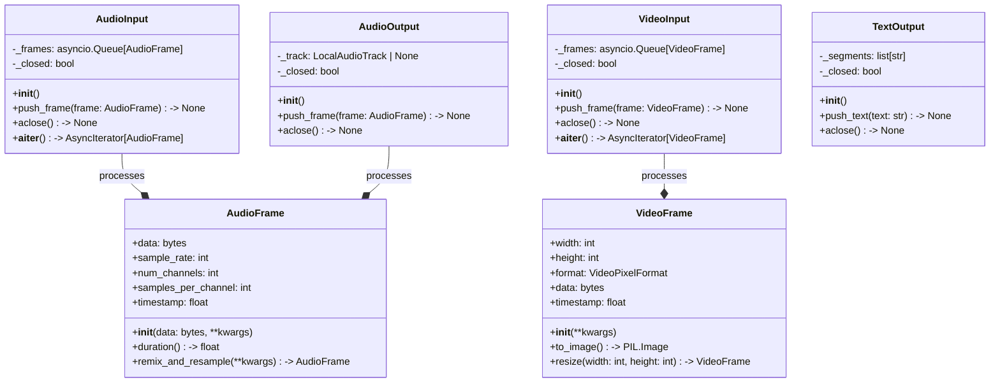
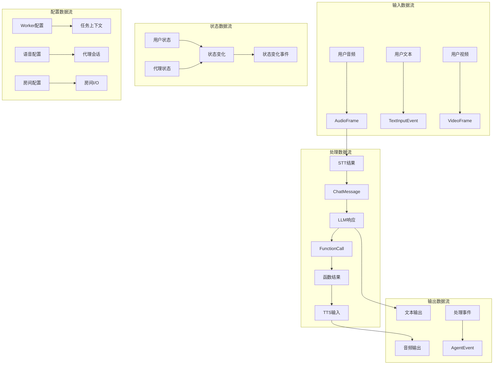

## 1. 核心数据结构概览

LiveKit Agents框架包含多个层次的数据结构，从基础类型到复杂的业务对象。本文档详细分析这些数据结构的设计和关系。

### 1.1 数据结构层次图


## 2. 核心类UML图

### 2.1 Agent类族UML图

```mermaid
classDiagram
    class Agent {
        -_instructions: str
        -_tools: list[FunctionTool]
        -_chat_ctx: ChatContext
        -_stt: STT | None
        -_llm: LLM | None
        -_tts: TTS | None
        -_vad: VAD | None
        -_activity: AgentActivity | None
        
        +__init__(instructions: str, **kwargs)
        +label: str
        +tools: list[FunctionTool]
        +update_tools(tools: list[FunctionTool]) -> None
        +on_enter() -> None
        +on_exit() -> None
        +llm_node(chat_ctx, tools, settings) -> LLMStream
        +transcription_node(input, settings) -> TextOutput
    }
    
    class ModelSettings {
        +tool_choice: ToolChoice
        +temperature: float
        +max_tokens: int
        +top_p: float
        
        +__init__(**kwargs)
        +to_dict() -> dict
    }
    
    class AgentActivity {
        -_agent: Agent
        -_session: AgentSession
        -_chat_ctx: ChatContext
        -_current_speech: SpeechHandle | None
        -_generating: bool
        -_tool_calling: bool
        
        +__init__(agent: Agent, session: AgentSession)
        +handle_user_input(text: str) -> None
        +generate_reply(**kwargs) -> None
        +interrupt() -> None
        +_pipeline_reply_task(**kwargs) -> None
        +_execute_tools(calls: list) -> list[str]
    }
    
    class AgentTask {
        <<enumeration>>
        LISTENING
        THINKING
        SPEAKING
        TOOL_CALLING
    }
    
    Agent ||--|| AgentActivity : creates
    Agent --* ModelSettings : uses
    AgentActivity --* AgentTask : has_state
    Agent ..> ChatContext : manages
```

### 2.2 AgentSession类族UML图

```mermaid
classDiagram
    class AgentSession~Userdata_T~ {
        -_stt: STT | None
        -_vad: VAD | None
        -_llm: LLM | None
        -_tts: TTS | None
        -_agent: Agent | None
        -_activity: AgentActivity | None
        -_user_state: UserState
        -_agent_state: AgentState
        -_userdata: Userdata_T | None
        -_input: AgentInput
        -_output: AgentOutput
        -_room_io: RoomIO | None
        
        +__init__(**voice_options)
        +start(agent: Agent, room: Room) -> None
        +generate_reply(**kwargs) -> None
        +interrupt() -> None
        +userdata: Userdata_T
        +current_agent: Agent
        +user_state: UserState
        +agent_state: AgentState
        +history: ChatContext
        +run(user_input: str) -> RunResult
    }
    
    class VoiceOptions {
        +allow_interruptions: bool
        +min_interruption_duration: float
        +min_endpointing_delay: float
        +max_endpointing_delay: float
        +max_tool_steps: int
        +preemptive_generation: bool
        +user_away_timeout: float | None
        +false_interruption_timeout: float | None
        
        +__init__(**kwargs)
        +validate() -> None
    }
    
    class UserState {
        <<enumeration>>
        LISTENING
        SPEAKING
        AWAY
    }
    
    class AgentState {
        <<enumeration>>
        INITIALIZING
        LISTENING
        THINKING
        SPEAKING
        TOOL_CALLING
    }
    
    class EventEmitter~T~ {
        <<interface>>
        +on(event: str, callback: Callable) -> None
        +emit(event: str, *args) -> None
        +off(event: str, callback: Callable) -> None
    }
    
    AgentSession --|> EventEmitter : extends
    AgentSession --* VoiceOptions : configured_with
    AgentSession --* UserState : has_state
    AgentSession --* AgentState : has_state
    AgentSession ||--|| Agent : manages
```

### 2.3 工具系统UML图


### 2.4 聊天上下文UML图


## 3. 事件系统数据结构

### 3.1 事件类型UML图


### 3.2 运行结果数据结构

```mermaid
classDiagram
    class RunResult~T~ {
        -_user_input: str
        -_events: list[RunEvent]
        -_output_type: type[T] | None
        -_done: bool
        -_error: Exception | None
        
        +__init__(user_input: str, output_type: type[T])
        +user_input: str
        +events: list[RunEvent]
        +done() -> bool
        +wait_for_completion() -> T
        +expect: EventAssert
    }
    
    class RunEvent {
        +type: str
        +data: Any
        +timestamp: float
        
        +__init__(type: str, data: Any)
    }
    
    class EventAssert {
        -_result: RunResult
        -_current_index: int
        
        +__init__(result: RunResult)
        +next_event() -> EventRangeAssert
        +skip_next_event_if(**filters) -> EventAssert
        +no_more_events() -> None
    }
    
    class EventRangeAssert {
        -_events: list[RunEvent]
        
        +__init__(events: list[RunEvent])
        +is_message(role: ChatRole) -> EventRangeAssert
        +is_function_call(name: str) -> EventRangeAssert
        +is_function_call_output() -> EventRangeAssert
        +judge(llm: LLM, intent: str) -> None
    }
    
    class ChatMessageEvent {
        +role: ChatRole
        +content: str
        +tool_calls: list[FunctionCall] | None
        
        +__init__(**kwargs)
    }
    
    class FunctionCallEvent {
        +function_name: str
        +arguments: dict[str, Any]
        +call_id: str
        
        +__init__(**kwargs)
    }
    
    class FunctionCallOutputEvent {
        +call_id: str
        +output: str
        
        +__init__(**kwargs)
    }
    
    class AgentHandoffEvent {
        +from_agent: Agent
        +to_agent: Agent
        +message: str | None
        
        +__init__(from_agent, to_agent, message)
    }
    
    RunResult --* RunEvent : contains
    RunResult ||--|| EventAssert : provides
    EventAssert ||--|| EventRangeAssert : creates
    RunEvent <|-- ChatMessageEvent
    RunEvent <|-- FunctionCallEvent
    RunEvent <|-- FunctionCallOutputEvent
    RunEvent <|-- AgentHandoffEvent
```

## 4. I/O数据结构

### 4.1 音视频数据结构



### 4.2 房间I/O配置结构


## 5. 配置和选项数据结构

### 5.1 Worker配置结构


### 5.2 API连接选项


## 6. 数据结构关系总图


## 7. 数据流向图



这个数据结构与UML文档详细展示了LiveKit Agents框架中所有重要数据结构的设计、关系和数据流向。每个UML图都包含了详细的属性和方法定义，帮助开发者理解框架的内部架构和数据组织方式。
