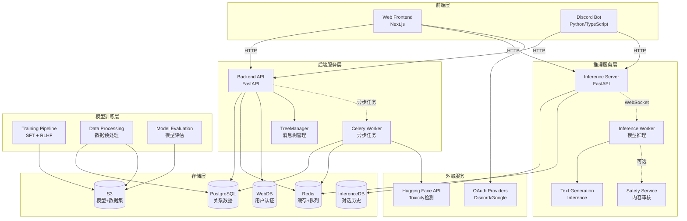
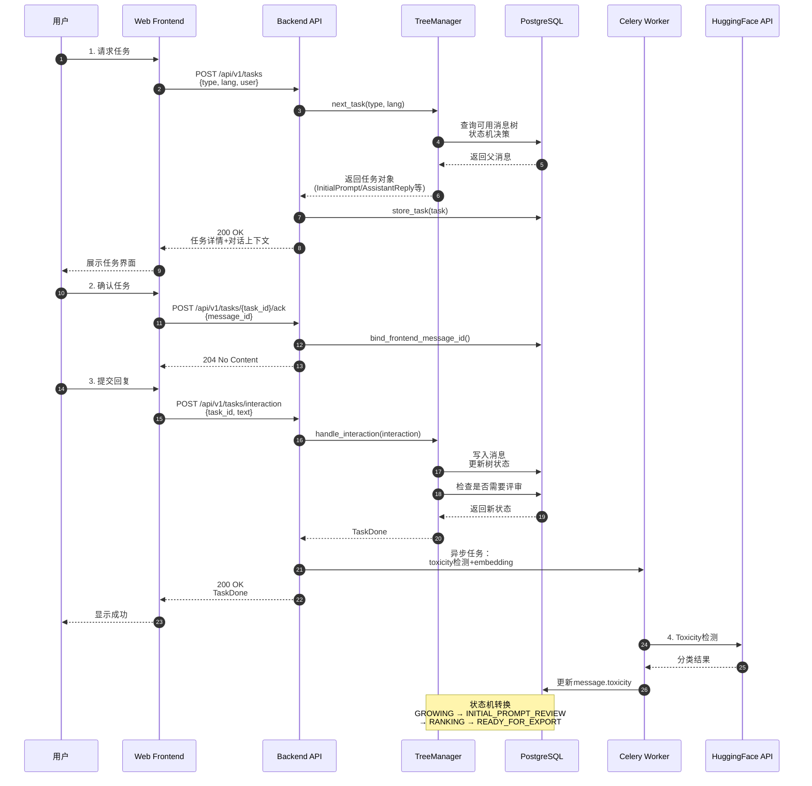

# Open-Assistant-00-总览

## 0. 摘要

### 项目目标与问题域

Open-Assistant 是一个开源的对话式大语言模型项目，旨在通过众包方式收集高质量的人类对话数据，并基于 RLHF（Reinforcement Learning from Human Feedback）训练开放的对话 AI 助手。

**核心能力边界：**
- 众包数据收集：收集人类编写的提示（prompt）与回复（reply），构建对话树
- 数据质量控制：通过多轮同行评审（peer review）和排名（ranking）确保数据质量
- 模型训练：基于收集的数据进行监督微调和 RLHF 训练
- 推理服务：提供模型推理 API，支持对话生成
- 数据导出：生成标准化的训练数据集（oasst1/oasst2）

**非目标：**
- 不提供通用的聊天机器人服务（项目已完成）
- 不支持多模态输入输出
- 不提供模型托管服务

### 运行环境

**技术栈：**
- 后端：Python 3.10+ / FastAPI / PostgreSQL / Redis / Celery
- 前端：Next.js / React / TypeScript / Prisma
- 推理：Python / FastAPI / Redis / Text Generation Inference
- 模型训练：Python / PyTorch / Transformers / DeepSpeed

**部署形态：**
- 微服务架构，各模块独立部署
- 支持 Docker Compose 本地开发
- 生产环境使用 Kubernetes / Docker Swarm

## 1. 整体架构图



### 架构说明

**组件职责：**

1. **前端层（Frontend）**
   - Web Frontend：提供数据收集界面和聊天界面，基于 Next.js + React
   - Discord Bot：支持通过 Discord 参与数据收集和对话

2. **后端服务层（Backend）**
   - Backend API：核心 RESTful API，管理任务分配、消息存储、用户管理、排行榜
   - Celery Worker：异步处理 Toxicity 检测、Embedding 计算、定时任务
   - TreeManager：消息树状态机管理，控制数据收集流程

3. **推理服务层（Inference）**
   - Inference Server：推理服务调度器，管理对话会话和工作节点
   - Inference Worker：实际执行模型推理的工作进程
   - Text Generation Inference：高性能推理引擎（HuggingFace TGI）
   - Safety Service：可选的内容安全审核服务

4. **模型训练层（Training）**
   - Training Pipeline：完整的 SFT + RLHF 训练流程
   - Data Processing：数据清洗、格式转换、统计分析
   - Model Evaluation：模型质量评估和基准测试

5. **存储层（Storage）**
   - PostgreSQL：存储消息树、用户数据、任务记录、评审结果
   - Redis：缓存、限流、任务队列、推理队列
   - WebDB：前端用户认证和会话管理
   - InferenceDB：对话历史和推理记录
   - S3：模型文件和导出数据集

**数据流与控制流：**

- **同步流**：前端 → API → TreeManager → Database（任务请求、消息提交）
- **异步流**：API → Celery → HuggingFace API（Toxicity 检测）
- **推理流**：Web → Inference Server → Worker → TGI（实时对话）
- **训练流**：Database → DataProc → S3 → Training Pipeline（离线批处理）

**跨进程通信：**
- HTTP/REST：前端与后端、后端与推理服务
- WebSocket：推理服务器与工作节点（流式响应）
- Celery/Redis：异步任务队列
- PostgreSQL：状态持久化和跨服务共享

**高可用与扩展性：**
- 无状态 API 服务：水平扩展
- 消息队列解耦：异步处理失败重试
- 数据库连接池：75 连接 + 20 溢出
- Redis 限流：防止滥用和过载

## 2. 全局时序图



### 时序图说明

**主要业务闭环：**

1. **任务请求阶段（步骤1-7）**
   - 前端向 API 请求任务，携带用户信息和偏好
   - TreeManager 根据当前数据库状态、配置规则、随机权重决定任务类型
   - 查询数据库获取可扩展的消息节点或初始化新树
   - 构造任务对象（包含指令、对话上下文）并持久化
   - 返回前端，用户开始编写内容

2. **任务确认阶段（步骤8-10）**
   - 前端生成 `frontend_message_id`（用于去重和跟踪）
   - 调用 `/ack` 端点绑定任务与前端消息 ID
   - 数据库记录绑定关系，防止重复提交

3. **交互提交阶段（步骤11-18）**
   - 用户完成编写，提交文本内容
   - TreeManager 执行核心逻辑：
     - 校验文本长度、重复性、用户权限
     - 写入 Message 表，关联父消息和消息树
     - 更新消息树状态（可能触发状态转换）
     - 决定是否需要评审（根据评审计数和配置）
   - 触发异步任务：Toxicity 检测、Embedding 计算
   - 更新用户活跃度和连续贡献天数

4. **异步处理阶段（步骤19-22）**
   - Celery Worker 调用 HuggingFace API 进行毒性分类
   - 更新消息的 `toxicity` 字段（spam/toxicity/quality 等）
   - 根据毒性阈值自动标记或删除消息

**关键控制点：**

- **鉴权与限流**：每个 API 调用需验证 API Key，限流器基于 Redis 计数（用户级+API级）
- **幂等性**：`frontend_message_id` 确保同一任务不被重复提交
- **事务边界**：所有数据库写操作在单个事务内完成，失败回滚
- **状态机**：TreeManager 根据配置（max_depth, max_children_count, goal_tree_size）控制树生长
- **重试策略**：Celery 任务支持失败重试，数据库事务冲突自动重试（最多3次）
- **超时设定**：任务有效期 48 小时，过期任务自动删除

## 3. 模块边界与交互矩阵

### 模块清单

| 序号 | 模块名 | 目录路径 | 对外 API | 依赖模块 |
|---|---|---|---|---|
| 01 | Backend API | `backend/` | REST API (/api/v1/*) | oasst-shared, PostgreSQL, Redis |
| 02 | Inference Server | `inference/server/` | REST+WebSocket API | oasst-shared, PostgreSQL, Redis |
| 03 | Inference Worker | `inference/worker/` | WebSocket Client | oasst-shared, TGI |
| 04 | Website | `website/` | HTTP (Next.js) | Backend API, Inference Server |
| 05 | Model Training | `model/` | CLI 工具 | oasst-data, S3 |
| 06 | Data Processing | `data/` | Python 库 | oasst-data, pandas |
| 07 | Discord Bot (Python) | `discord-bots/oa-bot-py/` | Discord API | Backend API |
| 08 | Discord Bot (JS) | `discord-bots/oa-bot-js/` | Discord API | Backend API, Inference Server |
| 09 | oasst-shared | `oasst-shared/` | Python 库 | - |
| 10 | oasst-data | `oasst-data/` | Python 库 | - |

### 模块交互矩阵

| 调用方 | 被调方 | 接口 | 同步/异步 | 错误语义 | 一致性要求 |
|---|---|---|---|---|---|
| Website | Backend API | HTTP REST | 同步 | HTTP 状态码+OasstError | 最终一致（限流可重试） |
| Website | Inference Server | HTTP REST | 同步 | HTTP 状态码 | 最终一致 |
| Backend API | PostgreSQL | SQL | 同步 | 异常（重试3次） | 强一致（事务） |
| Backend API | Redis | TCP | 同步 | 异常 | 最终一致 |
| Backend API | Celery Worker | Redis 队列 | 异步 | 任务状态 | 最终一致（至少一次） |
| Celery Worker | HuggingFace API | HTTP | 同步 | HTTP 状态码 | 最终一致（可重试） |
| Inference Server | Inference Worker | WebSocket | 异步 | 连接断开重连 | 最终一致 |
| Inference Worker | TGI | HTTP | 同步 | HTTP 状态码 | 无（无状态） |
| Discord Bot | Backend API | HTTP REST | 同步 | HTTP 状态码+OasstError | 最终一致 |
| Training Pipeline | PostgreSQL | SQL（只读） | 同步 | 异常 | 快照一致性 |
| Data Processing | PostgreSQL | SQL（只读） | 同步 | 异常 | 快照一致性 |

### 交互说明

**同步调用：**
- Frontend → Backend API：RESTful 接口，标准 HTTP 错误码，限流保护
- Backend API → Database：事务保证 ACID，失败自动回滚和重试
- Inference Server → Worker：请求-响应模式，超时断开

**异步消息：**
- Backend → Celery：通过 Redis 队列发布任务，Worker 消费
- Inference Server → Worker：流式响应通过 WebSocket 推送

**共享存储：**
- PostgreSQL：Backend 和 Inference 各有独立数据库
- Redis：Backend 和 Inference 共享实例但使用不同 DB 编号

**订阅/发布：**
- Celery Beat：定时发布统计更新任务（排行榜、用户活跃度）

## 4. 关键设计与权衡

### 数据一致性

**强一致性：**
- 消息树状态转换：通过数据库事务和行级锁保证
- 用户余额扣减：使用 `SELECT FOR UPDATE` 悲观锁
- 排行榜快照：定时全量重新计算并原子替换

**最终一致性：**
- Toxicity 检测结果：异步更新，延迟 1-10 秒
- Embedding 向量：异步计算，不影响核心流程
- 缓存失效：Redis TTL + 主动清理

### 事务边界

- **单消息提交**：Message 插入 + MessageTreeState 更新 + Task 标记完成（单事务）
- **评审提交**：TextLabels 插入 + Message 更新 review_count（单事务）
- **排名提交**：MessageReaction 插入 + 批量 Message 更新 ranking_count（单事务）

### 锁与并发策略

- **乐观锁**：消息树状态更新使用版本号（implicitly through state machine）
- **悲观锁**：用户禁用/启用操作（影响多个表）
- **分布式锁**：推理服务使用 Redis 锁协调 Worker 注册
- **无锁设计**：只读查询不加锁，允许脏读（如排行榜展示）

### 性能关键路径

**P95 延迟目标：**
- 任务请求：< 500ms
- 消息提交：< 1s
- 推理生成：< 5s (首 token) / < 50 tokens/s (后续)

**内存峰值：**
- Backend API：2GB per instance
- Inference Worker：模型大小 + 2GB（如 7B 模型 ≈ 16GB）
- Celery Worker：512MB per instance

**I/O 热点：**
- 消息树状态查询：缓存热门树（Redis）
- 排行榜：缓存 15 分钟（CachedStatsRepository）
- 用户 session：Redis 存储，TTL 30 天

### 可观测性指标

- **Prometheus Metrics**：
  - HTTP 请求计数/延迟（按路径、状态码）
  - 数据库连接池使用率
  - Celery 队列深度
  - 推理请求计数/延迟
  
- **日志级别**：
  - INFO：业务关键操作（任务创建、状态转换）
  - WARNING：异常但可恢复（限流、重试）
  - ERROR：需人工介入（数据库连接失败）
  
- **健康检查**：
  - Database：`pg_isready`
  - Redis：`PING`
  - Inference Worker：心跳机制（30s 间隔）

### 配置项

**影响行为的关键配置：**

| 配置项 | 默认值 | 说明 | 影响 |
|---|---|---|---|
| `max_active_trees` | 10 | 并发活跃树数量上限 | 控制数据收集速度 |
| `max_tree_depth` | 3 | 消息树最大深度 | 对话轮次限制 |
| `max_children_count` | 3 | 每节点最大子节点数 | 数据多样性 |
| `goal_tree_size` | 12 | 目标树大小 | 每棵树收集的消息数 |
| `num_reviews_initial_prompt` | 3 | 初始提示评审次数 | 质量控制严格度 |
| `acceptance_threshold_initial_prompt` | 0.6 | 初始提示接受阈值 | 通过率 |
| `RATE_LIMIT_TASK_USER_TIMES` | 30 | 用户任务请求限流（次/周期） | 防止刷量 |
| `DATABASE_POOL_SIZE` | 75 | 数据库连接池大小 | 并发能力 |
| `MESSAGE_SIZE_LIMIT` | 2000 | 消息最大字符数 | 防止滥用 |

## 5. 典型使用示例与最佳实践

### 示例 1：最小可运行入口（本地开发）

**启动完整栈（数据收集）：**

```bash
# 克隆仓库
git clone https://github.com/LAION-AI/Open-Assistant.git
cd Open-Assistant

# 启动服务（backend + frontend + database）
docker compose --profile ci up --build --attach-dependencies

# 访问前端
# 浏览器打开：http://localhost:3000
# 邮箱登录验证链接：http://localhost:1080
```

**调用 API 示例（Python）：**

```python
import requests

BASE_URL = "http://localhost:8080/api/v1"
API_KEY = "1234"  # 默认开发 key

headers = {"X-API-Key": API_KEY}

# 1. 请求任务
task_response = requests.post(
    f"{BASE_URL}/tasks",
    headers=headers,
    json={
        "type": "initial_prompt",
        "user": {
            "id": "__test_user__",
            "display_name": "Test User",
            "auth_method": "local"
        },
        "lang": "en"
    }
)
task = task_response.json()
print(f"Task ID: {task['id']}, Type: {task['type']}")

# 2. 确认任务
ack_response = requests.post(
    f"{BASE_URL}/tasks/{task['id']}/ack",
    headers=headers,
    json={"message_id": "test_msg_001"}
)

# 3. 提交回复
interaction_response = requests.post(
    f"{BASE_URL}/tasks/interaction",
    headers=headers,
    json={
        "type": "text_reply_to_message",
        "user": {
            "id": "__test_user__",
            "display_name": "Test User",
            "auth_method": "local"
        },
        "message_id": "test_msg_001",
        "text": "如何学习 Python 编程？",
        "lang": "zh"
    }
)
result = interaction_response.json()
print(f"Interaction result: {result}")
```

### 示例 2：推理服务对接

**启动推理服务：**

```bash
# 启动推理栈
docker compose --profile inference up --build -d

# 等待模型加载（查看日志）
docker compose logs -f inference-worker
# 看到 "Connected" 消息后继续

# 使用文本客户端
cd text-client
pip install -r requirements.txt
python __main__.py
```

**API 调用示例：**

```python
import requests

INFERENCE_URL = "http://localhost:8000"
API_KEY = "0000"  # debug key

# 创建聊天会话
create_response = requests.post(
    f"{INFERENCE_URL}/chats",
    headers={"X-API-Key": API_KEY},
    json={}
)
chat_id = create_response.json()["id"]

# 发送消息
message_response = requests.post(
    f"{INFERENCE_URL}/chats/{chat_id}/messages",
    headers={"X-API-Key": API_KEY},
    json={
        "parent_id": None,
        "content": "解释一下快速排序算法",
        "model_config_name": "distilgpt2"  # 开发用小模型
    }
)
message = message_response.json()

# 获取助手回复（流式）
stream_response = requests.post(
    f"{INFERENCE_URL}/chats/{chat_id}/messages/{message['id']}/events",
    headers={"X-API-Key": API_KEY},
    stream=True
)
for line in stream_response.iter_lines():
    if line:
        print(line.decode('utf-8'))
```

### 示例 3：数据导出与训练准备

**导出英文数据集：**

```bash
cd backend

# 导出所有通过评审的英文树
python export.py \
  --lang en \
  --export-file /tmp/oasst_en.jsonl \
  --include-spam false

# 导出格式：每行一个 JSON 对象
# {
#   "message_tree_id": "...",
#   "messages": [...],
#   "prompt": {...},
#   "replies": [...]
# }
```

**数据格式转换（用于训练）：**

```bash
cd oasst-data

# 安装库
pip install -e .

# 使用工具转换为训练格式
python -m oasst_data.prepare_data \
  --input /tmp/oasst_en.jsonl \
  --output /tmp/oasst_train.json \
  --format sft  # supervised fine-tuning format
```

**最佳实践清单：**

1. **本地开发**
   - 使用 `--profile backend-dev` 仅启动必要服务
   - 设置 `DEBUG_SKIP_TOXICITY_CALCULATION=True` 跳过 HF API 调用
   - 使用 `DEBUG_USE_SEED_DATA=True` 加载测试数据

2. **API 调用**
   - 始终检查 HTTP 状态码和 `error_code` 字段
   - 实现指数退避重试（429 Too Many Requests）
   - 使用 `frontend_message_id` 防止重复提交

3. **推理服务**
   - 生产环境使用多个 Worker 实例（`deploy.replicas`）
   - 设置合理的 `max_input_length` 和 `max_total_tokens`
   - 启用 Safety Service 过滤有害内容

4. **数据质量**
   - 调整 `acceptance_threshold` 控制通过率
   - 增加 `num_reviews` 提高质量但降低速度
   - 使用 `auto_mod_red_flags` 自动删除低质量消息

5. **性能优化**
   - 启用 Redis 缓存热门查询（排行榜、统计信息）
   - 增加数据库连接池大小应对高并发
   - 使用 Prometheus + Grafana 监控关键指标

6. **安全注意事项**
   - 生产环境修改默认 API Key 和密钥
   - 启用 CORS 限制前端域名
   - 定期备份 PostgreSQL 数据库（pgbackrest）
   - 审查用户提交内容，启用 Toxicity 检测

---

**下一步：**
- 阅读各模块详细文档（`Open-Assistant-0X-模块名-*.md`）
- 查看 API 规格文档（`backend-openapi.json` / `inference-openapi.json`）
- 参考数据结构和时序图深入理解实现细节


