## 1. 模块职责

Backend 模块是 Open-Assistant 的核心数据收集服务，负责：

**主要职责：**
- 任务分配：根据消息树状态和配置规则，生成并分配不同类型的任务给众包用户
- 消息管理：存储和管理树状对话数据，维护父子关系和树结构
- 状态机控制：通过 TreeManager 管理消息树的生命周期状态转换
- 质量控制：实施评审（review）和排名（ranking）机制，过滤低质量内容
- 用户管理：处理用户注册、权限、活跃度统计、排行榜
- 异步处理：通过 Celery 进行 Toxicity 检测和 Embedding 计算

**输入：**
- 前端请求：任务请求、消息提交、评审提交、排名提交
- 用户交互：文本内容、标签选择、排序结果
- 配置参数：树管理配置、限流规则、质量阈值

**输出：**
- 任务对象：初始提示任务、回复任务、评审任务、排名任务
- 消息数据：树状结构的对话历史
- 统计数据：排行榜、用户活跃度、树状态统计
- 导出数据：可用于训练的标准化数据集

## 2. 上下游依赖

**上游（调用方）：**
- Website Frontend：Web 用户界面
- Discord Bot (Python/JS)：Discord 平台的数据收集接口
- 管理工具：数据导出、统计分析脚本

**下游（被调用）：**
- PostgreSQL：持久化存储（消息、用户、任务、评审、排名）
- Redis：缓存、限流、Celery 队列
- HuggingFace API：Toxicity 分类和 Embedding 提取
- oasst-shared：共享数据模型和工具函数

## 3. 生命周期

**启动流程：**
1. 初始化 FastAPI 应用和路由
2. 执行 Alembic 数据库迁移（可选）
3. 创建官方 Web API Client（使用 `OFFICIAL_WEB_API_KEY`）
4. 连接 Redis 并初始化限流器
5. 加载测试数据（开发模式）
6. 启动定时任务（排行榜更新、过期任务清理、缓存统计更新）
7. 开始监听 HTTP 请求（默认 0.0.0.0:8080）

**运行时：**
- 接收任务请求，调用 TreeManager 分配任务
- 处理消息提交，更新数据库和树状态
- 异步触发 Celery 任务（Toxicity 检测）
- 定期更新排行榜和统计缓存

**关闭流程：**
- 优雅关闭：等待当前请求完成
- 关闭数据库连接池
- 断开 Redis 连接

## 4. 模块架构图

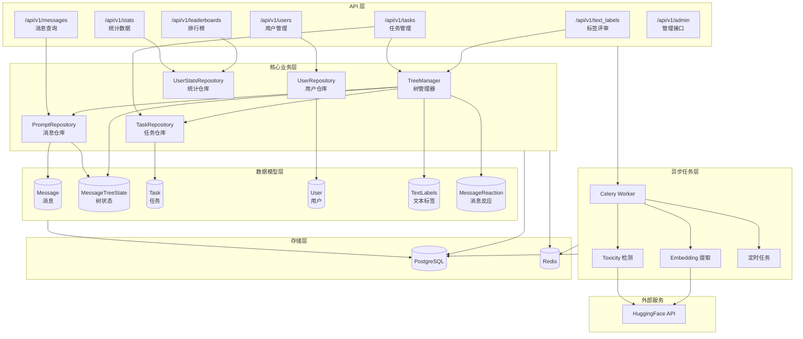
```mermaid
flowchart TB
    subgraph API["API 层"]
        Tasks["/api/v1/tasks<br/>任务管理"]
        Messages["/api/v1/messages<br/>消息查询"]
        Labels["/api/v1/text_labels<br/>标签评审"]
        Users["/api/v1/users<br/>用户管理"]
        Stats["/api/v1/stats<br/>统计数据"]
        Leaderboards["/api/v1/leaderboards<br/>排行榜"]
        Admin["/api/v1/admin<br/>管理接口"]
    end
    
    subgraph Core["核心业务层"]
        TreeMgr[TreeManager<br/>树管理器]
        PromptRepo[PromptRepository<br/>消息仓库]
        TaskRepo[TaskRepository<br/>任务仓库]
        UserRepo[UserRepository<br/>用户仓库]
        StatsRepo[UserStatsRepository<br/>统计仓库]
    end
    
    subgraph Models["数据模型层"]
        Message[(Message<br/>消息)]
        MessageTreeState[(MessageTreeState<br/>树状态)]
        Task[(Task<br/>任务)]
        User[(User<br/>用户)]
        TextLabels[(TextLabels<br/>文本标签)]
        MessageReaction[(MessageReaction<br/>消息反应)]
    end
    
    subgraph Worker["异步任务层"]
        CeleryWorker[Celery Worker]
        ToxicityTask[Toxicity 检测]
        EmbeddingTask[Embedding 提取]
        ScheduledTasks[定时任务]
    end
    
    subgraph Storage["存储层"]
        PostgreSQL[(PostgreSQL)]
        Redis[(Redis)]
    end
    
    subgraph External["外部服务"]
        HF[HuggingFace API]
    end
    
    Tasks --> TreeMgr
    Tasks --> TaskRepo
    Messages --> PromptRepo
    Labels --> TreeMgr
    Users --> UserRepo
    Stats --> StatsRepo
    Leaderboards --> StatsRepo
    
    TreeMgr --> PromptRepo
    TreeMgr --> TaskRepo
    PromptRepo --> Message
    PromptRepo --> MessageTreeState
    TaskRepo --> Task
    UserRepo --> User
    
    TreeMgr --> MessageTreeState
    TreeMgr --> TextLabels
    TreeMgr --> MessageReaction
    
    API --> CeleryWorker
    CeleryWorker --> ToxicityTask
    CeleryWorker --> EmbeddingTask
    CeleryWorker --> ScheduledTasks
    
    ToxicityTask --> HF
    EmbeddingTask --> HF
    
    Models --> PostgreSQL
    Core --> PostgreSQL
    Core --> Redis
    Worker --> PostgreSQL
    Worker --> Redis
```

### 架构说明

**分层职责：**

1. **API 层**
   - 路由定义：将 HTTP 请求映射到处理函数
   - 参数验证：使用 Pydantic 模型验证请求体
   - 鉴权与限流：依赖注入 API Key 验证和限流器
   - 异常处理：捕获 OasstError 并转换为 HTTP 响应

2. **核心业务层**
   - TreeManager：消息树状态机的核心实现，决定任务类型、状态转换、质量控制
   - PromptRepository：消息 CRUD 操作，查询优化，树遍历
   - TaskRepository：任务生命周期管理，过期清理
   - UserRepository：用户 CRUD，权限控制，活跃度更新
   - StatsRepository：统计数据聚合，排行榜计算

3. **数据模型层**
   - 使用 SQLModel（基于 SQLAlchemy + Pydantic）
   - 支持 ORM 映射和序列化
   - 索引优化（复合索引、GIN 全文索引）

4. **异步任务层**
   - Celery Worker：消费 Redis 队列中的任务
   - Toxicity 检测：调用 HuggingFace API，更新 MessageToxicity 表
   - Embedding 提取：生成消息向量，存储到 MessageEmbedding 表
   - 定时任务：Celery Beat 调度排行榜更新（每日/周/月/总榜）

**边界与扩展点：**

- **API 边界**：所有外部调用必须通过 FastAPI 路由，携带有效 API Key
- **事务边界**：使用 `@managed_tx_function` 装饰器确保原子性
- **扩展点**：
  - 新任务类型：扩展 `TaskRequestType` 枚举和 TreeManager 逻辑
  - 新评审维度：添加 `TextLabel` 枚举值
  - 自定义排名算法：修改 `ranked_pairs` 函数

**状态持有位置：**

- **无状态**：API 服务本身无状态，可水平扩展
- **状态存储**：
  - PostgreSQL：持久化状态（消息树状态、用户状态）
  - Redis：临时状态（限流计数、缓存）

**资源占用要点：**

- **内存**：连接池（75 + 20）、ORM 对象缓存、Pydantic 模型实例
- **CPU**：JSON 序列化/反序列化、状态机计算、SQL 查询规划
- **I/O**：
  - 数据库连接：高频查询和写入
  - Redis 连接：限流检查、缓存读取
  - HuggingFace API：异步调用，有速率限制

## 5. 核心流程

### 5.1 任务生成流程

**目的：**根据当前数据库状态和配置规则，生成适合用户的任务。

**输入：**
- 用户信息：`user_id`, `auth_method`, `username`
- 任务偏好：`desired_task_type`（可选）
- 语言：`lang`（如 "en", "zh"）

**输出：**
- 任务对象：`InitialPromptTask` / `AssistantReplyTask` / `PrompterReplyTask` / `RankingTask` / `LabelingTask`
- 上下文信息：父消息、对话历史、树 ID

**算法复杂度：**
- 查询复杂度：O(log N)（索引查询）+ O(1)（状态机决策）
- 空间复杂度：O(D)（D = 树深度，需加载对话历史）

**关键代码：**

```python
# backend/oasst_backend/tree_manager.py: TreeManager.next_task()
def next_task(
    self,
    desired_task_type: Optional[protocol_schema.TaskRequestType] = None,
    lang: Optional[str] = "en",
) -> Tuple[protocol_schema.Task, Optional[UUID], Optional[UUID]]:
    # 1. 排除用户最近完成的任务（避免重复）
    excluded_tree_ids, excluded_message_ids = self._get_users_recent_tasks(
        span_sec=self.cfg.recent_tasks_span_sec
    )
    
    # 2. 检查用户待处理任务数量（防止积压）
    pending_task_count = self._count_pending_user_tasks()
    if pending_task_count >= self.cfg.max_pending_tasks_per_user:
        raise OasstError("User has too many pending tasks", OasstErrorCode.USER_TASK_LIMIT_EXCEEDED)
    
    # 3. 查询数据库统计当前各类任务可用数量
    num_ranking_tasks = self._query_num_incomplete_rankings(lang, excluded_tree_ids)
    num_replies_need_review = self._query_num_replies_need_review(lang, excluded_tree_ids)
    num_prompts_need_review = self._query_num_prompts_need_review(lang, excluded_tree_ids)
    num_missing_replies, extendible_parents = self._query_extendible_parents(
        lang, excluded_tree_ids, excluded_message_ids
    )
    num_missing_prompts = self._query_num_missing_prompts(lang)
    
    # 4. 基于统计数据和配置权重，随机选择任务类型
    task_type = self._random_task_selection(
        num_ranking_tasks,
        num_replies_need_review,
        num_prompts_need_review,
        num_missing_prompts,
        num_missing_replies
    )
    
    # 5. 根据任务类型生成具体任务对象
    if task_type == TaskType.RANKING:
        task, message_tree_id, parent_id = self._generate_ranking_task(lang, excluded_tree_ids)
    elif task_type == TaskType.LABEL_REPLY:
        task, message_tree_id, parent_id = self._generate_labeling_task(
            lang, excluded_tree_ids, role="assistant"
        )
    elif task_type == TaskType.LABEL_PROMPT:
        task, message_tree_id, parent_id = self._generate_labeling_task(
            lang, excluded_tree_ids, role="prompter"
        )
    elif task_type == TaskType.REPLY:
        task, message_tree_id, parent_id = self._generate_reply_task(
            lang, extendible_parents, excluded_message_ids
        )
    elif task_type == TaskType.PROMPT:
        task, message_tree_id, parent_id = self._generate_initial_prompt_task()
    else:
        raise OasstError("No tasks available", OasstErrorCode.NO_TASKS_AVAILABLE)
    
    return task, message_tree_id, parent_id
```

### 5.2 消息提交与状态转换流程

**目的：**处理用户提交的消息，更新树状态，触发评审或排名阶段。

**输入：**
- 交互对象：`TextReplyToMessage` / `RatingReaction` / `TextLabels`
- 任务 ID：`task_id`（用于关联）
- 前端消息 ID：`message_id`（幂等键）

**输出：**
- `TaskDone`：任务完成标志
- 副作用：数据库写入、状态转换、异步任务触发

**状态机转换：**

```
INITIAL_PROMPT_REVIEW → (评审通过) → GROWING
GROWING → (达到目标大小) → RANKING
GROWING → (超时或低质量) → ABORTED_LOW_GRADE / HALTED_BY_MODERATOR
RANKING → (排名完成) → READY_FOR_SCORING
READY_FOR_SCORING → (计算分数) → READY_FOR_EXPORT
```

**关键代码：**

```python
# backend/oasst_backend/tree_manager.py: TreeManager.handle_interaction()
async def handle_interaction(
    self, interaction: protocol_schema.AnyInteraction
) -> protocol_schema.Task:
    # 1. 校验任务存在且未完成
    task = self.pr.task_repository.fetch_task(interaction.task_id, fail_if_missing=True)
    if task.done or task.skipped:
        raise OasstError("Task already completed", OasstErrorCode.TASK_ALREADY_DONE)
    
    # 2. 根据交互类型分派处理
    if isinstance(interaction, protocol_schema.TextReplyToMessage):
        # 提交文本回复
        message = self.pr.store_text_reply(
            text=interaction.text,
            lang=interaction.lang,
            frontend_message_id=interaction.message_id,
            review_count=0,  # 初始未评审
            check_tree_state=True,  # 检查树是否可扩展
            check_duplicate=True   # 检查重复内容
        )
        
        # 异步触发 Toxicity 检测和 Embedding 计算
        if not settings.DEBUG_SKIP_TOXICITY_CALCULATION:
            toxicity.delay(message.id)
        if not settings.DEBUG_SKIP_EMBEDDING_COMPUTATION:
            hf_feature_extraction.delay(message.id)
        
        # 检查是否需要进入评审阶段
        parent_message = self.pr.fetch_message(task.parent_message_id)
        if parent_message.depth == 0:
            # 初始提示需要评审
            num_reviews = self.cfg.num_reviews_initial_prompt
            if message.review_count >= num_reviews:
                self._handle_review_completion(message)
        else:
            # 回复需要评审
            num_reviews = self.cfg.num_reviews_reply
            if message.review_count >= num_reviews:
                self._handle_review_completion(message)
    
    elif isinstance(interaction, protocol_schema.RatingReaction):
        # 提交排名
        self._handle_rating_interaction(interaction)
        
    elif isinstance(interaction, protocol_schema.TextLabels):
        # 提交标签评审
        self._handle_labeling_interaction(interaction)
    
    # 3. 标记任务完成
    self.pr.task_repository.mark_task_done(task.id)
    
    return protocol_schema.TaskDone()
```

### 5.3 树状态转换详解

**状态定义：**

| 状态 | 含义 | 转换条件 |
|---|---|---|
| `INITIAL_PROMPT_REVIEW` | 初始提示等待评审 | 收集 N 个评审，平均分 > 阈值 → GROWING |
| `PROMPT_LOTTERY_WAITING` | 提示抽签等待池 | 随机选中 → INITIAL_PROMPT_REVIEW |
| `GROWING` | 树正在生长 | 消息数达到 `goal_tree_size` → RANKING |
| `RANKING` | 等待排名 | 所有兄弟节点完成排名 → READY_FOR_SCORING |
| `BACKLOG_RANKING` | 排名积压 | 有空闲槽位 → RANKING |
| `READY_FOR_SCORING` | 准备计算分数 | 手动触发 → SCORING → READY_FOR_EXPORT |
| `READY_FOR_EXPORT` | 可导出 | 终态 |
| `ABORTED_LOW_GRADE` | 因低质量中止 | 终态 |
| `HALTED_BY_MODERATOR` | 被人工暂停 | 终态 |
| `SCORING_FAILED` | 分数计算失败 | 可重试 |

**转换触发点：**

```python
# backend/oasst_backend/tree_manager.py
def _try_advance_tree_state(self, message_tree_id: UUID, state: message_tree_state.State):
    mts = self.pr.fetch_tree_state(message_tree_id)
    
    if state == message_tree_state.State.GROWING:
        tree_size = self._count_tree_messages(message_tree_id)
        if tree_size >= mts.goal_tree_size:
            # 达到目标大小，转换到 RANKING 或 BACKLOG_RANKING
            self._transition_to_ranking(mts)
    
    elif state == message_tree_state.State.RANKING:
        incomplete_rankings = self._query_num_incomplete_rankings_for_tree(message_tree_id)
        if incomplete_rankings == 0:
            # 所有节点排名完成，转换到 READY_FOR_SCORING
            self._update_tree_state(mts, message_tree_state.State.READY_FOR_SCORING)
```

## 6. 配置与可观测

### 配置项说明

**TreeManager 配置（`TreeManagerConfiguration`）：**

| 配置项 | 默认值 | 说明 |
|---|---|---|
| `max_active_trees` | 10 | 最大并发活跃树数，控制数据收集速度 |
| `max_initial_prompt_review` | 100 | 最大初始提示评审数，超过则不生成新提示任务 |
| `max_tree_depth` | 3 | 树最大深度（轮次） |
| `max_children_count` | 3 | 每节点最大子节点数 |
| `goal_tree_size` | 12 | 目标树大小（消息数） |
| `num_reviews_initial_prompt` | 3 | 初始提示评审次数 |
| `num_reviews_reply` | 3 | 回复评审次数 |
| `acceptance_threshold_initial_prompt` | 0.6 | 初始提示接受阈值（平均分） |
| `acceptance_threshold_reply` | 0.6 | 回复接受阈值 |
| `num_required_rankings` | 3 | 每个消息需要参与的排名次数 |
| `auto_mod_max_skip_reply` | 25 | 自动暂停阈值（跳过次数） |
| `auto_mod_red_flags` | 4 | 自动删除阈值（红旗次数） |

**限流配置：**

| 配置项 | 默认值 | 说明 |
|---|---|---|
| `RATE_LIMIT_TASK_USER_TIMES` | 30 | 用户任务请求限流（次数） |
| `RATE_LIMIT_TASK_USER_MINUTES` | 4 | 限流时间窗口（分钟） |
| `RATE_LIMIT_ASSISTANT_USER_TIMES` | 4 | 助手回复限流（次数） |
| `RATE_LIMIT_ASSISTANT_USER_MINUTES` | 2 | 限流时间窗口（分钟） |
| `RATE_LIMIT_PROMPTER_USER_TIMES` | 8 | 提示者回复限流（次数） |
| `RATE_LIMIT_PROMPTER_USER_MINUTES` | 2 | 限流时间窗口（分钟） |

### 观测指标

**Prometheus Metrics（通过 `Instrumentator`）：**

- `http_requests_total{method, path, status}` - HTTP 请求总数
- `http_request_duration_seconds{method, path}` - 请求延迟分布
- `db_pool_size` - 数据库连接池大小
- `db_pool_checked_out` - 已使用连接数
- `celery_task_duration_seconds{task_name}` - Celery 任务耗时

**日志关键点：**

- `INFO`: 任务创建、消息提交、状态转换
- `WARNING`: 限流触发、Alembic 升级、Redis 连接失败（重试中）
- `ERROR`: 数据库连接失败、HuggingFace API 失败、状态机异常

**健康检查端点：**

- 数据库：通过连接池自动检测（连接失败抛异常）
- Redis：FastAPILimiter 初始化时检测
- Celery：通过 `celery inspect ping` 命令

---

**下一步：**
- 阅读 `Open-Assistant-01-Backend-API.md` 了解所有 API 详细规格
- 阅读 `Open-Assistant-01-Backend-数据结构.md` 了解数据库模型
- 阅读 `Open-Assistant-01-Backend-时序图.md` 查看关键流程时序图

---

本文档提供 Backend 模块关键业务流程的详细时序图，展示各组件之间的交互顺序、数据流向和状态变化。

## 1. 任务请求与分配流程

### 1.1 初始提示任务生成

**场景**：用户请求创建新的对话提示任务。

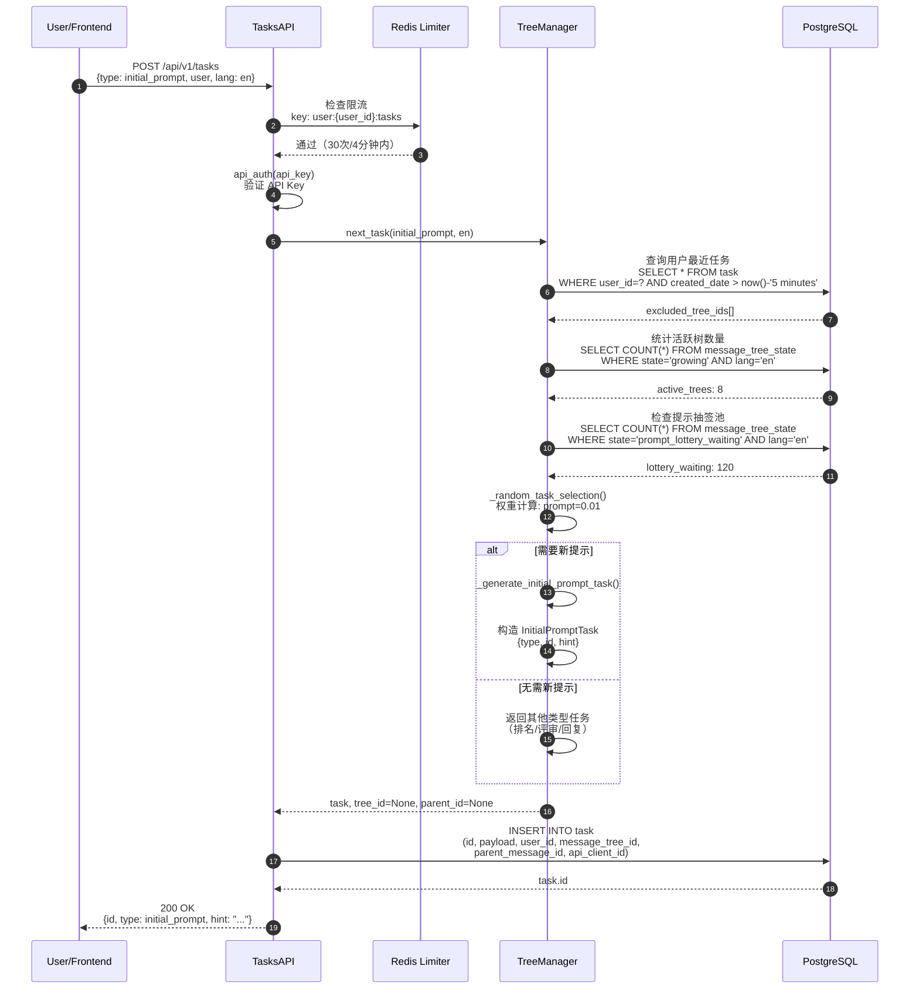
```mermaid
sequenceDiagram
    autonumber
    participant U as User/Frontend
    participant API as TasksAPI
    participant Redis as Redis Limiter
    participant TM as TreeManager
    participant DB as PostgreSQL
    
    U->>API: POST /api/v1/tasks<br/>{type: initial_prompt, user, lang: en}
    
    API->>Redis: 检查限流<br/>key: user:{user_id}:tasks
    Redis-->>API: 通过（30次/4分钟内）
    
    API->>API: api_auth(api_key)<br/>验证 API Key
    
    API->>TM: next_task(initial_prompt, en)
    
    TM->>DB: 查询用户最近任务<br/>SELECT * FROM task<br/>WHERE user_id=? AND created_date > now()-'5 minutes'
    DB-->>TM: excluded_tree_ids[]
    
    TM->>DB: 统计活跃树数量<br/>SELECT COUNT(*) FROM message_tree_state<br/>WHERE state='growing' AND lang='en'
    DB-->>TM: active_trees: 8
    
    TM->>DB: 检查提示抽签池<br/>SELECT COUNT(*) FROM message_tree_state<br/>WHERE state='prompt_lottery_waiting' AND lang='en'
    DB-->>TM: lottery_waiting: 120
    
    TM->>TM: _random_task_selection()<br/>权重计算: prompt=0.01
    
    alt 需要新提示
        TM->>TM: _generate_initial_prompt_task()
        TM->>TM: 构造 InitialPromptTask<br/>{type, id, hint}
    else 无需新提示
        TM->>TM: 返回其他类型任务<br/>（排名/评审/回复）
    end
    
    TM-->>API: task, tree_id=None, parent_id=None
    
    API->>DB: INSERT INTO task<br/>(id, payload, user_id, message_tree_id,<br/> parent_message_id, api_client_id)
    DB-->>API: task.id
    
    API-->>U: 200 OK<br/>{id, type: initial_prompt, hint: "..."}
```

**关键点：**

1. **限流检查**：Redis 基于滑动窗口算法，防止用户频繁请求
2. **排除最近任务**：避免用户重复看到相同树的任务
3. **权重决策**：初始提示任务权重最低（0.01），只有在活跃树不足时才生成
4. **无状态**：任务生成不修改消息树状态，只读操作
5. **持久化**：任务先持久化到数据库，确保不丢失

---

### 1.2 助手回复任务生成

**场景**：用户请求回复用户的提示或追问。

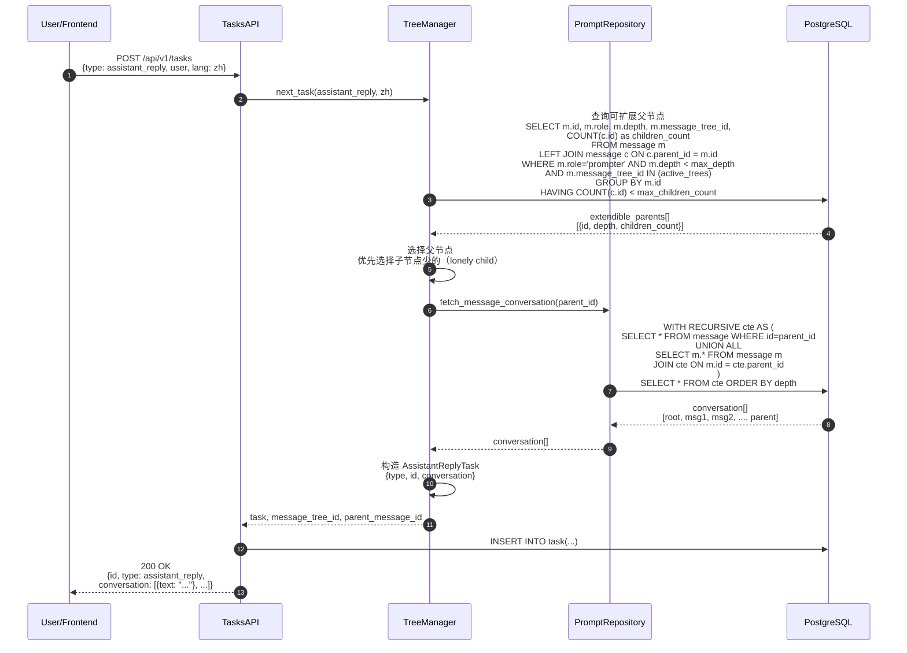
```mermaid
sequenceDiagram
    autonumber
    participant U as User/Frontend
    participant API as TasksAPI
    participant TM as TreeManager
    participant PR as PromptRepository
    participant DB as PostgreSQL
    
    U->>API: POST /api/v1/tasks<br/>{type: assistant_reply, user, lang: zh}
    
    API->>TM: next_task(assistant_reply, zh)
    
    TM->>DB: 查询可扩展父节点<br/>SELECT m.id, m.role, m.depth, m.message_tree_id,<br/>       COUNT(c.id) as children_count<br/>FROM message m<br/>LEFT JOIN message c ON c.parent_id = m.id<br/>WHERE m.role='prompter' AND m.depth < max_depth<br/>  AND m.message_tree_id IN (active_trees)<br/>GROUP BY m.id<br/>HAVING COUNT(c.id) < max_children_count
    DB-->>TM: extendible_parents[]<br/>[{id, depth, children_count}]
    
    TM->>TM: 选择父节点<br/>优先选择子节点少的（lonely child）
    
    TM->>PR: fetch_message_conversation(parent_id)
    PR->>DB: WITH RECURSIVE cte AS (<br/>  SELECT * FROM message WHERE id=parent_id<br/>  UNION ALL<br/>  SELECT m.* FROM message m<br/>    JOIN cte ON m.id = cte.parent_id<br/>)<br/>SELECT * FROM cte ORDER BY depth
    DB-->>PR: conversation[]<br/>[root, msg1, msg2, ..., parent]
    PR-->>TM: conversation[]
    
    TM->>TM: 构造 AssistantReplyTask<br/>{type, id, conversation}
    
    TM-->>API: task, message_tree_id, parent_message_id
    
    API->>DB: INSERT INTO task(...)
    API-->>U: 200 OK<br/>{id, type: assistant_reply,<br/> conversation: [{text: "..."}, ...]}
```

**关键点：**

1. **可扩展性检查**：通过聚合查询找到未满的节点
2. **孤独子节点优先**：`lonely_children_count`=2，子节点数 < 2 的节点有 75% 概率被选中
3. **对话历史加载**：使用递归 CTE 向上遍历到根节点
4. **深度限制**：`max_depth`=3，防止对话过长
5. **树 ID 传递**：任务记录关联树 ID 和父消息 ID

---

## 2. 消息提交与树状态转换流程

### 2.1 初始提示提交

**场景**：用户提交初始对话提示。

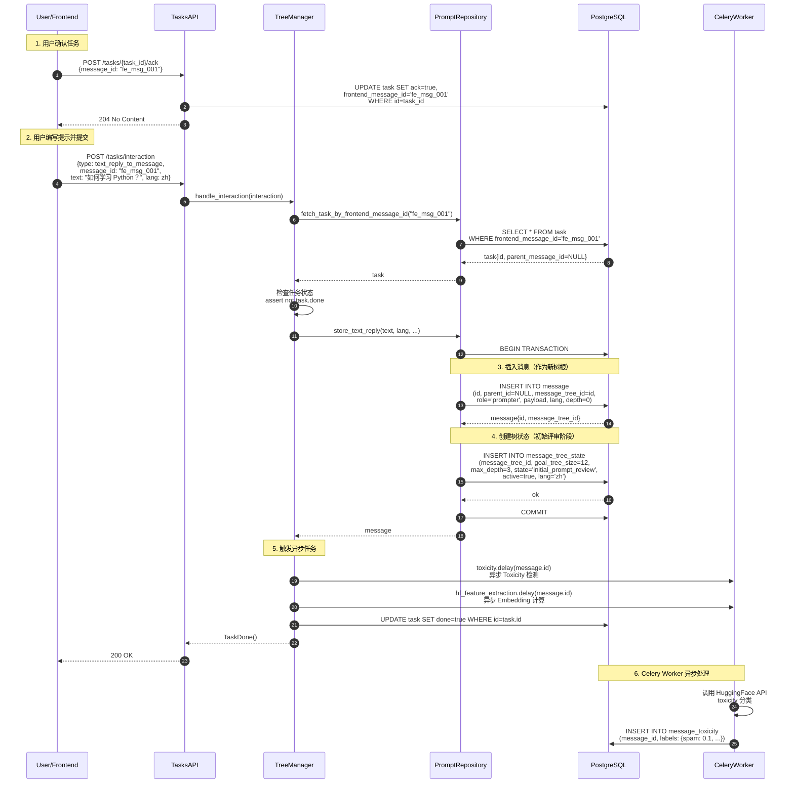
```mermaid
sequenceDiagram
    autonumber
    participant U as User/Frontend
    participant API as TasksAPI
    participant TM as TreeManager
    participant PR as PromptRepository
    participant DB as PostgreSQL
    participant Celery as CeleryWorker
    
    Note over U: 1. 用户确认任务
    U->>API: POST /tasks/{task_id}/ack<br/>{message_id: "fe_msg_001"}
    API->>DB: UPDATE task SET ack=true,<br/>frontend_message_id='fe_msg_001'<br/>WHERE id=task_id
    API-->>U: 204 No Content
    
    Note over U: 2. 用户编写提示并提交
    U->>API: POST /tasks/interaction<br/>{type: text_reply_to_message,<br/> message_id: "fe_msg_001",<br/> text: "如何学习 Python？", lang: zh}
    
    API->>TM: handle_interaction(interaction)
    
    TM->>PR: fetch_task_by_frontend_message_id("fe_msg_001")
    PR->>DB: SELECT * FROM task<br/>WHERE frontend_message_id='fe_msg_001'
    DB-->>PR: task{id, parent_message_id=NULL}
    PR-->>TM: task
    
    TM->>TM: 检查任务状态<br/>assert not task.done
    
    TM->>PR: store_text_reply(text, lang, ...)
    PR->>DB: BEGIN TRANSACTION
    
    Note over PR,DB: 3. 插入消息（作为新树根）
    PR->>DB: INSERT INTO message<br/>(id, parent_id=NULL, message_tree_id=id,<br/> role='prompter', payload, lang, depth=0)
    DB-->>PR: message{id, message_tree_id}
    
    Note over PR,DB: 4. 创建树状态（初始评审阶段）
    PR->>DB: INSERT INTO message_tree_state<br/>(message_tree_id, goal_tree_size=12,<br/> max_depth=3, state='initial_prompt_review',<br/> active=true, lang='zh')
    DB-->>PR: ok
    
    PR->>DB: COMMIT
    PR-->>TM: message
    
    Note over TM: 5. 触发异步任务
    TM->>Celery: toxicity.delay(message.id)<br/>异步 Toxicity 检测
    TM->>Celery: hf_feature_extraction.delay(message.id)<br/>异步 Embedding 计算
    
    TM->>DB: UPDATE task SET done=true WHERE id=task.id
    
    TM-->>API: TaskDone()
    API-->>U: 200 OK
    
    Note over Celery,DB: 6. Celery Worker 异步处理
    Celery->>Celery: 调用 HuggingFace API<br/>toxicity 分类
    Celery->>DB: INSERT INTO message_toxicity<br/>(message_id, labels: {spam: 0.1, ...})
```

**关键点：**

1. **幂等性**：通过 `frontend_message_id` 防止重复提交（数据库唯一约束）
2. **事务原子性**：消息插入和树状态创建在同一事务内
3. **初始状态**：新树进入 `INITIAL_PROMPT_REVIEW` 状态，等待评审
4. **异步解耦**：Toxicity 检测不阻塞主流程，失败不影响消息保存
5. **树 ID 设计**：根消息的 ID 即为树 ID（`message_tree_id = id`）

---

### 2.2 助手回复提交与状态转换

**场景**：用户提交助手回复，可能触发树状态转换。

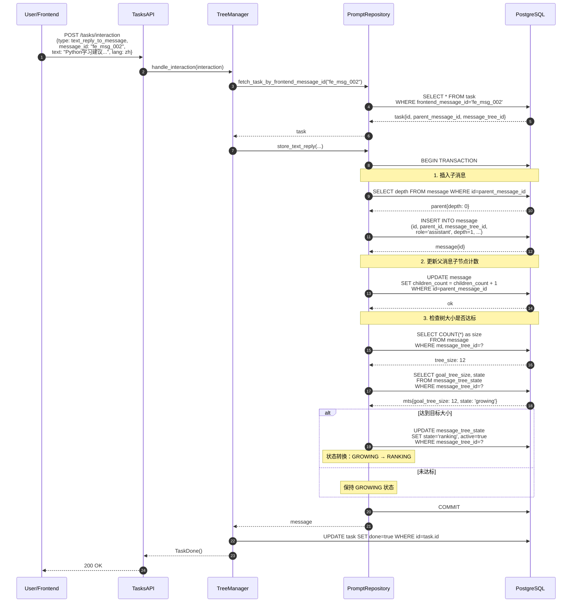
```mermaid
sequenceDiagram
    autonumber
    participant U as User/Frontend
    participant API as TasksAPI
    participant TM as TreeManager
    participant PR as PromptRepository
    participant DB as PostgreSQL
    
    U->>API: POST /tasks/interaction<br/>{type: text_reply_to_message,<br/> message_id: "fe_msg_002",<br/> text: "Python学习建议...", lang: zh}
    
    API->>TM: handle_interaction(interaction)
    
    TM->>PR: fetch_task_by_frontend_message_id("fe_msg_002")
    PR->>DB: SELECT * FROM task<br/>WHERE frontend_message_id='fe_msg_002'
    DB-->>PR: task{id, parent_message_id, message_tree_id}
    PR-->>TM: task
    
    TM->>PR: store_text_reply(...)
    PR->>DB: BEGIN TRANSACTION
    
    Note over PR,DB: 1. 插入子消息
    PR->>DB: SELECT depth FROM message WHERE id=parent_message_id
    DB-->>PR: parent{depth: 0}
    
    PR->>DB: INSERT INTO message<br/>(id, parent_id, message_tree_id,<br/> role='assistant', depth=1, ...)
    DB-->>PR: message{id}
    
    Note over PR,DB: 2. 更新父消息子节点计数
    PR->>DB: UPDATE message<br/>SET children_count = children_count + 1<br/>WHERE id=parent_message_id
    DB-->>PR: ok
    
    Note over PR,DB: 3. 检查树大小是否达标
    PR->>DB: SELECT COUNT(*) as size<br/>FROM message<br/>WHERE message_tree_id=?
    DB-->>PR: tree_size: 12
    
    PR->>DB: SELECT goal_tree_size, state<br/>FROM message_tree_state<br/>WHERE message_tree_id=?
    DB-->>PR: mts{goal_tree_size: 12, state: 'growing'}
    
    alt 达到目标大小
        PR->>DB: UPDATE message_tree_state<br/>SET state='ranking', active=true<br/>WHERE message_tree_id=?
        Note over PR: 状态转换：GROWING → RANKING
    else 未达标
        Note over PR: 保持 GROWING 状态
    end
    
    PR->>DB: COMMIT
    PR-->>TM: message
    
    TM->>DB: UPDATE task SET done=true WHERE id=task.id
    TM-->>API: TaskDone()
    API-->>U: 200 OK
```

**关键点：**

1. **深度继承**：子消息深度 = 父消息深度 + 1
2. **计数更新**：原子性更新父消息的 `children_count`
3. **状态检查**：每次插入后检查是否触发状态转换
4. **转换条件**：树大小 ≥ `goal_tree_size` 时转到 RANKING 状态
5. **事务保证**：消息插入、计数更新、状态转换在同一事务

---

## 3. 评审与排名流程

### 3.1 文本标签评审

**场景**：用户对消息进行质量评审（spam、quality、toxicity 等）。

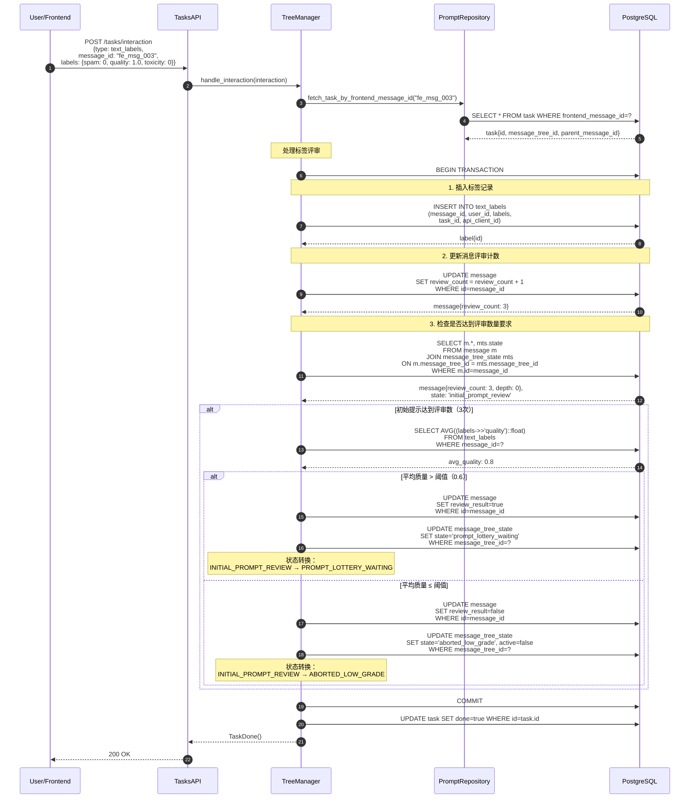
```mermaid
sequenceDiagram
    autonumber
    participant U as User/Frontend
    participant API as TasksAPI
    participant TM as TreeManager
    participant PR as PromptRepository
    participant DB as PostgreSQL
    
    U->>API: POST /tasks/interaction<br/>{type: text_labels,<br/> message_id: "fe_msg_003",<br/> labels: {spam: 0, quality: 1.0, toxicity: 0}}
    
    API->>TM: handle_interaction(interaction)
    
    TM->>PR: fetch_task_by_frontend_message_id("fe_msg_003")
    PR->>DB: SELECT * FROM task WHERE frontend_message_id=?
    DB-->>PR: task{id, message_tree_id, parent_message_id}
    
    Note over TM: 处理标签评审
    TM->>DB: BEGIN TRANSACTION
    
    Note over TM,DB: 1. 插入标签记录
    TM->>DB: INSERT INTO text_labels<br/>(message_id, user_id, labels,<br/> task_id, api_client_id)
    DB-->>TM: label{id}
    
    Note over TM,DB: 2. 更新消息评审计数
    TM->>DB: UPDATE message<br/>SET review_count = review_count + 1<br/>WHERE id=message_id
    DB-->>TM: message{review_count: 3}
    
    Note over TM,DB: 3. 检查是否达到评审数量要求
    TM->>DB: SELECT m.*, mts.state<br/>FROM message m<br/>JOIN message_tree_state mts<br/>  ON m.message_tree_id = mts.message_tree_id<br/>WHERE m.id=message_id
    DB-->>TM: message{review_count: 3, depth: 0},<br/>state: 'initial_prompt_review'
    
    alt 初始提示达到评审数（3次）
        TM->>DB: SELECT AVG((labels->>'quality')::float)<br/>FROM text_labels<br/>WHERE message_id=?
        DB-->>TM: avg_quality: 0.8
        
        alt 平均质量 > 阈值（0.6）
            TM->>DB: UPDATE message<br/>SET review_result=true<br/>WHERE id=message_id
            
            TM->>DB: UPDATE message_tree_state<br/>SET state='prompt_lottery_waiting'<br/>WHERE message_tree_id=?
            Note over TM: 状态转换：<br/>INITIAL_PROMPT_REVIEW → PROMPT_LOTTERY_WAITING
        else 平均质量 ≤ 阈值
            TM->>DB: UPDATE message<br/>SET review_result=false<br/>WHERE id=message_id
            
            TM->>DB: UPDATE message_tree_state<br/>SET state='aborted_low_grade', active=false<br/>WHERE message_tree_id=?
            Note over TM: 状态转换：<br/>INITIAL_PROMPT_REVIEW → ABORTED_LOW_GRADE
        end
    end
    
    TM->>DB: COMMIT
    TM->>DB: UPDATE task SET done=true WHERE id=task.id
    TM-->>API: TaskDone()
    API-->>U: 200 OK
```

**关键点：**

1. **标签存储**：JSONB 格式，支持任意标签字段
2. **计数累加**：原子性更新 `review_count`
3. **阈值判断**：平均质量分数决定是否通过
4. **状态转换**：通过后进入抽签池，等待被激活
5. **失败处理**：不通过的提示进入终态，不再分配任务

---

### 3.2 排名提交

**场景**：用户对多个助手回复进行排序。

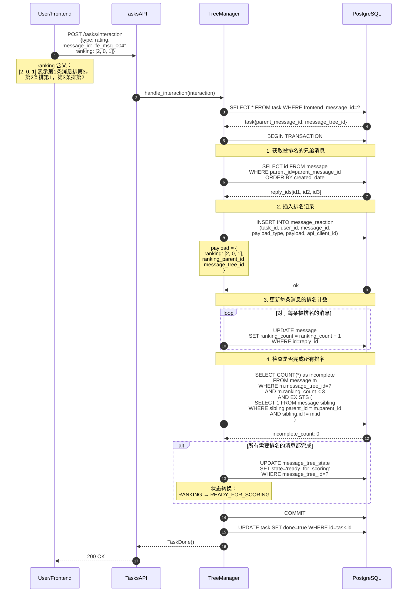
```mermaid
sequenceDiagram
    autonumber
    participant U as User/Frontend
    participant API as TasksAPI
    participant TM as TreeManager
    participant DB as PostgreSQL
    
    U->>API: POST /tasks/interaction<br/>{type: rating,<br/> message_id: "fe_msg_004",<br/> ranking: [2, 0, 1]}
    Note over U: ranking 含义：<br/>[2, 0, 1] 表示第1条消息排第3，<br/>第2条排第1，第3条排第2
    
    API->>TM: handle_interaction(interaction)
    
    TM->>DB: SELECT * FROM task WHERE frontend_message_id=?
    DB-->>TM: task{parent_message_id, message_tree_id}
    
    TM->>DB: BEGIN TRANSACTION
    
    Note over TM,DB: 1. 获取被排名的兄弟消息
    TM->>DB: SELECT id FROM message<br/>WHERE parent_id=parent_message_id<br/>ORDER BY created_date
    DB-->>TM: reply_ids[id1, id2, id3]
    
    Note over TM,DB: 2. 插入排名记录
    TM->>DB: INSERT INTO message_reaction<br/>(task_id, user_id, message_id,<br/> payload_type, payload, api_client_id)
    Note over TM: payload = {<br/>  ranking: [2, 0, 1],<br/>  ranking_parent_id,<br/>  message_tree_id<br/>}
    DB-->>TM: ok
    
    Note over TM,DB: 3. 更新每条消息的排名计数
    loop 对于每条被排名的消息
        TM->>DB: UPDATE message<br/>SET ranking_count = ranking_count + 1<br/>WHERE id=reply_id
    end
    
    Note over TM,DB: 4. 检查是否完成所有排名
    TM->>DB: SELECT COUNT(*) as incomplete<br/>FROM message m<br/>WHERE m.message_tree_id=?<br/>  AND m.ranking_count < 3<br/>  AND EXISTS (<br/>    SELECT 1 FROM message sibling<br/>    WHERE sibling.parent_id = m.parent_id<br/>      AND sibling.id != m.id<br/>  )
    DB-->>TM: incomplete_count: 0
    
    alt 所有需要排名的消息都完成
        TM->>DB: UPDATE message_tree_state<br/>SET state='ready_for_scoring'<br/>WHERE message_tree_id=?
        Note over TM: 状态转换：<br/>RANKING → READY_FOR_SCORING
    end
    
    TM->>DB: COMMIT
    TM->>DB: UPDATE task SET done=true WHERE id=task.id
    TM-->>API: TaskDone()
    API-->>U: 200 OK
```

**关键点：**

1. **排名格式**：数组索引表示原始顺序，值表示排名位置
2. **批量更新**：一次排名更新所有兄弟消息的计数
3. **完成条件**：所有有兄弟节点的消息都达到 `num_required_rankings`（默认 3）
4. **状态转换**：排名完成后进入计分阶段
5. **计分算法**：使用 Ranked Pairs 算法计算全局排名

---

## 4. 系统级关键场景

### 4.1 树状态完整生命周期

**场景**：一棵树从创建到导出的完整流程。

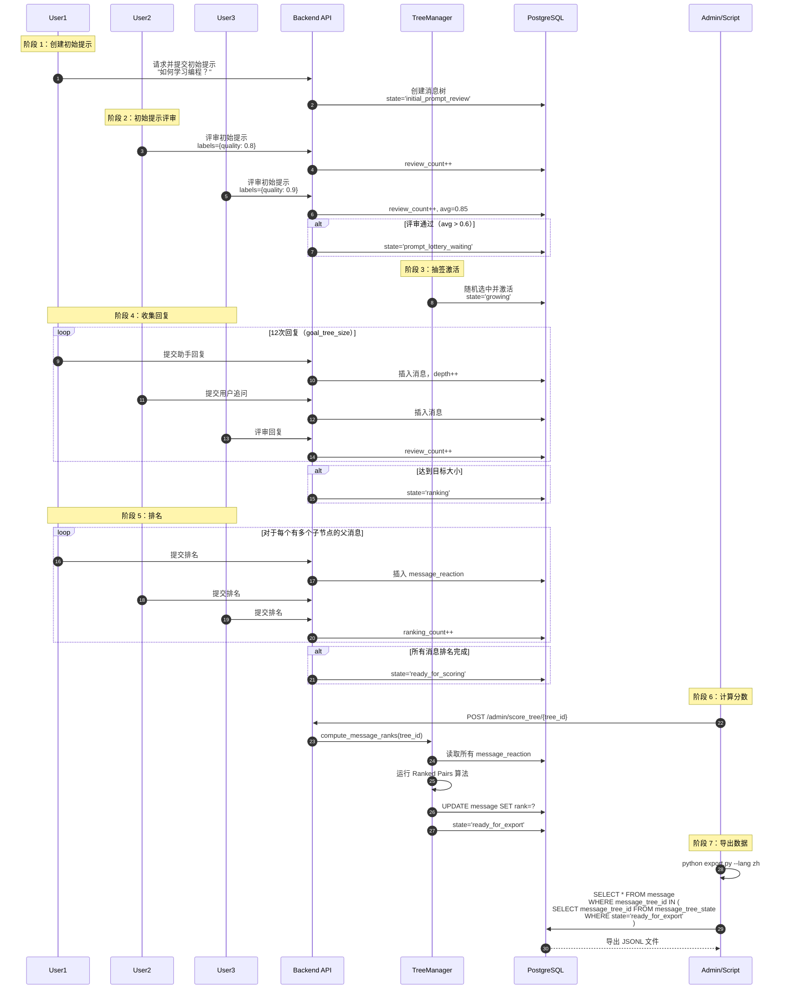
```mermaid
sequenceDiagram
    autonumber
    participant U1 as User1
    participant U2 as User2
    participant U3 as User3
    participant API as Backend API
    participant TM as TreeManager
    participant DB as PostgreSQL
    participant Admin as Admin/Script
    
    Note over U1: 阶段 1：创建初始提示
    U1->>API: 请求并提交初始提示<br/>"如何学习编程？"
    API->>DB: 创建消息树<br/>state='initial_prompt_review'
    
    Note over U2: 阶段 2：初始提示评审
    U2->>API: 评审初始提示<br/>labels={quality: 0.8}
    API->>DB: review_count++
    U3->>API: 评审初始提示<br/>labels={quality: 0.9}
    API->>DB: review_count++, avg=0.85
    
    alt 评审通过（avg > 0.6）
        API->>DB: state='prompt_lottery_waiting'
    end
    
    Note over TM: 阶段 3：抽签激活
    TM->>DB: 随机选中并激活<br/>state='growing'
    
    Note over U1,U3: 阶段 4：收集回复
    loop 12次回复（goal_tree_size）
        U1->>API: 提交助手回复
        API->>DB: 插入消息，depth++
        U2->>API: 提交用户追问
        API->>DB: 插入消息
        U3->>API: 评审回复
        API->>DB: review_count++
    end
    
    alt 达到目标大小
        API->>DB: state='ranking'
    end
    
    Note over U1,U3: 阶段 5：排名
    loop 对于每个有多个子节点的父消息
        U1->>API: 提交排名
        API->>DB: 插入 message_reaction
        U2->>API: 提交排名
        U3->>API: 提交排名
        API->>DB: ranking_count++
    end
    
    alt 所有消息排名完成
        API->>DB: state='ready_for_scoring'
    end
    
    Note over Admin: 阶段 6：计算分数
    Admin->>API: POST /admin/score_tree/{tree_id}
    API->>TM: compute_message_ranks(tree_id)
    TM->>DB: 读取所有 message_reaction
    TM->>TM: 运行 Ranked Pairs 算法
    TM->>DB: UPDATE message SET rank=?
    TM->>DB: state='ready_for_export'
    
    Note over Admin: 阶段 7：导出数据
    Admin->>Admin: python export.py --lang zh
    Admin->>DB: SELECT * FROM message<br/>WHERE message_tree_id IN (<br/>  SELECT message_tree_id FROM message_tree_state<br/>  WHERE state='ready_for_export'<br/>)
    DB-->>Admin: 导出 JSONL 文件
```

**关键点：**

1. **多阶段验证**：初始提示评审 → 抽签 → 生长 → 排名 → 计分
2. **用户协作**：不同用户贡献提示、回复、评审、排名
3. **状态门控**：每个阶段完成才能进入下一阶段
4. **异步计分**：计分是手动触发的离线操作
5. **终态导出**：只有 `ready_for_export` 状态的树才被导出

---

### 4.2 自动质量控制流程

**场景**：系统自动检测并处理低质量内容。

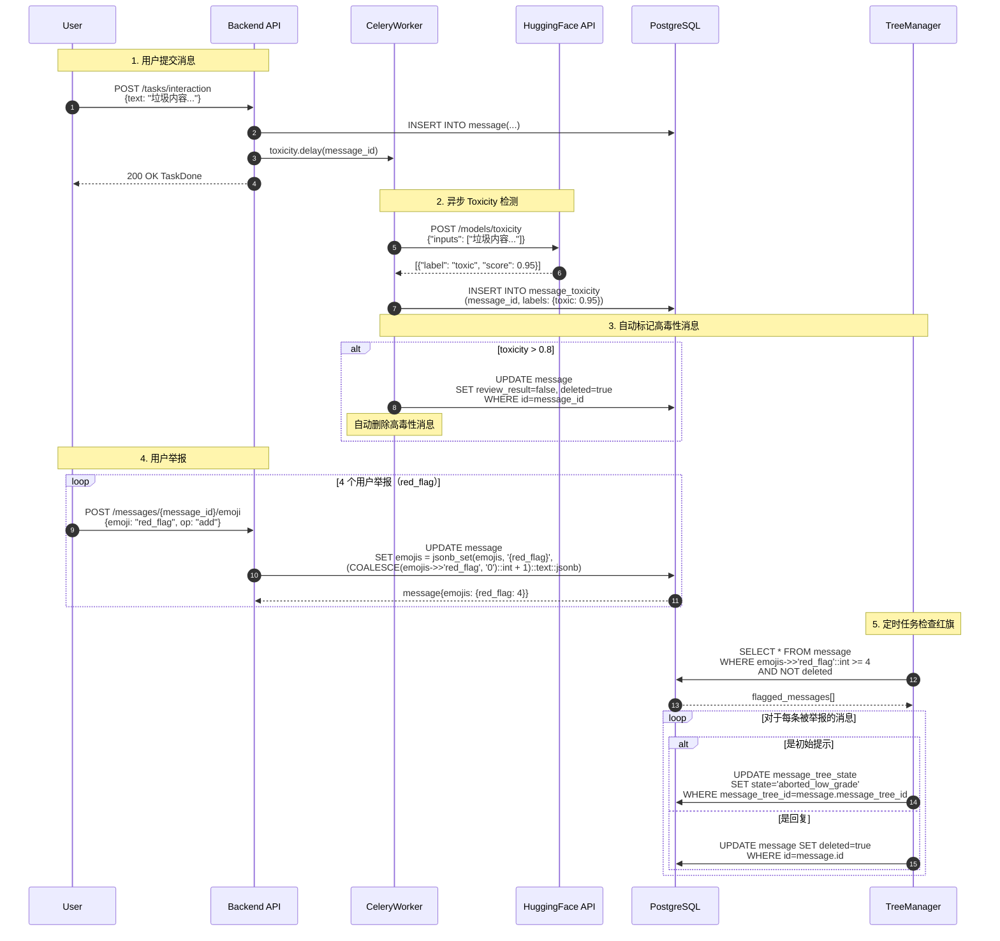
```mermaid
sequenceDiagram
    autonumber
    participant U as User
    participant API as Backend API
    participant Celery as CeleryWorker
    participant HF as HuggingFace API
    participant DB as PostgreSQL
    participant TM as TreeManager
    
    Note over U,API: 1. 用户提交消息
    U->>API: POST /tasks/interaction<br/>{text: "垃圾内容..."}
    API->>DB: INSERT INTO message(...)
    API->>Celery: toxicity.delay(message_id)
    API-->>U: 200 OK TaskDone
    
    Note over Celery,HF: 2. 异步 Toxicity 检测
    Celery->>HF: POST /models/toxicity<br/>{"inputs": ["垃圾内容..."]}
    HF-->>Celery: [{"label": "toxic", "score": 0.95}]
    
    Celery->>DB: INSERT INTO message_toxicity<br/>(message_id, labels: {toxic: 0.95})
    
    Note over Celery,TM: 3. 自动标记高毒性消息
    alt toxicity > 0.8
        Celery->>DB: UPDATE message<br/>SET review_result=false, deleted=true<br/>WHERE id=message_id
        Note over Celery: 自动删除高毒性消息
    end
    
    Note over U,API: 4. 用户举报
    loop 4 个用户举报（red_flag）
        U->>API: POST /messages/{message_id}/emoji<br/>{emoji: "red_flag", op: "add"}
        API->>DB: UPDATE message<br/>SET emojis = jsonb_set(emojis, '{red_flag}',<br/>  (COALESCE(emojis->>'red_flag', '0')::int + 1)::text::jsonb)
        DB-->>API: message{emojis: {red_flag: 4}}
    end
    
    Note over TM: 5. 定时任务检查红旗
    TM->>DB: SELECT * FROM message<br/>WHERE emojis->>'red_flag'::int >= 4<br/>  AND NOT deleted
    DB-->>TM: flagged_messages[]
    
    loop 对于每条被举报的消息
        alt 是初始提示
            TM->>DB: UPDATE message_tree_state<br/>SET state='aborted_low_grade'<br/>WHERE message_tree_id=message.message_tree_id
        else 是回复
            TM->>DB: UPDATE message SET deleted=true<br/>WHERE id=message.id
        end
    end
```

**关键点：**

1. **异步检测**：不阻塞用户操作
2. **多重保护**：自动检测 + 人工举报
3. **阈值触发**：超过配置阈值自动处理
4. **差异化处理**：初始提示中止整棵树，回复只删除单条
5. **可观测性**：所有自动操作记录日志

---

## 5. 并发与事务处理

### 5.1 并发消息提交

**场景**：多个用户同时向同一父消息提交回复。

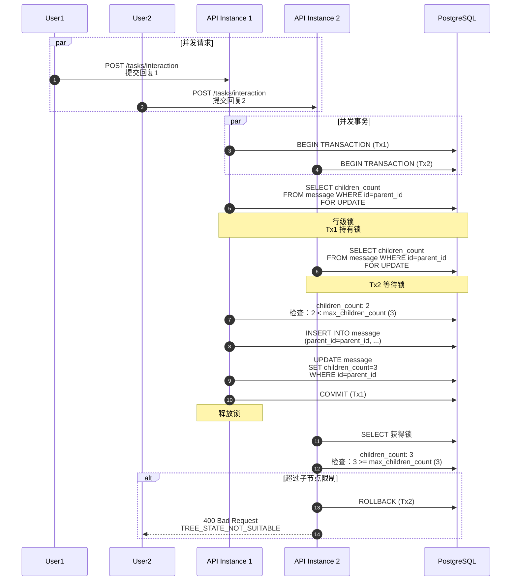
```mermaid
sequenceDiagram
    autonumber
    participant U1 as User1
    participant U2 as User2
    participant API1 as API Instance 1
    participant API2 as API Instance 2
    participant DB as PostgreSQL
    
    par 并发请求
        U1->>API1: POST /tasks/interaction<br/>提交回复1
        U2->>API2: POST /tasks/interaction<br/>提交回复2
    end
    
    par 并发事务
        API1->>DB: BEGIN TRANSACTION (Tx1)
        API2->>DB: BEGIN TRANSACTION (Tx2)
    end
    
    API1->>DB: SELECT children_count<br/>FROM message WHERE id=parent_id<br/>FOR UPDATE
    Note over API1,DB: 行级锁<br/>Tx1 持有锁
    
    API2->>DB: SELECT children_count<br/>FROM message WHERE id=parent_id<br/>FOR UPDATE
    Note over API2,DB: Tx2 等待锁
    
    API1->>DB: children_count: 2<br/>检查：2 < max_children_count (3)
    
    API1->>DB: INSERT INTO message<br/>(parent_id=parent_id, ...)
    
    API1->>DB: UPDATE message<br/>SET children_count=3<br/>WHERE id=parent_id
    
    API1->>DB: COMMIT (Tx1)
    Note over API1: 释放锁
    
    API2->>DB: SELECT 获得锁
    API2->>DB: children_count: 3<br/>检查：3 >= max_children_count (3)
    
    alt 超过子节点限制
        API2->>DB: ROLLBACK (Tx2)
        API2-->>U2: 400 Bad Request<br/>TREE_STATE_NOT_SUITABLE
    end
```

**关键点：**

1. **行级锁**：`SELECT FOR UPDATE` 防止脏读
2. **原子检查**：在同一事务内检查和更新
3. **失败快速返回**：超过限制立即回滚，不浪费资源
4. **幂等性**：`frontend_message_id` 唯一约束防止重复插入
5. **重试机制**：客户端收到 400 错误后请求新任务

---

### 5.2 数据库事务冲突重试

**场景**：事务冲突自动重试。

```python
# backend/oasst_backend/utils/database_utils.py
@managed_tx_function(CommitMode.COMMIT)
def interaction_handler(session: Session, interaction):
    try:
        # 业务逻辑
        pr = PromptRepository(session, api_client, client_user=interaction.user)
        tm = TreeManager(session, pr)
        return tm.handle_interaction(interaction)
    except sa.exc.IntegrityError as e:
        # 唯一约束冲突（如重复 frontend_message_id）
        if "frontend_message_id" in str(e):
            raise OasstError("Duplicate message", OasstErrorCode.DUPLICATE_MESSAGE)
        raise
    except sa.exc.OperationalError as e:
        # 死锁或连接失败
        retry_count = getattr(session, "_retry_count", 0)
        if retry_count < MAX_RETRIES:
            session._retry_count = retry_count + 1
            # 自动回滚并重试
            session.rollback()
            return interaction_handler(session, interaction)
        raise
```

**关键点：**

1. **自动重试**：最多重试 3 次（`DATABASE_MAX_TX_RETRY_COUNT`）
2. **冲突检测**：捕获 `IntegrityError` 和 `OperationalError`
3. **回滚保证**：失败自动回滚，不留脏数据
4. **重试间隔**：可选指数退避（默认立即重试）

---

## 6. 性能优化时序

### 6.1 缓存命中流程

**场景**：查询排行榜时命中缓存。

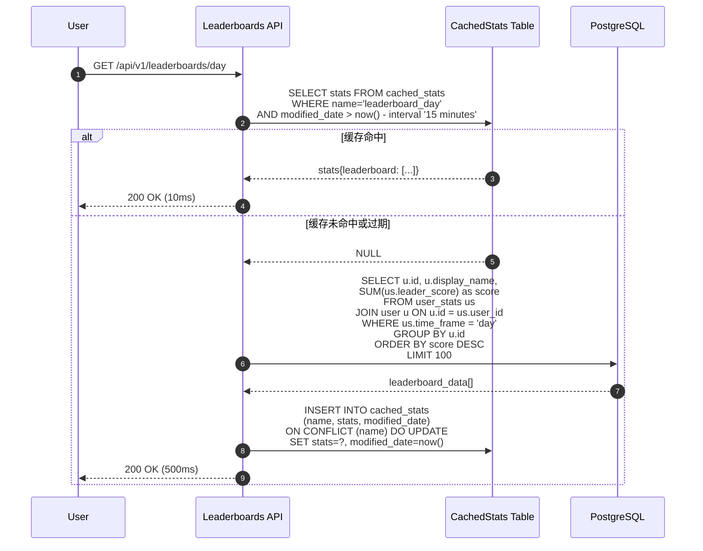
```mermaid
sequenceDiagram
    autonumber
    participant U as User
    participant API as Leaderboards API
    participant Cache as CachedStats Table
    participant DB as PostgreSQL
    
    U->>API: GET /api/v1/leaderboards/day
    
    API->>Cache: SELECT stats FROM cached_stats<br/>WHERE name='leaderboard_day'<br/>  AND modified_date > now() - interval '15 minutes'
    
    alt 缓存命中
        Cache-->>API: stats{leaderboard: [...]}
        API-->>U: 200 OK (10ms)
    else 缓存未命中或过期
        Cache-->>API: NULL
        
        API->>DB: SELECT u.id, u.display_name,<br/>       SUM(us.leader_score) as score<br/>FROM user_stats us<br/>JOIN user u ON u.id = us.user_id<br/>WHERE us.time_frame = 'day'<br/>GROUP BY u.id<br/>ORDER BY score DESC<br/>LIMIT 100
        DB-->>API: leaderboard_data[]
        
        API->>Cache: INSERT INTO cached_stats<br/>(name, stats, modified_date)<br/>ON CONFLICT (name) DO UPDATE<br/>SET stats=?, modified_date=now()
        
        API-->>U: 200 OK (500ms)
    end
```

**关键点：**

1. **数据库缓存**：存储在 PostgreSQL 表中，持久化
2. **TTL 控制**：15 分钟过期，查询时检查时间戳
3. **原子更新**：`ON CONFLICT DO UPDATE` 确保并发安全
4. **定时刷新**：Celery Beat 每 15 分钟主动更新
5. **性能提升**：10ms vs 500ms（50 倍加速）

---

**总结：**

Backend 模块的时序图展示了：
- **任务分配**：基于状态机和权重的智能分配
- **消息提交**：严格的事务控制和状态转换
- **质量控制**：多层次的评审和自动检测
- **并发处理**：行级锁和事务重试保证一致性
- **性能优化**：缓存和索引显著提升响应速度

所有流程都遵循 ACID 事务原则，确保数据一致性和可靠性。

---

本文档详细描述 Backend 模块的核心数据结构，包括数据库模型、字段含义、关系映射、序列化策略和版本演进考虑。

## 1. 数据模型总览

### 1.1 核心实体 UML 类图

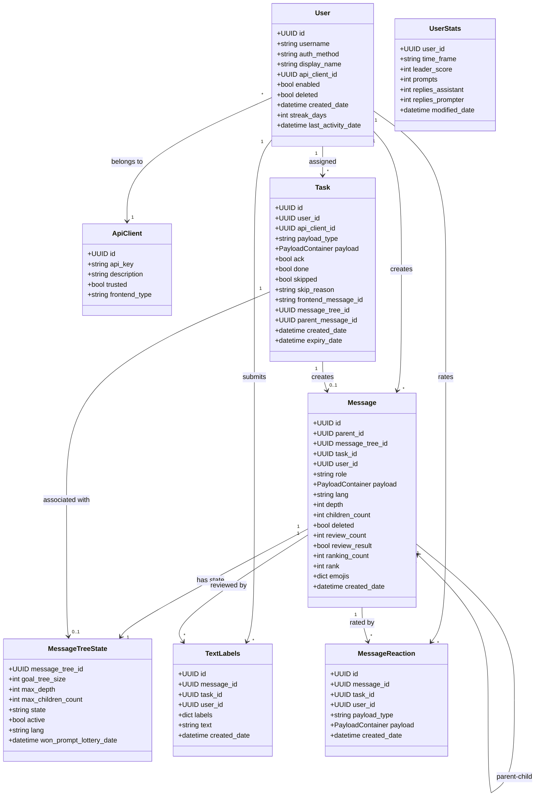
```mermaid
classDiagram
    class User {
        +UUID id
        +string username
        +string auth_method
        +string display_name
        +UUID api_client_id
        +bool enabled
        +bool deleted
        +datetime created_date
        +int streak_days
        +datetime last_activity_date
    }
    
    class ApiClient {
        +UUID id
        +string api_key
        +string description
        +bool trusted
        +string frontend_type
    }
    
    class Message {
        +UUID id
        +UUID parent_id
        +UUID message_tree_id
        +UUID task_id
        +UUID user_id
        +string role
        +PayloadContainer payload
        +string lang
        +int depth
        +int children_count
        +bool deleted
        +int review_count
        +bool review_result
        +int ranking_count
        +int rank
        +dict emojis
        +datetime created_date
    }
    
    class MessageTreeState {
        +UUID message_tree_id
        +int goal_tree_size
        +int max_depth
        +int max_children_count
        +string state
        +bool active
        +string lang
        +datetime won_prompt_lottery_date
    }
    
    class Task {
        +UUID id
        +UUID user_id
        +UUID api_client_id
        +string payload_type
        +PayloadContainer payload
        +bool ack
        +bool done
        +bool skipped
        +string skip_reason
        +string frontend_message_id
        +UUID message_tree_id
        +UUID parent_message_id
        +datetime created_date
        +datetime expiry_date
    }
    
    class TextLabels {
        +UUID id
        +UUID message_id
        +UUID task_id
        +UUID user_id
        +dict labels
        +string text
        +datetime created_date
    }
    
    class MessageReaction {
        +UUID id
        +UUID message_id
        +UUID task_id
        +UUID user_id
        +string payload_type
        +PayloadContainer payload
        +datetime created_date
    }
    
    class UserStats {
        +UUID user_id
        +string time_frame
        +int leader_score
        +int prompts
        +int replies_assistant
        +int replies_prompter
        +datetime modified_date
    }
    
    User "1" --> "*" Message : creates
    User "1" --> "*" Task : assigned
    User "1" --> "*" TextLabels : submits
    User "1" --> "*" MessageReaction : rates
    User "*" --> "1" ApiClient : belongs to
    
    Message "1" --> "*" Message : parent-child
    Message "1" --> "1" MessageTreeState : has state
    Message "1" --> "*" TextLabels : reviewed by
    Message "1" --> "*" MessageReaction : rated by
    
    Task "1" --> "0..1" Message : creates
    Task "1" --> "0..1" MessageTreeState : associated with
```

### 1.2 实体关系说明

**核心关系：**

1. **User ↔ ApiClient**：多对一，用户归属于特定 API Client
2. **Message ↔ Message**：自关联，父子关系构成树结构
3. **Message ↔ MessageTreeState**：一对一，每棵树有唯一状态记录
4. **Message ↔ TextLabels**：一对多，消息可被多次评审
5. **Message ↔ MessageReaction**：一对多，消息可被多次排名
6. **Task ↔ Message**：一对一（可选），任务完成后创建消息
7. **User ↔ UserStats**：一对多，按时间窗口统计

---

## 2. 核心数据模型详解

### 2.1 User（用户）

#### 表结构

```python
class User(SQLModel, table=True):
    __tablename__ = "user"
    __table_args__ = (
        Index("ix_user_username", "api_client_id", "username", "auth_method", unique=True),
        Index("ix_user_display_name_id", "display_name", "id", unique=True),
    )
    
    id: UUID
    username: str
    auth_method: str
    display_name: str
    created_date: datetime
    api_client_id: UUID
    enabled: bool
    notes: str
    deleted: bool
    show_on_leaderboard: bool
    streak_last_day_date: datetime
    streak_days: int
    last_activity_date: datetime
    tos_acceptance_date: datetime
```

#### 字段说明

| 字段 | 类型 | 约束 | 默认值 | 说明 |
|---|---|---|---|---|
| id | UUID | PRIMARY KEY | gen_random_uuid() | 用户唯一标识符 |
| username | str(128) | NOT NULL | - | 用户名（由认证提供方决定） |
| auth_method | str(128) | NOT NULL | "local" | 认证方式：discord/google/local/system |
| display_name | str(256) | NOT NULL, UNIQUE | - | 显示名称（用于排行榜） |
| created_date | datetime | NOT NULL | current_timestamp | 注册时间 |
| api_client_id | UUID | FOREIGN KEY | - | 所属 API Client |
| enabled | bool | NOT NULL | TRUE | 是否启用（禁用后无法获取任务） |
| notes | str(1024) | NOT NULL | "" | 管理员备注 |
| deleted | bool | NOT NULL | FALSE | 是否删除（软删除） |
| show_on_leaderboard | bool | NOT NULL | TRUE | 是否显示在排行榜 |
| streak_last_day_date | datetime | NULLABLE | current_timestamp | 连续贡献最后一天日期 |
| streak_days | int | NULLABLE | NULL | 连续贡献天数 |
| last_activity_date | datetime | NULLABLE | current_timestamp | 最后活跃时间 |
| tos_acceptance_date | datetime | NULLABLE | NULL | 服务条款接受时间 |

#### 索引与约束

**唯一约束：**
- `(api_client_id, username, auth_method)` - 确保同一 API Client 下用户名唯一
- `(display_name, id)` - 确保显示名称唯一（用于排行榜展示）

**外键约束：**
- `api_client_id` → `api_client.id`

#### 映射规则

**DTO ↔ 数据库模型：**

```python
# 转换为协议对象
def to_protocol_frontend_user(self) -> protocol.FrontEndUser:
    return protocol.FrontEndUser(
        id=self.username,
        display_name=self.display_name,
        auth_method=self.auth_method,
        user_id=self.id,
        enabled=self.enabled,
        deleted=self.deleted,
        notes=self.notes,
        created_date=self.created_date,
        show_on_leaderboard=self.show_on_leaderboard,
        streak_days=self.streak_days,
        streak_last_day_date=self.streak_last_day_date,
        last_activity_date=self.last_activity_date,
        tos_acceptance_date=self.tos_acceptance_date,
    )
```

#### 版本演进

**历史变更：**
- v1.0：基础用户模型
- v1.1：添加 `streak_days` 和连续贡献统计
- v1.2：添加 `deleted` 字段（软删除）
- v1.3：添加 `tos_acceptance_date`（服务条款）

**兼容性考虑：**
- 新增字段使用默认值，向后兼容
- 删除用户使用软删除，不破坏外键关系

---

### 2.2 Message（消息）

#### 表结构

```python
class Message(SQLModel, table=True):
    __tablename__ = "message"
    __table_args__ = (
        Index("ix_message_frontend_message_id", "api_client_id", "frontend_message_id", unique=True),
        Index("idx_search_vector", "search_vector", postgresql_using="gin"),
    )
    
    id: UUID
    parent_id: Optional[UUID]
    message_tree_id: UUID
    task_id: Optional[UUID]
    user_id: Optional[UUID]
    role: str  # "prompter" or "assistant"
    api_client_id: UUID
    frontend_message_id: str
    created_date: datetime
    payload_type: str
    payload: PayloadContainer  # JSONB
    lang: str
    depth: int
    children_count: int
    deleted: bool
    search_vector: TSVECTOR  # 全文索引
    review_count: int
    review_result: Optional[bool]
    ranking_count: int
    rank: Optional[int]
    synthetic: bool
    edited: bool
    model_name: Optional[str]
    emojis: dict[str, int]  # JSONB
```

#### 字段说明

| 字段 | 类型 | 约束 | 默认值 | 说明 |
|---|---|---|---|---|
| id | UUID | PRIMARY KEY | gen_random_uuid() | 消息唯一标识符 |
| parent_id | UUID | NULLABLE | NULL | 父消息 ID（根消息为 NULL） |
| message_tree_id | UUID | NOT NULL, INDEX | - | 所属消息树 ID（根消息 ID） |
| task_id | UUID | NULLABLE, INDEX | NULL | 关联任务 ID |
| user_id | UUID | FOREIGN KEY, INDEX | NULL | 创建用户 ID（合成消息为 NULL） |
| role | str(128) | NOT NULL | - | 角色：prompter（用户）/ assistant（助手） |
| api_client_id | UUID | FOREIGN KEY | - | 所属 API Client |
| frontend_message_id | str(200) | NOT NULL | - | 前端生成的消息 ID（幂等键） |
| created_date | datetime | NOT NULL, INDEX | current_timestamp | 创建时间 |
| payload_type | str(200) | NOT NULL | - | Payload 类型标识 |
| payload | JSONB | NULLABLE | NULL | 消息内容（包含 text 等字段） |
| lang | str(32) | NOT NULL | "en" | 语言代码（BCP 47） |
| depth | int | NOT NULL | 0 | 树深度（根消息为 0） |
| children_count | int | NOT NULL | 0 | 子消息数量 |
| deleted | bool | NOT NULL | FALSE | 是否删除 |
| search_vector | TSVECTOR | NULLABLE | NULL | 全文索引向量（自动生成） |
| review_count | int | NOT NULL | 0 | 评审次数 |
| review_result | bool | NULLABLE | NULL | 评审结果（TRUE=通过，FALSE=拒绝） |
| ranking_count | int | NOT NULL | 0 | 参与排名次数 |
| rank | int | NULLABLE | NULL | 排名分数（计算后填充） |
| synthetic | bool | NOT NULL | FALSE | 是否为合成消息（非人工编写） |
| edited | bool | NOT NULL | FALSE | 是否经过编辑 |
| model_name | str(1024) | NULLABLE | NULL | 生成模型名称（合成消息） |
| emojis | JSONB | NOT NULL | {} | Emoji 统计（{"+1": 5, "red_flag": 2}） |

#### Payload 结构

**MessagePayload（文本消息）：**

```python
class MessagePayload(BaseModel):
    text: str  # 消息文本内容
```

#### 索引与约束

**唯一约束：**
- `(api_client_id, frontend_message_id)` - 防止重复提交

**复合索引：**
- `(message_tree_id)` - 树查询
- `(user_id)` - 用户消息查询
- `(created_date)` - 时间范围查询
- `(task_id)` - 任务关联查询

**GIN 索引：**
- `(search_vector)` - 全文搜索（使用 PostgreSQL tsvector）

#### 树结构维护

**插入新消息：**

```sql
-- 1. 插入消息
INSERT INTO message (id, parent_id, message_tree_id, depth, ...)
VALUES (?, ?, ?, parent.depth + 1, ...);

-- 2. 更新父消息的子节点计数
UPDATE message SET children_count = children_count + 1 WHERE id = ?;
```

**计算深度：**
- 深度从 0 开始（根消息）
- 子消息深度 = 父消息深度 + 1
- 通过递归 CTE 可查询整条路径

---

### 2.3 MessageTreeState（消息树状态）

#### 表结构

```python
class MessageTreeState(SQLModel, table=True):
    __tablename__ = "message_tree_state"
    __table_args__ = (
        Index("ix_message_tree_state__lang__state", "state", "lang"),
    )
    
    message_tree_id: UUID  # PRIMARY KEY
    goal_tree_size: int
    max_depth: int
    max_children_count: int
    state: str
    active: bool
    origin: str
    won_prompt_lottery_date: Optional[datetime]
    lang: str
```

#### 字段说明

| 字段 | 类型 | 约束 | 说明 |
|---|---|---|---|
| message_tree_id | UUID | PRIMARY KEY, FOREIGN KEY | 对应根消息 ID |
| goal_tree_size | int | NOT NULL | 目标树大小（消息数） |
| max_depth | int | NOT NULL | 最大深度 |
| max_children_count | int | NOT NULL | 每节点最大子节点数 |
| state | str(128) | NOT NULL | 状态机状态（见枚举） |
| active | bool | NOT NULL, INDEX | 是否活跃（影响任务分配） |
| origin | str(1024) | NULLABLE | 来源标识（导入数据等） |
| won_prompt_lottery_date | datetime | NULLABLE | 抽签胜出时间 |
| lang | str(32) | NOT NULL | 语言代码 |

#### 状态枚举

```python
class State(str, Enum):
    INITIAL_PROMPT_REVIEW = "initial_prompt_review"  # 初始提示评审中
    PROMPT_LOTTERY_WAITING = "prompt_lottery_waiting"  # 提示抽签等待
    GROWING = "growing"  # 树生长中
    RANKING = "ranking"  # 排名中
    BACKLOG_RANKING = "backlog_ranking"  # 排名积压
    READY_FOR_SCORING = "ready_for_scoring"  # 准备计分
    SCORING_FAILED = "scoring_failed"  # 计分失败
    READY_FOR_EXPORT = "ready_for_export"  # 准备导出
    ABORTED_LOW_GRADE = "aborted_low_grade"  # 低质量中止
    HALTED_BY_MODERATOR = "halted_by_moderator"  # 人工暂停
```

#### 状态转换规则

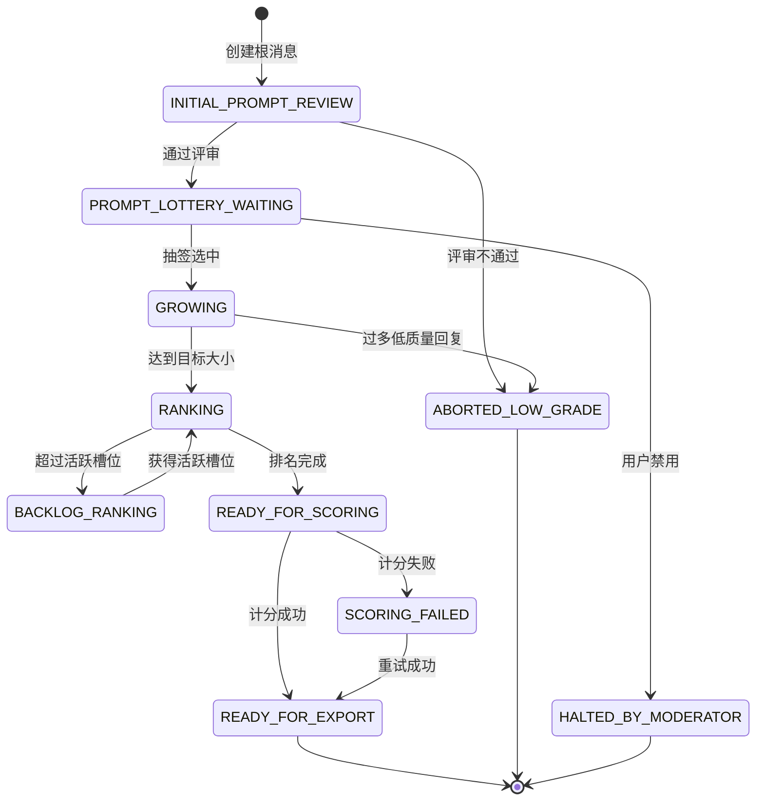
```mermaid
stateDiagram-v2
    [*] --> INITIAL_PROMPT_REVIEW: 创建根消息
    
    INITIAL_PROMPT_REVIEW --> PROMPT_LOTTERY_WAITING: 通过评审
    INITIAL_PROMPT_REVIEW --> ABORTED_LOW_GRADE: 评审不通过
    
    PROMPT_LOTTERY_WAITING --> GROWING: 抽签选中
    PROMPT_LOTTERY_WAITING --> HALTED_BY_MODERATOR: 用户禁用
    
    GROWING --> RANKING: 达到目标大小
    GROWING --> ABORTED_LOW_GRADE: 过多低质量回复
    
    RANKING --> BACKLOG_RANKING: 超过活跃槽位
    RANKING --> READY_FOR_SCORING: 排名完成
    
    BACKLOG_RANKING --> RANKING: 获得活跃槽位
    
    READY_FOR_SCORING --> READY_FOR_EXPORT: 计分成功
    READY_FOR_SCORING --> SCORING_FAILED: 计分失败
    
    SCORING_FAILED --> READY_FOR_EXPORT: 重试成功
    
    READY_FOR_EXPORT --> [*]
    ABORTED_LOW_GRADE --> [*]
    HALTED_BY_MODERATOR --> [*]
```

---

### 2.4 Task（任务）

#### 表结构

```python
class Task(SQLModel, table=True):
    __tablename__ = "task"
    
    id: UUID
    created_date: datetime
    expiry_date: Optional[datetime]
    user_id: Optional[UUID]
    payload_type: str
    payload: PayloadContainer  # JSONB
    api_client_id: UUID
    ack: Optional[bool]
    done: bool
    skipped: bool
    skip_reason: Optional[str]
    frontend_message_id: Optional[str]
    message_tree_id: Optional[UUID]
    parent_message_id: Optional[UUID]
    collective: bool
```

#### 字段说明

| 字段 | 类型 | 约束 | 默认值 | 说明 |
|---|---|---|---|---|
| id | UUID | PRIMARY KEY | gen_random_uuid() | 任务唯一标识符 |
| created_date | datetime | NOT NULL, INDEX | current_timestamp | 创建时间 |
| expiry_date | datetime | NULLABLE | NULL | 过期时间（48 小时后） |
| user_id | UUID | FOREIGN KEY, INDEX | NULL | 分配用户 ID |
| payload_type | str(200) | NOT NULL | - | Payload 类型标识 |
| payload | JSONB | NOT NULL | - | 任务内容（包含任务类型相关数据） |
| api_client_id | UUID | FOREIGN KEY | - | 所属 API Client |
| ack | bool | NULLABLE | NULL | 是否已确认（调用 /ack） |
| done | bool | NOT NULL | FALSE | 是否已完成 |
| skipped | bool | NOT NULL | FALSE | 是否已跳过 |
| skip_reason | str(512) | NULLABLE | NULL | 跳过原因 |
| frontend_message_id | str | NULLABLE | NULL | 绑定的前端消息 ID |
| message_tree_id | UUID | NULLABLE | NULL | 关联消息树 ID |
| parent_message_id | UUID | NULLABLE | NULL | 父消息 ID（回复任务） |
| collective | bool | NOT NULL | FALSE | 是否为集体任务 |

#### 生命周期

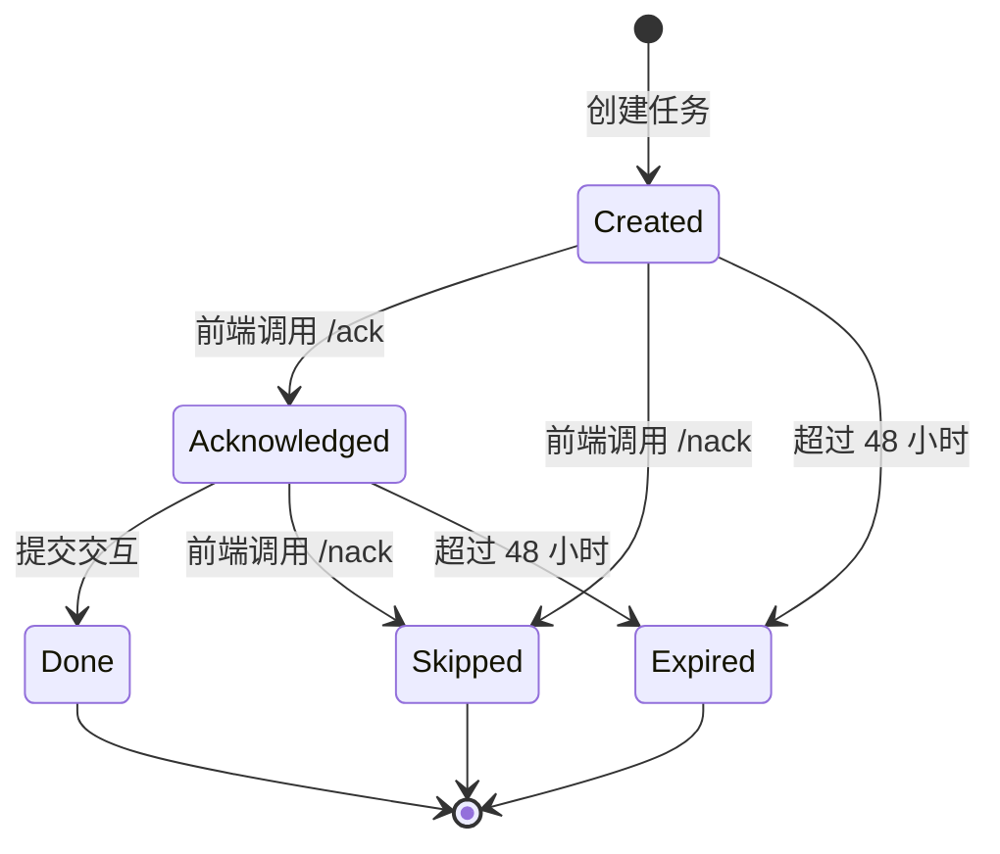
```mermaid
stateDiagram-v2
    [*] --> Created: 创建任务
    Created --> Acknowledged: 前端调用 /ack
    Acknowledged --> Done: 提交交互
    Created --> Skipped: 前端调用 /nack
    Acknowledged --> Skipped: 前端调用 /nack
    Created --> Expired: 超过 48 小时
    Acknowledged --> Expired: 超过 48 小时
    Done --> [*]
    Skipped --> [*]
    Expired --> [*]
```

---

### 2.5 TextLabels（文本标签）

#### 表结构

```python
class TextLabels(SQLModel, table=True):
    __tablename__ = "text_labels"
    
    id: UUID
    message_id: UUID
    task_id: Optional[UUID]
    user_id: Optional[UUID]
    api_client_id: UUID
    labels: dict[str, float]  # JSONB
    text: Optional[str]
    created_date: datetime
```

#### 字段说明

| 字段 | 类型 | 约束 | 说明 |
|---|---|---|---|
| id | UUID | PRIMARY KEY | 标签记录唯一标识符 |
| message_id | UUID | FOREIGN KEY, INDEX | 被评审的消息 ID |
| task_id | UUID | FOREIGN KEY, INDEX | 关联任务 ID |
| user_id | UUID | FOREIGN KEY | 评审用户 ID |
| api_client_id | UUID | FOREIGN KEY | 所属 API Client |
| labels | JSONB | NOT NULL | 标签字典（{label_name: score}） |
| text | str | NULLABLE | 附加评论 |
| created_date | datetime | NOT NULL | 创建时间 |

#### 标签类型

**常见标签：**

```python
class TextLabel(str, Enum):
    spam = "spam"
    lang_mismatch = "lang_mismatch"
    quality = "quality"
    toxicity = "toxicity"
    violence = "violence"
    not_appropriate = "not_appropriate"
    pii = "pii"
    hate_speech = "hate_speech"
    sexual_content = "sexual_content"
    # 省略：更多标签
```

**标签值含义：**
- 0.0 - 否定（如 spam: 0.0 表示不是垃圾）
- 1.0 - 肯定（如 quality: 1.0 表示高质量）
- 中间值 - 程度（如 toxicity: 0.5 表示轻微毒性）

---

### 2.6 MessageReaction（消息反应/排名）

#### 表结构

```python
class MessageReaction(SQLModel, table=True):
    __tablename__ = "message_reaction"
    
    id: UUID
    message_id: UUID
    task_id: Optional[UUID]
    user_id: Optional[UUID]
    api_client_id: UUID
    payload_type: str
    payload: PayloadContainer  # JSONB
    created_date: datetime
```

#### Payload 结构

**RankingReactionPayload（排名）：**

```python
class RankingReactionPayload(BaseModel):
    ranking: list[int]  # 消息索引的排序（0 表示最佳）
    ranking_parent_id: UUID  # 父消息 ID
    message_tree_id: UUID  # 树 ID
    not_rankable: bool = False  # 是否无法排名
```

---

## 3. 数据完整性保证

### 3.1 外键约束

```sql
-- 用户归属
ALTER TABLE "user" ADD FOREIGN KEY (api_client_id) REFERENCES api_client(id);

-- 消息关联
ALTER TABLE message ADD FOREIGN KEY (parent_id) REFERENCES message(id);
ALTER TABLE message ADD FOREIGN KEY (user_id) REFERENCES "user"(id);
ALTER TABLE message ADD FOREIGN KEY (api_client_id) REFERENCES api_client(id);

-- 树状态关联
ALTER TABLE message_tree_state ADD FOREIGN KEY (message_tree_id) REFERENCES message(id);

-- 任务关联
ALTER TABLE task ADD FOREIGN KEY (user_id) REFERENCES "user"(id);
ALTER TABLE task ADD FOREIGN KEY (api_client_id) REFERENCES api_client(id);

-- 标签关联
ALTER TABLE text_labels ADD FOREIGN KEY (message_id) REFERENCES message(id);
ALTER TABLE text_labels ADD FOREIGN KEY (user_id) REFERENCES "user"(id);

-- 反应关联
ALTER TABLE message_reaction ADD FOREIGN KEY (message_id) REFERENCES message(id);
ALTER TABLE message_reaction ADD FOREIGN KEY (user_id) REFERENCES "user"(id);
```

### 3.2 Check 约束

```sql
-- 消息角色约束
ALTER TABLE message ADD CONSTRAINT check_message_role 
  CHECK (role IN ('prompter', 'assistant'));

-- 消息深度约束
ALTER TABLE message ADD CONSTRAINT check_message_depth 
  CHECK (depth >= 0 AND depth <= 100);

-- 子节点计数约束
ALTER TABLE message ADD CONSTRAINT check_children_count 
  CHECK (children_count >= 0);
```

### 3.3 触发器

**更新全文索引向量：**

```sql
CREATE TRIGGER message_search_vector_update
BEFORE INSERT OR UPDATE ON message
FOR EACH ROW EXECUTE FUNCTION 
  tsvector_update_trigger(
    search_vector, 'pg_catalog.english', 
    payload
  );
```

---

## 4. 序列化与反序列化

### 4.1 Pydantic 模型转换

**ORM → Protocol（API 响应）：**

```python
# backend/oasst_backend/api/v1/utils.py
def prepare_message(message: Message) -> protocol.Message:
    return protocol.Message(
        id=message.id,
        parent_id=message.parent_id,
        message_tree_id=message.message_tree_id,
        user_id=message.user_id,
        frontend_message_id=message.frontend_message_id,
        text=message.payload.payload.text if message.payload else None,
        lang=message.lang,
        is_assistant=message.role == "assistant",
        created_date=message.created_date,
        review_result=message.review_result,
        review_count=message.review_count,
        ranking_count=message.ranking_count,
        rank=message.rank,
        deleted=message.deleted,
        edited=message.edited,
        model_name=message.model_name,
        emojis=message.emojis or {},
        user_emojis=message._user_emojis,
        user_is_author=message._user_is_author,
        synthetic=message.synthetic,
        user=None,  # 按需加载
    )
```

### 4.2 JSONB 序列化

**PayloadContainer：**

```python
# backend/oasst_backend/models/payload_column_type.py
class PayloadContainer(BaseModel):
    payload_type: str
    payload: Union[MessagePayload, TaskPayload, ...]
    
    class Config:
        json_encoders = {
            datetime: lambda v: v.isoformat(),
            UUID: lambda v: str(v),
        }
```

**存储示例：**

```json
{
  "payload_type": "MessagePayload",
  "payload": {
    "text": "如何学习 Python？"
  }
}
```

---

## 5. 性能优化策略

### 5.1 索引选择

**查询模式分析：**

| 查询类型 | 索引 | 理由 |
|---|---|---|
| 按树查询消息 | message(message_tree_id) | 高频查询，选择性好 |
| 按时间范围查询 | message(created_date) | 时间范围查询，B-tree 索引高效 |
| 全文搜索 | message(search_vector) GIN | 全文索引，支持 tsvector 查询 |
| 幂等性检查 | message(api_client_id, frontend_message_id) | 唯一索引，插入时自动检查 |
| 任务分配 | message_tree_state(state, lang) | 状态机查询，复合索引减少扫描 |

### 5.2 分区策略

**时间分区（未来考虑）：**

```sql
-- 按月分区消息表
CREATE TABLE message_2023_10 PARTITION OF message
  FOR VALUES FROM ('2023-10-01') TO ('2023-11-01');
```

### 5.3 缓存策略

**应用层缓存：**
- 活跃树列表：Redis 缓存 60 秒
- 排行榜：数据库表缓存（CachedStats），15 分钟更新

---

## 6. 版本演进与迁移

### 6.1 Alembic 迁移

**迁移脚本示例：**

```python
# alembic/versions/xxx_add_streak_days.py
def upgrade():
    op.add_column('user', sa.Column('streak_days', sa.Integer(), nullable=True))
    op.add_column('user', sa.Column('streak_last_day_date', sa.DateTime(timezone=True), nullable=True))

def downgrade():
    op.drop_column('user', 'streak_last_day_date')
    op.drop_column('user', 'streak_days')
```

### 6.2 向后兼容

**原则：**
- 新增字段使用默认值
- 删除字段前先停止使用（多版本共存）
- 修改字段类型使用中间表

---

**下一步：**
- 阅读 `Open-Assistant-01-Backend-时序图.md` 查看业务流程时序图
- 查看 Alembic 迁移脚本了解数据库演进历史

---

本文档详细描述 Backend 模块的所有对外 API，包括请求/响应结构、字段说明、入口函数、调用链和时序图。

## API 路由概览

| 路由前缀 | 功能模块 | 说明 |
|---|---|---|
| `/api/v1/tasks` | 任务管理 | 任务请求、确认、提交、关闭 |
| `/api/v1/messages` | 消息查询 | 按 ID 查询消息、树、对话 |
| `/api/v1/frontend_messages` | 前端消息查询 | 按 frontend_message_id 查询 |
| `/api/v1/text_labels` | 文本标签 | 提交评审标签 |
| `/api/v1/users` | 用户管理 | 查询用户、用户消息 |
| `/api/v1/frontend_users` | 前端用户管理 | 创建用户、查询用户 |
| `/api/v1/stats` | 统计信息 | 系统统计、树管理器统计 |
| `/api/v1/leaderboards` | 排行榜 | 查询和更新排行榜 |
| `/api/v1/trollboards` | 负面排行榜 | 查询低质量贡献者 |
| `/api/v1/hf` | HuggingFace 集成 | Toxicity 检测 API |
| `/api/v1/admin` | 管理接口 | 创建 API Client、用户管理 |
| `/api/v1/auth` | 认证 | 刷新 Token |

---

## 1. 任务管理 API (/api/v1/tasks)

### 1.1 请求任务

#### 基本信息
- **名称**：`request_task`
- **协议/方法**：HTTP POST `/api/v1/tasks`
- **幂等性**：否（每次返回新任务）

#### 请求结构体

```python
class TaskRequest(BaseModel):
    type: TaskRequestType = TaskRequestType.random
    user: Optional[User] = None
    collective: bool = False
    lang: Optional[str] = None  # BCP 47 语言代码
```

**字段表**

| 字段 | 类型 | 必填 | 默认值 | 约束 | 说明 |
|---|---|---:|---|---|---|
| type | TaskRequestType | 否 | random | 枚举值 | 期望的任务类型（random 表示自动分配） |
| user | User | 是 | - | - | 用户身份信息 |
| collective | bool | 否 | False | - | 是否为集体任务（可被多人完成） |
| lang | str | 否 | None | BCP 47 | 语言偏好 |

**User 子结构**

| 字段 | 类型 | 必填 | 约束 | 说明 |
|---|---|---:|---|---|
| id | str | 是 | 唯一 | 用户 ID |
| display_name | str | 是 | 最长 256 | 显示名称 |
| auth_method | str | 是 | discord/google/local/system | 认证方式 |

#### 响应结构体

返回类型为 `AnyTask`（联合类型），可能的具体类型：

```python
# 初始提示任务
class InitialPromptTask(Task):
    type: Literal["initial_prompt"] = "initial_prompt"
    hint: str  # 提示语

# 助手回复任务
class AssistantReplyTask(Task):
    type: Literal["assistant_reply"] = "assistant_reply"
    conversation: Conversation  # 对话上下文

# 提示者回复任务
class PrompterReplyTask(Task):
    type: Literal["prompter_reply"] = "prompter_reply"
    conversation: Conversation

# 排名任务
class RankingTask(Task):
    type: Literal["rank_*"] = "rank_assistant_replies"
    message_tree_id: UUID
    parent_id: UUID
    replies: list[Message]  # 需要排序的消息列表

# 标签任务
class LabelingTask(Task):
    type: Literal["label_*"] = "label_assistant_reply"
    message: Message
    valid_labels: list[str]
    mandatory_labels: list[str]
```

**字段表（通用字段）**

| 字段 | 类型 | 必填 | 说明 |
|---|---|---:|---|
| id | UUID | 是 | 任务唯一标识符 |
| type | str | 是 | 任务类型 |
| hint | str | 否 | 任务提示（仅初始提示任务） |
| conversation | Conversation | 否 | 对话历史（回复类任务） |
| replies | list[Message] | 否 | 待排序的回复（排名任务） |

#### 入口函数与核心代码

```python
# backend/oasst_backend/api/v1/tasks.py
@router.post("/", response_model=protocol_schema.AnyTask, dependencies=[...])
def request_task(
    *,
    db: Session = Depends(deps.get_db),
    api_key: APIKey = Depends(deps.get_api_key),
    request: protocol_schema.TaskRequest,
) -> Any:
    # 1. API Key 鉴权
    api_client = deps.api_auth(api_key, db)
    
    try:
        # 2. 初始化仓库，检查用户是否启用
        pr = PromptRepository(db, api_client, client_user=request.user)
        pr.ensure_user_is_enabled()
        
        # 3. 调用 TreeManager 生成任务
        tm = TreeManager(db, pr)
        task, message_tree_id, parent_message_id = tm.next_task(
            desired_task_type=request.type,
            lang=request.lang
        )
        
        # 4. 持久化任务
        pr.task_repository.store_task(
            task, 
            message_tree_id, 
            parent_message_id, 
            request.collective
        )
        
    except OasstError:
        raise
    except Exception:
        # 省略：记录异常日志
        raise OasstError("Failed to generate task.", OasstErrorCode.TASK_GENERATION_FAILED)
    
    return task
```

#### 调用链核心代码

```python
# backend/oasst_backend/tree_manager.py: TreeManager.next_task()
def next_task(
    self,
    desired_task_type: Optional[protocol_schema.TaskRequestType] = None,
    lang: Optional[str] = "en",
) -> Tuple[protocol_schema.Task, Optional[UUID], Optional[UUID]]:
    # 1. 排除用户最近完成的任务
    excluded_tree_ids, excluded_message_ids = self._get_users_recent_tasks(
        span_sec=self.cfg.recent_tasks_span_sec
    )
    
    # 2. 检查用户待处理任务数量限制
    pending_task_count = self._count_pending_user_tasks()
    if pending_task_count >= self.cfg.max_pending_tasks_per_user:
        raise OasstError("Too many pending tasks", OasstErrorCode.USER_TASK_LIMIT_EXCEEDED)
    
    # 3. 统计各类型任务可用数量
    num_ranking_tasks = self._query_num_incomplete_rankings(lang, excluded_tree_ids)
    num_replies_need_review = self._query_num_replies_need_review(lang, excluded_tree_ids)
    num_prompts_need_review = self._query_num_prompts_need_review(lang, excluded_tree_ids)
    num_missing_replies, extendible_parents = self._query_extendible_parents(
        lang, excluded_tree_ids, excluded_message_ids
    )
    num_missing_prompts = self._query_num_missing_prompts(lang)
    
    # 4. 基于权重随机选择任务类型
    task_type = self._random_task_selection(
        num_ranking_tasks, num_replies_need_review, num_prompts_need_review,
        num_missing_prompts, num_missing_replies
    )
    
    # 5. 生成具体任务对象
    if task_type == TaskType.RANKING:
        return self._generate_ranking_task(lang, excluded_tree_ids)
    elif task_type == TaskType.REPLY:
        return self._generate_reply_task(lang, extendible_parents, excluded_message_ids)
    # 省略：其他任务类型
```

#### 时序图

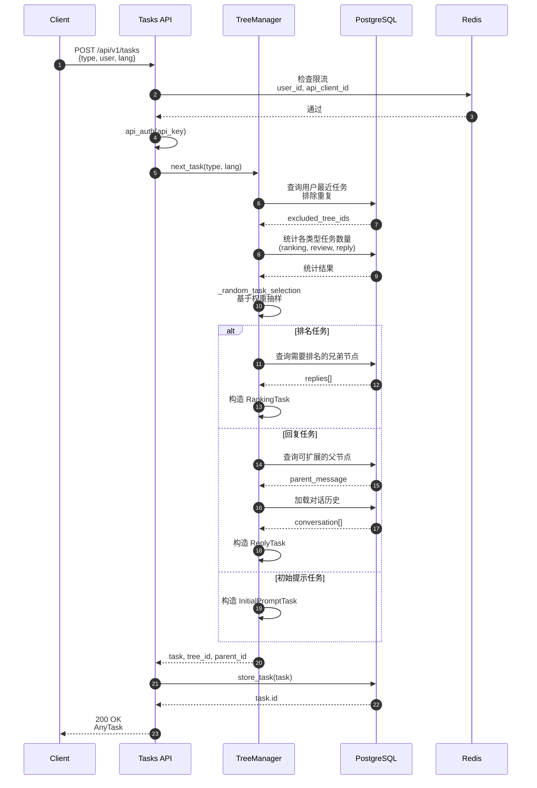
```mermaid
sequenceDiagram
    autonumber
    participant C as Client
    participant API as Tasks API
    participant TM as TreeManager
    participant DB as PostgreSQL
    participant Redis as Redis
    
    C->>API: POST /api/v1/tasks<br/>{type, user, lang}
    API->>Redis: 检查限流<br/>user_id, api_client_id
    Redis-->>API: 通过
    API->>API: api_auth(api_key)
    API->>TM: next_task(type, lang)
    
    TM->>DB: 查询用户最近任务<br/>排除重复
    DB-->>TM: excluded_tree_ids
    
    TM->>DB: 统计各类型任务数量<br/>(ranking, review, reply)
    DB-->>TM: 统计结果
    
    TM->>TM: _random_task_selection<br/>基于权重抽样
    
    alt 排名任务
        TM->>DB: 查询需要排名的兄弟节点
        DB-->>TM: replies[]
        TM->>TM: 构造 RankingTask
    else 回复任务
        TM->>DB: 查询可扩展的父节点
        DB-->>TM: parent_message
        TM->>DB: 加载对话历史
        DB-->>TM: conversation[]
        TM->>TM: 构造 ReplyTask
    else 初始提示任务
        TM->>TM: 构造 InitialPromptTask
    end
    
    TM-->>API: task, tree_id, parent_id
    API->>DB: store_task(task)
    DB-->>API: task.id
    API-->>C: 200 OK<br/>AnyTask
```

#### 异常与回退

**错误码：**

| 错误码 | HTTP 状态 | 说明 | 补偿策略 |
|---|---|---|---|
| `USER_NOT_ENABLED` | 403 | 用户被禁用 | 联系管理员 |
| `USER_TASK_LIMIT_EXCEEDED` | 429 | 待处理任务过多 | 完成现有任务后重试 |
| `NO_TASKS_AVAILABLE` | 404 | 暂无可用任务 | 等待 1-5 分钟后重试 |
| `TOO_MANY_REQUESTS` | 429 | 超过限流阈值 | 等待限流窗口过期 |
| `TASK_GENERATION_FAILED` | 500 | 任务生成失败 | 记录日志，重试 |

**重试建议：**
- 429 错误：从响应头 `Retry-After` 获取等待时间
- 404 错误：指数退避（1s, 2s, 4s, ...，最大 5 分钟）
- 500 错误：立即重试一次，失败则等待 10 秒

#### 性能要点

- **缓存**：活跃树列表缓存 Redis（TTL 60s）
- **索引优化**：
  - `message_tree_state(state, lang)` - 复合索引
  - `message(created_date)` - 时间范围查询
  - `task(user_id, created_date)` - 用户任务查询
- **限流点**：
  - 用户级：30 次 / 4 分钟
  - API 级：10000 次 / 1 分钟
  - 任务类型级：assistant_reply 4 次 / 2 分钟

---

### 1.2 确认任务

#### 基本信息
- **名称**：`tasks_acknowledge`
- **协议/方法**：HTTP POST `/api/v1/tasks/{task_id}/ack`
- **幂等性**：是（相同 message_id 重复调用无副作用）

#### 请求结构体

```python
class TaskAck(BaseModel):
    message_id: str  # 前端生成的消息 ID
```

**字段表**

| 字段 | 类型 | 必填 | 约束 | 说明 |
|---|---|---:|---|---|
| message_id | str | 是 | 最长 200 字符 | 前端生成的唯一标识符，用于幂等性控制 |

#### 响应结构体

- HTTP 204 No Content（无响应体）

#### 入口函数与核心代码

```python
# backend/oasst_backend/api/v1/tasks.py
@router.post("/{task_id}/ack", response_model=None, status_code=HTTP_204_NO_CONTENT)
def tasks_acknowledge(
    *,
    db: Session = Depends(deps.get_db),
    api_key: APIKey = Depends(deps.get_api_key),
    frontend_user: deps.FrontendUserId = Depends(deps.get_frontend_user_id),
    task_id: UUID,
    ack_request: protocol_schema.TaskAck,
) -> None:
    api_client = deps.api_auth(api_key, db)
    
    try:
        pr = PromptRepository(db, api_client, frontend_user=frontend_user)
        
        # 绑定前端消息 ID 到任务
        # （用于后续提交时关联）
        pr.task_repository.bind_frontend_message_id(
            task_id=task_id,
            frontend_message_id=ack_request.message_id
        )
        
    except OasstError:
        raise
    except Exception:
        # 省略：记录异常日志
        raise OasstError("Failed to acknowledge task.", OasstErrorCode.TASK_ACK_FAILED)
```

#### 调用链核心代码

```python
# backend/oasst_backend/task_repository.py
def bind_frontend_message_id(self, task_id: UUID, frontend_message_id: str):
    # 更新任务记录
    task = self.fetch_task(task_id, fail_if_missing=True)
    task.frontend_message_id = frontend_message_id
    task.ack = True
    self.db.add(task)
    self.db.commit()
```

#### 时序图

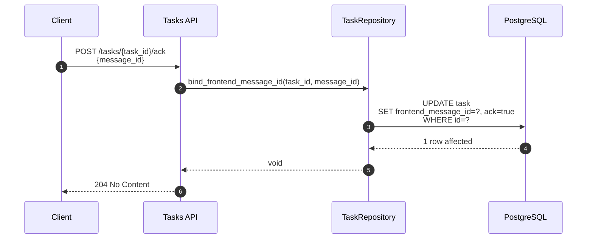
```mermaid
sequenceDiagram
    autonumber
    participant C as Client
    participant API as Tasks API
    participant TaskRepo as TaskRepository
    participant DB as PostgreSQL
    
    C->>API: POST /tasks/{task_id}/ack<br/>{message_id}
    API->>TaskRepo: bind_frontend_message_id(task_id, message_id)
    TaskRepo->>DB: UPDATE task<br/>SET frontend_message_id=?, ack=true<br/>WHERE id=?
    DB-->>TaskRepo: 1 row affected
    TaskRepo-->>API: void
    API-->>C: 204 No Content
```

---

### 1.3 提交交互

#### 基本信息
- **名称**：`tasks_interaction`
- **协议/方法**：HTTP POST `/api/v1/tasks/interaction`
- **幂等性**：是（通过 frontend_message_id 去重）

#### 请求结构体

**联合类型** `AnyInteraction`，可能的具体类型：

```python
# 文本回复
class TextReplyToMessage(BaseModel):
    type: Literal["text_reply_to_message"] = "text_reply_to_message"
    user: User
    message_id: str  # frontend_message_id
    text: str
    lang: str

# 排名反应
class RatingReaction(BaseModel):
    type: Literal["rating"] = "rating"
    user: User
    message_id: str
    ranking: list[int]  # 消息索引的排序（0 最佳）

# 文本标签
class TextLabelsInteraction(BaseModel):
    type: Literal["text_labels"] = "text_labels"
    user: User
    message_id: str
    labels: dict[str, float]  # {label_name: score}
    text: Optional[str]  # 附加评论
```

**字段表（TextReplyToMessage）**

| 字段 | 类型 | 必填 | 约束 | 说明 |
|---|---|---:|---|---|
| type | str | 是 | 固定值 | 交互类型标识 |
| user | User | 是 | - | 用户信息 |
| message_id | str | 是 | 最长 200 | frontend_message_id（幂等键） |
| text | str | 是 | 最长 2000 字符 | 消息文本内容 |
| lang | str | 是 | BCP 47 | 语言代码 |

#### 响应结构体

```python
class TaskDone(BaseModel):
    pass  # 空对象，表示任务完成
```

#### 入口函数与核心代码

```python
# backend/oasst_backend/api/v1/tasks.py
@router.post("/interaction", response_model=protocol_schema.TaskDone)
async def tasks_interaction(
    *,
    api_key: APIKey = Depends(deps.get_api_key),
    interaction: protocol_schema.AnyInteraction,
) -> Any:
    @async_managed_tx_function(CommitMode.COMMIT)
    async def interaction_tx(session: deps.Session):
        api_client = deps.api_auth(api_key, session)
        pr = PromptRepository(session, api_client, client_user=interaction.user)
        tm = TreeManager(session, pr)
        ur = UserRepository(session, api_client)
        
        # 处理交互（根据类型分派）
        task = await tm.handle_interaction(interaction)
        
        # 更新用户活跃度和连续天数
        if type(task) is protocol_schema.TaskDone:
            ur.update_user_last_activity(user=pr.user, update_streak=True)
        
        return task
    
    try:
        return await interaction_tx()
    except OasstError:
        raise
    except Exception:
        # 省略：记录异常日志
        raise OasstError("Interaction request failed.", OasstErrorCode.TASK_INTERACTION_REQUEST_FAILED)
```

#### 调用链核心代码

```python
# backend/oasst_backend/tree_manager.py: TreeManager.handle_interaction()
async def handle_interaction(
    self, interaction: protocol_schema.AnyInteraction
) -> protocol_schema.Task:
    # 1. 根据 frontend_message_id 查找任务
    task = self.pr.task_repository.fetch_task_by_frontend_message_id(
        interaction.message_id,
        fail_if_missing=True
    )
    
    # 2. 检查任务状态
    if task.done or task.skipped:
        raise OasstError("Task already completed", OasstErrorCode.TASK_ALREADY_DONE)
    
    # 3. 根据交互类型分派处理
    if isinstance(interaction, protocol_schema.TextReplyToMessage):
        # 存储文本回复
        message = self.pr.store_text_reply(
            text=interaction.text,
            lang=interaction.lang,
            frontend_message_id=interaction.message_id,
            parent_message_id=task.parent_message_id,
            message_tree_id=task.message_tree_id,
            review_count=0,
            review_result=None,
            check_tree_state=True,
            check_duplicate=True
        )
        
        # 异步触发 Toxicity 检测
        if not settings.DEBUG_SKIP_TOXICITY_CALCULATION:
            from oasst_backend.scheduled_tasks import toxicity
            toxicity.delay(message.id)
        
        # 异步触发 Embedding 计算
        if not settings.DEBUG_SKIP_EMBEDDING_COMPUTATION:
            from oasst_backend.scheduled_tasks import hf_feature_extraction
            hf_feature_extraction.delay(message.id)
        
        # 检查是否达到评审条件
        self._check_review_completion(message)
        
    elif isinstance(interaction, protocol_schema.RatingReaction):
        # 处理排名
        self._handle_rating_interaction(interaction, task)
        
    elif isinstance(interaction, protocol_schema.TextLabelsInteraction):
        # 处理标签评审
        self._handle_labeling_interaction(interaction, task)
    
    # 4. 标记任务完成
    self.pr.task_repository.mark_task_done(task.id)
    
    return protocol_schema.TaskDone()
```

#### 时序图

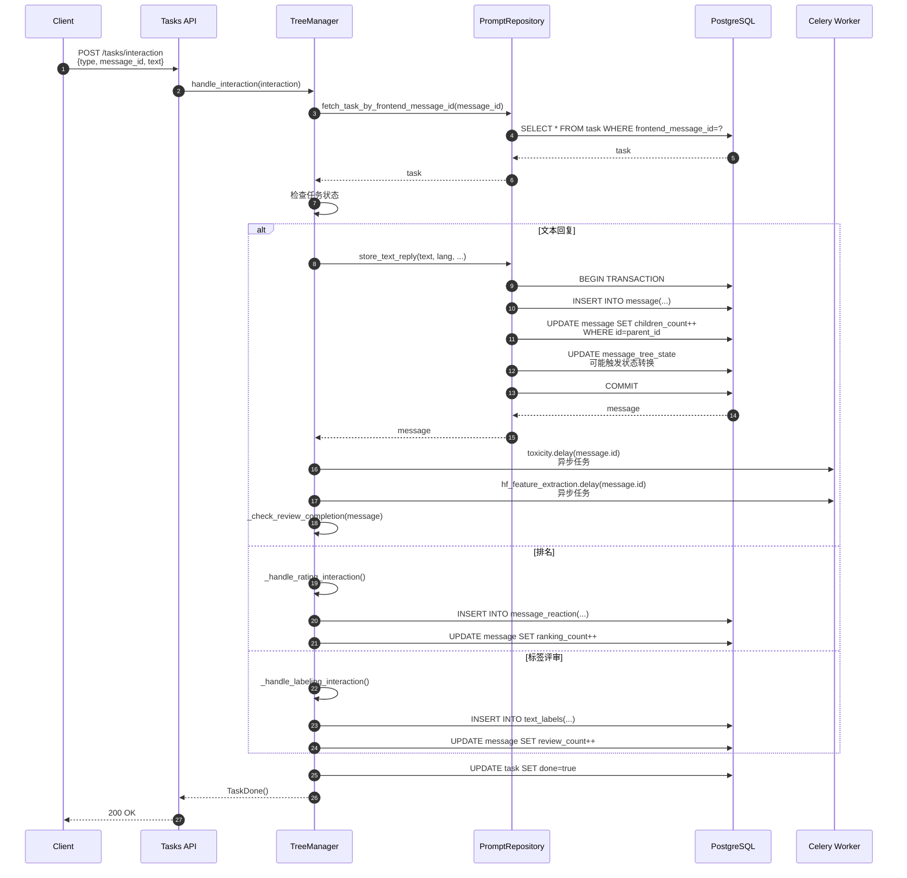
```mermaid
sequenceDiagram
    autonumber
    participant C as Client
    participant API as Tasks API
    participant TM as TreeManager
    participant PR as PromptRepository
    participant DB as PostgreSQL
    participant Celery as Celery Worker
    
    C->>API: POST /tasks/interaction<br/>{type, message_id, text}
    API->>TM: handle_interaction(interaction)
    
    TM->>PR: fetch_task_by_frontend_message_id(message_id)
    PR->>DB: SELECT * FROM task WHERE frontend_message_id=?
    DB-->>PR: task
    PR-->>TM: task
    
    TM->>TM: 检查任务状态
    
    alt 文本回复
        TM->>PR: store_text_reply(text, lang, ...)
        PR->>DB: BEGIN TRANSACTION
        PR->>DB: INSERT INTO message(...)
        PR->>DB: UPDATE message SET children_count++<br/>WHERE id=parent_id
        PR->>DB: UPDATE message_tree_state<br/>可能触发状态转换
        PR->>DB: COMMIT
        DB-->>PR: message
        PR-->>TM: message
        
        TM->>Celery: toxicity.delay(message.id)<br/>异步任务
        TM->>Celery: hf_feature_extraction.delay(message.id)<br/>异步任务
        
        TM->>TM: _check_review_completion(message)
        
    else 排名
        TM->>TM: _handle_rating_interaction()
        TM->>DB: INSERT INTO message_reaction(...)
        TM->>DB: UPDATE message SET ranking_count++
    else 标签评审
        TM->>TM: _handle_labeling_interaction()
        TM->>DB: INSERT INTO text_labels(...)
        TM->>DB: UPDATE message SET review_count++
    end
    
    TM->>DB: UPDATE task SET done=true
    TM-->>API: TaskDone()
    API-->>C: 200 OK
```

#### 异常与回退

**错误处理：**

| 场景 | 检查点 | 错误码 | 补偿策略 |
|---|---|---|---|
| 任务不存在 | 查询任务 | TASK_NOT_FOUND | 重新请求任务 |
| 任务已完成 | 检查状态 | TASK_ALREADY_DONE | 无需操作 |
| 消息重复 | 检查 hash | DUPLICATE_MESSAGE | 提示用户修改内容 |
| 树状态不允许 | 检查树状态 | TREE_STATE_NOT_SUITABLE | 放弃任务，请求新任务 |
| 文本过长 | 长度校验 | MESSAGE_TOO_LONG | 提示用户缩短文本 |
| 数据库冲突 | 提交事务 | GENERIC_ERROR | 自动重试 3 次 |

**事务回滚：**
- 所有数据库操作在单个事务内执行
- 任何步骤失败自动回滚
- Celery 任务在事务提交后触发（确保消息已持久化）

---

## 2. 消息查询 API (/api/v1/messages)

### 2.1 查询消息列表

#### 基本信息
- **名称**：`query_messages`
- **协议/方法**：HTTP GET `/api/v1/messages`
- **幂等性**：是（只读操作）

#### 请求参数

| 参数 | 类型 | 必填 | 默认值 | 说明 |
|---|---|---:|---|---|
| auth_method | str | 否 | None | 筛选认证方式 |
| username | str | 否 | None | 筛选用户名 |
| api_client_id | str | 否 | None | 筛选 API Client |
| max_count | int | 否 | 10 | 返回数量（1-1000） |
| start_date | datetime | 否 | None | 起始日期 |
| end_date | datetime | 否 | None | 结束日期 |
| only_roots | bool | 否 | False | 仅根消息 |
| desc | bool | 否 | True | 降序排列 |
| allow_deleted | bool | 否 | False | 包含已删除 |
| lang | str | 否 | None | 语言代码 |

#### 响应结构体

```python
class Message(BaseModel):
    id: UUID
    parent_id: Optional[UUID]
    text: str
    lang: str
    is_assistant: bool
    created_date: datetime
    review_result: Optional[bool]
    review_count: int
    ranking_count: int
    rank: Optional[int]
    deleted: bool
    emojis: dict[str, int]
    # 省略：其他字段
```

**响应示例：**

```json
[
  {
    "id": "123e4567-e89b-12d3-a456-426614174000",
    "parent_id": null,
    "text": "如何学习 Python？",
    "lang": "zh",
    "is_assistant": false,
    "created_date": "2023-10-01T10:00:00Z",
    "review_result": true,
    "review_count": 3,
    "ranking_count": 0,
    "rank": null,
    "deleted": false,
    "emojis": {"+1": 5, "red_flag": 0}
  }
]
```

#### 入口函数与核心代码

```python
# backend/oasst_backend/api/v1/messages.py
@router.get("/", response_model=list[protocol.Message])
def query_messages(
    *,
    auth_method: Optional[str] = None,
    username: Optional[str] = None,
    api_client_id: Optional[str] = None,
    max_count: Optional[int] = Query(10, gt=0, le=1000),
    start_date: Optional[datetime] = None,
    end_date: Optional[datetime] = None,
    only_roots: Optional[bool] = False,
    desc: Optional[bool] = True,
    allow_deleted: Optional[bool] = False,
    lang: Optional[str] = None,
    frontend_user: deps.FrontendUserId = Depends(deps.get_frontend_user_id),
    api_client: ApiClient = Depends(deps.get_api_client),
    db: Session = Depends(deps.get_db),
):
    pr = PromptRepository(db, api_client, auth_method=frontend_user.auth_method, username=frontend_user.username)
    
    # 查询消息
    messages = pr.query_messages_ordered_by_created_date(
        auth_method=auth_method,
        username=username,
        api_client_id=api_client_id,
        desc=desc,
        limit=max_count,
        gte_created_date=start_date,
        lte_created_date=end_date,
        only_roots=only_roots,
        deleted=None if allow_deleted else False,
        lang=lang,
    )
    
    return utils.prepare_message_list(messages)
```

---

### 2.2 获取消息树

#### 基本信息
- **名称**：`get_tree`
- **协议/方法**：HTTP GET `/api/v1/messages/{message_id}/tree`
- **幂等性**：是（只读操作）

#### 请求参数

| 参数 | 类型 | 必填 | 默认值 | 说明 |
|---|---|---:|---|---|
| message_id | UUID | 是 | - | 消息 ID（路径参数） |
| include_spam | bool | 否 | True | 包含垃圾消息 |
| include_deleted | bool | 否 | False | 包含已删除消息 |

#### 响应结构体

```python
class MessageTree(BaseModel):
    id: UUID  # 树根 ID
    messages: list[Message]  # 所有消息（扁平列表）
```

**响应示例：**

```json
{
  "id": "root-message-id",
  "messages": [
    {"id": "msg1", "parent_id": null, "text": "初始提示", ...},
    {"id": "msg2", "parent_id": "msg1", "text": "助手回复1", ...},
    {"id": "msg3", "parent_id": "msg1", "text": "助手回复2", ...},
    {"id": "msg4", "parent_id": "msg2", "text": "用户追问", ...}
  ]
}
```

#### 入口函数与核心代码

```python
# backend/oasst_backend/api/v1/messages.py
@router.get("/{message_id}/tree", response_model=protocol.MessageTree)
def get_tree(
    *,
    message_id: UUID,
    include_spam: Optional[bool] = True,
    include_deleted: Optional[bool] = False,
    frontend_user: deps.FrontendUserId = Depends(deps.get_frontend_user_id),
    api_client: ApiClient = Depends(deps.get_api_client),
    db: Session = Depends(deps.get_db),
):
    pr = PromptRepository(db, api_client, frontend_user=frontend_user)
    
    # 1. 获取消息（确定树 ID）
    message = pr.fetch_message(message_id)
    
    # 2. 查询整棵树
    review_result = None if include_spam else True
    deleted = None if include_deleted else False
    tree = pr.fetch_message_tree(
        message.message_tree_id,
        review_result=review_result,
        deleted=deleted
    )
    
    # 3. 转换为协议对象
    return utils.prepare_tree(tree, message.message_tree_id)
```

#### 调用链核心代码

```python
# backend/oasst_backend/prompt_repository.py
def fetch_message_tree(
    self,
    message_tree_id: UUID,
    review_result: Optional[bool] = None,
    deleted: Optional[bool] = None
) -> list[Message]:
    # 查询所有属于该树的消息
    query = self.db.query(Message).filter(
        Message.message_tree_id == message_tree_id
    )
    
    if review_result is not None:
        query = query.filter(Message.review_result == review_result)
    
    if deleted is not None:
        query = query.filter(Message.deleted == deleted)
    
    # 按深度和创建时间排序（便于前端构建树结构）
    query = query.order_by(Message.depth, Message.created_date)
    
    return query.all()
```

---

## 3. 统计与排行榜 API

### 3.1 获取排行榜

#### 基本信息
- **名称**：`get_leaderboard`
- **协议/方法**：HTTP GET `/api/v1/leaderboards/{time_frame}`
- **幂等性**：是（缓存 15 分钟）

#### 请求参数

| 参数 | 类型 | 必填 | 默认值 | 说明 |
|---|---|---:|---|---|
| time_frame | UserStatsTimeFrame | 是 | - | 时间范围（day/week/month/total） |
| max_count | int | 否 | 100 | 返回数量（1-10000） |

#### 响应结构体

```python
class LeaderboardStats(BaseModel):
    leaderboard: list[LeaderboardEntry]
    user_stats_label: str
    user_reply_stats_label: str

class LeaderboardEntry(BaseModel):
    rank: int
    user_id: UUID
    display_name: str
    leader_score: float
    # 省略：其他统计字段
```

#### 入口函数与核心代码

```python
# backend/oasst_backend/api/v1/leaderboards.py
@router.get("/{time_frame}", response_model=LeaderboardStats)
def get_leaderboard(
    time_frame: UserStatsTimeFrame,
    max_count: Optional[int] = Query(100, gt=0, le=10000),
    frontend_user: deps.FrontendUserId = Depends(deps.get_frontend_user_id),
    api_client: ApiClient = Depends(deps.get_api_client),
    db: Session = Depends(deps.get_db),
) -> LeaderboardStats:
    usr = UserStatsRepository(db)
    
    # 获取当前用户 ID（用于高亮）
    current_user_id = None
    if frontend_user and frontend_user.auth_method and frontend_user.username:
        user = UserRepository(db, api_client).query_frontend_user(
            frontend_user.auth_method,
            frontend_user.username
        )
        if user:
            current_user_id = user.id
    
    # 查询排行榜
    return usr.get_leaderboard(
        time_frame,
        limit=max_count,
        highlighted_user_id=current_user_id
    )
```

---

## 4. 性能优化总结

### 4.1 索引策略

**消息表（message）：**
- `(api_client_id, frontend_message_id)` - 唯一索引，用于幂等性检查
- `(created_date)` - 时间范围查询
- `(message_tree_id)` - 树查询
- `(user_id)` - 用户消息查询
- `(search_vector)` - GIN 全文索引

**消息树状态表（message_tree_state）：**
- `(state, lang)` - 任务分配查询
- `(active)` - 活跃树查询

### 4.2 缓存策略

| 数据类型 | 缓存位置 | TTL | 失效策略 |
|---|---|---|---|
| 排行榜 | CachedStats 表 | 15 分钟 | 定时重新计算 |
| 活跃树列表 | Redis | 60 秒 | 树状态变更时清除 |
| 限流计数 | Redis | 窗口时间 | 自动过期 |
| 用户 session | Redis | 30 天 | 用户登出时清除 |

### 4.3 批量操作

- **排名提交**：一次性插入多个 MessageReaction 记录，减少事务开销
- **评审统计**：使用窗口函数批量计算 review_result
- **排行榜更新**：使用 CTE 和聚合查询，一次性计算所有用户统计

---

**下一步：**
- 阅读 `Open-Assistant-01-Backend-数据结构.md` 了解数据库模型详情
- 阅读 `Open-Assistant-01-Backend-时序图.md` 查看完整业务流程时序图