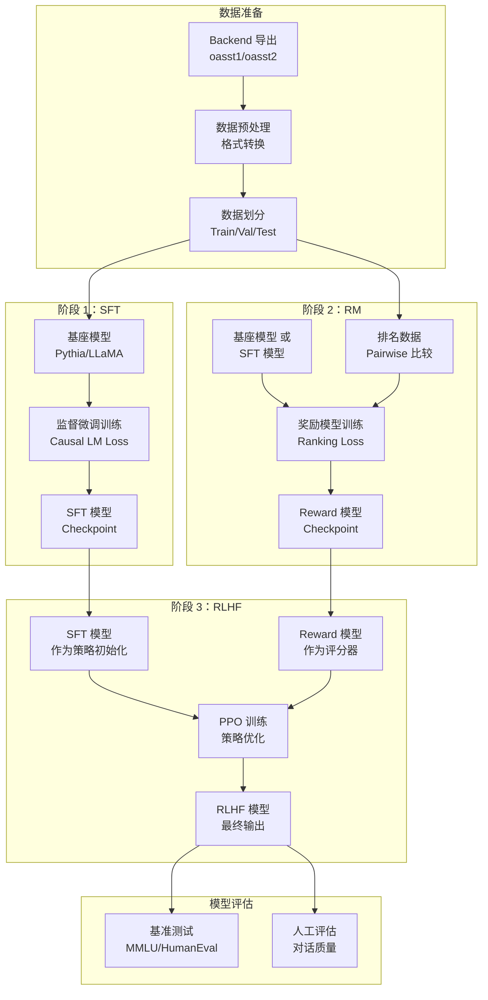

# Open-Assistant-03-ModelTraining-概览

## 1. 模块职责

Model Training 模块负责训练 Open-Assistant 的对话模型，遵循 InstructGPT 的三阶段训练流程。

**主要职责：**
- **监督微调（SFT）**：使用人工标注的高质量对话数据进行监督学习
- **奖励模型训练（RM）**：训练偏好排序模型，用于评估回复质量
- **强化学习（RLHF）**：使用 PPO 算法，基于奖励模型优化生成策略
- **模型评估**：在多个基准数据集上评估模型性能
- **模型导出**：保存训练好的模型，用于推理服务

**输入：**
- 训练数据：oasst1/oasst2 数据集（从 Backend 导出）
- 基座模型：Pythia、LLaMA、Falcon 等开源模型
- 训练配置：超参数、优化器设置、数据配置

**输出：**
- SFT 模型：微调后的对话模型
- Reward 模型：偏好排序模型
- RLHF 模型：强化学习优化后的最终模型
- 训练日志：损失曲线、评估指标、Checkpoint

## 2. 三阶段训练流程

### 2.1 整体架构图



### 2.2 训练流程说明

**阶段 1：Supervised Fine-Tuning (SFT)**

目标：让基座模型学会对话格式和基本指令遵循能力。

```python
# 训练命令
python model_training/trainer_sft.py \
    --configs defaults oa_dataset_only pythia-6.9b \
    --model_name pythia-6.9b-oasst-sft \
    --output_dir models/pythia-6.9b-sft \
    --num_train_epochs 4 \
    --per_device_train_batch_size 2 \
    --gradient_accumulation_steps 16
```

**数据格式：**

```json
{
  "messages": [
    {"role": "user", "content": "如何学习 Python？"},
    {"role": "assistant", "content": "学习 Python 的建议..."}
  ]
}
```

**损失函数：** Causal Language Modeling Loss（交叉熵）

**阶段 2：Reward Model (RM)**

目标：训练一个模型，能够预测人类对回复的偏好排序。

```python
# 训练命令
python model_training/trainer_rm.py \
    --configs defaults oa_dataset_only pythia-6.9b \
    --model_name pythia-6.9b-oasst-rm \
    --output_dir models/pythia-6.9b-rm \
    --num_train_epochs 8 \
    --per_device_train_batch_size 4
```

**数据格式：**

```json
{
  "context": "用户提示词",
  "completions": [
    {"text": "回复 A", "rank": 0},  // 0 表示最佳
    {"text": "回复 B", "rank": 1},
    {"text": "回复 C", "rank": 2}
  ]
}
```

**损失函数：** Ranking Loss（对比学习）

```python
# 简化的损失计算
for pair in pairwise_combinations(completions):
    chosen, rejected = pair
    loss = -log(sigmoid(reward(chosen) - reward(rejected)))
```

**阶段 3：RLHF with PPO**

目标：使用 PPO 算法，让 SFT 模型在 Reward 模型的指导下进一步优化。

```python
# 训练命令
python model_training/trainer_rl.py \
    --configs defaults oa_dataset_only pythia-6.9b \
    --sft_model_path models/pythia-6.9b-sft \
    --reward_model_path models/pythia-6.9b-rm \
    --output_dir models/pythia-6.9b-rl \
    --num_train_epochs 2
```

**PPO 算法流程：**

1. **生成阶段**：使用当前策略（SFT 模型）生成多个回复
2. **评分阶段**：使用 Reward 模型对回复打分
3. **优化阶段**：使用 PPO 更新策略，最大化奖励

**损失函数：** PPO Clipped Objective + KL 惩罚

```python
# PPO 损失
ratio = exp(log_prob_new - log_prob_old)
clipped_ratio = clip(ratio, 1-epsilon, 1+epsilon)
policy_loss = -min(ratio * advantage, clipped_ratio * advantage)

# KL 惩罚（防止偏离 SFT 模型太远）
kl_penalty = kl_divergence(policy_new, sft_model)
total_loss = policy_loss + beta * kl_penalty
```

## 3. 核心脚本

### 3.1 SFT 训练器

**文件：** `model_training/trainer_sft.py`

**核心代码：**

```python
from transformers import Trainer, AutoModelForCausalLM, TrainingArguments

def main():
    # 1. 加载配置
    training_conf = TrainingArguments(
        output_dir=args.output_dir,
        num_train_epochs=args.num_train_epochs,
        per_device_train_batch_size=args.per_device_train_batch_size,
        gradient_accumulation_steps=args.gradient_accumulation_steps,
        learning_rate=args.learning_rate,
        warmup_steps=args.warmup_steps,
        # 省略：其他配置
    )
    
    # 2. 加载模型和 Tokenizer
    model = AutoModelForCausalLM.from_pretrained(args.model_name)
    tokenizer = AutoTokenizer.from_pretrained(args.model_name)
    
    # 3. 加载数据集
    train_dataset = get_sft_dataset(
        tokenizer=tokenizer,
        max_length=args.max_length,
        # 省略：数据加载参数
    )
    
    # 4. 初始化 Trainer
    trainer = Trainer(
        model=model,
        args=training_conf,
        train_dataset=train_dataset,
        eval_dataset=eval_dataset,
        # 省略：其他配置
    )
    
    # 5. 开始训练
    trainer.train()
    
    # 6. 保存模型
    trainer.save_model(args.output_dir)
```

### 3.2 数据加载

**文件：** `model_training/custom_datasets/oasst_dataset.py`

**核心代码：**

```python
def get_one_dataset(conf, tokenizer):
    # 1. 从 HuggingFace 加载数据集
    dataset = load_dataset("OpenAssistant/oasst1", split="train")
    
    # 2. 构建对话树
    trees = build_conversation_trees(dataset)
    
    # 3. 转换为训练格式
    def format_conversation(tree):
        messages = []
        for msg in tree.messages:
            role = "user" if msg.role == "prompter" else "assistant"
            messages.append({"role": role, "content": msg.text})
        return messages
    
    # 4. Tokenize
    def tokenize_function(examples):
        # 将对话转换为单个序列
        # 格式：<|prompter|>提示词<|endoftext|><|assistant|>回复<|endoftext|>
        texts = [format_dialogue(conv) for conv in examples["conversations"]]
        return tokenizer(
            texts,
            truncation=True,
            max_length=conf.max_length,
            padding="max_length"
        )
    
    return dataset.map(tokenize_function, batched=True)
```

### 3.3 RM 训练器

**文件：** `model_training/trainer_rm.py`

**核心代码：**

```python
def compute_ranking_loss(model, batch):
    # 1. 获取所有回复的奖励分数
    rewards = []
    for completion in batch["completions"]:
        input_ids = tokenizer.encode(
            batch["context"] + completion["text"]
        )
        reward = model(input_ids).logits[:, -1, 0]  # 取最后一个 Token 的奖励
        rewards.append((reward, completion["rank"]))
    
    # 2. 构造 Pairwise 比较
    loss = 0
    for i, (r_i, rank_i) in enumerate(rewards):
        for j, (r_j, rank_j) in enumerate(rewards):
            if rank_i < rank_j:  # i 比 j 更好
                # 期望 reward_i > reward_j
                loss += -torch.log(torch.sigmoid(r_i - r_j))
    
    return loss / len(pairwise_combinations)
```

## 4. 配置管理

### 4.1 配置文件结构

配置使用 YAML 文件 + 命令行参数组合。

**文件：** `model_training/configs/config.yaml`

```yaml
defaults:
  learning_rate: 1e-5
  num_train_epochs: 4
  per_device_train_batch_size: 2
  gradient_accumulation_steps: 32
  warmup_steps: 100
  weight_decay: 0.0
  max_length: 2048
  
  # DeepSpeed 配置
  deepspeed_config: configs/zero_config.json
  
  # 日志与保存
  logging_steps: 10
  save_steps: 500
  eval_steps: 500

pythia-6.9b:
  model_name: "EleutherAI/pythia-6.9b"
  cache_dir: "~/.cache/huggingface"

llama-30b:
  model_name: "huggyllama/llama-30b"
  use_flash_attention: true
  load_in_8bit: true  # 8-bit 量化
```

### 4.2 DeepSpeed 配置

**文件：** `model_training/configs/zero_config.json`

```json
{
  "train_micro_batch_size_per_gpu": 2,
  "gradient_accumulation_steps": 32,
  "optimizer": {
    "type": "AdamW",
    "params": {
      "lr": 1e-5,
      "betas": [0.9, 0.95],
      "eps": 1e-8,
      "weight_decay": 0.0
    }
  },
  "fp16": {
    "enabled": true
  },
  "zero_optimization": {
    "stage": 2,
    "offload_optimizer": {
      "device": "cpu"
    },
    "allgather_bucket_size": 5e8,
    "reduce_bucket_size": 5e8
  }
}
```

**ZeRO 阶段说明：**

| 阶段 | 分片内容 | 显存节省 | 通信开销 |
|---|---|---|---|
| Stage 1 | Optimizer States | 4x | 低 |
| Stage 2 | + Gradients | 8x | 中 |
| Stage 3 | + Model Parameters | Nx | 高 |

## 5. 分布式训练

### 5.1 多 GPU 训练

**使用 DeepSpeed：**

```bash
# 单机多卡
deepspeed --num_gpus=4 model_training/trainer_sft.py \
    --configs defaults pythia-6.9b \
    --deepspeed configs/zero_config.json

# 多机多卡
deepspeed --hostfile hostfile \
    --num_gpus=8 \
    model_training/trainer_sft.py \
    --configs defaults llama-30b
```

**hostfile 格式：**

```
node1 slots=8
node2 slots=8
node3 slots=8
```

### 5.2 混合精度训练

**FP16（默认）：**
- 使用半精度浮点数，节省显存和计算时间
- Loss Scaling 防止下溢

**BF16（更稳定）：**
```python
training_args = TrainingArguments(
    bf16=True,  # 使用 BF16（需要 A100 或更新 GPU）
    # ...
)
```

## 6. 模型评估

### 6.1 自动评估

**文件：** `model_eval/manual/`

**支持的基准测试：**

| 基准 | 类型 | 指标 | 说明 |
|---|---|---|---|
| MMLU | 知识问答 | Accuracy | 多领域选择题（57 个子任务） |
| HumanEval | 代码生成 | Pass@k | Python 代码正确性 |
| HellaSwag | 常识推理 | Accuracy | 句子补全 |
| TruthfulQA | 真实性 | % Truthful | 避免虚假信息 |
| BBH | 推理能力 | Accuracy | Big-Bench Hard（23 个任务） |

**运行评估：**

```bash
# MMLU 评估
python model_eval/manual/mmlu_eval.py \
    --model_name models/pythia-6.9b-sft \
    --output_dir eval_results/mmlu

# HumanEval 评估
python model_eval/manual/humaneval_eval.py \
    --model_name models/pythia-6.9b-sft \
    --temperature 0.2 \
    --num_samples 100
```

### 6.2 人工评估

**对话质量维度：**

1. **相关性（Relevance）**：回复是否切题
2. **有用性（Helpfulness）**：是否解决用户问题
3. **准确性（Accuracy）**：事实是否正确
4. **安全性（Safety）**：是否包含有害内容
5. **流畅性（Fluency）**：语言是否自然流畅

**评估工具：** 使用 Inference Server 生成回复，人工打分

## 7. 常见问题

### Q1: 显存不足怎么办？

**答：** 多种优化策略组合使用。

1. **减小 Batch Size**：`per_device_train_batch_size=1`
2. **增加梯度累积**：`gradient_accumulation_steps=64`
3. **启用梯度 Checkpoint**：`gradient_checkpointing=True`
4. **使用 8-bit 量化**：`load_in_8bit=True`
5. **使用 DeepSpeed ZeRO Stage 3**：将模型参数分片到多卡/CPU

### Q2: 如何选择基座模型？

**答：** 根据任务需求和资源限制选择。

| 模型 | 参数量 | 显存需求 | 推荐场景 |
|---|---|---|---|
| Pythia-1b | 1B | ~4GB | 快速实验、原型开发 |
| Pythia-6.9b | 7B | ~16GB | 平衡性能与成本 |
| LLaMA-13b | 13B | ~30GB | 高质量对话 |
| LLaMA-30b | 30B | ~70GB | 最佳性能（需多卡） |

### Q3: 训练需要多长时间？

**答：** 取决于模型大小和硬件配置。

**参考时间（单机 4×A100）：**
- Pythia-6.9b SFT（4 epoch）：~8 小时
- Pythia-6.9b RM（8 epoch）：~12 小时
- Pythia-6.9b RLHF（2 epoch）：~24 小时

### Q4: 如何恢复中断的训练？

**答：** 使用 Checkpoint 恢复。

```bash
# Trainer 自动保存 checkpoint
# 恢复训练
python model_training/trainer_sft.py \
    --configs defaults pythia-6.9b \
    --resume_from_checkpoint models/pythia-6.9b-sft/checkpoint-5000
```

---

## 8. 实践建议

### 8.1 数据质量优于数量

- 优先使用高质量、多样化的数据
- 过滤低质量回复（根据 review_result 和 rank）
- 平衡不同类型的任务（开放问答、代码、推理等）

### 8.2 超参数调优

**关键超参数：**

| 参数 | 推荐范围 | 说明 |
|---|---|---|
| learning_rate | 1e-6 ~ 1e-5 | SFT 用较小值，RM 可稍大 |
| num_train_epochs | 3 ~ 5 | 过多易过拟合 |
| warmup_ratio | 0.03 ~ 0.1 | 训练初期学习率线性增长 |
| weight_decay | 0.0 ~ 0.1 | 正则化，防止过拟合 |
| max_length | 512 ~ 2048 | 根据显存和任务需求 |

### 8.3 监控训练过程

**关键指标：**
- Training Loss：持续下降，收敛
- Validation Loss：与 Training Loss 差距不能太大（防止过拟合）
- Perplexity：越低越好（SFT）
- Ranking Accuracy：越高越好（RM）
- Average Reward：持续上升（RLHF）

**使用 Weights & Biases (wandb)：**

```python
# 在训练脚本中启用
training_args = TrainingArguments(
    report_to="wandb",
    # ...
)
```

---

**下一步：**
- 阅读 `model/README.md` 了解详细训练流程
- 查看 `model/model_training/configs/` 了解配置选项
- 参考 `model/model_training/trainer_sft.py` 理解训练实现

