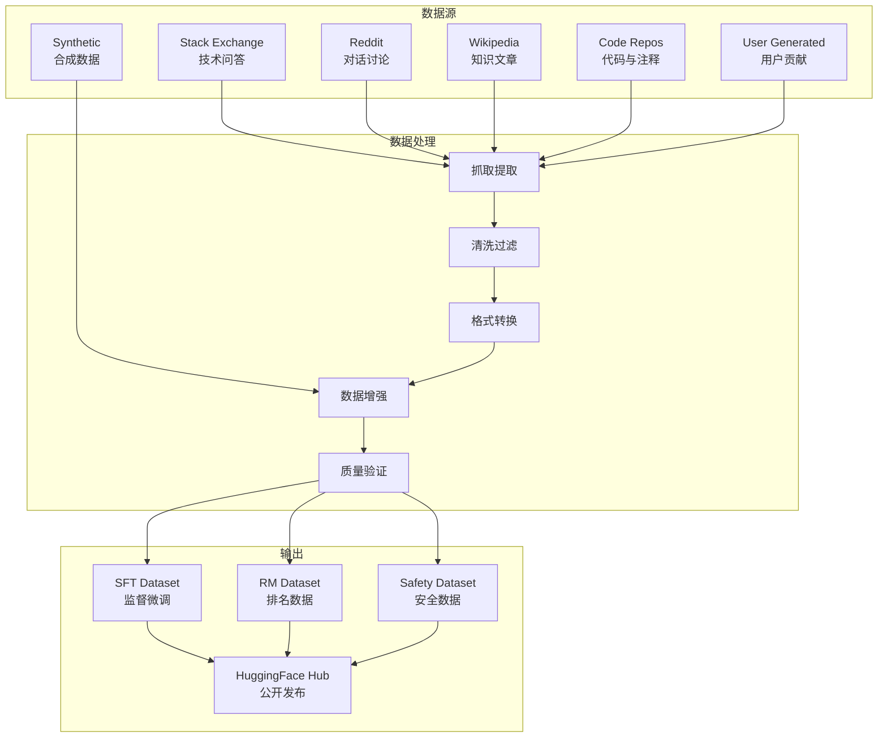

# Open-Assistant-05-Data-概览

## 1. 模块职责

Data 模块负责数据集的收集、处理和转换，为模型训练提供高质量的数据。

**主要职责：**
- **数据收集**：从多个开源数据源抓取和整理数据
- **数据清洗**：去重、过滤低质量内容、标准化格式
- **格式转换**：将各种数据源转换为 Open-Assistant 统一格式
- **数据增强**：通过生成式模型扩充数据集
- **数据上传**：发布到 HuggingFace Hub 供训练使用

**输入：**
- 开源数据集（Stack Exchange、Reddit、Wikipedia 等）
- 用户生成内容（通过 Backend 收集）
- 合成数据（通过 LLM 生成）

**输出：**
- 标准化的训练数据集（HuggingFace Dataset 格式）
- 数据统计报告（数量、分布、质量指标）
- 数据处理脚本和 Notebooks

## 2. 数据源概览

### 2.1 主要数据类型



### 2.2 数据集清单

Data 模块包含 30+ 个数据集处理脚本，涵盖多个领域：

| 类别 | 数据集 | 说明 | 数量级 |
|---|---|---|---|
| **技术问答** | oa_stackexchange | Stack Exchange 各站点 | ~1M 问答对 |
| | ubuntu_dialogue_qa | Ubuntu 技术支持对话 | ~100K 对话 |
| | biostars_qa | 生物信息学问答 | ~10K 问答对 |
| **代码** | instructional_codesearchnet | Python 代码+指令 | ~50K 样本 |
| | codet_humaneval_mbpp | 代码生成任务 | ~1K 问题 |
| | oa_leet10k | LeetCode 编程题 | 10K 题目 |
| **通用对话** | soda_synthetic_dialogue | 合成对话 | ~1M 对话 |
| | fd_dialogue | 电影/电视对话 | ~100K 对话 |
| | tv_dialogue | 电视剧对话脚本 | ~50K 对话 |
| **知识问答** | cmu_wiki_qa | CMU 问答数据集 | ~10K 问答对 |
| | iapp_wiki_qa_squad | SQuAD 格式问答 | ~100K 问答对 |
| **推理** | grade_school_math_instructions | 数学推理题 | ~7K 题目 |
| | reasoning_gsm_qna | GSM8K 数学问答 | ~8K 问题 |
| | reasoning_bg_oa | 逻辑推理问题 | ~5K 问题 |
| **安全** | nsfw_selfharm_reddit | NSFW/自残内容识别 | ~50K 样本 |
| | prosocial_confessions | 亲社会对话 | ~20K 对话 |
| **多语言** | tatoeba_mt_qna | 多语言翻译问答 | ~100K 对 |
| | zhihu-kol | 知乎高质量内容 | ~50K 问答 |
| | fa-wikipedia | 波斯语 Wikipedia | ~10K 文章 |
| **其他** | oa_dolly_15k | Databricks Dolly 指令 | 15K 指令 |
| | recipes | 烹饪食谱指令 | ~10K 食谱 |
| | tell_a_joke | 笑话生成 | ~5K 笑话 |
| | poetry_instruction | 诗歌创作指令 | ~5K 诗歌 |

## 3. 数据处理流程

### 3.1 标准流程

**阶段 1：数据抓取**

```python
# 示例：Stack Exchange 数据抓取
# datasets/oa_stackexchange/download.py

import requests
from bs4 import BeautifulSoup

def download_stackexchange_dump(site_name):
    # 1. 下载 XML 数据转储
    url = f"https://archive.org/download/stackexchange/{site_name}.7z"
    response = requests.get(url, stream=True)
    
    # 2. 解压 7z 文件
    with py7zr.SevenZipFile(response.raw) as archive:
        archive.extractall(path=f"data/{site_name}")
    
    # 3. 解析 XML
    posts = parse_posts_xml(f"data/{site_name}/Posts.xml")
    
    return posts
```

**阶段 2：数据清洗**

```python
# 清洗规则
def clean_text(text):
    # 1. 移除 HTML 标签
    text = BeautifulSoup(text, "html.parser").get_text()
    
    # 2. 移除过短/过长内容
    if len(text) < 20 or len(text) > 10000:
        return None
    
    # 3. 移除低质量标记
    # - 拼写错误过多
    # - 包含垃圾信息
    # - 格式混乱
    
    # 4. 标准化空白字符
    text = re.sub(r'\s+', ' ', text).strip()
    
    return text
```

**阶段 3：格式转换**

```python
# 转换为 Open-Assistant 标准格式
def convert_to_oa_format(qa_pair):
    return {
        "text": qa_pair["question"],
        "role": "prompter",
        "lang": "en",
        "quality": compute_quality_score(qa_pair),
        "replies": [{
            "text": answer["text"],
            "role": "assistant",
            "lang": "en",
            "quality": compute_quality_score(answer)
        } for answer in qa_pair["answers"]]
    }
```

**阶段 4：数据增强**

```python
# 使用 LLM 生成变体
def augment_with_paraphrase(question):
    # 使用 GPT-3.5/GPT-4 生成问题的不同表述
    prompt = f"Paraphrase the following question:\n{question}"
    
    variations = []
    for _ in range(3):
        variation = llm_generate(prompt, temperature=0.7)
        variations.append(variation)
    
    return variations
```

**阶段 5：质量验证**

```python
def validate_quality(sample):
    checks = {
        "length": 20 <= len(sample["text"]) <= 5000,
        "language": detect_language(sample["text"]) == sample["lang"],
        "toxicity": toxicity_score(sample["text"]) < 0.5,
        "coherence": coherence_score(sample["text"]) > 0.6,
        "factuality": factuality_score(sample["text"]) > 0.7,
    }
    
    return all(checks.values())
```

### 3.2 数据统计流程

```python
# datasets/oa_stackexchange/stats.py

def compute_dataset_stats(dataset):
    stats = {
        "total_samples": len(dataset),
        "avg_prompt_length": np.mean([len(s["text"]) for s in dataset]),
        "avg_response_length": np.mean([
            len(r["text"]) for s in dataset for r in s["replies"]
        ]),
        "language_distribution": Counter([s["lang"] for s in dataset]),
        "quality_distribution": {
            "high": sum(1 for s in dataset if s["quality"] >= 0.8),
            "medium": sum(1 for s in dataset if 0.5 <= s["quality"] < 0.8),
            "low": sum(1 for s in dataset if s["quality"] < 0.5),
        }
    }
    
    return stats
```

## 4. 核心数据集详解

### 4.1 Stack Exchange 数据集

**来源：** Stack Overflow、Ask Ubuntu、Super User 等 150+ 站点

**处理脚本：** `datasets/oa_stackexchange/`

**流程：**

1. **下载**：`download.py` - 下载 XML 转储
2. **处理**：`process.py` - 解析并过滤
3. **合并**：`combine.py` - 合并多个站点
4. **统计**：`stats.py` - 生成统计报告
5. **上传**：`upload.py` - 发布到 HuggingFace

**质量控制：**
- 只保留被接受的答案（accepted answer）
- 过滤低分问题和答案（score < 5）
- 移除代码片段过多的内容（保留代码占比 < 50%）

### 4.2 合成对话数据集

**来源：** SODA（Social Dialogue）合成生成

**处理脚本：** `datasets/soda_synthetic_dialogue/`

**特点：**
- 使用 GPT-3 生成真实感对话
- 涵盖 100+ 场景（日常、工作、情感等）
- 多轮对话（平均 5-10 轮）

**生成流程：**

```python
def generate_synthetic_dialogue(scenario):
    # 1. 构造场景提示
    prompt = f"""
    Generate a natural conversation between two people in the following scenario:
    Scenario: {scenario}
    
    Requirements:
    - 5-10 turns
    - Natural language
    - Appropriate responses
    """
    
    # 2. 生成对话
    dialogue = llm_generate(prompt, max_tokens=1000)
    
    # 3. 解析为结构化格式
    turns = parse_dialogue(dialogue)
    
    return turns
```

### 4.3 代码指令数据集

**来源：** CodeSearchNet + GPT-3.5 生成

**处理脚本：** `datasets/instructional_codesearchnet_python/`

**流程：**

```python
def create_code_instruction(code, docstring):
    # 1. 从代码生成指令
    instruction = generate_instruction_from_code(code, docstring)
    # 示例："Write a Python function to calculate the factorial of a number"
    
    # 2. 构造响应
    response = f"""
    Here's a Python implementation:
    
    ```python
    {code}
    ```
    
    Explanation:
    {generate_explanation(code, docstring)}
    """
    
    return {
        "instruction": instruction,
        "response": response,
        "language": "python"
    }
```

### 4.4 安全数据集

**来源：** Reddit NSFW、自残内容识别

**处理脚本：** `datasets/nsfw_selfharm_reddit/`

**用途：**
- 训练内容安全分类器
- 识别有害内容（NSFW、自残、暴力等）
- 用于 Safety Service

**标注：**

```python
safety_labels = {
    "safe": 0,
    "nsfw": 1,
    "selfharm": 2,
    "violence": 3,
    "hate_speech": 4,
}
```

## 5. 数据格式标准

### 5.1 Open-Assistant 对话树格式

```json
{
  "message_tree_id": "uuid-1234",
  "tree_state": "ready_for_export",
  "prompt": {
    "text": "How do I learn Python?",
    "lang": "en",
    "role": "prompter",
    "user_id": "user-123",
    "created_date": "2024-01-01T00:00:00Z"
  },
  "replies": [
    {
      "text": "Here are some tips...",
      "lang": "en",
      "role": "assistant",
      "user_id": "user-456",
      "rank": 0,
      "labels": {
        "spam": 0,
        "fails_task": 0,
        "quality": 0.9
      }
    }
  ]
}
```

### 5.2 HuggingFace Dataset 格式

```python
from datasets import Dataset

dataset = Dataset.from_dict({
    "id": ["sample-1", "sample-2", ...],
    "prompt": ["Question 1", "Question 2", ...],
    "response": ["Answer 1", "Answer 2", ...],
    "lang": ["en", "en", ...],
    "quality": [0.9, 0.85, ...],
    "source": ["stackexchange", "reddit", ...]
})

# 上传到 HuggingFace Hub
dataset.push_to_hub("OpenAssistant/my-dataset")
```

## 6. 工具与脚本

### 6.1 通用工具

**语言检测：**

```python
from langdetect import detect

def detect_language_with_confidence(text):
    try:
        lang = detect(text)
        # 验证语言标签
        if lang not in ISO_639_1_CODES:
            return "en"  # 默认英语
        return lang
    except:
        return "en"
```

**质量评分：**

```python
def compute_quality_score(text):
    scores = {
        "length": length_score(text),        # 长度适中
        "grammar": grammar_score(text),      # 语法正确
        "coherence": coherence_score(text),  # 连贯性
        "informative": info_score(text),     # 信息量
    }
    
    # 加权平均
    weights = [0.2, 0.3, 0.3, 0.2]
    return sum(s * w for s, w in zip(scores.values(), weights))
```

**去重：**

```python
from datasketch import MinHash, MinHashLSH

def deduplicate_dataset(samples):
    lsh = MinHashLSH(threshold=0.8, num_perm=128)
    
    unique_samples = []
    seen_hashes = set()
    
    for sample in samples:
        # 计算 MinHash
        minhash = MinHash(num_perm=128)
        for word in sample["text"].split():
            minhash.update(word.encode('utf-8'))
        
        # 检查相似度
        if not lsh.query(minhash):
            lsh.insert(sample["id"], minhash)
            unique_samples.append(sample)
    
    return unique_samples
```

### 6.2 数据验证工具

```python
def validate_dataset(dataset_path):
    dataset = load_dataset(dataset_path)
    
    issues = []
    
    for idx, sample in enumerate(dataset):
        # 检查必需字段
        required_fields = ["text", "lang", "role"]
        for field in required_fields:
            if field not in sample:
                issues.append(f"Sample {idx}: Missing field '{field}'")
        
        # 检查文本质量
        if len(sample.get("text", "")) < 20:
            issues.append(f"Sample {idx}: Text too short")
        
        # 检查语言一致性
        detected_lang = detect_language(sample.get("text", ""))
        if detected_lang != sample.get("lang"):
            issues.append(f"Sample {idx}: Language mismatch")
    
    return issues
```

## 7. 数据统计示例

### 7.1 OASST1 数据集统计

```python
# 真实的 OASST1 数据集统计（2023-04-12 发布）

stats = {
    "total_conversations": 9846,
    "total_messages": 161443,
    "languages": {
        "en": 66.5,     # 百分比
        "es": 10.3,
        "ru": 4.3,
        "de": 3.8,
        "zh": 3.2,
        "fr": 2.9,
        # ... 其他 30+ 语言
    },
    "message_types": {
        "prompter": 35.2,  # 百分比
        "assistant": 64.8,
    },
    "quality_distribution": {
        "high_quality": 45.2,   # quality >= 0.8
        "medium_quality": 38.6,  # 0.5 <= quality < 0.8
        "low_quality": 16.2,     # quality < 0.5
    },
    "avg_conversation_depth": 4.2,  # 平均对话轮数
    "contributors": 13500,          # 贡献者数量
}
```

## 8. 常见问题

### Q1: 如何添加新的数据集？

**答：** 遵循标准流程。

1. 在 `data/datasets/` 创建新目录
2. 编写数据处理脚本：
   - `download.py` 或 `prepare.py` - 获取原始数据
   - `process.py` - 清洗和格式转换
   - `README.md` - 说明文档
3. 转换为 Open-Assistant 格式
4. 验证数据质量
5. 上传到 HuggingFace Hub

### Q2: 如何过滤低质量数据？

**答：** 多维度质量控制。

```python
def filter_low_quality(sample):
    # 1. 长度检查
    if not (20 <= len(sample["text"]) <= 5000):
        return False
    
    # 2. 语言检查
    if detect_language(sample["text"]) != sample["lang"]:
        return False
    
    # 3. 毒性检查
    if toxicity_score(sample["text"]) > 0.5:
        return False
    
    # 4. 语法检查
    if grammar_errors(sample["text"]) > 5:
        return False
    
    # 5. 重复检查
    if is_duplicate(sample["text"]):
        return False
    
    return True
```

### Q3: 如何处理多语言数据？

**答：** 统一格式，区分语言标签。

```python
# 为每个样本添加语言标签
sample["lang"] = detect_language(sample["text"])

# 按语言分组
from collections import defaultdict
by_language = defaultdict(list)

for sample in dataset:
    by_language[sample["lang"]].append(sample)

# 发布单独的语言子集
for lang, samples in by_language.items():
    dataset = Dataset.from_list(samples)
    dataset.push_to_hub(f"OpenAssistant/oasst1-{lang}")
```

### Q4: 数据集更新频率？

**答：** 取决于数据源。

- **用户生成**：实时收集，每周导出
- **外部数据源**：按需更新（季度或半年）
- **合成数据**：按需生成

## 9. 最佳实践

### 9.1 数据质量优于数量

- 优先保留高质量样本（quality >= 0.8）
- 严格过滤有害内容
- 保持语言和风格的一致性

### 9.2 数据多样性

- 涵盖多个领域（技术、科学、日常、创意等）
- 支持多种语言（至少英语+5 种主要语言）
- 包含不同难度级别的任务

### 9.3 数据隐私与合规

- 移除个人身份信息（PII）
- 遵守数据源的许可协议
- 标注数据来源和许可类型

### 9.4 版本管理

```python
# 为数据集添加版本号
dataset_info = {
    "name": "oasst1",
    "version": "2023-04-12",
    "description": "Open-Assistant Conversations Release 1",
    "license": "Apache-2.0",
    "sources": ["user_generated", "stackexchange", "reddit"],
    "languages": ["en", "es", "ru", "de", "zh", "fr", ...],
    "size": {
        "conversations": 9846,
        "messages": 161443
    }
}
```

---

**下一步：**
- 查看 `data/datasets/` 了解各数据集详情
- 阅读具体数据集的 README 了解处理流程
- 参考 `model/README.md` 了解如何使用数据集训练模型

