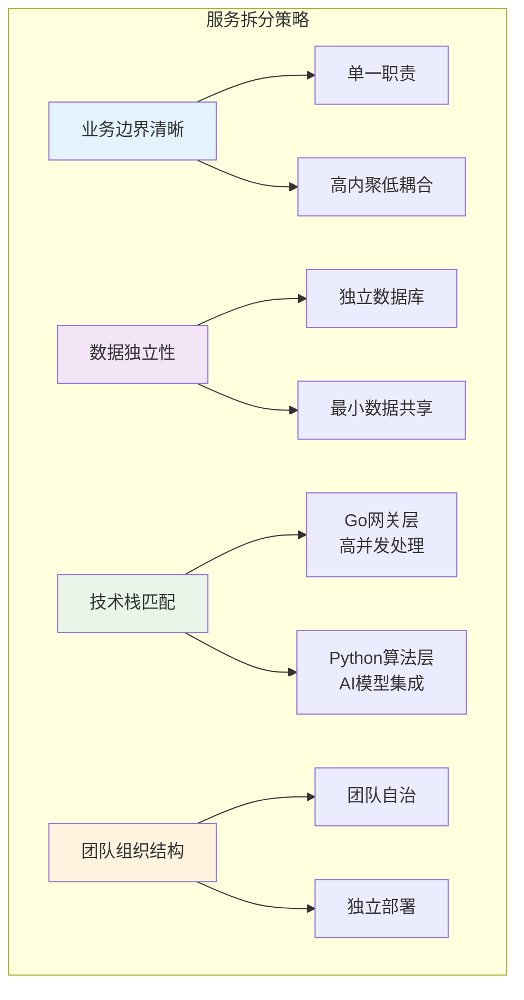

## 📋 概述

本文档整理了VoiceHelper系统开发和使用过程中的最佳实践、设计模式、性能优化技巧和实际应用案例，帮助开发者快速掌握系统精髓，避免常见陷阱。

## 🏗️ 架构设计最佳实践

### 1. 微服务架构模式

#### 服务拆分原则



#### 服务通信模式实践

```go
// 1. 同步通信 - 适用于关键路径和低延迟需求
type AlgoServiceClient struct {
    baseURL    string
    httpClient *http.Client
    circuitBreaker *CircuitBreaker
}

func (c *AlgoServiceClient) QueryWithTimeout(
    ctx context.Context,
    request *QueryRequest,
) (*QueryResponse, error) {
    // 设置超时上下文
    ctx, cancel := context.WithTimeout(ctx, 30*time.Second)
    defer cancel()
    
    // 熔断器保护
    return c.circuitBreaker.Execute(func() (*QueryResponse, error) {
        return c.sendRequest(ctx, request)
    })
}

// 2. 异步通信 - 适用于耗时任务和解耦场景
type EventBus struct {
    subscribers map[string][]EventHandler
    mu         sync.RWMutex
}

func (eb *EventBus) PublishAsync(event Event) {
    go func() {
        eb.mu.RLock()
        handlers := eb.subscribers[event.Type]
        eb.mu.RUnlock()
        
        for _, handler := range handlers {
            go func(h EventHandler) {
                if err := h.Handle(event); err != nil {
                    log.Error("Event handling failed",
                        zap.Error(err),
                        zap.String("event_type", event.Type))
                }
            }(handler)
        }
    }()
}

// 3. 流式通信 - 适用于实时数据传输
func (h *VoiceHandler) StreamProcessing(stream VoiceStream) error {
    for {
        select {
        case audioChunk := <-stream.AudioChannel:
            // 处理音频块
            if err := h.processAudioChunk(audioChunk); err != nil {
                return fmt.Errorf("audio processing failed: %w", err)
            }
            
        case <-stream.Context.Done():
            return stream.Context.Err()
            
        case <-time.After(30 * time.Second):
            return errors.New("stream timeout")
        }
    }
}
```

### 2. 数据一致性设计

#### 分布式事务处理

```python
# Saga模式实现 - 处理跨服务事务
class DocumentIngestSaga:
    """文档入库的分布式事务协调器"""
    
    def __init__(self):
        self.steps = [
            ('parse_documents', self.parse_documents, self.compensate_parse),
            ('generate_embeddings', self.generate_embeddings, self.compensate_embeddings),
            ('update_index', self.update_index, self.compensate_index),
            ('store_metadata', self.store_metadata, self.compensate_metadata)
        ]
    
    async def execute(self, request: IngestRequest) -> IngestResult:
        """执行Saga事务"""
        executed_steps = []
        
        try:
            for step_name, action, compensate in self.steps:
                logger.info(f"Executing step: {step_name}")
                result = await action(request)
                executed_steps.append((step_name, compensate, result))
                
            return IngestResult(success=True, task_id=request.task_id)
            
        except Exception as e:
            logger.error(f"Saga execution failed: {e}")
            await self.compensate_all(executed_steps)
            raise
    
    async def compensate_all(self, executed_steps: List):
        """补偿已执行的步骤"""
        for step_name, compensate_func, result in reversed(executed_steps):
            try:
                await compensate_func(result)
                logger.info(f"Compensated step: {step_name}")
            except Exception as e:
                logger.error(f"Compensation failed for {step_name}: {e}")
    
    async def parse_documents(self, request: IngestRequest):
        """解析文档步骤"""
        parsed_docs = []
        for file in request.files:
            doc = await self.document_parser.parse(file)
            parsed_docs.append(doc)
        return parsed_docs
    
    async def compensate_parse(self, parsed_docs: List):
        """清理已解析的文档"""
        for doc in parsed_docs:
            if hasattr(doc, 'temp_file_path'):
                os.remove(doc.temp_file_path)

# 事件溯源模式 - 保证数据一致性和可追溯性
class ConversationEventStore:
    """对话事件存储"""
    
    async def append_event(self, event: ConversationEvent):
        """追加事件到事件流"""
        await self.db.execute("""
            INSERT INTO conversation_events
            (conversation_id, event_type, event_data, timestamp, version)
            VALUES ($1, $2, $3, $4, $5)
        """, event.conversation_id, event.type,
            json.dumps(event.data), event.timestamp, event.version)
    
    async def replay_events(self, conversation_id: str) -> Conversation:
        """重放事件重构对话状态"""
        events = await self.db.fetch("""
            SELECT * FROM conversation_events
            WHERE conversation_id = $1
            ORDER BY version ASC
        """, conversation_id)
        
        conversation = Conversation(id=conversation_id)
        
        for event_row in events:
            event = ConversationEvent.from_row(event_row)
            conversation = self.apply_event(conversation, event)
        
        return conversation
```

### 3. 缓存策略设计

#### 多层缓存架构

```typescript
/**

 * 多层缓存策略实现
 * L1: 内存缓存 (最快，容量小)
 * L2: Redis缓存 (快速，容量中等)
 * L3: 数据库 (慢速，容量大)

 */
class MultiLevelCacheManager {
  private l1Cache = new Map<string, CacheEntry>();
  private l2Cache: Redis;
  private l3Database: Database;
  
  constructor() {
    // L1缓存清理定时器
    setInterval(() => this.cleanupL1Cache(), 60000);
  }
  
  async get<T>(key: string): Promise<T | null> {
    // L1缓存查找
    const l1Entry = this.l1Cache.get(key);
    if (l1Entry && !this.isExpired(l1Entry)) {
      this.updateL1Stats('hit');
      return l1Entry.data as T;
    }
    
    // L2缓存查找
    try {
      const l2Data = await this.l2Cache.get(key);
      if (l2Data) {
        const parsed = JSON.parse(l2Data);
        // 回填L1缓存
        this.setL1(key, parsed, 300000); // 5分钟
        this.updateL2Stats('hit');
        return parsed as T;
      }
    } catch (error) {
      console.warn('L2 cache error:', error);
    }
    
    // L3数据库查询
    const dbData = await this.queryDatabase<T>(key);
    if (dbData) {
      // 回填多级缓存
      await this.setL2(key, dbData, 3600000); // 1小时
      this.setL1(key, dbData, 300000); // 5分钟
      this.updateL3Stats('hit');
      return dbData;
    }
    
    return null;
  }
  
  async set<T>(key: string, data: T, options?: CacheOptions): Promise<void> {
    const { l1Ttl = 300000, l2Ttl = 3600000, writeThrough = true } = options || {};
    
    // 同时更新多级缓存
    this.setL1(key, data, l1Ttl);
    await this.setL2(key, data, l2Ttl);
    
    // 可选的写穿透
    if (writeThrough) {
      await this.updateDatabase(key, data);
    }
  }
  
  private setL1<T>(key: string, data: T, ttl: number): void {
    this.l1Cache.set(key, {
      data,
      expiresAt: Date.now() + ttl,
      accessCount: 1,
      lastAccess: Date.now()
    });
  }
  
  private async setL2<T>(key: string, data: T, ttl: number): Promise<void> {
    await this.l2Cache.setex(key, Math.floor(ttl / 1000), JSON.stringify(data));
  }
  
  // 智能缓存预热
  async warmupCache(patterns: string[]): Promise<void> {
    const warmupTasks = patterns.map(async (pattern) => {
      const keys = await this.l2Cache.keys(pattern);
      
      for (const key of keys.slice(0, 100)) { // 限制预热数量
        const data = await this.l2Cache.get(key);
        if (data) {
          this.setL1(key, JSON.parse(data), 600000); // 10分钟
        }
      }
    });
    
    await Promise.all(warmupTasks);
    console.log(`Cache warmed up for ${patterns.length} patterns`);
  }
  
  // 缓存失效策略
  async invalidatePattern(pattern: string): Promise<void> {
    // 清理L1缓存
    for (const key of this.l1Cache.keys()) {
      if (this.matchPattern(key, pattern)) {
        this.l1Cache.delete(key);
      }
    }
    
    // 清理L2缓存
    const keys = await this.l2Cache.keys(pattern);
    if (keys.length > 0) {
      await this.l2Cache.del(...keys);
    }
    
    console.log(`Invalidated cache pattern: ${pattern}`);
  }
}

// 缓存使用示例
class ConversationService {
  constructor(private cache: MultiLevelCacheManager) {}
  
  async getConversation(id: string): Promise<Conversation | null> {
    const cacheKey = `conversation:${id}`;
    
    // 先从缓存获取
    let conversation = await this.cache.get<Conversation>(cacheKey);
    
    if (!conversation) {
      // 缓存未命中，从数据库查询
      conversation = await this.db.findConversationById(id);
      
      if (conversation) {
        // 存入缓存
        await this.cache.set(cacheKey, conversation, {
          l1Ttl: 300000,  // L1缓存5分钟
          l2Ttl: 3600000, // L2缓存1小时
          writeThrough: false // 数据已在数据库中
        });
      }
    }
    
    return conversation;
  }
  
  async updateConversation(id: string, updates: Partial<Conversation>): Promise<void> {
    // 更新数据库
    await this.db.updateConversation(id, updates);
    
    // 失效相关缓存
    await this.cache.invalidatePattern(`conversation:${id}*`);
    await this.cache.invalidatePattern(`user:${updates.userId}:conversations*`);
  }
}
```

## 🚀 性能优化实战案例

### 1. 数据库查询优化

#### N+1查询问题解决

```python
# 问题：N+1查询导致性能瓶颈
# 原始代码（有问题）
async def get_conversations_with_messages_bad(user_id: str):
    conversations = await db.fetch(
        "SELECT * FROM conversations WHERE user_id = $1", user_id
    )
    
    for conversation in conversations:
        # N+1问题：为每个对话单独查询消息
        messages = await db.fetch(
            "SELECT * FROM messages WHERE conversation_id = $1",
            conversation.id
        )
        conversation.messages = messages
    
    return conversations

# 解决方案1：批量查询
async def get_conversations_with_messages_optimized(user_id: str):
    conversations = await db.fetch(
        "SELECT * FROM conversations WHERE user_id = $1", user_id
    )
    
    if not conversations:
        return []
    
    # 一次性获取所有相关消息
    conversation_ids = [c.id for c in conversations]
    messages = await db.fetch("""
        SELECT conversation_id, message_id, role, content, created_at
        FROM messages
        WHERE conversation_id = ANY($1)
        ORDER BY conversation_id, created_at
    """, conversation_ids)
    
    # 按conversation_id分组
    messages_by_conv = {}
    for message in messages:
        conv_id = message['conversation_id']
        if conv_id not in messages_by_conv:
            messages_by_conv[conv_id] = []
        messages_by_conv[conv_id].append(message)
    
    # 组装结果
    for conversation in conversations:
        conversation.messages = messages_by_conv.get(conversation.id, [])
    
    return conversations

# 解决方案2：使用DataLoader模式
class MessageDataLoader:
    def __init__(self, db):
        self.db = db
        self.batch_load_fn = self._batch_load_messages
        self._batch_cache = {}
        self._batch_queue = []
        
    async def load(self, conversation_id: str) -> List[Message]:
        """加载单个对话的消息"""
        if conversation_id in self._batch_cache:
            return self._batch_cache[conversation_id]
        
        self._batch_queue.append(conversation_id)
        
        # 批量执行
        if len(self._batch_queue) >= 10:  # 批量大小
            await self._execute_batch()
        
        return self._batch_cache.get(conversation_id, [])
    
    async def _batch_load_messages(self, conversation_ids: List[str]):
        """批量加载消息"""
        messages = await self.db.fetch("""
            SELECT conversation_id, message_id, role, content, created_at
            FROM messages
            WHERE conversation_id = ANY($1)
            ORDER BY conversation_id, created_at
        """, conversation_ids)
        
        # 分组并缓存结果
        for conv_id in conversation_ids:
            self._batch_cache[conv_id] = []
        
        for message in messages:
            conv_id = message['conversation_id']
            self._batch_cache[conv_id].append(message)

# 解决方案3：使用JOIN查询（适合小数据量）
async def get_conversations_with_recent_message(user_id: str):
    return await db.fetch("""
        SELECT
            c.conversation_id,
            c.title,
            c.created_at as conversation_created_at,
            m.message_id,
            m.content as last_message,
            m.created_at as message_created_at
        FROM conversations c
        LEFT JOIN LATERAL (
            SELECT message_id, content, created_at
            FROM messages
            WHERE conversation_id = c.conversation_id
            ORDER BY created_at DESC
            LIMIT 1
        ) m ON true
        WHERE c.user_id = $1
        ORDER BY COALESCE(m.created_at, c.created_at) DESC
    """, user_id)
```

#### 索引优化策略

```sql
-- 1. 复合索引设计
-- 对话查询优化
CREATE INDEX CONCURRENTLY idx_conversations_user_status_updated
ON conversations (user_id, status, updated_at DESC)
WHERE status IN ('active', 'archived');

-- 消息查询优化
CREATE INDEX CONCURRENTLY idx_messages_conversation_created
ON messages (conversation_id, created_at DESC)
INCLUDE (role, content);

-- 2. 部分索引优化
-- 只为活跃对话创建索引
CREATE INDEX CONCURRENTLY idx_active_conversations
ON conversations (user_id, updated_at DESC)
WHERE status = 'active';

-- 只为用户消息创建全文索引
CREATE INDEX CONCURRENTLY idx_user_messages_fts
ON messages USING gin(to_tsvector('simple', content))
WHERE role = 'user';

-- 3. 表达式索引
-- 按日期分区查询优化
CREATE INDEX CONCURRENTLY idx_messages_date_partition
ON messages ((created_at::date), conversation_id);

-- JSON字段索引
CREATE INDEX CONCURRENTLY idx_conversation_metadata_tags
ON conversations USING gin((metadata->'tags'))
WHERE metadata ? 'tags';

-- 4. 查询性能分析
-- 使用EXPLAIN ANALYZE分析查询计划
EXPLAIN (ANALYZE, BUFFERS, FORMAT JSON)
SELECT c.*, m.content as last_message
FROM conversations c
LEFT JOIN LATERAL (
    SELECT content
    FROM messages
    WHERE conversation_id = c.conversation_id
    ORDER BY created_at DESC
    LIMIT 1
) m ON true
WHERE c.user_id = $1
ORDER BY c.updated_at DESC
LIMIT 20;
```

### 2. 内存使用优化

#### 大数据集处理

```python
# 问题：大量数据导致内存溢出
# 原始代码（有问题）
async def process_large_dataset_bad():
    # 一次性加载所有数据到内存
    all_documents = await db.fetch("SELECT * FROM documents")  # 可能有几万条记录
    
    processed_results = []
    for doc in all_documents:
        result = await process_document(doc)  # 内存占用持续增长
        processed_results.append(result)
    
    return processed_results

# 解决方案1：流式处理
async def process_large_dataset_streaming():
    """使用异步生成器流式处理大数据集"""
    
    async def document_stream():
        """文档流生成器"""
        offset = 0
        batch_size = 1000
        
        while True:
            batch = await db.fetch(
                "SELECT * FROM documents ORDER BY id LIMIT $1 OFFSET $2",
                batch_size, offset
            )
            
            if not batch:
                break
                
            for doc in batch:
                yield doc
            
            offset += batch_size
    
    # 流式处理
    processed_count = 0
    async for document in document_stream():
        result = await process_document(document)
        
        # 批量写入结果
        if processed_count % 100 == 0:
            await flush_results()
        
        processed_count += 1
        
        # 内存管理：定期触发垃圾回收
        if processed_count % 1000 == 0:
            import gc
            gc.collect()
            logger.info(f"Processed {processed_count} documents")

# 解决方案2：内存池管理
class DocumentProcessor:
    def __init__(self, pool_size: int = 1000):
        self.pool_size = pool_size
        self.processing_pool = []
        self.memory_threshold = 500 * 1024 * 1024  # 500MB
    
    async def process_batch(self, documents: List[Document]) -> List[ProcessResult]:
        results = []
        
        for i, doc in enumerate(documents):
            # 检查内存使用
            if self._get_memory_usage() > self.memory_threshold:
                await self._force_gc()
            
            result = await self._process_single_document(doc)
            results.append(result)
            
            # 批量处理完成
            if (i + 1) % self.pool_size == 0:
                await self._flush_intermediate_results(results)
                results.clear()  # 释放内存
        
        return results
    
    def _get_memory_usage(self) -> int:
        """获取当前内存使用量"""
        import psutil
        process = psutil.Process()
        return process.memory_info().rss
    
    async def _force_gc(self):
        """强制垃圾回收"""
        import gc
        gc.collect()
        await asyncio.sleep(0.1)  # 让出CPU时间

# 解决方案3：对象池模式
class ObjectPool:
    """对象池模式减少内存分配"""
    
    def __init__(self, factory, max_size: int = 100):
        self.factory = factory
        self.pool = []
        self.max_size = max_size
        self.in_use = set()
    
    def acquire(self):
        """获取对象"""
        if self.pool:
            obj = self.pool.pop()
        else:
            obj = self.factory()
        
        self.in_use.add(id(obj))
        return obj
    
    def release(self, obj):
        """释放对象"""
        obj_id = id(obj)
        if obj_id in self.in_use:
            self.in_use.remove(obj_id)
            
            # 重置对象状态
            if hasattr(obj, 'reset'):
                obj.reset()
            
            # 添加回池中
            if len(self.pool) < self.max_size:
                self.pool.append(obj)

# 使用对象池优化文档处理
class DocumentParserPool:
    def __init__(self):
        self.parser_pool = ObjectPool(
            factory=lambda: DocumentParser(),
            max_size=20
        )
    
    async def parse_document(self, file_content: bytes) -> Document:
        parser = self.parser_pool.acquire()
        try:
            result = await parser.parse(file_content)
            return result
        finally:
            self.parser_pool.release(parser)
```

### 3. 并发处理优化

#### 异步并发模式

```python
# 高并发异步处理模式
import asyncio
from asyncio import Semaphore
from typing import AsyncGenerator, List, Callable

class ConcurrencyManager:
    """并发管理器 - 控制并发数量和资源使用"""
    
    def __init__(
        self,
        max_concurrent: int = 10,
        rate_limit: float = 100,  # 每秒请求数
        timeout: float = 30.0
    ):
        self.semaphore = Semaphore(max_concurrent)
        self.rate_limiter = RateLimiter(rate_limit)
        self.timeout = timeout
    
    async def process_concurrent(
        self,
        items: List[any],
        processor: Callable,
        batch_size: int = 50
    ) -> AsyncGenerator[any, None]:
        """并发处理项目列表"""
        
        # 分批处理避免创建过多协程
        for i in range(0, len(items), batch_size):
            batch = items[i:i + batch_size]
            
            # 并发处理当前批次
            tasks = [
                self._process_single_item(item, processor)
                for item in batch
            ]
            
            # 等待批次完成
            results = await asyncio.gather(
                *tasks,
                return_exceptions=True
            )
            
            # 生成结果
            for result in results:
                if not isinstance(result, Exception):
                    yield result
                else:
                    logger.error(f"Processing failed: {result}")
    
    async def _process_single_item(self, item: any, processor: Callable):
        """处理单个项目"""
        async with self.semaphore:  # 限制并发数
            await self.rate_limiter.acquire()  # 限制速率
            
            try:
                return await asyncio.wait_for(
                    processor(item),
                    timeout=self.timeout
                )
            except asyncio.TimeoutError:
                raise Exception(f"Processing timeout for item: {item}")

class RateLimiter:
    """速率限制器"""
    
    def __init__(self, rate: float):
        self.rate = rate
        self.tokens = rate
        self.last_update = asyncio.get_event_loop().time()
        self.lock = asyncio.Lock()
    
    async def acquire(self):
        """获取令牌"""
        async with self.lock:
            now = asyncio.get_event_loop().time()
            
            # 添加令牌
            elapsed = now - self.last_update
            self.tokens = min(self.rate, self.tokens + elapsed * self.rate)
            self.last_update = now
            
            # 检查是否有可用令牌
            if self.tokens < 1:
                sleep_time = (1 - self.tokens) / self.rate
                await asyncio.sleep(sleep_time)
                self.tokens = 0
            else:
                self.tokens -= 1

# 实际应用案例：批量文档处理
class BatchDocumentProcessor:
    def __init__(self):
        self.concurrency_manager = ConcurrencyManager(
            max_concurrent=5,    # 最多5个并发
            rate_limit=10,       # 每秒10个请求
            timeout=60.0         # 60秒超时
        )
        self.embedding_service = EmbeddingService()
    
    async def process_documents(
        self,
        documents: List[Document]
    ) -> List[ProcessedDocument]:
        """批量处理文档"""
        
        results = []
        
        async for result in self.concurrency_manager.process_concurrent(
            items=documents,
            processor=self._process_single_document,
            batch_size=20
        ):
            results.append(result)
            
            # 进度报告
            if len(results) % 100 == 0:
                logger.info(f"Processed {len(results)}/{len(documents)} documents")
        
        return results
    
    async def _process_single_document(self, doc: Document) -> ProcessedDocument:
        """处理单个文档"""
        try:
            # 1. 文本提取
            text = await self._extract_text(doc)
            
            # 2. 文本分块
            chunks = await self._chunk_text(text)
            
            # 3. 生成嵌入向量
            embeddings = await self.embedding_service.generate_embeddings(chunks)
            
            # 4. 构建结果
            return ProcessedDocument(
                document_id=doc.id,
                chunks=chunks,
                embeddings=embeddings,
                processed_at=datetime.now()
            )
            
        except Exception as e:
            logger.error(f"Document processing failed: {doc.id}, error: {e}")
            raise
    
    async def _extract_text(self, doc: Document) -> str:
        """提取文档文本"""
        if doc.type == 'pdf':
            return await self._extract_pdf_text(doc.content)
        elif doc.type == 'docx':
            return await self._extract_docx_text(doc.content)
        else:
            return doc.content
    
    async def _chunk_text(self, text: str) -> List[str]:
        """文本分块"""
        # 使用异步实现避免阻塞
        return await asyncio.get_event_loop().run_in_executor(
            None,  # 使用默认线程池
            self._sync_chunk_text,
            text
        )
    
    def _sync_chunk_text(self, text: str) -> List[str]:
        """同步文本分块实现"""
        chunk_size = 1000
        overlap = 200
        
        chunks = []
        for i in range(0, len(text), chunk_size - overlap):
            chunk = text[i:i + chunk_size]
            if chunk.strip():
                chunks.append(chunk)
        
        return chunks

# 使用示例
async def main():
    processor = BatchDocumentProcessor()
    
    # 模拟大量文档
    documents = [
        Document(id=f"doc_{i}", content=f"Document content {i}", type="txt")
        for i in range(1000)
    ]
    
    # 批量处理
    start_time = time.time()
    processed_docs = await processor.process_documents(documents)
    duration = time.time() - start_time
    
    logger.info(f"Processed {len(processed_docs)} documents in {duration:.2f}s")

if __name__ == "__main__":
    asyncio.run(main())
```

## 🛡️ 安全最佳实践

### 1. 输入验证与清理

```python
# 输入验证和清理框架
import re
import html
import bleach
from typing import Any, Dict, List
from pydantic import BaseModel, validator
from enum import Enum

class SecurityLevel(Enum):
    LOW = "low"
    MEDIUM = "medium"
    HIGH = "high"
    PARANOID = "paranoid"

class InputSanitizer:
    """输入清理器"""
    
    # HTML标签白名单
    ALLOWED_HTML_TAGS = [
        'p', 'br', 'strong', 'em', 'u', 'ol', 'ul', 'li',
        'h1', 'h2', 'h3', 'h4', 'h5', 'h6',
        'blockquote', 'code', 'pre'
    ]
    
    # HTML属性白名单
    ALLOWED_HTML_ATTRIBUTES = {
        'a': ['href', 'title'],
        'img': ['src', 'alt', 'title', 'width', 'height'],
        'code': ['class'],
        'pre': ['class']
    }
    
    @classmethod
    def sanitize_html(cls, content: str, level: SecurityLevel = SecurityLevel.MEDIUM) -> str:
        """清理HTML内容"""
        if level == SecurityLevel.PARANOID:
            # 完全移除HTML标签
            return bleach.clean(content, tags=[], strip=True)
        
        elif level == SecurityLevel.HIGH:
            # 只允许最基本的标签
            basic_tags = ['p', 'br', 'strong', 'em']
            return bleach.clean(content, tags=basic_tags, strip=True)
        
        elif level == SecurityLevel.MEDIUM:
            # 允许常用的安全标签
            return bleach.clean(
                content,
                tags=cls.ALLOWED_HTML_TAGS,
                attributes=cls.ALLOWED_HTML_ATTRIBUTES,
                strip=True
            )
        
        else:  # LOW level
            # 基本清理，保留大部分标签
            return bleach.clean(content, strip=True)
    
    @classmethod
    def sanitize_sql_input(cls, value: str) -> str:
        """防SQL注入清理"""
        if not isinstance(value, str):
            return str(value)
        
        # 移除潜在的SQL注入字符
        dangerous_patterns = [
            r"[';\"\\]",  # 引号和反斜杠
            r"--",        # SQL注释
            r"/\*.*?\*/", # SQL块注释
            r"\b(union|select|insert|delete|update|drop|create|alter)\b",  # SQL关键字
            r"[<>]",      # 比较操作符
        ]
        
        cleaned = value
        for pattern in dangerous_patterns:
            cleaned = re.sub(pattern, "", cleaned, flags=re.IGNORECASE)
        
        return cleaned.strip()
    
    @classmethod
    def sanitize_xss_input(cls, value: str) -> str:
        """防XSS攻击清理"""
        if not isinstance(value, str):
            return str(value)
        
        # HTML实体编码
        cleaned = html.escape(value)
        
        # 移除JavaScript协议
        cleaned = re.sub(r'javascript:', '', cleaned, flags=re.IGNORECASE)
        
        # 移除事件处理器
        cleaned = re.sub(r'on\w+\s*=', '', cleaned, flags=re.IGNORECASE)
        
        return cleaned

# 基于Pydantic的数据验证模型
class SecureMessageInput(BaseModel):
    """安全的消息输入模型"""
    
    content: str
    conversation_id: str
    message_type: str = "text"
    
    @validator('content')
    def validate_content(cls, v):
        if not v or not v.strip():
            raise ValueError("消息内容不能为空")
        
        # 长度限制
        if len(v) > 10000:
            raise ValueError("消息内容过长")
        
        # XSS防护
        cleaned_content = InputSanitizer.sanitize_xss_input(v)
        
        # 内容安全检查
        if cls._contains_malicious_content(cleaned_content):
            raise ValueError("消息包含不当内容")
        
        return cleaned_content
    
    @validator('conversation_id')
    def validate_conversation_id(cls, v):
        # UUID格式验证
        uuid_pattern = r'^[0-9a-f]{8}-[0-9a-f]{4}-4[0-9a-f]{3}-[89ab][0-9a-f]{3}-[0-9a-f]{12}$'
        if not re.match(uuid_pattern, v, re.IGNORECASE):
            raise ValueError("对话ID格式无效")
        
        return v
    
    @staticmethod
    def _contains_malicious_content(content: str) -> bool:
        """检查是否包含恶意内容"""
        malicious_patterns = [
            r'<script[^>]*>.*?</script>',  # Script标签
            r'javascript:',               # JavaScript协议
            r'vbscript:',                # VBScript协议
            r'data:text/html',           # Data URL
            r'<iframe[^>]*>',            # Iframe标签
            r'<object[^>]*>',            # Object标签
            r'<embed[^>]*>',             # Embed标签
        ]
        
        for pattern in malicious_patterns:
            if re.search(pattern, content, re.IGNORECASE):
                return True
        
        return False

# API安全装饰器
from functools import wraps

def secure_endpoint(
    rate_limit: int = 100,  # 每分钟请求限制
    require_auth: bool = True,
    input_validation: Any = None,
    security_level: SecurityLevel = SecurityLevel.MEDIUM
):
    """安全端点装饰器"""
    
    def decorator(func):
        @wraps(func)
        async def wrapper(request, *args, **kwargs):
            # 1. 速率限制检查
            client_ip = request.client.host
            if not await check_rate_limit(client_ip, rate_limit):
                raise HTTPException(429, "请求频率超出限制")
            
            # 2. 认证检查
            if require_auth:
                user = await authenticate_request(request)
                if not user:
                    raise HTTPException(401, "认证失败")
                kwargs['current_user'] = user
            
            # 3. 输入验证
            if input_validation:
                try:
                    validated_data = input_validation(**request.json())
                    kwargs['validated_data'] = validated_data
                except ValidationError as e:
                    raise HTTPException(400, f"输入验证失败: {e}")
            
            # 4. 安全头设置
            response = await func(request, *args, **kwargs)
            
            # 添加安全响应头
            if hasattr(response, 'headers'):
                response.headers.update({
                    'X-Content-Type-Options': 'nosniff',
                    'X-Frame-Options': 'DENY',
                    'X-XSS-Protection': '1; mode=block',
                    'Strict-Transport-Security': 'max-age=31536000; includeSubDomains',
                    'Content-Security-Policy': "default-src 'self'"
                })
            
            return response
        
        return wrapper
    return decorator

# 使用示例
@secure_endpoint(
    rate_limit=50,
    require_auth=True,
    input_validation=SecureMessageInput,
    security_level=SecurityLevel.HIGH
)
async def send_message(request, current_user, validated_data):
    """发送消息的安全端点"""
    
    # 权限检查
    if not can_send_message(current_user, validated_data.conversation_id):
        raise HTTPException(403, "无权限访问该对话")
    
    # 内容过滤
    filtered_content = await content_filter.filter(validated_data.content)
    
    # 保存消息
    message = await create_message(
        user_id=current_user.id,
        conversation_id=validated_data.conversation_id,
        content=filtered_content,
        type=validated_data.message_type
    )
    
    return {"message": "消息发送成功", "message_id": message.id}
```

### 2. 数据加密与脱敏

```python
# 数据加密和脱敏工具
import hashlib
import hmac
import secrets
from cryptography.fernet import Fernet
from cryptography.hazmat.primitives import hashes
from cryptography.hazmat.primitives.kdf.pbkdf2 import PBKDF2HMAC
from cryptography.hazmat.primitives.asymmetric import rsa, padding
import base64
import re

class DataEncryption:
    """数据加密工具类"""
    
    def __init__(self, master_key: str):
        self.master_key = master_key.encode()
        self._fernet_cache = {}
    
    def _get_fernet(self, salt: bytes = None) -> Fernet:
        """获取Fernet加密实例"""
        if salt is None:
            salt = b'default_salt_1234567890123456'  # 32字节盐值
        
        cache_key = base64.b64encode(salt).decode()
        
        if cache_key not in self._fernet_cache:
            kdf = PBKDF2HMAC(
                algorithm=hashes.SHA256(),
                length=32,
                salt=salt,
                iterations=100000,
            )
            key = base64.urlsafe_b64encode(kdf.derive(self.master_key))
            self._fernet_cache[cache_key] = Fernet(key)
        
        return self._fernet_cache[cache_key]
    
    def encrypt_sensitive_data(self, data: str, user_salt: str = None) -> str:
        """加密敏感数据"""
        if not data:
            return ""
        
        # 使用用户相关的盐值
        salt = user_salt.encode() if user_salt else secrets.token_bytes(16)
        fernet = self._get_fernet(salt)
        
        encrypted = fernet.encrypt(data.encode())
        
        # 返回 salt + encrypted_data 的base64编码
        return base64.b64encode(salt + encrypted).decode()
    
    def decrypt_sensitive_data(self, encrypted_data: str) -> str:
        """解密敏感数据"""
        if not encrypted_data:
            return ""
        
        try:
            # 解码base64
            data = base64.b64decode(encrypted_data.encode())
            
            # 分离盐值和加密数据
            salt = data[:16]  # 前16字节为盐值
            encrypted = data[16:]
            
            fernet = self._get_fernet(salt)
            decrypted = fernet.decrypt(encrypted)
            
            return decrypted.decode()
        
        except Exception as e:
            logger.error(f"Decryption failed: {e}")
            return ""

class DataMasking:
    """数据脱敏工具类"""
    
    @staticmethod
    def mask_email(email: str) -> str:
        """邮箱脱敏"""
        if not email or '@' not in email:
            return email
        
        local, domain = email.split('@', 1)
        
        if len(local) <= 2:
            masked_local = '*' * len(local)
        else:
            masked_local = local[0] + '*' * (len(local) - 2) + local[-1]
        
        return f"{masked_local}@{domain}"
    
    @staticmethod
    def mask_phone(phone: str) -> str:
        """手机号脱敏"""
        if not phone:
            return phone
        
        # 移除非数字字符
        digits = re.sub(r'\D', '', phone)
        
        if len(digits) >= 11:
            return digits[:3] + '*' * (len(digits) - 7) + digits[-4:]
        elif len(digits) >= 7:
            return digits[:3] + '*' * (len(digits) - 6) + digits[-3:]
        else:
            return '*' * len(digits)
    
    @staticmethod
    def mask_id_card(id_card: str) -> str:
        """身份证号脱敏"""
        if not id_card:
            return id_card
        
        if len(id_card) == 18:
            return id_card[:6] + '*' * 8 + id_card[-4:]
        elif len(id_card) == 15:
            return id_card[:6] + '*' * 6 + id_card[-3:]
        else:
            return '*' * len(id_card)
    
    @staticmethod
    def mask_content(content: str, preserve_length: int = 50) -> str:
        """内容脱敏"""
        if not content:
            return content
        
        if len(content) <= preserve_length:
            return content
        
        return content[:preserve_length] + f"... (共{len(content)}字符)"
    
    @classmethod
    def mask_user_data(cls, user_data: dict) -> dict:
        """用户数据脱敏"""
        masked_data = user_data.copy()
        
        # 定义脱敏规则
        masking_rules = {
            'email': cls.mask_email,
            'phone': cls.mask_phone,
            'mobile': cls.mask_phone,
            'id_card': cls.mask_id_card,
            'identity_card': cls.mask_id_card,
            'content': lambda x: cls.mask_content(x, 100),
            'message': lambda x: cls.mask_content(x, 200),
        }
        
        for field, masking_func in masking_rules.items():
            if field in masked_data and masked_data[field]:
                masked_data[field] = masking_func(masked_data[field])
        
        return masked_data

# 敏感数据模型
class SensitiveDataModel(BaseModel):
    """敏感数据模型"""
    
    def __init__(self, **data):
        # 自动加密敏感字段
        encryption = DataEncryption(os.getenv('ENCRYPTION_KEY', 'default_key'))
        
        sensitive_fields = getattr(self, 'SENSITIVE_FIELDS', [])
        
        for field in sensitive_fields:
            if field in data and data[field]:
                data[field] = encryption.encrypt_sensitive_data(
                    str(data[field]),
                    user_salt=data.get('user_id', '')
                )
        
        super().__init__(**data)
    
    def decrypt_sensitive_fields(self):
        """解密敏感字段"""
        encryption = DataEncryption(os.getenv('ENCRYPTION_KEY', 'default_key'))
        
        sensitive_fields = getattr(self, 'SENSITIVE_FIELDS', [])
        
        for field in sensitive_fields:
            if hasattr(self, field) and getattr(self, field):
                decrypted = encryption.decrypt_sensitive_data(getattr(self, field))
                setattr(self, field, decrypted)
    
    def to_masked_dict(self) -> dict:
        """返回脱敏后的字典"""
        data = self.dict()
        return DataMasking.mask_user_data(data)

# 使用示例
class UserProfile(SensitiveDataModel):
    SENSITIVE_FIELDS = ['email', 'phone', 'real_name']
    
    user_id: str
    username: str
    email: str
    phone: str
    real_name: str
    created_at: datetime

# 使用示例
user = UserProfile(
    user_id="123456",
    username="testuser",
    email="user@example.com",
    phone="13800138000",
    real_name="张三",
    created_at=datetime.now()
)

# 获取脱敏数据用于日志
masked_data = user.to_masked_dict()
logger.info(f"User profile: {masked_data}")

# 解密敏感数据用于业务逻辑
user.decrypt_sensitive_fields()
send_email(user.email, "Welcome!")
```

## 📱 实际应用案例

### 1. 客服系统集成

```typescript
/**

 * 客服系统集成案例
 * 演示VoiceHelper如何集成到现有客服系统中

 */

interface CustomerServiceConfig {
  // 工作时间配置
  workingHours: {
    start: string;
    end: string;
    timezone: string;
    workdays: number[];
  };
  
  // 自动回复配置
  autoReply: {
    enabled: boolean;
    greeting: string;
    fallback: string;
    transferMessage: string;
  };
  
  // 人工客服配置
  humanAgent: {
    maxWaitTime: number;
    transferKeywords: string[];
    escalationConditions: string[];
  };
}

class CustomerServiceBot {
  private voiceHelper: VoiceHelperClient;
  private knowledgeBase: KnowledgeBaseService;
  private ticketSystem: TicketingService;
  
  constructor(
    private config: CustomerServiceConfig,
    private agentPool: AgentPool
  ) {
    this.voiceHelper = new VoiceHelperClient({
      baseURL: process.env.VOICEHELPER_API_URL,
      apiKey: process.env.VOICEHELPER_API_KEY
    });
  }
  
  async handleCustomerInquiry(inquiry: CustomerInquiry): Promise<ServiceResponse> {
    const conversation = await this.initializeConversation(inquiry);
    
    try {
      // 1. 意图识别和分类
      const intent = await this.classifyInquiry(inquiry.message);
      
      // 2. 根据意图选择处理策略
      switch (intent.category) {
        case 'faq':
          return await this.handleFAQ(conversation, inquiry);
        
        case 'technical_support':
          return await this.handleTechnicalSupport(conversation, inquiry);
        
        case 'billing':
          return await this.handleBillingInquiry(conversation, inquiry);
        
        case 'complaint':
          return await this.escalateToHuman(conversation, inquiry);
        
        default:
          return await this.handleGeneralInquiry(conversation, inquiry);
      }
      
    } catch (error) {
      logger.error('Customer service error:', error);
      return await this.handleServiceError(conversation, error);
    }
  }
  
  private async handleFAQ(
    conversation: Conversation,
    inquiry: CustomerInquiry
  ): Promise<ServiceResponse> {
    
    // 使用VoiceHelper进行FAQ检索
    const response = await this.voiceHelper.chat({
      message: inquiry.message,
      conversation_id: conversation.id,
      retrieval_config: {
        mode: 'hybrid',
        top_k: 5,
        collection: 'customer_service_faq'
      }
    });
    
    // 解析流式响应
    let botResponse = '';
    let references: Reference[] = [];
    
    for await (const chunk of response.stream()) {
      if (chunk.type === 'generation_chunk') {
        botResponse += chunk.data.text;
      } else if (chunk.type === 'retrieval_result') {
        references = chunk.data.results;
      }
    }
    
    // 添加人工客服选项
    const hasHumanOption = this.shouldOfferHumanAgent(inquiry, botResponse);
    
    return {
      type: 'bot_response',
      message: botResponse,
      references,
      actions: hasHumanOption ? [{
        type: 'transfer_to_human',
        label: '转人工客服',
        data: { reason: 'user_request' }
      }] : [],
      satisfaction_survey: true
    };
  }
  
  private async handleTechnicalSupport(
    conversation: Conversation,
    inquiry: CustomerInquiry
  ): Promise<ServiceResponse> {
    
    // 检查是否需要收集系统信息
    const needsSystemInfo = await this.requiresSystemInfo(inquiry.message);
    
    if (needsSystemInfo && !inquiry.systemInfo) {
      return {
        type: 'system_info_request',
        message: '为了更好地帮助您解决问题，请提供以下系统信息：',
        form: {
          fields: [
            { name: 'os', label: '操作系统', type: 'select', required: true },
            { name: 'browser', label: '浏览器版本', type: 'text', required: true },
            { name: 'error_message', label: '错误信息', type: 'textarea', required: false }
          ]
        }
      };
    }
    
    // 结合系统信息进行智能诊断
    const diagnosticPrompt = this.buildDiagnosticPrompt(inquiry);
    
    const response = await this.voiceHelper.chat({
      message: diagnosticPrompt,
      conversation_id: conversation.id,
      retrieval_config: {
        mode: 'graph',
        top_k: 3,
        collection: 'technical_documentation'
      }
    });
    
    let solution = '';
    for await (const chunk of response.stream()) {
      if (chunk.type === 'generation_chunk') {
        solution += chunk.data.text;
      }
    }
    
    // 创建工单（如果问题复杂）
    if (this.isComplexIssue(inquiry, solution)) {
      const ticket = await this.ticketSystem.createTicket({
        customer_id: inquiry.customer_id,
        category: 'technical_support',
        priority: this.calculatePriority(inquiry),
        description: inquiry.message,
        conversation_id: conversation.id,
        initial_analysis: solution
      });
      
      solution += `\n\n工单已创建：${ticket.id}，我们的技术团队会在24小时内跟进。`;
    }
    
    return {
      type: 'technical_solution',
      message: solution,
      actions: [
        { type: 'mark_resolved', label: '问题已解决' },
        { type: 'escalate', label: '需要更多帮助' }
      ]
    };
  }
  
  private async escalateToHuman(
    conversation: Conversation,
    inquiry: CustomerInquiry
  ): Promise<ServiceResponse> {
    
    // 检查人工客服可用性
    const agent = await this.agentPool.findAvailableAgent({
      skills: ['complaint_handling'],
      language: inquiry.language,
      priority: 'high'
    });
    
    if (agent) {
      // 立即转接
      await this.transferToAgent(conversation, agent, {
        reason: 'complaint',
        priority: 'high',
        context: {
          customer_emotion: 'frustrated',
          issue_category: 'complaint'
        }
      });
      
      return {
        type: 'transfer_initiated',
        message: `您的问题已转接给专业客服 ${agent.name}，请稍等...`,
        estimated_wait_time: 0
      };
      
    } else {
      // 排队等待
      const queuePosition = await this.agentPool.addToQueue(conversation, {
        priority: 'high',
        skills_required: ['complaint_handling']
      });
      
      return {
        type: 'queued_for_agent',
        message: '当前所有客服都忙碌中，您在队列中的位置是第 ${queuePosition} 位。',
        estimated_wait_time: queuePosition * 3 * 60, // 估算等待时间
        actions: [
          { type: 'leave_message', label: '留言' },
          { type: 'callback_request', label: '申请回电' }
        ]
      };
    }
  }
  
  // 智能质量监控
  async monitorConversationQuality(conversation: Conversation): Promise<QualityReport> {
    const messages = await this.getConversationMessages(conversation.id);
    
    // 情感分析
    const sentimentAnalysis = await this.analyzeSentiment(messages);
    
    // 解决率统计
    const resolutionStatus = await this.checkResolutionStatus(conversation);
    
    // 客户满意度预测
    const satisfactionPrediction = await this.predictSatisfaction(messages);
    
    return {
      conversation_id: conversation.id,
      quality_score: this.calculateQualityScore(sentimentAnalysis, resolutionStatus),
      sentiment_trend: sentimentAnalysis.trend,
      resolution_status: resolutionStatus,
      predicted_satisfaction: satisfactionPrediction,
      recommendations: this.generateImprovementRecommendations(
        sentimentAnalysis,
        resolutionStatus,
        satisfactionPrediction
      )
    };
  }
}

// 使用示例
const customerServiceBot = new CustomerServiceBot(
  {
    workingHours: {
      start: '09:00',
      end: '18:00',
      timezone: 'Asia/Shanghai',
      workdays: [1, 2, 3, 4, 5]
    },
    autoReply: {
      enabled: true,
      greeting: '您好！我是AI客服助手，有什么可以帮助您的吗？',
      fallback: '抱歉，我没有完全理解您的问题，正在为您转接人工客服...',
      transferMessage: '正在为您转接人工客服，请稍候...'
    },
    humanAgent: {
      maxWaitTime: 10 * 60, // 10分钟
      transferKeywords: ['转人工', '投诉', '退款'],
      escalationConditions: ['情绪负面', '复杂问题', '多次未解决']
    }
  },
  new AgentPool()
);

// API集成
app.post('/api/customer-service/chat', async (req, res) => {
  try {
    const inquiry: CustomerInquiry = req.body;
    const response = await customerServiceBot.handleCustomerInquiry(inquiry);
    
    res.json({
      success: true,
      data: response
    });
    
  } catch (error) {
    logger.error('Customer service API error:', error);
    res.status(500).json({
      success: false,
      error: 'Service temporarily unavailable'
    });
  }
});
```

### 2. 教育培训应用

```python
# 教育培训应用案例
# 演示VoiceHelper在在线教育场景中的应用

class EducationAssistant:
    """教育助手系统"""
    
    def __init__(self, course_id: str, voicehelper_client):
        self.course_id = course_id
        self.voicehelper = voicehelper_client
        self.knowledge_base = CourseKnowledgeBase(course_id)
        self.learning_tracker = LearningProgressTracker()
        self.assessment_engine = AssessmentEngine()
    
    async def handle_student_question(
        self,
        student_id: str,
        question: str,
        context: dict = None
    ) -> EducationResponse:
        """处理学生提问"""
        
        # 1. 分析问题类型
        question_type = await self.classify_question(question)
        
        # 2. 获取学生学习进度
        progress = await self.learning_tracker.get_progress(student_id, self.course_id)
        
        # 3. 构建个性化查询上下文
        enhanced_query = self.build_educational_context(
            question=question,
            student_progress=progress,
            question_type=question_type,
            context=context
        )
        
        # 4. 调用VoiceHelper进行智能问答
        response = await self.voicehelper.chat({
            'message': enhanced_query,
            'conversation_id': f"edu_{student_id}_{self.course_id}",
            'retrieval_config': {
                'mode': 'hybrid',
                'top_k': 5,
                'collection': f'course_{self.course_id}'
            },
            'context': {
                'user_type': 'student',
                'course_level': progress.current_level,
                'learning_style': progress.preferred_style
            }
        })
        
        # 5. 解析响应并增强教育功能
        educational_response = await self.enhance_educational_response(
            response, question_type, student_id
        )
        
        # 6. 记录学习互动
        await self.learning_tracker.record_interaction(
            student_id=student_id,
            question=question,
            response=educational_response,
            question_type=question_type
        )
        
        return educational_response
    
    async def classify_question(self, question: str) -> QuestionType:
        """分类学生问题"""
        
        # 使用预训练模型进行问题分类
        classification_prompt = f"""
        分析以下学生问题的类型：
        
        问题: {question}
        
        请从以下类型中选择最合适的：

        1. concept_explanation - 概念解释
        2. problem_solving - 解题求助
        3. example_request - 要求示例
        4. clarification - 澄清疑问
        5. application - 应用场景
        6. assessment - 自我评估
        
        只返回类型代码。
        """
        
        # 调用分类服务
        result = await self.voicehelper.classify(classification_prompt)
        
        return QuestionType(result.strip())
    
    def build_educational_context(
        self,
        question: str,
        student_progress: StudentProgress,
        question_type: QuestionType,
        context: dict = None
    ) -> str:
        """构建教育上下文增强查询"""
        
        context_parts = [
            f"学生问题: {question}",
            f"当前学习阶段: {student_progress.current_level}",
            f"已学习章节: {', '.join(student_progress.completed_chapters)}",
            f"学习偏好: {student_progress.preferred_style}",
            f"问题类型: {question_type.value}"
        ]
        
        # 根据问题类型添加特定指导
        if question_type == QuestionType.CONCEPT_EXPLANATION:
            context_parts.append(
                "请提供清晰的概念解释，包含定义、特征、实例，适合当前学习水平。"
            )
        elif question_type == QuestionType.PROBLEM_SOLVING:
            context_parts.append(
                "请提供解题思路和步骤，而非直接答案，引导学生思考。"
            )
        elif question_type == QuestionType.EXAMPLE_REQUEST:
            context_parts.append(
                "请提供相关的实际例子，最好结合学生的生活经验。"
            )
        
        # 添加个性化学习建议
        if student_progress.weak_areas:
            context_parts.append(
                f"注意学生在以下方面较弱，需要额外关注: {', '.join(student_progress.weak_areas)}"
            )
        
        return "\n".join(context_parts)
    
    async def enhance_educational_response(
        self,
        base_response: VoiceHelperResponse,
        question_type: QuestionType,
        student_id: str
    ) -> EducationResponse:
        """增强教育响应功能"""
        
        # 解析基础响应
        answer = ""
        references = []
        
        async for chunk in base_response.stream():
            if chunk.type == 'generation_chunk':
                answer += chunk.data.text
            elif chunk.type == 'retrieval_result':
                references = chunk.data.results
        
        # 生成相关练习题
        related_exercises = []
        if question_type in [QuestionType.CONCEPT_EXPLANATION, QuestionType.PROBLEM_SOLVING]:
            related_exercises = await self.generate_practice_questions(
                topic=self.extract_topic_from_question(base_response.original_question),
                difficulty=await self.get_student_level(student_id)
            )
        
        # 推荐学习资源
        recommended_resources = await self.recommend_learning_resources(
            student_id=student_id,
            current_topic=self.extract_topic_from_question(base_response.original_question),
            question_type=question_type
        )
        
        # 生成学习路径建议
        learning_path = await self.suggest_learning_path(
            student_id=student_id,
            current_understanding=self.assess_understanding_from_question(
                base_response.original_question
            )
        )
        
        return EducationResponse(
            answer=answer,
            references=references,
            related_exercises=related_exercises,
            recommended_resources=recommended_resources,
            learning_path_suggestions=learning_path,
            interactive_elements=self.create_interactive_elements(question_type),
            assessment_opportunities=await self.suggest_assessment(student_id, question_type)
        )
    
    async def generate_practice_questions(
        self,
        topic: str,
        difficulty: str
    ) -> List[PracticeQuestion]:
        """生成相关练习题"""
        
        generation_prompt = f"""
        基于主题"{topic}"，生成3个{difficulty}难度的练习题。
        
        要求：
        1. 题目应该循序渐进
        2. 包含不同题型（选择题、填空题、简答题）
        3. 每题提供详细的解题思路
        4. 标明知识点和难度级别
        
        返回JSON格式。
        """
        
        response = await self.voicehelper.generate(generation_prompt)
        
        try:
            questions_data = json.loads(response)
            return [PracticeQuestion(**q) for q in questions_data.get('questions', [])]
        except (json.JSONDecodeError, ValidationError):
            logger.warning("Failed to generate practice questions")
            return []
    
    async def adaptive_tutoring_session(
        self,
        student_id: str,
        topic: str,
        duration_minutes: int = 30
    ) -> TutoringSession:
        """自适应辅导会话"""
        
        session = TutoringSession(
            student_id=student_id,
            topic=topic,
            start_time=datetime.now(),
            target_duration=duration_minutes
        )
        
        # 初始评估
        initial_assessment = await self.assessment_engine.quick_assessment(
            student_id, topic
        )
        
        session.initial_level = initial_assessment.level
        
        # 生成个性化学习计划
        learning_plan = await self.create_adaptive_plan(
            topic=topic,
            current_level=initial_assessment.level,
            time_available=duration_minutes,
            learning_style=await self.get_learning_style(student_id)
        )
        
        session.learning_activities = []
        
        # 执行学习活动
        for activity in learning_plan.activities:
            activity_result = await self.execute_learning_activity(
                student_id=student_id,
                activity=activity,
                session_context=session
            )
            
            session.learning_activities.append(activity_result)
            
            # 动态调整后续活动
            if activity_result.performance_score < 0.7:
                # 学习效果不好，调整难度
                learning_plan = await self.adjust_learning_plan(
                    learning_plan,
                    performance_feedback=activity_result
                )
            
            # 检查时间限制
            if session.elapsed_minutes() >= duration_minutes:
                break
        
        # 会话总结和建议
        session.summary = await self.generate_session_summary(session)
        session.next_steps = await self.recommend_next_steps(student_id, session)
        
        # 更新学习进度
        await self.learning_tracker.update_progress(
            student_id=student_id,
            topic=topic,
            session_results=session
        )
        
        return session
    
    async def execute_learning_activity(
        self,
        student_id: str,
        activity: LearningActivity,
        session_context: TutoringSession
    ) -> ActivityResult:
        """执行学习活动"""
        
        result = ActivityResult(
            activity_type=activity.type,
            start_time=datetime.now()
        )
        
        try:
            if activity.type == ActivityType.EXPLANATION:
                result = await self.deliver_explanation(
                    student_id, activity.content, session_context
                )
            
            elif activity.type == ActivityType.PRACTICE:
                result = await self.conduct_practice_session(
                    student_id, activity.questions, session_context
                )
            
            elif activity.type == ActivityType.DISCUSSION:
                result = await self.facilitate_discussion(
                    student_id, activity.discussion_topics, session_context
                )
            
            elif activity.type == ActivityType.ASSESSMENT:
                result = await self.conduct_mini_assessment(
                    student_id, activity.assessment_items, session_context
                )
            
        except Exception as e:
            logger.error(f"Activity execution failed: {e}")
            result.success = False
            result.error_message = str(e)
        
        finally:
            result.end_time = datetime.now()
            result.duration_minutes = (result.end_time - result.start_time).seconds // 60
        
        return result

# 使用示例：数学辅导系统
class MathTutoringSystem(EducationAssistant):
    """数学辅导系统"""
    
    def __init__(self, grade_level: str):
        super().__init__(f"math_grade_{grade_level}", VoiceHelperClient())
        self.grade_level = grade_level
        self.problem_solver = MathProblemSolver()
    
    async def solve_math_problem(
        self,
        student_id: str,
        problem: str,
        show_steps: bool = True
    ) -> MathSolutionResponse:
        """数学问题求解"""
        
        # 分析问题类型
        problem_type = await self.analyze_math_problem(problem)
        
        # 获取解题思路
        solution_prompt = f"""
        数学问题: {problem}
        问题类型: {problem_type}
        学生年级: {self.grade_level}
        
        请提供:

        1. 解题思路和步骤（不要直接给答案）
        2. 相关概念解释
        3. 类似例题
        4. 常见错误提醒
        
        要引导学生独立思考，而非直接告诉答案。
        """
        
        response = await self.voicehelper.chat({
            'message': solution_prompt,
            'conversation_id': f"math_{student_id}",
            'retrieval_config': {
                'collection': f'math_textbook_grade_{self.grade_level}'
            }
        })
        
        guidance = ""
        async for chunk in response.stream():
            if chunk.type == 'generation_chunk':
                guidance += chunk.data.text
        
        # 生成可视化辅助
        visual_aids = await self.create_visual_aids(problem, problem_type)
        
        # 生成练习题
        similar_problems = await self.generate_similar_problems(problem, problem_type)
        
        return MathSolutionResponse(
            guidance=guidance,
            visual_aids=visual_aids,
            similar_problems=similar_problems,
            difficulty_level=await self.assess_problem_difficulty(problem),
            estimated_time=await self.estimate_solving_time(problem, student_id)
        )

# 部署示例
if __name__ == "__main__":
    # 启动教育助手服务
    math_tutor = MathTutoringSystem(grade_level="8")
    
    # 处理学生提问
    async def handle_student_request():
        response = await math_tutor.handle_student_question(
            student_id="student_123",
            question="二次方程怎么解？",
            context={
                'current_chapter': '一元二次方程',
                'difficulty_preference': 'medium'
            }
        )
        
        print("教育助手回复:", response.answer)
        print("推荐练习:", response.related_exercises)
        print("学习建议:", response.learning_path_suggestions)
    
    asyncio.run(handle_student_request())
```

这份最佳实践文档涵盖了架构设计、性能优化、安全措施和实际应用案例，为开发者提供了全面的技术指导和实践经验。通过这些案例，可以深入理解VoiceHelper系统的设计思路和应用场景。
