## 项目概览

Chatwoot 是一个现代化的开源客服平台，提供多渠道统一的客服体验，是 Intercom、Zendesk、Salesforce Service Cloud 等商业产品的开源替代方案。

### 技术栈架构

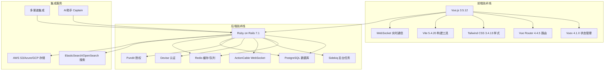

### 核心特性

1. **全渠道支持**: 网站聊天、邮件、Facebook、Instagram、Twitter、WhatsApp、Telegram、SMS等
2. **AI助手**: Captain AI代理自动处理常见查询
3. **团队协作**: 内部备注、@提及、标签分类、快捷回复
4. **自动化**: 自动分配、自动回复、工作流程自动化
5. **报表分析**: 对话、客服、收件箱、标签和团队报表
6. **帮助中心**: 内置知识库门户
7. **企业功能**: SAML SSO、高级报表、API限制等

## 整体架构设计

### 系统架构图

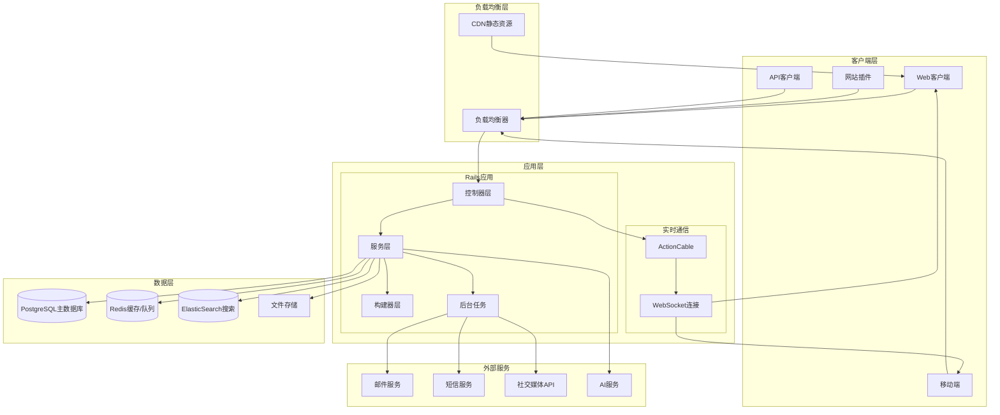

### 数据流时序图

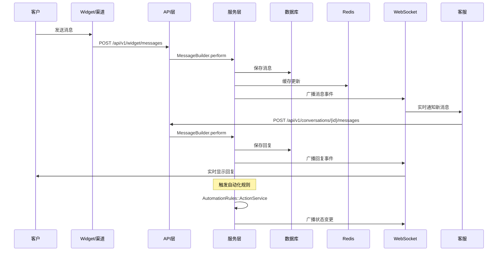

## 核心模块分析

### 1. 用户认证与授权模块

#### 核心模型: User

User模型是系统的核心用户实体，支持多种认证方式和双因素认证：

```ruby
class User < ApplicationRecord
  # 认证相关 - 使用Devise提供完整的用户认证功能
  # - database_authenticatable: 用户名密码认证
  # - registerable: 用户注册
  # - recoverable: 密码找回
  # - rememberable: 记住登录状态
  # - trackable: 跟踪登录信息
  # - validatable: 邮箱格式验证
  # - confirmable: 邮箱确认
  # - two_factor_authenticatable: 双因素认证(MFA)
  # - omniauthable: 第三方登录(Google OAuth2, SAML)

  # 在线状态枚举
  enum availability: { online: 0, offline: 1, busy: 2 }

  # 关联关系
  has_many :account_users, dependent: :destroy_async  # 用户账户关系
  has_many :accounts, through: :account_users         # 多租户支持
  has_many :assigned_conversations                    # 分配的对话
  has_many :messages, as: :sender                     # 发送的消息
  has_many :inbox_members                             # 收件箱成员关系

  # 双因素认证加密字段
  encrypts :otp_secret, deterministic: true          # OTP密钥
  encrypts :otp_backup_codes                         # 备用验证码
end
```

#### 认证控制器架构

```mermaid
graph TB
    subgraph "认证路由层"
        A[/auth/* - DeviseTokenAuth路由]
        B[/auth/saml_login - SAML认证]
        C[/profile - 用户配置]
    end

    subgraph "控制器层"
        D[DeviseOverrides::SessionsController]
        E[DeviseOverrides::PasswordsController]
        F[DeviseOverrides::OmniauthCallbacksController]
        G[Api::V1::ProfileController]
    end

    subgraph "服务层"
        H[SsoAuthenticatable模块]
        I[AccessTokenable模块]
        J[Devise双因素认证]
    end

    A --> D
    A --> E
    A --> F
    B --> G
    C --> G

    D --> H
    E --> I
    F --> H
    G --> J
```

### 2. 消息处理核心模块

#### 消息模型架构

Message模型是系统的核心消息实体，支持多种消息类型和富媒体内容：

```ruby
class Message < ApplicationRecord
  # 消息类型枚举
  enum message_type: {
    incoming: 0,    # 客户发送的消息
    outgoing: 1,    # 客服回复的消息
    activity: 2,    # 系统活动消息
    template: 3     # 模板消息
  }

  # 内容类型枚举 - 支持多种富媒体内容
  enum content_type: {
    text: 0,           # 纯文本
    input_text: 1,     # 文本输入框
    input_textarea: 2, # 多行文本框
    input_email: 3,    # 邮箱输入
    input_select: 4,   # 选择框
    cards: 5,          # 卡片消息
    form: 6,           # 表单
    article: 7,        # 知识库文章
    incoming_email: 8, # 入站邮件
    input_csat: 9,     # 满意度评价
    integrations: 10,  # 集成消息
    sticker: 11,       # 贴纸
    voice_call: 12     # 语音通话
  }

  # 消息状态
  enum status: { sent: 0, delivered: 1, read: 2, failed: 3 }

  # 关联关系
  belongs_to :account
  belongs_to :inbox
  belongs_to :conversation, touch: true  # 更新对话的updated_at
  belongs_to :sender, polymorphic: true  # 多态关联支持User和Contact

  # 附件支持
  has_many :attachments, dependent: :destroy, autosave: true

  # 回调处理
  after_create_commit :execute_after_create_commit_callbacks
  after_update_commit :dispatch_update_event
end
```

#### 消息构建器 (MessageBuilder)

MessageBuilder是消息创建的核心组件，负责处理所有消息创建逻辑：

```ruby
class Messages::MessageBuilder
  # 初始化消息构建器
  # @param user [User] 发送用户(客服)
  # @param conversation [Conversation] 所属对话
  # @param params [Hash] 消息参数
  def initialize(user, conversation, params)
    @params = params
    @private = params[:private] || false        # 是否为私有备注
    @conversation = conversation
    @user = user
    @message_type = params[:message_type] || 'outgoing'
    @attachments = params[:attachments]         # 附件列表
    @automation_rule = content_attributes&.dig(:automation_rule_id)
  end

  # 执行消息创建流程
  def perform
    @message = @conversation.messages.build(message_params)
    process_attachments    # 处理附件
    process_emails        # 处理邮件相关字段
    @message.save!        # 保存消息，触发回调和事件
    @message
  end

  private

  # 处理附件上传
  def process_attachments
    return if @attachments.blank?

    @attachments.each do |uploaded_attachment|
      attachment = @message.attachments.build(
        account_id: @message.account_id,
        file: uploaded_attachment
      )

      # 根据文件类型设置附件类型
      attachment.file_type = if uploaded_attachment.is_a?(String)
                               file_type_by_signed_id(uploaded_attachment)
                             else
                               file_type(uploaded_attachment&.content_type)
                             end
    end
  end

  # 处理邮件消息的抄送、密送等字段
  def process_emails
    return unless @conversation.inbox&.inbox_type == 'Email'

    cc_emails = process_email_string(@params[:cc_emails])
    bcc_emails = process_email_string(@params[:bcc_emails])
    to_emails = process_email_string(@params[:to_emails])

    # 验证邮箱地址格式
    all_email_addresses = cc_emails + bcc_emails + to_emails
    validate_email_addresses(all_email_addresses)

    # 存储到消息的content_attributes中
    @message.content_attributes[:cc_emails] = cc_emails
    @message.content_attributes[:bcc_emails] = bcc_emails
    @message.content_attributes[:to_emails] = to_emails
  end

  # 构建消息参数
  def message_params
    {
      account_id: @conversation.account_id,
      inbox_id: @conversation.inbox_id,
      message_type: message_type,
      content: @params[:content],
      private: @private,
      sender: sender,                    # 动态确定发送者
      content_type: @params[:content_type],
      items: @items,                     # 表单项
      in_reply_to: @in_reply_to,        # 回复的消息ID
      echo_id: @params[:echo_id],       # 前端临时ID
      source_id: @params[:source_id]    # 外部系统消息ID
    }.merge(external_created_at)        # 外部创建时间
     .merge(automation_rule_id)         # 自动化规则ID
     .merge(campaign_id)                # 营销活动ID
     .merge(template_params)            # 模板参数
  end
end
```

#### 消息处理时序图

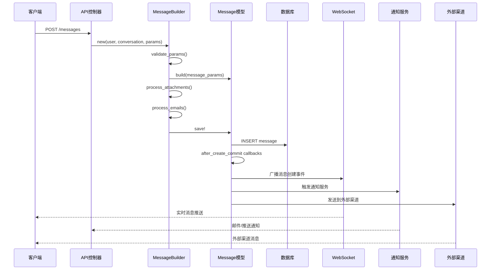

### 3. 对话管理模块

#### 对话模型 (Conversation)

对话是Chatwoot的核心实体，连接客户、客服和消息：

```ruby
class Conversation < ApplicationRecord
  # 对话状态枚举
  enum status: {
    open: 0,      # 进行中
    resolved: 1,  # 已解决
    pending: 2,   # 等待中(通常是机器人转人工)
    snoozed: 3    # 已暂停
  }

  # 优先级枚举
  enum priority: { low: 0, medium: 1, high: 2, urgent: 3 }

  # 核心关联关系
  belongs_to :account                    # 所属账户
  belongs_to :inbox                      # 所属收件箱
  belongs_to :contact                    # 关联客户
  belongs_to :contact_inbox              # 客户-收件箱关系
  belongs_to :assignee, class_name: 'User', optional: true  # 分配的客服
  belongs_to :team, optional: true      # 分配的团队

  # 消息和附件
  has_many :messages, dependent: :destroy_async
  has_many :attachments, through: :messages

  # 参与者和通知
  has_many :conversation_participants, dependent: :destroy_async
  has_many :notifications, as: :primary_actor

  # 重要的业务逻辑方法

  # 检查是否可以回复(基于消息窗口策略)
  def can_reply?
    Conversations::MessageWindowService.new(self).can_reply?
  end

  # 切换对话状态
  def toggle_status
    self.status = open? ? :resolved : :open
    self.status = :open if pending? || snoozed?
    save
  end

  # 机器人转人工
  def bot_handoff!
    open!
    dispatcher_dispatch(CONVERSATION_BOT_HANDOFF)
  end

  # 获取未读消息
  def unread_messages
    agent_last_seen_at.present? ? messages.created_since(agent_last_seen_at) : messages
  end

  # 获取未读的客户消息
  def unread_incoming_messages
    unread_messages.where(account_id: account_id).incoming.last(10)
  end
end
```

### 4. 收件箱与渠道模块

#### 收件箱模型架构

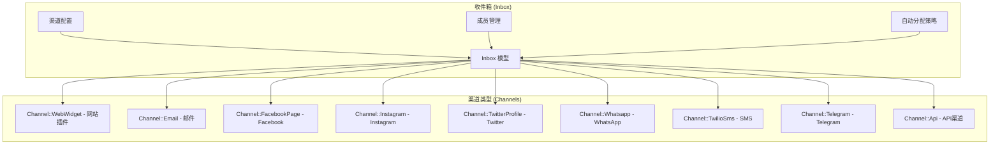

**Inbox模型核心功能:**

```ruby
class Inbox < ApplicationRecord
  # 发送者名称类型
  enum sender_name_type: { friendly: 0, professional: 1 }

  # 多态关联到不同的渠道
  belongs_to :channel, polymorphic: true, dependent: :destroy

  # 收件箱成员管理
  has_many :inbox_members, dependent: :destroy_async
  has_many :members, through: :inbox_members, source: :user

  # 对话和消息
  has_many :conversations, dependent: :destroy_async
  has_many :messages, dependent: :destroy_async

  # 自动分配策略
  has_one :inbox_assignment_policy, dependent: :destroy
  has_one :assignment_policy, through: :inbox_assignment_policy

  # 机器人配置
  has_one :agent_bot_inbox, dependent: :destroy_async
  has_one :agent_bot, through: :agent_bot_inbox

  # 渠道类型判断方法
  def web_widget?
    channel_type == 'Channel::WebWidget'
  end

  def email?
    channel_type == 'Channel::Email'
  end

  def facebook?
    channel_type == 'Channel::FacebookPage'
  end

  def whatsapp?
    channel_type == 'Channel::Whatsapp'
  end

  # 获取可分配的客服列表
  def assignable_agents
    (account.users.where(id: members.select(:user_id)) + account.administrators).uniq
  end

  # 检查是否有活跃的机器人
  def active_bot?
    agent_bot_inbox&.active? || hooks.where(app_id: %w[dialogflow], status: 'enabled').count.positive?
  end

  # 获取回调webhook URL(用于外部服务回调)
  def callback_webhook_url
    case channel_type
    when 'Channel::TwilioSms'
      "#{ENV.fetch('FRONTEND_URL', nil)}/twilio/callback"
    when 'Channel::Whatsapp'
      "#{ENV.fetch('FRONTEND_URL', nil)}/webhooks/whatsapp/#{channel.phone_number}"
    when 'Channel::Line'
      "#{ENV.fetch('FRONTEND_URL', nil)}/webhooks/line/#{channel.line_channel_id}"
    end
  end
end
```

### 5. 联系人管理模块

#### 联系人模型

```ruby
class Contact < ApplicationRecord
  # 联系人类型
  enum contact_type: { visitor: 0, lead: 1, customer: 2 }

  # 验证规则
  validates :email,
    uniqueness: { scope: [:account_id], case_sensitive: false },
    format: { with: Devise.email_regexp }
  validates :phone_number,
    uniqueness: { scope: [:account_id] },
    format: { with: /\+[1-9]\d{1,14}\z/ }  # E.164格式
  validates :identifier, uniqueness: { scope: [:account_id] }

  # 关联关系
  belongs_to :account
  has_many :conversations, dependent: :destroy_async
  has_many :contact_inboxes, dependent: :destroy_async  # 多收件箱支持
  has_many :inboxes, through: :contact_inboxes
  has_many :messages, as: :sender
  has_many :notes, dependent: :destroy_async           # 客服备注

  # 业务逻辑

  # 获取在指定收件箱中的源ID
  def get_source_id(inbox_id)
    contact_inboxes.find_by!(inbox_id: inbox_id).source_id
  end

  # 推送事件数据格式
  def push_event_data
    {
      additional_attributes: additional_attributes,
      custom_attributes: custom_attributes,
      email: email,
      id: id,
      identifier: identifier,
      name: name,
      phone_number: phone_number,
      thumbnail: avatar_url,
      blocked: blocked,
      type: 'contact'
    }
  end

  # 根据邮箱查找联系人
  def self.from_email(email)
    find_by(email: email&.downcase)
  end

  # 获取已识别的联系人(有邮箱、手机号或标识符)
  def self.resolved_contacts(use_crm_v2: false)
    if use_crm_v2
      where(contact_type: 'lead')
    else
      where("contacts.email <> '' OR contacts.phone_number <> '' OR contacts.identifier <> ''")
    end
  end
end
```

## API接口深度分析

### API路由架构

Chatwoot的API采用RESTful设计，支持多个版本和不同的访问层级：

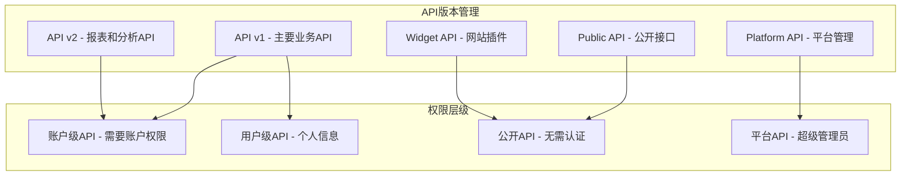

### 核心API端点分析

#### 1. 对话管理API

**API路径**: `/api/v1/accounts/:account_id/conversations`

**控制器**: `Api::V1::Accounts::ConversationsController`

```ruby
class Api::V1::Accounts::ConversationsController < Api::V1::Accounts::BaseController
  before_action :conversation, except: [:index, :meta, :search, :create, :filter]
  before_action :inbox, :contact, :contact_inbox, only: [:create]

  # GET /api/v1/accounts/:account_id/conversations
  # 获取对话列表，支持分页和过滤
  def index
    result = conversation_finder.perform
    @conversations = result[:conversations]
    @conversations_count = result[:count]
  end

  # GET /api/v1/accounts/:account_id/conversations/meta
  # 获取对话统计信息
  def meta
    result = conversation_finder.perform
    @conversations_count = result[:count]
  end

  # GET /api/v1/accounts/:account_id/conversations/search
  # 搜索对话
  def search
    result = conversation_finder.perform
    @conversations = result[:conversations]
    @conversations_count = result[:count]
  end

  # POST /api/v1/accounts/:account_id/conversations
  # 创建新对话
  def create
    ActiveRecord::Base.transaction do
      @conversation = ConversationBuilder.new(
        params: params,
        contact_inbox: @contact_inbox
      ).perform

      # 如果有初始消息，创建消息
      if params[:message].present?
        Messages::MessageBuilder.new(
          Current.user,
          @conversation,
          params[:message]
        ).perform
      end
    end
  end

  # PATCH /api/v1/accounts/:account_id/conversations/:id
  # 更新对话信息
  def update
    @conversation.update!(permitted_update_params)
  end

  # POST /api/v1/accounts/:account_id/conversations/filter
  # 高级过滤对话
  def filter
    result = ::Conversations::FilterService.new(
      params.permit!,
      current_user,
      current_account
    ).perform
    @conversations = result[:conversations]
    @conversations_count = result[:count]
  rescue CustomExceptions::CustomFilter::InvalidAttribute => e
    render_could_not_create_error(e.message)
  end

  # POST /api/v1/accounts/:account_id/conversations/:id/mute
  # 静音对话
  def mute
    @conversation.mute!
    head :ok
  end

  # POST /api/v1/accounts/:account_id/conversations/:id/unmute
  # 取消静音
  def unmute
    @conversation.unmute!
    head :ok
  end

  # POST /api/v1/accounts/:account_id/conversations/:id/toggle_status
  # 切换对话状态
  def toggle_status
    @conversation.toggle_status
    head :ok
  end

  # POST /api/v1/accounts/:account_id/conversations/:id/toggle_priority
  # 设置对话优先级
  def toggle_priority
    @conversation.toggle_priority(permitted_params[:priority])
    head :ok
  end

  # GET /api/v1/accounts/:account_id/conversations/:id/attachments
  # 获取对话的附件列表
  def attachments
    @attachments_count = @conversation.attachments.count
    @attachments = @conversation.attachments
                                .includes(:message)
                                .order(created_at: :desc)
                                .page(attachment_params[:page])
                                .per(ATTACHMENT_RESULTS_PER_PAGE)
  end
end
```

**API调用链路时序图**:

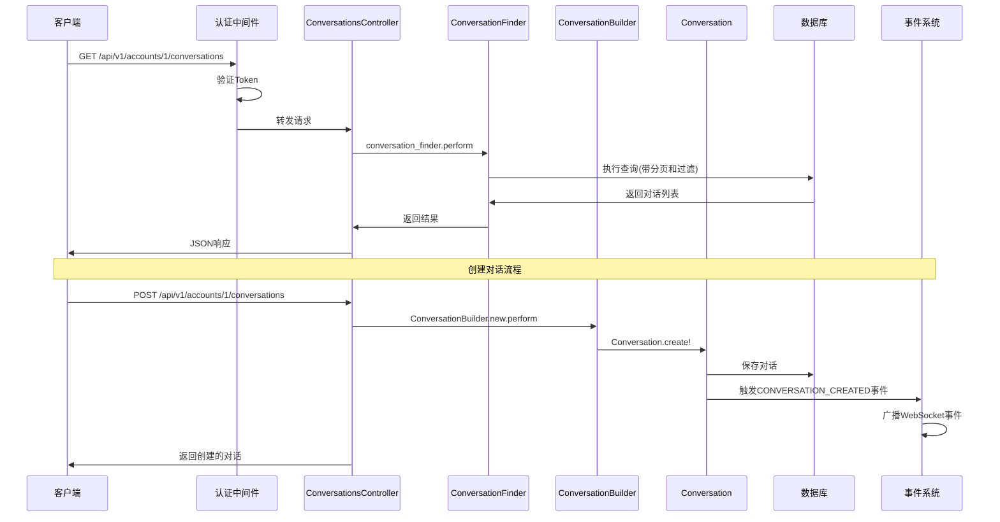

## 服务层架构分析

### 服务层设计模式

Chatwoot采用服务对象模式来封装复杂的业务逻辑，每个服务类都有明确的职责：

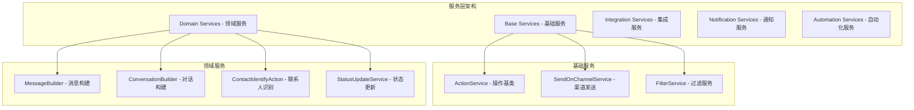

## 数据结构与关系图

### 核心实体关系图 (ERD)

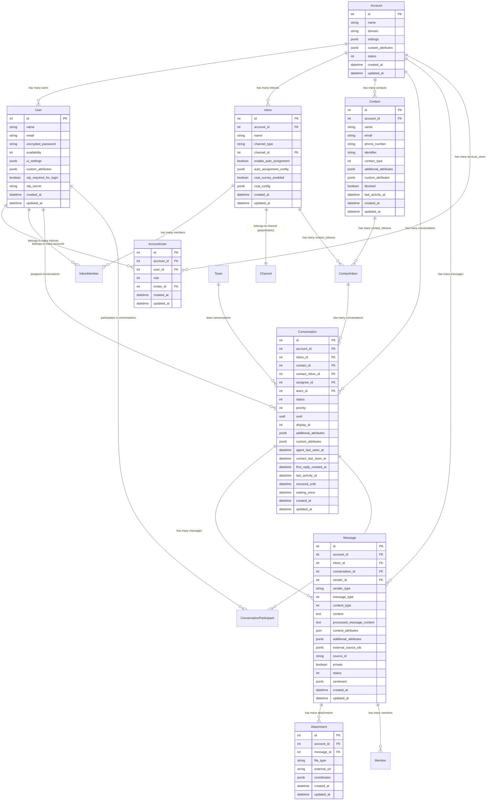

### 消息类型与内容类型关系

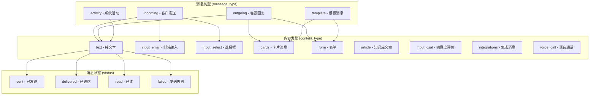

### 权限与角色体系

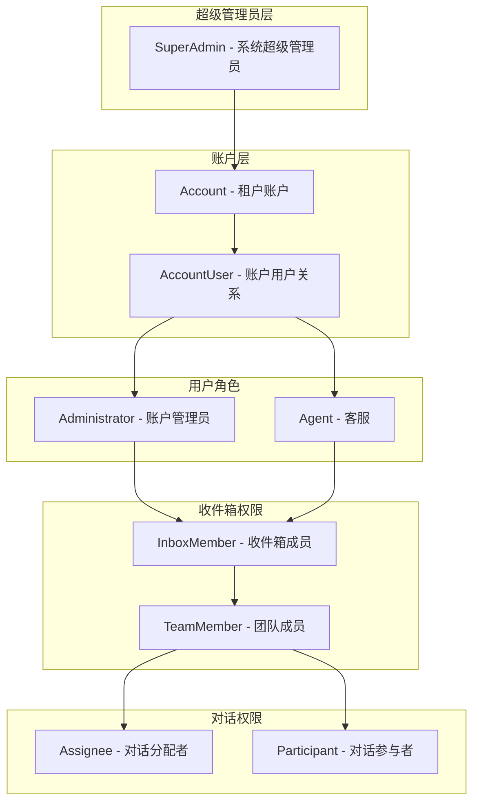

## 关键功能深度分析

### 1. 实时通信系统 (WebSocket)

Chatwoot使用Rails ActionCable实现实时通信，支持多种事件类型：

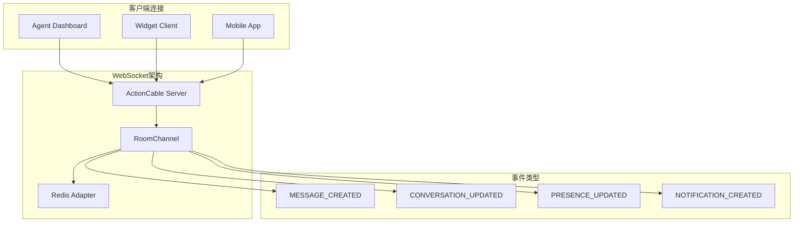

### 2. 自动化规则引擎

Chatwoot的自动化规则系统支持复杂的条件判断和动作执行：

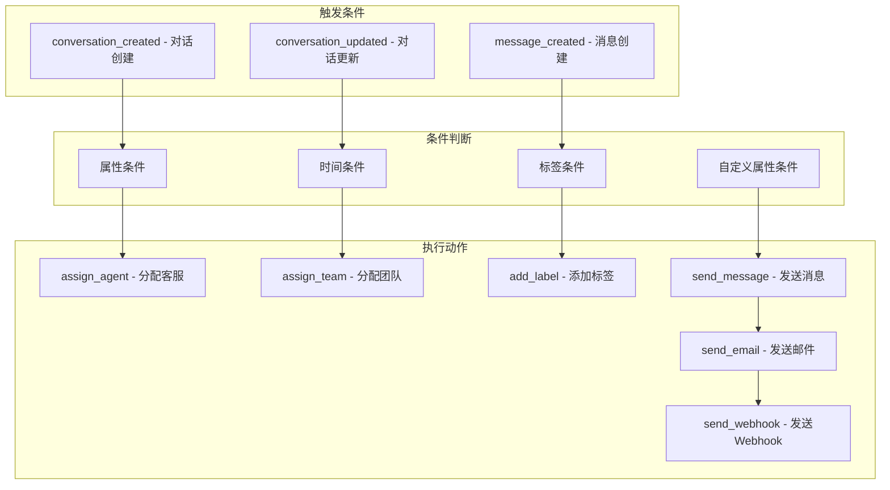

### 3. 多渠道消息路由

Chatwoot支持多种通信渠道，每种渠道都有专门的处理服务：

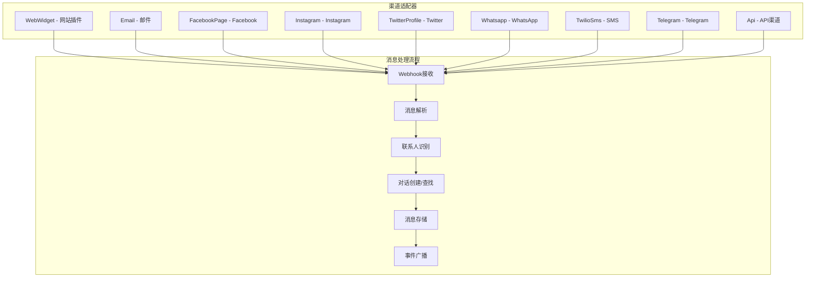

## 总结

这份Chatwoot源码深度剖析文档提供了从架构设计到具体实现的全面分析。通过学习这个项目，开发者可以掌握：

1. **现代Rails应用架构**: 多租户、事件驱动、服务对象等设计模式
2. **实时通信实现**: ActionCable WebSocket的实际应用
3. **多渠道集成策略**: 统一的消息处理和渠道适配模式
4. **权限控制系统**: 基于Pundit的细粒度权限管理
5. **性能优化技巧**: 数据库优化、缓存策略、异步处理
6. **安全最佳实践**: 认证、授权、数据保护等安全措施

这个项目展示了如何构建一个生产级的SaaS应用，包含了完整的用户管理、多租户支持、实时通信、第三方集成等现代Web应用的核心功能。无论是学习Rails开发还是理解复杂业务系统的架构设计，Chatwoot都是一个优秀的参考项目。
