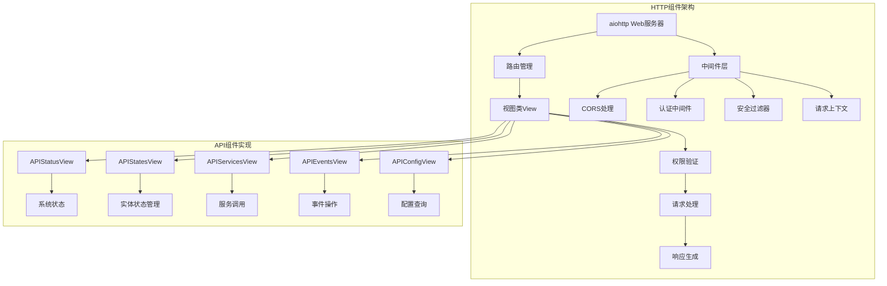
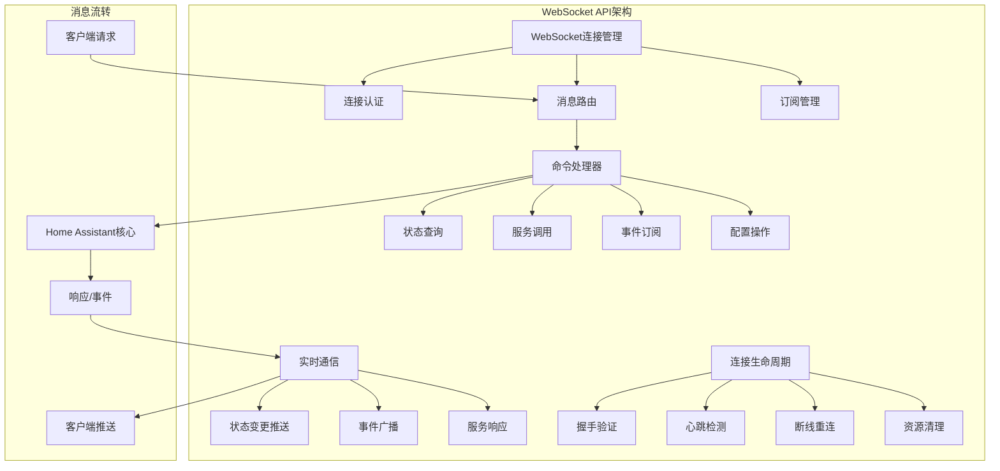

## 概述

Home Assistant 对外提供了多种API接口，为第三方客户端、前端界面和集成开发者提供完整的系统控制能力。本文档深入分析以下三种主要API接口：

1. **REST API** - 传统的HTTP RESTful接口
2. **WebSocket API** - 实时双向通信接口 
3. **Server-Sent Events (SSE)** - 单向事件流接口

这些API构成了Home Assistant完整的对外服务体系，支撑着丰富的生态系统应用。

## 1. REST API 架构分析

### 1.1 整体架构设计



### 1.2 HTTP组件核心实现

```python
# homeassistant/components/http/__init__.py - HTTP服务器核心
async def async_setup(hass: HomeAssistant, config: ConfigType) -> bool:
    """设置HTTP组件 - Home Assistant的HTTP服务初始化入口
    
    参数:
        hass: Home Assistant核心实例
        config: HTTP组件配置
        
    返回值:
        设置是否成功
    
    功能说明:
        - 初始化aiohttp web应用和服务器
        - 配置SSL证书和安全设置
        - 设置中间件和路由处理
        - 启动HTTP服务监听
    """
    # 解析HTTP配置
    conf = config.get(DOMAIN, {})
    
    # 创建aiohttp应用实例
    app = web.Application(
        client_max_size=MAX_CLIENT_SIZE,        # 最大请求体大小: 16MB
        middlewares=[
            cors_middleware,                     # CORS跨域处理中间件
            security_filter_middleware,         # 安全过滤中间件
            forwarded_middleware,                # 代理转发中间件
            ban_middleware,                      # IP封禁中间件
        ]
    )
    
    # 设置应用数据
    app[KEY_HASS] = hass
    app[KEY_AUTHENTICATED] = DATA_AUTHENTICATED
    app[KEY_ALLOW_CONFIGURED_CORS] = conf[CONF_CORS_ORIGINS]
    
    # 配置SSL上下文
    ssl_context = None
    if conf.get(CONF_SSL_CERTIFICATE):
        ssl_context = await _create_ssl_context(conf)
    
    # 启动HTTP服务器
    runner = web.AppRunner(app, access_log=None)
    await runner.setup()
    
    # 绑定监听地址和端口
    sites = []
    for host in conf[CONF_SERVER_HOST]:
        site = HomeAssistantTCPSite(
            runner, 
            host, 
            conf[CONF_SERVER_PORT],
            ssl_context=ssl_context
        )
        await site.start()
        sites.append(site)
    
    # 将HTTP组件引用保存到hass实例
    hass.http = HomeAssistantHTTP(app, runner, sites, ssl_context)
    
    return True

class HomeAssistantView:
    """Home Assistant视图基类 - 所有API视图的基类
    
    提供了通用的请求处理、响应生成、权限验证等功能。
    每个具体的API端点都继承此类并实现对应的HTTP方法。
    """
    
    # 子类需要定义的属性
    url: str = None                    # URL路径模式
    name: str = None                   # 视图名称
    requires_auth: bool = True         # 是否需要认证
    cors_allowed: bool = False         # 是否允许跨域
    
    def json(
        self, 
        result: Any, 
        status_code: HTTPStatus = HTTPStatus.OK
    ) -> web.Response:
        """生成JSON响应
        
        参数:
            result: 要序列化的数据对象
            status_code: HTTP状态码
            
        返回值:
            aiohttp web响应对象
        """
        return web.Response(
            body=json_dumps(result).encode("utf-8"),
            content_type=CONTENT_TYPE_JSON,
            status=status_code,
        )
    
    def json_message(
        self, 
        message: str, 
        status_code: HTTPStatus = HTTPStatus.OK
    ) -> web.Response:
        """生成包含消息的JSON响应"""
        return self.json({"message": message}, status_code)
    
    def context(self, request: web.Request) -> Context:
        """从请求中提取操作上下文
        
        参数:
            request: HTTP请求对象
            
        返回值:
            包含用户和来源信息的Context对象
        """
        if KEY_HASS_USER in request:
            return Context(user_id=request[KEY_HASS_USER].id)
        return Context()
```

### 1.3 主要API端点实现

#### 1.3.1 状态管理API

```python
class APIStatesView(HomeAssistantView):
    """状态管理API视图 - 处理所有实体状态的查询和操作"""
    
    url = "/api/states"  # URL路径
    name = "api:states"  # 视图名称
    
    @ha.callback
    def get(self, request: web.Request) -> web.Response:
        """获取所有实体状态 - GET /api/states
        
        功能说明:
            - 返回系统中所有可见实体的状态
            - 根据用户权限过滤实体列表
            - 优化的JSON序列化和压缩输出
            - 支持高并发访问
        
        权限控制:
            - 管理员用户: 返回所有实体状态
            - 普通用户: 只返回有读取权限的实体状态
        
        性能优化:
            - 直接生成JSON字符串，避免中间对象创建
            - 启用响应压缩以减少传输数据量
            - 使用生成器表达式减少内存使用
        """
        user: User = request[KEY_HASS_USER]
        hass = request.app[KEY_HASS]
        
        if user.is_admin:
            # 管理员用户获取所有状态
            states = (state.as_dict_json for state in hass.states.async_all())
        else:
            # 普通用户根据权限过滤
            entity_perm = user.permissions.check_entity
            states = (
                state.as_dict_json
                for state in hass.states.async_all()
                if entity_perm(state.entity_id, "read")
            )
        
        # 高效的JSON数组构建和响应生成
        response = web.Response(
            body=b"".join((b"[", b",".join(states), b"]")),
            content_type=CONTENT_TYPE_JSON,
            zlib_executor_size=32768,  # 异步压缩配置
        )
        response.enable_compression()
        return response

class APIEntityStateView(HomeAssistantView):
    """单个实体状态API视图 - 处理特定实体的状态操作"""
    
    url = "/api/states/{entity_id}"  # 动态路径参数
    name = "api:entity-state"
    
    @ha.callback
    def get(self, request: web.Request, entity_id: str) -> web.Response:
        """获取单个实体状态 - GET /api/states/{entity_id}
        
        参数:
            entity_id: 实体ID，格式为"domain.object_id"
        
        权限验证:
            - 检查用户是否有该实体的读取权限
            - 无权限时抛出Unauthorized异常
        
        返回值:
            - 成功: 实体状态的JSON表示
            - 未找到: 404错误信息
            - 无权限: 401错误
        """
        user: User = request[KEY_HASS_USER]
        hass = request.app[KEY_HASS]
        
        # 权限检查
        if not user.permissions.check_entity(entity_id, POLICY_READ):
            raise Unauthorized(entity_id=entity_id)
        
        # 状态查询
        if state := hass.states.get(entity_id):
            return web.Response(
                body=state.as_dict_json,  # 预序列化的JSON
                content_type=CONTENT_TYPE_JSON,
            )
        
        return self.json_message("Entity not found.", HTTPStatus.NOT_FOUND)
    
    async def post(self, request: web.Request, entity_id: str) -> web.Response:
        """更新实体状态 - POST /api/states/{entity_id}
        
        请求体格式:
        {
            "state": "new_state_value",
            "attributes": {"attr1": "value1"},
            "force_update": false
        }
        
        功能说明:
            - 仅管理员用户可以通过API直接设置状态
            - 支持状态值和属性的更新
            - 支持强制更新选项
            - 自动生成操作上下文和事件
        """
        user: User = request[KEY_HASS_USER]
        if not user.is_admin:
            raise Unauthorized(entity_id=entity_id)
        
        hass = request.app[KEY_HASS]
        
        # 解析请求体
        body = await request.text()
        try:
            data: Any = json_loads(body) if body else None
        except ValueError:
            return self.json_message("Invalid JSON specified.", HTTPStatus.BAD_REQUEST)
        
        # 参数验证
        if not isinstance(data, dict):
            return self.json_message(
                "State data should be a JSON object.", HTTPStatus.BAD_REQUEST
            )
        if (new_state := data.get("state")) is None:
            return self.json_message("No state specified.", HTTPStatus.BAD_REQUEST)
        
        # 提取参数
        attributes = data.get("attributes")
        force_update = data.get("force_update", False)
        
        is_new_state = hass.states.get(entity_id) is None
        
        # 状态设置
        try:
            hass.states.async_set(
                entity_id, new_state, attributes, force_update, self.context(request)
            )
        except InvalidEntityFormatError:
            return self.json_message(
                "Invalid entity ID specified.", HTTPStatus.BAD_REQUEST
            )
        except InvalidStateError:
            return self.json_message("Invalid state specified.", HTTPStatus.BAD_REQUEST)
        
        # 返回更新后的状态
        status_code = HTTPStatus.CREATED if is_new_state else HTTPStatus.OK
        state = hass.states.get(entity_id)
        assert state
        
        resp = self.json(state.as_dict(), status_code)
        resp.headers.add("Location", f"/api/states/{entity_id}")
        
        return resp
```

#### 1.3.2 服务调用API

```python
class APIDomainServicesView(HomeAssistantView):
    """服务调用API视图 - 处理服务调用请求的核心实现"""
    
    url = "/api/services/{domain}/{service}"
    name = "api:domain-services"
    
    async def post(
        self, request: web.Request, domain: str, service: str
    ) -> web.Response:
        """调用服务 - POST /api/services/{domain}/{service}
        
        参数:
            domain: 服务域名，如"light"、"switch"等
            service: 服务名称，如"turn_on"、"turn_off"等
        
        请求体格式:
        {
            "entity_id": "light.living_room",
            "brightness": 255,
            "color_name": "red"
        }
        
        查询参数:
            ?return_response=1: 请求返回服务响应数据
        
        功能说明:
            - 支持同步和异步服务调用
            - 自动验证服务参数
            - 跟踪服务调用引起的状态变更
            - 支持服务响应数据返回
            - 完整的错误处理和异常恢复
        """
        hass = request.app[KEY_HASS]
        
        # 解析请求体
        body = await request.text()
        try:
            data = json_loads(body) if body else None
        except ValueError:
            return self.json_message(
                "Data should be valid JSON.", HTTPStatus.BAD_REQUEST
            )
        
        # 服务存在性检查
        if not hass.services.has_service(domain, service):
            raise HTTPBadRequest from ServiceNotFound(domain, service)
        
        context = self.context(request)
        
        # 响应数据支持检查
        response_requested = "return_response" in request.query
        service_supports_response = hass.services.supports_response(domain, service)
        
        if response_requested and service_supports_response is ha.SupportsResponse.NONE:
            return self.json_message(
                "Service does not support responses.", HTTPStatus.BAD_REQUEST
            )
        elif service_supports_response is ha.SupportsResponse.ONLY and not response_requested:
            return self.json_message(
                "Service call requires responses but caller did not ask for responses.",
                HTTPStatus.BAD_REQUEST,
            )
        
        # 状态变更跟踪
        changed_states: list[json_fragment] = []
        
        @ha.callback
        def _async_save_changed_entities(
            event: Event[EventStateChangedData],
        ) -> None:
            """跟踪由服务调用引起的状态变更"""
            if event.context == context and (state := event.data["new_state"]):
                changed_states.append(state.json_fragment)
        
        # 注册状态变更监听器
        cancel_listen = hass.bus.async_listen(
            EVENT_STATE_CHANGED,
            _async_save_changed_entities,
        )
        
        try:
            # 防止连接断开时取消服务调用
            response = await shield(
                hass.services.async_call(
                    domain,
                    service,
                    data,
                    blocking=True,              # 阻塞等待服务完成
                    context=context,
                    return_response=response_requested,
                )
            )
        except (vol.Invalid, ServiceNotFound) as ex:
            raise HTTPBadRequest from ex
        finally:
            cancel_listen()
        
        # 构造响应
        if response_requested:
            return self.json({
                "changed_states": changed_states,
                "service_response": response
            })
        
        return self.json(changed_states)
```

#### 1.3.3 事件流API (Server-Sent Events)

```python
class APIEventStream(HomeAssistantView):
    """事件流API - 基于Server-Sent Events的实时事件推送
    
    提供持久化的HTTP连接，实时推送系统事件给客户端。
    相比WebSocket更简单，但只支持服务器到客户端的单向通信。
    """
    
    url = "/api/stream"
    name = "api:stream"
    
    @require_admin  # 需要管理员权限
    async def get(self, request: web.Request) -> web.StreamResponse:
        """建立事件流连接 - GET /api/stream
        
        查询参数:
            ?restrict=event_type1,event_type2: 限制推送的事件类型
        
        响应格式:
            Content-Type: text/event-stream
            
            data: {"event_type": "state_changed", "data": {...}}
            
            data: ping
            
        功能特性:
            - 实时事件推送
            - 事件类型过滤
            - 连接保活机制
            - 自动重连支持
            - 连接状态监控
        """
        hass = request.app[KEY_HASS]
        stop_obj = object()  # 停止信号标识
        to_write: asyncio.Queue[object | str] = asyncio.Queue()
        
        # 解析事件类型限制
        restrict: list[EventType[Any] | str] | None = None
        if restrict_str := request.query.get("restrict"):
            restrict = [*restrict_str.split(","), EVENT_HOMEASSISTANT_STOP]
        
        async def forward_events(event: Event) -> None:
            """转发事件到客户端
            
            参数:
                event: 要转发的事件对象
            
            功能说明:
                - 应用事件类型过滤
                - 序列化事件数据
                - 处理系统停止事件
                - 异步队列缓冲
            """
            # 事件过滤
            if restrict and event.event_type not in restrict:
                return
            
            _LOGGER.debug("STREAM %s FORWARDING %s", id(stop_obj), event)
            
            # 特殊处理系统停止事件
            if event.event_type == EVENT_HOMEASSISTANT_STOP:
                data = stop_obj
            else:
                data = json_dumps(event)  # 序列化事件数据
            
            await to_write.put(data)
        
        # 创建流响应
        response = web.StreamResponse()
        response.content_type = "text/event-stream"
        response.headers["Cache-Control"] = "no-cache"
        response.headers["Connection"] = "keep-alive"
        await response.prepare(request)
        
        # 注册全局事件监听器
        unsub_stream = hass.bus.async_listen(MATCH_ALL, forward_events)
        
        try:
            _LOGGER.debug("STREAM %s ATTACHED", id(stop_obj))
            
            # 发送初始ping以触发浏览器的open事件
            await to_write.put(STREAM_PING_PAYLOAD)
            
            # 事件流循环
            while True:
                try:
                    # 等待事件或超时（50秒）
                    async with timeout(STREAM_PING_INTERVAL):
                        payload = await to_write.get()
                    
                    # 检查停止信号
                    if payload is stop_obj:
                        break
                    
                    # 发送事件数据
                    msg = f"data: {payload}\n\n"
                    _LOGGER.debug("STREAM %s WRITING %s", id(stop_obj), msg.strip())
                    await response.write(msg.encode("UTF-8"))
                    
                except TimeoutError:
                    # 超时发送ping保持连接
                    await to_write.put(STREAM_PING_PAYLOAD)
            
        except asyncio.CancelledError:
            _LOGGER.debug("STREAM %s ABORT", id(stop_obj))
        finally:
            _LOGGER.debug("STREAM %s RESPONSE CLOSED", id(stop_obj))
            unsub_stream()  # 清理事件监听器
        
        return response
```

## 2. WebSocket API 架构分析

### 2.1 WebSocket API整体架构



### 2.2 WebSocket连接管理

```python
# homeassistant/components/websocket_api/connection.py
class ActiveConnection:
    """WebSocket活动连接管理器
    
    负责单个WebSocket连接的完整生命周期管理，包括：
    - 连接认证和权限控制
    - 消息接收和分发处理
    - 订阅管理和事件推送
    - 连接状态监控和异常处理
    """
    
    def __init__(
        self,
        logger: logging.Logger,
        hass: HomeAssistant,
        request: web.Request,
        ws: web.WebSocketResponse,
        send_message_without_context: Callable[[dict[str, Any]], None]
    ):
        """初始化活动连接
        
        参数:
            logger: 日志记录器
            hass: Home Assistant核心实例
            request: HTTP请求对象
            ws: WebSocket响应对象  
            send_message_without_context: 消息发送函数
        """
        self.logger = logger
        self.hass = hass
        self.request = request
        self.wsock = ws
        self.send_message = send_message_without_context
        
        # 连接状态管理
        self._to_write: asyncio.Queue[str] = asyncio.Queue(maxsize=MAX_PENDING_MSG)
        self._handle_task: asyncio.Task | None = None
        self._writer_task: asyncio.Task | None = None
        
        # 认证和权限
        self.user: User | None = None
        self.refresh_token_id: str | None = None
        
        # 订阅管理
        self.subscriptions: dict[int, CALLBACK_TYPE] = {}  # ID -> 取消订阅函数
        self.last_id = 0  # 最后使用的订阅ID
        
        # 统计信息
        self.msg_sent = 0    # 发送消息计数
        self.msg_recv = 0    # 接收消息计数
        
    async def handle(self) -> None:
        """处理WebSocket连接的主循环
        
        功能说明:
            - 并发处理消息接收和发送
            - 连接状态监控和异常处理
            - 资源清理和连接关闭
        """
        try:
            # 启动消息写入任务
            self._writer_task = self.hass.async_create_task(
                self._writer(), 
                eager=True
            )
            
            # 启动消息处理任务
            self._handle_task = self.hass.async_create_task(
                self._handle_incoming_messages(),
                eager=True
            )
            
            # 等待任务完成或异常
            done, pending = await asyncio.wait(
                [self._writer_task, self._handle_task],
                return_when=asyncio.FIRST_COMPLETED,
            )
            
            # 清理未完成的任务
            for task in pending:
                task.cancel()
            
        except Exception:
            self.logger.exception("Unexpected error in WebSocket connection")
        finally:
            await self._close_connection()
    
    async def _handle_incoming_messages(self) -> None:
        """处理传入消息的异步循环
        
        消息格式:
        {
            "id": 1,
            "type": "command_type",
            "param1": "value1",
            "param2": "value2"
        }
        
        功能说明:
            - 解析JSON消息格式
            - 验证消息结构和权限
            - 路由到对应的命令处理器
            - 异常处理和错误响应
        """
        try:
            async for msg in self.wsock:
                if msg.type == aiohttp.WSMsgType.TEXT:
                    try:
                        # 解析JSON消息
                        data = json_loads(msg.data)
                        self.logger.debug("Received %s", data)
                        self.msg_recv += 1
                        
                        # 消息格式验证
                        if not isinstance(data, dict):
                            self.send_error(None, ERR_INVALID_FORMAT, "Message should be a JSON object")
                            continue
                            
                        if "type" not in data:
                            self.send_error(data.get("id"), ERR_MISSING_TYPE, "Missing message type")
                            continue
                        
                        # 查找消息处理器
                        msg_type = data["type"]
                        handler = HANDLERS.get(msg_type)
                        
                        if handler is None:
                            self.send_error(data.get("id"), ERR_UNKNOWN_COMMAND, f"Unknown command {msg_type}")
                            continue
                        
                        # 权限检查
                        if handler.admin_only and (not self.user or not self.user.is_admin):
                            self.send_error(data.get("id"), ERR_UNAUTHORIZED, "Admin access required")
                            continue
                        
                        # 执行命令处理器
                        await handler.async_handle(self, data)
                        
                    except ValueError:
                        self.send_error(None, ERR_INVALID_FORMAT, "Invalid JSON")
                    except Exception:
                        self.logger.exception("Error handling WebSocket message")
                        self.send_error(data.get("id"), ERR_UNKNOWN_ERROR, "Unknown error occurred")
                
                elif msg.type == aiohttp.WSMsgType.ERROR:
                    self.logger.error('WebSocket error: %s', self.wsock.exception())
                    break
                    
        except asyncio.CancelledError:
            pass
        except Exception:
            self.logger.exception("Unexpected error handling WebSocket messages")
    
    async def _writer(self) -> None:
        """消息发送的异步循环
        
        功能说明:
            - 从队列中获取待发送消息
            - 序列化和发送WebSocket消息  
            - 处理发送异常和连接断开
            - 消息发送统计和监控
        """
        try:
            while not self.wsock.closed:
                try:
                    # 从队列获取消息（阻塞等待）
                    message = await self._to_write.get()
                    
                    if message is None:  # 停止信号
                        break
                    
                    # 发送消息
                    await self.wsock.send_str(message)
                    self.msg_sent += 1
                    
                except ConnectionResetError:
                    self.logger.debug("Connection reset by peer")
                    break
                except Exception:
                    self.logger.exception("Error sending WebSocket message")
                    break
                    
        except asyncio.CancelledError:
            pass
    
    def send_result(self, msg_id: int | None, result: Any = None) -> None:
        """发送成功响应
        
        参数:
            msg_id: 请求消息ID
            result: 响应数据
        """
        self.send_message_impl({
            "id": msg_id,
            "type": TYPE_RESULT,
            "success": True,
            "result": result,
        })
    
    def send_error(
        self, 
        msg_id: int | None, 
        code: str, 
        message: str
    ) -> None:
        """发送错误响应
        
        参数:
            msg_id: 请求消息ID
            code: 错误代码
            message: 错误消息
        """
        self.send_message_impl({
            "id": msg_id,
            "type": TYPE_RESULT,
            "success": False,
            "error": {
                "code": code,
                "message": message,
            }
        })
```

### 2.3 主要WebSocket命令实现

#### 2.3.1 认证命令

```python
@websocket_api.websocket_command({
    vol.Required("type"): "auth",
    vol.Optional("access_token"): str,
})
@websocket_api.async_response
async def handle_auth(
    hass: HomeAssistant, 
    connection: ActiveConnection, 
    msg: dict[str, Any]
) -> None:
    """处理WebSocket认证命令
    
    请求格式:
    {
        "id": 1,
        "type": "auth", 
        "access_token": "eyJ0eXAiOiJKV1QiLCJhbGc..."
    }
    
    响应格式:
    {
        "id": 1,
        "type": "result",
        "success": true,
        "result": {
            "ha_version": "2024.1.0"
        }
    }
    
    功能说明:
        - 验证访问令牌有效性
        - 提取用户信息和权限
        - 建立认证上下文
        - 返回系统版本信息
    """
    if connection.user is not None:
        connection.send_error(msg["id"], ERR_ALREADY_AUTHENTICATED, "Already authenticated")
        return
    
    access_token = msg.get("access_token")
    if not access_token:
        connection.send_error(msg["id"], ERR_INVALID_AUTH, "Access token required")
        return
    
    try:
        # 验证访问令牌
        refresh_token = await hass.auth.async_validate_access_token(access_token)
        if refresh_token is None:
            connection.send_error(msg["id"], ERR_INVALID_AUTH, "Invalid access token")
            return
        
        # 设置用户上下文
        connection.user = refresh_token.user
        connection.refresh_token_id = refresh_token.id
        
        # 返回认证成功响应
        connection.send_result(msg["id"], {
            "ha_version": __version__,
        })
        
    except Exception:
        connection.logger.exception("Error during WebSocket authentication")
        connection.send_error(msg["id"], ERR_UNKNOWN_ERROR, "Authentication failed")
```

#### 2.3.2 状态订阅命令

```python
@websocket_api.websocket_command({
    vol.Required("type"): "subscribe_events",
    vol.Optional("event_type"): str,
})
@websocket_api.async_response
async def handle_subscribe_events(
    hass: HomeAssistant,
    connection: ActiveConnection, 
    msg: dict[str, Any]
) -> None:
    """订阅事件推送
    
    请求格式:
    {
        "id": 2,
        "type": "subscribe_events",
        "event_type": "state_changed"  // 可选，不指定则订阅所有事件
    }
    
    功能说明:
        - 建立事件监听器
        - 实时推送匹配的事件
        - 支持事件类型过滤
        - 自动管理订阅生命周期
    """
    if connection.user is None:
        connection.send_error(msg["id"], ERR_UNAUTHORIZED, "Authentication required")
        return
    
    event_type = msg.get("event_type", MATCH_ALL)
    
    @callback
    def forward_event(event: Event) -> None:
        """转发事件到WebSocket客户端
        
        参数:
            event: 要转发的事件对象
        
        推送格式:
        {
            "id": 2,
            "type": "event", 
            "event": {
                "event_type": "state_changed",
                "data": {...},
                "origin": "LOCAL",
                "time_fired": "2024-01-01T00:00:00.000000+00:00",
                "context": {...}
            }
        }
        """
        # 权限检查（如果是状态变更事件）
        if event.event_type == EVENT_STATE_CHANGED:
            entity_id = event.data["entity_id"]
            if not connection.user.permissions.check_entity(entity_id, "read"):
                return
        
        # 发送事件推送
        connection.send_message({
            "id": msg["id"],
            "type": "event",
            "event": event.as_dict(),
        })
    
    # 注册事件监听器
    remove_listener = hass.bus.async_listen(event_type, forward_event)
    
    # 保存订阅信息以便后续取消
    connection.subscriptions[msg["id"]] = remove_listener
    
    # 发送订阅确认
    connection.send_result(msg["id"])

@websocket_api.websocket_command({
    vol.Required("type"): "unsubscribe_events",
    vol.Required("subscription"): int,
})
@websocket_api.async_response  
async def handle_unsubscribe_events(
    hass: HomeAssistant,
    connection: ActiveConnection,
    msg: dict[str, Any]
) -> None:
    """取消事件订阅
    
    请求格式:
    {
        "id": 3,
        "type": "unsubscribe_events",
        "subscription": 2  // 要取消的订阅ID
    }
    """
    subscription_id = msg["subscription"]
    
    if subscription_id not in connection.subscriptions:
        connection.send_error(msg["id"], ERR_NOT_FOUND, "Subscription not found")
        return
    
    # 取消事件监听
    connection.subscriptions[subscription_id]()
    del connection.subscriptions[subscription_id]
    
    connection.send_result(msg["id"])
```

#### 2.3.3 服务调用命令

```python
@websocket_api.websocket_command({
    vol.Required("type"): "call_service",
    vol.Required("domain"): str,
    vol.Required("service"): str,
    vol.Optional("service_data"): dict,
    vol.Optional("target"): dict,
    vol.Optional("return_response"): bool,
})
@websocket_api.async_response
async def handle_call_service(
    hass: HomeAssistant,
    connection: ActiveConnection,
    msg: dict[str, Any]
) -> None:
    """通过WebSocket调用服务
    
    请求格式:
    {
        "id": 4,
        "type": "call_service",
        "domain": "light",
        "service": "turn_on", 
        "service_data": {
            "entity_id": "light.living_room",
            "brightness": 255
        },
        "return_response": true
    }
    
    响应格式:
    {
        "id": 4,
        "type": "result",
        "success": true,
        "result": {
            "response": {...}  // 仅当return_response=true时存在
        }
    }
    """
    domain = msg["domain"]
    service_name = msg["service"]
    service_data = msg.get("service_data", {})
    target = msg.get("target")
    return_response = msg.get("return_response", False)
    
    # 服务存在性检查
    if not hass.services.has_service(domain, service_name):
        connection.send_error(
            msg["id"], ERR_NOT_FOUND, f"Service {domain}.{service_name} not found"
        )
        return
    
    # 权限检查
    if not connection.user.is_admin:
        # 普通用户需要检查服务调用权限
        if not connection.user.permissions.check_entity(target.get("entity_id"), "control"):
            connection.send_error(msg["id"], ERR_UNAUTHORIZED, "Insufficient permissions")
            return
    
    try:
        # 调用服务
        response = await hass.services.async_call(
            domain,
            service_name,
            service_data,
            blocking=True,
            context=Context(user_id=connection.user.id),
            target=target,
            return_response=return_response,
        )
        
        # 构造响应结果
        result = {}
        if return_response:
            result["response"] = response
        
        connection.send_result(msg["id"], result)
        
    except Exception as err:
        connection.logger.exception("Error calling service via WebSocket")
        connection.send_error(msg["id"], ERR_UNKNOWN_ERROR, str(err))
```

## 3. API接口对比分析

### 3.1 接口特性对比

| 特性 | REST API | WebSocket API | Server-Sent Events |
|------|----------|---------------|-------------------|
| **通信模式** | 请求-响应 | 双向实时通信 | 单向事件推送 |
| **连接性质** | 短连接 | 长连接 | 长连接 |
| **实时性** | 低 | 高 | 高 |
| **资源开销** | 低 | 中等 | 低 |
| **复杂度** | 简单 | 复杂 | 简单 |
| **缓存支持** | 良好 | 不支持 | 不支持 |
| **防火墙友好性** | 优秀 | 良好 | 优秀 |
| **移动网络适应性** | 良好 | 一般 | 良好 |
| **调试难度** | 容易 | 困难 | 中等 |

### 3.2 使用场景推荐

#### 3.2.1 REST API适用场景
```python
# 示例：获取单个实体状态
import requests

def get_entity_state(entity_id: str, base_url: str, token: str) -> dict:
    """获取实体状态的REST API调用示例
    
    适用场景:
        - 一次性数据查询
        - 批量数据获取 
        - 缓存友好的操作
        - 简单的集成开发
        - 移动应用的后台同步
    """
    headers = {
        "Authorization": f"Bearer {token}",
        "Content-Type": "application/json"
    }
    
    response = requests.get(
        f"{base_url}/api/states/{entity_id}",
        headers=headers
    )
    
    if response.status_code == 200:
        return response.json()
    else:
        raise Exception(f"API call failed: {response.status_code}")

# 调用服务的REST API示例
def call_service(domain: str, service: str, data: dict, base_url: str, token: str):
    """服务调用的REST API示例"""
    headers = {
        "Authorization": f"Bearer {token}",
        "Content-Type": "application/json"
    }
    
    response = requests.post(
        f"{base_url}/api/services/{domain}/{service}",
        headers=headers,
        json=data
    )
    
    return response.json()
```

#### 3.2.2 WebSocket API适用场景
```javascript
// 示例：WebSocket实时通信
class HomeAssistantWebSocket {
    /**
     * WebSocket API客户端示例
     * 
     * 适用场景:
     * - 实时状态监控
     * - 交互式用户界面
     * - 实时仪表板
     * - 自动化规则监控
     * - 复杂的应用集成
     */
    
    constructor(url, token) {
        this.url = url;
        this.token = token;
        this.ws = null;
        this.messageId = 0;
        this.pendingRequests = new Map();
        this.subscriptions = new Map();
    }
    
    async connect() {
        this.ws = new WebSocket(this.url);
        
        this.ws.onopen = () => {
            // 发送认证消息
            this.sendMessage({
                type: 'auth',
                access_token: this.token
            });
        };
        
        this.ws.onmessage = (event) => {
            const message = JSON.parse(event.data);
            this.handleMessage(message);
        };
    }
    
    sendMessage(data) {
        if (!data.id) {
            data.id = ++this.messageId;
        }
        this.ws.send(JSON.stringify(data));
        return data.id;
    }
    
    async subscribeEvents(eventType = null) {
        const id = this.sendMessage({
            type: 'subscribe_events',
            event_type: eventType
        });
        
        return new Promise((resolve) => {
            this.pendingRequests.set(id, resolve);
        });
    }
    
    async callService(domain, service, serviceData) {
        const id = this.sendMessage({
            type: 'call_service',
            domain: domain,
            service: service,
            service_data: serviceData,
            return_response: true
        });
        
        return new Promise((resolve, reject) => {
            this.pendingRequests.set(id, (result) => {
                if (result.success) {
                    resolve(result.result);
                } else {
                    reject(new Error(result.error.message));
                }
            });
        });
    }
    
    handleMessage(message) {
        if (message.type === 'result') {
            // 处理命令响应
            const callback = this.pendingRequests.get(message.id);
            if (callback) {
                callback(message);
                this.pendingRequests.delete(message.id);
            }
        } else if (message.type === 'event') {
            // 处理事件推送
            this.onEvent(message.event);
        }
    }
    
    onEvent(event) {
        // 子类实现事件处理逻辑
        console.log('Event received:', event);
    }
}
```

#### 3.2.3 Server-Sent Events适用场景
```python
# 示例：SSE事件流客户端
import sseclient
import requests

def stream_events(base_url: str, token: str, event_types: list = None):
    """SSE事件流订阅示例
    
    适用场景:
        - 单向事件监控
        - 日志流显示
        - 状态变更通知
        - 简单的实时更新
        - 网络不稳定环境
    """
    headers = {
        "Authorization": f"Bearer {token}",
        "Accept": "text/event-stream",
        "Cache-Control": "no-cache"
    }
    
    params = {}
    if event_types:
        params["restrict"] = ",".join(event_types)
    
    response = requests.get(
        f"{base_url}/api/stream",
        headers=headers,
        params=params,
        stream=True
    )
    
    client = sseclient.SSEClient(response)
    
    for event in client.events():
        if event.data == "ping":
            continue  # 忽略心跳消息
            
        try:
            event_data = json.loads(event.data)
            handle_event(event_data)
        except json.JSONDecodeError:
            print(f"Invalid event data: {event.data}")

def handle_event(event_data):
    """处理接收到的事件"""
    print(f"Event: {event_data['event_type']}")
    print(f"Data: {event_data['data']}")
```

## 4. API性能优化与最佳实践

### 4.1 性能优化策略

#### 4.1.1 REST API优化
```python
# 状态查询优化
class OptimizedAPIStatesView(HomeAssistantView):
    """优化的状态查询API实现"""
    
    @ha.callback
    def get(self, request: web.Request) -> web.Response:
        """优化的状态查询实现
        
        优化策略:
            1. 预序列化JSON避免重复序列化
            2. 直接字节串拼接减少内存分配
            3. 流式响应支持大数据量
            4. 异步压缩提升传输效率
        """
        user: User = request[KEY_HASS_USER]
        hass = request.app[KEY_HASS]
        
        # 权限过滤优化
        if user.is_admin:
            # 管理员直接返回预序列化JSON
            states_generator = (state.as_dict_json for state in hass.states.async_all())
        else:
            # 普通用户使用预计算权限表
            entity_perm = user.permissions.check_entity
            states_generator = (
                state.as_dict_json
                for state in hass.states.async_all()
                if entity_perm(state.entity_id, "read")
            )
        
        # 高效JSON数组构建
        response_body = b"[" + b",".join(states_generator) + b"]"
        
        # 创建优化响应
        response = web.Response(
            body=response_body,
            content_type=CONTENT_TYPE_JSON,
            zlib_executor_size=32768,  # 异步压缩
        )
        
        # 启用压缩和缓存头
        response.enable_compression()
        response.headers["Cache-Control"] = "max-age=1"  # 短期缓存
        
        return response
```

#### 4.1.2 WebSocket连接优化
```python
class OptimizedActiveConnection(ActiveConnection):
    """优化的WebSocket连接实现"""
    
    def __init__(self, *args, **kwargs):
        super().__init__(*args, **kwargs)
        
        # 消息批量处理优化
        self._message_batch: list[dict] = []
        self._batch_timer: asyncio.Handle | None = None
        self._batch_size = 10
        self._batch_timeout = 0.1  # 100ms
    
    def send_message_optimized(self, message: dict) -> None:
        """优化的消息发送实现
        
        优化策略:
            1. 消息批量发送减少系统调用
            2. 智能批处理平衡延迟和吞吐
            3. 消息优先级处理
            4. 背压控制防止内存溢出
        """
        # 高优先级消息立即发送
        if self._is_high_priority(message):
            self._flush_batch()
            self.send_message(message)
            return
        
        # 添加到批处理队列
        self._message_batch.append(message)
        
        # 批次大小达到阈值，立即发送
        if len(self._message_batch) >= self._batch_size:
            self._flush_batch()
        else:
            # 设置超时定时器
            if self._batch_timer:
                self._batch_timer.cancel()
            self._batch_timer = self.hass.loop.call_later(
                self._batch_timeout, self._flush_batch
            )
    
    def _flush_batch(self) -> None:
        """刷新批处理消息"""
        if not self._message_batch:
            return
        
        if self._batch_timer:
            self._batch_timer.cancel()
            self._batch_timer = None
        
        # 批量发送消息
        batch_data = json_dumps(self._message_batch)
        self._to_write.put_nowait(batch_data)
        self._message_batch.clear()
    
    def _is_high_priority(self, message: dict) -> bool:
        """判断消息优先级"""
        high_priority_types = {"result", "pong", "auth_required"}
        return message.get("type") in high_priority_types
```

### 4.2 安全最佳实践

#### 4.2.1 认证和授权
```python
def verify_api_access(func):
    """API访问验证装饰器
    
    安全检查:
        1. 令牌有效性验证
        2. 权限范围检查
        3. 请求频率限制
        4. IP地址白名单
    """
    @wraps(func)
    async def wrapper(view, request, *args, **kwargs):
        # 提取访问令牌
        token = request.headers.get("Authorization")
        if not token or not token.startswith("Bearer "):
            raise web.HTTPUnauthorized()
        
        access_token = token[7:]
        
        # 验证令牌
        hass = request.app[KEY_HASS]
        refresh_token = await hass.auth.async_validate_access_token(access_token)
        if not refresh_token:
            raise web.HTTPUnauthorized()
        
        # 设置用户上下文
        request[KEY_HASS_USER] = refresh_token.user
        request[KEY_HASS_REFRESH_TOKEN_ID] = refresh_token.id
        
        # 频率限制检查
        if not await check_rate_limit(request):
            raise web.HTTPTooManyRequests()
        
        return await func(view, request, *args, **kwargs)
    
    return wrapper

async def check_rate_limit(request: web.Request) -> bool:
    """API请求频率限制检查"""
    client_ip = get_client_ip(request)
    user_id = request[KEY_HASS_USER].id
    
    # 基于用户和IP的组合限制
    key = f"api_rate_limit:{user_id}:{client_ip}"
    
    hass = request.app[KEY_HASS]
    rate_limiter = hass.data.get("api_rate_limiter")
    
    if rate_limiter:
        return await rate_limiter.check_limit(key, max_requests=100, window=60)
    
    return True
```

#### 4.2.2 输入验证和清理
```python
def validate_entity_id(entity_id: str) -> str:
    """实体ID验证和清理
    
    安全检查:
        1. 格式验证
        2. 长度限制  
        3. 字符白名单
        4. 注入攻击防护
    """
    if not entity_id or not isinstance(entity_id, str):
        raise ValueError("Entity ID must be a non-empty string")
    
    # 长度限制
    if len(entity_id) > MAX_LENGTH_STATE_ENTITY_ID:
        raise ValueError(f"Entity ID too long (max {MAX_LENGTH_STATE_ENTITY_ID})")
    
    # 格式验证
    if not VALID_ENTITY_ID.match(entity_id):
        raise ValueError("Invalid entity ID format")
    
    # 转为小写并返回
    return entity_id.lower()

def sanitize_service_data(data: dict[str, Any]) -> dict[str, Any]:
    """服务数据清理和验证
    
    安全措施:
        1. 递归数据清理
        2. 类型验证
        3. 大小限制
        4. 恶意内容过滤
    """
    if not isinstance(data, dict):
        raise ValueError("Service data must be a dictionary")
    
    # 深度限制防止递归攻击
    MAX_DEPTH = 10
    
    def clean_recursive(obj, depth=0):
        if depth > MAX_DEPTH:
            raise ValueError("Data structure too deep")
        
        if isinstance(obj, dict):
            if len(obj) > 100:  # 键数量限制
                raise ValueError("Too many keys in dictionary")
            
            return {
                str(k)[:100]: clean_recursive(v, depth + 1)  # 键长度限制
                for k, v in obj.items()
                if k is not None
            }
        
        elif isinstance(obj, list):
            if len(obj) > 1000:  # 列表长度限制
                raise ValueError("List too long")
            
            return [clean_recursive(item, depth + 1) for item in obj]
        
        elif isinstance(obj, str):
            return obj[:1000]  # 字符串长度限制
        
        elif isinstance(obj, (int, float, bool)) or obj is None:
            return obj
        
        else:
            # 不支持的数据类型转为字符串
            return str(obj)[:100]
    
    return clean_recursive(data)
```

## 5. API扩展开发指南

### 5.1 自定义REST API端点
```python
from homeassistant.components.http import HomeAssistantView

class CustomAPIView(HomeAssistantView):
    """自定义API端点示例
    
    演示如何扩展Home Assistant的REST API功能
    """
    
    url = "/api/custom/my_endpoint"
    name = "api:custom:my_endpoint"
    requires_auth = True
    
    async def get(self, request: web.Request) -> web.Response:
        """处理GET请求"""
        hass = request.app[KEY_HASS]
        user = request[KEY_HASS_USER]
        
        # 实现自定义逻辑
        result = await self._get_custom_data(hass, user)
        
        return self.json(result)
    
    async def post(self, request: web.Request) -> web.Response:
        """处理POST请求"""
        hass = request.app[KEY_HASS] 
        user = request[KEY_HASS_USER]
        
        # 解析请求数据
        data = await request.json()
        
        # 数据验证
        validated_data = self._validate_request_data(data)
        
        # 执行操作
        result = await self._execute_custom_action(hass, user, validated_data)
        
        return self.json(result)
    
    async def _get_custom_data(self, hass: HomeAssistant, user: User) -> dict:
        """获取自定义数据"""
        # 实现数据查询逻辑
        pass
    
    def _validate_request_data(self, data: dict) -> dict:
        """验证请求数据"""
        # 实现数据验证逻辑
        pass
    
    async def _execute_custom_action(
        self, hass: HomeAssistant, user: User, data: dict
    ) -> dict:
        """执行自定义操作"""
        # 实现业务逻辑
        pass

# 注册自定义API端点
async def async_setup_custom_api(hass: HomeAssistant) -> None:
    """注册自定义API端点"""
    hass.http.register_view(CustomAPIView)
```

### 5.2 自定义WebSocket命令
```python
import voluptuous as vol
from homeassistant.components import websocket_api

@websocket_api.websocket_command({
    vol.Required("type"): "custom_command",
    vol.Required("param1"): str,
    vol.Optional("param2"): int,
})
@websocket_api.async_response
async def handle_custom_command(
    hass: HomeAssistant,
    connection: websocket_api.ActiveConnection,
    msg: dict[str, Any]
) -> None:
    """自定义WebSocket命令处理器
    
    命令格式:
    {
        "id": 5,
        "type": "custom_command",
        "param1": "value1",
        "param2": 123
    }
    """
    # 参数提取
    param1 = msg["param1"]
    param2 = msg.get("param2", 0)
    
    # 权限检查
    if not connection.user.is_admin:
        connection.send_error(msg["id"], "unauthorized", "Admin access required")
        return
    
    try:
        # 执行自定义逻辑
        result = await execute_custom_logic(hass, param1, param2)
        
        # 发送成功响应
        connection.send_result(msg["id"], result)
        
    except Exception as err:
        # 发送错误响应
        connection.send_error(msg["id"], "execution_failed", str(err))

async def execute_custom_logic(hass: HomeAssistant, param1: str, param2: int) -> dict:
    """执行自定义业务逻辑"""
    # 实现具体功能
    return {"result": "success", "data": "custom_data"}

# 注册自定义WebSocket命令
def register_custom_commands():
    """注册自定义WebSocket命令"""
    websocket_api.async_register_command(handle_custom_command)
```

## 6. 总结与最佳实践

### 6.1 API选择指南
1. **REST API**: 适用于简单查询、一次性操作、第三方集成
2. **WebSocket API**: 适用于实时应用、交互界面、复杂交互
3. **Server-Sent Events**: 适用于单向推送、事件监控、简单实时更新

### 6.2 性能优化要点
1. **数据预序列化**: 减少JSON序列化开销
2. **批量操作**: 合并多个小操作减少网络往返
3. **权限缓存**: 避免重复权限检查
4. **连接池管理**: 合理管理WebSocket连接资源

### 6.3 安全防护措施  
1. **强制认证**: 所有API都需要有效令牌
2. **权限细化**: 基于实体级别的权限控制
3. **输入验证**: 严格验证所有用户输入
4. **频率限制**: 防止API滥用和攻击

这些API接口为Home Assistant构建了强大的生态系统基础，支持各种第三方应用和集成的开发。

## 下一步分析

接下来将继续深入分析：
- [组件系统详解](/posts/03-组件系统分析/)
- [实体平台架构](/posts/04-实体平台分析/)
- [配置存储系统](/posts/06-数据存储分析/)
