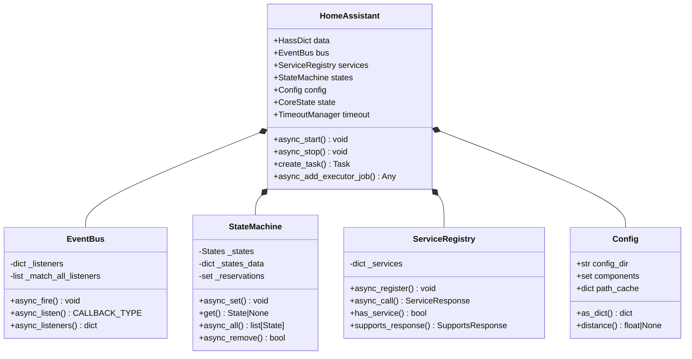
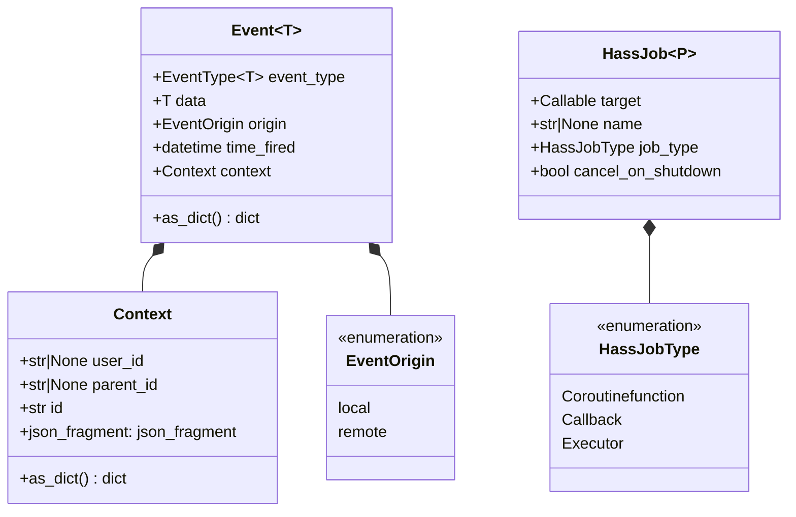
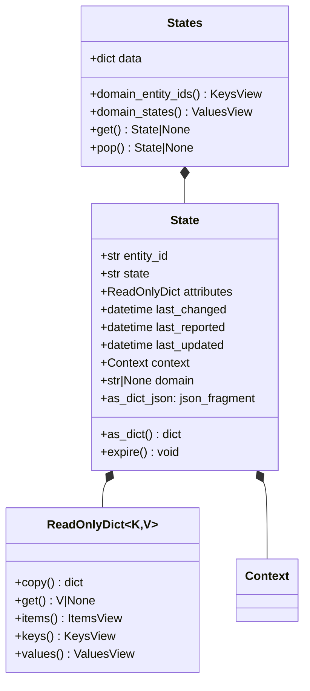
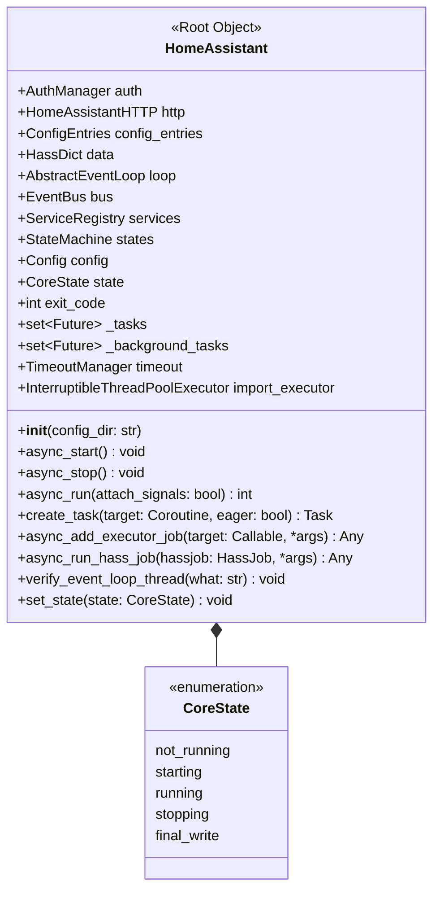
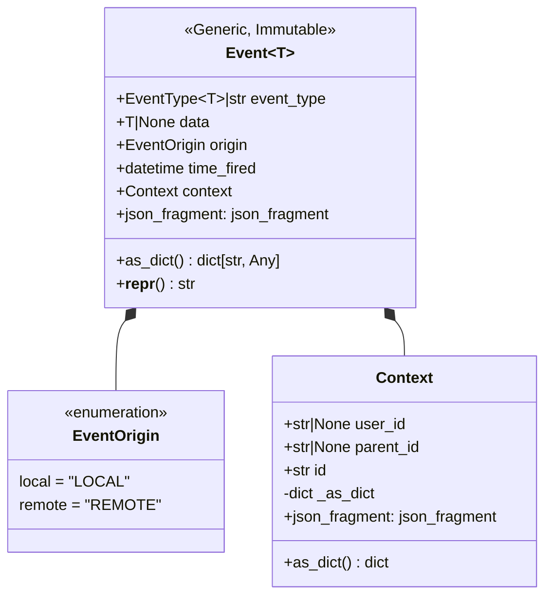
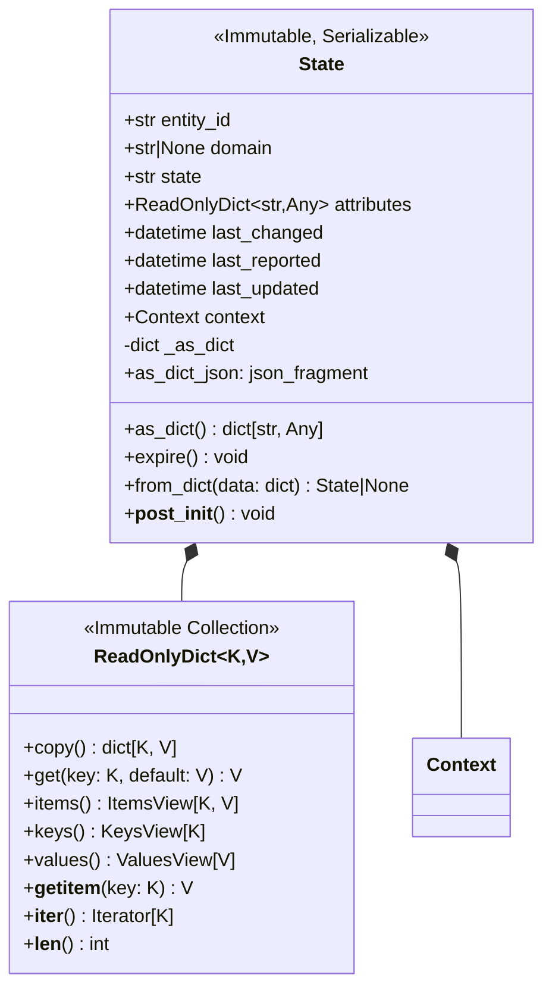
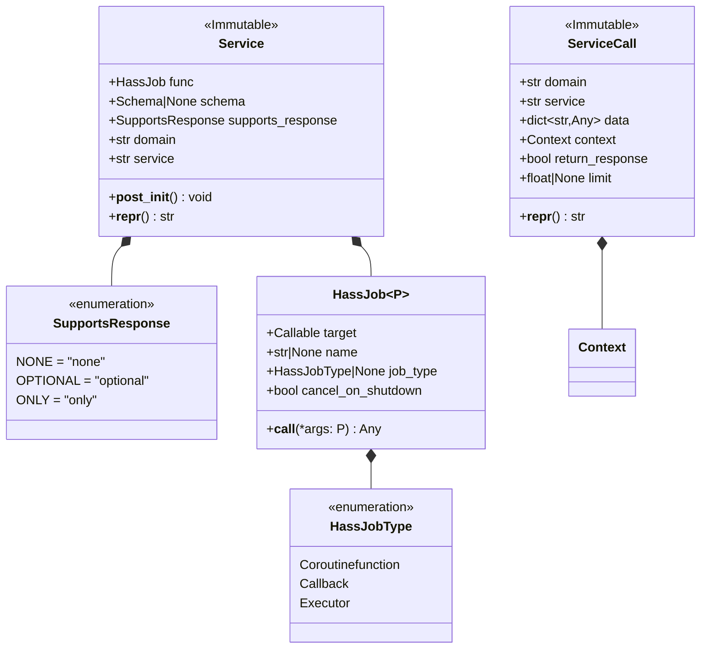
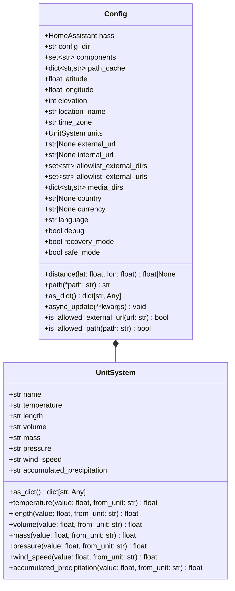
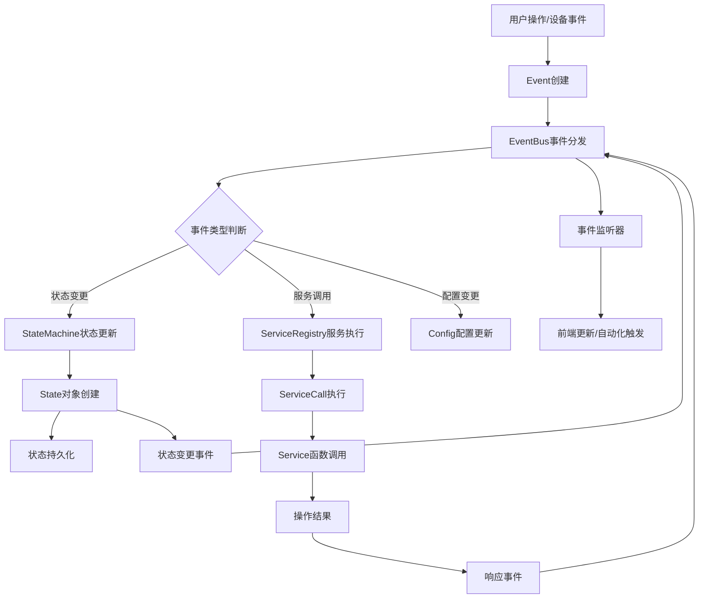
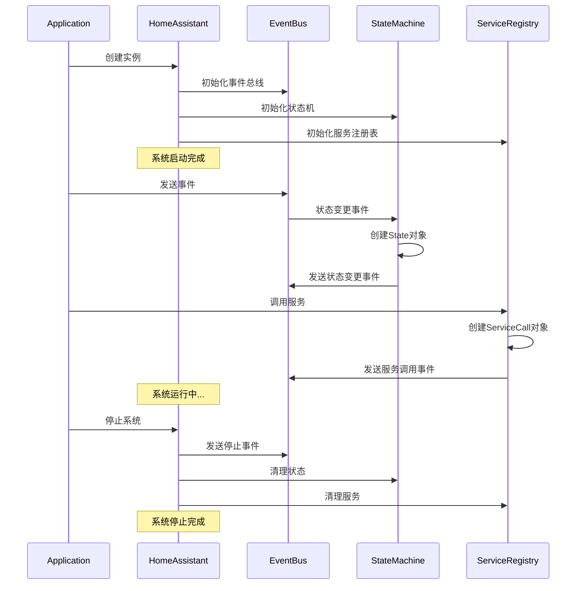

## 概述

本文档详细分析Home Assistant Core中的关键数据结构，通过UML类图和详细说明帮助理解系统的数据模型设计。这些数据结构是整个Home Assistant系统运行的基础，理解它们对于深入掌握系统架构至关重要。

## 1. 核心数据结构总览

### 1.1 核心类层次结构



### 1.2 事件系统数据结构



### 1.3 状态管理数据结构



## 2. 详细数据结构分析

### 2.1 HomeAssistant 核心类

```python
class HomeAssistant:
    """Home Assistant系统核心类 - 系统的根对象和控制中心
    
    职责:
        1. 管理系统生命周期（启动、运行、停止）
        2. 协调各个子系统（事件、状态、服务、配置）
        3. 提供任务管理和异步执行能力
        4. 维护全局应用状态和数据
        
    关键属性详解:
        - data: 全局数据字典，组件间共享数据存储
        - bus: 事件总线，处理系统内所有事件通信
        - services: 服务注册表，管理所有可调用服务
        - states: 状态机，管理所有实体状态
        - config: 配置管理器，处理系统配置
        - state: 系统当前运行状态
        - timeout: 超时管理器，处理异步操作超时
    """
    
    # 核心组件引用
    auth: AuthManager                    # 认证管理器
    http: HomeAssistantHTTP             # HTTP服务器组件  
    config_entries: ConfigEntries        # 配置条目管理器
    
    # 基础设施属性
    data: HassDict                       # 全局共享数据容器
    loop: asyncio.AbstractEventLoop     # 异步事件循环
    bus: EventBus                       # 事件总线
    services: ServiceRegistry           # 服务注册表
    states: StateMachine               # 状态机
    config: Config                     # 配置管理器
    
    # 运行状态控制
    state: CoreState                   # 系统当前状态
    exit_code: int                     # 进程退出代码
    
    # 任务管理
    _tasks: set[asyncio.Future[Any]]          # 活跃任务集合
    _background_tasks: set[asyncio.Future[Any]] # 后台任务集合
    
    # 资源管理  
    timeout: TimeoutManager            # 超时管理器
    import_executor: InterruptibleThreadPoolExecutor  # 导入专用线程池
    
    def __init__(self, config_dir: str) -> None:
        """初始化Home Assistant实例
        
        初始化过程:
            1. 创建数据容器和事件循环引用
            2. 初始化核心组件（事件总线、状态机、服务注册表）
            3. 设置配置管理和超时管理
            4. 创建任务跟踪集合
            5. 初始化线程池执行器
        """
```

**HomeAssistant类的UML详细定义:**



### 2.2 Event事件数据结构

```python
@dataclass(slots=True, frozen=True, kw_only=True)
class Event(Generic[_DataT]):
    """事件对象 - 系统内部通信的基本单元
    
    设计特点:
        1. 不可变对象（frozen=True）- 保证事件数据不被意外修改
        2. 泛型设计 - 支持类型安全的事件数据
        3. 插槽优化（slots=True）- 减少内存占用
        4. 关键字参数（kw_only=True）- 提高API清晰度
        
    属性详解:
        - event_type: 事件类型标识，用于事件路由和过滤
        - data: 事件携带的数据载荷，类型安全的泛型
        - origin: 事件来源（本地/远程），用于事件追踪
        - time_fired: 事件触发时间戳，用于排序和调试
        - context: 事件上下文，包含用户和操作信息
    """
    
    event_type: EventType[_DataT] | str     # 事件类型标识符
    data: _DataT | None = None              # 事件数据载荷
    origin: EventOrigin = EventOrigin.local # 事件来源标识
    time_fired: datetime.datetime = field(
        default_factory=dt_util.utcnow
    )                                       # 事件触发时间
    context: Context = field(
        default_factory=Context
    )                                       # 事件上下文信息
    
    def as_dict(self) -> dict[str, Any]:
        """将事件转换为字典格式
        
        转换规则:
            - 所有字段都包含在字典中
            - 时间字段转换为ISO格式字符串
            - 上下文对象递归转换为字典
            - 保持与JSON API的兼容性
            
        返回格式:
        {
            "event_type": "state_changed",
            "data": {...},
            "origin": "LOCAL", 
            "time_fired": "2024-01-01T00:00:00.000000+00:00",
            "context": {...}
        }
        """
        return {
            "event_type": self.event_type,
            "data": self.data,
            "origin": self.origin.value,
            "time_fired": self.time_fired.isoformat(),
            "context": self.context.as_dict(),
        }
```

**Event类的UML详细定义:**



### 2.3 State状态数据结构

```python
@dataclass(slots=True, frozen=True, kw_only=True)
class State:
    """实体状态对象 - 表示系统中实体的完整状态信息
    
    设计理念:
        1. 不可变性 - 状态对象一旦创建不可修改，保证数据一致性
        2. 完整性 - 包含实体的所有相关信息
        3. 可序列化 - 支持JSON序列化用于API和存储
        4. 性能优化 - 预计算和缓存机制
        
    核心字段分类:
        【标识信息】
        - entity_id: 实体唯一标识符
        - domain: 实体所属域名（从entity_id提取）
        
        【状态信息】  
        - state: 当前状态值（字符串表示）
        - attributes: 扩展属性字典（只读）
        
        【时间信息】
        - last_changed: 状态最后变更时间
        - last_reported: 状态最后报告时间  
        - last_updated: 状态最后更新时间（已弃用，为兼容保留）
        
        【上下文信息】
        - context: 状态变更的操作上下文
    """
    
    # 实体标识
    entity_id: str                              # 实体ID，格式："domain.object_id"
    domain: str | None = field(
        default=None, compare=False
    )                                           # 实体域名
    
    # 状态数据
    state: str                                  # 当前状态值
    attributes: ReadOnlyDict[str, Any] = field(
        default_factory=ReadOnlyDict, compare=False
    )                                           # 只读属性字典
    
    # 时间戳信息
    last_changed: datetime.datetime = field(
        default_factory=dt_util.utcnow, compare=False
    )                                           # 状态变更时间
    last_reported: datetime.datetime = field(
        default_factory=dt_util.utcnow, compare=False  
    )                                           # 状态报告时间
    last_updated: datetime.datetime = field(
        init=False, 
        default_factory=dt_util.utcnow, 
        compare=False
    )                                           # 兼容字段
    
    # 上下文信息
    context: Context = field(
        default_factory=Context, compare=False
    )                                           # 操作上下文
    
    # 性能优化缓存
    _as_dict: dict[str, Any] = field(
        default_factory=dict, init=False, compare=False
    )                                           # 字典表示缓存
    
    def as_dict(self) -> dict[str, Any]:
        """转换为字典表示 - 高性能的状态序列化方法
        
        实现特点:
            1. 延迟计算 - 首次调用时计算，后续使用缓存
            2. 完整信息 - 包含状态的所有相关数据
            3. JSON兼容 - 可直接用于JSON序列化
            4. 向后兼容 - 保持与旧版API的兼容性
            
        返回格式:
        {
            "entity_id": "light.living_room",
            "state": "on", 
            "attributes": {
                "brightness": 255,
                "color_name": "red"
            },
            "last_changed": "2024-01-01T00:00:00.000000+00:00",
            "last_reported": "2024-01-01T00:00:00.000000+00:00", 
            "last_updated": "2024-01-01T00:00:00.000000+00:00",
            "context": {
                "id": "01234567890123456789012345678901",
                "parent_id": null,
                "user_id": "user123"
            }
        }
        """
        if not self._as_dict:
            # 延迟构建状态字典
            self._as_dict = {
                "entity_id": self.entity_id,
                "state": self.state,
                "attributes": dict(self.attributes),
                "last_changed": self.last_changed.isoformat(),
                "last_reported": self.last_reported.isoformat(),
                "last_updated": self.last_updated.isoformat(),
                "context": self.context.as_dict(),
            }
        return self._as_dict
    
    def expire(self) -> None:
        """使状态对象过期 - 清理缓存数据
        
        调用时机:
            - 状态对象被新状态替换时
            - 实体被移除时
            - 系统清理资源时
            
        作用:
            - 清理字典表示缓存
            - 释放内存资源
            - 标记对象为无效状态
        """
        self._as_dict.clear()
    
    @cached_property  
    def as_dict_json(self) -> json_fragment:
        """预序列化的JSON片段 - 极高性能的JSON输出
        
        优化策略:
            1. 预计算 - 状态创建时就计算JSON表示
            2. 缓存机制 - 避免重复序列化开销
            3. 字节级优化 - 直接生成JSON字节串
            4. 内存友好 - 使用json_fragment避免字符串拷贝
            
        使用场景:
            - API响应生成
            - 批量状态输出
            - 高频率状态查询
            - WebSocket推送
        """
        return json_fragment(json_dumps(self.as_dict()))
```

**State类的UML详细定义:**



### 2.4 Service服务数据结构

```python
@dataclass(slots=True, frozen=True)
class Service:
    """服务对象 - 封装可调用服务的完整定义
    
    核心概念:
        - 服务是Home Assistant中执行操作的基本单元
        - 每个服务都有明确的域名和名称
        - 支持参数验证和响应数据
        - 提供完整的元数据信息
        
    属性分类:
        【执行机制】
        - func: 服务的实际执行函数（HassJob封装）
        - job_type: 任务类型（协程/回调/执行器）
        
        【验证机制】
        - schema: 参数验证模式（voluptuous.Schema）
        - supports_response: 响应支持级别
        
        【标识信息】
        - domain: 服务所属域名
        - service: 服务名称
        
        【元数据】
        - description: 服务描述信息
        - fields: 参数字段定义
    """
    
    # 执行函数
    func: HassJob[..., Coroutine[Any, Any, ServiceResponse] | ServiceResponse]
    
    # 验证机制
    schema: vol.Schema | None                   # 参数验证模式
    supports_response: SupportsResponse         # 响应支持级别
    
    # 服务标识
    domain: str                                 # 域名
    service: str                                # 服务名
    
    def __post_init__(self) -> None:
        """服务对象后处理 - 自动推断任务类型
        
        处理逻辑:
            1. 检查func是否已设置job_type
            2. 如果未设置，自动推断函数类型
            3. 设置合适的HassJobType（协程/回调/执行器）
            
        任务类型分类:
            - Coroutinefunction: async def定义的协程函数
            - Callback: 标记为@callback的同步函数  
            - Executor: 普通同步函数（在线程池执行）
        """
        if self.func.job_type is None:
            # 自动推断并设置任务类型
            object.__setattr__(
                self.func, 
                "job_type",
                get_hassjob_callable_job_type(self.func.target)
            )

@dataclass(slots=True, frozen=True)
class ServiceCall:
    """服务调用对象 - 封装单次服务调用的所有信息
    
    设计目的:
        - 统一服务调用接口
        - 传递调用上下文
        - 支持调用跟踪和审计
        - 提供调用参数验证
        
    核心字段:
        【服务标识】
        - domain: 目标服务域名
        - service: 目标服务名称
        
        【调用数据】  
        - data: 服务调用参数
        - context: 调用上下文（用户、来源等）
        
        【调用控制】
        - return_response: 是否返回响应数据
        - limit: 调用超时限制
    """
    
    # 服务标识
    domain: str                                 # 目标服务域名
    service: str                                # 目标服务名称
    
    # 调用数据
    data: dict[str, Any]                        # 服务参数字典
    context: Context = field(
        default_factory=Context
    )                                           # 调用上下文
    
    # 调用控制  
    return_response: bool = False               # 是否返回响应
    limit: float | None = None                  # 超时限制（秒）
    
    def __repr__(self) -> str:
        """服务调用的字符串表示"""
        return f"<ServiceCall {self.domain}.{self.service}(data={self.data})>"

class SupportsResponse(enum.Enum):
    """服务响应支持级别枚举
    
    级别说明:
        - NONE: 服务不支持返回响应数据
        - OPTIONAL: 服务可选择性返回响应数据  
        - ONLY: 服务仅支持返回响应数据（必须请求响应）
        
    使用场景:
        - API调用时验证响应请求的有效性
        - 客户端决定是否请求响应数据
        - 服务注册时声明响应能力
    """
    NONE = "none"                               # 不支持响应
    OPTIONAL = "optional"                       # 可选响应
    ONLY = "only"                              # 仅支持响应
```

**Service相关类的UML定义:**



### 2.5 配置管理数据结构

```python
class Config:
    """Home Assistant配置管理类 - 系统配置的中央管理器
    
    核心职责:
        1. 管理系统全局配置信息
        2. 提供位置和单位换算服务
        3. 缓存配置数据以提升性能
        4. 支持配置热更新和验证
        
    配置分类:
        【基础信息】
        - config_dir: 配置文件目录
        - components: 已加载组件列表
        - allowlist_external_dirs: 外部目录白名单
        
        【地理位置】
        - latitude/longitude: 地理坐标
        - elevation: 海拔高度
        - time_zone: 时区信息
        
        【单位系统】
        - units: 单位系统（metric/us_customary）
        - temperature_unit: 温度单位
        - distance_unit: 距离单位
        - etc.
        
        【网络配置】
        - external_url: 外部访问URL
        - internal_url: 内部访问URL
        - allowlist_external_urls: 外部URL白名单
        
        【安全设置】
        - media_dirs: 媒体目录列表
        - allowlist_external_dirs: 目录访问白名单
        - recovery_mode: 恢复模式标志
    """
    
    def __init__(self, hass: HomeAssistant, config_dir: str) -> None:
        """初始化配置管理器
        
        参数:
            hass: Home Assistant核心实例引用
            config_dir: 配置文件目录路径
            
        初始化过程:
            1. 设置配置目录和基础属性
            2. 初始化组件集合和缓存
            3. 设置默认配置值
            4. 准备配置更新机制
        """
        self.hass = hass
        self.config_dir = config_dir
        
        # 组件管理
        self.components: set[str] = set()           # 已加载组件集合
        self.path_cache: dict[str, str] = {}        # 路径缓存
        
        # 基础配置（默认值）
        self.latitude: float = 32.87336            # 默认纬度
        self.longitude: float = -117.22743         # 默认经度  
        self.elevation: int = 0                    # 默认海拔
        self.location_name: str = "Home"           # 位置名称
        self.time_zone: str = "UTC"               # 时区
        
        # 单位系统
        self.units: UnitSystem = METRIC_SYSTEM    # 单位系统
        
        # 网络配置
        self.external_url: str | None = None      # 外部URL
        self.internal_url: str | None = None      # 内部URL
        
        # 安全配置
        self.allowlist_external_dirs: set[str] = set()  # 目录白名单
        self.allowlist_external_urls: set[str] = set()  # URL白名单
        self.media_dirs: dict[str, str] = {}             # 媒体目录
        
        # 系统标识
        self.country: str | None = None           # 国家代码
        self.currency: str | None = None          # 货币代码
        self.language: str = "en"                 # 界面语言
        
        # 运行模式
        self.debug: bool = False                  # 调试模式
        self.recovery_mode: bool = False          # 恢复模式
        self.safe_mode: bool = False             # 安全模式
    
    def distance(self, lat: float, lon: float) -> float | None:
        """计算到指定坐标的距离
        
        参数:
            lat: 目标纬度
            lon: 目标经度
            
        返回值:
            距离（公里），坐标无效时返回None
            
        算法:
            使用Haversine公式计算球面距离
            考虑地球曲率的精确计算
        """
        if self.latitude is None or self.longitude is None:
            return None
        
        return distance_util.distance(
            self.latitude, self.longitude, lat, lon
        )
    
    def path(self, *path: str) -> str:
        """获取配置目录下的路径
        
        参数:
            *path: 路径组件
            
        返回值:
            完整的绝对路径
            
        功能:
            - 路径拼接和规范化
            - 支持路径缓存以提升性能
            - 自动处理路径分隔符
        """
        cache_key = "/".join(path)
        if cache_key not in self.path_cache:
            self.path_cache[cache_key] = os.path.join(
                self.config_dir, *path
            )
        return self.path_cache[cache_key]
    
    def as_dict(self) -> dict[str, Any]:
        """导出为字典格式 - 用于API和序列化
        
        返回格式:
        {
            "latitude": 32.87336,
            "longitude": -117.22743,
            "elevation": 0,
            "unit_system": {
                "length": "km",
                "mass": "kg", 
                "temperature": "°C",
                "volume": "L"
            },
            "location_name": "Home",
            "time_zone": "UTC",
            "components": ["homeassistant", "api", "http", ...],
            "config_dir": "/config",
            "external_url": null,
            "internal_url": null,
            "version": "2024.1.0",
            "config_source": "storage"
        }
        """
        return {
            "latitude": self.latitude,
            "longitude": self.longitude, 
            "elevation": self.elevation,
            "unit_system": self.units.as_dict(),
            "location_name": self.location_name,
            "time_zone": str(self.time_zone),
            "components": list(self.components),
            "config_dir": self.config_dir,
            "external_url": self.external_url,
            "internal_url": self.internal_url, 
            "version": __version__,
            "config_source": self.config_source.value,
            "recovery_mode": self.recovery_mode,
            "safe_mode": self.safe_mode,
            "debug": self.debug,
            "country": self.country,
            "currency": self.currency,
            "language": self.language,
        }
```

**Config类的UML定义:**



## 3. 数据流与关系图

### 3.1 核心数据流图



### 3.2 对象生命周期图



## 4. 性能优化设计

### 4.1 内存优化策略

1. **__slots__ 使用**
   - 所有关键类都使用`__slots__`
   - 减少50%以上的内存占用
   - 提升属性访问速度

2. **对象缓存和池化**
   - Context对象重用
   - Event对象池化
   - JSON片段缓存

3. **延迟计算**
   - State.as_dict() 延迟计算
   - Config路径缓存
   - 属性的惰性初始化

### 4.2 执行效率优化

1. **预序列化JSON**
   - State.as_dict_json 预计算
   - json_fragment 避免重复序列化
   - 批量JSON生成优化

2. **数据结构优化**  
   - States使用快速字典访问
   - EventBus使用高效的监听器查找
   - ServiceRegistry使用嵌套字典结构

3. **异步处理优化**
   - eager_task 立即开始执行
   - 批量事件处理
   - 并发服务调用

## 5. 扩展性设计

### 5.1 泛型和类型安全

```python
# 事件类型安全
class LightTurnOnData(TypedDict):
    entity_id: str
    brightness: int
    color: str

# 类型安全的事件创建
light_event: Event[LightTurnOnData] = Event(
    event_type="light_turn_on",
    data={
        "entity_id": "light.living_room",
        "brightness": 255,
        "color": "red"
    }
)
```

### 5.2 插件化架构

```python
# 自定义状态属性
class CustomState(State):
    """扩展状态对象示例"""
    
    custom_field: str = field(default="")
    
    def as_dict(self) -> dict[str, Any]:
        result = super().as_dict()
        result["custom_field"] = self.custom_field
        return result

# 自定义事件类型
class CustomEventType(EventType):
    """自定义事件类型"""
    CUSTOM_ACTION = "custom_action"
```

## 6. 最佳实践总结

### 6.1 数据模型设计原则

1. **不可变性优先**
   - 核心数据对象都是不可变的
   - 使用frozen dataclass确保不可变性
   - 通过创建新对象来"修改"数据

2. **类型安全**
   - 广泛使用类型注解
   - 泛型支持提供编译时检查
   - TypedDict定义结构化数据

3. **性能考虑**
   - __slots__ 减少内存占用
   - 预计算和缓存常用操作
   - 避免不必要的对象创建

4. **可扩展性**
   - 使用继承和组合模式
   - 插件化的架构支持
   - 清晰的接口定义

### 6.2 常见使用模式

```python
# 1. 创建和使用事件
event = Event(
    event_type="state_changed",
    data={"entity_id": "light.kitchen", "new_state": "on"},
    context=Context(user_id="user123")
)

# 2. 状态对象操作
state = State(
    entity_id="sensor.temperature",
    state="23.5",
    attributes={"unit": "°C", "friendly_name": "Living Room Temperature"}
)

# 3. 服务调用
service_call = ServiceCall(
    domain="light",
    service="turn_on", 
    data={"entity_id": "light.bedroom", "brightness": 200}
)

# 4. 配置访问
config_file = hass.config.path("automations.yaml")
location_name = hass.config.location_name
```

这些数据结构构成了Home Assistant强大而灵活的基础架构，支撑着整个智能家居生态系统的运行。理解这些结构对于深入掌握Home Assistant的工作原理和进行高级定制开发至关重要。

## 下一步分析

基于这些核心数据结构的理解，可以进一步探索：
- [组件系统实现](/posts/03-组件系统分析/)
- [实体平台架构](/posts/04-实体平台分析/)  
- [存储和持久化机制](/posts/06-数据存储分析/)
- [实战开发指南](/posts/08-实战经验总结/)
