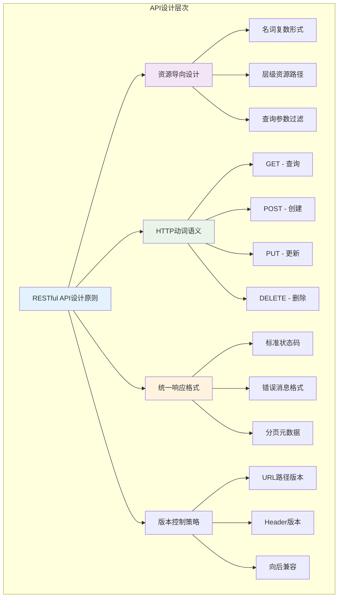
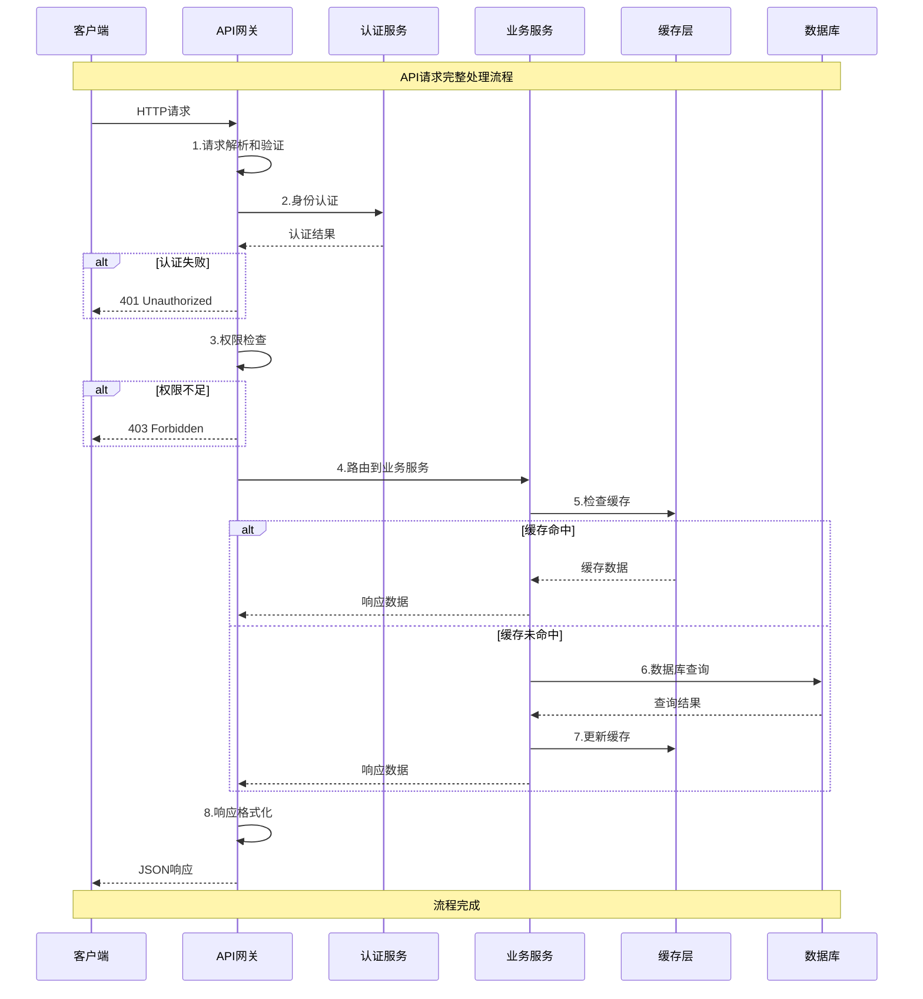

## 📋 概述

本文档详细分析VoiceHelper系统的数据结构设计、API接口规范、数据流转机制和最佳实践。涵盖类型定义、接口设计、数据验证和错误处理等关键方面。

## 🏗️ 核心数据结构设计

### 用户与认证数据结构

```mermaid
classDiagram
    class User {
        +string user_id
        +string username
        +string email
        +string nickname
        +string avatar_url
        +UserStatus status
        +UserPreferences preferences
        +datetime created_at
        +datetime updated_at
        +datetime last_login
        +validateEmail() boolean
        +updateProfile(data: UserProfile) void
        +hasPermission(permission: string) boolean
    }
    
    class UserPreferences {
        +string language
        +ThemeMode theme
        +VoiceSettings voice_settings
        +NotificationSettings notifications
        +PrivacySettings privacy
        +updateVoiceSetting(key: string, value: any) void
        +resetToDefaults() void
    }
    
    class VoiceSettings {
        +string preferred_voice
        +float speech_rate
        +float volume
        +boolean auto_play
        +boolean voice_activation
        +AudioQuality audio_quality
        +validateSettings() ValidationResult
    }
    
    class AuthToken {
        +string token
        +string refresh_token
        +datetime expires_at
        +datetime refresh_expires_at
        +string[] scopes
        +boolean is_valid
        +refresh() AuthToken
        +revoke() void
    }
    
    User ||--|| UserPreferences : contains
    UserPreferences ||--|| VoiceSettings : includes
    User ||--o{ AuthToken : has_multiple
    
    class UserStatus {
        <<enumeration>>
        ACTIVE
        INACTIVE
        BANNED
        PENDING_VERIFICATION
    }
    
    class ThemeMode {
        <<enumeration>>
        LIGHT
        DARK
        AUTO
    }
```

#### TypeScript接口定义

```typescript
/**
 * 用户数据结构 - 系统用户的完整信息模型
 */
export interface User {
  /** 用户唯一标识符，UUID格式 */
  user_id: string;
  
  /** 用户名，用于登录，3-20字符，唯一 */
  username: string;
  
  /** 邮箱地址，用于通知和密码重置 */
  email: string;
  
  /** 显示昵称，可包含中文和特殊字符 */
  nickname?: string;
  
  /** 头像URL，支持多种图片格式 */
  avatar_url?: string;
  
  /** 账户状态枚举 */
  status: UserStatus;
  
  /** 用户偏好设置 */
  preferences: UserPreferences;
  
  /** 账户创建时间，ISO 8601格式 */
  created_at: string;
  
  /** 最后更新时间，ISO 8601格式 */
  updated_at: string;
  
  /** 最后登录时间，可为空 */
  last_login?: string;
  
  /** 用户角色列表，用于权限控制 */
  roles: string[];
  
  /** 租户ID，支持多租户架构 */
  tenant_id?: string;
}

/**
 * 用户偏好设置 - 个性化配置选项
 */
export interface UserPreferences {
  /** 界面语言代码，遵循BCP 47标准 */
  language: string;
  
  /** 主题模式选择 */
  theme: 'light' | 'dark' | 'auto';
  
  /** 语音交互设置 */
  voice_settings: VoiceSettings;
  
  /** 通知设置 */
  notification_settings: NotificationSettings;
  
  /** 隐私设置 */
  privacy_settings: PrivacySettings;
  
  /** 可访问性设置 */
  accessibility: AccessibilitySettings;
  
  /** 自定义字段，支持扩展 */
  custom_fields?: Record<string, any>;
}

/**
 * 语音设置 - 语音交互相关配置
 */
export interface VoiceSettings {
  /** 偏好的语音ID，如 'zh-CN-XiaoxiaoNeural' */
  preferred_voice: string;
  
  /** 语音播放速率，范围 0.5-2.0 */
  speech_rate: number;
  
  /** 音量大小，范围 0.0-1.0 */
  volume: number;
  
  /** 是否自动播放AI回复 */
  auto_play: boolean;
  
  /** 是否启用语音激活（免按键） */
  voice_activation: boolean;
  
  /** 音频质量设置 */
  audio_quality: 'low' | 'medium' | 'high';
  
  /** 噪声抑制级别 */
  noise_suppression: 'off' | 'low' | 'medium' | 'high';
  
  /** 回声消除开关 */
  echo_cancellation: boolean;
  
  /** 自动增益控制 */
  auto_gain_control: boolean;
}

/**
 * JWT认证令牌结构
 */
export interface AuthToken {
  /** 访问令牌，用于API认证 */
  access_token: string;
  
  /** 刷新令牌，用于获取新的访问令牌 */
  refresh_token: string;
  
  /** 令牌类型，通常为 'Bearer' */
  token_type: string;
  
  /** 访问令牌过期时间（秒） */
  expires_in: number;
  
  /** 刷新令牌过期时间（秒） */
  refresh_expires_in: number;
  
  /** 令牌权限范围 */
  scope: string[];
  
  /** 令牌签发时间戳 */
  issued_at: number;
  
  /** 签发者标识 */
  issuer: string;
}
```

### 对话与消息数据结构

```mermaid
classDiagram
    class Conversation {
        +string conversation_id
        +string user_id
        +string title
        +ConversationStatus status
        +datetime created_at
        +datetime updated_at
        +int message_count
        +ConversationMetadata metadata
        +Message[] messages
        +addMessage(message: Message) void
        +updateStatus(status: ConversationStatus) void
        +getLatestMessage() Message
        +calculateDuration() number
    }
    
    class Message {
        +string message_id
        +string conversation_id
        +MessageRole role
        +string content
        +ContentType content_type
        +datetime created_at
        +MessageMetadata metadata
        +Attachment[] attachments
        +ToolCall[] tool_calls
        +Reference[] references
        +validateContent() boolean
        +extractEntities() Entity[]
        +calculateTokenCount() number
    }
    
    class MessageMetadata {
        +number response_time_ms
        +string model_used
        +TokenCount token_count
        +number confidence_score
        +EmotionAnalysis emotion
        +IntentAnalysis intent
        +string[] tags
        +updateMetrics(metrics: any) void
    }
    
    class Reference {
        +string reference_id
        +ReferenceType type
        +string title
        +string content
        +string url
        +number relevance_score
        +ReferenceMetadata metadata
        +validateReference() boolean
    }
    
    class ToolCall {
        +string tool_call_id
        +string tool_name
        +Record parameters
        +ToolCallStatus status
        +ToolResult result
        +datetime created_at
        +execute() Promise~ToolResult~
        +cancel() void
    }
    
    Conversation ||--o{ Message : contains
    Message ||--|| MessageMetadata : has
    Message ||--o{ Reference : references
    Message ||--o{ ToolCall : triggers
    
    class MessageRole {
        <<enumeration>>
        USER
        ASSISTANT
        SYSTEM
        TOOL
    }
    
    class ContentType {
        <<enumeration>>
        TEXT
        AUDIO
        IMAGE
        FILE
        TOOL_CALL
        TOOL_RESULT
    }
```

#### TypeScript接口定义

```typescript
/**
 * 对话数据结构 - 用户与AI的完整会话记录
 */
export interface Conversation {
  /** 对话唯一标识符 */
  conversation_id: string;
  
  /** 对话所属用户ID */
  user_id: string;
  
  /** 对话标题，可自动生成或用户设定 */
  title?: string;
  
  /** 对话状态 */
  status: 'active' | 'ended' | 'archived';
  
  /** 对话创建时间 */
  created_at: string;
  
  /** 对话最后更新时间 */
  updated_at: string;
  
  /** 对话结束时间，可为空 */
  ended_at?: string;
  
  /** 消息总数统计 */
  message_count: number;
  
  /** 对话元数据 */
  metadata: ConversationMetadata;
  
  /** 消息列表（可选，按需加载） */
  messages?: Message[];
}

/**
 * 对话元数据 - 对话的附加信息和统计
 */
export interface ConversationMetadata {
  /** 标签列表，用于分类和搜索 */
  tags?: string[];
  
  /** 对话分类 */
  category?: string;
  
  /** 优先级标记 */
  priority?: 'low' | 'normal' | 'high';
  
  /** 对话总时长（毫秒） */
  total_duration_ms?: number;
  
  /** 平均响应时间（毫秒） */
  avg_response_time_ms?: number;
  
  /** 使用的AI模型列表 */
  models_used?: string[];
  
  /** 语言代码 */
  language?: string;
  
  /** 是否包含语音交互 */
  has_voice_interaction?: boolean;
  
  /** 客户端类型 */
  client_type?: 'web' | 'mobile' | 'api' | 'miniprogram';
  
  /** 自定义字段 */
  custom_fields?: Record<string, any>;
}

/**
 * 消息数据结构 - 对话中的单条消息
 */
export interface Message {
  /** 消息唯一标识符 */
  message_id: string;
  
  /** 所属对话ID */
  conversation_id: string;
  
  /** 发送者用户ID，AI消息可为空 */
  user_id?: string;
  
  /** 消息角色 */
  role: 'user' | 'assistant' | 'system' | 'tool';
  
  /** 消息内容主体 */
  content: string;
  
  /** 内容类型 */
  content_type: 'text' | 'audio' | 'image' | 'file' | 'tool_call' | 'tool_result';
  
  /** 消息创建时间 */
  created_at: string;
  
  /** 消息元数据 */
  metadata?: MessageMetadata;
  
  /** 附件列表 */
  attachments?: Attachment[];
  
  /** 工具调用列表 */
  tool_calls?: ToolCall[];
  
  /** 引用资料列表 */
  references?: Reference[];
  
  /** 消息状态标记 */
  status?: 'sending' | 'sent' | 'delivered' | 'failed';
  
  /** 是否正在流式传输 */
  is_streaming?: boolean;
}

/**
 * 消息元数据 - 消息的性能指标和分析结果
 */
export interface MessageMetadata {
  /** 响应时间（毫秒） */
  response_time_ms?: number;
  
  /** 使用的AI模型 */
  model_used?: string;
  
  /** Token使用统计 */
  token_count?: {
    input: number;
    output: number;
    total: number;
  };
  
  /** AI回复的置信度分数 */
  confidence_score?: number;
  
  /** 情感分析结果 */
  emotion?: EmotionAnalysis;
  
  /** 意图识别结果 */
  intent?: IntentAnalysis;
  
  /** 语言检测结果 */
  detected_language?: string;
  
  /** 内容安全检查结果 */
  content_safety?: ContentSafetyResult;
  
  /** 消息来源信息 */
  source?: {
    client_type: string;
    client_version: string;
    ip_address?: string;
    user_agent?: string;
  };
}

/**
 * 引用资料结构 - RAG检索到的参考文档
 */
export interface Reference {
  /** 引用唯一标识符 */
  reference_id?: string;
  
  /** 引用类型 */
  type: 'document' | 'url' | 'conversation' | 'tool_result' | 'knowledge_graph';
  
  /** 文档或资源ID */
  id: string;
  
  /** 引用标题 */
  title?: string;
  
  /** 引用内容摘要 */
  content?: string;
  
  /** 引用URL链接 */
  url?: string;
  
  /** 引用来源 */
  source?: string;
  
  /** 相关性分数，0-1范围 */
  relevance_score?: number;
  
  /** 引用在原文中的位置 */
  position?: {
    start_index: number;
    end_index: number;
    page_number?: number;
    section?: string;
  };
  
  /** 引用元数据 */
  metadata?: Record<string, any>;
}
```

### 语音交互数据结构

```mermaid
classDiagram
    class VoiceSession {
        +string session_id
        +string user_id
        +string conversation_id
        +SessionStatus status
        +datetime created_at
        +datetime ended_at
        +VoiceSessionSettings settings
        +VoiceMetrics metrics
        +AudioChunk[] audio_chunks
        +startSession() void
        +endSession() void
        +updateMetrics(data: any) void
        +getTranscriptHistory() Transcript[]
    }
    
    class VoiceSessionSettings {
        +string language
        +string voice_id
        +int sample_rate
        +int channels
        +AudioFormat format
        +boolean vad_enabled
        +boolean noise_suppression
        +boolean echo_cancellation
        +validateSettings() boolean
        +optimizeForDevice() VoiceSessionSettings
    }
    
    class AudioChunk {
        +string chunk_id
        +string session_id
        +int sequence
        +ArrayBuffer data
        +long timestamp_ms
        +int duration_ms
        +boolean is_final
        +AudioQualityMetrics quality
        +process() ProcessedAudio
    }
    
    class TranscriptionResult {
        +string text
        +float confidence
        +string language
        +boolean is_final
        +TranscriptionAlternative[] alternatives
        +WordTimestamp[] word_timestamps
        +validateResult() boolean
        +getBestAlternative() string
    }
    
    class VoiceMetrics {
        +long total_duration_ms
        +long speech_duration_ms
        +long silence_duration_ms
        +int interruption_count
        +float average_latency_ms
        +float audio_quality_score
        +int packet_loss_count
        +calculateOverallScore() float
    }
    
    VoiceSession ||--|| VoiceSessionSettings : configured_with
    VoiceSession ||--o{ AudioChunk : contains
    VoiceSession ||--|| VoiceMetrics : tracks
    AudioChunk ||--|| TranscriptionResult : produces
    
    class SessionStatus {
        <<enumeration>>
        INITIALIZING
        ACTIVE
        PAUSED
        ENDED
        ERROR
    }
    
    class AudioFormat {
        <<enumeration>>
        PCM
        OPUS
        MP3
        WAV
        WEBM
    }
```

#### TypeScript接口定义

```typescript
/**
 * 语音会话数据结构 - 实时语音交互的完整记录
 */
export interface VoiceSession {
  /** 会话唯一标识符 */
  session_id: string;
  
  /** 用户ID */
  user_id: string;
  
  /** 关联的对话ID，可选 */
  conversation_id?: string;
  
  /** 会话状态 */
  status: 'initializing' | 'active' | 'paused' | 'ended' | 'error';
  
  /** 会话创建时间 */
  created_at: string;
  
  /** 会话结束时间，可为空 */
  ended_at?: string;
  
  /** 语音会话设置 */
  settings: VoiceSessionSettings;
  
  /** 性能指标 */
  metrics?: VoiceMetrics;
  
  /** 转录历史记录 */
  transcripts?: TranscriptionRecord[];
  
  /** 错误信息，如果有的话 */
  error?: {
    code: string;
    message: string;
    timestamp: string;
  };
}

/**
 * 语音会话设置 - 音频处理和识别的配置参数
 */
export interface VoiceSessionSettings {
  /** 语言代码，如 'zh-CN' */
  language: string;
  
  /** 语音合成的声音ID */
  voice_id: string;
  
  /** 音频采样率，推荐16000Hz */
  sample_rate: number;
  
  /** 声道数，通常为1（单声道） */
  channels: number;
  
  /** 音频格式 */
  format: 'pcm' | 'opus' | 'mp3' | 'wav' | 'webm';
  
  /** 是否启用语音活动检测 */
  vad_enabled: boolean;
  
  /** 是否启用噪声抑制 */
  noise_suppression: boolean;
  
  /** 是否启用回声消除 */
  echo_cancellation: boolean;
  
  /** 自动增益控制 */
  auto_gain_control: boolean;
  
  /** 音频缓冲区大小（毫秒） */
  buffer_size_ms: number;
  
  /** 最小音频块大小（字节） */
  min_chunk_size: number;
  
  /** 最大音频块大小（字节） */
  max_chunk_size: number;
  
  /** 静音检测阈值（dB） */
  silence_threshold: number;
  
  /** 端点检测超时（毫秒） */
  endpoint_timeout_ms: number;
}

/**
 * 音频数据块 - 实时音频流的基本单元
 */
export interface AudioChunk {
  /** 音频块唯一标识符 */
  chunk_id: string;
  
  /** 所属会话ID */
  session_id: string;
  
  /** 序列号，保证顺序 */
  sequence: number;
  
  /** 音频二进制数据或Base64编码 */
  data: ArrayBuffer | string;
  
  /** 时间戳（毫秒） */
  timestamp_ms: number;
  
  /** 音频时长（毫秒） */
  duration_ms: number;
  
  /** 是否为最终音频块 */
  is_final: boolean;
  
  /** 音频质量指标 */
  quality_metrics?: {
    volume_level: number;
    signal_to_noise_ratio: number;
    clipping_detected: boolean;
  };
}

/**
 * 语音识别结果 - ASR系统的输出结果
 */
export interface TranscriptionResult {
  /** 识别出的文本内容 */
  text: string;
  
  /** 识别置信度，0-1范围 */
  confidence: number;
  
  /** 检测到的语言代码 */
  language: string;
  
  /** 是否为最终结果 */
  is_final: boolean;
  
  /** 备选识别结果 */
  alternatives?: Array<{
    text: string;
    confidence: number;
  }>;
  
  /** 词级时间戳 */
  word_timestamps?: Array<{
    word: string;
    start_time_ms: number;
    end_time_ms: number;
    confidence: number;
  }>;
  
  /** 说话人信息（如果支持） */
  speaker_info?: {
    speaker_id: string;
    gender: 'male' | 'female' | 'unknown';
    age_group: 'child' | 'adult' | 'elderly' | 'unknown';
  };
}

/**
 * 语音性能指标 - 语音交互质量的量化评估
 */
export interface VoiceMetrics {
  /** 会话总时长（毫秒） */
  total_duration_ms: number;
  
  /** 有效语音时长（毫秒） */
  speech_duration_ms: number;
  
  /** 静音时长（毫秒） */
  silence_duration_ms: number;
  
  /** 中断次数统计 */
  interruption_count: number;
  
  /** 平均延迟时间（毫秒） */
  average_latency_ms: number;
  
  /** 音频质量评分，0-1范围 */
  audio_quality_score: number;
  
  /** ASR性能指标 */
  asr_metrics: {
    recognition_accuracy: number;
    average_confidence: number;
    word_error_rate: number;
    processing_time_ms: number;
  };
  
  /** TTS性能指标 */
  tts_metrics: {
    synthesis_latency_ms: number;
    audio_quality: number;
    naturalness_score: number;
    pronunciation_accuracy: number;
  };
  
  /** 网络性能指标 */
  network_metrics: {
    packet_loss_rate: number;
    average_rtt_ms: number;
    bandwidth_utilization: number;
    connection_stability: number;
  };
}
```

## 🌐 API接口设计规范

### RESTful API设计原则



### 核心API接口定义

#### 1. 用户认证API

```typescript
/**
 * 用户认证API接口定义
 */
export interface AuthAPI {
  /** 用户登录 */
  '/api/v1/auth/login': {
    POST: {
      body: {
        /** 用户名或邮箱 */
        username: string;
        /** 密码，需要客户端加密 */
        password: string;
        /** 验证码（可选） */
        captcha?: string;
        /** 记住登录状态 */
        remember_me?: boolean;
      };
      response: BaseResponse<{
        /** 用户信息 */
        user: User;
        /** 访问令牌 */
        access_token: string;
        /** 刷新令牌 */
        refresh_token: string;
        /** 过期时间（秒） */
        expires_in: number;
      }>;
    };
  };

  /** 刷新令牌 */
  '/api/v1/auth/refresh': {
    POST: {
      body: {
        /** 刷新令牌 */
        refresh_token: string;
      };
      response: BaseResponse<{
        /** 新的访问令牌 */
        access_token: string;
        /** 新的刷新令牌 */
        refresh_token: string;
        /** 过期时间 */
        expires_in: number;
      }>;
    };
  };

  /** 用户注销 */
  '/api/v1/auth/logout': {
    POST: {
      headers: {
        /** 认证令牌 */
        'Authorization': `Bearer ${string}`;
      };
      response: BaseResponse<{
        /** 注销消息 */
        message: string;
      }>;
    };
  };

  /** 获取当前用户信息 */
  '/api/v1/auth/me': {
    GET: {
      headers: {
        'Authorization': `Bearer ${string}`;
      };
      response: BaseResponse<User>;
    };
  };
}
```

#### 2. 对话管理API

```typescript
/**
 * 对话管理API接口定义
 */
export interface ConversationAPI {
  /** 获取对话列表 */
  '/api/v1/conversations': {
    GET: {
      headers: {
        'Authorization': `Bearer ${string}`;
      };
      params?: {
        /** 页码，从1开始 */
        page?: number;
        /** 每页大小，默认20 */
        page_size?: number;
        /** 状态过滤 */
        status?: 'active' | 'ended' | 'archived';
        /** 关键词搜索 */
        search?: string;
        /** 排序字段 */
        sort_by?: 'created_at' | 'updated_at' | 'message_count';
        /** 排序方向 */
        sort_order?: 'asc' | 'desc';
      };
      response: PaginatedResponse<Conversation>;
    };

    POST: {
      headers: {
        'Authorization': `Bearer ${string}`;
      };
      body: {
        /** 对话标题，可选 */
        title?: string;
        /** 初始消息，可选 */
        initial_message?: string;
        /** 对话类型 */
        type?: 'text' | 'voice' | 'mixed';
        /** 元数据 */
        metadata?: ConversationMetadata;
      };
      response: BaseResponse<Conversation>;
    };
  };

  /** 获取特定对话 */
  '/api/v1/conversations/{conversation_id}': {
    GET: {
      headers: {
        'Authorization': `Bearer ${string}`;
      };
      params: {
        conversation_id: string;
      };
      query?: {
        /** 是否包含消息列表 */
        include_messages?: boolean;
        /** 消息数量限制 */
        message_limit?: number;
      };
      response: BaseResponse<Conversation>;
    };

    PUT: {
      headers: {
        'Authorization': `Bearer ${string}`;
      };
      params: {
        conversation_id: string;
      };
      body: Partial<Pick<Conversation, 'title' | 'status' | 'metadata'>>;
      response: BaseResponse<Conversation>;
    };

    DELETE: {
      headers: {
        'Authorization': `Bearer ${string}`;
      };
      params: {
        conversation_id: string;
      };
      response: BaseResponse<{
        message: string;
        deleted_at: string;
      }>;
    };
  };
}
```

#### 3. 流式聊天API

```typescript
/**
 * 流式聊天API接口定义
 */
export interface ChatAPI {
  /** 流式聊天接口 */
  '/api/v1/chat/stream': {
    POST: {
      headers: {
        'Authorization': `Bearer ${string}`;
        'Content-Type': 'application/json';
        'Accept': 'text/event-stream';
        /** 请求ID，用于幂等性控制 */
        'X-Request-ID'?: string;
      };
      body: {
        /** 用户消息内容 */
        message: string;
        /** 对话ID，可选 */
        conversation_id?: string;
        /** 流ID，用于连接复用 */
        stream_id?: string;
        /** 请求ID，幂等性控制 */
        request_id?: string;
        /** AI模型选择 */
        model?: string;
        /** 生成温度 */
        temperature?: number;
        /** 最大生成长度 */
        max_tokens?: number;
        /** 检索配置 */
        retrieval_config?: {
          top_k?: number;
          threshold?: number;
          mode?: 'vector' | 'hybrid' | 'graph';
        };
        /** 上下文信息 */
        context?: {
          modality: 'text' | 'voice';
          timestamp: string;
          user_preferences?: UserPreferences;
        };
      };
      response: {
        /** SSE事件流 */
        'Content-Type': 'text/event-stream';
        /** 事件类型包括：
         * - retrieval_start: 检索开始
         * - retrieval_progress: 检索进度
         * - retrieval_result: 检索结果
         * - generation_start: 生成开始  
         * - generation_chunk: 生成片段
         * - generation_done: 生成完成
         * - stream_end: 流结束
         * - error: 错误信息
         */
        events: Array<{
          event: string;
          data: any;
          id?: string;
          retry?: number;
        }>;
      };
    };
  };

  /** 取消聊天请求 */
  '/api/v1/chat/cancel': {
    POST: {
      headers: {
        'Authorization': `Bearer ${string}`;
        'X-Request-ID': string;
      };
      body: {
        /** 要取消的请求ID */
        request_id: string;
        /** 取消原因 */
        reason?: string;
      };
      response: BaseResponse<{
        message: string;
        cancelled_at: string;
      }>;
    };
  };
}
```

#### 4. 语音交互API

```typescript
/**
 * 语音交互API接口定义
 */
export interface VoiceAPI {
  /** WebSocket语音流接口 */
  '/api/v2/voice/stream': {
    /** WebSocket升级请求 */
    WEBSOCKET: {
      query?: {
        /** 对话ID */
        conversation_id?: string;
        /** 语言代码 */
        language?: string;
        /** 语音配置 */
        voice_config?: string; // JSON编码的VoiceSessionSettings
      };
      headers: {
        'Authorization': `Bearer ${string}`;
        'Upgrade': 'websocket';
        'Connection': 'Upgrade';
        'Sec-WebSocket-Key': string;
        'Sec-WebSocket-Version': '13';
        'Sec-WebSocket-Protocol': 'voice-protocol-v2';
      };
      messages: {
        /** 发送消息格式 */
        send: 
          | {
              type: 'audio_chunk';
              session_id: string;
              audio_chunk: string; // Base64编码
              sequence: number;
              timestamp: number;
              is_final?: boolean;
            }
          | {
              type: 'control';
              action: 'start' | 'stop' | 'pause' | 'resume';
              session_id: string;
            }
          | {
              type: 'config_update';
              session_id: string;
              settings: Partial<VoiceSessionSettings>;
            };
        
        /** 接收消息格式 */
        receive:
          | {
              type: 'session_initialized';
              session_id: string;
              config: VoiceSessionSettings;
              server_time: number;
            }
          | {
              type: 'asr_partial';
              session_id: string;
              text: string;
              confidence: number;
              timestamp: number;
            }
          | {
              type: 'asr_final';
              session_id: string;
              text: string;
              confidence: number;
              timestamp: number;
            }
          | {
              type: 'llm_response_chunk';
              session_id: string;
              text: string;
              timestamp: number;
            }
          | {
              type: 'llm_response_final';
              session_id: string;
              text: string;
              references: Reference[];
              timestamp: number;
            }
          | {
              type: 'tts_start';
              session_id: string;
              text: string;
              timestamp: number;
            }
          | {
              type: 'tts_audio';
              session_id: string;
              audio_data: string; // Base64编码
              chunk_index: number;
              audio_format: string;
              sample_rate: number;
              timestamp: number;
            }
          | {
              type: 'tts_complete';
              session_id: string;
              total_chunks: number;
              timestamp: number;
            }
          | {
              type: 'error';
              session_id: string;
              error: string;
              code: string;
              timestamp: number;
            };
      };
    };
  };

  /** 获取语音会话状态 */
  '/api/v2/voice/sessions/{session_id}': {
    GET: {
      headers: {
        'Authorization': `Bearer ${string}`;
      };
      params: {
        session_id: string;
      };
      response: BaseResponse<VoiceSession>;
    };
  };

  /** 结束语音会话 */
  '/api/v2/voice/sessions/{session_id}/end': {
    POST: {
      headers: {
        'Authorization': `Bearer ${string}`;
      };
      params: {
        session_id: string;
      };
      body?: {
        reason?: string;
      };
      response: BaseResponse<{
        message: string;
        metrics: VoiceMetrics;
        ended_at: string;
      }>;
    };
  };
}
```

### API响应格式标准

```typescript
/**
 * 标准API响应格式 - 所有API的统一响应结构
 */
export interface BaseResponse<T = any> {
  /** 操作是否成功 */
  success: boolean;
  
  /** 响应数据，成功时包含 */
  data?: T;
  
  /** 错误信息，失败时包含 */
  error?: ErrorInfo;
  
  /** 消息描述 */
  message?: string;
  
  /** 响应时间戳，ISO 8601格式 */
  timestamp: string;
  
  /** 请求追踪ID */
  trace_id?: string;
  
  /** 请求ID，用于幂等性 */
  request_id?: string;
  
  /** API版本 */
  api_version?: string;
  
  /** 服务器信息 */
  server_info?: {
    node_id: string;
    version: string;
    region: string;
  };
}

/**
 * 分页响应格式
 */
export interface PaginatedResponse<T> extends BaseResponse<T[]> {
  /** 分页元数据 */
  pagination: {
    /** 当前页码 */
    page: number;
    
    /** 每页大小 */
    page_size: number;
    
    /** 总记录数 */
    total: number;
    
    /** 总页数 */
    total_pages: number;
    
    /** 是否有下一页 */
    has_next: boolean;
    
    /** 是否有上一页 */
    has_prev: boolean;
    
    /** 下一页URL */
    next_url?: string;
    
    /** 上一页URL */
    prev_url?: string;
  };
}

/**
 * 错误信息结构
 */
export interface ErrorInfo {
  /** 错误代码，用于程序化处理 */
  code: string;
  
  /** 错误消息，用户可读 */
  message: string;
  
  /** 详细信息，调试用 */
  details?: Record<string, any>;
  
  /** 错误堆栈，仅开发环境 */
  stack?: string;
  
  /** 相关字段，用于表单验证错误 */
  field?: string;
  
  /** 建议操作 */
  suggestions?: string[];
  
  /** 帮助链接 */
  help_url?: string;
}

/**
 * API错误代码枚举
 */
export enum APIErrorCode {
  // 通用错误 (1000-1999)
  INTERNAL_ERROR = 'INTERNAL_ERROR',
  INVALID_REQUEST = 'INVALID_REQUEST',
  VALIDATION_ERROR = 'VALIDATION_ERROR',
  RATE_LIMIT_EXCEEDED = 'RATE_LIMIT_EXCEEDED',
  
  // 认证错误 (2000-2999)
  AUTHENTICATION_REQUIRED = 'AUTHENTICATION_REQUIRED',
  INVALID_CREDENTIALS = 'INVALID_CREDENTIALS',
  TOKEN_EXPIRED = 'TOKEN_EXPIRED',
  TOKEN_INVALID = 'TOKEN_INVALID',
  PERMISSION_DENIED = 'PERMISSION_DENIED',
  
  // 资源错误 (3000-3999)
  RESOURCE_NOT_FOUND = 'RESOURCE_NOT_FOUND',
  RESOURCE_CONFLICT = 'RESOURCE_CONFLICT',
  RESOURCE_GONE = 'RESOURCE_GONE',
  
  // 业务逻辑错误 (4000-4999)
  CONVERSATION_NOT_FOUND = 'CONVERSATION_NOT_FOUND',
  MESSAGE_TOO_LONG = 'MESSAGE_TOO_LONG',
  QUOTA_EXCEEDED = 'QUOTA_EXCEEDED',
  
  // 语音相关错误 (5000-5999)
  VOICE_SESSION_NOT_FOUND = 'VOICE_SESSION_NOT_FOUND',
  AUDIO_FORMAT_UNSUPPORTED = 'AUDIO_FORMAT_UNSUPPORTED',
  ASR_PROCESSING_FAILED = 'ASR_PROCESSING_FAILED',
  TTS_SYNTHESIS_FAILED = 'TTS_SYNTHESIS_FAILED',
  
  // 外部服务错误 (6000-6999)
  LLM_SERVICE_UNAVAILABLE = 'LLM_SERVICE_UNAVAILABLE',
  DATABASE_CONNECTION_ERROR = 'DATABASE_CONNECTION_ERROR',
  CACHE_SERVICE_ERROR = 'CACHE_SERVICE_ERROR',
}
```

---

## 🔄 数据流转机制

### 请求处理流程图



### 数据验证机制

```typescript
/**
 * 数据验证装饰器和工具函数
 */

// Zod schema定义示例
const UserCreateSchema = z.object({
  username: z.string()
    .min(3, '用户名至少3个字符')
    .max(20, '用户名最多20个字符')
    .regex(/^[a-zA-Z0-9_]+$/, '用户名只能包含字母、数字和下划线'),
  
  email: z.string()
    .email('无效的邮箱格式'),
  
  password: z.string()
    .min(8, '密码至少8个字符')
    .regex(/^(?=.*[a-z])(?=.*[A-Z])(?=.*\d)/, '密码必须包含大小写字母和数字'),
  
  preferences: z.object({
    language: z.enum(['zh-CN', 'en-US', 'ja-JP']),
    theme: z.enum(['light', 'dark', 'auto']),
    voice_settings: VoiceSettingsSchema.optional()
  }).optional()
});

/**
 * API验证中间件
 */
export function validateRequest<T>(schema: z.ZodSchema<T>) {
  return (req: Request, res: Response, next: NextFunction) => {
    try {
      // 验证请求体
      const validatedData = schema.parse(req.body);
      req.body = validatedData;
      next();
    } catch (error) {
      if (error instanceof z.ZodError) {
        const errorDetails = error.errors.map(err => ({
          field: err.path.join('.'),
          message: err.message,
          code: err.code
        }));
        
        return res.status(400).json({
          success: false,
          error: {
            code: 'VALIDATION_ERROR',
            message: '请求数据验证失败',
            details: errorDetails
          },
          timestamp: new Date().toISOString()
        });
      }
      
      next(error);
    }
  };
}

/**
 * 客户端数据验证Hook
 */
export function useFormValidation<T>(schema: z.ZodSchema<T>) {
  const [errors, setErrors] = useState<Record<string, string>>({});
  
  const validate = useCallback((data: unknown): data is T => {
    try {
      schema.parse(data);
      setErrors({});
      return true;
    } catch (error) {
      if (error instanceof z.ZodError) {
        const newErrors: Record<string, string> = {};
        error.errors.forEach(err => {
          const field = err.path.join('.');
          newErrors[field] = err.message;
        });
        setErrors(newErrors);
      }
      return false;
    }
  }, [schema]);
  
  const clearError = useCallback((field: string) => {
    setErrors(prev => {
      const newErrors = { ...prev };
      delete newErrors[field];
      return newErrors;
    });
  }, []);
  
  return {
    validate,
    errors,
    clearError,
    hasErrors: Object.keys(errors).length > 0
  };
}
```

---

## 🛡️ 安全与性能最佳实践

### API安全措施

```typescript
/**
 * API安全中间件集合
 */

// 1. 请求速率限制
export const rateLimitMiddleware = rateLimit({
  windowMs: 15 * 60 * 1000, // 15分钟
  max: 1000, // 每个IP最多1000次请求
  message: {
    error: {
      code: 'RATE_LIMIT_EXCEEDED',
      message: '请求频率超出限制，请稍后重试'
    }
  },
  standardHeaders: true,
  legacyHeaders: false,
});

// 2. CORS安全配置
export const corsOptions: CorsOptions = {
  origin: (origin, callback) => {
    const allowedOrigins = process.env.ALLOWED_ORIGINS?.split(',') || [];
    
    if (!origin || allowedOrigins.includes(origin)) {
      callback(null, true);
    } else {
      callback(new Error('CORS policy violation'));
    }
  },
  credentials: true,
  methods: ['GET', 'POST', 'PUT', 'DELETE', 'OPTIONS'],
  allowedHeaders: [
    'Origin',
    'X-Requested-With', 
    'Content-Type',
    'Accept',
    'Authorization',
    'X-Request-ID'
  ],
  exposedHeaders: ['X-Total-Count', 'X-Request-ID']
};

// 3. 安全头设置
export const securityHeaders = (req: Request, res: Response, next: NextFunction) => {
  res.setHeader('X-Frame-Options', 'DENY');
  res.setHeader('X-Content-Type-Options', 'nosniff');
  res.setHeader('X-XSS-Protection', '1; mode=block');
  res.setHeader('Referrer-Policy', 'strict-origin-when-cross-origin');
  res.setHeader('Permissions-Policy', 'geolocation=(), microphone=(), camera=()');
  
  if (req.secure) {
    res.setHeader('Strict-Transport-Security', 'max-age=31536000; includeSubDomains');
  }
  
  next();
};

// 4. 输入清理和转义
export function sanitizeInput(input: string): string {
  return input
    .trim()
    .replace(/<script\b[^<]*(?:(?!<\/script>)<[^<]*)*<\/script>/gi, '')
    .replace(/javascript:/gi, '')
    .replace(/on\w+\s*=/gi, '');
}

// 5. SQL注入防护（使用参数化查询）
export class SecureDatabase {
  async findUser(userId: string): Promise<User | null> {
    // 使用参数化查询防止SQL注入
    const result = await this.db.query(
      'SELECT * FROM users WHERE user_id = $1',
      [userId]
    );
    return result.rows[0] || null;
  }
  
  async createConversation(data: CreateConversationData): Promise<Conversation> {
    // 输入验证和清理
    const sanitized = {
      title: sanitizeInput(data.title || ''),
      user_id: data.user_id,
      metadata: JSON.stringify(data.metadata || {})
    };
    
    const result = await this.db.query(
      'INSERT INTO conversations (user_id, title, metadata) VALUES ($1, $2, $3) RETURNING *',
      [sanitized.user_id, sanitized.title, sanitized.metadata]
    );
    
    return result.rows[0];
  }
}
```

### 性能优化策略

```typescript
/**
 * API性能优化工具集
 */

// 1. 响应缓存机制
export class APICache {
  private cache = new Map<string, CacheEntry>();
  
  generateCacheKey(req: Request): string {
    const { method, path, query, user_id } = req;
    return `${method}:${path}:${JSON.stringify(query)}:${user_id}`;
  }
  
  async get(key: string): Promise<any> {
    const entry = this.cache.get(key);
    
    if (!entry || entry.expiresAt < Date.now()) {
      this.cache.delete(key);
      return null;
    }
    
    return entry.data;
  }
  
  set(key: string, data: any, ttlMs: number = 5 * 60 * 1000): void {
    this.cache.set(key, {
      data,
      expiresAt: Date.now() + ttlMs
    });
  }
  
  middleware() {
    return async (req: Request, res: Response, next: NextFunction) => {
      if (req.method !== 'GET') {
        return next();
      }
      
      const cacheKey = this.generateCacheKey(req);
      const cached = await this.get(cacheKey);
      
      if (cached) {
        res.setHeader('X-Cache', 'HIT');
        return res.json(cached);
      }
      
      // 拦截响应
      const originalJson = res.json;
      res.json = function(body: any) {
        if (res.statusCode === 200) {
          this.set(cacheKey, body);
        }
        res.setHeader('X-Cache', 'MISS');
        return originalJson.call(this, body);
      };
      
      next();
    };
  }
}

// 2. 数据库查询优化
export class QueryOptimizer {
  // 批量查询减少数据库往返
  async batchLoadUsers(userIds: string[]): Promise<Map<string, User>> {
    const users = await this.db.query(
      'SELECT * FROM users WHERE user_id = ANY($1)',
      [userIds]
    );
    
    const userMap = new Map<string, User>();
    users.rows.forEach(user => {
      userMap.set(user.user_id, user);
    });
    
    return userMap;
  }
  
  // 分页查询优化
  async paginateConversations(
    userId: string,
    page: number,
    pageSize: number
  ): Promise<PaginatedResult<Conversation>> {
    const offset = (page - 1) * pageSize;
    
    // 并行执行计数和数据查询
    const [countResult, dataResult] = await Promise.all([
      this.db.query(
        'SELECT COUNT(*) FROM conversations WHERE user_id = $1',
        [userId]
      ),
      this.db.query(
        `SELECT * FROM conversations 
         WHERE user_id = $1 
         ORDER BY updated_at DESC 
         LIMIT $2 OFFSET $3`,
        [userId, pageSize, offset]
      )
    ]);
    
    const total = parseInt(countResult.rows[0].count);
    
    return {
      data: dataResult.rows,
      pagination: {
        page,
        page_size: pageSize,
        total,
        total_pages: Math.ceil(total / pageSize),
        has_next: page * pageSize < total,
        has_prev: page > 1
      }
    };
  }
}

// 3. 流式响应优化
export class StreamOptimizer {
  async streamLargeDataset(
    query: string,
    params: any[],
    res: Response
  ): Promise<void> {
    res.writeHead(200, {
      'Content-Type': 'application/x-ndjson',
      'Transfer-Encoding': 'chunked'
    });
    
    const stream = this.db.query(new Cursor(query, params));
    
    for await (const batch of this.batchIterator(stream, 100)) {
      const chunk = batch.map(row => JSON.stringify(row)).join('\n') + '\n';
      res.write(chunk);
      
      // 允许其他操作执行
      await new Promise(resolve => setImmediate(resolve));
    }
    
    res.end();
  }
  
  private async* batchIterator<T>(
    stream: AsyncIterable<T>,
    batchSize: number
  ): AsyncGenerator<T[]> {
    let batch: T[] = [];
    
    for await (const item of stream) {
      batch.push(item);
      
      if (batch.length >= batchSize) {
        yield batch;
        batch = [];
      }
    }
    
    if (batch.length > 0) {
      yield batch;
    }
  }
}
```

---

这份数据结构与API设计分析涵盖了完整的数据模型定义、RESTful API规范、数据流转机制、安全措施和性能优化策略，为开发团队提供了构建稳健API系统的完整指南。
