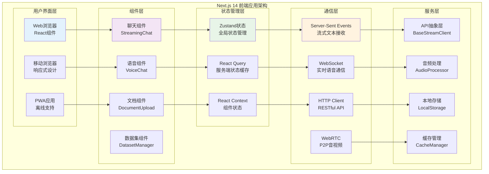

## 📋 模块概述

VoiceHelper前端应用基于Next.js 14构建的现代React应用，支持多模态交互（文本+语音）、实时通信、响应式设计和多平台部署。采用最新的App Router架构和服务端渲染技术。

## 🏗️ 前端架构图



## 🚀 核心组件详细分析

### 1. 流式聊天组件

**文件位置**: `platforms/web/components/chat/StreamingChat.tsx`

```typescript
interface StreamingChatProps {
  conversationId?: string;          // 对话ID
  onVoiceTranscript?: (text: string) => void;  // 语音转录回调
  onVoiceResponse?: (audio: Blob) => void;      // 语音回复回调
  onVoiceReferences?: (refs: Reference[]) => void; // 引用资料回调
  className?: string;               // 自定义样式
}

/**
 * StreamingChat - 流式聊天核心组件
 * 
 * 功能特性:
 * - SSE流式接收: 实时显示AI回复内容
 * - 消息管理: 维护对话历史和状态
 * - 错误处理: 网络异常和重连机制
 * - 性能优化: 虚拟滚动和懒加载
 * - 可访问性: 键盘导航和屏幕阅读器支持
 */
export default function StreamingChat({
  conversationId,
  onVoiceTranscript,
  onVoiceResponse, 
  onVoiceReferences,
  className
}: StreamingChatProps) {
  
  // === 状态管理 ===
  const [messages, setMessages] = useState<Message[]>([]);         // 消息列表
  const [input, setInput] = useState('');                          // 输入内容
  const [isLoading, setIsLoading] = useState(false);              // 加载状态
  const [isConnected, setIsConnected] = useState(false);          // 连接状态
  const [currentStreamingMessage, setCurrentStreamingMessage] = useState<Message | null>(null);
  const [error, setError] = useState<string | null>(null);        // 错误状态
  
  // === Refs引用 ===
  const messagesEndRef = useRef<HTMLDivElement>(null);            // 消息滚动引用
  const eventSourceRef = useRef<EventSource | null>(null);       // SSE连接引用
  const abortControllerRef = useRef<AbortController | null>(null); // 请求取消控制器
  const requestIdRef = useRef<string>('');                        // 当前请求ID
  const inputRef = useRef<HTMLTextAreaElement>(null);             // 输入框引用
  
  /**
   * 建立SSE连接 - 用于接收流式响应
   * 
   * 功能说明:
   * - 创建EventSource连接到服务端
   * - 监听多种事件类型 (data, error, stream_end等)
   * - 处理连接异常和自动重连
   * - 解析NDJSON格式的响应数据
   * 
   * @returns cleanup函数，用于清理连接
   */
  const connectSSE = useCallback(() => {
    // 清理现有连接
    if (eventSourceRef.current) {
      eventSourceRef.current.close();
    }
    
    // 创建新的SSE连接
    const eventSource = new EventSource('/api/v1/sse/connect', {
      withCredentials: true  // 携带认证cookie
    });
    
    eventSourceRef.current = eventSource;
    
    // === SSE事件监听器 ===
    
    // 连接建立事件
    eventSource.onopen = (event) => {
      console.log('SSE连接已建立', event);
      setIsConnected(true);
      setError(null);
    };
    
    // 默认消息事件 (data事件)
    eventSource.onmessage = (event) => {
      try {
        const data = JSON.parse(event.data);
        handleSSEMessage(data);
      } catch (e) {
        console.error('SSE消息解析失败:', e, event.data);
      }
    };
    
    // 连接错误事件
    eventSource.onerror = (event) => {
      console.error('SSE连接错误:', event);
      setIsConnected(false);
      
      // 根据readyState判断错误类型
      if (eventSource.readyState === EventSource.CLOSED) {
        setError('连接已关闭，请刷新页面重试');
      } else if (eventSource.readyState === EventSource.CONNECTING) {
        setError('正在重新连接...');
        // 自动重连机制由浏览器处理
      }
    };
    
    // 自定义事件监听
    const eventTypes = [
      'retrieval_start',    // 检索开始
      'retrieval_progress', // 检索进度
      'retrieval_result',   // 检索结果
      'generation_start',   // 生成开始
      'generation_chunk',   // 生成片段
      'generation_done',    // 生成完成
      'stream_end',         // 流结束
      'error'               // 错误事件
    ];
    
    eventTypes.forEach(eventType => {
      eventSource.addEventListener(eventType, (event: MessageEvent) => {
        try {
          const data = JSON.parse(event.data);
          handleSSEMessage({ ...data, type: eventType });
        } catch (e) {
          console.error(`${eventType}事件解析失败:`, e);
        }
      });
    });
    
    // 返回清理函数
    return () => {
      eventSource.close();
      setIsConnected(false);
    };
  }, []);
  
  /**
   * 处理SSE消息的核心逻辑
   * 
   * @param data SSE消息数据对象
   */
  const handleSSEMessage = useCallback((data: any) => {
    const { type, request_id } = data;
    
    // 验证请求ID，防止处理过期消息
    if (request_id && request_id !== requestIdRef.current) {
      return;
    }
    
    switch (type) {
      case 'retrieval_start':
        // 检索开始，显示检索状态
        if (currentStreamingMessage) {
          setCurrentStreamingMessage(prev => prev ? {
            ...prev,
            metadata: { ...prev.metadata, retrieval_status: 'searching' }
          } : null);
        }
        break;
        
      case 'retrieval_result':
        // 检索结果，保存引用资料
        const { results, total_found } = data;
        if (currentStreamingMessage && results) {
          setCurrentStreamingMessage(prev => prev ? {
            ...prev,
            references: results.slice(0, 5), // 保留前5个引用
            metadata: { 
              ...prev.metadata, 
              retrieval_status: 'completed',
              total_results: total_found 
            }
          } : null);
        }
        break;
        
      case 'generation_start':
        // 生成开始，准备接收内容
        console.log('开始生成回复...');
        break;
        
      case 'generation_chunk':
        // 生成片段，实时更新消息内容
        const { text: chunkText } = data;
        if (currentStreamingMessage && chunkText) {
          setCurrentStreamingMessage(prev => prev ? {
            ...prev,
            content: prev.content + chunkText,
            updatedAt: new Date()
          } : null);
        }
        break;
        
      case 'generation_done':
        // 生成完成，保存完整消息
        const { full_text, total_time_ms, context_sources } = data;
        if (currentStreamingMessage) {
          const finalMessage: Message = {
            ...currentStreamingMessage,
            content: full_text || currentStreamingMessage.content,
            isStreaming: false,
            completedAt: new Date(),
            metadata: {
              ...currentStreamingMessage.metadata,
              response_time: total_time_ms,
              sources: context_sources
            }
          };
          
          // 将完成的消息添加到消息列表
          setMessages(prev => [...prev, finalMessage]);
          setCurrentStreamingMessage(null);
          setIsLoading(false);
          
          // 触发回调
          if (onVoiceReferences && finalMessage.references) {
            onVoiceReferences(finalMessage.references);
          }
        }
        break;
        
      case 'stream_end':
        // 流结束，清理状态
        console.log('消息流结束');
        setIsLoading(false);
        break;
        
      case 'error':
        // 错误处理
        const { error: errorMsg, code: errorCode } = data;
        console.error('SSE错误:', errorMsg, errorCode);
        
        setError(`处理失败: ${errorMsg}`);
        setIsLoading(false);
        setCurrentStreamingMessage(null);
        break;
        
      default:
        console.log('未知SSE事件类型:', type, data);
    }
  }, [currentStreamingMessage, onVoiceReferences]);
  
  /**
   * 发送消息的核心逻辑
   * 
   * 功能说明:
   * - 构建消息对象并添加到消息列表
   * - 发送HTTP POST请求到聊天API
   * - 创建流式响应消息占位符
   * - 处理请求异常和重试机制
   * - 支持请求取消和幂等性控制
   */
  const sendMessage = useCallback(async () => {
    // 参数验证
    if (!input.trim() || isLoading || !isConnected) {
      return;
    }
    
    // 生成请求ID用于幂等性控制
    const requestId = generateRequestId();
    requestIdRef.current = requestId;
    
    // 构建用户消息
    const userMessage: Message = {
      id: Date.now().toString(),
      role: 'user',
      content: input.trim(),
      timestamp: new Date(),
      modality: 'text'
    };
    
    // 立即添加用户消息到界面
    setMessages(prev => [...prev, userMessage]);
    setInput(''); // 清空输入框
    setIsLoading(true);
    setError(null);
    
    // 创建AI回复占位符
    const assistantMessage: Message = {
      id: (Date.now() + 1).toString(), 
      role: 'assistant',
      content: '',
      timestamp: new Date(),
      modality: 'text',
      isStreaming: true,
      references: []
    };
    setCurrentStreamingMessage(assistantMessage);
    
    try {
      // 创建取消控制器
      const abortController = new AbortController();
      abortControllerRef.current = abortController;
      
      // 发送HTTP请求
      const response = await fetch('/api/v1/chat/stream', {
        method: 'POST',
        headers: {
          'Content-Type': 'application/json',
          'Authorization': `Bearer ${getAuthToken()}`,
          'X-Request-ID': requestId,
        },
        body: JSON.stringify({
          message: userMessage.content,
          conversation_id: conversationId,
          request_id: requestId,
          stream_id: eventSourceRef.current ? 'current_stream' : undefined,
          context: {
            modality: 'text',
            timestamp: userMessage.timestamp.toISOString(),
            user_preferences: getUserPreferences()
          }
        }),
        signal: abortController.signal
      });
      
      // 检查响应状态
      if (!response.ok) {
        throw new Error(`HTTP ${response.status}: ${response.statusText}`);
      }
      
      // 解析响应
      const result = await response.json();
      console.log('聊天请求已提交:', result);
      
    } catch (error: any) {
      if (error.name !== 'AbortError') {
        console.error('发送消息失败:', error);
        setError(`发送失败: ${error.message}`);
        setIsLoading(false);
        setCurrentStreamingMessage(null);
      }
    }
  }, [input, isLoading, isConnected, conversationId]);
  
  // === 副作用处理 ===
  
  // 建立SSE连接
  useEffect(() => {
    const cleanup = connectSSE();
    return cleanup;
  }, [connectSSE]);
  
  // 自动滚动到最新消息
  useEffect(() => {
    if (messagesEndRef.current) {
      messagesEndRef.current.scrollIntoView({ 
        behavior: 'smooth', 
        block: 'end' 
      });
    }
  }, [messages, currentStreamingMessage]);
  
  // 键盘快捷键处理
  useEffect(() => {
    const handleKeyDown = (event: KeyboardEvent) => {
      // Ctrl/Cmd + Enter 发送消息
      if ((event.ctrlKey || event.metaKey) && event.key === 'Enter') {
        event.preventDefault();
        sendMessage();
      }
      
      // Escape 取消当前请求
      if (event.key === 'Escape' && isLoading) {
        if (abortControllerRef.current) {
          abortControllerRef.current.abort();
        }
      }
    };
    
    document.addEventListener('keydown', handleKeyDown);
    return () => document.removeEventListener('keydown', handleKeyDown);
  }, [sendMessage, isLoading]);
  
  // === 组件渲染 ===
  
  return (
    <div className={`flex flex-col h-full bg-white ${className}`}>
      {/* 连接状态指示器 */}
      <div className="flex items-center justify-between p-4 bg-gray-50 border-b">
        <h2 className="text-lg font-semibold text-gray-900">
          智能助手
        </h2>
        <div className="flex items-center space-x-2">
          <div className={`w-2 h-2 rounded-full ${
            isConnected ? 'bg-green-500' : 'bg-red-500'
          }`} />
          <span className="text-sm text-gray-600">
            {isConnected ? '已连接' : '连接中断'}
          </span>
        </div>
      </div>
      
      {/* 错误提示 */}
      {error && (
        <div className="p-4 bg-red-50 border-b border-red-200">
          <div className="flex items-center">
            <ExclamationTriangleIcon className="w-5 h-5 text-red-500 mr-2" />
            <span className="text-sm text-red-700">{error}</span>
            <button
              onClick={() => setError(null)}
              className="ml-auto text-red-500 hover:text-red-700"
            >
              ✕
            </button>
          </div>
        </div>
      )}
      
      {/* 消息列表 */}
      <div className="flex-1 overflow-y-auto p-4 space-y-4">
        {messages.map((message) => (
          <MessageBubble
            key={message.id}
            message={message}
            isStreaming={false}
          />
        ))}
        
        {/* 流式消息 */}
        {currentStreamingMessage && (
          <MessageBubble
            message={currentStreamingMessage}
            isStreaming={true}
          />
        )}
        
        {/* 滚动锚点 */}
        <div ref={messagesEndRef} />
      </div>
      
      {/* 输入区域 */}
      <div className="p-4 bg-white border-t">
        <div className="flex items-end space-x-2">
          <div className="flex-1 relative">
            <textarea
              ref={inputRef}
              value={input}
              onChange={(e) => setInput(e.target.value)}
              onKeyDown={(e) => {
                if (e.key === 'Enter' && !e.shiftKey) {
                  e.preventDefault();
                  sendMessage();
                }
              }}
              placeholder="输入消息... (Ctrl+Enter发送)"
              className="w-full p-3 border border-gray-300 rounded-lg resize-none focus:ring-2 focus:ring-blue-500 focus:border-transparent"
              rows={1}
              disabled={isLoading || !isConnected}
              maxLength={2000}
            />
            
            {/* 字符计数 */}
            <div className="absolute bottom-2 right-2 text-xs text-gray-400">
              {input.length}/2000
            </div>
          </div>
          
          {/* 发送按钮 */}
          <button
            onClick={sendMessage}
            disabled={!input.trim() || isLoading || !isConnected}
            className={`p-3 rounded-lg transition-colors ${
              !input.trim() || isLoading || !isConnected
                ? 'bg-gray-300 text-gray-500 cursor-not-allowed'
                : 'bg-blue-600 text-white hover:bg-blue-700'
            }`}
            title="发送消息 (Ctrl+Enter)"
          >
            {isLoading ? (
              <div className="w-5 h-5 border-2 border-white border-t-transparent rounded-full animate-spin" />
            ) : (
              <PaperAirplaneIcon className="w-5 h-5" />
            )}
          </button>
        </div>
      </div>
    </div>
  );
}

// === 工具函数 ===

/**
 * 生成请求ID用于幂等性控制
 * @returns 唯一请求标识符
 */
function generateRequestId(): string {
  return `req_${Date.now()}_${Math.random().toString(36).substr(2, 9)}`;
}

/**
 * 获取认证令牌
 * @returns JWT认证令牌
 */
function getAuthToken(): string {
  return localStorage.getItem('authToken') || '';
}

/**
 * 获取用户偏好设置
 * @returns 用户配置对象
 */
function getUserPreferences(): any {
  const prefs = localStorage.getItem('userPreferences');
  return prefs ? JSON.parse(prefs) : {
    language: 'zh-CN',
    theme: 'light',
    enableVoice: true
  };
}
```

### 2. 语音聊天组件

**文件位置**: `platforms/web/components/voice/VoiceChat.tsx`

```typescript
/**
 * VoiceChat - 语音交互核心组件
 * 
 * 功能特性:
 * - WebSocket实时通信: 双向音频流传输
 * - 实时语音识别: 边说边显示转录文本
 * - 语音活动检测: 自动识别说话开始和结束
 * - 音频处理: 降噪、回声消除、自动增益
 * - 多语言支持: 中英文及其他语言识别
 * - 离线备用: 网络异常时的降级处理
 */
export default function VoiceChat({
  conversationId,
  onTranscript,
  onResponse,
  onReferences,
  className
}: VoiceChatProps) {
  
  // === 状态管理 ===
  const [isRecording, setIsRecording] = useState(false);           // 录音状态
  const [isProcessing, setIsProcessing] = useState(false);         // 处理状态  
  const [isPlaying, setIsPlaying] = useState(false);              // 播放状态
  const [connectionStatus, setConnectionStatus] = useState<'disconnected' | 'connecting' | 'connected'>('disconnected');
  const [currentTranscript, setCurrentTranscript] = useState(''); // 当前转录文本
  const [volume, setVolume] = useState(0);                        // 音频音量
  const [error, setError] = useState<string | null>(null);        // 错误状态
  
  // === Refs引用 ===
  const wsRef = useRef<WebSocket | null>(null);                   // WebSocket连接
  const audioContextRef = useRef<AudioContext | null>(null);     // 音频上下文
  const mediaStreamRef = useRef<MediaStream | null>(null);       // 媒体流
  const recordingRef = useRef<MediaRecorder | null>(null);       // 录音器
  const audioChunksRef = useRef<Blob[]>([]);                     // 音频块缓存
  const vadRef = useRef<any>(null);                              // 语音活动检测
  const playbackQueueRef = useRef<ArrayBuffer[]>([]);            // 播放队列
  
  /**
   * 初始化WebSocket连接
   * 
   * 功能说明:
   * - 建立WebSocket连接到语音服务
   * - 配置消息监听和错误处理
   * - 实现自动重连机制
   * - 处理各种语音事件类型
   */
  const initializeWebSocket = useCallback(async () => {
    try {
      setConnectionStatus('connecting');
      
      // 构建WebSocket URL
      const wsProtocol = window.location.protocol === 'https:' ? 'wss:' : 'ws:';
      const wsUrl = `${wsProtocol}//${window.location.host}/api/v2/voice/ws?conversation_id=${conversationId}&language=zh-CN`;
      
      // 创建WebSocket连接
      const ws = new WebSocket(wsUrl);
      wsRef.current = ws;
      
      // === WebSocket事件监听 ===
      
      // 连接建立
      ws.onopen = (event) => {
        console.log('语音WebSocket连接已建立');
        setConnectionStatus('connected');
        setError(null);
      };
      
      // 接收消息
      ws.onmessage = async (event) => {
        try {
          const data = JSON.parse(event.data);
          await handleVoiceMessage(data);
        } catch (e) {
          console.error('语音消息解析失败:', e);
        }
      };
      
      // 连接错误
      ws.onerror = (event) => {
        console.error('WebSocket错误:', event);
        setError('语音连接异常，请检查网络');
      };
      
      // 连接关闭
      ws.onclose = (event) => {
        console.log('WebSocket连接关闭:', event.code, event.reason);
        setConnectionStatus('disconnected');
        
        // 自动重连逻辑
        if (!event.wasClean && event.code !== 1000) {
          setTimeout(() => {
            console.log('尝试重新连接...');
            initializeWebSocket();
          }, 3000);
        }
      };
      
    } catch (error) {
      console.error('初始化WebSocket失败:', error);
      setConnectionStatus('disconnected');
      setError('无法建立语音连接');
    }
  }, [conversationId]);
  
  /**
   * 处理语音WebSocket消息
   * 
   * @param data WebSocket消息数据
   */
  const handleVoiceMessage = useCallback(async (data: any) => {
    const { type } = data;
    
    switch (type) {
      case 'session_initialized':
        // 会话初始化完成
        console.log('语音会话已初始化:', data.session_id);
        break;
        
      case 'asr_partial':
        // 部分语音识别结果
        const partialText = data.text || '';
        setCurrentTranscript(partialText);
        
        if (onTranscript) {
          onTranscript(partialText, false); // false表示未完成
        }
        break;
        
      case 'asr_final':
        // 最终语音识别结果
        const finalText = data.text || '';
        setCurrentTranscript(finalText);
        
        if (onTranscript) {
          onTranscript(finalText, true); // true表示识别完成
        }
        break;
        
      case 'processing_start':
        // 开始处理用户请求
        setIsProcessing(true);
        console.log('开始处理语音请求...');
        break;
        
      case 'llm_response_chunk':
        // LLM回复文本片段
        const textChunk = data.text || '';
        console.log('收到文本回复片段:', textChunk);
        
        if (onResponse) {
          onResponse(textChunk, 'text', false);
        }
        break;
        
      case 'llm_response_final':
        // LLM完整回复
        const fullText = data.text || '';
        const references = data.references || [];
        
        console.log('收到完整文本回复:', fullText);
        
        if (onResponse) {
          onResponse(fullText, 'text', true);
        }
        
        if (onReferences && references.length > 0) {
          onReferences(references);
        }
        
        setIsProcessing(false);
        break;
        
      case 'tts_start':
        // TTS开始合成
        console.log('开始语音合成...');
        setIsPlaying(true);
        break;
        
      case 'tts_audio':
        // TTS音频数据
        const audioData = data.audio_data;
        const audioFormat = data.format || 'mp3';
        
        if (audioData) {
          await playAudioChunk(audioData, audioFormat);
        }
        break;
        
      case 'tts_complete':
        // TTS合成完成
        console.log('语音合成完成');
        setIsPlaying(false);
        break;
        
      case 'error':
        // 错误处理
        const errorMsg = data.error || '未知错误';
        console.error('语音处理错误:', errorMsg);
        setError(errorMsg);
        setIsProcessing(false);
        setIsPlaying(false);
        break;
        
      default:
        console.log('未知语音消息类型:', type, data);
    }
  }, [onTranscript, onResponse, onReferences]);
  
  /**
   * 播放音频块
   * 
   * @param audioData Base64编码的音频数据
   * @param format 音频格式
   */
  const playAudioChunk = useCallback(async (audioData: string, format: string) => {
    try {
      // Base64解码
      const binaryString = atob(audioData);
      const bytes = new Uint8Array(binaryString.length);
      
      for (let i = 0; i < binaryString.length; i++) {
        bytes[i] = binaryString.charCodeAt(i);
      }
      
      // 创建音频上下文
      if (!audioContextRef.current) {
        audioContextRef.current = new (window.AudioContext || (window as any).webkitAudioContext)();
      }
      
      const audioContext = audioContextRef.current;
      
      // 解码音频数据
      const audioBuffer = await audioContext.decodeAudioData(bytes.buffer.slice());
      
      // 创建音频源并播放
      const source = audioContext.createBufferSource();
      source.buffer = audioBuffer;
      source.connect(audioContext.destination);
      source.start();
      
      console.log(`播放音频块: ${format}, 时长: ${audioBuffer.duration.toFixed(2)}s`);
      
    } catch (error) {
      console.error('音频播放失败:', error);
    }
  }, []);
  
  /**
   * 开始录音
   */
  const startRecording = useCallback(async () => {
    try {
      // 请求麦克风权限
      const stream = await navigator.mediaDevices.getUserMedia({
        audio: {
          echoCancellation: true,    // 回声消除
          noiseSuppression: true,    // 噪声抑制
          autoGainControl: true,     // 自动增益控制
          sampleRate: 16000,         // 采样率
          channelCount: 1            // 单声道
        }
      });
      
      mediaStreamRef.current = stream;
      
      // 创建录音器
      const recorder = new MediaRecorder(stream, {
        mimeType: 'audio/webm;codecs=opus' // 使用Opus编码
      });
      
      recordingRef.current = recorder;
      audioChunksRef.current = [];
      
      // 录音数据处理
      recorder.ondataavailable = (event) => {
        if (event.data.size > 0) {
          audioChunksRef.current.push(event.data);
          
          // 实时发送音频数据
          if (wsRef.current && wsRef.current.readyState === WebSocket.OPEN) {
            const reader = new FileReader();
            reader.onload = () => {
              const arrayBuffer = reader.result as ArrayBuffer;
              const uint8Array = new Uint8Array(arrayBuffer);
              
              // 发送二进制音频数据
              wsRef.current?.send(uint8Array);
            };
            reader.readAsArrayBuffer(event.data);
          }
        }
      };
      
      // 开始录音，每500ms产生一个数据块
      recorder.start(500);
      setIsRecording(true);
      setError(null);
      
      console.log('开始录音...');
      
    } catch (error) {
      console.error('启动录音失败:', error);
      setError('无法访问麦克风，请检查权限设置');
    }
  }, []);
  
  /**
   * 停止录音
   */
  const stopRecording = useCallback(() => {
    if (recordingRef.current && isRecording) {
      recordingRef.current.stop();
      setIsRecording(false);
      
      // 关闭媒体流
      if (mediaStreamRef.current) {
        mediaStreamRef.current.getTracks().forEach(track => track.stop());
        mediaStreamRef.current = null;
      }
      
      console.log('录音已停止');
    }
  }, [isRecording]);
  
  /**
   * 切换录音状态
   */
  const toggleRecording = useCallback(() => {
    if (connectionStatus !== 'connected') {
      setError('语音连接未建立，请稍候重试');
      return;
    }
    
    if (isRecording) {
      stopRecording();
    } else {
      startRecording();
    }
  }, [isRecording, connectionStatus, startRecording, stopRecording]);
  
  // === 副作用处理 ===
  
  // 初始化WebSocket连接
  useEffect(() => {
    initializeWebSocket();
    
    return () => {
      // 清理资源
      if (wsRef.current) {
        wsRef.current.close();
      }
      if (mediaStreamRef.current) {
        mediaStreamRef.current.getTracks().forEach(track => track.stop());
      }
      if (audioContextRef.current) {
        audioContextRef.current.close();
      }
    };
  }, [initializeWebSocket]);
  
  // 键盘快捷键
  useEffect(() => {
    const handleKeyDown = (event: KeyboardEvent) => {
      // 空格键录音 (按住录音)
      if (event.code === 'Space' && !event.repeat) {
        event.preventDefault();
        if (!isRecording) {
          startRecording();
        }
      }
    };
    
    const handleKeyUp = (event: KeyboardEvent) => {
      if (event.code === 'Space') {
        event.preventDefault();
        if (isRecording) {
          stopRecording();
        }
      }
    };
    
    document.addEventListener('keydown', handleKeyDown);
    document.addEventListener('keyup', handleKeyUp);
    
    return () => {
      document.removeEventListener('keydown', handleKeyDown);
      document.removeEventListener('keyup', handleKeyUp);
    };
  }, [isRecording, startRecording, stopRecording]);
  
  // === 组件渲染 ===
  
  return (
    <div className={`flex flex-col items-center p-6 bg-gradient-to-b from-blue-50 to-white ${className}`}>
      {/* 连接状态 */}
      <div className="mb-4">
        <div className={`inline-flex items-center px-3 py-1 rounded-full text-sm ${
          connectionStatus === 'connected' 
            ? 'bg-green-100 text-green-800' 
            : connectionStatus === 'connecting'
            ? 'bg-yellow-100 text-yellow-800'
            : 'bg-red-100 text-red-800'
        }`}>
          <div className={`w-2 h-2 rounded-full mr-2 ${
            connectionStatus === 'connected' ? 'bg-green-500' : 
            connectionStatus === 'connecting' ? 'bg-yellow-500' : 'bg-red-500'
          }`} />
          {connectionStatus === 'connected' ? '语音已连接' :
           connectionStatus === 'connecting' ? '连接中...' : '连接断开'}
        </div>
      </div>
      
      {/* 错误提示 */}
      {error && (
        <div className="mb-4 p-3 bg-red-50 border border-red-200 rounded-lg">
          <p className="text-sm text-red-700">{error}</p>
        </div>
      )}
      
      {/* 转录文本显示 */}
      <div className="mb-6 min-h-[60px] max-w-md">
        <div className="p-4 bg-white rounded-lg border shadow-sm">
          <p className="text-gray-600 text-sm mb-1">实时转录:</p>
          <p className="text-gray-900 min-h-[24px]">
            {currentTranscript || '开始说话，我会实时转录...'}
          </p>
        </div>
      </div>
      
      {/* 录音控制按钮 */}
      <div className="flex flex-col items-center space-y-4">
        <button
          onClick={toggleRecording}
          disabled={connectionStatus !== 'connected'}
          className={`relative w-20 h-20 rounded-full flex items-center justify-center transition-all duration-200 ${
            isRecording 
              ? 'bg-red-500 hover:bg-red-600 scale-110 shadow-lg' 
              : 'bg-blue-500 hover:bg-blue-600 shadow-md'
          } ${
            connectionStatus !== 'connected' 
              ? 'opacity-50 cursor-not-allowed' 
              : 'cursor-pointer'
          }`}
        >
          {isRecording ? (
            <div className="w-6 h-6 bg-white rounded-sm" />
          ) : (
            <MicrophoneIcon className="w-8 h-8 text-white" />
          )}
          
          {/* 录音动画 */}
          {isRecording && (
            <div className="absolute inset-0 rounded-full border-4 border-red-300 animate-ping" />
          )}
        </button>
        
        {/* 状态文本 */}
        <div className="text-center">
          {isRecording ? (
            <p className="text-red-600 font-medium">正在录音...</p>
          ) : isProcessing ? (
            <p className="text-blue-600 font-medium">正在处理...</p>
          ) : isPlaying ? (
            <p className="text-green-600 font-medium">正在播放...</p>
          ) : (
            <p className="text-gray-600">点击开始语音对话</p>
          )}
          
          <p className="text-xs text-gray-500 mt-1">
            或按住空格键录音
          </p>
        </div>
      </div>
      
      {/* 音量指示器 */}
      {isRecording && (
        <div className="mt-4 flex items-center space-x-1">
          {[...Array(10)].map((_, i) => (
            <div
              key={i}
              className={`w-1 rounded-full transition-all duration-100 ${
                i < volume * 10 ? 'bg-red-500 h-4' : 'bg-gray-300 h-2'
              }`}
            />
          ))}
        </div>
      )}
    </div>
  );
}
```

## 🔄 状态管理架构

### Zustand全局状态管理

**文件位置**: `platforms/web/src/store/useAppStore.ts`

```typescript
interface AppState {
  // 用户状态
  user: User | null;
  isAuthenticated: boolean;
  
  // 对话状态  
  currentConversation: Conversation | null;
  conversations: Conversation[];
  
  // UI状态
  sidebarOpen: boolean;
  theme: 'light' | 'dark';
  language: string;
  
  // 语音状态
  voiceEnabled: boolean;
  voiceSettings: VoiceSettings;
  
  // 系统状态
  connectionStatus: 'connected' | 'connecting' | 'disconnected';
  notifications: Notification[];
}

interface AppActions {
  // 用户操作
  setUser: (user: User | null) => void;
  login: (credentials: LoginCredentials) => Promise<void>;
  logout: () => void;
  
  // 对话操作
  setCurrentConversation: (conversation: Conversation | null) => void;
  addConversation: (conversation: Conversation) => void;
  updateConversation: (id: string, updates: Partial<Conversation>) => void;
  deleteConversation: (id: string) => void;
  
  // UI操作
  toggleSidebar: () => void;
  setTheme: (theme: 'light' | 'dark') => void;
  setLanguage: (language: string) => void;
  
  // 语音操作
  toggleVoice: () => void;
  updateVoiceSettings: (settings: Partial<VoiceSettings>) => void;
  
  // 系统操作
  setConnectionStatus: (status: 'connected' | 'connecting' | 'disconnected') => void;
  addNotification: (notification: Notification) => void;
  removeNotification: (id: string) => void;
}

/**
 * Zustand应用状态管理
 * 
 * 特性:
 * - 类型安全: 完整的TypeScript类型定义
 * - 持久化: 关键状态自动保存到本地存储
 * - 中间件: 日志记录和状态同步
 * - 性能优化: 选择性订阅和浅比较
 */
export const useAppStore = create<AppState & AppActions>()(
  subscribeWithSelector(
    persist(
      immer((set, get) => ({
        // === 初始状态 ===
        user: null,
        isAuthenticated: false,
        currentConversation: null,
        conversations: [],
        sidebarOpen: true,
        theme: 'light',
        language: 'zh-CN',
        voiceEnabled: true,
        voiceSettings: {
          voice: 'zh-CN-XiaoxiaoNeural',
          rate: 1.0,
          pitch: 1.0,
          volume: 0.8
        },
        connectionStatus: 'disconnected',
        notifications: [],
        
        // === 用户操作 ===
        setUser: (user) => set((state) => {
          state.user = user;
          state.isAuthenticated = !!user;
        }),
        
        login: async (credentials) => {
          set((state) => {
            state.connectionStatus = 'connecting';
          });
          
          try {
            const response = await authApi.login(credentials);
            const { user, token } = response.data;
            
            // 保存认证信息
            localStorage.setItem('authToken', token);
            
            set((state) => {
              state.user = user;
              state.isAuthenticated = true;
              state.connectionStatus = 'connected';
            });
            
          } catch (error) {
            set((state) => {
              state.connectionStatus = 'disconnected';
            });
            throw error;
          }
        },
        
        logout: () => set((state) => {
          // 清理认证信息
          localStorage.removeItem('authToken');
          
          state.user = null;
          state.isAuthenticated = false;
          state.currentConversation = null;
          state.conversations = [];
          state.connectionStatus = 'disconnected';
        }),
        
        // === 对话操作 ===
        setCurrentConversation: (conversation) => set((state) => {
          state.currentConversation = conversation;
        }),
        
        addConversation: (conversation) => set((state) => {
          state.conversations.unshift(conversation);
        }),
        
        updateConversation: (id, updates) => set((state) => {
          const index = state.conversations.findIndex(c => c.id === id);
          if (index !== -1) {
            Object.assign(state.conversations[index], updates);
          }
          
          if (state.currentConversation?.id === id) {
            Object.assign(state.currentConversation, updates);
          }
        }),
        
        deleteConversation: (id) => set((state) => {
          state.conversations = state.conversations.filter(c => c.id !== id);
          
          if (state.currentConversation?.id === id) {
            state.currentConversation = null;
          }
        }),
        
        // === UI操作 ===
        toggleSidebar: () => set((state) => {
          state.sidebarOpen = !state.sidebarOpen;
        }),
        
        setTheme: (theme) => set((state) => {
          state.theme = theme;
          document.documentElement.setAttribute('data-theme', theme);
        }),
        
        setLanguage: (language) => set((state) => {
          state.language = language;
        }),
        
        // === 语音操作 ===
        toggleVoice: () => set((state) => {
          state.voiceEnabled = !state.voiceEnabled;
        }),
        
        updateVoiceSettings: (settings) => set((state) => {
          Object.assign(state.voiceSettings, settings);
        }),
        
        // === 系统操作 ===
        setConnectionStatus: (status) => set((state) => {
          state.connectionStatus = status;
        }),
        
        addNotification: (notification) => set((state) => {
          state.notifications.push({
            ...notification,
            id: notification.id || Date.now().toString(),
            timestamp: new Date()
          });
        }),
        
        removeNotification: (id) => set((state) => {
          state.notifications = state.notifications.filter(n => n.id !== id);
        })
      })),
      {
        name: 'voicehelper-app-store',
        // 持久化配置
        partialize: (state) => ({
          theme: state.theme,
          language: state.language,
          voiceEnabled: state.voiceEnabled,
          voiceSettings: state.voiceSettings,
          sidebarOpen: state.sidebarOpen
        }),
        // 存储版本管理
        version: 1,
        migrate: (persistedState: any, version: number) => {
          if (version === 0) {
            // 迁移逻辑
          }
          return persistedState;
        }
      }
    )
  )
);

// === 选择器钩子 ===

export const useUser = () => useAppStore(state => state.user);
export const useAuth = () => useAppStore(state => ({
  isAuthenticated: state.isAuthenticated,
  login: state.login,
  logout: state.logout
}));

export const useConversations = () => useAppStore(state => ({
  current: state.currentConversation,
  list: state.conversations,
  setCurrent: state.setCurrentConversation,
  add: state.addConversation,
  update: state.updateConversation,
  delete: state.deleteConversation
}));

export const useUI = () => useAppStore(state => ({
  sidebarOpen: state.sidebarOpen,
  theme: state.theme,
  language: state.language,
  toggleSidebar: state.toggleSidebar,
  setTheme: state.setTheme,
  setLanguage: state.setLanguage
}));

export const useVoice = () => useAppStore(state => ({
  enabled: state.voiceEnabled,
  settings: state.voiceSettings,
  toggle: state.toggleVoice,
  updateSettings: state.updateVoiceSettings
}));

export const useConnection = () => useAppStore(state => ({
  status: state.connectionStatus,
  setStatus: state.setConnectionStatus
}));

export const useNotifications = () => useAppStore(state => ({
  notifications: state.notifications,
  add: state.addNotification,
  remove: state.removeNotification
}));
```

---

## 🎯 性能优化最佳实践

### 1. React性能优化

```typescript
// 使用React.memo优化组件渲染
const MessageBubble = React.memo<MessageBubbleProps>(({
  message,
  isStreaming
}) => {
  return (
    <div className={`message-bubble ${message.role}`}>
      {/* 组件内容 */}
    </div>
  );
}, (prevProps, nextProps) => {
  // 自定义比较函数
  return (
    prevProps.message.id === nextProps.message.id &&
    prevProps.message.content === nextProps.message.content &&
    prevProps.isStreaming === nextProps.isStreaming
  );
});

// 使用useMemo优化计算
const processedMessages = useMemo(() => {
  return messages.map(message => ({
    ...message,
    formattedContent: formatMessageContent(message.content)
  }));
}, [messages]);

// 使用useCallback优化函数引用
const handleMessageSend = useCallback((content: string) => {
  if (!content.trim()) return;
  
  sendMessage(content);
}, [sendMessage]);
```

### 2. Bundle优化

```typescript
// 动态导入减少初始包大小
const VoiceChat = lazy(() => import('./components/voice/VoiceChat'));
const DocumentUpload = lazy(() => import('./components/documents/DocumentUpload'));

// 使用Suspense处理加载状态
<Suspense fallback={<LoadingSpinner />}>
  <VoiceChat conversationId={conversationId} />
</Suspense>

// 预加载关键组件
const preloadVoiceChat = () => import('./components/voice/VoiceChat');

useEffect(() => {
  // 在用户可能需要时预加载
  const timer = setTimeout(preloadVoiceChat, 2000);
  return () => clearTimeout(timer);
}, []);
```

这份前端应用分析涵盖了React组件架构、状态管理、通信机制、性能优化等核心方面，为开发者提供了构建现代Web应用的完整指南。
