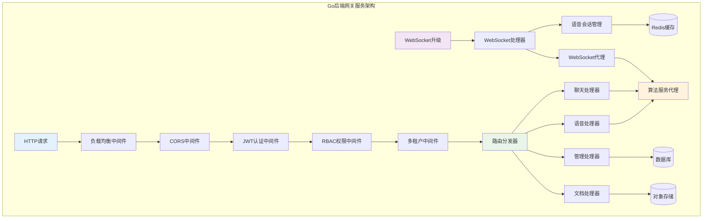
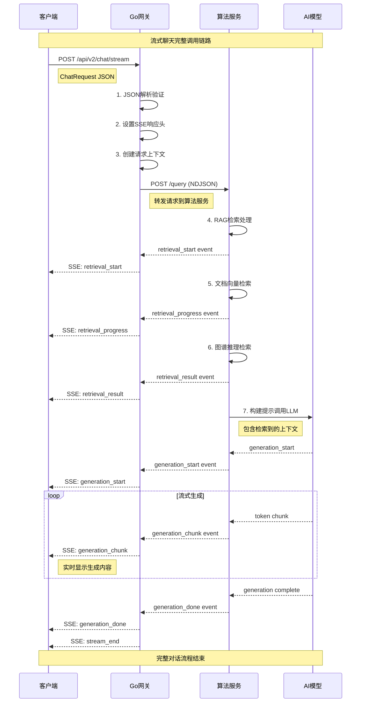
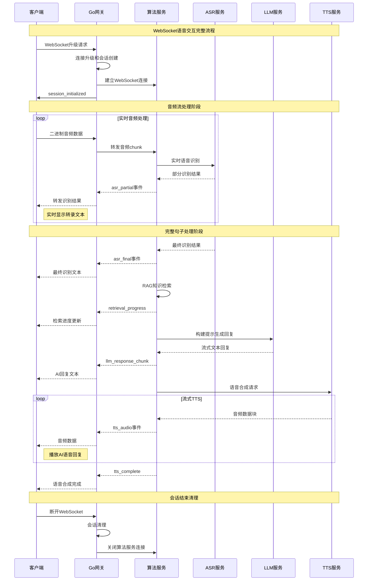
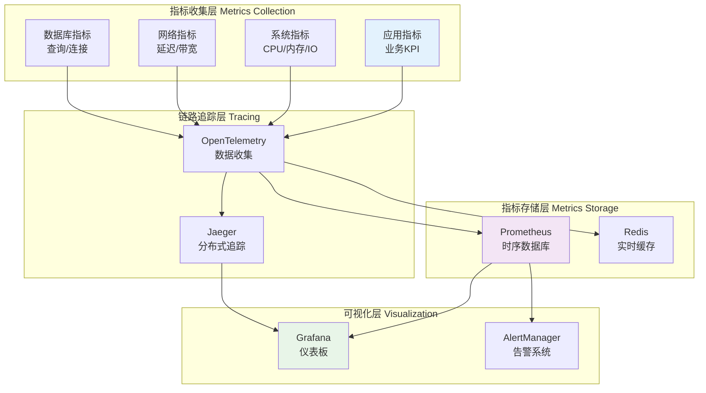
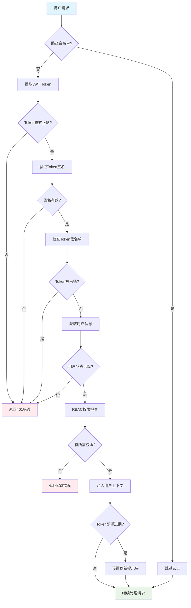

## 📋 模块概述

Go后端网关服务是VoiceHelper系统的核心路由层，负责请求转发、认证鉴权、WebSocket管理和系统监控。采用Gin框架构建高性能HTTP服务，支持多种中间件和实时通信协议。

## 🏗️ 服务架构图



## 🚀 核心API详细分析

### 1. 流式聊天API

#### 入口函数详细解析

**文件位置**: `backend/internal/handlers/v2_chat.go`

```go
// ChatRequest 聊天请求结构体
// 定义客户端发送的聊天请求格式
type ChatRequest struct {
    // 用户输入的消息内容，必填字段
    Message string `json:"message" binding:"required" example:"你好，请介绍一下VoiceHelper"`
    
    // 会话ID，用于维护对话上下文，可选
    ConversationID string `json:"conversation_id" example:"conv_123456789"`
    
    // 流ID，用于幂等性控制，可选
    StreamID string `json:"stream_id" example:"stream_abc123"`
    
    // 请求ID，用于请求追踪和幂等性，可选
    RequestID string `json:"request_id" example:"req_xyz789"`
    
    // 使用的AI模型，默认为gpt-3.5-turbo
    Model string `json:"model" example:"gpt-3.5-turbo"`
    
    // 生成温度，控制回复的随机性，范围0-2
    Temperature *float32 `json:"temperature" example:"0.7"`
    
    // 最大生成token数量，默认为2048
    MaxTokens *int `json:"max_tokens" example:"2048"`
}

// V2ChatHandlerSimple 简化版聊天处理器
// 主要负责请求转发和SSE流处理
type V2ChatHandlerSimple struct {
    // 算法服务的基础URL，用于请求转发
    algoServiceURL string
    
    // HTTP客户端，配置了连接池和超时设置
    httpClient *http.Client
    
    // 请求计数器，用于监控和限流
    requestCounter int64
    
    // 活跃请求映射，用于请求管理和取消
    activeRequests map[string]context.CancelFunc
    
    // 请求锁，保护并发访问
    requestMutex sync.RWMutex
}

// StreamChat 流式聊天处理函数
// @Summary 流式聊天API
// @Description 发送消息到AI助手并获取流式回复，使用Server-Sent Events协议
// @Tags Chat
// @Accept application/json
// @Produce text/event-stream
// @Param request body ChatRequest true "聊天请求参数"
// @Success 200 {string} string "SSE流式响应"
// @Failure 400 {object} ErrorResponse "请求参数错误"
// @Failure 500 {object} ErrorResponse "服务器内部错误"
// @Router /api/v2/chat/stream [post]
func (h *V2ChatHandlerSimple) StreamChat(c *gin.Context) {
    // === 第一阶段：请求解析和验证 ===
    
    // 1.1 解析JSON请求体
    var req ChatRequest
    if err := c.ShouldBindJSON(&req); err != nil {
        logger.Error("Failed to bind JSON request", 
            zap.Error(err),
            zap.String("method", c.Request.Method),
            zap.String("path", c.Request.URL.Path))
        
        c.JSON(http.StatusBadRequest, gin.H{
            "error": "Invalid JSON format",
            "details": err.Error(),
        })
        return
    }
    
    // 1.2 业务参数验证
    if err := h.validateChatRequest(&req); err != nil {
        logger.Warn("Chat request validation failed",
            zap.Error(err),
            zap.String("message_preview", truncateString(req.Message, 50)))
        
        c.JSON(http.StatusBadRequest, gin.H{
            "error": "Validation failed",
            "details": err.Error(),
        })
        return
    }
    
    // 1.3 生成请求追踪ID（如果未提供）
    if req.RequestID == "" {
        req.RequestID = generateRequestID()
    }
    
    // === 第二阶段：SSE响应设置 ===
    
    // 2.1 设置Server-Sent Events响应头
    c.Header("Content-Type", "text/event-stream")       // SSE内容类型
    c.Header("Cache-Control", "no-cache")               // 禁用缓存
    c.Header("Connection", "keep-alive")                // 保持连接
    c.Header("Access-Control-Allow-Origin", "*")        // CORS设置
    c.Header("Access-Control-Allow-Headers", "Cache-Control")
    c.Header("X-Accel-Buffering", "no")                // 禁用Nginx缓冲
    
    // 2.2 创建可取消的上下文
    ctx, cancel := context.WithCancel(c.Request.Context())
    defer cancel()
    
    // 2.3 注册活跃请求，便于管理和取消
    h.requestMutex.Lock()
    if h.activeRequests == nil {
        h.activeRequests = make(map[string]context.CancelFunc)
    }
    h.activeRequests[req.RequestID] = cancel
    h.requestMutex.Unlock()
    
    // 请求结束时清理
    defer func() {
        h.requestMutex.Lock()
        delete(h.activeRequests, req.RequestID)
        h.requestMutex.Unlock()
    }()
    
    // === 第三阶段：请求转发到算法服务 ===
    
    // 3.1 构建算法服务请求体
    algoRequest := AlgoServiceRequest{
        Messages: []Message{
            {
                Role:    "user",
                Content: req.Message,
            },
        },
        ConversationID: req.ConversationID,
        StreamID:      req.StreamID,
        RequestID:     req.RequestID,
        Model:         getDefaultIfEmpty(req.Model, "gpt-3.5-turbo"),
        Temperature:   getDefaultIfNil(req.Temperature, 0.7),
        MaxTokens:    getDefaultIfNil(req.MaxTokens, 2048),
    }
    
    // 3.2 序列化请求体
    reqBody, err := json.Marshal(algoRequest)
    if err != nil {
        logger.Error("Failed to marshal algo request", 
            zap.Error(err),
            zap.String("request_id", req.RequestID))
        
        h.sendSSEError(c, "MARSHAL_ERROR", "Failed to process request")
        return
    }
    
    // 3.3 创建HTTP请求
    httpReq, err := http.NewRequestWithContext(
        ctx,
        "POST",
        h.algoServiceURL+"/query",
        bytes.NewBuffer(reqBody))
    if err != nil {
        logger.Error("Failed to create HTTP request", 
            zap.Error(err),
            zap.String("algo_url", h.algoServiceURL))
        
        h.sendSSEError(c, "REQUEST_CREATE_ERROR", "Failed to create request")
        return
    }
    
    // 3.4 设置请求头
    httpReq.Header.Set("Content-Type", "application/json")
    httpReq.Header.Set("Accept", "application/x-ndjson")  // NDJSON格式响应
    httpReq.Header.Set("X-Request-ID", req.RequestID)     // 请求追踪
    httpReq.Header.Set("User-Agent", "VoiceHelper-Gateway/2.0.0")
    
    // === 第四阶段：发送请求并处理响应 ===
    
    // 4.1 发送HTTP请求
    resp, err := h.httpClient.Do(httpReq)
    if err != nil {
        logger.Error("Failed to send request to algo service",
            zap.Error(err),
            zap.String("request_id", req.RequestID))
        
        h.sendSSEError(c, "ALGO_SERVICE_ERROR", "Algorithm service unavailable")
        return
    }
    defer resp.Body.Close()
    
    // 4.2 检查响应状态码
    if resp.StatusCode != http.StatusOK {
        logger.Error("Algo service returned non-200 status",
            zap.Int("status_code", resp.StatusCode),
            zap.String("request_id", req.RequestID))
        
        h.sendSSEError(c, "ALGO_SERVICE_ERROR", 
            fmt.Sprintf("Service returned status %d", resp.StatusCode))
        return
    }
    
    // 4.3 流式读取和转发响应
    if err := h.streamResponse(ctx, c, resp.Body, req.RequestID); err != nil {
        logger.Error("Failed to stream response",
            zap.Error(err),
            zap.String("request_id", req.RequestID))
        // 错误已在streamResponse中处理
    }
}

// streamResponse 流式处理算法服务响应
// @param ctx 请求上下文，用于取消控制
// @param c Gin上下文，用于SSE输出
// @param responseBody 算法服务的响应体
// @param requestID 请求ID，用于日志追踪
// @return error 处理过程中的错误
func (h *V2ChatHandlerSimple) streamResponse(
    ctx context.Context, 
    c *gin.Context, 
    responseBody io.ReadCloser, 
    requestID string,
) error {
    scanner := bufio.NewScanner(responseBody)
    scanner.Buffer(make([]byte, 64*1024), 1024*1024) // 64KB初始缓冲，1MB最大缓冲
    
    lineCount := 0
    startTime := time.Now()
    
    // 发送流开始事件
    h.sendSSEEvent(c, "stream_start", map[string]interface{}{
        "request_id": requestID,
        "timestamp": time.Now().Unix(),
    })
    
    for scanner.Scan() {
        select {
        case <-ctx.Done():
            // 请求被取消
            logger.Info("Stream cancelled by client",
                zap.String("request_id", requestID),
                zap.Int("lines_processed", lineCount))
            
            h.sendSSEEvent(c, "stream_cancelled", map[string]interface{}{
                "request_id": requestID,
                "reason": "Client disconnected",
            })
            return ctx.Err()
            
        default:
            // 处理响应行
            line := scanner.Text()
            if line == "" {
                continue // 跳过空行
            }
            
            lineCount++
            
            // 解析NDJSON行
            var response map[string]interface{}
            if err := json.Unmarshal([]byte(line), &response); err != nil {
                logger.Warn("Failed to parse response line",
                    zap.Error(err),
                    zap.String("line_preview", truncateString(line, 100)),
                    zap.String("request_id", requestID))
                continue // 跳过无效行
            }
            
            // 添加元数据
            response["request_id"] = requestID
            response["line_number"] = lineCount
            response["timestamp"] = time.Now().Unix()
            
            // 确定事件类型
            eventType := h.determineEventType(response)
            
            // 发送SSE事件
            if err := h.sendSSEEvent(c, eventType, response); err != nil {
                return fmt.Errorf("failed to send SSE event: %w", err)
            }
            
            // 强制刷新缓冲区，确保实时性
            if flusher, ok := c.Writer.(http.Flusher); ok {
                flusher.Flush()
            }
            
            // 流量控制，避免过快发送
            if lineCount%10 == 0 {
                time.Sleep(time.Millisecond) // 1ms间隔
            }
        }
    }
    
    // 检查扫描错误
    if err := scanner.Err(); err != nil {
        logger.Error("Scanner error during stream processing",
            zap.Error(err),
            zap.String("request_id", requestID))
        
        h.sendSSEError(c, "STREAM_ERROR", "Stream processing failed")
        return fmt.Errorf("scanner error: %w", err)
    }
    
    // 发送流结束事件
    duration := time.Since(startTime)
    h.sendSSEEvent(c, "stream_end", map[string]interface{}{
        "request_id":      requestID,
        "lines_processed": lineCount,
        "duration_ms":     duration.Milliseconds(),
        "timestamp":       time.Now().Unix(),
    })
    
    logger.Info("Stream completed successfully",
        zap.String("request_id", requestID),
        zap.Int("lines_processed", lineCount),
        zap.Duration("duration", duration))
    
    return nil
}

// sendSSEEvent 发送SSE事件
// @param c Gin上下文
// @param eventType 事件类型
// @param data 事件数据
// @return error 发送错误
func (h *V2ChatHandlerSimple) sendSSEEvent(c *gin.Context, eventType string, data interface{}) error {
    // 构建SSE格式消息
    eventData, err := json.Marshal(data)
    if err != nil {
        return fmt.Errorf("failed to marshal event data: %w", err)
    }
    
    // 写入SSE事件
    // 格式: event: eventType\ndata: jsonData\n\n
    if _, err := fmt.Fprintf(c.Writer, "event: %s\ndata: %s\n\n", eventType, string(eventData)); err != nil {
        return fmt.Errorf("failed to write SSE event: %w", err)
    }
    
    return nil
}
```

#### 调用链路分析



### 2. WebSocket语音API

#### 入口函数详细解析

**文件位置**: `backend/internal/handlers/v2_voice.go`

```go
// VoiceSessionConfig 语音会话配置
type VoiceSessionConfig struct {
    // 采样率，默认16000Hz
    SampleRate int `json:"sample_rate" example:"16000"`
    
    // 声道数，默认单声道
    Channels int `json:"channels" example:"1"`
    
    // 音频格式：pcm, opus, mp3
    Format string `json:"format" example:"pcm"`
    
    // 语言代码，默认zh-CN
    Language string `json:"language" example:"zh-CN"`
    
    // 是否启用VAD（语音活动检测）
    VADEnabled bool `json:"vad_enabled" example:"true"`
    
    // 是否启用噪声抑制
    NoiseSuppressionEnabled bool `json:"noise_suppression" example:"true"`
    
    // 是否启用回声消除
    EchoCancellationEnabled bool `json:"echo_cancellation" example:"false"`
}

// VoiceSessionMetrics 语音会话指标
type VoiceSessionMetrics struct {
    // 会话开始时间戳
    SessionStartTime time.Time `json:"session_start_time"`
    
    // 最后活动时间戳
    LastActivityTime time.Time `json:"last_activity_time"`
    
    // 总音频包数量
    AudioPackets int64 `json:"audio_packets"`
    
    // 总音频字节数
    AudioBytes int64 `json:"audio_bytes"`
    
    // 平均延迟（毫秒）
    AverageLatencyMS float64 `json:"average_latency_ms"`
    
    // ASR识别次数
    ASRRecognitions int `json:"asr_recognitions"`
    
    // TTS合成次数
    TTSSyntheses int `json:"tts_syntheses"`
    
    // 错误计数
    ErrorCount int `json:"error_count"`
}

// V2VoiceHandler 语音处理器V2版本
type V2VoiceHandler struct {
    // 算法服务URL
    algoServiceURL string
    
    // WebSocket升级器
    upgrader websocket.Upgrader
    
    // 活跃会话映射（session_id -> VoiceSession）
    activeConnections map[string]*VoiceSession
    
    // 读写互斥锁，保护并发访问
    mu sync.RWMutex
    
    // 会话清理定时器
    cleanupTicker *time.Ticker
    
    // 会话清理停止通道
    cleanupStop chan bool
    
    // 请求计数器（原子操作）
    requestCounter int64
    
    // 性能监控指标
    metrics *VoiceHandlerMetrics
}

// VoiceSession 语音会话结构
type VoiceSession struct {
    // 会话基本信息
    ID             string          `json:"session_id"`      // 唯一会话ID
    UserID         string          `json:"user_id"`         // 用户ID
    ConversationID string          `json:"conversation_id"` // 对话ID
    Status         string          `json:"status"`          // 会话状态: active, paused, ended
    CreatedAt      time.Time       `json:"created_at"`      // 创建时间
    LastActivity   time.Time       `json:"last_activity"`   // 最后活动时间
    
    // WebSocket连接
    Connection *websocket.Conn `json:"-"` // 客户端连接
    AlgoConn   *websocket.Conn `json:"-"` // 算法服务连接
    
    // 会话配置和指标
    Config  VoiceSessionConfig  `json:"config"`  // 音频配置
    Metrics VoiceSessionMetrics `json:"metrics"` // 性能指标
    
    // 控制和上下文
    CancelFunc context.CancelFunc `json:"-"` // 取消函数
    Context    context.Context    `json:"-"` // 会话上下文
    
    // 音频缓冲区
    audioBuffer      []byte        `json:"-"` // 音频数据缓冲
    transcriptBuffer string        `json:"-"` // 转录文本缓冲
    
    // 状态标志
    isProcessing bool          `json:"-"` // 是否正在处理
    lastError    error         `json:"-"` // 最后错误
    
    // 同步原语
    mu           sync.RWMutex  `json:"-"` // 会话级锁
}

// HandleWebSocket WebSocket语音处理入口函数
// @Summary WebSocket语音流处理
// @Description 建立WebSocket连接进行实时语音交互，支持全双工通信
// @Tags Voice
// @Accept application/json
// @Produce application/json
// @Param conversation_id query string false "会话ID" example:"conv_123"
// @Param language query string false "语言代码" example:"zh-CN"
// @Success 101 {object} VoiceSession "WebSocket连接升级成功"
// @Failure 400 {object} ErrorResponse "请求参数错误"
// @Failure 500 {object} ErrorResponse "服务器内部错误"
// @Router /api/v2/voice/stream [get]
func (h *V2VoiceHandler) HandleWebSocket(c *gin.Context) {
    // === 第一阶段：WebSocket连接升级 ===
    
    // 1.1 配置WebSocket升级器
    h.upgrader = websocket.Upgrader{
        ReadBufferSize:   4096,      // 4KB读缓冲
        WriteBufferSize:  4096,      // 4KB写缓冲
        HandshakeTimeout: 10 * time.Second, // 握手超时
        CheckOrigin: func(r *http.Request) bool {
            // 生产环境应该检查Origin
            return true // 允许所有来源
        },
        Subprotocols: []string{"voice-protocol-v2"}, // 支持的子协议
    }
    
    // 1.2 升级HTTP连接为WebSocket
    conn, err := h.upgrader.Upgrade(c.Writer, c.Request, nil)
    if err != nil {
        logger.Error("WebSocket upgrade failed",
            zap.Error(err),
            zap.String("remote_addr", c.Request.RemoteAddr),
            zap.String("user_agent", c.Request.UserAgent()))
        
        c.JSON(http.StatusBadRequest, gin.H{
            "error": "WebSocket upgrade failed",
            "details": err.Error(),
        })
        return
    }
    defer conn.Close() // 确保连接关闭
    
    // === 第二阶段：会话初始化 ===
    
    // 2.1 提取请求参数
    conversationID := c.Query("conversation_id")
    language := getDefaultIfEmpty(c.Query("language"), "zh-CN")
    userID := extractUserIDFromContext(c) // 从JWT或header提取
    
    // 2.2 生成唯一会话ID
    sessionID := h.generateSessionID()
    
    // 2.3 创建会话上下文
    ctx, cancel := context.WithCancel(context.Background())
    
    // 2.4 创建语音会话对象
    session := &VoiceSession{
        ID:             sessionID,
        UserID:         userID,
        ConversationID: conversationID,
        Status:         "initializing",
        CreatedAt:      time.Now(),
        LastActivity:   time.Now(),
        Connection:     conn,
        Context:        ctx,
        CancelFunc:     cancel,
        Config: VoiceSessionConfig{
            SampleRate:                 16000,
            Channels:                   1,
            Format:                     "pcm",
            Language:                   language,
            VADEnabled:                 true,
            NoiseSuppressionEnabled:    true,
            EchoCancellationEnabled:    false,
        },
        Metrics: VoiceSessionMetrics{
            SessionStartTime: time.Now(),
            LastActivityTime: time.Now(),
        },
    }
    
    // === 第三阶段：连接算法服务 ===
    
    // 3.1 建立与算法服务的WebSocket连接
    algoConn, err := h.connectToAlgoService(ctx, sessionID)
    if err != nil {
        logger.Error("Failed to connect to algo service",
            zap.Error(err),
            zap.String("session_id", sessionID),
            zap.String("algo_url", h.algoServiceURL))
        
        // 发送错误消息给客户端
        conn.WriteJSON(map[string]interface{}{
            "type":    "error",
            "error":   "Algorithm service unavailable",
            "code":    "ALGO_SERVICE_ERROR",
            "session_id": sessionID,
        })
        return
    }
    session.AlgoConn = algoConn
    defer algoConn.Close()
    
    // === 第四阶段：会话注册和管理 ===
    
    // 4.1 注册活跃会话
    h.mu.Lock()
    if h.activeConnections == nil {
        h.activeConnections = make(map[string]*VoiceSession)
    }
    h.activeConnections[sessionID] = session
    sessionCount := len(h.activeConnections)
    h.mu.Unlock()
    
    // 4.2 更新会话状态为活跃
    session.Status = "active"
    
    // 4.3 记录会话建立日志
    logger.Info("Voice session established",
        zap.String("session_id", sessionID),
        zap.String("user_id", userID),
        zap.String("conversation_id", conversationID),
        zap.Int("total_sessions", sessionCount),
        zap.String("client_ip", c.ClientIP()))
    
    // === 第五阶段：发送会话初始化确认 ===
    
    // 5.1 构建初始化消息
    initMessage := map[string]interface{}{
        "type":       "session_initialized",
        "session_id": sessionID,
        "config":     session.Config,
        "server_time": time.Now().Unix(),
        "capabilities": map[string]bool{
            "real_time_asr":    true,
            "voice_activity":   true,
            "noise_suppression": true,
            "stream_tts":       true,
            "cancel_request":   true,
        },
    }
    
    // 5.2 发送初始化消息
    if err := conn.WriteJSON(initMessage); err != nil {
        logger.Error("Failed to send initialization message",
            zap.Error(err),
            zap.String("session_id", sessionID))
        return
    }
    
    // === 第六阶段：启动消息处理协程 ===
    
    // 6.1 启动算法服务消息处理协程
    go h.handleAlgoServiceMessages(session)
    
    // 6.2 启动会话健康检查协程
    go h.monitorSessionHealth(session)
    
    // 6.3 处理客户端消息（主协程阻塞）
    h.handleClientMessages(session)
    
    // === 第七阶段：会话清理 ===
    h.cleanupSession(sessionID)
}

// handleClientMessages 处理来自客户端的WebSocket消息
// @param session 语音会话对象
func (h *V2VoiceHandler) handleClientMessages(session *VoiceSession) {
    defer func() {
        // 确保上下文取消和会话清理
        session.CancelFunc()
        session.Status = "ended"
        session.LastActivity = time.Now()
    }()
    
    // 设置连接参数
    session.Connection.SetReadLimit(1024 * 1024)           // 1MB读取限制
    session.Connection.SetReadDeadline(time.Now().Add(60 * time.Second)) // 60秒读超时
    session.Connection.SetPongHandler(func(appData string) error {
        // 处理pong消息，更新活动时间
        session.LastActivity = time.Now()
        session.Connection.SetReadDeadline(time.Now().Add(60 * time.Second))
        return nil
    })
    
    // 启动ping定时器
    pingTicker := time.NewTicker(30 * time.Second)
    defer pingTicker.Stop()
    
    go func() {
        // Ping协程，保持连接活跃
        for {
            select {
            case <-pingTicker.C:
                if err := session.Connection.WriteMessage(websocket.PingMessage, []byte{}); err != nil {
                    return // 连接已断开
                }
            case <-session.Context.Done():
                return
            }
        }
    }()
    
    // 主消息处理循环
    for {
        select {
        case <-session.Context.Done():
            logger.Info("Session context cancelled",
                zap.String("session_id", session.ID))
            return
            
        default:
            // 读取WebSocket消息
            messageType, message, err := session.Connection.ReadMessage()
            if err != nil {
                if websocket.IsUnexpectedCloseError(err, 
                    websocket.CloseGoingAway, 
                    websocket.CloseAbnormalClosure,
                    websocket.CloseNormalClosure) {
                    
                    logger.Error("WebSocket unexpected close",
                        zap.Error(err),
                        zap.String("session_id", session.ID))
                } else {
                    logger.Info("WebSocket connection closed",
                        zap.String("session_id", session.ID),
                        zap.String("reason", err.Error()))
                }
                return
            }
            
            // 更新活动时间和指标
            session.LastActivity = time.Now()
            atomic.AddInt64(&session.Metrics.AudioPackets, 1)
            
            // 根据消息类型处理
            switch messageType {
            case websocket.TextMessage:
                // 处理JSON控制消息
                h.handleControlMessage(session, message)
                
            case websocket.BinaryMessage:
                // 处理音频数据
                h.handleAudioMessage(session, message)
                
            case websocket.CloseMessage:
                logger.Info("Received close message",
                    zap.String("session_id", session.ID))
                return
                
            default:
                logger.Warn("Unsupported message type",
                    zap.String("session_id", session.ID),
                    zap.Int("message_type", messageType))
            }
        }
    }
}

// handleAudioMessage 处理音频消息
// @param session 语音会话
// @param audioData 音频字节数据
func (h *V2VoiceHandler) handleAudioMessage(session *VoiceSession, audioData []byte) {
    // 验证音频数据
    if len(audioData) == 0 {
        return
    }
    
    // 更新指标
    atomic.AddInt64(&session.Metrics.AudioBytes, int64(len(audioData)))
    
    // 构建音频消息发送给算法服务
    audioMessage := map[string]interface{}{
        "type":            "audio_chunk",
        "session_id":      session.ID,
        "conversation_id": session.ConversationID,
        "audio_chunk":     base64.StdEncoding.EncodeToString(audioData),
        "timestamp":       time.Now().UnixNano() / 1e6, // 毫秒时间戳
        "sequence":        session.Metrics.AudioPackets,
        "format":          session.Config.Format,
        "sample_rate":     session.Config.SampleRate,
        "channels":        session.Config.Channels,
    }
    
    // 发送到算法服务
    if err := session.AlgoConn.WriteJSON(audioMessage); err != nil {
        logger.Error("Failed to forward audio to algo service",
            zap.Error(err),
            zap.String("session_id", session.ID))
        
        // 发送错误给客户端
        session.Connection.WriteJSON(map[string]interface{}{
            "type":    "error",
            "error":   "Failed to process audio",
            "code":    "AUDIO_FORWARD_ERROR",
            "session_id": session.ID,
        })
        return
    }
    
    // 记录音频处理日志（每100个包记录一次）
    if session.Metrics.AudioPackets%100 == 0 {
        logger.Debug("Audio processing progress",
            zap.String("session_id", session.ID),
            zap.Int64("packets", session.Metrics.AudioPackets),
            zap.Int64("bytes", session.Metrics.AudioBytes))
    }
}
```

#### WebSocket消息流时序图



## 🔧 核心中间件分析

### 1. JWT认证中间件

**文件位置**: `backend/pkg/middleware/auth.go`

```go
// AuthMiddleware JWT认证中间件
// 负责验证JWT token、提取用户信息、处理token刷新
type AuthMiddleware struct {
    // JWT密钥，用于签名验证
    jwtSecret string
    
    // Token过期时间配置
    accessTokenTTL  time.Duration // 访问token有效期
    refreshTokenTTL time.Duration // 刷新token有效期
    
    // Redis客户端，用于token黑名单和会话管理
    redisClient *redis.Client
    
    // 白名单路径，不需要认证的路径
    whitelist map[string]bool
    
    // 用户服务客户端，用于获取用户信息
    userService UserServiceInterface
}

// Handle JWT认证中间件处理函数
// @Summary JWT token验证和用户信息提取
// @Description 验证Authorization header中的JWT token，提取用户信息并注入上下文
// @Security BearerAuth
func (m *AuthMiddleware) Handle() gin.HandlerFunc {
    return func(c *gin.Context) {
        // === 第一阶段：路径白名单检查 ===
        
        // 1.1 检查是否在白名单中
        path := c.Request.URL.Path
        if m.isWhitelisted(path) {
            logger.Debug("Path in whitelist, skipping auth",
                zap.String("path", path))
            c.Next()
            return
        }
        
        // === 第二阶段：Token提取和验证 ===
        
        // 2.1 从Header提取token
        tokenString := m.extractTokenFromHeader(c)
        if tokenString == "" {
            logger.Warn("Missing authorization token",
                zap.String("path", path),
                zap.String("method", c.Request.Method),
                zap.String("client_ip", c.ClientIP()))
            
            c.JSON(http.StatusUnauthorized, gin.H{
                "error": "Missing authorization token",
                "code":  "TOKEN_MISSING",
            })
            c.Abort()
            return
        }
        
        // 2.2 验证token格式和签名
        claims, err := m.validateToken(tokenString)
        if err != nil {
            logger.Warn("Invalid JWT token",
                zap.Error(err),
                zap.String("path", path),
                zap.String("token_preview", maskToken(tokenString)))
            
            c.JSON(http.StatusUnauthorized, gin.H{
                "error": "Invalid token",
                "code":  "TOKEN_INVALID",
                "details": err.Error(),
            })
            c.Abort()
            return
        }
        
        // === 第三阶段：Token黑名单检查 ===
        
        // 3.1 检查token是否在黑名单中（已注销）
        if isBlacklisted, err := m.isTokenBlacklisted(claims.JTI); err != nil {
            logger.Error("Failed to check token blacklist",
                zap.Error(err),
                zap.String("jti", claims.JTI))
            
            c.JSON(http.StatusInternalServerError, gin.H{
                "error": "Authentication service unavailable",
                "code":  "AUTH_SERVICE_ERROR",
            })
            c.Abort()
            return
        } else if isBlacklisted {
            logger.Warn("Token is blacklisted",
                zap.String("jti", claims.JTI),
                zap.String("user_id", claims.UserID))
            
            c.JSON(http.StatusUnauthorized, gin.H{
                "error": "Token has been revoked",
                "code":  "TOKEN_REVOKED",
            })
            c.Abort()
            return
        }
        
        // === 第四阶段：用户信息获取和验证 ===
        
        // 4.1 从缓存或数据库获取用户信息
        user, err := m.getUserInfo(claims.UserID)
        if err != nil {
            logger.Error("Failed to get user info",
                zap.Error(err),
                zap.String("user_id", claims.UserID))
            
            c.JSON(http.StatusUnauthorized, gin.H{
                "error": "User not found or inactive",
                "code":  "USER_NOT_FOUND",
            })
            c.Abort()
            return
        }
        
        // 4.2 检查用户状态
        if user.Status != "active" {
            logger.Warn("User account is not active",
                zap.String("user_id", claims.UserID),
                zap.String("status", user.Status))
            
            c.JSON(http.StatusUnauthorized, gin.H{
                "error": "User account is disabled",
                "code":  "USER_DISABLED",
            })
            c.Abort()
            return
        }
        
        // === 第五阶段：Token刷新检查 ===
        
        // 5.1 检查token是否即将过期（剩余时间 < 15分钟）
        refreshThreshold := time.Now().Add(15 * time.Minute)
        if claims.ExpiresAt.Time.Before(refreshThreshold) {
            // 设置响应头提示客户端刷新token
            c.Header("X-Token-Refresh-Required", "true")
            c.Header("X-Token-Expires-At", strconv.FormatInt(claims.ExpiresAt.Unix(), 10))
            
            logger.Info("Token refresh recommended",
                zap.String("user_id", claims.UserID),
                zap.Time("expires_at", claims.ExpiresAt.Time))
        }
        
        // === 第六阶段：上下文注入 ===
        
        // 6.1 将认证信息注入Gin上下文
        c.Set("user_id", user.UserID)
        c.Set("username", user.Username)
        c.Set("user_roles", user.Roles)
        c.Set("tenant_id", claims.TenantID)
        c.Set("session_id", claims.SessionID)
        c.Set("token_jti", claims.JTI)
        
        // 6.2 设置请求追踪信息
        c.Set("auth_method", "jwt")
        c.Set("auth_timestamp", time.Now())
        
        // 6.3 记录认证成功日志
        logger.Debug("Authentication successful",
            zap.String("user_id", user.UserID),
            zap.String("path", path),
            zap.String("method", c.Request.Method))
        
        // 继续处理请求
        c.Next()
    }
}

// validateToken 验证JWT token并返回claims
// @param tokenString JWT token字符串
// @return (*JWTClaims, error) JWT claims和错误
func (m *AuthMiddleware) validateToken(tokenString string) (*JWTClaims, error) {
    // 解析JWT token
    token, err := jwt.ParseWithClaims(tokenString, &JWTClaims{}, func(token *jwt.Token) (interface{}, error) {
        // 验证签名算法
        if _, ok := token.Method.(*jwt.SigningMethodHMAC); !ok {
            return nil, fmt.Errorf("unexpected signing method: %v", token.Header["alg"])
        }
        return []byte(m.jwtSecret), nil
    })
    
    if err != nil {
        return nil, fmt.Errorf("failed to parse token: %w", err)
    }
    
    // 检查token是否有效
    if !token.Valid {
        return nil, fmt.Errorf("token is invalid")
    }
    
    // 提取claims
    claims, ok := token.Claims.(*JWTClaims)
    if !ok {
        return nil, fmt.Errorf("invalid token claims")
    }
    
    // 验证必要字段
    if claims.UserID == "" {
        return nil, fmt.Errorf("missing user_id in token")
    }
    
    if claims.JTI == "" {
        return nil, fmt.Errorf("missing jti in token")
    }
    
    // 验证过期时间
    if claims.ExpiresAt != nil && claims.ExpiresAt.Time.Before(time.Now()) {
        return nil, fmt.Errorf("token has expired")
    }
    
    return claims, nil
}

// JWTClaims JWT声明结构
type JWTClaims struct {
    UserID    string `json:"user_id"`    // 用户ID
    Username  string `json:"username"`   // 用户名
    TenantID  string `json:"tenant_id"`  // 租户ID
    SessionID string `json:"session_id"` // 会话ID
    Roles     []string `json:"roles"`    // 用户角色
    Scopes    []string `json:"scopes"`   // 权限范围
    
    jwt.RegisteredClaims // 标准JWT字段
}
```

### 2. RBAC权限中间件

**文件位置**: `backend/pkg/middleware/rbac.go`

```go
// RBACMiddleware 基于角色的访问控制中间件
// 实现细粒度的权限控制，支持角色继承和资源级权限
type RBACMiddleware struct {
    // 权限服务客户端
    permissionService PermissionServiceInterface
    
    // 权限缓存，提高性能
    permissionCache *cache.Cache
    
    // 权限策略配置
    policyConfig *PolicyConfig
    
    // 默认权限行为：deny（拒绝）或 allow（允许）
    defaultAction string
}

// RequirePermission 要求特定权限的中间件
// @param permission 需要的权限字符串，格式: "resource:action" 如 "document:read"
// @return gin.HandlerFunc 中间件函数
func (m *RBACMiddleware) RequirePermission(permission string) gin.HandlerFunc {
    return func(c *gin.Context) {
        // === 第一阶段：获取用户信息 ===
        
        // 1.1 从上下文获取用户ID（由认证中间件注入）
        userID, exists := c.Get("user_id")
        if !exists {
            logger.Error("User ID not found in context for RBAC check")
            
            c.JSON(http.StatusUnauthorized, gin.H{
                "error": "Authentication required",
                "code":  "AUTH_REQUIRED",
            })
            c.Abort()
            return
        }
        
        userIDStr, ok := userID.(string)
        if !ok {
            logger.Error("Invalid user ID format in context")
            
            c.JSON(http.StatusInternalServerError, gin.H{
                "error": "Invalid authentication context",
                "code":  "AUTH_CONTEXT_ERROR",
            })
            c.Abort()
            return
        }
        
        // 1.2 获取用户角色
        userRoles, _ := c.Get("user_roles")
        roles, _ := userRoles.([]string)
        
        // === 第二阶段：权限检查 ===
        
        // 2.1 检查缓存的权限决策
        cacheKey := fmt.Sprintf("rbac:%s:%s", userIDStr, permission)
        if cached, found := m.permissionCache.Get(cacheKey); found {
            if decision, ok := cached.(bool); ok {
                if decision {
                    c.Next()
                    return
                } else {
                    m.sendPermissionDenied(c, permission)
                    return
                }
            }
        }
        
        // 2.2 解析权限字符串
        resource, action, err := m.parsePermission(permission)
        if err != nil {
            logger.Error("Invalid permission format",
                zap.Error(err),
                zap.String("permission", permission))
            
            c.JSON(http.StatusInternalServerError, gin.H{
                "error": "Invalid permission configuration",
                "code":  "PERMISSION_CONFIG_ERROR",
            })
            c.Abort()
            return
        }
        
        // 2.3 执行权限检查
        hasPermission, err := m.checkPermission(userIDStr, roles, resource, action, c)
        if err != nil {
            logger.Error("Permission check failed",
                zap.Error(err),
                zap.String("user_id", userIDStr),
                zap.String("permission", permission))
            
            c.JSON(http.StatusInternalServerError, gin.H{
                "error": "Permission check failed",
                "code":  "PERMISSION_CHECK_ERROR",
            })
            c.Abort()
            return
        }
        
        // 2.4 缓存权限决策结果
        m.permissionCache.Set(cacheKey, hasPermission, 5*time.Minute)
        
        // === 第三阶段：权限决策处理 ===
        
        if hasPermission {
            // 记录权限检查成功
            logger.Debug("Permission check passed",
                zap.String("user_id", userIDStr),
                zap.String("permission", permission),
                zap.String("path", c.Request.URL.Path))
            
            c.Next() // 继续处理请求
        } else {
            m.sendPermissionDenied(c, permission)
        }
    }
}

// checkPermission 执行详细的权限检查逻辑
// @param userID 用户ID
// @param roles 用户角色列表
// @param resource 资源名称
// @param action 操作名称
// @param c Gin上下文，用于获取额外信息
// @return (bool, error) 是否有权限和错误
func (m *RBACMiddleware) checkPermission(
    userID string, 
    roles []string, 
    resource string, 
    action string, 
    c *gin.Context,
) (bool, error) {
    
    // === 第一阶段：超级管理员检查 ===
    
    // 1.1 检查是否为超级管理员
    for _, role := range roles {
        if role == "super_admin" {
            logger.Debug("Super admin access granted",
                zap.String("user_id", userID),
                zap.String("resource", resource),
                zap.String("action", action))
            return true, nil
        }
    }
    
    // === 第二阶段：直接权限检查 ===
    
    // 2.1 检查用户是否直接拥有权限
    directPermissions, err := m.permissionService.GetUserPermissions(userID)
    if err != nil {
        return false, fmt.Errorf("failed to get user permissions: %w", err)
    }
    
    for _, perm := range directPermissions {
        if m.matchPermission(perm, resource, action) {
            logger.Debug("Direct permission matched",
                zap.String("user_id", userID),
                zap.String("permission", perm),
                zap.String("resource", resource),
                zap.String("action", action))
            return true, nil
        }
    }
    
    // === 第三阶段：角色权限检查 ===
    
    // 3.1 获取所有角色的权限
    for _, role := range roles {
        rolePermissions, err := m.permissionService.GetRolePermissions(role)
        if err != nil {
            logger.Warn("Failed to get role permissions",
                zap.Error(err),
                zap.String("role", role))
            continue
        }
        
        // 3.2 检查角色权限
        for _, perm := range rolePermissions {
            if m.matchPermission(perm, resource, action) {
                logger.Debug("Role permission matched",
                    zap.String("user_id", userID),
                    zap.String("role", role),
                    zap.String("permission", perm))
                return true, nil
            }
        }
    }
    
    // === 第四阶段：资源级权限检查 ===
    
    // 4.1 提取资源ID（如果存在）
    resourceID := c.Param("id")
    if resourceID != "" {
        // 4.2 检查资源所有者权限
        if action == "read" || action == "write" || action == "delete" {
            isOwner, err := m.permissionService.IsResourceOwner(userID, resource, resourceID)
            if err != nil {
                logger.Warn("Failed to check resource ownership",
                    zap.Error(err),
                    zap.String("user_id", userID),
                    zap.String("resource_id", resourceID))
            } else if isOwner {
                logger.Debug("Resource owner access granted",
                    zap.String("user_id", userID),
                    zap.String("resource", resource),
                    zap.String("resource_id", resourceID))
                return true, nil
            }
        }
        
        // 4.3 检查资源共享权限
        hasSharedAccess, err := m.permissionService.HasSharedAccess(userID, resource, resourceID, action)
        if err != nil {
            logger.Warn("Failed to check shared access",
                zap.Error(err))
        } else if hasSharedAccess {
            logger.Debug("Shared resource access granted",
                zap.String("user_id", userID),
                zap.String("resource", resource),
                zap.String("resource_id", resourceID))
            return true, nil
        }
    }
    
    // === 第五阶段：租户级权限检查 ===
    
    // 5.1 获取租户ID
    tenantID, exists := c.Get("tenant_id")
    if exists && tenantID != nil {
        tenantIDStr, _ := tenantID.(string)
        
        // 5.2 检查租户级权限
        hasTenantAccess, err := m.permissionService.HasTenantPermission(userID, tenantIDStr, resource, action)
        if err != nil {
            logger.Warn("Failed to check tenant permission",
                zap.Error(err))
        } else if hasTenantAccess {
            logger.Debug("Tenant permission granted",
                zap.String("user_id", userID),
                zap.String("tenant_id", tenantIDStr),
                zap.String("resource", resource))
            return true, nil
        }
    }
    
    // === 第六阶段：默认拒绝 ===
    
    logger.Info("Permission denied - no matching rules",
        zap.String("user_id", userID),
        zap.Strings("roles", roles),
        zap.String("resource", resource),
        zap.String("action", action),
        zap.String("path", c.Request.URL.Path))
    
    return false, nil
}

// matchPermission 检查权限是否匹配
// 支持通配符匹配，如 "document:*" 匹配所有document操作
// @param permission 权限字符串
// @param resource 请求的资源
// @param action 请求的操作
// @return bool 是否匹配
func (m *RBACMiddleware) matchPermission(permission, resource, action string) bool {
    parts := strings.Split(permission, ":")
    if len(parts) != 2 {
        return false
    }
    
    permResource, permAction := parts[0], parts[1]
    
    // 精确匹配
    if permResource == resource && permAction == action {
        return true
    }
    
    // 通配符匹配
    if permResource == "*" || permAction == "*" {
        if permResource == "*" || permResource == resource {
            if permAction == "*" || permAction == action {
                return true
            }
        }
    }
    
    // 继承权限检查（write包含read权限）
    if permResource == resource {
        if permAction == "write" && action == "read" {
            return true
        }
        if permAction == "admin" && (action == "read" || action == "write" || action == "delete") {
            return true
        }
    }
    
    return false
}
```

---

## 📈 性能监控与指标

### 系统性能监控架构



---

## 🛡️ 安全机制分析

### 认证授权流程图



---

## 🎯 最佳实践总结

### 1. 性能优化实践

#### HTTP服务优化
```go
// 连接池配置优化
func configureHTTPClient() *http.Client {
    transport := &http.Transport{
        MaxIdleConns:        100,              // 最大空闲连接数
        MaxIdleConnsPerHost: 20,               // 每个主机最大空闲连接
        IdleConnTimeout:     90 * time.Second, // 空闲连接超时
        DisableCompression:  false,            // 启用压缩
        ForceAttemptHTTP2:   true,             // 强制使用HTTP/2
    }
    
    return &http.Client{
        Transport: transport,
        Timeout:   30 * time.Second, // 请求超时
    }
}

// WebSocket优化配置
func configureWebSocketUpgrader() websocket.Upgrader {
    return websocket.Upgrader{
        ReadBufferSize:    4096,  // 4KB读缓冲
        WriteBufferSize:   4096,  // 4KB写缓冲
        HandshakeTimeout:  10 * time.Second,
        CheckOrigin: func(r *http.Request) bool {
            // 生产环境应严格检查Origin
            origin := r.Header.Get("Origin")
            return isAllowedOrigin(origin)
        },
        EnableCompression: true, // 启用压缩
    }
}
```

#### 缓存策略
```go
// 多级缓存实现
type MultiLevelCache struct {
    l1Cache *sync.Map          // 内存缓存（L1）
    l2Cache *redis.Client      // Redis缓存（L2）
    l3Cache DatabaseInterface  // 数据库（L3）
}

func (c *MultiLevelCache) Get(key string) (interface{}, error) {
    // L1缓存查找
    if value, ok := c.l1Cache.Load(key); ok {
        return value, nil
    }
    
    // L2缓存查找
    if value, err := c.l2Cache.Get(context.Background(), key).Result(); err == nil {
        // 回填L1缓存
        c.l1Cache.Store(key, value)
        return value, nil
    }
    
    // L3数据库查找
    value, err := c.l3Cache.Query(key)
    if err != nil {
        return nil, err
    }
    
    // 回填多级缓存
    c.l2Cache.Set(context.Background(), key, value, time.Hour)
    c.l1Cache.Store(key, value)
    
    return value, nil
}
```

### 2. 错误处理实践

#### 统一错误处理
```go
// 业务错误定义
type BusinessError struct {
    Code    string `json:"code"`
    Message string `json:"message"`
    Details interface{} `json:"details,omitempty"`
}

func (e *BusinessError) Error() string {
    return fmt.Sprintf("[%s] %s", e.Code, e.Message)
}

// 全局错误处理中间件
func ErrorHandlerMiddleware() gin.HandlerFunc {
    return gin.CustomRecovery(func(c *gin.Context, recovered interface{}) {
        var err error
        
        switch t := recovered.(type) {
        case *BusinessError:
            // 业务错误
            c.JSON(http.StatusBadRequest, gin.H{
                "error":     t.Message,
                "code":      t.Code,
                "details":   t.Details,
                "timestamp": time.Now().Unix(),
            })
            return
            
        case error:
            err = t
        default:
            err = fmt.Errorf("unknown error: %v", t)
        }
        
        // 系统错误
        logger.Error("Unhandled error",
            zap.Error(err),
            zap.String("path", c.Request.URL.Path),
            zap.String("method", c.Request.Method))
        
        c.JSON(http.StatusInternalServerError, gin.H{
            "error": "Internal server error",
            "code":  "INTERNAL_ERROR",
        })
    })
}
```

### 3. 监控告警实践

#### 关键指标监控
```go
// 自定义指标定义
var (
    // HTTP请求指标
    httpRequestsTotal = prometheus.NewCounterVec(
        prometheus.CounterOpts{
            Name: "http_requests_total",
            Help: "Total number of HTTP requests",
        },
        []string{"method", "endpoint", "status"},
    )
    
    // 请求延迟指标
    httpRequestDuration = prometheus.NewHistogramVec(
        prometheus.HistogramOpts{
            Name:    "http_request_duration_seconds",
            Help:    "HTTP request duration in seconds",
            Buckets: []float64{0.001, 0.01, 0.1, 0.5, 1.0, 2.5, 5.0, 10.0},
        },
        []string{"method", "endpoint"},
    )
    
    // WebSocket连接指标
    websocketConnections = prometheus.NewGaugeVec(
        prometheus.GaugeOpts{
            Name: "websocket_connections_active",
            Help: "Number of active WebSocket connections",
        },
        []string{"type"},
    )
)

// 指标记录中间件
func MetricsMiddleware() gin.HandlerFunc {
    return func(c *gin.Context) {
        start := time.Now()
        path := c.Request.URL.Path
        method := c.Request.Method
        
        // 处理请求
        c.Next()
        
        // 记录指标
        status := strconv.Itoa(c.Writer.Status())
        duration := time.Since(start).Seconds()
        
        httpRequestsTotal.WithLabelValues(method, path, status).Inc()
        httpRequestDuration.WithLabelValues(method, path).Observe(duration)
    }
}
```

---

## 📋 使用案例

### 案例1：实现自定义聊天API

```go
// 自定义聊天处理器
type CustomChatHandler struct {
    algoService AlgoServiceClient
    userService UserServiceClient
    logger      *zap.Logger
}

// HandleCustomChat 处理自定义聊天逻辑
func (h *CustomChatHandler) HandleCustomChat(c *gin.Context) {
    var req CustomChatRequest
    if err := c.ShouldBindJSON(&req); err != nil {
        c.JSON(http.StatusBadRequest, gin.H{"error": err.Error()})
        return
    }
    
    // 获取用户上下文
    userID := c.GetString("user_id")
    
    // 自定义业务逻辑
    if err := h.validateBusinessRules(&req, userID); err != nil {
        c.JSON(http.StatusBadRequest, gin.H{"error": err.Error()})
        return
    }
    
    // 调用算法服务
    response, err := h.algoService.ProcessChat(req.ToAlgoRequest())
    if err != nil {
        h.logger.Error("Algo service error", zap.Error(err))
        c.JSON(http.StatusInternalServerError, gin.H{"error": "Processing failed"})
        return
    }
    
    // 返回自定义格式响应
    c.JSON(http.StatusOK, h.formatResponse(response))
}

func (h *CustomChatHandler) validateBusinessRules(req *CustomChatRequest, userID string) error {
    // 自定义验证逻辑
    if len(req.Message) > 1000 {
        return errors.New("message too long")
    }
    
    // 检查用户配额
    quota, err := h.userService.GetUserQuota(userID)
    if err != nil {
        return err
    }
    
    if quota.RemainingRequests <= 0 {
        return errors.New("quota exceeded")
    }
    
    return nil
}
```

### 案例2：WebSocket连接管理

```go
// WebSocket连接管理器
type WSConnectionManager struct {
    connections map[string]*websocket.Conn
    mu          sync.RWMutex
    hub         chan []byte
}

func (m *WSConnectionManager) AddConnection(id string, conn *websocket.Conn) {
    m.mu.Lock()
    defer m.mu.Unlock()
    
    m.connections[id] = conn
    
    // 启动消息处理协程
    go m.handleConnection(id, conn)
}

func (m *WSConnectionManager) handleConnection(id string, conn *websocket.Conn) {
    defer func() {
        m.mu.Lock()
        delete(m.connections, id)
        m.mu.Unlock()
        conn.Close()
    }()
    
    for {
        _, message, err := conn.ReadMessage()
        if err != nil {
            break
        }
        
        // 处理消息
        m.processMessage(id, message)
    }
}

func (m *WSConnectionManager) BroadcastMessage(message []byte) {
    m.mu.RLock()
    defer m.mu.RUnlock()
    
    for id, conn := range m.connections {
        if err := conn.WriteMessage(websocket.TextMessage, message); err != nil {
            // 连接已断开，清理
            delete(m.connections, id)
        }
    }
}
```

---

这份Go后端网关服务的详细分析涵盖了架构设计、核心API实现、中间件机制、性能优化和最佳实践。通过深入的代码解析和流程图说明，帮助开发者全面理解和掌握系统的设计思路和实现细节。
