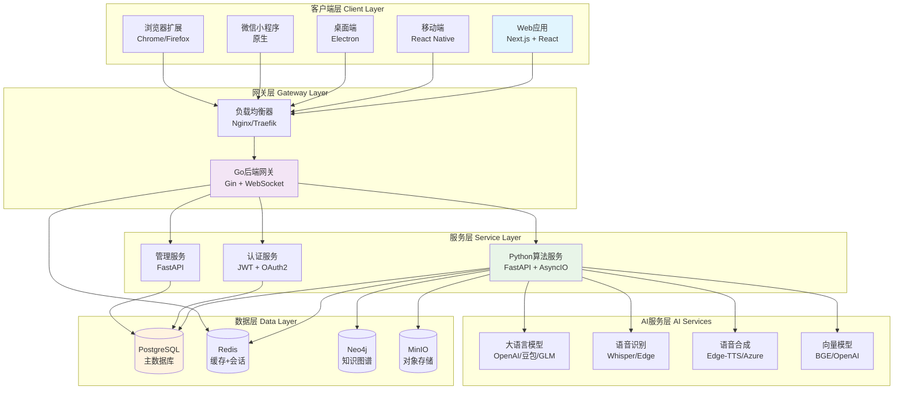
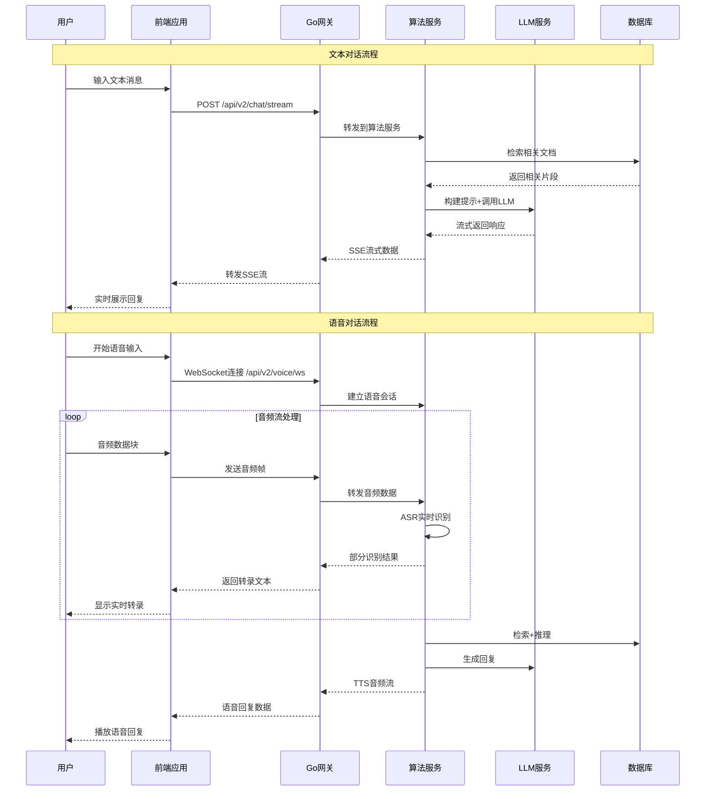
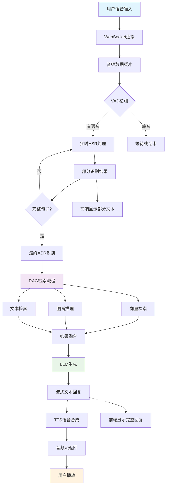

## 📚 文档导航

- [整体架构概览](#整体架构概览)
- [技术栈分析](#技术栈分析)
- [模块详细分析](#模块详细分析)
  - [Go后端网关服务](#go后端网关服务)
  - [Python算法服务](#python算法服务)
  - [Next.js前端应用](#nextjs前端应用)
  - [多平台客户端](#多平台客户端)
- [核心API分析](#核心api分析)
- [数据结构设计](#数据结构设计)
- [最佳实践与案例](#最佳实践与案例)

---

## 📋 项目概述

VoiceHelper是一个**企业级智能语音助手平台**，支持多模态交互（文本+语音）、GraphRAG检索系统和智能Agent功能。该项目采用现代微服务架构，具备高可用性、可扩展性和多平台支持能力。

### 🎯 核心特性

- **多模态交互**: 文本SSE流式 + WebSocket语音全双工
- **GraphRAG系统**: 知识图谱构建 + 多跳推理 + 融合排序
- **智能Agent**: 多推理模式 + 工具生态 + MCP协议支持
- **全平台覆盖**: Web、移动端、桌面端、小程序、浏览器扩展

---

## 🏗️ 整体架构概览

### 系统架构图



### 技术栈分析

#### 前端技术栈
- **框架**: Next.js 14 (App Router) + React 18
- **样式**: Tailwind CSS + Framer Motion
- **状态管理**: Zustand + React Query
- **实时通信**: EventSource (SSE) + WebSocket
- **类型系统**: TypeScript 5.0+
- **测试**: Jest + Testing Library
- **构建**: Webpack + SWC

#### 后端技术栈
- **网关服务**: Go 1.23 + Gin + Gorilla WebSocket
- **算法服务**: Python 3.11 + FastAPI + AsyncIO
- **认证**: JWT + OAuth2 + RBAC
- **数据库**: PostgreSQL 15 + Redis 7 + Neo4j 5
- **存储**: MinIO (S3兼容)
- **监控**: Prometheus + OpenTelemetry + Jaeger

#### AI/ML技术栈
- **语言模型**: OpenAI GPT、字节跳动豆包、智谱GLM
- **语音识别**: OpenAI Whisper、Azure Speech、Edge Speech
- **语音合成**: Edge-TTS、Azure TTS、本地TTS
- **向量模型**: BGE-large-zh、OpenAI Embeddings
- **图数据库**: Neo4j (知识图谱存储)
- **向量数据库**: FAISS (本地索引)

---

## 🔄 系统交互时序图

### 多模态对话交互流程



---

## 🎯 核心API分析

### Go网关服务API

#### 1. 流式聊天接口

**入口函数**: `backend/internal/handlers/v2_chat.go:StreamChat`

```go
// StreamChat 处理流式聊天请求
// @Summary 流式聊天
// @Description 发送消息并获取流式回复，支持SSE协议
// @Tags Chat
// @Accept json
// @Produce text/event-stream
// @Param request body ChatRequest true "聊天请求"
// @Success 200 {object} StreamResponse "流式响应"
// @Router /api/v2/chat/stream [post]
func (h *V2ChatHandlerSimple) StreamChat(c *gin.Context) {
	// 1. 解析请求参数
	var req ChatRequest
	if err := c.ShouldBindJSON(&req); err != nil {
		logger.Error("Invalid request format", zap.Error(err))
		c.JSON(http.StatusBadRequest, gin.H{"error": "Invalid request format"})
		return
	}

	// 2. 参数验证
	if req.Message == "" {
		c.JSON(http.StatusBadRequest, gin.H{"error": "Message cannot be empty"})
		return
	}

	// 3. 设置SSE响应头
	c.Header("Content-Type", "text/event-stream")
	c.Header("Cache-Control", "no-cache")  
	c.Header("Connection", "keep-alive")
	c.Header("Access-Control-Allow-Origin", "*")

	// 4. 构建转发请求到算法服务
	algoReq := AlgoServiceRequest{
		Messages: []Message{
			{Role: "user", Content: req.Message}
		},
		ConversationID: req.ConversationID,
		StreamID: req.StreamID,
		RequestID: req.RequestID,
		Model: req.Model,
		Temperature: req.Temperature,
		MaxTokens: req.MaxTokens,
	}

	// 5. 发送请求到算法服务并流式转发响应
	if err := h.forwardToAlgoService(c, algoReq); err != nil {
		logger.Error("Failed to forward request", zap.Error(err))
		// 发送错误事件
		c.SSEvent("error", gin.H{
			"error": "Internal server error",
			"code": "ALGO_SERVICE_ERROR"
		})
	}
}

// forwardToAlgoService 转发请求到算法服务
// @param c gin上下文，用于SSE流式响应
// @param req 转发的请求体
// @return error 转发过程中的错误
func (h *V2ChatHandlerSimple) forwardToAlgoService(c *gin.Context, req AlgoServiceRequest) error {
	// 1. 序列化请求体
	reqBody, err := json.Marshal(req)
	if err != nil {
		return fmt.Errorf("failed to marshal request: %w", err)
	}

	// 2. 创建HTTP请求
	httpReq, err := http.NewRequest("POST", h.algoServiceURL+"/query", bytes.NewBuffer(reqBody))
	if err != nil {
		return fmt.Errorf("failed to create request: %w", err)
	}

	// 3. 设置请求头
	httpReq.Header.Set("Content-Type", "application/json")
	httpReq.Header.Set("Accept", "application/x-ndjson")

	// 4. 发送请求
	client := &http.Client{Timeout: 0} // 无超时，支持长连接
	resp, err := client.Do(httpReq)
	if err != nil {
		return fmt.Errorf("failed to send request: %w", err)
	}
	defer resp.Body.Close()

	// 5. 检查响应状态
	if resp.StatusCode != http.StatusOK {
		return fmt.Errorf("algo service returned status %d", resp.StatusCode)
	}

	// 6. 流式读取并转发响应
	scanner := bufio.NewScanner(resp.Body)
	for scanner.Scan() {
		line := scanner.Text()
		if line == "" {
			continue
		}

		// 解析NDJSON格式的响应
		var response map[string]interface{}
		if err := json.Unmarshal([]byte(line), &response); err != nil {
			logger.Warn("Failed to parse response line", zap.String("line", line))
			continue
		}

		// 转发为SSE事件
		eventType := "data"
		if errMsg, exists := response["error"]; exists {
			eventType = "error"
		}
		c.SSEvent(eventType, response)
		c.Writer.Flush() // 强制刷新缓冲区
	}

	return scanner.Err()
}
```

#### 2. WebSocket语音接口

**入口函数**: `backend/internal/handlers/v2_voice.go:HandleWebSocket`

```go
// V2VoiceHandler 语音处理器v2版本
type V2VoiceHandler struct {
	algoServiceURL  string                    // 算法服务URL
	activeConnections map[string]*VoiceSession // 活跃连接映射
	mu             sync.RWMutex              // 读写锁保护
	cleanupTicker  *time.Ticker             // 清理定时器
}

// VoiceSession 语音会话结构
type VoiceSession struct {
	ID             string          `json:"session_id"`      // 会话ID
	UserID         string          `json:"user_id"`         // 用户ID  
	ConversationID string          `json:"conversation_id"` // 对话ID
	Connection     *websocket.Conn `json:"-"`               // WebSocket连接
	AlgoConn       *websocket.Conn `json:"-"`               // 与算法服务的连接
	Status         string          `json:"status"`          // 会话状态: active/paused/ended
	CreatedAt      time.Time       `json:"created_at"`      // 创建时间
	LastActivity   time.Time       `json:"last_activity"`   // 最后活动时间
	AudioConfig    AudioConfig     `json:"audio_config"`    // 音频配置
	Metrics        VoiceMetrics    `json:"metrics"`         // 性能指标
	CancelFunc     context.CancelFunc `json:"-"`            // 取消函数
}

// HandleWebSocket 处理WebSocket语音连接
// @Summary WebSocket语音流处理
// @Description 建立WebSocket连接进行实时语音交互
// @Tags Voice
// @Accept application/json
// @Produce application/json
// @Success 101 {object} VoiceSession "连接升级成功"
// @Router /api/v2/voice/stream [get]
func (h *V2VoiceHandler) HandleWebSocket(c *gin.Context) {
	// 1. 升级HTTP连接为WebSocket
	conn, err := upgrader.Upgrade(c.Writer, c.Request, nil)
	if err != nil {
		logger.Error("WebSocket upgrade failed", zap.Error(err))
		return
	}
	defer conn.Close()

	// 2. 生成会话ID和提取用户信息
	sessionID := generateSessionID()
	userID := extractUserID(c) // 从JWT token或header提取
	conversationID := c.Query("conversation_id")

	// 3. 创建会话上下文
	ctx, cancel := context.WithCancel(context.Background())
	defer cancel()

	// 4. 建立与算法服务的WebSocket连接
	algoConn, err := h.connectToAlgoService(ctx, sessionID)
	if err != nil {
		logger.Error("Failed to connect to algo service", zap.Error(err))
		conn.WriteMessage(websocket.TextMessage, []byte(`{"type":"error","error":"Service unavailable"}`))
		return
	}
	defer algoConn.Close()

	// 5. 创建语音会话
	session := &VoiceSession{
		ID:             sessionID,
		UserID:         userID,
		ConversationID: conversationID,
		Connection:     conn,
		AlgoConn:       algoConn,
		Status:         "active",
		CreatedAt:      time.Now(),
		LastActivity:   time.Now(),
		AudioConfig:    getDefaultAudioConfig(),
		CancelFunc:     cancel,
	}

	// 6. 注册会话
	h.mu.Lock()
	h.activeConnections[sessionID] = session
	h.mu.Unlock()

	// 7. 发送会话建立确认
	initMsg := map[string]interface{}{
		"type":       "session_started",
		"session_id": sessionID,
		"config":     session.AudioConfig,
	}
	conn.WriteJSON(initMsg)

	// 8. 启动消息处理协程
	go h.handleAlgoServiceMessages(session)
	
	// 9. 处理客户端消息（阻塞主协程）
	h.handleClientMessages(session)
	
	// 10. 清理会话
	h.cleanup(sessionID)
}

// handleClientMessages 处理来自客户端的消息
// @param session 语音会话对象
func (h *V2VoiceHandler) handleClientMessages(session *VoiceSession) {
	defer session.CancelFunc() // 确保上下文取消

	for {
		// 1. 读取WebSocket消息
		messageType, message, err := session.Connection.ReadMessage()
		if err != nil {
			if websocket.IsUnexpectedCloseError(err, websocket.CloseGoingAway, websocket.CloseAbnormalClosure) {
				logger.Error("WebSocket error", zap.Error(err))
			}
			break
		}

		// 2. 更新活动时间
		session.LastActivity = time.Now()

		// 3. 根据消息类型处理
		switch messageType {
		case websocket.TextMessage:
			// 处理控制消息（JSON格式）
			var controlMsg map[string]interface{}
			if err := json.Unmarshal(message, &controlMsg); err != nil {
				logger.Warn("Invalid control message", zap.Error(err))
				continue
			}
			h.handleControlMessage(session, controlMsg)

		case websocket.BinaryMessage:
			// 处理音频数据
			h.handleAudioData(session, message)

		default:
			logger.Warn("Unsupported message type", zap.Int("type", messageType))
		}
	}
}

// handleAudioData 处理音频数据
// @param session 语音会话
// @param audioData 音频字节数据
func (h *V2VoiceHandler) handleAudioData(session *VoiceSession, audioData []byte) {
	// 1. 构建音频消息
	audioMsg := map[string]interface{}{
		"type":            "audio_chunk",
		"session_id":      session.ID,
		"conversation_id": session.ConversationID,
		"audio_chunk":     base64.StdEncoding.EncodeToString(audioData),
		"timestamp":       time.Now().UnixNano() / 1e6, // 毫秒时间戳
		"seq":             session.Metrics.AudioPackets,
	}

	// 2. 转发到算法服务
	if err := session.AlgoConn.WriteJSON(audioMsg); err != nil {
		logger.Error("Failed to forward audio to algo service", zap.Error(err))
		session.Connection.WriteJSON(map[string]interface{}{
			"type":  "error", 
			"error": "Failed to process audio",
		})
		return
	}

	// 3. 更新指标
	session.Metrics.AudioPackets++
	session.Metrics.AudioBytes += int64(len(audioData))
}

// connectToAlgoService 连接到算法服务的WebSocket
// @param ctx 上下文
// @param sessionID 会话ID
// @return (*websocket.Conn, error) WebSocket连接和错误
func (h *V2VoiceHandler) connectToAlgoService(ctx context.Context, sessionID string) (*websocket.Conn, error) {
	// 1. 构建WebSocket URL
	wsURL := strings.Replace(h.algoServiceURL, "http", "ws", 1) + "/voice/stream"
	
	// 2. 设置连接头
	header := http.Header{}
	header.Set("Session-ID", sessionID)
	
	// 3. 建立WebSocket连接
	dialer := websocket.Dialer{
		HandshakeTimeout: 10 * time.Second,
		ReadBufferSize:   4096,
		WriteBufferSize:  4096,
	}
	
	conn, _, err := dialer.DialContext(ctx, wsURL, header)
	if err != nil {
		return nil, fmt.Errorf("failed to dial algo service: %w", err)
	}
	
	return conn, nil
}
```

### Python算法服务API

#### 1. 文档检索接口

**入口函数**: `algo/app/main.py:query_documents`

```python
@app.post("/query")
async def query_documents(request: QueryRequest, http_request: Request):
    """
    文档查询接口，返回流式响应
    
    Args:
        request (QueryRequest): 查询请求对象，包含消息列表和检索参数
        http_request (Request): FastAPI请求对象，用于获取客户端信息
    
    Returns:
        StreamingResponse: 流式NDJSON响应，包含检索结果和LLM生成内容
    
    Raises:
        VoiceHelperError: 自定义业务异常
        
    流程说明:
        1. 参数验证 - 检查消息列表是否为空
        2. 日志记录 - 记录查询开始和相关统计信息  
        3. 委托处理 - 调用RetrieveService的stream_query方法
        4. 流式响应 - 返回application/x-ndjson格式的流
    """
    start_time = time.time()
    
    # 业务日志记录 - 记录查询请求的关键信息
    logger.business("文档查询请求", context={
        "messages_count": len(request.messages) if request.messages else 0,
        "top_k": getattr(request, 'top_k', None),
        "client_ip": http_request.client.host if http_request.client else "unknown",
    })
    
    try:
        # 参数验证 - 确保请求包含有效的消息
        if not request.messages or len(request.messages) == 0:
            raise VoiceHelperError(ErrorCode.RAG_INVALID_QUERY, "没有提供查询消息")
        
        # 记录查询开始 - 便于问题排查和性能分析
        logger.info("开始处理查询请求", context={
            "messages_count": len(request.messages),
            "last_message": request.messages[-1].content[:100] if request.messages else "",
        })
        
        # 生成流式响应 - 委托给专门的检索服务处理
        return StreamingResponse(
            retrieve_service.stream_query(request),
            media_type="application/x-ndjson"  # 新行分隔的JSON格式
        )
    
    except VoiceHelperError:
        # 重新抛出自定义异常，由全局异常处理器处理
        raise
    except Exception as e:
        # 处理未预期的异常
        logger.exception("文档查询失败", e, context={
            "messages_count": len(request.messages) if request.messages else 0,
        })
        raise VoiceHelperError(ErrorCode.RAG_RETRIEVAL_FAILED, f"查询失败: {str(e)}")
```

**核心检索服务**: `algo/core/retrieve.py:RetrieveService`

```python
class RetrieveService:
    """
    检索服务 - 负责文档检索、GraphRAG推理和LLM生成
    
    主要功能:
    - 多路召回: BGE向量检索 + BM25文本检索 + GraphRAG图推理
    - 智能重排: 基于多维度相关性的融合排序
    - 流式生成: SSE协议实时返回检索结果和生成内容
    - 缓存优化: Redis缓存热点查询结果
    """
    
    def __init__(self):
        """初始化检索服务及其依赖组件"""
        self.rag_service = self._init_rag_service()      # BGE+FAISS向量检索
        self.graph_rag = self._init_graph_rag()          # GraphRAG图推理
        self.llm_client = self._init_llm_client()        # 大语言模型客户端
        self.cache_manager = self._init_cache()          # Redis缓存管理
        
    async def stream_query(self, request: QueryRequest) -> AsyncGenerator[str, None]:
        """
        流式查询处理 - 核心检索和生成流程
        
        Args:
            request (QueryRequest): 包含用户消息和检索参数的请求对象
            
        Yields:
            str: NDJSON格式的响应数据，包含多种事件类型:
                - retrieval_start: 检索开始
                - retrieval_progress: 检索进度  
                - retrieval_result: 检索结果
                - generation_start: 生成开始
                - generation_chunk: 生成片段
                - generation_done: 生成完成
                - error: 错误信息
        
        检索流程:
            1. 查询预处理 - 提取关键词、意图识别、查询重写
            2. 多路召回 - 并行执行向量检索、文本检索、图推理
            3. 结果融合 - 去重、重排、相关性打分
            4. 上下文构建 - 整理检索结果为LLM提示
            5. 流式生成 - 调用LLM并实时返回结果
        """
        query_id = self._generate_query_id()
        start_time = time.time()
        
        try:
            # 1. 查询预处理
            yield self._create_event("retrieval_start", {
                "query_id": query_id,
                "timestamp": int(time.time() * 1000)
            })
            
            # 提取最后一条用户消息作为查询
            user_query = request.messages[-1].content if request.messages else ""
            
            # 查询增强 - 关键词提取和查询重写
            enhanced_query = await self._enhance_query(user_query)
            
            # 2. 多路召回并行处理
            retrieval_tasks = [
                self._vector_retrieval(enhanced_query, request.top_k or 10),
                self._text_retrieval(enhanced_query, request.top_k or 10), 
                self._graph_retrieval(enhanced_query, request.top_k or 5)
            ]
            
            # 执行并行检索
            vector_results, text_results, graph_results = await asyncio.gather(*retrieval_tasks)
            
            # 3. 结果融合和重排
            yield self._create_event("retrieval_progress", {
                "stage": "fusion",
                "vector_count": len(vector_results),
                "text_count": len(text_results), 
                "graph_count": len(graph_results)
            })
            
            fused_results = self._fuse_results(vector_results, text_results, graph_results)
            final_results = self._rerank_results(fused_results, user_query)
            
            # 4. 返回检索结果
            yield self._create_event("retrieval_result", {
                "results": [self._format_result(r) for r in final_results[:10]],
                "total_found": len(final_results),
                "retrieval_time_ms": (time.time() - start_time) * 1000
            })
            
            # 5. 构建LLM上下文
            context = self._build_context(final_results, request.messages)
            
            # 6. 流式生成回复
            yield self._create_event("generation_start", {"model": "gpt-3.5-turbo"})
            
            full_response = ""
            async for chunk in self._stream_llm_response(context, request):
                full_response += chunk
                yield self._create_event("generation_chunk", {"text": chunk})
            
            # 7. 生成完成
            yield self._create_event("generation_done", {
                "full_text": full_response,
                "total_time_ms": (time.time() - start_time) * 1000,
                "token_count": len(full_response.split())  # 简单估算
            })
            
        except Exception as e:
            logger.exception(f"Stream query failed: {e}")
            yield self._create_event("error", {
                "error": str(e),
                "query_id": query_id
            })
    
    async def _vector_retrieval(self, query: str, top_k: int) -> List[RetrievalResult]:
        """
        向量检索 - 使用BGE模型和FAISS索引
        
        Args:
            query (str): 查询文本
            top_k (int): 返回结果数量
            
        Returns:
            List[RetrievalResult]: 按相似度排序的检索结果
        """
        # 查询缓存
        cache_key = f"vector:{hashlib.md5(query.encode()).hexdigest()}:{top_k}"
        cached = await self.cache_manager.get(cache_key)
        if cached:
            return cached
            
        # 向量化查询
        query_embedding = await self.rag_service.embed_query(query)
        
        # FAISS检索
        similar_docs = await self.rag_service.similarity_search(
            query_embedding, 
            k=top_k,
            threshold=0.7  # 相似度阈值
        )
        
        # 格式化结果
        results = []
        for doc, score in similar_docs:
            result = RetrievalResult(
                content=doc.page_content,
                metadata=doc.metadata,
                score=float(score),
                source="vector_search",
                doc_id=doc.metadata.get("doc_id"),
                chunk_id=doc.metadata.get("chunk_id")
            )
            results.append(result)
        
        # 缓存结果
        await self.cache_manager.set(cache_key, results, ttl=300)  # 5分钟缓存
        
        return results
    
    async def _graph_retrieval(self, query: str, top_k: int) -> List[RetrievalResult]:
        """
        图检索 - 基于知识图谱的多跳推理
        
        Args:
            query (str): 查询文本  
            top_k (int): 返回结果数量
            
        Returns:
            List[RetrievalResult]: 图推理得到的相关实体和关系
        """
        if not self.graph_rag:
            return []
            
        # 实体识别
        entities = await self.graph_rag.extract_entities(query)
        
        # 多跳图遍历
        graph_results = []
        for entity in entities[:3]:  # 限制实体数量
            # 1跳邻居
            neighbors = await self.graph_rag.get_neighbors(entity, depth=1)
            # 2跳推理路径  
            paths = await self.graph_rag.find_reasoning_paths(entity, max_depth=2)
            
            for neighbor in neighbors[:top_k//3]:
                result = RetrievalResult(
                    content=f"实体: {entity} -> 关系: {neighbor['relation']} -> {neighbor['target']}",
                    metadata={
                        "entity": entity,
                        "relation": neighbor['relation'], 
                        "target": neighbor['target'],
                        "reasoning_path": neighbor.get('path', [])
                    },
                    score=neighbor.get('confidence', 0.8),
                    source="graph_search",
                    doc_id=f"graph_{entity}",
                    chunk_id=neighbor.get('id')
                )
                graph_results.append(result)
        
        return sorted(graph_results, key=lambda x: x.score, reverse=True)[:top_k]
```

#### 2. 语音处理接口

**入口函数**: `algo/app/main.py:websocket_voice_stream`

```python
@app.websocket("/voice/stream")
async def websocket_voice_stream(websocket: WebSocket):
    """
    WebSocket语音流接口 - 实时语音交互处理
    
    Args:
        websocket (WebSocket): WebSocket连接对象
        
    处理流程:
        1. 连接建立 - 接受WebSocket连接并初始化会话
        2. 消息循环 - 持续接收和处理音频数据
        3. 实时ASR - 边收边转录，支持部分结果
        4. RAG检索 - 完整句子触发知识检索
        5. 流式TTS - 将回复转换为语音数据返回
        6. 异常处理 - 优雅处理连接断开和错误
    
    消息格式:
        接收: {"type": "audio_chunk", "audio_chunk": "base64data", "seq": 123}
        发送: {"type": "asr_partial", "text": "部分识别...", "seq": 123}
             {"type": "asr_final", "text": "完整句子", "seq": 123} 
             {"type": "llm_response", "text": "AI回复", "seq": 124}
             {"type": "tts_audio", "audio_data": "base64data", "seq": 124}
    """
    try:
        # 1. 接受WebSocket连接
        await websocket.accept()
        logger.info("WebSocket语音连接建立")
        
        # 2. 委托给WebSocket处理器
        await websocket_handler.handle_websocket_connection(websocket)
        
    except Exception as e:
        logger.exception("WebSocket语音流处理失败", e)
        try:
            # 发送错误信息并关闭连接
            await websocket.close(code=1011, reason="Internal server error")
        except:
            pass  # 连接可能已经关闭
```

**WebSocket处理器**: `algo/core/websocket_voice.py:WebSocketVoiceHandler`

```python
class WebSocketVoiceHandler:
    """
    WebSocket语音处理器 - 管理实时语音交互会话
    
    主要功能:
    - 会话管理: 创建、维护、清理语音会话
    - 音频处理: 实时ASR、VAD、音频格式转换
    - 智能对话: 结合RAG检索和LLM生成
    - 语音合成: TTS生成并流式返回音频
    """
    
    def __init__(self, enhanced_voice_service: EnhancedVoiceService):
        """
        初始化WebSocket语音处理器
        
        Args:
            enhanced_voice_service: 增强语音服务实例，提供ASR/TTS能力
        """
        self.voice_service = enhanced_voice_service
        self.active_sessions: Dict[str, VoiceSession] = {}
        self.session_lock = asyncio.Lock()
        
        # 启动会话清理任务
        self.cleanup_task = asyncio.create_task(self._cleanup_sessions_periodically())
    
    async def handle_websocket_connection(self, websocket: WebSocket):
        """
        处理WebSocket连接的主要逻辑
        
        Args:
            websocket: WebSocket连接对象
            
        处理流程:
            1. 会话初始化 - 创建会话ID和音频缓冲区
            2. 消息循环 - 接收客户端音频数据
            3. 音频处理 - ASR识别和语音对话
            4. 结果返回 - 实时发送识别结果和AI回复
            5. 会话清理 - 连接断开时的资源清理
        """
        session_id = self._generate_session_id()
        
        try:
            # 1. 创建语音会话
            session = VoiceSession(
                session_id=session_id,
                websocket=websocket,
                audio_buffer=b"",
                transcript_buffer="",
                last_activity=datetime.now(),
                status="active"
            )
            
            # 2. 注册会话
            async with self.session_lock:
                self.active_sessions[session_id] = session
            
            # 3. 发送会话建立确认
            await websocket.send_json({
                "type": "session_started",
                "session_id": session_id,
                "config": {
                    "sample_rate": 16000,
                    "channels": 1,
                    "format": "pcm"
                }
            })
            
            # 4. 消息处理循环
            while True:
                try:
                    # 接收WebSocket消息
                    data = await websocket.receive()
                    
                    if data["type"] == "websocket.disconnect":
                        logger.info(f"Client disconnected: {session_id}")
                        break
                    
                    # 处理JSON控制消息
                    if data["type"] == "websocket.receive" and "text" in data:
                        message = json.loads(data["text"])
                        await self._handle_control_message(session, message)
                    
                    # 处理二进制音频数据  
                    elif data["type"] == "websocket.receive" and "bytes" in data:
                        await self._handle_audio_data(session, data["bytes"])
                        
                except WebSocketDisconnect:
                    logger.info(f"WebSocket disconnected: {session_id}")
                    break
                except Exception as e:
                    logger.error(f"Error processing message: {e}")
                    await websocket.send_json({
                        "type": "error",
                        "error": str(e)
                    })
                    break
        
        finally:
            # 5. 清理会话
            await self._cleanup_session(session_id)
    
    async def _handle_audio_data(self, session: VoiceSession, audio_data: bytes):
        """
        处理音频数据 - 核心语音处理流程
        
        Args:
            session: 当前语音会话
            audio_data: 音频字节数据
            
        处理步骤:
            1. 音频缓冲 - 累积音频数据直到足够长度
            2. VAD检测 - 语音活动检测，过滤静音
            3. ASR识别 - 实时语音转文本，支持部分结果
            4. 句子检测 - 检测完整句子并触发后续处理
            5. RAG对话 - 调用检索和生成服务
            6. TTS合成 - 将回复转换为语音并返回
        """
        # 1. 更新会话活动时间
        session.last_activity = datetime.now()
        
        # 2. 累积音频数据
        session.audio_buffer += audio_data
        
        # 3. 检查是否有足够的音频数据进行处理（约0.5秒）
        if len(session.audio_buffer) < 8000:  # 16000 * 0.5秒
            return
        
        try:
            # 4. 语音活动检测 (VAD)
            if not self._detect_speech_activity(session.audio_buffer[-8000:]):
                # 如果检测到静音超过阈值，触发最终识别
                if len(session.audio_buffer) > 32000:  # 2秒静音
                    await self._process_final_audio(session)
                return
            
            # 5. 实时ASR处理
            partial_text = await self.voice_service.asr_service.transcribe(
                session.audio_buffer,
                is_final=False,
                language="zh-CN"
            )
            
            if partial_text:
                # 发送部分识别结果
                await session.websocket.send_json({
                    "type": "asr_partial", 
                    "text": partial_text,
                    "timestamp": int(time.time() * 1000)
                })
                
                session.transcript_buffer = partial_text
            
            # 6. 检测是否为完整句子
            if self._is_complete_sentence(partial_text):
                await self._process_complete_sentence(session, partial_text)
                
        except Exception as e:
            logger.error(f"Audio processing error: {e}")
            await session.websocket.send_json({
                "type": "error",
                "error": f"Audio processing failed: {str(e)}"
            })
    
    async def _process_complete_sentence(self, session: VoiceSession, text: str):
        """
        处理完整句子 - 触发RAG检索和对话生成
        
        Args:
            session: 语音会话
            text: 识别出的完整文本
            
        处理流程:
            1. 最终ASR - 获得更准确的识别结果
            2. RAG检索 - 基于用户问题检索相关知识
            3. LLM生成 - 结合检索结果生成回复
            4. TTS合成 - 将文本回复转换为语音
            5. 流式返回 - 实时发送音频数据给客户端
        """
        try:
            # 1. 获取最终ASR结果
            final_text = await self.voice_service.asr_service.transcribe(
                session.audio_buffer,
                is_final=True,
                language="zh-CN"
            )
            
            if not final_text:
                final_text = text
            
            # 2. 发送最终识别结果
            await session.websocket.send_json({
                "type": "asr_final",
                "text": final_text,
                "timestamp": int(time.time() * 1000)
            })
            
            # 3. RAG检索和对话生成
            await session.websocket.send_json({
                "type": "processing_start",
                "message": "正在思考..."
            })
            
            # 构建查询请求
            from core.models import QueryRequest, Message
            query_request = QueryRequest(
                messages=[Message(role="user", content=final_text)],
                top_k=5,
                temperature=0.3
            )
            
            # 4. 流式处理RAG响应
            full_response = ""
            references = []
            
            async for response_chunk in self.voice_service.retrieve_service.stream_query(query_request):
                chunk_data = json.loads(response_chunk)
                
                if chunk_data["type"] == "retrieval_result":
                    references = chunk_data["data"]["results"]
                    
                elif chunk_data["type"] == "generation_chunk":
                    text_chunk = chunk_data["data"]["text"]
                    full_response += text_chunk
                    
                    # 发送文本回复片段
                    await session.websocket.send_json({
                        "type": "llm_response_chunk",
                        "text": text_chunk,
                        "timestamp": int(time.time() * 1000)
                    })
                    
                elif chunk_data["type"] == "generation_done":
                    full_response = chunk_data["data"]["full_text"]
                    break
            
            # 5. 发送完整文本回复
            await session.websocket.send_json({
                "type": "llm_response_final",
                "text": full_response,
                "references": references[:3],  # 限制引用数量
                "timestamp": int(time.time() * 1000)
            })
            
            # 6. TTS语音合成
            if full_response.strip():
                await self._synthesize_and_send_audio(session, full_response)
            
            # 7. 清空缓冲区，准备下一轮对话
            session.audio_buffer = b""
            session.transcript_buffer = ""
            
        except Exception as e:
            logger.exception(f"Complete sentence processing error: {e}")
            await session.websocket.send_json({
                "type": "error", 
                "error": f"Processing failed: {str(e)}"
            })
    
    async def _synthesize_and_send_audio(self, session: VoiceSession, text: str):
        """
        合成语音并流式发送
        
        Args:
            session: 语音会话
            text: 要合成的文本
            
        TTS流程:
            1. 文本预处理 - 清理和分段
            2. 语音合成 - 调用TTS服务生成音频
            3. 音频分块 - 将音频切分为小块
            4. 流式发送 - 逐块发送音频数据
        """
        try:
            # 1. 发送TTS开始信号
            await session.websocket.send_json({
                "type": "tts_start",
                "text": text,
                "timestamp": int(time.time() * 1000)
            })
            
            # 2. 语音合成
            audio_stream = await self.voice_service.tts_service.synthesize_streaming(
                text=text,
                voice="zh-CN-XiaoxiaoNeural",  # Edge-TTS中文女声
                rate="+0%",
                pitch="+0Hz"
            )
            
            # 3. 流式发送音频数据
            chunk_id = 0
            async for audio_chunk in audio_stream:
                if audio_chunk:
                    # Base64编码音频数据
                    audio_b64 = base64.b64encode(audio_chunk).decode('utf-8')
                    
                    await session.websocket.send_json({
                        "type": "tts_audio",
                        "audio_data": audio_b64,
                        "chunk_id": chunk_id,
                        "format": "mp3",
                        "sample_rate": 16000,
                        "timestamp": int(time.time() * 1000)
                    })
                    
                    chunk_id += 1
                    
                    # 控制发送速率，避免缓冲区溢出
                    await asyncio.sleep(0.01)
            
            # 4. 发送TTS完成信号
            await session.websocket.send_json({
                "type": "tts_complete",
                "total_chunks": chunk_id,
                "timestamp": int(time.time() * 1000)
            })
            
        except Exception as e:
            logger.error(f"TTS synthesis error: {e}")
            await session.websocket.send_json({
                "type": "error",
                "error": f"Speech synthesis failed: {str(e)}"
            })
```

---

## 📊 数据结构设计

### 核心数据模型UML图

```mermaid
classDiagram
    class User {
        +String user_id
        +String username
        +String nickname
        +String email
        +String avatar_url
        +DateTime created_at
        +DateTime updated_at
        +DateTime last_login
        +UserStatus status
        +UserPreferences preferences
        +authenticate() bool
        +updateProfile(data: dict) void
    }
    
    class Conversation {
        +String conversation_id
        +String user_id
        +String title
        +ConversationStatus status
        +DateTime created_at
        +DateTime updated_at
        +DateTime ended_at
        +int message_count
        +ConversationMetadata metadata
        +addMessage(message: Message) void
        +updateStatus(status: ConversationStatus) void
    }
    
    class Message {
        +String message_id
        +String conversation_id
        +String user_id
        +MessageRole role
        +String content
        +ContentType content_type
        +DateTime created_at
        +MessageMetadata metadata
        +List~Attachment~ attachments
        +List~ToolCall~ tool_calls
        +List~Reference~ references
        +formatForDisplay() String
    }
    
    class VoiceSession {
        +String session_id
        +String user_id
        +String conversation_id
        +SessionStatus status
        +DateTime created_at
        +DateTime ended_at
        +VoiceSessionSettings settings
        +VoiceMetrics metrics
        +WebSocket connection
        +startSession() void
        +endSession() void
        +updateMetrics(data: dict) void
    }
    
    class Document {
        +String document_id
        +String dataset_id
        +String title
        +String content
        +String content_type
        +String url
        +DateTime created_at
        +DateTime updated_at
        +DocumentMetadata metadata
        +List~DocumentChunk~ chunks
        +vectorize() List~float~
        +extractChunks() List~DocumentChunk~
    }
    
    class DocumentChunk {
        +String chunk_id
        +String document_id
        +String content
        +int start_index
        +int end_index
        +List~float~ embedding
        +ChunkMetadata metadata
        +calculateSimilarity(query: List~float~) float
    }
    
    class RetrievalResult {
        +String doc_id
        +String chunk_id
        +String content
        +float score
        +String source
        +dict metadata
        +formatForLLM() String
    }
    
    class ToolCall {
        +String tool_call_id
        +String tool_name
        +dict parameters
        +DateTime created_at
        +ToolCallStatus status
        +ToolResult result
        +ErrorInfo error
        +execute() ToolResult
    }
    
    %% 关系定义
    User ||--o{ Conversation : "owns"
    Conversation ||--o{ Message : "contains"
    User ||--o{ VoiceSession : "creates"
    VoiceSession ||--o{ Message : "generates"
    Document ||--o{ DocumentChunk : "split into"
    DocumentChunk ||--o{ RetrievalResult : "becomes"
    Message ||--o{ ToolCall : "triggers"
    Message ||--o{ RetrievalResult : "references"
    
    %% 枚举类型
    class UserStatus {
        <<enumeration>>
        ACTIVE
        INACTIVE
        BANNED
    }
    
    class ConversationStatus {
        <<enumeration>>
        ACTIVE
        ENDED
        ARCHIVED
    }
    
    class MessageRole {
        <<enumeration>>
        USER
        ASSISTANT
        SYSTEM
        TOOL
    }
    
    class ContentType {
        <<enumeration>>
        TEXT
        AUDIO
        IMAGE
        FILE
        TOOL_CALL
        TOOL_RESULT
    }
```

### 语音处理数据流图



---

