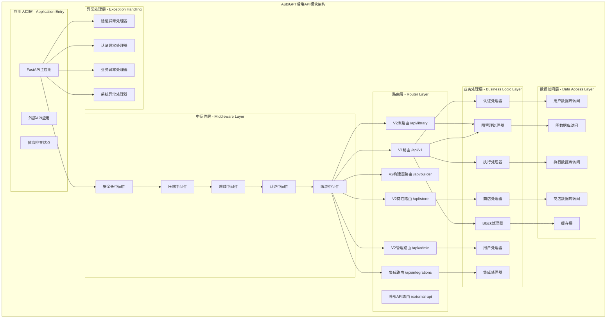
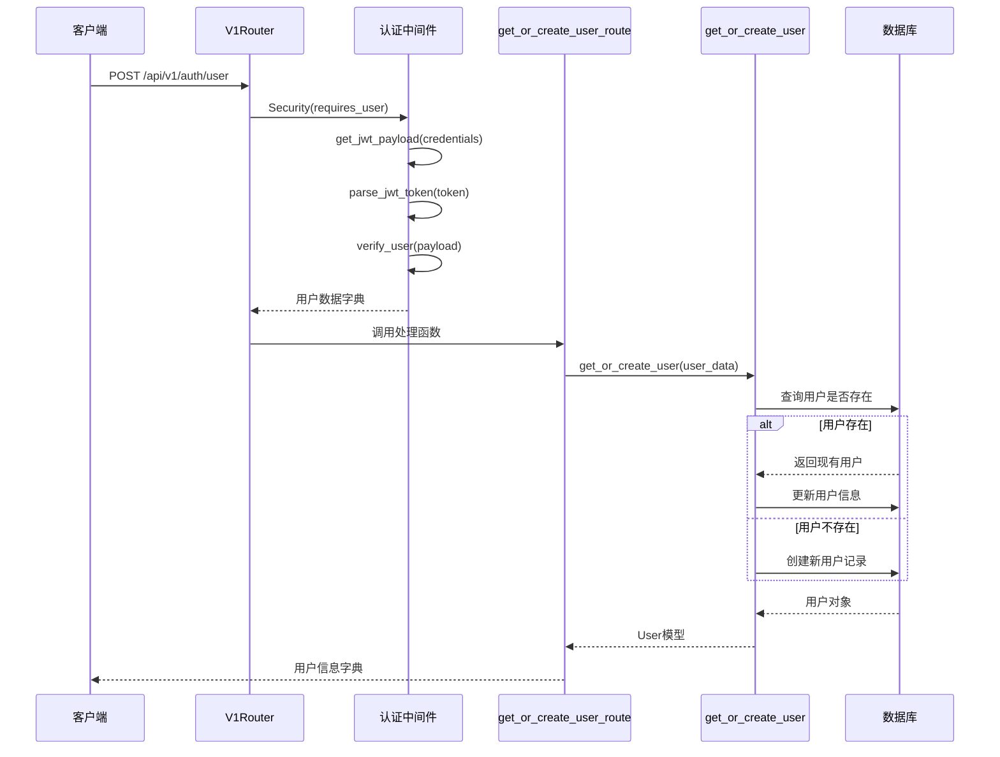
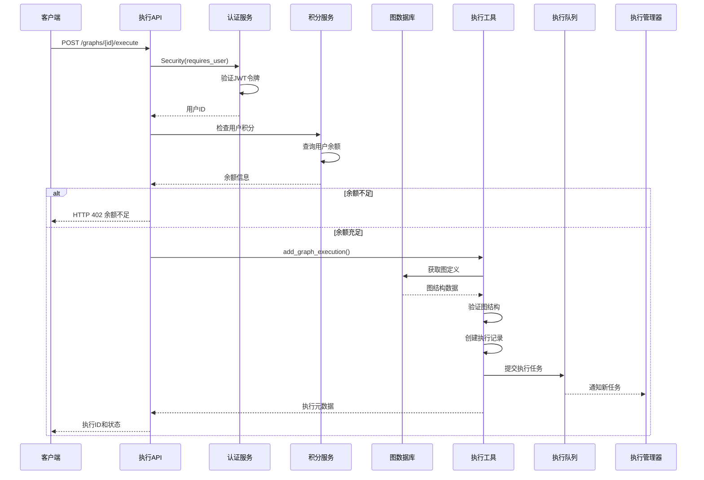
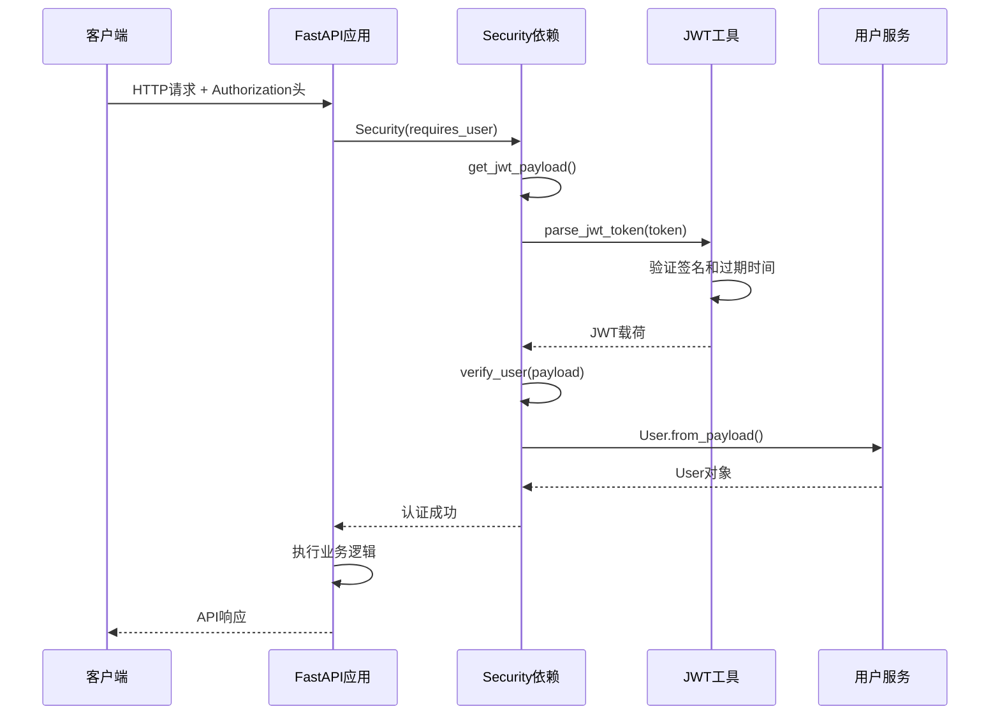
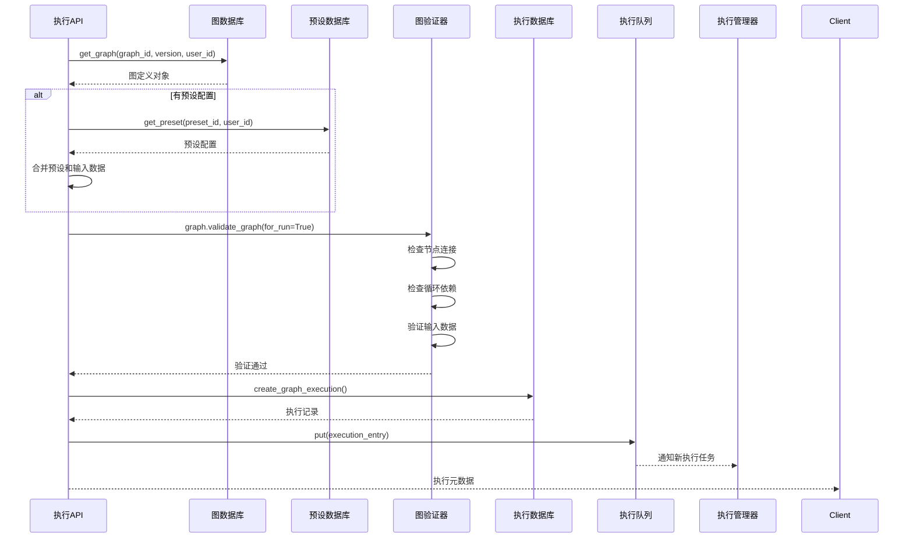
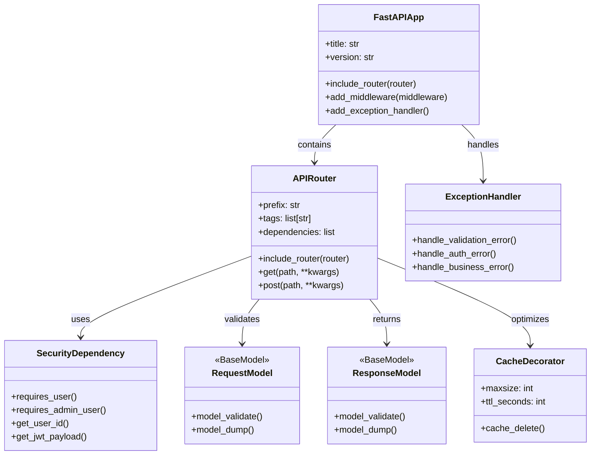
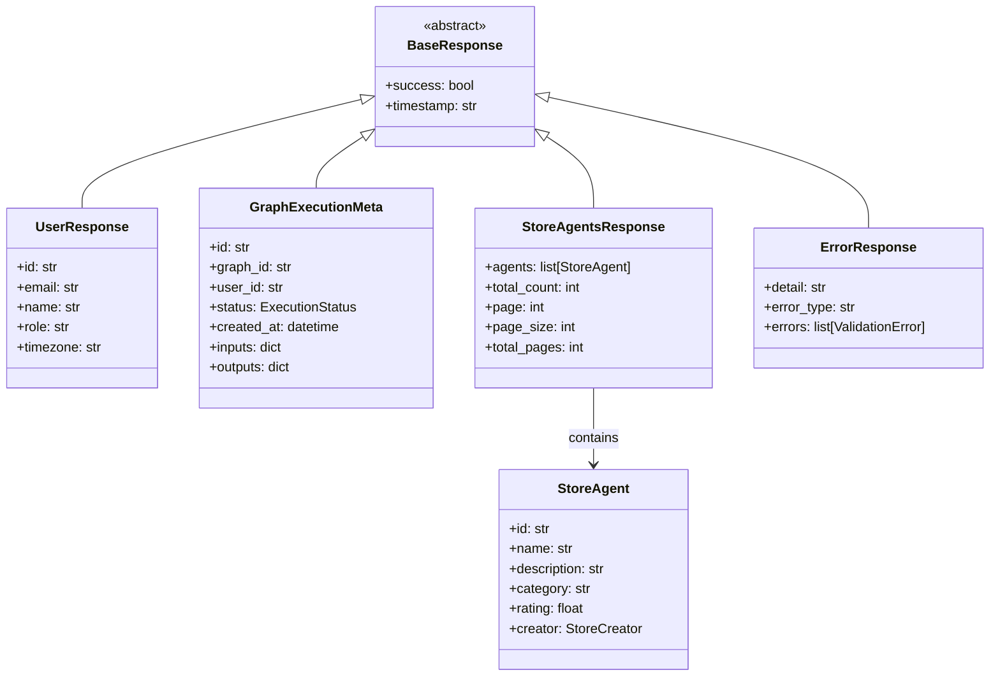
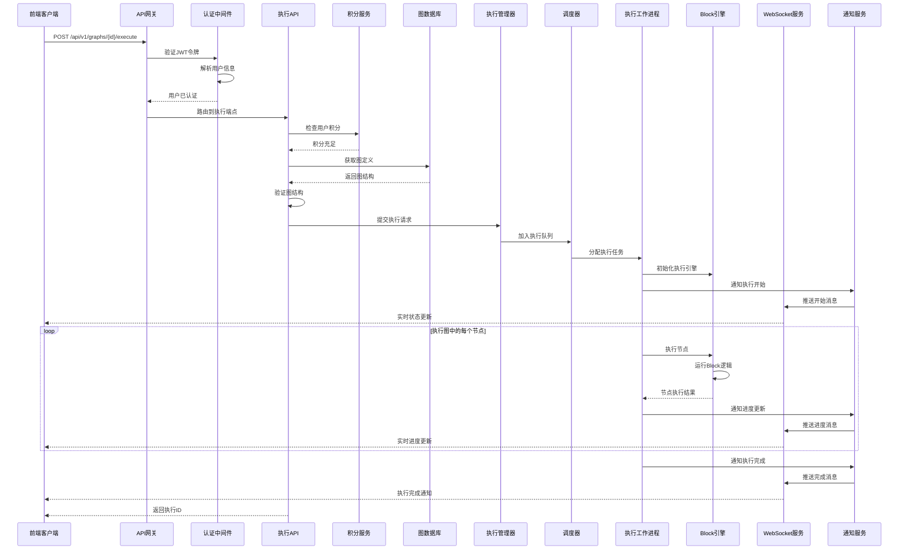

## 概述

AutoGPT后端API模块是整个平台的核心接口层，基于FastAPI框架构建，提供完整的RESTful API服务。模块采用分层路由设计，支持多版本API共存，集成了认证授权、限流控制、异常处理等企业级特性。通过标准化的API接口，为前端应用、第三方集成和移动端提供统一的数据访问能力。

<!--more-->

## 1. API模块整体架构

### 1.1 API架构设计原则

AutoGPT后端API遵循以下核心设计原则：

- **分层路由设计**：按版本和功能模块组织API端点
- **标准化响应**：统一的响应格式和错误处理机制
- **认证授权集成**：基于JWT和API Key的多重认证体系
- **版本管理策略**：支持多版本API共存和平滑升级
- **性能优化**：缓存、限流、异步处理等性能优化机制

### 1.2 API模块架构图



**图1-1: AutoGPT后端API模块架构图**

此架构图展示了AutoGPT后端API的完整分层结构。应用入口层负责FastAPI应用的初始化和配置，中间件层提供横切关注点的处理，路由层按功能和版本组织API端点，业务处理层实现具体的业务逻辑，数据访问层提供数据持久化能力，异常处理层确保系统的健壮性。各层之间通过依赖注入和接口抽象实现松耦合，便于测试和维护。

### 1.3 API版本策略与路由结构

AutoGPT采用多版本API策略，支持新旧版本共存和渐进式升级：

- **V1 API** (`/api/v1/*`): 核心功能API，包括认证、图管理、执行控制
- **V2 API** (`/api/v2/*`): 新功能API，按子模块组织（store、builder、library、admin）
- **External API** (`/external-api/*`): 外部集成专用API，独立应用实例
- **Integration API** (`/api/integrations/*`): 第三方服务集成API

## 2. 应用入口与配置

### 2.1 FastAPI主应用初始化

FastAPI主应用是整个后端API的入口点，负责应用配置、中间件注册、路由挂载和异常处理器设置。

```python
# /autogpt_platform/backend/backend/server/rest_api.py

import fastapi
import starlette.middleware.cors
import uvicorn
from autogpt_libs.auth import add_auth_responses_to_openapi
from fastapi.middleware.gzip import GZipMiddleware
from backend.server.middleware.security import SecurityHeadersMiddleware

# 创建FastAPI应用实例
app = fastapi.FastAPI(
    title="AutoGPT Server",
    description="AutoGPT Server API",
    summary="AutoGPT Server API",
    version="0.1",
    openapi_url="/openapi.json",
    docs_url="/docs",
    redoc_url="/redoc",
)

# 中间件配置 - 按执行顺序添加
app.add_middleware(SecurityHeadersMiddleware)  # 安全头中间件
app.add_middleware(GZipMiddleware, minimum_size=1000)  # 压缩中间件

# CORS配置 - 支持跨域请求
app.add_middleware(
    starlette.middleware.cors.CORSMiddleware,
    allow_origins=["*"],  # 生产环境应配置具体域名
    allow_credentials=True,
    allow_methods=["*"],
    allow_headers=["*"],
)

# OpenAPI认证响应配置
add_auth_responses_to_openapi(app)
```

**应用配置详解**：

- `title/description`: API文档的标题和描述信息
- `openapi_url`: OpenAPI规范的访问路径，用于生成API文档
- `docs_url/redoc_url`: Swagger UI和ReDoc文档界面的访问路径
- 中间件按照洋葱模型的执行顺序添加，安全头中间件最先执行
- CORS中间件配置允许跨域访问，支持前端应用的API调用
- `add_auth_responses_to_openapi`函数为受保护的端点自动添加401响应文档

### 2.2 路由挂载与组织

```python
# 路由挂载 - 按功能模块和版本组织
app.include_router(backend.server.routers.v1.v1_router, tags=["v1"], prefix="/api")
app.include_router(
    backend.server.v2.store.routes.router, tags=["v2"], prefix="/api/store"
)
app.include_router(
    backend.server.v2.builder.routes.router, tags=["v2"], prefix="/api/builder"
)
app.include_router(
    backend.server.v2.library.routes.router, tags=["v2"], prefix="/api/library"
)
app.include_router(
    backend.server.v2.admin.store_admin_routes.router,
    tags=["v2", "admin"],
    prefix="/api/store",
)

# 外部API挂载为独立应用
app.mount("/external-api", external_app)
```

**路由组织策略**：

- V1路由使用`/api`前缀，包含核心功能的稳定API
- V2路由按子模块使用不同前缀，便于功能扩展和版本控制
- 管理员路由使用相同前缀但不同标签，通过认证中间件区分权限
- 外部API使用独立的FastAPI应用实例，实现完全隔离

### 2.3 异常处理器配置

```python
# 异常处理器注册 - 统一错误响应格式
app.add_exception_handler(PrismaError, handle_internal_http_error(500))
app.add_exception_handler(NotFoundError, handle_internal_http_error(404, False))
app.add_exception_handler(NotAuthorizedError, handle_internal_http_error(403, False))
app.add_exception_handler(RequestValidationError, validation_error_handler)
app.add_exception_handler(pydantic.ValidationError, validation_error_handler)
app.add_exception_handler(ValueError, handle_internal_http_error(400))
app.add_exception_handler(Exception, handle_internal_http_error(500))

def handle_internal_http_error(status_code: int, log_error: bool = True):
    """创建HTTP错误处理器的工厂函数"""
    async def handler(request: fastapi.Request, exc: Exception):
        if log_error:
            logger.exception(f"Internal error: {exc}")
        
        return fastapi.responses.JSONResponse(
            status_code=status_code,
            content={
                "detail": str(exc),
                "error_type": type(exc).__name__,
                "timestamp": datetime.utcnow().isoformat(),
            }
        )
    return handler
```

**异常处理机制**：

- 按异常类型注册不同的处理器，确保错误响应的一致性
- `PrismaError`映射为500内部服务器错误，表示数据库操作异常
- `NotFoundError`和`NotAuthorizedError`分别映射为404和403状态码
- 验证异常使用专门的处理器，提供详细的字段验证错误信息
- 通用异常处理器作为最后的兜底机制，防止未处理异常导致服务崩溃

## 3. V1核心API路由系统

### 3.1 V1路由架构

V1 API是AutoGPT的核心API集合，提供认证、图管理、执行控制、Block管理等基础功能。

```python
# /autogpt_platform/backend/backend/server/routers/v1.py

from fastapi import APIRouter, Security, HTTPException, Body
from autogpt_libs.auth import requires_user, requires_admin_user, get_user_id, get_jwt_payload

# 创建V1路由器
v1_router = APIRouter()

# 集成子路由器
v1_router.include_router(
    backend.server.integrations.router.router,
    prefix="/integrations",
    tags=["integrations"],
)

v1_router.include_router(
    backend.server.routers.analytics.router,
    prefix="/analytics",
    tags=["analytics"],
    dependencies=[Security(requires_user)],
)
```

**V1路由设计特点**：

- 使用APIRouter创建模块化路由，支持嵌套和组合
- 通过`include_router`方法集成子路由器，实现功能模块的独立开发
- 使用`dependencies`参数为整个路由组添加认证依赖
- `tags`参数用于API文档的分类组织

### 3.2 认证API端点

#### 3.2.1 用户获取或创建API

**端点**: `POST /api/v1/auth/user`

**功能**: 基于JWT令牌获取现有用户或创建新用户

```python
@v1_router.post(
    "/auth/user",
    summary="Get or create user",
    tags=["auth"],
    dependencies=[Security(requires_user)],
)
async def get_or_create_user_route(user_data: dict = Security(get_jwt_payload)):
    """
    获取或创建用户端点
    
    功能说明:

    1. 从JWT令牌中提取用户信息
    2. 检查用户是否存在于数据库中
    3. 如果用户不存在则创建新用户记录
    4. 返回用户的完整信息
    
    认证要求:
    - 需要有效的JWT令牌
    - 令牌必须包含用户基本信息（sub、email等）
    
    参数:
        user_data: 从JWT令牌中提取的用户数据字典
        
    返回:
        用户信息字典，包含id、email、name等字段
    """
    user = await get_or_create_user(user_data)
    return user.model_dump()

```

**请求结构体**：

- **Headers**: `Authorization: Bearer <JWT_TOKEN>`
- **Body**: 无需请求体，用户信息从JWT令牌中提取

**响应结构体**：

```json
{
    "id": "uuid",           // 用户唯一标识符
    "email": "string",      // 用户邮箱地址
    "name": "string",       // 用户显示名称
    "role": "string",       // 用户角色（user/admin）
    "timezone": "string",   // 用户时区
    "created_at": "string", // 创建时间（ISO格式）
    "updated_at": "string"  // 更新时间（ISO格式）
}
```

**调用链路分析**：



**图3-1: 用户认证API调用时序图**

此时序图详细展示了用户认证API的完整调用流程。客户端发送带有JWT令牌的请求，认证中间件首先验证令牌的有效性并提取用户信息，然后路由器将请求转发给处理函数。处理函数调用用户服务检查用户是否存在，如果存在则更新信息，不存在则创建新记录，最终返回用户的完整信息。

**核心函数实现**：

```python
# /autogpt_platform/backend/backend/data/user.py

async def get_or_create_user(user_data: dict) -> User:
    """
    获取或创建用户的核心业务逻辑
    
    处理流程:

    1. 从JWT载荷中提取用户标识和基本信息
    2. 查询数据库检查用户是否已存在
    3. 如果用户存在，更新其基本信息（邮箱、名称等）
    4. 如果用户不存在，创建新的用户记录
    5. 返回用户对象供API响应使用
    
    参数:
        user_data: JWT载荷字典，包含以下字段：
            - sub: 用户唯一标识符（Supabase用户ID）
            - email: 用户邮箱地址
            - user_metadata: 用户元数据，可能包含name等信息
            - created_at: 账户创建时间
            - last_sign_in_at: 最后登录时间
    
    返回:
        User: 用户模型对象，包含完整的用户信息
    
    异常:
        DatabaseError: 数据库操作失败时抛出
        ValidationError: 用户数据验证失败时抛出
    """
    user_id = user_data["sub"]
    email = user_data["email"]
    user_metadata = user_data.get("user_metadata", {})
    
    # 查询现有用户
    existing_user = await prisma.user.find_unique(where={"id": user_id})
    
    if existing_user:
        # 更新现有用户信息
        updated_user = await prisma.user.update(
            where={"id": user_id},
            data={
                "email": email,
                "name": user_metadata.get("name"),
                "updated_at": datetime.utcnow(),
            }
        )
        return updated_user
    else:
        # 创建新用户
        new_user = await prisma.user.create(
            data={
                "id": user_id,
                "email": email,
                "name": user_metadata.get("name"),
                "created_at": datetime.utcnow(),
                "updated_at": datetime.utcnow(),
            }
        )
        return new_user

```

#### 3.2.2 用户邮箱更新API

**端点**: `POST /api/v1/auth/user/email`

**功能**: 更新已认证用户的邮箱地址

```python
@v1_router.post(
    "/auth/user/email",
    summary="Update user email",
    tags=["auth"],
    dependencies=[Security(requires_user)],
)
async def update_user_email_route(
    user_id: Annotated[str, Security(get_user_id)],
    email: str = Body(...)
) -> dict[str, str]:
    """
    更新用户邮箱端点
    
    功能说明:

    1. 验证用户身份和权限
    2. 验证新邮箱地址的格式和唯一性
    3. 更新数据库中的用户邮箱
    4. 返回更新确认信息
    
    参数:
        user_id: 从JWT令牌中提取的用户ID
        email: 新的邮箱地址（从请求体中获取）
        
    返回:
        包含新邮箱地址的确认字典
    """
    await update_user_email(user_id, email)
    return {"email": email}

```

**请求结构体**：

```json
{
    "email": "new.email@example.com"  // 新的邮箱地址，必须符合邮箱格式
}
```

**响应结构体**：

```json
{
    "email": "new.email@example.com"  // 更新后的邮箱地址
}
```

### 3.3 图管理API端点

#### 3.3.1 创建图API

**端点**: `POST /api/v1/graphs`

**功能**: 创建新的智能体工作流图

```python
@v1_router.post(
    path="/graphs",
    summary="Create new graph",
    tags=["graphs"],
    dependencies=[Security(requires_user)],
)
async def create_new_graph(
    create_graph: CreateGraph,
    user_id: Annotated[str, Security(get_user_id)],
) -> graph_db.GraphModel:
    """
    创建新图端点
    
    功能说明:

    1. 验证用户权限和输入数据
    2. 为图和节点分配新的UUID
    3. 验证图结构的完整性和正确性
    4. 创建图记录和相关的节点记录
    5. 在库中创建对应的智能体记录
    6. 激活新创建的图版本
    
    参数:
        create_graph: 图创建请求对象，包含图定义
        user_id: 创建者的用户ID
        
    返回:
        GraphModel: 创建成功的图模型对象
    """
    # 创建图模型并分配ID
    graph = graph_db.make_graph_model(create_graph.graph, user_id)
    graph.reassign_ids(user_id=user_id, reassign_graph_id=True)
    
    # 验证图结构
    graph.validate_graph(for_run=False)

    # 创建图和库记录
    await graph_db.create_graph(graph, user_id=user_id)
    await library_db.create_library_agent(graph, user_id=user_id)
    
    # 激活图
    return await on_graph_activate(graph, user_id=user_id)

```

**请求结构体**：

```json
{
    "graph": {
        "name": "string",           // 图名称，最大100字符
        "description": "string",    // 图描述，可选
        "nodes": [                  // 节点列表
            {
                "id": "string",     // 节点ID，可为空（自动生成）
                "block_id": "string", // Block类型ID
                "input_default": {},  // 默认输入值
                "metadata": {        // 节点元数据
                    "position": {"x": 0, "y": 0}  // 节点位置
                }
            }
        ],
        "links": [                  // 连接列表
            {
                "source_id": "string",   // 源节点ID
                "sink_id": "string",     // 目标节点ID
                "source_name": "string", // 源输出端口名
                "sink_name": "string"    // 目标输入端口名
            }
        ]
    }
}
```

#### 3.3.2 执行图API

**端点**: `POST /api/v1/graphs/{graph_id}/execute/{graph_version}`

**功能**: 执行指定版本的智能体工作流图

```python
@v1_router.post(
    path="/graphs/{graph_id}/execute/{graph_version}",
    summary="Execute graph agent",
    tags=["graphs"],
    dependencies=[Security(requires_user)],
)
async def execute_graph(
    graph_id: str,
    user_id: Annotated[str, Security(get_user_id)],
    inputs: Annotated[dict[str, Any], Body(..., embed=True, default_factory=dict)],
    credentials_inputs: Annotated[
        dict[str, CredentialsMetaInput], Body(..., embed=True, default_factory=dict)
    ],
    graph_version: Optional[int] = None,
    preset_id: Optional[str] = None,
) -> execution_db.GraphExecutionMeta:
    """
    执行图的核心端点
    
    功能说明:

    1. 验证用户积分余额是否充足
    2. 获取指定版本的图定义
    3. 验证图结构和输入数据
    4. 创建执行记录并分配执行ID
    5. 将执行任务提交到任务队列
    6. 返回执行元数据供状态跟踪
    
    参数:
        graph_id: 要执行的图的唯一标识符
        user_id: 执行用户的ID，用于权限验证和计费
        inputs: 图执行的输入数据字典
        credentials_inputs: 执行所需的第三方服务凭据
        graph_version: 指定执行的图版本，默认使用最新版本
        preset_id: 预设配置ID，用于加载预定义参数
        
    返回:
        GraphExecutionMeta: 执行元数据，包含执行ID和状态
    """
    # 检查用户积分余额
    current_balance = await _user_credit_model.get_credits(user_id)
    if current_balance <= 0:
        raise HTTPException(
            status_code=402,
            detail="Insufficient balance to execute the agent. Please top up your account.",
        )

    try:
        # 调用执行工具函数
        result = await execution_utils.add_graph_execution(
            graph_id=graph_id,
            user_id=user_id,
            inputs=inputs,
            preset_id=preset_id,
            graph_version=graph_version,
            graph_credentials_inputs=credentials_inputs,
        )
        
        return result
        
    except GraphValidationError as e:
        raise HTTPException(
            status_code=400,
            detail={
                "type": "validation_error",
                "message": e.message,
                "node_errors": e.node_errors,
            },
        )

```

**请求结构体**：

```json
{
    "inputs": {                     // 图执行输入数据
        "input_field": "value"      // 键值对形式的输入
    },
    "credentials_inputs": {         // 凭据输入配置
        "provider_name": {
            "type": "api_key",      // 凭据类型
            "id": "credential_id"   // 凭据ID
        }
    }
}
```

**响应结构体**：

```json
{
    "id": "uuid",                   // 执行唯一标识符
    "graph_id": "uuid",             // 图ID
    "graph_version": 1,             // 图版本号
    "user_id": "uuid",              // 执行用户ID
    "status": "QUEUED",             // 执行状态
    "created_at": "2025-01-27T10:00:00Z",  // 创建时间
    "started_at": null,             // 开始时间（初始为null）
    "ended_at": null,               // 结束时间（初始为null）
    "inputs": {},                   // 输入数据
    "outputs": {}                   // 输出数据（执行完成后填充）
}
```

**执行API调用时序图**：



**图3-2: 图执行API完整调用时序图**

此时序图展示了图执行API从接收请求到返回响应的完整流程。关键步骤包括认证验证、积分检查、图结构验证、执行记录创建和任务队列提交。如果任何步骤失败，都会返回相应的错误状态码和详细错误信息。

### 3.4 Block管理API端点

#### 3.4.1 获取Block列表API

**端点**: `GET /api/v1/blocks`

**功能**: 获取所有可用的Block列表及其详细信息

```python
@v1_router.get(
    path="/blocks",
    summary="List available blocks",
    tags=["blocks"],
    dependencies=[Security(requires_user)],
)
async def get_graph_blocks() -> Sequence[dict[Any, Any]]:
    """
    获取可用Block列表端点
    
    功能说明:

    1. 从Block注册表中获取所有已加载的Block
    2. 包含每个Block的完整配置信息
    3. 计算Block的执行成本信息
    4. 过滤掉被禁用的Block
    5. 应用缓存机制提高响应性能
    
    返回:
        Block信息列表，每个Block包含schema、成本等信息
    """
    return _get_cached_blocks()

@cached()
def _get_cached_blocks() -> Sequence[dict[Any, Any]]:
    """
    获取缓存的Block列表
    
    使用缓存装饰器防止并发请求重复执行昂贵的Block加载操作
    
    处理流程:

    1. 从Block注册表获取所有Block类
    2. 为每个Block创建实例并提取信息
    3. 计算Block的执行成本
    4. 过滤禁用的Block
    5. 返回格式化的Block信息列表
    
    返回:
        格式化的Block信息字典列表
    """
    from backend.data.credit import get_block_cost

    block_classes = get_blocks()
    result = []

    for block_class in block_classes.values():
        block_instance = block_class()
        
        # 跳过禁用的Block
        if not block_instance.disabled:
            # 获取Block成本信息
            costs = get_block_cost(block_instance)
            
            # 构建Block完整信息
            block_info = {
                **block_instance.to_dict(),
                "costs": costs
            }
            result.append(block_info)

    return result

```

**响应结构体**：

```json
[
    {
        "id": "uuid",               // Block唯一标识符
        "name": "BlockName",        // Block类名
        "description": "string",    // Block功能描述
        "categories": [             // Block分类列表
            {
                "category": "AI",
                "description": "Block that leverages AI to perform a task."
            }
        ],
        "input_schema": {           // 输入数据schema（JSON Schema格式）
            "type": "object",
            "properties": {
                "field_name": {
                    "type": "string",
                    "description": "字段描述"
                }
            },
            "required": ["field_name"]
        },
        "output_schema": {          // 输出数据schema
            "type": "object",
            "properties": {
                "result": {
                    "type": "string",
                    "description": "处理结果"
                }
            }
        },
        "static_output": false,     // 是否为静态输出
        "block_type": "Standard",   // Block类型
        "costs": [                  // 成本配置列表
            {
                "cost_amount": 10,
                "cost_type": "run",
                "cost_filter": {}
            }
        ]
    }
]
```

#### 3.4.2 执行单个Block API

**端点**: `POST /api/v1/blocks/{block_id}/execute`

**功能**: 独立执行单个Block，用于测试和调试

```python
@v1_router.post(
    path="/blocks/{block_id}/execute",
    summary="Execute graph block",
    tags=["blocks"],
    dependencies=[Security(requires_user)],
)
async def execute_graph_block(
    block_id: str,
    data: BlockInput,
    user_id: Annotated[str, Security(get_user_id)]
) -> CompletedBlockOutput:
    """
    执行单个Block端点
    
    功能说明:

    1. 根据block_id获取对应的Block实例
    2. 验证用户权限和输入数据
    3. 获取用户上下文信息（时区等）
    4. 执行Block的核心逻辑
    5. 收集所有输出数据
    6. 记录执行指标和统计信息
    
    参数:
        block_id: 要执行的Block的唯一标识符
        data: Block输入数据
        user_id: 执行用户的ID
        
    返回:
        CompletedBlockOutput: 完整的Block执行输出
    """
    # 获取Block对象
    obj = get_block(block_id)
    if not obj:
        raise HTTPException(status_code=404, detail=f"Block #{block_id} not found.")

    # 获取用户上下文
    user = await get_user_by_id(user_id)
    user_context = UserContext(timezone=user.timezone)

    # 执行Block
    output = defaultdict(list)
    
    async for name, data in obj.execute(
        data,
        user_context=user_context,
        user_id=user_id,
    ):
        output[name].append(data)

    return output

```

**请求结构体**：

```json
{
    "data": {                       // Block输入数据
        "input_field": "value",     // 根据Block的input_schema定义
        "another_field": 123
    },
    "credentials": {                // 可选的凭据信息
        "provider_name": {
            "api_key": "secret"
        }
    }
}
```

**响应结构体**：

```json
{
    "result": [                     // 主要输出结果列表
        "output_value_1",
        "output_value_2"
    ],
    "metadata": [                   // 元数据输出列表
        {
            "execution_time": 1.23,
            "tokens_used": 150
        }
    ],
    "error": []                     // 错误信息列表（如果有）
}
```

## 4. V2模块化API系统

### 4.1 V2 API设计理念

V2 API采用模块化设计，按业务功能划分为独立的子系统，每个子系统有独立的路由、数据模型和业务逻辑。

### 4.2 商店API模块

#### 4.2.1 商店智能体列表API

**端点**: `GET /api/store/agents`

**功能**: 获取商店中的公开智能体列表，支持分页、搜索和排序

```python
# /autogpt_platform/backend/backend/server/v2/store/routes.py

@router.get(
    "/agents",
    summary="List store agents",
    tags=["store", "public"],
    response_model=StoreAgentsResponse,
)
async def get_agents(
    featured: bool = False,
    creator: str | None = None,
    sorted_by: str | None = None,
    search_query: str | None = None,
    category: str | None = None,
    page: int = 1,
    page_size: int = 20,
):
    """
    获取商店智能体列表端点
    
    功能说明:

    1. 支持多维度筛选（特色、创建者、分类）
    2. 支持全文搜索和智能排序
    3. 实现分页机制控制响应大小
    4. 应用缓存策略提高查询性能
    5. 返回结构化的智能体信息
    
    查询参数:
        featured: 是否只显示特色智能体
        creator: 按创建者用户名筛选
        sorted_by: 排序方式（runs/rating/recent）
        search_query: 搜索关键词，支持名称和描述搜索
        category: 按分类筛选
        page: 页码，从1开始
        page_size: 每页数量，最大100
        
    返回:
        StoreAgentsResponse: 包含智能体列表和分页信息
    """
    # 参数验证
    if page < 1:
        raise fastapi.HTTPException(
            status_code=422, detail="Page must be greater than 0"
        )

    if page_size < 1:
        raise fastapi.HTTPException(
            status_code=422, detail="Page size must be greater than 0"
        )

    # 缓存查询
    agents = await _get_cached_store_agents(
        featured=featured,
        creator=creator,
        sorted_by=sorted_by,
        search_query=search_query,
        category=category,
        page=page,
        page_size=page_size,
    )
    return agents

```

**响应结构体**：

```json
{
    "agents": [
        {
            "id": "uuid",               // 智能体ID
            "name": "string",           // 智能体名称
            "description": "string",    // 详细描述
            "sub_heading": "string",    // 副标题
            "category": "string",       // 分类
            "rating": 4.5,              // 评分（0-5）
            "runs": 1234,               // 运行次数
            "creator": {                // 创建者信息
                "username": "string",
                "name": "string",
                "avatar_url": "string"
            },
            "image_urls": ["string"],   // 预览图片URL列表
            "video_url": "string",      // 演示视频URL
            "created_at": "string",     // 创建时间
            "updated_at": "string"      // 更新时间
        }
    ],
    "total_count": 100,                 // 总数量
    "page": 1,                          // 当前页码
    "page_size": 20,                    // 每页大小
    "total_pages": 5                    // 总页数
}
```

#### 4.2.2 创建商店提交API

**端点**: `POST /api/store/submissions`

**功能**: 创建新的智能体商店提交申请

```python
@router.post(
    "/submissions",
    summary="Create store submission",
    tags=["store", "private"],
    dependencies=[fastapi.Security(autogpt_libs.auth.requires_user)],
    response_model=StoreSubmission,
)
async def create_submission(
    submission_request: StoreSubmissionRequest,
    user_id: str = fastapi.Security(autogpt_libs.auth.get_user_id),
):
    """
    创建商店提交端点
    
    功能说明:

    1. 验证用户权限和智能体所有权
    2. 检查提交数据的完整性和唯一性
    3. 创建商店列表记录和版本记录
    4. 将提交加入审核队列
    5. 清除相关缓存确保数据一致性
    
    参数:
        submission_request: 提交请求对象
        user_id: 提交用户的ID
        
    返回:
        StoreSubmission: 创建的提交对象
    """
    result = await backend.server.v2.store.db.create_store_submission(
        user_id=user_id,
        agent_id=submission_request.agent_id,
        agent_version=submission_request.agent_version,
        slug=submission_request.slug,
        name=submission_request.name,
        video_url=submission_request.video_url,
        image_urls=submission_request.image_urls,
        description=submission_request.description,
        instructions=submission_request.instructions,
        sub_heading=submission_request.sub_heading,
        categories=submission_request.categories,
        changes_summary=submission_request.changes_summary or "Initial Submission",
        recommended_schedule_cron=submission_request.recommended_schedule_cron,
    )

    # 清除用户提交缓存
    for page in range(1, 20):
        _get_cached_submissions.cache_delete(user_id, page=page, page_size=20)

    return result

```

**请求结构体**：

```json
{
    "agent_id": "uuid",             // 智能体ID
    "agent_version": 1,             // 智能体版本
    "slug": "unique-slug",          // 唯一标识符（URL友好）
    "name": "智能体名称",           // 显示名称
    "description": "详细描述",      // 功能描述
    "instructions": "使用说明",     // 使用指导
    "sub_heading": "简短描述",      // 副标题
    "categories": ["AI", "TEXT"],   // 分类标签
    "video_url": "https://...",     // 演示视频URL（可选）
    "image_urls": ["https://..."],  // 预览图片URL列表
    "changes_summary": "更新说明", // 变更总结
    "recommended_schedule_cron": "0 9 * * *"  // 推荐执行计划（可选）
}
```

### 4.3 库管理API模块

#### 4.3.1 库智能体列表API

**端点**: `GET /api/library/agents`

**功能**: 获取用户私有智能体库中的智能体列表

```python
# /autogpt_platform/backend/backend/server/v2/library/routes/agents.py

@router.get(
    "/agents",
    summary="List library agents",
    tags=["library", "private"],
    dependencies=[fastapi.Security(autogpt_libs.auth.requires_user)],
    response_model=LibraryAgentsResponse,
)
async def get_library_agents(
    user_id: str = fastapi.Security(autogpt_libs.auth.get_user_id),
    page: int = 1,
    page_size: int = 20,
    search_query: str | None = None,
    sort_by: str = "created_at",
    sort_order: str = "desc",
):
    """
    获取用户库智能体列表
    
    功能说明:

    1. 获取用户私有的智能体库
    2. 支持按名称和描述搜索
    3. 支持多种排序方式
    4. 包含智能体的执行统计信息
    5. 实现分页和缓存机制
    
    参数:
        user_id: 用户ID，从JWT令牌中提取
        page: 页码
        page_size: 每页数量
        search_query: 搜索关键词
        sort_by: 排序字段（created_at/name/runs）
        sort_order: 排序方向（asc/desc）
        
    返回:
        LibraryAgentsResponse: 用户智能体列表和统计信息
    """
    return await backend.server.v2.library.db.get_library_agents(
        user_id=user_id,
        page=page,
        page_size=page_size,
        search_query=search_query,
        sort_by=sort_by,
        sort_order=sort_order,
    )

```

## 5. 外部API系统

### 5.1 外部API架构设计

外部API系统作为独立的FastAPI应用实例，专门为第三方集成和外部调用提供服务。

```python
# /autogpt_platform/backend/backend/server/external/api.py

from fastapi import FastAPI
from .routes.v1 import router as v1_router

# 创建外部API应用实例
external_app = FastAPI(
    title="AutoGPT External API",
    description="External API for third-party integrations",
    version="1.0",
    docs_url="/docs",
    openapi_url="/openapi.json",
)

# 挂载V1外部路由
external_app.include_router(v1_router, prefix="/v1", tags=["external-v1"])
```

### 5.2 外部API端点

#### 5.2.1 外部图执行API

**端点**: `POST /external-api/v1/graphs/{graph_id}/execute`

**功能**: 为外部系统提供的图执行接口

```python
# /autogpt_platform/backend/backend/server/external/routes/v1.py

@router.post(
    "/graphs/{graph_id}/execute",
    summary="Execute graph via external API",
    tags=["external"],
)
async def execute_graph_external(
    graph_id: str,
    execution_request: ExternalExecutionRequest,
    api_key: str = Security(validate_api_key),
) -> ExternalExecutionResponse:
    """
    外部图执行端点
    
    功能说明:

    1. 基于API Key进行身份验证
    2. 验证API Key的权限范围
    3. 转换外部请求格式为内部格式
    4. 调用内部执行引擎
    5. 转换响应格式为外部标准
    
    参数:
        graph_id: 要执行的图ID
        execution_request: 外部执行请求
        api_key: API密钥，用于身份验证
        
    返回:
        ExternalExecutionResponse: 标准化的外部响应
    """
    # 获取API Key关联的用户
    user_id = await get_user_by_api_key(api_key)
    
    # 转换请求格式
    internal_request = convert_external_to_internal_request(execution_request)
    
    # 调用内部执行API
    execution_result = await internal_execute_graph(
        graph_id=graph_id,
        user_id=user_id,
        **internal_request
    )
    
    # 转换响应格式
    return convert_internal_to_external_response(execution_result)

```

## 6. API调用链路深度分析

### 6.1 认证链路分析

认证是所有API调用的第一步，确保只有合法用户才能访问系统资源。

```python
# 认证调用链路核心函数

# 1. JWT载荷提取
def get_jwt_payload(
    credentials: HTTPAuthorizationCredentials | None = Security(bearer_jwt_auth),
) -> dict[str, Any]:
    """
    从HTTP Authorization头部提取JWT载荷
    
    处理流程:

    1. 检查Authorization头部是否存在
    2. 提取Bearer令牌
    3. 调用JWT解析函数
    4. 返回解析后的载荷数据
    
    参数:
        credentials: FastAPI Security依赖注入的凭据对象
        
    返回:
        JWT载荷字典，包含用户信息
        
    异常:
        HTTPException: 令牌缺失或无效时抛出401错误
    """
    if not credentials:
        raise HTTPException(
            status_code=401,
            detail="Authorization header is missing"
        )

    try:
        payload = parse_jwt_token(credentials.credentials)
        return payload
    except ValueError as e:
        raise HTTPException(status_code=401, detail=str(e))

# 2. JWT令牌解析
def parse_jwt_token(token: str) -> dict[str, Any]:
    """
    解析和验证JWT令牌
    
    验证步骤:

    1. 使用配置的验证密钥验证签名
    2. 检查令牌是否过期
    3. 验证audience声明
    4. 返回解码的载荷
    
    参数:
        token: 要解析的JWT令牌字符串
        
    返回:
        解码后的载荷字典
        
    异常:
        ValueError: 令牌无效、过期或签名错误时抛出
    """
    settings = get_settings()
    
    try:
        payload = jwt.decode(
            token,
            settings.JWT_VERIFY_KEY,
            algorithms=[settings.JWT_ALGORITHM],
            audience="authenticated",
        )
        return payload
        
    except jwt.ExpiredSignatureError:
        raise ValueError("Token has expired")
    except jwt.InvalidSignatureError:
        raise ValueError("Invalid token signature")
    except jwt.InvalidTokenError as e:
        raise ValueError(f"Invalid token: {str(e)}")

# 3. 用户验证
def verify_user(jwt_payload: dict | None, admin_only: bool) -> User:
    """
    验证用户身份和权限
    
    验证流程:

    1. 检查JWT载荷是否存在
    2. 提取用户ID（sub字段）
    3. 如果需要管理员权限，验证角色
    4. 创建User对象返回
    
    参数:
        jwt_payload: JWT载荷字典
        admin_only: 是否只允许管理员用户
        
    返回:
        验证成功的User对象
        
    异常:
        HTTPException: 认证失败或权限不足时抛出
    """
    if jwt_payload is None:
        raise HTTPException(
            status_code=401,
            detail="Authorization header is missing"
        )

    user_id = jwt_payload.get("sub")
    if not user_id:
        raise HTTPException(
            status_code=401,
            detail="User ID not found in token"
        )

    # 管理员权限检查
    if admin_only:
        user_role = jwt_payload.get("role", "").lower()
        if user_role != "admin":
            raise HTTPException(
                status_code=403,
                detail="Admin access required"
            )

    # 创建用户对象
    user = User.from_payload(jwt_payload)
    return user

```

**认证链路时序图**：



**图6-1: API认证链路时序图**

此时序图展示了API认证的完整流程。客户端在请求头中携带JWT令牌，FastAPI通过Security依赖注入机制触发认证流程。JWT工具负责令牌的解析和验证，包括签名验证、过期检查和audience验证。验证成功后创建User对象，为后续的业务逻辑提供用户上下文。

### 6.2 图执行链路分析

图执行是AutoGPT的核心功能，涉及多个系统组件的协调工作。

```python
# /autogpt_platform/backend/backend/util/execution.py

async def add_graph_execution(
    graph_id: str,
    user_id: str,
    inputs: dict[str, Any],
    preset_id: Optional[str] = None,
    graph_version: Optional[int] = None,
    graph_credentials_inputs: Optional[dict[str, CredentialsMetaInput]] = None,
) -> execution_db.GraphExecutionMeta:
    """
    添加图执行的核心业务逻辑
    
    执行步骤:

    1. 获取指定版本的图定义
    2. 验证用户对图的访问权限
    3. 处理预设配置的合并
    4. 验证图结构和输入数据
    5. 处理执行凭据配置
    6. 创建执行记录
    7. 提交到执行队列
    
    参数:
        graph_id: 图的唯一标识符
        user_id: 执行用户ID
        inputs: 图执行输入数据
        preset_id: 预设配置ID（可选）
        graph_version: 图版本号（可选，默认最新）
        graph_credentials_inputs: 凭据配置
        
    返回:
        GraphExecutionMeta: 执行元数据对象
        
    异常:
        ValueError: 图不存在或权限不足
        GraphValidationError: 图验证失败
    """
    # 获取图定义
    graph = await graph_db.get_graph(
        graph_id=graph_id,
        version=graph_version,
        user_id=user_id,
        include_subgraphs=True,
    )
    
    if not graph:
        raise ValueError(f"Graph #{graph_id} not found or access denied.")

    # 处理预设配置
    if preset_id:
        preset = await preset_db.get_preset(preset_id, user_id)
        if preset:
            inputs = {**preset.inputs, **inputs}
            if preset.credentials:
                merged_credentials = {**preset.credentials, **(graph_credentials_inputs or {})}
                graph_credentials_inputs = merged_credentials

    # 图验证
    graph.validate_graph(for_run=True)

    # 创建执行记录
    graph_exec = await execution_db.create_graph_execution(
        graph_id=graph_id,
        graph_version=graph.version,
        user_id=user_id,
        inputs=inputs,
        credentials_inputs=graph_credentials_inputs or {},
        status=execution_db.ExecutionStatus.QUEUED,
    )

    # 创建执行队列条目
    execution_entry = GraphExecutionEntry(
        id=graph_exec.id,
        graph_id=graph_id,
        graph_version=graph.version,
        user_id=user_id,
        inputs=inputs,
        credentials_inputs=graph_credentials_inputs or {},
        created_at=datetime.utcnow(),
    )
    
    # 提交到执行队列
    execution_queue = get_execution_queue()
    await execution_queue.put(execution_entry)

    return graph_exec

```

**图执行链路时序图**：



**图6-2: 图执行业务逻辑时序图**

此时序图展示了图执行的核心业务逻辑流程。首先从数据库获取图定义并验证用户权限，然后处理预设配置的合并，接着进行图结构验证确保执行的可行性，最后创建执行记录并提交到队列等待执行管理器处理。

## 7. 异常处理与错误响应

### 7.1 统一异常处理机制

AutoGPT API采用统一的异常处理机制，确保所有错误都有一致的响应格式。

```python
# 验证异常处理器
async def validation_error_handler(
    request: fastapi.Request, exc: Exception
) -> fastapi.responses.Response:
    """
    处理输入验证异常
    
    功能说明:

    1. 捕获Pydantic和FastAPI的验证异常
    2. 提取详细的字段验证错误信息
    3. 格式化错误响应为标准结构
    4. 返回422状态码表示请求格式错误
    
    参数:
        request: FastAPI请求对象
        exc: 验证异常对象
        
    返回:
        标准化的错误响应
    """
    if isinstance(exc, RequestValidationError):
        errors = []
        for error in exc.errors():
            errors.append({
                "field": ".".join(str(loc) for loc in error["loc"]),
                "message": error["msg"],
                "type": error["type"],
                "input": error.get("input"),
            })
        
        return fastapi.responses.JSONResponse(
            content={
                "detail": "Validation error",
                "errors": errors,
                "error_type": "validation_error",
            },
            status_code=422,
        )
    
    # 处理其他验证异常
    return fastapi.responses.JSONResponse(
        content={
            "detail": str(exc),
            "error_type": type(exc).__name__,
        },
        status_code=422,
    )

```

### 7.2 错误响应标准格式

所有API错误响应都遵循统一的格式，便于客户端处理：

```json
{
    "detail": "错误描述信息",
    "error_type": "异常类型名称",
    "timestamp": "2025-01-27T10:00:00Z",
    "errors": [                     // 验证错误时的详细信息
        {
            "field": "字段路径",
            "message": "错误消息",
            "type": "错误类型",
            "input": "输入值"
        }
    ]
}
```

## 8. 性能优化与缓存策略

### 8.1 API缓存机制

AutoGPT API使用多层缓存策略提高响应性能：

```python
# 缓存装饰器应用
@cached(maxsize=5000, ttl_seconds=900)  # 15分钟TTL，最多5000个条目
async def _get_cached_store_agents(
    featured: bool,
    creator: str | None,
    sorted_by: str | None,
    search_query: str | None,
    category: str | None,
    page: int,
    page_size: int,
):
    """
    缓存的商店智能体查询
    
    缓存策略:

    1. 基于查询参数生成缓存键
    2. 15分钟TTL平衡数据新鲜度和性能
    3. LRU淘汰策略控制内存使用
    4. 查询参数变化时自动失效
    
    参数:
        各种查询筛选参数
        
    返回:
        缓存的查询结果
    """
    return await backend.server.v2.store.db.get_store_agents(
        featured=featured,
        creators=[creator] if creator else None,
        sorted_by=sorted_by,
        search_query=search_query,
        category=category,
        page=page,
        page_size=page_size,
    )

```

### 8.2 数据库查询优化

```python
# /autogpt_platform/backend/backend/server/v2/store/db.py

async def get_store_agents(
    featured: bool = False,
    creators: Optional[List[str]] = None,
    sorted_by: Optional[str] = None,
    search_query: Optional[str] = None,
    category: Optional[str] = None,
    page: int = 1,
    page_size: int = 20,
) -> StoreAgentsResponse:
    """
    优化的商店智能体查询实现
    
    优化策略:

    1. 使用JOIN减少数据库往返
    2. 全文搜索索引提高搜索性能
    3. 分页查询控制内存使用
    4. 预计算字段减少实时计算
    
    查询构建过程:
    1. 构建基础WHERE条件
    2. 添加动态筛选条件
    3. 应用全文搜索
    4. 设置排序和分页
    5. 执行查询并处理结果
    """
    # 构建基础查询条件
    where_conditions = [
        "sl.status = 'APPROVED'",
        "sl.is_deleted = false",
    ]
    
    query_params = []
    
    # 动态添加筛选条件
    if featured:
        where_conditions.append("sl.is_featured = true")
    
    if creators:
        placeholders = ",".join(["%s"] * len(creators))
        where_conditions.append(f"up.username IN ({placeholders})")
        query_params.extend(creators)
    
    if search_query:
        # 全文搜索支持
        where_conditions.append("""
            (
                sl.name ILIKE %s OR
                sl.description ILIKE %s OR
                to_tsvector('english', sl.name || ' ' || sl.description)
                @@ plainto_tsquery('english', %s)
            )
        """)
        search_pattern = f"%{search_query}%"
        query_params.extend([search_pattern, search_pattern, search_query])
    
    # 排序策略
    order_by = "sl.created_at DESC"
    if sorted_by == "runs":
        order_by = "sl.runs DESC, sl.rating DESC"
    elif sorted_by == "rating":
        order_by = "sl.rating DESC, sl.review_count DESC"
    
    # 构建完整查询
    base_query = f"""
        SELECT
            sl.*,
            up.username as creator_username,
            up.name as creator_name,
            COUNT(*) OVER() as total_count
        FROM store_listings sl
        JOIN user_profiles up ON sl.user_id = up.user_id
        WHERE {' AND '.join(where_conditions)}
        ORDER BY {order_by}
        LIMIT %s OFFSET %s
    """
    
    offset = (page - 1) * page_size
    query_params.extend([page_size, offset])
    
    # 执行查询
    results = await database.fetch_all(base_query, query_params)
    
    # 处理结果
    agents = []
    total_count = 0
    
    for row in results:
        if total_count == 0:
            total_count = row["total_count"]
        
        agent = StoreAgent(
            id=row["id"],
            name=row["name"],
            description=row["description"],
            category=row["category"],
            rating=row["rating"],
            runs=row["runs"],
            creator=StoreCreator(
                username=row["creator_username"],
                name=row["creator_name"],
            ),
            created_at=row["created_at"],
        )
        agents.append(agent)
    
    return StoreAgentsResponse(
        agents=agents,
        total_count=total_count,
        page=page,
        page_size=page_size,
        total_pages=(total_count + page_size - 1) // page_size,
    )

```

## 9. 服务启动与生命周期管理

### 9.1 AgentServer服务类

```python
# /autogpt_platform/backend/backend/server/rest_api.py

class AgentServer(backend.util.service.AppProcess):
    """
    Agent服务器进程类
    
    继承自AppProcess基类，实现统一的服务生命周期管理
    """
    
    def run(self):
        """
        启动FastAPI服务器
        
        配置说明:

        1. 从环境配置读取服务器参数
        2. 设置日志级别和格式
        3. 配置热重载（开发环境）
        4. 启动uvicorn服务器
        """
        server_app = uvicorn.Server(
            uvicorn.Config(
                app,
                host=settings.config.backend_host,
                port=settings.config.backend_port,
                log_level="info",
                reload=settings.config.backend_reload,
                access_log=True,
            )
        )
        
        with contextlib.suppress(KeyboardInterrupt):
            server_app.run()

```

### 9.2 应用启动流程

```python
# /autogpt_platform/backend/backend/app.py

def main(**kwargs):
    """
    AutoGPT服务器主入口函数
    
    启动组件顺序:

    1. DatabaseManager: 数据库连接管理
    2. Scheduler: 定时任务调度器
    3. NotificationManager: 通知服务
    4. WebsocketServer: WebSocket服务器
    5. AgentServer: REST API服务器
    6. ExecutionManager: 执行引擎管理器
    
    组件启动顺序很重要，数据库服务必须最先启动，
    其他服务按依赖关系顺序启动
    """
    from backend.executor import DatabaseManager, ExecutionManager, Scheduler
    from backend.notifications import NotificationManager
    from backend.server.rest_api import AgentServer
    from backend.server.ws_api import WebsocketServer
    
    run_processes(
        DatabaseManager(),
        Scheduler(),
        NotificationManager(),
        WebsocketServer(),
        AgentServer(),
        ExecutionManager(),
        **kwargs,
    )

def run_processes(*processes: "AppProcess", **kwargs):
    """
    运行多个后台进程
    
    功能说明:

    1. 注册系统信号处理器
    2. 按顺序启动所有服务进程
    3. 等待停止信号
    4. 优雅停机，确保资源正确释放
    
    参数:
        processes: AppProcess实例列表
        kwargs: 传递给各进程的参数
    """
    stop_event = threading.Event()
    
    def signal_handler(signum, frame):
        stop_event.set()
    
    signal.signal(signal.SIGINT, signal_handler)
    signal.signal(signal.SIGTERM, signal_handler)
    
    # 启动所有进程
    for process in processes:
        process.start(**kwargs)
    
    # 等待停止信号
    stop_event.wait()
    
    # 优雅停机
    for process in processes:
        process.stop()

```

## 10. API模块关键数据结构

### 10.1 核心数据模型UML图



**图10-1: API模块核心类关系图**

此UML类图展示了AutoGPT后端API模块的核心类结构和关系。FastAPIApp作为顶层应用容器，包含多个APIRouter实例。每个路由器使用SecurityDependency进行认证，处理RequestModel输入并返回ResponseModel响应。ExceptionHandler提供统一的异常处理，CacheDecorator提供性能优化。

### 10.2 API响应模型层次



**图10-2: API响应模型层次图**

此类图展示了API响应模型的继承层次和组合关系。所有响应模型都继承自BaseResponse基类，确保响应格式的一致性。复杂的响应模型如StoreAgentsResponse包含嵌套的子模型，形成完整的数据结构。

## 11. WebSocket实时通信系统

### 11.1 WebSocket连接管理

AutoGPT平台通过WebSocket提供实时通信能力，支持执行状态推送、实时消息交互等功能。

#### 11.1.1 WebSocket端点设计

**端点**: `WS /ws/{user_id}`

```python
# backend/server/ws_api.py
@websocket_router.websocket("/ws/{user_id}")
async def websocket_endpoint(
    websocket: WebSocket,
    user_id: str,
    token: str = Query(...)
):
    """
    WebSocket端点处理
    
    功能:

    1. 验证JWT令牌
    2. 建立WebSocket连接
    3. 处理消息循环
    4. 清理连接资源
    """
    try:
        # 1. 验证JWT令牌
        payload = parse_jwt_token(token)
        if payload.get("sub") != user_id:
            await websocket.close(code=1008, reason="Invalid user ID")
            return
        
        # 2. 建立连接
        connection_id = await ws_manager.connect(websocket, user_id)
        logger.info(f"WebSocket connected: {connection_id} for user {user_id}")
        
        try:
            # 3. 消息处理循环
            while True:
                # 接收客户端消息
                data = await websocket.receive_json()
                
                # 处理消息
                await handle_websocket_message(user_id, connection_id, data)
                
        except WebSocketDisconnect:
            logger.info(f"WebSocket disconnected: {connection_id}")
        finally:
            # 4. 清理连接
            await ws_manager.disconnect(connection_id, user_id)
            
    except Exception as e:
        logger.error(f"WebSocket error: {e}")
        await websocket.close(code=1011, reason="Server error")

```

#### 11.1.2 WebSocket管理器实现

```python
# backend/server/ws_manager.py
class WebSocketManager:
    """WebSocket连接管理器"""
    
    def __init__(self):
        # 活跃连接: connection_id -> WebSocket
        self.active_connections: Dict[str, WebSocket] = {}
        
        # 用户连接映射: user_id -> Set[connection_id]
        self.user_connections: Dict[str, Set[str]] = {}
        
        # 连接元数据: connection_id -> metadata
        self.connection_metadata: Dict[str, dict] = {}
    
    async def connect(self, websocket: WebSocket, user_id: str) -> str:
        """建立WebSocket连接"""
        await websocket.accept()
        
        # 生成连接ID
        connection_id = str(uuid.uuid4())
        
        # 存储连接
        self.active_connections[connection_id] = websocket
        
        # 更新用户连接映射
        if user_id not in self.user_connections:
            self.user_connections[user_id] = set()
        self.user_connections[user_id].add(connection_id)
        
        # 存储连接元数据
        self.connection_metadata[connection_id] = {
            "user_id": user_id,
            "connected_at": datetime.utcnow(),
            "last_activity": datetime.utcnow(),
        }
        
        logger.info(f"WebSocket connection established: {connection_id}")
        return connection_id
    
    async def send_to_user(self, user_id: str, message: dict):
        """向特定用户发送消息"""
        if user_id not in self.user_connections:
            logger.warning(f"No active connections for user: {user_id}")
            return
        
        # 获取用户的所有连接
        connections = self.user_connections[user_id].copy()
        disconnected = []
        
        # 向所有连接发送消息
        for connection_id in connections:
            websocket = self.active_connections.get(connection_id)
            if websocket:
                try:
                    await websocket.send_json(message)
                    
                    # 更新活动时间
                    if connection_id in self.connection_metadata:
                        self.connection_metadata[connection_id]["last_activity"] = datetime.utcnow()
                        
                except ConnectionClosedError:
                    logger.warning(f"Connection closed during send: {connection_id}")
                    disconnected.append(connection_id)
        
        # 清理断开的连接
        for connection_id in disconnected:
            await self.disconnect(connection_id, user_id)
```

### 11.2 执行状态实时推送

#### 11.2.1 执行通知服务

```python
# backend/executor/notification.py
class ExecutionNotificationService:
    """执行通知服务"""
    
    def __init__(self, ws_manager: WebSocketManager):
        self.ws_manager = ws_manager
        self.subscription_manager = SubscriptionManager()
    
    async def notify_execution_started(
        self,
        execution_id: str,
        user_id: str,
        graph_id: str
    ):
        """通知执行开始"""
        message = {
            "type": "execution_started",
            "execution_id": execution_id,
            "graph_id": graph_id,
            "status": "RUNNING",
            "timestamp": datetime.utcnow().isoformat(),
        }
        
        await self._send_execution_notification(user_id, execution_id, message)
    
    async def notify_execution_progress(
        self,
        execution_id: str,
        user_id: str,
        progress: dict
    ):
        """通知执行进度"""
        message = {
            "type": "execution_progress",
            "execution_id": execution_id,
            "progress": progress,
            "timestamp": datetime.utcnow().isoformat(),
        }
        
        await self._send_execution_notification(user_id, execution_id, message)
    
    async def notify_execution_completed(
        self,
        execution_id: str,
        user_id: str,
        result: dict
    ):
        """通知执行完成"""
        message = {
            "type": "execution_completed",
            "execution_id": execution_id,
            "status": "COMPLETED",
            "result": result,
            "timestamp": datetime.utcnow().isoformat(),
        }
        
        await self._send_execution_notification(user_id, execution_id, message)
```

### 11.3 完整执行流程调用链



**图11-1: AutoGPT完整执行流程调用链时序图**

此时序图展示了从API请求到WebSocket实时推送的完整调用链路。系统通过异步架构和事件驱动机制，实现了高效的执行管理和实时状态推送，为用户提供了良好的交互体验。

## 12. 关键函数调用路径分析

### 12.1 核心调用链路汇总

#### 12.1.1 认证流程调用链

```
HTTP Request → Security(get_jwt_payload) → parse_jwt_token → verify_user → get_or_create_user
```

#### 12.1.2 图执行流程调用链

```
execute_graph → add_graph_execution → ExecutionManager.submit_execution → Scheduler.add_to_queue → Worker.execute → BlockEngine.run → WebSocket.notify
```

#### 12.1.3 商店查询流程调用链

```
get_agents → _get_cached_store_agents → get_store_agents → database.fetch_all → StoreAgentsResponse
```

#### 12.1.4 Block执行流程调用链

```
execute_graph_block → get_block → block.execute → _execute_block → yield results → record_metrics
```

### 12.2 性能优化关键点

1. **多层缓存策略**
   - 应用层缓存（内存缓存）
   - 数据库查询缓存
   - Redis分布式缓存
   - CDN静态资源缓存

2. **数据库优化技术**
   - 索引优化和查询计划分析
   - 连接池管理和连接复用
   - 读写分离和主从复制
   - 分页查询和游标分页

3. **异步并发处理**
   - 全异步架构设计
   - 协程并发控制
   - 任务队列和工作池
   - 背压控制和流量整形

4. **WebSocket连接管理**
   - 连接池管理和资源回收
   - 消息路由优化
   - 心跳检测和自动重连
   - 订阅管理和消息过滤

5. **监控和可观测性**
   - 全链路性能监控
   - 业务指标收集
   - 错误率和延迟统计
   - 资源使用情况监控

## 总结

AutoGPT后端API模块通过精心设计的分层架构和模块化路由系统，为整个平台提供了稳定、高效、安全的API服务。其核心优势包括：

1. **清晰的架构分层**：从应用入口到数据访问的清晰分层，便于维护和扩展
2. **模块化路由设计**：按功能和版本组织的路由系统，支持渐进式升级
3. **统一的认证机制**：基于JWT的标准化认证流程，确保API安全
4. **完善的异常处理**：统一的错误响应格式，提升用户体验
5. **高效的缓存策略**：多层缓存机制，显著提升API响应性能
6. **标准化的数据模型**：基于Pydantic的类型安全和验证机制
7. **实时通信能力**：基于WebSocket的实时状态推送和双向通信
8. **完整的调用链路**：从请求到响应的全链路追踪和监控

通过这些设计和实现，AutoGPT后端API模块为上层应用提供了可靠的数据访问能力，为平台的持续发展奠定了坚实基础。完整的API接口分析和调用链路文档为开发者提供了详细的技术参考，支持系统集成、扩展和性能优化工作。

---
