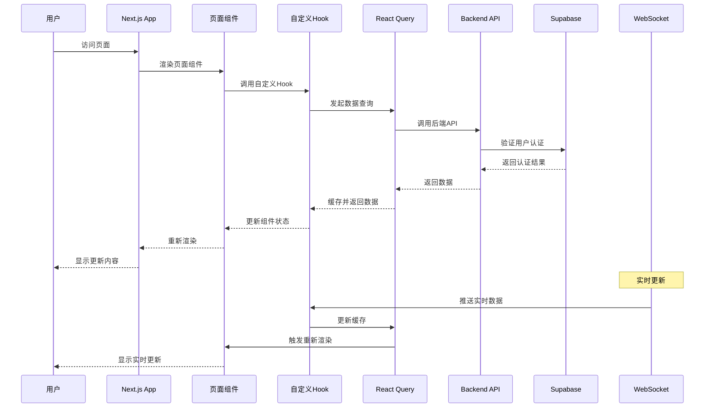

## 概述

AutoGPT前端组件模块基于Next.js 14和React 18构建，采用现代化的组件化架构设计。模块集成了可视化工作流编辑器、实时状态管理、多层缓存策略和完善的用户体验优化。通过标准化的组件设计模式和状态管理机制，为用户提供直观、高效的AI工作流构建体验。

## 1. 前端架构整体设计

### 1.1 技术栈架构图

```mermaid
graph TB
    subgraph "AutoGPT前端技术栈架构"
        subgraph "框架层 - Framework Layer"
            NextJS[Next.js 14 App Router]
            React[React 18]
            TypeScript[TypeScript 5.x]
        end
        
        subgraph "UI组件层 - UI Component Layer"
            ShadcnUI[shadcn/ui组件库]
            RadixUI[Radix UI原子组件]
            TailwindCSS[Tailwind CSS样式]
            LucideIcons[Lucide图标库]
            FramerMotion[Framer Motion动画]
        end
        
        subgraph "状态管理层 - State Management"
            ReactQuery[React Query数据状态]
            Zustand[Zustand全局状态]
            ReactHooks[React Hooks本地状态]
            ContextAPI[Context API跨组件状态]
        end
        
        subgraph "业务组件层 - Business Components"
            FlowEditor[可视化流程编辑器]
            LibraryManager[智能体库管理]
            MarketplaceUI[应用商店界面]
            DashboardUI[用户仪表板]
        end
        
        subgraph "数据通信层 - Data Communication"
            BackendAPI[后端API客户端]
            WebSocketClient[WebSocket实时通信]
            SupabaseAuth[Supabase认证]
            FeatureFlags[功能开关服务]
        end
        
        subgraph "工具链层 - Toolchain Layer"
            ESLint[代码检查]
            Prettier[代码格式化]
            Playwright[端到端测试]
            Storybook[组件开发环境]
        end
    end
    
    NextJS --> React
    React --> TypeScript
    
    ShadcnUI --> RadixUI
    RadixUI --> TailwindCSS
    TailwindCSS --> LucideIcons
    LucideIcons --> FramerMotion
    
    ReactQuery --> Zustand
    Zustand --> ReactHooks
    ReactHooks --> ContextAPI
    
    FlowEditor --> LibraryManager
    LibraryManager --> MarketplaceUI
    MarketplaceUI --> DashboardUI
    
    BackendAPI --> WebSocketClient
    WebSocketClient --> SupabaseAuth
    SupabaseAuth --> FeatureFlags
    
    ESLint --> Prettier
    Prettier --> Playwright
    Playwright --> Storybook
```



### 1.2 应用入口与提供者配置

```typescript
// /autogpt_platform/frontend/src/app/providers.tsx

export function Providers({ children, ...props }: ThemeProviderProps) {
  const queryClient = getQueryClient();
  return (
    <QueryClientProvider client={queryClient}>
      <NuqsAdapter>
        <NextThemesProvider {...props}>
          <BackendAPIProvider>
            <CredentialsProvider>
              <LaunchDarklyProvider>
                <OnboardingProvider>
                  <TooltipProvider>{children}</TooltipProvider>
                </OnboardingProvider>
              </LaunchDarklyProvider>
            </CredentialsProvider>
          </BackendAPIProvider>
        </NextThemesProvider>
      </NuqsAdapter>
    </QueryClientProvider>
  );
}
```

**提供者层次说明**：

- `QueryClientProvider`: React Query数据缓存和同步
- `NextThemesProvider`: 主题管理（明暗模式切换）
- `BackendAPIProvider`: 后端API客户端实例
- `CredentialsProvider`: 用户凭据和认证状态
- `LaunchDarklyProvider`: 功能开关和A/B测试
- `OnboardingProvider`: 用户引导流程状态

## 2. 可视化流程编辑器

### 2.1 FlowEditor核心架构

```typescript
// /autogpt_platform/frontend/src/app/(platform)/build/components/FlowEditor/Flow.tsx

const FlowEditor: React.FC<{
  flowID?: GraphID;
  flowVersion?: number;
  className?: string;
}> = ({ flowID, flowVersion, className }) => {
  const {
    nodes,
    edges,
    onNodesChange,
    onEdgesChange,
    onConnect,
    addNode,
    deleteNode,
    saveGraph,
    executeGraph,
    isExecuting,
  } = useFlowEditor(flowID, flowVersion);

  const nodeTypes = useMemo(
    () => ({
      custom: CustomNode,
    }),
    [],
  );

  const edgeTypes = useMemo(
    () => ({
      custom: CustomEdge,
    }),
    [],
  );

  return (
    <div className={cn("flex h-full w-full", className)}>
      <ReactFlow
        nodes={nodes}
        edges={edges}
        onNodesChange={onNodesChange}
        onEdgesChange={onEdgesChange}
        onConnect={onConnect}
        nodeTypes={nodeTypes}
        edgeTypes={edgeTypes}
        fitView
      >
        <Controls />
        <Background />
        <ToolPanel onAddNode={addNode} />
      </ReactFlow>
    </div>
  );
};
```

### 2.2 自定义节点组件

```typescript
// 自定义节点组件实现

interface CustomNodeProps {
  id: string;
  data: NodeData;
  selected: boolean;
}

const CustomNode: React.FC<CustomNodeProps> = ({ id, data, selected }) => {
  const [isEditing, setIsEditing] = useState(false);
  const { updateNodeData, deleteNode } = useNodeStore();

  const handleInputChange = (field: string, value: any) => {
    updateNodeData(id, { [field]: value });
  };

  return (
    <div className={cn(
      "bg-white border-2 rounded-lg shadow-lg min-w-[200px]",
      selected && "border-blue-500",
      !selected && "border-gray-300"
    )}>
      <NodeHeader
        title={data.title}
        onEdit={() => setIsEditing(true)}
        onDelete={() => deleteNode(id)}
      />
      
      <NodeBody>
        {data.inputPorts.map((port) => (
          <InputPort key={port.name} port={port} nodeId={id} />
        ))}
        
        {isEditing && (
          <NodeEditor
            data={data}
            onChange={handleInputChange}
            onSave={() => setIsEditing(false)}
          />
        )}
        
        {data.outputPorts.map((port) => (
          <OutputPort key={port.name} port={port} nodeId={id} />
        ))}
      </NodeBody>
    </div>
  );
};
```

## 3. 状态管理系统

### 3.1 React Query配置

```typescript
// /autogpt_platform/frontend/src/lib/react-query/queryClient.ts

function makeQueryClient() {
  return new QueryClient({
    defaultOptions: {
      queries: {
        staleTime: 60 * 1000,
        gcTime: 5 * 60 * 1000,
        retry: (failureCount, error) => {
          if (error instanceof Error && error.message.includes('4')) {
            return false;
          }
          return failureCount < 3;
        },
      },
    },
  });
}

export function getQueryClient() {
  if (typeof window === "undefined") {
    return makeQueryClient();
  } else {
    if (!browserQueryClient) browserQueryClient = makeQueryClient();
    return browserQueryClient;
  }
}
```

### 3.2 后端API客户端

```typescript
// /autogpt_platform/frontend/src/lib/autogpt-server-api/context.tsx

const BackendAPIProviderContext = createContext<BackendAPI | null>(null);

export function BackendAPIProvider({
  children,
}: {
  children?: React.ReactNode;
}): React.ReactNode {
  const api = useMemo(() => new BackendAPI(), []);

  // 开发环境下暴露API到全局对象用于调试
  if (process.env.NEXT_PUBLIC_BEHAVE_AS == "LOCAL" && !isServerSide()) {
    window.api = api;
  }

  return (
    <BackendAPIProviderContext.Provider value={api}>
      {children}
    </BackendAPIProviderContext.Provider>
  );
}

export function useBackendAPI(): BackendAPI {
  const context = React.useContext(BackendAPIProviderContext);
  if (!context) {
    throw new Error(
      "useBackendAPI must be used within a BackendAPIProviderContext",
    );
  }
  return context;
}

export class BackendAPI {
  private baseURL: string;
  private wsClient: WebSocketClient | null = null;

  constructor() {
    this.baseURL = getApiBaseUrl();
  }

  async listGraphs(): Promise<GraphMeta[]> {
    const response = await fetch(`${this.baseURL}/api/v1/graphs`, {
      method: 'GET',
      credentials: 'include',
      headers: { 'Content-Type': 'application/json' },
    });

    if (!response.ok) {
      throw new Error(`Failed to list graphs: ${response.statusText}`);
    }

    return response.json();
  }

  async executeGraph(
    graphId: string,
    version: number,
    request: ExecuteGraphRequest
  ): Promise<GraphExecution> {
    const response = await fetch(
      `${this.baseURL}/api/v1/graphs/${graphId}/execute/${version}`,
      {
        method: 'POST',
        credentials: 'include',
        headers: { 'Content-Type': 'application/json' },
        body: JSON.stringify(request),
      }
    );

    return response.json();
  }

  async createGraph(graph: GraphCreation): Promise<GraphMeta> {
    const response = await fetch(`${this.baseURL}/api/v1/graphs`, {
      method: 'POST',
      credentials: 'include',
      headers: { 'Content-Type': 'application/json' },
      body: JSON.stringify({ graph }),
    });

    if (!response.ok) {
      throw new Error(`Failed to create graph: ${response.statusText}`);
    }

    return response.json();
  }

  async updateGraph(
    graphId: string,
    graph: GraphCreation
  ): Promise<GraphMeta> {
    const response = await fetch(`${this.baseURL}/api/v1/graphs/${graphId}`, {
      method: 'PUT',
      credentials: 'include',
      headers: { 'Content-Type': 'application/json' },
      body: JSON.stringify(graph),
    });

    if (!response.ok) {
      throw new Error(`Failed to update graph: ${response.statusText}`);
    }

    return response.json();
  }
}
```

## 4. 核心自定义Hook系统

### 4.1 useAgentGraph Hook

`useAgentGraph`是前端架构的核心Hook，负责智能体图的管理、执行和状态同步。

```typescript
// hooks/useAgentGraph.tsx - Agent图管理核心Hook
export default function useAgentGraph(
  flowID?: GraphID,
  flowVersion?: number,
  flowExecutionID?: GraphExecutionID,
  passDataToBeads?: boolean,
) {
  const { toast } = useToast();
  const router = useRouter();
  const pathname = usePathname();
  const searchParams = useSearchParams();
  const api = useBackendAPI();

  // 状态管理
  const [isScheduling, setIsScheduling] = useState(false);
  const [savedAgent, setSavedAgent] = useState<Graph | null>(null);
  const [agentDescription, setAgentDescription] = useState<string>("");
  const [agentName, setAgentName] = useState<string>("");
  const [libraryAgent, setLibraryAgent] = useState<LibraryAgent | null>(null);
  const [allBlocks, setAllBlocks] = useState<Block[]>([]);
  const [availableFlows, setAvailableFlows] = useState<GraphMeta[]>([]);
  const [updateQueue, setUpdateQueue] = useState<NodeExecutionResult[]>([]);
  const [isSaving, setIsSaving] = useState(false);
  const [isRunning, setIsRunning] = useState(false);
  const [isStopping, setIsStopping] = useState(false);
  const [activeExecutionID, setActiveExecutionID] = useState<GraphExecutionID | null>(null);
  const [graphExecutionError, setGraphExecutionError] = useState<string | null>(null);
  const [xyNodes, setXYNodes] = useState<CustomNode[]>([]);
  const [xyEdges, setXYEdges] = useState<CustomEdge[]>([]);

  // 功能开关过滤
  const betaBlocks = useGetFlag(Flag.BETA_BLOCKS);
  const availableBlocks = useMemo(() => {
    return allBlocks.filter(
      (block) => !betaBlocks || !betaBlocks.includes(block.id),
    );
  }, [allBlocks, betaBlocks]);

  // 保存Agent
  const saveAgent = useCallback(async () => {
    if (!agentName.trim()) {
      toast({
        title: "Error",
        description: "Please enter an agent name",
        variant: "destructive",
      });
      return;
    }

    setIsSaving(true);
    try {
      const graphData = {
        name: agentName,
        description: agentDescription,
        nodes: xyNodes.map(node => ({
          id: node.id,
          block_id: node.data.block_id,
          input_default: node.data.input_default,
          input_nodes: node.data.input_nodes,
          output_nodes: node.data.output_nodes,
          metadata: {
            position: { x: node.position.x, y: node.position.y },
          },
        })),
        links: xyEdges.map(edge => ({
          source_id: edge.source,
          sink_id: edge.target,
          source_name: edge.sourceHandle,
          sink_name: edge.targetHandle,
        })),
      };

      let response;
      if (flowID) {
        response = await api.updateGraph(flowID, graphData);
      } else {
        response = await api.createGraph(graphData);
      }

      setSavedAgent(response);
      toast({
        title: "Success",
        description: `Agent ${flowID ? 'updated' : 'created'} successfully`,
      });

      // 如果是新创建的Agent，导航到编辑页面
      if (!flowID) {
        router.push(`/build?flowID=${response.id}`);
      }
    } catch (error) {
      console.error("Failed to save agent:", error);
      toast({
        title: "Error",
        description: "Failed to save agent",
        variant: "destructive",
      });
    } finally {
      setIsSaving(false);
    }
  }, [agentName, agentDescription, xyNodes, xyEdges, flowID, api, toast, router]);

  // 运行Agent
  const runAgent = useCallback(async () => {
    if (!savedAgent) {
      toast({
        title: "Error",
        description: "Please save the agent first",
        variant: "destructive",
      });
      return;
    }

    setIsRunning(true);
    setGraphExecutionError(null);
    
    try {
      const execution = await api.executeGraph(savedAgent.id, savedAgent.version, {
        input_data: {},
        input_credentials: {},
      });

      setActiveExecutionID(execution.id);
      
      // 开始监听执行更新
      api.connectWebSocket();
      api.onWebSocketMessage((message) => {
        if (message.type === 'node_execution_result') {
          setUpdateQueue(prev => [...prev, message.data]);
        }
      });

      toast({
        title: "Success",
        description: "Agent execution started",
      });
    } catch (error) {
      console.error("Failed to run agent:", error);
      setGraphExecutionError(error instanceof Error ? error.message : "Unknown error");
      toast({
        title: "Error",
        description: "Failed to start agent execution",
        variant: "destructive",
      });
    } finally {
      setIsRunning(false);
    }
  }, [savedAgent, api, toast]);

  return {
    // 状态
    savedAgent,
    agentName,
    setAgentName,
    agentDescription,
    setAgentDescription,
    libraryAgent,
    setLibraryAgent,
    availableBlocks,
    availableFlows,
    xyNodes,
    setXYNodes,
    xyEdges,
    setXYEdges,
    
    // 执行状态
    isRunning,
    isStopping,
    activeExecutionID,
    graphExecutionError,
    updateQueue,
    
    // 操作方法
    saveAgent,
    runAgent,
    stopAgent,
    isSaving,
    isScheduling,
    setIsScheduling,
  };
}
```

### 4.2 useSupabase Hook

`useSupabase`Hook管理用户认证状态和会话验证：

```typescript
// lib/supabase/hooks/useSupabase.ts - Supabase认证管理
export function useSupabase() {
  const router = useRouter();
  const pathname = usePathname();
  const api = useBackendAPI();
  const [user, setUser] = useState<User | null>(null);
  const [isUserLoading, setIsUserLoading] = useState(true);
  const lastValidationRef = useRef<number>(0);
  const isValidatingRef = useRef(false);
  const isLoggedIn = Boolean(user);

  // 创建Supabase客户端
  const supabase = useMemo(() => {
    try {
      return createBrowserClient(getSupabaseUrl(), getSupabaseAnonKey(), {
        isSingleton: true,
        auth: {
          persistSession: false, // 使用httpOnly cookies，不在客户端持久化会话
        },
      });
    } catch (error) {
      console.error("Error creating Supabase client", error);
      return null;
    }
  }, []);

  // 登出函数
  async function logOut(options: ServerLogoutOptions = {}) {
    setWebSocketDisconnectIntent();
    api.disconnectWebSocket();
    broadcastLogout();

    try {
      await serverLogout(options);
    } catch (error) {
      console.error("Error logging out:", error);
    } finally {
      setUser(null);
      router.refresh();
    }
  }

  // 验证会话
  async function validateSessionServer() {
    // 防止并发验证调用
    if (isValidatingRef.current) return true;
    
    const now = Date.now();
    // 限制验证频率（最多每30秒一次）
    if (now - lastValidationRef.current < 30000) return true;

    isValidatingRef.current = true;
    lastValidationRef.current = now;

    try {
      const result = await validateSession();
      if (result.user) {
        setUser(result.user);
        return true;
      } else {
        setUser(null);
        return false;
      }
    } catch (error) {
      console.error("Session validation failed:", error);
      setUser(null);
      return false;
    } finally {
      isValidatingRef.current = false;
    }
  }

  return {
    user,
    isUserLoading,
    isLoggedIn,
    supabase,
    logOut,
    validateSessionServer,
  };
}
```

## 5. UI组件系统

### 5.1 shadcn/ui组件库集成

AutoGPT前端基于shadcn/ui构建了完整的设计系统：

```typescript
// components/ui/button.tsx - 按钮组件
import * as React from "react"
import { Slot } from "@radix-ui/react-slot"
import { cva, type VariantProps } from "class-variance-authority"
import { cn } from "@/lib/utils"

const buttonVariants = cva(
  "inline-flex items-center justify-center whitespace-nowrap rounded-md text-sm font-medium transition-colors focus-visible:outline-none focus-visible:ring-1 focus-visible:ring-ring disabled:pointer-events-none disabled:opacity-50",
  {
    variants: {
      variant: {
        default: "bg-primary text-primary-foreground shadow hover:bg-primary/90",
        destructive: "bg-destructive text-destructive-foreground shadow-sm hover:bg-destructive/90",
        outline: "border border-input bg-background shadow-sm hover:bg-accent hover:text-accent-foreground",
        secondary: "bg-secondary text-secondary-foreground shadow-sm hover:bg-secondary/80",
        ghost: "hover:bg-accent hover:text-accent-foreground",
        link: "text-primary underline-offset-4 hover:underline",
      },
      size: {
        default: "h-9 px-4 py-2",
        sm: "h-8 rounded-md px-3 text-xs",
        lg: "h-10 rounded-md px-8",
        icon: "h-9 w-9",
      },
    },
    defaultVariants: {
      variant: "default",
      size: "default",
    },
  }
)

export interface ButtonProps
  extends React.ButtonHTMLAttributes<HTMLButtonElement>,
    VariantProps<typeof buttonVariants> {
  asChild?: boolean
}

const Button = React.forwardRef<HTMLButtonElement, ButtonProps>(
  ({ className, variant, size, asChild = false, ...props }, ref) => {
    const Comp = asChild ? Slot : "button"
    return (
      <Comp
        className={cn(buttonVariants({ variant, size, className }))}
        ref={ref}
        {...props}
      />
    )
  }
)
Button.displayName = "Button"

export { Button, buttonVariants }
```

### 5.2 Toast通知系统

```typescript
// components/ui/toast.tsx - Toast通知组件
import * as React from "react"
import * as ToastPrimitives from "@radix-ui/react-toast"
import { cva, type VariantProps } from "class-variance-authority"
import { X } from "lucide-react"
import { cn } from "@/lib/utils"

const ToastProvider = ToastPrimitives.Provider

const ToastViewport = React.forwardRef<
  React.ElementRef<typeof ToastPrimitives.Viewport>,
  React.ComponentPropsWithoutRef<typeof ToastPrimitives.Viewport>
>(({ className, ...props }, ref) => (
  <ToastPrimitives.Viewport
    ref={ref}
    className={cn(
      "fixed top-0 z-[100] flex max-h-screen w-full flex-col-reverse p-4 sm:bottom-0 sm:right-0 sm:top-auto sm:flex-col md:max-w-[420px]",
      className
    )}
    {...props}
  />
))
ToastViewport.displayName = ToastPrimitives.Viewport.displayName

const toastVariants = cva(
  "group pointer-events-auto relative flex w-full items-center justify-between space-x-2 overflow-hidden rounded-md border p-4 pr-6 shadow-lg transition-all data-[swipe=cancel]:translate-x-0 data-[swipe=end]:translate-x-[var(--radix-toast-swipe-end-x)] data-[swipe=move]:translate-x-[var(--radix-toast-swipe-move-x)] data-[swipe=move]:transition-none data-[state=open]:animate-in data-[state=closed]:animate-out data-[swipe=end]:animate-out data-[state=closed]:fade-out-80 data-[state=closed]:slide-out-to-right-full data-[state=open]:slide-in-from-top-full data-[state=open]:sm:slide-in-from-bottom-full",
  {
    variants: {
      variant: {
        default: "border bg-background text-foreground",
        destructive:
          "destructive border-destructive bg-destructive text-destructive-foreground",
      },
    },
    defaultVariants: {
      variant: "default",
    },
  }
)

const Toast = React.forwardRef<
  React.ElementRef<typeof ToastPrimitives.Root>,
  React.ComponentPropsWithoutRef<typeof ToastPrimitives.Root> &
    VariantProps<typeof toastVariants>
>(({ className, variant, ...props }, ref) => {
  return (
    <ToastPrimitives.Root
      ref={ref}
      className={cn(toastVariants({ variant }), className)}
      {...props}
    />
  )
})
Toast.displayName = ToastPrimitives.Root.displayName

export {
  type ToastProps,
  type ToastActionElement,
  ToastProvider,
  ToastViewport,
  Toast,
  ToastTitle,
  ToastDescription,
  ToastClose,
  ToastAction,
}
```

## 6. WebSocket实时通信

### 6.1 WebSocket客户端实现

```typescript
// lib/autogpt-server-api/websocket.ts
export class WebSocketClient {
  private ws: WebSocket | null = null;
  private reconnectAttempts = 0;
  private maxReconnectAttempts = 5;
  private reconnectDelay = 1000;
  private messageHandlers: Map<string, (data: any) => void> = new Map();

  constructor(private baseUrl: string, private token: string) {}

  connect(): Promise<void> {
    return new Promise((resolve, reject) => {
      try {
        const wsUrl = `${this.baseUrl.replace('http', 'ws')}/ws?token=${this.token}`;
        this.ws = new WebSocket(wsUrl);

        this.ws.onopen = () => {
          console.log('WebSocket connected');
          this.reconnectAttempts = 0;
          resolve();
        };

        this.ws.onmessage = (event) => {
          try {
            const message = JSON.parse(event.data);
            this.handleMessage(message);
          } catch (error) {
            console.error('Failed to parse WebSocket message:', error);
          }
        };

        this.ws.onclose = (event) => {
          console.log('WebSocket disconnected:', event.code, event.reason);
          this.attemptReconnect();
        };

        this.ws.onerror = (error) => {
          console.error('WebSocket error:', error);
          reject(error);
        };
      } catch (error) {
        reject(error);
      }
    });
  }

  private handleMessage(message: any) {
    const { type, data } = message;
    const handler = this.messageHandlers.get(type);
    if (handler) {
      handler(data);
    }
  }

  onMessage(type: string, handler: (data: any) => void) {
    this.messageHandlers.set(type, handler);
  }

  private attemptReconnect() {
    if (this.reconnectAttempts < this.maxReconnectAttempts) {
      this.reconnectAttempts++;
      const delay = this.reconnectDelay * Math.pow(2, this.reconnectAttempts - 1);
      
      setTimeout(() => {
        console.log(`Attempting WebSocket reconnection (${this.reconnectAttempts}/${this.maxReconnectAttempts})`);
        this.connect().catch(() => {
          // Reconnection failed, will try again
        });
      }, delay);
    }
  }

  disconnect() {
    if (this.ws) {
      this.ws.close();
      this.ws = null;
    }
  }

  send(message: any) {
    if (this.ws && this.ws.readyState === WebSocket.OPEN) {
      this.ws.send(JSON.stringify(message));
    } else {
      console.warn('WebSocket is not connected');
    }
  }
}
```

## 7. 前端架构时序图



## 总结

AutoGPT前端组件模块通过现代化的React生态系统和精心设计的组件架构，实现了高性能、可维护、用户友好的智能体构建界面。核心特性包括：

1. **模块化组件设计**：清晰的组件层次和职责分离
2. **强大的可视化编辑器**：基于React Flow的图形化工作流构建
3. **高效的状态管理**：React Query + Zustand的混合状态管理策略
4. **实时通信能力**：WebSocket集成的状态实时同步
5. **优秀的用户体验**：响应式设计和交互优化
6. **完整的Hook系统**：useAgentGraph、useSupabase等核心Hook
7. **标准化UI组件**：基于shadcn/ui的设计系统
8. **强类型支持**：TypeScript全面覆盖，确保代码质量

通过这些技术和架构设计，AutoGPT前端为用户提供了直观、高效的AI工作流构建体验。

---

## 补充：核心 Hook 与可视化编辑器要点（合并自前端架构深度分析）

### useAgentGraph 关键职责摘要
- 加载与过滤 Block 列表（结合功能开关）
- 图的保存与版本化（`createGraph`/`updateGraph`）
- 执行启动/停止（REST + WebSocket 订阅更新）
- 运行态错误处理与用户提示（Toast）

```typescript
// 关键状态与操作（节选）
const [savedAgent, setSavedAgent] = useState<Graph | null>(null);
const [xyNodes, setXYNodes] = useState<CustomNode[]>([]);
const [xyEdges, setXYEdges] = useState<CustomEdge[]>([]);

const saveAgent = useCallback(async () => {
  const graphData = { /* nodes/links/metadata */ };
  setSavedAgent(flowID ? await api.updateGraph(flowID, graphData)
                       : await api.createGraph(graphData));
}, [flowID, api, xyNodes, xyEdges]);

const runAgent = useCallback(async () => {
  const exec = await api.executeGraph(savedAgent!.id, savedAgent!.version, {
    input_data: {}, input_credentials: {}
  });
  api.connectWebSocket();
  api.onWebSocketMessage((m) => m.type === 'node_execution_result' &&
    setUpdateQueue(prev => [...prev, m.data])
  );
}, [savedAgent, api]);
```

### FlowEditor 连接校验与交互
- 连接前校验输出/输入类型兼容性（基于 Block 的 schema）
- 自定义 Edge/Node 类型，统一视觉与交互
- 面板化操作（保存/运行/停止/添加 Block）

```typescript
// 连接校验（节选）
const onConnect: OnConnect = useCallback((conn) => {
  const s = availableBlocks.find(b => b.id === sourceNode.data.block_id);
  const t = availableBlocks.find(b => b.id === targetNode.data.block_id);
  if (!isTypeCompatible(s.outputSchema.properties[conn.sourceHandle!],
                        t.inputSchema.properties[conn.targetHandle!])) {
    toast({ title: 'Connection Error', variant: 'destructive' });
    return;
  }
  setXYEdges(edges => [...edges, toCustomEdge(conn)]);
}, [availableBlocks, setXYEdges]);
```

## 补充：性能优化与可访问性（合并精简）

### 代码分割与懒加载

```typescript
const FlowEditor = lazy(() => import('@/components/legacy-builder/Flow/Flow'));
const MarketplacePage = lazy(() => import('@/app/(platform)/marketplace/page'));
```

### 计算缓存与函数稳定

```typescript
const availableBlocks = useMemo(() =>
  allBlocks.filter(b => !betaBlocks || !betaBlocks.includes(b.id)),
  [allBlocks, betaBlocks]
);
const onNodesChange = useCallback((changes: NodeChange[]) =>
  setXYNodes(nodes => applyNodeChanges(changes, nodes)), [setXYNodes]);
```

### 大列表虚拟化

```typescript
import { FixedSizeList as List } from 'react-window';
<List height={600} itemCount={blocks.length} itemSize={80} width="100%">
  {({ index, style }) => <div style={style}><BlockItem block={blocks[index]} /></div>}
</List>
```

### 可访问性与键盘导航

```typescript
function useKeyboardNavigation(items: any[], onSelect: (x: any) => void) {
  const [idx, setIdx] = useState(0);
  useEffect(() => {
    const onKey = (e: KeyboardEvent) => {
      if (e.key === 'ArrowUp') setIdx(i => Math.max(0, i - 1));
      if (e.key === 'ArrowDown') setIdx(i => Math.min(items.length - 1, i + 1));
      if (e.key === 'Enter') onSelect(items[idx]);
    };
    document.addEventListener('keydown', onKey);
    return () => document.removeEventListener('keydown', onKey);
  }, [items, idx, onSelect]);
  return idx;
}
```

## 补充：测试策略（单元/集成）

```typescript
// 组件测试（节选）
it('Button shows loading', () => {
  render(<Button loading>Click</Button>);
  expect(screen.getByRole('button')).toBeDisabled();
});

// Hook 集成
it('useAgentGraph saves agent', async () => {
  const { result } = renderHook(() => useAgentGraph());
  act(() => { result.current.setAgentName('Demo'); });
  await act(async () => { await result.current.saveAgent(); });
  expect(result.current.savedAgent).toBeTruthy();
});
```
