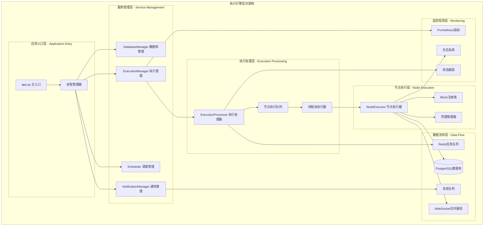
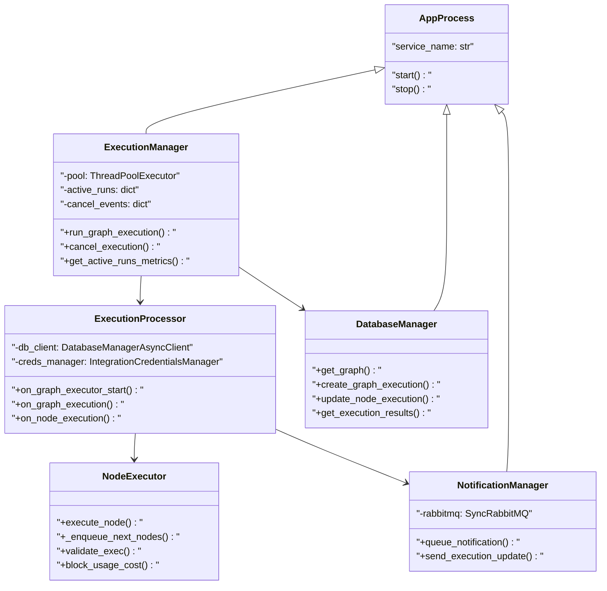
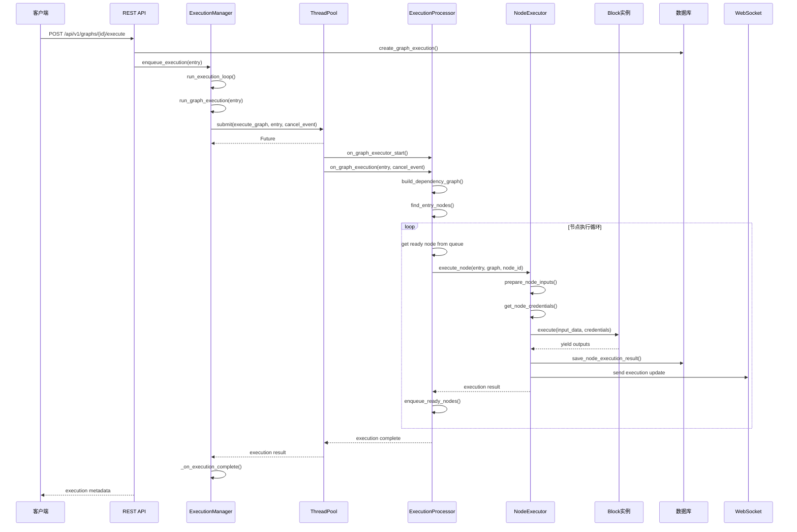
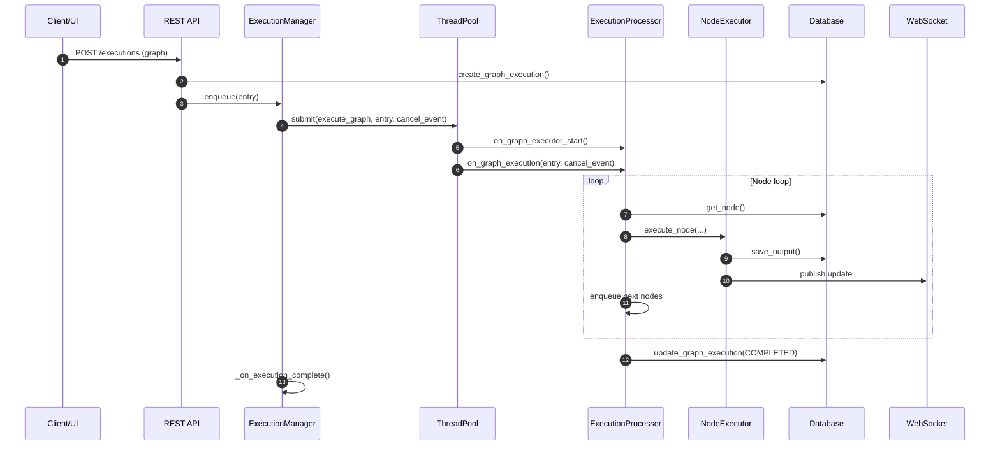
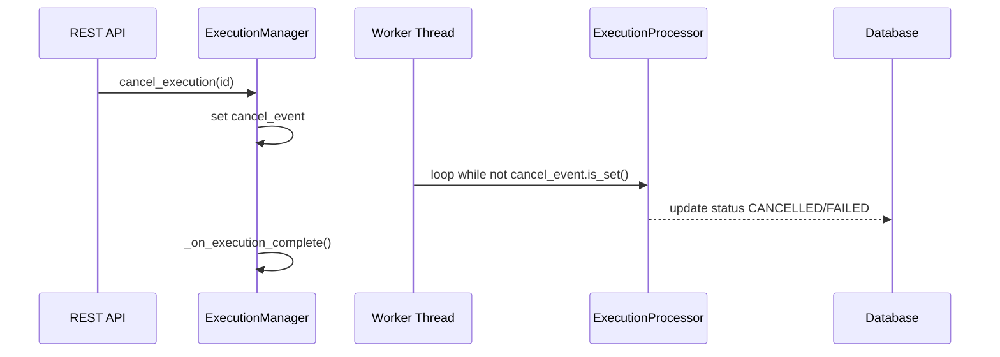

## 概述

AutoGPT执行引擎是整个平台的核心组件，负责Agent工作流的调度、执行和监控。采用多进程并行架构，通过Redis分布式队列实现高并发任务处理，支持实时状态同步和完善的错误处理机制。执行引擎确保智能体工作流的可靠执行和资源的高效利用。

<!--more-->

## 1. 执行引擎整体架构

### 1.1 核心组件架构图



**图1-1: AutoGPT执行引擎架构图**

此架构图展示了执行引擎的完整分层结构。应用入口层负责服务启动和进程管理，服务管理层提供核心服务组件，执行处理层实现任务调度和处理，节点执行层执行具体的Block逻辑，数据流转层提供持久化和通信能力，监控观测层提供系统可观测性。

### 1.2 执行引擎类层次结构



**图1-2: 执行引擎类层次结构图**

## 2. ExecutionManager执行管理器

### 2.1 ExecutionManager核心实现

```python
# /autogpt_platform/backend/backend/executor/manager.py

import asyncio
import logging
import threading
import time
from concurrent.futures import ThreadPoolExecutor, Future
from typing import Dict, Optional

from .database import DatabaseManager
from .processor import ExecutionProcessor

logger = logging.getLogger(__name__)

class ExecutionManager(AppProcess):
    """
    执行管理器
    
    负责智能体工作流的执行调度和生命周期管理。
    采用线程池模式实现并发执行，支持执行取消和状态监控。
    
    核心功能:

    1. 执行队列管理
    2. 并发执行控制
    3. 执行状态跟踪
    4. 资源管理和清理
    """
    
    def __init__(self):
        super().__init__("ExecutionManager")
        
        # 线程池配置
        self.max_workers = int(os.getenv("EXECUTION_MAX_WORKERS", "10"))
        self.pool: Optional[ThreadPoolExecutor] = None
        
        # 执行状态管理
        self.active_runs: Dict[str, Future] = {}
        self.cancel_events: Dict[str, threading.Event] = {}
        
        # 执行队列
        self.execution_queue = asyncio.Queue()
        
        # 监控指标
        self.execution_metrics = {
            "total_executions": 0,
            "active_executions": 0,
            "completed_executions": 0,
            "failed_executions": 0,
        }
        
        # 数据库管理器
        self.db_manager: Optional[DatabaseManager] = None
    
    def run(self):
        """
        启动执行管理器
        
        初始化线程池和执行循环，开始处理执行请求。
        """
        logger.info("启动ExecutionManager")
        
        # 初始化线程池
        self.pool = ThreadPoolExecutor(
            max_workers=self.max_workers,
            thread_name_prefix="ExecutionWorker"
        )
        
        # 获取数据库管理器实例
        self.db_manager = DatabaseManager.get_instance()
        
        try:
            # 启动执行循环
            asyncio.run(self.run_execution_loop())
        except KeyboardInterrupt:
            logger.info("收到停止信号")
        finally:
            self.cleanup()
    
    async def run_execution_loop(self):
        """
        执行循环主函数
        
        持续监听执行队列，处理新的执行请求。
        """
        logger.info("执行循环已启动")
        
        while True:
            try:
                # 从队列获取执行请求
                execution_entry = await self.execution_queue.get()
                
                # 处理执行请求
                await self.run_graph_execution(execution_entry)
                
                # 标记任务完成
                self.execution_queue.task_done()
                
            except asyncio.CancelledError:
                logger.info("执行循环被取消")
                break
            except Exception as e:
                logger.error(f"执行循环异常: {e}")
                continue
    
    async def run_graph_execution(self, execution_entry: GraphExecutionEntry):
        """
        执行单个图任务
        
        将图执行任务提交到线程池，并管理执行状态。
        
        参数:
            execution_entry: 图执行请求对象
        """
        execution_id = execution_entry.graph_exec_id
        
        try:
            # 创建取消事件
            cancel_event = threading.Event()
            self.cancel_events[execution_id] = cancel_event
            
            # 提交到线程池执行
            future = self.pool.submit(
                self.execute_graph,
                execution_entry,
                cancel_event
            )
            
            # 记录活跃执行
            self.active_runs[execution_id] = future
            self.execution_metrics["active_executions"] += 1
            self.execution_metrics["total_executions"] += 1
            
            logger.info(f"图执行已启动: {execution_id}")
            
            # 设置完成回调
            future.add_done_callback(
                lambda f: self._on_execution_complete(execution_id, f)
            )
            
        except Exception as e:
            logger.error(f"启动图执行失败 {execution_id}: {e}")
            await self._mark_execution_failed(execution_id, str(e))
    
    def execute_graph(
        self,
        execution_entry: GraphExecutionEntry,
        cancel_event: threading.Event
    ):
        """
        图执行的实际逻辑（在工作线程中运行）
        
        参数:
            execution_entry: 执行请求
            cancel_event: 取消事件
        """
        execution_id = execution_entry.graph_exec_id
        
        try:
            logger.info(f"开始执行图: {execution_id}")
            
            # 创建执行处理器
            processor = ExecutionProcessor(
                db_client=self.db_manager.get_async_client(),
                cancel_event=cancel_event
            )
            
            # 初始化执行环境
            processor.on_graph_executor_start()
            
            # 执行图
            result = processor.on_graph_execution(execution_entry)
            
            logger.info(f"图执行完成: {execution_id}")
            return result
            
        except Exception as e:
            logger.error(f"图执行异常 {execution_id}: {e}")
            raise
    
    def _on_execution_complete(self, execution_id: str, future: Future):
        """
        执行完成回调
        
        参数:
            execution_id: 执行ID
            future: 执行Future对象
        """
        try:
            # 获取执行结果
            result = future.result()
            
            logger.info(f"执行完成: {execution_id}")
            self.execution_metrics["completed_executions"] += 1
            
        except Exception as e:
            logger.error(f"执行失败 {execution_id}: {e}")
            self.execution_metrics["failed_executions"] += 1
        
        finally:
            # 清理资源
            self.active_runs.pop(execution_id, None)
            self.cancel_events.pop(execution_id, None)
            self.execution_metrics["active_executions"] -= 1
    
    async def cancel_execution(self, execution_id: str) -> bool:
        """
        取消执行
        
        参数:
            execution_id: 要取消的执行ID
            
        返回:
            bool: 是否成功发起取消
        """
        # 设置取消事件
        cancel_event = self.cancel_events.get(execution_id)
        if cancel_event:
            cancel_event.set()
            logger.info(f"已发起执行取消: {execution_id}")
            return True
        
        logger.warning(f"未找到执行记录: {execution_id}")
        return False
    
    def get_active_runs_metrics(self) -> dict:
        """
        获取执行指标
        
        返回:
            dict: 执行指标数据
        """
        return {
            **self.execution_metrics,
            "thread_pool_size": self.max_workers,
            "active_run_ids": list(self.active_runs.keys()),
        }
    
    def cleanup(self):
        """清理资源"""
        logger.info("清理ExecutionManager资源")
        
        if self.pool:
            # 等待所有任务完成
            self.pool.shutdown(wait=True, timeout=30)
            logger.info("线程池已关闭")
        
        # 清理状态
        self.active_runs.clear()
        self.cancel_events.clear()

```

### 2.2 执行队列管理

```python
async def enqueue_execution(self, execution_entry: GraphExecutionEntry):
    """
    将执行请求加入队列
    
    参数:
        execution_entry: 图执行请求
    """
    await self.execution_queue.put(execution_entry)
    logger.info(f"执行请求已入队: {execution_entry.graph_exec_id}")

def get_queue_status(self) -> dict:
    """
    获取队列状态
    
    返回:
        dict: 队列状态信息
    """
    return {
        "queue_size": self.execution_queue.qsize(),
        "active_executions": len(self.active_runs),
        "max_workers": self.max_workers,
        "available_workers": self.max_workers - len(self.active_runs),
    }
```

## 3. ExecutionProcessor执行处理器

### 3.1 ExecutionProcessor核心实现

```python
# /autogpt_platform/backend/backend/executor/processor.py

import asyncio
import logging
import threading
from typing import Dict, List, Optional, Set

from .node_executor import NodeExecutor
from .database import DatabaseManagerAsyncClient

logger = logging.getLogger(__name__)

class ExecutionProcessor:
    """
    执行处理器
    
    负责单个图的执行逻辑，包括节点调度、依赖管理和状态同步。
    采用事件驱动模式，支持并发节点执行和实时状态更新。
    
    核心功能:

    1. 图执行流程控制
    2. 节点依赖管理
    3. 并发执行调度
    4. 状态同步和通知
    """
    
    def __init__(
        self,
        db_client: DatabaseManagerAsyncClient,
        cancel_event: threading.Event
    ):
        self.db_client = db_client
        self.cancel_event = cancel_event
        
        # 节点执行器
        self.node_executor = NodeExecutor(db_client)
        
        # 执行状态管理
        self.completed_nodes: Set[str] = set()
        self.failed_nodes: Set[str] = set()
        self.running_nodes: Set[str] = set()
        
        # 节点依赖图
        self.node_dependencies: Dict[str, Set[str]] = {}
        self.node_dependents: Dict[str, Set[str]] = {}
        
        # 执行队列
        self.ready_queue: asyncio.Queue = asyncio.Queue()
        
        # 并发控制
        self.max_concurrent_nodes = int(os.getenv("MAX_CONCURRENT_NODES", "5"))
        self.semaphore = asyncio.Semaphore(self.max_concurrent_nodes)
    
    def on_graph_executor_start(self):
        """
        执行器启动初始化
        
        准备执行环境，初始化依赖关系。
        """
        logger.info("ExecutionProcessor启动初始化")
        
        # 初始化凭据管理器
        self.node_executor.initialize_credentials()
        
        # 初始化监控指标
        self.node_executor.initialize_metrics()
    
    async def on_graph_execution(self, execution_entry: GraphExecutionEntry) -> dict:
        """
        执行图的主要逻辑
        
        参数:
            execution_entry: 图执行请求
            
        返回:
            dict: 执行结果
        """
        execution_id = execution_entry.graph_exec_id
        graph_id = execution_entry.graph_id
        
        try:
            logger.info(f"开始执行图 {graph_id} (执行ID: {execution_id})")
            
            # 获取图定义
            graph = await self.db_client.get_graph(
                graph_id,
                version=execution_entry.graph_version
            )
            
            if not graph:
                raise ValueError(f"图不存在: {graph_id}")
            
            # 构建依赖关系
            self._build_dependency_graph(graph)
            
            # 标记执行开始
            await self.db_client.update_graph_execution_status(
                execution_id,
                ExecutionStatus.RUNNING
            )
            
            # 找到入口节点
            entry_nodes = self._find_entry_nodes(graph)
            
            # 将入口节点加入就绪队列
            for node_id in entry_nodes:
                await self.ready_queue.put(node_id)
            
            # 执行节点处理循环
            result = await self._execute_nodes_loop(execution_entry, graph)
            
            # 标记执行完成
            await self.db_client.update_graph_execution_status(
                execution_id,
                ExecutionStatus.COMPLETED
            )
            
            logger.info(f"图执行完成: {execution_id}")
            return result
            
        except Exception as e:
            logger.error(f"图执行失败 {execution_id}: {e}")
            
            # 标记执行失败
            await self.db_client.update_graph_execution_status(
                execution_id,
                ExecutionStatus.FAILED,
                error_message=str(e)
            )
            
            raise
    
    async def _execute_nodes_loop(
        self,
        execution_entry: GraphExecutionEntry,
        graph: Graph
    ) -> dict:
        """
        节点执行循环
        
        并发执行就绪的节点，直到所有节点完成或失败。
        
        参数:
            execution_entry: 执行请求
            graph: 图定义
            
        返回:
            dict: 执行结果
        """
        execution_tasks = []
        
        while True:
            # 检查取消信号
            if self.cancel_event.is_set():
                logger.info("收到取消信号，停止执行")
                break
            
            # 获取就绪节点
            try:
                node_id = await asyncio.wait_for(
                    self.ready_queue.get(),
                    timeout=1.0
                )
            except asyncio.TimeoutError:
                # 检查是否所有节点都已完成
                if self._is_execution_complete(graph):
                    break
                continue
            
            # 创建节点执行任务
            task = asyncio.create_task(
                self._execute_single_node(execution_entry, graph, node_id)
            )
            execution_tasks.append(task)
            
            # 限制并发数量
            if len(execution_tasks) >= self.max_concurrent_nodes:
                # 等待至少一个任务完成
                done, pending = await asyncio.wait(
                    execution_tasks,
                    return_when=asyncio.FIRST_COMPLETED
                )
                
                # 处理完成的任务
                for task in done:
                    try:
                        await task
                    except Exception as e:
                        logger.error(f"节点执行任务异常: {e}")
                
                # 更新任务列表
                execution_tasks = list(pending)
        
        # 等待所有剩余任务完成
        if execution_tasks:
            await asyncio.gather(*execution_tasks, return_exceptions=True)
        
        # 收集执行结果
        return await self._collect_execution_results(execution_entry)
    
    async def _execute_single_node(
        self,
        execution_entry: GraphExecutionEntry,
        graph: Graph,
        node_id: str
    ):
        """
        执行单个节点
        
        参数:
            execution_entry: 执行请求
            graph: 图定义
            node_id: 节点ID
        """
        async with self.semaphore:
            try:
                # 标记节点开始运行
                self.running_nodes.add(node_id)
                
                # 执行节点
                await self.node_executor.execute_node(
                    execution_entry,
                    graph,
                    node_id
                )
                
                # 标记节点完成
                self.completed_nodes.add(node_id)
                self.running_nodes.discard(node_id)
                
                # 检查并入队后续节点
                await self._enqueue_ready_nodes(node_id)
                
            except Exception as e:
                logger.error(f"节点执行失败 {node_id}: {e}")
                
                # 标记节点失败
                self.failed_nodes.add(node_id)
                self.running_nodes.discard(node_id)
                
                # 根据策略决定是否继续执行
                if not self._should_continue_on_failure():
                    self.cancel_event.set()
    
    def _build_dependency_graph(self, graph: Graph):
        """
        构建节点依赖关系图
        
        参数:
            graph: 图定义
        """
        # 初始化依赖字典
        for node in graph.nodes:
            self.node_dependencies[node.id] = set()
            self.node_dependents[node.id] = set()
        
        # 根据连接构建依赖关系
        for link in graph.links:
            source_id = link.source_id
            sink_id = link.sink_id
            
            # sink依赖于source
            self.node_dependencies[sink_id].add(source_id)
            
            # source的依赖者包括sink
            self.node_dependents[source_id].add(sink_id)
    
    def _find_entry_nodes(self, graph: Graph) -> List[str]:
        """
        查找入口节点（没有依赖的节点）
        
        参数:
            graph: 图定义
            
        返回:
            List[str]: 入口节点ID列表
        """
        entry_nodes = []
        
        for node in graph.nodes:
            if not self.node_dependencies[node.id]:
                entry_nodes.append(node.id)
        
        return entry_nodes
    
    async def _enqueue_ready_nodes(self, completed_node_id: str):
        """
        检查并入队就绪的后续节点
        
        参数:
            completed_node_id: 已完成的节点ID
        """
        # 获取依赖此节点的所有节点
        dependent_nodes = self.node_dependents.get(completed_node_id, set())
        
        for node_id in dependent_nodes:
            # 检查该节点的所有依赖是否都已完成
            dependencies = self.node_dependencies[node_id]
            
            if dependencies.issubset(self.completed_nodes):
                # 所有依赖都已完成，节点就绪
                if (node_id not in self.completed_nodes and
                    node_id not in self.failed_nodes and
                    node_id not in self.running_nodes):
                    
                    await self.ready_queue.put(node_id)
    
    def _is_execution_complete(self, graph: Graph) -> bool:
        """
        检查执行是否完成
        
        参数:
            graph: 图定义
            
        返回:
            bool: 是否完成
        """
        total_nodes = len(graph.nodes)
        processed_nodes = len(self.completed_nodes) + len(self.failed_nodes)
        
        return processed_nodes == total_nodes and len(self.running_nodes) == 0
    
    def _should_continue_on_failure(self) -> bool:
        """
        判断在节点失败时是否继续执行
        
        返回:
            bool: 是否继续执行
        """
        # 可以根据配置或策略决定
        return False  # 默认遇到失败就停止
    
    async def _collect_execution_results(
        self,
        execution_entry: GraphExecutionEntry
    ) -> dict:
        """
        收集执行结果
        
        参数:
            execution_entry: 执行请求
            
        返回:
            dict: 执行结果汇总
        """
        return {
            "execution_id": execution_entry.graph_exec_id,
            "completed_nodes": len(self.completed_nodes),
            "failed_nodes": len(self.failed_nodes),
            "total_nodes": len(self.completed_nodes) + len(self.failed_nodes),
            "success": len(self.failed_nodes) == 0,
        }

```

## 4. NodeExecutor节点执行器

### 4.1 NodeExecutor核心实现

```python
# /autogpt_platform/backend/backend/executor/node_executor.py

import asyncio
import logging
from typing import Any, Dict, Optional

from backend.data.block import get_block
from backend.integrations.credentials import IntegrationCredentialsManager

logger = logging.getLogger(__name__)

class NodeExecutor:
    """
    节点执行器
    
    负责单个节点的执行，包括输入准备、Block调用、输出处理和状态更新。
    支持凭据管理、成本计算和执行监控。
    """
    
    def __init__(self, db_client):
        self.db_client = db_client
        self.credentials_manager = IntegrationCredentialsManager()
        
        # 执行统计
        self.execution_stats = {
            "total_executions": 0,
            "successful_executions": 0,
            "failed_executions": 0,
            "total_execution_time": 0.0,
        }
    
    async def execute_node(
        self,
        execution_entry: GraphExecutionEntry,
        graph: Graph,
        node_id: str
    ) -> Dict[str, Any]:
        """
        执行单个节点
        
        参数:
            execution_entry: 执行请求
            graph: 图定义
            node_id: 节点ID
            
        返回:
            Dict[str, Any]: 节点执行结果
        """
        start_time = time.time()
        
        try:
            logger.info(f"开始执行节点: {node_id}")
            
            # 获取节点定义
            node = self._find_node_by_id(graph, node_id)
            if not node:
                raise ValueError(f"节点不存在: {node_id}")
            
            # 获取Block实例
            block = get_block(node.block_id)
            if not block:
                raise ValueError(f"Block不存在: {node.block_id}")
            
            # 准备输入数据
            input_data = await self._prepare_node_inputs(
                execution_entry, node
            )
            
            # 获取凭据
            credentials = await self._get_node_credentials(
                execution_entry, node
            )
            
            # 创建用户上下文
            user_context = await self._create_user_context(
                execution_entry.user_id
            )
            
            # 执行Block
            outputs = {}
            async for output_name, output_data in block.execute(
                input_data,
                credentials=credentials,
                user_context=user_context,
                user_id=execution_entry.user_id,
            ):
                if output_name not in outputs:
                    outputs[output_name] = []
                outputs[output_name].append(output_data)
            
            # 保存执行结果
            await self._save_node_execution_result(
                execution_entry.graph_exec_id,
                node_id,
                ExecutionStatus.COMPLETED,
                input_data,
                outputs
            )
            
            # 计算执行成本
            cost = await self._calculate_execution_cost(block, input_data, outputs)
            
            # 更新统计信息
            execution_time = time.time() - start_time
            self._update_execution_stats(True, execution_time)
            
            logger.info(f"节点执行完成: {node_id} (耗时: {execution_time:.2f}s)")
            
            return {
                "node_id": node_id,
                "status": "completed",
                "outputs": outputs,
                "execution_time": execution_time,
                "cost": cost,
            }
            
        except Exception as e:
            execution_time = time.time() - start_time
            logger.error(f"节点执行失败 {node_id}: {e}")
            
            # 保存失败结果
            await self._save_node_execution_result(
                execution_entry.graph_exec_id,
                node_id,
                ExecutionStatus.FAILED,
                input_data if 'input_data' in locals() else {},
                {},
                error_message=str(e)
            )
            
            # 更新统计信息
            self._update_execution_stats(False, execution_time)
            
            raise
    
    def _find_node_by_id(self, graph: Graph, node_id: str) -> Optional[Node]:
        """
        在图中查找指定ID的节点
        
        参数:
            graph: 图定义
            node_id: 节点ID
            
        返回:
            Optional[Node]: 节点对象
        """
        for node in graph.nodes:
            if node.id == node_id:
                return node
        return None
    
    async def _prepare_node_inputs(
        self,
        execution_entry: GraphExecutionEntry,
        node: Node
    ) -> Dict[str, Any]:
        """
        准备节点输入数据
        
        参数:
            execution_entry: 执行请求
            node: 节点定义
            
        返回:
            Dict[str, Any]: 输入数据
        """
        input_data = {}
        
        # 合并默认输入和动态输入
        input_data.update(node.input_default or {})
        
        # 获取来自前置节点的输入
        predecessor_outputs = await self._get_predecessor_outputs(
            execution_entry.graph_exec_id, node
        )
        input_data.update(predecessor_outputs)
        
        # 合并执行时输入
        if execution_entry.inputs:
            input_data.update(execution_entry.inputs)
        
        return input_data
    
    async def _get_predecessor_outputs(
        self,
        execution_id: str,
        node: Node
    ) -> Dict[str, Any]:
        """
        获取前置节点的输出作为当前节点的输入
        
        参数:
            execution_id: 执行ID
            node: 当前节点
            
        返回:
            Dict[str, Any]: 前置节点输出数据
        """
        # 这里需要根据图的连接关系查询前置节点的输出
        # 具体实现依赖于数据库schema和连接逻辑
        
        # 简化实现
        return await self.db_client.get_node_inputs_from_predecessors(
            execution_id, node.id
        )
    
    async def _get_node_credentials(
        self,
        execution_entry: GraphExecutionEntry,
        node: Node
    ) -> Dict[str, Any]:
        """
        获取节点执行所需的凭据
        
        参数:
            execution_entry: 执行请求
            node: 节点定义
            
        返回:
            Dict[str, Any]: 凭据数据
        """
        credentials = {}
        
        # 从执行请求中获取凭据配置
        if execution_entry.credentials_inputs:
            credentials.update(execution_entry.credentials_inputs)
        
        # 使用凭据管理器获取实际凭据
        resolved_credentials = await self.credentials_manager.get_credentials(
            execution_entry.user_id,
            credentials
        )
        
        return resolved_credentials
    
    async def _create_user_context(self, user_id: str) -> UserContext:
        """
        创建用户上下文
        
        参数:
            user_id: 用户ID
            
        返回:
            UserContext: 用户上下文对象
        """
        # 获取用户信息
        user = await self.db_client.get_user(user_id)
        
        return UserContext(
            timezone=user.timezone if user else "UTC",
            locale=user.locale if user else "en-US",
            preferences=user.preferences if user else {},
        )
    
    async def _save_node_execution_result(
        self,
        execution_id: str,
        node_id: str,
        status: ExecutionStatus,
        inputs: Dict[str, Any],
        outputs: Dict[str, Any],
        error_message: Optional[str] = None
    ):
        """
        保存节点执行结果
        
        参数:
            execution_id: 执行ID
            node_id: 节点ID
            status: 执行状态
            inputs: 输入数据
            outputs: 输出数据
            error_message: 错误消息
        """
        await self.db_client.save_node_execution_result(
            execution_id=execution_id,
            node_id=node_id,
            status=status,
            inputs=inputs,
            outputs=outputs,
            error_message=error_message,
            started_at=datetime.utcnow(),
            ended_at=datetime.utcnow(),
        )
    
    async def _calculate_execution_cost(
        self,
        block: Block,
        inputs: Dict[str, Any],
        outputs: Dict[str, Any]
    ) -> int:
        """
        计算执行成本
        
        参数:
            block: Block实例
            inputs: 输入数据
            outputs: 输出数据
            
        返回:
            int: 执行成本
        """
        if not hasattr(block, 'costs') or not block.costs:
            return 0
        
        total_cost = 0
        
        for cost_config in block.costs:
            # 根据成本类型计算
            if cost_config.cost_type == BlockCostType.RUN:
                total_cost += cost_config.cost_amount
            elif cost_config.cost_type == BlockCostType.BYTE:
                # 计算数据字节数
                data_size = self._calculate_data_size(inputs, outputs)
                total_cost += cost_config.cost_amount * data_size
            elif cost_config.cost_type == BlockCostType.SECOND:
                # 使用执行时间计算（需要传入执行时间）
                pass
        
        return total_cost
    
    def _calculate_data_size(
        self,
        inputs: Dict[str, Any],
        outputs: Dict[str, Any]
    ) -> int:
        """
        计算数据大小（字节）
        
        参数:
            inputs: 输入数据
            outputs: 输出数据
            
        返回:
            int: 数据大小
        """
        import json
        
        try:
            input_size = len(json.dumps(inputs).encode('utf-8'))
            output_size = len(json.dumps(outputs).encode('utf-8'))
            return input_size + output_size
        except Exception:
            return 0
    
    def _update_execution_stats(self, success: bool, execution_time: float):
        """
        更新执行统计信息
        
        参数:
            success: 是否成功
            execution_time: 执行时间
        """
        self.execution_stats["total_executions"] += 1
        self.execution_stats["total_execution_time"] += execution_time
        
        if success:
            self.execution_stats["successful_executions"] += 1
        else:
            self.execution_stats["failed_executions"] += 1
    
    def get_execution_stats(self) -> Dict[str, Any]:
        """
        获取执行统计信息
        
        返回:
            Dict[str, Any]: 统计信息
        """
        stats = self.execution_stats.copy()
        
        if stats["total_executions"] > 0:
            stats["success_rate"] = (
                stats["successful_executions"] / stats["total_executions"]
            )
            stats["average_execution_time"] = (
                stats["total_execution_time"] / stats["total_executions"]
            )
        else:
            stats["success_rate"] = 0.0
            stats["average_execution_time"] = 0.0
        
        return stats
```

## 5. 执行引擎完整时序图



**图5-1: AutoGPT执行引擎完整时序图**

## 总结

AutoGPT执行引擎通过精心设计的分层架构和高效的并发机制，为整个平台提供了可靠、高性能的智能体工作流执行能力。核心优势包括：

1. **分层架构设计**：清晰的组件职责分离，便于维护和扩展
2. **并发执行支持**：线程池和异步机制实现高并发处理
3. **完善的状态管理**：实时状态跟踪和同步机制
4. **灵活的调度策略**：基于依赖关系的智能节点调度
5. **强大的错误处理**：完善的异常处理和恢复机制
6. **全面的监控支持**：执行指标收集和性能监控

通过这些设计和实现，AutoGPT执行引擎为智能体工作流的可靠执行提供了坚实的技术基础。

---

## 补充：执行流程与关键函数（合并自后端执行引擎剖析）

### 端到端执行时序（API → EM → 线程池 → EP → NE → DB/WS）



### ExecutionManager 核心职责
- 线程池初始化与度量导出（活跃执行/池容量/利用率）
- 执行循环：监听执行/取消队列、提交任务、注册完成回调
- 取消语义：记录 `cancel_event`，工作线程内轮询提前终止

```python
def run_graph_execution(self, entry: GraphExecutionEntry):
  cancel = threading.Event()
  self.cancel_events[entry.id] = cancel
  fut = self.pool.submit(execute_graph, entry, cancel)
  fut.add_done_callback(lambda f: self._on_execution_complete(entry.id, f))
  self.active_runs[entry.id] = fut
```

### ExecutionProcessor 事件驱动模型
- 构建依赖图、定位入口节点、并发执行就绪节点
- 失败策略：默认遇错停止（可按策略放宽）

```python
async def _execute_nodes_loop(self, entry, graph):
  tasks = set()
  while not self._is_execution_complete(graph):
    try:
      node_id = await asyncio.wait_for(self.ready_queue.get(), timeout=1.0)
    except asyncio.TimeoutError:
      continue
    tasks.add(asyncio.create_task(self._execute_single_node(entry, graph, node_id)))
    if len(tasks) >= self.max_concurrent_nodes:
      done, tasks = await asyncio.wait(tasks, return_when=asyncio.FIRST_COMPLETED)
      for t in done: await t
```

### NodeExecutor 关键路径（输入→凭据→执行→保存→调度）

```python
async def execute_node(self, entry, graph, node_id):
  node = self._find_node_by_id(graph, node_id)
  block = get_block(node.block_id)
  inputs = await self._prepare_node_inputs(entry, node)
  creds = await self._get_node_credentials(entry, node)
  outputs = {}
  async for name, data in block.execute(inputs, credentials=creds, user_id=entry.user_id):
    outputs.setdefault(name, []).append(data)
  await self._save_node_execution_result(entry.graph_exec_id, node_id, ExecutionStatus.COMPLETED, inputs, outputs)
```

## 补充：取消/清理与度量



要点：

- 指标：活跃执行数、池容量、利用率、节点执行计数/时长分布
- 结构化日志：统一上下文字段（user_id/graph_exec_id/node_id）
