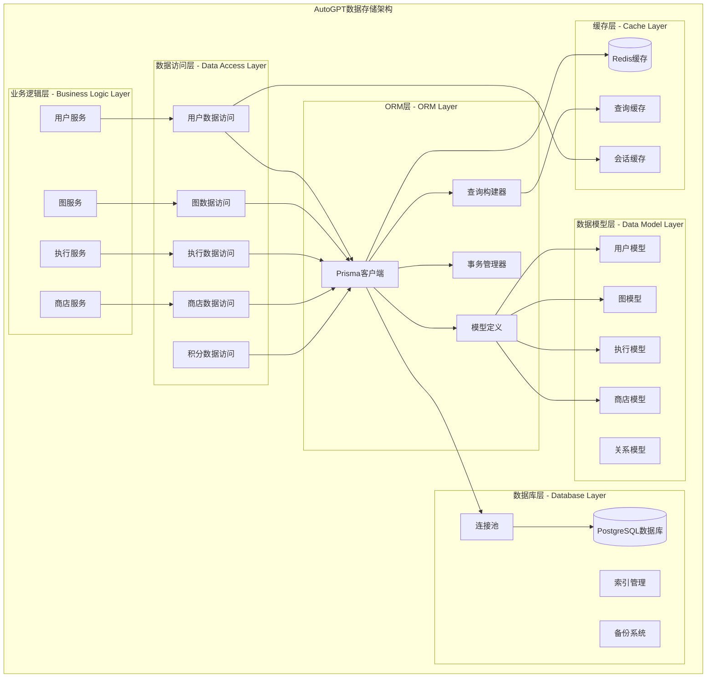
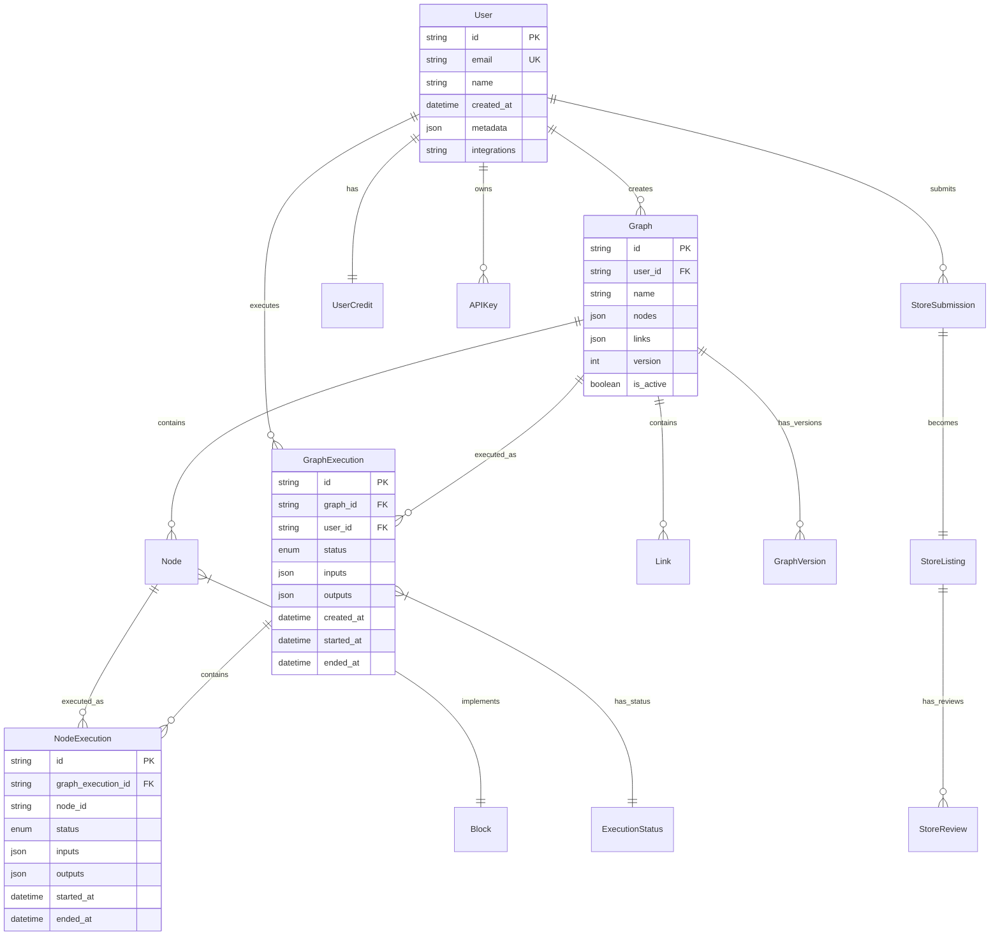

## 概述

AutoGPT数据存储模块基于PostgreSQL数据库和Prisma ORM构建，提供完整的数据持久化解决方案。模块采用分层架构设计，包含数据模型层、数据访问层和业务逻辑层，支持事务管理、连接池优化、数据迁移和性能监控。通过标准化的数据模型和类型安全的ORM操作，为整个平台提供可靠的数据存储服务。

<!--more-->

## 1. 数据存储整体架构

### 1.1 数据存储设计原则

AutoGPT数据存储模块遵循以下核心设计原则：

- **分层架构**：数据模型、访问层、业务逻辑清晰分离
- **类型安全**：基于Prisma的强类型ORM操作
- **事务一致性**：ACID特性保证数据完整性
- **性能优化**：连接池、索引优化、查询缓存
- **扩展性**：支持数据库分片和读写分离

### 1.2 数据存储架构图



**图1-1: AutoGPT数据存储架构图**

此架构图展示了数据存储模块的完整分层结构。业务逻辑层提供高级数据操作接口，数据访问层封装具体的数据库操作，ORM层提供类型安全的数据库访问，数据模型层定义数据结构，数据库层提供持久化存储，缓存层提供性能优化。

### 1.3 核心数据实体关系图



**图1-2: 核心数据实体关系图**

此ER图展示了AutoGPT平台的核心数据实体及其关系。用户是系统的中心实体，拥有图、执行记录、积分和API密钥。图包含节点和连接，可以被执行产生执行记录。商店系统允许用户提交和分享图。

## 2. Prisma ORM集成

### 2.1 Prisma客户端配置

```python
# /autogpt_platform/backend/backend/data/db.py

import logging
import os
from contextlib import asynccontextmanager
from urllib.parse import parse_qsl, urlencode, urlparse, urlunparse

from dotenv import load_dotenv
from prisma import Prisma
from pydantic import BaseModel, Field, field_validator

from backend.util.retry import conn_retry

load_dotenv()

# Prisma配置
PRISMA_SCHEMA = os.getenv("PRISMA_SCHEMA", "schema.prisma")
os.environ["PRISMA_SCHEMA_PATH"] = PRISMA_SCHEMA

def add_param(url: str, key: str, value: str) -> str:
    """
    向数据库URL添加参数
    
    用于动态配置数据库连接参数，如连接池大小、超时时间等
    
    参数:
        url: 原始数据库URL
        key: 参数键
        value: 参数值
        
    返回:
        str: 添加参数后的URL
    """
    p = urlparse(url)
    qs = dict(parse_qsl(p.query))
    qs[key] = value
    return urlunparse(p._replace(query=urlencode(qs)))

# 数据库连接配置
DATABASE_URL = os.getenv("DATABASE_URL", "postgresql://localhost:5432")

# 连接池配置
CONN_LIMIT = os.getenv("DB_CONNECTION_LIMIT")
if CONN_LIMIT:
    DATABASE_URL = add_param(DATABASE_URL, "connection_limit", CONN_LIMIT)

# 连接超时配置
CONN_TIMEOUT = os.getenv("DB_CONNECT_TIMEOUT")
if CONN_TIMEOUT:
    DATABASE_URL = add_param(DATABASE_URL, "connect_timeout", CONN_TIMEOUT)

# 池超时配置
POOL_TIMEOUT = os.getenv("DB_POOL_TIMEOUT")
if POOL_TIMEOUT:
    DATABASE_URL = add_param(DATABASE_URL, "pool_timeout", POOL_TIMEOUT)

HTTP_TIMEOUT = int(POOL_TIMEOUT) if POOL_TIMEOUT else None

# 创建Prisma客户端实例
prisma = Prisma(
    auto_register=True,  # 自动注册模型
    http={"timeout": HTTP_TIMEOUT},  # HTTP超时配置
    datasource={"url": DATABASE_URL},  # 数据源配置
)

logger = logging.getLogger(__name__)

def is_connected() -> bool:
    """
    检查数据库连接状态
    
    返回:
        bool: 是否已连接
    """
    return prisma.is_connected()

@conn_retry("Prisma", "Acquiring connection")
async def connect():
    """
    建立数据库连接
    
    使用重试装饰器确保连接的可靠性。
    如果已经连接则直接返回。
    """
    if prisma.is_connected():
        return
    
    logger.info("Connecting to database...")
    await prisma.connect()
    logger.info("Database connected successfully")

async def disconnect():
    """
    断开数据库连接
    
    优雅关闭数据库连接，释放资源
    """
    if prisma.is_connected():
        logger.info("Disconnecting from database...")
        await prisma.disconnect()
        logger.info("Database disconnected")
```

### 2.2 数据库连接管理

```python
@asynccontextmanager
async def database_context():
    """
    数据库连接上下文管理器
    
    确保数据库连接的正确建立和释放。
    用于需要数据库操作的异步上下文中。
    
    使用示例:
        async with database_context():
            user = await prisma.user.find_unique(where={"id": user_id})
    """
    try:
        await connect()
        yield prisma
    finally:
        # 注意：通常不在这里断开连接，因为连接是全局共享的
        pass

async def execute_in_transaction(operations):
    """
    在事务中执行多个数据库操作
    
    确保操作的原子性，要么全部成功，要么全部回滚。
    
    参数:
        operations: 要执行的操作列表
        
    返回:
        操作结果列表
        
    异常:
        DatabaseError: 事务执行失败时抛出
    """
    try:
        async with prisma.tx() as transaction:
            results = []
            for operation in operations:
                result = await operation(transaction)
                results.append(result)
            return results
    except Exception as e:
        logger.error(f"Transaction failed: {e}")
        raise DatabaseError(f"Transaction execution failed: {str(e)}")

async def query_raw_with_schema(query_template: str, *args) -> list[dict]:
    """
    执行原生SQL查询
    
    用于复杂查询或性能优化场景。
    自动添加schema前缀以支持多租户。
    
    参数:
        query_template: SQL查询模板
        *args: 查询参数
        
    返回:
        list[dict]: 查询结果列表
    """
    schema = os.getenv("PRISMA_SCHEMA_NAME", "public")
    
    # 替换查询模板中的schema占位符
    formatted_query = query_template.replace("{schema}", schema)
    
    # 执行原生查询
    result = await prisma.query_raw(
        formatted_query, *args
    )
    
    return result
```

## 3. 核心数据模型定义

### 3.1 用户数据模型

```python
# /autogpt_platform/backend/backend/data/model.py

from datetime import datetime
from typing import Any, Optional
from pydantic import BaseModel, ConfigDict, Field

class User(BaseModel):
    """
    用户数据模型
    
    应用层用户模型，采用snake_case命名约定。
    包含用户的基本信息、偏好设置和通知配置。
    
    字段说明:

    - id: 用户唯一标识符（UUID格式）
    - email: 用户邮箱地址（唯一索引）
    - name: 用户显示名称（可选）
    - created_at/updated_at: 时间戳字段
    - metadata: 用户元数据（JSON格式）
    - integrations: 加密的集成数据
    - stripe_customer_id: Stripe客户ID（支付相关）
    - 通知偏好设置字段
    """
    
    model_config = ConfigDict(
        extra="forbid",  # 禁止额外字段
        str_strip_whitespace=True,  # 自动去除字符串空白
    )
    
    # 基本信息
    id: str = Field(..., description="用户ID")
    email: str = Field(..., description="用户邮箱地址")
    email_verified: bool = Field(default=True, description="邮箱是否已验证")
    name: Optional[str] = Field(None, description="用户显示名称")
    created_at: datetime = Field(..., description="创建时间")
    updated_at: datetime = Field(..., description="最后更新时间")
    
    # 扩展信息
    metadata: dict[str, Any] = Field(
        default_factory=dict,
        description="用户元数据"
    )
    integrations: str = Field(
        default="",
        description="加密的集成数据"
    )
    stripe_customer_id: Optional[str] = Field(
        None,
        description="Stripe客户ID"
    )
    
    # 通知偏好设置
    max_emails_per_day: int = Field(
        default=3,
        description="每日最大邮件数量"
    )
    notify_on_agent_run: bool = Field(
        default=True,
        description="智能体运行通知"
    )
    notify_on_zero_balance: bool = Field(
        default=True,
        description="余额为零通知"
    )
    notify_on_low_balance: bool = Field(
        default=True,
        description="余额不足通知"
    )
    notify_on_block_execution_failed: bool = Field(
        default=True,
        description="Block执行失败通知"
    )
    notify_on_continuous_agent_error: bool = Field(
        default=True,
        description="连续智能体错误通知"
    )
    notify_on_daily_summary: bool = Field(
        default=True,
        description="每日摘要通知"
    )
    notify_on_weekly_summary: bool = Field(
        default=True,
        description="每周摘要通知"
    )
    notify_on_monthly_summary: bool = Field(
        default=True,
        description="每月摘要通知"
    )
    
    def get_display_name(self) -> str:
        """
        获取用户显示名称
        
        优先使用name字段，如果为空则使用邮箱前缀
        
        返回:
            str: 显示名称
        """
        return self.name or self.email.split("@")[0]
    
    def is_notification_enabled(self, notification_type: str) -> bool:
        """
        检查特定通知类型是否启用
        
        参数:
            notification_type: 通知类型
            
        返回:
            bool: 是否启用
        """
        field_name = f"notify_on_{notification_type}"
        return getattr(self, field_name, False)

class AutoTopUpConfig(BaseModel):
    """
    自动充值配置模型
    
    用于配置用户的自动充值设置
    """
    
    enabled: bool = Field(default=False, description="是否启用自动充值")
    threshold: int = Field(default=100, description="触发充值的余额阈值")
    amount: int = Field(default=1000, description="充值金额")
    payment_method_id: Optional[str] = Field(None, description="支付方式ID")
```

### 3.2 图数据模型

```python
# /autogpt_platform/backend/backend/data/graph.py

from typing import Any, List, Optional, Set
from pydantic import BaseModel, Field, field_validator
from enum import Enum

from .db import BaseDbModel

class NodeType(str, Enum):
    """节点类型枚举"""
    STANDARD = "standard"
    INPUT = "input"
    OUTPUT = "output"
    WEBHOOK = "webhook"

class Link(BaseDbModel):
    """
    图连接模型
    
    表示图中两个节点之间的连接关系。
    定义了数据从源节点的输出端口流向目标节点的输入端口。
    
    字段说明:

    - source_id: 源节点ID
    - sink_id: 目标节点ID
    - source_name: 源节点输出端口名称
    - sink_name: 目标节点输入端口名称
    - is_static: 是否为静态连接
    """
    
    source_id: str = Field(..., description="源节点ID")
    sink_id: str = Field(..., description="目标节点ID")
    source_name: str = Field(..., description="源输出端口名称")
    sink_name: str = Field(..., description="目标输入端口名称")
    is_static: bool = Field(default=False, description="是否为静态连接")
    
    def __hash__(self):
        """支持Link对象的哈希操作"""
        return hash((self.source_id, self.sink_id, self.source_name, self.sink_name))
    
    def validate_connection(self, source_node: "Node", sink_node: "Node") -> bool:
        """
        验证连接的有效性
        
        验证规则:
        1. 源节点存在指定的输出端口
        2. 目标节点存在指定的输入端口
        3. 端口类型兼容
        
        参数:
            source_node: 源节点对象
            sink_node: 目标节点对象
            
        返回:
            bool: 连接是否有效
        """
        # 检查源节点输出端口
        if not source_node.has_output_port(self.source_name):
            return False
        
        # 检查目标节点输入端口
        if not sink_node.has_input_port(self.sink_name):
            return False
        
        # 检查端口类型兼容性
        source_type = source_node.get_output_port_type(self.source_name)
        sink_type = sink_node.get_input_port_type(self.sink_name)
        
        return self._are_types_compatible(source_type, sink_type)
    
    def _are_types_compatible(self, source_type: type, sink_type: type) -> bool:
        """检查两个类型是否兼容"""
        # 简化的类型兼容性检查
        return source_type == sink_type or sink_type == Any

class Node(BaseDbModel):
    """
    图节点模型
    
    表示图中的一个执行单元，封装了Block的实例化配置。
    每个节点都关联到一个Block类型，并包含特定的输入配置和位置信息。
    
    字段说明:

    - block_id: 关联的Block类型ID
    - label: 节点显示标签
    - input_default: 默认输入值配置
    - metadata: 节点元数据（包含位置、样式等）
    - node_type: 节点类型
    """
    
    block_id: str = Field(..., description="Block类型ID")
    label: str = Field(..., max_length=100, description="节点标签")
    input_default: dict[str, Any] = Field(
        default_factory=dict,
        description="默认输入配置"
    )
    metadata: dict[str, Any] = Field(
        default_factory=dict,
        description="节点元数据"
    )
    node_type: NodeType = Field(
        default=NodeType.STANDARD,
        description="节点类型"
    )
    
    @property
    def position(self) -> Optional[dict[str, float]]:
        """获取节点位置信息"""
        return self.metadata.get("position")
    
    @position.setter
    def position(self, pos: dict[str, float]):
        """设置节点位置信息"""
        if "position" not in self.metadata:
            self.metadata["position"] = {}
        self.metadata["position"].update(pos)
    
    def get_input_value(self, input_name: str, default: Any = None) -> Any:
        """
        获取输入值
        
        参数:
            input_name: 输入名称
            default: 默认值
            
        返回:
            输入值
        """
        return self.input_default.get(input_name, default)
    
    def set_input_value(self, input_name: str, value: Any):
        """
        设置输入值
        
        参数:
            input_name: 输入名称
            value: 输入值
        """
        self.input_default[input_name] = value
    
    def has_input_port(self, port_name: str) -> bool:
        """检查是否有指定的输入端口"""
        from .block import get_block
        block = get_block(self.block_id)
        if not block:
            return False
        return port_name in block.input_schema.model_fields
    
    def has_output_port(self, port_name: str) -> bool:
        """检查是否有指定的输出端口"""
        from .block import get_block
        block = get_block(self.block_id)
        if not block:
            return False
        return port_name in block.output_schema.model_fields

class Graph(BaseDbModel):
    """
    图数据模型
    
    表示一个完整的智能体工作流，包含节点、连接和元数据。
    支持版本管理、模板功能和结构验证。
    
    字段说明:

    - name: 图名称
    - description: 图描述
    - nodes: 节点列表
    - links: 连接列表
    - version: 版本号
    - is_active: 是否为活跃版本
    - is_template: 是否为模板
    - user_id: 创建者用户ID
    """
    
    name: str = Field(..., max_length=100, description="图名称")
    description: Optional[str] = Field(
        None,
        max_length=500,
        description="图描述"
    )
    nodes: List[Node] = Field(
        default_factory=list,
        description="节点列表"
    )
    links: List[Link] = Field(
        default_factory=list,
        description="连接列表"
    )
    version: int = Field(default=1, ge=1, description="版本号")
    is_active: bool = Field(default=True, description="是否为活跃版本")
    is_template: bool = Field(default=False, description="是否为模板")
    user_id: str = Field(..., description="创建者用户ID")
    
    def validate_graph(self, for_run: bool = False) -> bool:
        """
        验证图结构的完整性
        
        验证规则:
        1. 至少包含一个节点
        2. 所有连接的源节点和目标节点都存在
        3. 没有循环依赖
        4. 入口节点至少有一个
        5. 所有节点都可达（运行时验证）
        
        参数:
            for_run: 是否为运行时验证
            
        返回:
            bool: 结构是否有效
            
        异常:
            GraphValidationError: 验证失败时抛出
        """
        if not self.nodes:
            raise GraphValidationError("Graph must contain at least one node")
        
        # 验证连接的有效性
        node_ids = {node.id for node in self.nodes}
        node_map = {node.id: node for node in self.nodes}
        
        for link in self.links:
            if link.source_id not in node_ids:
                raise GraphValidationError(
                    f"Link source node {link.source_id} not found"
                )
            if link.sink_id not in node_ids:
                raise GraphValidationError(
                    f"Link sink node {link.sink_id} not found"
                )
            
            # 验证连接的端口
            source_node = node_map[link.source_id]
            sink_node = node_map[link.sink_id]
            
            if not link.validate_connection(source_node, sink_node):
                raise GraphValidationError(
                    f"Invalid connection from {link.source_id}.{link.source_name} "
                    f"to {link.sink_id}.{link.sink_name}"
                )
        
        # 检查循环依赖
        if self._has_cycles():
            raise GraphValidationError("Graph contains circular dependencies")
        
        # 运行时验证
        if for_run:
            # 验证入口节点存在
            entry_nodes = self.get_entry_nodes()
            if not entry_nodes:
                raise GraphValidationError("Graph must have at least one entry node")
            
            # 验证所有节点可达
            unreachable_nodes = self._find_unreachable_nodes()
            if unreachable_nodes:
                raise GraphValidationError(
                    f"Unreachable nodes found: {', '.join(unreachable_nodes)}"
                )
        
        return True
    
    def get_entry_nodes(self) -> List[Node]:
        """获取入口节点（没有输入连接的节点）"""
        sink_ids = {link.sink_id for link in self.links}
        return [node for node in self.nodes if node.id not in sink_ids]
    
    def get_exit_nodes(self) -> List[Node]:
        """获取出口节点（没有输出连接的节点）"""
        source_ids = {link.source_id for link in self.links}
        return [node for node in self.nodes if node.id not in source_ids]
    
    def _has_cycles(self) -> bool:
        """检查图是否包含循环依赖"""
        # 使用DFS检测循环
        visited = set()
        rec_stack = set()
        
        def dfs(node_id: str) -> bool:
            visited.add(node_id)
            rec_stack.add(node_id)
            
            # 检查所有后继节点
            for link in self.links:
                if link.source_id == node_id:
                    neighbor = link.sink_id
                    if neighbor not in visited:
                        if dfs(neighbor):
                            return True
                    elif neighbor in rec_stack:
                        return True
            
            rec_stack.remove(node_id)
            return False
        
        # 对所有未访问的节点进行DFS
        for node in self.nodes:
            if node.id not in visited:
                if dfs(node.id):
                    return True
        
        return False
    
    def _find_unreachable_nodes(self) -> List[str]:
        """查找不可达的节点"""
        entry_nodes = self.get_entry_nodes()
        if not entry_nodes:
            return []
        
        # 从入口节点开始BFS
        reachable = set()
        queue = [node.id for node in entry_nodes]
        
        while queue:
            current = queue.pop(0)
            if current in reachable:
                continue
            
            reachable.add(current)
            
            # 添加后继节点
            for link in self.links:
                if link.source_id == current and link.sink_id not in reachable:
                    queue.append(link.sink_id)
        
        # 找出不可达的节点
        all_node_ids = {node.id for node in self.nodes}
        unreachable = all_node_ids - reachable
        
        return list(unreachable)

class GraphValidationError(Exception):
    """图验证异常"""
    pass
```

### 3.3 执行数据模型

```python
# /autogpt_platform/backend/backend/data/execution.py

from datetime import datetime
from enum import Enum
from typing import Any, Dict, List, Optional
from pydantic import BaseModel, Field

class ExecutionStatus(str, Enum):
    """
    执行状态枚举
    
    定义了图执行和节点执行的所有可能状态。
    状态转换遵循严格的生命周期规则。
    """
    QUEUED = "queued"        # 已排队，等待执行
    RUNNING = "running"      # 正在执行
    COMPLETED = "completed"  # 执行完成
    FAILED = "failed"        # 执行失败
    CANCELLED = "cancelled"  # 被取消
    TIMEOUT = "timeout"      # 执行超时
    
    def is_terminal(self) -> bool:
        """检查是否为终止状态"""
        return self in [
            ExecutionStatus.COMPLETED,
            ExecutionStatus.FAILED,
            ExecutionStatus.CANCELLED,
            ExecutionStatus.TIMEOUT
        ]
    
    def is_successful(self) -> bool:
        """检查是否为成功状态"""
        return self == ExecutionStatus.COMPLETED

class GraphExecutionEntry(BaseModel):
    """
    图执行请求模型
    
    表示一个图执行请求，包含执行所需的所有信息。
    用于在执行队列中传递执行请求。
    """
    
    graph_exec_id: str = Field(..., description="图执行ID")
    graph_id: str = Field(..., description="图ID")
    graph_version: int = Field(..., description="图版本")
    user_id: str = Field(..., description="用户ID")
    inputs: Dict[str, Any] = Field(
        default_factory=dict,
        description="执行输入数据"
    )
    credentials_inputs: Dict[str, Any] = Field(
        default_factory=dict,
        description="凭据输入配置"
    )
    created_at: datetime = Field(
        default_factory=datetime.utcnow,
        description="创建时间"
    )

class NodeExecutionEntry(BaseModel):
    """
    节点执行请求模型
    
    表示一个节点执行请求，包含节点执行所需的信息。
    """
    
    id: str = Field(..., description="节点执行ID")
    node_id: str = Field(..., description="节点ID")
    graph_exec_id: str = Field(..., description="图执行ID")
    inputs: Dict[str, Any] = Field(
        default_factory=dict,
        description="节点输入数据"
    )
    credentials_inputs: Optional[Dict[str, Any]] = Field(
        None,
        description="凭据输入配置"
    )

class GraphExecutionMeta(BaseModel):
    """
    图执行元数据模型
    
    表示图执行的元数据信息，用于状态跟踪和结果查询。
    """
    
    id: str = Field(..., description="执行ID")
    graph_id: str = Field(..., description="图ID")
    graph_version: int = Field(..., description="图版本")
    user_id: str = Field(..., description="用户ID")
    status: ExecutionStatus = Field(..., description="执行状态")
    inputs: Dict[str, Any] = Field(
        default_factory=dict,
        description="输入数据"
    )
    outputs: Dict[str, Any] = Field(
        default_factory=dict,
        description="输出数据"
    )
    created_at: datetime = Field(..., description="创建时间")
    started_at: Optional[datetime] = Field(None, description="开始时间")
    ended_at: Optional[datetime] = Field(None, description="结束时间")
    error_message: Optional[str] = Field(None, description="错误信息")
    
    @property
    def duration(self) -> Optional[float]:
        """
        计算执行持续时间（秒）
        
        返回:
            Optional[float]: 持续时间，如果未开始则返回None
        """
        if not self.started_at:
            return None
        
        end_time = self.ended_at or datetime.utcnow()
        return (end_time - self.started_at).total_seconds()
    
    def is_running(self) -> bool:
        """检查是否正在运行"""
        return self.status in [ExecutionStatus.QUEUED, ExecutionStatus.RUNNING]
    
    def can_be_cancelled(self) -> bool:
        """检查是否可以取消"""
        return self.status in [ExecutionStatus.QUEUED, ExecutionStatus.RUNNING]

class NodeExecutionResult(BaseModel):
    """
    节点执行结果模型
    
    表示单个节点的执行结果，包含输出数据和执行统计。
    """
    
    id: str = Field(..., description="节点执行ID")
    node_id: str = Field(..., description="节点ID")
    status: ExecutionStatus = Field(..., description="执行状态")
    inputs: Dict[str, Any] = Field(
        default_factory=dict,
        description="输入数据"
    )
    outputs: Dict[str, Any] = Field(
        default_factory=dict,
        description="输出数据"
    )
    started_at: Optional[datetime] = Field(None, description="开始时间")
    ended_at: Optional[datetime] = Field(None, description="结束时间")
    error_message: Optional[str] = Field(None, description="错误信息")
    execution_cost: int = Field(default=0, description="执行成本")
    
    @property
    def duration(self) -> Optional[float]:
        """计算节点执行持续时间"""
        if not self.started_at:
            return None
        
        end_time = self.ended_at or datetime.utcnow()
        return (end_time - self.started_at).total_seconds()

class UserContext(BaseModel):
    """
    用户上下文模型
    
    包含用户的上下文信息，用于个性化执行。
    """
    
    timezone: str = Field(default="UTC", description="用户时区")
    locale: str = Field(default="en-US", description="用户语言环境")
    preferences: Dict[str, Any] = Field(
        default_factory=dict,
        description="用户偏好设置"
    )
    
    def get_local_time(self) -> datetime:
        """
        获取用户本地时间
        
        返回:
            datetime: 本地时间
        """
        import pytz
        
        utc_now = datetime.utcnow().replace(tzinfo=pytz.UTC)
        user_tz = pytz.timezone(self.timezone)
        return utc_now.astimezone(user_tz)
```

## 4. 数据访问层实现

### 4.1 用户数据访问

```python
# /autogpt_platform/backend/backend/data/user.py

import logging
from typing import Optional
from prisma.models import User as PrismaUser
from backend.server.v2.store.exceptions import DatabaseError

from .db import prisma
from .model import User

logger = logging.getLogger(__name__)

async def get_or_create_user(user_data: dict) -> User:
    """
    获取或创建用户
    
    处理流程:

    1. 从JWT载荷中提取用户标识和基本信息
    2. 查询数据库检查用户是否已存在
    3. 如果用户存在，更新其基本信息
    4. 如果用户不存在，创建新的用户记录
    5. 返回用户对象
    
    参数:
        user_data: JWT载荷字典，包含用户信息
        
    返回:
        User: 用户模型对象
        
    异常:
        DatabaseError: 数据库操作失败时抛出
    """
    try:
        user_id = user_data["sub"]
        email = user_data["email"]
        user_metadata = user_data.get("user_metadata", {})
        
        # 查询现有用户
        existing_user = await prisma.user.find_unique(
            where={"id": user_id}
        )
        
        if existing_user:
            # 更新现有用户信息
            updated_user = await prisma.user.update(
                where={"id": user_id},
                data={
                    "email": email,
                    "name": user_metadata.get("name"),
                    "updated_at": datetime.utcnow(),
                }
            )
            return _prisma_to_user_model(updated_user)
        else:
            # 创建新用户
            new_user = await prisma.user.create(
                data={
                    "id": user_id,
                    "email": email,
                    "name": user_metadata.get("name"),
                    "created_at": datetime.utcnow(),
                    "updated_at": datetime.utcnow(),
                    "metadata": user_metadata,
                }
            )
            return _prisma_to_user_model(new_user)
            
    except Exception as e:
        logger.error(f"Failed to get or create user {user_data}: {e}")
        raise DatabaseError(f"Failed to get or create user: {str(e)}") from e

async def get_user_by_id(user_id: str) -> Optional[User]:
    """
    根据ID获取用户
    
    参数:
        user_id: 用户ID
        
    返回:
        Optional[User]: 用户对象，如果不存在则返回None
    """
    try:
        user = await prisma.user.find_unique(
            where={"id": user_id}
        )
        
        if user:
            return _prisma_to_user_model(user)
        return None
        
    except Exception as e:
        logger.error(f"Failed to get user {user_id}: {e}")
        raise DatabaseError(f"Failed to get user: {str(e)}") from e

async def update_user_email(user_id: str, email: str) -> User:
    """
    更新用户邮箱
    
    参数:
        user_id: 用户ID
        email: 新邮箱地址
        
    返回:
        User: 更新后的用户对象
        
    异常:
        DatabaseError: 更新失败时抛出
    """
    try:
        updated_user = await prisma.user.update(
            where={"id": user_id},
            data={
                "email": email,
                "updated_at": datetime.utcnow(),
            }
        )
        
        return _prisma_to_user_model(updated_user)
        
    except Exception as e:
        logger.error(f"Failed to update user email {user_id}: {e}")
        raise DatabaseError(f"Failed to update user email: {str(e)}") from e

def _prisma_to_user_model(prisma_user: PrismaUser) -> User:
    """
    将Prisma用户模型转换为应用层用户模型
    
    参数:
        prisma_user: Prisma用户对象
        
    返回:
        User: 应用层用户模型
    """
    return User(
        id=prisma_user.id,
        email=prisma_user.email,
        email_verified=prisma_user.email_verified or True,
        name=prisma_user.name,
        created_at=prisma_user.created_at,
        updated_at=prisma_user.updated_at,
        metadata=prisma_user.metadata or {},
        integrations=prisma_user.integrations or "",
        stripe_customer_id=prisma_user.stripe_customer_id,
        # 通知偏好设置
        max_emails_per_day=prisma_user.max_emails_per_day or 3,
        notify_on_agent_run=prisma_user.notify_on_agent_run or True,
        notify_on_zero_balance=prisma_user.notify_on_zero_balance or True,
        notify_on_low_balance=prisma_user.notify_on_low_balance or True,
        notify_on_block_execution_failed=prisma_user.notify_on_block_execution_failed or True,
        notify_on_continuous_agent_error=prisma_user.notify_on_continuous_agent_error or True,
        notify_on_daily_summary=prisma_user.notify_on_daily_summary or True,
        notify_on_weekly_summary=prisma_user.notify_on_weekly_summary or True,
        notify_on_monthly_summary=prisma_user.notify_on_monthly_summary or True,
    )
```

### 4.2 图数据访问

```python
# /autogpt_platform/backend/backend/data/graph.py

async def create_graph(graph: Graph, user_id: str) -> Graph:
    """
    创建新图
    
    创建流程:

    1. 验证图结构
    2. 创建图记录
    3. 创建节点记录
    4. 创建连接记录
    5. 返回完整图对象
    
    参数:
        graph: 图对象
        user_id: 创建者用户ID
        
    返回:
        Graph: 创建的图对象
        
    异常:
        DatabaseError: 创建失败时抛出
    """
    try:
        # 验证图结构
        graph.validate_graph()
        
        # 在事务中创建图和相关数据
        async with prisma.tx() as transaction:
            # 创建图记录
            created_graph = await transaction.graph.create(
                data={
                    "id": graph.id,
                    "name": graph.name,
                    "description": graph.description,
                    "user_id": user_id,
                    "version": graph.version,
                    "is_active": graph.is_active,
                    "is_template": graph.is_template,
                    "created_at": datetime.utcnow(),
                    "updated_at": datetime.utcnow(),
                }
            )
            
            # 创建节点记录
            for node in graph.nodes:
                await transaction.node.create(
                    data={
                        "id": node.id,
                        "graph_id": graph.id,
                        "block_id": node.block_id,
                        "label": node.label,
                        "input_default": node.input_default,
                        "metadata": node.metadata,
                        "node_type": node.node_type.value,
                    }
                )
            
            # 创建连接记录
            for link in graph.links:
                await transaction.link.create(
                    data={
                        "id": link.id,
                        "graph_id": graph.id,
                        "source_id": link.source_id,
                        "sink_id": link.sink_id,
                        "source_name": link.source_name,
                        "sink_name": link.sink_name,
                        "is_static": link.is_static,
                    }
                )
        
        return graph
        
    except Exception as e:
        logger.error(f"Failed to create graph {graph.id}: {e}")
        raise DatabaseError(f"Failed to create graph: {str(e)}") from e

async def get_graph(
    graph_id: str,
    version: Optional[int] = None,
    user_id: Optional[str] = None,
    include_subgraphs: bool = False
) -> Optional[Graph]:
    """
    获取图定义
    
    参数:
        graph_id: 图ID
        version: 版本号（可选，默认最新版本）
        user_id: 用户ID（用于权限验证）
        include_subgraphs: 是否包含子图
        
    返回:
        Optional[Graph]: 图对象，如果不存在则返回None
    """
    try:
        # 构建查询条件
        where_clause = {"id": graph_id}
        if version is not None:
            where_clause["version"] = version
        if user_id is not None:
            where_clause["user_id"] = user_id
        
        # 查询图记录
        graph_record = await prisma.graph.find_first(
            where=where_clause,
            include={
                "nodes": True,
                "links": True,
            },
            order_by={"version": "desc"} if version is None else None
        )
        
        if not graph_record:
            return None
        
        # 转换为应用层模型
        return _prisma_to_graph_model(graph_record)
        
    except Exception as e:
        logger.error(f"Failed to get graph {graph_id}: {e}")
        raise DatabaseError(f"Failed to get graph: {str(e)}") from e

def _prisma_to_graph_model(prisma_graph) -> Graph:
    """
    将Prisma图模型转换为应用层图模型
    
    参数:
        prisma_graph: Prisma图对象
        
    返回:
        Graph: 应用层图模型
    """
    # 转换节点
    nodes = []
    for prisma_node in prisma_graph.nodes:
        node = Node(
            id=prisma_node.id,
            block_id=prisma_node.block_id,
            label=prisma_node.label,
            input_default=prisma_node.input_default or {},
            metadata=prisma_node.metadata or {},
            node_type=NodeType(prisma_node.node_type),
        )
        nodes.append(node)
    
    # 转换连接
    links = []
    for prisma_link in prisma_graph.links:
        link = Link(
            id=prisma_link.id,
            source_id=prisma_link.source_id,
            sink_id=prisma_link.sink_id,
            source_name=prisma_link.source_name,
            sink_name=prisma_link.sink_name,
            is_static=prisma_link.is_static,
        )
        links.append(link)
    
    # 创建图对象
    return Graph(
        id=prisma_graph.id,
        name=prisma_graph.name,
        description=prisma_graph.description,
        nodes=nodes,
        links=links,
        version=prisma_graph.version,
        is_active=prisma_graph.is_active,
        is_template=prisma_graph.is_template,
        user_id=prisma_graph.user_id,
    )
```

## 5. 数据库性能优化

### 5.1 索引策略

```sql
-- 用户表索引
CREATE UNIQUE INDEX idx_users_email ON users(email);
CREATE INDEX idx_users_created_at ON users(created_at);
CREATE INDEX idx_users_stripe_customer_id ON users(stripe_customer_id) WHERE stripe_customer_id IS NOT NULL;

-- 图表索引
CREATE INDEX idx_graphs_user_id ON graphs(user_id);
CREATE INDEX idx_graphs_user_id_active ON graphs(user_id, is_active) WHERE is_active = true;
CREATE INDEX idx_graphs_template ON graphs(is_template) WHERE is_template = true;
CREATE INDEX idx_graphs_created_at ON graphs(created_at);

-- 执行表索引
CREATE INDEX idx_graph_executions_user_id ON graph_executions(user_id);
CREATE INDEX idx_graph_executions_graph_id ON graph_executions(graph_id);
CREATE INDEX idx_graph_executions_status ON graph_executions(status);
CREATE INDEX idx_graph_executions_created_at ON graph_executions(created_at);

-- 节点执行表索引
CREATE INDEX idx_node_executions_graph_execution_id ON node_executions(graph_execution_id);
CREATE INDEX idx_node_executions_node_id ON node_executions(node_id);
CREATE INDEX idx_node_executions_status ON node_executions(status);

-- 复合索引
CREATE INDEX idx_graph_executions_user_status_created ON graph_executions(user_id, status, created_at);
CREATE INDEX idx_graphs_user_version ON graphs(user_id, version);
```

### 5.2 查询优化

```python
# 批量查询优化
async def get_user_graphs_with_stats(user_id: str, limit: int = 20) -> List[dict]:
    """
    获取用户图列表及统计信息
    
    使用单个查询获取图信息和执行统计，避免N+1查询问题
    """
    query = """
    SELECT
        g.id,
        g.name,
        g.description,
        g.created_at,
        g.updated_at,
        COUNT(ge.id) as execution_count,
        MAX(ge.created_at) as last_execution_at,
        AVG(CASE WHEN ge.status = 'completed' THEN 1.0 ELSE 0.0 END) as success_rate
    FROM graphs g
    LEFT JOIN graph_executions ge ON g.id = ge.graph_id
    WHERE g.user_id = $1 AND g.is_active = true
    GROUP BY g.id, g.name, g.description, g.created_at, g.updated_at
    ORDER BY g.updated_at DESC
    LIMIT $2
    """
    
    results = await query_raw_with_schema(query, user_id, limit)
    return results

# 分页查询优化
async def get_paginated_executions(
    user_id: str,
    page: int = 1,
    page_size: int = 20,
    status_filter: Optional[str] = None
) -> dict:
    """
    分页获取执行记录
    
    使用游标分页提高大数据集的查询性能
    """
    offset = (page - 1) * page_size
    
    # 构建WHERE条件
    where_conditions = ["user_id = $1"]
    params = [user_id]
    
    if status_filter:
        where_conditions.append("status = $2")
        params.append(status_filter)
    
    where_clause = " AND ".join(where_conditions)
    
    # 查询数据和总数
    data_query = f"""
    SELECT id, graph_id, status, created_at, started_at, ended_at
    FROM graph_executions
    WHERE {where_clause}
    ORDER BY created_at DESC
    LIMIT ${len(params) + 1} OFFSET ${len(params) + 2}
    """
    
    count_query = f"""
    SELECT COUNT(*) as total
    FROM graph_executions
    WHERE {where_clause}
    """
    
    # 并行执行查询
    data_task = query_raw_with_schema(data_query, *params, page_size, offset)
    count_task = query_raw_with_schema(count_query, *params)
    
    data_results, count_results = await asyncio.gather(data_task, count_task)
    
    return {
        "data": data_results,
        "total": count_results[0]["total"],
        "page": page,
        "page_size": page_size,
        "total_pages": (count_results[0]["total"] + page_size - 1) // page_size
    }
```

## 6. 数据迁移与版本管理

### 6.1 Prisma迁移

```sql
-- 示例迁移：添加用户通知偏好
-- migrations/20250127000001_add_user_notification_preferences/migration.sql

-- 添加通知偏好字段
ALTER TABLE "users" ADD COLUMN "max_emails_per_day" INTEGER DEFAULT 3;
ALTER TABLE "users" ADD COLUMN "notify_on_agent_run" BOOLEAN DEFAULT true;
ALTER TABLE "users" ADD COLUMN "notify_on_zero_balance" BOOLEAN DEFAULT true;
ALTER TABLE "users" ADD COLUMN "notify_on_low_balance" BOOLEAN DEFAULT true;

-- 添加索引
CREATE INDEX "idx_users_notification_prefs" ON "users"("notify_on_agent_run", "notify_on_zero_balance");

-- 更新现有用户的默认值
UPDATE "users" SET
    "max_emails_per_day" = 3,
    "notify_on_agent_run" = true,
    "notify_on_zero_balance" = true,
    "notify_on_low_balance" = true
WHERE "max_emails_per_day" IS NULL;
```

### 6.2 数据备份策略

```python
# /autogpt_platform/backend/backend/data/backup.py

import asyncio
import logging
from datetime import datetime, timedelta
from typing import List

logger = logging.getLogger(__name__)

class DatabaseBackupManager:
    """
    数据库备份管理器
    
    功能:

    1. 定期数据备份
    2. 备份文件管理
    3. 数据恢复支持
    4. 备份验证
    """
    
    def __init__(self, backup_config: dict):
        self.backup_config = backup_config
        self.backup_interval = backup_config.get("interval_hours", 24)
        self.retention_days = backup_config.get("retention_days", 30)
        self.backup_path = backup_config.get("path", "/backups")
    
    async def create_backup(self) -> str:
        """
        创建数据库备份
        
        返回:
            str: 备份文件路径
        """
        timestamp = datetime.utcnow().strftime("%Y%m%d_%H%M%S")
        backup_filename = f"autogpt_backup_{timestamp}.sql"
        backup_filepath = f"{self.backup_path}/{backup_filename}"
        
        try:
            # 使用pg_dump创建备份
            cmd = [
                "pg_dump",
                "--no-password",
                "--format=custom",
                "--compress=9",
                "--file", backup_filepath,
                os.getenv("DATABASE_URL")
            ]
            
            process = await asyncio.create_subprocess_exec(
                *cmd,
                stdout=asyncio.subprocess.PIPE,
                stderr=asyncio.subprocess.PIPE
            )
            
            stdout, stderr = await process.communicate()
            
            if process.returncode == 0:
                logger.info(f"Backup created successfully: {backup_filepath}")
                return backup_filepath
            else:
                logger.error(f"Backup failed: {stderr.decode()}")
                raise Exception(f"Backup failed: {stderr.decode()}")
                
        except Exception as e:
            logger.error(f"Error creating backup: {e}")
            raise
    
    async def cleanup_old_backups(self):
        """清理过期的备份文件"""
        cutoff_date = datetime.utcnow() - timedelta(days=self.retention_days)
        
        try:
            import os
            import glob
            
            backup_pattern = f"{self.backup_path}/autogpt_backup_*.sql"
            backup_files = glob.glob(backup_pattern)
            
            for backup_file in backup_files:
                file_stat = os.stat(backup_file)
                file_date = datetime.fromtimestamp(file_stat.st_mtime)
                
                if file_date < cutoff_date:
                    os.remove(backup_file)
                    logger.info(f"Removed old backup: {backup_file}")
                    
        except Exception as e:
            logger.error(f"Error cleaning up backups: {e}")

```

## 总结

AutoGPT数据存储模块通过精心设计的分层架构和现代化的ORM技术，为平台提供了可靠、高效的数据持久化解决方案。核心优势包括：

1. **分层架构设计**：清晰的数据模型、访问层和业务逻辑分离
2. **类型安全的ORM**：基于Prisma的强类型数据库操作
3. **完善的数据模型**：涵盖用户、图、执行等核心业务实体
4. **性能优化策略**：索引优化、查询优化、连接池管理
5. **数据一致性保证**：事务管理、约束检查、数据验证
6. **扩展性支持**：支持数据迁移、备份恢复、性能监控

通过这些设计和实现，AutoGPT数据存储模块为平台的持续发展提供了坚实的数据基础。

---
