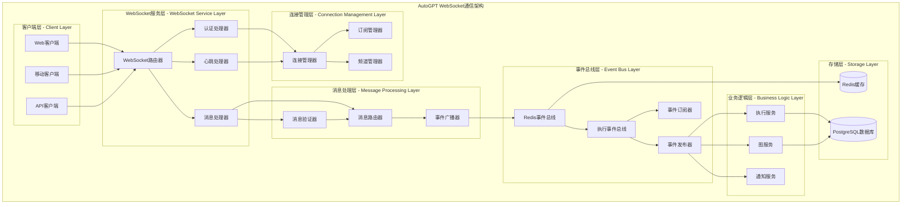
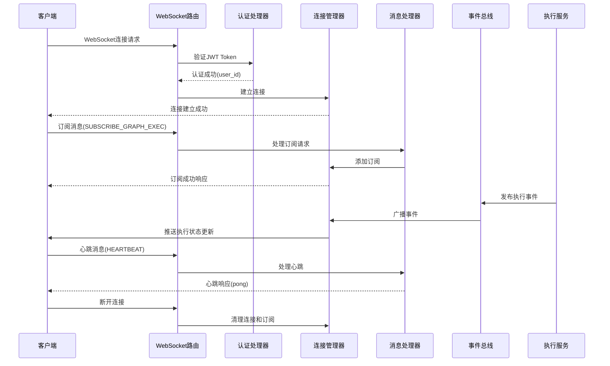

## 概述

AutoGPT WebSocket通信模块基于FastAPI WebSocket实现，提供平台的实时通信能力。模块采用事件驱动架构，支持图执行状态的实时推送、用户订阅管理、连接池管理和消息广播。通过Redis事件总线和连接管理器，实现了高效的多用户实时通信和状态同步。

<!--more-->

## 1. WebSocket通信整体架构

### 1.1 WebSocket设计原则

AutoGPT WebSocket模块遵循以下核心设计原则：

- **事件驱动**：基于事件的异步消息处理机制
- **订阅模式**：用户可订阅特定图或执行的状态更新
- **连接管理**：高效的WebSocket连接池和生命周期管理
- **消息路由**：基于频道的消息路由和广播机制
- **容错处理**：连接断开重连、消息重试和错误恢复

### 1.2 WebSocket通信架构图



**图1-1: AutoGPT WebSocket通信架构图**

此架构图展示了WebSocket通信模块的完整分层结构。客户端通过WebSocket连接到服务层，服务层处理认证和消息路由，连接管理层维护连接状态和订阅关系，消息处理层负责消息验证和事件广播，事件总线层提供分布式事件通信，业务逻辑层处理具体的业务事件。

### 1.3 WebSocket消息流程图



**图1-2: WebSocket消息流程图**

此时序图展示了WebSocket通信的完整流程，从连接建立、认证验证、订阅管理到事件推送和连接清理的全过程。

## 2. WebSocket服务器实现

### 2.1 WebSocket路由器

```python
# /autogpt_platform/backend/backend/server/ws_api.py

import asyncio
import logging
from contextlib import asynccontextmanager
from typing import Protocol

import pydantic
import uvicorn
from autogpt_libs.auth.jwt_utils import parse_jwt_token
from fastapi import Depends, FastAPI, WebSocket, WebSocketDisconnect
from starlette.middleware.cors import CORSMiddleware

from backend.data.execution import AsyncRedisExecutionEventBus
from backend.data.user import DEFAULT_USER_ID
from backend.monitoring.instrumentation import (
    instrument_fastapi,
    update_websocket_connections,
)
from backend.server.conn_manager import ConnectionManager
from backend.server.model import (
    WSMessage,
    WSMethod,
    WSSubscribeGraphExecutionRequest,
    WSSubscribeGraphExecutionsRequest,
)

logger = logging.getLogger(__name__)

@asynccontextmanager
async def lifespan(app: FastAPI):
    """
    FastAPI应用生命周期管理
    
    启动时创建事件广播器任务，关闭时清理资源
    """
    manager = get_connection_manager()
    # 启动事件广播器
    fut = asyncio.create_task(event_broadcaster(manager))
    fut.add_done_callback(lambda _: logger.info("Event broadcaster stopped"))
    yield
    # 应用关闭时自动清理

# 创建FastAPI应用
app = FastAPI(
    title="AutoGPT WebSocket API",
    description="实时通信和事件推送服务",
    version="1.0.0",
    lifespan=lifespan,
)

# 添加CORS中间件
app.add_middleware(
    CORSMiddleware,
    allow_origins=["*"],  # 生产环境应限制具体域名
    allow_credentials=True,
    allow_methods=["*"],
    allow_headers=["*"],
)

# 添加监控中间件
instrument_fastapi(app)

# 全局连接管理器实例
_connection_manager: ConnectionManager | None = None

def get_connection_manager() -> ConnectionManager:
    """
    获取连接管理器单例
    
    返回:
        ConnectionManager: 连接管理器实例
    """
    global _connection_manager
    if _connection_manager is None:
        _connection_manager = ConnectionManager()
    return _connection_manager

async def authenticate_websocket(websocket: WebSocket) -> str | None:
    """
    WebSocket连接认证
    
    从查询参数或头部提取JWT token并验证用户身份
    
    参数:
        websocket: WebSocket连接对象
        
    返回:
        str | None: 用户ID，认证失败返回None
    """
    try:
        # 从查询参数获取token
        token = websocket.query_params.get("token")
        if not token:
            # 从头部获取token
            auth_header = websocket.headers.get("authorization")
            if auth_header and auth_header.startswith("Bearer "):
                token = auth_header[7:]
        
        if not token:
            logger.warning("WebSocket connection without token")
            await websocket.close(code=4001, reason="Authentication required")
            return None
        
        # 验证JWT token
        payload = parse_jwt_token(token)
        user_id = payload.get("sub")
        
        if not user_id:
            logger.warning("WebSocket connection with invalid token")
            await websocket.close(code=4001, reason="Invalid token")
            return None
        
        logger.info(f"WebSocket authenticated for user: {user_id}")
        return user_id
        
    except Exception as e:
        logger.error(f"WebSocket authentication error: {e}")
        await websocket.close(code=4001, reason="Authentication failed")
        return None

@app.websocket("/ws")
async def websocket_router(
    websocket: WebSocket,
    manager: ConnectionManager = Depends(get_connection_manager)
):
    """
    WebSocket主路由处理器
    
    处理WebSocket连接的完整生命周期：

    1. 用户认证
    2. 连接建立
    3. 消息处理循环
    4. 连接清理
    
    参数:
        websocket: WebSocket连接对象
        manager: 连接管理器依赖注入
    """
    # 用户认证
    user_id = await authenticate_websocket(websocket)
    if not user_id:
        return
    
    # 建立连接
    await manager.connect_socket(websocket)
    
    # 更新连接统计
    update_websocket_connections(user_id, 1)
    
    try:
        # 消息处理循环
        while True:
            # 接收消息
            data = await websocket.receive_text()
            
            try:
                # 验证消息格式
                message = WSMessage.model_validate_json(data)
            except pydantic.ValidationError as e:
                logger.error(
                    "Invalid WebSocket message from user #%s: %s",
                    user_id,
                    e,
                )
                # 发送错误响应
                await websocket.send_text(
                    WSMessage(
                        method=WSMethod.ERROR,
                        success=False,
                        error="Invalid message format. Review the schema and retry",
                    ).model_dump_json()
                )
                continue
            
            try:
                # 处理消息
                if message.method in _MSG_HANDLERS:
                    await _MSG_HANDLERS[message.method](
                        connection_manager=manager,
                        websocket=websocket,
                        user_id=user_id,
                        message=message,
                    )
                    continue
            except pydantic.ValidationError as e:
                logger.error(
                    "Validation error while handling '%s' for user #%s: %s",
                    message.method.value,
                    user_id,
                    e,
                )
                await websocket.send_text(
                    WSMessage(
                        method=WSMethod.ERROR,
                        success=False,
                        error="Invalid message data. Refer to the API schema",
                    ).model_dump_json()
                )
                continue
            except Exception as e:
                logger.error(
                    f"Error while handling '{message.method.value}' message "
                    f"for user #{user_id}: {e}"
                )
                continue
            
            # 处理未知消息类型
            if message.method == WSMethod.ERROR:
                logger.error(f"WebSocket Error message received: {message.data}")
            else:
                logger.warning(
                    f"Unknown WebSocket message type {message.method} received: "
                    f"{message.data}"
                )
                await websocket.send_text(
                    WSMessage(
                        method=WSMethod.ERROR,
                        success=False,
                        error="Message type is not processed by the server",
                    ).model_dump_json()
                )
    
    except WebSocketDisconnect:
        # 正常断开连接
        manager.disconnect_socket(websocket)
        logger.debug("WebSocket client disconnected")
    finally:
        # 更新连接统计
        update_websocket_connections(user_id, -1)

@app.get("/")
async def health():
    """健康检查端点"""
    return {"status": "healthy"}
```

### 2.2 消息处理器

```python
# WebSocket消息处理器实现

from typing import Protocol
from backend.server.model import WSMessage, WSMethod

class WSMessageHandler(Protocol):
    """WebSocket消息处理器协议"""
    
    async def __call__(
        self,
        connection_manager: ConnectionManager,
        websocket: WebSocket,
        user_id: str,
        message: WSMessage,
    ) -> None:
        """处理WebSocket消息"""
        ...

async def handle_subscribe(
    connection_manager: ConnectionManager,
    websocket: WebSocket,
    user_id: str,
    message: WSMessage,
):
    """
    处理订阅请求
    
    支持两种订阅类型：

    1. 订阅特定图执行的状态更新
    2. 订阅特定图的所有执行状态更新
    
    参数:
        connection_manager: 连接管理器
        websocket: WebSocket连接
        user_id: 用户ID
        message: 订阅消息
    """
    try:
        if message.method == WSMethod.SUBSCRIBE_GRAPH_EXEC:
            # 订阅特定图执行
            request = WSSubscribeGraphExecutionRequest.model_validate(message.data)
            channel = await connection_manager.subscribe_graph_exec(
                user_id=user_id,
                graph_exec_id=request.graph_exec_id,
                websocket=websocket,
            )
            
            # 发送订阅成功响应
            await websocket.send_text(
                WSMessage(
                    method=WSMethod.SUBSCRIBE_GRAPH_EXEC,
                    channel=channel,
                    data={"graph_exec_id": request.graph_exec_id},
                    success=True,
                ).model_dump_json()
            )
            
        elif message.method == WSMethod.SUBSCRIBE_GRAPH_EXECS:
            # 订阅图的所有执行
            request = WSSubscribeGraphExecutionsRequest.model_validate(message.data)
            channel = await connection_manager.subscribe_graph_execs(
                user_id=user_id,
                graph_id=request.graph_id,
                websocket=websocket,
            )
            
            # 发送订阅成功响应
            await websocket.send_text(
                WSMessage(
                    method=WSMethod.SUBSCRIBE_GRAPH_EXECS,
                    channel=channel,
                    data={"graph_id": request.graph_id},
                    success=True,
                ).model_dump_json()
            )
            
    except Exception as e:
        logger.error(f"Error handling subscribe request: {e}")
        await websocket.send_text(
            WSMessage(
                method=WSMethod.ERROR,
                success=False,
                error=f"Subscription failed: {str(e)}",
            ).model_dump_json()
        )

async def handle_unsubscribe(
    connection_manager: ConnectionManager,
    websocket: WebSocket,
    user_id: str,
    message: WSMessage,
):
    """
    处理取消订阅请求
    
    参数:
        connection_manager: 连接管理器
        websocket: WebSocket连接
        user_id: 用户ID
        message: 取消订阅消息
    """
    try:
        # 解析取消订阅数据
        unsubscribe_data = message.data
        
        if "graph_exec_id" in unsubscribe_data:
            # 取消订阅特定图执行
            channel = await connection_manager.unsubscribe_graph_exec(
                user_id=user_id,
                graph_exec_id=unsubscribe_data["graph_exec_id"],
                websocket=websocket,
            )
        elif "graph_id" in unsubscribe_data:
            # 取消订阅图的所有执行
            channel = await connection_manager.unsubscribe_graph_execs(
                user_id=user_id,
                graph_id=unsubscribe_data["graph_id"],
                websocket=websocket,
            )
        else:
            raise ValueError("Invalid unsubscribe data")
        
        if channel:
            # 发送取消订阅成功响应
            await websocket.send_text(
                WSMessage(
                    method=WSMethod.UNSUBSCRIBE,
                    channel=channel,
                    data=unsubscribe_data,
                    success=True,
                ).model_dump_json()
            )
        else:
            # 订阅不存在
            await websocket.send_text(
                WSMessage(
                    method=WSMethod.ERROR,
                    success=False,
                    error="Subscription not found",
                ).model_dump_json()
            )
            
    except Exception as e:
        logger.error(f"Error handling unsubscribe request: {e}")
        await websocket.send_text(
            WSMessage(
                method=WSMethod.ERROR,
                success=False,
                error=f"Unsubscribe failed: {str(e)}",
            ).model_dump_json()
        )

async def handle_heartbeat(
    connection_manager: ConnectionManager,
    websocket: WebSocket,
    user_id: str,
    message: WSMessage,
):
    """
    处理心跳消息
    
    心跳机制用于：

    1. 保持连接活跃
    2. 检测连接状态
    3. 防止代理服务器超时断开连接
    
    参数:
        connection_manager: 连接管理器
        websocket: WebSocket连接
        user_id: 用户ID
        message: 心跳消息
    """
    # 发送心跳响应
    await websocket.send_text(
        WSMessage(
            method=WSMethod.HEARTBEAT,
            data="pong",
            success=True,
        ).model_dump_json()
    )

# 消息处理器映射
_MSG_HANDLERS: dict[WSMethod, WSMessageHandler] = {
    WSMethod.HEARTBEAT: handle_heartbeat,
    WSMethod.SUBSCRIBE_GRAPH_EXEC: handle_subscribe,
    WSMethod.SUBSCRIBE_GRAPH_EXECS: handle_subscribe,
    WSMethod.UNSUBSCRIBE: handle_unsubscribe,
}
```

## 3. 连接管理器实现

### 3.1 连接管理器核心功能

```python
# /autogpt_platform/backend/backend/server/conn_manager.py

from typing import Dict, Set
from fastapi import WebSocket

from backend.data.execution import (
    ExecutionEventType,
    GraphExecutionEvent,
    NodeExecutionEvent,
)
from backend.server.model import WSMessage, WSMethod

# 事件类型到WebSocket方法的映射
_EVENT_TYPE_TO_METHOD_MAP: dict[ExecutionEventType, WSMethod] = {
    ExecutionEventType.GRAPH_EXEC_UPDATE: WSMethod.GRAPH_EXECUTION_EVENT,
    ExecutionEventType.NODE_EXEC_UPDATE: WSMethod.NODE_EXECUTION_EVENT,
}

class ConnectionManager:
    """
    WebSocket连接管理器
    
    功能:

    1. 管理活跃的WebSocket连接
    2. 处理订阅和取消订阅
    3. 广播执行事件到订阅者
    4. 维护频道和连接的映射关系
    
    数据结构:
    - active_connections: 所有活跃的WebSocket连接集合
    - subscriptions: 频道到WebSocket连接的映射字典
    """
    
    def __init__(self):
        # 活跃连接集合
        self.active_connections: Set[WebSocket] = set()
        # 订阅映射：频道 -> WebSocket连接集合
        self.subscriptions: Dict[str, Set[WebSocket]] = {}
    
    async def connect_socket(self, websocket: WebSocket):
        """
        建立WebSocket连接
        
        参数:
            websocket: WebSocket连接对象
        """
        await websocket.accept()
        self.active_connections.add(websocket)
        logger.info(f"WebSocket connected. Total connections: {len(self.active_connections)}")
    
    def disconnect_socket(self, websocket: WebSocket):
        """
        断开WebSocket连接
        
        清理连接和相关的所有订阅
        
        参数:
            websocket: 要断开的WebSocket连接
        """
        # 从活跃连接中移除
        self.active_connections.discard(websocket)
        
        # 从所有订阅中移除
        for subscribers in self.subscriptions.values():
            subscribers.discard(websocket)
        
        # 清理空的订阅频道
        empty_channels = [
            channel for channel, subscribers in self.subscriptions.items()
            if not subscribers
        ]
        for channel in empty_channels:
            del self.subscriptions[channel]
        
        logger.info(f"WebSocket disconnected. Total connections: {len(self.active_connections)}")
    
    async def subscribe_graph_exec(
        self, *, user_id: str, graph_exec_id: str, websocket: WebSocket
    ) -> str:
        """
        订阅特定图执行的状态更新
        
        参数:
            user_id: 用户ID
            graph_exec_id: 图执行ID
            websocket: WebSocket连接
            
        返回:
            str: 订阅频道键
        """
        channel_key = _graph_exec_channel_key(user_id, graph_exec_id=graph_exec_id)
        return await self._subscribe(channel_key, websocket)
    
    async def subscribe_graph_execs(
        self, *, user_id: str, graph_id: str, websocket: WebSocket
    ) -> str:
        """
        订阅特定图的所有执行状态更新
        
        参数:
            user_id: 用户ID
            graph_id: 图ID
            websocket: WebSocket连接
            
        返回:
            str: 订阅频道键
        """
        channel_key = _graph_execs_channel_key(user_id, graph_id=graph_id)
        return await self._subscribe(channel_key, websocket)
    
    async def unsubscribe_graph_exec(
        self, *, user_id: str, graph_exec_id: str, websocket: WebSocket
    ) -> str | None:
        """
        取消订阅特定图执行
        
        参数:
            user_id: 用户ID
            graph_exec_id: 图执行ID
            websocket: WebSocket连接
            
        返回:
            str | None: 取消订阅的频道键，如果订阅不存在则返回None
        """
        channel_key = _graph_exec_channel_key(user_id, graph_exec_id=graph_exec_id)
        return await self._unsubscribe(channel_key, websocket)
    
    async def unsubscribe_graph_execs(
        self, *, user_id: str, graph_id: str, websocket: WebSocket
    ) -> str | None:
        """
        取消订阅特定图的所有执行
        
        参数:
            user_id: 用户ID
            graph_id: 图ID
            websocket: WebSocket连接
            
        返回:
            str | None: 取消订阅的频道键，如果订阅不存在则返回None
        """
        channel_key = _graph_execs_channel_key(user_id, graph_id=graph_id)
        return await self._unsubscribe(channel_key, websocket)
    
    async def send_execution_update(
        self, exec_event: GraphExecutionEvent | NodeExecutionEvent
    ) -> int:
        """
        发送执行更新事件到订阅者
        
        根据事件类型确定目标频道，并向所有订阅者广播事件
        
        参数:
            exec_event: 图执行事件或节点执行事件
            
        返回:
            int: 成功发送的消息数量
        """
        # 确定图执行ID
        graph_exec_id = (
            exec_event.id
            if isinstance(exec_event, GraphExecutionEvent)
            else exec_event.graph_exec_id
        )
        
        n_sent = 0
        
        # 确定目标频道
        channels: set[str] = {
            # 发送到特定图执行的订阅者
            _graph_exec_channel_key(exec_event.user_id, graph_exec_id=graph_exec_id)
        }
        
        if isinstance(exec_event, GraphExecutionEvent):
            # 如果是图执行事件，也发送到图的所有执行订阅者
            channels.add(
                _graph_execs_channel_key(
                    exec_event.user_id, graph_id=exec_event.graph_id
                )
            )
        
        # 向所有相关频道的订阅者发送消息
        for channel in channels.intersection(self.subscriptions.keys()):
            message = WSMessage(
                method=_EVENT_TYPE_TO_METHOD_MAP[exec_event.event_type],
                channel=channel,
                data=exec_event.model_dump(),
            ).model_dump_json()
            
            # 向频道的所有订阅者发送消息
            for connection in self.subscriptions[channel]:
                try:
                    await connection.send_text(message)
                    n_sent += 1
                except Exception as e:
                    logger.error(f"Failed to send message to WebSocket: {e}")
                    # 标记连接为待清理
                    self.active_connections.discard(connection)
        
        return n_sent
    
    async def _subscribe(self, channel_key: str, websocket: WebSocket) -> str:
        """
        内部订阅方法
        
        参数:
            channel_key: 频道键
            websocket: WebSocket连接
            
        返回:
            str: 频道键
        """
        if channel_key not in self.subscriptions:
            self.subscriptions[channel_key] = set()
        
        self.subscriptions[channel_key].add(websocket)
        logger.debug(f"Subscribed to channel: {channel_key}")
        return channel_key
    
    async def _unsubscribe(self, channel_key: str, websocket: WebSocket) -> str | None:
        """
        内部取消订阅方法
        
        参数:
            channel_key: 频道键
            websocket: WebSocket连接
            
        返回:
            str | None: 频道键，如果订阅不存在则返回None
        """
        if channel_key in self.subscriptions:
            self.subscriptions[channel_key].discard(websocket)
            
            # 如果频道没有订阅者了，删除频道
            if not self.subscriptions[channel_key]:
                del self.subscriptions[channel_key]
            
            logger.debug(f"Unsubscribed from channel: {channel_key}")
            return channel_key
        
        return None
    
    def get_connection_stats(self) -> dict:
        """
        获取连接统计信息
        
        返回:
            dict: 包含连接和订阅统计的字典
        """
        return {
            "active_connections": len(self.active_connections),
            "total_subscriptions": sum(len(subs) for subs in self.subscriptions.values()),
            "channels": len(self.subscriptions),
            "channels_detail": {
                channel: len(subs)
                for channel, subs in self.subscriptions.items()
            }
        }

def _graph_exec_channel_key(user_id: str, *, graph_exec_id: str) -> str:
    """
    生成图执行频道键
    
    参数:
        user_id: 用户ID
        graph_exec_id: 图执行ID
        
    返回:
        str: 频道键
    """
    return f"{user_id}|graph_exec#{graph_exec_id}"

def _graph_execs_channel_key(user_id: str, *, graph_id: str) -> str:
    """
    生成图执行集合频道键
    
    参数:
        user_id: 用户ID
        graph_id: 图ID
        
    返回:
        str: 频道键
    """
    return f"{user_id}|graph_execs#{graph_id}"
```

## 4. WebSocket消息模型

### 4.1 消息结构定义

```python
# /autogpt_platform/backend/backend/server/model.py

import enum
from typing import Any, Optional
import pydantic

class WSMethod(enum.Enum):
    """
    WebSocket消息方法枚举
    
    定义了所有支持的WebSocket消息类型
    """
    # 基础消息类型
    ERROR = "error"
    HEARTBEAT = "heartbeat"
    
    # 订阅相关消息
    SUBSCRIBE_GRAPH_EXEC = "subscribe_graph_exec"
    SUBSCRIBE_GRAPH_EXECS = "subscribe_graph_execs"
    UNSUBSCRIBE = "unsubscribe"
    
    # 事件推送消息
    GRAPH_EXECUTION_EVENT = "graph_execution_event"
    NODE_EXECUTION_EVENT = "node_execution_event"

class WSMessage(pydantic.BaseModel):
    """
    WebSocket消息基础模型
    
    所有WebSocket消息都使用此统一格式
    
    字段说明:

    - method: 消息方法类型
    - channel: 消息频道（可选）
    - data: 消息数据载荷
    - success: 操作是否成功（响应消息使用）
    - error: 错误信息（错误响应使用）
    """
    
    method: WSMethod = pydantic.Field(..., description="消息方法")
    channel: Optional[str] = pydantic.Field(None, description="消息频道")
    data: Any = pydantic.Field(None, description="消息数据")
    success: bool = pydantic.Field(default=True, description="操作是否成功")
    error: Optional[str] = pydantic.Field(None, description="错误信息")
    
    def model_dump_json(self, **kwargs) -> str:
        """
        序列化为JSON字符串
        
        过滤掉None值以减少消息大小
        """
        return super().model_dump_json(exclude_none=True, **kwargs)

class WSSubscribeGraphExecutionRequest(pydantic.BaseModel):
    """
    订阅图执行请求模型
    
    用于订阅特定图执行的状态更新
    """
    
    graph_exec_id: str = pydantic.Field(
        ...,
        description="要订阅的图执行ID"
    )

class WSSubscribeGraphExecutionsRequest(pydantic.BaseModel):
    """
    订阅图执行集合请求模型
    
    用于订阅特定图的所有执行状态更新
    """
    
    graph_id: str = pydantic.Field(
        ...,
        description="要订阅的图ID"
    )

class WSUnsubscribeRequest(pydantic.BaseModel):
    """
    取消订阅请求模型
    
    用于取消特定的订阅
    """
    
    graph_exec_id: Optional[str] = pydantic.Field(
        None,
        description="要取消订阅的图执行ID"
    )
    graph_id: Optional[str] = pydantic.Field(
        None,
        description="要取消订阅的图ID"
    )
    
    @pydantic.model_validator(mode='after')
    def validate_request(self):
        """验证至少提供一个ID"""
        if not self.graph_exec_id and not self.graph_id:
            raise ValueError("Must provide either graph_exec_id or graph_id")
        return self

class WSHeartbeatRequest(pydantic.BaseModel):
    """
    心跳请求模型
    
    用于保持连接活跃
    """
    
    timestamp: Optional[float] = pydantic.Field(
        None,
        description="客户端时间戳"
    )

class WSErrorResponse(pydantic.BaseModel):
    """
    错误响应模型
    
    用于返回错误信息
    """
    
    error_code: str = pydantic.Field(..., description="错误代码")
    error_message: str = pydantic.Field(..., description="错误消息")
    details: Optional[dict] = pydantic.Field(None, description="错误详情")
```

### 4.2 消息验证与路由

```python
class MessageValidator:
    """
    WebSocket消息验证器
    
    负责验证消息格式和内容的正确性
    """
    
    @staticmethod
    def validate_message(data: str) -> WSMessage:
        """
        验证WebSocket消息
        
        参数:
            data: JSON格式的消息字符串
            
        返回:
            WSMessage: 验证后的消息对象
            
        异常:
            ValidationError: 消息格式无效时抛出
        """
        try:
            return WSMessage.model_validate_json(data)
        except pydantic.ValidationError as e:
            logger.error(f"Message validation failed: {e}")
            raise
    
    @staticmethod
    def validate_subscribe_request(message: WSMessage) -> bool:
        """
        验证订阅请求
        
        参数:
            message: WebSocket消息
            
        返回:
            bool: 验证是否通过
        """
        try:
            if message.method == WSMethod.SUBSCRIBE_GRAPH_EXEC:
                WSSubscribeGraphExecutionRequest.model_validate(message.data)
            elif message.method == WSMethod.SUBSCRIBE_GRAPH_EXECS:
                WSSubscribeGraphExecutionsRequest.model_validate(message.data)
            else:
                return False
            return True
        except pydantic.ValidationError:
            return False

class MessageRouter:
    """
    WebSocket消息路由器
    
    根据消息类型路由到相应的处理器
    """
    
    def __init__(self, connection_manager: ConnectionManager):
        self.connection_manager = connection_manager
        self.handlers = {
            WSMethod.HEARTBEAT: self._handle_heartbeat,
            WSMethod.SUBSCRIBE_GRAPH_EXEC: self._handle_subscribe,
            WSMethod.SUBSCRIBE_GRAPH_EXECS: self._handle_subscribe,
            WSMethod.UNSUBSCRIBE: self._handle_unsubscribe,
        }
    
    async def route_message(
        self,
        websocket: WebSocket,
        user_id: str,
        message: WSMessage
    ):
        """
        路由消息到相应的处理器
        
        参数:
            websocket: WebSocket连接
            user_id: 用户ID
            message: 要路由的消息
        """
        handler = self.handlers.get(message.method)
        if handler:
            await handler(websocket, user_id, message)
        else:
            await self._handle_unknown_method(websocket, message)
    
    async def _handle_heartbeat(
        self,
        websocket: WebSocket,
        user_id: str,
        message: WSMessage
    ):
        """处理心跳消息"""
        await websocket.send_text(
            WSMessage(
                method=WSMethod.HEARTBEAT,
                data="pong",
                success=True,
            ).model_dump_json()
        )
    
    async def _handle_subscribe(
        self,
        websocket: WebSocket,
        user_id: str,
        message: WSMessage
    ):
        """处理订阅消息"""
        # 实现订阅逻辑
        pass
    
    async def _handle_unsubscribe(
        self,
        websocket: WebSocket,
        user_id: str,
        message: WSMessage
    ):
        """处理取消订阅消息"""
        # 实现取消订阅逻辑
        pass
    
    async def _handle_unknown_method(
        self,
        websocket: WebSocket,
        message: WSMessage
    ):
        """处理未知消息类型"""
        await websocket.send_text(
            WSMessage(
                method=WSMethod.ERROR,
                success=False,
                error=f"Unknown message method: {message.method}",
            ).model_dump_json()
        )
```

## 5. 事件广播系统

### 5.1 事件广播器

```python
# 事件广播器实现

async def event_broadcaster(connection_manager: ConnectionManager):
    """
    事件广播器
    
    从Redis事件总线接收执行事件，并广播到相关的WebSocket订阅者
    
    功能:

    1. 监听Redis事件总线
    2. 解析执行事件
    3. 广播到WebSocket订阅者
    4. 处理广播错误和重试
    
    参数:
        connection_manager: 连接管理器实例
    """
    logger.info("Starting event broadcaster")
    
    # 创建Redis事件总线
    event_bus = AsyncRedisExecutionEventBus()
    
    try:
        # 连接到Redis
        await event_bus.connect()
        logger.info("Connected to Redis event bus")
        
        # 监听执行事件
        async for event in event_bus.listen():
            try:
                # 广播事件到WebSocket订阅者
                sent_count = await connection_manager.send_execution_update(event)
                
                if sent_count > 0:
                    logger.debug(
                        f"Broadcasted {event.event_type} event to {sent_count} subscribers"
                    )
                
            except Exception as e:
                logger.error(f"Error broadcasting event: {e}")
                # 继续处理下一个事件，不中断广播器
                continue
                
    except Exception as e:
        logger.error(f"Event broadcaster error: {e}")
        # 尝试重新连接
        await asyncio.sleep(5)
        # 递归重启广播器
        await event_broadcaster(connection_manager)
    
    finally:
        # 清理资源
        await event_bus.disconnect()
        logger.info("Event broadcaster stopped")

class EventBroadcastManager:
    """
    事件广播管理器
    
    管理事件广播器的生命周期和错误恢复
    """
    
    def __init__(self, connection_manager: ConnectionManager):
        self.connection_manager = connection_manager
        self.broadcaster_task: Optional[asyncio.Task] = None
        self.is_running = False
    
    async def start(self):
        """启动事件广播器"""
        if self.is_running:
            return
        
        self.is_running = True
        self.broadcaster_task = asyncio.create_task(
            self._run_broadcaster_with_retry()
        )
        logger.info("Event broadcast manager started")
    
    async def stop(self):
        """停止事件广播器"""
        self.is_running = False
        
        if self.broadcaster_task:
            self.broadcaster_task.cancel()
            try:
                await self.broadcaster_task
            except asyncio.CancelledError:
                pass
        
        logger.info("Event broadcast manager stopped")
    
    async def _run_broadcaster_with_retry(self):
        """
        带重试机制的事件广播器运行器
        
        在广播器异常退出时自动重启
        """
        retry_count = 0
        max_retries = 10
        base_delay = 1
        
        while self.is_running and retry_count < max_retries:
            try:
                await event_broadcaster(self.connection_manager)
                # 正常退出，重置重试计数
                retry_count = 0
                
            except Exception as e:
                retry_count += 1
                delay = min(base_delay * (2 ** retry_count), 60)  # 指数退避，最大60秒
                
                logger.error(
                    f"Event broadcaster failed (attempt {retry_count}/{max_retries}): {e}"
                )
                
                if retry_count < max_retries:
                    logger.info(f"Retrying in {delay} seconds...")
                    await asyncio.sleep(delay)
                else:
                    logger.error("Max retries reached, stopping event broadcaster")
                    break
        
        self.is_running = False
```

### 5.2 Redis事件总线集成

```python
# Redis事件总线集成

from backend.data.execution import AsyncRedisExecutionEventBus

class WebSocketEventBridge:
    """
    WebSocket事件桥接器
    
    连接Redis事件总线和WebSocket连接管理器
    """
    
    def __init__(self, connection_manager: ConnectionManager):
        self.connection_manager = connection_manager
        self.event_bus = AsyncRedisExecutionEventBus()
        self.is_connected = False
    
    async def connect(self):
        """连接到Redis事件总线"""
        if not self.is_connected:
            await self.event_bus.connect()
            self.is_connected = True
            logger.info("WebSocket event bridge connected to Redis")
    
    async def disconnect(self):
        """断开Redis事件总线连接"""
        if self.is_connected:
            await self.event_bus.disconnect()
            self.is_connected = False
            logger.info("WebSocket event bridge disconnected from Redis")
    
    async def start_listening(self):
        """
        开始监听事件并广播
        
        这是一个长期运行的协程，会持续监听Redis事件
        """
        if not self.is_connected:
            await self.connect()
        
        logger.info("Starting to listen for execution events")
        
        try:
            async for event in self.event_bus.listen():
                # 广播事件到WebSocket订阅者
                await self._broadcast_event(event)
                
        except Exception as e:
            logger.error(f"Error in event listening loop: {e}")
            raise
    
    async def _broadcast_event(self, event):
        """
        广播事件到WebSocket订阅者
        
        参数:
            event: 执行事件对象
        """
        try:
            sent_count = await self.connection_manager.send_execution_update(event)
            
            if sent_count > 0:
                logger.debug(
                    f"Event {event.event_type} for {event.id} "
                    f"sent to {sent_count} subscribers"
                )
            
        except Exception as e:
            logger.error(f"Failed to broadcast event {event.id}: {e}")
            # 不重新抛出异常，避免中断事件监听循环
```

## 6. WebSocket客户端示例

### 6.1 JavaScript客户端

```javascript
// WebSocket客户端实现示例

class AutoGPTWebSocketClient {
    constructor(wsUrl, token) {
        this.wsUrl = wsUrl;
        this.token = token;
        this.ws = null;
        this.subscriptions = new Map();
        this.heartbeatInterval = null;
        this.reconnectAttempts = 0;
        this.maxReconnectAttempts = 5;
        this.reconnectDelay = 1000;
    }
    
    /**

     * 连接到WebSocket服务器
     */
    async connect() {
        try {
            const wsUrlWithToken = `${this.wsUrl}?token=${this.token}`;
            this.ws = new WebSocket(wsUrlWithToken);
            
            this.ws.onopen = this.onOpen.bind(this);
            this.ws.onmessage = this.onMessage.bind(this);
            this.ws.onclose = this.onClose.bind(this);
            this.ws.onerror = this.onError.bind(this);
            
            return new Promise((resolve, reject) => {
                this.ws.onopen = () => {
                    this.onOpen();
                    resolve();
                };
                this.ws.onerror = (error) => {
                    this.onError(error);
                    reject(error);
                };
            });
            
        } catch (error) {
            console.error('WebSocket connection failed:', error);
            throw error;
        }
    }
    
    /**
     * 连接打开事件处理
     */
    onOpen() {
        console.log('WebSocket connected');
        this.reconnectAttempts = 0;
        this.startHeartbeat();
    }
    
    /**
     * 消息接收事件处理
     */
    onMessage(event) {
        try {
            const message = JSON.parse(event.data);
            this.handleMessage(message);
        } catch (error) {
            console.error('Failed to parse WebSocket message:', error);
        }
    }
    
    /**
     * 连接关闭事件处理
     */
    onClose(event) {
        console.log('WebSocket disconnected:', event.code, event.reason);
        this.stopHeartbeat();
        
        // 尝试重连
        if (this.reconnectAttempts < this.maxReconnectAttempts) {
            this.reconnectAttempts++;
            const delay = this.reconnectDelay * Math.pow(2, this.reconnectAttempts - 1);
            
            console.log(`Attempting to reconnect in ${delay}ms (attempt ${this.reconnectAttempts})`);
            setTimeout(() => this.connect(), delay);
        }
    }
    
    /**
     * 错误事件处理
     */
    onError(error) {
        console.error('WebSocket error:', error);
    }
    
    /**
     * 处理接收到的消息
     */
    handleMessage(message) {
        switch (message.method) {
            case 'heartbeat':
                // 心跳响应，无需处理
                break;
                
            case 'graph_execution_event':
                this.handleExecutionEvent(message);
                break;
                
            case 'node_execution_event':
                this.handleNodeEvent(message);
                break;
                
            case 'error':
                console.error('WebSocket error message:', message.error);
                break;
                
            default:
                console.warn('Unknown message method:', message.method);
        }
    }
    
    /**
     * 处理图执行事件
     */
    handleExecutionEvent(message) {
        const event = message.data;
        const callback = this.subscriptions.get(`graph_exec_${event.id}`);
        
        if (callback) {
            callback(event);
        }
    }
    
    /**
     * 处理节点执行事件
     */
    handleNodeEvent(message) {
        const event = message.data;
        const callback = this.subscriptions.get(`node_exec_${event.id}`);
        
        if (callback) {
            callback(event);
        }
    }
    
    /**
     * 订阅图执行状态更新
     */
    subscribeGraphExecution(graphExecId, callback) {
        const message = {
            method: 'subscribe_graph_exec',
            data: {
                graph_exec_id: graphExecId
            }
        };
        
        this.send(message);
        this.subscriptions.set(`graph_exec_${graphExecId}`, callback);
    }
    
    /**
     * 订阅图的所有执行状态更新
     */
    subscribeGraphExecutions(graphId, callback) {
        const message = {
            method: 'subscribe_graph_execs',
            data: {
                graph_id: graphId
            }
        };
        
        this.send(message);
        this.subscriptions.set(`graph_execs_${graphId}`, callback);
    }
    
    /**
     * 取消订阅
     */
    unsubscribe(subscriptionKey) {
        const [type, id] = subscriptionKey.split('_', 2);
        
        const message = {
            method: 'unsubscribe',
            data: type === 'graph_exec'
                ? { graph_exec_id: id }
                : { graph_id: id }
        };
        
        this.send(message);
        this.subscriptions.delete(subscriptionKey);
    }
    
    /**
     * 发送消息
     */
    send(message) {
        if (this.ws && this.ws.readyState === WebSocket.OPEN) {
            this.ws.send(JSON.stringify(message));
        } else {
            console.error('WebSocket is not connected');
        }
    }
    
    /**
     * 启动心跳
     */
    startHeartbeat() {
        this.heartbeatInterval = setInterval(() => {
            this.send({
                method: 'heartbeat',
                data: { timestamp: Date.now() }
            });
        }, 30000); // 30秒心跳间隔
    }
    
    /**
     * 停止心跳
     */
    stopHeartbeat() {
        if (this.heartbeatInterval) {
            clearInterval(this.heartbeatInterval);
            this.heartbeatInterval = null;
        }
    }
    
    /**
     * 断开连接
     */
    disconnect() {
        this.stopHeartbeat();
        
        if (this.ws) {
            this.ws.close();
            this.ws = null;
        }
        
        this.subscriptions.clear();
    }

}

// 使用示例
const client = new AutoGPTWebSocketClient('ws://localhost:8000/ws', 'your-jwt-token');

// 连接
await client.connect();

// 订阅图执行状态
client.subscribeGraphExecution('graph-exec-id', (event) => {
    console.log('Graph execution update:', event);
});

// 订阅图的所有执行
client.subscribeGraphExecutions('graph-id', (event) => {
    console.log('Graph executions update:', event);
});
```

## 7. 监控与性能优化

### 7.1 WebSocket监控指标

```python
# WebSocket监控指标收集

from prometheus_client import Counter, Gauge, Histogram
import time

# 监控指标定义
websocket_connections_total = Gauge(
    'websocket_connections_total',
    'Total number of active WebSocket connections'
)

websocket_messages_total = Counter(
    'websocket_messages_total',
    'Total number of WebSocket messages processed',
    ['method', 'status']
)

websocket_message_duration = Histogram(
    'websocket_message_duration_seconds',
    'Time spent processing WebSocket messages',
    ['method']
)

websocket_subscriptions_total = Gauge(
    'websocket_subscriptions_total',
    'Total number of active subscriptions'
)

websocket_broadcast_messages_total = Counter(
    'websocket_broadcast_messages_total',
    'Total number of broadcast messages sent'
)

class WebSocketMetrics:
    """WebSocket监控指标收集器"""
    
    @staticmethod
    def record_connection(delta: int):
        """记录连接数变化"""
        websocket_connections_total.inc(delta)
    
    @staticmethod
    def record_message(method: str, status: str = 'success'):
        """记录消息处理"""
        websocket_messages_total.labels(method=method, status=status).inc()
    
    @staticmethod
    def record_message_duration(method: str, duration: float):
        """记录消息处理时间"""
        websocket_message_duration.labels(method=method).observe(duration)
    
    @staticmethod
    def record_subscription_change(delta: int):
        """记录订阅数变化"""
        websocket_subscriptions_total.inc(delta)
    
    @staticmethod
    def record_broadcast(count: int):
        """记录广播消息数量"""
        websocket_broadcast_messages_total.inc(count)

# 在消息处理器中使用监控
async def monitored_handle_subscribe(
    connection_manager: ConnectionManager,
    websocket: WebSocket,
    user_id: str,
    message: WSMessage,
):
    """带监控的订阅处理器"""
    start_time = time.time()
    
    try:
        await handle_subscribe(connection_manager, websocket, user_id, message)
        WebSocketMetrics.record_message(message.method.value, 'success')
        WebSocketMetrics.record_subscription_change(1)
        
    except Exception as e:
        WebSocketMetrics.record_message(message.method.value, 'error')
        raise
    
    finally:
        duration = time.time() - start_time
        WebSocketMetrics.record_message_duration(message.method.value, duration)
```

### 7.2 性能优化策略

```python
# WebSocket性能优化

class OptimizedConnectionManager(ConnectionManager):
    """优化的连接管理器"""
    
    def __init__(self):
        super().__init__()
        # 使用更高效的数据结构
        self.user_connections: Dict[str, Set[WebSocket]] = {}
        self.connection_users: Dict[WebSocket, str] = {}
        
        # 批量广播缓冲区
        self.broadcast_buffer: List[tuple] = []
        self.batch_size = 100
        self.batch_timeout = 0.1  # 100ms
        
        # 启动批量处理任务
        asyncio.create_task(self._batch_broadcast_worker())
    
    async def connect_socket(self, websocket: WebSocket, user_id: str):
        """优化的连接建立"""
        await super().connect_socket(websocket)
        
        # 维护用户连接映射
        if user_id not in self.user_connections:
            self.user_connections[user_id] = set()
        
        self.user_connections[user_id].add(websocket)
        self.connection_users[websocket] = user_id
    
    def disconnect_socket(self, websocket: WebSocket):
        """优化的连接断开"""
        # 清理用户连接映射
        user_id = self.connection_users.pop(websocket, None)
        if user_id and user_id in self.user_connections:
            self.user_connections[user_id].discard(websocket)
            if not self.user_connections[user_id]:
                del self.user_connections[user_id]
        
        super().disconnect_socket(websocket)
    
    async def send_execution_update_batch(
        self,
        events: List[GraphExecutionEvent | NodeExecutionEvent]
    ) -> int:
        """批量发送执行更新"""
        # 将事件添加到批量处理缓冲区
        for event in events:
            self.broadcast_buffer.append(('execution_update', event))
        
        # 如果缓冲区满了，立即处理
        if len(self.broadcast_buffer) >= self.batch_size:
            return await self._flush_broadcast_buffer()
        
        return 0
    
    async def _batch_broadcast_worker(self):
        """批量广播工作器"""
        while True:
            await asyncio.sleep(self.batch_timeout)
            if self.broadcast_buffer:
                await self._flush_broadcast_buffer()
    
    async def _flush_broadcast_buffer(self) -> int:
        """刷新广播缓冲区"""
        if not self.broadcast_buffer:
            return 0
        
        # 按频道分组消息
        channel_messages: Dict[str, List] = {}
        
        for msg_type, event in self.broadcast_buffer:
            if msg_type == 'execution_update':
                channels = self._get_event_channels(event)
                for channel in channels:
                    if channel not in channel_messages:
                        channel_messages[channel] = []
                    channel_messages[channel].append(event)
        
        # 批量发送消息
        total_sent = 0
        for channel, events in channel_messages.items():
            if channel in self.subscriptions:
                # 合并相同类型的事件
                merged_events = self._merge_events(events)
                
                for event in merged_events:
                    message = WSMessage(
                        method=_EVENT_TYPE_TO_METHOD_MAP[event.event_type],
                        channel=channel,
                        data=event.model_dump(),
                    ).model_dump_json()
                    
                    # 并发发送到所有订阅者
                    send_tasks = [
                        self._safe_send(conn, message)
                        for conn in self.subscriptions[channel]
                    ]
                    
                    results = await asyncio.gather(*send_tasks, return_exceptions=True)
                    total_sent += sum(1 for r in results if r is True)
        
        # 清空缓冲区
        self.broadcast_buffer.clear()
        return total_sent
    
    async def _safe_send(self, websocket: WebSocket, message: str) -> bool:
        """安全发送消息"""
        try:
            await websocket.send_text(message)
            return True
        except Exception as e:
            logger.error(f"Failed to send WebSocket message: {e}")
            # 标记连接为无效
            self.active_connections.discard(websocket)
            return False
    
    def _merge_events(self, events: List) -> List:
        """合并相同执行的事件，只保留最新状态"""
        event_map = {}
        
        for event in events:
            key = f"{event.id}_{event.event_type}"
            # 保留最新的事件
            if key not in event_map or event.timestamp > event_map[key].timestamp:
                event_map[key] = event
        
        return list(event_map.values())
```

## 总结

AutoGPT WebSocket通信模块通过精心设计的事件驱动架构和高效的连接管理机制，为平台提供了可靠的实时通信能力。核心优势包括：

1. **事件驱动架构**：基于Redis事件总线的分布式事件通信
2. **高效连接管理**：支持大量并发连接和订阅管理
3. **消息路由机制**：基于频道的精确消息路由和广播
4. **容错处理能力**：连接断开重连、消息重试和错误恢复
5. **性能优化策略**：批量处理、连接池优化和监控指标
6. **标准化消息格式**：统一的消息结构和验证机制

通过这些设计和实现，AutoGPT WebSocket模块为用户提供了流畅的实时体验，支持图执行状态的实时监控和多用户协作功能。

---
