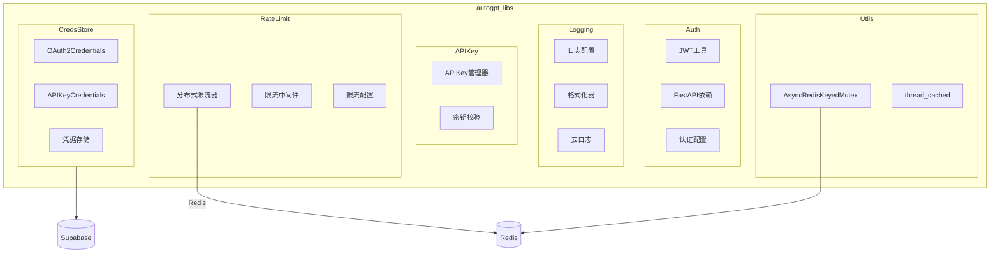

## 概述

`autogpt_libs` 为平台提供跨服务的基础能力：认证鉴权、结构化日志、分布式限流、API密钥管理、同步与缓存工具、以及集成凭据存储。该库以模块化与配置化为核心，面向生产环境的可观测性与可靠性而设计。

<!--more-->

## 1. 共享库整体架构



### 1.1 端到端时序（请求→限流→鉴权→路由→日志）

```mermaid
sequenceDiagram
  participant C as Client
  participant AS as ASGI/FastAPI
  participant RL as RateLimit MW
  participant AU as Auth Dep
  participant H as Route Handler
  participant LG as Logging

  C->>AS: HTTP Request
  AS->>RL: process(request)
  alt Not limited
    RL-->>AS: pass (+X-RateLimit-*)
  else Limited
    RL-->>C: 429 Too Many Requests
    return
  end
  AS->>AU: Security(get_jwt_payload)
  AU->>AU: parse_jwt_token / verify_user
  AU-->>AS: User
  AS->>H: call(user)
  H->>LG: structured log
  LG-->>H: sink (console/file/cloud)
  H-->>C: 2xx/4xx
```

## 2. 认证模块（auth）

### 2.1 关键函数

```python
# autogpt_libs/auth/jwt_utils.py（核心逻辑摘录）
from fastapi import HTTPException, Security
from fastapi.security import HTTPAuthorizationCredentials, HTTPBearer
import jwt

bearer_jwt_auth = HTTPBearer(bearerFormat="jwt", scheme_name="HTTPBearerJWT", auto_error=False)

def get_jwt_payload(credentials: HTTPAuthorizationCredentials | None = Security(bearer_jwt_auth)) -> dict:
    if not credentials:
        raise HTTPException(status_code=401, detail="Authorization header is missing")
    try:
        return parse_jwt_token(credentials.credentials)
    except ValueError as e:
        raise HTTPException(status_code=401, detail=str(e))

def parse_jwt_token(token: str) -> dict:
    settings = get_settings()
    try:
        return jwt.decode(token, settings.JWT_VERIFY_KEY, algorithms=[settings.JWT_ALGORITHM], audience="authenticated")
    except jwt.ExpiredSignatureError:
        raise ValueError("Token has expired")
    except jwt.InvalidSignatureError:
        raise ValueError("Invalid token signature")
```

### 2.2 设计要点

- HTTPBearer 设置 `auto_error=False`，配合 OpenAPI 注入 401 响应，避免 403/401 失配。
- 分离普通用户与管理员校验，降低权限判断耦合。
- 全链路记录关键字段，便于追踪令牌问题与角色漂移。

## 3. 分布式限流模块（rate_limit）

### 3.1 滑动时间窗（Redis ZSET）

```python
# 伪代码示意（保留关键路径）
async def check_rate_limit(redis, key: str, window_s: int, limit: int) -> tuple[bool, dict]:
    now_ms = int(time.time() * 1000)
    pipeline = redis.pipeline()
    pipeline.zremrangebyscore(key, 0, now_ms - window_s * 1000)
    pipeline.zadd(key, {str(now_ms): now_ms})
    pipeline.zcount(key, now_ms - window_s * 1000, now_ms)
    pipeline.expire(key, window_s)
    _, _, count, _ = await pipeline.execute()
    limited = count > limit
    headers = {"X-RateLimit-Limit": str(limit), "X-RateLimit-Count": str(count)}
    return limited, headers
```

### 3.2 中间件集成

- 请求进入后提取限流键（优先用户ID/令牌指纹，退化为IP）。
- 原子管道清理+计数+过期，返回429并附带 `X-RateLimit-*` 头。

## 4. 结构化日志模块（logging）

```python
# 日志初始化要点（简化）
def configure_logging(settings) -> None:
    handlers = [StreamHandler()]
    if settings.enable_file_logging:
        handlers.append(FileHandler(settings.log_file))
    if settings.enable_cloud_logging:
        handlers.append(GCloudHandler(project=settings.project))
    logging.basicConfig(level=settings.log_level, handlers=handlers, format='{"ts":"%(asctime)s","lvl":"%(levelname)s","msg":"%(message)s"}')
```

要点：统一JSON格式；控制台/文件/云多路复用；按环境切换级别与采样；对PII字段做脱敏。

## 5. API密钥模块（api_key）

```python
# 关键路径：只保存哈希，校验走同一哈希算法
class APIKeyManager:
    def generate(self) -> tuple[str, str]:  # (raw, hash)
        raw = secrets.token_urlsafe(32)
        hashed = hashlib.sha256(raw.encode()).hexdigest()
        return raw, hashed
    def verify(self, raw: str, hashed: str) -> bool:
        return hashlib.sha256(raw.encode()).hexdigest() == hashed
```

要点：最小暴露原则；持久化仅存 hash；展示时使用 `****` 脱敏；分环境限权与配额。

## 6. 工具模块（utils）

### 6.1 Redis分布式锁

```python
class AsyncRedisKeyedMutex:
    def __init__(self, redis, key: str, ttl_ms: int = 30000):
        self.redis, self.key, self.ttl_ms = redis, f"lock:{key}", ttl_ms
    async def __aenter__(self):
        while True:
            if await self.redis.set(self.key, "1", nx=True, px=self.ttl_ms):
                return self
            await asyncio.sleep(0.01)
    async def __aexit__(self, *_):
        await self.redis.delete(self.key)
```

### 6.2 线程级缓存

```python
def thread_cached(func):
    cache = {}
    @functools.wraps(func)
    def wrapper(*args, **kwargs):
        key = (args, tuple(sorted(kwargs.items())))
        if key not in cache:
            cache[key] = func(*args, **kwargs)
        return cache[key]
    return wrapper
```

## 7. 凭据存储（credentials store）

```python
# 统一凭据模型（摘录）
class OAuth2Credentials(BaseModel):
    provider: str
    access_token: SecretStr
    refresh_token: SecretStr | None = None
    access_token_expires_at: int | None = None
    scopes: list[str] = []
    def bearer(self) -> dict:
        return {"Authorization": f"Bearer {self.access_token.get_secret_value()}"}

class APIKeyCredentials(BaseModel):
    provider: str
    api_key: SecretStr
    def bearer(self) -> dict:
        return {"Authorization": f"Bearer {self.api_key.get_secret_value()}"}
```

要点：

- 统一 `bearer()` 适配上层调用；按提供商隔离；凭据只在受限上下文解密。
- 后端存储支持加密与过期策略；提供刷新/撤销与使用统计钩子。

## 8. 异常/回退与性能要点

- 认证失败一律 401，最小信息泄漏；内部异常统一 500。
- 限流与锁均为“快速失败”，必要时返回 `Retry-After` 建议。
- 日志采样与异步落盘，避免尾延迟放大；关键路径仅保留必要字段。
- Redis/数据库故障的降级路径与短期熔断，防雪崩。

## 总结

`autogpt_libs` 以“可观测、可控、可扩展”为目标，为平台提供认证、限流、日志与工具基座：

1. 统一认证栈与最小暴露的API Key策略
2. 基于Redis的滑窗限流与分布式互斥
3. 标准化结构化日志，多目的地落盘
4. 线程缓存与凭据存储，兼顾性能与安全

通过这些工程化实践，平台接口具备可预期的性能与稳健性，满足生产环境的安全与合规要求。

---

## 补充：关键实现片段与时序（合并自共享库深度剖析）

### 认证依赖与OpenAPI 401 注入

```python
bearer_jwt_auth = HTTPBearer(bearerFormat='jwt', scheme_name='HTTPBearerJWT', auto_error=False)
def get_jwt_payload(credentials: HTTPAuthorizationCredentials | None = Security(bearer_jwt_auth)) -> dict:
  if not credentials: raise HTTPException(status_code=401, detail='Authorization header is missing')
  return parse_jwt_token(credentials.credentials)

def add_auth_responses_to_openapi(app: FastAPI) -> None:
  def custom_openapi():
    schema = get_openapi(title=app.title, version=app.version, description=app.description, routes=app.routes)
    for _, methods in schema['paths'].items():
      for _, details in methods.items():
        if 'security' in details:
          details.setdefault('responses', {})['401'] = {"$ref": "#/components/responses/HTTP401NotAuthenticatedError"}
    schema.setdefault('components', {}).setdefault('responses', {})['HTTP401NotAuthenticatedError'] = {
      'description': 'Authentication required',
      'content': {'application/json': {'schema': {'type': 'object','properties': {'detail': {'type': 'string'}}}}}
    }
    app.openapi_schema = schema; return schema
  app.openapi = custom_openapi
```

### Redis 滑窗限流（中间件集成）

```python
async def check_rate_limit(redis, key: str, window_s: int, limit: int) -> tuple[bool, dict]:
  now = time.time(); start = now - window_s
  pipe = redis.pipeline()
  pipe.zremrangebyscore(key, 0, start)
  pipe.zadd(key, {str(now): now})
  pipe.zcount(key, start, now)
  pipe.expire(key, window_s)
  _, _, count, _ = await pipe.execute()
  return count > limit, {'X-RateLimit-Limit': str(limit), 'X-RateLimit-Count': str(count)}
```

### 结构化日志与多路输出

```python
def configure_logging(force_cloud: bool = False) -> None:
  root = logging.getLogger(); root.handlers.clear()
  formatter = JSONFormatter() if use_json() else StructuredFormatter(use_color=use_color())
  console = logging.StreamHandler(sys.stdout); console.setFormatter(formatter); root.addHandler(console)
  if enable_file(): setup_file_logging(root, formatter)
  if enable_cloud() or force_cloud: setup_cloud_logging(root)
```

### 统一凭据模型

```python
class OAuth2Credentials(BaseModel):
  provider: str; access_token: SecretStr; refresh_token: SecretStr | None = None; access_token_expires_at: int | None = None
  def bearer(self) -> dict: return {'Authorization': f'Bearer {self.access_token.get_secret_value()}'}

class APIKeyCredentials(BaseModel):
  provider: str; api_key: SecretStr
  def bearer(self) -> dict: return {'Authorization': f'Bearer {self.api_key.get_secret_value()}'}
```
