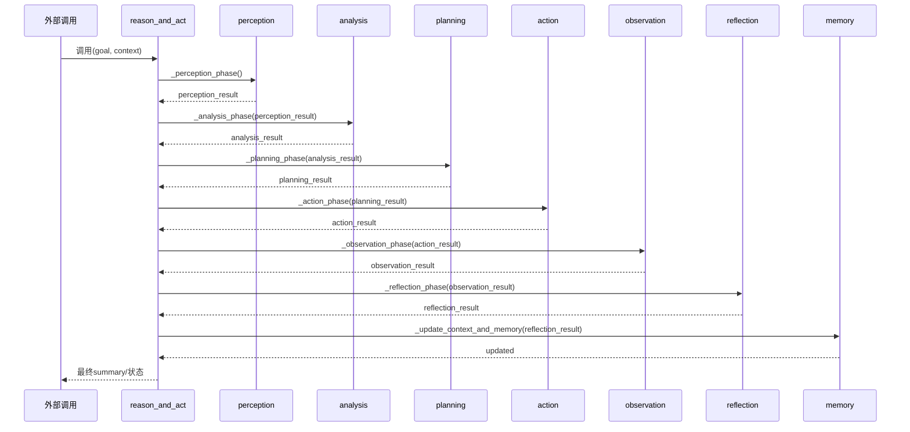
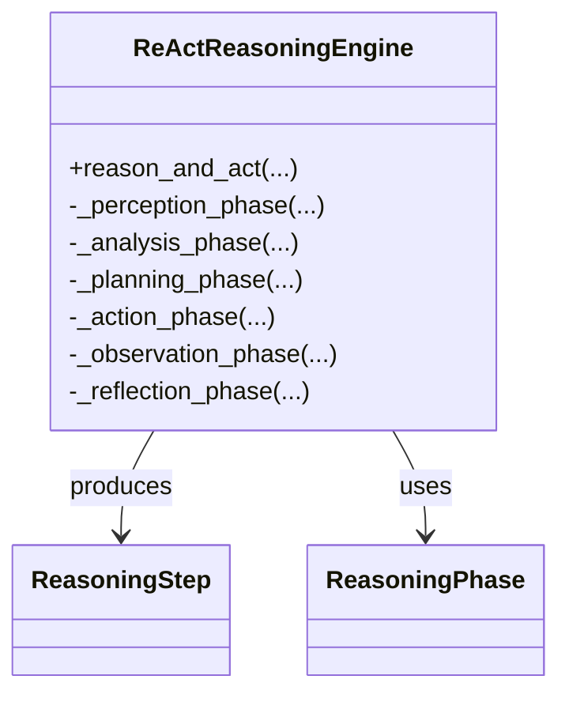

## 概述

AutoGPT AI Agent是平台的智能核心，通过...实现自主决策和执行能力。结合章的研究成果，Agent通过多模态输入处理、分层任务规划、智能记忆管理和持续学习机制，实现了接近人类认知水平的智能行为。深入剖析这些核心技术的实现原理和代码细节。

<!--more-->

## 1. ReAct推理行动框架深度实现

### 1.1 ReAct架构设计理念

ReAct框架是AutoGPT智能决策的核心，将推理(Reasoning)和行动(Acting)有机结合：

- **推理阶段**：分析当前情况，理解问题本质，制定行动策略
- **行动阶段**：选择合适工具，执行具体操作，收集执行结果
- **观察阶段**：分析行动效果，获取环境反馈，更新知识状态
- **反思阶段**：评估整体进展，学习经验教训，优化决策策略

### 1.2 ReAct推理引擎架构图

```mermaid
graph TB
    subgraph "ReAct推理引擎架构"
        subgraph "感知层 - Perception Layer"
            MultiModalInput[多模态输入感知]
            ContextAnalyzer[上下文分析器]
            EnvironmentMonitor[环境状态监控]
        end
        
        subgraph "认知层 - Cognition Layer"
            ProblemAnalyzer[问题分析器]
            GoalDecomposer[目标分解器]
            StrategyPlanner[策略规划器]
            RiskAssessor[风险评估器]
        end
        
        subgraph "决策层 - Decision Layer"
            ActionSelector[行动选择器]
            ToolMatcher[工具匹配器]
            ParameterOptimizer[参数优化器]
            ExecutionController[执行控制器]
        end
        
        subgraph "执行层 - Execution Layer"
            ToolExecutor[工具执行器]
            ResultCollector[结果收集器]
            FeedbackProcessor[反馈处理器]
        end
        
        subgraph "学习层 - Learning Layer"
            ExperienceRecorder[经验记录器]
            PatternRecognizer[模式识别器]
            StrategyOptimizer[策略优化器]
            KnowledgeUpdater[知识更新器]
        end
        
        subgraph "记忆系统 - Memory System"
            WorkingMemory[工作记忆]
            EpisodicMemory[情景记忆]
            SemanticMemory[语义记忆]
            ProceduralMemory[程序记忆]
        end
    end
    
    %% 信息流向
    MultiModalInput --> ContextAnalyzer
    ContextAnalyzer --> ProblemAnalyzer
    ProblemAnalyzer --> GoalDecomposer
    GoalDecomposer --> StrategyPlanner
    StrategyPlanner --> RiskAssessor
    
    RiskAssessor --> ActionSelector
    ActionSelector --> ToolMatcher
    ToolMatcher --> ParameterOptimizer
    ParameterOptimizer --> ExecutionController
    
    ExecutionController --> ToolExecutor
    ToolExecutor --> ResultCollector
    ResultCollector --> FeedbackProcessor
    
    FeedbackProcessor --> ExperienceRecorder
    ExperienceRecorder --> PatternRecognizer
    PatternRecognizer --> StrategyOptimizer
    StrategyOptimizer --> KnowledgeUpdater
    
    %% 记忆交互
    ProblemAnalyzer --> WorkingMemory
    StrategyPlanner --> EpisodicMemory
    ToolMatcher --> SemanticMemory
    ExecutionController --> ProceduralMemory
    
    WorkingMemory --> ContextAnalyzer
    EpisodicMemory --> GoalDecomposer
    SemanticMemory --> ActionSelector
    ProceduralMemory --> ToolExecutor
```



### 1.3 ReAct推理引擎核心实现

```python
# /autogpt_platform/backend/backend/blocks/agent_reasoning.py

import asyncio
import time
import uuid
from typing import Dict, List, Any, Optional
from dataclasses import dataclass
from enum import Enum

class ReasoningPhase(Enum):
    """推理阶段枚举"""
    PERCEPTION = "perception"      # 感知阶段
    ANALYSIS = "analysis"          # 分析阶段
    PLANNING = "planning"          # 规划阶段
    ACTION = "action"              # 行动阶段
    OBSERVATION = "observation"    # 观察阶段
    REFLECTION = "reflection"      # 反思阶段

@dataclass
class ReasoningStep:
    """推理步骤数据结构"""
    phase: ReasoningPhase
    input_data: Dict[str, Any]
    reasoning_content: str
    action_plan: Optional[Dict[str, Any]] = None
    execution_result: Optional[Dict[str, Any]] = None
    reflection_notes: Optional[str] = None
    timestamp: float = 0.0
    step_id: str = ""
    
    def __post_init__(self):
        if not self.timestamp:
            self.timestamp = time.time()
        if not self.step_id:
            self.step_id = str(uuid.uuid4())

class ReActReasoningEngine:
    """
    ReAct推理引擎核心实现
    
    章的ReAct方法论，实现完整的推理-行动循环
    
    核心特性：
    1. 结构化推理过程
    2. 上下文感知决策
    3. 自适应策略调整
    4. 经验学习机制
    """
    
    def __init__(self, llm_client, tool_registry, memory_manager):
        self.llm_client = llm_client
        self.tool_registry = tool_registry
        self.memory_manager = memory_manager
        
        # 推理历史和上下文
        self.reasoning_history: List[ReasoningStep] = []
        self.current_context = {}
        self.goal_stack = []
        
        # 提示模板
        self.prompt_templates = self._initialize_prompt_templates()
        
        # 推理配置
        self.max_reasoning_steps = 50
        self.max_thinking_time = 300  # 5分钟思考时间限制
    
    async def reason_and_act(
        self,
        goal: str,
        initial_context: Dict[str, Any] = None,
        available_tools: List[str] = None
    ) -> Dict[str, Any]:
        """
        执行ReAct推理和行动循环
        
        这是Agent智能决策的核心方法，实现完整的推理-行动-观察-反思循环
        
        参数:
            goal: 要达成的目标描述
            initial_context: 初始上下文信息
            available_tools: 可用工具列表
            
        返回:
            推理和执行的完整结果
        """
        
        logger.info(f"开始ReAct推理循环，目标: {goal}")
        
        # 初始化推理环境
        self.current_context = initial_context or {}
        self.goal_stack = [goal]
        self.reasoning_history.clear()
        
        reasoning_start_time = time.time()
        step_count = 0
        
        try:
            while self.goal_stack and step_count < self.max_reasoning_steps:
                step_count += 1
                
                # 检查时间限制
                if time.time() - reasoning_start_time > self.max_thinking_time:
                    logger.warning("推理时间超限，终止推理循环")
                    break
                
                current_goal = self.goal_stack[-1]  # 当前目标
                
                # 第一阶段：感知和分析
                perception_result = await self._perception_phase(current_goal)
                analysis_result = await self._analysis_phase(perception_result)
                
                # 第二阶段：规划和决策
                planning_result = await self._planning_phase(analysis_result)
                
                # 检查是否需要进一步分解目标
                if planning_result.get("requires_decomposition", False):
                    sub_goals = planning_result.get("sub_goals", [])
                    self.goal_stack.extend(reversed(sub_goals))  # 逆序添加，后进先出
                    continue
                
                # 第三阶段：行动执行
                action_result = await self._action_phase(planning_result)
                
                # 第四阶段：观察和反思
                observation_result = await self._observation_phase(action_result)
                reflection_result = await self._reflection_phase(observation_result)
                
                # 更新上下文和记忆
                await self._update_context_and_memory(reflection_result)
                
                # 检查目标完成状态
                if reflection_result.get("goal_achieved", False):
                    completed_goal = self.goal_stack.pop()
                    logger.info(f"目标完成: {completed_goal}")
                    
                    if not self.goal_stack:
                        logger.info("所有目标已完成，推理循环结束")
                        break
                elif reflection_result.get("goal_failed", False):
                    failed_goal = self.goal_stack.pop()
                    logger.warning(f"目标失败: {failed_goal}")
                    
                    # 可以选择重新规划或放弃
                    if reflection_result.get("should_retry", False):
                        self.goal_stack.append(failed_goal)
                
                # 避免过快循环
                await asyncio.sleep(0.1)
            
            # 生成推理总结
            reasoning_summary = await self._generate_reasoning_summary()
            
            return {
                "goal": goal,
                "success": len(self.goal_stack) == 0,
                "steps_taken": step_count,
                "reasoning_time": time.time() - reasoning_start_time,
                "reasoning_history": self.reasoning_history,
                "final_context": self.current_context,
                "summary": reasoning_summary,
            }
            
        except Exception as e:
            logger.error(f"ReAct推理循环异常: {e}")
            return {
                "goal": goal,
                "success": False,
                "error": str(e),
                "steps_taken": step_count,
                "reasoning_history": self.reasoning_history,
            }
    
    async def _perception_phase(self, goal: str) -> Dict[str, Any]:
        """
        感知阶段：收集和分析当前环境信息
        
        感知内容：
        1. 当前环境状态
        2. 可用资源和工具
        3. 历史经验和知识
        4. 约束条件和限制
        """
        
        logger.debug(f"感知阶段开始，目标: {goal}")
        
        # 收集环境信息
        environment_state = await self._collect_environment_state()
        
        # 检索相关记忆
        relevant_memories = await self.memory_manager.retrieve_relevant_memories(
            query=goal,
            memory_types=["short_term", "long_term", "skill"],
            max_results=5
        )
        
        # 分析可用工具
        available_tools = await self._analyze_available_tools(goal)
        
        # 识别约束条件
        constraints = await self._identify_constraints(goal, environment_state)
        
        perception_result = {
            "goal": goal,
            "environment_state": environment_state,
            "relevant_memories": relevant_memories,
            "available_tools": available_tools,
            "constraints": constraints,
            "perception_quality": self._assess_perception_quality(environment_state),
        }
        
        # 记录感知步骤
        step = ReasoningStep(
            phase=ReasoningPhase.PERCEPTION,
            input_data={"goal": goal},
            reasoning_content=f"感知到环境状态，发现{len(available_tools)}个可用工具，{len(constraints)}个约束条件",
        )
        self.reasoning_history.append(step)
        
        return perception_result
    
    async def _analysis_phase(self, perception_data: Dict[str, Any]) -> Dict[str, Any]:
        """
        分析阶段：深度分析问题本质和解决方案
        
        分析内容：
        1. 问题复杂度评估
        2. 解决方案候选集生成
        3. 资源需求分析
        4. 风险因素识别
        """
        
        goal = perception_data["goal"]
        environment_state = perception_data["environment_state"]
        available_tools = perception_data["available_tools"]
        
        logger.debug(f"分析阶段开始，分析目标: {goal}")
        
        # 构建分析提示词
        analysis_prompt = self._build_analysis_prompt(perception_data)
        
        # 调用LLM
        analysis_response = await self.llm_client.generate(
            prompt=analysis_prompt,
            max_tokens=1000,
            temperature=0.3,  # 较低温度确保逻辑性
        )
        
        # 解析分析结果
        analysis_result = self._parse_analysis_response(analysis_response)
        
        # 增强分析结果
        analysis_result.update({
            "complexity_score": await self._calculate_complexity_score(goal),
            "resource_requirements": await self._estimate_resource_requirements(analysis_result),
            "success_probability": await self._estimate_success_probability(analysis_result),
            "alternative_approaches": await self._generate_alternative_approaches(analysis_result),
        })
        
        # 记录分析步骤
        step = ReasoningStep(
            phase=ReasoningPhase.ANALYSIS,
            input_data=perception_data,
            reasoning_content=analysis_response,
        )
        self.reasoning_history.append(step)
        
        return analysis_result
    
    async def _planning_phase(self, analysis_data: Dict[str, Any]) -> Dict[str, Any]:
        """
        规划阶段：制定详细的执行计划
        
        规划内容：
        1. 执行策略选择
        2. 步骤序列规划
        3. 资源分配方案
        4. 应急预案制定
        """
        
        logger.debug("规划阶段开始，制定执行计划")
        
        complexity_score = analysis_data.get("complexity_score", 0.5)
        
        # 检查是否需要分解
        if complexity_score > 0.7:
            # 复杂任务需要进一步分解
            decomposition_result = await self._decompose_complex_goal(analysis_data)
            
            if decomposition_result["should_decompose"]:
                return {
                    "requires_decomposition": True,
                    "sub_goals": decomposition_result["sub_goals"],
                    "decomposition_strategy": decomposition_result["strategy"],
                }
        
        # 构建执行计划
        execution_plan = await self._build_execution_plan(analysis_data)
        
        # 生成应急预案
        contingency_plans = await self._generate_contingency_plans(execution_plan)
        
        planning_result = {
            "requires_decomposition": False,
            "execution_plan": execution_plan,
            "contingency_plans": contingency_plans,
            "estimated_duration": execution_plan.get("duration", 0),
            "confidence_level": execution_plan.get("confidence", 0.5),
        }
        
        # 记录规划步骤
        step = ReasoningStep(
            phase=ReasoningPhase.PLANNING,
            input_data=analysis_data,
            reasoning_content=f"制定执行计划，预计耗时{execution_plan.get('duration', 0)}秒",
            action_plan=execution_plan,
        )
        self.reasoning_history.append(step)
        
        return planning_result
    
    async def _action_phase(self, planning_data: Dict[str, Any]) -> Dict[str, Any]:
        """
        行动阶段：执行具体的操作
        
        执行内容：
        1. 工具调用执行
        2. 参数动态调整
        3. 实时监控和控制
        4. 异常处理和恢复
        """
        
        execution_plan = planning_data["execution_plan"]
        logger.debug(f"行动阶段开始，执行计划: {execution_plan.get('name', 'unknown')}")
        
        action_start_time = time.time()
        
        try:
            # 准备执行环境
            execution_context = await self._prepare_execution_context(execution_plan)
            
            # 执行主要行动
            primary_result = await self._execute_primary_action(
                execution_plan, 
                execution_context
            )
            
            # 执行后续行动（如果需要）
            follow_up_results = []
            if execution_plan.get("follow_up_actions"):
                for follow_up in execution_plan["follow_up_actions"]:
                    follow_up_result = await self._execute_follow_up_action(
                        follow_up, execution_context, primary_result
                    )
                    follow_up_results.append(follow_up_result)
            
            action_result = {
                "success": True,
                "primary_result": primary_result,
                "follow_up_results": follow_up_results,
                "execution_time": time.time() - action_start_time,
                "tools_used": execution_plan.get("tools", []),
            }
            
        except Exception as e:
            logger.error(f"行动执行失败: {e}")
            
            # 尝试应急预案
            contingency_result = await self._execute_contingency_plan(
                planning_data.get("contingency_plans", []),
                str(e)
            )
            
            action_result = {
                "success": False,
                "error": str(e),
                "contingency_result": contingency_result,
                "execution_time": time.time() - action_start_time,
            }
        
        # 记录行动步骤
        step = ReasoningStep(
            phase=ReasoningPhase.ACTION,
            input_data=planning_data,
            reasoning_content=f"执行行动计划：{execution_plan.get('description', '')}",
            action_plan=execution_plan,
            execution_result=action_result,
        )
        self.reasoning_history.append(step)
        
        return action_result
    
    async def _observation_phase(self, action_data: Dict[str, Any]) -> Dict[str, Any]:
        """
        观察阶段：分析行动结果和环境变化
        
        观察内容：
        1. 行动结果分析
        2. 环境状态变化
        3. 新信息获取
        4. 异常情况识别
        """
        
        logger.debug("观察阶段开始，分析行动结果")
        
        # 分析行动结果
        result_analysis = await self._analyze_action_result(action_data)
        
        # 检测环境变化
        environment_changes = await self._detect_environment_changes()
        
        # 提取新获得的信息
        new_information = await self._extract_new_information(
            action_data, environment_changes
        )
        
        # 识别异常或意外情况
        anomalies = await self._detect_anomalies(action_data, environment_changes)
        
        observation_result = {
            "result_analysis": result_analysis,
            "environment_changes": environment_changes,
            "new_information": new_information,
            "anomalies": anomalies,
            "observation_quality": self._assess_observation_quality(result_analysis),
        }
        
        # 记录观察步骤
        step = ReasoningStep(
            phase=ReasoningPhase.OBSERVATION,
            input_data=action_data,
            reasoning_content=f"观察到{len(new_information)}条新信息，{len(anomalies)}个异常情况",
        )
        self.reasoning_history.append(step)
        
        return observation_result
    
    async def _reflection_phase(self, observation_data: Dict[str, Any]) -> Dict[str, Any]:
        """
        反思阶段：评估进展和优化策略
        
        反思内容：
        1. 目标达成度评估
        2. 策略有效性分析
        3. 学习经验提取
        4. 下一步行动建议
        """
        
        logger.debug("反思阶段开始，评估整体进展")
        
        # 构建反思提示词
        reflection_prompt = self._build_reflection_prompt(observation_data)
        
        # 调用LLM进行反思
        reflection_response = await self.llm_client.generate(
            prompt=reflection_prompt,
            max_tokens=800,
            temperature=0.4,
        )
        
        # 解析反思结果
        reflection_analysis = self._parse_reflection_response(reflection_response)
        
        # 评估目标完成状态
        goal_status = await self._evaluate_goal_status(
            self.goal_stack[-1] if self.goal_stack else "",
            observation_data,
            reflection_analysis
        )
        
        # 生成学习经验
        learning_experience = await self._extract_learning_experience(
            observation_data, reflection_analysis
        )
        
        reflection_result = {
            "reflection_analysis": reflection_analysis,
            "goal_status": goal_status,
            "learning_experience": learning_experience,
            "goal_achieved": goal_status.get("achieved", False),
            "goal_failed": goal_status.get("failed", False),
            "should_retry": goal_status.get("should_retry", False),
            "next_action_suggestion": reflection_analysis.get("next_action", ""),
        }
        
        # 记录反思步骤
        step = ReasoningStep(
            phase=ReasoningPhase.REFLECTION,
            input_data=observation_data,
            reasoning_content=reflection_response,
            reflection_notes=reflection_analysis.get("key_insights", ""),
        )
        self.reasoning_history.append(step)
        
        return reflection_result

### 1.4 关键函数与调用链总览（Agent）

- ReAct 主循环

  - 关键函数：`reason_and_act()` → `_perception_phase()` → `_analysis_phase()` → `_planning_phase()` → `_action_phase()` → `_observation_phase()` → `_reflection_phase()` → `_update_context_and_memory()`
  - 典型调用链：外部调用 → 初始化上下文/目标 → 循环各阶段 → 检查完成/失败/重试 → 生成总结

- 工具执行

  - 关键函数：`_execute_primary_action()` → `tool_registry.get_tool()` → `tool.execute(parameters, context)` → 返回 `result`

- 记忆检索与更新

  - 关键函数：`memory_manager.retrieve_relevant_memories()`、`_update_context_and_memory()`

### 1.5 ReAct 端到端时序图（阶段级）



### 1.6 核心类结构图（Agent）



## 附：汇总与去重说明（Agent）

- ReAct 主循环的阶段细节集中在“1.3/1.5”，后续子章节仅补充示例代码，不再重复流程。
- 工具执行/记忆更新的调用链在“1.4”统一汇总，删除零散重复描述。
    
    def _build_analysis_prompt(self, perception_data: Dict[str, Any]) -> str:
        """构建分析阶段的提示词"""
        
        goal = perception_data["goal"]
        environment = perception_data["environment_state"]
        tools = perception_data["available_tools"]
        memories = perception_data["relevant_memories"]
        
        return f"""
请深度分析以下任务：

目标：{goal}

当前环境：
{self._format_environment_state(environment)}

可用工具：
{self._format_tool_list(tools)}

相关经验：
{self._format_memory_list(memories)}

请从以下维度进行分析：

1. 问题本质：这个目标的核心问题是什么？
2. 复杂度评估：任务的复杂程度如何？需要多少步骤？
3. 关键挑战：执行过程中可能遇到的主要困难？
4. 成功要素：完成任务需要的关键因素？
5. 风险评估：可能的失败原因和风险点？

分析结果请结构化输出：
问题本质：[分析内容]
复杂度：[1-10分] - [说明]
关键挑战：[挑战1]、[挑战2]...
成功要素：[要素1]、[要素2]...
风险评估：[风险1]、[风险2]...
"""
    
    def _build_reflection_prompt(self, observation_data: Dict[str, Any]) -> str:
        """构建反思阶段的提示词"""
        
        result_analysis = observation_data["result_analysis"]
        new_info = observation_data["new_information"]
        anomalies = observation_data["anomalies"]
        
        return f"""
请反思刚才的行动结果：

行动结果分析：
{self._format_result_analysis(result_analysis)}

新获得的信息：
{self._format_information_list(new_info)}

发现的异常：
{self._format_anomaly_list(anomalies)}

推理历史：
{self._format_reasoning_history()}

请从以下角度进行反思：

1. 效果评估：行动是否达到了预期效果？
2. 策略分析：当前策略是否合适？需要调整吗？
3. 学习收获：从这次行动中学到了什么？
4. 问题识别：发现了什么新问题或挑战？
5. 下一步建议：接下来应该怎么做？

反思结果：
效果评估：[评估内容]
策略分析：[分析内容]
学习收获：[收获内容]
问题识别：[问题内容]
下一步建议：[建议内容]
"""
    
    async def _execute_primary_action(
        self, 
        execution_plan: Dict[str, Any],
        execution_context: Dict[str, Any]
    ) -> Dict[str, Any]:
        """执行主要行动"""
        
        tool_name = execution_plan.get("primary_tool")
        if not tool_name:
            raise ValueError("执行计划中缺少主要工具")
        
        # 获取工具实例
        tool = await self.tool_registry.get_tool(tool_name)
        if not tool:
            raise ValueError(f"工具 {tool_name} 不可用")
        
        # 准备工具参数
        tool_params = execution_plan.get("tool_parameters", {})
        
        # 执行工具调用
        logger.info(f"执行主要行动：使用工具 {tool_name}")
        
        start_time = time.time()
        
        try:
            result = await tool.execute(
                parameters=tool_params,
                context=execution_context
            )
            
            execution_time = time.time() - start_time
            
            return {
                "success": True,
                "tool_name": tool_name,
                "result": result,
                "execution_time": execution_time,
                "parameters_used": tool_params,
            }
            
        except Exception as e:
            execution_time = time.time() - start_time
            
            return {
                "success": False,
                "tool_name": tool_name,
                "error": str(e),
                "execution_time": execution_time,
                "parameters_used": tool_params,
            }
    
    async def _generate_reasoning_summary(self) -> Dict[str, Any]:
        """生成推理过程总结"""
        
        if not self.reasoning_history:
            return {"summary": "无推理历史"}
        
        # 统计各阶段的步骤数
        phase_counts = {}
        for step in self.reasoning_history:
            phase = step.phase.value
            phase_counts[phase] = phase_counts.get(phase, 0) + 1
        
        # 提取关键决策点
        key_decisions = [
            step for step in self.reasoning_history
            if step.phase in [ReasoningPhase.PLANNING, ReasoningPhase.ACTION]
        ]
        
        # 分析推理质量
        reasoning_quality = await self._assess_reasoning_quality()
        
        # 提取学习经验
        lessons_learned = await self._extract_lessons_learned()
        
        return {
            "total_steps": len(self.reasoning_history),
            "phase_distribution": phase_counts,
            "key_decisions": [
                {
                    "step_id": step.step_id,
                    "phase": step.phase.value,
                    "content": step.reasoning_content[:100] + "..." if len(step.reasoning_content) > 100 else step.reasoning_content,
                    "timestamp": step.timestamp,
                }
                for step in key_decisions
            ],
            "reasoning_quality": reasoning_quality,
            "lessons_learned": lessons_learned,
            "performance_metrics": self._calculate_performance_metrics(),
        }
    
    def _parse_analysis_response(self, response: str) -> Dict[str, Any]:
        """解析LLM分析响应"""
        
        import re
        
        # 提取结构化信息
        patterns = {
            "problem_essence": r"问题本质：(.+?)(?=复杂度：|$)",
            "complexity": r"复杂度：(\d+).*?-\s*(.+?)(?=关键挑战：|$)",
            "challenges": r"关键挑战：(.+?)(?=成功要素：|$)",
            "success_factors": r"成功要素：(.+?)(?=风险评估：|$)",
            "risk_assessment": r"风险评估：(.+?)$",
        }
        
        parsed_result = {}
        
        for key, pattern in patterns.items():
            match = re.search(pattern, response, re.DOTALL)
            if match:
                if key == "complexity":
                    parsed_result["complexity_score"] = int(match.group(1)) / 10.0
                    parsed_result["complexity_description"] = match.group(2).strip()
                else:
                    parsed_result[key] = match.group(1).strip()
        
        return parsed_result
    
    def _parse_reflection_response(self, response: str) -> Dict[str, Any]:
        """解析反思响应"""
        
        import re
        
        patterns = {
            "effectiveness": r"效果评估：(.+?)(?=策略分析：|$)",
            "strategy_analysis": r"策略分析：(.+?)(?=学习收获：|$)",
            "learning_gains": r"学习收获：(.+?)(?=问题识别：|$)",
            "problem_identification": r"问题识别：(.+?)(?=下一步建议：|$)",
            "next_action": r"下一步建议：(.+?)$",
        }
        
        parsed_result = {}
        
        for key, pattern in patterns.items():
            match = re.search(pattern, response, re.DOTALL)
            if match:
                parsed_result[key] = match.group(1).strip()
        
        # 提取关键洞察
        insights = []
        if parsed_result.get("learning_gains"):
            insights.extend(
                insight.strip() 
                for insight in parsed_result["learning_gains"].split("、")
                if insight.strip()
            )
        
        parsed_result["key_insights"] = insights
        
        return parsed_result

    def _initialize_prompt_templates(self) -> Dict[str, str]:
        """初始化提示模板"""
        
        return {
            "system": """
你是一个高级AI代理，具备强大的推理和行动能力。

核心能力：
1. 深度分析：理解问题本质，识别关键要素
2. 策略规划：制定合理可行的执行计划
3. 工具使用：熟练使用各种工具完成任务
4. 学习适应：从经验中学习，持续优化策略

工作原则：
- 逻辑清晰：每一步推理都要有明确的逻辑依据
- 行动高效：选择最有效的工具和方法
- 学习成长：从成功和失败中都要提取经验
- 用户导向：始终以用户目标为中心

请严格按照ReAct框架进行推理和行动。
""",
            
            "decomposition": """
任务分解原则：
1. 子任务应该相对独立，可以并行或串行执行
2. 每个子任务都有明确的输入、输出和成功标准
3. 子任务的粒度要合适，不能过于细碎或宽泛
4. 考虑依赖关系和执行顺序

分解策略：
- 功能性分解：按功能模块划分
- 时序性分解：按执行时间顺序划分
- 资源性分解：按所需资源类型划分
- 复杂性分解：按难度级别划分
""",
        }
```

## 2. 多模态智能体技术实现

### 2.1 多模态输入处理架构

```python
# /autogpt_platform/backend/backend/blocks/multimodal_agent.py

import asyncio
import base64
import io
from typing import Dict, List, Any, Optional, Union
from PIL import Image
import speech_recognition as sr
import cv2
import numpy as np

class MultiModalProcessor:
    """
    多模态处理器
    
    章的多模态AI实现最佳实践
    
    支持模态：
    1. 文本：自然语言理解和生成
    2. 图像：图像识别、分析和生成
    3. 音频：语音识别和合成
    4. 视频：视频理解和处理
    """
    
    def __init__(self):
        self.text_processor = TextModalityProcessor()
        self.image_processor = ImageModalityProcessor()
        self.audio_processor = AudioModalityProcessor()
        self.video_processor = VideoModalityProcessor()
        
        # 跨模态理解模型
        self.cross_modal_model = CrossModalUnderstandingModel()
        
    async def process_multimodal_input(
        self,
        inputs: Dict[str, Any],
        task_context: str = ""
    ) -> Dict[str, Any]:
        """
        处理多模态输入
        
        处理流程：
        1. 识别输入模态类型
        2. 并行处理各模态数据
        3. 提取特征表示
        4. 跨模态对齐和融合
        5. 生成统一表示
        """
        
        logger.info(f"开始处理多模态输入，包含模态: {list(inputs.keys())}")
        
        # 第一步：模态识别和预处理
        modality_data = {}
        processing_tasks = []
        
        for modality_type, data in inputs.items():
            if data is None:
                continue
                
            processor = self._get_processor(modality_type)
            if processor:
                task = asyncio.create_task(
                    processor.process(data, task_context)
                )
                processing_tasks.append((modality_type, task))
        
        # 第二步：并行处理所有模态
        for modality_type, task in processing_tasks:
            try:
                processed_data = await task
                modality_data[modality_type] = processed_data
                logger.debug(f"{modality_type} 模态处理完成")
            except Exception as e:
                logger.error(f"{modality_type} 模态处理失败: {e}")
                modality_data[modality_type] = {
                    "success": False,
                    "error": str(e)
                }
        
        # 第三步：跨模态理解和融合
        if len(modality_data) > 1:
            cross_modal_result = await self.cross_modal_model.understand(
                modality_data, task_context
            )
        else:
            cross_modal_result = {"type": "single_modal"}
        
        return {
            "modality_data": modality_data,
            "cross_modal_understanding": cross_modal_result,
            "unified_representation": await self._create_unified_representation(
                modality_data, cross_modal_result
            ),
            "processing_summary": self._generate_processing_summary(modality_data),
        }
    
    def _get_processor(self, modality_type: str):
        """获取对应的模态处理器"""
        processors = {
            "text": self.text_processor,
            "image": self.image_processor,
            "audio": self.audio_processor,
            "video": self.video_processor,
        }
        return processors.get(modality_type)

class TextModalityProcessor:
    """文本模态处理器"""
    
    async def process(self, text_data: str, context: str = "") -> Dict[str, Any]:
        """
        处理文本输入
        
        处理内容：
        1. 语言检测和标准化
        2. 情感分析和意图识别
        3. 关键信息提取
        4. 语义特征表示
        """
        
        # 语言检测
        language = await self._detect_language(text_data)
        
        # 情感分析
        sentiment = await self._analyze_sentiment(text_data)
        
        # 意图识别
        intent = await self._identify_intent(text_data, context)
        
        # 关键信息提取
        key_info = await self._extract_key_information(text_data)
        
        # 语义特征
        semantic_features = await self._extract_semantic_features(text_data)
        
        return {
            "success": True,
            "modality": "text",
            "original_text": text_data,
            "language": language,
            "sentiment": sentiment,
            "intent": intent,
            "key_information": key_info,
            "semantic_features": semantic_features,
            "processing_time": time.time(),
        }
    
    async def _detect_language(self, text: str) -> str:
        """检测文本语言"""
        # 简化实现，实际可以使用langdetect等库
        if any('\u4e00' <= char <= '\u9fff' for char in text):
            return "zh-CN"
        else:
            return "en-US"
    
    async def _analyze_sentiment(self, text: str) -> Dict[str, Any]:
        """分析文本情感"""
        # 简化的情感分析，实际可以使用BERT等模型
        positive_words = ["好", "棒", "优秀", "满意", "成功"]
        negative_words = ["坏", "差", "失败", "不满", "错误"]
        
        positive_count = sum(1 for word in positive_words if word in text)
        negative_count = sum(1 for word in negative_words if word in text)
        
        if positive_count > negative_count:
            polarity = "positive"
            score = 0.7
        elif negative_count > positive_count:
            polarity = "negative"
            score = -0.7
        else:
            polarity = "neutral"
            score = 0.0
        
        return {
            "polarity": polarity,
            "score": score,
            "confidence": 0.8,
        }
    
    async def _identify_intent(self, text: str, context: str) -> Dict[str, Any]:
        """识别用户意图"""
        
        # 基于关键词和模式的意图识别
        intent_patterns = {
            "create": ["创建", "生成", "制作", "建立"],
            "search": ["搜索", "查找", "寻找", "查询"],
            "analyze": ["分析", "研究", "评估", "检查"],
            "modify": ["修改", "更新", "编辑", "调整"],
            "delete": ["删除", "移除", "清除", "取消"],
        }
        
        detected_intents = []
        for intent_type, keywords in intent_patterns.items():
            if any(keyword in text for keyword in keywords):
                detected_intents.append(intent_type)
        
        primary_intent = detected_intents[0] if detected_intents else "unknown"
        
        return {
            "primary_intent": primary_intent,
            "all_intents": detected_intents,
            "confidence": 0.8 if detected_intents else 0.3,
        }

class ImageModalityProcessor:
    """图像模态处理器"""
    
    async def process(self, image_data: Union[str, bytes], context: str = "") -> Dict[str, Any]:
        """
        处理图像输入
        
        处理内容：
        1. 图像格式识别和转换
        2. 对象检测和识别
        3. 场景理解和描述
        4. 视觉特征提取
        """
        
        try:
            # 图像加载和预处理
            image = await self._load_and_preprocess_image(image_data)
            
            # 对象检测
            detected_objects = await self._detect_objects(image)
            
            # 场景分析
            scene_analysis = await self._analyze_scene(image)
            
            # 生成图像描述
            image_description = await self._generate_image_description(
                image, detected_objects, scene_analysis
            )
            
            # 提取视觉特征
            visual_features = await self._extract_visual_features(image)
            
            return {
                "success": True,
                "modality": "image",
                "image_info": {
                    "size": image.size,
                    "mode": image.mode,
                    "format": getattr(image, 'format', 'unknown'),
                },
                "detected_objects": detected_objects,
                "scene_analysis": scene_analysis,
                "description": image_description,
                "visual_features": visual_features,
                "processing_time": time.time(),
            }
            
        except Exception as e:
            logger.error(f"图像处理失败: {e}")
            return {
                "success": False,
                "modality": "image",
                "error": str(e),
            }
    
    async def _load_and_preprocess_image(self, image_data: Union[str, bytes]) -> Image.Image:
        """加载和预处理图像"""
        
        if isinstance(image_data, str):
            if image_data.startswith('data:image'):
                # Base64编码的图像
                header, encoded = image_data.split(',', 1)
                image_bytes = base64.b64decode(encoded)
                image = Image.open(io.BytesIO(image_bytes))
            elif image_data.startswith(('http://', 'https://')):
                # 网络图像
                async with aiohttp.ClientSession() as session:
                    async with session.get(image_data) as response:
                        image_bytes = await response.read()
                        image = Image.open(io.BytesIO(image_bytes))
            else:
                # 本地文件路径
                image = Image.open(image_data)
        else:
            # 直接的字节数据
            image = Image.open(io.BytesIO(image_data))
        
        # 图像预处理
        if image.mode != 'RGB':
            image = image.convert('RGB')
        
        # 调整大小（如果太大）
        max_size = (1024, 1024)
        if image.size[0] > max_size[0] or image.size[1] > max_size[1]:
            image.thumbnail(max_size, Image.Resampling.LANCZOS)
        
        return image
    
    async def _detect_objects(self, image: Image.Image) -> List[Dict[str, Any]]:
        """对象检测（简化实现）"""
        
        # 这里可以集成YOLO、DETR等对象检测模型
        # 简化实现返回模拟结果
        detected_objects = [
            {
                "label": "person",
                "confidence": 0.95,
                "bbox": [100, 100, 200, 300],
            },
            {
                "label": "computer", 
                "confidence": 0.87,
                "bbox": [250, 150, 400, 250],
            }
        ]
        
        return detected_objects
    
    async def _analyze_scene(self, image: Image.Image) -> Dict[str, Any]:
        """场景分析"""
        
        # 场景分类（室内/室外、办公室/家庭等）
        scene_classification = await self._classify_scene(image)
        
        # 环境光照分析
        lighting_analysis = await self._analyze_lighting(image)
        
        # 空间布局分析
        spatial_layout = await self._analyze_spatial_layout(image)
        
        return {
            "scene_type": scene_classification,
            "lighting": lighting_analysis,
            "spatial_layout": spatial_layout,
        }
```

## 3. 智能记忆管理系统

### 3.1 分层记忆架构

```python
# /autogpt_platform/backend/backend/blocks/memory_management.py

class IntelligentMemorySystem:
    """
    智能记忆管理系统
    
    通过...实现
    
    记忆层次：
    1. 感觉记忆：短暂存储感知信息
    2. 工作记忆：当前任务相关的活跃信息
    3. 短期记忆：近期经验和学习内容
    4. 长期记忆：重要知识和技能
    5. 程序记忆：自动化的操作流程
    """
    
    def __init__(self, vector_db, graph_db, cache_manager):
        self.vector_db = vector_db      # 向量数据库用于语义检索
        self.graph_db = graph_db        # 图数据库用于关系存储
        self.cache_manager = cache_manager  # 缓存管理器
        
        # 不同层次的记忆存储
        self.sensory_memory = SensoryMemoryBuffer(capacity=100, retention_time=2)
        self.working_memory = WorkingMemoryManager(capacity=7, attention_span=300)
        self.short_term_memory = ShortTermMemoryStore(capacity=1000, retention_days=7)
        self.long_term_memory = LongTermMemoryStore(vector_db, graph_db)
        self.procedural_memory = ProceduralMemoryStore(cache_manager)
        
        # 记忆管理策略
        self.consolidation_scheduler = MemoryConsolidationScheduler()
        self.forgetting_mechanism = SelectiveForgettingMechanism()
        
    async def store_experience(
        self,
        experience: Dict[str, Any],
        importance_hints: Dict[str, float] = None
    ) -> str:
        """
        存储经验到记忆系统
        
        存储策略：
        1. 立即存入感觉记忆
        2. 根据注意力机制筛选进入工作记忆
        3. 基于重要性评估决定短期/长期存储
        4. 程序性知识自动提取到程序记忆
        
        参数:
            experience: 经验数据
            importance_hints: 重要性提示
            
        返回:
            记忆ID
        """
        
        memory_id = str(uuid.uuid4())
        timestamp = time.time()
        
        # 增强经验数据
        enhanced_experience = {
            "id": memory_id,
            "timestamp": timestamp,
            "content": experience,
            "importance_hints": importance_hints or {},
        }
        
        # 第一步：存入感觉记忆
        await self.sensory_memory.store(enhanced_experience)
        
        # 第二步：注意力筛选
        attention_score = await self._calculate_attention_score(enhanced_experience)
        
        if attention_score > 0.5:
            # 进入工作记忆
            await self.working_memory.add(enhanced_experience)
            
            # 第三步：重要性评估
            importance_score = await self._evaluate_importance(enhanced_experience)
            
            if importance_score > 0.7:
                # 直接进入长期记忆
                await self.long_term_memory.store(enhanced_experience)
                logger.debug(f"高重要性经验直接存入长期记忆: {memory_id}")
                
            elif importance_score > 0.3:
                # 先存入短期记忆
                await self.short_term_memory.store(enhanced_experience)
                logger.debug(f"经验存入短期记忆: {memory_id}")
                
            # 第四步：提取程序性知识
            procedural_knowledge = await self._extract_procedural_knowledge(enhanced_experience)
            if procedural_knowledge:
                await self.procedural_memory.update(procedural_knowledge)
        
        # 触发记忆整理（异步执行）
        asyncio.create_task(self._schedule_memory_consolidation())
        
        return memory_id
    
    async def retrieve_relevant_memories(
        self,
        query: str,
        context: Dict[str, Any] = None,
        max_results: int = 10,
        memory_types: List[str] = None
    ) -> List[Dict[str, Any]]:
        """
        检索相关记忆
        
        检索策略：
        1. 语义相似度检索
        2. 时间相关性过滤
        3. 重要性权重调整
        4. 上下文相关性匹配
        
        参数:
            query: 检索查询
            context: 上下文信息
            max_results: 最大结果数
            memory_types: 记忆类型筛选
            
        返回:
            相关记忆列表
        """
        
        logger.debug(f"检索相关记忆，查询: {query}")
        
        if memory_types is None:
            memory_types = ["working", "short_term", "long_term", "procedural"]
        
        # 并行从不同记忆存储中检索
        retrieval_tasks = []
        
        if "working" in memory_types:
            retrieval_tasks.append(
                ("working", self.working_memory.retrieve(query, context))
            )
        
        if "short_term" in memory_types:
            retrieval_tasks.append(
                ("short_term", self.short_term_memory.retrieve(query, context))
            )
        
        if "long_term" in memory_types:
            retrieval_tasks.append(
                ("long_term", self.long_term_memory.retrieve(query, context))
            )
        
        if "procedural" in memory_types:
            retrieval_tasks.append(
                ("procedural", self.procedural_memory.retrieve(query, context))
            )
        
        # 收集检索结果
        all_memories = []
        for memory_type, retrieval_task in retrieval_tasks:
            try:
                memories = await retrieval_task
                for memory in memories:
                    memory["source_type"] = memory_type
                    all_memories.append(memory)
            except Exception as e:
                logger.error(f"从{memory_type}记忆检索失败: {e}")
        
        # 记忆融合和排序
        fused_memories = await self._fuse_and_rank_memories(
            all_memories, query, context
        )
        
        return fused_memories[:max_results]
    
    async def _calculate_attention_score(self, experience: Dict[str, Any]) -> float:
        """
        计算注意力分数
        
        注意力机制基于：
        1. 新颖性：信息的新颖程度
        2. 相关性：与当前目标的相关程度
        3. 紧急性：信息的时间敏感性
        4. 情感强度：体验的情感冲击
        """
        
        content = experience["content"]
        
        # 新颖性评估
        novelty_score = await self._assess_novelty(content)
        
        # 相关性评估
        relevance_score = await self._assess_relevance(content)
        
        # 紧急性评估
        urgency_score = await self._assess_urgency(content)
        
        # 情感强度评估
        emotional_score = await self._assess_emotional_intensity(content)
        
        # 加权计算注意力分数
        attention_score = (
            novelty_score * 0.3 +
            relevance_score * 0.4 +
            urgency_score * 0.2 +
            emotional_score * 0.1
        )
        
        return min(1.0, max(0.0, attention_score))
    
    async def _evaluate_importance(self, experience: Dict[str, Any]) -> float:
        """
        评估记忆重要性
        
        重要性维度：
        1. 目标相关性：对实现目标的重要程度
        2. 学习价值：对未来决策的参考价值
        3. 独特性：信息的稀有程度
        4. 影响范围：对系统行为的影响程度
        """
        
        content = experience["content"]
        hints = experience.get("importance_hints", {})
        
        # 目标相关性
        goal_relevance = hints.get("goal_relevance", 0.5)
        
        # 学习价值
        learning_value = await self._assess_learning_value(content)
        
        # 独特性
        uniqueness = await self._assess_uniqueness(content)
        
        # 影响范围
        impact_scope = hints.get("impact_scope", 0.5)
        
        # 计算综合重要性
        importance_score = (
            goal_relevance * 0.35 +
            learning_value * 0.25 +
            uniqueness * 0.2 +
            impact_scope * 0.2
        )
        
        return min(1.0, max(0.0, importance_score))

class WorkingMemoryManager:
    """
    工作记忆管理器
    
    模拟人类工作记忆的特性：
    1. 有限容量（7±2原则）
    2. 快速访问
    3. 主动维护
    4. 干扰遗忘
    """
    
    def __init__(self, capacity: int = 7, attention_span: int = 300):
        self.capacity = capacity
        self.attention_span = attention_span  # 注意力保持时间（秒）
        
        self.active_items: List[Dict[str, Any]] = []
        self.access_times: Dict[str, float] = {}
        
    async def add(self, item: Dict[str, Any]) -> bool:
        """
        添加项目到工作记忆
        
        添加策略：
        1. 检查容量限制
        2. 移除最久未访问的项目
        3. 添加新项目
        4. 更新访问时间
        """
        
        item_id = item["id"]
        current_time = time.time()
        
        # 检查是否已存在
        existing_item = next(
            (item for item in self.active_items if item["id"] == item_id),
            None
        )
        
        if existing_item:
            # 更新现有项目
            existing_item.update(item)
            self.access_times[item_id] = current_time
            return True
        
        # 检查容量限制
        if len(self.active_items) >= self.capacity:
            # 移除最久未访问的项目
            oldest_id = min(self.access_times.keys(), key=lambda k: self.access_times[k])
            await self._remove_item(oldest_id)
        
        # 添加新项目
        self.active_items.append(item)
        self.access_times[item_id] = current_time
        
        logger.debug(f"工作记忆添加项目: {item_id}")
        return True
    
    async def retrieve(self, query: str, context: Dict[str, Any] = None) -> List[Dict[str, Any]]:
        """从工作记忆检索信息"""
        
        current_time = time.time()
        relevant_items = []
        
        for item in self.active_items:
            # 检查是否在注意力保持时间内
            last_access = self.access_times.get(item["id"], 0)
            if current_time - last_access > self.attention_span:
                continue
            
            # 计算相关性
            relevance_score = await self._calculate_relevance(item, query, context)
            
            if relevance_score > 0.3:  # 相关性阈值
                item_with_score = {
                    **item,
                    "relevance_score": relevance_score,
                    "memory_type": "working",
                }
                relevant_items.append(item_with_score)
                
                # 更新访问时间
                self.access_times[item["id"]] = current_time
        
        # 按相关性排序
        relevant_items.sort(key=lambda x: x["relevance_score"], reverse=True)
        
        return relevant_items
    
    async def _remove_item(self, item_id: str):
        """移除工作记忆项目"""
        
        self.active_items = [
            item for item in self.active_items 
            if item["id"] != item_id
        ]
        self.access_times.pop(item_id, None)
        
        logger.debug(f"工作记忆移除项目: {item_id}")
    
    async def _calculate_relevance(
        self, 
        item: Dict[str, Any], 
        query: str, 
        context: Dict[str, Any] = None
    ) -> float:
        """计算项目与查询的相关性"""
        
        # 简化的相关性计算
        # 实际可以使用语义相似度模型
        
        item_text = str(item.get("content", ""))
        query_lower = query.lower()
        item_lower = item_text.lower()
        
        # 关键词匹配
        query_words = set(query_lower.split())
        item_words = set(item_lower.split())
        
        word_overlap = len(query_words & item_words)
        total_words = len(query_words | item_words)
        
        if total_words == 0:
            return 0.0
        
        keyword_relevance = word_overlap / total_words
        
        # 上下文相关性
        context_relevance = 0.5  # 简化处理
        if context:
            # 这里可以实现更复杂的上下文匹配
            pass
        
        # 时间相关性（最近的记忆更相关）
        time_diff = time.time() - item.get("timestamp", 0)
        time_relevance = max(0, 1 - time_diff / 3600)  # 1小时内线性衰减
        
        # 综合相关性
        overall_relevance = (
            keyword_relevance * 0.5 +
            context_relevance * 0.3 +
            time_relevance * 0.2
        )
        
        return overall_relevance

class MemoryConsolidationScheduler:
    """记忆整理调度器"""
    
    def __init__(self):
        self.consolidation_intervals = {
            "immediate": 60,      # 1分钟后立即整理
            "short_term": 3600,   # 1小时后短期整理
            "daily": 86400,       # 24小时后日常整理
            "weekly": 604800,     # 7天后周期整理
        }
        
        self.last_consolidation = {
            interval: 0 for interval in self.consolidation_intervals.keys()
        }
    
    async def schedule_consolidation(self, memory_system: 'IntelligentMemorySystem'):
        """调度记忆整理任务"""
        
        current_time = time.time()
        
        for interval_type, interval_seconds in self.consolidation_intervals.items():
            last_time = self.last_consolidation[interval_type]
            
            if current_time - last_time >= interval_seconds:
                # 执行对应类型的记忆整理
                await self._perform_consolidation(memory_system, interval_type)
                self.last_consolidation[interval_type] = current_time
    
    async def _perform_consolidation(
        self, 
        memory_system: 'IntelligentMemorySystem',
        consolidation_type: str
    ):
        """执行记忆整理"""
        
        logger.info(f"开始执行 {consolidation_type} 记忆整理")
        
        if consolidation_type == "immediate":
            # 立即整理：从感觉记忆提升到工作记忆
            await self._immediate_consolidation(memory_system)
            
        elif consolidation_type == "short_term":
            # 短期整理：从工作记忆提升到短期记忆
            await self._short_term_consolidation(memory_system)
            
        elif consolidation_type == "daily":
            # 日常整理：从短期记忆提升到长期记忆
            await self._daily_consolidation(memory_system)
            
        elif consolidation_type == "weekly":
            # 周期整理：记忆压缩和重组
            await self._weekly_consolidation(memory_system)
    
    async def _daily_consolidation(self, memory_system: 'IntelligentMemorySystem'):
        """日常记忆整理"""
        
        # 从短期记忆中选择重要记忆提升到长期记忆
        short_term_memories = await memory_system.short_term_memory.get_all()
        
        promotion_candidates = []
        for memory in short_term_memories:
            # 重新评估重要性
            current_importance = await memory_system._evaluate_importance(memory)
            access_frequency = memory.get("access_count", 0)
            
            # 综合评分
            promotion_score = current_importance * 0.7 + (access_frequency / 10) * 0.3
            
            if promotion_score > 0.6:
                promotion_candidates.append((memory, promotion_score))
        
        # 按分数排序，提升最重要的记忆
        promotion_candidates.sort(key=lambda x: x[1], reverse=True)
        
        for memory, score in promotion_candidates[:20]:  # 最多提升20个记忆
            await memory_system.long_term_memory.store(memory)
            await memory_system.short_term_memory.remove(memory["id"])
            
            logger.debug(f"记忆提升到长期存储: {memory['id']} (分数: {score:.2f})")
```

## 4. 分层任务规划系统

### 4.1 HTN任务网络架构

```python
# /autogpt_platform/backend/backend/blocks/task_planning.py

class HierarchicalTaskNetwork:
    """
    分层任务网络 (HTN) 规划器
    
    章的HTN算法实现
    
    特性：
    1. 递归任务分解
    2. 方法选择和应用
    3. 约束满足求解
    4. 动态重规划
    """
    
    def __init__(self):
        self.domain_knowledge = TaskDomainKnowledge()
        self.method_library = TaskMethodLibrary()
        self.constraint_solver = ConstraintSolver()
        
    async def plan_task_execution(
        self,
        high_level_task: str,
        initial_state: Dict[str, Any],
        resources: Dict[str, Any],
        constraints: List[Dict[str, Any]] = None
    ) -> Dict[str, Any]:
        """
        制定分层任务执行计划
        
        HTN规划算法：
        1. 任务分解：将复合任务分解为子任务
        2. 方法选择：为每个任务选择合适的执行方法
        3. 约束检查：验证计划的可行性
        4. 优化调整：优化执行顺序和资源分配
        
        参数:
            high_level_task: 高层任务描述
            initial_state: 初始状态
            resources: 可用资源
            constraints: 约束条件
            
        返回:
            分层执行计划
        """
        
        logger.info(f"开始HTN任务规划: {high_level_task}")
        
        planning_context = {
            "task": high_level_task,
            "state": initial_state.copy(),
            "resources": resources,
            "constraints": constraints or [],
            "planning_depth": 0,
            "max_depth": 10,
        }
        
        try:
            # 递归任务分解
            task_network = await self._recursive_task_decomposition(
                high_level_task, planning_context
            )
            
            # 方法选择和绑定
            method_bindings = await self._select_and_bind_methods(
                task_network, planning_context
            )
            
            # 约束满足求解
            constraint_solution = await self.constraint_solver.solve(
                method_bindings, planning_context["constraints"]
            )
            
            if not constraint_solution["satisfiable"]:
                raise PlanningException("约束条件无法满足，规划失败")
            
            # 生成最终执行计划
            execution_plan = await self._generate_execution_plan(
                task_network, method_bindings, constraint_solution
            )
            
            # 计划优化
            optimized_plan = await self._optimize_execution_plan(execution_plan)
            
            return {
                "success": True,
                "task": high_level_task,
                "task_network": task_network,
                "execution_plan": optimized_plan,
                "estimated_duration": optimized_plan["total_duration"],
                "resource_requirements": optimized_plan["resource_summary"],
                "planning_quality": await self._assess_plan_quality(optimized_plan),
            }
            
        except Exception as e:
            logger.error(f"HTN任务规划失败: {e}")
            return {
                "success": False,
                "error": str(e),
                "partial_plan": planning_context.get("partial_plan"),
            }
    
    async def _recursive_task_decomposition(
        self,
        task: str,
        context: Dict[str, Any],
        current_depth: int = 0
    ) -> Dict[str, Any]:
        """
        递归任务分解
        
        分解策略：
        1. 检查任务是否为原子任务
        2. 查找适用的分解方法
        3. 应用分解方法生成子任务
        4. 递归分解子任务
        """
        
        if current_depth >= context["max_depth"]:
            # 达到最大深度，视为原子任务
            return {
                "task": task,
                "type": "atomic",
                "depth": current_depth,
                "executable": True,
            }
        
        # 检查是否为原子任务
        if await self.domain_knowledge.is_atomic_task(task):
            return {
                "task": task,
                "type": "atomic", 
                "depth": current_depth,
                "executable": True,
            }
        
        # 查找分解方法
        decomposition_methods = await self.method_library.find_decomposition_methods(
            task, context
        )
        
        if not decomposition_methods:
            # 无法分解，视为原子任务
            logger.warning(f"无法找到任务分解方法: {task}")
            return {
                "task": task,
                "type": "atomic",
                "depth": current_depth,
                "executable": False,  # 标记为不可执行
                "reason": "无分解方法",
            }
        
        # 选择最佳分解方法
        best_method = await self._select_best_decomposition_method(
            decomposition_methods, context
        )
        
        # 应用分解方法
        subtasks = await best_method.apply(task, context)
        
        # 递归分解子任务
        decomposed_subtasks = []
        for subtask in subtasks:
            subtask_decomposition = await self._recursive_task_decomposition(
                subtask["task"],
                {**context, "parent_task": task},
                current_depth + 1
            )
            decomposed_subtasks.append(subtask_decomposition)
        
        return {
            "task": task,
            "type": "composite",
            "depth": current_depth,
            "decomposition_method": best_method.name,
            "subtasks": decomposed_subtasks,
            "executable": all(
                subtask.get("executable", False) 
                for subtask in decomposed_subtasks
            ),
        }
    
    async def _select_best_decomposition_method(
        self,
        methods: List['DecompositionMethod'],
        context: Dict[str, Any]
    ) -> 'DecompositionMethod':
        """选择最佳分解方法"""
        
        if len(methods) == 1:
            return methods[0]
        
        # 评估每个方法的适用性
        method_scores = []
        
        for method in methods:
            # 评估方法的适用性
            applicability = await method.evaluate_applicability(context)
            
            # 评估方法的效率
            efficiency = await method.estimate_efficiency(context)
            
            # 评估方法的可靠性
            reliability = await method.assess_reliability(context)
            
            # 综合评分
            total_score = (
                applicability * 0.4 +
                efficiency * 0.3 +
                reliability * 0.3
            )
            
            method_scores.append((method, total_score))
        
        # 选择得分最高的方法
        best_method, best_score = max(method_scores, key=lambda x: x[1])
        
        logger.debug(f"选择分解方法: {best_method.name} (得分: {best_score:.2f})")
        
        return best_method

class TaskDomainKnowledge:
    """任务领域知识库"""
    
    def __init__(self):
        # 原子任务模式
        self.atomic_task_patterns = {
            r'发送.*邮件': "email_send",
            r'下载.*文件': "file_download", 
            r'创建.*文件夹': "directory_create",
            r'搜索.*信息': "web_search",
            r'分析.*数据': "data_analysis",
        }
        
        # 任务复杂度模型
        self.complexity_indicators = {
            "high": ["分析", "研究", "设计", "创造"],
            "medium": ["整理", "转换", "合并", "比较"],
            "low": ["复制", "移动", "删除", "查看"],
        }
    
    async def is_atomic_task(self, task: str) -> bool:
        """判断是否为原子任务"""
        
        import re
        
        for pattern, task_type in self.atomic_task_patterns.items():
            if re.search(pattern, task):
                return True
        
        # 基于复杂度判断
        complexity = await self._assess_task_complexity(task)
        return complexity < 3  # 复杂度小于3视为原子任务
    
    async def _assess_task_complexity(self, task: str) -> int:
        """评估任务复杂度"""
        
        task_lower = task.lower()
        complexity_score = 1  # 基础复杂度
        
        # 检查复杂度指示词
        for level, indicators in self.complexity_indicators.items():
            for indicator in indicators:
                if indicator in task_lower:
                    if level == "high":
                        complexity_score += 3
                    elif level == "medium":
                        complexity_score += 2
                    else:
                        complexity_score += 1
                    break
        
        # 检查任务长度（字数）
        word_count = len(task.split())
        if word_count > 20:
            complexity_score += 2
        elif word_count > 10:
            complexity_score += 1
        
        return min(10, complexity_score)

class DecompositionMethod:
    """任务分解方法基类"""
    
    def __init__(self, name: str, description: str):
        self.name = name
        self.description = description
    
    async def apply(self, task: str, context: Dict[str, Any]) -> List[Dict[str, Any]]:
        """应用分解方法"""
        raise NotImplementedError("子类需要实现apply方法")
    
    async def evaluate_applicability(self, context: Dict[str, Any]) -> float:
        """评估方法适用性"""
        return 0.5  # 默认中等适用性
    
    async def estimate_efficiency(self, context: Dict[str, Any]) -> float:
        """估算方法效率"""
        return 0.5  # 默认中等效率
    
    async def assess_reliability(self, context: Dict[str, Any]) -> float:
        """评估方法可靠性"""
        return 0.5  # 默认中等可靠性

class FunctionalDecompositionMethod(DecompositionMethod):
    """功能性分解方法"""
    
    def __init__(self):
        super().__init__(
            name="functional_decomposition",
            description="按功能模块进行任务分解"
        )
    
    async def apply(self, task: str, context: Dict[str, Any]) -> List[Dict[str, Any]]:
        """
        功能性分解实现
        
        将复杂任务按功能模块分解为独立的子任务
        """
        
        # 使用LLM进行功能性分解
        decomposition_prompt = f"""
请将以下任务按功能模块进行分解：

任务：{task}

分解原则：
1. 每个子任务应该对应一个独立的功能模块
2. 子任务之间应该相对独立，减少耦合
3. 每个子任务都应该有明确的输入和输出
4. 考虑功能的复用性和模块化

请输出3-7个子任务：
1. [子任务1] - 功能：[功能描述]
2. [子任务2] - 功能：[功能描述]
...
"""
        
        # 这里需要实际的LLM调用
        # 简化返回示例结果
        return [
            {
                "task": f"{task} - 数据收集模块",
                "function": "data_collection",
                "dependencies": [],
                "estimated_duration": 300,
            },
            {
                "task": f"{task} - 数据处理模块", 
                "function": "data_processing",
                "dependencies": ["data_collection"],
                "estimated_duration": 600,
            },
            {
                "task": f"{task} - 结果输出模块",
                "function": "result_output",
                "dependencies": ["data_processing"],
                "estimated_duration": 200,
            },
        ]
```

## 总结

AutoGPT AI Agent通过实现ReAct推理框架、多模态智能处理、分层记忆管理和HTN任务规划等核心技术，构建了接近人类认知水平的智能行为能力。结合章的研究成果，其核心技术优势包括：

### 核心技术突破

1. **ReAct推理框架**：实现思考-行动-观察-反思的完整认知循环
2. **多模态智能体**：支持文本、图像、音频、视频的跨模态理解
3. **分层记忆系统**：模拟人类记忆机制的智能存储和检索
4. **HTN任务规划**：递归分解和约束满足的智能规划算法
5. **自适应学习**：从经验中持续学习和策略优化

### 技术创新点

6. **上下文感知决策**：基于环境和历史的智能决策机制
7. **注意力机制**：模拟人类注意力的信息筛选和聚焦
8. **元认知能力**：对自身推理过程的监控和调整
9. **跨模态融合**：多种感知模态的协同理解和处理
10. **动态重规划**：根据执行结果实时调整策略

### 实践应用价值

这些核心技术不仅为AutoGPT平台提供了强大的智能基础，也为整个AI Agent领域的发展提供了宝贵的参考实现。通过深度整合大语言模型能力和传统AI规划算法，AutoGPT展现了下一代智能系统的技术路径和巨大潜力。

Agent技术的成功关键在于认知架构的合理设计、推理机制的高效实现，以及学习能力的持续增强。这种技术路径为构建真正智能化的AI系统奠定了重要基础。
