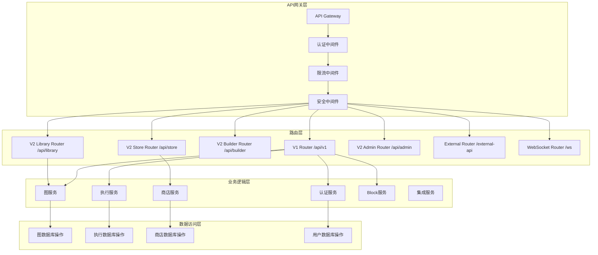
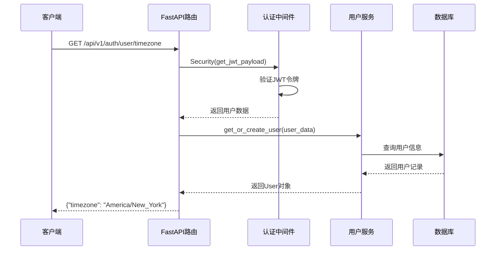
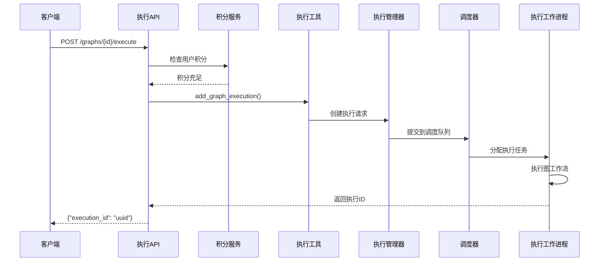
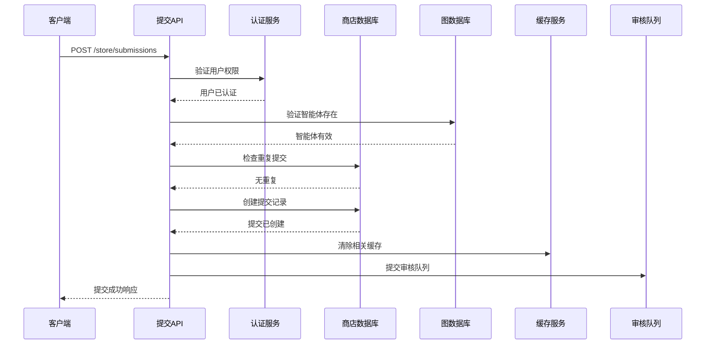
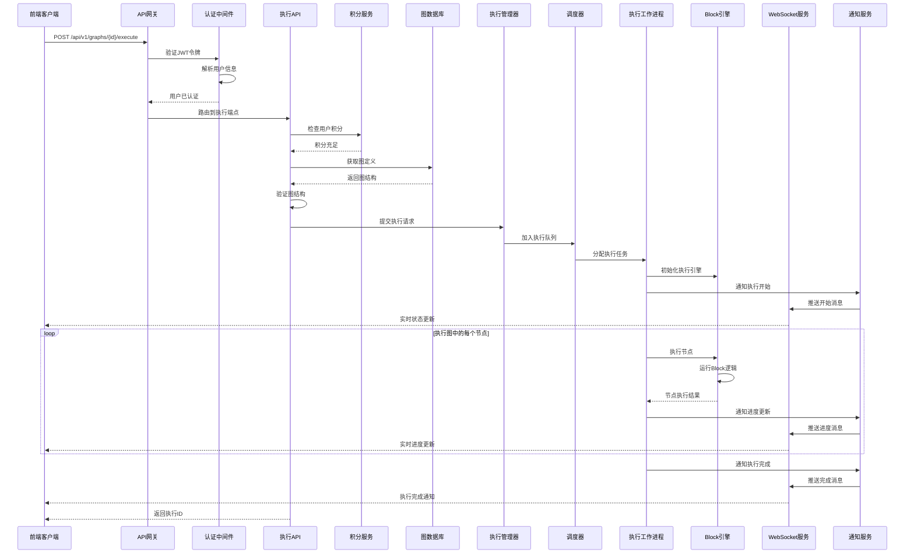

# AutoGPT平台API接口深度分析

## 概述

AutoGPT平台提供了完整的RESTful API和WebSocket接口，支持智能体管理、执行、商店、用户认证等核心功能。本文档将深入分析每个API端点的实现细节、调用链路和关键函数。

## API架构概览

### 整体API架构图



### API版本策略

AutoGPT平台采用多版本API策略：

- **V1 API** (`/api/v1/*`): 核心功能API，包括认证、图管理、执行等
- **V2 API** (`/api/v2/*`): 新功能API，包括商店、库管理等
- **External API** (`/external-api/*`): 外部集成专用API
- **WebSocket API** (`/ws/*`): 实时通信接口

## 认证系统API

### 1. 用户认证与管理

#### 1.1 获取或创建用户

**端点**: `POST /api/v1/auth/user`

**入口函数**:
```python
@v1_router.post(
    "/auth/user",
    summary="Get or create user",
    tags=["auth"],
    dependencies=[Security(requires_user)],
)
async def get_or_create_user_route(user_data: dict = Security(get_jwt_payload)):
    """
    获取或创建用户端点
    
    功能:
    1. 从JWT令牌中提取用户信息
    2. 检查用户是否存在，不存在则创建
    3. 返回用户完整信息
    
    调用链路:
    Security(get_jwt_payload) -> parse_jwt_token -> verify_user -> get_or_create_user
    """
    user = await get_or_create_user(user_data)
    return user.model_dump()
```

**关键函数调用链路**:

```python
# 1. JWT载荷提取 (autogpt_libs/auth/jwt_utils.py)
def get_jwt_payload(
    credentials: HTTPAuthorizationCredentials | None = Security(bearer_jwt_auth),
) -> dict[str, Any]:
    """提取JWT载荷"""
    if not credentials:
        raise HTTPException(401, "Authorization header is missing")
    
    try:
        payload = parse_jwt_token(credentials.credentials)
        logger.debug("Token decoded successfully")
        return payload
    except ValueError as e:
        logger.warning(f"Token validation failed: {e}")
        raise HTTPException(status_code=401, detail=str(e))

# 2. JWT令牌解析
def parse_jwt_token(token: str) -> dict[str, Any]:
    """解析JWT令牌"""
    settings = get_settings()
    
    try:
        payload = jwt.decode(
            token,
            settings.JWT_VERIFY_KEY,
            algorithms=[settings.JWT_ALGORITHM],
            audience="authenticated",
        )
        return payload
    except jwt.ExpiredSignatureError:
        raise ValueError("Token has expired")
    except jwt.InvalidSignatureError:
        raise ValueError("Invalid token signature")

# 3. 用户获取或创建 (backend/data/user.py)
async def get_or_create_user(user_data: dict) -> User:
    """获取或创建用户"""
    user_id = user_data["sub"]
    email = user_data["email"]
    
    # 尝试获取现有用户
    existing_user = await prisma.user.find_unique(where={"id": user_id})
    
    if existing_user:
        # 更新用户信息
        return await prisma.user.update(
            where={"id": user_id},
            data={
                "email": email,
                "name": user_data.get("user_metadata", {}).get("name"),
                "updated_at": datetime.utcnow(),
            }
        )
    else:
        # 创建新用户
        return await prisma.user.create(
            data={
                "id": user_id,
                "email": email,
                "name": user_data.get("user_metadata", {}).get("name"),
                "created_at": datetime.utcnow(),
            }
        )
```

#### 1.2 更新用户邮箱

**端点**: `POST /api/v1/auth/user/email`

**入口函数**:
```python
@v1_router.post(
    "/auth/user/email",
    summary="Update user email",
    tags=["auth"],
    dependencies=[Security(requires_user)],
)
async def update_user_email_route(
    user_id: Annotated[str, Security(get_user_id)], 
    email: str = Body(...)
) -> dict[str, str]:
    """
    更新用户邮箱
    
    功能:
    1. 验证用户身份
    2. 更新用户邮箱地址
    3. 返回更新结果
    """
    await update_user_email(user_id, email)
    return {"email": email}
```

**关键函数实现**:
```python
# backend/data/user.py
async def update_user_email(user_id: str, email: str) -> User:
    """更新用户邮箱"""
    try:
        # 验证邮箱格式
        if not re.match(r'^[a-zA-Z0-9._%+-]+@[a-zA-Z0-9.-]+\.[a-zA-Z]{2,}$', email):
            raise ValueError("Invalid email format")
        
        # 检查邮箱是否已被使用
        existing_user = await prisma.user.find_first(
            where={"email": email, "id": {"not": user_id}}
        )
        if existing_user:
            raise ValueError("Email already in use")
        
        # 更新用户邮箱
        updated_user = await prisma.user.update(
            where={"id": user_id},
            data={
                "email": email,
                "updated_at": datetime.utcnow(),
            }
        )
        
        logger.info(f"用户 {user_id} 邮箱已更新为 {email}")
        return updated_user
        
    except Exception as e:
        logger.error(f"更新用户邮箱失败: {e}")
        raise
```

### 2. 时区管理API

#### 2.1 获取用户时区

**端点**: `GET /api/v1/auth/user/timezone`

**调用链路时序图**:


## 智能体管理API

### 1. 智能体图管理

#### 1.1 创建智能体图

**端点**: `POST /api/v1/graphs`

**入口函数**:
```python
@v1_router.post(
    path="/graphs",
    summary="Create new graph",
    tags=["graphs"],
    dependencies=[Security(requires_user)],
)
async def create_new_graph(
    create_graph: CreateGraph,
    user_id: Annotated[str, Security(get_user_id)],
) -> graph_db.GraphModel:
    """
    创建新的智能体图
    
    功能:
    1. 验证用户权限
    2. 验证图结构
    3. 分配新的ID
    4. 保存到数据库
    5. 创建库记录
    6. 激活图
    """
    # 1. 创建图模型
    graph = graph_db.make_graph_model(create_graph.graph, user_id)
    
    # 2. 重新分配ID
    graph.reassign_ids(user_id=user_id, reassign_graph_id=True)
    
    # 3. 验证图结构
    graph.validate_graph(for_run=False)

    # 4. 创建图和库记录
    await graph_db.create_graph(graph, user_id=user_id)
    await library_db.create_library_agent(graph, user_id=user_id)
    
    # 5. 激活图
    return await on_graph_activate(graph, user_id=user_id)
```

**关键函数实现**:

```python
# backend/data/graph.py
async def create_graph(graph: GraphModel, user_id: str) -> GraphModel:
    """创建智能体图"""
    try:
        # 1. 准备图数据
        graph_data = {
            "id": graph.id,
            "version": graph.version,
            "name": graph.name,
            "description": graph.description,
            "user_id": user_id,
            "is_active": graph.is_active,
            "created_at": datetime.utcnow(),
        }
        
        # 2. 创建图记录
        created_graph = await prisma.agentgraph.create(data=graph_data)
        
        # 3. 创建节点记录
        for node in graph.nodes:
            node_data = {
                "id": node.id,
                "graph_id": graph.id,
                "graph_version": graph.version,
                "block_id": node.block_id,
                "input_default": node.input_default,
                "input_nodes": node.input_nodes,
                "output_nodes": node.output_nodes,
                "metadata": node.metadata,
            }
            await prisma.agentnode.create(data=node_data)
        
        logger.info(f"智能体图已创建: {graph.id} v{graph.version}")
        return graph
        
    except Exception as e:
        logger.error(f"创建智能体图失败: {e}")
        raise

# 图验证函数
def validate_graph(self, for_run: bool = True) -> None:
    """验证图结构"""
    errors = []
    
    # 1. 检查节点连接
    for node in self.nodes:
        # 验证输入连接
        for input_name, connections in node.input_nodes.items():
            for connection in connections:
                source_node = self.get_node(connection.node_id)
                if not source_node:
                    errors.append(f"节点 {node.id} 的输入连接指向不存在的节点 {connection.node_id}")
                
                # 验证输出端口存在
                if connection.name not in source_node.get_output_schema():
                    errors.append(f"节点 {connection.node_id} 没有输出端口 {connection.name}")
    
    # 2. 检查循环依赖
    if self._has_cycles():
        errors.append("图中存在循环依赖")
    
    # 3. 检查孤立节点
    isolated_nodes = self._find_isolated_nodes()
    if isolated_nodes and for_run:
        errors.append(f"存在孤立节点: {isolated_nodes}")
    
    if errors:
        raise GraphValidationError("图验证失败", errors)

def _has_cycles(self) -> bool:
    """检查图中是否存在循环"""
    visited = set()
    rec_stack = set()
    
    def dfs(node_id: str) -> bool:
        if node_id in rec_stack:
            return True
        if node_id in visited:
            return False
        
        visited.add(node_id)
        rec_stack.add(node_id)
        
        node = self.get_node(node_id)
        if node:
            for output_connections in node.output_nodes.values():
                for connection in output_connections:
                    if dfs(connection.node_id):
                        return True
        
        rec_stack.remove(node_id)
        return False
    
    for node in self.nodes:
        if node.id not in visited:
            if dfs(node.id):
                return True
    
    return False
```

#### 1.2 执行智能体图

**端点**: `POST /api/v1/graphs/{graph_id}/execute/{graph_version}`

**调用链路分析**:



**入口函数**:
```python
@v1_router.post(
    path="/graphs/{graph_id}/execute/{graph_version}",
    summary="Execute graph agent",
    tags=["graphs"],
    dependencies=[Security(requires_user)],
)
async def execute_graph(
    graph_id: str,
    user_id: Annotated[str, Security(get_user_id)],
    inputs: Annotated[dict[str, Any], Body(..., embed=True, default_factory=dict)],
    credentials_inputs: Annotated[
        dict[str, CredentialsMetaInput], Body(..., embed=True, default_factory=dict)
    ],
    graph_version: Optional[int] = None,
    preset_id: Optional[str] = None,
) -> execution_db.GraphExecutionMeta:
    """
    执行智能体图
    
    功能:
    1. 检查用户积分
    2. 验证图权限
    3. 创建执行记录
    4. 提交到执行队列
    5. 返回执行元数据
    """
    # 1. 检查积分余额
    current_balance = await _user_credit_model.get_credits(user_id)
    if current_balance <= 0:
        raise HTTPException(
            status_code=402,
            detail="Insufficient balance to execute the agent. Please top up your account.",
        )

    try:
        # 2. 添加图执行
        result = await execution_utils.add_graph_execution(
            graph_id=graph_id,
            user_id=user_id,
            inputs=inputs,
            preset_id=preset_id,
            graph_version=graph_version,
            graph_credentials_inputs=credentials_inputs,
        )
        
        # 3. 记录成功指标
        record_graph_execution(graph_id=graph_id, status="success", user_id=user_id)
        record_graph_operation(operation="execute", status="success")
        
        return result
        
    except GraphValidationError as e:
        # 4. 处理验证错误
        record_graph_execution(
            graph_id=graph_id, status="validation_error", user_id=user_id
        )
        raise HTTPException(
            status_code=400,
            detail={
                "type": "validation_error",
                "message": e.message,
                "node_errors": e.node_errors,
            },
        )
```

**核心执行函数**:
```python
# backend/executor/utils.py
async def add_graph_execution(
    graph_id: str,
    user_id: str,
    inputs: dict[str, Any],
    preset_id: Optional[str] = None,
    graph_version: Optional[int] = None,
    graph_credentials_inputs: Optional[dict[str, CredentialsMetaInput]] = None,
) -> execution_db.GraphExecutionMeta:
    """添加图执行"""
    
    # 1. 获取图定义
    graph = await graph_db.get_graph(
        graph_id=graph_id,
        version=graph_version,
        user_id=user_id,
        include_subgraphs=True,
    )
    
    if not graph:
        raise NotFoundError(f"Graph {graph_id} not found")
    
    # 2. 验证图结构
    graph.validate_graph(for_run=True)
    
    # 3. 处理凭据输入
    credentials = {}
    if graph_credentials_inputs:
        credentials = await _process_credentials_inputs(
            user_id, graph_credentials_inputs
        )
    
    # 4. 创建执行记录
    execution_data = {
        "id": str(uuid.uuid4()),
        "graph_id": graph_id,
        "graph_version": graph.version,
        "user_id": user_id,
        "status": ExecutionStatus.QUEUED,
        "input_data": inputs,
        "credentials": credentials,
        "created_at": datetime.utcnow(),
    }
    
    execution = await execution_db.create_graph_execution(execution_data)
    
    # 5. 提交到执行管理器
    execution_manager_client = get_execution_manager_client()
    await execution_manager_client.submit_execution(
        ExecutionRequest(
            execution_id=execution.id,
            graph_id=graph_id,
            user_id=user_id,
            input_data=inputs,
            credentials=credentials,
        )
    )
    
    logger.info(f"图执行已提交: {execution.id}")
    return execution

async def _process_credentials_inputs(
    user_id: str,
    credentials_inputs: dict[str, CredentialsMetaInput]
) -> dict[str, Any]:
    """处理凭据输入"""
    processed_credentials = {}
    
    for key, cred_input in credentials_inputs.items():
        if cred_input.provider == "oauth2":
            # 处理OAuth2凭据
            oauth_creds = await get_oauth2_credentials(
                user_id, cred_input.provider_name
            )
            processed_credentials[key] = {
                "type": "oauth2",
                "access_token": oauth_creds.access_token,
                "refresh_token": oauth_creds.refresh_token,
            }
        elif cred_input.provider == "api_key":
            # 处理API密钥凭据
            api_key = await get_api_key_credentials(
                user_id, cred_input.provider_name
            )
            processed_credentials[key] = {
                "type": "api_key",
                "api_key": api_key.key,
            }
    
    return processed_credentials
```

### 2. 图版本管理

#### 2.1 更新图版本

**端点**: `PUT /api/v1/graphs/{graph_id}`

**关键实现**:
```python
@v1_router.put(
    path="/graphs/{graph_id}",
    summary="Update graph version",
    tags=["graphs"],
    dependencies=[Security(requires_user)],
)
async def update_graph(
    graph_id: str,
    graph: graph_db.Graph,
    user_id: Annotated[str, Security(get_user_id)],
) -> graph_db.GraphModel:
    """
    更新图版本
    
    功能:
    1. 验证图所有权
    2. 计算新版本号
    3. 验证图结构
    4. 创建新版本
    5. 处理激活状态
    """
    # 1. 验证图ID匹配
    if graph.id and graph.id != graph_id:
        raise HTTPException(400, detail="Graph ID does not match ID in URI")

    # 2. 获取现有版本
    existing_versions = await graph_db.get_graph_all_versions(graph_id, user_id=user_id)
    if not existing_versions:
        raise HTTPException(404, detail=f"Graph #{graph_id} not found")
    
    # 3. 计算新版本号
    latest_version_number = max(g.version for g in existing_versions)
    graph.version = latest_version_number + 1

    # 4. 获取当前激活版本
    current_active_version = next((v for v in existing_versions if v.is_active), None)
    
    # 5. 创建图模型并验证
    graph_model = graph_db.make_graph_model(graph, user_id)
    graph_model.reassign_ids(user_id=user_id, reassign_graph_id=False)
    graph_model.validate_graph(for_run=False)

    # 6. 创建新版本
    new_graph_version = await graph_db.create_graph(graph_model, user_id=user_id)

    # 7. 处理激活状态
    if new_graph_version.is_active:
        # 更新库中的智能体版本
        await library_db.update_agent_version_in_library(
            user_id, graph.id, graph.version
        )

        # 激活新版本
        new_graph_version = await on_graph_activate(new_graph_version, user_id=user_id)
        
        # 设置为唯一激活版本
        await graph_db.set_graph_active_version(
            graph_id=graph_id, version=new_graph_version.version, user_id=user_id
        )
        
        # 停用之前的激活版本
        if current_active_version:
            await on_graph_deactivate(current_active_version, user_id=user_id)

    # 8. 返回包含子图的完整版本
    new_graph_version_with_subgraphs = await graph_db.get_graph(
        graph_id,
        new_graph_version.version,
        user_id=user_id,
        include_subgraphs=True,
    )
    
    return new_graph_version_with_subgraphs
```

## 应用商店API

### 1. 商店智能体列表

#### 1.1 获取智能体列表

**端点**: `GET /api/store/agents`

**入口函数**:
```python
@router.get(
    "/agents",
    summary="List store agents",
    tags=["store", "public"],
    response_model=backend.server.v2.store.model.StoreAgentsResponse,
)
async def get_agents(
    featured: bool = False,
    creator: str | None = None,
    sorted_by: str | None = None,
    search_query: str | None = None,
    category: str | None = None,
    page: int = 1,
    page_size: int = 20,
):
    """
    获取商店智能体列表
    
    功能:
    1. 参数验证
    2. 缓存查询
    3. 数据库查询
    4. 结果分页
    
    缓存策略: 15分钟TTL，支持不同查询组合
    """
    # 1. 参数验证
    if page < 1:
        raise fastapi.HTTPException(
            status_code=422, detail="Page must be greater than 0"
        )

    if page_size < 1:
        raise fastapi.HTTPException(
            status_code=422, detail="Page size must be greater than 0"
        )

    try:
        # 2. 缓存查询
        agents = await _get_cached_store_agents(
            featured=featured,
            creator=creator,
            sorted_by=sorted_by,
            search_query=search_query,
            category=category,
            page=page,
            page_size=page_size,
        )
        return agents
    except Exception as e:
        logger.exception("Failed to retrieve store agents: %s", e)
        return fastapi.responses.JSONResponse(
            status_code=500,
            content={
                "detail": "Failed to retrieve store agents",
                "hint": "Check database or search parameters.",
            },
        )
```

**缓存实现**:
```python
# 缓存装饰器 - 15分钟TTL，最多5000个条目
@cached(maxsize=5000, ttl_seconds=900)
async def _get_cached_store_agents(
    featured: bool,
    creator: str | None,
    sorted_by: str | None,
    search_query: str | None,
    category: str | None,
    page: int,
    page_size: int,
):
    """缓存的商店智能体查询"""
    return await backend.server.v2.store.db.get_store_agents(
        featured=featured,
        creators=[creator] if creator else None,
        sorted_by=sorted_by,
        search_query=search_query,
        category=category,
        page=page,
        page_size=page_size,
    )
```

**数据库查询实现**:
```python
# backend/server/v2/store/db.py
async def get_store_agents(
    featured: bool = False,
    creators: Optional[List[str]] = None,
    sorted_by: Optional[str] = None,
    search_query: Optional[str] = None,
    category: Optional[str] = None,
    page: int = 1,
    page_size: int = 20,
) -> StoreAgentsResponse:
    """获取商店智能体列表"""
    
    # 1. 构建基础查询
    where_conditions = [
        "sl.status = 'APPROVED'",  # 只显示已批准的
        "sl.is_deleted = false",   # 排除已删除的
    ]
    
    query_params = []
    
    # 2. 添加筛选条件
    if featured:
        where_conditions.append("sl.is_featured = true")
    
    if creators:
        placeholders = ",".join(["%s"] * len(creators))
        where_conditions.append(f"up.username IN ({placeholders})")
        query_params.extend(creators)
    
    if category:
        where_conditions.append("sl.category = %s")
        query_params.append(category)
    
    if search_query:
        # 使用全文搜索
        where_conditions.append("""
            (
                sl.name ILIKE %s OR 
                sl.description ILIKE %s OR 
                sl.sub_heading ILIKE %s OR
                to_tsvector('english', sl.name || ' ' || sl.description) @@ plainto_tsquery('english', %s)
            )
        """)
        search_pattern = f"%{search_query}%"
        query_params.extend([search_pattern, search_pattern, search_pattern, search_query])
    
    # 3. 构建排序条件
    order_by = "sl.created_at DESC"  # 默认按创建时间
    
    if sorted_by == "runs":
        order_by = "sl.runs DESC, sl.rating DESC"
    elif sorted_by == "rating":
        order_by = "sl.rating DESC, sl.review_count DESC"
    elif sorted_by == "recent":
        order_by = "sl.updated_at DESC"
    
    # 4. 构建完整查询
    base_query = f"""
        SELECT 
            sl.*,
            up.username as creator_username,
            up.name as creator_name,
            up.avatar_url as creator_avatar,
            COUNT(*) OVER() as total_count
        FROM store_listings sl
        JOIN store_listing_versions slv ON sl.id = slv.store_listing_id 
            AND slv.version = sl.approved_version
        JOIN user_profiles up ON sl.user_id = up.user_id
        WHERE {' AND '.join(where_conditions)}
        ORDER BY {order_by}
        LIMIT %s OFFSET %s
    """
    
    # 5. 添加分页参数
    offset = (page - 1) * page_size
    query_params.extend([page_size, offset])
    
    # 6. 执行查询
    results = await database.fetch_all(base_query, query_params)
    
    # 7. 处理结果
    agents = []
    total_count = 0
    
    for row in results:
        if total_count == 0:
            total_count = row["total_count"]
        
        agent = StoreAgent(
            id=row["id"],
            name=row["name"],
            description=row["description"],
            sub_heading=row["sub_heading"],
            category=row["category"],
            rating=row["rating"],
            runs=row["runs"],
            creator=StoreCreator(
                username=row["creator_username"],
                name=row["creator_name"],
                avatar_url=row["creator_avatar"],
            ),
            image_urls=row["image_urls"],
            video_url=row["video_url"],
            created_at=row["created_at"],
            updated_at=row["updated_at"],
        )
        agents.append(agent)
    
    # 8. 返回分页结果
    return StoreAgentsResponse(
        agents=agents,
        total_count=total_count,
        page=page,
        page_size=page_size,
        total_pages=(total_count + page_size - 1) // page_size,
    )
```

### 2. 商店提交管理

#### 2.1 创建商店提交

**端点**: `POST /api/store/submissions`

**调用链路时序图**:


**入口函数**:
```python
@router.post(
    "/submissions",
    summary="Create store submission",
    tags=["store", "private"],
    dependencies=[fastapi.Security(autogpt_libs.auth.requires_user)],
    response_model=backend.server.v2.store.model.StoreSubmission,
)
async def create_submission(
    submission_request: backend.server.v2.store.model.StoreSubmissionRequest,
    user_id: str = fastapi.Security(autogpt_libs.auth.get_user_id),
):
    """
    创建商店提交
    
    功能:
    1. 验证用户权限
    2. 验证智能体存在
    3. 检查重复提交
    4. 创建提交记录
    5. 清除缓存
    6. 提交审核
    """
    try:
        # 1. 创建提交
        result = await backend.server.v2.store.db.create_store_submission(
            user_id=user_id,
            agent_id=submission_request.agent_id,
            agent_version=submission_request.agent_version,
            slug=submission_request.slug,
            name=submission_request.name,
            video_url=submission_request.video_url,
            image_urls=submission_request.image_urls,
            description=submission_request.description,
            instructions=submission_request.instructions,
            sub_heading=submission_request.sub_heading,
            categories=submission_request.categories,
            changes_summary=submission_request.changes_summary or "Initial Submission",
            recommended_schedule_cron=submission_request.recommended_schedule_cron,
        )

        # 2. 清除用户提交缓存
        for page in range(1, 20):
            _get_cached_submissions.cache_delete(user_id, page=page, page_size=20)

        return result
    except Exception:
        logger.exception("Exception occurred whilst creating store submission")
        return fastapi.responses.JSONResponse(
            status_code=500,
            content={"detail": "An error occurred while creating the store submission"},
        )
```

**核心创建函数**:
```python
# backend/server/v2/store/db.py
async def create_store_submission(
    user_id: str,
    agent_id: str,
    agent_version: int,
    slug: str,
    name: str,
    description: str,
    instructions: str,
    sub_heading: str,
    categories: List[str],
    video_url: Optional[str] = None,
    image_urls: Optional[List[str]] = None,
    changes_summary: str = "Initial Submission",
    recommended_schedule_cron: Optional[str] = None,
) -> StoreSubmission:
    """创建商店提交"""
    
    try:
        # 1. 验证智能体存在且属于用户
        agent = await graph_db.get_graph(
            graph_id=agent_id,
            version=agent_version,
            user_id=user_id
        )
        
        if not agent:
            raise ValueError(f"Agent {agent_id} v{agent_version} not found or not owned by user")
        
        # 2. 验证slug唯一性
        existing_submission = await prisma.storelisting.find_first(
            where={
                "slug": slug,
                "is_deleted": False,
            }
        )
        
        if existing_submission:
            raise ValueError(f"Slug '{slug}' already exists")
        
        # 3. 检查用户是否已提交此智能体
        existing_agent_submission = await prisma.storelistingversion.find_first(
            where={
                "agent_id": agent_id,
                "agent_version": agent_version,
                "store_listing": {
                    "user_id": user_id,
                    "is_deleted": False,
                }
            }
        )
        
        if existing_agent_submission:
            raise ValueError("This agent version has already been submitted")
        
        # 4. 创建商店列表记录
        store_listing = await prisma.storelisting.create(
            data={
                "id": str(uuid.uuid4()),
                "user_id": user_id,
                "slug": slug,
                "status": SubmissionStatus.PENDING,
                "is_deleted": False,
                "created_at": datetime.utcnow(),
                "updated_at": datetime.utcnow(),
            }
        )
        
        # 5. 创建版本记录
        listing_version = await prisma.storelistingversion.create(
            data={
                "id": str(uuid.uuid4()),
                "store_listing_id": store_listing.id,
                "version": 1,
                "agent_id": agent_id,
                "agent_version": agent_version,
                "name": name,
                "description": description,
                "instructions": instructions,
                "sub_heading": sub_heading,
                "categories": categories,
                "video_url": video_url,
                "image_urls": image_urls or [],
                "changes_summary": changes_summary,
                "recommended_schedule_cron": recommended_schedule_cron,
                "created_at": datetime.utcnow(),
            }
        )
        
        # 6. 提交到审核队列
        await submit_for_review(store_listing.id, listing_version.id)
        
        # 7. 记录审计日志
        logger.info(
            f"Store submission created: {store_listing.id} by user {user_id}"
        )
        
        # 8. 返回提交对象
        return StoreSubmission(
            id=store_listing.id,
            version_id=listing_version.id,
            slug=slug,
            name=name,
            description=description,
            status=SubmissionStatus.PENDING,
            created_at=store_listing.created_at,
            updated_at=store_listing.updated_at,
        )
        
    except Exception as e:
        logger.error(f"Failed to create store submission: {e}")
        raise

async def submit_for_review(listing_id: str, version_id: str):
    """提交到审核队列"""
    try:
        # 发送到审核队列
        review_message = {
            "type": "store_submission_review",
            "listing_id": listing_id,
            "version_id": version_id,
            "submitted_at": datetime.utcnow().isoformat(),
        }
        
        # 这里可以集成消息队列系统
        # await message_queue.publish("review_queue", review_message)
        
        logger.info(f"Submission {listing_id} queued for review")
        
    except Exception as e:
        logger.error(f"Failed to submit for review: {e}")
        # 不抛出异常，因为提交已经创建成功
```

## Block系统API

### 1. Block列表和执行

#### 1.1 获取可用Block列表

**端点**: `GET /api/v1/blocks`

**入口函数**:
```python
@v1_router.get(
    path="/blocks",
    summary="List available blocks",
    tags=["blocks"],
    dependencies=[Security(requires_user)],
)
async def get_graph_blocks() -> Sequence[dict[Any, Any]]:
    """
    获取可用Block列表
    
    功能:
    1. 缓存查询所有Block
    2. 包含Block成本信息
    3. 过滤禁用的Block
    
    缓存策略: 使用@cached装饰器，防止雷群效应
    """
    return _get_cached_blocks()
```

**缓存实现**:
```python
@cached()
def _get_cached_blocks() -> Sequence[dict[Any, Any]]:
    """
    获取缓存的Block列表
    
    使用sync_cache装饰器防止多个并发请求
    同时执行昂贵的Block加载操作
    """
    from backend.data.credit import get_block_cost

    # 1. 获取所有Block类
    block_classes = get_blocks()
    result = []

    # 2. 处理每个Block类
    for block_class in block_classes.values():
        block_instance = block_class()
        
        # 3. 跳过禁用的Block
        if not block_instance.disabled:
            # 4. 获取Block成本信息
            costs = get_block_cost(block_instance)
            
            # 5. 构建Block信息
            block_info = {
                **block_instance.to_dict(),
                "costs": costs
            }
            result.append(block_info)

    return result
```

**Block信息结构**:
```python
# backend/data/block.py
def to_dict(self) -> dict[str, Any]:
    """将Block转换为字典"""
    return {
        "id": self.id,
        "type": self.get_block_type().value,
        "category": self.get_block_category().value,
        "name": self.get_block_name(),
        "description": self.get_block_description(),
        "input_schema": self.get_input_schema(),
        "output_schema": self.get_output_schema(),
        "static_output": self.get_static_output(),
        "block_costs": self.get_block_costs(),
        "disabled": self.disabled,
        "test_input": self.get_test_input(),
        "test_output": self.get_test_output(),
        "test_mock": self.get_test_mock(),
    }
```

#### 1.2 执行单个Block

**端点**: `POST /api/v1/blocks/{block_id}/execute`

**入口函数**:
```python
@v1_router.post(
    path="/blocks/{block_id}/execute",
    summary="Execute graph block",
    tags=["blocks"],
    dependencies=[Security(requires_user)],
)
async def execute_graph_block(
    block_id: str, 
    data: BlockInput, 
    user_id: Annotated[str, Security(get_user_id)]
) -> CompletedBlockOutput:
    """
    执行单个Block
    
    功能:
    1. 验证Block存在
    2. 获取用户上下文
    3. 执行Block逻辑
    4. 记录执行指标
    5. 返回执行结果
    """
    # 1. 获取Block对象
    obj = get_block(block_id)
    if not obj:
        raise HTTPException(status_code=404, detail=f"Block #{block_id} not found.")

    # 2. 获取用户上下文
    user = await get_user_by_id(user_id)
    if not user:
        raise HTTPException(status_code=404, detail="User not found.")

    user_context = UserContext(timezone=user.timezone)

    # 3. 执行Block
    start_time = time.time()
    try:
        output = defaultdict(list)
        
        # 4. 异步执行Block
        async for name, data in obj.execute(
            data,
            user_context=user_context,
            user_id=user_id,
        ):
            output[name].append(data)

        # 5. 记录成功指标
        duration = time.time() - start_time
        block_type = obj.__class__.__name__
        record_block_execution(
            block_type=block_type, status="success", duration=duration
        )

        return output
        
    except Exception:
        # 6. 记录失败指标
        duration = time.time() - start_time
        block_type = obj.__class__.__name__
        record_block_execution(
            block_type=block_type, status="error", duration=duration
        )
        raise
```

**Block执行核心逻辑**:
```python
# backend/data/block.py
async def execute(
    self,
    input_data: BlockInput,
    user_context: UserContext,
    user_id: str,
    **kwargs
) -> AsyncIterator[tuple[str, Any]]:
    """
    执行Block的核心方法
    
    功能:
    1. 验证输入数据
    2. 处理凭据
    3. 执行Block逻辑
    4. 生成输出数据
    """
    try:
        # 1. 验证输入数据
        validated_input = self._validate_input(input_data.data)
        
        # 2. 处理凭据输入
        credentials = {}
        if hasattr(input_data, 'credentials'):
            credentials = await self._process_credentials(
                input_data.credentials, user_id
            )
        
        # 3. 设置执行上下文
        execution_context = {
            "user_id": user_id,
            "user_context": user_context,
            "credentials": credentials,
            **kwargs
        }
        
        # 4. 执行Block核心逻辑
        async for output_name, output_data in self._execute_block(
            validated_input, execution_context
        ):
            # 5. 验证输出数据
            validated_output = self._validate_output(output_data)
            yield output_name, validated_output
            
    except Exception as e:
        # 6. 错误处理
        logger.error(f"Block execution failed: {e}")
        yield "error", {"error": str(e), "block_id": self.id}

@abstractmethod
async def _execute_block(
    self, 
    input_data: Any, 
    context: dict
) -> AsyncIterator[tuple[str, Any]]:
    """
    Block的具体执行逻辑 - 子类必须实现
    """
    pass
```

**具体Block实现示例**:
```python
# 文本处理Block示例
class TextProcessingBlock(Block):
    """文本处理Block"""
    
    class Input(BaseModel):
        text: str = Field(..., description="要处理的文本")
        operation: str = Field(..., description="处理操作")
        
    class Output(BaseModel):
        processed_text: str = Field(..., description="处理后的文本")
        metadata: dict = Field(..., description="处理元数据")
    
    @classmethod
    def get_block_type(cls) -> BlockType:
        return BlockType.TEXT_PROCESSING
    
    async def _execute_block(
        self, 
        input_data: Input, 
        context: dict
    ) -> AsyncIterator[tuple[str, Any]]:
        """执行文本处理"""
        
        text = input_data.text
        operation = input_data.operation.lower()
        
        # 执行文本处理操作
        if operation == "upper":
            processed_text = text.upper()
        elif operation == "lower":
            processed_text = text.lower()
        elif operation == "reverse":
            processed_text = text[::-1]
        elif operation == "word_count":
            word_count = len(text.split())
            yield "word_count", {"count": word_count}
            return
        else:
            raise ValueError(f"Unsupported operation: {operation}")
        
        # 生成输出
        output = self.Output(
            processed_text=processed_text,
            metadata={
                "original_length": len(text),
                "processed_length": len(processed_text),
                "operation": operation,
                "timestamp": datetime.utcnow().isoformat(),
            }
        )
        
        yield "result", output.dict()

# LLM Block示例
class LLMBlock(Block):
    """大语言模型Block"""
    
    class Input(BaseModel):
        prompt: str = Field(..., description="输入提示")
        model: str = Field(default="gpt-3.5-turbo", description="模型名称")
        max_tokens: int = Field(default=1000, description="最大token数")
        temperature: float = Field(default=0.7, description="温度参数")
        
    class Output(BaseModel):
        response: str = Field(..., description="AI响应")
        usage: dict = Field(..., description="Token使用情况")
    
    @classmethod
    def get_block_type(cls) -> BlockType:
        return BlockType.LLM
    
    async def _execute_block(
        self, 
        input_data: Input, 
        context: dict
    ) -> AsyncIterator[tuple[str, Any]]:
        """执行LLM推理"""
        
        # 1. 获取凭据
        credentials = context.get("credentials", {})
        if "openai" not in credentials:
            raise ValueError("OpenAI credentials required")
        
        # 2. 创建LLM客户端
        import openai
        client = openai.AsyncOpenAI(
            api_key=credentials["openai"]["api_key"]
        )
        
        try:
            # 3. 调用LLM API
            response = await client.chat.completions.create(
                model=input_data.model,
                messages=[
                    {"role": "user", "content": input_data.prompt}
                ],
                max_tokens=input_data.max_tokens,
                temperature=input_data.temperature,
            )
            
            # 4. 处理响应
            output = self.Output(
                response=response.choices[0].message.content,
                usage={
                    "prompt_tokens": response.usage.prompt_tokens,
                    "completion_tokens": response.usage.completion_tokens,
                    "total_tokens": response.usage.total_tokens,
                }
            )
            
            yield "response", output.dict()
            
        except Exception as e:
            logger.error(f"LLM API call failed: {e}")
            yield "error", {"error": str(e)}
```

## WebSocket实时通信

### 1. WebSocket连接管理

#### 1.1 WebSocket端点

**端点**: `WS /ws/{user_id}`

**连接处理**:
```python
# backend/server/ws_api.py
@websocket_router.websocket("/ws/{user_id}")
async def websocket_endpoint(
    websocket: WebSocket,
    user_id: str,
    token: str = Query(...)
):
    """
    WebSocket端点处理
    
    功能:
    1. 验证JWT令牌
    2. 建立WebSocket连接
    3. 处理消息循环
    4. 清理连接资源
    """
    try:
        # 1. 验证JWT令牌
        payload = parse_jwt_token(token)
        if payload.get("sub") != user_id:
            await websocket.close(code=1008, reason="Invalid user ID")
            return
        
        # 2. 建立连接
        connection_id = await ws_manager.connect(websocket, user_id)
        logger.info(f"WebSocket connected: {connection_id} for user {user_id}")
        
        try:
            # 3. 消息处理循环
            while True:
                # 接收客户端消息
                data = await websocket.receive_json()
                
                # 处理消息
                await handle_websocket_message(user_id, connection_id, data)
                
        except WebSocketDisconnect:
            logger.info(f"WebSocket disconnected: {connection_id}")
        finally:
            # 4. 清理连接
            await ws_manager.disconnect(connection_id, user_id)
            
    except Exception as e:
        logger.error(f"WebSocket error: {e}")
        await websocket.close(code=1011, reason="Server error")
```

**WebSocket管理器**:
```python
# backend/server/ws_manager.py
class WebSocketManager:
    """WebSocket连接管理器"""
    
    def __init__(self):
        # 活跃连接: connection_id -> WebSocket
        self.active_connections: Dict[str, WebSocket] = {}
        
        # 用户连接映射: user_id -> Set[connection_id]
        self.user_connections: Dict[str, Set[str]] = {}
        
        # 连接元数据: connection_id -> metadata
        self.connection_metadata: Dict[str, dict] = {}
    
    async def connect(self, websocket: WebSocket, user_id: str) -> str:
        """建立WebSocket连接"""
        await websocket.accept()
        
        # 生成连接ID
        connection_id = str(uuid.uuid4())
        
        # 存储连接
        self.active_connections[connection_id] = websocket
        
        # 更新用户连接映射
        if user_id not in self.user_connections:
            self.user_connections[user_id] = set()
        self.user_connections[user_id].add(connection_id)
        
        # 存储连接元数据
        self.connection_metadata[connection_id] = {
            "user_id": user_id,
            "connected_at": datetime.utcnow(),
            "last_activity": datetime.utcnow(),
        }
        
        logger.info(f"WebSocket connection established: {connection_id}")
        return connection_id
    
    async def disconnect(self, connection_id: str, user_id: str):
        """断开WebSocket连接"""
        # 移除连接
        if connection_id in self.active_connections:
            del self.active_connections[connection_id]
        
        # 更新用户连接映射
        if user_id in self.user_connections:
            self.user_connections[user_id].discard(connection_id)
            if not self.user_connections[user_id]:
                del self.user_connections[user_id]
        
        # 清理元数据
        if connection_id in self.connection_metadata:
            del self.connection_metadata[connection_id]
        
        logger.info(f"WebSocket connection closed: {connection_id}")
    
    async def send_to_user(self, user_id: str, message: dict):
        """向特定用户发送消息"""
        if user_id not in self.user_connections:
            logger.warning(f"No active connections for user: {user_id}")
            return
        
        # 获取用户的所有连接
        connections = self.user_connections[user_id].copy()
        disconnected = []
        
        # 向所有连接发送消息
        for connection_id in connections:
            websocket = self.active_connections.get(connection_id)
            if websocket:
                try:
                    await websocket.send_json(message)
                    
                    # 更新活动时间
                    if connection_id in self.connection_metadata:
                        self.connection_metadata[connection_id]["last_activity"] = datetime.utcnow()
                        
                except ConnectionClosedError:
                    logger.warning(f"Connection closed during send: {connection_id}")
                    disconnected.append(connection_id)
                except Exception as e:
                    logger.error(f"Error sending message to {connection_id}: {e}")
                    disconnected.append(connection_id)
        
        # 清理断开的连接
        for connection_id in disconnected:
            await self.disconnect(connection_id, user_id)
    
    async def send_to_connection(self, connection_id: str, message: dict):
        """向特定连接发送消息"""
        websocket = self.active_connections.get(connection_id)
        if websocket:
            try:
                await websocket.send_json(message)
            except ConnectionClosedError:
                # 连接已断开，清理资源
                metadata = self.connection_metadata.get(connection_id)
                if metadata:
                    await self.disconnect(connection_id, metadata["user_id"])
    
    async def broadcast_to_all(self, message: dict):
        """向所有连接广播消息"""
        if not self.active_connections:
            return
        
        disconnected = []
        
        for connection_id, websocket in self.active_connections.items():
            try:
                await websocket.send_json(message)
            except ConnectionClosedError:
                disconnected.append(connection_id)
            except Exception as e:
                logger.error(f"Broadcast error to {connection_id}: {e}")
                disconnected.append(connection_id)
        
        # 清理断开的连接
        for connection_id in disconnected:
            metadata = self.connection_metadata.get(connection_id)
            if metadata:
                await self.disconnect(connection_id, metadata["user_id"])
    
    def get_connection_count(self) -> int:
        """获取活跃连接数"""
        return len(self.active_connections)
    
    def get_user_connection_count(self, user_id: str) -> int:
        """获取用户连接数"""
        return len(self.user_connections.get(user_id, set()))
```

### 2. 实时消息处理

#### 2.1 消息路由处理

```python
# backend/server/ws_message_handler.py
async def handle_websocket_message(
    user_id: str, 
    connection_id: str, 
    message: dict
):
    """
    处理WebSocket消息
    
    功能:
    1. 消息类型路由
    2. 权限验证
    3. 业务逻辑处理
    4. 响应发送
    """
    try:
        message_type = message.get("type")
        if not message_type:
            await send_error(connection_id, "Missing message type")
            return
        
        # 消息路由
        handlers = {
            "execution_status": handle_execution_status_request,
            "graph_update": handle_graph_update_request,
            "subscribe_execution": handle_execution_subscription,
            "unsubscribe_execution": handle_execution_unsubscription,
            "ping": handle_ping,
        }
        
        handler = handlers.get(message_type)
        if handler:
            await handler(user_id, connection_id, message)
        else:
            await send_error(connection_id, f"Unknown message type: {message_type}")
            
    except Exception as e:
        logger.error(f"Error handling WebSocket message: {e}")
        await send_error(connection_id, "Internal server error")

async def handle_execution_status_request(
    user_id: str, 
    connection_id: str, 
    message: dict
):
    """处理执行状态查询"""
    execution_id = message.get("execution_id")
    if not execution_id:
        await send_error(connection_id, "Missing execution_id")
        return
    
    try:
        # 获取执行状态
        execution = await execution_db.get_graph_execution(
            user_id=user_id,
            execution_id=execution_id
        )
        
        if not execution:
            await send_error(connection_id, "Execution not found")
            return
        
        # 发送状态响应
        response = {
            "type": "execution_status_response",
            "execution_id": execution_id,
            "status": execution.status,
            "progress": execution.progress,
            "current_node": execution.current_node,
            "output": execution.output,
            "error": execution.error,
            "timestamp": datetime.utcnow().isoformat(),
        }
        
        await ws_manager.send_to_connection(connection_id, response)
        
    except Exception as e:
        logger.error(f"Error getting execution status: {e}")
        await send_error(connection_id, "Failed to get execution status")

async def handle_execution_subscription(
    user_id: str, 
    connection_id: str, 
    message: dict
):
    """处理执行订阅"""
    execution_id = message.get("execution_id")
    if not execution_id:
        await send_error(connection_id, "Missing execution_id")
        return
    
    try:
        # 验证执行权限
        execution = await execution_db.get_graph_execution(
            user_id=user_id,
            execution_id=execution_id
        )
        
        if not execution:
            await send_error(connection_id, "Execution not found")
            return
        
        # 添加订阅
        await subscription_manager.add_subscription(
            user_id=user_id,
            connection_id=connection_id,
            execution_id=execution_id
        )
        
        # 发送订阅确认
        response = {
            "type": "subscription_confirmed",
            "execution_id": execution_id,
            "timestamp": datetime.utcnow().isoformat(),
        }
        
        await ws_manager.send_to_connection(connection_id, response)
        
    except Exception as e:
        logger.error(f"Error subscribing to execution: {e}")
        await send_error(connection_id, "Failed to subscribe to execution")

async def send_error(connection_id: str, error_message: str):
    """发送错误消息"""
    error_response = {
        "type": "error",
        "message": error_message,
        "timestamp": datetime.utcnow().isoformat(),
    }
    
    await ws_manager.send_to_connection(connection_id, error_response)
```

### 3. 执行状态实时推送

#### 3.1 执行状态推送机制

```python
# backend/executor/notification.py
class ExecutionNotificationService:
    """执行通知服务"""
    
    def __init__(self, ws_manager: WebSocketManager):
        self.ws_manager = ws_manager
        self.subscription_manager = SubscriptionManager()
    
    async def notify_execution_started(
        self, 
        execution_id: str, 
        user_id: str, 
        graph_id: str
    ):
        """通知执行开始"""
        message = {
            "type": "execution_started",
            "execution_id": execution_id,
            "graph_id": graph_id,
            "status": "RUNNING",
            "timestamp": datetime.utcnow().isoformat(),
        }
        
        await self._send_execution_notification(user_id, execution_id, message)
    
    async def notify_execution_progress(
        self, 
        execution_id: str, 
        user_id: str, 
        progress: dict
    ):
        """通知执行进度"""
        message = {
            "type": "execution_progress",
            "execution_id": execution_id,
            "progress": progress,
            "timestamp": datetime.utcnow().isoformat(),
        }
        
        await self._send_execution_notification(user_id, execution_id, message)
    
    async def notify_execution_completed(
        self, 
        execution_id: str, 
        user_id: str, 
        result: dict
    ):
        """通知执行完成"""
        message = {
            "type": "execution_completed",
            "execution_id": execution_id,
            "status": "COMPLETED",
            "result": result,
            "timestamp": datetime.utcnow().isoformat(),
        }
        
        await self._send_execution_notification(user_id, execution_id, message)
    
    async def notify_execution_failed(
        self, 
        execution_id: str, 
        user_id: str, 
        error: str
    ):
        """通知执行失败"""
        message = {
            "type": "execution_failed",
            "execution_id": execution_id,
            "status": "FAILED",
            "error": error,
            "timestamp": datetime.utcnow().isoformat(),
        }
        
        await self._send_execution_notification(user_id, execution_id, message)
    
    async def _send_execution_notification(
        self, 
        user_id: str, 
        execution_id: str, 
        message: dict
    ):
        """发送执行通知"""
        try:
            # 获取订阅此执行的连接
            subscribers = await self.subscription_manager.get_subscribers(execution_id)
            
            if not subscribers:
                # 如果没有订阅者，发送给用户的所有连接
                await self.ws_manager.send_to_user(user_id, message)
            else:
                # 发送给特定订阅者
                for connection_id in subscribers:
                    await self.ws_manager.send_to_connection(connection_id, message)
                    
        except Exception as e:
            logger.error(f"Error sending execution notification: {e}")

class SubscriptionManager:
    """订阅管理器"""
    
    def __init__(self):
        # execution_id -> Set[connection_id]
        self.execution_subscriptions: Dict[str, Set[str]] = {}
        
        # connection_id -> Set[execution_id]
        self.connection_subscriptions: Dict[str, Set[str]] = {}
    
    async def add_subscription(
        self, 
        user_id: str, 
        connection_id: str, 
        execution_id: str
    ):
        """添加订阅"""
        # 添加执行订阅
        if execution_id not in self.execution_subscriptions:
            self.execution_subscriptions[execution_id] = set()
        self.execution_subscriptions[execution_id].add(connection_id)
        
        # 添加连接订阅
        if connection_id not in self.connection_subscriptions:
            self.connection_subscriptions[connection_id] = set()
        self.connection_subscriptions[connection_id].add(execution_id)
        
        logger.info(f"Subscription added: {connection_id} -> {execution_id}")
    
    async def remove_subscription(
        self, 
        connection_id: str, 
        execution_id: str
    ):
        """移除订阅"""
        # 移除执行订阅
        if execution_id in self.execution_subscriptions:
            self.execution_subscriptions[execution_id].discard(connection_id)
            if not self.execution_subscriptions[execution_id]:
                del self.execution_subscriptions[execution_id]
        
        # 移除连接订阅
        if connection_id in self.connection_subscriptions:
            self.connection_subscriptions[connection_id].discard(execution_id)
            if not self.connection_subscriptions[connection_id]:
                del self.connection_subscriptions[connection_id]
        
        logger.info(f"Subscription removed: {connection_id} -> {execution_id}")
    
    async def remove_connection_subscriptions(self, connection_id: str):
        """移除连接的所有订阅"""
        if connection_id in self.connection_subscriptions:
            execution_ids = self.connection_subscriptions[connection_id].copy()
            
            for execution_id in execution_ids:
                await self.remove_subscription(connection_id, execution_id)
    
    async def get_subscribers(self, execution_id: str) -> Set[str]:
        """获取执行的订阅者"""
        return self.execution_subscriptions.get(execution_id, set())
```

## API调用链路分析

### 1. 完整执行流程调用链



### 2. 关键函数调用路径总结

#### 2.1 认证流程
```
HTTP Request → Security(get_jwt_payload) → parse_jwt_token → verify_user → get_or_create_user
```

#### 2.2 图执行流程
```
execute_graph → add_graph_execution → ExecutionManager.submit_execution → Scheduler.add_to_queue → Worker.execute → BlockEngine.run → WebSocket.notify
```

#### 2.3 商店查询流程
```
get_agents → _get_cached_store_agents → get_store_agents → database.fetch_all → StoreAgentsResponse
```

#### 2.4 Block执行流程
```
execute_graph_block → get_block → block.execute → _execute_block → yield results → record_metrics
```

### 3. 性能优化要点

1. **缓存策略**: 多层缓存，不同TTL策略
2. **数据库优化**: 索引优化，查询优化，连接池
3. **异步处理**: 全异步架构，并发控制
4. **WebSocket管理**: 连接池管理，消息路由优化
5. **监控指标**: 全链路监控，性能指标收集

通过这个深入的API分析，开发者可以全面理解AutoGPT平台的API架构、实现细节和调用链路，为系统集成、扩展和优化提供详细的技术参考。
