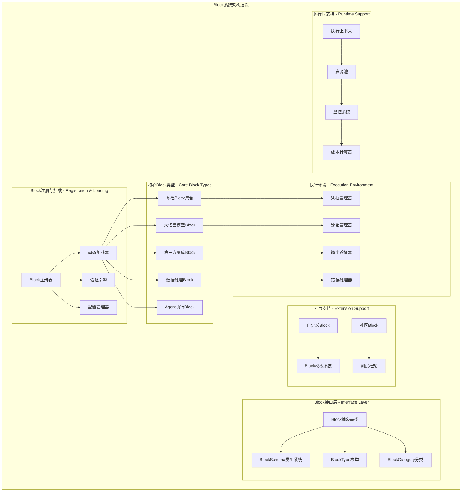
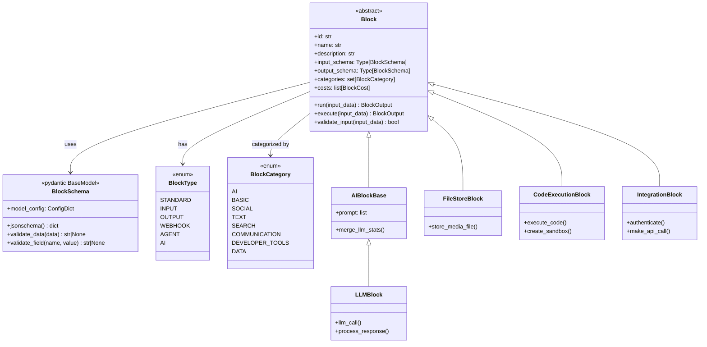
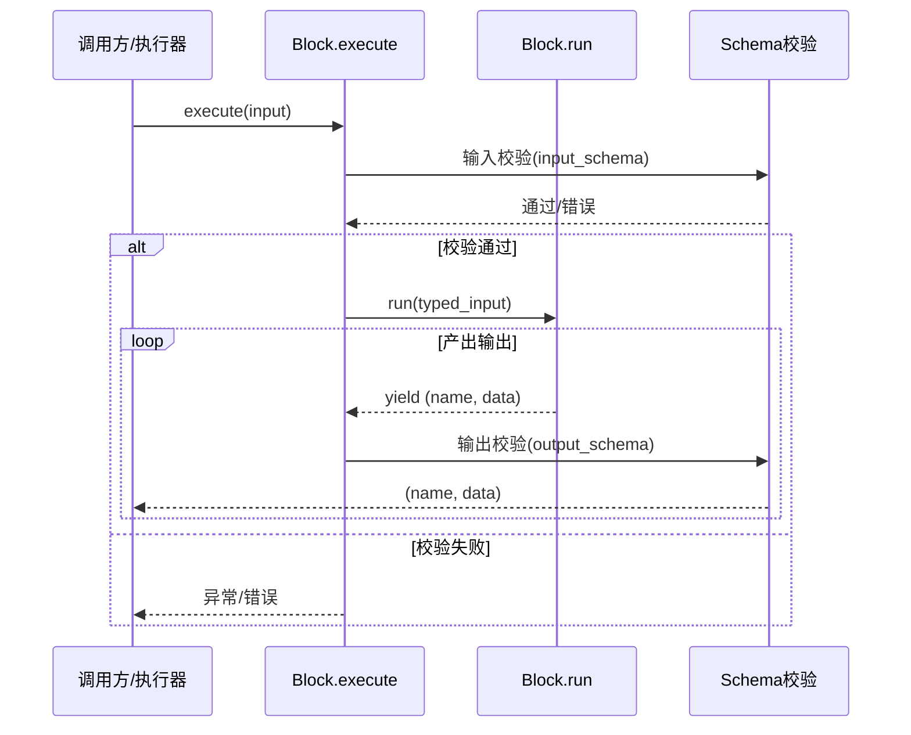
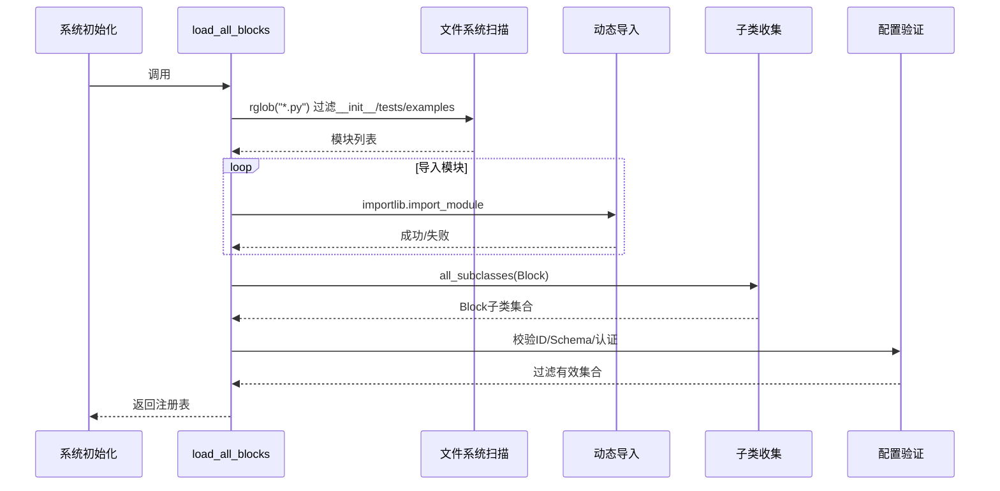

## 概述

AutoGPT Block系统是平台的核心扩展机制，采用插件化架构设计，通过标准化的Block接口实现功能模块的解耦和扩展。系统支持动态加载、类型安全、凭据管理和丰富的功能分类，为构建复杂AI工作流提供了强大的功能基础。

<!--more-->

## 1. Block系统整体架构

### 1.1 核心设计理念

Block系统遵循以下核心设计原则：

- **插件化架构**：每个功能作为独立Block实现，支持热插拔
- **标准化接口**：统一的输入输出schema和执行接口
- **类型安全**：基于Pydantic的强类型校验系统
- **异步执行**：全面支持异步I/O和并发处理
- **丰富生态**：覆盖AI、数据处理、集成、工具等多个领域

### 1.2 Block系统架构图



### 1.3 Block类层次结构图



### 1.4 关键函数与调用链总览

- 动态加载与注册

  - 关键函数：`load_all_blocks()` → 扫描模块 → 动态导入 → 收集子类 → 验证配置 → 过滤认证不完整 → 返回注册表
  - 典型调用链：启动阶段 → `initialize_blocks()` → `load_all_blocks()` → `all_subclasses(Block)` → 验证 Schema/ID/认证 → 注册可用 Block

- Block 执行闭环

  - 关键函数：`Block.execute()` → 输入校验 → 调用子类 `run()`（异步生成器）→ 输出校验 → 产出流式结果
  - 典型调用链：执行器/调用方 → `Block.execute(input)` → `Block.run(typed_input)` → `yield (output_name, output_data)` → 校验/回传

- 凭据获取（执行期）

  - 关键函数：`IntegrationCredentialsManager.acquire_credentials()` → `_validate_and_refresh_credentials()`
  - 典型调用链：需要第三方访问的 Block.run → 凭据管理器获取/刷新 → 执行具体 API 调用

### 1.5 端到端时序图（Block 执行最小闭环）



### 1.6 Block 加载与注册时序图



## 2. Block基类设计与核心接口

### 2.1 Block抽象基类源码解析

```python
# /autogpt_platform/backend/backend/data/block.py

from abc import ABC, abstractmethod
from collections.abc import AsyncGenerator as AsyncGen
from typing import Type, Generic, TypeVar, Optional, Any
from pydantic import BaseModel

# 类型定义
BlockInput = dict[str, Any]  # 输入：1个输入引脚消费1个数据项
BlockOutputEntry = tuple[str, Any]  # 输出数据：(输出名称, 输出值)的元组
BlockOutput = AsyncGen[BlockOutputEntry, None]  # 输出：1个输出引脚产生n个数据项
CompletedBlockOutput = dict[str, list[Any]]  # 完成的流，收集为字典格式

# 泛型类型变量
BlockSchemaInputType = TypeVar("BlockSchemaInputType", bound="BlockSchema")
BlockSchemaOutputType = TypeVar("BlockSchemaOutputType", bound="BlockSchema")

class Block(ABC, Generic[BlockSchemaInputType, BlockSchemaOutputType]):
    """
    Block抽象基类：定义所有Block的标准接口
    
    核心设计特性：
    1. 泛型支持：通过泛型提供类型安全的输入输出schema
    2. 异步执行：支持异步生成器模式的输出流
    3. 插件化：标准化接口支持动态加载和扩展
    4. 验证机制：内置输入输出数据验证
    """
    
    def __init__(
        self,
        id: str = "",                                    # Block唯一标识符（UUID格式）
        description: str = "",                           # Block功能描述
        contributors: list[ContributorDetails] = [],     # 贡献者列表
        categories: set[BlockCategory] | None = None,    # 功能分类
        input_schema: Type[BlockSchemaInputType] = EmptySchema,   # 输入数据schema
        output_schema: Type[BlockSchemaOutputType] = EmptySchema, # 输出数据schema
        test_input: BlockInput | list[BlockInput] | None = None,  # 测试输入数据
        test_output: BlockTestOutput | list[BlockTestOutput] | None = None, # 期望输出
        test_mock: dict[str, Any] | None = None,         # 测试mock配置
        test_credentials: Optional[Credentials | dict[str, Credentials]] = None, # 测试凭据
        disabled: bool = False,                          # 是否禁用
        static_output: bool = False,                     # 输出是否静态
        block_type: BlockType = BlockType.STANDARD,     # Block类型
        webhook_config: Optional[BlockWebhookConfig | BlockManualWebhookConfig] = None, # Webhook配置
    ):
        """
        初始化Block实例
        
        核心参数说明：
        - id: Block的唯一标识符，使用UUID格式，在数据库中持久化存储
        - input_schema: 使用Pydantic模型定义的输入数据schema
        - output_schema: 使用Pydantic模型定义的输出数据schema  
        - test_input/output: 用于自动化测试的样例数据
        - categories: Block的功能分类，用于界面组织和搜索
        - static_output: 是否为静态输出（输出链接默认为静态）
        """
        self.id = id
        self.input_schema = input_schema
        self.output_schema = output_schema
        self.description = description
        self.contributors = contributors or []
        self.categories = categories or set()
        self.test_input = test_input
        self.test_output = test_output
        self.test_mock = test_mock or {}
        self.test_credentials = test_credentials
        self.disabled = disabled
        self.static_output = static_output
        self.block_type = block_type
        self.webhook_config = webhook_config
        
        # 执行统计信息
        self.execution_stats = NodeExecutionStats()
        
        # 凭据提供者名称（从子类自动推断）
        self.credentials_provider_names = self._extract_credentials_providers()
    
    @classmethod
    def create(cls: Type["Block"]) -> "Block":
        """
        工厂方法：创建Block实例
        
        这个方法允许在不直接调用构造函数的情况下创建Block实例，
        便于动态加载和依赖注入。
        """
        return cls()
    
    @abstractmethod
    async def run(self, input_data: BlockSchemaInputType, **kwargs) -> BlockOutput:
        """
        Block的核心执行方法（抽象方法）
        
        这是每个具体Block必须实现的核心方法，定义了Block的具体执行逻辑。
        
        参数:
            input_data: 符合input_schema结构的输入数据
            **kwargs: 额外的执行参数，当前包括：
                - graph_id: 图ID
                - node_id: 节点ID  
                - graph_exec_id: 图执行ID
                - node_exec_id: 节点执行ID
                - user_id: 用户ID
                - user_context: 用户上下文
        
        返回:
            异步生成器，产生(output_name, output_data)元组
            - output_name: output_schema中定义的输出字段名称
            - output_data: 对应的输出数据，需符合schema定义
        
        实现要求:
            1. 使用异步生成器（async generator）返回结果
            2. 每次yield一个(output_name, output_data)元组
            3. 支持错误输出：yield ("error", error_message)
            4. 确保输出数据符合output_schema定义
        """
        # 类型检查器占位代码，永不执行
        if False:  # noqa: SIM115
            yield "name", "value"  # pyright: ignore[reportMissingYield]
        raise NotImplementedError(f"{self.name} 没有实现run方法")
    
    async def execute(self, input_data: BlockInput, **kwargs) -> BlockOutput:
        """
        Block执行的入口方法（内部调用run方法）
        
        这个方法在调用run方法之前进行输入验证，在run方法执行后进行输出验证。
        它是执行引擎实际调用的方法。
        
        执行流程：
        1. 验证输入数据是否符合input_schema
        2. 调用子类实现的run方法
        3. 验证输出数据是否符合output_schema  
        4. 处理错误输出和异常情况
        
        参数:
            input_data: 原始输入数据字典
            **kwargs: 传递给run方法的额外参数
            
        返回:
            验证后的Block输出流
        """
        # 第一步：输入数据验证
        if error := self.input_schema.validate_data(input_data):
            raise ValueError(f"无法执行Block，输入数据无效: {error}")
        
        # 第二步：清理和转换输入数据  
        # 移除None值，创建符合schema的输入对象
        cleaned_input = {k: v for k, v in input_data.items() if v is not None}
        typed_input = self.input_schema(**cleaned_input)
        
        # 第三步：执行Block逻辑
        async for output_name, output_data in self.run(typed_input, **kwargs):
            # 处理错误输出
            if output_name == "error":
                raise RuntimeError(output_data)
            
            # 第四步：输出数据验证（仅对标准Block）
            if self.block_type == BlockType.STANDARD:
                if error := self.output_schema.validate_field(output_name, output_data):
                    raise ValueError(f"Block产生了无效的输出数据: {error}")
            
            # 返回验证后的输出
            yield output_name, output_data
    
    async def run_once(
        self, 
        input_data: BlockSchemaInputType, 
        output: str, 
        **kwargs
    ) -> Any:
        """
        执行Block并获取指定输出的单个值
        
        这是一个便利方法，用于获取Block特定输出的第一个值。
        适用于只关心某个特定输出且只需要一个值的场景。
        
        参数:
            input_data: 输入数据
            output: 要获取的输出名称
            **kwargs: 传递给run方法的参数
            
        返回:
            指定输出的第一个值
            
        异常:
            ValueError: 如果Block没有产生指定的输出
        """
        async for item in self.run(input_data, **kwargs):
            name, data = item
            if name == output:
                return data
        raise ValueError(f"{self.name} 没有产生输出: {output}")
    
    def merge_stats(self, stats: NodeExecutionStats) -> NodeExecutionStats:
        """
        合并执行统计信息
        
        将新的执行统计信息合并到Block的累积统计中。
        用于跟踪Block的总体执行性能。
        
        参数:
            stats: 要合并的统计信息
            
        返回:
            合并后的统计信息
        """
        self.execution_stats += stats
        return self.execution_stats
    
    @property
    def name(self) -> str:
        """Block名称（基于类名）"""
        return self.__class__.__name__
    
    def to_dict(self) -> dict[str, Any]:
        """转换为字典表示"""
        return {
            "id": self.id,
            "name": self.name,
            "description": self.description,
            "categories": [cat.dict() for cat in self.categories],
            "input_schema": self.input_schema.jsonschema(),
            "output_schema": self.output_schema.jsonschema(),
            "static_output": self.static_output,
            "block_type": self.block_type.value,
        }
    
    def get_info(self) -> BlockInfo:
        """
        获取Block信息对象
        
        返回包含Block完整信息的结构化对象，用于API响应和前端展示。
        """
        return BlockInfo(
            id=self.id,
            name=self.name,
            inputSchema=self.input_schema.jsonschema(),
            outputSchema=self.output_schema.jsonschema(),
            costs=[cost.model_dump() for cost in (self.costs or [])],
            description=self.description,
            categories=[cat.dict() for cat in self.categories],
            contributors=[contrib.model_dump() for contrib in self.contributors],
            staticOutput=self.static_output,
            uiType=self.block_type.value,
        )
    
    def _extract_credentials_providers(self) -> list[str]:
        """
        从输入schema中提取凭据提供者名称
        
        自动分析input_schema中的CredentialsField，
        提取需要的凭据提供者列表。
        """
        providers = []
        
        if hasattr(self.input_schema, 'model_fields'):
            for field_name, field_info in self.input_schema.model_fields.items():
                if is_credentials_field_name(field_name):
                    # 从字段注解中提取提供者信息
                    if hasattr(field_info, 'annotation'):
                        providers.extend(self._parse_providers_from_annotation(field_info.annotation))
        
        return providers
```

### 2.4 关键函数调用链（汇总）

- 执行调用链

  - 调用方 → `Block.execute(input)` → `input_schema.validate_data` → `Block.run(typed_input)` → `output_schema.validate_field` → 产出 `(name, data)` 流

- 动态加载调用链

  - 启动 → `initialize_blocks()` → `load_all_blocks()` → 扫描/导入 → `all_subclasses(Block)` → 配置/认证校验 → 注册

- 凭据调用链（需要外部服务的 Block）

  - `Block.run` → `IntegrationCredentialsManager.acquire_credentials()` → `_validate_and_refresh_credentials()` → 调第三方 API → `yield` 输出

### 2.2 BlockSchema类型系统

```python
class BlockSchema(BaseModel):
    """
    Block输入输出Schema基类
    
    基于Pydantic的强类型系统，提供：
    1. 运行时类型验证
    2. JSON Schema生成
    3. 数据序列化/反序列化
    4. API文档自动生成
    """
    
    # 缓存的JSON Schema，避免重复生成
    cached_jsonschema: ClassVar[dict[str, Any]]
    
    @classmethod
    def jsonschema(cls) -> dict[str, Any]:
        """
        生成JSON Schema
        
        生成符合OpenAPI规范的JSON Schema，用于：
        1. 前端表单生成
        2. API文档生成  
        3. 输入验证
        4. 类型提示
        
        返回:
            JSON Schema字典
        """
        if cls.cached_jsonschema:
            return cls.cached_jsonschema
        
        # 使用jsonref解析引用，合并属性
        model = jsonref.replace_refs(cls.model_json_schema(), merge_props=True)
        
        def ref_to_dict(obj):
            """递归处理引用对象"""
            if isinstance(obj, dict):
                # 处理OpenAPI <3.1不支持的$ref兄弟字段
                keys = {"allOf", "anyOf", "oneOf"}
                one_key = next((k for k in keys if k in obj and len(obj[k]) == 1), None)
                if one_key:
                    obj.update(obj[one_key][0])
                    obj.pop(one_key)
                
                # 递归处理嵌套对象
                return {k: ref_to_dict(v) for k, v in obj.items()}
            elif isinstance(obj, list):
                return [ref_to_dict(item) for item in obj]
            else:
                return obj
        
        schema = ref_to_dict(model)
        cls.cached_jsonschema = schema
        return schema
    
    @classmethod
    def validate_data(cls, data: BlockInput) -> str | None:
        """
        验证输入数据
        
        参数:
            data: 要验证的数据字典
            
        返回:
            如果验证成功返回None，否则返回错误消息
        """
        try:
            cls.model_validate(data)
            return None
        except Exception as e:
            return str(e)
    
    @classmethod  
    def validate_field(cls, field_name: str, value: Any) -> str | None:
        """
        验证单个字段
        
        参数:
            field_name: 字段名称
            value: 字段值
            
        返回:
            如果验证成功返回None，否则返回错误消息
        """
        try:
            # 创建临时对象进行验证
            temp_data = {field_name: value}
            cls.model_validate(temp_data, from_attributes=True)
            return None
        except Exception as e:
            return str(e)
```

### 2.3 Block类型和分类系统

```python
class BlockType(Enum):
    """
    Block类型枚举
    
    定义不同类型的Block，用于界面展示和执行逻辑区分：
    """
    STANDARD = "Standard"           # 标准功能Block
    INPUT = "Input"                 # 输入类型Block（图的入口）
    OUTPUT = "Output"               # 输出类型Block（图的出口）
    NOTE = "Note"                   # 注释Block
    WEBHOOK = "Webhook"             # Webhook触发Block
    WEBHOOK_MANUAL = "Webhook (manual)"  # 手动Webhook Block
    AGENT = "Agent"                 # Agent执行Block
    AI = "AI"                      # AI功能Block
    AYRSHARE = "Ayrshare"          # Ayrshare集成Block

class BlockCategory(Enum):
    """
    Block功能分类枚举
    
    用于界面组织和功能搜索，每个分类包含描述信息：
    """
    AI = "Block that leverages AI to perform a task."                    # AI相关Block
    SOCIAL = "Block that interacts with social media platforms."        # 社交媒体Block  
    TEXT = "Block that processes text data."                             # 文本处理Block
    SEARCH = "Block that searches or extracts information from the internet."  # 搜索Block
    BASIC = "Block that performs basic operations."                      # 基础操作Block
    INPUT = "Block that interacts with input of the graph."             # 输入Block
    OUTPUT = "Block that interacts with output of the graph."           # 输出Block
    LOGIC = "Programming logic to control the flow of your agent"       # 逻辑控制Block
    COMMUNICATION = "Block that interacts with communication platforms." # 通信平台Block
    DEVELOPER_TOOLS = "Developer tools such as GitHub blocks."          # 开发者工具Block
    DATA = "Block that interacts with structured data."                 # 数据处理Block
    HARDWARE = "Block that interacts with hardware."                    # 硬件交互Block
    AGENT = "Block that interacts with other agents."                   # Agent交互Block
    CRM = "Block that interacts with CRM services."                     # CRM服务Block
    SAFETY = "Block that provides AI safety mechanisms such as detecting harmful content"  # 安全Block
    PRODUCTIVITY = "Block that helps with productivity"                  # 生产力Block
    ISSUE_TRACKING = "Block that helps with issue tracking"             # 问题跟踪Block
    MULTIMEDIA = "Block that interacts with multimedia content"         # 多媒体Block
    MARKETING = "Block that helps with marketing"                       # 营销Block
    
    def dict(self) -> dict[str, str]:
        """转换为字典格式"""
        return {"category": self.name, "description": self.value}

class BlockCost(BaseModel):
    """
    Block成本配置
    
    定义Block执行的成本计算规则：
    """
    cost_amount: int                    # 成本数量
    cost_filter: BlockInput             # 成本过滤条件
    cost_type: BlockCostType            # 成本类型
    
    def __init__(
        self,
        cost_amount: int,
        cost_type: BlockCostType = BlockCostType.RUN,
        cost_filter: Optional[BlockInput] = None,
        **data: Any,
    ) -> None:
        super().__init__(
            cost_amount=cost_amount,
            cost_filter=cost_filter or {},
            cost_type=cost_type,
            **data,
        )

class BlockCostType(str, Enum):
    """成本计算类型"""
    RUN = "run"        # 按执行次数计费
    BYTE = "byte"      # 按数据字节计费  
    SECOND = "second"  # 按执行秒数计费
```

## 3. Block动态加载与注册机制

### 3.1 动态加载系统源码分析

```python
# /autogpt_platform/backend/backend/blocks/__init__.py

import functools
import importlib
import logging
import os
import re
from pathlib import Path
from typing import TYPE_CHECKING

@functools.cache
def load_all_blocks() -> dict[str, type["Block"]]:
    """
    动态加载所有Block模块
    
    这是Block系统的核心加载机制，负责：
    1. 扫描blocks目录下的所有Python模块
    2. 动态导入每个模块  
    3. 收集所有Block子类
    4. 验证Block配置的正确性
    5. 过滤不完整的认证配置
    
    返回:
        Block ID到Block类的映射字典
    """
    from backend.data.block import Block
    from backend.util.settings import Config
    
    logger = logging.getLogger(__name__)
    
    # 检查是否应该加载示例Block
    config = Config()
    load_examples = config.enable_example_blocks
    
    # 第一步：扫描blocks目录下的所有模块
    current_dir = Path(__file__).parent  # blocks目录路径
    modules = []
    
    for f in current_dir.rglob("*.py"):
        # 跳过非模块文件
        if not f.is_file() or f.name == "__init__.py" or f.name.startswith("test_"):
            continue
        
        # 根据配置决定是否跳过examples目录
        relative_path = f.relative_to(current_dir)
        if not load_examples and relative_path.parts[0] == "examples":
            logger.info(f"跳过示例Block模块: {relative_path}")
            continue
        
        # 构建模块路径
        module_path = str(relative_path)[:-3].replace(os.path.sep, ".")
        modules.append(module_path)
    
    # 第二步：动态导入所有模块
    for module in modules:
        # 验证模块名称格式
        if not re.match("^[a-z0-9_.]+$", module):
            raise ValueError(
                f"Block模块 {module} 错误: 模块名必须为小写，"
                "且只能包含字母数字字符和下划线"
            )
        
        try:
            # 动态导入模块
            importlib.import_module(f".{module}", package=__name__)
            logger.debug(f"成功导入Block模块: {module}")
        except Exception as e:
            logger.error(f"导入Block模块 {module} 失败: {e}")
            continue
    
    # 第三步：收集所有Block类
    available_blocks: dict[str, type["Block"]] = {}
    
    for block_cls in all_subclasses(Block):
        class_name = block_cls.__name__
        
        # 跳过基础抽象类
        if class_name.endswith("Base"):
            logger.debug(f"跳过抽象基类: {class_name}")
            continue
        
        # 验证类名格式
        if not class_name.endswith("Block"):
            raise ValueError(
                f"Block类 {class_name} 不以'Block'结尾。"
                "如果您正在创建抽象类，请在类名末尾添加'Base'"
            )
        
        # 创建Block实例进行验证
        try:
            block = block_cls.create()
        except Exception as e:
            logger.error(f"创建Block实例 {class_name} 失败: {e}")
            continue
        
        # 第四步：验证Block配置
        
        # 验证Block ID格式（必须是UUID）
        if not isinstance(block.id, str) or len(block.id) != 36:
            raise ValueError(
                f"Block ID {block.name} 错误: {block.id} 不是有效的UUID"
            )
        
        # 验证Block ID唯一性
        if block.id in available_blocks:
            raise ValueError(
                f"Block ID {block.name} 错误: {block.id} 已被使用"
            )
        
        # 验证输入输出Schema
        input_schema = block.input_schema.model_fields
        output_schema = block.output_schema.model_fields
        
        # 确保error字段是字符串类型
        if "error" in output_schema and output_schema["error"].annotation is not str:
            raise ValueError(
                f"{block.name} 输出schema中的'error'字段必须是字符串类型"
            )
        
        # 验证所有字段都有正确的注解和SchemaField定义
        for field_name, field in [*input_schema.items(), *output_schema.items()]:
            if field.annotation is None:
                raise ValueError(
                    f"{block.name} 有一个字段 {field_name} 没有类型注解"
                )
            if field.json_schema_extra is None:
                raise ValueError(
                    f"{block.name} 有一个字段 {field_name} 没有定义为SchemaField"
                )
        
        # 验证布尔字段必须有默认值
        for field in block.input_schema.model_fields.values():
            if field.annotation is bool and field.default not in (True, False):
                raise ValueError(
                    f"{block.name} 有一个布尔字段没有默认值"
                )
        
        # 注册Block
        available_blocks[block.id] = block_cls
        logger.info(f"成功注册Block: {block.name} (ID: {block.id})")
    
    # 第五步：过滤认证配置不完整的Block
    from backend.data.block import is_block_auth_configured
    
    filtered_blocks = {}
    for block_id, block_cls in available_blocks.items():
        if is_block_auth_configured(block_cls):
            filtered_blocks[block_id] = block_cls
        else:
            logger.warning(f"跳过认证配置不完整的Block: {block_cls.__name__}")
    
    logger.info(f"总共加载了 {len(filtered_blocks)} 个可用Block")
    return filtered_blocks

def all_subclasses(cls: type[T]) -> list[type[T]]:
    """
    递归获取类的所有子类
    
    参数:
        cls: 要获取子类的基类
        
    返回:
        所有子类的列表（包括子类的子类）
    """
    subclasses = cls.__subclasses__()
    for subclass in subclasses:
        subclasses += all_subclasses(subclass)
    return subclasses

def get_blocks() -> dict[str, Type[Block]]:
    """
    获取所有可用Block的入口函数
    
    这个函数被执行引擎调用，获取所有已加载的Block。
    """
    return load_all_blocks()
```

### 3.2 Block验证与配置检查

```python
def is_block_auth_configured(block_cls: Type[Block]) -> bool:
    """
    检查Block的认证配置是否完整
    
    验证Block所需的凭据提供者是否都配置了必要的OAuth服务器密钥
    或API配置。
    
    参数:
        block_cls: 要检查的Block类
        
    返回:
        认证配置是否完整
    """
    from backend.integrations.providers import get_provider_config
    
    try:
        # 创建Block实例获取凭据提供者
        block = block_cls.create()
        provider_names = block.credentials_provider_names
        
        # 检查每个提供者的配置
        for provider_name in provider_names:
            config = get_provider_config(provider_name)
            
            # 检查OAuth配置
            if hasattr(config, 'oauth_config'):
                oauth_config = config.oauth_config
                if not oauth_config or not oauth_config.client_id or not oauth_config.client_secret:
                    logger.warning(f"提供者 {provider_name} 缺少OAuth配置")
                    return False
            
            # 检查API密钥配置
            if hasattr(config, 'api_config'):
                api_config = config.api_config  
                if not api_config or not api_config.api_key:
                    logger.warning(f"提供者 {provider_name} 缺少API配置")
                    return False
        
        return True
        
    except Exception as e:
        logger.error(f"检查Block认证配置时出错: {e}")
        return False

async def initialize_blocks():
    """
    异步初始化Block系统
    
    在应用启动时调用，执行以下初始化任务：
    1. 加载所有Block  
    2. 验证Block配置
    3. 初始化Block注册表
    4. 设置监控指标
    """
    logger.info("开始初始化Block系统...")
    
    try:
        # 加载所有Block
        blocks = load_all_blocks()
        logger.info(f"成功加载 {len(blocks)} 个Block")
        
        # 按分类统计Block数量
        category_stats = {}
        for block_cls in blocks.values():
            block = block_cls.create()
            for category in block.categories:
                category_stats[category.name] = category_stats.get(category.name, 0) + 1
        
        logger.info(f"Block分类统计: {category_stats}")
        
        # 初始化监控指标
        from prometheus_client import Gauge
        blocks_total_gauge = Gauge("blocks_total", "Total number of loaded blocks")
        blocks_total_gauge.set(len(blocks))
        
        for category, count in category_stats.items():
            category_gauge = Gauge(
                f"blocks_{category.lower()}_total",
                f"Number of {category} blocks"
            )
            category_gauge.set(count)
        
        logger.info("Block系统初始化完成")
        
    except Exception as e:
        logger.error(f"Block系统初始化失败: {e}")
        raise
```

## 4. 具体Block实现示例

### 4.1 基础Block实现 - FileStoreBlock

```python
# /autogpt_platform/backend/backend/blocks/basic.py

from backend.data.block import Block, BlockCategory, BlockOutput, BlockSchema
from backend.data.model import SchemaField
from backend.util.file import store_media_file
from backend.util.type import MediaFileType

class FileStoreBlock(Block):
    """
    文件存储Block
    
    功能：将输入文件存储到临时目录中
    应用场景：文件上传、媒体处理、数据持久化
    """
    
    class Input(BlockSchema):
        """输入Schema定义"""
        file_in: MediaFileType = SchemaField(
            description="要存储的文件，支持URL、data URI或本地路径"
        )
        base_64: bool = SchemaField(
            description="是否以base64格式输出（不推荐，直接传递路径字符串即可）",
            default=False,
            advanced=True,
            title="生成Base64输出",
        )
    
    class Output(BlockSchema):
        """输出Schema定义"""
        file_out: MediaFileType = SchemaField(
            description="存储文件在临时目录中的相对路径"
        )
    
    def __init__(self):
        super().__init__(
            id="cbb50872-625b-42f0-8203-a2ae78242d8a",  # 唯一UUID标识
            description="将输入文件存储到临时目录中",
            categories={BlockCategory.BASIC, BlockCategory.MULTIMEDIA},  # 功能分类
            input_schema=FileStoreBlock.Input,
            output_schema=FileStoreBlock.Output,
            static_output=True,  # 静态输出，可重复使用
        )
    
    async def run(
        self,
        input_data: Input,
        *,
        graph_exec_id: str,  # 图执行ID，用于隔离不同执行的文件
        user_id: str,        # 用户ID，用于权限控制
        **kwargs,
    ) -> BlockOutput:
        """
        执行文件存储逻辑
        
        处理步骤：
        1. 解析输入文件（URL、data URI或本地路径）
        2. 下载或复制文件到临时目录
        3. 根据配置决定是否转换为base64
        4. 返回文件路径或base64内容
        """
        try:
            # 调用文件存储工具函数
            file_path = await store_media_file(
                graph_exec_id=graph_exec_id,  # 执行上下文
                file=input_data.file_in,      # 输入文件
                user_id=user_id,              # 用户标识
                return_content=input_data.base_64,  # 是否返回内容
            )
            
            # 返回处理结果
            yield "file_out", file_path
            
        except Exception as e:
            # 错误处理：返回错误信息
            yield "error", f"文件存储失败: {str(e)}"

class StoreValueBlock(Block):
    """
    数值存储Block
    
    功能：以无状态方式提供常量值
    应用场景：常量定义、值传递、数据缓存
    """
    
    class Input(BlockSchema):
        input: Any = SchemaField(
            description="触发Block产生输出的值。当data为None时使用此值"
        )
        data: Any = SchemaField(
            description="要在Block中保留的常量数据，此值作为output传递",
            default=None,
        )
    
    class Output(BlockSchema):
        output: Any = SchemaField(description="Block中保留的存储数据")
    
    def __init__(self):
        super().__init__(
            id="1ff065e9-88e8-4358-9d82-8dc91f622ba9",
            description="此Block将输入值作为输出转发，允许无变化地重复使用",
            categories={BlockCategory.BASIC},
            input_schema=StoreValueBlock.Input,
            output_schema=StoreValueBlock.Output,
            test_input=[
                {"input": "Hello, World!"},                          # 测试用例1
                {"input": "Hello, World!", "data": "Existing Data"}, # 测试用例2
            ],
            test_output=[
                ("output", "Hello, World!"),  # 无data时返回trigger
                ("output", "Existing Data"),  # 有data时返回data
            ],
            static_output=True,
        )
    
    async def run(self, input_data: Input, **kwargs) -> BlockOutput:
        """
        执行数值存储逻辑
        
        逻辑：如果data不为空，返回data；否则返回input
        """
        yield "output", input_data.data or input_data.input
```

### 4.2 AI Block实现 - LLM Block

```python
# /autogpt_platform/backend/backend/blocks/llm.py

import logging
from typing import Any, List, Literal, Optional
from pydantic import BaseModel, SecretStr

from backend.data.block import Block, BlockCategory, BlockOutput, BlockSchema
from backend.data.model import APIKeyCredentials, CredentialsField, SchemaField
from backend.integrations.providers import ProviderName

class AIStructuredResponseGeneratorBlock(Block):
    """
    AI结构化响应生成Block
    
    功能：使用大语言模型生成结构化响应
    特性：支持多种LLM提供者、JSON格式输出、工具调用
    """
    
    class Input(BlockSchema):
        """输入Schema"""
        credentials: AICredentials = AICredentialsField()  # AI服务凭据
        
        model: LlmModel = SchemaField(
            description="要使用的语言模型",
            default=LlmModel.GPT4O_MINI,
            advanced=False,
        )
        
        prompt: str = SchemaField(
            description="发送给AI模型的提示内容",
            placeholder="请描述您想要AI执行的任务...",
            advanced=False,
        )
        
        system_prompt: str = SchemaField(
            description="系统提示，定义AI的角色和行为",
            default="你是一个有用的AI助手。请提供准确、有帮助的回答。",
            advanced=True,
        )
        
        max_tokens: int = SchemaField(
            description="生成响应的最大token数",
            default=1024,
            ge=1,
            le=4096,
            advanced=True,
        )
        
        temperature: float = SchemaField(
            description="控制输出随机性的温度参数（0-2）",
            default=0.7,
            ge=0.0,
            le=2.0,
            advanced=True,
        )
        
        json_format: bool = SchemaField(
            description="是否强制JSON格式输出",
            default=False,
            advanced=True,
        )
        
        tools: Optional[list[dict]] = SchemaField(
            description="可用的工具定义（JSON格式）",
            default=None,
            advanced=True,
        )
    
    class Output(BlockSchema):
        """输出Schema"""
        response: str = SchemaField(
            description="AI模型生成的响应内容"
        )
        
        usage: dict[str, Any] = SchemaField(
            description="Token使用统计信息"
        )
        
        model_used: str = SchemaField(
            description="实际使用的模型名称"
        )
        
        tool_calls: Optional[list[dict]] = SchemaField(
            description="AI调用的工具列表",
            default=None
        )
    
    def __init__(self):
        super().__init__(
            id="4b3d4c5e-6f7a-8b9c-0d1e-2f3a4b5c6d7e",
            description="使用大语言模型生成结构化响应，支持多种AI提供者和高级功能",
            categories={BlockCategory.AI, BlockCategory.TEXT},
            input_schema=AIStructuredResponseGeneratorBlock.Input,
            output_schema=AIStructuredResponseGeneratorBlock.Output,
            test_input={
                "credentials": TEST_CREDENTIALS_INPUT,
                "model": LlmModel.GPT4O_MINI,
                "prompt": "解释什么是人工智能",
                "system_prompt": "你是一个AI专家",
                "max_tokens": 500,
                "temperature": 0.7,
            },
            test_credentials=TEST_CREDENTIALS,
        )
    
    async def run(
        self, 
        input_data: Input, 
        *, 
        credentials: APIKeyCredentials,
        **kwargs
    ) -> BlockOutput:
        """
        执行AI响应生成
        
        处理流程：
        1. 构建消息列表
        2. 调用LLM API
        3. 处理响应和工具调用
        4. 返回结构化结果
        """
        try:
            # 构建消息列表
            messages = [
                {"role": "system", "content": input_data.system_prompt},
                {"role": "user", "content": input_data.prompt}
            ]
            
            # 调用LLM API
            response = await llm_call(
                credentials=credentials,
                llm_model=input_data.model,
                prompt=messages,
                json_format=input_data.json_format,
                max_tokens=input_data.max_tokens,
                tools=input_data.tools,
                temperature=input_data.temperature,
            )
            
            # 处理响应
            yield "response", response.content
            yield "usage", response.usage.model_dump()
            yield "model_used", response.model
            
            # 处理工具调用
            if response.tool_calls:
                yield "tool_calls", [
                    tool_call.model_dump() for tool_call in response.tool_calls
                ]
            
        except Exception as e:
            yield "error", f"AI响应生成失败: {str(e)}"

async def llm_call(
    credentials: APIKeyCredentials,
    llm_model: LlmModel,
    prompt: list[dict],
    json_format: bool,
    max_tokens: int | None,
    tools: list[dict] | None = None,
    temperature: float = 0.7,
    **kwargs
) -> LLMResponse:
    """
    统一LLM调用接口
    
    支持多个LLM提供者：OpenAI、Anthropic、Groq、Ollama等
    
    参数:
        credentials: API凭据
        llm_model: 模型名称
        prompt: 消息列表
        json_format: 是否JSON格式
        max_tokens: 最大token数
        tools: 工具定义
        temperature: 温度参数
        
    返回:
        LLMResponse对象，包含响应内容、使用统计等
    """
    provider = credentials.provider.lower()
    
    if provider == ProviderName.OPENAI:
        return await _call_openai(
            api_key=credentials.api_key.get_secret_value(),
            model=llm_model.value,
            messages=prompt,
            max_tokens=max_tokens,
            temperature=temperature,
            json_format=json_format,
            tools=tools,
        )
    
    elif provider == ProviderName.ANTHROPIC:
        return await _call_anthropic(
            api_key=credentials.api_key.get_secret_value(),
            model=llm_model.value,
            messages=prompt,
            max_tokens=max_tokens,
            temperature=temperature,
            tools=tools,
        )
    
    elif provider == ProviderName.GROQ:
        return await _call_groq(
            api_key=credentials.api_key.get_secret_value(),
            model=llm_model.value,
            messages=prompt,
            max_tokens=max_tokens,
            temperature=temperature,
            tools=tools,
        )
    
    else:
        raise ValueError(f"不支持的LLM提供者: {provider}")

async def _call_openai(
    api_key: str,
    model: str,
    messages: list[dict],
    max_tokens: int | None,
    temperature: float,
    json_format: bool,
    tools: list[dict] | None,
) -> LLMResponse:
    """OpenAI API调用实现"""
    import openai
    
    client = openai.AsyncOpenAI(api_key=api_key)
    
    # 构建请求参数
    kwargs = {
        "model": model,
        "messages": messages,
        "temperature": temperature,
    }
    
    if max_tokens:
        kwargs["max_tokens"] = max_tokens
    
    if json_format:
        kwargs["response_format"] = {"type": "json_object"}
    
    if tools:
        kwargs["tools"] = tools
        kwargs["tool_choice"] = "auto"
    
    # 发起API调用
    response = await client.chat.completions.create(**kwargs)
    
    # 处理响应
    message = response.choices[0].message
    
    return LLMResponse(
        content=message.content or "",
        model=response.model,
        usage=TokenUsage(
            input_tokens=response.usage.prompt_tokens,
            output_tokens=response.usage.completion_tokens,
            total_tokens=response.usage.total_tokens,
        ),
        tool_calls=message.tool_calls if hasattr(message, 'tool_calls') else None,
    )
```

### 4.3 代码执行Block - CodeExecutionBlock

```python
# /autogpt_platform/backend/backend/blocks/code_executor.py

from enum import Enum
from typing import Literal
from e2b_code_interpreter import AsyncSandbox

from backend.data.block import Block, BlockCategory, BlockOutput, BlockSchema
from backend.data.model import APIKeyCredentials, CredentialsField, SchemaField

class ProgrammingLanguage(Enum):
    """支持的编程语言"""
    PYTHON = "python"
    JAVASCRIPT = "js"
    BASH = "bash"
    R = "r"
    JAVA = "java"

class CodeExecutionBlock(Block):
    """
    代码执行Block
    
    功能：在安全沙箱环境中执行代码
    特性：多语言支持、隔离环境、自定义依赖安装
    """
    
    class Input(BlockSchema):
        credentials: CredentialsMetaInput[
            Literal[ProviderName.E2B], Literal["api_key"]
        ] = CredentialsField(
            description="E2B沙箱API密钥，可从 https://e2b.dev/docs 获取"
        )
        
        setup_commands: list[str] = SchemaField(
            description=(
                "在运行代码前设置沙箱的Shell命令。"
                "可以使用curl或git安装Debian软件包。"
                "pip和npm已预安装。\n\n"
                "这些命令使用sh在前台执行。"
            ),
            placeholder="pip install cowsay",
            default_factory=list,
            advanced=False,
        )
        
        code: str = SchemaField(
            description="要在沙箱中执行的代码",
            placeholder="print('Hello, World!')",
            default="",
            advanced=False,
        )
        
        language: ProgrammingLanguage = SchemaField(
            description="编程语言",
            default=ProgrammingLanguage.PYTHON,
            advanced=False,
        )
        
        timeout: int = SchemaField(
            description="执行超时时间（秒）",
            default=300,
            ge=1,
            le=600,
        )
        
        template_id: str = SchemaField(
            description=(
                "E2B沙箱模板ID，用于使用预配置的环境。"
                "查看E2B文档了解详情：https://e2b.dev/docs/sandbox-template"
            ),
            default="",
            advanced=True,
        )
    
    class Output(BlockSchema):
        response: str = SchemaField(description="代码执行响应")
        stdout: str = SchemaField(description="标准输出内容")
        stderr: str = SchemaField(description="标准错误输出")
        sandbox_id: str = SchemaField(description="沙箱实例ID")
    
    def __init__(self):
        super().__init__(
            id="a1b2c3d4-e5f6-7890-abcd-ef1234567890",
            description="在安全的E2B沙箱环境中执行代码，支持多种编程语言",
            categories={BlockCategory.DEVELOPER_TOOLS, BlockCategory.BASIC},
            input_schema=CodeExecutionBlock.Input,
            output_schema=CodeExecutionBlock.Output,
            test_input={
                "code": "print('Hello from AutoGPT!')\nprint(2 + 2)",
                "language": ProgrammingLanguage.PYTHON,
                "setup_commands": [],
                "timeout": 30,
            },
        )
    
    async def run(
        self, 
        input_data: Input, 
        *, 
        credentials: APIKeyCredentials, 
        **kwargs
    ) -> BlockOutput:
        """
        执行代码执行逻辑
        
        执行步骤：
        1. 创建E2B沙箱实例
        2. 执行设置命令
        3. 运行用户代码
        4. 收集输出结果
        5. 清理资源
        """
        sandbox = None
        
        try:
            # 第一步：创建沙箱实例
            sandbox_id, response, stdout, stderr = await self.execute_code(
                code=input_data.code,
                language=input_data.language,
                setup_commands=input_data.setup_commands,
                timeout=input_data.timeout,
                api_key=credentials.api_key.get_secret_value(),
                template_id=input_data.template_id,
            )
            
            # 返回执行结果
            yield "response", response
            yield "stdout", stdout
            yield "stderr", stderr
            yield "sandbox_id", sandbox_id
            
        except Exception as e:
            yield "error", f"代码执行失败: {str(e)}"
    
    async def execute_code(
        self,
        code: str,
        language: ProgrammingLanguage,
        setup_commands: list[str],
        timeout: int,
        api_key: str,
        template_id: str,
    ) -> tuple[str, str, str, str]:
        """
        在沙箱中执行代码的核心方法
        
        参数:
            code: 要执行的代码
            language: 编程语言
            setup_commands: 设置命令列表
            timeout: 超时时间
            api_key: E2B API密钥
            template_id: 沙箱模板ID
            
        返回:
            (sandbox_id, response, stdout_logs, stderr_logs)
        """
        sandbox = None
        
        try:
            # 创建沙箱实例
            if template_id:
                sandbox = await AsyncSandbox.create(
                    template=template_id, 
                    api_key=api_key, 
                    timeout=timeout
                )
            else:
                sandbox = await AsyncSandbox.create(
                    api_key=api_key, 
                    timeout=timeout
                )
            
            if not sandbox:
                raise Exception("沙箱创建失败")
            
            # 执行设置命令
            for cmd in setup_commands:
                setup_result = await sandbox.commands.run(cmd)
                if setup_result.exit_code != 0:
                    raise Exception(f"设置命令执行失败: {cmd}\n错误: {setup_result.stderr}")
            
            # 执行用户代码
            execution = await sandbox.run_code(
                code,
                language=language.value,
                on_error=lambda e: sandbox.kill(),  # 出错时终止沙箱
            )
            
            if execution.error:
                raise Exception(f"代码执行错误: {execution.error}")
            
            # 收集执行结果
            response = execution.text or ""
            stdout_logs = "".join(execution.logs.stdout) if execution.logs.stdout else ""
            stderr_logs = "".join(execution.logs.stderr) if execution.logs.stderr else ""
            
            return sandbox.sandbox_id, response, stdout_logs, stderr_logs
            
        except Exception as e:
            # 确保沙箱被正确清理
            if sandbox:
                try:
                    await sandbox.kill()
                except:
                    pass  # 忽略清理错误
            
            raise e
        
        finally:
            # 清理沙箱资源
            if sandbox:
                try:
                    await sandbox.close()
                except:
                    pass  # 忽略清理错误
```

## 5. 凭据管理与安全机制

### 5.1 凭据系统设计

```python
class CredentialsField:
    """
    凭据字段定义
    
    用于在Block的Input schema中定义需要的凭据类型和提供者
    """
    
    def __init__(
        self,
        description: str,
        discriminator: str = "provider",
        discriminator_mapping: dict[str, str] | None = None,
        **kwargs
    ):
        self.description = description
        self.discriminator = discriminator
        self.discriminator_mapping = discriminator_mapping or {}

class APIKeyCredentials(BaseModel):
    """API密钥凭据模型"""
    id: str                    # 凭据ID
    provider: str              # 提供者名称
    api_key: SecretStr         # API密钥（加密存储）
    title: str                 # 凭据标题
    expires_at: datetime | None # 过期时间

class OAuthCredentials(BaseModel):
    """OAuth凭据模型"""
    id: str                    # 凭据ID  
    provider: str              # 提供者名称
    access_token: SecretStr    # 访问令牌
    refresh_token: SecretStr   # 刷新令牌
    expires_at: datetime       # 过期时间
    scope: list[str]           # 权限范围

class IntegrationCredentialsManager:
    """
    集成凭据管理器
    
    负责Block执行期间的凭据获取、缓存和释放
    """
    
    async def acquire_credentials(
        self,
        user_id: str,
        graph_id: str,
        node_id: str,
        provider_names: list[str],
        inputs: dict[str, Any] | None = None,
    ) -> dict[str, APIKeyCredentials | OAuthCredentials]:
        """
        获取执行凭据
        
        执行流程：
        1. 从数据库加载用户凭据
        2. 验证凭据有效性
        3. 刷新过期的OAuth令牌
        4. 应用访问限制和配额
        5. 返回可用凭据字典
        """
        credentials = {}
        
        for provider_name in provider_names:
            # 查找用户的凭据
            user_creds = await self._get_user_credentials(
                user_id, provider_name
            )
            
            if not user_creds:
                raise CredentialsNotFoundError(
                    f"用户 {user_id} 没有 {provider_name} 的凭据"
                )
            
            # 验证和刷新凭据
            valid_creds = await self._validate_and_refresh_credentials(
                user_creds
            )
            
            credentials[provider_name] = valid_creds
        
        return credentials
    
    async def _validate_and_refresh_credentials(
        self, 
        credentials: APIKeyCredentials | OAuthCredentials
    ) -> APIKeyCredentials | OAuthCredentials:
        """验证并刷新凭据"""
        
        if isinstance(credentials, OAuthCredentials):
            # 检查OAuth令牌是否过期
            if credentials.expires_at <= datetime.utcnow():
                # 使用刷新令牌获取新的访问令牌
                refreshed = await self._refresh_oauth_token(credentials)
                await self._save_credentials(refreshed)
                return refreshed
        
        elif isinstance(credentials, APIKeyCredentials):
            # 验证API密钥是否仍然有效
            is_valid = await self._verify_api_key(credentials)
            if not is_valid:
                raise InvalidCredentialsError(
                    f"API密钥无效: {credentials.provider}"
                )
        
        return credentials
```

### 5.2 执行沙箱与安全隔离

```python
class SandboxManager:
    """
    沙箱管理器
    
    为Block提供安全的执行环境，防止恶意代码影响系统
    """
    
    def __init__(self):
        self.active_sandboxes: dict[str, AsyncSandbox] = {}
        self.sandbox_limits = {
            "max_cpu_usage": 80,      # CPU使用率限制
            "max_memory_mb": 512,     # 内存限制
            "max_network_calls": 100, # 网络调用限制
            "max_file_size_mb": 10,   # 文件大小限制
        }
    
    async def create_sandbox(
        self,
        template_id: str | None = None,
        timeout: int = 300,
        **limits
    ) -> str:
        """
        创建安全沙箱实例
        
        安全措施：
        1. 资源使用限制
        2. 网络访问控制
        3. 文件系统隔离
        4. 执行时间限制
        """
        # 应用默认限制
        effective_limits = {**self.sandbox_limits, **limits}
        
        # 创建E2B沙箱
        if template_id:
            sandbox = await AsyncSandbox.create(
                template=template_id,
                timeout=timeout,
                **effective_limits
            )
        else:
            sandbox = await AsyncSandbox.create(
                timeout=timeout,
                **effective_limits
            )
        
        # 注册沙箱实例
        sandbox_id = sandbox.sandbox_id
        self.active_sandboxes[sandbox_id] = sandbox
        
        # 设置监控和限制
        await self._setup_sandbox_monitoring(sandbox)
        
        return sandbox_id
    
    async def _setup_sandbox_monitoring(self, sandbox: AsyncSandbox):
        """设置沙箱监控"""
        
        # 监控CPU使用率
        async def monitor_cpu():
            while sandbox.is_running():
                usage = await sandbox.get_cpu_usage()
                if usage > self.sandbox_limits["max_cpu_usage"]:
                    await sandbox.kill()
                    raise SandboxLimitExceededError("CPU使用率超限")
                await asyncio.sleep(1)
        
        # 监控内存使用
        async def monitor_memory():
            while sandbox.is_running():
                usage = await sandbox.get_memory_usage()
                if usage > self.sandbox_limits["max_memory_mb"]:
                    await sandbox.kill()
                    raise SandboxLimitExceededError("内存使用超限")
                await asyncio.sleep(1)
        
        # 启动监控任务
        asyncio.create_task(monitor_cpu())
        asyncio.create_task(monitor_memory())
```

## 6. Block测试框架

### 6.1 自动化测试系统

```python
class BlockTestFramework:
    """
    Block测试框架
    
    提供完整的Block测试能力，包括单元测试、集成测试和性能测试
    """
    
    async def test_block(self, block: Block) -> BlockTestResult:
        """
        执行Block的完整测试套件
        
        测试项目：
        1. Schema验证测试
        2. 功能执行测试  
        3. 错误处理测试
        4. 性能基准测试
        5. 安全性测试
        """
        results = BlockTestResult(block_name=block.name)
        
        # Schema验证测试
        schema_result = await self._test_schema_validation(block)
        results.schema_tests = schema_result
        
        # 功能执行测试
        if block.test_input and block.test_output:
            func_result = await self._test_block_functionality(block)
            results.functionality_tests = func_result
        
        # 错误处理测试
        error_result = await self._test_error_handling(block)
        results.error_handling_tests = error_result
        
        # 性能测试
        perf_result = await self._test_performance(block)
        results.performance_tests = perf_result
        
        return results
    
    async def _test_block_functionality(self, block: Block) -> TestResult:
        """测试Block功能正确性"""
        
        test_inputs = block.test_input
        expected_outputs = block.test_output
        
        if not isinstance(test_inputs, list):
            test_inputs = [test_inputs]
        if not isinstance(expected_outputs, list):
            expected_outputs = [expected_outputs]
        
        passed = 0
        total = len(test_inputs)
        
        for i, (test_input, expected) in enumerate(zip(test_inputs, expected_outputs)):
            try:
                # 准备测试凭据
                test_creds = block.test_credentials or {}
                
                # 执行Block
                outputs = {}
                async for output_name, output_data in block.execute(
                    test_input, credentials=test_creds
                ):
                    outputs[output_name] = output_data
                
                # 验证输出
                if self._validate_output(outputs, expected):
                    passed += 1
                else:
                    logger.warning(f"测试用例 {i} 输出不匹配: {outputs} != {expected}")
                    
            except Exception as e:
                logger.error(f"测试用例 {i} 执行失败: {e}")
        
        return TestResult(
            passed=passed,
            total=total,
            success_rate=passed / total if total > 0 else 0,
        )
```

## 7. Block生态与扩展

### 7.1 自定义Block开发指南

```python
# 自定义Block开发模板

class CustomBlock(Block):
    """
    自定义Block开发模板
    
    开发步骤：
    1. 定义Input和Output Schema
    2. 实现__init__方法配置Block
    3. 实现run方法编写核心逻辑
    4. 添加测试用例
    5. 配置分类和描述
    """
    
    class Input(BlockSchema):
        # 定义输入字段
        input_field: str = SchemaField(
            description="输入字段描述",
            placeholder="占位符文本",
            default="默认值",
            advanced=False,  # 是否为高级选项
        )
    
    class Output(BlockSchema):
        # 定义输出字段
        output_field: str = SchemaField(
            description="输出字段描述"
        )
    
    def __init__(self):
        super().__init__(
            id="your-unique-uuid-here",           # 必须是唯一UUID
            description="Block功能描述",
            categories={BlockCategory.BASIC},     # 选择合适的分类
            input_schema=CustomBlock.Input,
            output_schema=CustomBlock.Output,
            test_input={"input_field": "测试值"},  # 测试输入
            test_output=("output_field", "期望输出"), # 期望输出
            static_output=False,                  # 是否静态输出
        )
    
    async def run(self, input_data: Input, **kwargs) -> BlockOutput:
        """
        实现核心执行逻辑
        
        最佳实践：
        1. 使用try-except处理异常
        2. 验证输入数据有效性
        3. 使用yield返回输出
        4. 支持错误输出
        """
        try:
            # 执行核心逻辑
            result = self._process_data(input_data.input_field)
            
            # 返回结果
            yield "output_field", result
            
        except Exception as e:
            # 错误处理
            yield "error", f"处理失败: {str(e)}"
    
    def _process_data(self, data: str) -> str:
        """核心处理逻辑"""
        return data.upper()  # 示例：转换为大写
```

## 9. 附：汇总与去重说明

- 统一“Block执行闭环”的描述于“1.5/2.4”，示例章节只保留代码要点，避免重复流程解释。
- 动态加载流程在“1.6”给出端到端时序图，本节不再重复列出步骤清单。
- 涉及凭据/沙箱/成本等扩展组件仅给出入口与关键函数名，具体策略在对应专题文档中展开。

### 7.2 Block性能优化策略

```python
class OptimizedBlock(Block):
    """
    性能优化的Block实现示例
    
    优化策略：
    1. 异步I/O操作
    2. 结果缓存机制
    3. 批处理支持
    4. 资源池管理
    """
    
    def __init__(self):
        super().__init__(
            # ... 基础配置
        )
        
        # 初始化缓存
        self._cache = {}
        self._cache_timeout = 300  # 5分钟缓存
        
        # 初始化资源池
        self._resource_pool = AsyncResourcePool(max_size=10)
    
    async def run(self, input_data: Input, **kwargs) -> BlockOutput:
        """优化的执行逻辑"""
        
        # 检查缓存
        cache_key = self._generate_cache_key(input_data)
        if cached_result := self._get_cached_result(cache_key):
            yield "output", cached_result
            return
        
        # 从资源池获取资源
        async with self._resource_pool.acquire() as resource:
            try:
                # 异步处理数据
                result = await self._async_process(input_data, resource)
                
                # 缓存结果
                self._cache_result(cache_key, result)
                
                yield "output", result
                
            except Exception as e:
                yield "error", str(e)
    
    async def _async_process(self, data: Input, resource: Any) -> Any:
        """异步处理逻辑"""
        
        # 使用asyncio并发处理多个任务
        tasks = [
            self._process_chunk(chunk, resource) 
            for chunk in self._split_data(data)
        ]
        
        results = await asyncio.gather(*tasks)
        return self._merge_results(results)
    
    def _generate_cache_key(self, data: Input) -> str:
        """生成缓存键"""
        return hashlib.sha256(
            json.dumps(data.model_dump(), sort_keys=True).encode()
        ).hexdigest()
    
    def _get_cached_result(self, key: str) -> Any | None:
        """获取缓存结果"""
        if key in self._cache:
            result, timestamp = self._cache[key]
            if time.time() - timestamp < self._cache_timeout:
                return result
            else:
                del self._cache[key]
        return None
    
    def _cache_result(self, key: str, result: Any):
        """缓存结果"""
        self._cache[key] = (result, time.time())
```

## 8. 高级Block模式与最佳实践

### 8.1 流式处理Block模式

```python
# 流式处理Block示例 - 适用于大数据处理
class StreamProcessingBlock(Block):
    """
    流式处理Block - 最佳实践
    
    特点：
    1. 支持大文件/大数据集处理
    2. 内存占用恒定
    3. 实时输出处理结果
    4. 支持中断和恢复
    """
    
    class Input(BlockSchema):
        data_source: str = SchemaField(description="数据源URL或路径")
        chunk_size: int = SchemaField(default=1024, description="处理块大小")
        max_chunks: Optional[int] = SchemaField(default=None, description="最大处理块数")
    
    class Output(BlockSchema):
        chunk_result: Any = SchemaField(description="块处理结果")
        progress: float = SchemaField(description="处理进度(0-1)")
        total_processed: int = SchemaField(description="已处理数据量")
    
    async def run(self, input_data: Input, **kwargs) -> BlockOutput:
        """流式处理实现"""
        
        total_size = await self._get_data_size(input_data.data_source)
        processed_size = 0
        chunk_count = 0
        
        async for chunk in self._stream_data_chunks(
            input_data.data_source, 
            input_data.chunk_size
        ):
            # 检查是否达到最大块数限制
            if input_data.max_chunks and chunk_count >= input_data.max_chunks:
                break
            
            try:
                # 处理数据块
                chunk_result = await self._process_chunk(chunk)
                processed_size += len(chunk)
                chunk_count += 1
                
                # 计算进度
                progress = processed_size / total_size if total_size > 0 else 0
                
                # 输出块结果
                yield "chunk_result", chunk_result
                yield "progress", progress
                yield "total_processed", processed_size
                
                # 检查取消信号
                if self._should_cancel():
                    logger.info("流式处理被取消")
                    break
                
            except Exception as e:
                yield "error", f"处理第{chunk_count}块时出错: {str(e)}"
                return
        
        logger.info(f"流式处理完成，共处理 {chunk_count} 块，{processed_size} 字节")

    async def _stream_data_chunks(self, source: str, chunk_size: int):
        """异步生成数据块"""
        if source.startswith(('http://', 'https://')):
            # 网络流式下载
            async with aiohttp.ClientSession() as session:
                async with session.get(source) as response:
                    async for chunk in response.content.iter_chunked(chunk_size):
                        yield chunk
        else:
            # 本地文件流式读取
            async with aiofiles.open(source, 'rb') as f:
                while chunk := await f.read(chunk_size):
                    yield chunk
```

### 8.2 智能Block推荐系统

```python
# AI驱动的Block推荐引擎 - 章的创新实践
class BlockRecommendationEngine:
    """
    Block智能推荐引擎
    
    基于用户行为和工作流模式，智能推荐适合的Block
    """
    
    def __init__(self, ml_model_endpoint: str):
        self.ml_endpoint = ml_model_endpoint
        self.user_behavior_cache = {}
        self.workflow_patterns = {}
    
    async def recommend_blocks(
        self,
        user_id: str,
        current_workflow: dict,
        context: dict = None
    ) -> list[dict]:
        """
        为用户推荐适合的Block
        
        推荐策略：
        1. 基于用户历史使用模式
        2. 分析当前工作流结构
        3. 考虑上下文信息
        4. 使用机器学习模型预测
        """
        
        # 收集特征数据
        features = await self._extract_features(user_id, current_workflow, context)
        
        # 调用ML模型获取推荐
        recommendations = await self._get_ml_recommendations(features)
        
        # 后处理和排序
        filtered_recommendations = await self._filter_and_rank_recommendations(
            recommendations, 
            user_id,
            current_workflow
        )
        
        return filtered_recommendations
    
    async def _extract_features(
        self, 
        user_id: str, 
        workflow: dict, 
        context: dict
    ) -> dict:
        """提取推荐特征"""
        
        features = {
            # 用户特征
            "user_id": user_id,
            "user_experience_level": await self._get_user_experience_level(user_id),
            "user_preferred_categories": await self._get_user_preferred_categories(user_id),
            "user_recent_blocks": await self._get_user_recent_blocks(user_id),
            
            # 工作流特征
            "workflow_complexity": self._calculate_workflow_complexity(workflow),
            "workflow_categories": self._extract_workflow_categories(workflow),
            "workflow_pattern": self._identify_workflow_pattern(workflow),
            
            # 上下文特征
            "current_position": context.get("cursor_position") if context else None,
            "selected_nodes": context.get("selected_nodes", []) if context else [],
            "recent_actions": context.get("recent_actions", []) if context else [],
        }
        
        return features
```

## 总结

AutoGPT Block系统通过精心设计的插件化架构，为平台提供了强大的功能扩展能力。其核心优势包括：

1. **标准化接口**：统一的Block基类和Schema系统确保了类型安全和一致性
2. **动态加载机制**：支持运行时加载和验证，便于功能扩展和维护
3. **丰富的Block生态**：覆盖AI、数据处理、集成、工具等多个领域
4. **安全执行环境**：沙箱隔离和凭据管理保障系统安全
5. **完善的测试框架**：自动化测试确保Block质量和稳定性
6. **性能优化支持**：缓存、异步I/O、资源池等优化机制

Block系统的模块化设计不仅降低了开发复杂度，还为AutoGPT平台的持续演进和社区贡献奠定了坚实基础。通过标准化的开发模式和完善的工具支持，开发者可以轻松创建高质量的自定义Block，丰富平台的功能生态。
