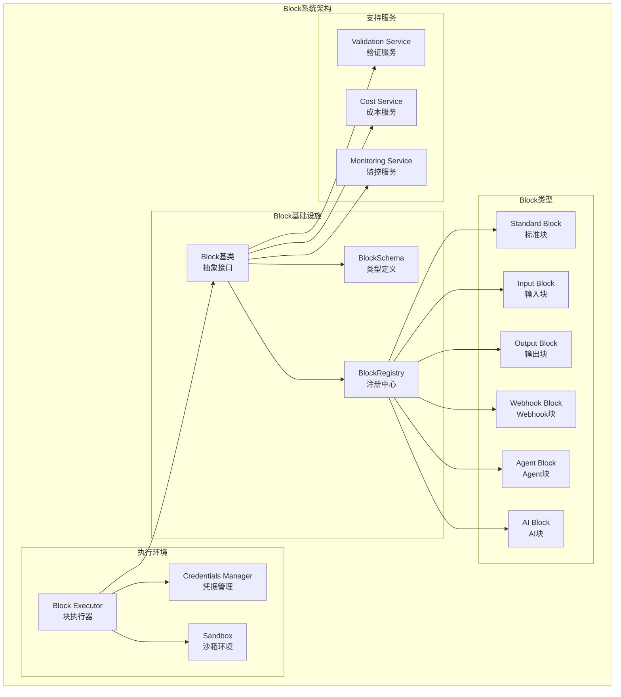
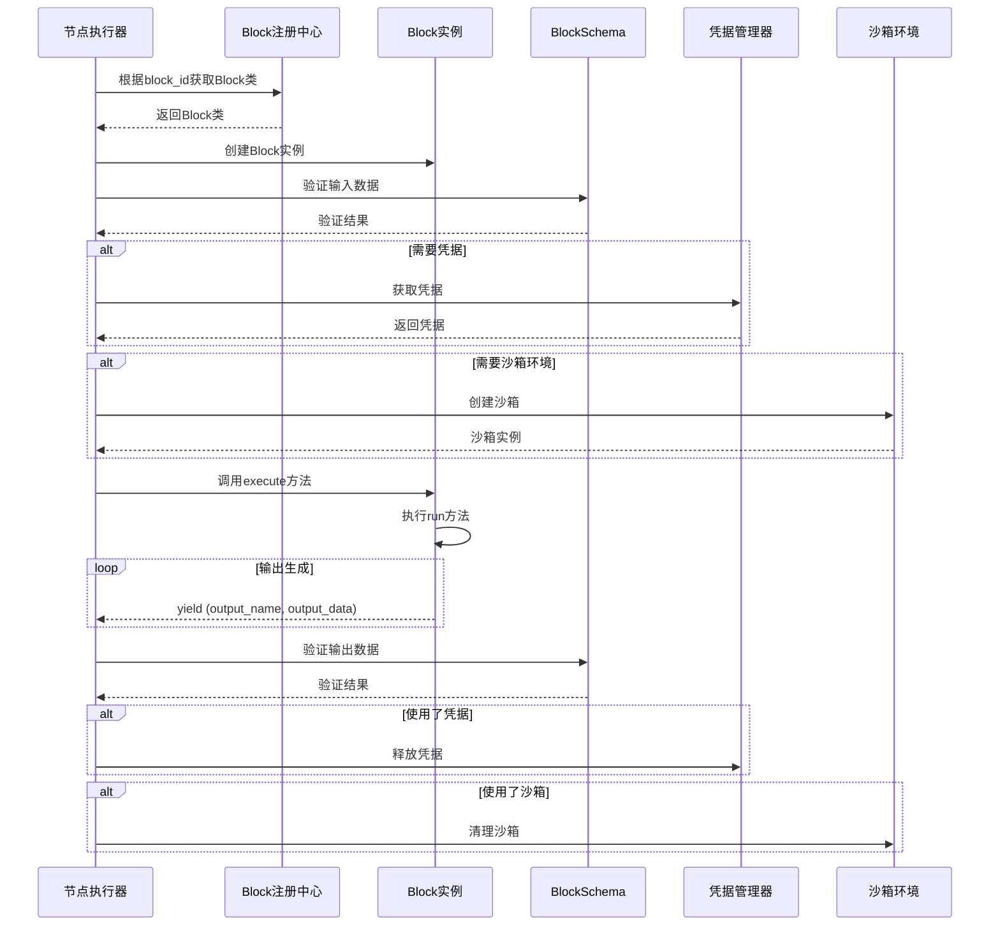

# AutoGPT Block系统模块深度分析

## 模块概述

Block系统是AutoGPT平台的插件化架构核心，提供了可扩展的功能模块框架。每个Block代表一个独立的功能单元，可以是AI模型调用、数据处理、外部服务集成等。Block系统通过标准化的输入输出接口、类型安全的Schema验证和动态加载机制，实现了高度模块化和可扩展的架构。

## 架构图



## 时序图



## 核心类和接口

### 1. Block 抽象基类

**职责**: 定义Block的标准接口和通用行为

```python
class Block(ABC, Generic[BlockSchemaInputType, BlockSchemaOutputType]):
    def __init__(
        self,
        id: str = "",
        description: str = "",
        contributors: list[ContributorDetails] = [],
        categories: set[BlockCategory] | None = None,
        input_schema: Type[BlockSchemaInputType] = EmptySchema,
        output_schema: Type[BlockSchemaOutputType] = EmptySchema,
        test_input: BlockInput | list[BlockInput] | None = None,
        test_output: BlockTestOutput | list[BlockTestOutput] | None = None,
        test_mock: dict[str, Any] | None = None,
        test_credentials: Optional[Credentials | dict[str, Credentials]] = None,
        disabled: bool = False,
        static_output: bool = False,
        block_type: BlockType = BlockType.STANDARD,
        webhook_config: Optional[BlockWebhookConfig | BlockManualWebhookConfig] = None,
    ):
        """
        初始化Block
        
        Args:
            id: Block的唯一标识符，使用UUID格式
            description: Block的功能描述
            contributors: 贡献者列表
            input_schema: 输入数据的Pydantic模型Schema
            output_schema: 输出数据的Pydantic模型Schema
            test_input: 测试输入数据
            test_output: 期望的测试输出
            test_mock: 测试时要模拟的方法
            disabled: 是否禁用该Block
            static_output: 输出链接是否默认为静态
            block_type: Block类型（标准、输入、输出、Webhook等）
            webhook_config: Webhook配置（如果是Webhook类型）
        """
        self.id = id
        self.input_schema = input_schema
        self.output_schema = output_schema
        self.test_input = test_input
        self.test_output = test_output
        self.test_mock = test_mock
        self.test_credentials = test_credentials
        self.description = description
        self.categories = categories or set()
        self.contributors = contributors or set()
        self.disabled = disabled
        self.static_output = static_output
        self.block_type = block_type
        self.webhook_config = webhook_config
        self.execution_stats: NodeExecutionStats = NodeExecutionStats()
        
        # Webhook配置验证
        if self.webhook_config:
            self._validate_webhook_config()

    @abstractmethod
    async def run(self, input_data: BlockSchemaInputType, **kwargs) -> BlockOutput:
        """
        执行Block的核心逻辑
        
        Args:
            input_data: 符合input_schema结构的输入数据
            **kwargs: 额外的执行参数，包括：
                - graph_id: 图ID
                - node_id: 节点ID
                - graph_exec_id: 图执行ID
                - node_exec_id: 节点执行ID
                - user_id: 用户ID
                - user_context: 用户上下文
        
        Returns:
            异步生成器，产生 (output_name, output_data) 元组
            output_name: 输出名称，必须在output_schema中定义
            output_data: 输出数据，必须符合对应的Schema
        """
        if False:  # 满足类型检查器，永不执行
            yield "name", "value"
        raise NotImplementedError(f"{self.name} does not implement the run method.")

    async def execute(self, input_data: BlockInput, **kwargs) -> BlockOutput:
        """
        Block执行的入口点，包含验证和错误处理
        """
        # 输入数据验证
        if error := self.input_schema.validate_data(input_data):
            raise ValueError(f"Unable to execute block with invalid input data: {error}")
        
        # 执行Block
        async for output_name, output_data in self.run(
            self.input_schema(**{k: v for k, v in input_data.items() if v is not None}),
            **kwargs,
        ):
            # 错误输出处理
            if output_name == "error":
                raise RuntimeError(output_data)
            
            # 输出数据验证（标准Block）
            if self.block_type == BlockType.STANDARD and (
                error := self.output_schema.validate_field(output_name, output_data)
            ):
                raise ValueError(f"Block produced an invalid output data: {error}")
            
            yield output_name, output_data

    def _validate_webhook_config(self):
        """验证Webhook配置"""
        if isinstance(self.webhook_config, BlockWebhookConfig):
            # 自动设置Webhook块需要凭据字段
            if not (cred_fields := self.input_schema.get_credentials_fields()):
                raise TypeError("credentials field is required on auto-setup webhook blocks")
            elif len(cred_fields) > 1:
                raise ValueError("Multiple credentials inputs not supported on webhook blocks")
            self.block_type = BlockType.WEBHOOK
        else:
            self.block_type = BlockType.WEBHOOK_MANUAL
        
        # 验证事件过滤器
        if self.webhook_config.event_filter_input:
            event_filter_field = self.input_schema.model_fields[
                self.webhook_config.event_filter_input
            ]
            if not (
                isinstance(event_filter_field.annotation, type)
                and issubclass(event_filter_field.annotation, BaseModel)
                and all(
                    field.annotation is bool
                    for field in event_filter_field.annotation.model_fields.values()
                )
            ):
                raise NotImplementedError(
                    f"{self.name} has an invalid webhook event selector"
                )
        
        # 验证payload输入
        if "payload" not in self.input_schema.model_fields:
            raise TypeError(f"{self.name} is webhook-triggered but has no 'payload' input")
        
        # 如果Webhook功能不可用则禁用
        if not app_config.platform_base_url:
            self.disabled = True
```

### 2. BlockSchema 基类

**职责**: 定义Block的输入输出Schema，提供类型安全和验证功能

```python
class BlockSchema(BaseModel):
    cached_jsonschema: ClassVar[dict[str, Any]]
    
    @classmethod
    def jsonschema(cls) -> dict[str, Any]:
        """生成JSON Schema，用于前端表单生成和数据验证"""
        if cls.cached_jsonschema:
            return cls.cached_jsonschema
        
        # 使用jsonref解析引用
        model = jsonref.replace_refs(cls.model_json_schema(), merge_props=True)
        
        def ref_to_dict(obj):
            """递归处理Schema对象，移除$ref等内部字段"""
            if isinstance(obj, dict):
                # OpenAPI <3.1 不支持与$ref键同级的字段
                # 有时Schema有一个包含1个项目的"allOf"/"anyOf"/"oneOf"
                keys = {"allOf", "anyOf", "oneOf"}
                one_key = next((k for k in keys if k in obj and len(obj[k]) == 1), None)
                if one_key:
                    obj.update(obj[one_key][0])
                
                return {
                    key: ref_to_dict(value)
                    for key, value in obj.items()
                    if not key.startswith("$") and key != one_key
                }
            elif isinstance(obj, list):
                return [ref_to_dict(item) for item in obj]
            
            return obj
        
        cls.cached_jsonschema = cast(dict[str, Any], ref_to_dict(model))
        return cls.cached_jsonschema
    
    @classmethod
    def validate_data(cls, data: BlockInput) -> str | None:
        """验证数据是否符合Schema"""
        return json.validate_with_jsonschema(
            schema=cls.jsonschema(),
            data={k: v for k, v in data.items() if v is not None},
        )
    
    @classmethod
    def validate_field(cls, field_name: str, data: BlockInput) -> str | None:
        """验证特定字段的数据"""
        try:
            property_schema = cls.get_field_schema(field_name)
            jsonschema.validate(json.to_dict(data), property_schema)
            return None
        except jsonschema.ValidationError as e:
            return str(e)
    
    @classmethod
    def get_credentials_fields(cls) -> dict[str, type[CredentialsMetaInput]]:
        """获取凭据字段"""
        return {
            field_name: info.annotation
            for field_name, info in cls.model_fields.items()
            if (
                inspect.isclass(info.annotation)
                and issubclass(
                    get_origin(info.annotation) or info.annotation,
                    CredentialsMetaInput,
                )
            )
        }
    
    @classmethod
    def __pydantic_init_subclass__(cls, **kwargs):
        """Schema定义验证"""
        super().__pydantic_init_subclass__(**kwargs)
        
        # 重置缓存的JSON Schema
        cls.cached_jsonschema = {}
        
        # 验证凭据字段命名规则
        credentials_fields = cls.get_credentials_fields()
        
        for field_name in cls.get_fields():
            if is_credentials_field_name(field_name):
                if field_name not in credentials_fields:
                    raise TypeError(
                        f"Credentials field '{field_name}' on {cls.__qualname__} "
                        f"is not of type {CredentialsMetaInput.__name__}"
                    )
                credentials_fields[field_name].validate_credentials_field_schema(cls)
            elif field_name in credentials_fields:
                raise KeyError(
                    f"Credentials field '{field_name}' on {cls.__qualname__} "
                    "has invalid name: must be 'credentials' or *_credentials"
                )
```

### 3. 具体Block实现示例

#### AI结构化响应生成Block

```python
class AIStructuredResponseGeneratorBlock(Block):
    class Input(BlockSchema):
        llm_model: LlmModel = SchemaField(
            description="LLM model to use for generating the response",
            default=LlmModel.GPT4_TURBO,
        )
        credentials: APIKeyCredentials = SchemaField(
            description="API key for the LLM provider"
        )
        sys_prompt: str = SchemaField(
            description="System prompt to guide the AI's behavior",
            default="You are a helpful assistant that generates structured responses.",
        )
        user_prompt: str = SchemaField(
            description="User prompt describing what to generate"
        )
        response_schema: dict = SchemaField(
            description="JSON schema defining the structure of the expected response"
        )
        max_tokens: int = SchemaField(
            description="Maximum number of tokens to generate",
            default=1000,
        )
    
    class Output(BlockSchema):
        response: dict = SchemaField(
            description="The generated structured response"
        )
        usage: dict = SchemaField(
            description="Token usage information"
        )
        error: str = SchemaField(
            description="Error message if generation failed"
        )
    
    def __init__(self):
        super().__init__(
            id="87840993-2c8e-4c8a-b3c9-dc8d6c5c6e8f",
            description="Generate structured responses using AI models with JSON schema validation",
            categories={BlockCategory.AI},
            input_schema=AIStructuredResponseGeneratorBlock.Input,
            output_schema=AIStructuredResponseGeneratorBlock.Output,
            test_input={
                "credentials": TEST_CREDENTIALS_INPUT,
                "llm_model": LlmModel.GPT4_TURBO.value,
                "sys_prompt": "You are a helpful assistant.",
                "user_prompt": "Generate a person profile",
                "response_schema": {
                    "type": "object",
                    "properties": {
                        "name": {"type": "string"},
                        "age": {"type": "integer"},
                        "occupation": {"type": "string"}
                    },
                    "required": ["name", "age", "occupation"]
                },
                "max_tokens": 500,
            },
            test_output=[
                ("response", {"name": "John Doe", "age": 30, "occupation": "Engineer"}),
                ("usage", {"prompt_tokens": 50, "completion_tokens": 20, "total_tokens": 70}),
            ],
        )
    
    async def run(
        self, input_data: Input, *, credentials: APIKeyCredentials, **kwargs
    ) -> BlockOutput:
        try:
            # 构建消息
            messages = [
                {"role": "system", "content": input_data.sys_prompt},
                {"role": "user", "content": input_data.user_prompt}
            ]
            
            # 调用LLM
            response = await llm_call(
                credentials=credentials,
                llm_model=input_data.llm_model,
                prompt=messages,
                json_format=True,
                max_tokens=input_data.max_tokens,
                response_schema=input_data.response_schema,
            )
            
            # 验证响应格式
            try:
                jsonschema.validate(response["content"], input_data.response_schema)
                yield "response", response["content"]
            except jsonschema.ValidationError as e:
                yield "error", f"Generated response doesn't match schema: {str(e)}"
                return
            
            # 输出使用信息
            if "usage" in response:
                yield "usage", response["usage"]
                
        except Exception as e:
            yield "error", f"Failed to generate structured response: {str(e)}"
```

#### 代码执行Block

```python
class CodeExecutionBlock(Block):
    class Input(BlockSchema):
        credentials: APIKeyCredentials = SchemaField(
            description="API key for the sandbox service"
        )
        code: str = SchemaField(
            description="Code to execute"
        )
        language: ProgrammingLanguage = SchemaField(
            description="Programming language",
            default=ProgrammingLanguage.PYTHON,
        )
        setup_commands: list[str] = SchemaField(
            description="Setup commands to run before code execution",
            default=[],
        )
        timeout: int = SchemaField(
            description="Execution timeout in seconds",
            default=30,
        )
        template_id: str = SchemaField(
            description="Sandbox template ID for pre-configured environment",
            default="",
        )
    
    class Output(BlockSchema):
        response: str = SchemaField(
            description="Execution result"
        )
        stdout_logs: str = SchemaField(
            description="Standard output logs"
        )
        stderr_logs: str = SchemaField(
            description="Standard error logs"
        )
        error: str = SchemaField(
            description="Error message if execution failed"
        )
    
    def __init__(self):
        super().__init__(
            id="7061a5a7-1b4c-4b8e-9b7c-7c5c5c5c5c5c",
            description="Execute code in a secure sandbox environment",
            categories={BlockCategory.DEVELOPER_TOOLS},
            input_schema=CodeExecutionBlock.Input,
            output_schema=CodeExecutionBlock.Output,
            test_input={
                "credentials": TEST_CREDENTIALS_INPUT,
                "code": "print('Hello, World!')",
                "language": ProgrammingLanguage.PYTHON.value,
                "setup_commands": [],
                "timeout": 30,
                "template_id": "",
            },
            test_output=[
                ("response", "Hello, World!"),
                ("stdout_logs", "Hello, World!\n"),
            ],
        )
    
    async def execute_code(
        self,
        code: str,
        language: ProgrammingLanguage,
        setup_commands: list[str],
        timeout: int,
        api_key: str,
        template_id: str,
    ):
        """在沙箱中执行代码"""
        try:
            # 创建沙箱
            sandbox = None
            if template_id:
                sandbox = await AsyncSandbox.create(
                    template=template_id, api_key=api_key, timeout=timeout
                )
            else:
                sandbox = await AsyncSandbox.create(api_key=api_key, timeout=timeout)
            
            if not sandbox:
                raise Exception("Sandbox not created")
            
            # 运行设置命令
            for cmd in setup_commands:
                await sandbox.commands.run(cmd)
            
            # 执行代码
            execution = await sandbox.run_code(
                code,
                language=language.value,
                on_error=lambda e: sandbox.kill(),  # 出错时终止沙箱
            )
            
            if execution.error:
                raise Exception(execution.error)
            
            response = execution.text
            stdout_logs = "".join(execution.logs.stdout)
            stderr_logs = "".join(execution.logs.stderr)
            
            return response, stdout_logs, stderr_logs
            
        except Exception as e:
            raise e
    
    async def run(
        self, input_data: Input, *, credentials: APIKeyCredentials, **kwargs
    ) -> BlockOutput:
        try:
            response, stdout_logs, stderr_logs = await self.execute_code(
                input_data.code,
                input_data.language,
                input_data.setup_commands,
                input_data.timeout,
                credentials.api_key.get_secret_value(),
                input_data.template_id,
            )
            
            if response:
                yield "response", response
            if stdout_logs:
                yield "stdout_logs", stdout_logs
            if stderr_logs:
                yield "stderr_logs", stderr_logs
                
        except Exception as e:
            yield "error", str(e)
```

#### Agent执行Block

```python
class AgentExecutorBlock(Block):
    class Input(BlockSchema):
        user_id: str = SchemaField(description="User ID")
        graph_id: str = SchemaField(description="Graph ID to execute")
        graph_version: int = SchemaField(description="Graph version", default=1)
        inputs: dict = SchemaField(
            description="Input data for the graph",
            default={}
        )
        nodes_input_masks: Optional[dict] = SchemaField(
            description="Node input overrides",
            default=None
        )
    
    class Output(BlockSchema):
        pass  # 动态输出，基于执行的图
    
    def __init__(self):
        super().__init__(
            id="e189baac-8c20-45a1-94a7-55177ea42565",
            description="Executes an existing agent inside your agent",
            input_schema=AgentExecutorBlock.Input,
            output_schema=AgentExecutorBlock.Output,
            block_type=BlockType.AGENT,
            categories={BlockCategory.AGENT},
        )
    
    async def run(self, input_data: Input, **kwargs) -> BlockOutput:
        from backend.executor import utils as execution_utils
        
        # 创建图执行
        graph_exec = await execution_utils.add_graph_execution(
            graph_id=input_data.graph_id,
            graph_version=input_data.graph_version,
            user_id=input_data.user_id,
            inputs=input_data.inputs,
            nodes_input_masks=input_data.nodes_input_masks,
        )
        
        logger = execution_utils.LogMetadata(
            logger=_logger,
            user_id=input_data.user_id,
            graph_eid=graph_exec.id,
            graph_id=input_data.graph_id,
            node_eid="*",
            node_id="*",
            block_name=self.name,
        )
        
        try:
            # 执行图并流式输出结果
            async for name, data in self._run(
                graph_id=input_data.graph_id,
                graph_version=input_data.graph_version,
                graph_exec_id=graph_exec.id,
                user_id=input_data.user_id,
                logger=logger,
            ):
                yield name, data
        except BaseException as e:
            # 出错时停止执行
            await self._stop(
                graph_exec_id=graph_exec.id,
                user_id=input_data.user_id,
                logger=logger,
            )
            logger.warning(
                f"Execution of graph {input_data.graph_id}v{input_data.graph_version} failed: {e}"
            )
            raise
    
    async def _run(
        self,
        graph_id: str,
        graph_version: int,
        graph_exec_id: str,
        user_id: str,
        logger,
    ) -> BlockOutput:
        """监控图执行并流式输出结果"""
        db_client = get_database_manager_async_client()
        
        # 等待执行完成
        while True:
            execution = await db_client.get_graph_execution(graph_exec_id)
            if not execution:
                raise RuntimeError("Graph execution not found")
            
            if execution.status in [ExecutionStatus.COMPLETED, ExecutionStatus.FAILED]:
                break
            elif execution.status == ExecutionStatus.TERMINATED:
                raise RuntimeError("Graph execution was terminated")
            
            await asyncio.sleep(1)  # 轮询间隔
        
        if execution.status == ExecutionStatus.FAILED:
            raise RuntimeError("Graph execution failed")
        
        # 获取输出结果
        output_nodes = await db_client.get_node_executions(
            graph_exec_id,
            block_ids=[AgentOutputBlock().id],
        )
        
        for output_node in output_nodes:
            for output_name, output_data in output_node.output_data.items():
                yield output_name, output_data
    
    async def _stop(self, graph_exec_id: str, user_id: str, logger):
        """停止图执行"""
        try:
            await execution_utils.cancel_graph_execution(
                user_id=user_id,
                graph_exec_id=graph_exec_id,
            )
            logger.info(f"Stopped graph execution {graph_exec_id}")
        except Exception as e:
            logger.error(f"Failed to stop graph execution {graph_exec_id}: {e}")
```

## Block注册和发现机制

### 1. 动态加载机制

```python
def load_all_blocks() -> dict[str, type["Block"]]:
    """动态加载所有Block类"""
    blocks = {}
    
    # 扫描blocks目录下的所有Python文件
    blocks_dir = Path(__file__).parent
    for file_path in blocks_dir.rglob("*.py"):
        if file_path.name.startswith("_"):
            continue
        
        # 动态导入模块
        module_name = f"backend.blocks.{file_path.stem}"
        try:
            module = importlib.import_module(module_name)
            
            # 查找Block子类
            for name, obj in inspect.getmembers(module):
                if (
                    inspect.isclass(obj)
                    and issubclass(obj, Block)
                    and obj is not Block
                    and not obj.__name__.startswith("_")
                ):
                    block_instance = obj()
                    if not block_instance.disabled:
                        blocks[block_instance.id] = obj
                        
        except Exception as e:
            logger.error(f"Failed to load block from {module_name}: {e}")
    
    return blocks

def get_block(block_id: str) -> Block[BlockSchema, BlockSchema] | None:
    """根据ID获取Block实例"""
    cls = get_blocks().get(block_id)
    return cls() if cls else None

@cached()
def get_webhook_block_ids() -> Sequence[str]:
    """获取所有Webhook Block的ID"""
    return [
        id
        for id, B in get_blocks().items()
        if B().block_type in (BlockType.WEBHOOK, BlockType.WEBHOOK_MANUAL)
    ]

@cached()
def get_io_block_ids() -> Sequence[str]:
    """获取所有输入输出Block的ID"""
    return [
        id
        for id, B in get_blocks().items()
        if B().block_type in (BlockType.INPUT, BlockType.OUTPUT)
    ]
```

### 2. Block初始化和同步

```python
async def initialize_blocks() -> None:
    """初始化所有Block，同步到数据库"""
    # 首先同步所有提供商成本到Block
    from backend.sdk.cost_integration import sync_all_provider_costs
    sync_all_provider_costs()
    
    for cls in get_blocks().values():
        block = cls()
        
        # 查找现有Block记录
        existing_block = await AgentBlock.prisma().find_first(
            where={"OR": [{"id": block.id}, {"name": block.name}]}
        )
        
        if not existing_block:
            # 创建新Block记录
            await AgentBlock.prisma().create(
                data=AgentBlockCreateInput(
                    id=block.id,
                    name=block.name,
                    inputSchema=json.dumps(block.input_schema.jsonschema()),
                    outputSchema=json.dumps(block.output_schema.jsonschema()),
                )
            )
            continue
        
        # 更新现有Block记录
        input_schema = json.dumps(block.input_schema.jsonschema())
        output_schema = json.dumps(block.output_schema.jsonschema())
        
        if (
            block.id != existing_block.id
            or block.name != existing_block.name
            or input_schema != existing_block.inputSchema
            or output_schema != existing_block.outputSchema
        ):
            await AgentBlock.prisma().update(
                where={"id": existing_block.id},
                data={
                    "id": block.id,
                    "name": block.name,
                    "inputSchema": input_schema,
                    "outputSchema": output_schema,
                },
            )
```

## 凭据管理系统

### 1. 凭据类型定义

```python
class CredentialsMetaInput(BaseModel):
    """凭据元数据输入"""
    id: str = SchemaField(description="Credential ID")
    provider: Optional[str] = SchemaField(description="Provider name")
    type: Optional[str] = SchemaField(description="Credential type")

class APIKeyCredentials(BaseModel):
    """API密钥凭据"""
    api_key: SecretStr = SchemaField(description="API key")
    
    def bearer(self) -> str:
        """返回Bearer token格式"""
        return f"Bearer {self.api_key.get_secret_value()}"

class OAuth2Credentials(BaseModel):
    """OAuth2凭据"""
    access_token: SecretStr = SchemaField(description="Access token")
    refresh_token: Optional[SecretStr] = SchemaField(description="Refresh token")
    expires_at: Optional[datetime] = SchemaField(description="Token expiration time")
    
    def bearer(self) -> str:
        """返回Bearer token格式"""
        return f"Bearer {self.access_token.get_secret_value()}"
    
    def is_expired(self) -> bool:
        """检查token是否过期"""
        if not self.expires_at:
            return False
        return datetime.now(timezone.utc) >= self.expires_at
```

### 2. 凭据管理器

```python
class IntegrationCredentialsManager:
    """集成凭据管理器"""
    
    def __init__(self):
        self.redis_client = get_redis_client()
        self.db_client = get_database_manager_client()
    
    async def acquire(
        self, user_id: str, credentials_id: str
    ) -> tuple[Credentials, RedisLock]:
        """获取凭据并加锁"""
        # 获取分布式锁
        lock_key = f"credentials_lock:{user_id}:{credentials_id}"
        lock = self.redis_client.lock(lock_key, timeout=300)
        await lock.acquire()
        
        try:
            # 从数据库获取凭据
            credentials = await self.db_client.get_user_credentials(
                user_id, credentials_id
            )
            if not credentials:
                raise ValueError(f"Credentials {credentials_id} not found")
            
            # 检查OAuth token是否需要刷新
            if isinstance(credentials, OAuth2Credentials) and credentials.is_expired():
                credentials = await self._refresh_oauth_token(user_id, credentials)
            
            return credentials, lock
            
        except Exception:
            # 出错时释放锁
            if await lock.locked() and await lock.owned():
                await lock.release()
            raise
    
    async def _refresh_oauth_token(
        self, user_id: str, credentials: OAuth2Credentials
    ) -> OAuth2Credentials:
        """刷新OAuth token"""
        if not credentials.refresh_token:
            raise ValueError("No refresh token available")
        
        # 调用OAuth提供商刷新token
        # 这里是简化的实现，实际需要根据不同提供商实现
        new_credentials = await self._call_oauth_refresh(credentials)
        
        # 更新数据库中的凭据
        await self.db_client.update_user_credentials(user_id, new_credentials)
        
        return new_credentials
```

## 成本管理系统

### 1. Block成本定义

```python
class BlockCost(BaseModel):
    """Block成本定义"""
    cost_amount: int  # 成本金额（以分为单位）
    cost_filter: BlockInput  # 成本过滤条件
    cost_type: BlockCostType  # 成本类型（按次、按字节、按秒）
    
    def __init__(
        self,
        cost_amount: int,
        cost_type: BlockCostType = BlockCostType.RUN,
        cost_filter: Optional[BlockInput] = None,
        **data: Any,
    ) -> None:
        super().__init__(
            cost_amount=cost_amount,
            cost_filter=cost_filter or {},
            cost_type=cost_type,
            **data,
        )

def block_usage_cost(
    block: Block, input_data: BlockInput
) -> tuple[int, BlockInput]:
    """计算Block使用成本"""
    costs = get_block_cost(block)
    
    for cost in costs:
        # 检查成本过滤条件
        if _matches_cost_filter(input_data, cost.cost_filter):
            return cost.cost_amount, cost.cost_filter
    
    return 0, {}

def _matches_cost_filter(input_data: BlockInput, cost_filter: BlockInput) -> bool:
    """检查输入数据是否匹配成本过滤条件"""
    for key, expected_value in cost_filter.items():
        if key not in input_data:
            return False
        
        actual_value = input_data[key]
        if isinstance(expected_value, dict):
            # 嵌套匹配
            if not isinstance(actual_value, dict):
                return False
            if not _matches_cost_filter(actual_value, expected_value):
                return False
        elif actual_value != expected_value:
            return False
    
    return True
```

### 2. 执行成本计算

```python
def execution_usage_cost(execution_count: int) -> tuple[int, int]:
    """计算执行成本"""
    # 基于执行次数的阶梯定价
    if execution_count <= 100:
        cost_per_execution = 1  # 1分/次
    elif execution_count <= 1000:
        cost_per_execution = 2  # 2分/次
    else:
        cost_per_execution = 3  # 3分/次
    
    return cost_per_execution, execution_count
```

## 安全和沙箱机制

### 1. 代码执行沙箱

```python
class AsyncSandbox:
    """异步沙箱环境"""
    
    def __init__(self, sandbox_id: str, api_key: str):
        self.sandbox_id = sandbox_id
        self.api_key = api_key
        self.client = httpx.AsyncClient()
    
    @classmethod
    async def create(
        cls,
        template: Optional[str] = None,
        api_key: str = "",
        timeout: int = 30,
    ) -> "AsyncSandbox":
        """创建新的沙箱实例"""
        payload = {
            "template": template,
            "timeout": timeout,
        }
        
        async with httpx.AsyncClient() as client:
            response = await client.post(
                f"{SANDBOX_API_URL}/sandboxes",
                json=payload,
                headers={"Authorization": f"Bearer {api_key}"},
                timeout=30,
            )
            response.raise_for_status()
            
            data = response.json()
            return cls(data["sandbox_id"], api_key)
    
    async def run_code(
        self,
        code: str,
        language: str = "python",
        on_error: Optional[Callable] = None,
    ) -> "ExecutionResult":
        """在沙箱中执行代码"""
        payload = {
            "code": code,
            "language": language,
        }
        
        try:
            response = await self.client.post(
                f"{SANDBOX_API_URL}/sandboxes/{self.sandbox_id}/execute",
                json=payload,
                headers={"Authorization": f"Bearer {self.api_key}"},
                timeout=60,
            )
            response.raise_for_status()
            
            data = response.json()
            return ExecutionResult(
                text=data.get("result", ""),
                error=data.get("error"),
                logs=ExecutionLogs(
                    stdout=data.get("stdout", []),
                    stderr=data.get("stderr", []),
                ),
            )
            
        except Exception as e:
            if on_error:
                on_error(e)
            raise
    
    async def kill(self):
        """终止沙箱"""
        try:
            await self.client.delete(
                f"{SANDBOX_API_URL}/sandboxes/{self.sandbox_id}",
                headers={"Authorization": f"Bearer {self.api_key}"},
            )
        except Exception as e:
            logger.error(f"Failed to kill sandbox {self.sandbox_id}: {e}")
```

### 2. 输入验证和清理

```python
def sanitize_input(input_data: Any) -> Any:
    """清理输入数据，防止注入攻击"""
    if isinstance(input_data, str):
        # 移除潜在的恶意字符
        input_data = re.sub(r'[<>"\';]', '', input_data)
        # 限制长度
        if len(input_data) > 10000:
            input_data = input_data[:10000]
    elif isinstance(input_data, dict):
        return {k: sanitize_input(v) for k, v in input_data.items()}
    elif isinstance(input_data, list):
        return [sanitize_input(item) for item in input_data]
    
    return input_data

def validate_code_safety(code: str, language: str) -> list[str]:
    """验证代码安全性"""
    warnings = []
    
    if language.lower() == "python":
        # 检查危险的Python操作
        dangerous_patterns = [
            r'import\s+os',
            r'import\s+subprocess',
            r'import\s+sys',
            r'__import__',
            r'eval\s*\(',
            r'exec\s*\(',
            r'open\s*\(',
            r'file\s*\(',
        ]
        
        for pattern in dangerous_patterns:
            if re.search(pattern, code, re.IGNORECASE):
                warnings.append(f"Potentially dangerous operation detected: {pattern}")
    
    return warnings
```

## 测试框架

### 1. Block测试基础设施

```python
class BlockTestRunner:
    """Block测试运行器"""
    
    def __init__(self, block: Block):
        self.block = block
    
    async def run_tests(self) -> list["TestResult"]:
        """运行所有测试"""
        results = []
        
        if not self.block.test_input:
            return results
        
        # 处理单个测试输入或多个测试输入
        test_inputs = (
            self.block.test_input
            if isinstance(self.block.test_input, list)
            else [self.block.test_input]
        )
        
        test_outputs = (
            self.block.test_output
            if isinstance(self.block.test_output, list)
            else [self.block.test_output]
        )
        
        for i, test_input in enumerate(test_inputs):
            expected_output = test_outputs[i] if i < len(test_outputs) else None
            result = await self._run_single_test(test_input, expected_output)
            results.append(result)
        
        return results
    
    async def _run_single_test(
        self, test_input: BlockInput, expected_output: Optional[BlockTestOutput]
    ) -> "TestResult":
        """运行单个测试"""
        try:
            # 应用测试模拟
            with self._apply_mocks():
                # 执行Block
                outputs = {}
                async for output_name, output_data in self.block.execute(
                    test_input, **self._get_test_kwargs()
                ):
                    outputs[output_name] = output_data
                
                # 验证输出
                if expected_output:
                    validation_result = self._validate_output(outputs, expected_output)
                    return TestResult(
                        success=validation_result.success,
                        message=validation_result.message,
                        outputs=outputs,
                    )
                else:
                    return TestResult(
                        success=True,
                        message="Test completed successfully",
                        outputs=outputs,
                    )
                    
        except Exception as e:
            return TestResult(
                success=False,
                message=f"Test failed with exception: {str(e)}",
                outputs={},
            )
    
    def _apply_mocks(self):
        """应用测试模拟"""
        if not self.block.test_mock:
            return contextlib.nullcontext()
        
        patches = []
        for method_name, mock_func in self.block.test_mock.items():
            if hasattr(self.block, method_name):
                patch = unittest.mock.patch.object(
                    self.block, method_name, side_effect=mock_func
                )
                patches.append(patch)
        
        return contextlib.ExitStack().enter_context(*patches)
    
    def _get_test_kwargs(self) -> dict:
        """获取测试执行参数"""
        kwargs = {
            "graph_id": "test_graph",
            "node_id": "test_node",
            "graph_exec_id": "test_exec",
            "node_exec_id": "test_node_exec",
            "user_id": "test_user",
        }
        
        # 添加测试凭据
        if self.block.test_credentials:
            if isinstance(self.block.test_credentials, dict):
                kwargs.update(self.block.test_credentials)
            else:
                kwargs["credentials"] = self.block.test_credentials
        
        return kwargs
```

### 2. 自动化测试

```python
async def run_all_block_tests() -> dict[str, list["TestResult"]]:
    """运行所有Block的测试"""
    results = {}
    
    for block_id, block_cls in get_blocks().items():
        block = block_cls()
        if block.disabled or not block.test_input:
            continue
        
        runner = BlockTestRunner(block)
        test_results = await runner.run_tests()
        results[block_id] = test_results
    
    return results

def generate_test_report(results: dict[str, list["TestResult"]]) -> str:
    """生成测试报告"""
    report = ["# Block Test Report\n"]
    
    total_tests = 0
    passed_tests = 0
    
    for block_id, test_results in results.items():
        report.append(f"## {block_id}")
        
        for i, result in enumerate(test_results):
            total_tests += 1
            if result.success:
                passed_tests += 1
                report.append(f"  ✅ Test {i+1}: PASSED")
            else:
                report.append(f"  ❌ Test {i+1}: FAILED - {result.message}")
        
        report.append("")
    
    report.insert(1, f"**Summary**: {passed_tests}/{total_tests} tests passed\n")
    
    return "\n".join(report)
```

## API接口分析

### 1. Block列表API

#### GET /v1/blocks
**入口函数**: `get_blocks` (在 `autogpt_platform/backend/backend/server/routers/v1.py`)

```python
@router.get("/blocks", response_model=list[BlockInfo])
async def get_blocks(
    user_id: Annotated[str, Depends(get_user_id)],
) -> list[BlockInfo]:
    """获取所有可用的Block列表"""
    try:
        blocks = []
        for block_cls in get_blocks().values():
            block = block_cls()
            
            # 检查Block是否可用
            if block.disabled:
                continue
            
            # 检查认证配置
            if not is_block_auth_configured(block_cls):
                continue
            
            blocks.append(block.get_info())
        
        return blocks
    except Exception as e:
        logger.exception(f"Error getting blocks: {e}")
        raise HTTPException(status_code=500, detail=str(e))
```

**调用链路**:
1. `get_blocks` (REST API)
2. `get_blocks()` (获取所有Block类)
3. `is_block_auth_configured()` (检查认证配置)
4. `block.get_info()` (获取Block信息)

### 2. Block执行API

#### POST /v1/blocks/{block_id}/execute
**入口函数**: `execute_block`

```python
@router.post(
    "/blocks/{block_id}/execute",
    response_model=dict,
    dependencies=[Depends(rate_limit_middleware)],
)
async def execute_block(
    block_id: str,
    request: ExecuteBlockRequest,
    user_id: Annotated[str, Depends(get_user_id)],
) -> dict:
    """执行指定的Block"""
    try:
        # 获取Block实例
        block = get_block(block_id)
        if not block:
            raise HTTPException(status_code=404, detail="Block not found")
        
        if block.disabled:
            raise HTTPException(status_code=400, detail="Block is disabled")
        
        # 执行Block
        outputs = {}
        async for output_name, output_data in block.execute(
            request.input_data,
            user_id=user_id,
            graph_id="direct_execution",
            node_id="direct_node",
            graph_exec_id="direct_exec",
            node_exec_id="direct_node_exec",
        ):
            outputs[output_name] = output_data
        
        return outputs
        
    except ValueError as e:
        raise HTTPException(status_code=400, detail=str(e))
    except Exception as e:
        logger.exception(f"Error executing block {block_id}: {e}")
        raise HTTPException(status_code=500, detail=str(e))
```

## 实战经验

### 1. Block开发最佳实践

#### Schema设计
- **明确的字段描述**: 每个字段都要有清晰的description
- **合理的默认值**: 为可选字段提供合理的默认值
- **类型安全**: 使用强类型定义，避免Any类型
- **验证规则**: 添加必要的验证规则和约束

#### 错误处理
- **分类错误**: 区分用户错误和系统错误
- **详细错误信息**: 提供有助于调试的错误信息
- **优雅降级**: 部分功能失败不影响整体执行
- **资源清理**: 确保异常情况下资源得到正确释放

#### 性能优化
- **异步执行**: 使用async/await处理I/O密集操作
- **流式输出**: 大数据量使用生成器避免内存问题
- **缓存策略**: 缓存昂贵的计算结果
- **连接复用**: 复用HTTP连接和数据库连接

### 2. 凭据管理最佳实践

#### 安全存储
- **加密存储**: 敏感信息必须加密存储
- **访问控制**: 严格的权限控制和审计
- **定期轮换**: 定期更新API密钥和token
- **最小权限**: 只授予必要的权限

#### Token管理
- **自动刷新**: OAuth token自动刷新机制
- **过期检查**: 使用前检查token是否过期
- **并发控制**: 防止并发刷新导致的竞态条件
- **错误恢复**: token失效时的恢复策略

### 3. 测试策略

#### 单元测试
- **输入验证测试**: 测试各种输入情况
- **输出验证测试**: 验证输出格式和内容
- **异常处理测试**: 测试错误情况的处理
- **边界条件测试**: 测试极限情况

#### 集成测试
- **端到端测试**: 完整的执行流程测试
- **依赖服务测试**: 测试外部服务集成
- **性能测试**: 负载和压力测试
- **安全测试**: 安全漏洞扫描

### 4. 监控和运维

#### 指标监控
- **执行次数**: 统计Block执行频率
- **成功率**: 监控执行成功率
- **执行时间**: 跟踪执行性能
- **资源使用**: 监控CPU、内存使用

#### 日志记录
- **结构化日志**: 使用结构化格式便于分析
- **关键事件**: 记录重要的执行事件
- **错误详情**: 详细记录错误信息和堆栈
- **性能指标**: 记录执行时间和资源使用

### 5. 扩展性设计

#### 插件机制
- **热插拔**: 支持运行时加载和卸载Block
- **版本管理**: Block版本控制和兼容性
- **依赖管理**: 处理Block间的依赖关系
- **配置管理**: 灵活的配置机制

#### 分布式部署
- **无状态设计**: Block执行无状态化
- **负载均衡**: 支持多实例负载均衡
- **故障转移**: 自动故障检测和转移
- **弹性扩缩**: 根据负载自动扩缩容

## 总结

Block系统是AutoGPT平台的核心插件化架构，通过标准化的接口定义、类型安全的Schema验证、灵活的凭据管理和完善的测试框架，实现了高度可扩展和可维护的功能模块系统。关键特性包括：

1. **标准化接口**: 统一的Block基类和Schema定义
2. **类型安全**: Pydantic模型确保数据类型安全
3. **动态加载**: 运行时发现和加载Block
4. **凭据管理**: 安全的凭据存储和管理机制
5. **沙箱执行**: 安全的代码执行环境
6. **成本控制**: 精细化的成本计算和控制
7. **测试框架**: 完整的自动化测试支持
8. **监控运维**: 全面的监控和日志记录

该系统为AutoGPT平台提供了强大的功能扩展能力，支持各种AI模型、外部服务和数据处理功能的集成。

