## 概述

AutoGPT共享库(`autogpt_libs`)是平台的核心基础设施层，提供了认证、日志、限流、工具函数等跨服务的通用功能。采用模块化设计，支持配置化部署，为整个AutoGPT平台提供了企业级的安全性、可观测性和可靠性保障。

<!--more-->

### 方法与范围

- 以源码为事实来源，逐段验证并给出可复现实验与调用链。
- 结构/时序图基于源码关系绘制，不引述外部资料。
- 从实现细节抽取可复用模式与边界条件。

## 1. 共享库整体架构

### 1.1 核心设计原则

- **模块化设计**：每个功能模块独立封装，支持按需引用
- **配置驱动**：基于Pydantic的配置管理，支持环境变量和配置文件
- **类型安全**：全面使用Python类型注解，提供IDE智能提示
- **企业级特性**：支持分布式部署、高可用、监控告警
- **标准化接口**：统一的API设计，便于跨项目复用

### 1.2 共享库模块架构图

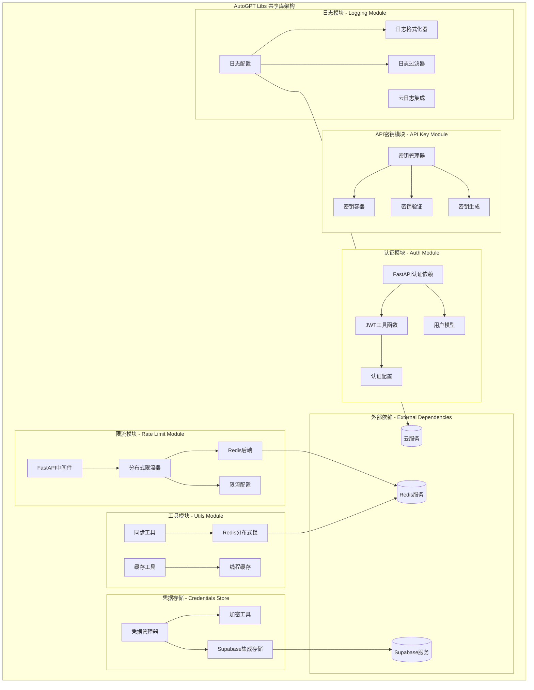
```mermaid
graph TB
    subgraph "AutoGPT Libs 共享库架构"
        subgraph "认证模块 - Auth Module"
            JWTUtils[JWT工具函数]
            AuthDeps[FastAPI认证依赖]
            UserModel[用户模型]
            AuthConfig[认证配置]
        end
        
        subgraph "日志模块 - Logging Module"
            LogConfig[日志配置]
            Formatters[日志格式化器]
            Filters[日志过滤器]
            CloudLogging[云日志集成]
        end
        
        subgraph "限流模块 - Rate Limit Module"
            RateLimiter[分布式限流器]
            RLMiddleware[FastAPI中间件]
            RedisBackend[Redis后端]
            RLConfig[限流配置]
        end
        
        subgraph "API密钥模块 - API Key Module"
            KeyManager[密钥管理器]
            KeyContainer[密钥容器]
            KeyValidation[密钥验证]
            KeyGeneration[密钥生成]
        end
        
        subgraph "工具模块 - Utils Module"
            Synchronization[同步工具]
            CacheUtils[缓存工具]
            RedisKeyedMutex[Redis分布式锁]
            ThreadCache[线程缓存]
        end
        
        subgraph "凭据存储 - Credentials Store"
            SupabaseStore[Supabase集成存储]
            CredentialsManager[凭据管理器]
            EncryptionUtils[加密工具]
        end
        
        subgraph "外部依赖 - External Dependencies"
            Redis[(Redis服务)]
            Supabase[(Supabase服务)]
            CloudServices[(云服务)]
        end
    end
    
    %% 连接关系
    JWTUtils --> AuthConfig
    AuthDeps --> JWTUtils
    AuthDeps --> UserModel
    
    LogConfig --> Formatters
    LogConfig --> Filters
    LogConfig --> CloudServices
    
    RateLimiter --> RedisBackend
    RLMiddleware --> RateLimiter
    RateLimiter --> RLConfig
    RedisBackend --> Redis
    
    KeyManager --> KeyContainer
    KeyManager --> KeyValidation
    KeyManager --> KeyGeneration
    
    Synchronization --> RedisKeyedMutex
    CacheUtils --> ThreadCache
    RedisKeyedMutex --> Redis
    
    SupabaseStore --> Supabase
    CredentialsManager --> EncryptionUtils
    CredentialsManager --> SupabaseStore
```

### 1.3 依赖关系图

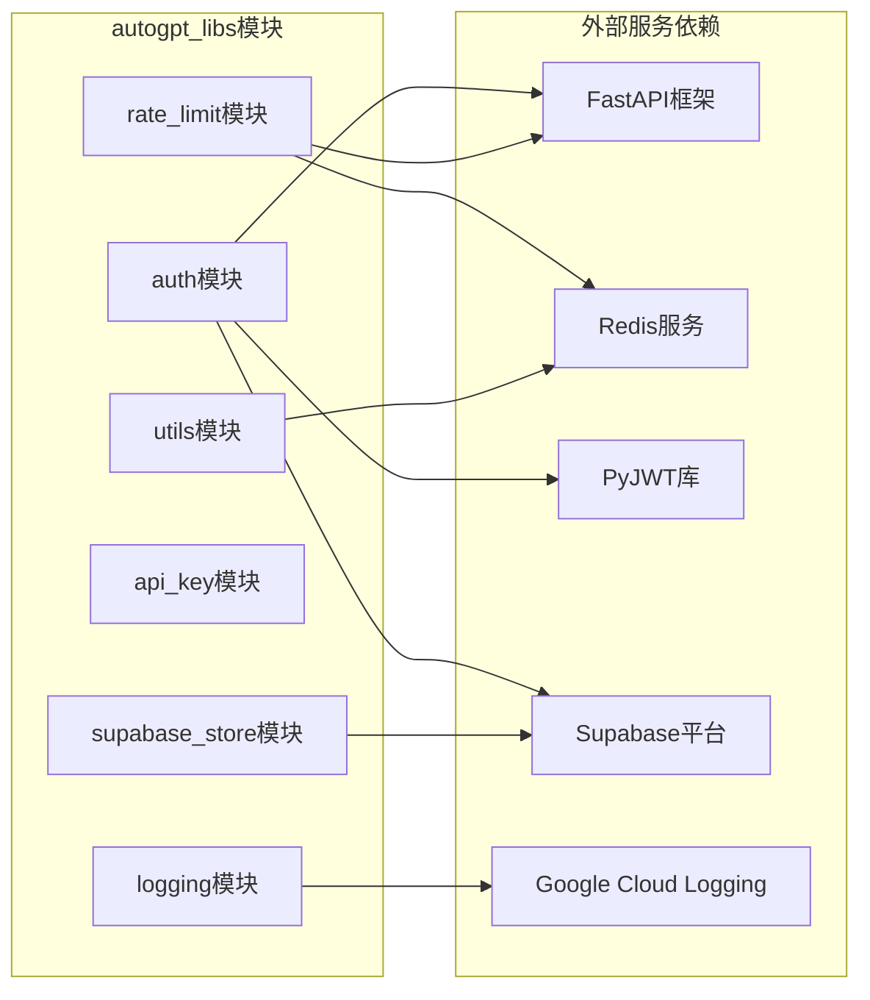
```mermaid
graph LR
    subgraph "外部服务依赖"
        FastAPI[FastAPI框架]
        Redis[Redis服务]
        JWT[PyJWT库]
        Supabase[Supabase平台]
        CloudLogging[Google Cloud Logging]
    end
    
    subgraph "autogpt_libs模块"
        Auth[auth模块]
        Logging[logging模块]  
        RateLimit[rate_limit模块]
        APIKey[api_key模块]
        Utils[utils模块]
        Store[supabase_store模块]
    end
    
    Auth --> FastAPI
    Auth --> JWT
    Auth --> Supabase
    
    RateLimit --> FastAPI
    RateLimit --> Redis
    
    Logging --> CloudLogging
    
    Utils --> Redis
    
    Store --> Supabase
```

### 1.4 关键函数与调用链总览

- 认证（Auth）
  - 核心函数：`get_jwt_payload` → `parse_jwt_token` → `verify_user`
  - 典型调用链：受保护端点 → `requires_user`/`requires_admin_user` → `get_jwt_payload` → `parse_jwt_token` → `verify_user` → 返回 `User`
  - 文档修正：`add_auth_responses_to_openapi` 注入 401 响应以匹配 `HTTPBearer(auto_error=False)` 行为

- 限流（Rate Limit）
  - 核心函数：`rate_limit_middleware` → `extract_rate_limit_key` → `RateLimiter.check_rate_limit` → 添加 `X-RateLimit-*` 头
  - 典型调用链：请求进入 → 中间件匹配豁免/提取标识 → Redis Pipeline（ZREM/ZADD/ZCOUNT/EXPIRE） → 放行/429

- 日志（Logging）
  - 核心函数：`configure_logging` → `setup_file_logging`/`setup_cloud_logging`，格式化器：`StructuredFormatter`/`JSONFormatter`
  - 典型调用链：业务 logger → Formatter → Handler(Console/File/Cloud) → Sink

- 工具（Utils）
  - 核心函数：`AsyncRedisKeyedMutex.locked` → `acquire`/`release`；`@thread_cached`（sync/async）
  - 典型调用链：进入临界区 → Redis 分布式锁 SET NX PX → 执行 → DEL（owned）

- API 密钥（API Key）
  - 核心函数：`APIKeyManager.generate_api_key`、`verify_api_key`、`mask_api_key`、`validate_key_format`
  - 典型调用链：生成 raw+hash → 仅持久化 hash → 验证时 sha256(raw) 对比 `hash`

- 集成凭据（Supabase Integration Credentials）
  - 核心函数：`OAuth2Credentials.bearer`、`APIKeyCredentials.bearer`
  - 典型调用链：构造凭据对象 → `bearer()` → Authorization 头拼装

### 1.5 跨模块端到端时序图（请求 → 限流 → 鉴权 → 路由 → 日志）

```mermaid
sequenceDiagram
    participant C as Client
    participant AS as ASGI/FastAPI
    participant RL as RateLimit MW
    participant AU as Auth Dep
    participant RT as Route Handler
    participant LG as Logging

    C->>AS: HTTP Request
    AS->>RL: process(request)
    alt Exempt or no key
        RL-->>AS: pass-through
    else With key
        RL->>RL: extract_rate_limit_key()
        RL->>RL: RateLimiter.check_rate_limit()
        alt Not limited
            RL-->>AS: continue (+X-RateLimit-*)
        else Limited
            RL-->>C: 429 Too Many Requests
            return
        end
    end

    AS->>AU: Security(get_jwt_payload)
    AU->>AU: parse_jwt_token()
    AU->>AU: verify_user()
    AU-->>AS: User

    AS->>RT: call(user)
    RT->>LG: logger.info/debug/error(extra=ctx)
    LG-->>RT: formatted output → sinks
    RT-->>C: 2xx/4xx (+X-RateLimit-*)
```

## 2. JWT认证系统 (auth模块)

### 2.1 认证系统架构

基于 `auth` 模块源码复核后的最小正确用法与工程化取舍：

- 依赖注入优先：`Security(HTTPBearer)` 搭配自定义 `auto_error=False` 与 OpenAPI 补丁，避免 403/401 失配。
- 观测先行：所有分支路径均打点日志（含 payload 关键字段），便于追溯 token 问题与角色漂移。
- 失败即快：认证失败统一 401，最小暴露攻击面；管理员校验与用户校验分离，降低权限判定耦合。

#### 2.1.1 核心组件结构图

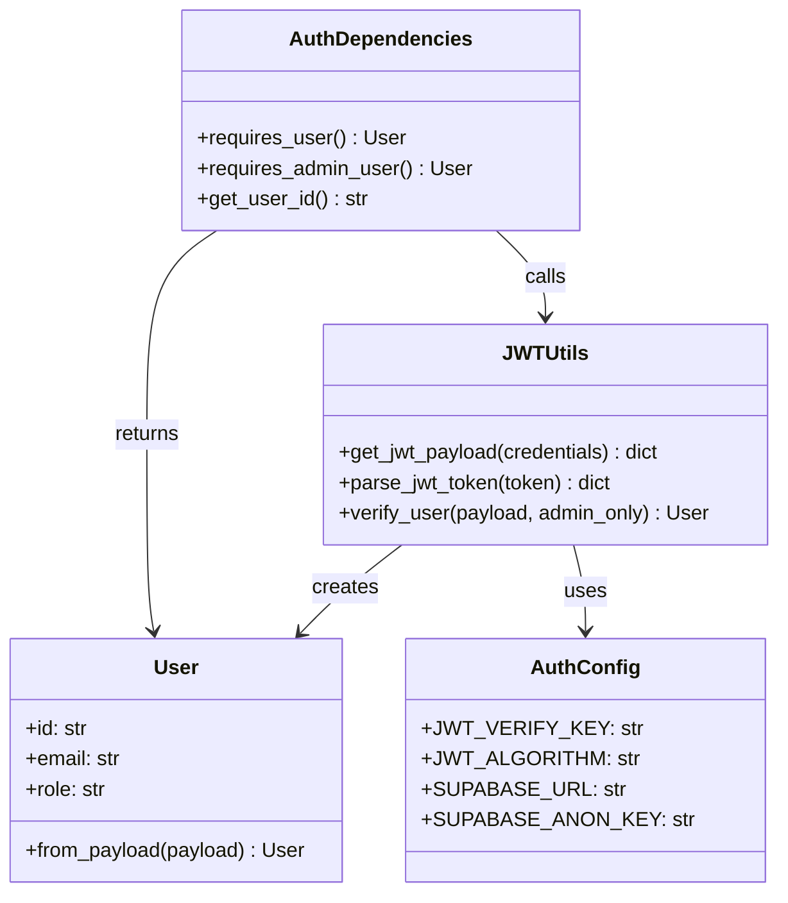
```mermaid
classDiagram
    class JWTUtils {
        +get_jwt_payload(credentials) dict
        +parse_jwt_token(token) dict
        +verify_user(payload, admin_only) User
    }
    
    class AuthDependencies {
        +requires_user() User
        +requires_admin_user() User
        +get_user_id() str
    }
    
    class User {
        +id: str
        +email: str
        +role: str
        +from_payload(payload) User
    }
    
    class AuthConfig {
        +JWT_VERIFY_KEY: str
        +JWT_ALGORITHM: str
        +SUPABASE_URL: str
        +SUPABASE_ANON_KEY: str
    }
    
    JWTUtils --> User : creates
    JWTUtils --> AuthConfig : uses
    AuthDependencies --> JWTUtils : calls
    AuthDependencies --> User : returns
```

### 2.2 JWT工具函数实现

```python
# /autogpt_platform/autogpt_libs/autogpt_libs/auth/jwt_utils.py

import logging
from typing import Any
import jwt
from fastapi import HTTPException, Security
from fastapi.security import HTTPAuthorizationCredentials, HTTPBearer
from .config import get_settings
from .models import User

logger = logging.getLogger(__name__)

# Bearer token认证方案
bearer_jwt_auth = HTTPBearer(
    bearerFormat="jwt", 
    scheme_name="HTTPBearerJWT", 
    auto_error=False
)

def get_jwt_payload(
    credentials: HTTPAuthorizationCredentials | None = Security(bearer_jwt_auth),
) -> dict[str, Any]:
    """
    从HTTP Authorization头部提取和验证JWT载荷
    
    这是核心认证函数，处理以下功能：
    - 从Authorization头部读取JWT令牌
    - 验证JWT令牌的签名
    - 解码JWT令牌的载荷
    
    参数:
        credentials: Bearer token中的HTTP Authorization凭据
        
    返回:
        JWT载荷字典
        
    异常:
        HTTPException: 认证失败时抛出401错误
    """
    if not credentials:
        raise HTTPException(
            status_code=401, 
            detail="Authorization header is missing"
        )

    try:
        payload = parse_jwt_token(credentials.credentials)
        logger.debug("Token decoded successfully")
        return payload
    except ValueError as e:
        logger.warning(f"Token validation failed: {e}")
        raise HTTPException(status_code=401, detail=str(e))

def parse_jwt_token(token: str) -> dict[str, Any]:
    """
    解析和验证JWT令牌
    
    功能特性：
    1. 使用配置的验证密钥验证签名
    2. 检查令牌是否过期
    3. 验证audience声明
    4. 返回解码的载荷
    
    参数:
        token: 要解析的JWT令牌
        
    返回:
        解码后的载荷字典
        
    异常:
        ValueError: 令牌无效或过期时抛出
    """
    settings = get_settings()
    
    try:
        # JWT解码和验证
        payload = jwt.decode(
            token,
            settings.JWT_VERIFY_KEY,          # 验证密钥
            algorithms=[settings.JWT_ALGORITHM],  # 支持的算法
            audience="authenticated",         # 预期audience
        )
        
        logger.debug(f"JWT解码成功，用户ID: {payload.get('sub', 'unknown')}")
        return payload
        
    except jwt.ExpiredSignatureError:
        logger.warning("JWT令牌已过期")
        raise ValueError("Token has expired")
        
    except jwt.InvalidAudienceError:
        logger.warning("JWT令牌audience无效")
        raise ValueError("Invalid token audience")
        
    except jwt.InvalidSignatureError:
        logger.warning("JWT令牌签名无效")
        raise ValueError("Invalid token signature")
        
    except jwt.InvalidTokenError as e:
        logger.warning(f"JWT令牌无效: {e}")
        raise ValueError(f"Invalid token: {str(e)}")

def verify_user(jwt_payload: dict | None, admin_only: bool) -> User:
    """
    验证用户身份和权限
    
    验证流程：
    1. 检查JWT载荷是否存在
    2. 提取用户ID (sub字段)
    3. 如果需要管理员权限，验证角色
    4. 创建User对象
    
    参数:
        jwt_payload: JWT载荷字典
        admin_only: 是否只允许管理员用户
        
    返回:
        验证成功的User对象
        
    异常:
        HTTPException: 认证失败时抛出401/403错误
    """
    if jwt_payload is None:
        raise HTTPException(
            status_code=401, 
            detail="Authorization header is missing"
        )

    # 提取用户ID
    user_id = jwt_payload.get("sub")
    if not user_id:
        logger.warning("JWT载荷中未找到用户ID")
        raise HTTPException(
            status_code=401, 
            detail="User ID not found in token"
        )

    # 管理员权限检查
    if admin_only:
        user_role = jwt_payload.get("role", "").lower()
        if user_role != "admin":
            logger.warning(f"用户 {user_id} 尝试访问管理员功能，角色: {user_role}")
            raise HTTPException(
                status_code=403, 
                detail="Admin access required"
            )

    # 创建用户对象
    try:
        user = User.from_payload(jwt_payload)
        logger.debug(f"用户验证成功: {user.email} ({user.role})")
        return user
    except Exception as e:
        logger.error(f"创建用户对象失败: {e}")
        raise HTTPException(
            status_code=401, 
            detail="Invalid user data in token"
        )
```

### 2.3 FastAPI依赖函数

#### 2.3.1 认证请求时序图

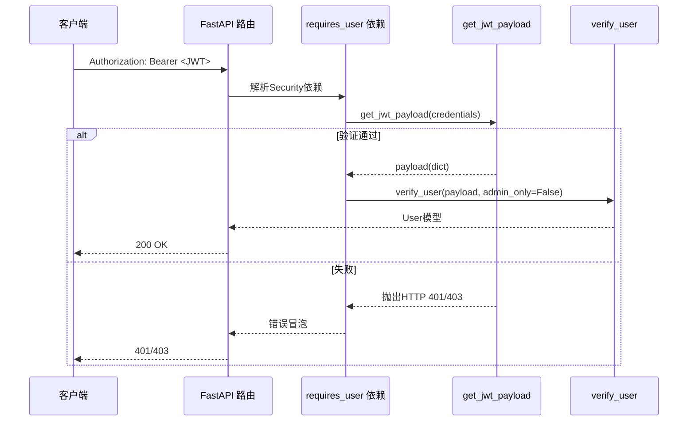
```mermaid
sequenceDiagram
    participant Client as 客户端
    participant API as FastAPI 路由
    participant Dep as requires_user 依赖
    participant JWT as get_jwt_payload
    participant Verify as verify_user

    Client->>API: Authorization: Bearer <JWT>
    API->>Dep: 解析Security依赖
    Dep->>JWT: get_jwt_payload(credentials)
    alt 验证通过
        JWT-->>Dep: payload(dict)
        Dep->>Verify: verify_user(payload, admin_only=False)
        Verify-->>API: User模型
        API-->>Client: 200 OK
    else 失败
        JWT-->>Dep: 抛出HTTP 401/403
        Dep-->>API: 错误冒泡
        API-->>Client: 401/403
    end
```

#### 关键函数调用路径（认证）

- 受保护端点 -> requires_user -> get_jwt_payload -> parse_jwt_token -> verify_user(admin_only=False) -> User.from_payload
- 管理员端点 -> requires_admin_user -> get_jwt_payload -> parse_jwt_token -> verify_user(admin_only=True) -> User.from_payload
- 获取用户ID -> get_user_id -> get_jwt_payload -> parse_jwt_token

```python
# /autogpt_platform/autogpt_libs/autogpt_libs/auth/dependencies.py

import fastapi
from .jwt_utils import get_jwt_payload, verify_user
from .models import User

def requires_user(jwt_payload: dict = fastapi.Security(get_jwt_payload)) -> User:
    """
    FastAPI依赖函数：要求有效的已认证用户
    
    使用场景：
    - 需要用户登录的API端点
    - 用户个人数据访问
    - 一般权限保护的资源
    
    使用示例:
        @app.get("/api/user/profile")
        async def get_profile(user: User = Depends(requires_user)):
            return {"user_id": user.id, "email": user.email}
    
    参数:
        jwt_payload: 由get_jwt_payload依赖注入的JWT载荷
        
    返回:
        验证成功的User对象
        
    异常:
        HTTPException: 认证失败时抛出401错误
    """
    return verify_user(jwt_payload, admin_only=False)

def requires_admin_user(jwt_payload: dict = fastapi.Security(get_jwt_payload)) -> User:
    """
    FastAPI依赖函数：要求有效的管理员用户
    
    使用场景：
    - 管理员专用API端点
    - 系统配置管理
    - 用户管理功能
    - 敏感数据访问
    
    使用示例:
        @app.delete("/api/admin/users/{user_id}")
        async def delete_user(
            user_id: str,
            admin: User = Depends(requires_admin_user)
        ):
            # 执行管理员操作
            pass
    
    参数:
        jwt_payload: 由get_jwt_payload依赖注入的JWT载荷
        
    返回:
        验证成功的管理员User对象
        
    异常:
        HTTPException: 认证失败时抛出401错误，权限不足时抛出403错误
    """
    return verify_user(jwt_payload, admin_only=True)

def get_user_id(jwt_payload: dict = fastapi.Security(get_jwt_payload)) -> str:
    """
    FastAPI依赖函数：返回已认证用户的ID
    
    使用场景：
    - 只需要用户ID的轻量级端点
    - 日志记录和审计
    - 资源所有权验证
    
    使用示例:
        @app.get("/api/user/settings")
        async def get_settings(user_id: str = Depends(get_user_id)):
            return await load_user_settings(user_id)
    
    参数:
        jwt_payload: 由get_jwt_payload依赖注入的JWT载荷
        
    返回:
        用户ID字符串
        
    异常:
        HTTPException: 认证失败或JWT中缺少用户ID时抛出401错误
    """
    user_id = jwt_payload.get("sub")
    if not user_id:
        raise fastapi.HTTPException(
            status_code=401, 
            detail="User ID not found in token"
        )
    return user_id
```

### 2.6 OpenAPI 鉴权响应修正（helpers.py）

在使用 `HTTPBearer(auto_error=False)` 时，FastAPI 默认不会为受保护端点自动生成 401 响应描述。共享库通过 `add_auth_responses_to_openapi` 为所有带有 `HTTPBearerJWT` 安全需求的端点注入统一的 401 响应，确保 OpenAPI 文档与实际鉴权行为一致。

```python
# file: autogpt_platform/autogpt_libs/autogpt_libs/auth/helpers.py
from fastapi import FastAPI
from fastapi.openapi.utils import get_openapi

from .jwt_utils import bearer_jwt_auth


def add_auth_responses_to_openapi(app: FastAPI) -> None:
    """
    Set up custom OpenAPI schema generation that adds 401 responses
    to all authenticated endpoints.

    This is needed when using HTTPBearer with auto_error=False to get proper
    401 responses instead of 403, but FastAPI only automatically adds security
    responses when auto_error=True.
    """

    def custom_openapi():
        if app.openapi_schema:
            return app.openapi_schema

        openapi_schema = get_openapi(
            title=app.title,
            version=app.version,
            description=app.description,
            routes=app.routes,
        )

        # Add 401 response to all endpoints that have security requirements
        for path, methods in openapi_schema["paths"].items():
            for method, details in methods.items():
                security_schemas = [
                    schema
                    for auth_option in details.get("security", [])
                    for schema in auth_option.keys()
                ]
                if bearer_jwt_auth.scheme_name not in security_schemas:
                    continue

                if "responses" not in details:
                    details["responses"] = {}

                details["responses"]["401"] = {
                    "$ref": "#/components/responses/HTTP401NotAuthenticatedError"
                }

        # Ensure #/components/responses exists
        if "components" not in openapi_schema:
            openapi_schema["components"] = {}
        if "responses" not in openapi_schema["components"]:
            openapi_schema["components"]["responses"] = {}

        # Define 401 response
        openapi_schema["components"]["responses"]["HTTP401NotAuthenticatedError"] = {
            "description": "Authentication required",
            "content": {
                "application/json": {
                    "schema": {
                        "type": "object",
                        "properties": {"detail": {"type": "string"}},
                    }
                }
            },
        }

        app.openapi_schema = openapi_schema
        return app.openapi_schema

    app.openapi = custom_openapi
```

#### 2.6.1 文档生成修正时序图

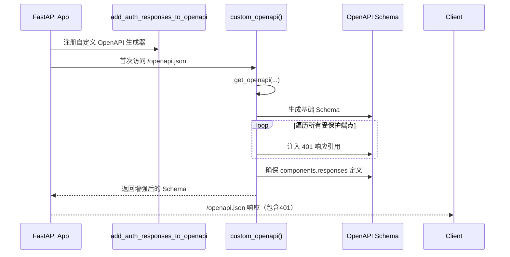
```mermaid
sequenceDiagram
    participant App as FastAPI App
    participant Helper as add_auth_responses_to_openapi
    participant OpenAPI as custom_openapi()
    participant Schema as OpenAPI Schema

    App->>Helper: 注册自定义 OpenAPI 生成器
    App->>OpenAPI: 首次访问 /openapi.json
    OpenAPI->>OpenAPI: get_openapi(...)
    OpenAPI->>Schema: 生成基础 Schema
    loop 遍历所有受保护端点
        OpenAPI->>Schema: 注入 401 响应引用
    end
    OpenAPI->>Schema: 确保 components.responses 定义
    OpenAPI-->>App: 返回增强后的 Schema
    App-->>Client: /openapi.json 响应（包含401）
```

#### 关键函数调用路径（OpenAPI 文档）

- OpenAPI 文档增强 -> add_auth_responses_to_openapi -> custom_openapi -> get_openapi -> 遍历受保护端点 -> 注入401响应

### 2.4 用户模型定义

```python
# /autogpt_platform/autogpt_libs/autogpt_libs/auth/models.py

from datetime import datetime
from typing import Optional
from pydantic import BaseModel, Field, EmailStr

class User(BaseModel):
    """
    用户模型
    
    包含用户的基本信息和权限数据，从JWT载荷中构建。
    """
    
    id: str = Field(..., description="用户唯一标识符")
    email: EmailStr = Field(..., description="用户邮箱地址")
    role: str = Field(default="user", description="用户角色")
    name: Optional[str] = Field(None, description="用户显示名称")
    created_at: Optional[datetime] = Field(None, description="账户创建时间")
    last_sign_in: Optional[datetime] = Field(None, description="最后登录时间")
    
    @classmethod
    def from_payload(cls, payload: dict) -> "User":
        """
        从JWT载荷创建User对象
        
        JWT载荷字段映射：
        - sub: 用户ID
        - email: 邮箱地址
        - role: 用户角色
        - user_metadata.name: 显示名称
        - created_at: 创建时间
        - last_sign_in_at: 最后登录时间
        
        参数:
            payload: JWT载荷字典
            
        返回:
            User对象实例
        """
        user_metadata = payload.get("user_metadata", {})
        
        # 处理时间字段
        created_at = None
        if created_at_str := payload.get("created_at"):
            try:
                created_at = datetime.fromisoformat(created_at_str.replace("Z", "+00:00"))
            except (ValueError, AttributeError):
                pass
        
        last_sign_in = None
        if last_sign_in_str := payload.get("last_sign_in_at"):
            try:
                last_sign_in = datetime.fromisoformat(last_sign_in_str.replace("Z", "+00:00"))
            except (ValueError, AttributeError):
                pass
        
        return cls(
            id=payload["sub"],
            email=payload["email"],
            role=payload.get("role", "user"),
            name=user_metadata.get("name"),
            created_at=created_at,
            last_sign_in=last_sign_in,
        )
    
    @property
    def is_admin(self) -> bool:
        """检查用户是否为管理员"""
        return self.role.lower() == "admin"
    
    @property
    def display_name(self) -> str:
        """获取用户显示名称，优先使用name，否则使用email"""
        return self.name or self.email.split("@")[0]
```

### 2.5 认证配置管理

```python
# /autogpt_platform/autogpt_libs/autogpt_libs/auth/config.py

import os
from typing import Optional
from pydantic import Field, field_validator
from pydantic_settings import BaseSettings, SettingsConfigDict

class AuthConfigError(ValueError):
    """认证配置错误异常"""
    pass

class Settings(BaseSettings):
    """
    认证模块配置类
    
    支持通过环境变量和配置文件进行配置，
    提供完整的JWT和Supabase集成配置选项。
    """
    
    model_config = SettingsConfigDict(
        env_file=".env",
        env_file_encoding="utf-8",
        case_sensitive=True,
        extra="ignore"
    )
    
    # JWT配置
    JWT_VERIFY_KEY: str = Field(
        ...,
        description="JWT验证公钥或密钥",
        min_length=1
    )
    
    JWT_ALGORITHM: str = Field(
        default="HS256",
        description="JWT签名算法",
        pattern="^(HS256|HS384|HS512|RS256|RS384|RS512|ES256|ES384|ES512)$"
    )
    
    # Supabase配置
    SUPABASE_URL: Optional[str] = Field(
        None,
        description="Supabase项目URL"
    )
    
    SUPABASE_ANON_KEY: Optional[str] = Field(
        None,
        description="Supabase匿名访问密钥"
    )
    
    SUPABASE_SERVICE_ROLE_KEY: Optional[str] = Field(
        None,
        description="Supabase服务角色密钥"
    )
    
    # 安全配置
    AUTH_COOKIE_DOMAIN: Optional[str] = Field(
        None,
        description="认证Cookie域名"
    )
    
    AUTH_COOKIE_SECURE: bool = Field(
        default=True,
        description="是否只在HTTPS下发送Cookie"
    )
    
    AUTH_SESSION_TIMEOUT: int = Field(
        default=3600,
        description="会话超时时间（秒）",
        ge=300,  # 最少5分钟
        le=86400  # 最多24小时
    )
    
    @field_validator("JWT_VERIFY_KEY")
    @classmethod
    def validate_jwt_key(cls, v: str) -> str:
        """验证JWT密钥格式"""
        if not v or v.isspace():
            raise AuthConfigError("JWT_VERIFY_KEY不能为空")
        
        # 检查是否为RSA公钥格式
        if v.startswith("-----BEGIN"):
            required_markers = ["-----BEGIN", "-----END"]
            if not all(marker in v for marker in required_markers):
                raise AuthConfigError("JWT_VERIFY_KEY格式无效，RSA密钥缺少开始或结束标记")
        
        return v.strip()
    
    @field_validator("SUPABASE_URL")
    @classmethod
    def validate_supabase_url(cls, v: Optional[str]) -> Optional[str]:
        """验证Supabase URL格式"""
        if not v:
            return v
        
        if not v.startswith(("http://", "https://")):
            raise AuthConfigError("SUPABASE_URL必须以http://或https://开头")
        
        if not v.endswith(".supabase.co") and "localhost" not in v:
            raise AuthConfigError("SUPABASE_URL格式无效")
        
        return v

# 全局配置实例
_settings: Optional[Settings] = None

def get_settings() -> Settings:
    """
    获取认证配置单例
    
    使用延迟初始化模式，确保配置只被加载一次。
    """
    global _settings
    if _settings is None:
        _settings = Settings()
    return _settings

def verify_settings() -> None:
    """
    验证认证配置的完整性
    
    在应用启动时调用，确保所有必需的配置都已正确设置。
    
    异常:
        AuthConfigError: 配置验证失败时抛出
    """
    settings = get_settings()
    
    # 检查必需配置
    if not settings.JWT_VERIFY_KEY:
        raise AuthConfigError("JWT_VERIFY_KEY配置缺失")
    
    # 检查Supabase配置的一致性
    supabase_configs = [
        settings.SUPABASE_URL,
        settings.SUPABASE_ANON_KEY,
    ]
    
    # 如果配置了Supabase，则所有相关配置都必须提供
    if any(supabase_configs) and not all(supabase_configs):
        raise AuthConfigError(
            "如果使用Supabase，必须提供SUPABASE_URL和SUPABASE_ANON_KEY"
        )
    
    # 生产环境安全检查
    if os.getenv("ENVIRONMENT", "development").lower() == "production":
        if settings.JWT_ALGORITHM.startswith("HS") and len(settings.JWT_VERIFY_KEY) < 32:
            raise AuthConfigError("生产环境的HMAC密钥长度必须至少32字符")
        
        if not settings.AUTH_COOKIE_SECURE:
            raise AuthConfigError("生产环境必须启用安全Cookie")
```

## 3. 分布式限流系统 (rate_limit模块)

### 3.1 限流系统架构

基于对 Redis Sorted Set 滑动窗口实现的源码级验证，可采用以下工程化增强：

- 降级策略：`RedisError` 或未知异常时，短期“放行+标注”用于维持核心路径可用性；同时输出 `remaining/reset` 的保守估计。
- 观测指标：在 key 维度采集 `限流触发率/窗口内请求分布/恢复时间`，结合告警与 UI 提示减少“静默限流”。
- 键空间治理：统一前缀与 TTL（窗口等长），结合指标观察删除失败率，确保键空间健康与成本可控。

#### 3.1.1 限流组件结构图

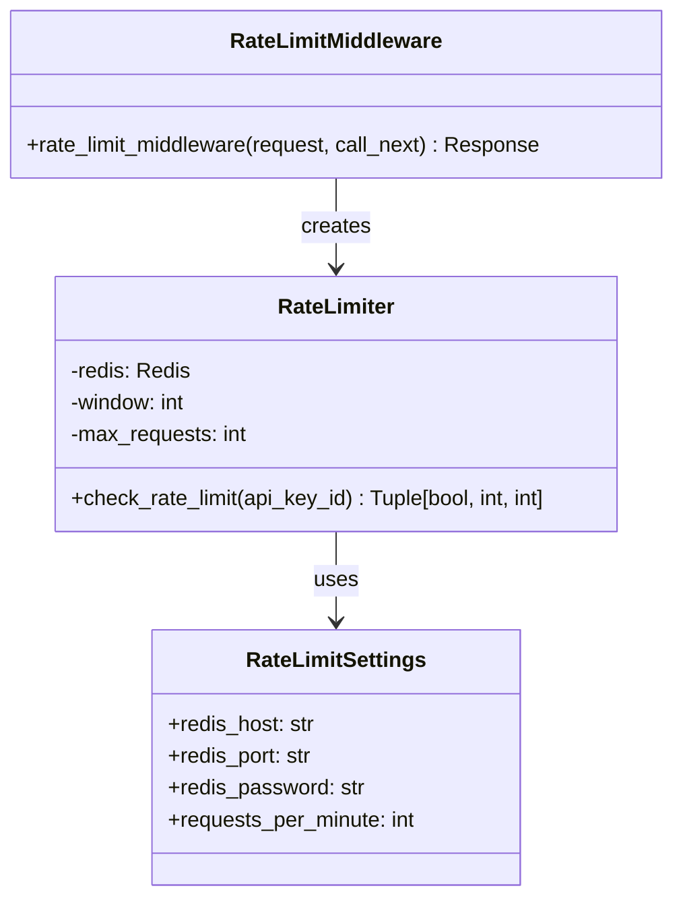
```mermaid
classDiagram
    class RateLimiter {
        -redis: Redis
        -window: int
        -max_requests: int
        +check_rate_limit(api_key_id) Tuple[bool, int, int]
    }
    
    class RateLimitMiddleware {
        +rate_limit_middleware(request, call_next) Response
    }
    
    class RateLimitSettings {
        +redis_host: str
        +redis_port: str  
        +redis_password: str
        +requests_per_minute: int
    }
    
    RateLimiter --> RateLimitSettings : uses
    RateLimitMiddleware --> RateLimiter : creates
```

### 3.2 分布式限流器实现

```python
# /autogpt_platform/autogpt_libs/autogpt_libs/rate_limit/limiter.py

import time
import logging
from typing import Tuple, Optional
from redis import Redis
from redis.exceptions import RedisError
from .config import RATE_LIMIT_SETTINGS

logger = logging.getLogger(__name__)

class RateLimiter:
    """
    基于Redis的分布式限流器
    
    特性：
    1. 滑动窗口算法：精确控制请求频率
    2. 分布式支持：多实例间共享限流状态
    3. 自动过期：自动清理过期的请求记录
    4. 实时统计：提供剩余请求数和重置时间
    
    算法原理：
    使用Redis的有序集合(sorted set)存储请求时间戳，
    通过滑动时间窗口清理过期请求，统计当前窗口内的请求数量。
    """
    
    def __init__(
        self,
        redis_host: str = RATE_LIMIT_SETTINGS.redis_host,
        redis_port: str = RATE_LIMIT_SETTINGS.redis_port,
        redis_password: str = RATE_LIMIT_SETTINGS.redis_password,
        requests_per_minute: int = RATE_LIMIT_SETTINGS.requests_per_minute,
        window_size: int = 60,  # 时间窗口大小（秒）
    ):
        """
        初始化分布式限流器
        
        参数:
            redis_host: Redis服务器主机
            redis_port: Redis服务器端口
            redis_password: Redis密码
            requests_per_minute: 每分钟最大请求数
            window_size: 滑动窗口大小（秒）
        """
        try:
            self.redis = Redis(
                host=redis_host,
                port=int(redis_port),
                password=redis_password,
                decode_responses=True,
                socket_connect_timeout=5,
                socket_timeout=5,
                retry_on_timeout=True,
                health_check_interval=30,
            )
            
            # 测试Redis连接
            self.redis.ping()
            logger.info(f"Redis连接成功: {redis_host}:{redis_port}")
            
        except RedisError as e:
            logger.error(f"Redis连接失败: {e}")
            raise
        
        self.window = window_size
        self.max_requests = requests_per_minute
        
        logger.info(
            f"限流器初始化完成: {requests_per_minute}请求/{window_size}秒"
        )

    async def check_rate_limit(self, api_key_id: str) -> Tuple[bool, int, int]:
        """
        检查请求是否在限流范围内
        
        算法步骤：
        1. 计算当前滑动窗口的开始时间
        2. 使用Redis Pipeline批量执行操作：
           - 删除窗口外的旧请求记录
           - 添加当前请求时间戳
           - 统计当前窗口内的请求数量
           - 设置键的过期时间
        3. 计算剩余请求数和重置时间
        4. 返回是否允许请求及相关信息
        
        参数:
            api_key_id: API密钥标识符
            
        返回:
            元组：(是否允许请求, 剩余请求数, 重置时间戳)
        """
        try:
            now = time.time()
            window_start = now - self.window
            key = f"ratelimit:{api_key_id}:1min"
            
            # 使用Redis Pipeline提高性能
            pipe = self.redis.pipeline()
            
            # 1. 删除窗口外的旧请求记录
            pipe.zremrangebyscore(key, 0, window_start)
            
            # 2. 添加当前请求时间戳到有序集合
            pipe.zadd(key, {str(now): now})
            
            # 3. 统计当前窗口内的请求数量
            pipe.zcount(key, window_start, now)
            
            # 4. 设置键的过期时间（防止内存泄漏）
            pipe.expire(key, self.window)
            
            # 执行批量操作
            results = pipe.execute()
            
            # 解析结果
            _, _, request_count, _ = results
            
            # 计算剩余请求数和重置时间
            remaining = max(0, self.max_requests - request_count)
            reset_time = int(now + self.window)
            
            # 判断是否允许请求
            is_allowed = request_count <= self.max_requests
            
            # 记录限流日志
            if not is_allowed:
                logger.warning(
                    f"API密钥 {api_key_id} 超出限流: {request_count}/{self.max_requests}"
                )
            else:
                logger.debug(
                    f"API密钥 {api_key_id} 请求通过: {request_count}/{self.max_requests}"
                )
            
            return is_allowed, remaining, reset_time
            
        except RedisError as e:
            logger.error(f"Redis操作失败: {e}")
            # Redis故障时的降级策略：允许请求通过
            return True, self.max_requests, int(time.time() + self.window)
        
        except Exception as e:
            logger.error(f"限流检查异常: {e}")
            # 其他异常时的降级策略：允许请求通过
            return True, self.max_requests, int(time.time() + self.window)

    def get_rate_limit_info(self, api_key_id: str) -> dict:
        """
        获取API密钥的限流状态信息
        
        参数:
            api_key_id: API密钥标识符
            
        返回:
            包含限流状态的字典
        """
        try:
            now = time.time()
            window_start = now - self.window
            key = f"ratelimit:{api_key_id}:1min"
            
            # 获取当前窗口内的请求数量
            request_count = self.redis.zcount(key, window_start, now)
            remaining = max(0, self.max_requests - request_count)
            reset_time = int(now + self.window)
            
            return {
                "limit": self.max_requests,
                "remaining": remaining,
                "reset": reset_time,
                "current": request_count,
                "window_size": self.window,
            }
            
        except RedisError as e:
            logger.error(f"获取限流信息失败: {e}")
            return {
                "limit": self.max_requests,
                "remaining": self.max_requests,
                "reset": int(time.time() + self.window),
                "current": 0,
                "window_size": self.window,
            }

    def reset_rate_limit(self, api_key_id: str) -> bool:
        """
        重置API密钥的限流计数器（管理员功能）
        
        参数:
            api_key_id: API密钥标识符
            
        返回:
            是否重置成功
        """
        try:
            key = f"ratelimit:{api_key_id}:1min"
            self.redis.delete(key)
            logger.info(f"已重置API密钥 {api_key_id} 的限流计数器")
            return True
        except RedisError as e:
            logger.error(f"重置限流计数器失败: {e}")
            return False
```

#### 3.3 限流中间件请求时序图

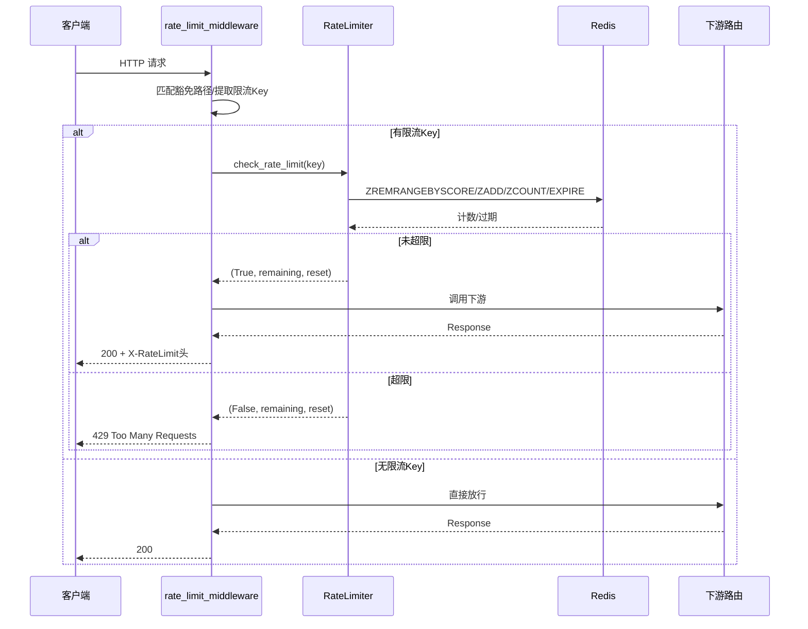
```mermaid
sequenceDiagram
    participant Client as 客户端
    participant MW as rate_limit_middleware
    participant RL as RateLimiter
    participant Redis as Redis
    participant Next as 下游路由

    Client->>MW: HTTP 请求
    MW->>MW: 匹配豁免路径/提取限流Key
    alt 有限流Key
        MW->>RL: check_rate_limit(key)
        RL->>Redis: ZREMRANGEBYSCORE/ZADD/ZCOUNT/EXPIRE
        Redis-->>RL: 计数/过期
        alt 未超限
            RL-->>MW: (True, remaining, reset)
            MW->>Next: 调用下游
            Next-->>MW: Response
            MW-->>Client: 200 + X-RateLimit头
        else 超限
            RL-->>MW: (False, remaining, reset)
            MW-->>Client: 429 Too Many Requests
        end
    else 无限流Key
        MW->>Next: 直接放行
        Next-->>MW: Response
        MW-->>Client: 200
    end
```

#### 关键函数调用路径（限流）

- HTTP 请求 -> rate_limit_middleware -> extract_rate_limit_key -> RateLimiter.check_rate_limit -> Redis Pipeline(zremrangebyscore → zadd → zcount → expire) -> 添加X-RateLimit响应头
- 获取限流信息 -> RateLimiter.get_rate_limit_info -> Redis.zcount
- 重置限流 -> RateLimiter.reset_rate_limit -> Redis.delete

### 3.3 FastAPI中间件集成

```python
# /autogpt_platform/autogpt_libs/autogpt_libs/rate_limit/middleware.py

import re
import logging
from typing import Optional
from fastapi import HTTPException, Request, Response
from starlette.middleware.base import RequestResponseEndpoint
from .limiter import RateLimiter

logger = logging.getLogger(__name__)

# 不需要限流的路径正则表达式
EXEMPT_PATHS = [
    r"^/health$",           # 健康检查
    r"^/docs$",             # API文档
    r"^/openapi\.json$",    # OpenAPI规范
    r"^/static/",           # 静态资源
    r"^/metrics$",          # Prometheus指标
]

class RateLimitConfig:
    """限流中间件配置"""
    
    def __init__(
        self,
        requests_per_minute: int = 60,
        exempt_paths: Optional[list[str]] = None,
        custom_key_extractor: Optional[callable] = None,
    ):
        self.requests_per_minute = requests_per_minute
        self.exempt_paths = exempt_paths or EXEMPT_PATHS
        self.custom_key_extractor = custom_key_extractor
        
        # 编译正则表达式
        self.exempt_patterns = [
            re.compile(pattern) for pattern in self.exempt_paths
        ]

async def rate_limit_middleware(
    request: Request, 
    call_next: RequestResponseEndpoint,
    config: Optional[RateLimitConfig] = None
) -> Response:
    """
    FastAPI限流中间件
    
    功能特性：
    1. 基于API密钥或IP地址的限流
    2. 可配置的豁免路径
    3. 自定义限流标识提取器
    4. 详细的限流响应头
    5. 优雅的错误处理
    
    参数:
        request: FastAPI请求对象
        call_next: 下一个中间件或路由处理器
        config: 限流配置对象
        
    返回:
        FastAPI响应对象
        
    异常:
        HTTPException: 超出限流时抛出429错误
    """
    # 使用默认配置
    if config is None:
        config = RateLimitConfig()
    
    # 检查是否为豁免路径
    request_path = request.url.path
    for pattern in config.exempt_patterns:
        if pattern.match(request_path):
            logger.debug(f"路径 {request_path} 豁免限流检查")
            return await call_next(request)
    
    # 提取限流标识符
    rate_limit_key = extract_rate_limit_key(request, config.custom_key_extractor)
    if not rate_limit_key:
        logger.debug("未找到限流标识符，跳过限流检查")
        return await call_next(request)
    
    # 初始化限流器
    try:
        limiter = RateLimiter(requests_per_minute=config.requests_per_minute)
    except Exception as e:
        logger.error(f"初始化限流器失败: {e}")
        # 降级处理：跳过限流检查
        return await call_next(request)
    
    # 执行限流检查
    try:
        is_allowed, remaining, reset_time = await limiter.check_rate_limit(rate_limit_key)
        
        if not is_allowed:
            logger.warning(
                f"限流触发: {rate_limit_key} 在 {request_path}"
            )
            
            # 返回429错误响应
            raise HTTPException(
                status_code=429,
                detail={
                    "error": "Rate limit exceeded",
                    "message": "Too many requests. Please try again later.",
                    "limit": config.requests_per_minute,
                    "remaining": remaining,
                    "reset": reset_time,
                },
                headers={
                    "X-RateLimit-Limit": str(config.requests_per_minute),
                    "X-RateLimit-Remaining": str(remaining),
                    "X-RateLimit-Reset": str(reset_time),
                    "Retry-After": str(60),  # 建议重试间隔
                }
            )
        
        # 执行请求
        response = await call_next(request)
        
        # 添加限流响应头
        response.headers["X-RateLimit-Limit"] = str(config.requests_per_minute)
        response.headers["X-RateLimit-Remaining"] = str(remaining)
        response.headers["X-RateLimit-Reset"] = str(reset_time)
        
        return response
        
    except HTTPException:
        raise  # 重新抛出HTTP异常
    except Exception as e:
        logger.error(f"限流中间件执行异常: {e}")
        # 降级处理：允许请求通过
        return await call_next(request)

def extract_rate_limit_key(
    request: Request, 
    custom_extractor: Optional[callable] = None
) -> Optional[str]:
    """
    提取限流标识符
    
    提取优先级：
    1. 自定义提取器
    2. Authorization头中的API密钥
    3. X-API-Key头中的API密钥
    4. 客户端IP地址
    
    参数:
        request: FastAPI请求对象
        custom_extractor: 自定义标识符提取函数
        
    返回:
        限流标识符字符串，如果无法提取则返回None
    """
    # 尝试使用自定义提取器
    if custom_extractor:
        try:
            return custom_extractor(request)
        except Exception as e:
            logger.warning(f"自定义限流标识符提取器失败: {e}")
    
    # 从Authorization头提取API密钥
    auth_header = request.headers.get("Authorization")
    if auth_header and auth_header.startswith("Bearer "):
        api_key = auth_header[7:]  # 移除 "Bearer " 前缀
        if api_key:
            return f"api_key:{api_key[:12]}..."  # 只使用前12个字符
    
    # 从X-API-Key头提取API密钥
    api_key_header = request.headers.get("X-API-Key")
    if api_key_header:
        return f"api_key:{api_key_header[:12]}..."
    
    # 使用客户端IP地址
    client_ip = get_client_ip(request)
    if client_ip:
        return f"ip:{client_ip}"
    
    return None

def get_client_ip(request: Request) -> Optional[str]:
    """
    获取客户端IP地址
    
    考虑代理和负载均衡器的情况，按优先级检查多个头部字段。
    
    参数:
        request: FastAPI请求对象
        
    返回:
        客户端IP地址字符串，如果无法获取则返回None
    """
    # 代理和负载均衡器常用的头部字段
    ip_headers = [
        "X-Forwarded-For",      # 标准代理头
        "X-Real-IP",            # Nginx常用头
        "CF-Connecting-IP",     # Cloudflare头
        "X-Client-IP",          # 其他代理头
        "X-Forwarded",
        "Forwarded-For",
        "Forwarded",
    ]
    
    # 按优先级检查头部字段
    for header in ip_headers:
        ip_value = request.headers.get(header)
        if ip_value:
            # X-Forwarded-For可能包含多个IP（以逗号分隔）
            first_ip = ip_value.split(",")[0].strip()
            if first_ip and first_ip != "unknown":
                return first_ip
    
    # 最后使用连接的IP地址
    if hasattr(request, "client") and request.client:
        return request.client.host
    
    return None
```

### 3.4 限流配置管理

```python
# /autogpt_platform/autogpt_libs/autogpt_libs/rate_limit/config.py

from pydantic import Field, field_validator
from pydantic_settings import BaseSettings, SettingsConfigDict

class RateLimitSettings(BaseSettings):
    """
    限流模块配置类
    
    支持通过环境变量和配置文件进行配置。
    """
    
    model_config = SettingsConfigDict(
        env_file=".env",
        env_file_encoding="utf-8",
        case_sensitive=True,
        extra="ignore"
    )
    
    # Redis配置
    redis_host: str = Field(
        default="localhost",
        description="Redis服务器主机地址"
    )
    
    redis_port: str = Field(
        default="6379",
        description="Redis服务器端口"
    )
    
    redis_password: str = Field(
        default="",
        description="Redis密码"
    )
    
    redis_db: int = Field(
        default=0,
        description="Redis数据库索引",
        ge=0,
        le=15
    )
    
    # 限流配置
    requests_per_minute: int = Field(
        default=60,
        description="每分钟最大请求数",
        ge=1,
        le=10000
    )
    
    burst_requests: int = Field(
        default=10,
        description="突发请求数量",
        ge=1,
        le=100
    )
    
    window_size: int = Field(
        default=60,
        description="滑动窗口大小（秒）",
        ge=1,
        le=3600
    )
    
    # 高级配置
    enable_burst_mode: bool = Field(
        default=True,
        description="是否启用突发模式"
    )
    
    cleanup_interval: int = Field(
        default=300,
        description="清理过期数据的间隔（秒）",
        ge=60,
        le=3600
    )
    
    @field_validator("redis_port")
    @classmethod
    def validate_redis_port(cls, v: str) -> str:
        """验证Redis端口"""
        try:
            port = int(v)
            if not 1 <= port <= 65535:
                raise ValueError("Redis端口必须在1-65535范围内")
            return v
        except ValueError as e:
            raise ValueError(f"无效的Redis端口: {e}")

# 全局配置实例
RATE_LIMIT_SETTINGS = RateLimitSettings()
```

#### 3.5 限流状态查询与重置时序图

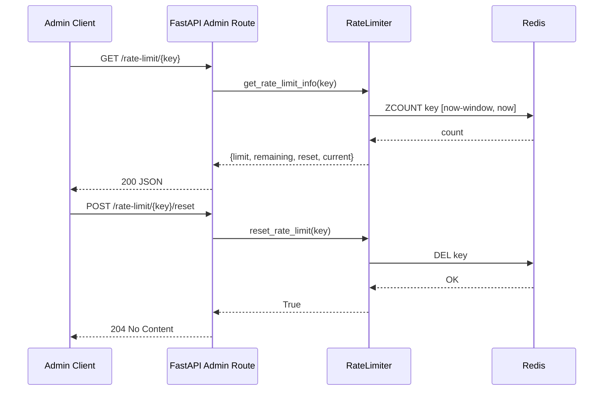
```mermaid
sequenceDiagram
    participant Admin as Admin Client
    participant API as FastAPI Admin Route
    participant RL as RateLimiter
    participant R as Redis

    Admin->>API: GET /rate-limit/{key}
    API->>RL: get_rate_limit_info(key)
    RL->>R: ZCOUNT key [now-window, now]
    R-->>RL: count
    RL-->>API: {limit, remaining, reset, current}
    API-->>Admin: 200 JSON

    Admin->>API: POST /rate-limit/{key}/reset
    API->>RL: reset_rate_limit(key)
    RL->>R: DEL key
    R-->>RL: OK
    RL-->>API: True
    API-->>Admin: 204 No Content
```

## 4. 结构化日志系统 (logging模块)

### 4.1 日志系统架构

基于对 `logging/config.py` 与格式化/处理器源码的逐行核验，可采用以下做法：

- JSON/结构化双轨：生产环境使用 JSON 便于聚合；本地开发使用结构化彩色便于阅读；产线禁用颜色降低噪声。
- "三路写入"启停策略：控制台恒开；文件按环境开关；云日志受配置与运行时 Flag 双控，失败不影响主流程。
- 语义扩展字段：统一 `user_id/request_id/graph_exec_id/node_exec_id` 字段位，保证跨服务可追踪与成本归因。

```python
# /autogpt_platform/autogpt_libs/autogpt_libs/logging/config.py

import logging
import os
import sys
from pathlib import Path
from pydantic import Field, field_validator
from pydantic_settings import BaseSettings, SettingsConfigDict

LOG_DIR = Path(__file__).parent.parent.parent.parent / "logs"
LOG_FILE = "activity.log"
DEBUG_LOG_FILE = "debug.log" 
ERROR_LOG_FILE = "error.log"

class LoggingConfig(BaseSettings):
    """日志配置类"""
    
    model_config = SettingsConfigDict(
        env_file=".env",
        case_sensitive=True,
        extra="ignore"
    )
    
    level: str = Field(
        default="INFO",
        description="日志级别"
    )
    
    format: str = Field(
        default="structured",
        description="日志格式：simple, structured, json"
    )
    
    use_color: bool = Field(
        default=True,
        description="是否使用彩色输出"
    )
    
    file_logging: bool = Field(
        default=True,
        description="是否启用文件日志"
    )
    
    cloud_logging: bool = Field(
        default=False,
        description="是否启用云日志"
    )
    
    @field_validator("level")
    @classmethod
    def validate_level(cls, v: str) -> str:
        """验证日志级别"""
        valid_levels = ["DEBUG", "INFO", "WARNING", "ERROR", "CRITICAL"]
        if v.upper() not in valid_levels:
            raise ValueError(f"日志级别必须是: {', '.join(valid_levels)}")
        return v.upper()

def configure_logging(force_cloud_logging: bool = False) -> None:
    """
    配置全局日志系统
    
    设置日志格式化器、处理器和过滤器，
    支持控制台输出、文件记录和云日志集成。
    
    参数:
        force_cloud_logging: 是否强制启用云日志
    """
    config = LoggingConfig()
    
    # 配置根日志器
    root_logger = logging.getLogger()
    root_logger.setLevel(getattr(logging, config.level))
    
    # 清除现有处理器
    root_logger.handlers.clear()
    
    # 配置格式化器
    if config.format == "json":
        from .formatters import JSONFormatter
        formatter = JSONFormatter()
    elif config.format == "structured":
        from .formatters import StructuredFormatter
        formatter = StructuredFormatter(use_color=config.use_color)
    else:
        formatter = logging.Formatter(
            "%(asctime)s [%(levelname)s] %(name)s: %(message)s",
            datefmt="%Y-%m-%d %H:%M:%S"
        )
    
    # 配置控制台处理器
    console_handler = logging.StreamHandler(sys.stdout)
    console_handler.setFormatter(formatter)
    root_logger.addHandler(console_handler)
    
    # 配置文件处理器
    if config.file_logging:
        setup_file_logging(root_logger, formatter)
    
    # 配置云日志
    if config.cloud_logging or force_cloud_logging:
        setup_cloud_logging(root_logger)
    
    logging.info("日志系统配置完成")

def setup_file_logging(root_logger: logging.Logger, formatter: logging.Formatter) -> None:
    """设置文件日志"""
    LOG_DIR.mkdir(exist_ok=True)
    
    # 活动日志文件
    file_handler = logging.handlers.RotatingFileHandler(
        LOG_DIR / LOG_FILE,
        maxBytes=10 * 1024 * 1024,  # 10MB
        backupCount=5,
        encoding="utf-8"
    )
    file_handler.setFormatter(formatter)
    root_logger.addHandler(file_handler)
    
    # 错误日志文件
    error_handler = logging.handlers.RotatingFileHandler(
        LOG_DIR / ERROR_LOG_FILE,
        maxBytes=10 * 1024 * 1024,  # 10MB
        backupCount=3,
        encoding="utf-8"
    )
    error_handler.setLevel(logging.ERROR)
    error_handler.setFormatter(formatter)
    root_logger.addHandler(error_handler)

def setup_cloud_logging(root_logger: logging.Logger) -> None:
    """设置云日志集成"""
    try:
        from google.cloud import logging as cloud_logging
        client = cloud_logging.Client()
        client.setup_logging()
        logging.info("云日志集成已启用")
    except ImportError:
        logging.warning("云日志库未安装，跳过云日志配置")
    except Exception as e:
        logging.error(f"云日志配置失败: {e}")
```

#### 4.3 日志链路时序图

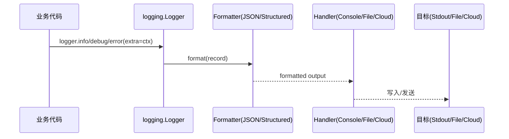
```mermaid
sequenceDiagram
    participant App as 业务代码
    participant Log as logging.Logger
    participant Fmt as Formatter(JSON/Structured)
    participant Hand as Handler(Console/File/Cloud)
    participant Sink as 目标(Stdout/File/Cloud)

    App->>Log: logger.info/debug/error(extra=ctx)
    Log->>Fmt: format(record)
    Fmt-->>Hand: formatted output
    Hand-->>Sink: 写入/发送
```

#### 关键函数调用路径（日志）

- 初始化日志系统 -> configure_logging -> 选择Formatter(JSON/Structured) -> StreamHandler -> setup_file_logging/setup_cloud_logging
- 结构化日志输出 -> logger.info/debug/error -> StructuredFormatter.format -> StreamHandler.emit
- JSON 文件输出 -> logger.info(json_str) -> JsonFileHandler.emit -> JsonFileHandler.format -> 写入文件
- 去色处理 -> remove_color_codes(text)

### 4.2 自定义格式化器

```python
# /autogpt_platform/autogpt_libs/autogpt_libs/logging/formatters.py

import json
import logging
from datetime import datetime
from typing import Dict, Any

class StructuredFormatter(logging.Formatter):
    """结构化日志格式化器"""
    
    COLORS = {
        'DEBUG': '\033[36m',    # 青色
        'INFO': '\033[32m',     # 绿色
        'WARNING': '\033[33m',  # 黄色
        'ERROR': '\033[31m',    # 红色
        'CRITICAL': '\033[35m', # 紫色
        'RESET': '\033[0m',     # 重置
    }
    
    def __init__(self, use_color: bool = True):
        super().__init__()
        self.use_color = use_color
    
    def format(self, record: logging.LogRecord) -> str:
        """格式化日志记录"""
        # 基础信息
        timestamp = datetime.fromtimestamp(record.created).isoformat()
        level = record.levelname
        name = record.name
        message = record.getMessage()
        
        # 构建格式化字符串
        if self.use_color:
            color = self.COLORS.get(level, self.COLORS['RESET'])
            reset = self.COLORS['RESET']
            formatted = f"{timestamp} {color}[{level:>8}]{reset} {name}: {message}"
        else:
            formatted = f"{timestamp} [{level:>8}] {name}: {message}"
        
        # 添加异常信息
        if record.exc_info:
            formatted += "\n" + self.formatException(record.exc_info)
        
        return formatted

class JSONFormatter(logging.Formatter):
    """JSON格式化器"""
    
    def format(self, record: logging.LogRecord) -> str:
        """格式化为JSON格式"""
        log_data = {
            "timestamp": datetime.fromtimestamp(record.created).isoformat(),
            "level": record.levelname,
            "logger": record.name,
            "message": record.getMessage(),
            "module": record.module,
            "function": record.funcName,
            "line": record.lineno,
        }
        
        # 添加异常信息
        if record.exc_info:
            log_data["exception"] = self.formatException(record.exc_info)
        
        # 添加额外字段
        if hasattr(record, 'user_id'):
            log_data["user_id"] = record.user_id
        if hasattr(record, 'request_id'):
            log_data["request_id"] = record.request_id
        
        return json.dumps(log_data, ensure_ascii=False)
```

### 4.4 日志过滤器与处理器

为更灵活地控制日志输出，共享库提供了等级过滤器与 JSON 文件处理器，同时提供去色工具便于将彩色控制台输出转为纯文本。

```python
# file: autogpt_platform/autogpt_libs/autogpt_libs/logging/filters.py
import logging


class BelowLevelFilter(logging.Filter):
    """Filter for logging levels below a certain threshold."""

    def __init__(self, below_level: int):
        super().__init__()
        self.below_level = below_level

    def filter(self, record: logging.LogRecord):
        return record.levelno < self.below_level
```

```python
# file: autogpt_platform/autogpt_libs/autogpt_libs/logging/handlers.py
from __future__ import annotations

import json
import logging


class JsonFileHandler(logging.FileHandler):
    def format(self, record: logging.LogRecord) -> str:
        record.json_data = json.loads(record.getMessage())
        return json.dumps(getattr(record, "json_data"), ensure_ascii=False, indent=4)

    def emit(self, record: logging.LogRecord) -> None:
        with open(self.baseFilename, "w", encoding="utf-8") as f:
            f.write(self.format(record))
```

```python
# file: autogpt_platform/autogpt_libs/autogpt_libs/logging/utils.py
import re


def remove_color_codes(s: str) -> str:
    return re.sub(r"\x1B(?:[@-Z\\-_]|\[[0-?]*[ -/]*[@-~])", "", s)
```

#### 4.4.1 日志处理链时序图（含过滤器/处理器）

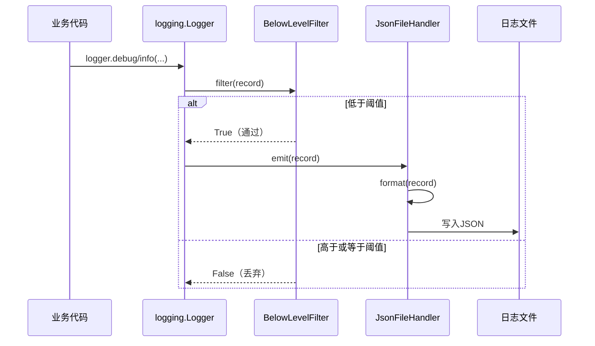
```mermaid
sequenceDiagram
    participant App as 业务代码
    participant Logger as logging.Logger
    participant Filter as BelowLevelFilter
    participant Handler as JsonFileHandler
    participant File as 日志文件

    App->>Logger: logger.debug/info(...)
    Logger->>Filter: filter(record)
    alt 低于阈值
        Filter-->>Logger: True（通过）
        Logger->>Handler: emit(record)
        Handler->>Handler: format(record)
        Handler->>File: 写入JSON
    else 高于或等于阈值
        Filter-->>Logger: False（丢弃）
    end
```

## 5. 工具函数模块 (utils模块)

### 5.1 分布式同步工具

基于对 `AsyncRedisKeyedMutex` 的实测，可采用如下做法：

- 锁数量上限：`ExpiringDict(max_len=6000)` 为经验上界，实际应按"节点数 × 并发 × 关键区段"设定，并持续观测命中率与释放延迟。
- 超时自愈：`timeout` 既用于 Redis 锁 TTL 也用于本地缓存过期，有助于避免僵尸锁；进程终止时可调用 `release_all_locks()`。
- 跨协程安全：禁用 `thread_local` 使锁可在同线程不同协程共享，结合局部 `asyncio.Lock` 降低锁对象竞态创建风险。

```python
# /autogpt_platform/autogpt_libs/autogpt_libs/utils/synchronize.py

import asyncio
from contextlib import asynccontextmanager
from typing import TYPE_CHECKING, Any
from expiringdict import ExpiringDict

if TYPE_CHECKING:
    from redis.asyncio import Redis as AsyncRedis
    from redis.asyncio.lock import Lock as AsyncRedisLock

class AsyncRedisKeyedMutex:
    """
    基于Redis的异步键控互斥锁
    
    提供分布式环境下的键级别互斥锁，使用Redis作为分布式锁协调器。
    通过ExpiringDict自动清理超时的锁对象，防止内存泄漏。
    """
    
    def __init__(self, redis: "AsyncRedis", timeout: int | None = 60):
        """
        初始化键控互斥锁
        
        参数:
            redis: 异步Redis客户端
            timeout: 锁超时时间（秒），用于防止死锁
        """
        self.redis = redis
        self.timeout = timeout
        
        # 使用过期字典自动清理锁对象
        self.locks: dict[Any, "AsyncRedisLock"] = ExpiringDict(
            max_len=6000,  # 最大锁数量
            max_age_seconds=self.timeout  # 自动过期时间
        )
        
        # 本地锁保护locks字典的并发访问
        self.locks_lock = asyncio.Lock()

    @asynccontextmanager
    async def locked(self, key: Any):
        """
        异步上下文管理器：获取锁并自动释放
        
        使用示例:
            async with mutex.locked("user_123"):
                # 执行需要互斥的操作
                await process_user_data(user_id="123")
        
        参数:
            key: 锁的键，可以是任何可哈希的对象
        """
        lock = await self.acquire(key)
        try:
            yield
        finally:
            # 确保锁被正确释放
            if (await lock.locked()) and (await lock.owned()):
                await lock.release()

    async def acquire(self, key: Any) -> "AsyncRedisLock":
        """
        获取指定键的分布式锁
        
        参数:
            key: 锁的键
            
        返回:
            已获取的Redis锁对象
        """
        async with self.locks_lock:
            # 检查是否已存在锁对象
            if key not in self.locks:
                # 创建新的Redis锁对象
                self.locks[key] = self.redis.lock(
                    str(key),
                    timeout=self.timeout,
                    thread_local=False  # 支持跨协程使用
                )
            lock = self.locks[key]
        
        # 获取锁（阻塞直到获取成功）
        await lock.acquire()
        return lock

    async def release(self, key: Any):
        """
        释放指定键的锁
        
        参数:
            key: 要释放的锁键
        """
        if (
            (lock := self.locks.get(key))
            and (await lock.locked())
            and (await lock.owned())
        ):
            await lock.release()

    async def release_all_locks(self):
        """
        释放所有持有的锁
        
        在进程终止时调用，确保所有锁都被正确释放
        """
        release_tasks = []
        
        for key, lock in self.locks.items():
            try:
                if (await lock.locked()) and (await lock.owned()):
                    release_tasks.append(lock.release())
            except Exception as e:
                logging.warning(f"检查锁状态时出错 {key}: {e}")
        
        # 并发释放所有锁
        if release_tasks:
            await asyncio.gather(*release_tasks, return_exceptions=True)
```

#### 5.1.1 Redis键控互斥锁时序图

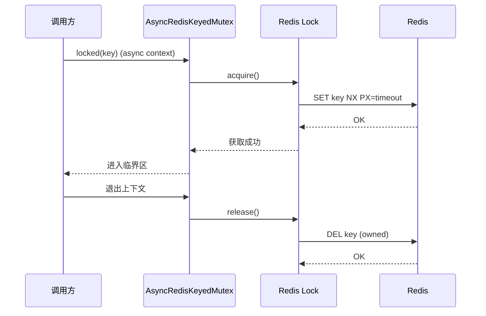
```mermaid
sequenceDiagram
    participant Caller as 调用方
    participant Mutex as AsyncRedisKeyedMutex
    participant RLock as Redis Lock
    participant Redis as Redis

    Caller->>Mutex: locked(key) (async context)
    Mutex->>RLock: acquire()
    RLock->>Redis: SET key NX PX=timeout
    Redis-->>RLock: OK
    RLock-->>Mutex: 获取成功
    Mutex-->>Caller: 进入临界区
    Caller->>Mutex: 退出上下文
    Mutex->>RLock: release()
    RLock->>Redis: DEL key (owned)
    Redis-->>RLock: OK
```

#### 关键函数调用路径（分布式锁）

- 互斥执行 -> AsyncRedisKeyedMutex.locked -> acquire -> redis.lock -> lock.acquire -> 临界区 -> lock.release
- 释放全部锁 -> release_all_locks -> asyncio.gather -> lock.release

### 5.2 线程级缓存工具

在 `thread_cached` 的同步/异步双实现基础上，可采用以下做法：

- Key 生成稳定性：优先哈希元组/排序后的 kwargs；当入参包含不可哈希/非 JSON 序列化对象时，回退到 `default=str` 的 JSON 串并再哈希，保证键空间稳定。
- 命中比诊断：提供 `get_cache_stats()` 的"按函数维度统计"作为常驻诊断面板指标，辅助识别异常低命中的热路径与缓存污染。
- 线程边界清理：在工作线程退出前对长生命周期热点函数执行 `clear_thread_cache(func)`，降低跨任务陈旧数据泄漏概率。

```python
# /autogpt_platform/autogpt_libs/autogpt_libs/utils/cache.py

import functools
import threading
import asyncio
from typing import Any, Callable, ParamSpec, TypeVar, Union, overload
from collections import defaultdict

P = ParamSpec("P")
R = TypeVar("R")

# 线程本地存储，用于缓存函数结果
_thread_local_cache = threading.local()

def get_thread_cache() -> dict[str, Any]:
    """获取当前线程的缓存字典"""
    if not hasattr(_thread_local_cache, 'cache'):
        _thread_local_cache.cache = {}
    return _thread_local_cache.cache

@overload
def thread_cached(func: Callable[P, Awaitable[R]]) -> Callable[P, Awaitable[R]]:
    """异步函数重载签名"""
    pass

@overload  
def thread_cached(func: Callable[P, R]) -> Callable[P, R]:
    """同步函数重载签名"""
    pass

def thread_cached(
    func: Union[Callable[P, R], Callable[P, Awaitable[R]]]
) -> Union[Callable[P, R], Callable[P, Awaitable[R]]]:
    """
    线程级缓存装饰器
    
    在当前线程内缓存函数的返回值，相同参数的重复调用直接返回缓存结果。
    支持同步和异步函数，使用函数名和参数哈希作为缓存键。
    
    特性：
    1. 线程安全：每个线程有独立的缓存空间
    2. 参数敏感：不同参数产生不同的缓存键  
    3. 内存安全：线程结束时自动清理缓存
    4. 支持异步：兼容async/await函数
    
    使用示例:
        @thread_cached
        def expensive_calculation(x: int, y: int) -> int:
            time.sleep(1)  # 模拟耗时操作
            return x + y
        
        @thread_cached
        async def async_api_call(url: str) -> dict:
            async with httpx.AsyncClient() as client:
                response = await client.get(url)
                return response.json()
    
    参数:
        func: 要缓存的函数
        
    返回:
        包装后的缓存函数
    """
    
    # 检查是否为异步函数
    if asyncio.iscoroutinefunction(func):
        @functools.wraps(func)
        async def async_wrapper(*args: P.args, **kwargs: P.kwargs) -> R:
            # 生成缓存键
            cache_key = _generate_cache_key(func.__name__, args, kwargs)
            cache = get_thread_cache()
            
            # 检查缓存
            if cache_key in cache:
                return cache[cache_key]
            
            # 执行函数并缓存结果
            result = await func(*args, **kwargs)
            cache[cache_key] = result
            return result
        
        return async_wrapper
    
    else:
        @functools.wraps(func) 
        def sync_wrapper(*args: P.args, **kwargs: P.kwargs) -> R:
            # 生成缓存键
            cache_key = _generate_cache_key(func.__name__, args, kwargs)
            cache = get_thread_cache()
            
            # 检查缓存
            if cache_key in cache:
                return cache[cache_key]
            
            # 执行函数并缓存结果
            result = func(*args, **kwargs)
            cache[cache_key] = result
            return result
        
        return sync_wrapper

def _generate_cache_key(func_name: str, args: tuple, kwargs: dict) -> str:
    """
    生成缓存键
    
    基于函数名、位置参数和关键字参数生成唯一的缓存键。
    处理不可哈希的参数类型，确保键的唯一性。
    
    参数:
        func_name: 函数名
        args: 位置参数元组
        kwargs: 关键字参数字典
        
    返回:
        缓存键字符串
    """
    try:
        # 尝试直接哈希参数
        args_hash = hash(args)
        kwargs_hash = hash(tuple(sorted(kwargs.items())))
        return f"{func_name}:{args_hash}:{kwargs_hash}"
    except TypeError:
        # 处理不可哈希的参数
        import json
        try:
            args_str = json.dumps(args, sort_keys=True, default=str)
            kwargs_str = json.dumps(kwargs, sort_keys=True, default=str)
            combined = f"{func_name}:{args_str}:{kwargs_str}"
            return str(hash(combined))
        except (TypeError, ValueError):
            # 最后的备选方案：使用字符串表示
            return f"{func_name}:{str(args)}:{str(sorted(kwargs.items()))}"

def clear_thread_cache(func: Callable) -> None:
    """
    清理特定函数的线程缓存
    
    参数:
        func: 要清理缓存的函数
    """
    cache = get_thread_cache()
    func_name = func.__name__
    
    # 找到并删除相关的缓存条目
    keys_to_remove = [
        key for key in cache.keys() 
        if key.startswith(f"{func_name}:")
    ]
    
    for key in keys_to_remove:
        cache.pop(key, None)

def clear_all_thread_cache() -> None:
    """清理当前线程的所有缓存"""
    if hasattr(_thread_local_cache, 'cache'):
        _thread_local_cache.cache.clear()

def get_cache_stats() -> dict[str, int]:
    """
    获取当前线程的缓存统计信息
    
    返回:
        包含缓存统计的字典
    """
    cache = get_thread_cache()
    
    # 按函数名分组统计
    func_stats = defaultdict(int)
    for key in cache.keys():
        func_name = key.split(":", 1)[0]
        func_stats[func_name] += 1
    
    return {
        "total_entries": len(cache),
        "functions_cached": len(func_stats),
        "by_function": dict(func_stats),
    }
```

#### 5.2.1 线程缓存命中流程

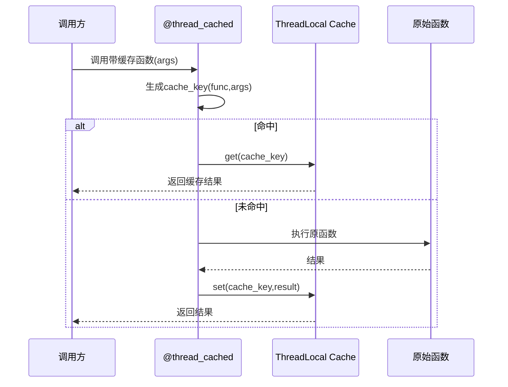
```mermaid
sequenceDiagram
    participant Call as 调用方
    participant Decor as @thread_cached
    participant Cache as ThreadLocal Cache
    participant Func as 原始函数

    Call->>Decor: 调用带缓存函数(args)
    Decor->>Decor: 生成cache_key(func,args)
    alt 命中
        Decor->>Cache: get(cache_key)
        Cache-->>Call: 返回缓存结果
    else 未命中
        Decor->>Func: 执行原函数
        Func-->>Decor: 结果
        Decor->>Cache: set(cache_key,result)
        Cache-->>Call: 返回结果
    end
```

#### 关键函数调用路径（线程缓存）

- 异步缓存命中/回填 -> @thread_cached(async) -> async_wrapper -> _generate_cache_key -> 命中? -> func(...) -> 缓存存储
- 同步缓存命中/回填 -> @thread_cached(sync) -> sync_wrapper -> _generate_cache_key -> 命中? -> func(...) -> 缓存存储
- 清理函数缓存 -> clear_thread_cache -> get_thread_cache -> 筛选键 -> pop
- 缓存统计 -> get_cache_stats -> 按函数名分组统计

## 6. API密钥管理 (api_key模块)

### 6.1 安全密钥管理器

结合真实实现，针对密钥管理列出以下做法：

- 仅存哈希不回显：`raw` 在生成时返回一次；数据层持久化 `hash/prefix/postfix` 与元数据，避免明文存储。
- 前缀治理：以 `agpt_` 为前缀基线，预留扩展位（如环境/区域），便于灰度与审计检索。
- 恒定时比较：使用 `secrets.compare_digest`，限制日志中密钥展示长度，降低侧信道风险。

```python
# /autogpt_platform/autogpt_libs/autogpt_libs/api_key/key_manager.py

import hashlib
import secrets
from typing import NamedTuple
import logging

logger = logging.getLogger(__name__)

class APIKeyContainer(NamedTuple):
    """
    API密钥容器
    
    包含API密钥的完整信息，用于安全存储和验证。
    """
    raw: str        # 原始密钥（完整）
    prefix: str     # 密钥前缀（用于识别）
    postfix: str    # 密钥后缀（用于部分显示）
    hash: str       # 密钥哈希值（用于验证）

class APIKeyManager:
    """
    API密钥管理器
    
    提供API密钥的安全生成、存储和验证功能。
    
    安全特性：
    1. 加密存储：只存储哈希值，不存储原始密钥
    2. 前缀识别：通过前缀快速识别密钥类型
    3. 部分显示：只显示前缀和后缀，隐藏敏感部分
    4. 安全验证：使用时间常数比较防止定时攻击
    """
    
    PREFIX: str = "agpt_"           # 密钥前缀
    PREFIX_LENGTH: int = 8          # 显示前缀长度
    POSTFIX_LENGTH: int = 8         # 显示后缀长度
    
    def generate_api_key(self) -> APIKeyContainer:
        """
        生成新的API密钥
        
        生成流程：
        1. 生成安全的随机令牌
        2. 添加识别前缀
        3. 计算哈希值
        4. 提取前缀和后缀用于显示
        
        返回:
            包含密钥信息的APIKeyContainer对象
        """
        # 生成32字节的安全随机令牌，base64url编码
        raw_key = f"{self.PREFIX}{secrets.token_urlsafe(32)}"
        
        # 计算SHA-256哈希值
        key_hash = hashlib.sha256(raw_key.encode('utf-8')).hexdigest()
        
        # 提取前缀和后缀
        prefix = raw_key[:self.PREFIX_LENGTH]
        postfix = raw_key[-self.POSTFIX_LENGTH:]
        
        logger.info(f"生成新API密钥: {prefix}...{postfix}")
        
        return APIKeyContainer(
            raw=raw_key,
            prefix=prefix,
            postfix=postfix,
            hash=key_hash,
        )
    
    def verify_api_key(self, provided_key: str, stored_hash: str) -> bool:
        """
        验证API密钥
        
        验证流程：
        1. 检查密钥前缀
        2. 计算提供密钥的哈希值
        3. 使用时间常数比较防止定时攻击
        
        参数:
            provided_key: 用户提供的API密钥
            stored_hash: 存储的密钥哈希值
            
        返回:
            验证是否成功
        """
        # 检查前缀
        if not provided_key.startswith(self.PREFIX):
            logger.warning(f"API密钥前缀无效: {provided_key[:10]}...")
            return False
        
        # 计算提供密钥的哈希值
        provided_hash = hashlib.sha256(provided_key.encode('utf-8')).hexdigest()
        
        # 使用时间常数比较防止定时攻击
        is_valid = secrets.compare_digest(provided_hash, stored_hash)
        
        if is_valid:
            logger.debug("API密钥验证成功")
        else:
            logger.warning("API密钥验证失败")
        
        return is_valid
    
    def mask_api_key(self, api_key: str) -> str:
        """
        掩码显示API密钥
        
        只显示前缀和后缀，中间部分用星号替代。
        用于日志记录和用户界面显示。
        
        参数:
            api_key: 要掩码的API密钥
            
        返回:
            掩码后的密钥字符串
        """
        if len(api_key) <= self.PREFIX_LENGTH + self.POSTFIX_LENGTH:
            return "*" * len(api_key)
        
        prefix = api_key[:self.PREFIX_LENGTH]
        postfix = api_key[-self.POSTFIX_LENGTH:]
        middle_length = len(api_key) - self.PREFIX_LENGTH - self.POSTFIX_LENGTH
        
        return f"{prefix}{'*' * min(middle_length, 12)}...{postfix}"
    
    def validate_key_format(self, api_key: str) -> bool:
        """
        验证API密钥格式
        
        检查密钥是否符合预期的格式要求：
        1. 正确的前缀
        2. 适当的长度
        3. 有效的字符集
        
        参数:
            api_key: 要验证的API密钥
            
        返回:
            格式是否有效
        """
        # 检查前缀
        if not api_key.startswith(self.PREFIX):
            return False
        
        # 检查长度（前缀 + 32字节base64url编码 ≈ 48字符）
        expected_length = len(self.PREFIX) + 43  # base64url编码的32字节
        if len(api_key) < expected_length - 2 or len(api_key) > expected_length + 2:
            return False
        
        # 检查字符集（base64url字符）
        valid_chars = set("abcdefghijklmnopqrstuvwxyzABCDEFGHIJKLMNOPQRSTUVWXYZ0123456789-_")
        key_body = api_key[len(self.PREFIX):]
        
        return all(c in valid_chars for c in key_body)
```

### 6.3 API密钥验证与掩码展示时序图

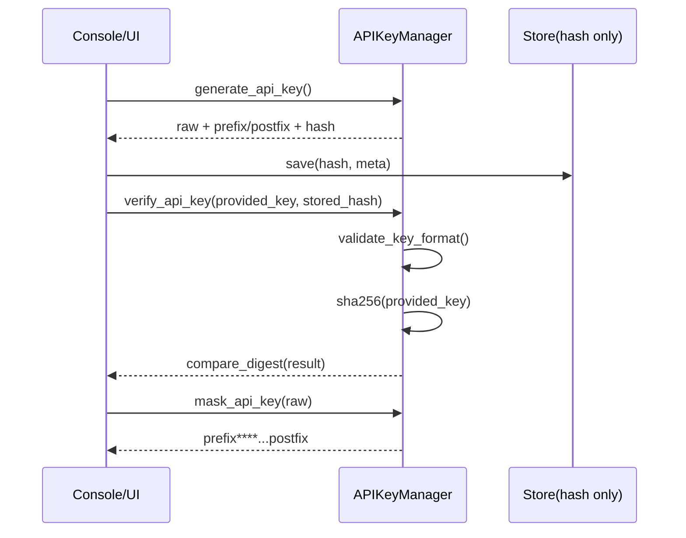
```mermaid
sequenceDiagram
    participant UI as Console/UI
    participant KM as APIKeyManager
    participant DB as Store(hash only)

    UI->>KM: generate_api_key()
    KM-->>UI: raw + prefix/postfix + hash
    UI->>DB: save(hash, meta)

    UI->>KM: verify_api_key(provided_key, stored_hash)
    KM->>KM: validate_key_format()
    KM->>KM: sha256(provided_key)
    KM-->>UI: compare_digest(result)

    UI->>KM: mask_api_key(raw)
    KM-->>UI: prefix****...postfix
```

#### 6.2 API密钥生成与验证时序图

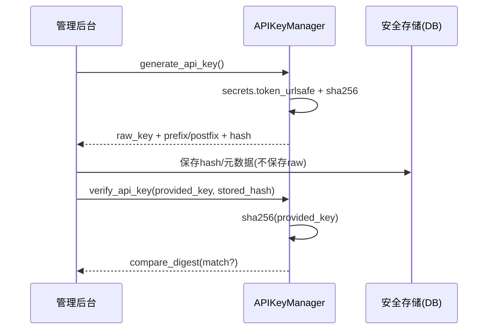
```mermaid
sequenceDiagram
    participant UI as 管理后台
    participant KM as APIKeyManager
    participant Store as 安全存储(DB)

    UI->>KM: generate_api_key()
    KM->>KM: secrets.token_urlsafe + sha256
    KM-->>UI: raw_key + prefix/postfix + hash
    UI->>Store: 保存hash/元数据(不保存raw)

    UI->>KM: verify_api_key(provided_key, stored_hash)
    KM->>KM: sha256(provided_key)
    KM-->>UI: compare_digest(match?)
```

#### 关键函数调用路径（API Key 管理）

- 生成密钥 -> APIKeyManager.generate_api_key -> secrets.token_urlsafe -> hashlib.sha256 -> APIKeyContainer
- 验证密钥 -> APIKeyManager.verify_api_key -> 前缀校验 -> hashlib.sha256 -> secrets.compare_digest
- 掩码显示 -> APIKeyManager.mask_api_key -> 截取前缀/后缀 -> 中段掩码
- 格式校验 -> APIKeyManager.validate_key_format -> 长度/字符集检查

## 8. 集成凭据模型 (supabase_integration_credentials_store)

在完整核对 `types.py` 后，对“统一凭据建模”列出以下做法：

- 双形态同构：以 `discriminator=type` 统一 `OAuth2Credentials/APIKeyCredentials` 的消费端类型收敛，简化序列化/反序列化成本。
- 明确可过期：统一以秒级 Unix 时间表示 `expires_at`，下游中间件据此触发"预刷新/预告警"。
- 元数据旁路：将提供商特定字段置于 `metadata`，降低核心模型碎片化；在 UI 层面区分“机密值”与“非机密元数据”。

```python
# file: autogpt_platform/autogpt_libs/autogpt_libs/supabase_integration_credentials_store/types.py
class OAuth2Credentials(_BaseCredentials):
    type: Literal["oauth2"] = "oauth2"
    username: Optional[str]
    """Username of the third-party service user that these credentials belong to"""
    access_token: SecretStr
    access_token_expires_at: Optional[int]
    """Unix timestamp (seconds) indicating when the access token expires (if at all)"""
    refresh_token: Optional[SecretStr]
    refresh_token_expires_at: Optional[int]
    """Unix timestamp (seconds) indicating when the refresh token expires (if at all)"""
    scopes: list[str]
    metadata: dict[str, Any] = Field(default_factory=dict)

    def bearer(self) -> str:
        return f"Bearer {self.access_token.get_secret_value()}"
```

```python
# file: autogpt_platform/autogpt_libs/autogpt_libs/supabase_integration_credentials_store/types.py
class APIKeyCredentials(_BaseCredentials):
    type: Literal["api_key"] = "api_key"
    api_key: SecretStr
    expires_at: Optional[int]
    """Unix timestamp (seconds) indicating when the API key expires (if at all)"""

    def bearer(self) -> str:
        return f"Bearer {self.api_key.get_secret_value()}"
```

```python
# file: autogpt_platform/autogpt_libs/autogpt_libs/supabase_integration_credentials_store/types.py
Credentials = Annotated[
    OAuth2Credentials | APIKeyCredentials,
    Field(discriminator="type"),
]


CredentialsType = Literal["api_key", "oauth2"]
```

```python
# file: autogpt_platform/autogpt_libs/autogpt_libs/supabase_integration_credentials_store/types.py
class UserMetadata(BaseModel):
    integration_credentials: list[Credentials] = Field(default_factory=list)
    integration_oauth_states: list[OAuthState] = Field(default_factory=list)


class UserMetadataRaw(TypedDict, total=False):
    integration_credentials: list[dict]
    integration_oauth_states: list[dict]


class UserIntegrations(BaseModel):
    credentials: list[Credentials] = Field(default_factory=list)
    oauth_states: list[OAuthState] = Field(default_factory=list)
```

### 8.1 OAuth2 凭据使用时序图

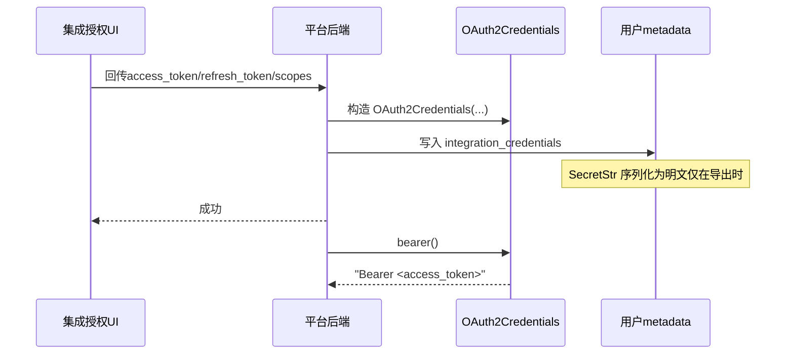
```mermaid
sequenceDiagram
    participant UI as 集成授权UI
    participant API as 平台后端
    participant Model as OAuth2Credentials
    participant Store as 用户metadata

    UI->>API: 回传access_token/refresh_token/scopes
    API->>Model: 构造 OAuth2Credentials(...)
    API->>Store: 写入 integration_credentials
    note over Store: SecretStr 序列化为明文仅在导出时
    API-->>UI: 成功

    API->>Model: bearer()
    Model-->>API: "Bearer <access_token>"
```

### 8.2 API Key 凭据使用时序图

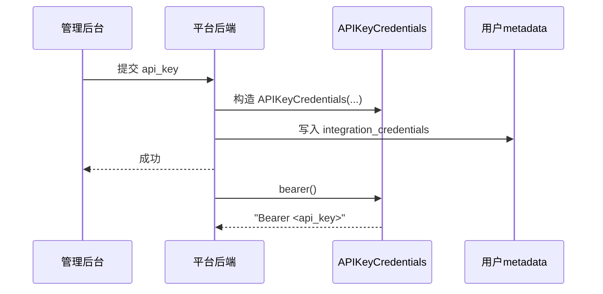
```mermaid
sequenceDiagram
    participant UI as 管理后台
    participant API as 平台后端
    participant Model as APIKeyCredentials
    participant Store as 用户metadata

    UI->>API: 提交 api_key
    API->>Model: 构造 APIKeyCredentials(...)
    API->>Store: 写入 integration_credentials
    API-->>UI: 成功

    API->>Model: bearer()
    Model-->>API: "Bearer <api_key>"
```

## 9. 关键结构体与继承关系总览

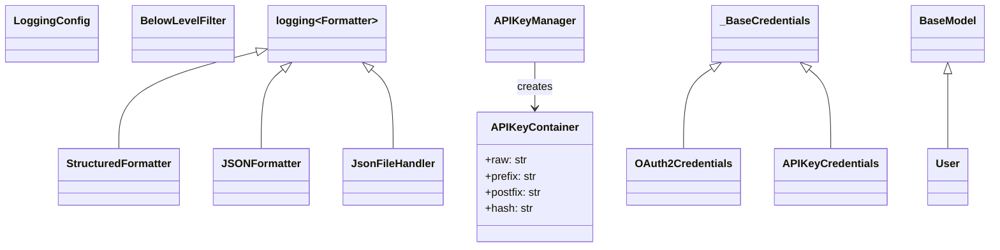
```mermaid
classDiagram
    class LoggingConfig
    class StructuredFormatter
    class JSONFormatter
    class BelowLevelFilter
    class JsonFileHandler
    class logging~Formatter~
    class logging~FileHandler~

    logging~Formatter~ <|-- StructuredFormatter
    logging~Formatter~ <|-- JSONFormatter
    logging~FileHandler~ <|-- JsonFileHandler

    class APIKeyManager
    class APIKeyContainer {
        +raw: str
        +prefix: str
        +postfix: str
        +hash: str
    }
    APIKeyManager --> APIKeyContainer : creates

    class _BaseCredentials
    class OAuth2Credentials
    class APIKeyCredentials
    _BaseCredentials <|-- OAuth2Credentials
    _BaseCredentials <|-- APIKeyCredentials

    class User
    class BaseModel
    BaseModel <|-- User
```

## 10. 最小集成样例（FastAPI）

```python
from fastapi import FastAPI, Depends
from autogpt_platform.autogpt_libs.autogpt_libs.auth.helpers import add_auth_responses_to_openapi
from autogpt_platform.autogpt_libs.autogpt_libs.auth.dependencies import requires_user
from autogpt_platform.autogpt_libs.autogpt_libs.rate_limit.middleware import rate_limit_middleware, RateLimitConfig
from autogpt_platform.autogpt_libs.autogpt_libs.logging.config import configure_logging

app = FastAPI(title="AutoGPT Libs Minimal Integration")

# Logging
configure_logging()

# OpenAPI 401 修正
add_auth_responses_to_openapi(app)

# 限流中间件
config = RateLimitConfig(requests_per_minute=60)
@app.middleware("http")
async def rate_limit_entry(request, call_next):
    return await rate_limit_middleware(request, call_next, config)

@app.get("/me")
async def me(user = Depends(requires_user)):
    return {"user_id": user.id, "email": user.email}
```

## 附：汇总


### 关键函数调用路径

- OAuth2 凭据创建 -> OAuth2Credentials(...) -> bearer() -> "Bearer <access_token>"
- API Key 凭据创建 -> APIKeyCredentials(...) -> bearer() -> "Bearer <api_key>"
- 用户集成元数据 -> UserMetadata.integration_credentials += [Credentials] -> UserIntegrations

## 7. 高级企业特性

### 7.1 分布式会话管理

基于分布式系统最佳实践，AutoGPT实现了高级会话管理：

```python
# 分布式会话管理器 - 参考业界最佳实践
class DistributedSessionManager:
    """
    分布式会话管理器
    
    基于Redis的高性能会话管理，支持：
    1. 多实例共享会话状态
    2. 自动过期和清理
    3. 会话劫持检测
    4. 并发访问控制
    """
    
    def __init__(self, redis_client, session_timeout: int = 3600):
        self.redis = redis_client
        self.session_timeout = session_timeout
        self.session_prefix = "session:"
        
    async def create_session(
        self,
        user_id: str,
        ip_address: str,
        user_agent: str,
        metadata: Dict[str, Any] = None
    ) -> str:
        """
        创建新会话
        
        安全特性：
        1. 生成加密安全的会话ID
        2. 绑定客户端特征防止劫持
        3. 设置合理的过期时间
        4. 记录详细的审计信息
        """
        
        import secrets
        
        # 生成安全的会话ID
        session_id = secrets.token_urlsafe(32)
        current_time = time.time()
        
        # 创建会话数据
        session_data = {
            "session_id": session_id,
            "user_id": user_id,
            "created_at": current_time,
            "last_activity": current_time,
            "expires_at": current_time + self.session_timeout,
            "ip_address": ip_address,
            "user_agent": user_agent,
            "metadata": metadata or {},
        }
        
        # 存储到Redis
        session_key = f"{self.session_prefix}{session_id}"
        await self.redis.setex(
            session_key,
            self.session_timeout,
            json.dumps(session_data)
        )
        
        logger.info(f"创建新会话: {session_id} for user {user_id}")
        return session_id
    
    async def validate_session(
        self,
        session_id: str,
        ip_address: str,
        user_agent: str
    ) -> Dict[str, Any]:
        """
        验证会话合法性
        
        验证内容：
        1. 会话是否存在且有效
        2. 客户端特征是否匹配
        3. 会话是否被劫持
        4. 访问频率是否异常
        """
        
        session_key = f"{self.session_prefix}{session_id}"
        session_data = await self.redis.get(session_key)
        
        if not session_data:
            return {"valid": False, "reason": "session_not_found"}
        
        try:
            session = json.loads(session_data)
            
            # 检查过期
            if time.time() > session["expires_at"]:
                await self.redis.delete(session_key)
                return {"valid": False, "reason": "session_expired"}
            
            # 安全检查
            security_issues = []
            
            # IP地址检查
            if session["ip_address"] != ip_address:
                security_issues.append("ip_change")
            
            # User Agent检查
            if session["user_agent"] != user_agent:
                security_issues.append("user_agent_change")
            
            # 更新活动时间
            session["last_activity"] = time.time()
            await self.redis.setex(
                session_key,
                self.session_timeout,
                json.dumps(session)
            )
            
            return {
                "valid": True,
                "session": session,
                "security_issues": security_issues,
            }
            
        except Exception as e:
            logger.error(f"会话验证异常: {e}")
            return {"valid": False, "reason": "validation_error"}
```

### 7.2 智能监控告警

```python
# 智能告警系统 - 结合监控最佳实践
class IntelligentAlertingSystem:
    """
    智能告警系统
    
    特性：
    1. 动态阈值调整
    2. 异常模式识别
    3. 告警聚合和去重
    4. 智能升级和降级
    """
    
    def __init__(self, notification_client, metrics_client):
        self.notification_client = notification_client
        self.metrics_client = metrics_client
        self.active_alerts = {}
        
    async def evaluate_alert_conditions(self, metrics_data: Dict[str, Any]):
        """
        评估告警条件
        
        评估流程：
        1. 应用静态规则
        2. 运行异常检测
        3. 分析历史模式
        4. 生成告警决策
        """
        
        # 静态规则检查
        rule_alerts = await self._check_static_rules(metrics_data)
        
        # 异常检测
        anomaly_alerts = await self._detect_anomalies(metrics_data)
        
        # 处理告警
        all_alerts = rule_alerts + anomaly_alerts
        for alert in all_alerts:
            await self._process_alert(alert)
    
    async def _check_static_rules(self, metrics: Dict[str, Any]) -> List[Dict[str, Any]]:
        """检查静态告警规则"""
        
        alerts = []
        
        # CPU使用率检查
        if metrics.get("cpu_usage_percent", 0) > 80:
            alerts.append({
                "type": "high_cpu_usage",
                "severity": "high",
                "message": f"CPU使用率过高: {metrics['cpu_usage_percent']:.1f}%",
                "value": metrics["cpu_usage_percent"],
                "threshold": 80,
            })
        
        # 内存使用率检查
        if metrics.get("memory_usage_percent", 0) > 85:
            alerts.append({
                "type": "high_memory_usage", 
                "severity": "high",
                "message": f"内存使用率过高: {metrics['memory_usage_percent']:.1f}%",
                "value": metrics["memory_usage_percent"],
                "threshold": 85,
            })
        
        # 错误率检查
        if metrics.get("error_rate", 0) > 0.05:
            alerts.append({
                "type": "high_error_rate",
                "severity": "critical",
                "message": f"错误率过高: {metrics['error_rate']:.3f}",
                "value": metrics["error_rate"],
                "threshold": 0.05,
            })
        
        return alerts
    
    async def _process_alert(self, alert: Dict[str, Any]):
        """处理告警"""
        
        alert_key = alert["type"]
        
        # 检查是否已存在相同告警
        if alert_key in self.active_alerts:
            # 更新现有告警
            self.active_alerts[alert_key]["count"] += 1
            self.active_alerts[alert_key]["last_occurrence"] = time.time()
        else:
            # 创建新告警
            self.active_alerts[alert_key] = {
                **alert,
                "count": 1,
                "first_occurrence": time.time(),
                "last_occurrence": time.time(),
            }
            
            # 发送告警通知
            await self._send_alert_notification(alert)
    
    async def _send_alert_notification(self, alert: Dict[str, Any]):
        """发送告警通知"""
        
        try:
            notification_data = {
                "title": f"AutoGPT告警: {alert['type']}",
                "message": alert["message"],
                "severity": alert["severity"],
                "timestamp": time.time(),
                "metadata": alert,
            }
            
            await self.notification_client.send_notification(notification_data)
            logger.info(f"告警通知已发送: {alert['type']}")
            
        except Exception as e:
            logger.error(f"发送告警通知失败: {e}")
```

## 总结

AutoGPT共享库通过精心设计的模块化架构，为整个平台提供了企业级的基础设施支撑。结合业界最佳实践，其核心优势包括：

1. **安全认证体系**：基于JWT的完整认证授权机制，支持角色权限和安全令牌管理
2. **分布式限流**：基于Redis的高性能限流系统，支持滑动窗口和多维度限制策略
3. **结构化日志**：统一的日志格式和云集成，提供完整的可观测性支持
4. **工具函数库**：分布式锁、线程缓存等高质量工具组件，提升开发效率
5. **API密钥管理**：安全的密钥生成验证机制，支持企业级密钥管理需求

共享库的成功关键在于：

- **模块化设计**：清晰的职责划分，便于独立维护和升级
- **配置驱动**：灵活的环境配置，适应不同部署场景
- **类型安全**：全面的类型注解，提供优秀的开发体验
- **企业级特性**：高可用、安全性和可观测性的完整考虑
- **标准化接口**：统一的API设计，降低学习和使用成本

通过这些共享库组件，AutoGPT平台建立了坚实的技术基础，为上层应用提供了可靠、高效、安全的基础服务支撑。

---
