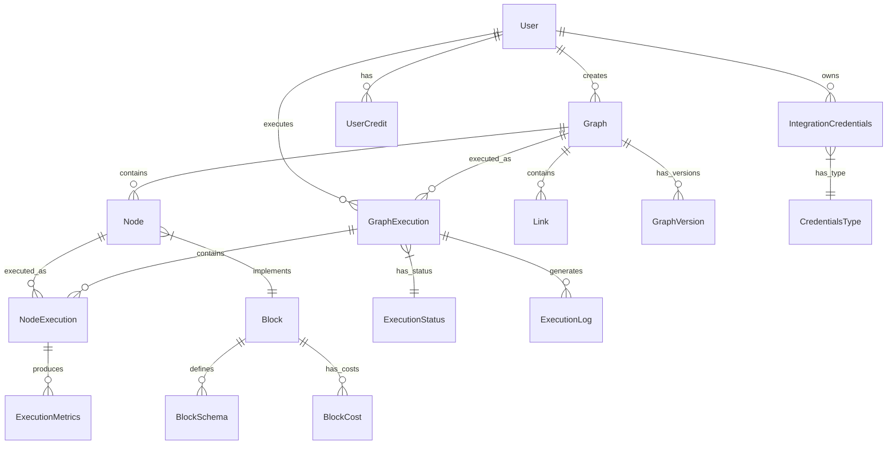
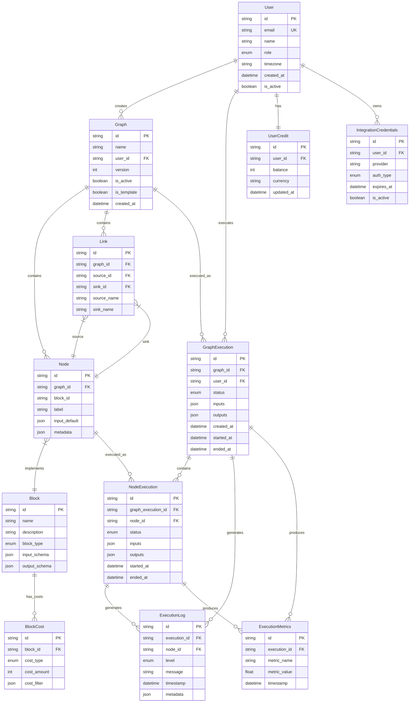

# AutoGPT平台关键数据结构UML分析

## 概述

AutoGPT平台采用了复杂的数据结构来支持智能体的创建、执行和管理。本文档通过UML图和详细说明，深入分析平台的核心数据模型，包括图结构、执行模型、Block系统、用户管理等关键组件。

## 目录

1. [核心数据模型概览](#核心数据模型概览)
2. [图结构数据模型](#图结构数据模型)
3. [执行引擎数据模型](#执行引擎数据模型)
4. [Block系统数据模型](#block系统数据模型)
5. [用户与认证数据模型](#用户与认证数据模型)
6. [集成与凭据数据模型](#集成与凭据数据模型)
7. [监控与日志数据模型](#监控与日志数据模型)
8. [数据关系总览](#数据关系总览)

## 核心数据模型概览

### 整体数据架构图



## 图结构数据模型

### Graph相关类图

```mermaid
classDiagram
    class Graph {
        +id: str
        +name: str
        +description: str
        +user_id: str
        +version: int
        +is_active: bool
        +is_template: bool
        +created_at: datetime
        +updated_at: datetime
        +nodes: List[Node]
        +links: List[Link]
        +validate_structure() bool
        +get_entry_nodes() List[Node]
        +get_exit_nodes() List[Node]
    }
    
    class Node {
        +id: str
        +graph_id: str
        +block_id: str
        +label: str
        +input_default: dict
        +metadata: dict
        +position: Position
        +block: Block
        +validate_inputs(inputs: dict) bool
        +get_required_inputs() List[str]
        +get_output_schema() dict
    }
    
    class Link {
        +id: str
        +graph_id: str
        +source_id: str
        +sink_id: str
        +source_name: str
        +sink_name: str
        +is_static: bool
        +validate_connection() bool
    }
    
    class Position {
        +x: float
        +y: float
    }
    
    class GraphVersion {
        +id: str
        +graph_id: str
        +version: int
        +is_active: bool
        +created_at: datetime
        +snapshot: dict
    }
    
    Graph ||--o{ Node : contains
    Graph ||--o{ Link : contains
    Graph ||--o{ GraphVersion : has_versions
    Node ||--|| Position : has_position
    Node }|--|| Block : implements
```

### Graph类详细说明

```python
class Graph(BaseModel):
    """
    智能体图数据模型
    
    表示一个完整的智能体工作流，包含节点、连接和元数据。
    支持版本管理、模板功能和结构验证。
    
    字段说明：
    - id: 图的唯一标识符，UUID格式
    - name: 图名称，用户可见的标识
    - description: 图描述，说明图的功能和用途
    - user_id: 创建者用户ID，关联到User表
    - version: 当前版本号，支持版本管理
    - is_active: 是否为活跃版本，用于版本切换
    - is_template: 是否为模板，模板可被其他用户复制
    - created_at: 创建时间戳
    - updated_at: 最后更新时间戳
    - nodes: 包含的节点列表
    - links: 节点间的连接列表
    
    核心方法：
    - validate_structure(): 验证图结构的完整性和正确性
    - get_entry_nodes(): 获取入口节点（无输入连接的节点）
    - get_exit_nodes(): 获取出口节点（无输出连接的节点）
    """
    id: str = Field(..., description="图唯一标识符")
    name: str = Field(..., max_length=100, description="图名称")
    description: Optional[str] = Field(None, max_length=500, description="图描述")
    user_id: str = Field(..., description="创建者用户ID")
    version: int = Field(default=1, ge=1, description="版本号")
    is_active: bool = Field(default=True, description="是否为活跃版本")
    is_template: bool = Field(default=False, description="是否为模板")
    created_at: datetime = Field(default_factory=datetime.utcnow)
    updated_at: datetime = Field(default_factory=datetime.utcnow)
    nodes: List[Node] = Field(default_factory=list, description="节点列表")
    links: List[Link] = Field(default_factory=list, description="连接列表")
    
    def validate_structure(self) -> bool:
        """
        验证图结构的完整性
        
        验证规则：
        1. 至少包含一个节点
        2. 所有连接的源节点和目标节点都存在
        3. 没有循环依赖
        4. 入口节点至少有一个
        5. 所有节点都可达
        
        返回:
            bool: 结构是否有效
        """
        if not self.nodes:
            return False
        
        # 验证连接的有效性
        node_ids = {node.id for node in self.nodes}
        for link in self.links:
            if link.source_id not in node_ids or link.sink_id not in node_ids:
                return False
        
        # 检查循环依赖
        if self._has_cycles():
            return False
        
        # 验证入口节点存在
        entry_nodes = self.get_entry_nodes()
        if not entry_nodes:
            return False
        
        return True
    
    def get_entry_nodes(self) -> List[Node]:
        """获取入口节点（没有输入连接的节点）"""
        sink_ids = {link.sink_id for link in self.links}
        return [node for node in self.nodes if node.id not in sink_ids]
    
    def get_exit_nodes(self) -> List[Node]:
        """获取出口节点（没有输出连接的节点）"""
        source_ids = {link.source_id for link in self.links}
        return [node for node in self.nodes if node.id not in source_ids]
```

### Node类详细说明

```python
class Node(BaseModel):
    """
    图节点数据模型
    
    表示图中的一个执行单元，封装了Block的实例化配置。
    每个节点都关联到一个Block类型，并包含特定的输入配置。
    
    字段说明：
    - id: 节点唯一标识符
    - graph_id: 所属图ID
    - block_id: 关联的Block类型ID
    - label: 节点显示标签
    - input_default: 默认输入值配置
    - metadata: 节点元数据，包含位置、样式等信息
    - position: 节点在画布上的位置
    - block: 关联的Block实例（运行时加载）
    
    核心方法：
    - validate_inputs(): 验证输入数据的有效性
    - get_required_inputs(): 获取必需的输入字段
    - get_output_schema(): 获取输出数据结构定义
    """
    id: str = Field(..., description="节点唯一标识符")
    graph_id: str = Field(..., description="所属图ID")
    block_id: str = Field(..., description="Block类型ID")
    label: str = Field(..., max_length=100, description="节点标签")
    input_default: dict = Field(default_factory=dict, description="默认输入配置")
    metadata: dict = Field(default_factory=dict, description="节点元数据")
    position: Position = Field(..., description="节点位置")
    block: Optional[Block] = Field(None, description="关联的Block实例")
    
    def validate_inputs(self, inputs: dict) -> bool:
        """
        验证输入数据的有效性
        
        参数:
            inputs: 要验证的输入数据
            
        返回:
            bool: 输入是否有效
        """
        if not self.block:
            return False
        
        try:
            # 合并默认值和实际输入
            merged_inputs = {**self.input_default, **inputs}
            
            # 使用Block的schema验证
            self.block.input_schema.model_validate(merged_inputs)
            return True
        except ValidationError:
            return False
    
    def get_required_inputs(self) -> List[str]:
        """获取必需的输入字段列表"""
        if not self.block:
            return []
        
        required_fields = []
        for field_name, field_info in self.block.input_schema.model_fields.items():
            if field_info.is_required() and field_name not in self.input_default:
                required_fields.append(field_name)
        
        return required_fields
    
    def get_output_schema(self) -> dict:
        """获取输出数据结构定义"""
        if not self.block:
            return {}
        
        return self.block.output_schema.model_json_schema()
```

## 执行引擎数据模型

### 执行相关类图

```mermaid
classDiagram
    class GraphExecution {
        +id: str
        +graph_id: str
        +graph_version: int
        +user_id: str
        +status: ExecutionStatus
        +inputs: dict
        +outputs: dict
        +created_at: datetime
        +started_at: datetime
        +ended_at: datetime
        +error_message: str
        +stats: ExecutionStats
        +user_context: UserContext
        +is_shared: bool
        +share_token: str
        +get_duration() timedelta
        +is_running() bool
        +can_be_cancelled() bool
    }
    
    class NodeExecution {
        +id: str
        +graph_execution_id: str
        +node_id: str
        +status: ExecutionStatus
        +inputs: dict
        +outputs: dict
        +started_at: datetime
        +ended_at: datetime
        +error_message: str
        +execution_stats: NodeExecutionStats
        +get_duration() timedelta
        +get_cost() int
    }
    
    class ExecutionStatus {
        <<enumeration>>
        QUEUED
        RUNNING
        COMPLETED
        FAILED
        CANCELLED
        TIMEOUT
    }
    
    class ExecutionStats {
        +total_nodes: int
        +completed_nodes: int
        +failed_nodes: int
        +total_cost: int
        +execution_time: float
        +memory_usage: int
        +calculate_success_rate() float
    }
    
    class NodeExecutionStats {
        +node_id: str
        +block_name: str
        +execution_time: float
        +input_size: int
        +output_size: int
        +cost: int
        +memory_usage: int
        +cpu_usage: float
    }
    
    class UserContext {
        +timezone: str
        +locale: str
        +preferences: dict
        +get_local_time() datetime
    }
    
    GraphExecution ||--o{ NodeExecution : contains
    GraphExecution }|--|| ExecutionStatus : has_status
    GraphExecution ||--|| ExecutionStats : has_stats
    GraphExecution ||--|| UserContext : has_context
    NodeExecution }|--|| ExecutionStatus : has_status
    NodeExecution ||--|| NodeExecutionStats : has_stats
```

### GraphExecution类详细说明

```python
class GraphExecution(BaseModel):
    """
    图执行数据模型
    
    表示一次完整的图执行过程，包含执行状态、输入输出、
    统计信息和错误信息。支持执行分享和用户上下文。
    
    字段说明：
    - id: 执行唯一标识符
    - graph_id: 执行的图ID
    - graph_version: 执行的图版本
    - user_id: 执行用户ID
    - status: 执行状态（排队、运行、完成、失败等）
    - inputs: 执行输入数据
    - outputs: 执行输出数据
    - created_at: 创建时间
    - started_at: 开始执行时间
    - ended_at: 结束时间
    - error_message: 错误信息（如果失败）
    - stats: 执行统计信息
    - user_context: 用户上下文信息
    - is_shared: 是否公开分享
    - share_token: 分享令牌
    
    核心方法：
    - get_duration(): 计算执行持续时间
    - is_running(): 检查是否正在运行
    - can_be_cancelled(): 检查是否可以取消
    """
    id: str = Field(..., description="执行唯一标识符")
    graph_id: str = Field(..., description="图ID")
    graph_version: int = Field(..., description="图版本")
    user_id: str = Field(..., description="用户ID")
    status: ExecutionStatus = Field(default=ExecutionStatus.QUEUED, description="执行状态")
    inputs: dict = Field(default_factory=dict, description="输入数据")
    outputs: dict = Field(default_factory=dict, description="输出数据")
    created_at: datetime = Field(default_factory=datetime.utcnow)
    started_at: Optional[datetime] = Field(None, description="开始时间")
    ended_at: Optional[datetime] = Field(None, description="结束时间")
    error_message: Optional[str] = Field(None, description="错误信息")
    stats: Optional[ExecutionStats] = Field(None, description="执行统计")
    user_context: UserContext = Field(default_factory=UserContext)
    is_shared: bool = Field(default=False, description="是否分享")
    share_token: Optional[str] = Field(None, description="分享令牌")
    
    def get_duration(self) -> Optional[timedelta]:
        """计算执行持续时间"""
        if not self.started_at:
            return None
        
        end_time = self.ended_at or datetime.utcnow()
        return end_time - self.started_at
    
    def is_running(self) -> bool:
        """检查是否正在运行"""
        return self.status in [ExecutionStatus.QUEUED, ExecutionStatus.RUNNING]
    
    def can_be_cancelled(self) -> bool:
        """检查是否可以取消"""
        return self.status in [ExecutionStatus.QUEUED, ExecutionStatus.RUNNING]
```

### ExecutionStatus枚举详细说明

```python
class ExecutionStatus(str, Enum):
    """
    执行状态枚举
    
    定义了图执行和节点执行的所有可能状态。
    状态转换遵循严格的生命周期规则。
    
    状态说明：
    - QUEUED: 已排队等待执行
    - RUNNING: 正在执行中
    - COMPLETED: 执行成功完成
    - FAILED: 执行失败
    - CANCELLED: 被用户取消
    - TIMEOUT: 执行超时
    
    状态转换规则：
    QUEUED -> RUNNING -> (COMPLETED | FAILED | CANCELLED | TIMEOUT)
    QUEUED -> CANCELLED (可以在排队时取消)
    RUNNING -> CANCELLED (可以在运行时取消)
    """
    QUEUED = "queued"        # 已排队，等待执行
    RUNNING = "running"      # 正在执行
    COMPLETED = "completed"  # 执行完成
    FAILED = "failed"        # 执行失败
    CANCELLED = "cancelled"  # 被取消
    TIMEOUT = "timeout"      # 执行超时
    
    def is_terminal(self) -> bool:
        """检查是否为终止状态"""
        return self in [
            ExecutionStatus.COMPLETED,
            ExecutionStatus.FAILED,
            ExecutionStatus.CANCELLED,
            ExecutionStatus.TIMEOUT
        ]
    
    def is_successful(self) -> bool:
        """检查是否为成功状态"""
        return self == ExecutionStatus.COMPLETED
```

## Block系统数据模型

### Block相关类图

```mermaid
classDiagram
    class Block {
        <<abstract>>
        +id: str
        +name: str
        +description: str
        +categories: List[BlockCategory]
        +block_type: BlockType
        +input_schema: Type[BaseModel]
        +output_schema: Type[BaseModel]
        +costs: List[BlockCost]
        +credentials_provider_names: List[str]
        +execute(input_data, credentials, **kwargs) AsyncGenerator
        +validate_credentials(credentials) bool
        +get_cost_estimate(input_data) int
    }
    
    class BlockSchema {
        +block_id: str
        +input_schema: dict
        +output_schema: dict
        +ui_schema: dict
        +examples: List[dict]
        +validate_input(data) bool
        +validate_output(data) bool
        +generate_example() dict
    }
    
    class BlockCost {
        +cost_type: BlockCostType
        +cost_amount: int
        +cost_currency: str
        +cost_filter: dict
        +description: str
        +calculate_cost(input_data) int
    }
    
    class BlockCostType {
        <<enumeration>>
        RUN
        BYTE
        SECOND
        TOKEN
        REQUEST
    }
    
    class BlockCategory {
        <<enumeration>>
        INPUT
        OUTPUT
        PROCESSING
        AI_ML
        DATA
        INTEGRATION
        UTILITY
        CUSTOM
    }
    
    class BlockType {
        <<enumeration>>
        STANDARD
        INPUT
        OUTPUT
        WEBHOOK
        AGENT
        AI
    }
    
    Block ||--|| BlockSchema : defines
    Block ||--o{ BlockCost : has_costs
    Block }|--|| BlockType : has_type
    Block }|--o{ BlockCategory : belongs_to
    BlockCost }|--|| BlockCostType : has_cost_type
```

### Block抽象基类详细说明

```python
class Block(ABC):
    """
    Block抽象基类
    
    定义了所有Block必须实现的接口和通用功能。
    Block是AutoGPT平台的核心执行单元，封装了特定的功能逻辑。
    
    类属性：
    - id: Block唯一标识符
    - name: Block显示名称
    - description: Block功能描述
    - categories: Block所属分类
    - block_type: Block类型
    - input_schema: 输入数据结构定义
    - output_schema: 输出数据结构定义
    - costs: 成本配置列表
    - credentials_provider_names: 需要的凭据提供商
    
    抽象方法：
    - execute(): 执行Block逻辑的核心方法
    
    通用方法：
    - validate_credentials(): 验证凭据有效性
    - get_cost_estimate(): 估算执行成本
    """
    
    # 类属性定义
    id: str
    name: str
    description: str
    categories: List[BlockCategory]
    block_type: BlockType = BlockType.STANDARD
    input_schema: Type[BaseModel]
    output_schema: Type[BaseModel]
    costs: List[BlockCost] = []
    credentials_provider_names: List[str] = []
    
    @abstractmethod
    async def execute(
        self,
        input_data: dict,
        credentials: dict[str, Any] = {},
        **kwargs
    ) -> AsyncGenerator[tuple[str, Any], None]:
        """
        执行Block逻辑的核心方法
        
        这是一个异步生成器方法，支持流式输出。
        每次yield返回一个(output_name, output_data)元组。
        
        参数:
            input_data: 输入数据字典
            credentials: 凭据字典，键为提供商名称
            **kwargs: 额外的执行参数
            
        生成:
            tuple[str, Any]: (输出名称, 输出数据)元组
            
        异常:
            ValidationError: 输入数据验证失败
            CredentialsError: 凭据验证失败
            ExecutionError: 执行过程中的错误
        """
        pass
    
    def validate_credentials(self, credentials: dict[str, Any]) -> bool:
        """
        验证凭据有效性
        
        参数:
            credentials: 凭据字典
            
        返回:
            bool: 凭据是否有效
        """
        for provider_name in self.credentials_provider_names:
            if provider_name not in credentials:
                return False
            
            credential = credentials[provider_name]
            if not credential or not hasattr(credential, 'is_valid'):
                return False
            
            if not credential.is_valid():
                return False
        
        return True
    
    def get_cost_estimate(self, input_data: dict) -> int:
        """
        估算执行成本
        
        参数:
            input_data: 输入数据
            
        返回:
            int: 估算成本（以分为单位）
        """
        total_cost = 0
        
        for cost_config in self.costs:
            if cost_config.cost_filter:
                # 检查是否匹配过滤条件
                if not self._matches_filter(input_data, cost_config.cost_filter):
                    continue
            
            cost = cost_config.calculate_cost(input_data)
            total_cost += cost
        
        return total_cost
    
    def _matches_filter(self, input_data: dict, cost_filter: dict) -> bool:
        """检查输入数据是否匹配成本过滤条件"""
        for key, expected_value in cost_filter.items():
            if input_data.get(key) != expected_value:
                return False
        return True
```

### BlockCost类详细说明

```python
class BlockCost(BaseModel):
    """
    Block成本配置模型
    
    定义了Block执行的成本计算规则。
    支持多种成本类型和过滤条件。
    
    字段说明：
    - cost_type: 成本类型（按次、按字节、按秒等）
    - cost_amount: 成本数量（以分为单位）
    - cost_currency: 成本货币（默认USD）
    - cost_filter: 成本过滤条件，只有匹配的输入才计费
    - description: 成本描述
    
    核心方法：
    - calculate_cost(): 根据输入数据计算实际成本
    """
    cost_type: BlockCostType = Field(..., description="成本类型")
    cost_amount: int = Field(..., ge=0, description="成本数量（分）")
    cost_currency: str = Field(default="USD", description="货币类型")
    cost_filter: dict = Field(default_factory=dict, description="成本过滤条件")
    description: str = Field(..., description="成本描述")
    
    def calculate_cost(self, input_data: dict) -> int:
        """
        根据输入数据计算实际成本
        
        参数:
            input_data: 输入数据字典
            
        返回:
            int: 计算出的成本（以分为单位）
        """
        if self.cost_type == BlockCostType.RUN:
            # 按次计费：固定成本
            return self.cost_amount
            
        elif self.cost_type == BlockCostType.BYTE:
            # 按字节计费：根据输入数据大小
            import json
            data_size = len(json.dumps(input_data).encode('utf-8'))
            return self.cost_amount * data_size
            
        elif self.cost_type == BlockCostType.TOKEN:
            # 按Token计费：根据文本长度估算
            text_content = self._extract_text_content(input_data)
            estimated_tokens = len(text_content.split()) * 1.3  # 粗略估算
            return int(self.cost_amount * estimated_tokens)
            
        elif self.cost_type == BlockCostType.REQUEST:
            # 按请求计费：根据请求数量
            request_count = input_data.get('request_count', 1)
            return self.cost_amount * request_count
            
        else:
            # 其他类型：返回基础成本
            return self.cost_amount
    
    def _extract_text_content(self, input_data: dict) -> str:
        """从输入数据中提取文本内容"""
        text_fields = ['text', 'content', 'message', 'prompt', 'query']
        
        for field in text_fields:
            if field in input_data and isinstance(input_data[field], str):
                return input_data[field]
        
        # 如果没有找到明显的文本字段，返回JSON字符串
        import json
        return json.dumps(input_data)
```

## 用户与认证数据模型

### 用户相关类图

```mermaid
classDiagram
    class User {
        +id: str
        +email: str
        +name: str
        +role: UserRole
        +timezone: str
        +locale: str
        +created_at: datetime
        +updated_at: datetime
        +last_login_at: datetime
        +is_active: bool
        +preferences: UserPreferences
        +is_admin() bool
        +get_display_name() str
        +update_last_login() void
    }
    
    class UserRole {
        <<enumeration>>
        USER
        ADMIN
        MODERATOR
        DEVELOPER
    }
    
    class UserPreferences {
        +theme: str
        +language: str
        +notifications_enabled: bool
        +auto_save_enabled: bool
        +default_graph_settings: dict
        +update_preference(key, value) void
    }
    
    class UserCredit {
        +id: str
        +user_id: str
        +balance: int
        +currency: str
        +created_at: datetime
        +updated_at: datetime
        +add_credits(amount) void
        +deduct_credits(amount) bool
        +get_balance() int
    }
    
    class CreditTransaction {
        +id: str
        +user_id: str
        +amount: int
        +transaction_type: TransactionType
        +description: str
        +reference_id: str
        +created_at: datetime
        +is_debit() bool
        +is_credit() bool
    }
    
    class TransactionType {
        <<enumeration>>
        PURCHASE
        EXECUTION_COST
        REFUND
        BONUS
        ADJUSTMENT
    }
    
    User }|--|| UserRole : has_role
    User ||--|| UserPreferences : has_preferences
    User ||--o{ UserCredit : has_credits
    User ||--o{ CreditTransaction : has_transactions
    CreditTransaction }|--|| TransactionType : has_type
```

### User类详细说明

```python
class User(BaseModel):
    """
    用户数据模型
    
    表示平台用户的基本信息和配置。
    支持角色管理、偏好设置和活动跟踪。
    
    字段说明：
    - id: 用户唯一标识符
    - email: 用户邮箱地址（唯一）
    - name: 用户显示名称
    - role: 用户角色（普通用户、管理员等）
    - timezone: 用户时区
    - locale: 用户语言环境
    - created_at: 账户创建时间
    - updated_at: 最后更新时间
    - last_login_at: 最后登录时间
    - is_active: 账户是否激活
    - preferences: 用户偏好设置
    
    核心方法：
    - is_admin(): 检查是否为管理员
    - get_display_name(): 获取显示名称
    - update_last_login(): 更新最后登录时间
    """
    id: str = Field(..., description="用户唯一标识符")
    email: EmailStr = Field(..., description="用户邮箱")
    name: Optional[str] = Field(None, max_length=100, description="用户名称")
    role: UserRole = Field(default=UserRole.USER, description="用户角色")
    timezone: str = Field(default="UTC", description="用户时区")
    locale: str = Field(default="en-US", description="语言环境")
    created_at: datetime = Field(default_factory=datetime.utcnow)
    updated_at: datetime = Field(default_factory=datetime.utcnow)
    last_login_at: Optional[datetime] = Field(None, description="最后登录时间")
    is_active: bool = Field(default=True, description="是否激活")
    preferences: UserPreferences = Field(default_factory=UserPreferences)
    
    def is_admin(self) -> bool:
        """检查用户是否为管理员"""
        return self.role in [UserRole.ADMIN, UserRole.MODERATOR]
    
    def get_display_name(self) -> str:
        """获取用户显示名称"""
        if self.name:
            return self.name
        return self.email.split('@')[0]
    
    def update_last_login(self) -> None:
        """更新最后登录时间"""
        self.last_login_at = datetime.utcnow()
        self.updated_at = datetime.utcnow()
    
    @property
    def is_new_user(self) -> bool:
        """检查是否为新用户（注册7天内）"""
        if not self.created_at:
            return False
        
        days_since_creation = (datetime.utcnow() - self.created_at).days
        return days_since_creation <= 7
```

### UserCredit类详细说明

```python
class UserCredit(BaseModel):
    """
    用户积分数据模型
    
    管理用户的积分余额和交易记录。
    支持多币种和事务性操作。
    
    字段说明：
    - id: 积分记录唯一标识符
    - user_id: 关联的用户ID
    - balance: 当前余额（以分为单位）
    - currency: 货币类型（默认USD）
    - created_at: 创建时间
    - updated_at: 最后更新时间
    
    核心方法：
    - add_credits(): 增加积分
    - deduct_credits(): 扣除积分
    - get_balance(): 获取当前余额
    """
    id: str = Field(..., description="积分记录ID")
    user_id: str = Field(..., description="用户ID")
    balance: int = Field(default=0, ge=0, description="余额（分）")
    currency: str = Field(default="USD", description="货币类型")
    created_at: datetime = Field(default_factory=datetime.utcnow)
    updated_at: datetime = Field(default_factory=datetime.utcnow)
    
    def add_credits(self, amount: int, description: str = "") -> CreditTransaction:
        """
        增加积分
        
        参数:
            amount: 增加的积分数量（分）
            description: 交易描述
            
        返回:
            CreditTransaction: 交易记录
        """
        if amount <= 0:
            raise ValueError("Amount must be positive")
        
        self.balance += amount
        self.updated_at = datetime.utcnow()
        
        # 创建交易记录
        transaction = CreditTransaction(
            id=str(uuid.uuid4()),
            user_id=self.user_id,
            amount=amount,
            transaction_type=TransactionType.PURCHASE,
            description=description or f"Added {amount} credits",
            created_at=datetime.utcnow()
        )
        
        return transaction
    
    def deduct_credits(self, amount: int, description: str = "") -> tuple[bool, Optional[CreditTransaction]]:
        """
        扣除积分
        
        参数:
            amount: 扣除的积分数量（分）
            description: 交易描述
            
        返回:
            tuple[bool, CreditTransaction]: (是否成功, 交易记录)
        """
        if amount <= 0:
            raise ValueError("Amount must be positive")
        
        if self.balance < amount:
            return False, None
        
        self.balance -= amount
        self.updated_at = datetime.utcnow()
        
        # 创建交易记录
        transaction = CreditTransaction(
            id=str(uuid.uuid4()),
            user_id=self.user_id,
            amount=-amount,  # 负数表示扣除
            transaction_type=TransactionType.EXECUTION_COST,
            description=description or f"Deducted {amount} credits",
            created_at=datetime.utcnow()
        )
        
        return True, transaction
    
    def get_balance(self) -> int:
        """获取当前余额"""
        return self.balance
```

## 集成与凭据数据模型

### 凭据相关类图

```mermaid
classDiagram
    class IntegrationCredentials {
        <<abstract>>
        +id: str
        +user_id: str
        +provider: str
        +created_at: datetime
        +updated_at: datetime
        +expires_at: datetime
        +is_active: bool
        +metadata: dict
        +is_expired() bool
        +is_valid() bool
        +refresh() bool
    }
    
    class OAuth2Credentials {
        +access_token: str
        +refresh_token: str
        +token_type: str
        +scopes: List[str]
        +username: str
        +refresh_access_token() bool
        +get_bearer_token() str
    }
    
    class APIKeyCredentials {
        +api_key: str
        +key_name: str
        +permissions: List[str]
        +validate_key() bool
        +get_bearer_token() str
    }
    
    class CredentialsProvider {
        +name: str
        +display_name: str
        +auth_type: AuthType
        +config: dict
        +supported_scopes: List[str]
        +create_credentials(auth_data) IntegrationCredentials
        +validate_credentials(credentials) bool
    }
    
    class AuthType {
        <<enumeration>>
        OAUTH2
        API_KEY
        BASIC_AUTH
        CUSTOM
    }
    
    IntegrationCredentials <|-- OAuth2Credentials
    IntegrationCredentials <|-- APIKeyCredentials
    CredentialsProvider }|--|| AuthType : uses_auth_type
    CredentialsProvider ||--o{ IntegrationCredentials : creates
```

### IntegrationCredentials抽象基类

```python
class IntegrationCredentials(BaseModel, ABC):
    """
    集成凭据抽象基类
    
    定义了所有凭据类型的通用接口和属性。
    支持凭据的生命周期管理和验证。
    
    字段说明：
    - id: 凭据唯一标识符
    - user_id: 关联的用户ID
    - provider: 服务提供商名称
    - created_at: 创建时间
    - updated_at: 最后更新时间
    - expires_at: 过期时间（可选）
    - is_active: 是否激活
    - metadata: 额外元数据
    
    抽象方法：
    - is_valid(): 检查凭据是否有效
    - refresh(): 刷新凭据
    """
    id: str = Field(..., description="凭据ID")
    user_id: str = Field(..., description="用户ID")
    provider: str = Field(..., description="服务提供商")
    created_at: datetime = Field(default_factory=datetime.utcnow)
    updated_at: datetime = Field(default_factory=datetime.utcnow)
    expires_at: Optional[datetime] = Field(None, description="过期时间")
    is_active: bool = Field(default=True, description="是否激活")
    metadata: dict = Field(default_factory=dict, description="元数据")
    
    def is_expired(self) -> bool:
        """检查凭据是否过期"""
        if not self.expires_at:
            return False
        return datetime.utcnow() > self.expires_at
    
    @abstractmethod
    def is_valid(self) -> bool:
        """检查凭据是否有效"""
        pass
    
    @abstractmethod
    async def refresh(self) -> bool:
        """刷新凭据"""
        pass
```

### OAuth2Credentials类详细说明

```python
class OAuth2Credentials(IntegrationCredentials):
    """
    OAuth2凭据数据模型
    
    实现OAuth2认证流程的凭据管理。
    支持访问令牌刷新和权限范围管理。
    
    字段说明：
    - access_token: 访问令牌
    - refresh_token: 刷新令牌
    - token_type: 令牌类型（通常为Bearer）
    - scopes: 权限范围列表
    - username: 关联的用户名（可选）
    
    核心方法：
    - refresh_access_token(): 使用刷新令牌获取新的访问令牌
    - get_bearer_token(): 获取Bearer格式的认证头
    """
    access_token: SecretStr = Field(..., description="访问令牌")
    refresh_token: Optional[SecretStr] = Field(None, description="刷新令牌")
    token_type: str = Field(default="Bearer", description="令牌类型")
    scopes: List[str] = Field(default_factory=list, description="权限范围")
    username: Optional[str] = Field(None, description="用户名")
    
    def is_valid(self) -> bool:
        """检查OAuth2凭据是否有效"""
        if not self.is_active:
            return False
        
        if self.is_expired():
            return False
        
        if not self.access_token.get_secret_value():
            return False
        
        return True
    
    async def refresh(self) -> bool:
        """刷新OAuth2访问令牌"""
        if not self.refresh_token:
            return False
        
        try:
            # 这里应该调用具体的OAuth2提供商API
            # 以下是示例代码
            refresh_data = await self._call_refresh_api()
            
            if refresh_data:
                self.access_token = SecretStr(refresh_data['access_token'])
                if 'refresh_token' in refresh_data:
                    self.refresh_token = SecretStr(refresh_data['refresh_token'])
                
                # 更新过期时间
                if 'expires_in' in refresh_data:
                    expires_in = refresh_data['expires_in']
                    self.expires_at = datetime.utcnow() + timedelta(seconds=expires_in)
                
                self.updated_at = datetime.utcnow()
                return True
            
        except Exception as e:
            logger.error(f"Failed to refresh OAuth2 token: {e}")
        
        return False
    
    def get_bearer_token(self) -> str:
        """获取Bearer格式的认证头"""
        return f"Bearer {self.access_token.get_secret_value()}"
    
    async def _call_refresh_api(self) -> Optional[dict]:
        """调用OAuth2刷新API（需要具体实现）"""
        # 这里应该根据具体的OAuth2提供商实现
        # 返回包含新令牌的字典
        pass
```

## 监控与日志数据模型

### 监控相关类图

```mermaid
classDiagram
    class ExecutionLog {
        +id: str
        +execution_id: str
        +node_id: str
        +level: LogLevel
        +message: str
        +timestamp: datetime
        +metadata: dict
        +user_id: str
        +get_formatted_message() str
    }
    
    class LogLevel {
        <<enumeration>>
        DEBUG
        INFO
        WARNING
        ERROR
        CRITICAL
    }
    
    class ExecutionMetrics {
        +id: str
        +execution_id: str
        +node_id: str
        +metric_name: str
        +metric_value: float
        +metric_unit: str
        +timestamp: datetime
        +tags: dict
        +get_prometheus_format() str
    }
    
    class SystemMetrics {
        +timestamp: datetime
        +cpu_usage: float
        +memory_usage: float
        +disk_usage: float
        +active_executions: int
        +queue_size: int
        +error_rate: float
        +calculate_health_score() float
    }
    
    class AlertRule {
        +id: str
        +name: str
        +condition: str
        +threshold: float
        +severity: AlertSeverity
        +is_active: bool
        +notification_channels: List[str]
        +evaluate(metrics) bool
        +trigger_alert() void
    }
    
    class AlertSeverity {
        <<enumeration>>
        LOW
        MEDIUM
        HIGH
        CRITICAL
    }
    
    ExecutionLog }|--|| LogLevel : has_level
    ExecutionMetrics ||--|| SystemMetrics : aggregates_to
    AlertRule }|--|| AlertSeverity : has_severity
```

### ExecutionLog类详细说明

```python
class ExecutionLog(BaseModel):
    """
    执行日志数据模型
    
    记录图执行和节点执行过程中的日志信息。
    支持结构化日志和元数据存储。
    
    字段说明：
    - id: 日志记录唯一标识符
    - execution_id: 关联的执行ID（图或节点）
    - node_id: 节点ID（可选，节点级日志）
    - level: 日志级别
    - message: 日志消息
    - timestamp: 时间戳
    - metadata: 结构化元数据
    - user_id: 关联的用户ID
    
    核心方法：
    - get_formatted_message(): 获取格式化的日志消息
    """
    id: str = Field(..., description="日志ID")
    execution_id: str = Field(..., description="执行ID")
    node_id: Optional[str] = Field(None, description="节点ID")
    level: LogLevel = Field(..., description="日志级别")
    message: str = Field(..., description="日志消息")
    timestamp: datetime = Field(default_factory=datetime.utcnow)
    metadata: dict = Field(default_factory=dict, description="元数据")
    user_id: str = Field(..., description="用户ID")
    
    def get_formatted_message(self) -> str:
        """获取格式化的日志消息"""
        timestamp_str = self.timestamp.strftime("%Y-%m-%d %H:%M:%S")
        level_str = self.level.value.upper()
        
        if self.node_id:
            return f"[{timestamp_str}] {level_str} [Node:{self.node_id}] {self.message}"
        else:
            return f"[{timestamp_str}] {level_str} [Execution:{self.execution_id}] {self.message}"
    
    def to_structured_log(self) -> dict:
        """转换为结构化日志格式"""
        return {
            "timestamp": self.timestamp.isoformat(),
            "level": self.level.value,
            "message": self.message,
            "execution_id": self.execution_id,
            "node_id": self.node_id,
            "user_id": self.user_id,
            "metadata": self.metadata,
        }
```

### SystemMetrics类详细说明

```python
class SystemMetrics(BaseModel):
    """
    系统指标数据模型
    
    收集和存储系统级别的性能指标。
    用于监控平台健康状态和性能趋势。
    
    字段说明：
    - timestamp: 指标收集时间
    - cpu_usage: CPU使用率（百分比）
    - memory_usage: 内存使用率（百分比）
    - disk_usage: 磁盘使用率（百分比）
    - active_executions: 活跃执行数量
    - queue_size: 队列大小
    - error_rate: 错误率（百分比）
    
    核心方法：
    - calculate_health_score(): 计算系统健康评分
    """
    timestamp: datetime = Field(default_factory=datetime.utcnow)
    cpu_usage: float = Field(..., ge=0, le=100, description="CPU使用率")
    memory_usage: float = Field(..., ge=0, le=100, description="内存使用率")
    disk_usage: float = Field(..., ge=0, le=100, description="磁盘使用率")
    active_executions: int = Field(..., ge=0, description="活跃执行数")
    queue_size: int = Field(..., ge=0, description="队列大小")
    error_rate: float = Field(..., ge=0, le=100, description="错误率")
    
    def calculate_health_score(self) -> float:
        """
        计算系统健康评分
        
        评分规则：
        - CPU使用率权重：0.2
        - 内存使用率权重：0.3
        - 磁盘使用率权重：0.1
        - 错误率权重：0.4
        
        返回:
            float: 健康评分（0-100）
        """
        # 将使用率转换为健康分数（使用率越低，分数越高）
        cpu_score = max(0, 100 - self.cpu_usage)
        memory_score = max(0, 100 - self.memory_usage)
        disk_score = max(0, 100 - self.disk_usage)
        error_score = max(0, 100 - self.error_rate)
        
        # 加权平均
        health_score = (
            cpu_score * 0.2 +
            memory_score * 0.3 +
            disk_score * 0.1 +
            error_score * 0.4
        )
        
        return round(health_score, 2)
    
    def is_healthy(self) -> bool:
        """检查系统是否健康"""
        return self.calculate_health_score() >= 70.0
    
    def get_alerts(self) -> List[str]:
        """获取需要告警的指标"""
        alerts = []
        
        if self.cpu_usage > 80:
            alerts.append(f"High CPU usage: {self.cpu_usage}%")
        
        if self.memory_usage > 85:
            alerts.append(f"High memory usage: {self.memory_usage}%")
        
        if self.disk_usage > 90:
            alerts.append(f"High disk usage: {self.disk_usage}%")
        
        if self.error_rate > 5:
            alerts.append(f"High error rate: {self.error_rate}%")
        
        if self.queue_size > 100:
            alerts.append(f"Large queue size: {self.queue_size}")
        
        return alerts
```

## 数据关系总览

### 完整数据关系图



### 数据一致性约束

#### 1. 引用完整性约束

```sql
-- 用户相关约束
ALTER TABLE graphs ADD CONSTRAINT fk_graph_user 
    FOREIGN KEY (user_id) REFERENCES users(id) ON DELETE CASCADE;

ALTER TABLE graph_executions ADD CONSTRAINT fk_execution_user 
    FOREIGN KEY (user_id) REFERENCES users(id) ON DELETE CASCADE;

ALTER TABLE graph_executions ADD CONSTRAINT fk_execution_graph 
    FOREIGN KEY (graph_id) REFERENCES graphs(id) ON DELETE CASCADE;

-- 图结构约束
ALTER TABLE nodes ADD CONSTRAINT fk_node_graph 
    FOREIGN KEY (graph_id) REFERENCES graphs(id) ON DELETE CASCADE;

ALTER TABLE links ADD CONSTRAINT fk_link_graph 
    FOREIGN KEY (graph_id) REFERENCES graphs(id) ON DELETE CASCADE;

ALTER TABLE links ADD CONSTRAINT fk_link_source 
    FOREIGN KEY (source_id) REFERENCES nodes(id) ON DELETE CASCADE;

ALTER TABLE links ADD CONSTRAINT fk_link_sink 
    FOREIGN KEY (sink_id) REFERENCES nodes(id) ON DELETE CASCADE;

-- 执行相关约束
ALTER TABLE node_executions ADD CONSTRAINT fk_node_exec_graph_exec 
    FOREIGN KEY (graph_execution_id) REFERENCES graph_executions(id) ON DELETE CASCADE;

ALTER TABLE node_executions ADD CONSTRAINT fk_node_exec_node 
    FOREIGN KEY (node_id) REFERENCES nodes(id) ON DELETE CASCADE;
```

#### 2. 业务逻辑约束

```sql
-- 确保每个图只有一个活跃版本
CREATE UNIQUE INDEX idx_graph_active_version 
    ON graphs(user_id, name) WHERE is_active = true;

-- 确保用户邮箱唯一
CREATE UNIQUE INDEX idx_user_email ON users(email);

-- 确保执行状态的有效性
ALTER TABLE graph_executions ADD CONSTRAINT chk_execution_status 
    CHECK (status IN ('queued', 'running', 'completed', 'failed', 'cancelled'));

-- 确保时间逻辑的正确性
ALTER TABLE graph_executions ADD CONSTRAINT chk_execution_times 
    CHECK (started_at >= created_at AND (ended_at IS NULL OR ended_at >= started_at));
```

#### 3. 数据完整性检查

```python
async def validate_graph_integrity(graph_id: str) -> List[str]:
    """
    验证图数据完整性
    
    检查项目：
    1. 所有节点都有对应的Block定义
    2. 所有连接的源节点和目标节点都存在
    3. 没有孤立的节点（除了入口和出口节点）
    4. 没有循环依赖
    
    参数:
        graph_id: 要验证的图ID
        
    返回:
        List[str]: 发现的问题列表
    """
    issues = []
    
    # 获取图数据
    graph = await get_graph_by_id(graph_id)
    if not graph:
        return ["Graph not found"]
    
    # 检查节点Block定义
    for node in graph.nodes:
        block = get_block(node.block_id)
        if not block:
            issues.append(f"Node {node.id} references unknown block {node.block_id}")
    
    # 检查连接有效性
    node_ids = {node.id for node in graph.nodes}
    for link in graph.links:
        if link.source_id not in node_ids:
            issues.append(f"Link {link.id} references unknown source node {link.source_id}")
        if link.sink_id not in node_ids:
            issues.append(f"Link {link.id} references unknown sink node {link.sink_id}")
    
    # 检查循环依赖
    if has_cycles(graph):
        issues.append("Graph contains circular dependencies")
    
    # 检查节点可达性
    unreachable_nodes = find_unreachable_nodes(graph)
    if unreachable_nodes:
        issues.append(f"Unreachable nodes found: {', '.join(unreachable_nodes)}")
    
    return issues
```

## 总结

AutoGPT平台的数据结构设计体现了以下特点：

### 设计优势

1. **模块化设计**：各个数据模型职责清晰，相互独立又有机关联
2. **类型安全**：使用Pydantic进行严格的数据验证和类型检查
3. **扩展性强**：支持版本管理、模板系统和插件化架构
4. **监控完备**：完整的日志、指标和告警数据模型
5. **安全可靠**：多层次的数据验证和完整性约束

### 核心特性

1. **图结构管理**：支持复杂的工作流定义和版本控制
2. **执行引擎**：完整的执行生命周期管理和状态跟踪
3. **Block系统**：灵活的插件化架构和成本管理
4. **用户管理**：完善的用户体系和权限控制
5. **集成支持**：多种认证方式和凭据管理
6. **可观测性**：全面的监控、日志和指标收集

### 最佳实践

1. **数据一致性**：通过外键约束和业务逻辑验证确保数据完整性
2. **性能优化**：合理的索引设计和查询优化
3. **安全性**：敏感数据加密存储和访问控制
4. **可维护性**：清晰的数据模型文档和变更管理
5. **可扩展性**：预留扩展字段和版本兼容性设计

通过这套完整的数据结构设计，AutoGPT平台能够支持复杂的AI工作流管理、高效的执行调度和全面的系统监控，为用户提供稳定可靠的智能体开发和运行环境。
