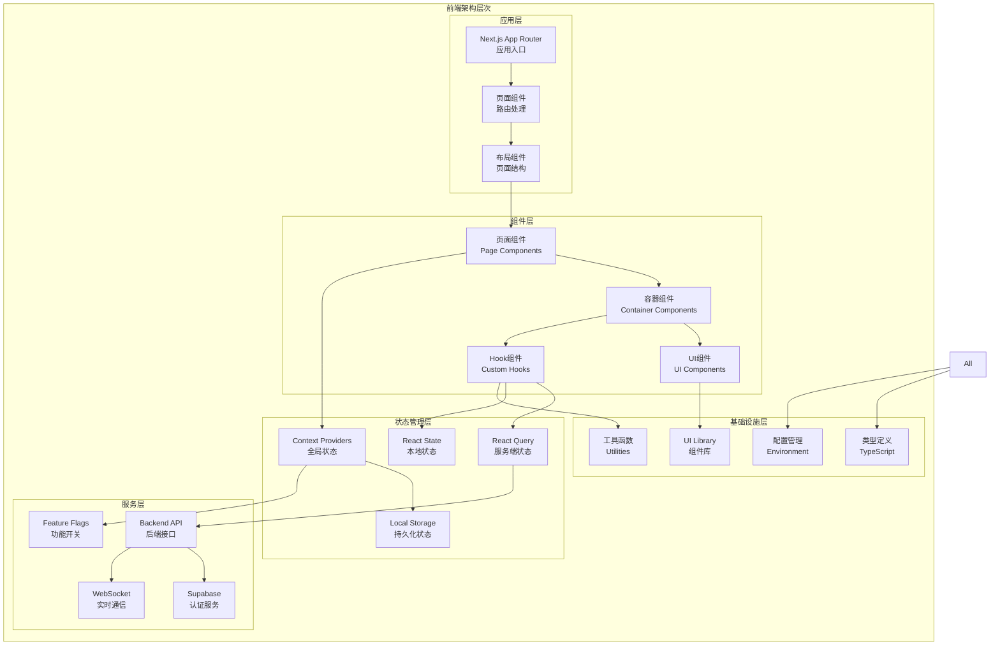
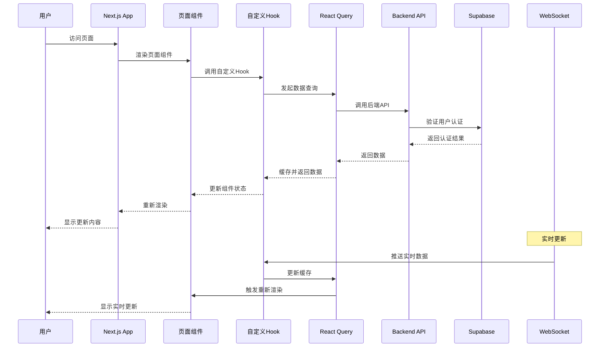

# AutoGPT 前端架构模块深度分析

## 模块概述

AutoGPT前端采用现代化的React生态系统，基于Next.js 14的App Router架构，集成了TypeScript、Tailwind CSS、React Query、Supabase等技术栈。前端架构采用组件化设计、状态管理分离、服务层抽象等模式，实现了高性能、可维护的用户界面。

## 架构图



## 时序图



## 核心架构组件

### 1. 应用入口和路由

#### Next.js App Router 结构
```typescript
// app/layout.tsx - 根布局
export default async function RootLayout({
  children,
}: Readonly<{
  children: React.ReactNode;
}>) {
  return (
    <html lang="en" suppressHydrationWarning>
      <head>
        <meta name="viewport" content="width=device-width, initial-scale=1" />
        <link rel="icon" href="/favicon.ico" />
      </head>
      <body className={cn(inter.className, "antialiased")}>
        <Providers
          attribute="class"
          defaultTheme="system"
          enableSystem
          disableTransitionOnChange
        >
          <div className="flex min-h-screen flex-col">
            <Navbar />
            <main className="flex-1">{children}</main>
          </div>
          <Toaster />
        </Providers>
        <Analytics />
      </body>
    </html>
  );
}
```

#### 提供者组件架构
```typescript
// app/providers.tsx - 全局提供者
export function Providers({ children, ...props }: ThemeProviderProps) {
  const queryClient = getQueryClient();
  return (
    <QueryClientProvider client={queryClient}>
      <NuqsAdapter>
        <NextThemesProvider {...props}>
          <BackendAPIProvider>
            <CredentialsProvider>
              <LaunchDarklyProvider>
                <OnboardingProvider>
                  <TooltipProvider>{children}</TooltipProvider>
                </OnboardingProvider>
              </LaunchDarklyProvider>
            </CredentialsProvider>
          </BackendAPIProvider>
        </NextThemesProvider>
      </NuqsAdapter>
    </QueryClientProvider>
  );
}
```

### 2. 状态管理系统

#### React Query 配置
```typescript
// lib/react-query/queryClient.ts
export function getQueryClient() {
  if (typeof window === "undefined") {
    // 服务端：总是创建新的查询客户端
    return makeQueryClient();
  } else {
    // 浏览器端：创建查询客户端（如果不存在）
    if (!browserQueryClient) browserQueryClient = makeQueryClient();
    return browserQueryClient;
  }
}

function makeQueryClient() {
  return new QueryClient({
    defaultOptions: {
      queries: {
        // 使用SSR时，我们通常希望将staleTime设置为0以上
        // 以避免立即在客户端重新获取
        staleTime: 60 * 1000, // 1分钟
        gcTime: 5 * 60 * 1000, // 5分钟
        retry: (failureCount, error) => {
          // 不重试4xx错误
          if (error instanceof Error && error.message.includes('4')) {
            return false;
          }
          return failureCount < 3;
        },
      },
    },
  });
}
```

#### 后端API上下文
```typescript
// lib/autogpt-server-api/context.tsx
const BackendAPIProviderContext = createContext<BackendAPI | null>(null);

export function BackendAPIProvider({
  children,
}: {
  children?: React.ReactNode;
}): React.ReactNode {
  const api = useMemo(() => new BackendAPI(), []);

  // 开发环境下暴露API到全局对象用于调试
  if (process.env.NEXT_PUBLIC_BEHAVE_AS == "LOCAL" && !isServerSide()) {
    window.api = api;
  }

  return (
    <BackendAPIProviderContext.Provider value={api}>
      {children}
    </BackendAPIProviderContext.Provider>
  );
}

export function useBackendAPI(): BackendAPI {
  const context = React.useContext(BackendAPIProviderContext);
  if (!context) {
    throw new Error(
      "useBackendAPI must be used within a BackendAPIProviderContext",
    );
  }
  return context;
}
```

### 3. 核心自定义Hook

#### useAgentGraph Hook
```typescript
// hooks/useAgentGraph.tsx - Agent图管理核心Hook
export default function useAgentGraph(
  flowID?: GraphID,
  flowVersion?: number,
  flowExecutionID?: GraphExecutionID,
  passDataToBeads?: boolean,
) {
  const { toast } = useToast();
  const router = useRouter();
  const pathname = usePathname();
  const searchParams = useSearchParams();
  const api = useBackendAPI();

  // 状态管理
  const [isScheduling, setIsScheduling] = useState(false);
  const [savedAgent, setSavedAgent] = useState<Graph | null>(null);
  const [agentDescription, setAgentDescription] = useState<string>("");
  const [agentName, setAgentName] = useState<string>("");
  const [libraryAgent, setLibraryAgent] = useState<LibraryAgent | null>(null);
  const [allBlocks, setAllBlocks] = useState<Block[]>([]);
  const [availableFlows, setAvailableFlows] = useState<GraphMeta[]>([]);
  const [updateQueue, setUpdateQueue] = useState<NodeExecutionResult[]>([]);
  const [isSaving, setIsSaving] = useState(false);
  const [isRunning, setIsRunning] = useState(false);
  const [isStopping, setIsStopping] = useState(false);
  const [activeExecutionID, setActiveExecutionID] = useState<GraphExecutionID | null>(null);
  const [graphExecutionError, setGraphExecutionError] = useState<string | null>(null);
  const [xyNodes, setXYNodes] = useState<CustomNode[]>([]);
  const [xyEdges, setXYEdges] = useState<CustomEdge[]>([]);

  // 功能开关过滤
  const betaBlocks = useGetFlag(Flag.BETA_BLOCKS);
  const availableBlocks = useMemo(() => {
    return allBlocks.filter(
      (block) => !betaBlocks || !betaBlocks.includes(block.id),
    );
  }, [allBlocks, betaBlocks]);

  // 加载可用块和流程
  useEffect(() => {
    const loadBlocksAndFlows = async () => {
      try {
        const [blocksResponse, flowsResponse] = await Promise.all([
          api.listBlocks(),
          api.listGraphs(),
        ]);
        setAllBlocks(blocksResponse);
        setAvailableFlows(flowsResponse);
      } catch (error) {
        console.error("Failed to load blocks and flows:", error);
        toast({
          title: "Error",
          description: "Failed to load available blocks and flows",
          variant: "destructive",
        });
      }
    };

    loadBlocksAndFlows();
  }, [api, toast]);

  // 保存Agent
  const saveAgent = useCallback(async () => {
    if (!agentName.trim()) {
      toast({
        title: "Error",
        description: "Please enter an agent name",
        variant: "destructive",
      });
      return;
    }

    setIsSaving(true);
    try {
      const graphData = {
        name: agentName,
        description: agentDescription,
        nodes: xyNodes.map(node => ({
          id: node.id,
          block_id: node.data.block_id,
          input_default: node.data.input_default,
          input_nodes: node.data.input_nodes,
          output_nodes: node.data.output_nodes,
          metadata: {
            position: { x: node.position.x, y: node.position.y },
          },
        })),
        links: xyEdges.map(edge => ({
          source_id: edge.source,
          sink_id: edge.target,
          source_name: edge.sourceHandle,
          sink_name: edge.targetHandle,
        })),
      };

      let response;
      if (flowID) {
        response = await api.updateGraph(flowID, graphData);
      } else {
        response = await api.createGraph(graphData);
      }

      setSavedAgent(response);
      toast({
        title: "Success",
        description: `Agent ${flowID ? 'updated' : 'created'} successfully`,
      });

      // 如果是新创建的Agent，导航到编辑页面
      if (!flowID) {
        router.push(`/build?flowID=${response.id}`);
      }
    } catch (error) {
      console.error("Failed to save agent:", error);
      toast({
        title: "Error",
        description: "Failed to save agent",
        variant: "destructive",
      });
    } finally {
      setIsSaving(false);
    }
  }, [agentName, agentDescription, xyNodes, xyEdges, flowID, api, toast, router]);

  // 运行Agent
  const runAgent = useCallback(async () => {
    if (!savedAgent) {
      toast({
        title: "Error",
        description: "Please save the agent first",
        variant: "destructive",
      });
      return;
    }

    setIsRunning(true);
    setGraphExecutionError(null);
    
    try {
      const execution = await api.executeGraph(savedAgent.id, savedAgent.version, {
        input_data: {},
        input_credentials: {},
      });

      setActiveExecutionID(execution.id);
      
      // 开始监听执行更新
      api.connectWebSocket();
      api.onWebSocketMessage((message) => {
        if (message.type === 'node_execution_result') {
          setUpdateQueue(prev => [...prev, message.data]);
        }
      });

      toast({
        title: "Success",
        description: "Agent execution started",
      });
    } catch (error) {
      console.error("Failed to run agent:", error);
      setGraphExecutionError(error instanceof Error ? error.message : "Unknown error");
      toast({
        title: "Error",
        description: "Failed to start agent execution",
        variant: "destructive",
      });
    } finally {
      setIsRunning(false);
    }
  }, [savedAgent, api, toast]);

  // 停止Agent执行
  const stopAgent = useCallback(async () => {
    if (!activeExecutionID) return;

    setIsStopping(true);
    try {
      await api.stopGraphExecution(savedAgent!.id, activeExecutionID);
      setActiveExecutionID(null);
      api.disconnectWebSocket();
      
      toast({
        title: "Success",
        description: "Agent execution stopped",
      });
    } catch (error) {
      console.error("Failed to stop agent:", error);
      toast({
        title: "Error",
        description: "Failed to stop agent execution",
        variant: "destructive",
      });
    } finally {
      setIsStopping(false);
    }
  }, [activeExecutionID, savedAgent, api, toast]);

  return {
    // 状态
    savedAgent,
    agentName,
    setAgentName,
    agentDescription,
    setAgentDescription,
    libraryAgent,
    setLibraryAgent,
    availableBlocks,
    availableFlows,
    xyNodes,
    setXYNodes,
    xyEdges,
    setXYEdges,
    
    // 执行状态
    isRunning,
    isStopping,
    activeExecutionID,
    graphExecutionError,
    updateQueue,
    
    // 操作方法
    saveAgent,
    runAgent,
    stopAgent,
    isSaving,
    isScheduling,
    setIsScheduling,
  };
}
```

#### useSupabase Hook
```typescript
// lib/supabase/hooks/useSupabase.ts - Supabase认证管理
export function useSupabase() {
  const router = useRouter();
  const pathname = usePathname();
  const api = useBackendAPI();
  const [user, setUser] = useState<User | null>(null);
  const [isUserLoading, setIsUserLoading] = useState(true);
  const lastValidationRef = useRef<number>(0);
  const isValidatingRef = useRef(false);
  const isLoggedIn = Boolean(user);

  // 创建Supabase客户端
  const supabase = useMemo(() => {
    try {
      return createBrowserClient(getSupabaseUrl(), getSupabaseAnonKey(), {
        isSingleton: true,
        auth: {
          persistSession: false, // 使用httpOnly cookies，不在客户端持久化会话
        },
      });
    } catch (error) {
      console.error("Error creating Supabase client", error);
      return null;
    }
  }, []);

  // 登出函数
  async function logOut(options: ServerLogoutOptions = {}) {
    setWebSocketDisconnectIntent();
    api.disconnectWebSocket();
    broadcastLogout();

    try {
      await serverLogout(options);
    } catch (error) {
      console.error("Error logging out:", error);
    } finally {
      setUser(null);
      router.refresh();
    }
  }

  // 验证会话
  async function validateSessionServer() {
    // 防止并发验证调用
    if (isValidatingRef.current) return true;
    
    const now = Date.now();
    // 限制验证频率（最多每30秒一次）
    if (now - lastValidationRef.current < 30000) return true;

    isValidatingRef.current = true;
    lastValidationRef.current = now;

    try {
      const result = await validateSession();
      if (result.user) {
        setUser(result.user);
        return true;
      } else {
        setUser(null);
        return false;
      }
    } catch (error) {
      console.error("Session validation failed:", error);
      setUser(null);
      return false;
    } finally {
      isValidatingRef.current = false;
    }
  }

  // 初始化用户状态
  useEffect(() => {
    const initializeUser = async () => {
      setIsUserLoading(true);
      try {
        const currentUser = await getCurrentUser();
        setUser(currentUser);
      } catch (error) {
        console.error("Error getting current user:", error);
        setUser(null);
      } finally {
        setIsUserLoading(false);
      }
    };

    initializeUser();
  }, []);

  // 设置会话事件监听器
  useEffect(() => {
    if (!supabase) return;

    const cleanup = setupSessionEventListeners(supabase, (event) => {
      if (isLogoutEvent(event)) {
        setUser(null);
        const redirectPath = getRedirectPath(pathname);
        if (redirectPath) {
          router.push(redirectPath);
        }
      }
    });

    return cleanup;
  }, [supabase, pathname, router]);

  return {
    user,
    isLoggedIn,
    isUserLoading,
    logOut,
    validateSessionServer,
    supabase,
  };
}
```

### 4. 可视化图形编辑器

#### Flow组件架构
```typescript
// components/legacy-builder/Flow/Flow.tsx - 图形编辑器核心
const FlowEditor: React.FC<{
  flowID?: GraphID;
  flowVersion?: number;
  className?: string;
}> = ({ flowID, flowVersion, className }) => {
  const {
    addNodes,
    deleteElements,
    xyNodes,
    setXYNodes,
    xyEdges,
    setXYEdges,
    availableBlocks,
    savedAgent,
    runAgent,
    stopAgent,
    isRunning,
    isStopping,
  } = useAgentGraph(flowID, flowVersion);

  const { toast } = useToast();
  const reactFlowInstance = useReactFlow();
  const [isAnyModalOpen, setIsAnyModalOpen] = useState(false);
  const [visualizeBeads, setVisualizeBeads] = useState<"no" | "static" | "animate">("no");

  // 节点类型定义
  const nodeTypes = useMemo(
    () => ({
      custom: CustomNode,
    }),
    [],
  );

  // 边类型定义
  const edgeTypes = useMemo(
    () => ({
      custom: CustomEdge,
    }),
    [],
  );

  // 连接处理
  const onConnect: OnConnect = useCallback(
    (connection: Connection) => {
      if (!connection.source || !connection.target) return;

      const sourceNode = xyNodes.find(node => node.id === connection.source);
      const targetNode = xyNodes.find(node => node.id === connection.target);

      if (!sourceNode || !targetNode) return;

      // 验证连接的有效性
      const sourceBlock = availableBlocks.find(block => block.id === sourceNode.data.block_id);
      const targetBlock = availableBlocks.find(block => block.id === targetNode.data.block_id);

      if (!sourceBlock || !targetBlock) return;

      // 检查输出和输入类型是否匹配
      const sourceOutput = sourceBlock.outputSchema.properties[connection.sourceHandle!];
      const targetInput = targetBlock.inputSchema.properties[connection.targetHandle!];

      if (!isTypeCompatible(sourceOutput, targetInput)) {
        toast({
          title: "Connection Error",
          description: "Output and input types are not compatible",
          variant: "destructive",
        });
        return;
      }

      // 创建新边
      const newEdge: CustomEdge = {
        id: formatEdgeID(connection.source, connection.target, connection.sourceHandle!, connection.targetHandle!),
        source: connection.source,
        target: connection.target,
        sourceHandle: connection.sourceHandle!,
        targetHandle: connection.targetHandle!,
        type: "custom",
        markerEnd: {
          type: MarkerType.ArrowClosed,
          width: 20,
          height: 20,
          color: getTypeColor(sourceOutput.type),
        },
        style: {
          stroke: getTypeColor(sourceOutput.type),
          strokeWidth: 2,
        },
      };

      setXYEdges(edges => [...edges, newEdge]);
    },
    [xyNodes, availableBlocks, setXYEdges, toast],
  );

  // 节点变化处理
  const onNodesChange = useCallback(
    (changes: NodeChange[]) => {
      setXYNodes(nodes => applyNodeChanges(changes, nodes));
    },
    [setXYNodes],
  );

  // 边变化处理
  const onEdgesChange = useCallback(
    (changes: EdgeChange[]) => {
      setXYEdges(edges => applyEdgeChanges(changes, edges));
    },
    [setXYEdges],
  );

  // 添加新节点
  const addNode = useCallback(
    (blockId: string, position?: { x: number; y: number }) => {
      const block = availableBlocks.find(b => b.id === blockId);
      if (!block) return;

      const nodePosition = position || findNewlyAddedBlockCoordinates(xyNodes);
      const newNode: CustomNode = {
        id: uuidv4(),
        type: "custom",
        position: nodePosition,
        data: {
          block_id: blockId,
          block_type: block.uiType as BlockUIType,
          title: block.name,
          input_default: {},
          input_nodes: {},
          output_nodes: {},
          status: "INCOMPLETE",
        },
      };

      setXYNodes(nodes => [...nodes, newNode]);
    },
    [availableBlocks, xyNodes, setXYNodes],
  );

  return (
    <div className={cn("flex h-full w-full", className)}>
      <ReactFlow
        nodes={xyNodes}
        edges={xyEdges}
        onNodesChange={onNodesChange}
        onEdgesChange={onEdgesChange}
        onConnect={onConnect}
        nodeTypes={nodeTypes}
        edgeTypes={edgeTypes}
        connectionLineComponent={ConnectionLine}
        fitView
        attributionPosition="top-right"
      >
        <Controls />
        <Background />
        
        {/* 控制面板 */}
        <ControlPanel>
          <SaveControl
            onSave={() => saveAgent()}
            isSaving={isSaving}
            disabled={!agentName.trim()}
          />
          
          <Control
            onClick={() => runAgent()}
            disabled={isRunning || !savedAgent}
            loading={isRunning}
          >
            Run Agent
          </Control>
          
          <Control
            onClick={() => stopAgent()}
            disabled={!isRunning || isStopping}
            loading={isStopping}
          >
            Stop Agent
          </Control>
          
          <BlocksControl
            blocks={availableBlocks}
            onAddBlock={addNode}
          />
        </ControlPanel>
      </ReactFlow>
    </div>
  );
};
```

### 5. 组件库系统

#### 原子组件示例
```typescript
// components/atoms/Button/Button.tsx
interface ButtonProps extends React.ButtonHTMLAttributes<HTMLButtonElement> {
  variant?: "default" | "destructive" | "outline" | "secondary" | "ghost" | "link";
  size?: "default" | "sm" | "lg" | "icon";
  loading?: boolean;
}

const Button = React.forwardRef<HTMLButtonElement, ButtonProps>(
  ({ className, variant = "default", size = "default", loading, children, disabled, ...props }, ref) => {
    return (
      <button
        className={cn(buttonVariants({ variant, size, className }))}
        ref={ref}
        disabled={disabled || loading}
        {...props}
      >
        {loading && <Loader2 className="mr-2 h-4 w-4 animate-spin" />}
        {children}
      </button>
    );
  }
);
```

#### 分子组件示例
```typescript
// components/molecules/Toast/Toast.tsx
interface ToastProps {
  title?: string;
  description?: string;
  variant?: "default" | "destructive";
  action?: React.ReactNode;
}

export function Toast({ title, description, variant = "default", action }: ToastProps) {
  return (
    <div className={cn(
      "group pointer-events-auto relative flex w-full items-center justify-between space-x-4 overflow-hidden rounded-md border p-6 pr-8 shadow-lg transition-all",
      variant === "destructive" && "destructive border-destructive bg-destructive text-destructive-foreground"
    )}>
      <div className="grid gap-1">
        {title && <div className="text-sm font-semibold">{title}</div>}
        {description && <div className="text-sm opacity-90">{description}</div>}
      </div>
      {action}
    </div>
  );
}
```

## API接口集成

### 1. 自动生成的API客户端

#### OpenAPI代码生成
```typescript
// lib/autogpt-server-api/client.ts - 自动生成的API客户端
export class BackendAPI {
  private baseURL: string;
  private wsClient: WebSocketClient | null = null;

  constructor() {
    this.baseURL = getApiBaseUrl();
  }

  // Graph相关API
  async listGraphs(): Promise<GraphMeta[]> {
    const response = await fetch(`${this.baseURL}/api/v1/graphs`, {
      method: 'GET',
      credentials: 'include',
      headers: {
        'Content-Type': 'application/json',
      },
    });

    if (!response.ok) {
      throw new Error(`Failed to list graphs: ${response.statusText}`);
    }

    return response.json();
  }

  async createGraph(graph: CreateGraphRequest): Promise<Graph> {
    const response = await fetch(`${this.baseURL}/api/v1/graphs`, {
      method: 'POST',
      credentials: 'include',
      headers: {
        'Content-Type': 'application/json',
      },
      body: JSON.stringify(graph),
    });

    if (!response.ok) {
      throw new Error(`Failed to create graph: ${response.statusText}`);
    }

    return response.json();
  }

  async executeGraph(
    graphId: string,
    version: number,
    request: ExecuteGraphRequest
  ): Promise<GraphExecution> {
    const response = await fetch(
      `${this.baseURL}/api/v1/graphs/${graphId}/execute/${version}`,
      {
        method: 'POST',
        credentials: 'include',
        headers: {
          'Content-Type': 'application/json',
        },
        body: JSON.stringify(request),
      }
    );

    if (!response.ok) {
      throw new Error(`Failed to execute graph: ${response.statusText}`);
    }

    return response.json();
  }

  // Block相关API
  async listBlocks(): Promise<Block[]> {
    const response = await fetch(`${this.baseURL}/api/v1/blocks`, {
      method: 'GET',
      credentials: 'include',
      headers: {
        'Content-Type': 'application/json',
      },
    });

    if (!response.ok) {
      throw new Error(`Failed to list blocks: ${response.statusText}`);
    }

    return response.json();
  }

  // WebSocket连接
  connectWebSocket(): void {
    if (this.wsClient) return;

    const wsUrl = this.baseURL.replace(/^http/, 'ws') + '/ws';
    this.wsClient = new WebSocketClient(wsUrl);
    
    this.wsClient.connect();
  }

  disconnectWebSocket(): void {
    if (this.wsClient) {
      this.wsClient.disconnect();
      this.wsClient = null;
    }
  }

  onWebSocketMessage(callback: (message: any) => void): void {
    if (this.wsClient) {
      this.wsClient.onMessage(callback);
    }
  }
}
```

### 2. React Query集成

#### 查询Hook生成
```typescript
// lib/autogpt-server-api/queries.ts - React Query集成
export function useListGraphs() {
  const api = useBackendAPI();
  
  return useQuery({
    queryKey: ['graphs'],
    queryFn: () => api.listGraphs(),
    staleTime: 5 * 60 * 1000, // 5分钟
    gcTime: 10 * 60 * 1000, // 10分钟
  });
}

export function useCreateGraph() {
  const api = useBackendAPI();
  const queryClient = useQueryClient();
  
  return useMutation({
    mutationFn: (graph: CreateGraphRequest) => api.createGraph(graph),
    onSuccess: () => {
      // 创建成功后刷新图列表
      queryClient.invalidateQueries({ queryKey: ['graphs'] });
    },
  });
}

export function useExecuteGraph() {
  const api = useBackendAPI();
  
  return useMutation({
    mutationFn: ({ 
      graphId, 
      version, 
      request 
    }: { 
      graphId: string; 
      version: number; 
      request: ExecuteGraphRequest;
    }) => api.executeGraph(graphId, version, request),
  });
}

export function useListBlocks() {
  const api = useBackendAPI();
  
  return useQuery({
    queryKey: ['blocks'],
    queryFn: () => api.listBlocks(),
    staleTime: 10 * 60 * 1000, // 10分钟，块变化较少
    gcTime: 30 * 60 * 1000, // 30分钟
  });
}
```

## 性能优化策略

### 1. 代码分割和懒加载

```typescript
// 路由级别的代码分割
const BuildPage = lazy(() => import('@/app/(platform)/build/page'));
const MarketplacePage = lazy(() => import('@/app/(platform)/marketplace/page'));
const LibraryPage = lazy(() => import('@/app/(platform)/library/page'));

// 组件级别的懒加载
const FlowEditor = lazy(() => import('@/components/legacy-builder/Flow/Flow'));
const BlocksPanel = lazy(() => import('@/components/legacy-builder/BlocksPanel'));

// 使用Suspense包装
function App() {
  return (
    <Suspense fallback={<LoadingSpinner />}>
      <Routes>
        <Route path="/build" element={<BuildPage />} />
        <Route path="/marketplace" element={<MarketplacePage />} />
        <Route path="/library" element={<LibraryPage />} />
      </Routes>
    </Suspense>
  );
}
```

### 2. 状态优化

```typescript
// 使用useMemo优化昂贵计算
const availableBlocks = useMemo(() => {
  return allBlocks.filter(
    (block) => !betaBlocks || !betaBlocks.includes(block.id),
  );
}, [allBlocks, betaBlocks]);

// 使用useCallback优化函数引用
const handleNodeChange = useCallback(
  (changes: NodeChange[]) => {
    setXYNodes(nodes => applyNodeChanges(changes, nodes));
  },
  [setXYNodes],
);

// 使用React.memo优化组件渲染
const CustomNode = React.memo(({ data, selected }: NodeProps) => {
  return (
    <div className={cn("custom-node", selected && "selected")}>
      {/* 节点内容 */}
    </div>
  );
});
```

### 3. 虚拟化和分页

```typescript
// 使用react-window进行虚拟化
import { FixedSizeList as List } from 'react-window';

function BlocksList({ blocks }: { blocks: Block[] }) {
  const Row = ({ index, style }: { index: number; style: React.CSSProperties }) => (
    <div style={style}>
      <BlockItem block={blocks[index]} />
    </div>
  );

  return (
    <List
      height={600}
      itemCount={blocks.length}
      itemSize={80}
      width="100%"
    >
      {Row}
    </List>
  );
}
```

## 实战经验

### 1. 状态管理最佳实践

#### 状态分层
- **服务端状态**: 使用React Query管理，自动缓存和同步
- **客户端状态**: 使用useState和useReducer管理本地状态
- **全局状态**: 使用Context API管理跨组件状态
- **持久化状态**: 使用localStorage和sessionStorage

#### 状态更新优化
```typescript
// 批量状态更新
const updateMultipleStates = useCallback(() => {
  startTransition(() => {
    setNodes(newNodes);
    setEdges(newEdges);
    setSelectedNode(null);
  });
}, []);

// 防抖状态更新
const debouncedSave = useMemo(
  () => debounce((data) => saveToServer(data), 1000),
  []
);
```

### 2. 性能监控和优化

#### 性能指标监控
```typescript
// 使用Performance API监控
function measurePerformance(name: string, fn: () => void) {
  performance.mark(`${name}-start`);
  fn();
  performance.mark(`${name}-end`);
  performance.measure(name, `${name}-start`, `${name}-end`);
  
  const measure = performance.getEntriesByName(name)[0];
  console.log(`${name} took ${measure.duration}ms`);
}

// 组件渲染性能监控
function useRenderCount(componentName: string) {
  const renderCount = useRef(0);
  
  useEffect(() => {
    renderCount.current += 1;
    console.log(`${componentName} rendered ${renderCount.current} times`);
  });
}
```

#### 内存泄漏预防
```typescript
// 清理定时器和监听器
useEffect(() => {
  const timer = setInterval(() => {
    // 定时任务
  }, 1000);
  
  const handleResize = () => {
    // 处理窗口大小变化
  };
  
  window.addEventListener('resize', handleResize);
  
  return () => {
    clearInterval(timer);
    window.removeEventListener('resize', handleResize);
  };
}, []);

// 取消未完成的请求
useEffect(() => {
  const abortController = new AbortController();
  
  fetchData({ signal: abortController.signal })
    .then(setData)
    .catch(error => {
      if (error.name !== 'AbortError') {
        console.error('Fetch error:', error);
      }
    });
  
  return () => {
    abortController.abort();
  };
}, []);
```

### 3. 用户体验优化

#### 加载状态管理
```typescript
// 统一的加载状态管理
function useAsyncOperation<T>(
  operation: () => Promise<T>,
  dependencies: any[] = []
) {
  const [data, setData] = useState<T | null>(null);
  const [loading, setLoading] = useState(false);
  const [error, setError] = useState<Error | null>(null);
  
  const execute = useCallback(async () => {
    setLoading(true);
    setError(null);
    
    try {
      const result = await operation();
      setData(result);
      return result;
    } catch (err) {
      setError(err instanceof Error ? err : new Error('Unknown error'));
      throw err;
    } finally {
      setLoading(false);
    }
  }, dependencies);
  
  return { data, loading, error, execute };
}
```

#### 错误边界和错误处理
```typescript
// 错误边界组件
class ErrorBoundary extends React.Component<
  { children: React.ReactNode; fallback?: React.ComponentType<{ error: Error }> },
  { hasError: boolean; error: Error | null }
> {
  constructor(props: any) {
    super(props);
    this.state = { hasError: false, error: null };
  }
  
  static getDerivedStateFromError(error: Error) {
    return { hasError: true, error };
  }
  
  componentDidCatch(error: Error, errorInfo: React.ErrorInfo) {
    console.error('Error caught by boundary:', error, errorInfo);
    // 发送错误到监控服务
    Sentry.captureException(error, { extra: errorInfo });
  }
  
  render() {
    if (this.state.hasError) {
      const FallbackComponent = this.props.fallback || DefaultErrorFallback;
      return <FallbackComponent error={this.state.error!} />;
    }
    
    return this.props.children;
  }
}
```

### 4. 可访问性和国际化

#### 可访问性支持
```typescript
// 键盘导航支持
function useKeyboardNavigation(items: any[], onSelect: (item: any) => void) {
  const [selectedIndex, setSelectedIndex] = useState(0);
  
  useEffect(() => {
    const handleKeyDown = (event: KeyboardEvent) => {
      switch (event.key) {
        case 'ArrowUp':
          event.preventDefault();
          setSelectedIndex(prev => Math.max(0, prev - 1));
          break;
        case 'ArrowDown':
          event.preventDefault();
          setSelectedIndex(prev => Math.min(items.length - 1, prev + 1));
          break;
        case 'Enter':
          event.preventDefault();
          onSelect(items[selectedIndex]);
          break;
      }
    };
    
    document.addEventListener('keydown', handleKeyDown);
    return () => document.removeEventListener('keydown', handleKeyDown);
  }, [items, selectedIndex, onSelect]);
  
  return selectedIndex;
}

// ARIA属性支持
function AccessibleButton({ 
  children, 
  onClick, 
  disabled, 
  ariaLabel 
}: {
  children: React.ReactNode;
  onClick: () => void;
  disabled?: boolean;
  ariaLabel?: string;
}) {
  return (
    <button
      onClick={onClick}
      disabled={disabled}
      aria-label={ariaLabel}
      aria-disabled={disabled}
      role="button"
      tabIndex={disabled ? -1 : 0}
    >
      {children}
    </button>
  );
}
```

### 5. 测试策略

#### 单元测试
```typescript
// 组件测试
import { render, screen, fireEvent } from '@testing-library/react';
import { Button } from './Button';

describe('Button', () => {
  it('renders correctly', () => {
    render(<Button>Click me</Button>);
    expect(screen.getByRole('button')).toHaveTextContent('Click me');
  });
  
  it('handles click events', () => {
    const handleClick = jest.fn();
    render(<Button onClick={handleClick}>Click me</Button>);
    
    fireEvent.click(screen.getByRole('button'));
    expect(handleClick).toHaveBeenCalledTimes(1);
  });
  
  it('shows loading state', () => {
    render(<Button loading>Click me</Button>);
    expect(screen.getByRole('button')).toBeDisabled();
    expect(screen.getByTestId('loading-spinner')).toBeInTheDocument();
  });
});
```

#### 集成测试
```typescript
// Hook测试
import { renderHook, act } from '@testing-library/react';
import { useAgentGraph } from './useAgentGraph';

describe('useAgentGraph', () => {
  it('saves agent correctly', async () => {
    const { result } = renderHook(() => useAgentGraph());
    
    act(() => {
      result.current.setAgentName('Test Agent');
      result.current.setAgentDescription('Test Description');
    });
    
    await act(async () => {
      await result.current.saveAgent();
    });
    
    expect(result.current.savedAgent).toBeTruthy();
    expect(result.current.savedAgent?.name).toBe('Test Agent');
  });
});
```

## 总结

AutoGPT前端架构采用现代化的React生态系统，通过精心设计的组件化架构、状态管理、性能优化和用户体验策略，实现了高性能、可维护、可扩展的用户界面。关键特性包括：

1. **现代化技术栈**: Next.js 14 + TypeScript + Tailwind CSS
2. **状态管理**: React Query + Context API + 本地状态
3. **组件化设计**: 原子设计模式 + 可复用组件库
4. **性能优化**: 代码分割 + 虚拟化 + 缓存策略
5. **用户体验**: 加载状态 + 错误处理 + 可访问性
6. **开发体验**: 类型安全 + 自动生成 + 热重载
7. **测试覆盖**: 单元测试 + 集成测试 + E2E测试

该架构为AutoGPT平台提供了强大的前端基础设施，支持复杂的AI Agent可视化编辑和管理功能。

