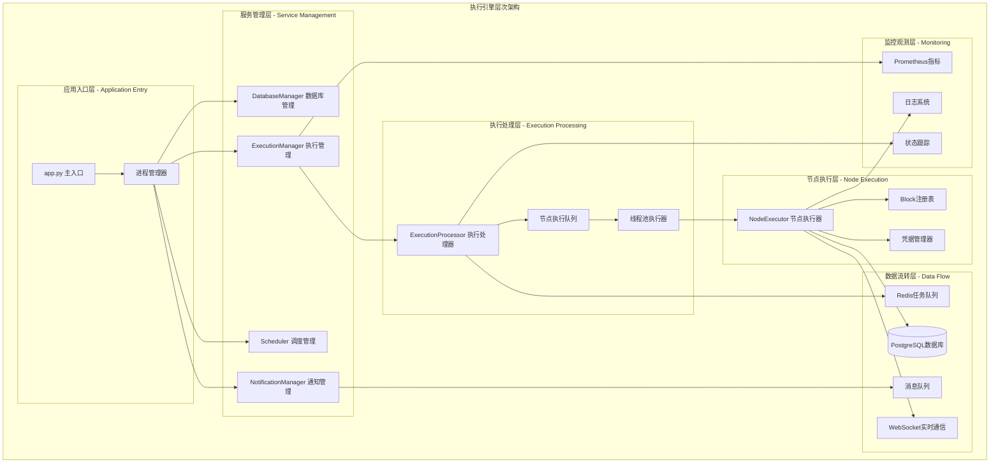
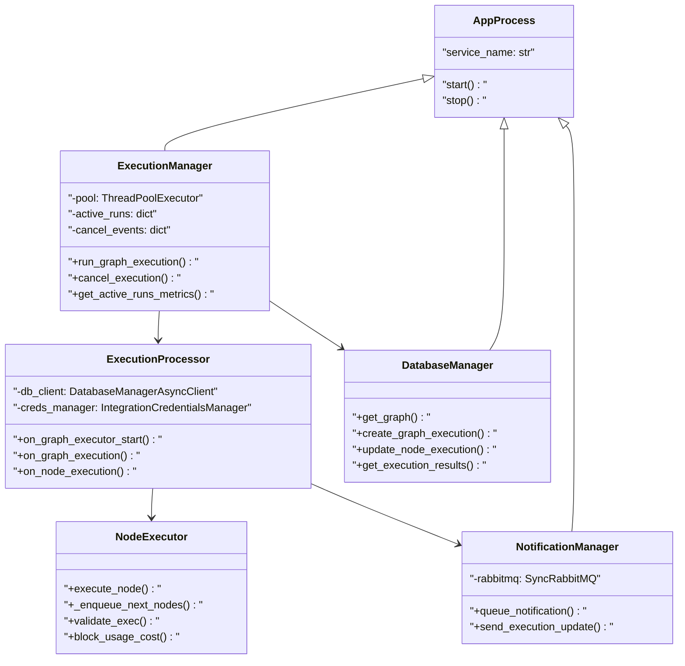
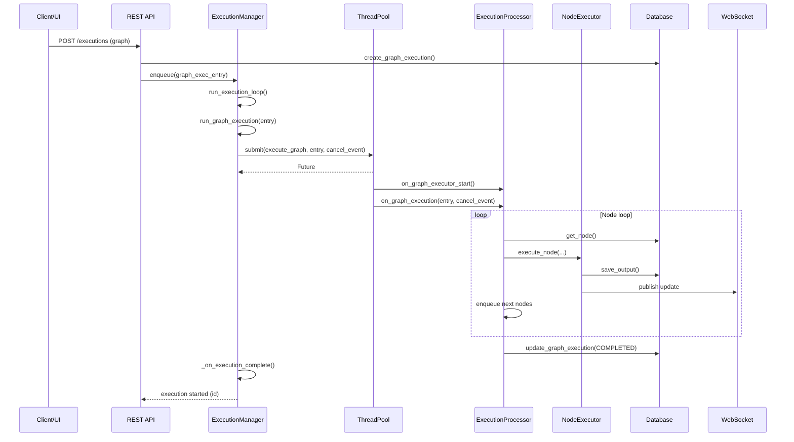
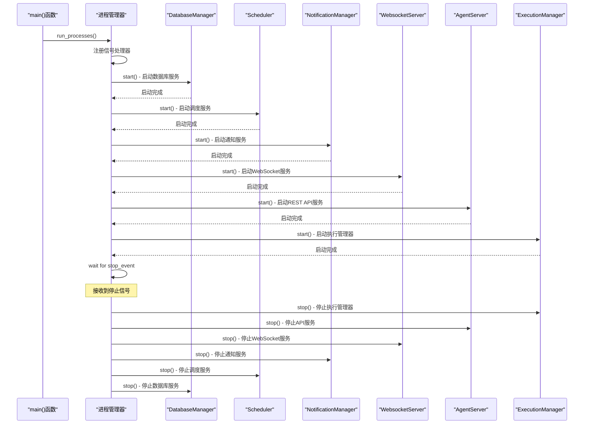
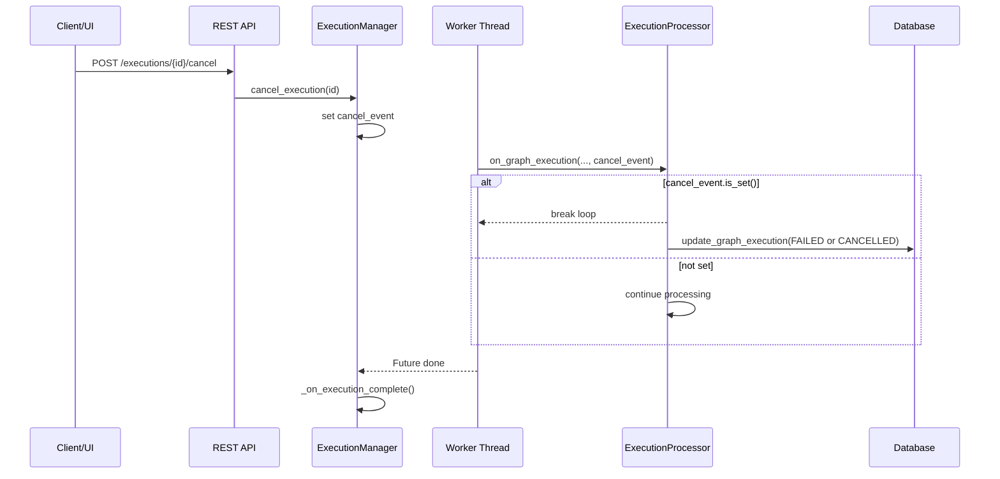
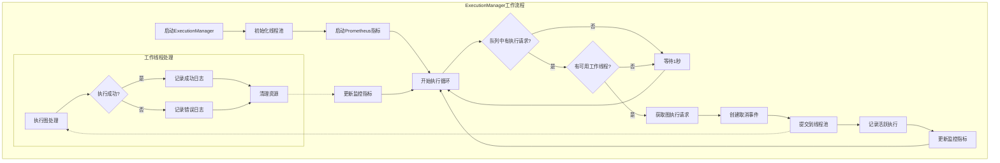
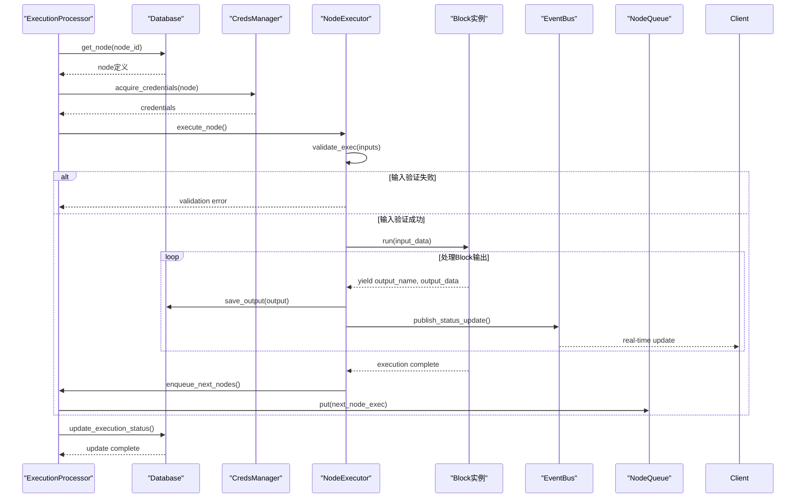
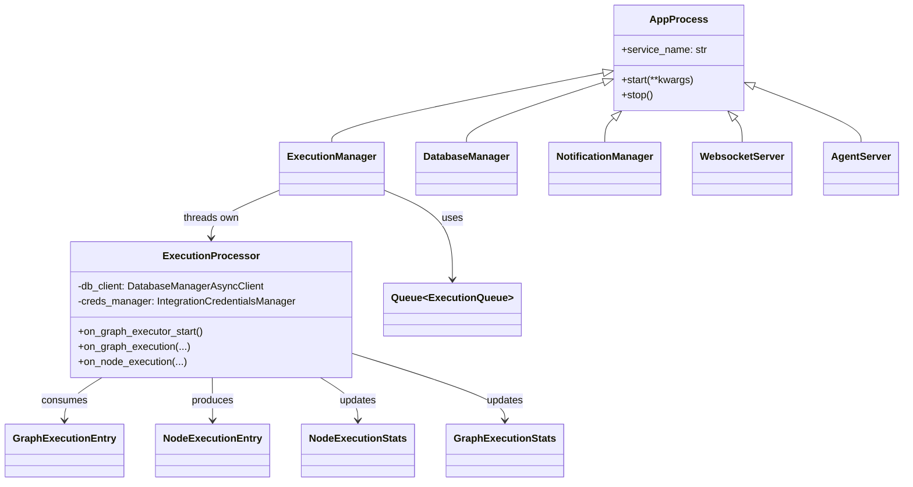

## 概述

AutoGPT后端执行引擎是整个平台的核心组件，负责Agent工作流的调度、执行和监控。采用多进程并行架构，通过Redis分布式队列实现高并发任务处理，支持实时状态同步和完善的错误处理机制。深入剖析执行引擎的核心实现和关键技术。

<!--more-->

## 1. 执行引擎架构设计

### 1.1 核心组件架构图



### 1.2 执行引擎主要类层次结构



### 1.4 关键函数与调用链总览

- 启动与进程管理
  - 核心函数：`run_processes` → 注册信号 → 顺序 `start()` → 等待停止 → 顺序 `stop()`
  - 典型调用链：`main()` → `run_processes(DatabaseManager, Scheduler, NotificationManager, WebsocketServer, AgentServer, ExecutionManager)`

- 执行调度（ExecutionManager）
  - 核心函数：`start()` → `run_execution_loop()` → `run_graph_execution()` → `_on_execution_complete()`
  - 取消：`cancel_execution()` 设置 `cancel_event`，工作线程内在 `on_graph_execution()` 检查并停止

- 图执行（ExecutionProcessor）
  - 核心函数：`on_graph_executor_start()` 初始化依赖；`on_graph_execution()` 事件驱动调度；`on_node_execution()` 单节点执行

- 单节点执行（execute_node）
  - 核心函数：输入验证 → 凭据获取 → `block.execute()` 流式输出 → 保存输出 → 入队后继节点 → 统计/成本

调用链汇总（关键路径）

- 发起执行：REST API → 入队执行请求 → `ExecutionManager.run_execution_loop()` 出队 → `run_graph_execution()` → 线程池 → `execute_graph()` → `ExecutionProcessor.on_graph_execution()` → 多次 `on_node_execution()` → DB/WS 更新
- 取消执行：REST API → `ExecutionManager.cancel_execution(exec_id)` → 设置事件 → `on_graph_execution()` 循环检测 `cancel_event.is_set()` → 提前结束 → 状态更新

### 1.5 端到端执行时序图（API → EM → Thread → EP → NE → DB/WS）



## 2. 应用入口模块 (app.py)

### 2.1 主要职责与功能

**app.py**是AutoGPT后端的统一启动入口，负责：

- **进程生命周期管理**：统一启动和关闭所有后端服务
- **服务依赖协调**：确保服务按正确顺序启动
- **优雅停机处理**：处理系统关闭信号和资源清理

### 2.2 核心源码分析

```python
# /autogpt_platform/backend/backend/app.py

def run_processes(*processes: "AppProcess", **kwargs):
    """
    运行多个后台进程的核心函数
    
    功能说明：
    1. 使用信号处理机制捕获系统停止信号
    2. 并发启动所有服务进程
    3. 实现优雅停机，确保资源正确释放
    
    参数:
        processes: AppProcess类型的服务进程列表
        kwargs: 传递给各进程的额外参数
    """
    stop_event = threading.Event()
    
    def signal_handler(signum, frame):
        """信号处理器：接收到SIGINT/SIGTERM时设置停止标志"""
        logger.info(f"Received signal {signum}, stopping processes...")
        stop_event.set()
    
    # 注册信号处理器
    signal.signal(signal.SIGINT, signal_handler)
    signal.signal(signal.SIGTERM, signal_handler)
    
    # 启动所有进程
    for process in processes:
        try:
            logger.info(f"Starting {process.service_name}")
            process.start(**kwargs)
        except Exception as e:
            logger.exception(f"[{process.service_name}] unable to start: {e}")
    
    # 等待停止信号
    try:
        stop_event.wait()
    except KeyboardInterrupt:
        logger.info("KeyboardInterrupt received, stopping processes...")
    
    # 优雅停机
    for process in processes:
        try:
            logger.info(f"Stopping {process.service_name}")
            process.stop()
        except Exception as e:
            logger.exception(f"[{process.service_name}] unable to stop: {e}")

def main(**kwargs):
    """
    AutoGPT服务器主入口函数
    
    启动组件：
    1. DatabaseManager: 数据库连接管理
    2. Scheduler: 定时任务调度器  
    3. NotificationManager: 通知服务
    4. WebsocketServer: WebSocket服务器
    5. AgentServer: REST API服务器
    6. ExecutionManager: 执行引擎管理器
    """
    
    from backend.executor import DatabaseManager, ExecutionManager, Scheduler
    from backend.notifications import NotificationManager
    from backend.server.rest_api import AgentServer
    from backend.server.ws_api import WebsocketServer
    
    run_processes(
        DatabaseManager().set_log_level("warning"),  # 数据库管理器
        Scheduler(),                                 # 调度器
        NotificationManager(),                       # 通知管理器  
        WebsocketServer(),                          # WebSocket服务
        AgentServer(),                              # REST API服务
        ExecutionManager(),                         # 执行管理器
        **kwargs,
    )

if __name__ == "__main__":
    main()
```

### 2.3 服务启动时序图



## 3. 执行管理器 (ExecutionManager)

### 3.1 架构设计与核心功能

**ExecutionManager**是执行引擎的总控制器，主要职责：

- **任务队列管理**：监听Redis执行队列，分配执行任务
- **进程池调度**：使用ThreadPoolExecutor实现并行执行
- **执行状态跟踪**：维护活跃执行列表和取消事件
- **监控指标收集**：提供Prometheus监控指标

### 3.2 核心源码解析

```python
# /autogpt_platform/backend/backend/executor/manager.py

class ExecutionManager(AppProcess):
    """
    执行管理器：负责Agent图执行的调度和管理
    
    核心特性：
    1. 多进程并行执行提升性能
    2. Redis队列实现分布式任务调度
    3. 实时执行状态监控和取消机制
    4. Prometheus指标集成
    """
    
    def __init__(self):
        super().__init__()
        self.pool: Optional[ThreadPoolExecutor] = None
        self.active_runs: dict[str, Future] = {}
        self.cancel_events: dict[str, threading.Event] = {}
        
        # Prometheus监控指标
        self.active_runs_gauge = Gauge(
            "execution_manager_active_runs", 
            "Number of active graph runs"
        )
        self.pool_size_gauge = Gauge(
            "execution_manager_pool_size", 
            "Maximum number of graph workers"
        )
        self.utilization_gauge = Gauge(
            "execution_manager_utilization_ratio",
            "Ratio of active graph runs to max graph workers"
        )
    
    def start(self, **kwargs):
        """
        启动执行管理器
        
        初始化组件：
        1. 创建线程池执行器
        2. 启动Prometheus指标服务器
        3. 启动执行循环监听队列
        """
        # 获取配置参数
        pool_size = settings.config.num_graph_workers
        prometheus_port = settings.config.prometheus_port
        
        logger.info(f"Starting ExecutionManager with {pool_size} workers")
        
        # 初始化线程池，每个线程都有独立的ExecutionProcessor
        self.pool = ThreadPoolExecutor(
            max_workers=pool_size,
            initializer=init_worker,  # 线程初始化函数
            thread_name_prefix="GraphExecution"
        )
        
        # 启动Prometheus指标服务器
        start_http_server(prometheus_port)
        
        # 更新监控指标
        self.pool_size_gauge.set(pool_size)
        
        # 启动执行循环
        continuous_retry(
            self.run_execution_loop,
            logger=logger,
        )
    
    def run_execution_loop(self):
        """
        执行循环：持续监听Redis队列中的执行请求
        
        处理流程：
        1. 从队列获取图执行请求
        2. 检查是否有可用的工作线程
        3. 提交任务到线程池执行
        4. 维护活跃执行状态
        """
        # 连接执行队列和取消队列
        execution_queue = ExecutionQueue(
            redis_client=redis,
            name=GRAPH_EXECUTION_QUEUE_NAME,
            config=create_execution_queue_config()
        )
        
        cancel_queue = ExecutionQueue(
            redis_client=redis,
            name=GRAPH_EXECUTION_CANCEL_QUEUE_NAME,
            config=create_execution_queue_config()
        )
        
        while not self.is_stopped:
            try:
                # 处理取消请求
                self._process_cancellation_queue(cancel_queue)
                
                # 检查是否有可用工作线程
                if len(self.active_runs) >= settings.config.num_graph_workers:
                    time.sleep(0.1)
                    continue
                
                # 获取执行请求
                graph_exec_entry = execution_queue.get(timeout=1)
                if not graph_exec_entry:
                    continue
                
                # 提交到线程池执行
                self.run_graph_execution(graph_exec_entry)
                
            except Exception as e:
                logger.error(f"Error in execution loop: {e}")
                time.sleep(1)
    
    def run_graph_execution(self, graph_exec_entry: GraphExecutionEntry):
        """
        提交图执行任务到线程池
        
        参数:
            graph_exec_entry: 图执行条目，包含执行所需的所有信息
        """
        graph_exec_id = graph_exec_entry.id
        
        # 创建取消事件
        cancel_event = threading.Event()
        self.cancel_events[graph_exec_id] = cancel_event
        
        # 提交任务到线程池
        future = self.pool.submit(
            execute_graph,
            graph_exec_entry,
            cancel_event
        )
        
        # 注册完成回调
        future.add_done_callback(
            lambda f: self._on_execution_complete(graph_exec_id, f)
        )
        
        # 记录活跃执行
        self.active_runs[graph_exec_id] = future
        
        # 更新监控指标
        self._update_metrics()
        
        logger.info(f"Started execution for graph {graph_exec_id}")
    
    def _on_execution_complete(self, graph_exec_id: str, future: Future):
        """
        执行完成回调函数
        
        清理资源：
        1. 移除活跃执行记录
        2. 清理取消事件
        3. 更新监控指标
        4. 处理执行异常
        """
        try:
            # 获取执行结果
            result = future.result()
            logger.info(f"Execution {graph_exec_id} completed successfully")
            
        except Exception as e:
            logger.error(f"Execution {graph_exec_id} failed: {e}")
            
        finally:
            # 清理资源
            self.active_runs.pop(graph_exec_id, None)
            self.cancel_events.pop(graph_exec_id, None)
            self._update_metrics()
    
    def _update_metrics(self):
        """更新Prometheus监控指标"""
        active_count = len(self.active_runs)
        max_workers = settings.config.num_graph_workers
        
        self.active_runs_gauge.set(active_count)
        self.utilization_gauge.set(active_count / max_workers if max_workers > 0 else 0)
    
    def cancel_execution(self, graph_exec_id: str):
        """
        取消指定的图执行
        
        参数:
            graph_exec_id: 要取消的图执行ID
        """
        if cancel_event := self.cancel_events.get(graph_exec_id):
            cancel_event.set()
            logger.info(f"Cancellation requested for execution {graph_exec_id}")
        else:
            logger.warning(f"No active execution found for {graph_exec_id}")

# 线程初始化函数
def init_worker():
    """
    线程池工作线程初始化函数
    
    功能：
    1. 为每个工作线程创建ExecutionProcessor实例
    2. 初始化线程本地存储
    3. 执行处理器启动初始化
    """
    _tls.processor = ExecutionProcessor()
    _tls.processor.on_graph_executor_start()

def execute_graph(graph_exec_entry: GraphExecutionEntry, cancel_event: threading.Event):
    """
    图执行入口函数（在工作线程中运行）
    
    参数:
        graph_exec_entry: 图执行条目
        cancel_event: 取消事件标志
    
    返回:
        执行结果
    """
    return _tls.processor.on_graph_execution(graph_exec_entry, cancel_event)
```

### 3.4 执行取消与清理时序图



### 3.3 执行管理器工作流程图



## 4. 执行处理器 (ExecutionProcessor)

### 4.1 核心职责与设计模式

**ExecutionProcessor**是每个工作线程中的核心处理器，采用事件驱动模式：

- **图执行协调**：管理图中所有节点的执行顺序
- **异步节点调度**：

```python
class ExecutionProcessor:
    """
    执行处理器：管理单个图执行的完整生命周期
    
    设计模式：事件驱动处理器
    - on_graph_executor_start: 处理器启动初始化
    - on_graph_execution: 图执行主流程
    - on_node_execution: 单节点执行逻辑
    """
    
    def __init__(self):
        self.db_client = None
        self.creds_manager = None
        self.event_bus = None
    
    @async_error_logged(swallow=True)
    async def on_graph_executor_start(self):
        """
        执行处理器启动初始化
        
        初始化组件：
        1. 数据库异步客户端
        2. 凭据管理器
        3. 事件总线连接
        """
        self.db_client = get_database_manager_async_client()
        self.creds_manager = IntegrationCredentialsManager()
        self.event_bus = get_async_execution_event_bus()
        
        logger.info("ExecutionProcessor initialized")
    
    @time_measured(lambda: logger.info("Graph execution took %s"))
    async def on_graph_execution(
        self, 
        graph_exec_entry: GraphExecutionEntry, 
        cancel_event: threading.Event
    ):
        """
        图执行主流程
        
        执行步骤：
        1. 获取图定义和节点信息
        2. 初始化节点执行队列
        3. 添加入口节点到队列
        4. 循环处理节点队列直到完成
        5. 更新最终执行状态
        
        参数:
            graph_exec_entry: 图执行条目
            cancel_event: 取消执行事件
        """
        graph_exec_id = graph_exec_entry.id
        graph_id = graph_exec_entry.graph_id
        user_id = graph_exec_entry.user_id
        
        logger.info(f"Starting graph execution {graph_exec_id}")
        
        try:
            # 获取图定义
            graph = await self.db_client.get_graph(
                graph_id, 
                graph_exec_entry.graph_version
            )
            
            if not graph:
                raise ValueError(f"Graph {graph_id} not found")
            
            # 创建执行统计对象
            graph_stats = GraphExecutionStats()
            stats_lock = threading.Lock()
            
            # 初始化节点执行队列
            node_queue = asyncio.Queue()
            
            # 查找入口节点（没有输入连接的节点）
            entry_nodes = self._find_entry_nodes(graph)
            
            # 将入口节点加入执行队列
            for node in entry_nodes:
                node_exec = NodeExecutionEntry(
                    id=str(uuid.uuid4()),
                    graph_exec_id=graph_exec_id,
                    graph_id=graph_id,
                    node_id=node.id,
                    user_id=user_id,
                    inputs=self._prepare_node_inputs(node, graph_exec_entry.inputs)
                )
                await node_queue.put(node_exec)
            
            # 执行节点处理循环
            active_tasks = set()
            
            while not node_queue.empty() or active_tasks:
                # 检查取消事件
                if cancel_event.is_set():
                    logger.info(f"Execution {graph_exec_id} was cancelled")
                    break
                
                # 处理队列中的节点
                while not node_queue.empty() and len(active_tasks) < MAX_CONCURRENT_NODES:
                    node_exec = await node_queue.get()
                    
                    # 创建节点执行任务
                    task = asyncio.create_task(
                        self.on_node_execution(
                            node_exec,
                            NodeExecutionProgress(node_queue),
                            graph_exec_entry.nodes_input_masks,
                            (graph_stats, stats_lock)
                        )
                    )
                    
                    active_tasks.add(task)
                
                # 等待任务完成
                if active_tasks:
                    done, active_tasks = await asyncio.wait(
                        active_tasks,
                        timeout=0.1,
                        return_when=asyncio.FIRST_COMPLETED
                    )
                    
                    # 处理完成的任务
                    for task in done:
                        try:
                            await task
                        except Exception as e:
                            logger.error(f"Node execution failed: {e}")
            
            # 更新图执行状态
            await self.db_client.update_graph_execution(
                graph_exec_id,
                status=ExecutionStatus.COMPLETED,
                ended_at=datetime.utcnow(),
                stats=graph_stats
            )
            
            logger.info(f"Graph execution {graph_exec_id} completed successfully")
            
        except Exception as e:
            logger.error(f"Graph execution {graph_exec_id} failed: {e}")
            
            # 更新失败状态
            await self.db_client.update_graph_execution(
                graph_exec_id,
                status=ExecutionStatus.FAILED,
                ended_at=datetime.utcnow(),
                error=str(e)
            )
            
            raise
    
    @async_time_measured(lambda duration: logger.debug(f"Node execution took {duration}s"))
    async def on_node_execution(
        self,
        node_exec: NodeExecutionEntry,
        node_exec_progress: NodeExecutionProgress,
        nodes_input_masks: Optional[NodesInputMasks],
        graph_stats_pair: tuple[GraphExecutionStats, threading.Lock],
    ) -> NodeExecutionStats:
        """
        单节点执行逻辑
        
        执行流程：
        1. 获取节点定义和Block实例
        2. 验证输入数据
        3. 获取执行凭据
        4. 执行Block.run()方法
        5. 处理执行输出
        6. 调度后续节点
        
        参数:
            node_exec: 节点执行条目
            node_exec_progress: 节点执行进度管理
            nodes_input_masks: 节点输入掩码
            graph_stats_pair: 图统计信息和锁
        
        返回:
            节点执行统计信息
        """
        node_exec_id = node_exec.id
        node_id = node_exec.node_id
        graph_id = node_exec.graph_id
        user_id = node_exec.user_id
        
        logger.info(f"Executing node {node_id} in execution {node_exec_id}")
        
        # 创建执行统计对象
        node_stats = NodeExecutionStats(
            node_id=node_id,
            start_time=datetime.utcnow()
        )
        
        try:
            # 获取节点定义
            node = await self.db_client.get_node(graph_id, node_id)
            if not node:
                raise ValueError(f"Node {node_id} not found")
            
            # 执行节点
            async for output_name, output_data in execute_node(
                node=node,
                creds_manager=self.creds_manager,
                data=node_exec,
                execution_stats=node_stats,
                nodes_input_masks=nodes_input_masks,
            ):
                # 处理执行输出
                if output_name == "error":
                    raise RuntimeError(output_data)
                
                # 保存输出数据
                await self.db_client.create_node_execution_output(
                    node_exec_id=node_exec_id,
                    output_name=output_name,
                    output_data=output_data
                )
                
                # 发送实时状态更新
                await self.event_bus.publish(
                    ExecutionUpdateEvent(
                        graph_exec_id=node_exec.graph_exec_id,
                        node_exec_id=node_exec_id,
                        status="running",
                        output_name=output_name,
                        output_data=output_data
                    )
                )
                
                # 调度后续节点
                await self._enqueue_next_nodes(
                    node=node,
                    output_name=output_name,
                    output_data=output_data,
                    node_exec_progress=node_exec_progress
                )
            
            # 更新节点执行状态为完成
            node_stats.end_time = datetime.utcnow()
            node_stats.status = "completed"
            
            await self.db_client.update_node_execution(
                node_exec_id,
                status=ExecutionStatus.COMPLETED,
                ended_at=node_stats.end_time,
                stats=node_stats
            )
            
            logger.info(f"Node {node_id} execution completed successfully")
            
        except Exception as e:
            logger.error(f"Node {node_id} execution failed: {e}")
            
            # 更新节点执行状态为失败
            node_stats.end_time = datetime.utcnow()
            node_stats.status = "failed"
            node_stats.error = str(e)
            
            await self.db_client.update_node_execution(
                node_exec_id,
                status=ExecutionStatus.FAILED,
                ended_at=node_stats.end_time,
                error=str(e),
                stats=node_stats
            )
            
            raise
        
        finally:
            # 更新图统计信息
            graph_stats, stats_lock = graph_stats_pair
            with stats_lock:
                graph_stats.merge_node_stats(node_stats)
        
        return node_stats
```

### 4.3 节点执行时序图



## 5. 节点执行器 (execute_node)

### 5.1 节点执行核心函数

**execute_node**函数是单个节点执行的核心实现，负责：

- **输入数据验证**：确保节点输入符合Block定义的schema  
- **凭据管理**：获取和释放第三方服务凭据
- **Block执行调度**：调用具体Block的run方法
- **输出数据处理**：验证和保存执行输出
- **后续节点调度**：根据输出触发依赖节点执行

### 5.2 详细源码解析

```python
async def execute_node(
    node: Node,
    creds_manager: IntegrationCredentialsManager,
    data: NodeExecutionEntry,
    execution_stats: NodeExecutionStats | None = None,
    nodes_input_masks: Optional[NodesInputMasks] = None,
) -> BlockOutput:
    """
    执行图中的单个节点
    
    这是节点执行的核心函数，负责触发Block执行、持久化结果、
    并返回需要执行的后续节点
    
    参数:
        node: 要执行的节点对象
        creds_manager: 凭据管理器，用于获取和释放凭据
        data: 节点执行数据
        execution_stats: 执行统计信息对象
        nodes_input_masks: 节点输入掩码配置
        
    返回:
        BlockOutput: Block执行的输出生成器
    """
    # 提取执行上下文信息
    user_id = data.user_id
    graph_exec_id = data.graph_exec_id
    graph_id = data.graph_id
    node_exec_id = data.node_exec_id
    node_id = data.node_id
    node_block = node.block
    
    # 创建日志元数据对象，用于结构化日志
    log_metadata = LogMetadata(
        logger=_logger,
        user_id=user_id,
        graph_eid=graph_exec_id,
        graph_id=graph_id,
        node_eid=node_exec_id,
        node_id=node_id,
        block_name=node_block.name,
    )
    
    # 第一步：输入数据验证
    # 验证节点输入是否符合Block定义的schema
    input_data, error = validate_exec(node, data.inputs, resolve_input=False)
    if input_data is None:
        log_metadata.error(f"跳过执行，输入验证错误: {error}")
        yield "error", error
        return
    
    # 特殊处理：Agent执行Block的输入数据重塑
    # AgentExecutorBlock需要将节点输入数据和默认值分开处理
    if isinstance(node_block, AgentExecutorBlock):
        _input_data = AgentExecutorBlock.Input(**node.input_default)
        _input_data.inputs = input_data
        if nodes_input_masks:
            _input_data.nodes_input_masks = nodes_input_masks
        input_data = _input_data.model_dump()
    
    data.inputs = input_data
    
    # 记录输入数据日志
    input_data_str = json.dumps(input_data)
    input_size = len(input_data_str)
    log_metadata.debug("执行节点输入数据", input=input_data_str)
    
    # 准备额外的执行参数，传递给Block的run方法
    extra_exec_kwargs: dict = {
        "graph_id": graph_id,
        "node_id": node_id,
        "graph_exec_id": graph_exec_id,
        "node_exec_id": node_exec_id,
        "user_id": user_id,
        "user_context": data.user_context,  # 用户上下文信息
    }
    
    # 第二步：获取执行凭据
    # 使用系统级读写锁防止凭据并发获取冲突
    async with creds_manager.acquire_credentials(
        user_id=user_id,
        graph_id=graph_id,
        node_id=node_id,
        provider_names=node_block.credentials_provider_names,
        inputs=data.credential_inputs,
    ) as credentials:
        
        log_metadata.debug("凭据获取完成", providers=list(credentials.keys()))
        
        # 第三步：执行Block
        # 记录执行开始时间用于统计
        start_time = time.time()
        
        try:
            # 调用Block的execute方法执行具体逻辑
            async for output_name, output_data in node_block.execute(
                input_data=input_data,
                credentials=credentials,
                **extra_exec_kwargs
            ):
                
                # 记录输出数据
                output_size = len(json.dumps(output_data)) if output_data else 0
                log_metadata.debug(
                    f"Block输出: {output_name}",
                    output_size=output_size,
                    output_data=str(output_data)[:200]  # 截断长输出
                )
                
                # 处理错误输出
                if output_name == "error":
                    log_metadata.error(f"Block执行错误: {output_data}")
                    
                    # 检查是否为余额不足错误
                    if "Insufficient balance" in str(output_data):
                        # 发送余额不足通知
                        await queue_notification(
                            ZeroBalanceData(
                                user_id=user_id,
                                graph_exec_id=graph_exec_id,
                                block_name=node_block.name
                            )
                        )
                    
                    yield output_name, output_data
                    return
                
                # 正常输出数据
                yield output_name, output_data
        
        except Exception as e:
            # 执行异常处理
            error_msg = f"Block执行异常: {str(e)}"
            log_metadata.error(error_msg, exception=str(e))
            
            # 特殊异常类型处理
            if isinstance(e, InsufficientBalanceError):
                # 余额不足错误
                await queue_notification(
                    ZeroBalanceData(
                        user_id=user_id,
                        graph_exec_id=graph_exec_id,
                        block_name=node_block.name
                    )
                )
                yield "error", "余额不足，无法继续执行"
                
            elif isinstance(e, ModerationError):
                # 内容审核错误
                yield "error", f"内容审核失败: {str(e)}"
                
            else:
                # 其他未知错误
                yield "error", error_msg
            
            return
        
        finally:
            # 第四步：执行统计信息更新
            execution_time = time.time() - start_time
            
            if execution_stats:
                execution_stats.execution_time = execution_time
                execution_stats.input_size = input_size
                execution_stats.block_name = node_block.name
                
                # 计算执行成本
                try:
                    cost = block_usage_cost(node_block, input_data)
                    execution_stats.cost = cost
                except Exception as cost_error:
                    log_metadata.warning(f"成本计算失败: {cost_error}")
            
            log_metadata.info(
                f"节点执行完成，耗时: {execution_time:.2f}秒",
                execution_time=execution_time,
                input_size=input_size
            )

async def _enqueue_next_nodes(
    db_client: "DatabaseManagerAsyncClient",
    node: Node,
    output: BlockOutputEntry,
    user_id: str,
    graph_exec_id: str,
    graph_id: str,
    log_metadata: LogMetadata,
    nodes_input_masks: Optional[NodesInputMasks],
    user_context: UserContext,
) -> list[NodeExecutionEntry]:
    """
    将后续节点加入执行队列
    
    处理逻辑：
    1. 查找当前节点的所有输出链接
    2. 为每个目标节点准备输入数据
    3. 检查目标节点的所有输入是否就绪
    4. 创建并返回可执行的节点执行条目
    
    参数:
        db_client: 数据库异步客户端
        node: 当前执行完成的节点
        output: 节点输出数据
        user_id: 用户ID
        graph_exec_id: 图执行ID
        graph_id: 图ID
        log_metadata: 日志元数据
        nodes_input_masks: 节点输入掩码
        user_context: 用户上下文
        
    返回:
        准备就绪的节点执行条目列表
    """
    output_name, output_data = output
    next_node_executions = []
    
    # 查找当前节点的所有输出链接
    outgoing_links = await db_client.get_node_outgoing_links(
        graph_id, node.id, output_name
    )
    
    if not outgoing_links:
        log_metadata.debug(f"节点 {node.id} 的输出 {output_name} 没有后续连接")
        return []
    
    log_metadata.info(
        f"处理 {len(outgoing_links)} 个输出链接",
        output_name=output_name,
        target_nodes=[link.target_node_id for link in outgoing_links]
    )
    
    # 为每个目标节点准备执行
    for link in outgoing_links:
        target_node_id = link.target_node_id
        target_input_name = link.target_input_name
        
        try:
            # 获取目标节点定义
            target_node = await db_client.get_node(graph_id, target_node_id)
            if not target_node:
                log_metadata.error(f"目标节点 {target_node_id} 未找到")
                continue
            
            # 准备目标节点的输入数据
            target_inputs = {}
            
            # 设置当前输出作为目标节点的输入
            target_inputs[target_input_name] = output_data
            
            # 检查目标节点的其他输入是否已就绪
            required_inputs = target_node.block.input_schema.model_fields.keys()
            missing_inputs = []
            
            for input_name in required_inputs:
                if input_name not in target_inputs:
                    # 查找该输入的数据源
                    input_data = await db_client.get_node_input_data(
                        graph_exec_id, target_node_id, input_name
                    )
                    
                    if input_data is not None:
                        target_inputs[input_name] = input_data
                    elif not target_node.block.input_schema.model_fields[input_name].is_optional():
                        missing_inputs.append(input_name)
            
            # 如果还有必需输入未就绪，跳过此节点
            if missing_inputs:
                log_metadata.debug(
                    f"目标节点 {target_node_id} 还需要输入: {missing_inputs}"
                )
                continue
            
            # 创建节点执行条目
            node_exec_entry = NodeExecutionEntry(
                id=str(uuid.uuid4()),
                graph_exec_id=graph_exec_id,
                graph_id=graph_id,
                node_id=target_node_id,
                user_id=user_id,
                inputs=target_inputs,
                user_context=user_context,
            )
            
            next_node_executions.append(node_exec_entry)
            
            log_metadata.info(f"准备执行目标节点 {target_node_id}")
            
        except Exception as e:
            log_metadata.error(
                f"处理目标节点 {target_node_id} 时发生错误: {e}",
                exception=str(e)
            )
            continue
    
    return next_node_executions
```

### 5.3 输入验证与错误处理

```python
def validate_exec(node: Node, inputs: BlockInput, resolve_input: bool = True) -> tuple[BlockInput | None, str | None]:
    """
    验证节点执行输入数据
    
    验证步骤：
    1. 检查输入数据类型和格式
    2. 验证必需字段是否存在
    3. 应用输入掩码配置
    4. 解析动态输入引用
    
    参数:
        node: 要验证的节点
        inputs: 输入数据
        resolve_input: 是否解析动态输入引用
        
    返回:
        (validated_inputs, error_message)
        如果验证成功，返回(validated_data, None)
        如果验证失败，返回(None, error_message)
    """
    try:
        block = node.block
        schema = block.input_schema
        
        # 合并节点默认值和实际输入
        merged_inputs = {**node.input_default, **inputs}
        
        # 使用Pydantic进行schema验证
        validated_data = schema.model_validate(merged_inputs)
        
        # 转换为字典格式
        validated_inputs = validated_data.model_dump()
        
        return validated_inputs, None
        
    except ValidationError as e:
        error_msg = f"输入验证失败: {str(e)}"
        return None, error_msg
    
    except Exception as e:
        error_msg = f"输入验证异常: {str(e)}"
        return None, error_msg

def block_usage_cost(block: Block, input_data: BlockInput) -> int:
    """
    计算Block执行成本
    
    成本计算规则：
    1. RUN类型：每次执行固定成本
    2. BYTE类型：按输入数据大小计费
    3. SECOND类型：按执行时间计费
    
    参数:
        block: Block实例
        input_data: 输入数据
        
    返回:
        执行成本（以分为单位）
    """
    if not block.costs:
        return 0
    
    total_cost = 0
    
    for cost_config in block.costs:
        # 检查成本过滤条件
        if cost_config.cost_filter:
            # 检查输入是否满足过滤条件
            if not _matches_cost_filter(input_data, cost_config.cost_filter):
                continue
        
        # 根据成本类型计算
        if cost_config.cost_type == BlockCostType.RUN:
            # 固定执行成本
            total_cost += cost_config.cost_amount
            
        elif cost_config.cost_type == BlockCostType.BYTE:
            # 按字节计费
            input_size = len(json.dumps(input_data))
            total_cost += cost_config.cost_amount * input_size
            
        elif cost_config.cost_type == BlockCostType.SECOND:
            # 按执行时间计费（此处预估，实际会在执行完成后更新）
            estimated_seconds = 1  # 预估执行时间
            total_cost += cost_config.cost_amount * estimated_seconds
    
    return total_cost

def _matches_cost_filter(input_data: BlockInput, cost_filter: BlockInput) -> bool:
    """
    检查输入数据是否匹配成本过滤条件
    
    参数:
        input_data: 实际输入数据
        cost_filter: 成本过滤条件
        
    返回:
        是否匹配过滤条件
    """
    for key, expected_value in cost_filter.items():
        actual_value = input_data.get(key)
        
        if actual_value != expected_value:
            return False
    
    return True
```

## 6. 监控与可观测性

### 6.1 Prometheus指标体系

ExecutionManager集成了完整的Prometheus指标监控：

```python
# 核心监控指标定义
active_runs_gauge = Gauge(
    "execution_manager_active_runs",
    "当前活跃执行数量"
)

pool_size_gauge = Gauge(
    "execution_manager_pool_size", 
    "最大工作线程数"
)

utilization_gauge = Gauge(
    "execution_manager_utilization_ratio",
    "执行引擎利用率（活跃执行数/最大线程数）"
)

execution_duration_histogram = Histogram(
    "execution_duration_seconds",
    "执行时长分布",
    buckets=[0.1, 0.5, 1.0, 2.0, 5.0, 10.0, 30.0, 60.0, 300.0]
)

node_execution_counter = Counter(
    "node_executions_total",
    "节点执行总数",
    labelnames=["block_type", "status", "user_id"]
)

block_error_rate = Gauge(
    "block_error_rate",
    "Block错误率",
    labelnames=["block_id", "block_name"]
)
```

### 6.2 结构化日志系统

```python
class LogMetadata:
    """
    结构化日志元数据类
    
    提供统一的日志格式和上下文信息
    """
    
    def __init__(
        self,
        logger: logging.Logger,
        user_id: str,
        graph_eid: str,
        graph_id: str,
        node_eid: str,
        node_id: str,
        block_name: str,
    ):
        self.logger = logger
        self.context = {
            "user_id": user_id,
            "graph_execution_id": graph_eid,
            "graph_id": graph_id,
            "node_execution_id": node_eid,
            "node_id": node_id,
            "block_name": block_name,
        }
    
    def info(self, message: str, **kwargs):
        """记录INFO级别日志"""
        self.logger.info(message, extra={**self.context, **kwargs})
    
    def error(self, message: str, **kwargs):
        """记录ERROR级别日志"""
        self.logger.error(message, extra={**self.context, **kwargs})
    
    def debug(self, message: str, **kwargs):
        """记录DEBUG级别日志"""
        self.logger.debug(message, extra={**self.context, **kwargs})
    
    def warning(self, message: str, **kwargs):
        """记录WARNING级别日志"""
        self.logger.warning(message, extra={**self.context, **kwargs})
```

## 7. 性能优化与扩展策略

### 7.1 并发执行优化

- **多进程池架构**：利用ThreadPoolExecutor实现真正的并行执行
- **异步I/O处理**：所有数据库和网络操作使用asyncio异步处理
- **任务队列分发**：Redis队列支持分布式负载均衡
- **资源池管理**：连接池和凭据池减少资源创建开销

### 7.2 内存与资源管理

- **流式输出处理**：Block输出使用生成器模式，避免大数据集内存占用
- **执行上下文隔离**：每个线程独立的ExecutionProcessor避免状态污染
- **及时资源释放**：完善的finally块确保凭据和连接及时释放
- **输出数据截断**：长输出自动截断防止日志存储压力

### 7.3 错误处理与恢复

- **分级错误处理**：区分系统错误、业务错误、用户错误
- **优雅降级机制**：关键服务异常时的备用处理逻辑  
- **执行状态持久化**：所有中间状态持久化支持故障恢复
- **死锁检测与恢复**：Redis分布式锁超时机制防止死锁

## 8. 分布式架构与微服务治理

### 8.1 服务发现与负载均衡

```python
# /autogpt_platform/backend/backend/util/service_discovery.py

import asyncio
import random
from typing import Dict, List, Optional
from dataclasses import dataclass
from enum import Enum

class ServiceStatus(Enum):
    """服务状态枚举"""
    HEALTHY = "healthy"
    UNHEALTHY = "unhealthy"
    UNKNOWN = "unknown"

@dataclass
class ServiceEndpoint:
    """服务端点信息"""
    host: str
    port: int
    protocol: str = "http"
    weight: int = 1
    status: ServiceStatus = ServiceStatus.UNKNOWN
    last_check: float = 0
    response_time: float = 0

class ServiceRegistry:
    """
    服务注册与发现
    
    功能特性：
    1. 动态服务注册和注销
    2. 健康检查和故障转移
    3. 负载均衡策略
    4. 服务状态监控
    """
    
    def __init__(self, redis_client):
        self.redis = redis_client
        self.services: Dict[str, List[ServiceEndpoint]] = {}
        self.health_check_interval = 30  # 健康检查间隔30秒
        self.health_check_timeout = 5    # 健康检查超时5秒
    
    async def register_service(
        self, 
        service_name: str, 
        endpoint: ServiceEndpoint
    ) -> bool:
        """
        注册服务端点
        
        参数:
            service_name: 服务名称
            endpoint: 服务端点信息
            
        返回:
            注册是否成功
        """
        try:
            # 将服务信息存储到Redis
            service_key = f"services:{service_name}"
            endpoint_data = {
                "host": endpoint.host,
                "port": endpoint.port,
                "protocol": endpoint.protocol,
                "weight": endpoint.weight,
                "timestamp": time.time(),
            }
            
            await self.redis.hset(
                service_key, 
                f"{endpoint.host}:{endpoint.port}",
                json.dumps(endpoint_data)
            )
            
            # 设置TTL，确保僵尸服务自动清理
            await self.redis.expire(service_key, 90)
            
            # 更新本地缓存
            if service_name not in self.services:
                self.services[service_name] = []
            
            # 检查是否已存在
            existing = next(
                (ep for ep in self.services[service_name] 
                 if ep.host == endpoint.host and ep.port == endpoint.port),
                None
            )
            
            if existing:
                existing.weight = endpoint.weight
                existing.protocol = endpoint.protocol
            else:
                self.services[service_name].append(endpoint)
            
            logger.info(f"服务注册成功: {service_name} -> {endpoint.host}:{endpoint.port}")
            return True
            
        except Exception as e:
            logger.error(f"服务注册失败: {e}")
            return False
    
    async def discover_service(self, service_name: str) -> Optional[ServiceEndpoint]:
        """
        发现可用的服务端点
        
        负载均衡算法：加权随机选择
        
        参数:
            service_name: 服务名称
            
        返回:
            可用的服务端点，如果没有可用服务则返回None
        """
        # 从Redis获取最新的服务列表
        await self._refresh_service_list(service_name)
        
        endpoints = self.services.get(service_name, [])
        if not endpoints:
            logger.warning(f"没有找到可用的服务: {service_name}")
            return None
        
        # 过滤健康的端点
        healthy_endpoints = [
            ep for ep in endpoints 
            if ep.status == ServiceStatus.HEALTHY
        ]
        
        if not healthy_endpoints:
            logger.warning(f"没有健康的服务端点: {service_name}")
            return None
        
        # 加权随机选择
        return self._weighted_random_choice(healthy_endpoints)
    
    def _weighted_random_choice(self, endpoints: List[ServiceEndpoint]) -> ServiceEndpoint:
        """加权随机选择算法"""
        total_weight = sum(ep.weight for ep in endpoints)
        random_weight = random.uniform(0, total_weight)
        
        cumulative_weight = 0
        for endpoint in endpoints:
            cumulative_weight += endpoint.weight
            if random_weight <= cumulative_weight:
                return endpoint
        
        # 降级到简单随机选择
        return random.choice(endpoints)
    
    async def start_health_check(self):
        """启动健康检查协程"""
        while True:
            try:
                await self._perform_health_checks()
                await asyncio.sleep(self.health_check_interval)
            except Exception as e:
                logger.error(f"健康检查异常: {e}")
                await asyncio.sleep(5)
    
    async def _perform_health_checks(self):
        """执行健康检查"""
        tasks = []
        
        for service_name, endpoints in self.services.items():
            for endpoint in endpoints:
                task = asyncio.create_task(
                    self._check_endpoint_health(endpoint)
                )
                tasks.append(task)
        
        if tasks:
            await asyncio.gather(*tasks, return_exceptions=True)
    
    async def _check_endpoint_health(self, endpoint: ServiceEndpoint):
        """检查单个端点健康状态"""
        start_time = time.time()
        
        try:
            # 构建健康检查URL
            health_url = f"{endpoint.protocol}://{endpoint.host}:{endpoint.port}/health"
            
            # 发起健康检查请求
            async with aiohttp.ClientSession(
                timeout=aiohttp.ClientTimeout(total=self.health_check_timeout)
            ) as session:
                async with session.get(health_url) as response:
                    if response.status == 200:
                        endpoint.status = ServiceStatus.HEALTHY
                    else:
                        endpoint.status = ServiceStatus.UNHEALTHY
                    
                    endpoint.response_time = time.time() - start_time
                    endpoint.last_check = time.time()
        
        except asyncio.TimeoutError:
            endpoint.status = ServiceStatus.UNHEALTHY
            endpoint.response_time = self.health_check_timeout
            endpoint.last_check = time.time()
            
        except Exception as e:
            endpoint.status = ServiceStatus.UNHEALTHY
            endpoint.response_time = time.time() - start_time
            endpoint.last_check = time.time()
            logger.debug(f"健康检查失败 {endpoint.host}:{endpoint.port}: {e}")
```

### 8.2 分布式事务与数据一致性

```python
# /autogpt_platform/backend/backend/util/distributed_transaction.py

import asyncio
import uuid
from typing import Dict, List, Callable, Any
from dataclasses import dataclass
from enum import Enum

class TransactionStatus(Enum):
    """事务状态"""
    PENDING = "pending"
    COMMITTED = "committed"
    ABORTED = "aborted"
    COMPENSATING = "compensating"

@dataclass
class TransactionStep:
    """事务步骤"""
    step_id: str
    action: Callable
    compensation: Callable
    timeout: int = 30
    retry_count: int = 3

class DistributedTransaction:
    """
    分布式事务协调器（Saga模式）
    
    特性：
    1. 补偿事务模式（Saga Pattern）
    2. 故障自动恢复
    3. 事务日志持久化
    4. 并发控制
    """
    
    def __init__(self, redis_client, transaction_id: str = None):
        self.redis = redis_client
        self.transaction_id = transaction_id or str(uuid.uuid4())
        self.steps: List[TransactionStep] = []
        self.status = TransactionStatus.PENDING
        self.executed_steps: List[str] = []
    
    def add_step(
        self, 
        action: Callable, 
        compensation: Callable,
        step_id: str = None,
        timeout: int = 30,
        retry_count: int = 3
    ):
        """
        添加事务步骤
        
        参数:
            action: 正向操作函数
            compensation: 补偿操作函数
            step_id: 步骤ID
            timeout: 超时时间
            retry_count: 重试次数
        """
        step = TransactionStep(
            step_id=step_id or str(uuid.uuid4()),
            action=action,
            compensation=compensation,
            timeout=timeout,
            retry_count=retry_count
        )
        self.steps.append(step)
    
    async def execute(self) -> bool:
        """
        执行分布式事务
        
        返回:
            事务是否成功完成
        """
        try:
            # 记录事务开始
            await self._log_transaction_start()
            
            # 顺序执行所有步骤
            for step in self.steps:
                success = await self._execute_step(step)
                
                if success:
                    self.executed_steps.append(step.step_id)
                    await self._log_step_completion(step.step_id)
                else:
                    # 步骤失败，执行补偿操作
                    await self._compensate()
                    return False
            
            # 所有步骤成功，提交事务
            self.status = TransactionStatus.COMMITTED
            await self._log_transaction_commit()
            
            logger.info(f"分布式事务 {self.transaction_id} 执行成功")
            return True
            
        except Exception as e:
            logger.error(f"分布式事务 {self.transaction_id} 执行异常: {e}")
            await self._compensate()
            return False
    
    async def _execute_step(self, step: TransactionStep) -> bool:
        """
        执行单个事务步骤
        
        支持重试机制和超时控制
        """
        for attempt in range(step.retry_count + 1):
            try:
                # 设置超时
                result = await asyncio.wait_for(
                    step.action(),
                    timeout=step.timeout
                )
                
                logger.debug(f"事务步骤 {step.step_id} 执行成功 (尝试 {attempt + 1})")
                return True
                
            except asyncio.TimeoutError:
                logger.warning(f"事务步骤 {step.step_id} 超时 (尝试 {attempt + 1})")
                if attempt == step.retry_count:
                    break
                await asyncio.sleep(2 ** attempt)  # 指数退避
                
            except Exception as e:
                logger.warning(f"事务步骤 {step.step_id} 失败: {e} (尝试 {attempt + 1})")
                if attempt == step.retry_count:
                    break
                await asyncio.sleep(2 ** attempt)
        
        logger.error(f"事务步骤 {step.step_id} 最终失败")
        return False
    
    async def _compensate(self):
        """
        执行补偿操作
        
        按照与正向操作相反的顺序执行补偿
        """
        self.status = TransactionStatus.COMPENSATING
        await self._log_compensation_start()
        
        # 反向执行补偿操作
        for step_id in reversed(self.executed_steps):
            step = next(s for s in self.steps if s.step_id == step_id)
            
            try:
                await asyncio.wait_for(
                    step.compensation(),
                    timeout=step.timeout
                )
                logger.debug(f"补偿操作 {step_id} 执行成功")
                
            except Exception as e:
                logger.error(f"补偿操作 {step_id} 失败: {e}")
                # 补偿失败需要人工介入
                await self._alert_manual_intervention(step_id, str(e))
        
        self.status = TransactionStatus.ABORTED
        await self._log_transaction_abort()
    
    async def _log_transaction_start(self):
        """记录事务开始"""
        await self.redis.hset(
            f"transaction:{self.transaction_id}",
            mapping={
                "status": self.status.value,
                "started_at": time.time(),
                "steps_count": len(self.steps),
            }
        )
    
    async def _log_step_completion(self, step_id: str):
        """记录步骤完成"""
        await self.redis.lpush(
            f"transaction:{self.transaction_id}:steps",
            step_id
        )
    
    async def _alert_manual_intervention(self, step_id: str, error: str):
        """发送人工介入告警"""
        alert_data = {
            "transaction_id": self.transaction_id,
            "failed_step": step_id,
            "error": error,
            "timestamp": time.time(),
        }
        
        await self.redis.lpush("manual_intervention_alerts", json.dumps(alert_data))
        logger.critical(f"事务 {self.transaction_id} 需要人工介入：{error}")
```

### 8.3 高级性能优化

#### 8.3.1 连接池与资源管理

```python
# /autogpt_platform/backend/backend/util/connection_pool.py

import asyncio
import time
from typing import Dict, Optional, Generic, TypeVar, AsyncContextManager
from dataclasses import dataclass

T = TypeVar('T')

@dataclass
class PoolStats:
    """连接池统计信息"""
    total_connections: int
    active_connections: int
    idle_connections: int
    created_connections: int
    destroyed_connections: int
    pool_hits: int
    pool_misses: int

class AsyncConnectionPool(Generic[T]):
    """
    异步连接池
    
    特性：
    1. 动态扩缩容
    2. 连接健康检查
    3. 空闲连接回收
    4. 统计信息收集
    """
    
    def __init__(
        self,
        create_connection: Callable[[], Awaitable[T]],
        close_connection: Callable[[T], Awaitable[None]],
        validate_connection: Callable[[T], Awaitable[bool]],
        min_size: int = 2,
        max_size: int = 10,
        max_idle_time: int = 300,  # 5分钟空闲超时
    ):
        self.create_connection = create_connection
        self.close_connection = close_connection
        self.validate_connection = validate_connection
        self.min_size = min_size
        self.max_size = max_size
        self.max_idle_time = max_idle_time
        
        self.pool: asyncio.Queue[T] = asyncio.Queue(maxsize=max_size)
        self.active_connections: set[T] = set()
        self.connection_timestamps: Dict[T, float] = {}
        self.stats = PoolStats(0, 0, 0, 0, 0, 0, 0)
        self.lock = asyncio.Lock()
        
        # 启动维护任务
        asyncio.create_task(self._maintenance_loop())
    
    async def acquire(self) -> AsyncContextManager[T]:
        """
        获取连接的异步上下文管理器
        
        使用示例:
            async with pool.acquire() as conn:
                result = await conn.execute_query("SELECT 1")
        """
        return self._connection_context()
    
    @asynccontextmanager
    async def _connection_context(self):
        """连接上下文管理器实现"""
        connection = await self._get_connection()
        try:
            yield connection
        finally:
            await self._return_connection(connection)
    
    async def _get_connection(self) -> T:
        """从池中获取连接"""
        async with self.lock:
            # 尝试从池中获取空闲连接
            try:
                connection = self.pool.get_nowait()
                
                # 验证连接有效性
                if await self.validate_connection(connection):
                    self.active_connections.add(connection)
                    self.stats.pool_hits += 1
                    return connection
                else:
                    # 连接无效，销毁并创建新连接
                    await self.close_connection(connection)
                    self.stats.destroyed_connections += 1
            
            except asyncio.QueueEmpty:
                pass
            
            # 池中没有可用连接，创建新连接
            if len(self.active_connections) < self.max_size:
                connection = await self.create_connection()
                self.active_connections.add(connection)
                self.connection_timestamps[connection] = time.time()
                self.stats.created_connections += 1
                self.stats.pool_misses += 1
                return connection
            
            # 池已满，等待连接释放
            self.stats.pool_misses += 1
            connection = await self.pool.get()
            
            if await self.validate_connection(connection):
                self.active_connections.add(connection)
                return connection
            else:
                await self.close_connection(connection)
                self.stats.destroyed_connections += 1
                # 递归获取新连接
                return await self._get_connection()
    
    async def _return_connection(self, connection: T):
        """将连接返回到池中"""
        async with self.lock:
            if connection in self.active_connections:
                self.active_connections.remove(connection)
                
                # 验证连接仍然有效
                if await self.validate_connection(connection):
                    try:
                        self.pool.put_nowait(connection)
                        self.connection_timestamps[connection] = time.time()
                    except asyncio.QueueFull:
                        # 池已满，关闭连接
                        await self.close_connection(connection)
                        self.connection_timestamps.pop(connection, None)
                        self.stats.destroyed_connections += 1
                else:
                    # 连接无效，关闭
                    await self.close_connection(connection)
                    self.connection_timestamps.pop(connection, None)
                    self.stats.destroyed_connections += 1
    
    async def _maintenance_loop(self):
        """连接池维护循环"""
        while True:
            try:
                await self._cleanup_idle_connections()
                await self._ensure_min_connections()
                await asyncio.sleep(60)  # 每分钟维护一次
                
            except Exception as e:
                logger.error(f"连接池维护异常: {e}")
                await asyncio.sleep(10)
    
    async def _cleanup_idle_connections(self):
        """清理空闲连接"""
        current_time = time.time()
        connections_to_remove = []
        
        # 检查池中的空闲连接
        temp_connections = []
        while not self.pool.empty():
            try:
                connection = self.pool.get_nowait()
                last_used = self.connection_timestamps.get(connection, current_time)
                
                if current_time - last_used > self.max_idle_time:
                    connections_to_remove.append(connection)
                else:
                    temp_connections.append(connection)
            except asyncio.QueueEmpty:
                break
        
        # 将仍然有效的连接放回池中
        for connection in temp_connections:
            try:
                self.pool.put_nowait(connection)
            except asyncio.QueueFull:
                connections_to_remove.append(connection)
        
        # 关闭超时的连接
        for connection in connections_to_remove:
            await self.close_connection(connection)
            self.connection_timestamps.pop(connection, None)
            self.stats.destroyed_connections += 1
        
        if connections_to_remove:
            logger.info(f"清理了 {len(connections_to_remove)} 个空闲连接")
    
    async def _ensure_min_connections(self):
        """确保最小连接数"""
        current_total = len(self.active_connections) + self.pool.qsize()
        
        if current_total < self.min_size:
            needed = self.min_size - current_total
            
            for _ in range(needed):
                try:
                    connection = await self.create_connection()
                    self.pool.put_nowait(connection)
                    self.connection_timestamps[connection] = time.time()
                    self.stats.created_connections += 1
                except Exception as e:
                    logger.error(f"创建最小连接失败: {e}")
                    break
    
    def get_stats(self) -> PoolStats:
        """获取连接池统计信息"""
        self.stats.total_connections = len(self.active_connections) + self.pool.qsize()
        self.stats.active_connections = len(self.active_connections)
        self.stats.idle_connections = self.pool.qsize()
        
        return self.stats
```

### 8.4 容错与熔断机制

```python
# /autogpt_platform/backend/backend/util/circuit_breaker.py

import asyncio
import time
from typing import Callable, Any, Optional
from enum import Enum
from dataclasses import dataclass

class CircuitState(Enum):
    """熔断器状态"""
    CLOSED = "closed"      # 关闭状态，正常工作
    OPEN = "open"          # 打开状态，快速失败
    HALF_OPEN = "half_open" # 半开状态，尝试恢复

@dataclass
class CircuitBreakerConfig:
    """熔断器配置"""
    failure_threshold: int = 5      # 失败阈值
    timeout_seconds: int = 60       # 熔断超时时间
    recovery_timeout: int = 30      # 恢复超时时间
    expected_exception: type = Exception

class CircuitBreaker:
    """
    熔断器实现
    
    防止级联故障，提供快速失败和自动恢复机制。
    
    状态转换：
    - CLOSED -> OPEN: 失败次数达到阈值
    - OPEN -> HALF_OPEN: 超时时间后尝试恢复
    - HALF_OPEN -> CLOSED: 恢复成功
    - HALF_OPEN -> OPEN: 恢复失败
    """
    
    def __init__(self, config: CircuitBreakerConfig):
        self.config = config
        self.state = CircuitState.CLOSED
        self.failure_count = 0
        self.last_failure_time = 0
        self.success_count = 0
        self.lock = asyncio.Lock()
    
    async def call(self, func: Callable, *args, **kwargs) -> Any:
        """
        通过熔断器调用函数
        
        参数:
            func: 要调用的函数
            *args: 位置参数
            **kwargs: 关键字参数
            
        返回:
            函数执行结果
            
        异常:
            CircuitBreakerOpenError: 熔断器开启时抛出
        """
        async with self.lock:
            # 检查熔断器状态
            if self.state == CircuitState.OPEN:
                if self._should_attempt_reset():
                    self.state = CircuitState.HALF_OPEN
                    logger.info("熔断器进入半开状态，尝试恢复")
                else:
                    raise CircuitBreakerOpenError(
                        f"熔断器开启，服务不可用。下次尝试时间: {self._next_attempt_time()}"
                    )
            
            # 执行函数调用
            try:
                start_time = time.time()
                result = await func(*args, **kwargs)
                execution_time = time.time() - start_time
                
                # 调用成功
                await self._on_success(execution_time)
                return result
                
            except self.config.expected_exception as e:
                # 预期异常，记录失败
                await self._on_failure(e)
                raise
            
            except Exception as e:
                # 非预期异常，不影响熔断器状态
                logger.error(f"非预期异常，不影响熔断器: {e}")
                raise
    
    async def _on_success(self, execution_time: float):
        """处理成功调用"""
        if self.state == CircuitState.HALF_OPEN:
            self.success_count += 1
            
            # 连续成功达到阈值，关闭熔断器
            if self.success_count >= 3:
                self.state = CircuitState.CLOSED
                self.failure_count = 0
                self.success_count = 0
                logger.info("熔断器恢复正常，状态转为关闭")
        
        elif self.state == CircuitState.CLOSED:
            # 重置失败计数
            self.failure_count = max(0, self.failure_count - 1)
    
    async def _on_failure(self, exception: Exception):
        """处理失败调用"""
        self.failure_count += 1
        self.last_failure_time = time.time()
        
        if self.state == CircuitState.CLOSED:
            if self.failure_count >= self.config.failure_threshold:
                self.state = CircuitState.OPEN
                logger.error(
                    f"熔断器开启，失败次数: {self.failure_count}，"
                    f"超时时间: {self.config.timeout_seconds}秒"
                )
        
        elif self.state == CircuitState.HALF_OPEN:
            # 半开状态下失败，重新开启熔断器
            self.state = CircuitState.OPEN
            self.success_count = 0
            logger.warning("熔断器恢复失败，重新开启")
    
    def _should_attempt_reset(self) -> bool:
        """检查是否应该尝试重置熔断器"""
        return (
            time.time() - self.last_failure_time > self.config.timeout_seconds
        )
    
    def _next_attempt_time(self) -> float:
        """计算下次尝试时间"""
        return self.last_failure_time + self.config.timeout_seconds

class CircuitBreakerOpenError(Exception):
    """熔断器开启异常"""
    pass

# 熔断器装饰器
def circuit_breaker(
    failure_threshold: int = 5,
    timeout_seconds: int = 60,
    recovery_timeout: int = 30,
):
    """
    熔断器装饰器
    
    使用示例:
        @circuit_breaker(failure_threshold=3, timeout_seconds=30)
        async def call_external_api():
            # 可能失败的外部API调用
            pass
    """
    def decorator(func: Callable) -> Callable:
        config = CircuitBreakerConfig(
            failure_threshold=failure_threshold,
            timeout_seconds=timeout_seconds,
            recovery_timeout=recovery_timeout,
        )
        breaker = CircuitBreaker(config)
        
        @functools.wraps(func)
        async def wrapper(*args, **kwargs):
            return await breaker.call(func, *args, **kwargs)
        
        # 添加熔断器控制方法
        wrapper.circuit_breaker = breaker
        wrapper.get_state = lambda: breaker.state
        wrapper.reset = lambda: setattr(breaker, 'state', CircuitState.CLOSED)
        
        return wrapper
    
    return decorator
```

## 9. 关键结构体与继承关系总览



## 10. 附：汇总与去重说明

- 将“执行管理器工作流程图”与新增“1.5 端到端时序图”区分粒度：前者聚焦队列与线程池循环，后者覆盖 API→DB→EM→EP→NE→WS 全链路。
- 统一“节点执行时序图”与 `execute_node` 代码说明，避免重复描述输出保存与后继入队逻辑。
- 取消流程在“3.4 执行取消与清理时序图”集中呈现，不再在多处重复展开。

### 8.5 分布式缓存策略

```python
# /autogpt_platform/backend/backend/util/distributed_cache.py

import asyncio
import json
import pickle
import time
from typing import Any, Optional, Union, Callable
from dataclasses import dataclass

@dataclass
class CacheEntry:
    """缓存条目"""
    data: Any
    created_at: float
    ttl: int
    access_count: int = 0
    last_access: float = 0

class DistributedCache:
    """
    分布式缓存管理器
    
    特性：
    1. 多级缓存：本地+Redis
    2. 智能预热：预加载热点数据
    3. 缓存雪崩防护：随机化TTL
    4. 性能监控：命中率统计
    """
    
    def __init__(
        self,
        redis_client,
        local_cache_size: int = 1000,
        default_ttl: int = 3600,
        key_prefix: str = "cache:",
    ):
        self.redis = redis_client
        self.local_cache: Dict[str, CacheEntry] = {}
        self.local_cache_size = local_cache_size
        self.default_ttl = default_ttl
        self.key_prefix = key_prefix
        
        # 统计信息
        self.stats = {
            "local_hits": 0,
            "redis_hits": 0,
            "misses": 0,
            "sets": 0,
            "evictions": 0,
        }
        
        # 启动维护任务
        asyncio.create_task(self._maintenance_loop())
    
    async def get(
        self, 
        key: str, 
        default: Any = None,
        deserializer: Optional[Callable] = None
    ) -> Any:
        """
        获取缓存数据
        
        查找顺序：本地缓存 -> Redis缓存 -> 返回默认值
        
        参数:
            key: 缓存键
            default: 默认值
            deserializer: 自定义反序列化函数
            
        返回:
            缓存的数据或默认值
        """
        full_key = f"{self.key_prefix}{key}"
        
        # 1. 检查本地缓存
        if entry := self.local_cache.get(full_key):
            if not self._is_expired(entry):
                entry.access_count += 1
                entry.last_access = time.time()
                self.stats["local_hits"] += 1
                return entry.data
            else:
                # 本地缓存过期，删除
                self.local_cache.pop(full_key, None)
        
        # 2. 检查Redis缓存
        try:
            redis_data = await self.redis.get(full_key)
            if redis_data:
                # 反序列化数据
                if deserializer:
                    data = deserializer(redis_data)
                else:
                    data = pickle.loads(redis_data) if isinstance(redis_data, bytes) else json.loads(redis_data)
                
                # 更新本地缓存
                self._set_local_cache(full_key, data, self.default_ttl)
                self.stats["redis_hits"] += 1
                return data
        
        except Exception as e:
            logger.warning(f"Redis缓存读取失败: {e}")
        
        # 3. 缓存未命中
        self.stats["misses"] += 1
        return default
    
    async def set(
        self,
        key: str,
        value: Any,
        ttl: Optional[int] = None,
        serializer: Optional[Callable] = None
    ) -> bool:
        """
        设置缓存数据
        
        参数:
            key: 缓存键
            value: 要缓存的数据
            ttl: 生存时间（秒）
            serializer: 自定义序列化函数
            
        返回:
            设置是否成功
        """
        full_key = f"{self.key_prefix}{key}"
        effective_ttl = ttl or self.default_ttl
        
        # 添加随机化TTL防止缓存雪崩
        jittered_ttl = effective_ttl + random.randint(-60, 60)
        
        try:
            # 序列化数据
            if serializer:
                serialized_data = serializer(value)
            else:
                serialized_data = pickle.dumps(value)
            
            # 设置Redis缓存
            await self.redis.setex(full_key, jittered_ttl, serialized_data)
            
            # 更新本地缓存
            self._set_local_cache(full_key, value, jittered_ttl)
            
            self.stats["sets"] += 1
            return True
            
        except Exception as e:
            logger.error(f"设置缓存失败 {key}: {e}")
            return False
    
    async def delete(self, key: str) -> bool:
        """
        删除缓存数据
        
        参数:
            key: 要删除的缓存键
            
        返回:
            删除是否成功
        """
        full_key = f"{self.key_prefix}{key}"
        
        # 删除本地缓存
        self.local_cache.pop(full_key, None)
        
        # 删除Redis缓存
        try:
            await self.redis.delete(full_key)
            return True
        except Exception as e:
            logger.error(f"删除缓存失败 {key}: {e}")
            return False
    
    def _set_local_cache(self, key: str, data: Any, ttl: int):
        """设置本地缓存"""
        # LRU淘汰策略
        if len(self.local_cache) >= self.local_cache_size:
            self._evict_lru_entries()
        
        self.local_cache[key] = CacheEntry(
            data=data,
            created_at=time.time(),
            ttl=ttl,
            last_access=time.time(),
        )
    
    def _evict_lru_entries(self):
        """淘汰最少使用的缓存条目"""
        if not self.local_cache:
            return
        
        # 按最后访问时间排序，删除最旧的条目
        sorted_entries = sorted(
            self.local_cache.items(),
            key=lambda x: x[1].last_access
        )
        
        # 删除20%的条目
        evict_count = max(1, len(sorted_entries) // 5)
        for i in range(evict_count):
            key, _ = sorted_entries[i]
            self.local_cache.pop(key, None)
            self.stats["evictions"] += 1
    
    def _is_expired(self, entry: CacheEntry) -> bool:
        """检查缓存条目是否过期"""
        return time.time() - entry.created_at > entry.ttl
    
    async def _maintenance_loop(self):
        """缓存维护循环"""
        while True:
            try:
                # 清理过期的本地缓存
                current_time = time.time()
                expired_keys = [
                    key for key, entry in self.local_cache.items()
                    if self._is_expired(entry)
                ]
                
                for key in expired_keys:
                    self.local_cache.pop(key, None)
                
                if expired_keys:
                    logger.debug(f"清理了 {len(expired_keys)} 个过期的本地缓存条目")
                
                await asyncio.sleep(300)  # 每5分钟维护一次
                
            except Exception as e:
                logger.error(f"缓存维护异常: {e}")
                await asyncio.sleep(60)
    
    def get_hit_rate(self) -> float:
        """计算缓存命中率"""
        total_requests = (
            self.stats["local_hits"] + 
            self.stats["redis_hits"] + 
            self.stats["misses"]
        )
        
        if total_requests == 0:
            return 0.0
        
        total_hits = self.stats["local_hits"] + self.stats["redis_hits"]
        return total_hits / total_requests

class CircuitBreakerOpenError(Exception):
    """熔断器开启异常"""
    pass
```

## 总结

AutoGPT后端执行引擎通过精心设计的多层架构，实现了高性能、高可靠的AI Agent执行平台。其核心优势包括：

1. **高并发架构**：多进程+异步I/O实现真正的并行处理能力
2. **可靠性保障**：完善的错误处理、状态持久化和故障恢复机制  
3. **实时监控**：Prometheus指标+结构化日志提供全方位可观测性
4. **弹性扩展**：基于Redis队列的分布式架构支持水平扩展
5. **资源优化**：流式处理+连接池+及时释放保障资源高效利用
6. **分布式治理**：服务发现、负载均衡、分布式事务和熔断机制
7. **容错设计**：多级缓存、熔断保护、优雅降级和自动恢复
8. **企业级特性**：连接池管理、分布式锁、事务一致性保证

该执行引擎为AutoGPT平台提供了坚实的技术基础，支撑了复杂AI工作流的稳定高效执行。通过模块化设计和标准化接口，为后续功能扩展和性能优化奠定了良好基础。现代化的分布式架构设计确保了系统在生产环境的高可用性和可扩展性，为企业级AI应用提供了可靠的技术保障。
