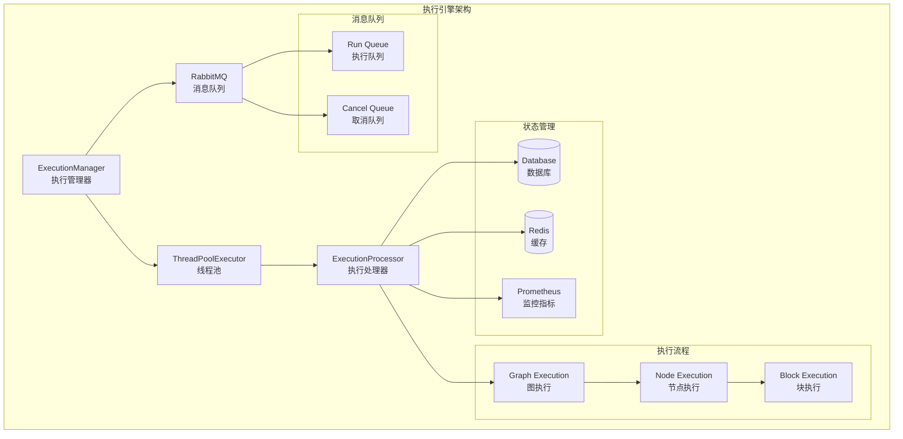
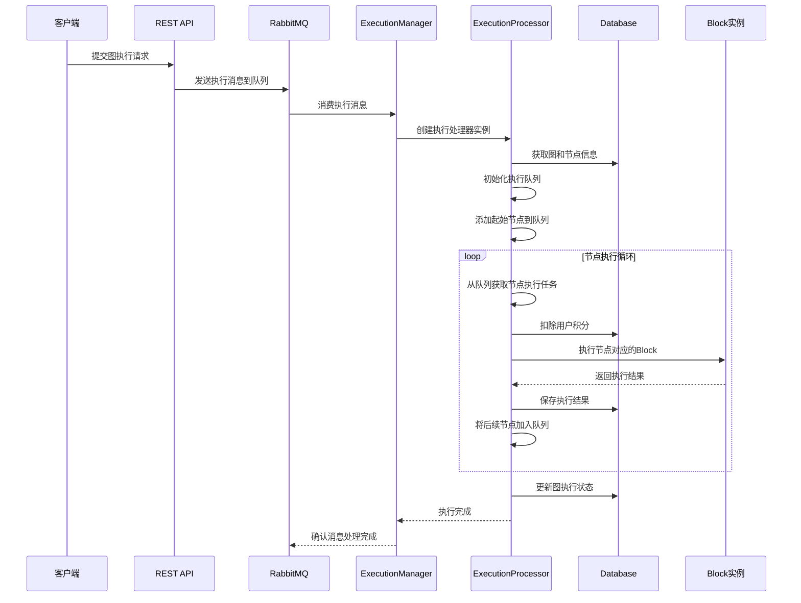

# AutoGPT 执行引擎模块深度分析

## 模块概述

执行引擎是AutoGPT平台的核心组件，负责图（Graph）和节点（Node）的执行调度、状态管理、资源分配和错误处理。该模块采用多线程、异步处理和消息队列架构，确保高并发、高可用的执行环境。

## 架构图



## 时序图



## 核心类和接口

### 1. ExecutionManager 类

**职责**: 执行管理器，负责管理执行线程池、消费消息队列、协调执行任务

```python
class ExecutionManager(AppProcess):
    def __init__(self):
        super().__init__()
        self.pool_size = settings.config.num_graph_workers  # 线程池大小
        self.active_graph_runs: dict[str, tuple[Future, threading.Event]] = {}  # 活跃执行任务
        
        # 延迟初始化的组件
        self._executor = None  # ThreadPoolExecutor
        self._stop_consuming = None  # 停止消费事件
        self._cancel_thread = None  # 取消线程
        self._cancel_client = None  # 取消消息客户端
        self._run_thread = None  # 执行线程
        self._run_client = None  # 执行消息客户端

    @property
    def executor(self) -> ThreadPoolExecutor:
        """线程池执行器，用于并发执行图任务"""
        if self._executor is None:
            self._executor = ThreadPoolExecutor(
                max_workers=self.pool_size,
                initializer=init_worker,  # 初始化工作线程
            )
        return self._executor

    def run(self):
        """启动执行管理器服务"""
        logger.info(f"[{self.service_name}] ⏳ Spawn max-{self.pool_size} workers...")
        
        # 设置Prometheus监控指标
        pool_size_gauge.set(self.pool_size)
        self._update_prompt_metrics()
        start_http_server(settings.config.execution_manager_port)
        
        # 启动消息消费线程
        self.cancel_thread.start()  # 取消消息消费线程
        self.run_thread.start()     # 执行消息消费线程
        
        # 保持服务运行
        while True:
            time.sleep(1e5)
```

**关键方法**:

#### _handle_run_message 方法
```python
def _handle_run_message(
    self,
    _channel: BlockingChannel,
    method: Basic.Deliver,
    _properties: BasicProperties,
    body: bytes,
):
    """处理执行消息的核心方法"""
    delivery_tag = method.delivery_tag
    
    @func_retry
    def _ack_message(reject: bool, requeue: bool):
        """确认或拒绝消息"""
        channel = self.run_client.get_channel()
        if reject:
            channel.connection.add_callback_threadsafe(
                lambda: channel.basic_nack(delivery_tag, requeue=requeue)
            )
        else:
            channel.connection.add_callback_threadsafe(
                lambda: channel.basic_ack(delivery_tag)
            )
    
    # 检查是否正在关闭
    if self.stop_consuming.is_set():
        logger.info(f"[{self.service_name}] Rejecting new execution during shutdown")
        _ack_message(reject=True, requeue=True)
        return
    
    # 检查线程池容量
    self._cleanup_completed_runs()
    if len(self.active_graph_runs) >= self.pool_size:
        _ack_message(reject=True, requeue=True)
        return
    
    try:
        # 解析执行请求
        graph_exec_entry = GraphExecutionEntry.model_validate_json(body)
    except Exception as e:
        logger.error(f"[{self.service_name}] Could not parse run message: {e}")
        _ack_message(reject=True, requeue=False)
        return
    
    graph_exec_id = graph_exec_entry.graph_exec_id
    
    # 防止重复执行
    if graph_exec_id in self.active_graph_runs:
        logger.error(f"[{self.service_name}] Graph {graph_exec_id} already running")
        _ack_message(reject=True, requeue=False)
        return
    
    # 提交执行任务到线程池
    cancel_event = threading.Event()
    future = self.executor.submit(execute_graph, graph_exec_entry, cancel_event)
    self.active_graph_runs[graph_exec_id] = (future, cancel_event)
    self._update_prompt_metrics()
    
    # 设置完成回调
    def _on_run_done(f: Future):
        logger.info(f"[{self.service_name}] Run completed for {graph_exec_id}")
        try:
            if exec_error := f.exception():
                logger.error(f"[{self.service_name}] Execution failed: {exec_error}")
                _ack_message(reject=True, requeue=True)
            else:
                _ack_message(reject=False, requeue=False)
        except BaseException as e:
            logger.exception(f"[{self.service_name}] Error in completion callback: {e}")
        finally:
            self._cleanup_completed_runs()
    
    future.add_done_callback(_on_run_done)
```

### 2. ExecutionProcessor 类

**职责**: 执行处理器，负责具体的图和节点执行逻辑

```python
class ExecutionProcessor:
    """
    执行处理器，包含图和节点执行的事件处理器
    
    执行流程:
    1. 图执行请求被添加到队列
    2. 图执行器从队列中获取请求
    3. 图执行器提交请求到执行器池
    [on_graph_execution]
    4. 图执行器初始化节点执行队列
    5. 图执行器将起始节点添加到队列
    6. 图执行器等待所有节点执行完成
    [on_node_execution]
    7. 节点执行器从队列获取节点执行请求
    8. 节点执行器执行节点
    9. 节点执行器将后续节点加入队列
    """
    
    def on_graph_executor_start(self):
        """初始化执行处理器"""
        configure_logging()
        set_service_name("GraphExecutor")
        self.tid = threading.get_ident()
        self.creds_manager = IntegrationCredentialsManager()
        
        # 创建异步事件循环
        self.node_execution_loop = asyncio.new_event_loop()
        self.node_evaluation_loop = asyncio.new_event_loop()
        
        # 启动事件循环线程
        self.node_execution_thread = threading.Thread(
            target=self.node_execution_loop.run_forever, daemon=True
        )
        self.node_evaluation_thread = threading.Thread(
            target=self.node_evaluation_loop.run_forever, daemon=True
        )
        self.node_execution_thread.start()
        self.node_evaluation_thread.start()
        
        logger.info(f"[GraphExecutor] {self.tid} started")
```

#### on_graph_execution 方法
```python
@error_logged(swallow=False)
def on_graph_execution(
    self,
    graph_exec: GraphExecutionEntry,
    cancel: threading.Event,
):
    """图执行的主要逻辑"""
    log_metadata = LogMetadata(
        logger=_logger,
        user_id=graph_exec.user_id,
        graph_eid=graph_exec.graph_exec_id,
        graph_id=graph_exec.graph_id,
        node_id="*",
        node_eid="*",
        block_name="-",
    )
    db_client = get_db_client()
    
    # 获取执行元数据
    exec_meta = db_client.get_graph_execution_meta(
        user_id=graph_exec.user_id,
        execution_id=graph_exec.graph_exec_id,
    )
    
    if exec_meta is None:
        log_metadata.warning("Graph execution not found, skipping")
        return
    
    # 状态检查和更新
    if exec_meta.status in [ExecutionStatus.QUEUED, ExecutionStatus.INCOMPLETE]:
        log_metadata.info(f"⚙️ Starting graph execution #{graph_exec.graph_exec_id}")
        exec_meta.status = ExecutionStatus.RUNNING
        send_execution_update(
            db_client.update_graph_execution_start_time(graph_exec.graph_exec_id)
        )
    elif exec_meta.status == ExecutionStatus.RUNNING:
        log_metadata.info("⚙️ Graph execution already running, continuing")
    elif exec_meta.status == ExecutionStatus.FAILED:
        exec_meta.status = ExecutionStatus.RUNNING
        log_metadata.info("⚙️ Graph execution was disturbed, continuing")
        update_graph_execution_state(
            db_client=db_client,
            graph_exec_id=graph_exec.graph_exec_id,
            status=ExecutionStatus.RUNNING,
        )
    else:
        log_metadata.warning(f"Skipped execution, status: {exec_meta.status}")
        return
    
    # 初始化执行统计
    if exec_meta.stats is None:
        exec_stats = GraphExecutionStats()
    else:
        exec_stats = exec_meta.stats.to_db()
    
    # 执行图
    timing_info, status = self._on_graph_execution(
        graph_exec=graph_exec,
        cancel=cancel,
        log_metadata=log_metadata,
        execution_stats=exec_stats,
    )
    
    # 更新执行时间统计
    exec_stats.walltime += timing_info.wall_time
    exec_stats.cputime += timing_info.cpu_time
    
    try:
        # 处理执行结果
        if isinstance(status, BaseException):
            raise status
        exec_meta.status = status
        
        # 生成活动状态
        activity_status = asyncio.run_coroutine_threadsafe(
            generate_activity_status_for_execution(
                graph_exec_id=graph_exec.graph_exec_id,
                graph_id=graph_exec.graph_id,
                graph_version=graph_exec.graph_version,
                execution_stats=exec_stats,
                db_client=get_db_async_client(),
                user_id=graph_exec.user_id,
                execution_status=status,
            ),
            self.node_execution_loop,
        ).result(timeout=60.0)
        
        if activity_status is not None:
            exec_stats.activity_status = activity_status
            log_metadata.info(f"Generated activity status: {activity_status}")
        
        # 处理通知
        self._handle_agent_run_notif(db_client, graph_exec, exec_stats)
        
    finally:
        # 更新最终状态
        update_graph_execution_state(
            db_client=db_client,
            graph_exec_id=graph_exec.graph_exec_id,
            status=exec_meta.status,
            stats=exec_stats,
        )
```

#### _on_graph_execution 方法
```python
@time_measured
def _on_graph_execution(
    self,
    graph_exec: GraphExecutionEntry,
    cancel: threading.Event,
    log_metadata: LogMetadata,
    execution_stats: GraphExecutionStats,
) -> ExecutionStatus:
    """图执行的核心逻辑"""
    execution_status: ExecutionStatus = ExecutionStatus.RUNNING
    error: Exception | None = None
    db_client = get_db_client()
    execution_stats_lock = threading.Lock()
    
    # 状态持有者
    running_node_execution: dict[str, NodeExecutionProgress] = defaultdict(NodeExecutionProgress)
    running_node_evaluation: dict[str, Future] = {}
    execution_queue = ExecutionQueue[NodeExecutionEntry]()
    
    try:
        # 检查用户余额
        if db_client.get_credits(graph_exec.user_id) <= 0:
            raise InsufficientBalanceError(
                user_id=graph_exec.user_id,
                message="You have no credits left to run an agent.",
                balance=0,
                amount=1,
            )
        
        # 输入内容审核
        try:
            if moderation_error := asyncio.run_coroutine_threadsafe(
                automod_manager.moderate_graph_execution_inputs(
                    db_client=get_db_async_client(),
                    graph_exec=graph_exec,
                ),
                self.node_evaluation_loop,
            ).result(timeout=30.0):
                raise moderation_error
        except asyncio.TimeoutError:
            log_metadata.warning("Input moderation timed out, bypassing")
        
        # 预填充队列 - 获取所有待执行的节点
        for node_exec in db_client.get_node_executions(
            graph_exec.graph_exec_id,
            statuses=[
                ExecutionStatus.RUNNING,
                ExecutionStatus.QUEUED,
                ExecutionStatus.TERMINATED,
            ],
        ):
            node_entry = node_exec.to_node_execution_entry(graph_exec.user_context)
            execution_queue.add(node_entry)
        
        # 主调度/轮询循环
        while not execution_queue.empty():
            if cancel.is_set():
                break
            
            queued_node_exec = execution_queue.get()
            
            log_metadata.debug(
                f"Dispatching node execution {queued_node_exec.node_exec_id} "
                f"for node {queued_node_exec.node_id}",
            )
            
            # 扣费处理（可能抛出异常）
            try:
                cost, remaining_balance = self._charge_usage(
                    node_exec=queued_node_exec,
                    execution_count=increment_execution_count(graph_exec.user_id),
                )
                with execution_stats_lock:
                    execution_stats.cost += cost
                
                # 检查是否跨越低余额阈值
                self._handle_low_balance(
                    db_client=db_client,
                    user_id=graph_exec.user_id,
                    current_balance=remaining_balance,
                    transaction_cost=cost,
                )
            except InsufficientBalanceError as balance_error:
                error = balance_error
                node_exec_id = queued_node_exec.node_exec_id
                db_client.upsert_execution_output(
                    node_exec_id=node_exec_id,
                    output_name="error",
                    output_data=str(error),
                )
                update_node_execution_status(
                    db_client=db_client,
                    exec_id=node_exec_id,
                    status=ExecutionStatus.FAILED,
                )
                
                self._handle_insufficient_funds_notif(
                    db_client,
                    graph_exec.user_id,
                    graph_exec.graph_id,
                    error,
                )
                break  # 优雅停止执行循环
            
            # 添加输入覆盖
            node_id = queued_node_exec.node_id
            if (nodes_input_masks := graph_exec.nodes_input_masks) and (
                node_input_mask := nodes_input_masks.get(node_id)
            ):
                queued_node_exec.inputs.update(node_input_mask)
            
            # 启动异步节点执行
            node_execution_task = asyncio.run_coroutine_threadsafe(
                self.on_node_execution(
                    node_exec=queued_node_exec,
                    node_exec_progress=running_node_execution[node_id],
                    nodes_input_masks=nodes_input_masks,
                    graph_stats_pair=(execution_stats, execution_stats_lock),
                ),
                self.node_execution_loop,
            )
            running_node_execution[node_id].add_task(
                node_exec_id=queued_node_exec.node_exec_id,
                task=node_execution_task,
            )
            
            # 轮询直到队列重新填充或所有飞行中工作完成
            while execution_queue.empty() and (
                running_node_execution or running_node_evaluation
            ):
                if cancel.is_set():
                    break
                
                # 处理飞行中评估
                node_output_found = False
                for node_id, inflight_exec in list(running_node_execution.items()):
                    if cancel.is_set():
                        break
                    
                    # 节点评估future
                    if inflight_eval := running_node_evaluation.get(node_id):
                        if not inflight_eval.done():
                            continue
                        try:
                            inflight_eval.result(timeout=0)
                            running_node_evaluation.pop(node_id)
                        except Exception as e:
                            log_metadata.error(f"Node eval #{node_id} failed: {e}")
                    
                    # 节点执行future
                    if inflight_exec.is_done():
                        running_node_execution.pop(node_id)
                        continue
                    
                    if output := inflight_exec.pop_output():
                        node_output_found = True
                        running_node_evaluation[node_id] = (
                            asyncio.run_coroutine_threadsafe(
                                self._process_node_output(
                                    output=output,
                                    node_id=node_id,
                                    graph_exec=graph_exec,
                                    log_metadata=log_metadata,
                                    nodes_input_masks=nodes_input_masks,
                                    execution_queue=execution_queue,
                                ),
                                self.node_evaluation_loop,
                            )
                        )
                
                if (
                    not node_output_found
                    and execution_queue.empty()
                    and (running_node_execution or running_node_evaluation)
                ):
                    # 没有要执行的内容，也没有要处理的输出，让我们放松一会儿
                    time.sleep(0.1)
        
        # 循环结束
        
        # 输出内容审核
        try:
            if moderation_error := asyncio.run_coroutine_threadsafe(
                automod_manager.moderate_graph_execution_outputs(
                    db_client=get_db_async_client(),
                    graph_exec_id=graph_exec.graph_exec_id,
                    user_id=graph_exec.user_id,
                    graph_id=graph_exec.graph_id,
                ),
                self.node_evaluation_loop,
            ).result(timeout=30.0):
                raise moderation_error
        except asyncio.TimeoutError:
            log_metadata.warning("Output moderation timed out, bypassing")
        
        # 根据是否有错误或终止确定最终执行状态
        if cancel.is_set():
            execution_status = ExecutionStatus.TERMINATED
        elif error is not None:
            execution_status = ExecutionStatus.FAILED
        else:
            execution_status = ExecutionStatus.COMPLETED
        
        if error:
            execution_stats.error = str(error) or type(error).__name__
        
        return execution_status
    
    except BaseException as e:
        error = (
            e
            if isinstance(e, Exception)
            else Exception(f"{e.__class__.__name__}: {e}")
        )
        
        known_errors = (InsufficientBalanceError, ModerationError)
        if isinstance(error, known_errors):
            execution_stats.error = str(error)
            return ExecutionStatus.FAILED
        
        execution_status = ExecutionStatus.FAILED
        log_metadata.exception(f"Failed graph execution {graph_exec.graph_exec_id}: {error}")
        raise
    
    finally:
        self._cleanup_graph_execution(
            execution_queue=execution_queue,
            running_node_execution=running_node_execution,
            running_node_evaluation=running_node_evaluation,
            execution_status=execution_status,
            error=error,
            graph_exec_id=graph_exec.graph_exec_id,
            log_metadata=log_metadata,
            db_client=db_client,
        )
```

### 3. execute_node 函数

**职责**: 执行单个节点，这是Block执行的入口点

```python
async def execute_node(
    node: Node,
    creds_manager: IntegrationCredentialsManager,
    data: NodeExecutionEntry,
    execution_stats: NodeExecutionStats | None = None,
    nodes_input_masks: Optional[NodesInputMasks] = None,
) -> BlockOutput:
    """
    执行图中的一个节点。这将触发节点上的块执行，
    持久化执行结果，并返回要执行的后续节点。
    
    Args:
        node: 要执行的节点
        creds_manager: 凭据管理器，用于获取和释放凭据
        data: 执行当前节点的执行数据
        execution_stats: 要更新的执行统计信息
        nodes_input_masks: 可选的节点输入覆盖
    
    Returns:
        生成器，产生 (output_name, output_data) 元组
    """
    user_id = data.user_id
    graph_exec_id = data.graph_exec_id
    graph_id = data.graph_id
    node_exec_id = data.node_exec_id
    node_id = data.node_id
    node_block = node.block
    
    log_metadata = LogMetadata(
        logger=_logger,
        user_id=user_id,
        graph_eid=graph_exec_id,
        graph_id=graph_id,
        node_eid=node_exec_id,
        node_id=node_id,
        block_name=node_block.name,
    )
    
    # 健全性检查：验证执行输入
    input_data, error = validate_exec(node, data.inputs, resolve_input=False)
    if input_data is None:
        log_metadata.error(f"Skip execution, input validation error: {error}")
        yield "error", error
        return
    
    # 为agent块重新塑造输入数据
    # AgentExecutorBlock特别分离节点input_data和其input_default
    if isinstance(node_block, AgentExecutorBlock):
        _input_data = AgentExecutorBlock.Input(**node.input_default)
        _input_data.inputs = input_data
        if nodes_input_masks:
            _input_data.nodes_input_masks = nodes_input_masks
        input_data = _input_data.model_dump()
    data.inputs = input_data
    
    # 执行节点
    input_data_str = json.dumps(input_data)
    input_size = len(input_data_str)
    log_metadata.debug("Executed node with input", input=input_data_str)
    
    # 通过kwargs为块注入额外的执行参数
    extra_exec_kwargs: dict = {
        "graph_id": graph_id,
        "node_id": node_id,
        "graph_exec_id": graph_exec_id,
        "node_exec_id": node_exec_id,
        "user_id": user_id,
    }
    
    # 从NodeExecutionEntry添加用户上下文
    extra_exec_kwargs["user_context"] = data.user_context
    
    # 最后一刻获取凭据 + 获取系统范围的读写锁以防止
    # 执行期间的更改。⚠️ 这意味着一组凭据只能被
    # 一个（运行中的）块同时使用；不支持使用相同凭据的块的同时执行
    creds_lock = None
    input_model = cast(type[BlockSchema], node_block.input_schema)
    for field_name, input_type in input_model.get_credentials_fields().items():
        credentials_meta = input_type(**input_data[field_name])
        credentials, creds_lock = await creds_manager.acquire(
            user_id, credentials_meta.id
        )
        extra_exec_kwargs[field_name] = credentials
    
    output_size = 0
    try:
        # 执行Block
        async for output_name, output_data in node_block.execute(
            input_data, **extra_exec_kwargs
        ):
            output_data = json.convert_pydantic_to_json(output_data)
            output_size += len(json.dumps(output_data))
            log_metadata.debug("Node produced output", **{output_name: output_data})
            yield output_name, output_data
    finally:
        # 确保即使执行失败也释放凭据
        if creds_lock and (await creds_lock.locked()) and (await creds_lock.owned()):
            try:
                await creds_lock.release()
            except Exception as e:
                log_metadata.error(f"Failed to release credentials lock: {e}")
        
        # 更新执行统计
        if execution_stats is not None:
            execution_stats += node_block.execution_stats
            execution_stats.input_size = input_size
            execution_stats.output_size = output_size
```

### 4. Scheduler 调度器

**职责**: 定时任务调度，支持Cron表达式的图执行调度

```python
class Scheduler(AppService):
    scheduler: BackgroundScheduler
    
    def __init__(self, register_system_tasks: bool = True):
        self.register_system_tasks = register_system_tasks
    
    def run_service(self):
        """启动调度器服务"""
        load_dotenv()
        
        # 初始化异步作业的事件循环
        global _event_loop
        _event_loop = asyncio.new_event_loop()
        
        global _event_loop_thread
        _event_loop_thread = threading.Thread(
            target=_event_loop.run_forever, daemon=True, name="SchedulerEventLoop"
        )
        _event_loop_thread.start()
        
        db_schema, db_url = _extract_schema_from_url(os.getenv("DIRECT_URL"))
        
        # 配置执行器以限制并发性而不跳过作业
        from apscheduler.executors.pool import ThreadPoolExecutor
        
        self.scheduler = BackgroundScheduler(
            executors={
                "default": ThreadPoolExecutor(
                    max_workers=self.db_pool_size()
                ),  # 匹配DB池大小以防止资源争用
            },
            job_defaults={
                "coalesce": True,  # 跳过冗余的错过作业 - 只运行最新的
                "max_instances": 1000,  # 实际上无限制 - 永不丢弃执行
                "misfire_grace_time": None,  # 错过作业没有时间限制
            },
            jobstores={
                Jobstores.EXECUTION.value: SQLAlchemyJobStore(
                    engine=create_engine(
                        url=db_url,
                        pool_size=self.db_pool_size(),
                        max_overflow=0,
                    ),
                    metadata=MetaData(schema=db_schema),
                    tablename="apscheduler_jobs",
                ),
                Jobstores.BATCHED_NOTIFICATIONS.value: SQLAlchemyJobStore(
                    engine=create_engine(
                        url=db_url,
                        pool_size=self.db_pool_size(),
                        max_overflow=0,
                    ),
                    metadata=MetaData(schema=db_schema),
                    tablename="apscheduler_jobs_batched_notifications",
                ),
                Jobstores.WEEKLY_NOTIFICATIONS.value: MemoryJobStore(),
            },
            logger=apscheduler_logger,
            timezone=ZoneInfo("UTC"),
        )
        
        if self.register_system_tasks:
            # 注册系统任务
            self._register_system_tasks()
        
        # 添加事件监听器
        self.scheduler.add_listener(job_listener, EVENT_JOB_EXECUTED | EVENT_JOB_ERROR)
        self.scheduler.add_listener(job_missed_listener, EVENT_JOB_MISSED)
        self.scheduler.add_listener(job_max_instances_listener, EVENT_JOB_MAX_INSTANCES)
        self.scheduler.start()
        
        # 保持服务运行，因为BackgroundScheduler不会阻塞
        super().run_service()

    @expose
    def add_graph_execution_schedule(
        self,
        user_id: str,
        graph_id: str,
        graph_version: int,
        cron: str,
        input_data: BlockInput,
        input_credentials: dict[str, CredentialsMetaInput],
        name: Optional[str] = None,
        user_timezone: str | None = None,
    ) -> GraphExecutionJobInfo:
        """添加图执行调度"""
        # 在调度之前验证图以防止运行时失败
        run_async(
            execution_utils.validate_and_construct_node_execution_input(
                graph_id=graph_id,
                user_id=user_id,
                graph_inputs=input_data,
                graph_version=graph_version,
                graph_credentials_inputs=input_credentials,
            )
        )
        
        # 使用提供的时区或默认为UTC
        if not user_timezone:
            user_timezone = "UTC"
            logger.warning(
                f"No timezone provided for user {user_id}, using UTC for scheduling"
            )
        
        logger.info(
            f"Scheduling job for user {user_id} with timezone {user_timezone} (cron: {cron})"
        )
        
        job_args = GraphExecutionJobArgs(
            user_id=user_id,
            graph_id=graph_id,
            graph_version=graph_version,
            cron=cron,
            input_data=input_data,
            input_credentials=input_credentials,
        )
        
        job = self.scheduler.add_job(
            execute_graph,
            kwargs=job_args.model_dump(),
            name=name,
            trigger=CronTrigger.from_crontab(cron, timezone=user_timezone),
            jobstore=Jobstores.EXECUTION.value,
            replace_existing=True,
        )
        
        logger.info(
            f"Added job {job.id} with cron schedule '{cron}' in timezone {user_timezone}"
        )
        return GraphExecutionJobInfo.from_db(job_args, job)
```

## API接口分析

### 1. 图执行API

#### POST /v1/graphs/{graph_id}/execute/{graph_version}
**入口函数**: `execute_graph` (在 `autogpt_platform/backend/backend/server/routers/v1.py`)

```python
@router.post(
    "/graphs/{graph_id}/execute/{graph_version}",
    response_model=GraphExecution,
    dependencies=[Depends(rate_limit_middleware)],
)
async def execute_graph(
    graph_id: str,
    graph_version: int,
    request: ExecuteGraphRequest,
    user_id: Annotated[str, Depends(get_user_id)],
    user_context: Annotated[UserContext, Depends(get_user_context)],
) -> GraphExecution:
    """执行指定版本的图"""
    try:
        # 验证和构建节点执行输入
        graph_exec = await execution_utils.add_graph_execution(
            user_id=user_id,
            graph_id=graph_id,
            graph_version=graph_version,
            inputs=request.input_data,
            graph_credentials_inputs=request.input_credentials,
            nodes_input_masks=request.nodes_input_masks,
            user_context=user_context,
        )
        return graph_exec
    except Exception as e:
        logger.exception(f"Error executing graph {graph_id}v{graph_version}: {e}")
        raise HTTPException(status_code=500, detail=str(e))
```

**调用链路**:
1. `execute_graph` (REST API)
2. `execution_utils.add_graph_execution` (验证和创建执行)
3. `ExecutionManager._handle_run_message` (消息处理)
4. `ExecutionProcessor.on_graph_execution` (图执行)
5. `ExecutionProcessor._on_graph_execution` (核心执行逻辑)
6. `execute_node` (节点执行)
7. `Block.execute` (Block执行)

### 2. 执行停止API

#### POST /v1/graphs/{graph_id}/executions/{graph_exec_id}/stop
**入口函数**: `stop_graph_execution`

```python
@router.post(
    "/graphs/{graph_id}/executions/{graph_exec_id}/stop",
    response_model=GraphExecution,
    dependencies=[Depends(rate_limit_middleware)],
)
async def stop_graph_execution(
    graph_id: str,
    graph_exec_id: str,
    user_id: Annotated[str, Depends(get_user_id)],
) -> GraphExecution:
    """停止图执行"""
    try:
        # 发送取消消息到队列
        await execution_utils.cancel_graph_execution(
            user_id=user_id,
            graph_exec_id=graph_exec_id,
        )
        
        # 获取更新后的执行状态
        db_client = get_database_manager_async_client()
        execution = await db_client.get_graph_execution(graph_exec_id)
        if not execution:
            raise HTTPException(status_code=404, detail="Execution not found")
        
        return execution
    except Exception as e:
        logger.exception(f"Error stopping execution {graph_exec_id}: {e}")
        raise HTTPException(status_code=500, detail=str(e))
```

### 3. 调度管理API

#### POST /v1/graphs/{graph_id}/schedules
**入口函数**: `create_schedule`

```python
@router.post(
    "/graphs/{graph_id}/schedules",
    response_model=GraphExecutionSchedule,
    dependencies=[Depends(rate_limit_middleware)],
)
async def create_schedule(
    graph_id: str,
    request: CreateScheduleRequest,
    user_id: Annotated[str, Depends(get_user_id)],
    user_context: Annotated[UserContext, Depends(get_user_context)],
) -> GraphExecutionSchedule:
    """创建图执行调度"""
    try:
        scheduler_client = SchedulerClient()
        
        # 获取用户时区
        user_timezone = user_context.timezone or "UTC"
        
        # 添加调度
        job_info = await scheduler_client.add_execution_schedule(
            user_id=user_id,
            graph_id=graph_id,
            graph_version=request.graph_version,
            cron=request.cron,
            input_data=request.input_data,
            input_credentials=request.input_credentials,
            name=request.name,
            user_timezone=user_timezone,
        )
        
        return GraphExecutionSchedule(
            id=job_info.id,
            graph_id=graph_id,
            graph_version=job_info.graph_version,
            cron=job_info.cron,
            name=job_info.name,
            next_run_time=job_info.next_run_time,
            timezone=job_info.timezone,
            is_enabled=True,
        )
    except Exception as e:
        logger.exception(f"Error creating schedule for graph {graph_id}: {e}")
        raise HTTPException(status_code=500, detail=str(e))
```

## 关键数据结构

### 1. GraphExecutionEntry
```python
class GraphExecutionEntry(BaseModel):
    """图执行入口数据结构"""
    user_id: str
    graph_exec_id: str
    graph_id: str
    graph_version: int
    nodes_input_masks: Optional[NodesInputMasks] = None
    user_context: UserContext
```

### 2. NodeExecutionEntry
```python
class NodeExecutionEntry(BaseModel):
    """节点执行入口数据结构"""
    user_id: str
    graph_exec_id: str
    graph_id: str
    node_exec_id: str
    node_id: str
    block_id: str
    inputs: BlockInput
    user_context: UserContext
```

### 3. ExecutionStatus
```python
class ExecutionStatus(str, Enum):
    """执行状态枚举"""
    QUEUED = "QUEUED"          # 已排队
    RUNNING = "RUNNING"        # 运行中
    COMPLETED = "COMPLETED"    # 已完成
    FAILED = "FAILED"          # 失败
    TERMINATED = "TERMINATED"  # 已终止
    INCOMPLETE = "INCOMPLETE"  # 不完整
```

## 性能优化和监控

### 1. Prometheus监控指标

```python
# 活跃执行数量
active_runs_gauge = Gauge(
    "execution_manager_active_runs", 
    "Number of active graph runs"
)

# 线程池大小
pool_size_gauge = Gauge(
    "execution_manager_pool_size", 
    "Maximum number of graph workers"
)

# 利用率
utilization_gauge = Gauge(
    "execution_manager_utilization_ratio",
    "Ratio of active graph runs to max graph workers",
)
```

### 2. 性能优化策略

#### 线程池管理
- 动态调整线程池大小
- 基于系统负载的自适应调度
- 优雅关闭机制

#### 内存管理
- 执行结果流式处理
- 大文件分块传输
- 定期清理过期文件

#### 数据库优化
- 连接池管理
- 批量操作
- 索引优化

### 3. 错误处理和恢复

#### 异常分类
```python
# 已知错误类型
known_errors = (InsufficientBalanceError, ModerationError)

# 用户错误 vs 系统错误
if isinstance(e, ValueError):
    # 用户错误，标记为FAILED
    status = ExecutionStatus.FAILED
elif isinstance(e, Exception):
    # 系统错误，记录异常
    status = ExecutionStatus.FAILED
else:
    # 中断错误（CancelledError, SystemExit）
    status = ExecutionStatus.TERMINATED
```

#### 重试机制
- 指数退避重试
- 最大重试次数限制
- 幂等性保证

## 实战经验

### 1. 高并发处理
- **线程池大小配置**: 根据CPU核心数和I/O密集度调整
- **消息队列配置**: 设置合适的prefetch_count避免消息堆积
- **数据库连接池**: 匹配线程池大小防止连接耗尽

### 2. 内存优化
- **流式处理**: 大数据量使用异步生成器避免内存爆炸
- **对象池**: 重用昂贵对象如数据库连接、HTTP客户端
- **垃圾回收**: 及时清理执行上下文和临时文件

### 3. 故障恢复
- **幂等性设计**: 支持重复执行不产生副作用
- **状态持久化**: 关键状态及时写入数据库
- **优雅降级**: 部分功能失败不影响整体服务

### 4. 监控告警
- **执行时间监控**: 设置合理的超时阈值
- **资源使用监控**: CPU、内存、磁盘使用率
- **错误率监控**: 按错误类型分类统计

### 5. 扩展性设计
- **水平扩展**: 支持多实例部署
- **负载均衡**: 基于队列的自然负载分配
- **服务发现**: 动态发现和注册执行节点

## 总结

执行引擎模块是AutoGPT平台的核心，通过精心设计的多线程、异步处理和消息队列架构，实现了高性能、高可用的图执行环境。关键特性包括：

1. **分布式执行**: 基于RabbitMQ的消息队列实现分布式任务调度
2. **并发控制**: ThreadPoolExecutor + 异步处理实现高并发
3. **状态管理**: 完整的执行状态跟踪和持久化
4. **资源管理**: 凭据管理、内存控制、文件清理
5. **监控告警**: Prometheus指标 + 结构化日志
6. **错误处理**: 分类错误处理 + 优雅降级
7. **扩展性**: 支持水平扩展和动态调整

该模块为AutoGPT平台提供了稳定可靠的执行基础设施，支持复杂的AI Agent工作流执行。

