# AutoGPT平台整体架构与模块交互图

## 概述

本文档详细展示了AutoGPT平台的整体架构设计、模块间交互关系以及数据流向。通过多层次的架构图和时序图，帮助开发者深入理解系统的设计理念和运行机制。

## 系统整体架构

### 1. 宏观系统架构图

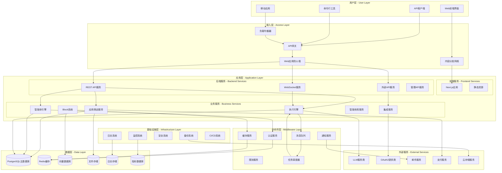

### 2. 微服务架构视图

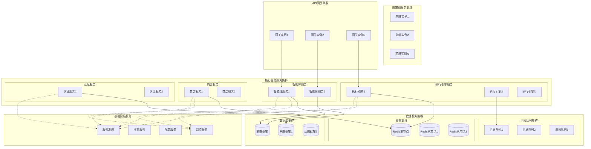

## 分层架构设计

### 1. 六层架构模型

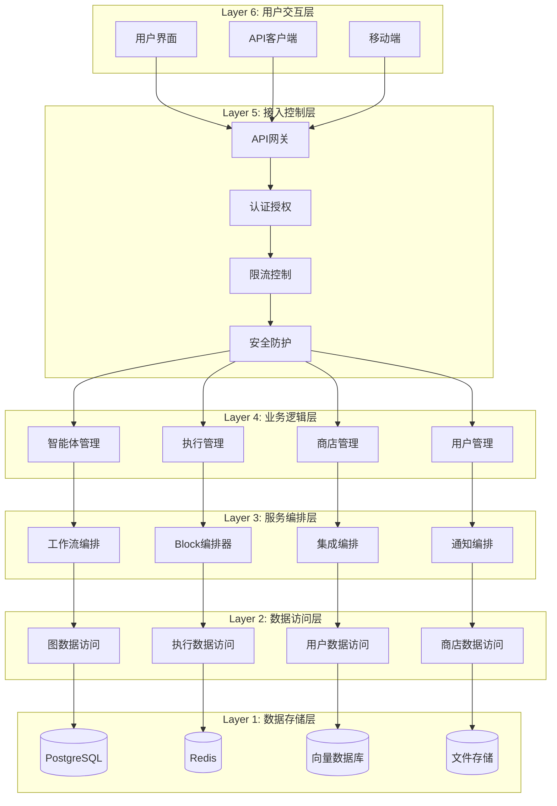

### 2. 领域驱动设计架构

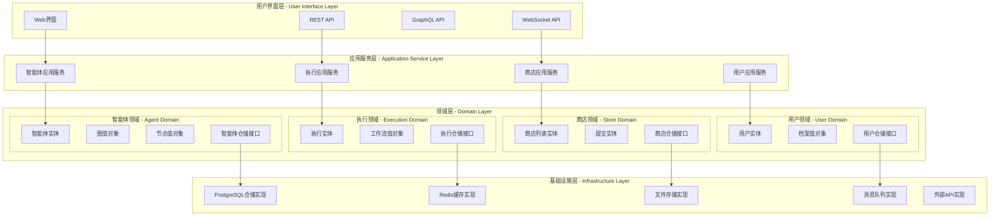

## 核心模块交互

### 1. 智能体生命周期交互图

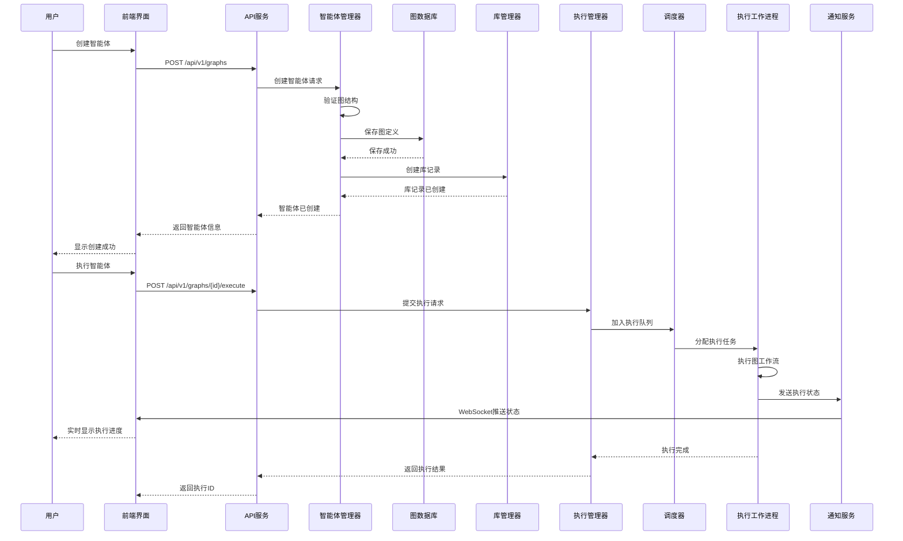

### 2. 商店提交审核流程

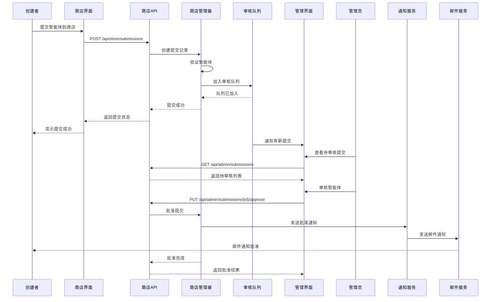

### 3. 用户认证与授权流程

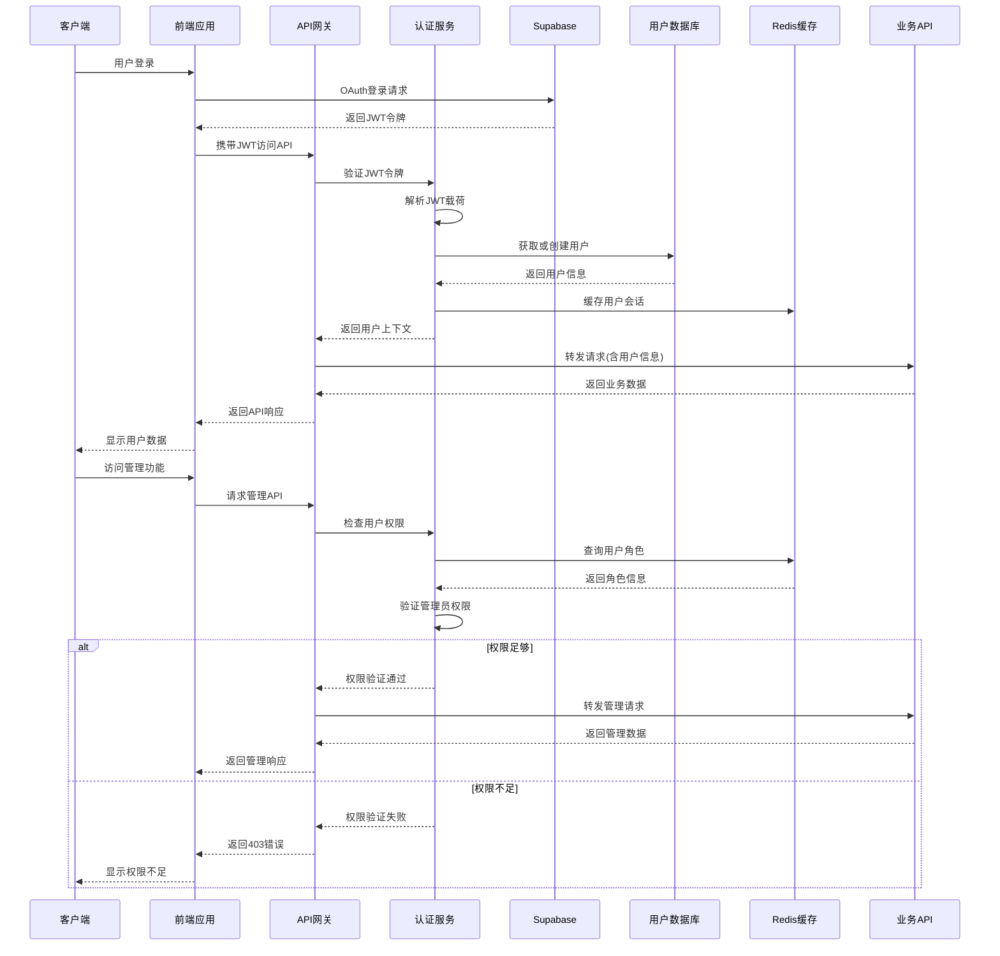

## 数据流向分析

### 1. 智能体执行数据流

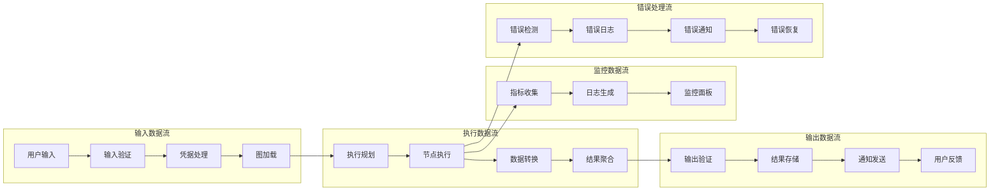

### 2. 商店数据流向图

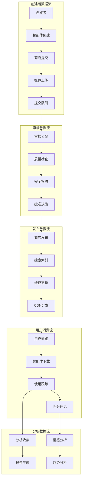

### 3. 实时通信数据流

```mermaid
graph TB
    subgraph "WebSocket连接建立"
        ClientConnect[客户端连接] --> TokenValidation[令牌验证]
        TokenValidation --> ConnectionAccept[连接接受]
        ConnectionAccept --> SubscriptionSetup[订阅设置]
    end
    
    subgraph "消息路由"
        MessageReceive[消息接收] --> MessageValidation[消息验证]
        MessageValidation --> MessageRouting[消息路由]
        MessageRouting --> HandlerDispatch[处理器分发]
    end
    
    subgraph "状态推送"
        ExecutionUpdate[执行更新] --> StatusBroadcast[状态广播]
        StatusBroadcast --> SubscriberFilter[订阅者过滤]
        SubscriberFilter --> MessageSend[消息发送]
    end
    
    subgraph "连接管理"
        ConnectionMonitor[连接监控] --> HeartbeatCheck[心跳检查]
        HeartbeatCheck --> ConnectionCleanup[连接清理]
        ConnectionCleanup --> ResourceRelease[资源释放]
    end
```

## 部署架构图

### 1. 云原生部署架构

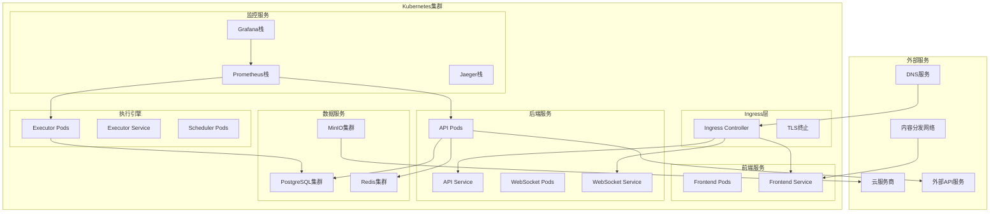

### 2. 高可用部署架构

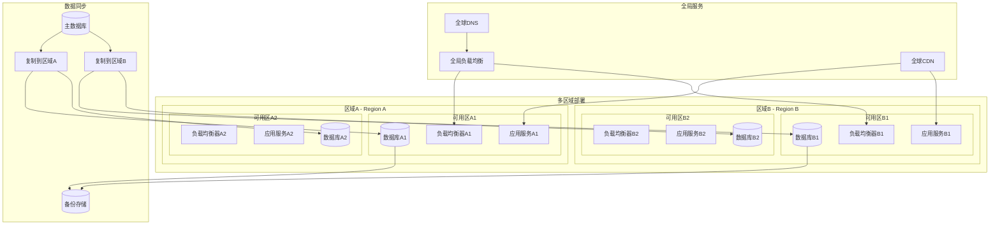

## 技术栈架构

### 1. 前端技术栈

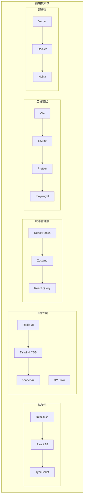

### 2. 后端技术栈

```mermaid
graph TB
    subgraph "后端技术栈"
        subgraph "Web框架层"
            FastAPI[FastAPI]
            Uvicorn[Uvicorn]
            Pydantic[Pydantic]
        end
        
        subgraph "数据访问层"
            Prisma[Prisma ORM]
            AsyncPG[AsyncPG]
            Redis_PY[Redis-py]
        end
        
        subgraph "异步处理层"
            AsyncIO[AsyncIO]
            Celery[Celery]
            RabbitMQ[RabbitMQ]
        end
        
        subgraph "AI/ML层"
            OpenAI[OpenAI SDK]
            LangChain[LangChain]
            Transformers[Transformers]
        end
        
        subgraph "监控层"
            Prometheus[Prometheus]
            Sentry[Sentry]
            Grafana[Grafana]
        end
        
        subgraph "部署层"
            Docker[Docker]
            Kubernetes[Kubernetes]
            Helm[Helm]
        end
    end
    
    %% 依赖关系
    FastAPI --> Uvicorn
    Uvicorn --> Pydantic
    Prisma --> AsyncPG
    AsyncPG --> Redis_PY
    AsyncIO --> Celery
    Celery --> RabbitMQ
    OpenAI --> LangChain
    LangChain --> Transformers
    Prometheus --> Sentry
    Sentry --> Grafana
    Docker --> Kubernetes
    Kubernetes --> Helm
```

### 3. 数据技术栈

```mermaid
graph TB
    subgraph "数据技术栈"
        subgraph "关系数据库"
            PostgreSQL[PostgreSQL 14+]
            PgVector[pgvector扩展]
            ConnectionPool[连接池]
        end
        
        subgraph "缓存层"
            Redis[Redis 7+]
            RedisCluster[Redis集群]
            RedisStreams[Redis Streams]
        end
        
        subgraph "搜索引擎"
            Elasticsearch[Elasticsearch]
            OpenSearch[OpenSearch]
            FullTextSearch[全文搜索]
        end
        
        subgraph "向量数据库"
            Pinecone[Pinecone]
            Weaviate[Weaviate]
            Chroma[Chroma]
        end
        
        subgraph "文件存储"
            MinIO[MinIO]
            S3[Amazon S3]
            GCS[Google Cloud Storage]
        end
        
        subgraph "数据处理"
            Pandas[Pandas]
            NumPy[NumPy]
            Apache_Airflow[Apache Airflow]
        end
    end
    
    %% 数据流
    PostgreSQL --> PgVector
    PgVector --> ConnectionPool
    Redis --> RedisCluster
    RedisCluster --> RedisStreams
    Elasticsearch --> OpenSearch
    OpenSearch --> FullTextSearch
    Pinecone --> Weaviate
    Weaviate --> Chroma
    MinIO --> S3
    S3 --> GCS
    Pandas --> NumPy
    NumPy --> Apache_Airflow
```

### 4. DevOps技术栈

```mermaid
graph TB
    subgraph "DevOps技术栈"
        subgraph "版本控制"
            Git[Git]
            GitHub[GitHub]
            GitLab[GitLab]
        end
        
        subgraph "CI/CD"
            GitHubActions[GitHub Actions]
            Jenkins[Jenkins]
            ArgoCD[ArgoCD]
        end
        
        subgraph "容器化"
            Docker[Docker]
            Podman[Podman]
            BuildKit[BuildKit]
        end
        
        subgraph "编排"
            Kubernetes[Kubernetes]
            Helm[Helm]
            Kustomize[Kustomize]
        end
        
        subgraph "监控"
            Prometheus[Prometheus]
            Grafana[Grafana]
            AlertManager[AlertManager]
        end
        
        subgraph "日志"
            ELK[ELK Stack]
            Fluentd[Fluentd]
            Loki[Loki]
        end
        
        subgraph "安全"
            Vault[HashiCorp Vault]
            SOPS[SOPS]
            Falco[Falco]
        end
        
        subgraph "基础设施"
            Terraform[Terraform]
            Ansible[Ansible]
            Pulumi[Pulumi]
        end
    end
    
    %% 工作流
    Git --> GitHub
    GitHub --> GitHubActions
    GitHubActions --> Docker
    Docker --> Kubernetes
    Kubernetes --> Helm
    Helm --> Prometheus
    Prometheus --> Grafana
    Grafana --> ELK
    ELK --> Vault
    Vault --> Terraform
```

## 总结

AutoGPT平台采用了现代化的微服务架构设计，具有以下特点：

### 架构优势

1. **模块化设计**: 各模块职责清晰，便于独立开发和维护
2. **可扩展性**: 支持水平扩展，可根据负载动态调整资源
3. **高可用性**: 多层冗余设计，确保系统稳定运行
4. **技术先进**: 采用最新的技术栈，保证系统的先进性
5. **云原生**: 完全支持容器化部署和云原生架构

### 设计原则

1. **单一职责**: 每个模块只负责特定的业务功能
2. **松耦合**: 模块间通过标准接口通信，降低耦合度
3. **高内聚**: 相关功能集中在同一模块内
4. **可测试**: 架构设计便于单元测试和集成测试
5. **可观测**: 全链路监控和日志记录

通过这些架构图和设计说明，开发者可以全面理解AutoGPT平台的系统架构，为系统开发、部署和运维提供重要参考。
