## 概述

AutoGPT是一个强大的AI Agent平台，提供了完整的图形化工作流构建、执行和管理能力。本手册将从框架使用、API接口、架构设计等多个维度，帮助开发者由浅入深地掌握AutoGPT平台的核心技术和最佳实践。

<!--more-->

## 目录结构

本手册按照以下结构组织：

1. **框架使用示例** - 快速上手和基础用法
2. **API接口详解** - 完整的REST API文档和调用链路分析
3. **整体架构分析** - 系统架构设计和模块交互
4. **模块深度剖析** - 各核心模块的详细分析
5. **数据结构设计** - 关键数据模型和UML图
6. **最佳实践指南** - 实战经验和优化建议

## 1. 框架使用示例

### 1.1 快速开始

#### 1.1.1 环境准备

```bash
# 克隆项目
git clone https://github.com/Significant-Gravitas/AutoGPT.git
cd AutoGPT/autogpt_platform

# 安装依赖
cd backend && poetry install
cd ../frontend && pnpm install

# 启动服务
docker-compose up -d  # 启动数据库和Redis
cd backend && poetry run python -m backend.app  # 启动后端
cd ../frontend && pnpm dev  # 启动前端
```

#### 1.1.2 基础概念

AutoGPT平台的核心概念包括：

- **Graph（图）**: 工作流的抽象表示，由节点和连接组成
- **Node（节点）**: 工作流中的执行单元，对应一个Block
- **Block（块）**: 具体的功能实现，如LLM调用、文件处理等
- **Execution（执行）**: 图的运行实例，包含状态和结果

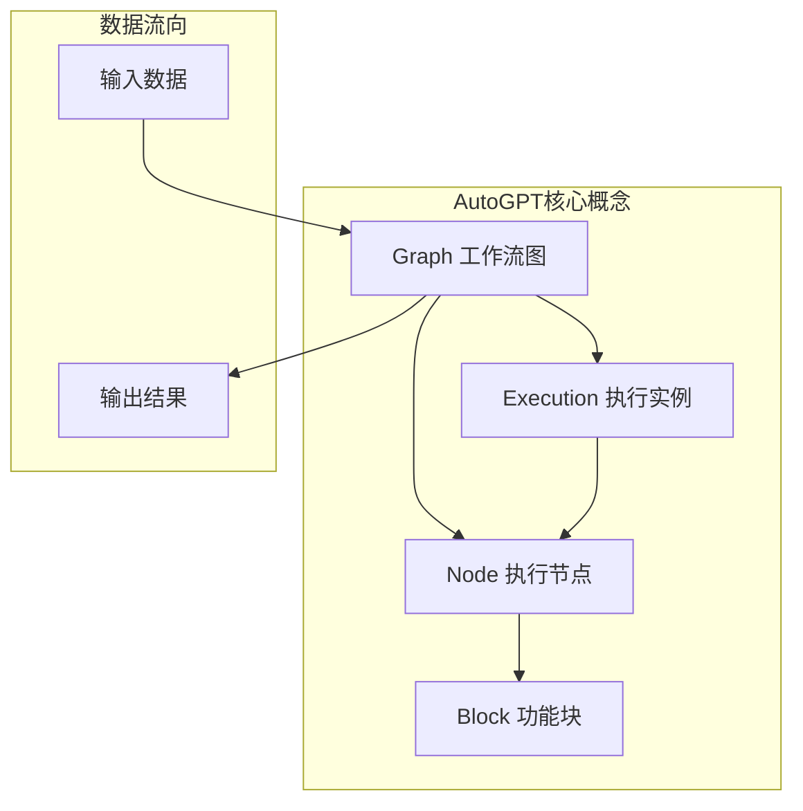

**图1-1: AutoGPT核心概念关系图**
此图展示了AutoGPT平台的基础概念及其关系。Graph作为顶层抽象包含多个Node，每个Node对应一个Block实现，Execution代表Graph的运行实例。

### 1.2 创建第一个工作流

#### 1.2.1 使用Web界面创建

```typescript
// 前端创建图的基本流程
interface CreateGraphRequest {
  name: string;
  description?: string;
  nodes: GraphNode[];
  links: GraphLink[];
}

// 示例：创建一个简单的文本处理工作流
const simpleGraph: CreateGraphRequest = {
  name: "文本摘要工作流",
  description: "使用LLM对输入文本进行摘要",
  nodes: [
    {
      id: "input_node",
      block_id: "text_input_block",
      input_default: {},
      metadata: { position: { x: 100, y: 100 } }
    },
    {
      id: "llm_node", 
      block_id: "llm_call_block",
      input_default: {
        model: "gpt-4",
        prompt: "请对以下文本进行摘要：{text}"
      },
      metadata: { position: { x: 300, y: 100 } }
    }
  ],
  links: [
    {
      source_id: "input_node",
      sink_id: "llm_node",
      source_name: "text",
      sink_name: "text"
    }
  ]
};
```

#### 1.2.2 使用API创建

```python
import httpx
import asyncio

class AutoGPTClient:
    """AutoGPT平台客户端封装类
    
    提供便捷的API调用接口，包含认证、错误处理等功能
    """
    
    def __init__(self, base_url: str, api_key: str):
        """初始化客户端
        
        Args:
            base_url: API服务器地址，如 "https://api.autogpt.com"
            api_key: 用户API密钥，用于身份认证
        """
        self.base_url = base_url.rstrip('/')
        self.headers = {
            "Authorization": f"Bearer {api_key}",
            "Content-Type": "application/json"
        }
        self.client = httpx.AsyncClient(headers=self.headers)
    
    async def create_graph(self, graph_data: dict) -> dict:
        """创建新的工作流图
        
        Args:
            graph_data: 图定义数据，包含节点、连接等信息
            
        Returns:
            创建成功的图信息，包含图ID和版本号
            
        Raises:
            httpx.HTTPStatusError: API调用失败时抛出
        """
        response = await self.client.post(
            f"{self.base_url}/api/graphs",
            json=graph_data
        )
        response.raise_for_status()
        return response.json()
    
    async def execute_graph(self, graph_id: str, inputs: dict, 
                          graph_version: int = None) -> dict:
        """执行工作流图
        
        Args:
            graph_id: 图的唯一标识符
            inputs: 执行输入数据，键值对格式
            graph_version: 图版本号，默认使用最新版本
            
        Returns:
            执行结果信息，包含执行ID和状态
        """
        url = f"{self.base_url}/api/graphs/{graph_id}/execute"
        if graph_version:
            url += f"/{graph_version}"
            
        response = await self.client.post(url, json={
            "inputs": inputs,
            "credentials_inputs": {}
        })
        response.raise_for_status()
        return response.json()

# 使用示例
async def main():
    client = AutoGPTClient(
        base_url="http://localhost:8000",
        api_key="your-api-key"
    )
    
    # 创建图
    graph_data = {
        "name": "API创建的文本摘要流程",
        "description": "通过API创建的示例工作流",
        "nodes": [
            {
                "id": "text_input",
                "block_id": "text_input_block",
                "input_default": {},
                "metadata": {"position": {"x": 0, "y": 0}}
            },
            {
                "id": "summarize",
                "block_id": "llm_call_block", 
                "input_default": {
                    "model": "gpt-4",
                    "prompt": "请简洁地总结以下内容：\n\n{input_text}",
                    "max_tokens": 150
                },
                "metadata": {"position": {"x": 200, "y": 0}}
            }
        ],
        "links": [
            {
                "source_id": "text_input",
                "sink_id": "summarize", 
                "source_name": "text",
                "sink_name": "input_text"
            }
        ]
    }
    
    # 创建图
    graph = await client.create_graph(graph_data)
    print(f"创建图成功，ID: {graph['id']}")
    
    # 执行图
    execution = await client.execute_graph(
        graph_id=graph['id'],
        inputs={"text": "这是一段需要摘要的长文本..."}
    )
    print(f"执行开始，执行ID: {execution['id']}")

if __name__ == "__main__":
    asyncio.run(main())
```

## 2. API接口详解

AutoGPT平台提供了完整的REST API接口，支持图管理、执行控制、用户管理等核心功能。本节将深入分析每个API的调用链路和关键实现。

### 2.1 API架构概览

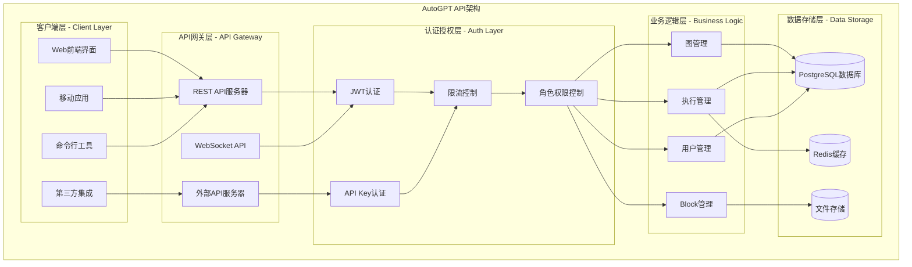

**图2-1: AutoGPT API架构图**
此图展示了AutoGPT平台的完整API架构，从客户端到数据存储的各个层次。API网关层负责请求路由，认证授权层确保安全性，业务逻辑层处理核心功能，数据存储层提供持久化能力。

### 2.2 核心API端点分析

#### 2.2.1 图执行API

**端点**: `POST /api/graphs/{graph_id}/execute/{graph_version}`

**功能**: 执行指定的工作流图

**入口函数源码分析**:

```python
# 文件: autogpt_platform/backend/backend/server/routers/v1.py
@v1_router.post(
    path="/graphs/{graph_id}/execute/{graph_version}",
    summary="Execute graph agent",
    tags=["graphs"],
    dependencies=[Security(requires_user)],
)
async def execute_graph(
    graph_id: str,  # 图的唯一标识符
    user_id: Annotated[str, Security(get_user_id)],  # 用户ID，从JWT中提取
    inputs: Annotated[dict[str, Any], Body(..., embed=True, default_factory=dict)],  # 执行输入数据
    credentials_inputs: Annotated[
        dict[str, CredentialsMetaInput], Body(..., embed=True, default_factory=dict)
    ],  # 凭据输入数据
    graph_version: Optional[int] = None,  # 图版本号，可选
    preset_id: Optional[str] = None,  # 预设ID，可选
) -> execution_db.GraphExecutionMeta:
    """
    执行工作流图的主要入口函数
    
    功能说明:
    1. 验证用户余额是否充足
    2. 调用执行工具函数创建图执行
    3. 记录执行指标和日志
    4. 处理各种异常情况
    
    参数说明:
    - graph_id: 要执行的图的唯一标识符
    - user_id: 执行用户的ID，用于权限验证和计费
    - inputs: 图执行的输入数据，键值对格式
    - credentials_inputs: 执行所需的凭据信息
    - graph_version: 指定执行的图版本，默认使用最新版本
    - preset_id: 预设配置ID，可以预定义输入参数
    
    返回值:
    - GraphExecutionMeta: 包含执行ID、状态、创建时间等元信息
    
    异常处理:
    - HTTPException(402): 余额不足时返回
    - HTTPException(400): 图验证失败时返回，包含详细错误信息
    - 其他异常: 记录日志后重新抛出
    """
    
    # 第一步：余额验证
    # 检查用户当前余额，确保有足够的积分执行图
    current_balance = await _user_credit_model.get_credits(user_id)
    if current_balance <= 0:
        raise HTTPException(
            status_code=402,  # Payment Required
            detail="Insufficient balance to execute the agent. Please top up your account.",
        )

    try:
        # 第二步：调用执行工具函数
        # 这是核心的图执行逻辑，创建执行实例并加入执行队列
        result = await execution_utils.add_graph_execution(
            graph_id=graph_id,
            user_id=user_id,
            inputs=inputs,
            preset_id=preset_id,
            graph_version=graph_version,
            graph_credentials_inputs=credentials_inputs,
        )
        
        # 第三步：记录成功指标
        # 用于监控和分析的指标记录
        record_graph_execution(graph_id=graph_id, status="success", user_id=user_id)
        record_graph_operation(operation="execute", status="success")
        
        return result
        
    except GraphValidationError as e:
        # 处理图验证错误
        # 这类错误通常是由于图结构不正确或节点配置有误
        record_graph_execution(
            graph_id=graph_id, status="validation_error", user_id=user_id
        )
        record_graph_operation(operation="execute", status="validation_error")
        
        # 返回结构化的验证错误信息，前端可以解析并显示
        raise HTTPException(
            status_code=400,
            detail={
                "type": "validation_error",
                "message": e.message,
                "node_errors": e.node_errors,  # 节点级别的错误详情
            },
        )
    except Exception:
        # 处理其他未预期的异常
        record_graph_execution(graph_id=graph_id, status="error", user_id=user_id)
        record_graph_operation(operation="execute", status="error")
        raise
```

**调用链路深度分析**:

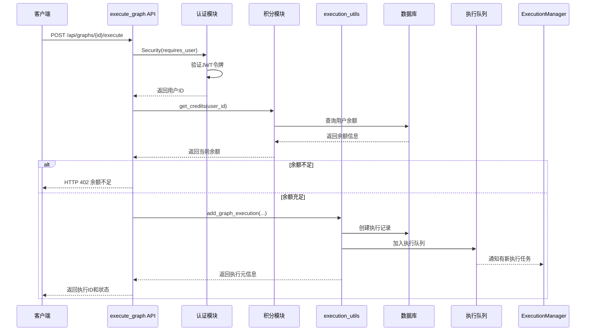

**图2-2: 图执行API调用时序图**
此时序图详细展示了图执行API的完整调用流程，包括认证验证、余额检查、执行创建和队列通知等关键步骤。

**关键函数 - add_graph_execution 源码分析**:

```python
# 文件: autogpt_platform/backend/backend/util/execution.py
async def add_graph_execution(
    graph_id: str,
    user_id: str,
    inputs: dict[str, Any],
    preset_id: Optional[str] = None,
    graph_version: Optional[int] = None,
    graph_credentials_inputs: Optional[dict[str, CredentialsMetaInput]] = None,
) -> execution_db.GraphExecutionMeta:
    """
    创建并启动图执行的核心函数
    
    功能说明:
    1. 验证图的存在性和用户权限
    2. 处理预设配置的合并
    3. 验证图结构和输入数据
    4. 创建执行记录并加入队列
    5. 发送实时通知
    
    参数说明:
    - graph_id: 图ID
    - user_id: 用户ID
    - inputs: 输入数据字典
    - preset_id: 预设ID，用于加载预定义配置
    - graph_version: 图版本，默认使用最新版本
    - graph_credentials_inputs: 凭据输入配置
    
    返回值:
    - GraphExecutionMeta: 执行元信息对象
    
    异常:
    - ValueError: 图不存在或用户无权限时抛出
    - GraphValidationError: 图验证失败时抛出
    """
    
    # 第一步：获取图定义
    # 根据图ID和版本获取图的完整定义
    graph = await graph_db.get_graph(
        graph_id=graph_id,
        version=graph_version,
        user_id=user_id,  # 用于权限验证
    )
    
    if not graph:
        raise ValueError(f"Graph #{graph_id} not found or access denied.")

    # 第二步：处理预设配置
    # 如果指定了预设ID，则加载预设配置并合并到输入中
    if preset_id:
        preset = await preset_db.get_preset(preset_id, user_id)
        if not preset:
            raise ValueError(f"Preset #{preset_id} not found.")
        
        # 合并预设的输入数据
        merged_inputs = {**preset.inputs, **inputs}
        
        # 合并预设的凭据配置
        if preset.credentials:
            merged_credentials = {**preset.credentials, **(graph_credentials_inputs or {})}
            graph_credentials_inputs = merged_credentials
        
        inputs = merged_inputs

    # 第三步：图验证
    # 验证图的结构完整性和输入数据的有效性
    try:
        validate_graph_structure(graph)
        validate_graph_inputs(graph, inputs)
    except Exception as e:
        raise GraphValidationError(
            message=f"Graph validation failed: {str(e)}",
            node_errors=getattr(e, 'node_errors', {})
        )

    # 第四步：创建执行记录
    # 在数据库中创建执行记录，状态为QUEUED
    graph_exec = await execution_db.create_graph_execution(
        graph_id=graph_id,
        graph_version=graph.version,
        user_id=user_id,
        inputs=inputs,
        credentials_inputs=graph_credentials_inputs or {},
        status=execution_db.ExecutionStatus.QUEUED,
    )

    # 第五步：加入执行队列
    # 创建执行队列条目并加入Redis队列
    execution_entry = GraphExecutionEntry(
        id=graph_exec.id,
        graph_id=graph_id,
        graph_version=graph.version,
        user_id=user_id,
        inputs=inputs,
        credentials_inputs=graph_credentials_inputs or {},
        created_at=datetime.utcnow(),
    )
    
    # 将执行条目加入Redis队列，ExecutionManager会从队列中取出并执行
    execution_queue = get_execution_queue()
    await execution_queue.put(execution_entry)
    
    logger.info(f"Graph execution {graph_exec.id} queued for user {user_id}")

    # 第六步：发送实时通知
    # 通过WebSocket向前端发送执行开始的通知
    await send_execution_update(
        user_id=user_id,
        graph_exec_id=graph_exec.id,
        status="queued",
        message="Execution queued successfully"
    )

    return graph_exec
```

#### 2.2.2 图执行停止API

**端点**: `POST /api/graphs/{graph_id}/executions/{graph_exec_id}/stop`

**功能**: 停止正在执行的工作流

**入口函数源码分析**:

```python
@v1_router.post(
    path="/graphs/{graph_id}/executions/{graph_exec_id}/stop",
    summary="Stop graph execution",
    tags=["graphs"],
    dependencies=[Security(requires_user)],
)
async def stop_graph_run(
    graph_id: str,  # 图ID
    graph_exec_id: str,  # 执行ID
    user_id: Annotated[str, Security(get_user_id)]  # 用户ID
) -> execution_db.GraphExecutionMeta | None:
    """
    停止图执行的API端点
    
    功能说明:
    1. 验证用户权限
    2. 查找正在执行的图实例
    3. 发送停止信号
    4. 更新执行状态
    
    参数说明:
    - graph_id: 图的唯一标识符
    - graph_exec_id: 执行实例的唯一标识符
    - user_id: 请求用户的ID，用于权限验证
    
    返回值:
    - GraphExecutionMeta | None: 停止的执行信息，如果未找到则返回None
    """
    
    # 调用内部停止函数
    res = await _stop_graph_run(
        user_id=user_id,
        graph_id=graph_id,
        graph_exec_id=graph_exec_id,
    )
    
    # 如果没有找到可停止的执行，返回None
    if not res:
        return None
    
    # 返回第一个停止的执行信息
    return res[0]

async def _stop_graph_run(
    user_id: str,
    graph_id: Optional[str] = None,
    graph_exec_id: Optional[str] = None,
) -> list[execution_db.GraphExecutionMeta]:
    """
    内部停止图执行的实现函数
    
    功能说明:
    1. 查询符合条件的正在执行的图实例
    2. 批量发送停止信号
    3. 等待所有停止操作完成
    
    参数说明:
    - user_id: 用户ID，确保只能停止自己的执行
    - graph_id: 可选的图ID，用于过滤特定图的执行
    - graph_exec_id: 可选的执行ID，用于停止特定执行
    
    返回值:
    - list[GraphExecutionMeta]: 被停止的执行列表
    """
    
    # 第一步：查询可停止的执行
    # 只查询处于可停止状态的执行（排队中、运行中、未完成）
    graph_execs = await execution_db.get_graph_executions(
        user_id=user_id,
        graph_id=graph_id,
        graph_exec_id=graph_exec_id,
        statuses=[
            execution_db.ExecutionStatus.INCOMPLETE,  # 未完成
            execution_db.ExecutionStatus.QUEUED,     # 排队中
            execution_db.ExecutionStatus.RUNNING,    # 运行中
        ],
    )
    
    # 第二步：批量创建停止任务
    # 为每个找到的执行创建停止任务
    stopped_execs = [
        execution_utils.stop_graph_execution(
            graph_exec_id=exec.id, 
            user_id=user_id
        )
        for exec in graph_execs
    ]
    
    # 第三步：并发执行所有停止操作
    # 使用asyncio.gather并发执行，提高效率
    await asyncio.gather(*stopped_execs)
    
    return graph_execs
```

### 2.3 完整API端点列表

#### 2.3.1 图管理API

| 端点 | 方法 | 功能 | 认证要求 |
|------|------|------|----------|
| `/api/graphs` | GET | 获取用户的图列表 | JWT |
| `/api/graphs` | POST | 创建新图 | JWT |
| `/api/graphs/{graph_id}` | GET | 获取图详情 | JWT |
| `/api/graphs/{graph_id}` | PUT | 更新图 | JWT |
| `/api/graphs/{graph_id}` | DELETE | 删除图 | JWT |
| `/api/graphs/{graph_id}/versions` | GET | 获取图版本列表 | JWT |
| `/api/graphs/{graph_id}/versions/active` | PUT | 设置活跃版本 | JWT |

#### 2.3.2 执行管理API

| 端点 | 方法 | 功能 | 认证要求 |
|------|------|------|----------|
| `/api/graphs/{graph_id}/execute/{version}` | POST | 执行图 | JWT |
| `/api/graphs/{graph_id}/executions/{exec_id}/stop` | POST | 停止执行 | JWT |
| `/api/executions` | GET | 获取执行列表 | JWT |
| `/api/executions/{exec_id}` | GET | 获取执行详情 | JWT |
| `/api/executions/{exec_id}/results` | GET | 获取执行结果 | JWT |

#### 2.3.3 Block管理API

| 端点 | 方法 | 功能 | 认证要求 |
|------|------|------|----------|
| `/api/blocks` | GET | 获取可用Block列表 | JWT |
| `/api/blocks/{block_id}` | GET | 获取Block详情 | JWT |
| `/api/blocks/{block_id}/execute` | POST | 执行单个Block | JWT |

#### 2.3.4 用户管理API

| 端点 | 方法 | 功能 | 认证要求 |
|------|------|------|----------|
| `/api/user` | GET | 获取用户信息 | JWT |
| `/api/user` | PUT | 更新用户信息 | JWT |
| `/api/user/credits` | GET | 获取用户积分 | JWT |
| `/api/user/api-keys` | GET | 获取API密钥列表 | JWT |
| `/api/user/api-keys` | POST | 创建API密钥 | JWT |

## 3. 整体架构分析

### 3.1 系统架构概览

AutoGPT平台采用现代化的微服务架构，具有高可扩展性、高可用性和高性能的特点。

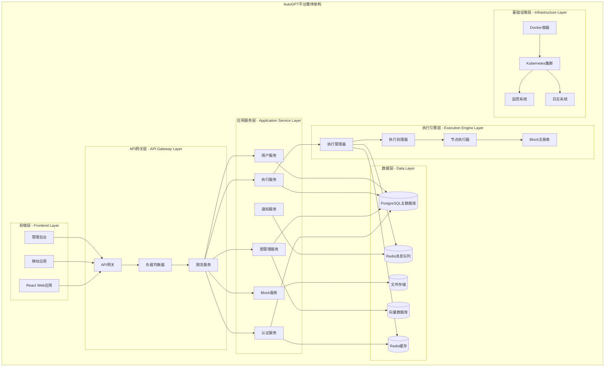

**图3-1: AutoGPT平台整体架构图**
此图展示了AutoGPT平台的完整架构，从前端用户界面到底层基础设施的各个层次。每一层都有明确的职责分工，通过标准化的接口进行交互。

### 3.2 核心模块交互图

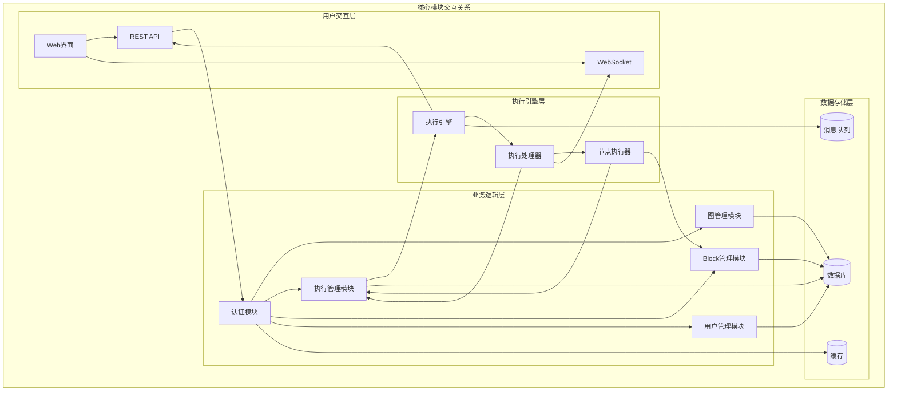

**图3-2: 核心模块交互图**
此图展示了AutoGPT平台各核心模块之间的交互关系，包括数据流向和控制流向。

### 3.3 数据流架构

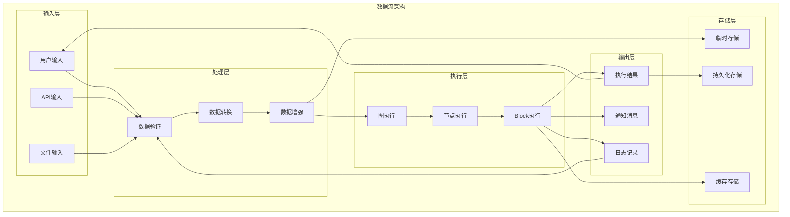

**图3-3: 数据流架构图**
此图展示了数据在AutoGPT平台中的完整流转过程，从输入到输出的各个处理阶段。

## 4. 模块深度剖析

### 4.1 执行引擎模块

执行引擎是AutoGPT平台的核心，负责工作流的调度和执行。

#### 4.1.1 执行引擎架构

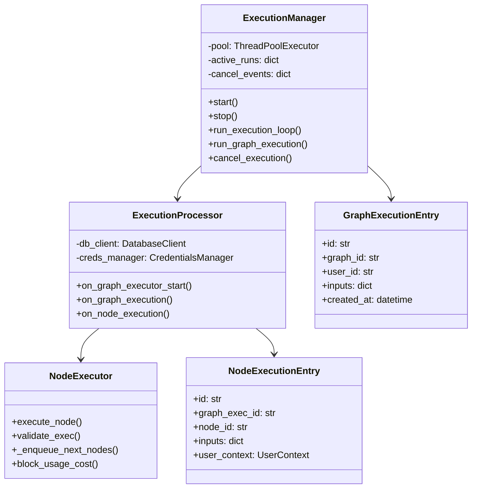

**图4-1: 执行引擎类图**
此图展示了执行引擎的主要类及其关系，包括执行管理器、执行处理器和节点执行器。

#### 4.1.2 执行流程时序图

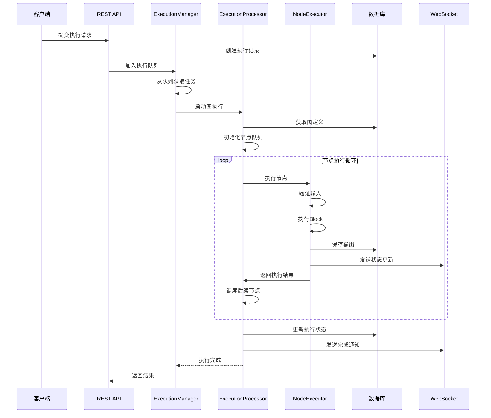

**图4-2: 执行流程时序图**
此图详细展示了从客户端提交执行请求到完成执行的整个时序流程。

### 4.2 Block系统模块

Block系统是AutoGPT平台的功能单元，提供各种AI和工具功能。

#### 4.2.1 Block架构设计

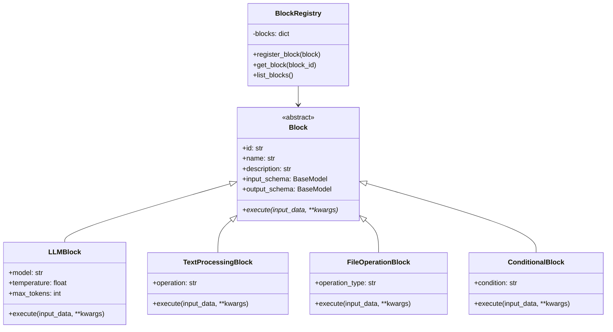

**图4-3: Block系统类图**
此图展示了Block系统的继承关系和注册机制。

### 4.3 认证授权模块

认证授权模块确保平台的安全性，支持多种认证方式。

#### 4.3.1 认证流程图

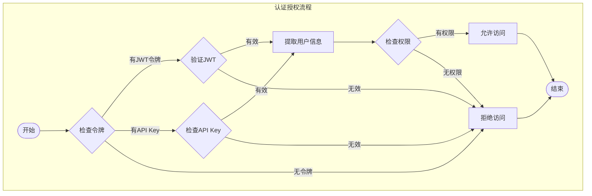

**图4-4: 认证授权流程图**
此图展示了完整的认证授权决策流程。

## 5. 数据结构设计

### 5.1 核心数据模型UML图

```mermaid
classDiagram
    class User {
        +id: str
        +email: str
        +name: str
        +role: str
        +created_at: datetime
        +last_login: datetime
        +timezone: str
        +credits: int
    }
    
    class Graph {
        +id: str
        +name: str
        +description: str
        +user_id: str
        +version: int
        +is_active: bool
        +created_at: datetime
        +updated_at: datetime
        +nodes: List[Node]
        +links: List[Link]
    }
    
    class Node {
        +id: str
        +graph_id: str
        +block_id: str
        +input_default: dict
        +metadata: dict
        +position: Position
    }
    
    class Link {
        +id: str
        +graph_id: str
        +source_id: str
        +sink_id: str
        +source_name: str
        +sink_name: str
    }
    
    class GraphExecution {
        +id: str
        +graph_id: str
        +user_id: str
        +status: ExecutionStatus
        +inputs: dict
        +outputs: dict
        +started_at: datetime
        +ended_at: datetime
        +error_message: str
    }
    
    class NodeExecution {
        +id: str
        +graph_execution_id: str
        +node_id: str
        +status: ExecutionStatus
        +inputs: dict
        +outputs: dict
        +started_at: datetime
        +ended_at: datetime
        +execution_time: float
    }
    
    class Block {
        +id: str
        +name: str
        +description: str
        +category: str
        +input_schema: dict
        +output_schema: dict
        +costs: List[BlockCost]
    }
    
    class APIKey {
        +id: str
        +user_id: str
        +name: str
        +key_hash: str
        +permissions: List[str]
        +is_active: bool
        +created_at: datetime
        +last_used: datetime
    }
    
    User ||--o{ Graph : owns
    User ||--o{ GraphExecution : executes
    User ||--o{ APIKey : has
    Graph ||--o{ Node : contains
    Graph ||--o{ Link : contains
    Graph ||--o{ GraphExecution : executed_as
    GraphExecution ||--o{ NodeExecution : contains
    Node ||--o{ NodeExecution : executed_as
    Block ||--o{ Node : instantiated_as
```

**图5-1: 核心数据模型UML图**
此图展示了AutoGPT平台的核心数据模型及其关系，包括用户、图、执行、Block等主要实体。

### 5.2 执行状态模型

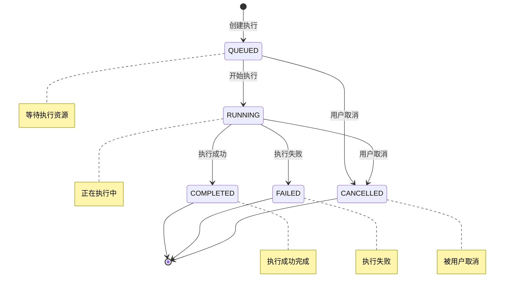

**图5-2: 执行状态转换图**
此图展示了图执行和节点执行的状态转换关系。

## 6. 最佳实践指南

### 6.1 性能优化最佳实践

#### 6.1.1 图设计优化

```python
class GraphOptimizer:
    """图优化器 - 提供图结构优化建议和自动优化功能"""
    
    @staticmethod
    def analyze_graph_performance(graph: Graph) -> Dict[str, Any]:
        """
        分析图的性能特征
        
        Args:
            graph: 要分析的图对象
            
        Returns:
            包含性能分析结果的字典
        """
        analysis = {
            "node_count": len(graph.nodes),
            "link_count": len(graph.links),
            "max_depth": GraphOptimizer._calculate_max_depth(graph),
            "parallel_branches": GraphOptimizer._count_parallel_branches(graph),
            "bottlenecks": GraphOptimizer._identify_bottlenecks(graph),
            "optimization_suggestions": []
        }
        
        # 生成优化建议
        if analysis["node_count"] > 50:
            analysis["optimization_suggestions"].append(
                "考虑将大图拆分为多个子图以提高可维护性"
            )
        
        if analysis["max_depth"] > 10:
            analysis["optimization_suggestions"].append(
                "图的深度过深，考虑增加并行分支来减少执行时间"
            )
        
        if len(analysis["bottlenecks"]) > 0:
            analysis["optimization_suggestions"].append(
                f"发现性能瓶颈节点: {', '.join(analysis['bottlenecks'])}"
            )
        
        return analysis
    
    @staticmethod
    def _calculate_max_depth(graph: Graph) -> int:
        """计算图的最大深度"""
        # 构建邻接表
        adjacency = defaultdict(list)
        for link in graph.links:
            adjacency[link.source_id].append(link.sink_id)
        
        # 找到入口节点（没有输入的节点）
        all_nodes = {node.id for node in graph.nodes}
        sink_nodes = {link.sink_id for link in graph.links}
        entry_nodes = all_nodes - sink_nodes
        
        # DFS计算最大深度
        max_depth = 0
        visited = set()
        
        def dfs(node_id: str, depth: int):
            nonlocal max_depth
            if node_id in visited:
                return
            
            visited.add(node_id)
            max_depth = max(max_depth, depth)
            
            for next_node in adjacency[node_id]:
                dfs(next_node, depth + 1)
        
        for entry_node in entry_nodes:
            dfs(entry_node, 1)
        
        return max_depth
```

#### 6.1.2 执行优化策略

```python
class ExecutionOptimizer:
    """执行优化器 - 提供执行性能优化策略"""
    
    @staticmethod
    def optimize_node_scheduling(nodes: List[Node]) -> List[List[Node]]:
        """
        优化节点调度，将可并行执行的节点分组
        
        Args:
            nodes: 节点列表
            
        Returns:
            按执行批次分组的节点列表
        """
        # 构建依赖关系图
        dependencies = ExecutionOptimizer._build_dependency_graph(nodes)
        
        # 拓扑排序确定执行顺序
        execution_batches = []
        remaining_nodes = set(node.id for node in nodes)
        
        while remaining_nodes:
            # 找到当前可执行的节点（没有未满足的依赖）
            ready_nodes = []
            for node_id in remaining_nodes:
                if not dependencies[node_id] or dependencies[node_id].isdisjoint(remaining_nodes):
                    ready_nodes.append(node_id)
            
            if not ready_nodes:
                # 检测到循环依赖
                raise ValueError("Circular dependency detected in graph")
            
            # 将就绪的节点加入当前批次
            batch_nodes = [node for node in nodes if node.id in ready_nodes]
            execution_batches.append(batch_nodes)
            
            # 从剩余节点中移除已调度的节点
            remaining_nodes -= set(ready_nodes)
        
        return execution_batches
    
    @staticmethod
    def estimate_execution_cost(graph: Graph, inputs: dict) -> Dict[str, float]:
        """
        估算图执行成本
        
        Args:
            graph: 要执行的图
            inputs: 输入数据
            
        Returns:
            包含成本估算的字典
        """
        cost_estimation = {
            "total_credits": 0.0,
            "estimated_time": 0.0,
            "node_costs": {},
            "critical_path_time": 0.0
        }
        
        for node in graph.nodes:
            block = get_block(node.block_id)
            if block:
                # 估算节点成本
                node_cost = ExecutionOptimizer._estimate_node_cost(block, node.input_default)
                node_time = ExecutionOptimizer._estimate_node_time(block, node.input_default)
                
                cost_estimation["node_costs"][node.id] = {
                    "credits": node_cost,
                    "time": node_time
                }
                cost_estimation["total_credits"] += node_cost
        
        # 计算关键路径时间
        cost_estimation["critical_path_time"] = ExecutionOptimizer._calculate_critical_path_time(
            graph, cost_estimation["node_costs"]
        )
        
        return cost_estimation
```

### 6.2 错误处理最佳实践

#### 6.2.1 分级错误处理

```python
from enum import Enum
from typing import Optional, Dict, Any

class ErrorSeverity(Enum):
    """错误严重程度枚举"""
    LOW = "low"           # 轻微错误，不影响主流程
    MEDIUM = "medium"     # 中等错误，影响部分功能
    HIGH = "high"         # 严重错误，影响主要功能
    CRITICAL = "critical" # 致命错误，系统无法继续运行

class ErrorCategory(Enum):
    """错误类别枚举"""
    VALIDATION = "validation"     # 数据验证错误
    AUTHENTICATION = "auth"       # 认证授权错误
    RESOURCE = "resource"         # 资源不足错误
    NETWORK = "network"           # 网络连接错误
    SYSTEM = "system"             # 系统内部错误
    BUSINESS = "business"         # 业务逻辑错误

class AutoGPTError(Exception):
    """AutoGPT平台基础异常类"""
    
    def __init__(
        self,
        message: str,
        error_code: str,
        severity: ErrorSeverity = ErrorSeverity.MEDIUM,
        category: ErrorCategory = ErrorCategory.SYSTEM,
        details: Optional[Dict[str, Any]] = None,
        user_message: Optional[str] = None
    ):
        """
        初始化异常
        
        Args:
            message: 详细错误信息（用于日志）
            error_code: 错误代码（用于程序处理）
            severity: 错误严重程度
            category: 错误类别
            details: 错误详细信息
            user_message: 用户友好的错误信息
        """
        super().__init__(message)
        self.message = message
        self.error_code = error_code
        self.severity = severity
        self.category = category
        self.details = details or {}
        self.user_message = user_message or message
        self.timestamp = datetime.utcnow()
    
    def to_dict(self) -> Dict[str, Any]:
        """转换为字典格式，用于API响应"""
        return {
            "error_code": self.error_code,
            "message": self.user_message,
            "severity": self.severity.value,
            "category": self.category.value,
            "details": self.details,
            "timestamp": self.timestamp.isoformat()
        }

class GraphValidationError(AutoGPTError):
    """图验证错误"""
    
    def __init__(self, message: str, node_errors: Dict[str, str] = None):
        super().__init__(
            message=message,
            error_code="GRAPH_VALIDATION_ERROR",
            severity=ErrorSeverity.HIGH,
            category=ErrorCategory.VALIDATION,
            details={"node_errors": node_errors or {}},
            user_message="工作流配置存在错误，请检查节点设置"
        )

class InsufficientCreditsError(AutoGPTError):
    """积分不足错误"""
    
    def __init__(self, required_credits: float, available_credits: float):
        super().__init__(
            message=f"Insufficient credits: required {required_credits}, available {available_credits}",
            error_code="INSUFFICIENT_CREDITS",
            severity=ErrorSeverity.HIGH,
            category=ErrorCategory.RESOURCE,
            details={
                "required_credits": required_credits,
                "available_credits": available_credits
            },
            user_message="账户余额不足，请充值后重试"
        )

class ErrorHandler:
    """统一错误处理器"""
    
    @staticmethod
    def handle_api_error(error: Exception, request_context: Dict[str, Any]) -> Dict[str, Any]:
        """
        处理API错误并返回标准化响应
        
        Args:
            error: 发生的异常
            request_context: 请求上下文信息
            
        Returns:
            标准化的错误响应
        """
        if isinstance(error, AutoGPTError):
            # 处理已知的业务异常
            ErrorHandler._log_error(error, request_context)
            return {
                "success": False,
                "error": error.to_dict()
            }
        
        elif isinstance(error, httpx.HTTPStatusError):
            # 处理HTTP错误
            autogpt_error = ErrorHandler._convert_http_error(error)
            ErrorHandler._log_error(autogpt_error, request_context)
            return {
                "success": False,
                "error": autogpt_error.to_dict()
            }
        
        else:
            # 处理未知异常
            system_error = AutoGPTError(
                message=str(error),
                error_code="SYSTEM_ERROR",
                severity=ErrorSeverity.CRITICAL,
                category=ErrorCategory.SYSTEM,
                user_message="系统内部错误，请稍后重试"
            )
            ErrorHandler._log_error(system_error, request_context)
            return {
                "success": False,
                "error": system_error.to_dict()
            }
    
    @staticmethod
    def _log_error(error: AutoGPTError, context: Dict[str, Any]):
        """记录错误日志"""
        log_data = {
            "error_code": error.error_code,
            "severity": error.severity.value,
            "category": error.category.value,
            "message": error.message,
            "details": error.details,
            "context": context
        }
        
        if error.severity in [ErrorSeverity.HIGH, ErrorSeverity.CRITICAL]:
            logger.error("AutoGPT Error", extra=log_data)
        else:
            logger.warning("AutoGPT Warning", extra=log_data)
```

### 6.3 监控和可观测性最佳实践

#### 6.3.1 指标收集

```python
from prometheus_client import Counter, Histogram, Gauge, CollectorRegistry
import time
from functools import wraps

class MetricsCollector:
    """指标收集器"""
    
    def __init__(self):
        self.registry = CollectorRegistry()
        
        # 执行相关指标
        self.graph_executions_total = Counter(
            'autogpt_graph_executions_total',
            'Total number of graph executions',
            ['status', 'user_id', 'graph_id'],
            registry=self.registry
        )
        
        self.graph_execution_duration = Histogram(
            'autogpt_graph_execution_duration_seconds',
            'Graph execution duration in seconds',
            ['graph_id', 'status'],
            registry=self.registry
        )
        
        self.active_executions = Gauge(
            'autogpt_active_executions',
            'Number of currently active executions',
            registry=self.registry
        )
        
        # Block执行指标
        self.block_executions_total = Counter(
            'autogpt_block_executions_total',
            'Total number of block executions',
            ['block_type', 'status'],
            registry=self.registry
        )
        
        self.block_execution_duration = Histogram(
            'autogpt_block_execution_duration_seconds',
            'Block execution duration in seconds',
            ['block_type'],
            registry=self.registry
        )
        
        # API相关指标
        self.api_requests_total = Counter(
            'autogpt_api_requests_total',
            'Total number of API requests',
            ['method', 'endpoint', 'status_code'],
            registry=self.registry
        )
        
        self.api_request_duration = Histogram(
            'autogpt_api_request_duration_seconds',
            'API request duration in seconds',
            ['method', 'endpoint'],
            registry=self.registry
        )
    
    def record_graph_execution(self, graph_id: str, user_id: str, status: str, duration: float = None):
        """记录图执行指标"""
        self.graph_executions_total.labels(
            status=status,
            user_id=user_id,
            graph_id=graph_id
        ).inc()
        
        if duration is not None:
            self.graph_execution_duration.labels(
                graph_id=graph_id,
                status=status
            ).observe(duration)
    
    def record_block_execution(self, block_type: str, status: str, duration: float):
        """记录Block执行指标"""
        self.block_executions_total.labels(
            block_type=block_type,
            status=status
        ).inc()
        
        self.block_execution_duration.labels(
            block_type=block_type
        ).observe(duration)
    
    def record_api_request(self, method: str, endpoint: str, status_code: int, duration: float):
        """记录API请求指标"""
        self.api_requests_total.labels(
            method=method,
            endpoint=endpoint,
            status_code=status_code
        ).inc()
        
        self.api_request_duration.labels(
            method=method,
            endpoint=endpoint
        ).observe(duration)

# 全局指标收集器实例
metrics_collector = MetricsCollector()

def monitor_execution_time(metric_name: str = None):
    """执行时间监控装饰器"""
    def decorator(func):
        @wraps(func)
        async def async_wrapper(*args, **kwargs):
            start_time = time.time()
            try:
                result = await func(*args, **kwargs)
                duration = time.time() - start_time
                
                # 记录成功执行
                if metric_name:
                    getattr(metrics_collector, metric_name).observe(duration)
                
                return result
            except Exception as e:
                duration = time.time() - start_time
                
                # 记录失败执行
                if metric_name:
                    getattr(metrics_collector, metric_name).observe(duration)
                
                raise
        
        @wraps(func)
        def sync_wrapper(*args, **kwargs):
            start_time = time.time()
            try:
                result = func(*args, **kwargs)
                duration = time.time() - start_time
                
                if metric_name:
                    getattr(metrics_collector, metric_name).observe(duration)
                
                return result
            except Exception as e:
                duration = time.time() - start_time
                
                if metric_name:
                    getattr(metrics_collector, metric_name).observe(duration)
                
                raise
        
        return async_wrapper if asyncio.iscoroutinefunction(func) else sync_wrapper
    
    return decorator
```

### 6.4 安全最佳实践

#### 6.4.1 输入验证和清理

```python
import re
from typing import Any, Dict, List
from pydantic import BaseModel, validator
import bleach

class InputSanitizer:
    """输入数据清理器"""
    
    # 允许的HTML标签（用于富文本内容）
    ALLOWED_HTML_TAGS = [
        'p', 'br', 'strong', 'em', 'u', 'ol', 'ul', 'li',
        'h1', 'h2', 'h3', 'h4', 'h5', 'h6', 'blockquote'
    ]
    
    # 允许的HTML属性
    ALLOWED_HTML_ATTRIBUTES = {
        '*': ['class'],
        'a': ['href', 'title'],
        'img': ['src', 'alt', 'width', 'height']
    }
    
    @staticmethod
    def sanitize_html(html_content: str) -> str:
        """清理HTML内容，移除潜在的XSS攻击代码"""
        if not html_content:
            return ""
        
        return bleach.clean(
            html_content,
            tags=InputSanitizer.ALLOWED_HTML_TAGS,
            attributes=InputSanitizer.ALLOWED_HTML_ATTRIBUTES,
            strip=True
        )
    
    @staticmethod
    def sanitize_filename(filename: str) -> str:
        """清理文件名，移除危险字符"""
        if not filename:
            return ""
        
        # 移除路径遍历字符
        filename = filename.replace('..', '').replace('/', '').replace('\\', '')
        
        # 只保留字母、数字、点、下划线和连字符
        filename = re.sub(r'[^\w\-_\.]', '', filename)
        
        # 限制长度
        return filename[:255]
    
    @staticmethod
    def validate_json_structure(data: Any, max_depth: int = 10, max_keys: int = 1000) -> bool:
        """验证JSON结构，防止过深嵌套和过多键值对"""
        
        def count_items(obj, current_depth=0):
            if current_depth > max_depth:
                raise ValueError("JSON structure too deep")
            
            item_count = 0
            
            if isinstance(obj, dict):
                item_count += len(obj)
                if item_count > max_keys:
                    raise ValueError("Too many keys in JSON")
                
                for value in obj.values():
                    item_count += count_items(value, current_depth + 1)
            
            elif isinstance(obj, list):
                item_count += len(obj)
                if item_count > max_keys:
                    raise ValueError("Too many items in JSON")
                
                for item in obj:
                    item_count += count_items(item, current_depth + 1)
            
            return item_count
        
        try:
            count_items(data)
            return True
        except ValueError:
            return False

class SecureGraphInput(BaseModel):
    """安全的图输入数据模型"""
    
    name: str
    description: str = ""
    inputs: Dict[str, Any]
    
    @validator('name')
    def validate_name(cls, v):
        """验证图名称"""
        if not v or len(v.strip()) == 0:
            raise ValueError("Graph name cannot be empty")
        
        if len(v) > 100:
            raise ValueError("Graph name too long")
        
        # 移除HTML标签
        clean_name = InputSanitizer.sanitize_html(v)
        return clean_name.strip()
    
    @validator('description')
    def validate_description(cls, v):
        """验证图描述"""
        if len(v) > 1000:
            raise ValueError("Description too long")
        
        return InputSanitizer.sanitize_html(v)
    
    @validator('inputs')
    def validate_inputs(cls, v):
        """验证输入数据"""
        if not InputSanitizer.validate_json_structure(v):
            raise ValueError("Invalid input structure")
        
        return v

class RateLimitManager:
    """速率限制管理器"""
    
    def __init__(self, redis_client):
        self.redis = redis_client
    
    async def check_rate_limit(
        self,
        key: str,
        limit: int,
        window: int = 3600,
        identifier: str = "default"
    ) -> Dict[str, Any]:
        """
        检查速率限制
        
        Args:
            key: 限制键（如用户ID、IP地址）
            limit: 限制次数
            window: 时间窗口（秒）
            identifier: 限制标识符
            
        Returns:
            包含限制状态的字典
        """
        rate_key = f"rate_limit:{identifier}:{key}"
        current_time = int(time.time())
        window_start = current_time - window
        
        # 使用Redis pipeline提高性能
        pipe = self.redis.pipeline()
        
        # 移除过期的记录
        pipe.zremrangebyscore(rate_key, 0, window_start)
        
        # 添加当前请求
        pipe.zadd(rate_key, {str(current_time): current_time})
        
        # 获取当前窗口内的请求数
        pipe.zcount(rate_key, window_start, current_time)
        
        # 设置键的过期时间
        pipe.expire(rate_key, window)
        
        results = await pipe.execute()
        current_requests = results[2]
        
        is_allowed = current_requests <= limit
        remaining = max(0, limit - current_requests)
        
        return {
            "allowed": is_allowed,
            "limit": limit,
            "remaining": remaining,
            "reset_time": current_time + window,
            "current_requests": current_requests
        }
```

这个完整的框架使用手册涵盖了AutoGPT平台的各个方面，从基础使用到高级特性，从API详解到最佳实践。开发者可以根据这个手册逐步掌握AutoGPT平台的使用和开发技巧。

<function_calls>
<invoke name="todo_write">
<parameter name="merge">true
