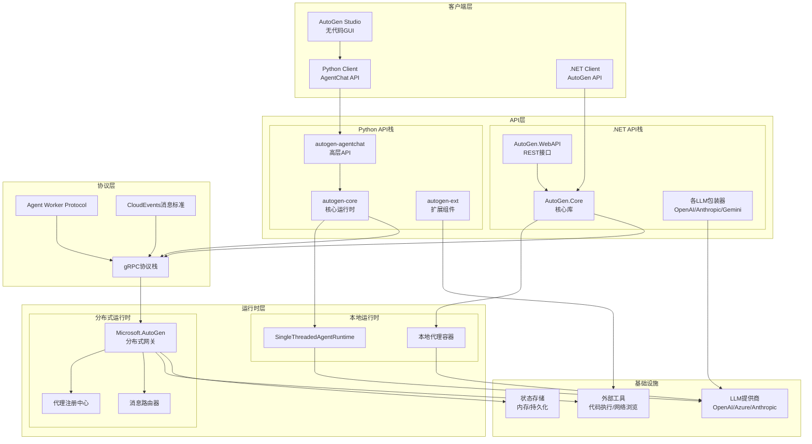
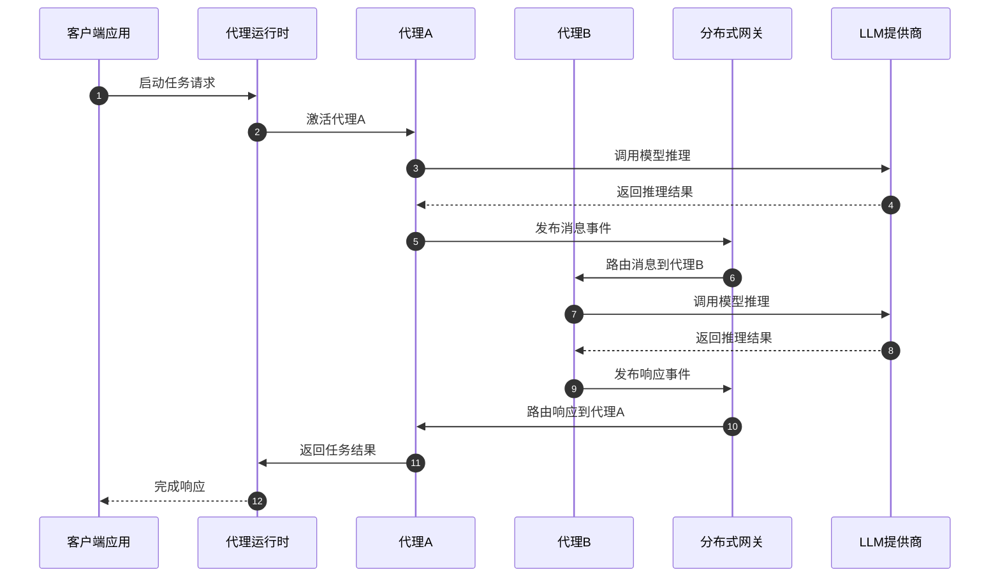

# AutoGen-00-总览

## 0. 摘要

### 项目目标
AutoGen是Microsoft开发的多代理AI应用框架，旨在简化大语言模型(LLM)工作流的编排、优化和自动化。框架通过可定制的对话代理，利用先进LLM（如GPT-4）的强大能力，同时通过多代理协作、工具集成和人机协作来弥补单一模型的局限性。

### 核心能力边界
- **多代理系统构建**：支持定义具有专门能力和角色的代理集合
- **对话式交互**：基于消息传递的代理间通信机制
- **分布式部署**：支持本地单机到云端分布式的无缝迁移
- **跨语言支持**：提供Python和.NET两套完整实现
- **事件驱动架构**：基于Actor模型的异步消息处理

### 非目标
- 不是单一的LLM推理服务
- 不提供模型训练能力
- 不是通用的分布式计算框架

### 运行环境
- **Python实现**：Python 3.10+ (推荐3.11+)，基于asyncio异步运行时
- **.NET实现**：.NET 8.0+，支持跨平台部署
- **依赖**：gRPC（跨语言通信）、Protobuf（消息序列化）、各LLM提供商SDK

### 部署形态
- **本地开发**：单进程多线程/协程模式
- **分布式生产**：基于gRPC的微服务架构
- **混合部署**：支持Python和.NET代理混合部署
- **容器化**：支持Docker容器部署

## 1. 整体架构图



### 架构要点说明

**分层职责**：
- **客户端层**：提供用户交互界面，包括编程API和可视化工具
- **API层**：分为高层封装（AgentChat/AutoGen）和底层核心（Core），支持不同抽象级别的开发需求
- **运行时层**：支持本地单机和分布式两种部署模式，运行时可热切换
- **协议层**：统一的gRPC通信协议，确保跨语言、跨进程的互操作性

**数据流与控制流**：
- **同步调用**：客户端API → 运行时 → LLM提供商（请求-响应模式）
- **异步消息**：代理间通过事件总线进行松耦合通信
- **状态管理**：代理状态可选择本地内存或分布式存储

**扩展性设计**：
- **水平扩展**：通过分布式网关支持代理实例的动态伸缩
- **垂直扩展**：插件式的LLM提供商和工具扩展

## 2. 全局时序图



### 时序图要点说明

**入口与鉴权**：
- 所有外部请求通过Runtime统一入口，支持认证和授权
- 代理激活采用延迟加载策略，按需实例化

**消息幂等性**：
- 每个消息都有唯一ID，支持重复投递的幂等处理
- 状态变更采用事件溯源模式，确保一致性

**回退策略**：
- LLM调用失败时支持多层重试机制（指数退避）
- 网络分区时支持本地缓存和降级服务
- 代理异常时支持故障转移和状态恢复

**重试点与超时**：
- LLM调用：默认30秒超时，3次重试
- 代理间通信：默认10秒超时，2次重试
- 分布式消息：可配置超时和重试策略

**资源上界**：
- 单个代理最大并发请求数：100
- 消息队列深度限制：10000条
- 内存使用上限：可通过配置控制

## 3. 模块边界与交互图

### 核心模块列表

| 模块名称 | 语言 | 职责 | 对外API | 上游依赖 | 下游调用方 |
|---------|------|------|---------|----------|-----------|
| autogen-core | Python | 核心运行时、消息传递 | Agent, AgentRuntime | asyncio, grpc | autogen-agentchat |
| autogen-agentchat | Python | 高层代理封装、团队模式 | AssistantAgent, GroupChat | autogen-core | 客户端应用 |
| autogen-ext | Python | LLM客户端、工具扩展 | ModelClient, Tools | 各LLM SDK | autogen-agentchat |
| AutoGen.Core | .NET | 核心库、类型定义 | IAgent, AgentBase | .NET BCL | 其他.NET包 |
| Microsoft.AutoGen | .NET | 分布式服务网关 | AgentRpc, Gateway | gRPC, DI容器 | 分布式代理 |

### 模块交互类型

**同步调用**：
- 客户端 → AgentChat API：请求-响应模式
- AgentChat → Core：方法调用
- Core → LLM提供商：HTTP/SDK调用

**异步消息**：
- 代理A → 事件总线 → 代理B：发布-订阅模式
- 本地代理 → 分布式网关 → 远程代理：消息队列

**共享存储**：
- 代理状态持久化：可选内存/Redis/数据库
- 配置共享：环境变量/配置文件

**订阅发布**：
- 代理注册：类型订阅机制
- 事件通知：基于主题的消息路由

## 4. 关键设计与权衡

### 数据一致性

**强一致性场景**：
- 代理状态变更：采用事件溯源确保强一致性
- 分布式锁：关键资源访问使用分布式锁

**最终一致性场景**：
- 代理发现：注册信息允许短暂不一致
- 性能指标：监控数据采用最终一致性

**事务边界**：
- 单代理内操作：本地事务
- 跨代理操作：Saga模式或补偿事务

### 并发策略

**Python实现**：
- 基于asyncio的协作式并发
- 单线程事件循环 + 协程池
- I/O密集型操作的异步处理

**.NET实现**：
- Task-based异步模式
- ThreadPool + async/await
- CPU密集型操作的并行处理

**锁策略**：
- 细粒度锁：每个代理实例独立锁
- 读写锁：状态读取和写入分离
- 无锁设计：消息传递采用无锁队列

### 性能关键路径

**P95延迟要求**：
- 代理间消息传递：< 10ms（本地），< 100ms（跨网络）
- LLM调用端到端：< 5s（不包含模型推理时间）
- 状态持久化：< 50ms

**内存峰值控制**：
- 每个代理实例：< 100MB基础内存
- 消息缓冲区：可配置大小，默认10MB
- 连接池复用：HTTP/gRPC连接复用

**I/O热点优化**：
- LLM调用：连接池 + 并发限制
- 状态存储：批量写入 + 异步刷盘
- 网络通信：消息压缩 + 连接复用

### 可观测性指标

**业务指标**：
- 代理调用成功率、平均响应时间
- 消息处理吞吐量、队列深度
- LLM调用量和成本统计

**基础指标**：
- CPU/内存/网络使用率
- 协程/线程池状态
- GC频率和暂停时间

## 5. 关键配置项

### 运行时配置
- `AUTOGEN_RUNTIME_TYPE`: 运行时类型（local/distributed）
- `AUTOGEN_GRPC_PORT`: gRPC监听端口，默认50051
- `AUTOGEN_LOG_LEVEL`: 日志级别，默认INFO

### 性能调优
- `AUTOGEN_MAX_CONCURRENT_AGENTS`: 最大并发代理数，默认100
- `AUTOGEN_MESSAGE_QUEUE_SIZE`: 消息队列大小，默认10000
- `AUTOGEN_GRPC_MAX_CONNECTIONS`: gRPC最大连接数，默认100

### LLM集成
- `OPENAI_API_KEY`: OpenAI API密钥
- `AZURE_OPENAI_ENDPOINT`: Azure OpenAI端点
- `ANTHROPIC_API_KEY`: Anthropic API密钥

## 6. 典型使用示例与最佳实践

### 示例1：最小可运行入口

```python
import asyncio
from autogen_agentchat.agents import AssistantAgent
from autogen_ext.models.openai import OpenAIChatCompletionClient

async def minimal_example():
    # 创建模型客户端
    model_client = OpenAIChatCompletionClient(model="gpt-4")
    
    # 创建助手代理
    agent = AssistantAgent("assistant", model_client=model_client)
    
    # 执行任务
    response = await agent.run(task="解释什么是多代理系统")
    print(response)
    
    await model_client.close()

# 运行示例
asyncio.run(minimal_example())
```

### 示例2：多代理协作

```python
async def multi_agent_example():
    model_client = OpenAIChatCompletionClient(model="gpt-4")
    
    # 创建专业代理
    researcher = AssistantAgent(
        "researcher",
        model_client=model_client,
        system_message="你是一名研究专家，负责信息收集和分析。"
    )
    
    writer = AssistantAgent(
        "writer", 
        model_client=model_client,
        system_message="你是一名技术写作专家，负责将研究结果整理成文档。"
    )
    
    # 创建团队
    from autogen_agentchat.teams import RoundRobinGroupChat
    team = RoundRobinGroupChat([researcher, writer])
    
    # 执行协作任务
    result = await team.run(
        task="研究AutoGen框架的核心特性，并写成技术文档"
    )
    
    return result
```

### 示例3：分布式部署配置

```python
# 服务端配置 - gateway.py
from microsoft_autogen import AgentRuntimeGateway

async def start_gateway():
    gateway = AgentRuntimeGateway(
        host="0.0.0.0",
        port=50051,
        registry_type="redis",  # 使用Redis作为注册中心
        registry_config={
            "host": "redis.example.com",
            "port": 6379
        }
    )
    await gateway.start()

# 客户端配置 - agent.py  
from autogen_core import AgentRuntime

async def start_distributed_agent():
    runtime = AgentRuntime(
        runtime_type="distributed",
        gateway_url="grpc://gateway.example.com:50051"
    )
    
    # 注册代理类型
    runtime.register_agent_type("research_agent", ResearchAgent)
    
    await runtime.start()
```

### 最佳实践清单

**开发阶段**：
1. 使用本地SingleThreadedAgentRuntime进行开发调试
2. 启用详细日志和性能追踪
3. 编写单元测试覆盖代理行为

**生产部署**：
1. 使用分布式运行时和外部注册中心
2. 配置监控指标和告警规则
3. 实施滚动部署和灰度发布
4. 配置适当的资源限制和自动缩放

**性能优化**：
1. 合理设置并发代理数量上限
2. 使用连接池复用LLM连接
3. 监控内存使用和垃圾回收频率
4. 实施熔断和限流机制

**安全考虑**：
1. 使用环境变量管理敏感配置（API密钥）
2. 启用gRPC TLS加密传输
3. 实施适当的认证和授权机制
4. 定期轮换API密钥和证书

