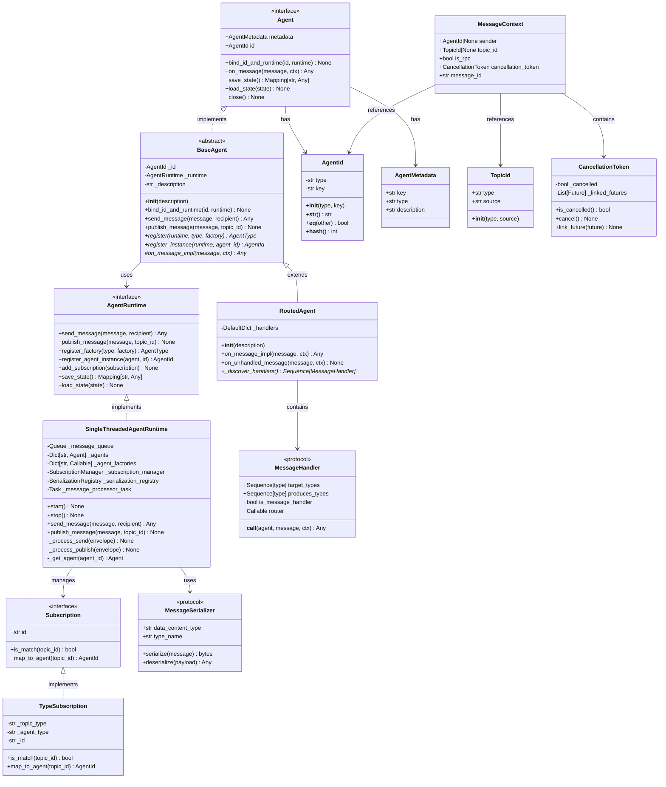
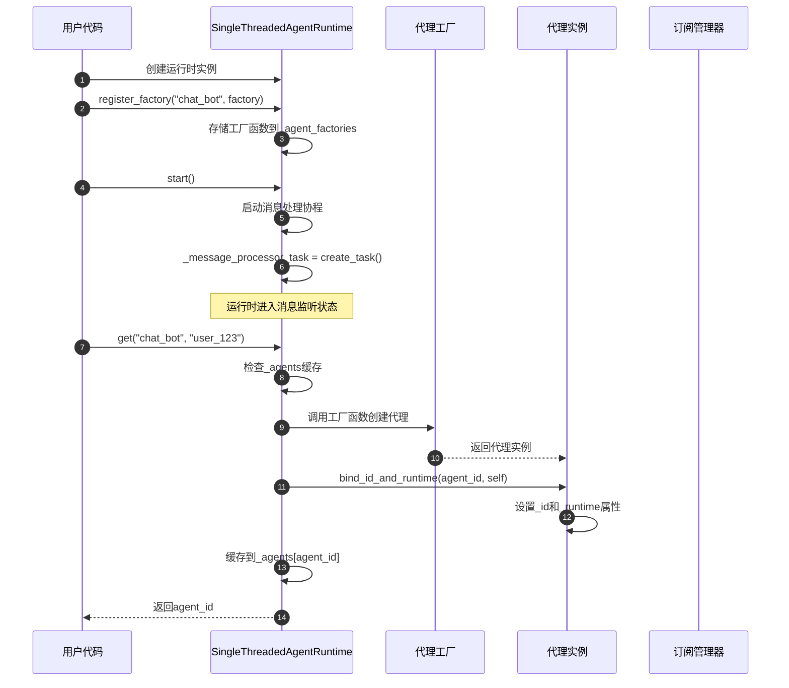
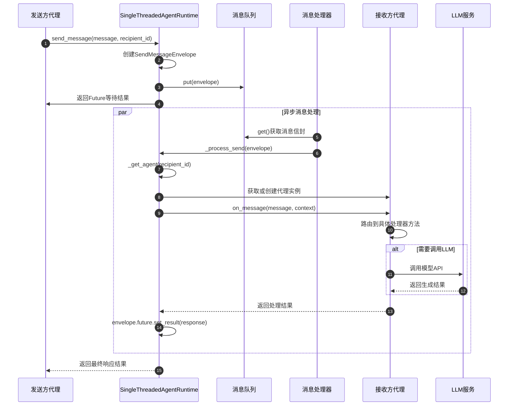
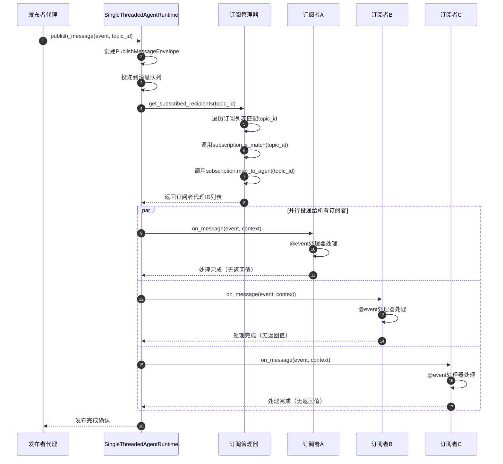
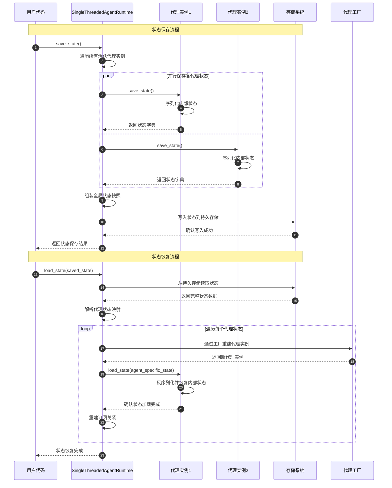
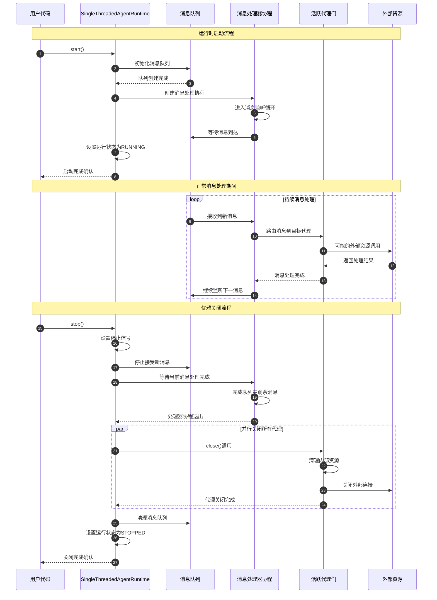

# AutoGen-01-PythonCore

## 模块职责

### 核心职责
autogen-core是AutoGen框架的底层核心模块，提供基于Actor模型的事件驱动代理系统基础设施。主要职责包括：

- **代理生命周期管理**：提供代理的创建、注册、销毁和状态管理
- **消息传递系统**：实现可靠的异步消息传递和发布-订阅机制  
- **运行时管理**：提供本地单线程和分布式运行时环境
- **序列化框架**：支持多种消息序列化格式（JSON、Protobuf）
- **订阅路由机制**：基于类型和主题的消息路由和订阅管理

### 输入与输出
- **输入**：用户定义的代理类、消息类型、订阅规则、运行时配置
- **输出**：运行中的代理实例、消息传递结果、代理状态快照

### 上下游依赖
- **上游依赖**：Python asyncio、gRPC、Protobuf、Pydantic
- **下游调用方**：autogen-agentchat、用户自定义代理、第三方扩展

### 生命周期
```
初始化 → 代理注册 → 运行时启动 → 消息处理 → 状态管理 → 优雅关闭
```

## 模块架构图

```mermaid
flowchart TB
    subgraph "用户代理层"
        UserAgent[用户自定义代理<br/>继承BaseAgent/RoutedAgent]
        CustomLogic[业务逻辑处理<br/>@event/@rpc装饰器]
    end
    
    subgraph "代理抽象层"
        Agent[Agent Protocol<br/>代理接口定义]
        BaseAgent[BaseAgent<br/>基础代理实现]
        RoutedAgent[RoutedAgent<br/>路由代理实现]
    end
    
    subgraph "运行时层"
        AgentRuntime[AgentRuntime Protocol<br/>运行时接口]
        STRuntime[SingleThreadedAgentRuntime<br/>单线程运行时]
        DistRuntime[DistributedAgentRuntime<br/>分布式运行时]
    end
    
    subgraph "消息处理层"
        MessageQueue[消息队列<br/>异步消息缓冲]
        MessageRouter[消息路由器<br/>基于类型的路由]
        MessageHandler[消息处理器<br/>装饰器注册]
    end
    
    subgraph "订阅管理层" 
        SubscriptionManager[订阅管理器<br/>订阅关系维护]
        TypeSubscription[类型订阅<br/>基于消息类型]
        TopicSubscription[主题订阅<br/>基于主题ID]
    end
    
    subgraph "序列化层"
        SerializationRegistry[序列化注册表<br/>格式映射管理]
        JSONSerializer[JSON序列化器<br/>默认格式]
        ProtobufSerializer[Protobuf序列化器<br/>跨语言支持]
    end
    
    subgraph "基础设施层"
        AgentId[AgentId<br/>代理唯一标识]
        MessageContext[MessageContext<br/>消息上下文]
        CancellationToken[CancellationToken<br/>取消令牌]
    end
    
    UserAgent --> BaseAgent
    UserAgent --> RoutedAgent
    CustomLogic --> MessageHandler
    
    BaseAgent --> Agent
    RoutedAgent --> BaseAgent
    
    Agent --> AgentRuntime
    STRuntime --> AgentRuntime
    DistRuntime --> AgentRuntime
    
    STRuntime --> MessageQueue
    MessageQueue --> MessageRouter
    MessageRouter --> MessageHandler
    
    STRuntime --> SubscriptionManager
    SubscriptionManager --> TypeSubscription
    SubscriptionManager --> TopicSubscription
    
    MessageHandler --> SerializationRegistry
    SerializationRegistry --> JSONSerializer
    SerializationRegistry --> ProtobufSerializer
    
    MessageContext --> AgentId
    STRuntime --> CancellationToken
```

### 架构要点说明

**分层设计**：
- **用户代理层**：用户实现具体业务逻辑，通过继承和装饰器定义行为
- **代理抽象层**：提供统一的代理接口和基础实现，支持多种代理模式
- **运行时层**：管理代理生命周期和消息传递，支持本地和分布式部署
- **消息处理层**：异步消息队列和路由机制，确保消息可靠传递
- **订阅管理层**：灵活的订阅机制，支持基于类型和主题的消息路由
- **序列化层**：多格式序列化支持，确保跨语言兼容性

**扩展点设计**：
- 代理可继承BaseAgent或RoutedAgent实现不同的消息处理策略
- 序列化器可插拔，支持自定义消息格式
- 订阅机制可扩展，支持复杂路由规则
- 运行时可替换，支持不同的部署模式

**状态管理**：
- 代理状态通过save_state/load_state进行持久化
- 运行时状态包含所有代理的完整状态快照
- 消息传递状态通过CancellationToken进行取消控制

**资源占用要点**：
- 单个代理实例基础内存占用：< 1MB
- 消息队列默认深度：10000条消息
- 并发处理上限：基于asyncio事件循环的协程数量限制

## 核心数据结构

### UML类图



### 代理标识体系

#### AgentId - 代理唯一标识

**字段说明**：
- `type`：代理类型名称，用于工厂方法查找和路由
- `key`：代理实例键值，同类型下的唯一标识符

**约束规则**：
- type必须是有效的Python标识符格式（字母、数字、下划线、短横线）
- key可以是任意字符串，建议使用UUID或语义化名称
- 组合(type, key)在运行时内必须全局唯一

**使用模式**：
```python
# 按类型创建默认实例
agent_id = AgentId(type="chat_bot", key="default")

# 按业务场景创建多实例
user_agent = AgentId(type="user_handler", key=f"user_{user_id}")
session_agent = AgentId(type="session_manager", key=f"session_{session_id}")
```

#### AgentMetadata - 代理元数据

**字段说明**：
- `key`：来自AgentId.key，实例级标识
- `type`：来自AgentId.type，类型级标识
- `description`：人类可读的代理描述

**用途**：
- 运行时代理发现和枚举
- 调试和监控中的代理识别
- 管理界面的代理信息展示

### 消息传递体系

#### MessageContext - 消息上下文

**字段说明**：
- `sender`：发送方代理ID，可为None（外部发送）
- `topic_id`：主题标识，仅发布消息时非None
- `is_rpc`：标识是否为同步RPC调用
- `cancellation_token`：取消令牌，支持操作中断
- `message_id`：消息唯一标识，用于追踪和去重

**上下文语义**：
```python
# RPC上下文特征
rpc_context = MessageContext(
    sender=AgentId("caller", "instance1"),
    topic_id=None,  # RPC无主题
    is_rpc=True,    # 期待返回值
    message_id="rpc_12345"
)

# 事件上下文特征  
event_context = MessageContext(
    sender=AgentId("publisher", "instance1"),
    topic_id=TopicId("user_events", "user_123"),
    is_rpc=False,   # 无返回值期待
    message_id="event_67890"
)
```

#### TopicId - 主题标识

**字段说明**：
- `type`：主题类型，用于订阅匹配
- `source`：主题来源，用于代理实例路由

**路由机制**：
- 订阅者按type进行粗粒度匹配
- 根据source创建或路由到对应代理实例
- 支持层级命名空间（如user.login、user.logout）

### 运行时架构

#### SingleThreadedAgentRuntime - 单线程运行时

**核心数据结构**：
- `_message_queue`：异步消息队列，FIFO处理模式
- `_agents`：代理实例缓存，按AgentId索引
- `_agent_factories`：代理工厂注册表，按type索引
- `_subscription_manager`：订阅关系管理器
- `_serialization_registry`：消息序列化器注册表

**消息处理流水线**：
```
消息投递 → 队列缓冲 → 类型检查 → 实例获取 → 处理器调用 → 结果返回
```

**并发控制**：
- 基于asyncio单线程事件循环
- 消息按序处理，保证因果顺序
- 支持协程级并发（同一代理可并发处理多个消息）

### 订阅路由体系

#### Subscription接口族

**TypeSubscription - 类型订阅**：
- 匹配规则：topic_id.type == subscription.topic_type
- 映射规则：AgentId(agent_type, topic_id.source)
- 使用场景：按用户、会话、设备等维度分片的代理

**TypePrefixSubscription - 前缀订阅**：
- 匹配规则：topic_id.type.startswith(prefix)
- 映射规则：固定代理实例
- 使用场景：处理一类相关事件的单例代理

### 消息序列化框架

#### MessageSerializer接口

**标准实现**：
- `JSONMessageSerializer`：基于JSON，人类可读
- `ProtobufMessageSerializer`：基于Protobuf，跨语言兼容
- `PickleMessageSerializer`：基于Pickle，Python专用高效格式

**序列化策略**：
```python
# 自动类型推导
@dataclass
class UserMessage:
    content: str
    timestamp: datetime

# 序列化器自动注册
serializer = JSONMessageSerializer(UserMessage)
runtime.add_message_serializer(serializer)

# 运行时自动选择合适的序列化器
data = serializer.serialize(UserMessage("hello", datetime.now()))
message = serializer.deserialize(data)
```

## 典型场景时序图

### 场景1：代理注册与启动



**关键步骤分析**：
1-3. **工厂注册阶段**：用户注册代理类型和对应的工厂函数，运行时维护类型到工厂的映射关系
4-6. **运行时启动**：创建消息处理协程，运行时进入活跃状态等待消息
7-12. **按需实例化**：首次访问代理时通过工厂创建实例，并建立代理与运行时的绑定关系

**边界条件**：
- 工厂函数调用失败时，运行时抛出AgentConstructionException
- 代理绑定过程中如果ID冲突，抛出RuntimeError
- 运行时未启动时调用get()方法会阻塞直到启动完成

**性能要点**：
- 工厂调用是同步操作，复杂初始化逻辑会阻塞其他代理创建
- 代理实例全局唯一，相同AgentId的重复get()调用直接返回缓存实例
- 订阅关系在代理注册时建立，后续消息路由无需重新计算

### 场景2：直接消息发送（RPC模式）



**消息流转过程**：
1-4. **消息投递阶段**：发送方将消息封装投递到异步队列，立即获得Future用于等待结果
5-8. **目标解析阶段**：消息处理器从队列取出消息，定位目标代理实例（延迟创建）
9-11. **消息路由阶段**：构造消息上下文，调用代理的消息处理入口
12-15. **业务处理阶段**：根据消息类型路由到具体处理器，可能涉及外部服务调用
16-17. **结果返回阶段**：处理结果通过Future机制异步返回给发送方

**异常处理路径**：
- 目标代理不存在：LookupError异常设置到Future
- 消息类型不支持：CantHandleException传播到发送方
- 处理器执行异常：原始异常包装后设置到Future
- 取消令牌触发：CancelledError中断处理流程

**性能关键点**：
- 消息投递是O(1)操作，不受系统负载影响
- 代理实例化可能涉及磁盘I/O（状态加载），建议预热
- LLM调用是性能瓶颈，建议配置超时和重试机制
- Future等待支持异步，不会阻塞其他消息处理

### 场景3：事件发布订阅



**发布流程分析**：
1-3. **消息发布阶段**：发布者调用publish_message，运行时创建发布消息信封并投递队列
4-7. **订阅者发现**：订阅管理器根据主题ID匹配所有相关订阅，映射到具体代理实例
8-14. **并行广播阶段**：运行时并发调用所有订阅者的消息处理器，事件处理无返回值要求

**订阅匹配机制**：
- **TypeSubscription**：topic_id.type精确匹配，按topic_id.source创建代理实例
- **TypePrefixSubscription**：topic_id.type前缀匹配，路由到固定代理实例
- **自定义订阅**：用户定义的匹配逻辑和代理映射规则

**并发处理特征**：
- 所有订阅者并行处理，单个订阅者异常不影响其他订阅者
- 事件处理采用"fire-and-forget"模式，发布者不等待处理结果
- 异常订阅者的错误会记录日志但不传播给发布者

**性能考量**：
- 订阅者数量直接影响并发度，建议监控协程池使用率
- 大量订阅者场景下可能需要分批处理避免资源耗尽
- 订阅关系变更频繁时需要考虑索引重建开销

### 场景4：代理状态保存与恢复



**状态保存过程**：
1-2. **保存触发**：用户调用运行时的save_state方法，开始全局状态快照
3-8. **并行状态收集**：运行时并发调用所有活跃代理的save_state方法，收集个体状态
9-12. **持久化存储**：将聚合后的全局状态写入持久存储系统

**状态恢复过程**：
13-15. **数据读取**：从持久存储读取完整的状态快照数据
16-23. **逐个重建**：按照保存的代理类型和状态信息，通过工厂方法重建代理实例
24. **关系重建**：恢复代理间的订阅关系和运行时绑定

**状态一致性保证**：
- **原子性**：整个状态保存过程中暂停消息处理，确保快照一致性
- **版本控制**：状态数据包含版本号，支持向后兼容的数据迁移
- **增量恢复**：支持仅恢复部分代理状态，其他代理按需创建

**异常处理策略**：
- 单个代理状态保存失败不影响其他代理，但会在全局状态中标记
- 状态恢复过程中的代理重建失败会跳过该代理并记录错误
- 存储系统不可用时提供内存状态的临时保存机制

### 场景5：运行时启动与关闭



**启动流程要点**：
1-4. **基础设施初始化**：创建消息队列和处理协程，建立异步处理管道
5-8. **监听循环启动**：消息处理器进入持续监听状态，等待消息到达
9-10. **状态确认**：运行时标记为活跃状态，对外提供服务就绪信号

**消息处理循环**：
11-18. **稳态运行期**：持续的消息接收、路由、处理、响应循环
- 支持高并发消息处理（协程级并发）
- 自动负载均衡和背压控制
- 异常隔离确保单个消息失败不影响系统

**优雅关闭流程**：
19-21. **停止信号**：用户触发停止，运行时拒绝新消息但继续处理已有消息
22-24. **消息处理完成**：等待消息队列清空，确保没有丢失的消息
25-29. **资源清理**：并发关闭所有代理实例，释放外部资源连接
30-32. **最终清理**：清理内部数据结构，标记运行时为已停止状态

**边界条件处理**：
- **启动失败**：任何初始化步骤失败都会回滚已完成的步骤
- **强制停止**：提供force_stop()方法用于紧急情况下的立即停止
- **重复操作**：多次调用start()或stop()是安全的（幂等性）

**性能与可靠性**：
- 启动时间与注册的代理工厂数量无关（延迟实例化）
- 关闭时间与活跃代理数量和其清理复杂度相关
- 支持超时机制防止异常代理阻塞整个关闭流程

## 核心算法与流程

### 消息传递算法

```python
async def send_message(self, message, recipient, sender=None, cancellation_token=None):
    # 1. 消息预处理和验证
    if cancellation_token is None:
        cancellation_token = CancellationToken()
    
    # 2. 消息序列化和包装
    message_envelope = SendMessageEnvelope(
        message=message,
        recipient=recipient,
        sender=sender,
        future=asyncio.Future(),
        cancellation_token=cancellation_token
    )
    
    # 3. 投递到异步消息队列
    await self._message_queue.put(message_envelope)
    
    # 4. 等待处理结果
    return await message_envelope.future
```

**算法特点**：
- **异步非阻塞**：使用asyncio.Future实现异步等待
- **可取消操作**：通过CancellationToken支持操作取消
- **错误隔离**：消息处理异常不会影响发送方
- **时间复杂度**：O(1)消息投递，O(n)消息处理（n为处理步骤数）

### 订阅路由算法

```python
async def get_subscribed_recipients(self, topic_id: TopicId) -> List[AgentId]:
    recipients = []
    for subscription in self._subscriptions.values():
        # 1. 类型匹配检查
        if subscription.is_match(topic_id):
            # 2. 代理ID映射
            agent_id = subscription.map_to_agent(topic_id)
            recipients.append(agent_id)
    return recipients
```

**算法特点**：
- **双层匹配**：先按类型匹配订阅，再映射到具体代理
- **动态路由**：支持运行时订阅规则变更
- **批量投递**：一次发布可触发多个代理处理
- **时间复杂度**：O(m)（m为订阅数量）

### 代理发现与实例化

```python
async def _get_agent(self, agent_id: AgentId) -> Agent:
    # 1. 实例缓存查找
    if agent_id in self._agents:
        return self._agents[agent_id]
    
    # 2. 工厂方法创建
    if agent_id.type in self._agent_factories:
        with AgentInstantiationContext.populate_context(agent_id, self):
            agent = await self._agent_factories[agent_id.type]()
        await agent.bind_id_and_runtime(agent_id, self)
        self._agents[agent_id] = agent
        return agent
    
    raise LookupError(f"Agent {agent_id} not found")
```

**算法特点**：
- **延迟实例化**：按需创建代理实例，节省内存
- **实例复用**：相同AgentId的代理实例全局唯一
- **上下文注入**：实例化过程中注入运行时上下文
- **异常安全**：实例化失败不影响其他代理

## 性能特征与优化

### 吞吐量指标
- **消息处理速率**：单线程模式下 > 10,000 msg/s
- **代理并发数**：理论无限制（受内存限制）
- **订阅数量**：建议 < 10,000个订阅规则

### 延迟特征
- **本地消息传递**：< 1ms（不含业务处理时间）
- **代理实例化**：< 10ms（简单代理）
- **状态序列化**：< 100ms（10MB状态数据）

### 资源限制
- **内存占用**：每个代理实例 < 1MB基础内存
- **文件句柄**：主要用于日志和网络连接
- **线程使用**：单线程事件循环模式

### 扩展性考虑
- **水平扩展**：需要分布式运行时支持
- **垂直扩展**：受Python GIL限制，CPU密集型任务需要进程池
- **状态分片**：大型状态需要分解为多个代理

### 内存优化策略

**批量处理**：
```python
# 消息批量投递减少队列开销
async def batch_publish(messages: List[Message], topic_id: TopicId):
    batch_envelope = BatchPublishEnvelope(
        messages=messages,
        topic_id=topic_id,
        timestamp=time.time()
    )
    await self._message_queue.put(batch_envelope)
```

**状态分片**：
```python
# 大状态对象分解为多个小状态
class ShardedAgent(BaseAgent):
    async def save_state(self) -> Mapping[str, Any]:
        return {
            "shard_1": self._state_shard_1,
            "shard_2": self._state_shard_2,
            # 按需加载的分片
            "shard_meta": {"active_shards": ["shard_1", "shard_2"]}
        }
```
