# AutoGen-02-PythonAgentChat

本文档合并了Python AgentChat模块的概览和API详细规格，提供完整的技术视图。

---

## 模块概览

### 模块职责

#### 核心职责
autogen-agentchat是AutoGen框架的高层API模块，基于autogen-core构建，提供开箱即用的多代理对话系统。主要职责包括：

- **高层代理抽象**：提供专门化的聊天代理类，支持不同角色和能力
- **LLM集成封装**：简化模型客户端使用，支持多种LLM提供商
- **工具调用管理**：统一的工具注册、调用和结果处理机制
- **团队协作模式**：预定义多种团队协作模式（轮询、选择器、群体等）
- **对话状态管理**：维护对话历史和上下文，支持长期对话
- **流式交互支持**：实时响应流和事件通知机制

#### 输入与输出
- **输入**：用户消息、任务描述、配置参数、工具定义
- **输出**：代理响应、任务执行结果、中间事件流、团队协作结果

#### 上下游依赖
- **上游依赖**：autogen-core（核心运行时）、autogen-ext（扩展组件）、各LLM SDK
- **下游调用方**：AutoGen Studio、用户应用程序、第三方集成

#### 生命周期
```
配置初始化 → 代理创建 → 模型绑定 → 工具注册 → 对话运行 → 状态管理 → 资源清理
```

### 模块架构图

```mermaid
flowchart TB
    subgraph "用户接口层"
        Console[Console UI<br/>命令行交互界面]
        Studio[AutoGen Studio<br/>图形化界面]
        UserApp[用户应用程序<br/>自定义集成]
    end
    
    subgraph "代理层"
        subgraph "预定义代理"
            AssistantAgent[AssistantAgent<br/>助手代理]
            UserProxyAgent[UserProxyAgent<br/>用户代理] 
            CodeExecutorAgent[CodeExecutorAgent<br/>代码执行代理]
            SocietyOfMindAgent[SocietyOfMindAgent<br/>心智社会代理]
        end
        
        subgraph "代理基类"
            BaseChatAgent[BaseChatAgent<br/>聊天代理基类]
            ChatAgent[ChatAgent Protocol<br/>代理接口协议]
        end
    end
    
    subgraph "团队协作层"
        subgraph "团队模式"
            RoundRobinChat[RoundRobinGroupChat<br/>轮询模式]
            SelectorChat[SelectorGroupChat<br/>选择器模式]
            SwarmChat[Swarm<br/>群体智能模式]
            MagenticOne[MagenticOneGroupChat<br/>专家团队模式]
        end
        
        subgraph "团队基础"
            BaseGroupChat[BaseGroupChat<br/>团队基类]
            Team[Team Protocol<br/>团队接口]
        end
    end
    
    subgraph "消息与事件层"
        subgraph "消息类型"
            TextMessage[TextMessage<br/>文本消息]
            ToolCallMessage[ToolCallSummaryMessage<br/>工具调用消息]
            HandoffMessage[HandoffMessage<br/>切换消息]
            StructuredMessage[StructuredMessage<br/>结构化消息]
        end
        
        subgraph "事件类型"
            AgentEvent[BaseAgentEvent<br/>代理事件基类]
            StreamingEvent[ModelClientStreamingChunkEvent<br/>流式响应事件]
            ToolEvent[ToolCallExecutionEvent<br/>工具执行事件]
        end
    end
    
    subgraph "工具与扩展层"
        subgraph "工具系统"
            BaseTool[BaseTool<br/>工具基类接口]
            FunctionTool[FunctionTool<br/>函数工具包装]
            AgentTool[AgentTool<br/>代理作为工具]
            Workbench[Workbench<br/>工具工作台]
        end
        
        subgraph "模型客户端"
            ModelClient[ChatCompletionClient<br/>模型客户端接口]
            OpenAIClient[OpenAI客户端]
            AnthropicClient[Anthropic客户端]
            AzureClient[Azure OpenAI客户端]
        end
    end
    
    subgraph "状态与配置层"
        subgraph "状态管理"
            AgentState[代理状态存储]
            ModelContext[模型上下文管理]
            Memory[Memory系统]
        end
        
        subgraph "配置系统"
            ComponentConfig[组件配置模型]
            SerializationSupport[序列化支持]
        end
    end
    
    subgraph "Core层接口"
        CoreRuntime[autogen-core<br/>运行时系统]
        CoreAgent[autogen-core<br/>代理抽象]
        CoreMessage[autogen-core<br/>消息传递]
    end
    
    %% 连接关系
    Console --> AssistantAgent
    Studio --> BaseChatAgent
    UserApp --> Team
    
    AssistantAgent --> BaseChatAgent
    UserProxyAgent --> BaseChatAgent  
    CodeExecutorAgent --> BaseChatAgent
    SocietyOfMindAgent --> BaseChatAgent
    
    BaseChatAgent --> ChatAgent
    ChatAgent --> CoreAgent
    
    RoundRobinChat --> BaseGroupChat
    SelectorChat --> BaseGroupChat
    SwarmChat --> BaseGroupChat
    MagenticOne --> BaseGroupChat
    
    BaseGroupChat --> Team
    Team --> CoreRuntime
    
    BaseChatAgent --> TextMessage
    BaseChatAgent --> AgentEvent
    
    AssistantAgent --> BaseTool
    AssistantAgent --> ModelClient
    
    BaseTool --> Workbench
    ModelClient --> OpenAIClient
    ModelClient --> AnthropicClient
    
    BaseChatAgent --> AgentState
    AssistantAgent --> ModelContext
    
    CoreAgent --> CoreRuntime
    CoreMessage --> CoreRuntime
```



### 架构要点说明

**分层架构设计**：
- **用户接口层**：提供多种交互方式，从命令行到图形界面
- **代理层**：预定义的专门化代理和可扩展的基类系统
- **团队协作层**：多种团队组织模式，支持不同的协作策略
- **消息事件层**：结构化的消息和事件系统，支持复杂交互
- **工具扩展层**：可插拔的工具系统和模型客户端抽象
- **状态配置层**：持久化状态管理和声明式配置支持

**代理专门化**：
- **AssistantAgent**：通用助手，支持LLM推理和工具调用
- **UserProxyAgent**：用户代理，处理人机交互和输入验证
- **CodeExecutorAgent**：代码执行专家，安全执行代码并返回结果
- **SocietyOfMindAgent**：复合代理，内部包含多个子代理协作

**团队协作模式**：
- **RoundRobinGroupChat**：轮流发言，适合平等讨论场景
- **SelectorGroupChat**：智能选择下一个发言者，适合专业分工
- **Swarm**：群体智能，支持动态切换和负载均衡
- **MagenticOneGroupChat**：专家团队，模拟人类团队协作模式

**扩展点设计**：
- 代理可通过继承BaseChatAgent实现自定义行为
- 工具系统支持函数、类和异步工具
- 模型客户端支持插拔式LLM提供商
- 消息系统支持自定义消息类型

### 核心工作流程

#### AssistantAgent工作流程

```python
async def assistant_workflow_example():
    """AssistantAgent的典型工作流程"""
    
    # 1. 初始化阶段
    model_client = OpenAIChatCompletionClient(model="gpt-4")
    agent = AssistantAgent(
        name="assistant",
        model_client=model_client,
        tools=[calculator_tool, web_search_tool],
        system_message="你是一个有用的助手，可以使用工具帮助用户。"
    )
    
    # 2. 消息处理流程
    messages = [TextMessage(content="计算 123 * 456 的结果", source="user")]
    response = await agent.on_messages(messages)
    
    # 内部流程：
    # a. 构建模型上下文（系统消息 + 历史消息）
    # b. 调用LLM生成响应
    # c. 检测工具调用请求
    # d. 执行工具调用
    # e. 根据配置决定是否反思结果
    # f. 返回最终响应
    
    return response
```

**工作流程关键步骤**：
1. **上下文构建**：将系统消息和历史消息组合成模型输入
2. **模型推理**：调用LLM生成初始响应或工具调用
3. **工具执行**：并行执行模型请求的工具调用
4. **结果处理**：根据reflect_on_tool_use配置决定后续处理
5. **响应生成**：返回格式化的最终响应消息

#### 团队协作工作流程

```python
async def team_workflow_example():
    """团队协作的工作流程示例"""
    
    # 1. 创建团队成员
    researcher = AssistantAgent(name="researcher", model_client=research_client)
    writer = AssistantAgent(name="writer", model_client=writing_client)
    reviewer = AssistantAgent(name="reviewer", model_client=review_client)
    
    # 2. 创建团队
    team = SelectorGroupChat(
        participants=[researcher, writer, reviewer],
        model_client=coordinator_client,
        selector_func="auto"  # 自动选择下一个发言者
    )
    
    # 3. 执行团队任务
    task = "研究Python异步编程的最佳实践并写成技术文章"
    result = await team.run(task=task)
    
    # 内部协作流程：
    # a. 任务分解和分配
    # b. 成员间消息传递
    # c. 协调者选择下一个发言者
    # d. 迭代改进和质量检查
    # e. 最终结果整合
    
    return result
```

### 性能特征与优化

#### 响应时间优化

**并行工具调用**：
- 同一轮次的多个工具调用默认并行执行
- 通过`parallel_tool_calls=False`可禁用并行
- 工具调用总时间受最慢工具限制

**流式响应**：
- 启用`model_client_stream=True`支持令牌流式输出
- 用户可实时看到生成进度，提升交互体验
- 适合长文本生成和实时对话场景

**上下文管理**：
- `BufferedChatCompletionContext`限制历史消息数量
- `TokenLimitedChatCompletionContext`限制令牌总数
- 自动清理过期对话上下文，控制内存使用

#### 成本控制策略

**模型调用优化**：
- 工具调用结果缓存，避免重复执行
- 通过`max_tool_iterations`限制迭代次数
- 智能上下文裁剪，减少无效令牌

**批量处理支持**：
```python
# 批量处理多个用户请求
async def batch_processing_example():
    agent = AssistantAgent(name="batch_processor", model_client=client)
    
    # 并发处理多个独立任务
    tasks = [
        agent.run(task="任务1"),
        agent.run(task="任务2"), 
        agent.run(task="任务3")
    ]
    
    results = await asyncio.gather(*tasks)
    return results
```

#### 资源使用限制

**内存管理**：
- 每个代理实例：基础内存 < 5MB
- 模型上下文：可配置大小限制，默认10MB
- 团队协作：消息缓冲区大小可控制

**并发限制**：
- 单个代理支持的并发消息处理：建议 < 10个
- 团队规模建议：< 10个成员（性能考虑）
- 工具并发执行数：建议 < 5个同时执行

**配置建议**：
```python
# 生产环境配置示例
agent = AssistantAgent(
    name="production_assistant",
    model_client=client,
    model_context=TokenLimitedChatCompletionContext(max_tokens=4000),
    max_tool_iterations=3,  # 限制工具迭代次数
    tools=essential_tools_only,  # 只注册必要工具
    memory=[short_term_memory]  # 使用轻量级内存存储
)
```

### 扩展与定制

#### 自定义代理实现

```python
class CustomDomainAgent(BaseChatAgent):
    """领域特定代理的实现模板"""
    
    def __init__(self, domain_config: DomainConfig):
        super().__init__(
            name=f"{domain_config.domain}_expert",
            description=f"专注于{domain_config.domain}领域的专家代理"
        )
        self._domain_config = domain_config
        self._specialized_tools = self._load_domain_tools()
    
    @property 
    def produced_message_types(self) -> Sequence[type[BaseChatMessage]]:
        return [TextMessage, DomainSpecificMessage]
    
    async def on_messages(self, messages, cancellation_token) -> Response:
        # 1. 领域特定的消息预处理
        domain_context = self._extract_domain_context(messages)
        
        # 2. 应用领域知识和规则
        processed_messages = await self._apply_domain_rules(messages, domain_context)
        
        # 3. 调用专门化的处理逻辑
        result = await self._domain_specific_processing(processed_messages)
        
        return Response(chat_message=result)
```

#### 自定义团队协作模式

```python
class PriorityBasedGroupChat(BaseGroupChat):
    """基于优先级的团队协作模式"""
    
    def __init__(self, participants: List[ChatAgent], priority_rules: Dict[str, int]):
        super().__init__(participants=participants)
        self._priority_rules = priority_rules
        
    async def _select_next_speaker(self, messages: List[BaseChatMessage]) -> ChatAgent:
        """根据消息内容和优先级规则选择下一个发言者"""
        
        # 1. 分析当前消息的主题和紧急程度
        topic_analysis = await self._analyze_message_topic(messages[-1])
        
        # 2. 计算各成员的适配度分数
        candidate_scores = {}
        for agent in self._participants:
            score = self._calculate_priority_score(agent, topic_analysis)
            candidate_scores[agent.name] = score
        
        # 3. 选择得分最高的成员
        best_agent_name = max(candidate_scores, key=candidate_scores.get)
        return next(agent for agent in self._participants if agent.name == best_agent_name)
```

#### 高级工具集成

```python
class SmartToolRegistry:
    """智能工具注册和管理系统"""
    
    def __init__(self):
        self._tools: Dict[str, BaseTool] = {}
        self._tool_dependencies: Dict[str, List[str]] = {}
        self._usage_statistics: Dict[str, int] = {}
    
    async def register_tool_with_dependencies(
        self, 
        tool: BaseTool, 
        dependencies: List[str] = None
    ):
        """注册工具并建立依赖关系"""
        tool_name = tool.name
        self._tools[tool_name] = tool
        self._tool_dependencies[tool_name] = dependencies or []
        self._usage_statistics[tool_name] = 0
    
    async def execute_tool_with_dependency_resolution(
        self,
        tool_name: str,
        arguments: Dict[str, Any]
    ) -> ToolResult:
        """执行工具并自动处理依赖"""
        
        # 1. 解析依赖链
        dependency_chain = self._resolve_dependencies(tool_name)
        
        # 2. 按顺序执行依赖工具
        dependency_results = {}
        for dep_tool_name in dependency_chain:
            if dep_tool_name != tool_name:
                dep_result = await self._execute_dependency(dep_tool_name, arguments)
                dependency_results[dep_tool_name] = dep_result
        
        # 3. 执行目标工具
        enhanced_arguments = {**arguments, **dependency_results}
        tool = self._tools[tool_name]
        result = await tool.run(enhanced_arguments)
        
        # 4. 更新使用统计
        self._usage_statistics[tool_name] += 1
        
        return result
```

---

## 核心API详细规格

### AssistantAgent - 智能助手代理

#### 基本信息
- **类型**：具体实现类
- **继承**：BaseChatAgent
- **配置**：AssistantAgentConfig
- **作用**：提供LLM推理和工具调用能力的通用助手

#### 构造函数

```python
def __init__(
    self,
    name: str,
    model_client: ChatCompletionClient,
    tools: List[BaseTool] | None = None,
    workbench: Workbench | Sequence[Workbench] | None = None,
    handoffs: List[HandoffBase | str] | None = None,
    description: str = "An assistant agent.",
    system_message: str | None = "You are a helpful assistant.",
    model_client_stream: bool = False,
    reflect_on_tool_use: bool | None = None,
    max_tool_iterations: int = 1,
    tool_call_summary_format: str = "{result}",
    memory: Sequence[Memory] | None = None
):
    """创建助手代理实例"""
```

#### 参数说明

| 参数 | 类型 | 必填 | 默认值 | 说明 |
|------|------|------|--------|------|
| name | str | 是 | - | 代理名称，团队内唯一标识 |
| model_client | ChatCompletionClient | 是 | - | LLM客户端实例 |
| tools | List[BaseTool] | 否 | None | 可用工具列表 |
| system_message | str | 否 | 默认助手消息 | 系统提示消息 |
| max_tool_iterations | int | 否 | 1 | 最大工具调用迭代次数 |
| reflect_on_tool_use | bool | 否 | 自动决定 | 是否对工具结果进行反思 |

#### 核心方法

##### on_messages() - 处理消息

```python
async def on_messages(
    self, 
    messages: Sequence[BaseChatMessage], 
    cancellation_token: CancellationToken
) -> Response:
    """
    处理输入消息并生成响应
    
    处理流程：
    1. 构建模型上下文（系统消息 + 历史 + 新消息）
    2. 调用LLM生成响应或工具调用
    3. 执行工具调用（如有）
    4. 根据配置决定是否反思工具结果
    5. 返回最终响应消息
    """
```

**使用示例**：
```python
# 基础对话
messages = [TextMessage(content="你好，请介绍一下Python", source="user")]
response = await agent.on_messages(messages)
print(response.chat_message.content)

# 工具调用示例
messages = [TextMessage(content="计算 123 * 456", source="user")]
response = await agent.on_messages(messages)
# 自动检测数学计算需求，调用计算器工具
```

##### run() - 任务执行

```python
async def run(
    self,
    task: str,
    cancellation_token: CancellationToken | None = None
) -> TaskResult:
    """
    执行单一任务，返回完整结果
    
    Args:
        task: 任务描述字符串
        cancellation_token: 可选的取消令牌
        
    Returns:
        TaskResult: 包含消息列表和执行结果
    """
```

##### run_stream() - 流式执行

```python
def run_stream(
    self,
    task: str, 
    cancellation_token: CancellationToken | None = None
) -> AsyncGenerator[BaseAgentEvent | BaseChatMessage | TaskResult, None]:
    """
    流式执行任务，实时返回中间结果
    
    生成事件类型：
    - ModelClientStreamingChunkEvent: LLM生成的令牌流
    - ToolCallRequestEvent: 工具调用请求
    - ToolCallExecutionEvent: 工具执行结果  
    - TextMessage/ToolCallSummaryMessage: 最终响应
    - TaskResult: 任务完整结果（最后一个事件）
    """
```

**流式处理示例**：
```python
async def stream_example():
    agent = AssistantAgent(name="streamer", model_client=client, model_client_stream=True)
    
    async for event in agent.run_stream(task="写一首关于AI的诗"):
        if isinstance(event, ModelClientStreamingChunkEvent):
            print(event.content, end='', flush=True)  # 实时显示生成内容
        elif isinstance(event, ToolCallExecutionEvent):
            print(f"\n[工具调用] {event.tool_name}: {event.result}")
        elif isinstance(event, TaskResult):
            print(f"\n[任务完成] 总消息数: {len(event.messages)}")
```

---

### 团队协作API

#### RoundRobinGroupChat - 轮询团队

##### 基本信息
- **类型**：具体实现类
- **继承**：BaseGroupChat
- **作用**：成员按顺序轮流发言的团队模式

##### 构造参数

```python
def __init__(
    self,
    participants: List[ChatAgent],
    max_turns: int = 10,
    emit_team_events: bool = False
):
    """
    创建轮询团队
    
    Args:
        participants: 参与成员列表
        max_turns: 最大轮次数
        emit_team_events: 是否发出团队事件
    """
```

##### 工作流程

```python
async def team_workflow():
    # 1. 创建团队成员
    researcher = AssistantAgent(name="researcher", model_client=client1)
    analyzer = AssistantAgent(name="analyzer", model_client=client2) 
    writer = AssistantAgent(name="writer", model_client=client3)
    
    # 2. 创建轮询团队
    team = RoundRobinGroupChat(
        participants=[researcher, analyzer, writer],
        max_turns=6  # 每人发言2次
    )
    
    # 3. 执行协作任务
    result = await team.run(task="研究量子计算的发展趋势")
    
    # 执行顺序：researcher -> analyzer -> writer -> researcher -> ...
    return result
```

#### SelectorGroupChat - 选择器团队

##### 基本信息  
- **类型**：具体实现类
- **继承**：BaseGroupChat
- **作用**：智能选择下一个发言者的团队模式

##### 构造参数

```python
def __init__(
    self,
    participants: List[ChatAgent],
    model_client: ChatCompletionClient,
    selector_func: str | Callable = "auto",
    allow_repeated_speaker: bool = True,
    max_turns: int = 10
):
    """
    创建选择器团队
    
    Args:
        participants: 团队成员
        model_client: 选择器使用的模型客户端
        selector_func: 选择函数（"auto"为LLM自动选择）
        allow_repeated_speaker: 是否允许连续发言
        max_turns: 最大轮次
    """
```

##### 智能选择示例

```python
async def smart_team_example():
    # 专门化代理
    python_expert = AssistantAgent(
        name="python_expert",
        model_client=client,
        description="Python编程专家，精通语法和最佳实践"
    )
    
    data_scientist = AssistantAgent(
        name="data_scientist", 
        model_client=client,
        description="数据科学家，专长数据分析和机器学习"
    )
    
    # 智能选择团队
    team = SelectorGroupChat(
        participants=[python_expert, data_scientist],
        model_client=coordinator_client,
        selector_func="auto"  # LLM根据对话内容智能选择
    )
    
    # 执行任务，系统会根据问题性质选择合适专家
    result = await team.run(task="用Python实现一个简单的线性回归模型")
    # 预期：data_scientist先分析需求，python_expert实现代码
    
    return result
```

---

### 工具集成API

#### 函数工具包装

```python
# 1. 简单函数工具
async def get_weather(city: str) -> str:
    """获取指定城市的天气信息"""
    # 模拟天气API调用
    return f"{city}的天气：晴天，25°C"

# 2. 注册到代理
agent = AssistantAgent(
    name="weather_assistant",
    model_client=client,
    tools=[get_weather]  # 自动包装为FunctionTool
)

# 3. 使用示例
response = await agent.run(task="查询北京的天气")
# 代理会自动调用get_weather工具
```

#### 复杂工具定义

```python
from autogen_core.tools import BaseTool

class DatabaseQueryTool(BaseTool):
    """数据库查询工具"""
    
    def __init__(self, connection_string: str):
        self._conn_string = connection_string
        
    @property
    def name(self) -> str:
        return "database_query"
        
    @property  
    def description(self) -> str:
        return "执行SQL查询并返回结果"
        
    async def run(self, arguments: Dict[str, Any]) -> str:
        query = arguments.get("sql_query")
        # 执行数据库查询逻辑
        results = await self._execute_query(query)
        return self._format_results(results)

# 使用自定义工具
db_tool = DatabaseQueryTool("postgresql://...")
agent = AssistantAgent(
    name="data_analyst",
    model_client=client,
    tools=[db_tool]
)
```

---

### 异常处理与最佳实践

#### 异常类型

- `ValueError`：配置参数无效
- `CancellationError`：任务被取消
- `ToolExecutionError`：工具执行失败
- `ModelClientError`：模型调用错误

#### 错误处理模式

```python
async def robust_agent_usage():
    agent = AssistantAgent(name="robust", model_client=client)
    
    try:
        # 设置超时和取消令牌
        cancel_token = CancellationToken()
        
        task = agent.run(
            task="复杂任务描述",
            cancellation_token=cancel_token
        )
        
        # 超时保护
        result = await asyncio.wait_for(task, timeout=60.0)
        
    except asyncio.TimeoutError:
        cancel_token.cancel()
        print("任务超时，已取消")
        
    except ToolExecutionError as e:
        print(f"工具执行失败: {e.tool_name} - {e.error_message}")
        
    except ModelClientError as e:
        print(f"模型调用失败: {e}")
        
    finally:
        # 清理资源
        await agent.on_reset(CancellationToken())
```

#### 性能优化建议

```python
# 1. 上下文大小控制
from autogen_core.model_context import TokenLimitedChatCompletionContext

agent = AssistantAgent(
    name="optimized",
    model_client=client,
    model_context=TokenLimitedChatCompletionContext(max_tokens=4000)
)

# 2. 工具调用限制
agent = AssistantAgent(
    name="limited",
    model_client=client,
    max_tool_iterations=3,  # 最多3轮工具调用
    tools=essential_tools_only
)

# 3. 批量处理优化
async def batch_processing():
    # 创建独立的代理实例进行并发处理
    agents = [
        AssistantAgent(f"agent_{i}", model_client=client) 
        for i in range(3)
    ]
    
    tasks = [
        agents[i].run(f"任务{i}") 
        for i in range(3)
    ]
    
    # 并发执行
    results = await asyncio.gather(*tasks)
    return results
```
