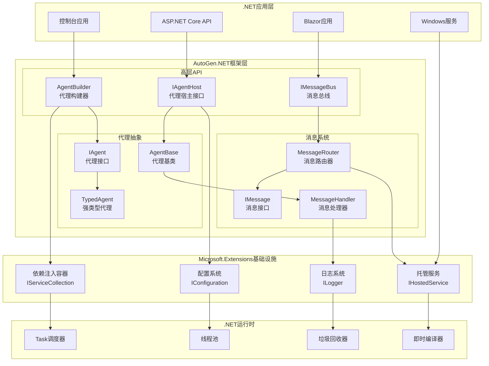

# AutoGen-03-.NET-Core-概览

## 模块职责

### 核心职责
AutoGen.Core是AutoGen框架的.NET实现核心模块，提供强类型、高性能的多代理系统基础设施。主要职责包括：

- **代理生命周期管理**：基于.NET的强类型代理抽象和实例管理
- **消息传递系统**：利用.NET Task-based异步模式实现高效消息传递
- **类型安全保证**：编译时类型检查，减少运行时错误
- **企业级特性**：依赖注入、配置管理、日志记录、性能监控
- **跨平台支持**：支持Windows、Linux、macOS多平台部署

### 输入与输出
- **输入**：.NET配置对象、强类型消息、代理工厂函数、服务配置
- **输出**：代理响应结果、任务执行状态、性能指标、诊断信息

### 上下游依赖
- **上游依赖**：.NET 8+、Microsoft.Extensions.*（DI、Config、Logging）、gRPC.NET
- **下游调用方**：AutoGen应用程序、ASP.NET Core集成、控制台应用

## 模块架构图



### 架构特点说明

**强类型设计**：
- 所有消息和代理都是强类型，编译时检查类型安全
- 泛型约束确保消息处理器的类型匹配
- 避免Python动态类型可能导致的运行时错误

**企业级集成**：
- 完全集成Microsoft.Extensions生态系统
- 支持ASP.NET Core依赖注入和配置
- 内置健康检查、指标收集、日志记录

**高性能异步**：
- 基于ValueTask的零分配异步操作
- 利用.NET ThreadPool进行工作负载均衡
- 支持取消令牌和超时控制

## 核心API设计

### IAgent接口

```csharp
public interface IAgent
{
    string Name { get; }
    string Description { get; }
    
    ValueTask<IMessage> HandleAsync<TMessage>(
        TMessage message, 
        CancellationToken cancellationToken = default)
        where TMessage : class, IMessage;
        
    ValueTask InitializeAsync(CancellationToken cancellationToken = default);
    ValueTask DisposeAsync();
}
```

### AgentBase基类

```csharp
public abstract class AgentBase : IAgent, IAsyncDisposable
{
    protected AgentBase(string name, string description, ILogger logger)
    {
        Name = name;
        Description = description;
        Logger = logger;
    }
    
    public string Name { get; }
    public string Description { get; }
    protected ILogger Logger { get; }
    
    public abstract ValueTask<IMessage> HandleAsync<TMessage>(
        TMessage message, 
        CancellationToken cancellationToken = default)
        where TMessage : class, IMessage;
        
    public virtual ValueTask InitializeAsync(CancellationToken cancellationToken = default)
    {
        Logger.LogInformation("初始化代理 {AgentName}", Name);
        return ValueTask.CompletedTask;
    }
    
    public virtual async ValueTask DisposeAsync()
    {
        Logger.LogInformation("释放代理 {AgentName}", Name);
        // 清理资源
        GC.SuppressFinalize(this);
    }
}
```

### 强类型消息处理

```csharp
public class TaskMessage : IMessage
{
    public string TaskId { get; set; } = string.Empty;
    public string Description { get; set; } = string.Empty;
    public TaskPriority Priority { get; set; } = TaskPriority.Normal;
    public DateTime CreatedAt { get; set; } = DateTime.UtcNow;
}

public class TaskResponseMessage : IMessage  
{
    public string TaskId { get; set; } = string.Empty;
    public string Result { get; set; } = string.Empty;
    public TaskStatus Status { get; set; }
    public TimeSpan ProcessingTime { get; set; }
}

// 强类型代理实现
public class TaskProcessorAgent : AgentBase
{
    public TaskProcessorAgent(ILogger<TaskProcessorAgent> logger) 
        : base("TaskProcessor", "处理任务的专用代理", logger)
    {
    }
    
    public override async ValueTask<IMessage> HandleAsync<TMessage>(
        TMessage message, 
        CancellationToken cancellationToken = default)
    {
        // 编译时类型检查
        return message switch
        {
            TaskMessage taskMsg => await ProcessTaskAsync(taskMsg, cancellationToken),
            _ => throw new NotSupportedException($"不支持的消息类型: {typeof(TMessage)}")
        };
    }
    
    private async ValueTask<TaskResponseMessage> ProcessTaskAsync(
        TaskMessage message, 
        CancellationToken cancellationToken)
    {
        Logger.LogInformation("开始处理任务 {TaskId}", message.TaskId);
        
        var stopwatch = Stopwatch.StartNew();
        
        try
        {
            // 模拟任务处理
            await Task.Delay(Random.Shared.Next(100, 1000), cancellationToken);
            
            stopwatch.Stop();
            
            return new TaskResponseMessage
            {
                TaskId = message.TaskId,
                Result = $"任务 {message.TaskId} 处理完成",
                Status = TaskStatus.Completed,
                ProcessingTime = stopwatch.Elapsed
            };
        }
        catch (OperationCanceledException)
        {
            Logger.LogWarning("任务 {TaskId} 被取消", message.TaskId);
            throw;
        }
        catch (Exception ex)
        {
            Logger.LogError(ex, "任务 {TaskId} 处理失败", message.TaskId);
            
            return new TaskResponseMessage
            {
                TaskId = message.TaskId,
                Result = $"任务处理失败: {ex.Message}",
                Status = TaskStatus.Failed,
                ProcessingTime = stopwatch.Elapsed
            };
        }
    }
}
```

## 依赖注入集成

### 服务注册

```csharp
public static class ServiceCollectionExtensions
{
    public static IServiceCollection AddAutoGen(
        this IServiceCollection services,
        Action<AutoGenOptions> configure)
    {
        // 配置选项
        services.Configure(configure);
        
        // 注册核心服务
        services.AddSingleton<IMessageBus, MessageBus>();
        services.AddSingleton<IAgentHost, AgentHost>();
        services.AddSingleton<IMessageRouter, MessageRouter>();
        
        // 注册托管服务
        services.AddHostedService<AgentHostService>();
        
        // 注册健康检查
        services.AddHealthChecks()
                .AddCheck<AgentHealthCheck>("agents");
                
        return services;
    }
    
    public static IServiceCollection AddAgent<TAgent>(
        this IServiceCollection services)
        where TAgent : class, IAgent
    {
        services.AddSingleton<TAgent>();
        services.AddSingleton<IAgent>(provider => provider.GetRequiredService<TAgent>());
        
        return services;
    }
}
```

### 配置系统

```csharp
public class AutoGenOptions
{
    public const string SectionName = "AutoGen";
    
    public int MaxConcurrentMessages { get; set; } = 100;
    public TimeSpan DefaultTimeout { get; set; } = TimeSpan.FromSeconds(30);
    public bool EnableMetrics { get; set; } = true;
    public bool EnableDistributedTracing { get; set; } = false;
    public LogLevel MinimumLogLevel { get; set; } = LogLevel.Information;
    
    public Dictionary<string, AgentConfiguration> Agents { get; set; } = new();
}

public class AgentConfiguration
{
    public string Name { get; set; } = string.Empty;
    public string Description { get; set; } = string.Empty;
    public bool Enabled { get; set; } = true;
    public Dictionary<string, object> Properties { get; set; } = new();
}

// appsettings.json配置示例
/*
{
  "AutoGen": {
    "MaxConcurrentMessages": 200,
    "DefaultTimeout": "00:01:00",
    "EnableMetrics": true,
    "Agents": {
      "TaskProcessor": {
        "Name": "TaskProcessor",
        "Description": "处理任务的专用代理",
        "Enabled": true,
        "Properties": {
          "MaxRetries": 3,
          "BatchSize": 10
        }
      }
    }
  }
}
*/
```

### 完整应用示例

```csharp
// Program.cs
using Microsoft.Extensions.Hosting;
using Microsoft.Extensions.DependencyInjection;
using Microsoft.Extensions.Logging;

var builder = Host.CreateApplicationBuilder(args);

// 配置AutoGen
builder.Services.AddAutoGen(options =>
{
    options.MaxConcurrentMessages = 200;
    options.DefaultTimeout = TimeSpan.FromMinutes(1);
    options.EnableMetrics = true;
});

// 注册代理
builder.Services.AddAgent<TaskProcessorAgent>();
builder.Services.AddAgent<NotificationAgent>();

// 配置日志
builder.Services.AddLogging(logging =>
{
    logging.AddConsole();
    logging.AddDebug();
    logging.SetMinimumLevel(LogLevel.Information);
});

var app = builder.Build();

// 启动应用
await app.RunAsync();

// 托管服务实现
public class AgentHostService : BackgroundService
{
    private readonly IAgentHost _agentHost;
    private readonly ILogger<AgentHostService> _logger;
    
    public AgentHostService(IAgentHost agentHost, ILogger<AgentHostService> logger)
    {
        _agentHost = agentHost;
        _logger = logger;
    }
    
    protected override async Task ExecuteAsync(CancellationToken stoppingToken)
    {
        _logger.LogInformation("启动代理宿主服务");
        
        // 初始化所有代理
        await _agentHost.StartAsync(stoppingToken);
        
        // 等待停止信号
        await Task.Delay(Timeout.Infinite, stoppingToken);
    }
    
    public override async Task StopAsync(CancellationToken cancellationToken)
    {
        _logger.LogInformation("停止代理宿主服务");
        await _agentHost.StopAsync(cancellationToken);
        await base.StopAsync(cancellationToken);
    }
}
```

## 性能特征

### 内存管理
- **零分配异步**：使用ValueTask避免不必要的内存分配
- **对象池**：重用频繁创建的对象（消息、上下文等）
- **弱引用缓存**：允许GC回收不活跃的代理实例

### 并发性能
- **无锁数据结构**：使用ConcurrentQueue、ConcurrentDictionary
- **线程池优化**：合理配置ThreadPool参数
- **取消令牌传播**：支持优雅的操作取消

### 监控指标
```csharp
// 内置性能计数器
public static class AutoGenMetrics
{
    private static readonly Counter<int> _messagesProcessed = 
        Meter.CreateCounter<int>("autogen.messages.processed");
        
    private static readonly Histogram<double> _processingDuration = 
        Meter.CreateHistogram<double>("autogen.processing.duration");
        
    private static readonly Gauge<int> _activeAgents = 
        Meter.CreateGauge<int>("autogen.agents.active");
        
    public static void RecordMessageProcessed(string agentName)
    {
        _messagesProcessed.Add(1, KeyValuePair.Create("agent", agentName));
    }
    
    public static void RecordProcessingDuration(double milliseconds, string agentName)
    {
        _processingDuration.Record(milliseconds, KeyValuePair.Create("agent", agentName));
    }
}
```

这个.NET Core实现提供了企业级的可靠性、性能和可维护性，同时保持了与AutoGen Python版本的概念一致性。
