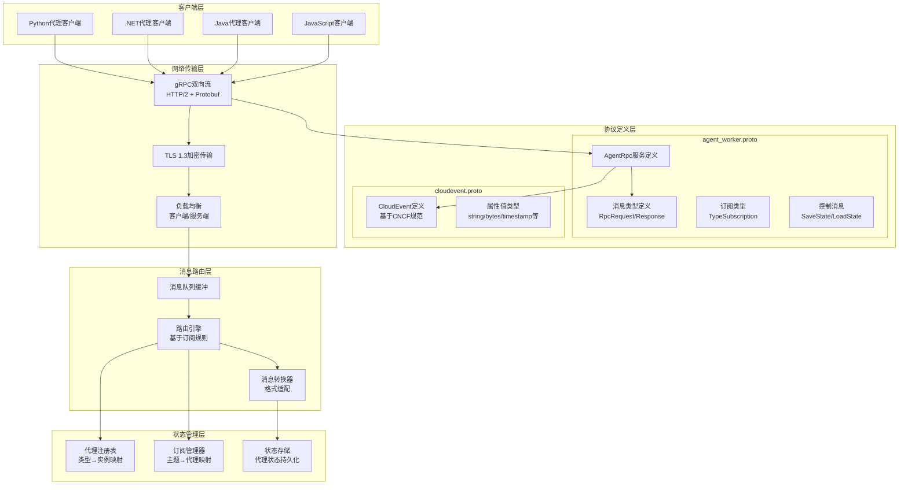

# AutoGen-04-协议模块-概览

## 模块职责

### 核心职责
AutoGen协议模块定义了跨语言、跨进程的统一通信协议，基于gRPC和CloudEvents标准，实现多代理系统的互操作性。主要职责包括：

- **统一通信协议**：定义Agent Worker Protocol，支持Python和.NET代理互通
- **消息标准化**：基于CloudEvents v1.0规范，确保消息格式一致性
- **服务发现机制**：代理注册、订阅管理、路由规则定义
- **跨语言互操作**：Protocol Buffers序列化，支持多语言客户端
- **分布式支持**：支持代理在不同进程、机器上运行

### 输入与输出
- **输入**：代理注册请求、消息发送请求、订阅配置、控制指令
- **输出**：路由后的消息、代理状态响应、订阅确认、错误信息

### 上下游依赖
- **上游依赖**：gRPC.NET/grpcio、Protocol Buffers、CloudEvents规范
- **下游调用方**：分布式代理运行时、跨语言代理实例、服务网关

## 协议架构图



## 核心协议定义

### Agent Worker Protocol服务

```protobuf
service AgentRpc {
    // 双向消息流通道
    rpc OpenChannel (stream Message) returns (stream Message);
    
    // 控制通道（状态管理）
    rpc OpenControlChannel (stream ControlMessage) returns (stream ControlMessage);
    
    // 代理生命周期管理
    rpc RegisterAgent(RegisterAgentTypeRequest) returns (RegisterAgentTypeResponse);
    rpc AddSubscription(AddSubscriptionRequest) returns (AddSubscriptionResponse);
    rpc RemoveSubscription(RemoveSubscriptionRequest) returns (RemoveSubscriptionResponse);
    rpc GetSubscriptions(GetSubscriptionsRequest) returns (GetSubscriptionsResponse);
}
```

**服务方法说明**：
- **OpenChannel**：主要消息传递通道，支持RPC和事件消息
- **OpenControlChannel**：控制平面通道，用于状态管理和系统控制
- **RegisterAgent**：代理类型注册，建立类型到处理器的映射
- **Add/RemoveSubscription**：订阅管理，控制消息路由规则

### 消息结构定义

```protobuf
message Message {
    oneof message {
        RpcRequest request = 1;
        RpcResponse response = 2;
        io.cloudevents.v1.CloudEvent cloudEvent = 3;
    }
}

message RpcRequest {
    string request_id = 1;                // 请求唯一标识
    optional AgentId source = 2;          // 发送方代理ID（可选）
    AgentId target = 3;                   // 目标代理ID
    string method = 4;                    // 调用方法名
    Payload payload = 5;                  // 消息载荷
    map<string, string> metadata = 6;    // 元数据（追踪、路由等）
}

message RpcResponse {
    string request_id = 1;                // 对应请求ID
    Payload payload = 2;                  // 响应载荷
    string error = 3;                     // 错误信息（空表示成功）
    map<string, string> metadata = 4;    // 响应元数据
}
```

### 代理标识与载荷

```protobuf
message AgentId {
    string type = 1;                      // 代理类型名
    string key = 2;                       // 代理实例键
}

message Payload {
    string data_type = 1;                 // 数据类型标识符
    string data_content_type = 2;         // 内容类型（application/json等）
    bytes data = 3;                       // 序列化后的数据
}
```

**设计要点**：
- **AgentId**采用(type, key)二元组，支持同类型多实例
- **Payload**支持多种序列化格式，默认JSON，可扩展Protobuf
- **request_id**使用UUID v4，确保全局唯一性

### 订阅机制

```protobuf
message TypeSubscription {
    string topic_type = 1;                // 主题类型匹配
    string agent_type = 2;                // 处理代理类型
}

message TypePrefixSubscription {
    string topic_type_prefix = 1;         // 主题类型前缀匹配  
    string agent_type = 2;                // 处理代理类型
}

message Subscription {
    string id = 1;                        // 订阅唯一ID
    oneof subscription {
        TypeSubscription typeSubscription = 2;
        TypePrefixSubscription typePrefixSubscription = 3;
    }
}
```

**订阅路由规则**：
- **TypeSubscription**：精确类型匹配，支持实例分片
- **TypePrefixSubscription**：前缀匹配，支持层级主题

## CloudEvents集成

### 标准兼容性

AutoGen采用CNCF CloudEvents v1.0作为事件消息标准，确保与云原生生态系统的兼容性：

```protobuf
message CloudEvent {
    // 必填属性
    string id = 1;                        // 事件唯一标识
    string source = 2;                    // 事件源URI
    string spec_version = 3;              // CloudEvents规范版本
    string type = 4;                      // 事件类型
    
    // 可选和扩展属性
    map<string, CloudEventAttributeValue> attributes = 5;
    
    // 事件数据（二进制/文本/Protobuf）
    oneof data {
        bytes binary_data = 6;
        string text_data = 7;
        google.protobuf.Any proto_data = 8;
    }
}
```

### 事件属性扩展

```protobuf
message CloudEventAttributeValue {
    oneof attr {
        bool ce_boolean = 1;
        int32 ce_integer = 2;
        string ce_string = 3;
        bytes ce_bytes = 4;
        string ce_uri = 5;
        string ce_uri_ref = 6;
        google.protobuf.Timestamp ce_timestamp = 7;
    }
}
```

**AutoGen特定属性**：
- `agenttype`：发送方代理类型
- `agentkey`：发送方代理实例键
- `correlation_id`：关联ID，用于追踪相关事件
- `retry_count`：重试次数
- `ttl`：事件生存时间（秒）

### 事件消息示例

```json
{
  "specversion": "1.0",
  "id": "550e8400-e29b-41d4-a716-446655440000",
  "source": "agent://task_processor/instance_1",
  "type": "com.autogen.task.completed",
  "time": "2024-01-15T10:30:00Z",
  "agenttype": "task_processor",
  "agentkey": "instance_1",
  "correlation_id": "batch_job_123",
  "datacontenttype": "application/json",
  "data": {
    "task_id": "task_456",
    "result": "处理完成",
    "processing_time": 1.25,
    "output_files": ["result.txt", "summary.json"]
  }
}
```

## 网络与安全

### gRPC配置

```yaml
# gRPC服务配置
grpc_server:
  bind_address: "0.0.0.0:50051"
  max_concurrent_streams: 1000
  max_receive_message_size: 16MB
  max_send_message_size: 16MB
  keepalive_time: 30s
  keepalive_timeout: 5s
  keepalive_permit_without_calls: true
  
# 客户端配置  
grpc_client:
  max_receive_message_size: 16MB
  max_send_message_size: 16MB
  keepalive_time: 30s
  keepalive_timeout: 5s
  initial_reconnect_backoff: 1s
  max_reconnect_backoff: 120s
```

### TLS安全配置

```yaml
# TLS配置
tls:
  enabled: true
  cert_file: "/etc/certs/server.crt"
  key_file: "/etc/certs/server.key"
  ca_file: "/etc/certs/ca.crt"
  client_auth: "require_and_verify"
  
# 认证配置
auth:
  method: "jwt"  # jwt, mutual_tls, api_key
  jwt_secret: "${JWT_SECRET}"
  token_expiry: "24h"
```

### 错误处理

```protobuf
// 错误代码定义
enum ErrorCode {
    UNKNOWN = 0;
    AGENT_NOT_FOUND = 1;
    SUBSCRIPTION_NOT_FOUND = 2;
    MESSAGE_TOO_LARGE = 3;
    RATE_LIMITED = 4;
    AUTH_FAILED = 5;
    INTERNAL_ERROR = 6;
}

// 错误响应格式
message ErrorResponse {
    ErrorCode code = 1;
    string message = 2;
    map<string, string> details = 3;
    string trace_id = 4;
}
```

## 性能与可靠性

### 消息传递保证

- **至少一次投递**：通过确认机制保证消息不丢失
- **幂等性支持**：消息去重，防止重复处理
- **顺序保证**：同一发送方的消息按发送顺序投递
- **背压控制**：基于滑动窗口的流控机制

### 性能指标

- **延迟**：单向消息传递 < 5ms（本地网络）
- **吞吐量**：单连接 > 10,000 msg/s（小消息）
- **并发连接**：单服务器支持 > 1,000个并发代理
- **消息大小**：默认限制16MB，可配置

### 监控与追踪

```protobuf
// 遥测数据
message TelemetryData {
    string trace_id = 1;
    string span_id = 2;
    int64 timestamp_ns = 3;
    map<string, string> tags = 4;
    repeated MetricValue metrics = 5;
}

message MetricValue {
    string name = 1;
    double value = 2;
    MetricType type = 3;
}

enum MetricType {
    COUNTER = 0;
    GAUGE = 1;
    HISTOGRAM = 2;
}
```

该协议设计确保了AutoGen多代理系统的跨语言互操作性、高性能和企业级可靠性，为构建大规模分布式代理系统提供了坚实基础。
