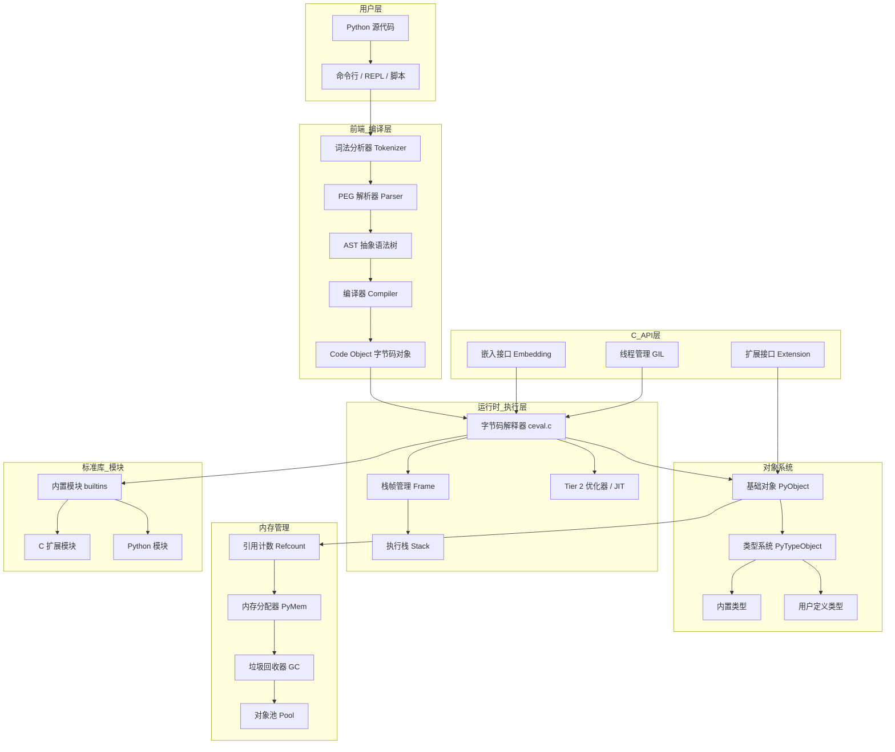
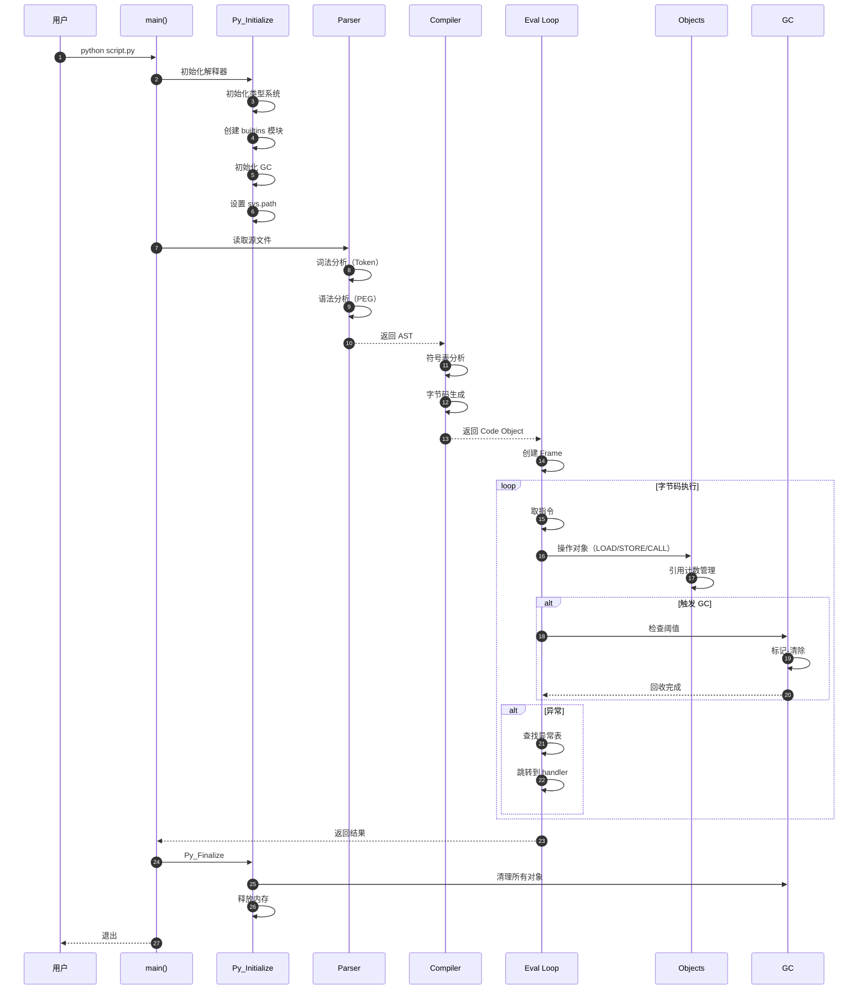

# CPython-00-总览

## 0. 摘要

### 项目目标

CPython 是 Python 编程语言的参考实现，采用 C 语言编写。本项目为 Python 3.15.0 alpha 0 版本。CPython 的核心目标是提供一个高性能、可移植、可扩展的 Python 语言解释器，支持动态类型、垃圾回收、异常处理、模块系统等核心特性。

### 问题域与核心能力边界

**问题域**：
- 将 Python 源代码编译为字节码并执行
- 提供完整的 Python 对象系统和类型系统
- 管理内存分配和垃圾回收
- 提供丰富的标准库和 C API
- 支持多线程和多解释器
- 提供扩展模块开发接口

**核心能力**：
- 词法分析和语法解析（PEG 解析器）
- AST 构建和字节码编译
- 字节码解释执行（栈式虚拟机）
- 内存管理（引用计数 + 循环垃圾回收）
- 对象生命周期管理
- C API 接口层
- 标准库模块支持
- JIT 编译优化（Tier 2 优化器）

**非目标**：
- 静态类型检查（由外部工具 mypy 等提供）
- 高级 JIT 编译（如 PyPy 的完整 JIT）
- 跨平台 GUI 框架（由第三方库提供）

### 运行环境

**语言与运行时**：
- 实现语言：C (C11 标准)
- 目标平台：Unix/Linux、Windows、macOS、iOS、Android
- 编译器支持：GCC、Clang、MSVC
- Python 版本：3.15.0 alpha 0

**依赖**：
- 操作系统原生 API
- 标准 C 库
- 线程库（pthread / Windows threads）
- 可选：OpenSSL、zlib、readline、ncurses 等

### 部署形态

- **独立解释器**：命令行可执行程序（python、python3）
- **嵌入式集成**：作为库嵌入到 C/C++ 应用中
- **扩展模块**：通过 C API 开发的动态加载模块
- **共享库形式**：libpython3.X.so / python3X.dll

## 1. 整体架构图



### 图解与要点

**组件职责**：

1. **前端编译层**（Parser、Compiler）
   - 职责：将 Python 源代码转换为字节码
   - 输入：Python 源码字符串
   - 输出：Code Object（包含字节码、常量表、变量名等）
   - 特点：单向数据流，无副作用

2. **运行时执行层**（ceval.c、Frame）
   - 职责：执行字节码指令
   - 核心：基于栈的虚拟机，switch-case 指令分发
   - 优化：内联缓存、指令特化、Tier 2 JIT

3. **对象系统**（Objects/）
   - 职责：所有 Python 值的统一表示
   - 核心结构：PyObject（引用计数 + 类型指针）
   - 类型系统：单继承 + 多重接口（协议）

4. **内存管理**（pymem.c、gcmodule.c）
   - 三层架构：原始分配器（PyMem_Raw）、Python 分配器（PyMem）、对象分配器（PyObject）
   - 引用计数：主要回收机制，O(1) 回收
   - 循环 GC：标记-清除，处理循环引用，分代优化（3 代）

5. **C API 层**（Include/）
   - 嵌入接口：初始化解释器、执行代码、获取结果
   - 扩展接口：定义新类型、注册函数、操作对象
   - 线程管理：GIL（全局解释器锁）、线程状态

**耦合关系**：
- 编译层与执行层：松耦合，通过 Code Object 隔离
- 执行层与对象系统：紧耦合，每条指令都操作对象
- 对象系统与内存管理：紧耦合，对象创建/销毁直接调用
- C API 与内核：适配器模式，提供稳定接口

**数据流与控制流**：
- **数据流**：源码 → Token 流 → AST → 字节码 → 栈上对象 → 返回值
- **控制流**：主线程 → 解释器循环 → 指令分发 → 对象操作 → 异常处理
- **跨进程**：通过 pickle 序列化（multiprocessing 模块）
- **跨线程**：GIL 保护，同一时刻仅一个线程执行字节码

**高可用与扩展性**：
- 状态管理：全局运行时状态（PyRuntimeState）、解释器状态（PyInterpreterState）、线程状态（PyThreadState）
- 多解释器：支持同进程内多个独立解释器（sub-interpreters）
- 扩展点：导入钩子、元类、描述符协议、C API

## 2. 全局时序图



### 图解与要点

**阶段说明**：

1. **初始化阶段**（步骤 2-6）
   - 初始化运行时状态（单例）
   - 创建主解释器和主线程状态
   - 初始化内置类型（int、str、list、dict 等）
   - 加载 builtins 模块
   - 初始化 GC（3 代链表）
   - 构建 sys.path（模块搜索路径）
   - 时间：通常 < 50ms

2. **编译阶段**（步骤 7-11）
   - 词法分析：字符流 → Token 流，处理缩进、关键字
   - 语法分析：Token 流 → AST，PEG 算法，支持左递归
   - 符号表：收集变量作用域信息
   - 字节码生成：AST → 字节码序列
   - 时间：正比于代码行数，典型 1000 行/ms

3. **执行阶段**（步骤 12-21）
   - Frame 创建：分配栈空间（co_stacksize）
   - 指令循环：while 循环 + switch 分发
   - 对象操作：每条指令产生 1-5 次对象操作
   - GC 触发：分配次数达阈值（默认 700/10/10）
   - 异常处理：查找异常表，栈展开

4. **清理阶段**（步骤 22-25）
   - 释放所有对象（强制引用计数归零）
   - 清空 GC 链表
   - 释放内存池
   - 恢复初始状态

**关键路径**：
- 启动时间：初始化 + 导入标准库 ≈ 50-100ms
- 执行性能：典型 1-10M 字节码指令/秒（取决于指令类型）
- 内存开销：基础解释器 ≈ 10MB，每个对象 16-48 字节

**异常路径**：
- 语法错误：在解析阶段抛出 SyntaxError，直接退出
- 运行时错误：在执行阶段抛出，查找 try-except，展开栈帧
- 系统错误：内存分配失败、递归深度超限，终止进程

**并发模型**：
- GIL 保护：同一时刻仅一个线程执行字节码
- 释放 GIL：I/O 操作、长时间 C 扩展调用
- 线程切换：每 5ms 或 100 条字节码指令

## 3. 模块边界与交互图

### 模块清单

| 序号 | 模块名 | 目录 | 职责 | 对外 API |
|------|--------|------|------|----------|
| 01 | 程序入口 | Programs/ | 解释器启动、参数解析 | main(), Py_Main() |
| 02 | 解析器 | Parser/ | 词法分析、语法解析、AST 生成 | PyParser_ParseString(), PyAST_FromNode() |
| 03 | 编译器 | Python/compile.c | AST → 字节码编译 | PyAST_Compile() |
| 04 | 对象系统 | Objects/ | 所有 Python 对象实现 | PyObject_*, PyLong_*, PyDict_* 等 |
| 05 | 解释器核心 | Python/ceval.c | 字节码执行 | PyEval_EvalCode(), _PyEval_EvalFrameDefault() |
| 06 | 内存管理 | Objects/obmalloc.c, Modules/gcmodule.c | 内存分配、垃圾回收 | PyMem_*, PyObject_GC_* |
| 07 | 内置模块 | Modules/ | 标准库 C 实现 | 各模块初始化函数 |
| 08 | C API | Include/ | 嵌入和扩展接口 | Py_*, PyObject_*, PyModule_* |
| 09 | 线程管理 | Python/pystate.c | GIL、线程状态 | PyGILState_*, PyThreadState_* |
| 10 | 异常处理 | Python/errors.c | 异常对象、回溯 | PyErr_*, PyException_* |

### 模块交互矩阵

| 调用方 → 被调方 | 程序入口 | 解析器 | 编译器 | 对象系统 | 解释器核心 | 内存管理 | 内置模块 | C API | 线程管理 | 异常处理 |
|------------------|----------|--------|--------|----------|------------|----------|----------|-------|----------|----------|
| **程序入口** | - | 同步 | 同步 | 同步 | 同步 | - | - | 使用 | 同步 | 同步 |
| **解析器** | - | - | - | 同步 | - | 同步 | - | - | - | 同步 |
| **编译器** | - | - | - | 同步 | - | 同步 | - | - | - | 同步 |
| **对象系统** | - | - | - | 递归 | - | 同步 | - | - | - | 同步 |
| **解释器核心** | - | - | 同步 | 同步 | 递归 | 同步 | 同步 | - | 同步 | 同步 |
| **内存管理** | - | - | - | 回调 | - | 递归 | - | - | 同步 | - |
| **内置模块** | - | - | - | 同步 | 同步 | 同步 | - | - | 同步 | 同步 |
| **C API** | - | 使用 | 使用 | 使用 | 使用 | 使用 | 使用 | - | 使用 | 使用 |
| **线程管理** | - | - | - | - | - | - | - | - | - | - |
| **异常处理** | - | - | - | 同步 | - | - | - | - | - | - |

**交互说明**：

1. **程序入口 → 解析器**（同步）
   - 接口：`PyRun_SimpleFile()`, `PyParser_ParseString()`
   - 数据：源文件路径或字符串
   - 错误语义：SyntaxError 通过异常返回

2. **解析器 → 对象系统**（同步）
   - 接口：`PyUnicode_*`, `PyLong_*`（创建 AST 节点中的常量）
   - 一致性：不涉及

3. **解释器核心 → 对象系统**（同步，高频）
   - 接口：所有 `PyObject_*` 系列函数
   - 频率：每条字节码指令 1-10 次
   - 错误：通过返回 NULL 和设置异常标志

4. **对象系统 → 内存管理**（同步）
   - 接口：`PyObject_Malloc()`, `PyObject_Free()`, `PyObject_GC_Track()`
   - 一致性：强一致，立即分配/释放

5. **解释器核心 → 线程管理**（同步）
   - 接口：`PyThreadState_GET()`, `PyGILState_Check()`
   - 频率：每次函数调用、每 100 条指令

6. **内存管理 → 对象系统**（回调）
   - GC 遍历回调：`tp_traverse`
   - GC 清理回调：`tp_clear`, `tp_dealloc`
   - 一致性：GC 暂停期间对象不可变

## 4. 关键设计与权衡

### 4.1 数据一致性

**引用计数 + 标记清除混合模型**：

- **设计选择**：主要使用引用计数（及时回收），辅以标记-清除 GC（处理循环引用）
- **权衡**：
  - 优势：引用计数回收及时，内存占用可预测
  - 劣势：循环引用需要 GC 处理，引用计数操作有开销
- **实现**：每个 PyObject 有 `ob_refcnt` 字段，Py_INCREF/Py_DECREF 宏操作

**事务边界**：

- Python 层面无显式事务
- 字典操作：单个操作原子（受 GIL 保护）
- 列表操作：内部调整大小非原子，但受 GIL 保护对外表现原子

### 4.2 并发策略

**全局解释器锁（GIL）**：

- **设计选择**：单个全局锁保护解释器状态
- **权衡**：
  - 优势：简化实现，避免细粒度锁，C 扩展易开发
  - 劣势：多核 CPU 无法并行执行 Python 代码
- **实现**：`_PyRuntime.ceval.gil`，每 5ms 或 100 指令检查一次
- **缓解方案**：
  - 多进程（multiprocessing）
  - C 扩展中释放 GIL（I/O、计算密集）
  - 子解释器（PEP 554，实验性）

**无 GIL 模式（Experimental）**：
- Python 3.13+ 提供实验性的 `--disable-gil` 构建选项
- 使用细粒度锁 + 不可变对象优化

### 4.3 性能关键路径

**P95 延迟热点**：

1. **属性查找**（30-40% 执行时间）
   - 优化：内联缓存（LOAD_ATTR_INSTANCE_VALUE）
   - 优化：类型特化（LOAD_ATTR_SLOT）

2. **函数调用**（20-30% 执行时间）
   - 优化：栈帧内联（避免 C 栈溢出）
   - 优化：参数解析缓存

3. **字典操作**（10-15% 执行时间）
   - 优化：紧凑字典结构（PEP 468）
   - 优化：共享键字典（实例属性）

4. **整数运算**（5-10% 执行时间）
   - 优化：小整数池（-5 到 256）
   - 优化：快速路径（单个 limb）

**内存峰值**：
- 基础解释器：~10MB
- 每个栈帧：~1KB
- 每个对象：16-48 字节（32/64位）
- 字符串驻留：减少重复字符串内存

**I/O 热点**：
- 导入模块：文件系统查找 + 编译
- 优化：.pyc 字节码缓存（__pycache__）
- 优化：冻结模块（编译进二进制）

### 4.4 可观测性

**内置指标**：
- `sys._getframe()`：获取栈帧信息
- `sys.gettrace()`：设置跟踪钩子
- `tracemalloc`：内存分配追踪
- `gc.get_stats()`：GC 统计信息

**性能分析**：
- `cProfile`：函数级性能分析
- `sys.setprofile()`：性能钩子
- `perf` / `dtrace`：系统级追踪（支持 USDT 探针）

**专项统计**：
- 指令计数器（`--with-pystats`）
- 内联缓存命中率
- GC 收集次数和耗时

### 4.5 配置项

**运行时配置**（PyConfig）：

```c
// 核心配置项
config.optimization_level  // 优化级别（0/1/2）
config.use_environment    // 是否读取环境变量
config.isolated           // 隔离模式
config.hash_seed          // 字典哈希种子
config.tracemalloc        // 内存追踪
```

**环境变量**：
- `PYTHONPATH`：模块搜索路径
- `PYTHONHASHSEED`：哈希种子（安全）
- `PYTHONOPTIMIZE`：优化级别
- `PYTHONMALLOC`：内存分配器（malloc/pymalloc/debug）
- `PYTHONUTF8`：UTF-8 模式

**编译时配置**：
- `--with-pydebug`：调试模式（断言、引用计数检查）
- `--enable-optimizations`：PGO 优化
- `--with-lto`：链接时优化
- `--disable-gil`：无 GIL 模式（实验性）

## 5. 典型使用示例与最佳实践

### 示例 1：最小可运行入口

```c
/* minimal_python.c - 最小 Python 嵌入示例 */
#include <Python.h>

int main(int argc, char *argv[])
{
    // 1. 初始化 Python 解释器
    Py_Initialize();

    // 2. 执行 Python 代码
    PyRun_SimpleString("print('Hello from CPython!')");

    // 3. 清理解释器
    if (Py_FinalizeEx() < 0) {
        return 120;  // 清理失败
    }

    return 0;
}
```

**编译与运行**：
```bash
gcc -o minimal_python minimal_python.c \
    $(python3-config --cflags --ldflags --embed)
./minimal_python
```

**说明**：
- `Py_Initialize()`：初始化运行时、类型系统、builtins
- `PyRun_SimpleString()`：编译并执行字符串
- `Py_FinalizeEx()`：清理所有对象和状态
- 注意：必须包含 `--embed` 标志（Python 3.8+）

### 示例 2：扩展模块开发

```c
/* mymodule.c - 简单的扩展模块 */
#define PY_SSIZE_T_CLEAN
#include <Python.h>

// 1. 定义模块函数：计算斐波那契数
static PyObject*
fib(PyObject *self, PyObject *args)
{
    int n;
    // 解析参数：单个整数
    if (!PyArg_ParseTuple(args, "i", &n)) {
        return NULL;  // 参数解析失败，异常已设置
    }

    // 边界检查
    if (n < 0) {
        PyErr_SetString(PyExc_ValueError, "n must be >= 0");
        return NULL;
    }

    // 计算斐波那契（递归实现）
    long a = 0, b = 1;
    for (int i = 0; i < n; i++) {
        long temp = a;
        a = b;
        b = temp + b;
    }

    // 返回 Python 整数对象
    return PyLong_FromLong(a);
}

// 2. 定义方法表
static PyMethodDef MyMethods[] = {
    {"fib", fib, METH_VARARGS, "Calculate Fibonacci number"},
    {NULL, NULL, 0, NULL}  // 哨兵
};

// 3. 定义模块结构
static struct PyModuleDef mymodule = {
    PyModuleDef_HEAD_INIT,
    "mymodule",           // 模块名
    "Example module",     // 模块文档
    -1,                   // 模块状态大小（-1 表示不支持子解释器）
    MyMethods
};

// 4. 模块初始化函数（必须命名为 PyInit_<模块名>）
PyMODINIT_FUNC
PyInit_mymodule(void)
{
    return PyModule_Create(&mymodule);
}
```

**编译为共享库**：
```bash
gcc -shared -fPIC -o mymodule.so mymodule.c \
    $(python3-config --cflags --ldflags)
```

**Python 中使用**：
```python
import mymodule

result = mymodule.fib(10)
print(f"fib(10) = {result}")  # 输出：fib(10) = 55
```

**要点说明**：
- 函数签名：`PyObject* func(PyObject *self, PyObject *args)`
- 参数解析：`PyArg_ParseTuple()` 按格式字符串解析
- 错误处理：返回 `NULL` 表示异常，必须先调用 `PyErr_SetString()`
- 返回值：必须是 `PyObject*`，调用者拥有引用
- 初始化函数：必须命名为 `PyInit_<模块名>`，返回模块对象

### 示例 3：自定义类型（扩展类）

```c
/* pointmodule.c - 定义 Point 类型 */
#include <Python.h>

// 1. 定义 C 结构体
typedef struct {
    PyObject_HEAD      // 必须：对象头（包含 refcnt 和 type）
    double x;          // 成员变量
    double y;
} PointObject;

// 2. 构造函数（__new__）
static PyObject*
Point_new(PyTypeObject *type, PyObject *args, PyObject *kwds)
{
    PointObject *self;
    self = (PointObject*) type->tp_alloc(type, 0);
    if (self != NULL) {
        self->x = 0.0;
        self->y = 0.0;
    }
    return (PyObject*) self;
}

// 3. 初始化函数（__init__）
static int
Point_init(PointObject *self, PyObject *args, PyObject *kwds)
{
    static char *kwlist[] = {"x", "y", NULL};

    if (!PyArg_ParseTupleAndKeywords(args, kwds, "|dd", kwlist,
                                      &self->x, &self->y)) {
        return -1;
    }

    return 0;
}

// 4. 析构函数（__del__）
static void
Point_dealloc(PointObject *self)
{
    Py_TYPE(self)->tp_free((PyObject*) self);
}

// 5. 方法：距离计算
static PyObject*
Point_distance(PointObject *self, PyObject *args)
{
    PointObject *other;
    if (!PyArg_ParseTuple(args, "O!", &PointType, &other)) {
        return NULL;
    }

    double dx = self->x - other->x;
    double dy = self->y - other->y;
    double dist = sqrt(dx*dx + dy*dy);

    return PyFloat_FromDouble(dist);
}

// 6. 方法表
static PyMethodDef Point_methods[] = {
    {"distance", (PyCFunction) Point_distance, METH_VARARGS,
     "Calculate distance to another point"},
    {NULL}
};

// 7. 成员访问器（属性）
static PyMemberDef Point_members[] = {
    {"x", T_DOUBLE, offsetof(PointObject, x), 0, "x coordinate"},
    {"y", T_DOUBLE, offsetof(PointObject, y), 0, "y coordinate"},
    {NULL}
};

// 8. 类型对象定义
static PyTypeObject PointType = {
    PyVarObject_HEAD_INIT(NULL, 0)
    .tp_name = "point.Point",
    .tp_doc = "Point objects",
    .tp_basicsize = sizeof(PointObject),
    .tp_itemsize = 0,
    .tp_flags = Py_TPFLAGS_DEFAULT | Py_TPFLAGS_BASETYPE,
    .tp_new = Point_new,
    .tp_init = (initproc) Point_init,
    .tp_dealloc = (destructor) Point_dealloc,
    .tp_methods = Point_methods,
    .tp_members = Point_members,
};

// 9. 模块初始化
static PyModuleDef pointmodule = {
    PyModuleDef_HEAD_INIT,
    .m_name = "point",
    .m_doc = "Point type example",
    .m_size = -1,
};

PyMODINIT_FUNC
PyInit_point(void)
{
    PyObject *m;

    if (PyType_Ready(&PointType) < 0)
        return NULL;

    m = PyModule_Create(&pointmodule);
    if (m == NULL)
        return NULL;

    Py_INCREF(&PointType);
    if (PyModule_AddObject(m, "Point", (PyObject*) &PointType) < 0) {
        Py_DECREF(&PointType);
        Py_DECREF(m);
        return NULL;
    }

    return m;
}
```

**使用示例**：
```python
from point import Point

p1 = Point(3.0, 4.0)
p2 = Point(0.0, 0.0)

print(f"p1 = ({p1.x}, {p1.y})")  # 输出：p1 = (3.0, 4.0)
dist = p1.distance(p2)
print(f"Distance: {dist}")        # 输出：Distance: 5.0
```

**核心要点**：
- **PyObject_HEAD**：所有对象必须包含的宏，提供引用计数和类型指针
- **tp_new**：对象分配（类似 C++ new）
- **tp_init**：对象初始化（类似 C++ 构造函数）
- **tp_dealloc**：对象销毁（类似 C++ 析构函数）
- **PyType_Ready()**：初始化类型对象（计算偏移、继承方法等）
- **引用计数**：返回给 Python 的对象必须有正确的引用计数

---

## 附录：模块文档索引

| 模块 | 文档 |
|------|------|
| 程序入口 | [CPython-01-程序入口-概览.md](CPython-01-程序入口-概览.md) |
| | [CPython-01-程序入口-API.md](CPython-01-程序入口-API.md) |
| 解析器 | [CPython-02-解析器-概览.md](CPython-02-解析器-概览.md) |
| | [CPython-02-解析器-API.md](CPython-02-解析器-API.md) |
| | [CPython-02-解析器-数据结构.md](CPython-02-解析器-数据结构.md) |
| | [CPython-02-解析器-时序图.md](CPython-02-解析器-时序图.md) |
| 编译器 | [CPython-03-编译器-概览.md](CPython-03-编译器-概览.md) |
| | [CPython-03-编译器-API.md](CPython-03-编译器-API.md) |
| | [CPython-03-编译器-数据结构.md](CPython-03-编译器-数据结构.md) |
| 对象系统 | [CPython-04-对象系统-概览.md](CPython-04-对象系统-概览.md) |
| | [CPython-04-对象系统-API.md](CPython-04-对象系统-API.md) |
| | [CPython-04-对象系统-数据结构.md](CPython-04-对象系统-数据结构.md) |
| 解释器核心 | [CPython-05-解释器核心-概览.md](CPython-05-解释器核心-概览.md) |
| | [CPython-05-解释器核心-API.md](CPython-05-解释器核心-API.md) |
| | [CPython-05-解释器核心-时序图.md](CPython-05-解释器核心-时序图.md) |
| 内存管理 | [CPython-06-内存管理-概览.md](CPython-06-内存管理-概览.md) |
| | [CPython-06-内存管理-API.md](CPython-06-内存管理-API.md) |
| 内置模块 | [CPython-07-内置模块-概览.md](CPython-07-内置模块-概览.md) |
| C API | [CPython-08-C-API-概览.md](CPython-08-C-API-概览.md) |
| | [CPython-08-C-API-嵌入接口.md](CPython-08-C-API-嵌入接口.md) |
| | [CPython-08-C-API-扩展接口.md](CPython-08-C-API-扩展接口.md) |

