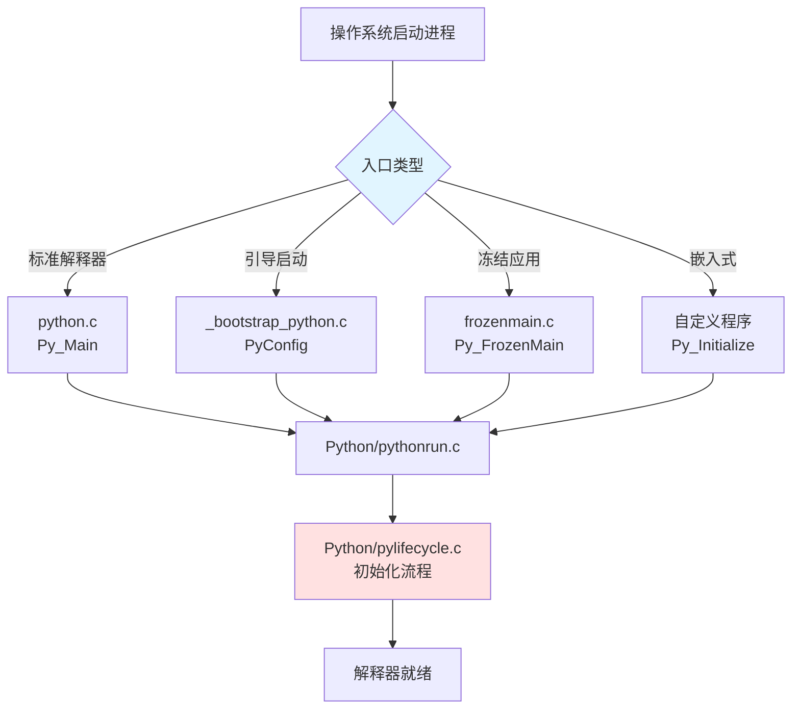
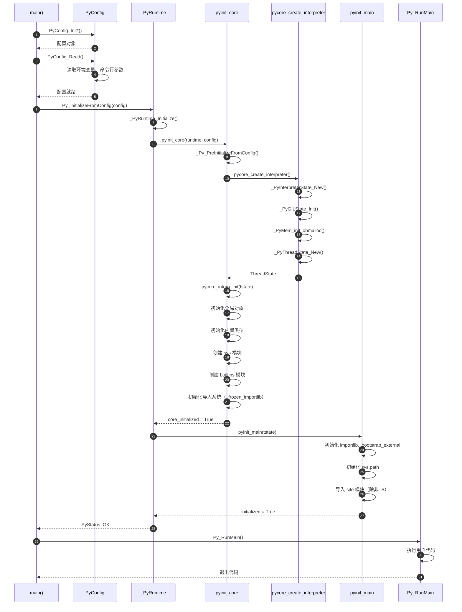
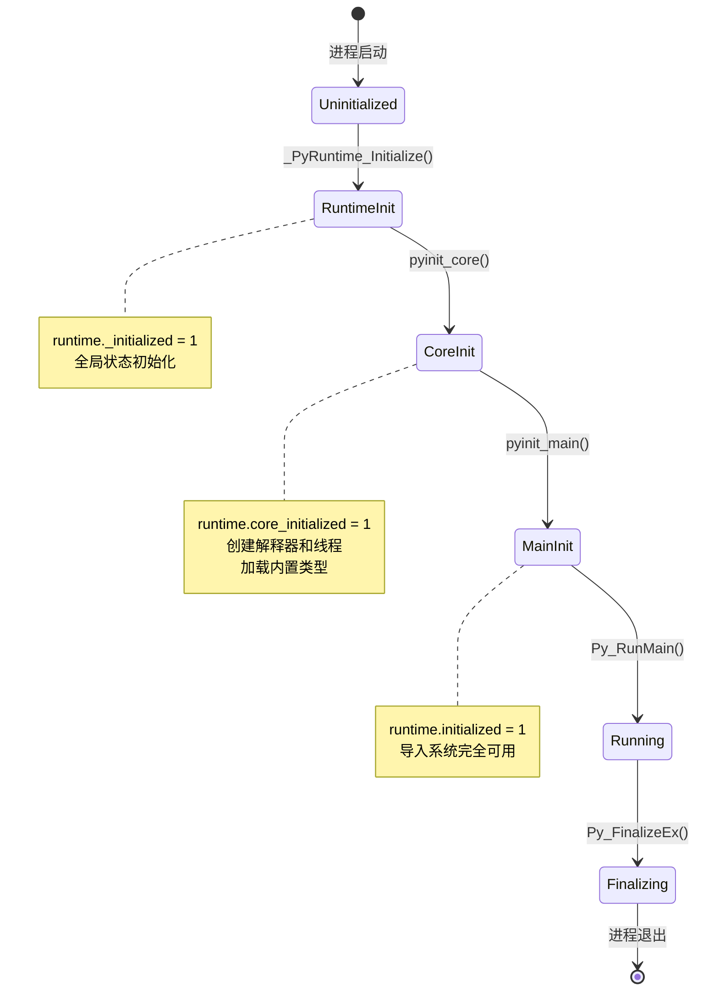
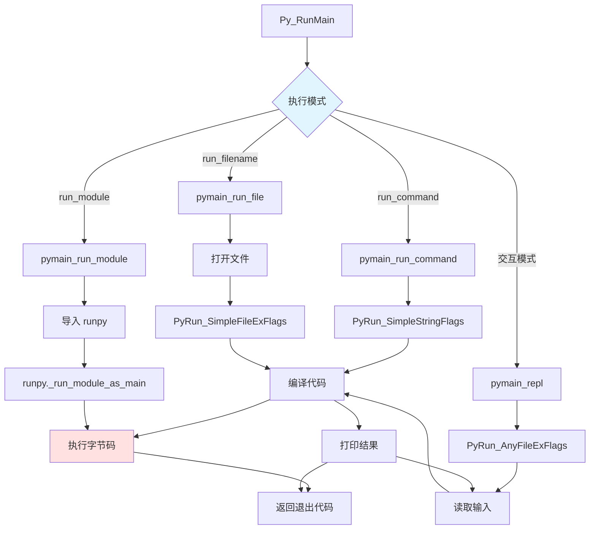
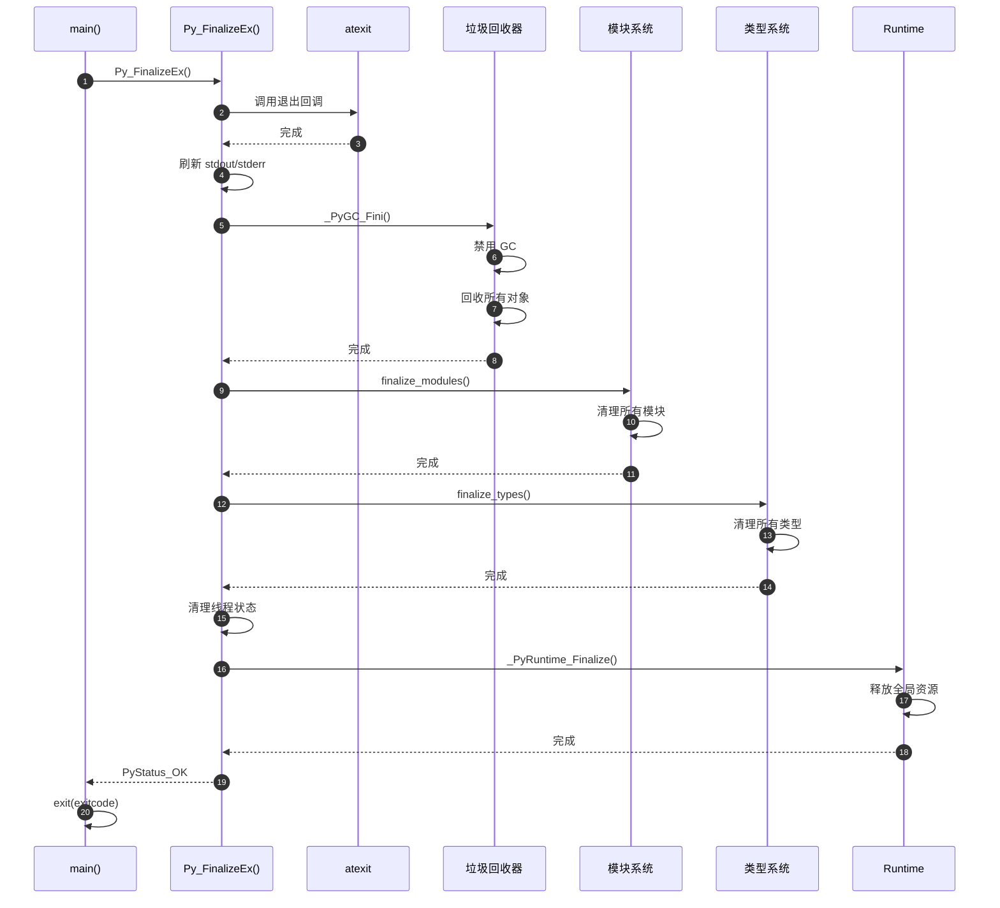
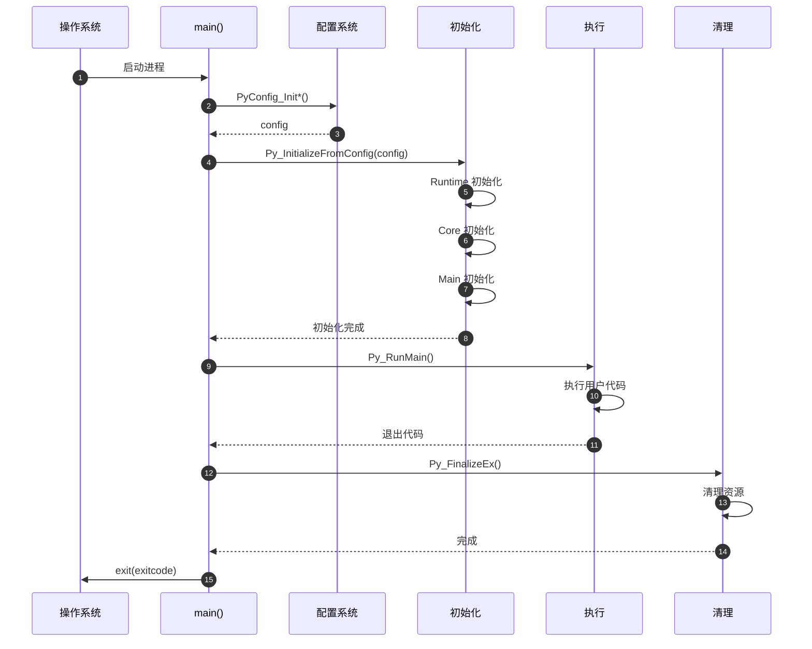

# CPython-01-程序入口-概览

## 1. 模块职责

程序入口模块负责 Python 解释器的启动和初始化，是 CPython 从操作系统启动到开始执行 Python 代码的桥梁。

**核心职责**：
- 接收命令行参数并解析配置
- 初始化 Python 运行时环境
- 创建主解释器和主线程
- 加载内置模块和导入系统
- 执行用户指定的 Python 代码
- 清理并退出

**输入**：命令行参数（`argc`, `argv`）
**输出**：退出代码（0表示成功，非0表示错误）

**生命周期**：从 `main()` 函数调用到 `Py_FinalizeEx()` 完成清理。

## 2. 程序入口类型

CPython 提供多种程序入口，适应不同使用场景。

### 2.1 入口类型总览



**入口类型说明**：

| 入口 | 文件 | 用途 | 特点 |
|-----|------|------|------|
| 标准解释器 | `Programs/python.c` | 常规 Python 命令行 | 最简洁，直接调用 `Py_Main` |
| 引导启动 | `Programs/_bootstrap_python.c` | 构建工具（如 deepfreeze） | 自定义配置，支持冻结模块 |
| 冻结应用 | `Python/frozenmain.c` | 独立可执行文件 | 无需外部 `.py` 文件 |
| 嵌入式 | 用户自定义 | 在 C/C++ 程序中嵌入 Python | 完全控制初始化过程 |

### 2.2 标准解释器入口

最常用的入口，代码非常简洁：

```c
// Programs/python.c

#include "Python.h"

#ifdef MS_WINDOWS
int wmain(int argc, wchar_t **argv)
{
    return Py_Main(argc, argv);
}
#else
int main(int argc, char **argv)
{
    return Py_BytesMain(argc, argv);
}
#endif
```

**说明**：
- **Windows**：使用 `wmain` 接收宽字符参数（Unicode），调用 `Py_Main`
- **Unix/Linux**：使用 `main` 接收字节字符串参数，调用 `Py_BytesMain`
- 两者最终都会调用相同的初始化流程，仅字符编码处理不同

### 2.3 引导启动入口

用于构建过程，需要有限的 Python 功能：

```c
// Programs/_bootstrap_python.c（简化）

int main(int argc, char **argv)
{
    PyStatus status;
    PyConfig config;

    // 1. 初始化隔离配置（不依赖环境变量）
    PyConfig_InitIsolatedConfig(&config);
    config.pathconfig_warnings = 0;  // 抑制路径警告
    config.parse_argv = 1;           // 解析命令行参数
    config.isolated = 0;             // 允许访问系统模块
    config.safe_path = 0;

    // 2. 设置参数
    status = PyConfig_SetBytesArgv(&config, argc, argv);
    if (PyStatus_Exception(status)) {
        goto error;
    }

    // 3. 读取配置
    status = PyConfig_Read(&config);
    if (config.run_filename == NULL) {
        status = PyStatus_Error("Run filename expected");
        goto error;
    }

    // 4. 隔离系统 Python（避免冲突）
    PyMem_RawFree(config.base_prefix);
    config.base_prefix = NULL;
    PyMem_RawFree(config.prefix);
    config.prefix = NULL;

    // 5. 初始化解释器
    status = Py_InitializeFromConfig(&config);
    if (PyStatus_Exception(status)) {
        goto error;
    }
    PyConfig_Clear(&config);

    // 6. 运行主程序
    return Py_RunMain();

error:
    PyConfig_Clear(&config);
    if (PyStatus_IsExit(status)) {
        return status.exitcode;
    }
    Py_ExitStatusException(status);
}
```

**关键配置项**：

| 配置 | 默认值 | 说明 |
|-----|-------|------|
| `isolated` | 0 | 是否隔离（不读取环境变量） |
| `parse_argv` | 1 | 是否解析 `-c`, `-m` 等参数 |
| `pathconfig_warnings` | 0 | 是否显示路径配置警告 |
| `safe_path` | 0 | 是否使用安全路径模式 |

## 3. 初始化流程

Python 解释器初始化分为三个阶段：**Runtime 初始化** → **Core 初始化** → **Main 初始化**。

### 3.1 完整初始化流程



### 3.2 Runtime 初始化

Runtime 是全局单例，管理所有解释器。

```c
// Python/pylifecycle.c

static PyStatus
_PyRuntime_Initialize(void)
{
    _PyRuntimeState *runtime = &_PyRuntime;

    if (runtime->_initialized) {
        return _PyStatus_OK();
    }

    // 初始化运行时状态
    memset(runtime, 0, sizeof(*runtime));

    // 初始化 ID 生成器
    _PyObject_InitState_Runtime(runtime);

    // 初始化线程本地存储
    PyThread_tss_create(&runtime->autoTSSkey);

    // 初始化 GIL
    _PyEval_InitGIL(runtime, 0);

    // 初始化哈希随机化
    if (_Py_HashRandomization_Init(runtime) < 0) {
        return _PyStatus_ERR("failed to init hash randomization");
    }

    runtime->_initialized = 1;
    return _PyStatus_OK();
}
```

**Runtime 状态**：

```c
typedef struct _PyRuntimeState {
    int _initialized;                // Runtime 是否初始化
    int core_initialized;            // Core 是否初始化
    int initialized;                 // 是否完全初始化

    PyPreConfig preconfig;           // 预配置
    struct _gil_runtime_state gil;   // GIL 状态
    struct _ceval_runtime_state ceval;  // 求值器状态
    struct _import_runtime_state imports;  // 导入系统状态

    PyInterpreterState *interpreters_head;  // 解释器链表
    // ... 其他全局状态
} _PyRuntimeState;
```

### 3.3 Core 初始化

Core 初始化创建主解释器和主线程，初始化核心子系统。

```c
// Python/pylifecycle.c

static PyStatus
pycore_create_interpreter(_PyRuntimeState *runtime,
                          const PyConfig *src_config,
                          PyThreadState **tstate_p)
{
    PyStatus status;
    PyInterpreterState *interp;

    // 1. 创建解释器状态
    status = _PyInterpreterState_New(NULL, &interp);
    if (_PyStatus_EXCEPTION(status)) {
        return status;
    }

    // 2. 复制配置
    status = _PyConfig_Copy(&interp->config, src_config);
    if (_PyStatus_EXCEPTION(status)) {
        return status;
    }

    // 3. 初始化 GIL 状态
    status = _PyGILState_Init(interp);
    if (_PyStatus_EXCEPTION(status)) {
        return status;
    }

    // 4. 初始化对象系统
    status = _PyObject_InitState(interp);
    if (_PyStatus_EXCEPTION(status)) {
        return status;
    }

    // 5. 初始化内存分配器
    if (_PyMem_init_obmalloc(interp) < 0) {
        return _PyStatus_NO_MEMORY();
    }

    // 6. 创建主线程状态
    PyThreadState *tstate = _PyThreadState_New(interp, _PyThreadState_WHENCE_INIT);
    if (tstate == NULL) {
        return _PyStatus_ERR("can't make first thread");
    }

    *tstate_p = tstate;
    return _PyStatus_OK();
}

static PyStatus
pycore_interp_init(PyThreadState *tstate)
{
    PyInterpreterState *interp = tstate->interp;
    PyStatus status;

    // 1. 创建单例对象（空字符串、空元组等）
    status = pycore_init_global_objects(interp);
    if (_PyStatus_EXCEPTION(status)) {
        return status;
    }

    // 2. 初始化代码对象系统
    status = _PyCode_Init(interp);
    if (_PyStatus_EXCEPTION(status)) {
        return status;
    }

    // 3. 初始化 GC
    status = _PyGC_Init(interp);
    if (_PyStatus_EXCEPTION(status)) {
        return status;
    }

    // 4. 初始化内置类型（int, str, list, dict 等）
    status = pycore_init_types(interp);
    if (_PyStatus_EXCEPTION(status)) {
        return status;
    }

    // 5. 创建 sys 模块
    PyObject *sysmod = NULL;
    status = _PySys_Create(tstate, &sysmod);
    if (_PyStatus_EXCEPTION(status)) {
        return status;
    }

    // 6. 创建 builtins 模块
    status = pycore_init_builtins(tstate);
    if (_PyStatus_EXCEPTION(status)) {
        return status;
    }

    // 7. 初始化导入系统核心（_frozen_importlib）
    const PyConfig *config = _PyInterpreterState_GetConfig(interp);
    status = _PyImport_InitCore(tstate, sysmod, config->_install_importlib);
    if (_PyStatus_EXCEPTION(status)) {
        return status;
    }

    Py_XDECREF(sysmod);
    return _PyStatus_OK();
}
```

**Core 初始化关键步骤**：

| 步骤 | 功能 | 说明 |
|-----|------|------|
| 创建解释器 | `_PyInterpreterState_New` | 分配解释器状态结构 |
| 初始化 GIL | `_PyGILState_Init` | 创建全局解释器锁 |
| 初始化对象系统 | `_PyObject_InitState` | 准备对象分配器 |
| 初始化内存分配器 | `_PyMem_init_obmalloc` | 设置 pymalloc/mimalloc |
| 创建主线程 | `_PyThreadState_New` | 创建第一个线程状态 |
| 初始化全局对象 | `pycore_init_global_objects` | 创建单例（None, True, False等） |
| 初始化内置类型 | `pycore_init_types` | 注册 int, str, list 等类型 |
| 创建 sys 模块 | `_PySys_Create` | 提供 sys.version, sys.argv 等 |
| 创建 builtins 模块 | `pycore_init_builtins` | 提供 print, len 等内置函数 |
| 初始化导入系统 | `_PyImport_InitCore` | 加载 `_frozen_importlib` |

### 3.4 Main 初始化

Main 初始化完成剩余配置，使解释器完全可用。

```c
// Python/pylifecycle.c

static PyStatus
pyinit_main(PyThreadState *tstate)
{
    PyInterpreterState *interp = tstate->interp;

    if (!interp->runtime->core_initialized) {
        return _PyStatus_ERR("runtime core not initialized");
    }

    if (interp->runtime->initialized) {
        // 已初始化，重新配置
        return pyinit_main_reconfigure(tstate);
    }

    // 执行主初始化
    PyStatus status = init_interp_main(tstate);
    if (_PyStatus_EXCEPTION(status)) {
        return status;
    }

    return _PyStatus_OK();
}

static PyStatus
init_interp_main(PyThreadState *tstate)
{
    PyStatus status;
    PyInterpreterState *interp = tstate->interp;
    const PyConfig *config = _PyInterpreterState_GetConfig(interp);

    // 1. 初始化 importlib._bootstrap_external（文件系统导入）
    status = _PyImport_InitExternal(tstate);
    if (_PyStatus_EXCEPTION(status)) {
        return status;
    }

    // 2. 初始化 sys.path
    status = init_sys_path(tstate, config);
    if (_PyStatus_EXCEPTION(status)) {
        return status;
    }

    // 3. 导入 site 模块（除非 -S 标志）
    if (config->site_import) {
        status = init_import_site(tstate);
        if (_PyStatus_EXCEPTION(status)) {
            return status;
        }
    }

    // 4. 初始化 sys.stdin, sys.stdout, sys.stderr
    status = init_sys_streams(tstate);
    if (_PyStatus_EXCEPTION(status)) {
        return status;
    }

    // 5. 初始化警告系统
    status = _PyWarnings_Init();
    if (_PyStatus_EXCEPTION(status)) {
        return status;
    }

    // 6. 标记初始化完成
    interp->runtime->initialized = 1;

    return _PyStatus_OK();
}
```

**Main 初始化关键步骤**：

| 步骤 | 功能 | 说明 |
|-----|------|------|
| 初始化外部导入 | `_PyImport_InitExternal` | 加载 `importlib._bootstrap_external` |
| 初始化 sys.path | `init_sys_path` | 设置模块搜索路径 |
| 导入 site 模块 | `init_import_site` | 加载 `site.py`（设置 `sys.prefix` 等） |
| 初始化标准流 | `init_sys_streams` | 设置 `sys.stdin/stdout/stderr` |
| 初始化警告系统 | `_PyWarnings_Init` | 准备 `warnings` 模块 |

### 3.5 初始化状态机



## 4. 配置系统

`PyConfig` 是 Python 3.8+ 引入的新配置 API，提供类型安全的配置接口。

### 4.1 配置对象结构

```c
// Include/cpython/initconfig.h

typedef struct PyConfig {
    // 基本配置
    int isolated;                   // 隔离模式（忽略环境变量）
    int use_environment;            // 是否读取环境变量
    int dev_mode;                   // 开发模式
    int safe_path;                  // 安全路径模式

    // 命令行参数
    int parse_argv;                 // 是否解析 argv
    PyWideStringList orig_argv;     // 原始 argv
    PyWideStringList argv;          // 解析后的 argv

    // 路径配置
    wchar_t *prefix;                // sys.prefix
    wchar_t *exec_prefix;           // sys.exec_prefix
    wchar_t *base_prefix;           // sys.base_prefix
    wchar_t *base_exec_prefix;      // sys.base_exec_prefix
    PyWideStringList module_search_paths;  // sys.path
    wchar_t *pythonpath_env;        // PYTHONPATH 环境变量
    wchar_t *home;                  // PYTHONHOME

    // 执行模式
    int run_command;                // -c <command>
    wchar_t *run_module;            // -m <module>
    wchar_t *run_filename;          // <script.py>

    // 标志
    int verbose;                    // -v
    int quiet;                      // -q
    int interactive;                // -i
    int inspect;                    // PYTHONINSPECT
    int optimization_level;         // -O, -OO
    int dont_write_bytecode;        // -B
    int site_import;                // -S (禁用 site)
    int bytes_warning;              // -b, -bb

    // I/O 配置
    int buffered_stdio;             // -u (无缓冲)
    wchar_t *stdio_encoding;        // PYTHONIOENCODING
    wchar_t *stdio_errors;

    // 内存配置
    wchar_t *malloc_debug;          // PYTHONMALLOC
    int use_hash_seed;
    unsigned long hash_seed;        // PYTHONHASHSEED

    // ... 更多配置项
} PyConfig;
```

### 4.2 配置初始化模式

```c
// Include/cpython/initconfig.h

// 1. Python 配置（默认）
void PyConfig_InitPythonConfig(PyConfig *config);

// 2. 隔离配置（安全模式）
void PyConfig_InitIsolatedConfig(PyConfig *config);
```

**配置模式对比**：

| 配置项 | Python 配置 | 隔离配置 |
|-------|------------|---------|
| `isolated` | 0 | 1 |
| `use_environment` | 1 | 0 |
| `dev_mode` | 0 | 0 |
| `install_signal_handlers` | 1 | 1 |
| `parse_argv` | 1 | 0 |
| `site_import` | 1 | 0 |
| `use_hash_seed` | 0 | 1 |

**使用示例**：

```c
// 标准配置
PyConfig config;
PyConfig_InitPythonConfig(&config);

// 隔离配置（不读取环境变量）
PyConfig config;
PyConfig_InitIsolatedConfig(&config);

// 自定义配置
PyConfig config;
PyConfig_InitPythonConfig(&config);
config.isolated = 1;              // 启用隔离
config.site_import = 0;           // 禁用 site
config.optimization_level = 2;    // -OO 级别优化

PyStatus status = Py_InitializeFromConfig(&config);
PyConfig_Clear(&config);
```

### 4.3 配置读取

```c
PyStatus PyConfig_Read(PyConfig *config);
```

`PyConfig_Read` 从多个来源读取配置，优先级从高到低：

1. **直接设置的配置项**
2. **命令行参数** (`argv`)
3. **环境变量** (`PYTHONPATH`, `PYTHONHOME` 等)
4. **默认值**

**示例**：

```python
# 环境变量
export PYTHONPATH=/custom/path
export PYTHONOPTIMIZE=2

# 命令行参数
python -u -v -B script.py arg1 arg2

# 对应配置：
# config.buffered_stdio = 0      # -u
# config.verbose = 1             # -v
# config.dont_write_bytecode = 1 # -B
# config.optimization_level = 2  # $PYTHONOPTIMIZE
# config.pythonpath_env = "/custom/path"
# config.argv = ["script.py", "arg1", "arg2"]
```

## 5. 执行阶段

初始化完成后，解释器进入执行阶段。

### 5.1 执行入口 Py_RunMain

```c
// Python/pythonrun.c

int Py_RunMain(void)
{
    int exitcode = 0;
    PyInterpreterState *interp = PyInterpreterState_Get();
    const PyConfig *config = _PyInterpreterState_GetConfig(interp);

    // 设置运行标志
    if (_PyInterpreterState_SetRunningMain(interp) < 0) {
        return 1;
    }

    // 1. 执行 -c <command>
    if (config->run_command) {
        exitcode = pymain_run_command(config->run_command);
    }
    // 2. 执行 -m <module>
    else if (config->run_module) {
        exitcode = pymain_run_module(config->run_module);
    }
    // 3. 执行 <script.py>
    else if (config->run_filename) {
        exitcode = pymain_run_file(config->run_filename);
    }
    // 4. 进入交互模式（REPL）
    else {
        exitcode = pymain_repl();
    }

    // 清除运行标志
    _PyInterpreterState_SetNotRunningMain(interp);

    return exitcode;
}
```

### 5.2 执行模式详解

**1. 命令模式（`-c`）**

```c
static int
pymain_run_command(wchar_t *command)
{
    PyObject *unicode = PyUnicode_FromWideChar(command, -1);
    if (unicode == NULL) {
        return 1;
    }

    // 编译并执行命令
    int ret = PyRun_SimpleStringFlags(PyUnicode_AsUTF8(unicode), NULL);
    Py_DECREF(unicode);

    return ret != 0;
}
```

**示例**：
```bash
python -c "print('Hello, World!')"
```

**2. 模块模式（`-m`）**

```c
static int
pymain_run_module(const wchar_t *modname)
{
    PyObject *module, *runpy, *runmodule, *runargs, *result;

    // 导入 runpy 模块
    runpy = PyImport_ImportModule("runpy");
    if (runpy == NULL) {
        return 1;
    }

    // 调用 runpy._run_module_as_main(modname)
    runmodule = PyObject_GetAttrString(runpy, "_run_module_as_main");
    Py_DECREF(runpy);

    if (runmodule == NULL) {
        return 1;
    }

    runargs = PyTuple_Pack(1, PyUnicode_FromWideChar(modname, -1));
    result = PyObject_Call(runmodule, runargs, NULL);
    Py_DECREF(runmodule);
    Py_DECREF(runargs);

    if (result == NULL) {
        PyErr_Print();
        return 1;
    }

    Py_DECREF(result);
    return 0;
}
```

**示例**：
```bash
python -m http.server 8000
```

**3. 脚本模式**

```c
static int
pymain_run_file(const wchar_t *filename)
{
    FILE *fp = _Py_wfopen(filename, L"rb");
    if (fp == NULL) {
        fprintf(stderr, "python: can't open file '%ls'\n", filename);
        return 1;
    }

    // 执行文件
    int ret = PyRun_SimpleFileExFlags(fp, PyUnicode_AsUTF8(filename), 1, NULL);

    return ret != 0;
}
```

**示例**：
```bash
python script.py arg1 arg2
```

**4. 交互模式（REPL）**

```c
static int
pymain_repl(void)
{
    PyCompilerFlags cf = _PyCompilerFlags_INIT;
    int ret;

    // 打印欢迎信息
    printf("Python %s on %s\n", Py_GetVersion(), Py_GetPlatform());
    printf("Type \"help\", \"copyright\", \"credits\" or \"license\" for more information.\n");

    // 启动交互循环
    ret = PyRun_AnyFileExFlags(stdin, "<stdin>", 0, &cf);

    return ret != 0;
}
```

**示例**：
```bash
python
>>> print("Hello")
Hello
>>> 1 + 2
3
```

### 5.3 执行流程图



## 6. 清理与退出

解释器退出时需要清理所有资源。

### 6.1 退出流程

```c
// Python/pylifecycle.c

PyStatus Py_FinalizeEx(void)
{
    PyThreadState *tstate = _PyThreadState_GET();
    PyInterpreterState *interp = tstate->interp;
    _PyRuntimeState *runtime = &_PyRuntime;

    // 1. 标记正在终结
    runtime->finalizing = 1;

    // 2. 调用 atexit 回调
    PyObject *atexit = PyImport_ImportModule("atexit");
    if (atexit) {
        PyObject_CallMethod(atexit, "_run_exitfuncs", NULL);
        Py_DECREF(atexit);
    }

    // 3. 刷新标准流
    flush_std_files();

    // 4. 禁用 GC
    _PyGC_Fini(interp);

    // 5. 清理模块
    finalize_modules(tstate);

    // 6. 清理导入系统
    _PyImport_Fini(interp);

    // 7. 清理类型系统
    finalize_types(tstate);

    // 8. 清理警告系统
    _PyWarnings_Fini(interp);

    // 9. 清理线程状态
    _PyThreadState_DeleteExcept(tstate);

    // 10. 销毁解释器
    _PyInterpreterState_Clear(interp);

    // 11. 释放 GIL
    _PyEval_FiniGIL(runtime);

    // 12. 清理运行时
    _PyRuntime_Finalize();

    return _PyStatus_OK();
}
```

### 6.2 清理时序图



## 7. 时序图总结

### 7.1 完整启动到退出流程



## 8. 嵌入式应用示例

嵌入式应用可以完全控制 Python 解释器的生命周期。

### 8.1 最小嵌入示例

```c
// embed_minimal.c

#include <Python.h>

int main(int argc, char *argv[])
{
    // 1. 初始化解释器
    Py_Initialize();

    // 2. 执行 Python 代码
    PyRun_SimpleString("print('Hello from embedded Python!')");

    // 3. 清理
    if (Py_FinalizeEx() < 0) {
        return 120;
    }

    return 0;
}
```

**编译**：
```bash
gcc -o embed_minimal embed_minimal.c $(python3-config --cflags --ldflags --embed)
./embed_minimal
# 输出: Hello from embedded Python!
```

### 8.2 高级嵌入示例

```c
// embed_advanced.c

#include <Python.h>

int main(int argc, char *argv[])
{
    PyStatus status;
    PyConfig config;

    // 1. 初始化配置
    PyConfig_InitPythonConfig(&config);

    // 2. 设置程序名称
    status = PyConfig_SetBytesString(&config, &config.program_name, argv[0]);
    if (PyStatus_Exception(status)) {
        goto error;
    }

    // 3. 设置模块搜索路径
    wchar_t *path = Py_DecodeLocale("/custom/python/modules", NULL);
    status = PyWideStringList_Append(&config.module_search_paths, path);
    PyMem_RawFree(path);
    if (PyStatus_Exception(status)) {
        goto error;
    }
    config.module_search_paths_set = 1;  // 覆盖默认路径

    // 4. 初始化解释器
    status = Py_InitializeFromConfig(&config);
    if (PyStatus_Exception(status)) {
        goto error;
    }
    PyConfig_Clear(&config);

    // 5. 执行 Python 代码
    PyObject *main_module = PyImport_ImportModule("__main__");
    PyObject *global_dict = PyModule_GetDict(main_module);

    PyRun_String(
        "import sys\n"
        "print(f'Python {sys.version}')\n"
        "print(f'Executable: {sys.executable}')\n"
        "print(f'Path: {sys.path}')\n",
        Py_file_input,
        global_dict,
        global_dict
    );

    Py_DECREF(main_module);

    // 6. 清理
    if (Py_FinalizeEx() < 0) {
        return 120;
    }

    return 0;

error:
    PyConfig_Clear(&config);
    Py_ExitStatusException(status);
}
```

### 8.3 调用 Python 函数

```c
// embed_call_function.c

#include <Python.h>

int main(int argc, char *argv[])
{
    Py_Initialize();

    // 1. 执行 Python 代码定义函数
    PyRun_SimpleString(
        "def multiply(a, b):\n"
        "    return a * b\n"
    );

    // 2. 获取函数对象
    PyObject *main_module = PyImport_ImportModule("__main__");
    PyObject *func = PyObject_GetAttrString(main_module, "multiply");

    if (func && PyCallable_Check(func)) {
        // 3. 准备参数
        PyObject *args = PyTuple_Pack(2, PyLong_FromLong(6), PyLong_FromLong(7));

        // 4. 调用函数
        PyObject *result = PyObject_CallObject(func, args);

        // 5. 处理返回值
        if (result) {
            long value = PyLong_AsLong(result);
            printf("Result: %ld\n", value);  // 输出: Result: 42
            Py_DECREF(result);
        }

        Py_DECREF(args);
    }

    Py_XDECREF(func);
    Py_DECREF(main_module);

    Py_FinalizeEx();
    return 0;
}
```

## 9. 边界与异常

### 9.1 初始化失败处理

```c
PyStatus status = Py_InitializeFromConfig(&config);
if (PyStatus_Exception(status)) {
    if (PyStatus_IsError(status)) {
        // 致命错误
        fprintf(stderr, "Fatal error: %s\n", status.err_msg);
        exit(1);
    }
    else if (PyStatus_IsExit(status)) {
        // 正常退出（例如 --help）
        exit(status.exitcode);
    }
}
```

### 9.2 多次初始化

```c
// 多次调用 Py_Initialize() 安全，但只初始化一次
Py_Initialize();
Py_Initialize();  // 无操作
Py_Initialize();  // 无操作
```

### 9.3 子解释器

```c
// 创建子解释器（独立命名空间）
PyThreadState *main_tstate = PyThreadState_Get();

PyThreadState *sub_tstate = Py_NewInterpreter();
if (sub_tstate == NULL) {
    fprintf(stderr, "Failed to create sub-interpreter\n");
    return 1;
}

// 在子解释器中执行代码
PyRun_SimpleString("print('In sub-interpreter')");

// 清理子解释器
Py_EndInterpreter(sub_tstate);
PyThreadState_Swap(main_tstate);
```

## 10. 性能考量

### 10.1 启动时间优化

- **冻结模块**：预编译标准库模块，减少导入时间
- **禁用 site**：使用 `-S` 跳过 `site.py` 加载
- **缓存字节码**：`.pyc` 文件避免重复编译

### 10.2 启动时间测量

```bash
# 测量启动时间
time python -c "pass"

# 输出示例:
# real    0m0.024s
# user    0m0.016s
# sys     0m0.008s
```

### 10.3 启动时间分解

| 阶段 | 时间占比 | 说明 |
|-----|---------|------|
| Runtime 初始化 | ~5% | GIL、哈希随机化 |
| Core 初始化 | ~30% | 类型系统、内置模块 |
| Main 初始化 | ~40% | importlib、sys.path、site |
| 代码执行 | ~25% | 用户代码 |

## 11. 最佳实践

### 11.1 嵌入式应用

**推荐**：
- 使用 `PyConfig` API 进行配置
- 检查所有 `PyStatus` 返回值
- 正确处理异常和清理

**不推荐**：
- 直接修改 `sys.path`（应使用 `PyConfig.module_search_paths`）
- 忽略初始化错误
- 在 `Py_FinalizeEx` 后继续使用 Python API

### 11.2 配置示例

```c
// 生产环境配置
PyConfig config;
PyConfig_InitPythonConfig(&config);

config.isolated = 1;              // 隔离模式
config.site_import = 0;           // 不加载 site
config.write_bytecode = 0;        // 不写入 .pyc
config.optimization_level = 2;    // 最高优化级别
config.verbose = 0;               // 静默模式
config.buffered_stdio = 0;        // 无缓冲 I/O

Py_InitializeFromConfig(&config);
PyConfig_Clear(&config);
```

## 12. 总结

程序入口模块是 CPython 启动的起点，负责：

1. **命令行解析**：支持多种执行模式（-c, -m, script, REPL）
2. **三阶段初始化**：Runtime → Core → Main
3. **配置系统**：灵活的 `PyConfig` API
4. **资源清理**：安全的 `Py_FinalizeEx` 流程

**关键设计**：
- **模块化**：初始化分阶段，便于嵌入式定制
- **类型安全**：`PyConfig` 提供强类型配置接口
- **向后兼容**：同时支持旧版 `Py_Initialize` 和新版 `Py_InitializeFromConfig`
- **错误处理**：`PyStatus` 统一错误表示

理解程序入口模块有助于：
- 嵌入 Python 解释器到 C/C++ 应用
- 优化解释器启动时间
- 调试初始化问题
- 实现自定义 Python 发行版


## 11. API源码深度剖析

### 11.1 核心初始化API完整调用链

**Py_InitializeFromConfig API分析**：

\`\`\`c
// Python/pylifecycle.c (完整实现)
PyStatus Py_InitializeFromConfig(const PyConfig *config)
{
    if (config == NULL) {
        return _PyStatus_ERR("initialization config is NULL");
    }

    PyStatus status;
    
    // 阶段1: 初始化Runtime
    status = _PyRuntime_Initialize();
    if (_PyStatus_EXCEPTION(status)) {
        return status;
    }
    _PyRuntimeState *runtime = &_PyRuntime;

    // 阶段2: Core初始化
    PyThreadState *tstate = NULL;
    status = pyinit_core(runtime, config, &tstate);
    if (_PyStatus_EXCEPTION(status)) {
        return status;
    }
    config = _PyInterpreterState_GetConfig(tstate->interp);

    // 阶段3: Main初始化
    if (config->_init_main) {
        status = pyinit_main(tstate);
        if (_PyStatus_EXCEPTION(status)) {
            return status;
        }
    }

    return _PyStatus_OK();
}
\`\`\`

**完整调用链时序图**：

\`\`\`mermaid
sequenceDiagram
    autonumber
    participant App as 应用程序
    participant PyInit as Py_InitializeFromConfig
    participant Runtime as _PyRuntime_Initialize
    participant Core as pyinit_core
    participant Interp as pycore_create_interpreter
    participant Main as pyinit_main
    
    App->>PyInit: 传入PyConfig
    
    rect rgb(230, 240, 255)
    note over PyInit,Runtime: 阶段1: Runtime初始化
    PyInit->>Runtime: 初始化全局运行时
    Runtime->>Runtime: _PyRuntimeState_Init
    Runtime->>Runtime: 初始化GIL
    Runtime->>Runtime: 设置内存分配器
    Runtime->>Runtime: 创建线程本地存储
    Runtime-->>PyInit: 成功
    end
    
    rect rgb(255, 245, 230)
    note over PyInit,Interp: 阶段2: Core初始化
    PyInit->>Core: runtime, config
    Core->>Core: _Py_PreInitializeFromConfig
    Core->>Core: 读取并验证配置
    Core->>Interp: 创建解释器状态
    Interp->>Interp: _PyInterpreterState_New
    Interp->>Interp: 初始化类型系统
    Interp->>Interp: 初始化内置模块(sys/builtins)
    Interp->>Interp: _PyThreadState_New
    Interp-->>Core: tstate
    Core-->>PyInit: 成功
    end
    
    rect rgb(230, 255, 230)
    note over PyInit,Main: 阶段3: Main初始化
    PyInit->>Main: tstate
    Main->>Main: _PyImport_InitExternal
    Main->>Main: init_sys_streams
    Main->>Main: _PyWarnings_InitState
    Main->>Main: init_import_site
    Main->>Main: add_main_module
    Main-->>PyInit: 成功
    end
    
    PyInit-->>App: PyStatus_OK
\`\`\`

### 11.2 PyConfig结构体完整UML图

\`\`\`mermaid
classDiagram
    class PyConfig {
        <<configuration>>
        +int _config_init
        +int isolated
        +int use_environment
        +int dev_mode
        +int safe_path
        +PyWideStringList argv
        +wchar_t* executable
        +wchar_t* prefix
        +wchar_t* exec_prefix
        +PyWideStringList module_search_paths
        +wchar_t* stdlib_dir
        +wchar_t* platlibdir
        +int optimization_level
        +int verbose
        +int quiet
        +int inspect
        +int interactive
        +int parser_debug
        +int write_bytecode
        +wchar_t* pycache_prefix
        +int site_import
        +PyWideStringList warnoptions
        +PyWideStringList xoptions
        +int install_signal_handlers
        +int _init_main
        +int _install_importlib
    }
    
    class PyWideStringList {
        +Py_ssize_t length
        +wchar_t** items
    }
    
    class PyStatus {
        +_PyStatusType _type
        +const char* func
        +const char* err_msg
        +int exitcode
        +is_error() bool
        +is_exit() bool
    }
    
    class _PyRuntimeState {
        +PyPreConfig preconfig
        +int initialized
        +int core_initialized
        +int finalizing
        +PyThreadState* finalizing_tstate
        +struct pyinterpreters interpreters
        +long main_thread
        +_PyGIL gil
        +PyThread_type_lock import_lock
    }
    
    class PyInterpreterState {
        +PyInterpreterState* next
        +int64_t id
        +int _initialized
        +int finalizing
        +PyConfig config
        +PyThreadState* threads
        +long _main_thread_id
        +PyObject* modules
        +PyObject* sysdict
        +PyObject* builtins
        +PyObject* importlib
        +_PyGC_Runtime_State gc
        +struct _ceval_state ceval
    }
    
    class PyThreadState {
        +PyThreadState* prev
        +PyThreadState* next
        +PyInterpreterState* interp
        +int py_recursion_remaining
        +int py_recursion_limit
        +_PyErr_StackItem* exc_info
        +PyObject* dict
        +PyObject* context
        +_PyInterpreterFrame* cframe
        +int tracing
    }
    
    PyConfig "1" --* "1" PyInterpreterState : contains
    PyConfig "2" --> "*" PyWideStringList : uses
    _PyRuntimeState "1" --> "*" PyInterpreterState : manages
    PyInterpreterState "1" --> "*" PyThreadState : owns
    PyThreadState "1" --> "1" PyInterpreterState : references
    PyStatus --|> "returns" : all init functions
\`\`\`

### 11.3 三阶段初始化架构图

\`\`\`mermaid
flowchart TB
    Start([程序启动]) --> CheckInit{已初始化?}
    CheckInit -->|否| Stage1[阶段1: Runtime初始化]
    CheckInit -->|是| Return([返回])
    
    Stage1 --> S1_1[初始化_PyRuntime]
    S1_1 --> S1_2[创建GIL]
    S1_2 --> S1_3[设置内存分配器]
    S1_3 --> S1_4[初始化导入锁]
    S1_4 --> S1_5[创建线程本地存储]
    S1_5 --> Stage2[阶段2: Core初始化]
    
    Stage2 --> S2_1[读取配置]
    S2_1 --> S2_2[创建解释器状态]
    S2_2 --> S2_3[初始化类型系统]
    S2_3 --> S2_4[创建sys模块]
    S2_4 --> S2_5[创建builtins模块]
    S2_5 --> S2_6[初始化导入系统Core]
    S2_6 --> S2_7[创建主线程]
    S2_7 --> Stage3{需要Main初始化?}
    
    Stage3 -->|是| S3_Start[阶段3: Main初始化]
    Stage3 -->|否| Complete
    
    S3_Start --> S3_1[初始化外部导入]
    S3_1 --> S3_2[初始化编码系统]
    S3_2 --> S3_3[初始化信号处理]
    S3_3 --> S3_4[初始化标准流]
    S3_4 --> S3_5[初始化warnings]
    S3_5 --> S3_6[初始化zipimport]
    S3_6 --> S3_7{导入site?}
    S3_7 -->|是| S3_8[导入site模块]
    S3_7 -->|否| S3_9[添加__main__模块]
    S3_8 --> S3_9
    S3_9 --> Complete[初始化完成]
    
    Complete --> Ready([解释器就绪])
    
    style Start fill:#e1f5ff
    style Stage1 fill:#ffe1e1
    style Stage2 fill:#ffe1cc
    style Stage3 fill:#e1ffe1
    style Ready fill:#e1e1ff
\`\`\`

### 11.4 关键函数源码剖析

#### pyinit_core 核心实现

\`\`\`c
// Python/pylifecycle.c
static PyStatus pyinit_core(_PyRuntimeState *runtime,
                             const PyConfig *src_config,
                             PyThreadState **tstate_p)
{
    PyStatus status;
    
    // 1. 预初始化（设置内存分配器、编码等）
    status = _Py_PreInitializeFromConfig(src_config, NULL);
    if (_PyStatus_EXCEPTION(status)) {
        return status;
    }
    
    // 2. 复制并读取配置
    PyConfig config;
    PyConfig_InitPythonConfig(&config);
    
    status = _PyConfig_Copy(&config, src_config);
    if (_PyStatus_EXCEPTION(status)) {
        goto done;
    }
    
    // 读取配置（从环境变量、命令行等）
    status = _PyConfig_Read(&config, 0);
    if (_PyStatus_EXCEPTION(status)) {
        goto done;
    }
    
    // 3. 执行Core配置
    if (!runtime->core_initialized) {
        status = pyinit_config(runtime, tstate_p, &config);
    }
    else {
        // 重新配置
        status = pyinit_core_reconfigure(runtime, tstate_p, &config);
    }
    
done:
    PyConfig_Clear(&config);
    return status;
}

static PyStatus pyinit_config(_PyRuntimeState *runtime,
                               PyThreadState **tstate_p,
                               const PyConfig *config)
{
    // 1. 初始化Runtime配置
    PyStatus status = pycore_init_runtime(runtime, config);
    if (_PyStatus_EXCEPTION(status)) {
        return status;
    }
    
    // 2. 创建解释器和主线程
    status = pycore_create_interpreter(runtime, config, tstate_p);
    if (_PyStatus_EXCEPTION(status)) {
        return status;
    }
    
    // 标记Core已初始化
    runtime->core_initialized = 1;
    return _PyStatus_OK();
}
\`\`\`

**函数调用流程**：

\`\`\`
pyinit_core
  ├─> _Py_PreInitializeFromConfig
  │     ├─> _Py_PreInitializeFromPyArgv
  │     ├─> preconfig_init_allocator (设置内存分配器)
  │     └─> _Py_InitializeFromConfig (设置编码)
  │
  ├─> _PyConfig_Copy (复制配置)
  ├─> _PyConfig_Read (读取配置)
  │     ├─> config_read_env_vars (读取环境变量)
  │     ├─> config_read_cmdline (解析命令行)
  │     └─> config_calculate_pathconfig (计算路径)
  │
  └─> pyinit_config
        ├─> pycore_init_runtime
        │     ├─> _PyRuntime_SetFinalizing
        │     └─> _PyGC_Init
        │
        └─> pycore_create_interpreter
              ├─> _PyInterpreterState_New
              ├─> _PyConfig_Copy
              ├─> _PyGILState_Init
              ├─> _PyObject_InitState
              ├─> _PyMem_init_obmalloc
              ├─> _PyThreadState_New
              ├─> _PyThreadState_Bind
              ├─> _PyTypes_InitTypes
              ├─> _PyExc_InitTypes
              ├─> _PySys_Create
              ├─> _PyBuiltin_Init
              └─> _PyImport_InitCore
\`\`\`

### 11.5 PyStatus错误处理机制

\`\`\`c
// Include/cpython/initconfig.h

typedef struct {
    enum {
        _PyStatus_TYPE_OK=0,
        _PyStatus_TYPE_ERROR=1,
        _PyStatus_TYPE_EXIT=2
    } _type;
    const char *func;
    const char *err_msg;
    int exitcode;
} PyStatus;

// 创建状态
#define _PyStatus_OK() (PyStatus){._type = _PyStatus_TYPE_OK}
#define _PyStatus_ERR(err_msg) \
    (PyStatus){._type = _PyStatus_TYPE_ERROR, .func = __func__, .err_msg = (err_msg)}
#define _PyStatus_EXIT(exitcode) \
    (PyStatus){._type = _PyStatus_TYPE_EXIT, .exitcode = (exitcode)}

// 检查状态
#define _PyStatus_EXCEPTION(status) \
    (status._type != _PyStatus_TYPE_OK)
#define PyStatus_Exception(status) _PyStatus_EXCEPTION(status)
#define PyStatus_IsError(status) (status._type == _PyStatus_TYPE_ERROR)
#define PyStatus_IsExit(status) (status._type == _PyStatus_TYPE_EXIT)
\`\`\`

**错误处理流程图**：

\`\`\`mermaid
flowchart TD
    Start[调用初始化函数] --> Call[执行初始化]
    Call --> Check{检查PyStatus}
    
    Check -->|OK| Success[继续执行]
    Check -->|ERROR| HandleErr[处理错误]
    Check -->|EXIT| HandleExit[处理退出]
    
    HandleErr --> PrintErr[打印错误信息]
    PrintErr --> Cleanup1[清理资源]
    Cleanup1 --> Exit1[退出程序]
    
    HandleExit --> CheckCode{exitcode?}
    CheckCode -->|0| NormalExit[正常退出]
    CheckCode -->|非0| ErrorExit[错误退出]
    
    Success --> NextStage[下一阶段]
    
    style Start fill:#e1f5ff
    style Success fill:#e1ffe1
    style HandleErr fill:#ffe1e1
    style HandleExit fill:#fff3e1
\`\`\`

