# CPython-03-编译器-概览

## 1. 模块职责

编译器模块负责将抽象语法树（AST）转换为 Python 字节码。整个编译过程是 CPython 执行流程中的核心环节，连接了前端解析和后端解释执行。

**核心职责**：
- 符号表构建：分析变量作用域（局部、全局、自由变量、cell变量）
- 指令序列生成：遍历 AST 节点生成伪指令序列
- 控制流图构建：将指令序列组织为基本块（basic block）并建立跳转关系
- 字节码优化：常量折叠、死代码消除、窥孔优化
- 字节码汇编：将伪指令转换为真实字节码，构建异常表和位置表
- 代码对象生成：封装字节码和元数据为 `PyCodeObject`

**输入**：抽象语法树（`mod_ty`）
**输出**：代码对象（`PyCodeObject`）

**生命周期**：编译过程发生在模块导入、函数定义、`eval()`/`exec()` 调用等场景。每个代码对象（函数、类、模块）都需经过完整的编译流程。

## 2. 整体架构

### 2.1 编译流水线

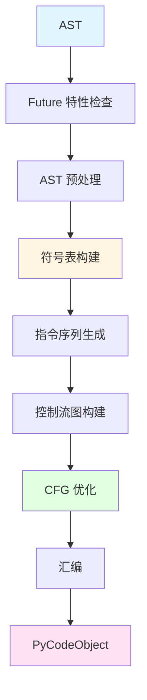

**流程说明**：

1. **Future 特性检查** (`_PyFuture_FromAST`)：扫描 `from __future__ import` 语句，确定编译标志（如 `division`、`annotations`）。这些标志会影响后续编译行为。

2. **AST 预处理** (`_PyAST_Preprocess`)：执行 AST 级别的优化和转换，例如常量表达式求值（`1 + 2` → `3`）、移除 `assert False` 等死代码。

3. **符号表构建** (`_PySymtable_Build`)：两遍扫描 AST，第一遍收集所有符号的定义和使用情况，第二遍分析作用域关系，确定每个变量是局部、全局、自由变量还是 cell 变量。

4. **指令序列生成** (`compiler_codegen`)：递归遍历 AST 节点，调用 `compiler_visit_*` 系列函数生成伪指令序列。此阶段生成的是带有逻辑标签的伪指令，尚未确定实际偏移量。

5. **控制流图构建** (`_PyCfg_FromInstructionSequence`)：将线性指令序列组织为基本块，识别基本块的前驱和后继关系，构建 CFG。

6. **CFG 优化** (`_PyCfg_OptimizeCodeUnit`)：
   - 常量折叠：`LOAD_CONST 1; LOAD_CONST 2; BINARY_ADD` → `LOAD_CONST 3`
   - 窥孔优化：`LOAD_CONST None; RETURN_VALUE` → `RETURN_CONST None`
   - 死代码消除：移除不可达基本块
   - 冷热路径分析：标记异常处理等冷路径

7. **汇编** (`_PyAssemble_MakeCodeObject`)：
   - 伪指令到真实指令转换（如 `LOAD_METHOD` → `LOAD_ATTR` + `PRECALL`）
   - 计算跳转偏移量（逻辑标签 → 相对偏移）
   - 生成异常表（exception table）
   - 生成位置表（location table，映射字节码偏移到源代码行列号）
   - 构建 `PyCodeObject`

### 2.2 核心数据结构关系

```mermaid
classDiagram
    class compiler {
        +c_filename: PyObject
        +c_st: symtable*
        +c_future: _PyFutureFeatures
        +c_flags: PyCompilerFlags
        +c_optimize: int
        +c_const_cache: PyObject
        +u: compiler_unit*
        +c_stack: PyObject
    }

    class compiler_unit {
        +u_ste: PySTEntryObject*
        +u_scope_type: int
        +u_instr_sequence: instr_sequence*
        +u_metadata: _PyCompile_CodeUnitMetadata
        +u_nfblocks: int
        +u_fblock: fblockinfo[]
    }

    class symtable {
        +st_filename: PyObject
        +st_blocks: PyObject
        +st_cur: PySTEntryObject*
        +st_top: PySTEntryObject*
        +st_stack: PyObject
    }

    class PySTEntryObject {
        +ste_id: PyObject
        +ste_symbols: PyObject
        +ste_name: identifier
        +ste_type: _Py_block_ty
        +ste_nested: unsigned
        +ste_generator: unsigned
        +ste_coroutine: unsigned
    }

    class instr_sequence {
        +s_instrs: instruction*
        +s_used: int
        +s_allocated: int
        +s_labelmap: PyObject
    }

    class cfg_builder {
        +g_entryblock: basicblock*
        +g_block_list: basicblock*
        +g_curblock: basicblock*
    }

    class basicblock {
        +b_instr: cfg_instr*
        +b_next: basicblock*
        +b_predecessors: int
        +b_startdepth: int
        +b_except_handler: unsigned
        +b_cold: unsigned
    }

    class PyCodeObject {
        +co_code: PyObject
        +co_consts: PyObject
        +co_names: PyObject
        +co_argcount: int
        +co_stacksize: int
        +co_flags: int
        +co_filename: PyObject
        +co_firstlineno: int
    }

    compiler --> compiler_unit : 当前编译单元
    compiler --> symtable : 符号表
    compiler_unit --> instr_sequence : 指令序列
    compiler_unit --> PySTEntryObject : 符号表条目
    symtable --> PySTEntryObject : 符号表条目
    instr_sequence -.-> cfg_builder : 转换
    cfg_builder --> basicblock : 基本块
    basicblock -.-> PyCodeObject : 汇编
```

**结构说明**：

- **compiler**：全局编译器状态，管理整个编译过程。每个编译任务创建一个 `compiler` 实例。`c_stack` 用于处理嵌套作用域（如函数内部的函数定义）。

- **compiler_unit**：单个代码块（模块、函数、类）的编译状态。编译嵌套作用域时会创建新的 `compiler_unit` 并压入 `c_stack`。

- **symtable**：符号表全局状态。`st_blocks` 是字典，以 AST 节点地址为键存储所有 `PySTEntryObject`。

- **PySTEntryObject**：单个作用域的符号表条目。`ste_symbols` 字典存储该作用域内所有符号的标志（`DEF_LOCAL`、`DEF_GLOBAL`、`USE`、`SCOPE_*`）。

- **instr_sequence**：伪指令序列。`s_labelmap` 存储标签到指令索引的映射。

- **cfg_builder**：控制流图构建器。`g_entryblock` 是入口基本块，通过 `b_next` 链接所有基本块。

- **basicblock**：基本块。`b_instr` 是指令数组，`b_next` 是控制流的下一个块（非跳转），`i_target` 是跳转目标块。

- **PyCodeObject**：最终的代码对象。`co_code` 是字节码字节串，`co_consts` 是常量元组，`co_names` 是名称元组。

### 2.3 模块依赖

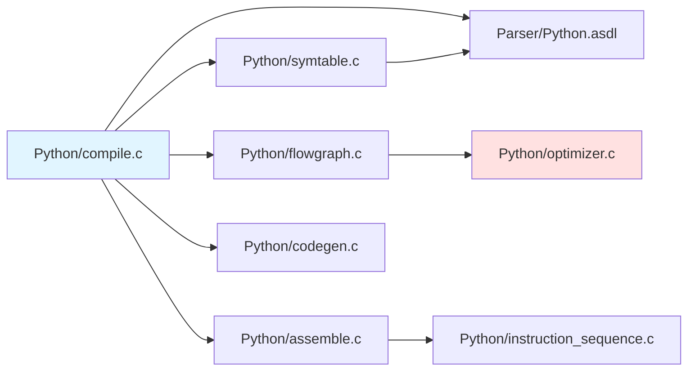

**依赖说明**：
- `compile.c`：主编译器，协调整个流程
- `symtable.c`：符号表构建
- `codegen.c`：AST 到指令序列生成
- `flowgraph.c`：CFG 构建和优化
- `optimizer.c`：Tier 2 优化器（JIT 相关）
- `assemble.c`：字节码汇编
- `instruction_sequence.c`：指令序列数据结构

## 3. 符号表分析

符号表分析是编译的第一个核心阶段，决定了变量的作用域和访问方式。

### 3.1 符号表构建流程

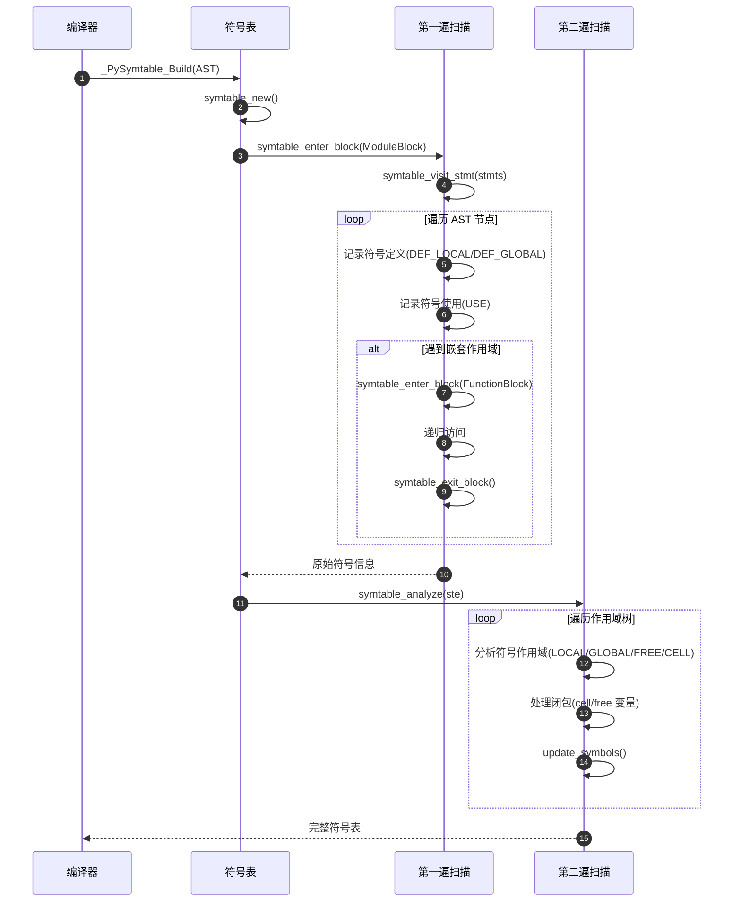

**两遍扫描策略**：

- **第一遍**：收集原始符号信息
  - 符号定义：`DEF_LOCAL`（赋值）、`DEF_GLOBAL`（`global` 声明）、`DEF_PARAM`（参数）
  - 符号使用：`USE`（读取）
  - 符号类型：`DEF_IMPORT`（导入）、`DEF_NONLOCAL`（`nonlocal` 声明）

- **第二遍**：确定作用域
  - `LOCAL`：在当前作用域定义且仅在当前作用域使用
  - `GLOBAL_IMPLICIT`：未定义但被使用，隐式全局
  - `GLOBAL_EXPLICIT`：通过 `global` 显式声明
  - `FREE`：在外层函数作用域定义，在内层函数使用（闭包）
  - `CELL`：在当前作用域定义，被内层函数使用（闭包）

### 3.2 符号表关键代码

```c
// Python/symtable.c

struct symtable *
_PySymtable_Build(mod_ty mod, PyObject *filename, _PyFutureFeatures *future)
{
    struct symtable *st = symtable_new();
    st->st_filename = Py_NewRef(filename);
    st->st_future = future;

    // 进入顶层模块作用域
    if (!symtable_enter_block(st, &_Py_ID(top), ModuleBlock, (void *)mod, loc0)) {
        _PySymtable_Free(st);
        return NULL;
    }

    st->st_top = st->st_cur;

    // 第一遍：遍历 AST 收集符号信息
    switch (mod->kind) {
    case Module_kind:
        seq = mod->v.Module.body;
        for (i = 0; i < asdl_seq_LEN(seq); i++) {
            if (!symtable_visit_stmt(st, (stmt_ty)asdl_seq_GET(seq, i)))
                goto error;
        }
        break;
    // ... 其他模块类型
    }

    if (!symtable_exit_block(st)) {
        _PySymtable_Free(st);
        return NULL;
    }

    // 第二遍：分析作用域
    if (symtable_analyze(st)) {
        return st;
    }

    _PySymtable_Free(st);
    return NULL;
}
```

**符号表条目结构**：

```c
typedef struct _symtable_entry {
    PyObject_HEAD
    PyObject *ste_id;           // 作用域唯一标识（AST 节点地址）
    PyObject *ste_symbols;      // 符号字典 {name: flags}
    PyObject *ste_name;         // 作用域名称
    PyObject *ste_varnames;     // 局部变量列表
    PyObject *ste_children;     // 子作用域列表
    _Py_block_ty ste_type;      // 作用域类型（ModuleBlock/FunctionBlock/ClassBlock）
    int ste_nested;             // 是否嵌套作用域
    unsigned ste_generator : 1;      // 是否生成器
    unsigned ste_coroutine : 1;      // 是否协程
    unsigned ste_returns_value : 1;  // 是否有返回值
    unsigned ste_needs_class_closure : 1;  // 是否需要 __class__ cell
    // ... 其他标志
} PySTEntryObject;
```

**作用域分析核心逻辑**：

```c
// Python/symtable.c: analyze_name()

static int
analyze_name(PySTEntryObject *ste, PyObject *scopes, PyObject *name,
             long flags, PyObject *bound, PyObject *local, PyObject *free,
             PyObject *global)
{
    if (flags & DEF_GLOBAL) {
        // 显式 global 声明
        if (flags & DEF_NONLOCAL) {
            // 错误：不能同时 global 和 nonlocal
            PyErr_Format(PyExc_SyntaxError, "...");
            return 0;
        }
        SET_SCOPE(scopes, name, GLOBAL_EXPLICIT);
        if (PySet_Add(global, name) < 0)
            return 0;
        return 1;
    }

    if (flags & DEF_NONLOCAL) {
        // 显式 nonlocal 声明
        if (!PySet_Contains(bound, name)) {
            // 错误：nonlocal 必须在外层作用域定义
            PyErr_Format(PyExc_SyntaxError, "...");
            return 0;
        }
        SET_SCOPE(scopes, name, FREE);
        // 标记外层作用域为 CELL
        return 1;
    }

    if (flags & DEF_BOUND) {
        // 在当前作用域定义（赋值、参数等）
        SET_SCOPE(scopes, name, LOCAL);
        if (PySet_Add(local, name) < 0)
            return 0;
        if (PySet_Discard(global, name) < 0)
            return 0;
        return 1;
    }

    // 仅使用，未定义
    if (PySet_Contains(bound, name)) {
        // 在外层作用域定义：自由变量
        SET_SCOPE(scopes, name, FREE);
        if (PySet_Add(free, name) < 0)
            return 0;
        return 1;
    }

    // 隐式全局或内置
    SET_SCOPE(scopes, name, GLOBAL_IMPLICIT);
    if (PySet_Add(global, name) < 0)
        return 0;

    return 1;
}
```

**闭包处理示例**：

```python
# 示例代码
def outer(x):
    y = 10
    def inner():
        print(x, y)  # x 和 y 是 FREE 变量
    return inner

# 符号表分析结果：
# outer 作用域:
#   x: CELL (被 inner 使用)
#   y: CELL (被 inner 使用)
#   inner: LOCAL
# inner 作用域:
#   x: FREE (来自 outer)
#   y: FREE (来自 outer)
#   print: GLOBAL_IMPLICIT
```

### 3.3 符号表数据结构

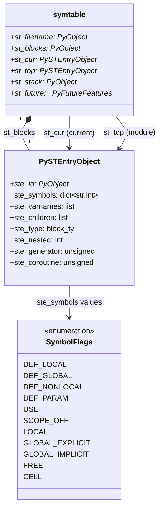

**符号标志组合**：

符号标志是位掩码，可以组合多个标志：

```c
#define DEF_LOCAL           1       // 在当前作用域定义
#define DEF_GLOBAL          2       // global 声明
#define DEF_NONLOCAL        4       // nonlocal 声明
#define USE                 8       // 被使用
#define DEF_PARAM          (1<<4)   // 函数参数
#define DEF_IMPORT         (1<<5)   // 导入符号

#define SCOPE_OFFSET        11      // 作用域标志偏移
#define LOCAL              (1<<11)
#define GLOBAL_EXPLICIT    (2<<11)
#define GLOBAL_IMPLICIT    (3<<11)
#define FREE               (4<<11)
#define CELL               (5<<11)
```

示例：`DEF_LOCAL | USE | LOCAL` 表示在当前作用域定义、被使用、作用域为局部。

## 4. 指令序列生成

指令序列生成是编译的核心阶段，将高级 AST 节点转换为低级伪指令。

### 4.1 代码生成流程

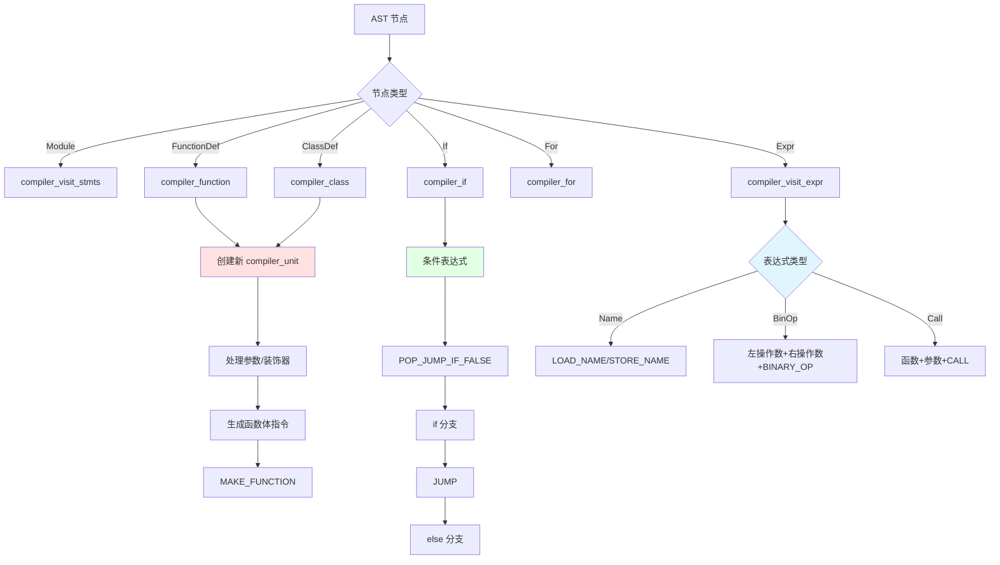

### 4.2 代码生成核心代码

```c
// Python/compile.c

static int
compiler_codegen(compiler *c, mod_ty mod)
{
    // 进入顶层作用域
    _Py_DECLARE_STR(anon_module, "<module>");
    if (!_PyCompile_EnterScope(c, &_Py_STR(anon_module),
                                COMPILER_SCOPE_MODULE,
                                mod, 1)) {
        return ERROR;
    }

    // 访问 AST 生成指令
    location loc = LOCATION(1, 1, 0, 0);
    switch (mod->kind) {
    case Module_kind:
        if (compiler_visit_stmts(c, mod->v.Module.body) < 0) {
            return ERROR;
        }
        break;
    case Interactive_kind:
        // ... 交互模式
        break;
    case Expression_kind:
        // ... 表达式模式
        break;
    }

    // 添加隐式 return None
    if (c->u->u_ste->ste_type != ModuleBlock) {
        ADDOP_LOAD_CONST(c, NO_LOCATION, Py_None);
    }
    ADDOP(c, NO_LOCATION, RETURN_VALUE);

    return SUCCESS;
}
```

**AST 节点访问器模式**：

```c
static int
compiler_visit_stmt(struct compiler *c, stmt_ty s)
{
    switch (s->kind) {
    case FunctionDef_kind:
        return compiler_function(c, s, 0);
    case ClassDef_kind:
        return compiler_class(c, s);
    case Return_kind:
        return compiler_return(c, s);
    case Assign_kind:
        return compiler_assign(c, s);
    case If_kind:
        return compiler_if(c, s);
    case While_kind:
        return compiler_while(c, s);
    case For_kind:
        return compiler_for(c, s);
    // ... 其他语句类型
    }
    return SUCCESS;
}
```

**控制流语句示例：if 语句**

```c
static int
compiler_if(struct compiler *c, stmt_ty s)
{
    basicblock *end, *next;
    assert(s->kind == If_kind);

    end = compiler_new_block(c);
    if (end == NULL) {
        return ERROR;
    }

    // 处理 elif 链
    next = end;
    for (int i = 0; i < asdl_seq_LEN(s->v.If.orelse); i++) {
        next = compiler_new_block(c);
        if (next == NULL) {
            return ERROR;
        }
    }

    // 生成条件判断
    RETURN_IF_ERROR(compiler_jump_if(c, s->v.If.test, next, 0));

    // if 分支
    VISIT_SEQ(c, stmt, s->v.If.body);
    ADDOP_JUMP(c, NO_LOCATION, JUMP, end);

    // else/elif 分支
    USE_LABEL(c, next);
    if (asdl_seq_LEN(s->v.If.orelse)) {
        VISIT_SEQ(c, stmt, s->v.If.orelse);
    }

    USE_LABEL(c, end);
    return SUCCESS;
}
```

**示例代码及生成的指令**：

```python
# 源代码
if x > 10:
    print("big")
else:
    print("small")

# 生成的伪指令序列（简化）：
  1 LOAD_NAME           x
  2 LOAD_CONST          10
  3 COMPARE_OP          >
  4 POP_JUMP_IF_FALSE   label_else
  5 LOAD_NAME           print
  6 LOAD_CONST          "big"
  7 CALL                1
  8 POP_TOP
  9 JUMP                label_end
 10 label_else:
 11 LOAD_NAME           print
 12 LOAD_CONST          "small"
 13 CALL                1
 14 POP_TOP
 15 label_end:
```

### 4.3 函数编译

函数编译涉及新作用域的创建和嵌套代码对象的生成。

```c
static int
compiler_function(struct compiler *c, stmt_ty s, int is_async)
{
    PyCodeObject *co;
    PyObject *qualname, *docstring = NULL;
    arguments_ty args;
    expr_ty returns;
    identifier name;
    asdl_stmt_seq *body;

    assert(s->kind == FunctionDef_kind);

    name = s->v.FunctionDef.name;
    args = s->v.FunctionDef.args;
    returns = s->v.FunctionDef.returns;
    body = s->v.FunctionDef.body;

    // 1. 处理装饰器（从下到上执行）
    VISIT_SEQ(c, expr, s->v.FunctionDef.decorator_list);

    // 2. 处理默认参数
    if (compiler_visit_defaults(c, args) < 0) {
        return ERROR;
    }

    // 3. 处理注解
    if (compiler_visit_annotations(c, args, returns) < 0) {
        return ERROR;
    }

    // 4. 进入新作用域编译函数体
    if (!_PyCompile_EnterScope(c, name, COMPILER_SCOPE_FUNCTION,
                                (void *)s, s->lineno)) {
        return ERROR;
    }

    // 5. 生成函数体指令
    docstring = _PyAST_GetDocString(body);
    if (compiler_visit_stmts(c, body) < 0) {
        _PyCompile_ExitScope(c);
        return ERROR;
    }

    // 6. 添加隐式 return None
    if (!c->u->u_ste->ste_returns_value) {
        ADDOP_LOAD_CONST(c, NO_LOCATION, Py_None);
        ADDOP(c, NO_LOCATION, RETURN_VALUE);
    }

    // 7. 退出作用域，获取代码对象
    co = assemble(c, 1);
    _PyCompile_ExitScope(c);
    if (co == NULL) {
        return ERROR;
    }

    // 8. 生成 MAKE_FUNCTION 指令
    if (compiler_make_closure(c, co, s->v.FunctionDef.decorator_list) < 0) {
        Py_DECREF(co);
        return ERROR;
    }
    Py_DECREF(co);

    // 9. 应用装饰器
    for (Py_ssize_t i = 0; i < asdl_seq_LEN(s->v.FunctionDef.decorator_list); i++) {
        ADDOP_I(c, LOC(s), CALL, 1);
    }

    // 10. 存储函数对象
    return compiler_nameop(c, LOC(s), name, Store);
}
```

**函数编译示例**：

```python
# 源代码
@decorator
def func(x, y=10):
    """文档字符串"""
    return x + y

# 生成的指令序列（主模块）：
  1 LOAD_NAME           decorator       # 加载装饰器
  2 LOAD_CONST          10              # 默认参数
  3 LOAD_CONST          <code: func>    # 函数代码对象
  4 MAKE_FUNCTION       DEFAULTS        # 创建函数
  5 CALL                1               # 应用装饰器
  6 STORE_NAME          func            # 存储函数

# func 代码对象的指令序列：
  1 LOAD_FAST           x
  2 LOAD_FAST           y
  3 BINARY_ADD
  4 RETURN_VALUE
```

### 4.4 指令序列数据结构

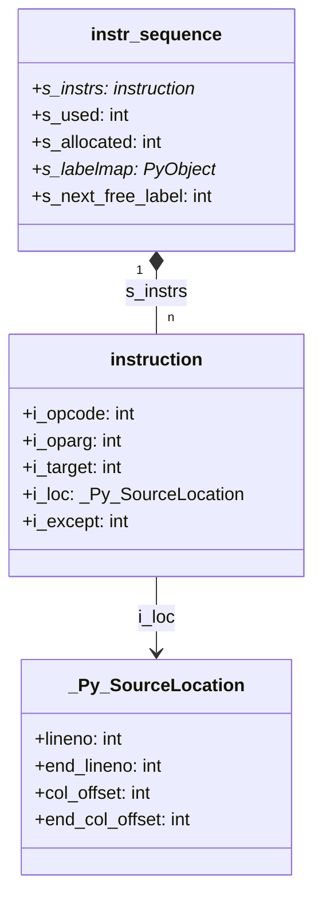

**指令添加宏**：

```c
// 添加无参数指令
#define ADDOP(C, LOC, OP) \
    _PyInstructionSequence_Addop((C)->u->u_instr_sequence, (OP), 0, (LOC))

// 添加带整数参数指令
#define ADDOP_I(C, LOC, OP, O) \
    _PyInstructionSequence_Addop((C)->u->u_instr_sequence, (OP), (O), (LOC))

// 添加跳转指令
#define ADDOP_JUMP(C, LOC, OP, LABEL) \
    _PyInstructionSequence_Addop((C)->u->u_instr_sequence, (OP), (LABEL).id, (LOC))

// 添加常量加载指令
#define ADDOP_LOAD_CONST(C, LOC, O) \
    _PyCompiler_Addconst((C), (O), (LOC))
```

## 5. 控制流图

控制流图（CFG）将线性指令序列组织为基本块，便于优化分析。

### 5.1 基本块与 CFG

**基本块定义**：
- 单入口：只能从第一条指令进入
- 单出口：只能从最后一条指令离开
- 顺序执行：内部指令顺序执行，无跳转

**CFG 构建规则**：
1. 跳转指令必须是基本块的最后一条指令
2. 跳转目标必须是基本块的第一条指令
3. 函数调用、异常处理会影响基本块划分

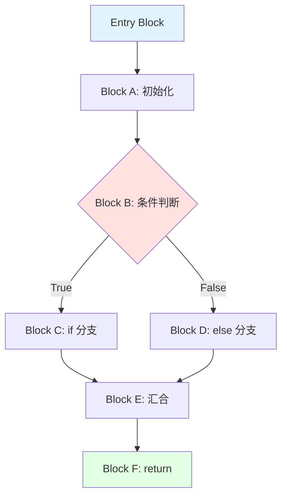

### 5.2 CFG 构建代码

```c
// Python/flowgraph.c

int
_PyCfg_FromInstructionSequence(cfg_builder *g, instr_sequence *seq)
{
    // 创建入口基本块
    g->g_entryblock = cfg_builder_new_block(g);
    if (g->g_entryblock == NULL) {
        return ERROR;
    }
    g->g_curblock = g->g_entryblock;

    // 遍历指令序列，划分基本块
    for (int i = 0; i < seq->s_used; i++) {
        instruction *instr = &seq->s_instrs[i];

        // 如果指令是跳转目标，创建新基本块
        if (is_jump_target(instr)) {
            basicblock *b = cfg_builder_use_label(g, instr->i_target);
            if (b == NULL) {
                return ERROR;
            }
            g->g_curblock->b_next = b;
            g->g_curblock = b;
        }

        // 添加指令到当前基本块
        if (basicblock_addop(g->g_curblock, instr->i_opcode, instr->i_oparg,
                             instr->i_loc) < 0) {
            return ERROR;
        }

        // 处理跳转指令
        if (is_jump(instr)) {
            basicblock *target = cfg_builder_use_label(g, instr->i_target);
            if (target == NULL) {
                return ERROR;
            }
            g->g_curblock->b_instr[g->g_curblock->b_iused - 1].i_target = target;

            // 无条件跳转后创建新基本块
            if (is_unconditional_jump(instr->i_opcode)) {
                basicblock *b = cfg_builder_new_block(g);
                if (b == NULL) {
                    return ERROR;
                }
                g->g_curblock->b_next = NULL;  // 断开自然流
                g->g_curblock = b;
            }
        }
    }

    return SUCCESS;
}
```

### 5.3 CFG 优化

CFG 优化包括多种技术，主要目标是减少指令数量和执行时间。

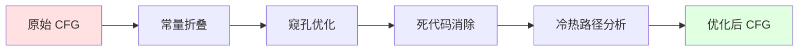

**优化示例**：

**1. 常量折叠**

```python
# 优化前
x = 1 + 2 + 3

# 指令（优化前）：
LOAD_CONST 1
LOAD_CONST 2
BINARY_ADD
LOAD_CONST 3
BINARY_ADD
STORE_NAME x

# 指令（优化后）：
LOAD_CONST 6
STORE_NAME x
```

**2. 窥孔优化**

```c
// Python/flowgraph.c: optimize_basic_block()

static int
optimize_basic_block(basicblock *bb, PyObject *consts)
{
    cfg_instr *inst;
    int opcode;
    int oparg;
    cfg_instr *prev_op = NULL;

    for (int i = 0; i < bb->b_iused; i++) {
        inst = &bb->b_instr[i];
        opcode = inst->i_opcode;
        oparg = inst->i_oparg;

        // 优化：LOAD_CONST None; RETURN_VALUE → RETURN_CONST None
        if (opcode == LOAD_CONST && i + 1 < bb->b_iused) {
            cfg_instr *next = &bb->b_instr[i + 1];
            if (next->i_opcode == RETURN_VALUE) {
                PyObject *value = PyTuple_GET_ITEM(consts, oparg);
                if (value == Py_None || value == Py_True || value == Py_False) {
                    INSTR_SET_OP0(inst, RETURN_CONST);
                    inst->i_oparg = oparg;
                    // 移除 RETURN_VALUE
                    bb->b_iused--;
                    memmove(next, next + 1, (bb->b_iused - i - 1) * sizeof(cfg_instr));
                }
            }
        }

        // 优化：LOAD_CONST x; POP_TOP → NOP（删除）
        if (opcode == LOAD_CONST && i + 1 < bb->b_iused) {
            cfg_instr *next = &bb->b_instr[i + 1];
            if (next->i_opcode == POP_TOP) {
                // 标记为 NOP，后续会移除
                INSTR_SET_OP0(inst, NOP);
                INSTR_SET_OP0(next, NOP);
            }
        }

        // 优化：跳转到下一条指令 → 移除跳转
        if (is_jump(inst) && inst->i_target == bb->b_next) {
            INSTR_SET_OP0(inst, NOP);
        }

        prev_op = inst;
    }

    // 移除所有 NOP 指令
    return eliminate_nops(bb);
}
```

**3. 死代码消除**

```python
# 示例代码
def func():
    return 1
    print("unreachable")  # 死代码

# CFG 分析后，检测到 return 之后的代码不可达，直接移除
```

**4. 冷热路径分析**

```c
// Python/flowgraph.c: mark_cold_blocks()

static int
mark_cold_blocks(basicblock *entryblock)
{
    // 1. 标记所有异常处理块为冷路径
    for (basicblock *b = entryblock; b != NULL; b = b->b_next) {
        if (b->b_except_handler) {
            b->b_cold = 1;
        }
    }

    // 2. 从冷块反向标记所有只被冷块引用的块
    int changed = 1;
    while (changed) {
        changed = 0;
        for (basicblock *b = entryblock; b != NULL; b = b->b_next) {
            if (b->b_cold) {
                continue;
            }

            // 检查是否所有前驱都是冷块
            int all_preds_cold = 1;
            for (basicblock *p = entryblock; p != NULL; p = p->b_next) {
                if (p->b_next == b || (p->b_iused > 0 && p->b_instr[p->b_iused - 1].i_target == b)) {
                    if (!p->b_cold) {
                        all_preds_cold = 0;
                        break;
                    }
                }
            }

            if (all_preds_cold) {
                b->b_cold = 1;
                changed = 1;
            }
        }
    }

    return SUCCESS;
}
```

**冷热路径用途**：
- 冷路径（异常处理、断言失败）布局在代码末尾，减少热路径的指令缓存污染
- Tier 2 优化器只对热路径生成机器码

## 6. 字节码汇编

汇编阶段将优化后的 CFG 转换为最终的字节码。

### 6.1 汇编流程

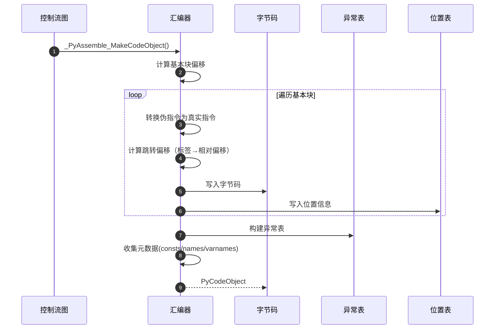

### 6.2 汇编核心代码

```c
// Python/assemble.c

static PyCodeObject *
assemble(struct compiler *c, int addNone)
{
    PyCodeObject *co = NULL;
    PyObject *consts = NULL;
    cfg_builder *g;
    instr_sequence *seq;

    // 1. 从指令序列构建 CFG
    g = _PyCfg_FromInstructionSequence(c->u->u_instr_sequence);
    if (g == NULL) {
        return NULL;
    }

    // 2. 优化 CFG
    if (_PyCfg_OptimizeCodeUnit(g, c->c_const_cache, c->c_optimize, consts,
                                 c->u->u_metadata.u_firstlineno) < 0) {
        goto error;
    }

    // 3. 计算栈深度
    if (_PyCfg_Stackdepth(g) < 0) {
        goto error;
    }
    int maxdepth = g->g_entryblock->b_startdepth;

    // 4. CFG 转回指令序列
    seq = _PyCfg_OptimizedCfgToInstructionSequence(g);
    if (seq == NULL) {
        goto error;
    }

    // 5. 汇编指令序列
    co = _PyAssemble_MakeCodeObject(&c->u->u_metadata, consts, maxdepth,
                                     seq, c->u->u_metadata.u_firstlineno);

error:
    _PyCfgBuilder_Free(g);
    _PyInstructionSequence_Free(seq);
    Py_XDECREF(consts);
    return co;
}
```

**指令汇编**：

```c
static int
assemble_emit(struct assembler *a, instruction *instr, int size)
{
    int opcode = instr->i_opcode;
    int oparg = instr->i_oparg;

    // 处理扩展参数
    while (oparg > 0xFF) {
        write_op_arg(a, EXTENDED_ARG, (oparg >> 8) & 0xFF, instr->i_loc);
        oparg &= 0xFF;
    }

    // 写入指令
    write_op_arg(a, opcode, oparg, instr->i_loc);

    // 写入内联缓存
    int ncaches = _PyOpcode_Caches[opcode];
    for (int i = 0; i < ncaches; i++) {
        write_op_arg(a, CACHE, 0, NO_LOCATION);
    }

    return SUCCESS;
}
```

**跳转偏移计算**：

```c
static int
assemble_jump_offsets(instr_sequence *seq)
{
    int offset = 0;

    // 第一遍：计算每条指令的偏移
    for (int i = 0; i < seq->s_used; i++) {
        instruction *instr = &seq->s_instrs[i];
        instr->i_offset = offset;
        offset += instr_size(instr);  // 指令大小（含扩展参数和缓存）
    }

    // 第二遍：计算跳转偏移量
    for (int i = 0; i < seq->s_used; i++) {
        instruction *instr = &seq->s_instrs[i];
        if (is_jump(instr)) {
            int target_offset = seq->s_instrs[instr->i_target].i_offset;
            if (IS_RELATIVE_JUMP(instr->i_opcode)) {
                // 相对跳转：目标偏移 - 当前偏移
                instr->i_oparg = (target_offset - instr->i_offset) / sizeof(_Py_CODEUNIT);
            } else {
                // 绝对跳转
                instr->i_oparg = target_offset / sizeof(_Py_CODEUNIT);
            }
        }
    }

    return SUCCESS;
}
```

### 6.3 异常表生成

异常表记录每个 `try` 块的范围和对应的 `except`/`finally` 处理器。

```c
// Python/assemble.c

static int
assemble_exception_table(struct assembler *a, instr_sequence *seq)
{
    // 遍历指令，收集异常处理信息
    for (int i = 0; i < seq->s_used; i++) {
        instruction *instr = &seq->s_instrs[i];

        if (instr->i_except >= 0) {
            int start = instr->i_offset;
            int end = instr->i_offset + instr_size(instr);
            int handler = seq->s_instrs[instr->i_except].i_offset;
            int depth = instr->i_except_depth;
            int lasti = instr->i_preserve_lasti;

            // 写入异常表条目
            write_except_byte(a, (end - start) >> 1);  // 范围长度
            write_except_byte(a, (handler - end) >> 1); // 处理器偏移
            write_except_byte(a, depth);                // 栈深度
            write_except_byte(a, lasti);                // lasti 标志
        }
    }

    return SUCCESS;
}
```

**异常表格式**（每个条目 4 字节）：

| 字节 | 含义 |
|-----|------|
| 0   | try 块长度（指令数） |
| 1   | 处理器相对偏移 |
| 2   | 异常栈深度 |
| 3   | lasti 保留标志 |

### 6.4 位置表生成

位置表（Location Table）记录字节码偏移到源代码位置的映射，用于异常回溯和调试。

```c
static int
write_location_info(struct assembler *a, instruction *instr)
{
    location loc = instr->i_loc;

    // 压缩编码：使用变长编码减小表大小
    if (loc.lineno == a->a_lineno &&
        loc.end_lineno == a->a_lineno &&
        loc.col_offset == 0 &&
        loc.end_col_offset == 0) {
        // 短格式：同一行，无列信息
        write_location_byte(a, PY_CODE_LOCATION_INFO_SHORT0);
    } else if (loc.lineno == loc.end_lineno &&
               loc.col_offset == 0 &&
               loc.end_col_offset == 0) {
        // 单行格式：同一行，无列信息，但行号变化
        write_location_byte(a, PY_CODE_LOCATION_INFO_ONE_LINE0);
        write_location_signed_varint(a, loc.lineno - a->a_lineno);
    } else {
        // 完整格式：包含行列号
        write_location_byte(a, PY_CODE_LOCATION_INFO_LONG);
        write_location_signed_varint(a, loc.lineno - a->a_lineno);
        write_location_varint(a, loc.end_lineno - loc.lineno);
        write_location_varint(a, loc.col_offset);
        write_location_varint(a, loc.end_col_offset);
    }

    a->a_lineno = loc.end_lineno;
    return SUCCESS;
}
```

## 7. PyCodeObject 结构

`PyCodeObject` 是编译的最终产物，封装了执行所需的所有信息。

### 7.1 PyCodeObject 字段详解

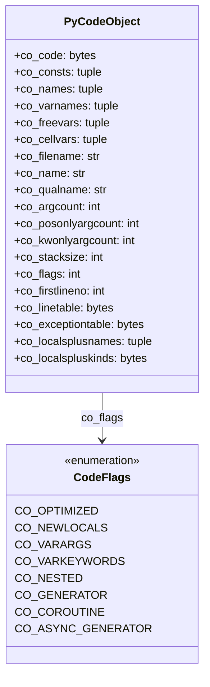

**关键字段说明**：

| 字段 | 类型 | 说明 |
|-----|------|------|
| `co_code` | `bytes` | 字节码字节串，每条指令 2 字节 |
| `co_consts` | `tuple` | 常量元组（数字、字符串、嵌套代码对象等） |
| `co_names` | `tuple` | 全局/属性名称（`LOAD_GLOBAL`、`LOAD_ATTR` 等使用） |
| `co_varnames` | `tuple` | 局部变量名称（按索引访问） |
| `co_freevars` | `tuple` | 自由变量名称（闭包变量） |
| `co_cellvars` | `tuple` | cell 变量名称（被内层函数引用） |
| `co_argcount` | `int` | 位置参数数量（不含 `*args`） |
| `co_posonlyargcount` | `int` | 仅位置参数数量（Python 3.8+） |
| `co_kwonlyargcount` | `int` | 仅关键字参数数量 |
| `co_stacksize` | `int` | 执行所需的最大栈深度 |
| `co_flags` | `int` | 代码标志位掩码 |
| `co_firstlineno` | `int` | 第一行行号 |
| `co_linetable` | `bytes` | 位置表（压缩编码） |
| `co_exceptiontable` | `bytes` | 异常表 |
| `co_localsplusnames` | `tuple` | 所有局部变量名（locals + cells + freevars） |
| `co_localspluskinds` | `bytes` | 局部变量类型（每字节一个变量） |

**co_flags 标志位**：

```c
#define CO_OPTIMIZED            0x0001  // 使用 LOAD_FAST（函数局部变量）
#define CO_NEWLOCALS            0x0002  // 创建新局部命名空间
#define CO_VARARGS              0x0004  // 有 *args
#define CO_VARKEYWORDS          0x0008  // 有 **kwargs
#define CO_NESTED               0x0010  // 嵌套函数
#define CO_GENERATOR            0x0020  // 生成器函数
#define CO_COROUTINE            0x0080  // 协程函数
#define CO_ASYNC_GENERATOR      0x0200  // 异步生成器
```

### 7.2 代码对象创建

```c
// Python/assemble.c

PyCodeObject *
_PyAssemble_MakeCodeObject(_PyCompile_CodeUnitMetadata *umd, PyObject *consts,
                           int maxdepth, instr_sequence *seq, int firstlineno)
{
    PyCodeObject *co = NULL;
    PyObject *names = NULL;
    PyObject *code = NULL;
    PyObject *linetable = NULL;
    PyObject *exceptiontable = NULL;

    // 1. 汇编字节码
    struct assembler a;
    if (assemble_init(&a, firstlineno) < 0) {
        goto error;
    }

    for (int i = 0; i < seq->s_used; i++) {
        instruction *instr = &seq->s_instrs[i];
        if (assemble_emit(&a, instr, instr_size(instr)) < 0) {
            goto error;
        }
    }

    code = a.a_bytecode;
    linetable = a.a_linetable;
    exceptiontable = a.a_except_table;

    // 2. 创建代码对象
    co = PyUnstable_Code_NewWithPosOnlyArgs(
        umd->u_argcount,           // argcount
        umd->u_posonlyargcount,    // posonlyargcount
        umd->u_kwonlyargcount,     // kwonlyargcount
        umd->u_nlocals,            // nlocals
        maxdepth,                  // stacksize
        umd->u_flags,              // flags
        code,                      // code
        consts,                    // consts
        umd->u_names,              // names
        umd->u_varnames,           // varnames
        umd->u_freevars,           // freevars
        umd->u_cellvars,           // cellvars
        umd->u_filename,           // filename
        umd->u_name,               // name
        umd->u_qualname,           // qualname
        firstlineno,               // firstlineno
        linetable,                 // linetable
        exceptiontable             // exceptiontable
    );

error:
    assemble_free(&a);
    return co;
}
```

### 7.3 代码对象示例

```python
# 示例函数
def factorial(n):
    """计算阶乘"""
    if n <= 1:
        return 1
    return n * factorial(n - 1)

# 对应的 PyCodeObject（简化表示）：
code_object = {
    'co_name': 'factorial',
    'co_filename': '<stdin>',
    'co_argcount': 1,
    'co_kwonlyargcount': 0,
    'co_nlocals': 1,
    'co_stacksize': 3,
    'co_flags': CO_OPTIMIZED | CO_NEWLOCALS,
    'co_code': bytes([
        LOAD_FAST, 0,        # n
        LOAD_CONST, 1,       # 1
        COMPARE_OP, 1,       # <=
        POP_JUMP_IF_FALSE, 8,
        LOAD_CONST, 1,       # 1
        RETURN_VALUE,
        LOAD_FAST, 0,        # n
        LOAD_GLOBAL, 0,      # factorial
        LOAD_FAST, 0,        # n
        LOAD_CONST, 1,       # 1
        BINARY_OP, 2,        # -
        CALL, 1,
        BINARY_OP, 5,        # *
        RETURN_VALUE,
    ]),
    'co_consts': (None, 1, "计算阶乘"),
    'co_names': ('factorial',),
    'co_varnames': ('n',),
    'co_freevars': (),
    'co_cellvars': (),
}
```

## 8. 编译时序图

### 8.1 完整编译流程

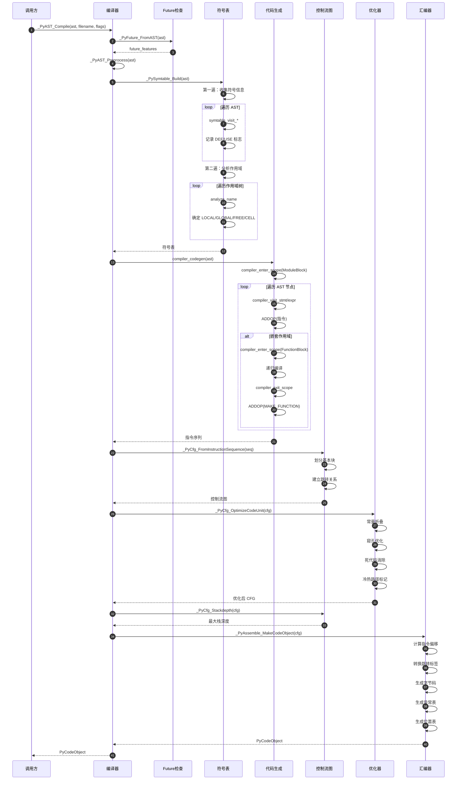

### 8.2 符号表构建时序图

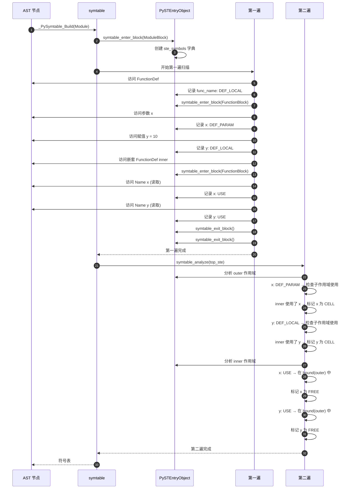

### 8.3 函数编译时序图

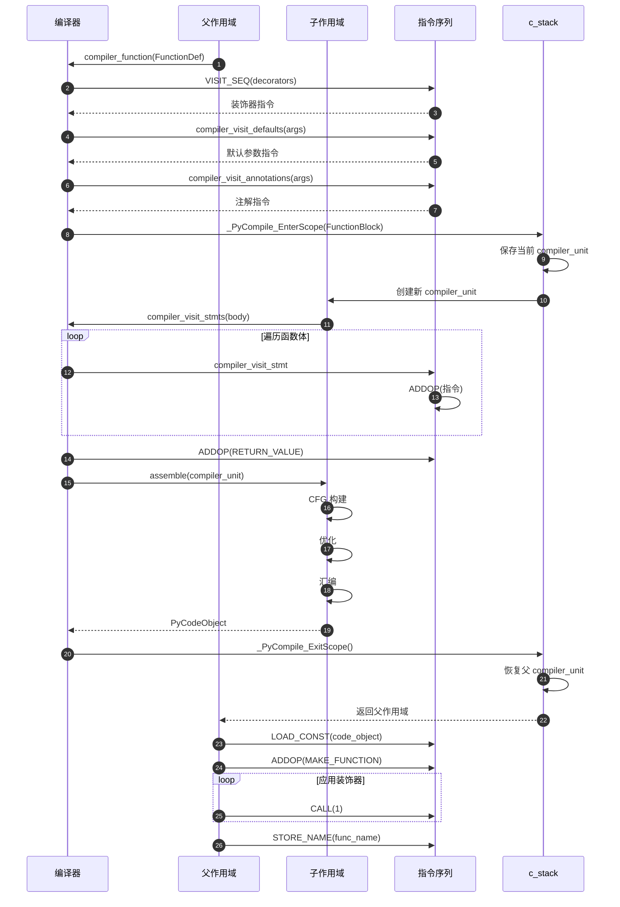

## 9. 关键优化技术

### 9.1 栈深度计算

栈深度决定了 `PyCodeObject.co_stacksize`，影响帧对象的内存分配。

```c
// Python/flowgraph.c

static int
stackdepth(basicblock *entryblock, int max_depth)
{
    basicblock *b;
    for (b = entryblock; b != NULL; b = b->b_next) {
        if (b->b_startdepth < 0) {
            // 尚未计算，从入口块开始
            b->b_startdepth = 0;
        }

        int depth = b->b_startdepth;

        for (int i = 0; i < b->b_iused; i++) {
            cfg_instr *instr = &b->b_instr[i];
            int effect = stack_effect(instr->i_opcode, instr->i_oparg, -1);
            depth += effect;

            if (depth > max_depth) {
                max_depth = depth;
            }

            if (depth < 0) {
                // 栈下溢，编译错误
                PyErr_SetString(PyExc_SystemError, "stack underflow");
                return -1;
            }
        }

        // 设置后继块的起始深度
        if (b->b_next) {
            b->b_next->b_startdepth = depth;
        }

        // 设置跳转目标块的起始深度
        if (is_jump(&b->b_instr[b->b_iused - 1])) {
            basicblock *target = b->b_instr[b->b_iused - 1].i_target;
            if (target->b_startdepth < 0) {
                target->b_startdepth = depth;
            } else if (target->b_startdepth != depth) {
                // 多路径到达同一块，深度必须一致
                PyErr_SetString(PyExc_SystemError, "inconsistent stack depth");
                return -1;
            }
        }
    }

    return max_depth;
}
```

**指令栈效果表**（`stack_effect` 函数）：

| 指令 | 栈效果 | 说明 |
|-----|-------|------|
| `LOAD_CONST` | +1 | 压入常量 |
| `LOAD_FAST` | +1 | 压入局部变量 |
| `STORE_FAST` | -1 | 弹出并存储到局部变量 |
| `BINARY_ADD` | -1 | 弹出 2 个，压入 1 个 |
| `CALL` | `-n` | 弹出函数和 n 个参数，压入返回值 |
| `RETURN_VALUE` | -1 | 弹出返回值 |
| `POP_TOP` | -1 | 弹出栈顶 |
| `DUP_TOP` | +1 | 复制栈顶 |

### 9.2 内联缓存槽分配

自 Python 3.11 起，指令可以携带内联缓存（inline cache），用于加速频繁操作。

```c
// Include/internal/pycore_opcode_metadata.h

const uint8_t _PyOpcode_Caches[256] = {
    [LOAD_GLOBAL] = 4,      // 4 个缓存单元（8 字节）
    [LOAD_ATTR] = 9,        // 9 个缓存单元
    [STORE_ATTR] = 4,
    [CALL] = 3,
    [BINARY_SUBSCR] = 1,
    // ... 其他指令
};
```

**内联缓存布局示例（`LOAD_GLOBAL`）**：

```
偏移  | 内容
------|------------------
0     | LOAD_GLOBAL oparg
2     | CACHE (counter)
4     | CACHE (version)
6     | CACHE (index_low)
8     | CACHE (index_high)
```

**作用**：
- `counter`：调用计数器，达到阈值后尝试特化
- `version`：全局字典版本号，失效检测
- `index`：缓存的字典索引，快速查找

## 10. 边界与异常处理

### 10.1 编译时错误检测

编译器需要检测语法正确但语义错误的代码：

```c
// 示例：检测 yield 只能在函数中使用
if (c->u->u_scope_type != COMPILER_SCOPE_FUNCTION &&
    c->u->u_scope_type != COMPILER_SCOPE_LAMBDA) {
    compiler_error(c, "'yield' outside function");
    return ERROR;
}

// 检测 return 带值只能在函数中
if (c->u->u_ste->ste_type == ClassBlock) {
    compiler_error(c, "'return' with value in class scope");
    return ERROR;
}

// 检测 break/continue 只能在循环中
if (c->u->u_nfblocks == 0 || !IS_LOOP(c->u->u_fblock[c->u->u_nfblocks - 1])) {
    compiler_error(c, "'break' outside loop");
    return ERROR;
}
```

### 10.2 编译限制

```c
#define CO_MAXBLOCKS 21         // 最大嵌套块深度（try/for/with 等）
#define MAX_INSTR_SIZE 4        // 单条指令最大大小（EXTENDED_ARG * 3 + 指令）
#define MAX_STACKSIZE 32768     // 最大栈深度
```

**超限处理**：

```c
if (c->u->u_nfblocks >= CO_MAXBLOCKS) {
    compiler_error(c, "too many statically nested blocks");
    return ERROR;
}

if (maxdepth > MAX_STACKSIZE) {
    compiler_error(c, "stack overflow");
    return ERROR;
}
```

## 11. 性能考量

### 11.1 编译时间优化

- **符号表缓存**：避免重复分析相同作用域
- **指令序列预分配**：减少动态扩展次数
- **常量池去重**：`c_const_cache` 字典避免重复常量

### 11.2 生成代码质量

- **窥孔优化**：减少指令数量
- **冷热路径分离**：提高指令缓存命中率
- **内联缓存预留**：为运行时优化留出空间

### 11.3 内存管理

- **Arena 分配器**：编译过程使用 arena 统一管理内存，编译结束后一次性释放
- **符号表生命周期**：编译完成后符号表被释放，仅保留代码对象

## 12. 总结

编译器模块将高级 AST 转换为高效的字节码，涉及复杂的符号分析、代码生成和优化技术。关键设计包括：

1. **两遍符号表分析**：精确确定变量作用域，支持闭包和嵌套作用域
2. **CFG 中间表示**：便于优化和分析
3. **多阶段优化**：AST 级、CFG 级、字节码级
4. **位置表和异常表**：支持精确的错误报告和异常处理
5. **内联缓存预留**：为运行时优化（特化、JIT）提供基础

整个编译流程在保证正确性的同时，通过多种优化技术提升生成代码的执行效率。


## 14. 编译器API源码深度剖析

### 14.1 核心编译API：_PyAST_Compile

```c
// Python/compile.c

PyCodeObject* _PyAST_Compile(mod_ty mod, PyObject *filename,
                              PyCompilerFlags *flags, int optimize,
                              PyArena *arena)
{
    struct compiler c;
    PyCodeObject *co = NULL;
    
    // 1. 初始化编译器
    if (!compiler_init(&c, filename, flags, optimize, arena)) {
        return NULL;
    }
    
    // 2. 构建符号表
    c.c_st = _PySymtable_Build(mod, filename, c.c_future);
    if (c.c_st == NULL) {
        compiler_free(&c);
        return NULL;
    }
    
    // 3. 编译AST模块
    co = compiler_mod(&c, mod);
    
    // 4. 清理编译器
    compiler_free(&c);
    
    return co;
}
```

**完整编译流程时序图**：

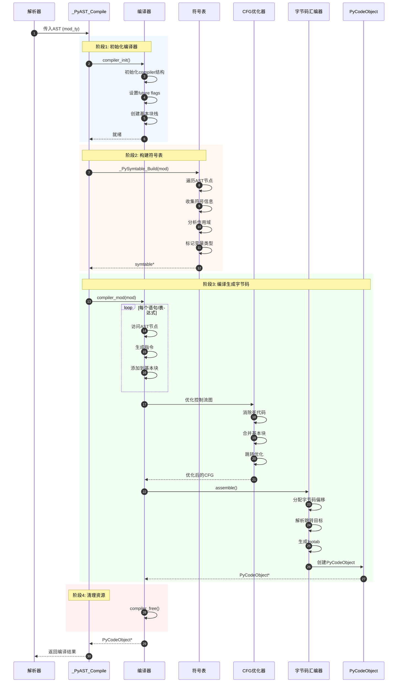

### 14.2 编译器核心数据结构UML图

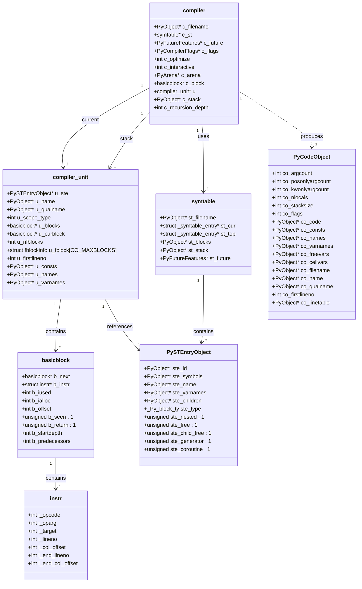

### 14.3 符号表构建详解

**符号表构建算法**：

```c
// Python/symtable.c

struct symtable* _PySymtable_Build(mod_ty mod, PyObject *filename,
                                     PyFutureFeatures *future)
{
    struct symtable *st = symtable_new();
    asdl_stmt_seq *seq;
    
    st->st_filename = filename;
    st->st_future = future;
    
    // 创建顶层符号表项
    if (!symtable_enter_block(st, &_Py_ID(top), ModuleBlock,
                               (void *)mod, 0, 0)) {
        _PySymtable_Free(st);
        return NULL;
    }
    
    st->st_top = st->st_cur;
    
    // 遍历AST并构建符号表
    switch (mod->kind) {
    case Module_kind:
        seq = mod->v.Module.body;
        for (int i = 0; i < asdl_seq_LEN(seq); i++) {
            stmt_ty s = (stmt_ty)asdl_seq_GET(seq, i);
            if (!symtable_visit_stmt(st, s))
                goto error;
        }
        break;
    // ... 其他情况
    }
    
    // 分析符号作用域
    if (!symtable_analyze(st))
        goto error;
    
    return st;
    
error:
    _PySymtable_Free(st);
    return NULL;
}
```

**符号作用域分析**：

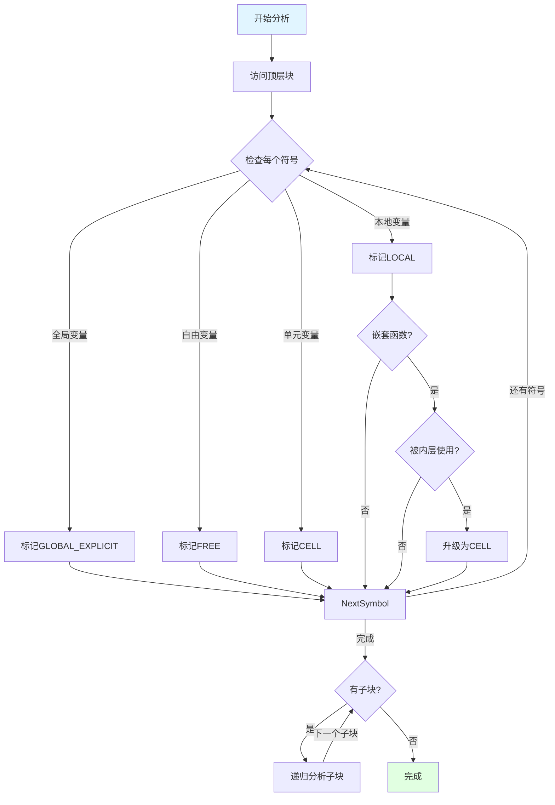

### 14.4 字节码生成详解

**编译语句的核心函数**：

```c
// Python/compile.c

static int compiler_visit_stmt(struct compiler *c, stmt_ty s)
{
    switch (s->kind) {
    case FunctionDef_kind:
        return compiler_function(c, s, 0);
    case ClassDef_kind:
        return compiler_class(c, s);
    case Return_kind:
        return compiler_return(c, s);
    case If_kind:
        return compiler_if(c, s);
    case For_kind:
        return compiler_for(c, s);
    case While_kind:
        return compiler_while(c, s);
    case Assign_kind:
        return compiler_assign(c, s);
    // ... 更多语句类型
    default:
        PyErr_Format(PyExc_SystemError, "unknown statement kind %d", s->kind);
        return 0;
    }
}
```

**if语句编译示例**：

```c
static int compiler_if(struct compiler *c, stmt_ty s)
{
    basicblock *end, *next;
    
    // 创建基本块
    end = compiler_new_block(c);
    if (end == NULL)
        return 0;
    
    next = compiler_new_block(c);
    if (next == NULL)
        return 0;
    
    // 编译测试表达式
    VISIT(c, expr, s->v.If.test);
    ADDOP_JUMP(c, LOC(s), POP_JUMP_IF_FALSE, next);
    
    // 编译if块
    VISIT_SEQ(c, stmt, s->v.If.body);
    ADDOP_JUMP(c, NO_LOCATION, JUMP, end);
    
    // 编译else块
    compiler_use_next_block(c, next);
    if (s->v.If.orelse)
        VISIT_SEQ(c, stmt, s->v.If.orelse);
    
    compiler_use_next_block(c, end);
    return 1;
}
```

**生成字节码流程**：

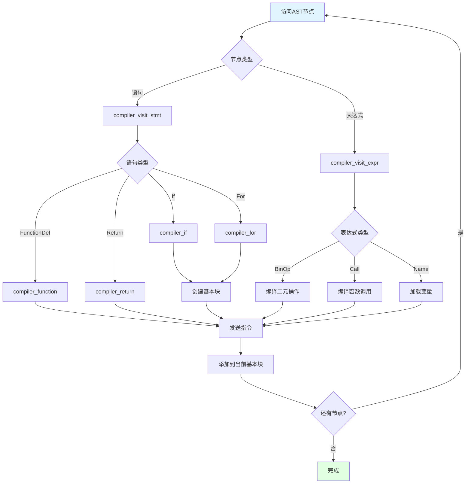

### 14.5 CFG优化详解

**控制流图优化器**：

```c
// Python/flowgraph.c

static int optimize_cfg(cfg_builder *g, PyObject *consts, PyObject *const_cache)
{
    // 1. 标记可达块
    mark_reachable(g->g_entryblock);
    
    // 2. 消除死代码
    for (basicblock *b = g->g_block_list; b != NULL; b = b->b_list) {
        if (!b->b_seen) {
            // 未标记为可达，删除此块
            continue;
        }
        // 优化块内指令
        optimize_basic_block(b, consts, const_cache);
    }
    
    // 3. 合并连续块
    for (basicblock *b = g->g_block_list; b != NULL; b = b->b_list) {
        if (b->b_next && BB_NO_FALLTHROUGH(b)) {
            continue;
        }
        // 尝试合并
        if (can_merge_blocks(b, b->b_next)) {
            merge_blocks(b, b->b_next);
        }
    }
    
    // 4. 优化跳转
    for (basicblock *b = g->g_block_list; b != NULL; b = b->b_list) {
        optimize_jumps(b);
    }
    
    return 0;
}
```

**CFG优化技术**：

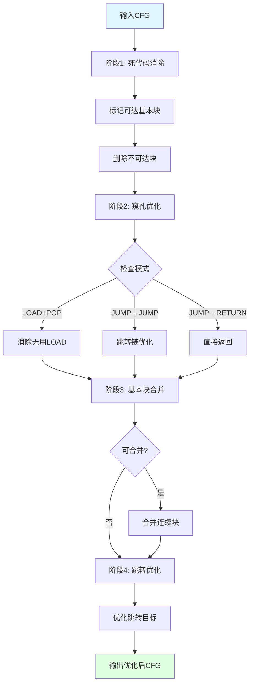

### 14.6 字节码汇编

**汇编器核心实现**：

```c
// Python/assemble.c

static PyCodeObject* assemble(struct compiler *c, int addNone)
{
    basicblock *b, *entryblock;
    struct assembler a;
    
    // 1. 初始化汇编器
    if (!assemble_init(&a, c->u->u_firstlineno))
        goto error;
    
    // 2. 计算栈深度
    if (compute_code_flags(c) < 0)
        goto error;
    
    // 3. 分配字节码偏移
    for (b = c->u->u_blocks; b != NULL; b = b->b_list) {
        b->b_offset = a.a_offset;
        for (int i = 0; i < b->b_iused; i++) {
            struct instr *instr = &b->b_instr[i];
            int arg = instr->i_oparg;
            
            // 计算指令大小
            int size = instrsize(instr->i_opcode, arg);
            a.a_offset += size;
        }
    }
    
    // 4. 解析跳转目标
    for (b = c->u->u_blocks; b != NULL; b = b->b_list) {
        for (int i = 0; i < b->b_iused; i++) {
            struct instr *instr = &b->b_instr[i];
            if (is_jump(instr)) {
                // 计算跳转偏移
                instr->i_oparg = instr->i_target->b_offset;
            }
        }
    }
    
    // 5. 生成字节码
    for (b = c->u->u_blocks; b != NULL; b = b->b_list) {
        for (int i = 0; i < b->b_iused; i++) {
            if (!assemble_emit(&a, &b->b_instr[i]))
                goto error;
        }
    }
    
    // 6. 创建PyCodeObject
    return makecode(c, &a, consts, maxdepth, nlocals, code_flags);
    
error:
    assemble_free(&a);
    return NULL;
}
```

**汇编流程图**：

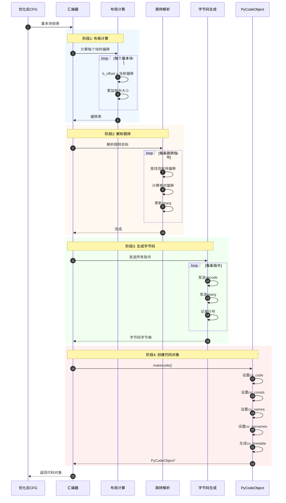

### 14.7 完整函数调用链

**从AST到PyCodeObject的完整路径**：

```
PyRun_FileExFlags
  └─> run_mod
        └─> PyAST_CompileObject
              └─> _PyAST_Compile
                    ├─> compiler_init
                    │     ├─> compiler_enter_scope
                    │     └─> compiler_unit_check
                    │
                    ├─> _PySymtable_Build
                    │     ├─> symtable_new
                    │     ├─> symtable_enter_block
                    │     ├─> symtable_visit_stmt (递归)
                    │     │     ├─> symtable_add_def
                    │     │     ├─> symtable_visit_expr
                    │     │     └─> symtable_visit_* (各种节点)
                    │     └─> symtable_analyze
                    │           └─> analyze_block (递归)
                    │
                    ├─> compiler_mod
                    │     └─> compiler_body
                    │           └─> compiler_visit_stmt (递归)
                    │                 ├─> compiler_function
                    │                 ├─> compiler_class
                    │                 ├─> compiler_if
                    │                 ├─> compiler_for
                    │                 ├─> compiler_while
                    │                 └─> compiler_visit_expr
                    │                       ├─> compiler_call
                    │                       ├─> compiler_compare
                    │                       └─> ADDOP (发送指令)
                    │
                    ├─> optimize_cfg
                    │     ├─> mark_reachable
                    │     ├─> optimize_basic_block
                    │     ├─> merge_blocks
                    │     └─> optimize_jumps
                    │
                    ├─> assemble
                    │     ├─> assemble_init
                    │     ├─> compute_code_flags
                    │     ├─> (分配偏移)
                    │     ├─> (解析跳转)
                    │     ├─> assemble_emit
                    │     └─> makecode
                    │           └─> PyCode_NewWithPosOnlyArgs
                    │
                    └─> compiler_free
```

